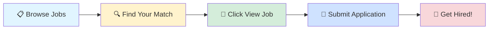

# 🚀 Tech Jobs Board

### Your Gateway to Amazing Career Opportunities

---

## 🎯 Browse by Job Profile

<table>
<tr>
<td align="center" width="25%">

 
<b>1000</b> total positions
</td>
<td align="center" width="25%">

 
<b>1000</b> total positions
</td>
<td align="center" width="25%">

 
<b>1000</b> total positions
</td>
<td align="center" width="25%">

 
<b>1000</b> total positions
</td>
</tr>
</table>

---

## 📊 Data Scientist

> 💼 **1000** positions available

<table>
<thead>
<tr>
<th width="20%">🏢 Company</th>
<th width="35%">💼 Role</th>
<th width="20%">📍 Location</th>
<th width="10%">⏰ Posted</th>
<th width="15%">🔗 Action</th>
</tr>
</thead>
<tbody>
<tr>
<td><a href="https://www.ambitionbox.com/overview/wells-fargo-overview">Wells Fargo</a></td>
<td>Lead Risk Analytics Consultant(VP) in WF Business credit risk team</td>
<td>📍 Bangalore</td>
<td>1d ago</td>
<td align="center"></td>
</tr>
<tr>
<td>Infinium Associates</td>
<td>Head - Data Science</td>
<td>📍 Gurugram</td>
<td>1d ago</td>
<td align="center"></td>
</tr>
<tr>
<td><a href="https://www.ambitionbox.com/overview/zeiss-india-overview">ZEISS</a></td>
<td>Senior Software Engineer Python & C#</td>
<td>📍 Bangalore</td>
<td>1d ago</td>
<td align="center"></td>
</tr>
<tr>
<td><a href="https://www.ambitionbox.com/overview/wissen-infotech-overview">Wissen Infotech</a></td>
<td>AI/ML Engineer</td>
<td>📍 Bangalore</td>
<td>1d ago</td>
<td align="center"></td>
</tr>
<tr>
<td><a href="https://www.ambitionbox.com/overview/crosslynx-technologies-services-overview">Crosslynx Technologies Services</a></td>
<td>Azure Cloud Infrastructure Engineer</td>
<td>📍 Noida</td>
<td>1d ago</td>
<td align="center"></td>
</tr>
<tr>
<td><a href="https://www.ambitionbox.com/overview/conde-nast-india-overview">Conde Nast India</a></td>
<td>Machine Learning Engineer II</td>
<td>📍 Bangalore</td>
<td>1d ago</td>
<td align="center"></td>
</tr>
<tr>
<td>Anlage Infotech</td>
<td>Machine Learning Engineer</td>
<td>📍 Bangalore</td>
<td>1d ago</td>
<td align="center"></td>
</tr>
<tr>
<td><a href="https://www.ambitionbox.com/overview/ibs-software-services-overview">IBS Software Services</a></td>
<td>Automation Tester</td>
<td>📍 Chennai</td>
<td>1d ago</td>
<td align="center"></td>
</tr>
<tr>
<td><a href="https://www.ambitionbox.com/overview/miracle-corporate-solutions-overview">Miracle Corporate Solutions</a></td>
<td>Req - Artificial Intelligence Architect (Python Expert) | WFH</td>
<td></td>
<td>1d ago</td>
<td align="center"></td>
</tr>
<tr>
<td><a href="https://www.ambitionbox.com/overview/ibs-software-services-overview">IBS Software Services</a></td>
<td>Quality Analyst -Automation</td>
<td>📍 Thiruvananthapuram</td>
<td>1d ago</td>
<td align="center"></td>
</tr>
<tr>
<td><a href="https://www.ambitionbox.com/overview/national-australia-bank-overview">National Australia Bank (NAB)</a></td>
<td>Ansible Automation Engineer</td>
<td>📍 Gurugram</td>
<td>1d ago</td>
<td align="center"></td>
</tr>
<tr>
<td><a href="https://www.ambitionbox.com/overview/two95-international-overview">Two95 International Inc.</a></td>
<td>Senior Statistician (SAS & R)</td>
<td>📍 Pune, Bangalore</td>
<td>1d ago</td>
<td align="center"></td>
</tr>
<tr>
<td><a href="https://www.ambitionbox.com/overview/koenig-solutions-overview">Koenig Solutions</a></td>
<td>KS 350 - Delivery Manager - Azure</td>
<td>📍 Gurugram</td>
<td>1d ago</td>
<td align="center"></td>
</tr>
<tr>
<td>Ranchhill Software Solutions</td>
<td>Senior Python Developer with Large Language Models_</td>
<td>📍 Pune, Hyderabad, Bangalore</td>
<td>1d ago</td>
<td align="center"></td>
</tr>
<tr>
<td><a href="https://www.ambitionbox.com/overview/accion-labs-overview">Accion Labs</a></td>
<td>Python Developer with Django Immediate joiner!</td>
<td>📍 Bangalore</td>
<td>1d ago</td>
<td align="center"></td>
</tr>
<tr>
<td><a href="https://www.ambitionbox.com/overview/siemens-india-overview">Siemens</a></td>
<td>Senior Analytics Engineer</td>
<td>📍 Pune</td>
<td>1d ago</td>
<td align="center"></td>
</tr>
<tr>
<td>SP Staffing</td>
<td>Azure Data Engineer</td>
<td>📍 Bangalore</td>
<td>1d ago</td>
<td align="center"></td>
</tr>
<tr>
<td><a href="https://www.ambitionbox.com/overview/appexert-labs-overview">Appexert Labs</a></td>
<td>Senior QA Automation Engineer</td>
<td></td>
<td>1d ago</td>
<td align="center"></td>
</tr>
<tr>
<td>Codefeast</td>
<td>Python Backend Developer</td>
<td></td>
<td>1d ago</td>
<td align="center"></td>
</tr>
<tr>
<td><a href="https://www.ambitionbox.com/overview/zs-overview">ZS</a></td>
<td>Advanced Data Science Consultant</td>
<td>📍 Gurugram, Pune, Bangalore</td>
<td>1d ago</td>
<td align="center"></td>
</tr>
<tr>
<td><a href="https://www.ambitionbox.com/overview/wissen-technology-overview">Wissen Technology</a></td>
<td>Python Software Developer</td>
<td>📍 Mumbai</td>
<td>1d ago</td>
<td align="center"></td>
</tr>
<tr>
<td><a href="https://www.ambitionbox.com/overview/ford-india-overview">Ford</a></td>
<td>Finance & Insurance Analytics - Director</td>
<td>📍 Chennai</td>
<td>1d ago</td>
<td align="center"></td>
</tr>
<tr>
<td><a href="https://www.ambitionbox.com/overview/larsen-and-toubro-limited-overview">Larsen & Toubro (L&T)</a></td>
<td>Java Automation</td>
<td>📍 Bangalore</td>
<td>1d ago</td>
<td align="center"></td>
</tr>
<tr>
<td>Think People Solutions</td>
<td>TOP MNC Looking For Java/Spring Boot/Python/GCP/PowerShell/Hibernate</td>
<td>📍 Pune</td>
<td>1d ago</td>
<td align="center"></td>
</tr>
<tr>
<td><a href="https://www.ambitionbox.com/overview/epam-systems-overview">Epam Systems</a></td>
<td>Lead Software Engineer - Java, AWS</td>
<td>📍 Pune, Hyderabad, Bangalore</td>
<td>1d ago</td>
<td align="center"></td>
</tr>
<tr>
<td><a href="https://www.ambitionbox.com/overview/epam-systems-overview">Epam Systems</a></td>
<td>Lead Software Engineer - Python, GenAI, LLM</td>
<td>📍 Gurugram, Chennai, Bangalore</td>
<td>1d ago</td>
<td align="center"></td>
</tr>
<tr>
<td>Namma Oota</td>
<td>MBA Operations & Business Analytics Intern</td>
<td>📍 Bangalore</td>
<td>1d ago</td>
<td align="center"></td>
</tr>
<tr>
<td><a href="https://www.ambitionbox.com/overview/netnautix-technologies-overview">Netnautix Technologies</a></td>
<td>Senior AWS DevOps Engineer</td>
<td>📍 Pune</td>
<td>1d ago</td>
<td align="center"></td>
</tr>
<tr>
<td><a href="https://www.ambitionbox.com/overview/surya-technology-network-and-data-management-technologies-pvt-ltd-overview">Surya Data Management And Network Technologies</a></td>
<td>Network Automation Developer</td>
<td>📍 Bangalore</td>
<td>1d ago</td>
<td align="center"></td>
</tr>
<tr>
<td><a href="https://www.ambitionbox.com/overview/nabkisan-finance-overview">Nabkisan Finance</a></td>
<td>Sr. Manager- Data Analytics</td>
<td>📍 Mumbai</td>
<td>1d ago</td>
<td align="center"></td>
</tr>
<tr>
<td><a href="https://www.ambitionbox.com/overview/qentelli-overview">Qentelli</a></td>
<td>Qa Automation Testing Engineer</td>
<td>📍 Hyderabad</td>
<td>1d ago</td>
<td align="center"></td>
</tr>
<tr>
<td>Serendipity Corporate Services</td>
<td>Azure DevOps Engineer</td>
<td>📍 Mumbai</td>
<td>1d ago</td>
<td align="center"></td>
</tr>
<tr>
<td><a href="https://www.ambitionbox.com/overview/hanker-systems-overview">Hanker Systems (india)</a></td>
<td>Sr Software Engineer (Python+React.js)</td>
<td>📍 Gurugram, Noida, Hyderabad</td>
<td>1d ago</td>
<td align="center"></td>
</tr>
<tr>
<td><a href="https://www.ambitionbox.com/overview/tv-sd-overview">TUV SUD South Asia</a></td>
<td>Python Software Developer</td>
<td>📍 Pune</td>
<td>1d ago</td>
<td align="center"></td>
</tr>
<tr>
<td><a href="https://www.ambitionbox.com/overview/tcs-overview">Tata Consultancy Services</a></td>
<td>AWS- Full Stack Developer-Spring boot, Java Web Services, Vue.js</td>
<td>📍 Pune</td>
<td>1d ago</td>
<td align="center"></td>
</tr>
<tr>
<td><a href="https://www.ambitionbox.com/overview/datametica-overview">Datametica</a></td>
<td>Onix DataMetica is Hiring GCP Technical Lead....!</td>
<td>📍 Pune</td>
<td>1d ago</td>
<td align="center"></td>
</tr>
<tr>
<td><a href="https://www.ambitionbox.com/overview/axis-direct-overview">AXIS DIRECT</a></td>
<td>Security Incident Monitoring</td>
<td>📍 Navi Mumbai</td>
<td>1d ago</td>
<td align="center"></td>
</tr>
<tr>
<td><a href="https://www.ambitionbox.com/overview/tcs-overview">Tata Consultancy Services</a></td>
<td>Python Developer</td>
<td>📍 Hyderabad, Chennai</td>
<td>1d ago</td>
<td align="center"></td>
</tr>
<tr>
<td>Serendipity Corporate Services</td>
<td>Azure DevOps Engineer</td>
<td>📍 Mumbai</td>
<td>1d ago</td>
<td align="center"></td>
</tr>
<tr>
<td><a href="https://www.ambitionbox.com/overview/tcs-overview">Tata Consultancy Services</a></td>
<td>Databricks Python -WALK-IN Drive in Bangalore</td>
<td>📍 Bangalore</td>
<td>1d ago</td>
<td align="center"></td>
</tr>
<tr>
<td>Naukri E Hire Campaign</td>
<td>GCP Data Engineer</td>
<td>📍 Chennai</td>
<td>1d ago</td>
<td align="center"></td>
</tr>
<tr>
<td>Srivango</td>
<td>TS - Python Automation</td>
<td>📍 Chennai, Hyderabad, Bangalore</td>
<td>1d ago</td>
<td align="center"></td>
</tr>
<tr>
<td><a href="https://www.ambitionbox.com/overview/epam-systems-overview">Epam Systems</a></td>
<td>Senior Software Automation Test Engineer</td>
<td>📍 Bangalore</td>
<td>1d ago</td>
<td align="center"></td>
</tr>
<tr>
<td><a href="https://www.ambitionbox.com/overview/cognizant-overview">Cognizant</a></td>
<td>Python Automation Engineer</td>
<td>📍 Chennai</td>
<td>1d ago</td>
<td align="center"></td>
</tr>
<tr>
<td>Srivango</td>
<td>TS- Python Developer</td>
<td>📍 Pune, Hyderabad, Bangalore</td>
<td>1d ago</td>
<td align="center"></td>
</tr>
<tr>
<td>Srivango</td>
<td>TS - SQL Python Developer</td>
<td>📍 Pune, Hyderabad, Bangalore</td>
<td>1d ago</td>
<td align="center"></td>
</tr>
<tr>
<td><a href="https://www.ambitionbox.com/overview/infosys-overview">Infosys</a></td>
<td>Automation Test Engineer- Selenium-ch</td>
<td>📍 Mumbai, Pune, Delhi</td>
<td>1d ago</td>
<td align="center"></td>
</tr>
<tr>
<td><a href="https://www.ambitionbox.com/overview/infosys-overview">Infosys</a></td>
<td>Automation Test Engineer- Selenium-CH</td>
<td>📍 Chennai, Hyderabad, Bangalore</td>
<td>1d ago</td>
<td align="center"></td>
</tr>
<tr>
<td>Attarix Talent Solutions Mumbai</td>
<td>Fullstack Python Developer</td>
<td>📍 Thane, Mumbai</td>
<td>1d ago</td>
<td align="center"></td>
</tr>
<tr>
<td><a href="https://www.ambitionbox.com/overview/tcs-overview">Tata Consultancy Services</a></td>
<td>GenAI Engineer + AI ML</td>
<td>📍 Bangalore</td>
<td>1d ago</td>
<td align="center"></td>
</tr>
<tr>
<td>Ascend Hr Solutions</td>
<td>Opening For Oracle DBA with AWS</td>
<td>📍 Mumbai, Pune</td>
<td>1d ago</td>
<td align="center"></td>
</tr>
<tr>
<td><a href="https://www.ambitionbox.com/overview/motivitylabs-overview">Motivity Labs</a></td>
<td>Immediate Hiring Data Architect (Azure ,GCP or AWS)</td>
<td>📍 Hyderabad</td>
<td>1d ago</td>
<td align="center"></td>
</tr>
<tr>
<td><a href="https://www.ambitionbox.com/overview/protiviti-india-member-overview">Protiviti India</a></td>
<td>Artificial Intelligence Developer</td>
<td>📍 Mumbai, Coimbatore, Bangalore</td>
<td>1d ago</td>
<td align="center"></td>
</tr>
<tr>
<td><a href="https://www.ambitionbox.com/overview/trangile-services-overview">Trangile Services</a></td>
<td>Oracle PL SQL Developer</td>
<td>📍 Noida</td>
<td>1d ago</td>
<td align="center"></td>
</tr>
<tr>
<td><a href="https://www.ambitionbox.com/overview/tcs-overview">Tata Consultancy Services</a></td>
<td>Aws Data Engineer</td>
<td>📍 Pune</td>
<td>1d ago</td>
<td align="center"></td>
</tr>
<tr>
<td><a href="https://www.ambitionbox.com/overview/naukri-overview">Naukri E-hire</a></td>
<td>Tableau Developer</td>
<td>📍 Chennai</td>
<td>1d ago</td>
<td align="center"></td>
</tr>
<tr>
<td><a href="https://www.ambitionbox.com/overview/accion-labs-overview">Accion Labs</a></td>
<td>Postgres SQL Developer</td>
<td>📍 Mumbai, Pune, Bangalore</td>
<td>1d ago</td>
<td align="center"></td>
</tr>
<tr>
<td><a href="https://www.ambitionbox.com/overview/se2-digital-service-llp-overview">SE2</a></td>
<td>Infrastructure Engineer I - AWS Support Engineer</td>
<td>📍 Noida</td>
<td>1d ago</td>
<td align="center"></td>
</tr>
<tr>
<td>Updraft</td>
<td>Analytics Engineer</td>
<td>📍 Bangalore</td>
<td>1d ago</td>
<td align="center"></td>
</tr>
<tr>
<td><a href="https://www.ambitionbox.com/overview/the-tjx-companies-overview">The TJX Companies Inc</a></td>
<td>Senior Engineer RPA & Low Code/No-Code Automation</td>
<td>📍 Hyderabad</td>
<td>1d ago</td>
<td align="center"></td>
</tr>
<tr>
<td><a href="https://www.ambitionbox.com/overview/franklin-templeton-investments-overview">Franklin templeton asset management (india)pvt</a></td>
<td>Lead Software Engineer (C#, SQL, Blazor, Azure)</td>
<td>📍 Hyderabad</td>
<td>1d ago</td>
<td align="center"></td>
</tr>
<tr>
<td>Nasuni Com</td>
<td>Machine Learning Engineer - Cloud Services</td>
<td>📍 Hyderabad</td>
<td>1d ago</td>
<td align="center"></td>
</tr>
<tr>
<td><a href="https://www.ambitionbox.com/overview/lowes-overview">Lowes Services India Private limited</a></td>
<td>Lead Analyst, Merch Ops Analytics</td>
<td>📍 Bangalore</td>
<td>1d ago</td>
<td align="center"></td>
</tr>
<tr>
<td><a href="https://www.ambitionbox.com/overview/neal-analytics-overview">Neal Analytics</a></td>
<td>AWS Data Architect</td>
<td>📍 Chennai, Noida, Mumbai, Pune, Gurugram, Bangalore</td>
<td>1d ago</td>
<td align="center"></td>
</tr>
<tr>
<td><a href="https://www.ambitionbox.com/overview/deepintent-overview">Deepintent</a></td>
<td>Senior Data Scientist</td>
<td>📍 Pune</td>
<td>1d ago</td>
<td align="center"></td>
</tr>
<tr>
<td><a href="https://www.ambitionbox.com/overview/empower-overview">Empower</a></td>
<td>Engineer Automation Quality</td>
<td>📍 Bangalore</td>
<td>1d ago</td>
<td align="center"></td>
</tr>
<tr>
<td><a href="https://www.ambitionbox.com/overview/celonis-overview">Celonis</a></td>
<td>Product Data Scientist</td>
<td>📍 Bangalore</td>
<td>1d ago</td>
<td align="center"></td>
</tr>
<tr>
<td><a href="https://www.ambitionbox.com/overview/at-and-t-overview">ATT Communication Services</a></td>
<td>Cloud (AWS) Infrastructure Architect</td>
<td>📍 Hyderabad</td>
<td>1d ago</td>
<td align="center"></td>
</tr>
<tr>
<td><a href="https://www.ambitionbox.com/overview/athena-infonomics-overview">Athena Infonomics</a></td>
<td>Data Scientist</td>
<td>📍 Delhi</td>
<td>1d ago</td>
<td align="center"></td>
</tr>
<tr>
<td><a href="https://www.ambitionbox.com/overview/at-and-t-overview">ATT Communication Services</a></td>
<td>Specialist, System Engineering - AWS Infrastructure Engineer</td>
<td>📍 Hyderabad</td>
<td>1d ago</td>
<td align="center"></td>
</tr>
<tr>
<td><a href="https://www.ambitionbox.com/overview/at-and-t-overview">ATT Communication Services</a></td>
<td>Sr Specialist, System Engineering - AWS Infrastructure Engineer</td>
<td>📍 Hyderabad</td>
<td>1d ago</td>
<td align="center"></td>
</tr>
<tr>
<td><a href="https://www.ambitionbox.com/overview/at-and-t-overview">ATT Communication Services</a></td>
<td>Lead Cybersecurity - Identity Analytics Engineer</td>
<td>📍 Hyderabad</td>
<td>1d ago</td>
<td align="center"></td>
</tr>
<tr>
<td><a href="https://www.ambitionbox.com/overview/quest-global-overview">Quest Global</a></td>
<td>Technical Architect - AWS Cloud</td>
<td>📍 India, Thiruvananthapuram</td>
<td>1d ago</td>
<td align="center"></td>
</tr>
<tr>
<td><a href="https://www.ambitionbox.com/overview/aci-logistics-overview">ACI Logistics</a></td>
<td>Sr Software Engineer full stack Angular/React JS, .NET, C#, PHP,Azure</td>
<td>📍 Bangalore</td>
<td>1d ago</td>
<td align="center"></td>
</tr>
<tr>
<td><a href="https://www.ambitionbox.com/overview/zensar-technologies-overview">Zensar</a></td>
<td>AES - DE - DevOps - Azure DevOps Professional</td>
<td>📍 Pune</td>
<td>1d ago</td>
<td align="center"></td>
</tr>
<tr>
<td><a href="https://www.ambitionbox.com/overview/amazon-overview">Amazon</a></td>
<td>Area Security Manager, AWS DC Security</td>
<td>📍 Mumbai</td>
<td>1d ago</td>
<td align="center"></td>
</tr>
<tr>
<td><a href="https://www.ambitionbox.com/overview/amazon-overview">Amazon</a></td>
<td>Enterprise Account Manager, AWS Industries</td>
<td>📍 Bangalore</td>
<td>1d ago</td>
<td align="center"></td>
</tr>
<tr>
<td><a href="https://www.ambitionbox.com/overview/agilisium-overview">Agilisium</a></td>
<td>Aws Data Engineer</td>
<td>📍 Chennai, Hyderabad, Pune</td>
<td>1d ago</td>
<td align="center"></td>
</tr>
<tr>
<td><a href="https://www.ambitionbox.com/overview/pwc-overview">PwC India</a></td>
<td>Traditional AI/ML Developer</td>
<td>📍 Mumbai, Bangalore, Delhi</td>
<td>1d ago</td>
<td align="center"></td>
</tr>
<tr>
<td><a href="https://www.ambitionbox.com/overview/pwc-overview">PwC India</a></td>
<td>GCP Architect</td>
<td>📍 Mumbai</td>
<td>1d ago</td>
<td align="center"></td>
</tr>
<tr>
<td><a href="https://www.ambitionbox.com/overview/pwc-overview">PwC India</a></td>
<td>Azure Architect</td>
<td>📍 Mumbai</td>
<td>1d ago</td>
<td align="center"></td>
</tr>
<tr>
<td>Enthrive Techworld Solutions</td>
<td>Azure Data Engineer</td>
<td>📍 Bangalore</td>
<td>1d ago</td>
<td align="center"></td>
</tr>
<tr>
<td><a href="https://www.ambitionbox.com/overview/indigo-overview">IndiGo</a></td>
<td>Senior Executive - Analytics</td>
<td>📍 Gurugram</td>
<td>1d ago</td>
<td align="center"></td>
</tr>
<tr>
<td><a href="https://www.ambitionbox.com/overview/lumen-technologies-overview">Lumen Technologies</a></td>
<td>Ai Ml Engineer</td>
<td>📍 Bangalore</td>
<td>1d ago</td>
<td align="center"></td>
</tr>
<tr>
<td><a href="https://www.ambitionbox.com/overview/elastiq-overview">Elastiq</a></td>
<td>Python Fullstack Developer</td>
<td></td>
<td>1d ago</td>
<td align="center"></td>
</tr>
<tr>
<td><a href="https://www.ambitionbox.com/overview/quest-global-overview">Quest Global</a></td>
<td>Artificial Intelligence Architect</td>
<td>📍 Bangalore</td>
<td>1d ago</td>
<td align="center"></td>
</tr>
<tr>
<td>Spectrum Talent Management</td>
<td>Senior Python Developer</td>
<td>📍 Bangalore</td>
<td>1d ago</td>
<td align="center"></td>
</tr>
<tr>
<td><a href="https://www.ambitionbox.com/overview/quantiphi-analytics-solutions-overview">Quantiphi Analytics Solutions</a></td>
<td>Senior Machine Learning Engineer</td>
<td>📍 Mumbai, Bangalore</td>
<td>1d ago</td>
<td align="center"></td>
</tr>
<tr>
<td><a href="https://www.ambitionbox.com/overview/ltimindtree-overview">Ltimindtree</a></td>
<td>Technical Project Manager (.net+ Azure)</td>
<td>📍 Hyderabad</td>
<td>1d ago</td>
<td align="center"></td>
</tr>
<tr>
<td>Inseego India Pvt. Ltd</td>
<td>Software Development Test Engineer(Automation)</td>
<td>📍 Bangalore</td>
<td>1d ago</td>
<td align="center"></td>
</tr>
<tr>
<td><a href="https://www.ambitionbox.com/overview/tarento-technologies-overview">Tarento Technologies</a></td>
<td>AI ML Lead</td>
<td>📍 Delhi</td>
<td>1d ago</td>
<td align="center"></td>
</tr>
<tr>
<td><a href="https://www.ambitionbox.com/overview/equifax-overview">Equifax</a></td>
<td>Quality Automation Engineer (SDET) - Entry</td>
<td>📍 Kazhakkoottam</td>
<td>1d ago</td>
<td align="center"></td>
</tr>
<tr>
<td><a href="https://www.ambitionbox.com/overview/petals-world-school-overview">Petals World School</a></td>
<td>Fullstack Python Developer</td>
<td>📍 Delhi, Noida</td>
<td>1d ago</td>
<td align="center"></td>
</tr>
<tr>
<td><a href="https://www.ambitionbox.com/overview/tekwissen-overview">TekWissen</a></td>
<td>Machine Learning Engineering Engineer II</td>
<td>📍 Chennai</td>
<td>1d ago</td>
<td align="center"></td>
</tr>
<tr>
<td><a href="https://www.ambitionbox.com/overview/priority-idc-overview">Priority Idc</a></td>
<td>AWS Infrastructure Developer</td>
<td></td>
<td>1d ago</td>
<td align="center"></td>
</tr>
<tr>
<td><a href="https://www.ambitionbox.com/overview/zensar-technologies-overview">Zensar</a></td>
<td>Automation Test Engineer</td>
<td>📍 Pune</td>
<td>1d ago</td>
<td align="center"></td>
</tr>
<tr>
<td><a href="https://www.ambitionbox.com/overview/synsoft-global-overview">Synsoft Global</a></td>
<td>Senior AI/ML Lead</td>
<td>📍 Indore</td>
<td>1d ago</td>
<td align="center"></td>
</tr>
<tr>
<td><a href="https://www.ambitionbox.com/overview/kipi-dot-bi-overview">kipi.bi</a></td>
<td>Lead Engineer-QA- Data Scientist</td>
<td></td>
<td>1d ago</td>
<td align="center"></td>
</tr>
<tr>
<td><a href="https://www.ambitionbox.com/overview/hanker-systems-overview">Hanker Systems (india)</a></td>
<td>Data Scientist</td>
<td>📍 Hyderabad</td>
<td>1d ago</td>
<td align="center"></td>
</tr>
<tr>
<td>Harita Techserv</td>
<td>Senior Full Stack Engineer (Python -Fullstack)</td>
<td>📍 Chennai</td>
<td>1d ago</td>
<td align="center"></td>
</tr>
<tr><td colspan="5" align="center"><i>... and 900 more positions</i></td></tr>
</tbody>
</table>

---

## 💼 Business Analyst

> 💼 **1000** positions available

<table>
<thead>
<tr>
<th width="20%">🏢 Company</th>
<th width="35%">💼 Role</th>
<th width="20%">📍 Location</th>
<th width="10%">⏰ Posted</th>
<th width="15%">🔗 Action</th>
</tr>
</thead>
<tbody>
<tr>
<td><a href="https://www.ambitionbox.com/overview/wells-fargo-overview">Wells Fargo</a></td>
<td>Lead Risk Analytics Consultant(VP) in WF Business credit risk team</td>
<td>📍 Bangalore</td>
<td>1d ago</td>
<td align="center"></td>
</tr>
<tr>
<td><a href="https://www.ambitionbox.com/overview/zeiss-india-overview">ZEISS</a></td>
<td>Senior Software Engineer Python & C#</td>
<td>📍 Bangalore</td>
<td>1d ago</td>
<td align="center"></td>
</tr>
<tr>
<td>Anlage Infotech</td>
<td>Murex Business Analyst</td>
<td>📍 Pune, Hyderabad, Bangalore</td>
<td>1d ago</td>
<td align="center"></td>
</tr>
<tr>
<td><a href="https://www.ambitionbox.com/overview/ibs-software-services-overview">IBS Software Services</a></td>
<td>Automation Tester</td>
<td>📍 Chennai</td>
<td>1d ago</td>
<td align="center"></td>
</tr>
<tr>
<td><a href="https://www.ambitionbox.com/overview/miracle-corporate-solutions-overview">Miracle Corporate Solutions</a></td>
<td>Req - Artificial Intelligence Architect (Python Expert) | WFH</td>
<td></td>
<td>1d ago</td>
<td align="center"></td>
</tr>
<tr>
<td><a href="https://www.ambitionbox.com/overview/ibs-software-services-overview">IBS Software Services</a></td>
<td>Quality Analyst -Automation</td>
<td>📍 Thiruvananthapuram</td>
<td>1d ago</td>
<td align="center"></td>
</tr>
<tr>
<td><a href="https://www.ambitionbox.com/overview/exl-service-overview">EXL</a></td>
<td>Business Analyst</td>
<td>📍 Gurugram</td>
<td>1d ago</td>
<td align="center"></td>
</tr>
<tr>
<td><a href="https://www.ambitionbox.com/overview/national-australia-bank-overview">National Australia Bank (NAB)</a></td>
<td>Ansible Automation Engineer</td>
<td>📍 Gurugram</td>
<td>1d ago</td>
<td align="center"></td>
</tr>
<tr>
<td>Ranchhill Software Solutions</td>
<td>Senior Python Developer with Large Language Models_</td>
<td>📍 Pune, Hyderabad, Bangalore</td>
<td>1d ago</td>
<td align="center"></td>
</tr>
<tr>
<td><a href="https://www.ambitionbox.com/overview/innovative-infra-and-mining-solutions-overview">Innovative Infra & Mining Solutions</a></td>
<td>Business Analyst To Chief Executive Officer</td>
<td>📍 Hyderabad</td>
<td>1d ago</td>
<td align="center"></td>
</tr>
<tr>
<td><a href="https://www.ambitionbox.com/overview/accion-labs-overview">Accion Labs</a></td>
<td>Python Developer with Django Immediate joiner!</td>
<td>📍 Bangalore</td>
<td>1d ago</td>
<td align="center"></td>
</tr>
<tr>
<td><a href="https://www.ambitionbox.com/overview/siemens-india-overview">Siemens</a></td>
<td>Senior Analytics Engineer</td>
<td>📍 Pune</td>
<td>1d ago</td>
<td align="center"></td>
</tr>
<tr>
<td><a href="https://www.ambitionbox.com/overview/appexert-labs-overview">Appexert Labs</a></td>
<td>Senior QA Automation Engineer</td>
<td></td>
<td>1d ago</td>
<td align="center"></td>
</tr>
<tr>
<td><a href="https://www.ambitionbox.com/overview/pwc-overview">PwC India</a></td>
<td>Salesforce DevOps - 5 To 7 years || Pan India</td>
<td>📍 Pune, Bangalore</td>
<td>1d ago</td>
<td align="center"></td>
</tr>
<tr>
<td>Vidysea Education Noida</td>
<td>Business Analyst</td>
<td>📍 Noida</td>
<td>1d ago</td>
<td align="center"></td>
</tr>
<tr>
<td><a href="https://www.ambitionbox.com/overview/infocareer-overview">Infocareer</a></td>
<td>Salesforce Architect</td>
<td>📍 Chennai, Hyderabad, Mumbai</td>
<td>1d ago</td>
<td align="center"></td>
</tr>
<tr>
<td>Codefeast</td>
<td>Python Backend Developer</td>
<td></td>
<td>1d ago</td>
<td align="center"></td>
</tr>
<tr>
<td><a href="https://www.ambitionbox.com/overview/wipro-overview">Wipro</a></td>
<td>Business Process Analyst</td>
<td>📍 Singapore</td>
<td>1d ago</td>
<td align="center"></td>
</tr>
<tr>
<td><a href="https://www.ambitionbox.com/overview/wissen-technology-overview">Wissen Technology</a></td>
<td>Python Software Developer</td>
<td>📍 Mumbai</td>
<td>1d ago</td>
<td align="center"></td>
</tr>
<tr>
<td><a href="https://www.ambitionbox.com/overview/ford-india-overview">Ford</a></td>
<td>Finance & Insurance Analytics - Director</td>
<td>📍 Chennai</td>
<td>1d ago</td>
<td align="center"></td>
</tr>
<tr>
<td><a href="https://www.ambitionbox.com/overview/larsen-and-toubro-limited-overview">Larsen & Toubro (L&T)</a></td>
<td>Java Automation</td>
<td>📍 Bangalore</td>
<td>1d ago</td>
<td align="center"></td>
</tr>
<tr>
<td>Think People Solutions</td>
<td>TOP MNC Looking For Java/Spring Boot/Python/GCP/PowerShell/Hibernate</td>
<td>📍 Pune</td>
<td>1d ago</td>
<td align="center"></td>
</tr>
<tr>
<td><a href="https://www.ambitionbox.com/overview/epam-systems-overview">Epam Systems</a></td>
<td>Lead Software Engineer - Python, GenAI, LLM</td>
<td>📍 Gurugram, Chennai, Bangalore</td>
<td>1d ago</td>
<td align="center"></td>
</tr>
<tr>
<td>Namma Oota</td>
<td>MBA Operations & Business Analytics Intern</td>
<td>📍 Bangalore</td>
<td>1d ago</td>
<td align="center"></td>
</tr>
<tr>
<td><a href="https://www.ambitionbox.com/overview/siemens-india-overview">Siemens</a></td>
<td>Salesforce Center of Excellence Data Analyst</td>
<td>📍 Pune</td>
<td>1d ago</td>
<td align="center"></td>
</tr>
<tr>
<td><a href="https://www.ambitionbox.com/overview/surya-technology-network-and-data-management-technologies-pvt-ltd-overview">Surya Data Management And Network Technologies</a></td>
<td>Network Automation Developer</td>
<td>📍 Bangalore</td>
<td>1d ago</td>
<td align="center"></td>
</tr>
<tr>
<td><a href="https://www.ambitionbox.com/overview/infocareer-overview">Infocareer</a></td>
<td>Salesforce Business Analyst</td>
<td>📍 Chennai, Gurugram, Mumbai</td>
<td>1d ago</td>
<td align="center"></td>
</tr>
<tr>
<td><a href="https://www.ambitionbox.com/overview/nabkisan-finance-overview">Nabkisan Finance</a></td>
<td>Sr. Manager- Data Analytics</td>
<td>📍 Mumbai</td>
<td>1d ago</td>
<td align="center"></td>
</tr>
<tr>
<td><a href="https://www.ambitionbox.com/overview/qentelli-overview">Qentelli</a></td>
<td>Qa Automation Testing Engineer</td>
<td>📍 Hyderabad</td>
<td>1d ago</td>
<td align="center"></td>
</tr>
<tr>
<td>Serendipity Corporate Services</td>
<td>Salesforce Project Manager</td>
<td>📍 Hyderabad</td>
<td>1d ago</td>
<td align="center"></td>
</tr>
<tr>
<td>Paramount HR</td>
<td>Business Consultant</td>
<td>📍 Mumbai</td>
<td>1d ago</td>
<td align="center"></td>
</tr>
<tr>
<td><a href="https://www.ambitionbox.com/overview/hanker-systems-overview">Hanker Systems (india)</a></td>
<td>Sr Software Engineer (Python+React.js)</td>
<td>📍 Gurugram, Noida, Hyderabad</td>
<td>1d ago</td>
<td align="center"></td>
</tr>
<tr>
<td><a href="https://www.ambitionbox.com/overview/tv-sd-overview">TUV SUD South Asia</a></td>
<td>Python Software Developer</td>
<td>📍 Pune</td>
<td>1d ago</td>
<td align="center"></td>
</tr>
<tr>
<td><a href="https://www.ambitionbox.com/overview/tcs-overview">Tata Consultancy Services</a></td>
<td>Python Developer</td>
<td>📍 Hyderabad, Chennai</td>
<td>1d ago</td>
<td align="center"></td>
</tr>
<tr>
<td><a href="https://www.ambitionbox.com/overview/gainwell-technologies-overview">Gainwell Technologies</a></td>
<td>Senior Professional Business Analyst</td>
<td></td>
<td>1d ago</td>
<td align="center"></td>
</tr>
<tr>
<td>Serendipity Corporate Services</td>
<td>Salesforce Project Manager</td>
<td>📍 Hyderabad</td>
<td>1d ago</td>
<td align="center"></td>
</tr>
<tr>
<td><a href="https://www.ambitionbox.com/overview/tcs-overview">Tata Consultancy Services</a></td>
<td>Databricks Python -WALK-IN Drive in Bangalore</td>
<td>📍 Bangalore</td>
<td>1d ago</td>
<td align="center"></td>
</tr>
<tr>
<td>Tekframeworks Consulting</td>
<td>Business Analyst</td>
<td>📍 Hyderabad</td>
<td>1d ago</td>
<td align="center"></td>
</tr>
<tr>
<td>Srivango</td>
<td>TS - Python Automation</td>
<td>📍 Chennai, Hyderabad, Bangalore</td>
<td>1d ago</td>
<td align="center"></td>
</tr>
<tr>
<td><a href="https://www.ambitionbox.com/overview/epam-systems-overview">Epam Systems</a></td>
<td>Senior Software Automation Test Engineer</td>
<td>📍 Bangalore</td>
<td>1d ago</td>
<td align="center"></td>
</tr>
<tr>
<td><a href="https://www.ambitionbox.com/overview/capgemini-overview">Capgemini</a></td>
<td>Hiring For Sr. Salesforce Development Role For Bangalore Location</td>
<td>📍 Bangalore</td>
<td>1d ago</td>
<td align="center"></td>
</tr>
<tr>
<td><a href="https://www.ambitionbox.com/overview/cognizant-overview">Cognizant</a></td>
<td>Python Automation Engineer</td>
<td>📍 Chennai</td>
<td>1d ago</td>
<td align="center"></td>
</tr>
<tr>
<td><a href="https://www.ambitionbox.com/overview/tech-mahindra-overview">Tech Mahindra</a></td>
<td>Business Analyst - Money Market</td>
<td>📍 Hyderabad</td>
<td>1d ago</td>
<td align="center"></td>
</tr>
<tr>
<td>Srivango</td>
<td>TS- Python Developer</td>
<td>📍 Pune, Hyderabad, Bangalore</td>
<td>1d ago</td>
<td align="center"></td>
</tr>
<tr>
<td>Lufthansa Technik AG</td>
<td>Power Bi Developer</td>
<td>📍 Bangalore</td>
<td>1d ago</td>
<td align="center"></td>
</tr>
<tr>
<td>Srivango</td>
<td>TS - SQL Python Developer</td>
<td>📍 Pune, Hyderabad, Bangalore</td>
<td>1d ago</td>
<td align="center"></td>
</tr>
<tr>
<td><a href="https://www.ambitionbox.com/overview/infosys-overview">Infosys</a></td>
<td>Automation Test Engineer- Selenium-ch</td>
<td>📍 Mumbai, Pune, Delhi</td>
<td>1d ago</td>
<td align="center"></td>
</tr>
<tr>
<td><a href="https://www.ambitionbox.com/overview/infosys-overview">Infosys</a></td>
<td>Automation Test Engineer- Selenium-CH</td>
<td>📍 Chennai, Hyderabad, Bangalore</td>
<td>1d ago</td>
<td align="center"></td>
</tr>
<tr>
<td>Attarix Talent Solutions Mumbai</td>
<td>Fullstack Python Developer</td>
<td>📍 Thane, Mumbai</td>
<td>1d ago</td>
<td align="center"></td>
</tr>
<tr>
<td><a href="https://www.ambitionbox.com/overview/digitalcubez-overview">Digitalcbez</a></td>
<td>Business Analyst</td>
<td>📍 Mumbai</td>
<td>1d ago</td>
<td align="center"></td>
</tr>
<tr>
<td><a href="https://www.ambitionbox.com/overview/girikon-overview">Girikon Solutions</a></td>
<td>Salesforce Administrator</td>
<td>📍 Noida</td>
<td>1d ago</td>
<td align="center"></td>
</tr>
<tr>
<td><a href="https://www.ambitionbox.com/overview/kezan-consulting-overview">Kezan Consulting</a></td>
<td>Salesforce Delivery manager(CRM /Business Analyst)-Immediate Joiner</td>
<td>📍 Gurugram, Noida, Delhi</td>
<td>1d ago</td>
<td align="center"></td>
</tr>
<tr>
<td><a href="https://www.ambitionbox.com/overview/trangile-services-overview">Trangile Services</a></td>
<td>Oracle PL SQL Developer</td>
<td>📍 Noida</td>
<td>1d ago</td>
<td align="center"></td>
</tr>
<tr>
<td><a href="https://www.ambitionbox.com/overview/naukri-overview">Naukri E-hire</a></td>
<td>Tableau Developer</td>
<td>📍 Chennai</td>
<td>1d ago</td>
<td align="center"></td>
</tr>
<tr>
<td><a href="https://www.ambitionbox.com/overview/accion-labs-overview">Accion Labs</a></td>
<td>Postgres SQL Developer</td>
<td>📍 Mumbai, Pune, Bangalore</td>
<td>1d ago</td>
<td align="center"></td>
</tr>
<tr>
<td>Toolify</td>
<td>Technical Project Manager Salesforce</td>
<td>📍 Pune</td>
<td>1d ago</td>
<td align="center"></td>
</tr>
<tr>
<td><a href="https://www.ambitionbox.com/overview/wtw-global-delivery-and-solutions-overview">WTW Global Delivery And Solutions</a></td>
<td>Business Analyst</td>
<td>📍 Mumbai</td>
<td>1d ago</td>
<td align="center"></td>
</tr>
<tr>
<td><a href="https://www.ambitionbox.com/overview/gebbs-healthcare-solutions-overview">Gebbs Healthcare Solutions</a></td>
<td>Business Analyst - Power BI ( Developer)</td>
<td>📍 Navi Mumbai</td>
<td>1d ago</td>
<td align="center"></td>
</tr>
<tr>
<td>Updraft</td>
<td>Analytics Engineer</td>
<td>📍 Bangalore</td>
<td>1d ago</td>
<td align="center"></td>
</tr>
<tr>
<td><a href="https://www.ambitionbox.com/overview/the-tjx-companies-overview">The TJX Companies Inc</a></td>
<td>Senior Engineer RPA & Low Code/No-Code Automation</td>
<td>📍 Hyderabad</td>
<td>1d ago</td>
<td align="center"></td>
</tr>
<tr>
<td><a href="https://www.ambitionbox.com/overview/franklin-templeton-investments-overview">Franklin templeton asset management (india)pvt</a></td>
<td>Lead Software Engineer (C#, SQL, Blazor, Azure)</td>
<td>📍 Hyderabad</td>
<td>1d ago</td>
<td align="center"></td>
</tr>
<tr>
<td><a href="https://www.ambitionbox.com/overview/lowes-overview">Lowes Services India Private limited</a></td>
<td>Lead Analyst, Merch Ops Analytics</td>
<td>📍 Bangalore</td>
<td>1d ago</td>
<td align="center"></td>
</tr>
<tr>
<td><a href="https://www.ambitionbox.com/overview/heptarc-overview">Heptarc Talent Acquisition</a></td>
<td>Salesforce Developer</td>
<td>📍 Gurugram, Coimbatore</td>
<td>1d ago</td>
<td align="center"></td>
</tr>
<tr>
<td><a href="https://www.ambitionbox.com/overview/empower-overview">Empower</a></td>
<td>Engineer Automation Quality</td>
<td>📍 Bangalore</td>
<td>1d ago</td>
<td align="center"></td>
</tr>
<tr>
<td><a href="https://www.ambitionbox.com/overview/at-and-t-overview">ATT Communication Services</a></td>
<td>Lead Cybersecurity - Identity Analytics Engineer</td>
<td>📍 Hyderabad</td>
<td>1d ago</td>
<td align="center"></td>
</tr>
<tr>
<td><a href="https://www.ambitionbox.com/overview/trigyn-technologies-overview">Trigyn Technologies</a></td>
<td>Business Analyst</td>
<td>📍 Delhi</td>
<td>1d ago</td>
<td align="center"></td>
</tr>
<tr>
<td><a href="https://www.ambitionbox.com/overview/michelin-overview">Michelin</a></td>
<td>Digital Scrum Master</td>
<td>📍 Pune</td>
<td>1d ago</td>
<td align="center"></td>
</tr>
<tr>
<td>Kudos Webtech Pvt.ltd</td>
<td>Salesforce Developer</td>
<td>📍 Ahmedabad</td>
<td>1d ago</td>
<td align="center"></td>
</tr>
<tr>
<td><a href="https://www.ambitionbox.com/overview/indigo-overview">IndiGo</a></td>
<td>Senior Executive - Analytics</td>
<td>📍 Gurugram</td>
<td>1d ago</td>
<td align="center"></td>
</tr>
<tr>
<td>Logfix Scm Solutions</td>
<td>Business Analyst</td>
<td>📍 Bangalore</td>
<td>1d ago</td>
<td align="center"></td>
</tr>
<tr>
<td><a href="https://www.ambitionbox.com/overview/biophore-india-pharmaceuticals-overview">Biophore</a></td>
<td>Executive For Formulation Project Management -OSD</td>
<td>📍 Hyderabad</td>
<td>1d ago</td>
<td align="center"></td>
</tr>
<tr>
<td><a href="https://www.ambitionbox.com/overview/elastiq-overview">Elastiq</a></td>
<td>Python Fullstack Developer</td>
<td></td>
<td>1d ago</td>
<td align="center"></td>
</tr>
<tr>
<td>Spectrum Talent Management</td>
<td>Senior Python Developer</td>
<td>📍 Bangalore</td>
<td>1d ago</td>
<td align="center"></td>
</tr>
<tr>
<td>Inseego India Pvt. Ltd</td>
<td>Software Development Test Engineer(Automation)</td>
<td>📍 Bangalore</td>
<td>1d ago</td>
<td align="center"></td>
</tr>
<tr>
<td><a href="https://www.ambitionbox.com/overview/equifax-overview">Equifax</a></td>
<td>Quality Automation Engineer (SDET) - Entry</td>
<td>📍 Kazhakkoottam</td>
<td>1d ago</td>
<td align="center"></td>
</tr>
<tr>
<td><a href="https://www.ambitionbox.com/overview/petals-world-school-overview">Petals World School</a></td>
<td>Fullstack Python Developer</td>
<td>📍 Delhi, Noida</td>
<td>1d ago</td>
<td align="center"></td>
</tr>
<tr>
<td><a href="https://www.ambitionbox.com/overview/zensar-technologies-overview">Zensar</a></td>
<td>Automation Test Engineer</td>
<td>📍 Pune</td>
<td>1d ago</td>
<td align="center"></td>
</tr>
<tr>
<td><a href="https://www.ambitionbox.com/overview/tcs-overview">Tata Consultancy Services</a></td>
<td>Power Bi Developer</td>
<td>📍 Chennai</td>
<td>1d ago</td>
<td align="center"></td>
</tr>
<tr>
<td><a href="https://www.ambitionbox.com/overview/ltimindtree-overview">Ltimindtree</a></td>
<td>Salesforce Developer</td>
<td>📍 Pune, Bangalore, Delhi</td>
<td>1d ago</td>
<td align="center"></td>
</tr>
<tr>
<td>Serendipity Corporate Services</td>
<td>SFCC - Salesforce Commerce Cloud Professional</td>
<td>📍 Hyderabad</td>
<td>1d ago</td>
<td align="center"></td>
</tr>
<tr>
<td>Harita Techserv</td>
<td>Senior Full Stack Engineer (Python -Fullstack)</td>
<td>📍 Chennai</td>
<td>1d ago</td>
<td align="center"></td>
</tr>
<tr>
<td><a href="https://www.ambitionbox.com/overview/xoriant-overview">Xoriant</a></td>
<td>Python Developer Role With Maplelabs ( A Unit of Xoriant)</td>
<td>📍 Chennai, Bangalore</td>
<td>1d ago</td>
<td align="center"></td>
</tr>
<tr>
<td><a href="https://www.ambitionbox.com/overview/nutanix-overview">Nutanix</a></td>
<td>MTS4 / Senior Member of Technical Staff - QA Automation</td>
<td>📍 Bangalore</td>
<td>1d ago</td>
<td align="center"></td>
</tr>
<tr>
<td><a href="https://www.ambitionbox.com/overview/hitachi-vantara-overview">Hitachi Vantara</a></td>
<td>AI & Automation Specialist</td>
<td>📍 Hyderabad</td>
<td>1d ago</td>
<td align="center"></td>
</tr>
<tr>
<td><a href="https://www.ambitionbox.com/overview/epam-systems-overview">Epam Systems</a></td>
<td>Lead Software Engineer- Python</td>
<td>📍 Chennai, Hyderabad, Bangalore</td>
<td>1d ago</td>
<td align="center"></td>
</tr>
<tr>
<td>Isoftronics</td>
<td>Power Bi Tableau Developer , 3 To 6 years experience, immediate joiner</td>
<td>📍 Chennai</td>
<td>1d ago</td>
<td align="center"></td>
</tr>
<tr>
<td>Recruise India Consulting</td>
<td>Senior Quality Automation API - Contract Role - 1 Year</td>
<td>📍 Bangalore</td>
<td>1d ago</td>
<td align="center"></td>
</tr>
<tr>
<td><a href="https://www.ambitionbox.com/overview/ust-overview">UST</a></td>
<td>Lead I - Software Testing (Automation Test Engineer/ ACCELQ SME)</td>
<td>📍 Bangalore</td>
<td>1d ago</td>
<td align="center"></td>
</tr>
<tr>
<td><a href="https://www.ambitionbox.com/overview/pwc-overview">PwC Service Delivery Center</a></td>
<td>Power Bi Developer(Power BI+Alteryx)</td>
<td>📍 Hyderabad, Bangalore</td>
<td>1d ago</td>
<td align="center"></td>
</tr>
<tr>
<td>Innovaterx Tech India</td>
<td>Software Tester / QA Engineer (Manual + Basic Automation)</td>
<td>📍 Ahmedabad(Sindhu Bhavan Road)</td>
<td>1d ago</td>
<td align="center"></td>
</tr>
<tr>
<td><a href="https://www.ambitionbox.com/overview/ust-overview">UST</a></td>
<td>Architect I - Software Testing - Automation</td>
<td>📍 Bangalore</td>
<td>1d ago</td>
<td align="center"></td>
</tr>
<tr>
<td>Orcapod Consulting Services</td>
<td>Python Full Stack 4 +Yrs  IIT,NIT,IIIT,BITS Pliani For Chennai,Pune</td>
<td>📍 Chennai, Pune</td>
<td>1d ago</td>
<td align="center"></td>
</tr>
<tr>
<td>Cxc Global Com</td>
<td>Business Analyst</td>
<td>📍 Mumbai</td>
<td>1d ago</td>
<td align="center"></td>
</tr>
<tr>
<td>Mount Talent Consulting</td>
<td>Salesforce Omnistudio Developer</td>
<td>📍 Noida, Pune, Bangalore</td>
<td>1d ago</td>
<td align="center"></td>
</tr>
<tr>
<td><a href="https://www.ambitionbox.com/overview/calsoft-overview">Calsoft</a></td>
<td>Urgent Hiring - Automation QA Engineer</td>
<td>📍 Pune, Bangalore</td>
<td>1d ago</td>
<td align="center"></td>
</tr>
<tr>
<td><a href="https://www.ambitionbox.com/overview/tcs-overview">Tata Consultancy Services</a></td>
<td>Power Bi Developer</td>
<td>📍 Delhi, Hyderabad</td>
<td>1d ago</td>
<td align="center"></td>
</tr>
<tr>
<td><a href="https://www.ambitionbox.com/overview/insightsoftware-overview">Insightsoftware</a></td>
<td>Senior Software Engineer (C#.net, SQL)</td>
<td>📍 Hyderabad</td>
<td>1d ago</td>
<td align="center"></td>
</tr>
<tr>
<td>Nxthire India</td>
<td>Salesforce Developer</td>
<td>📍 Hyderabad</td>
<td>1d ago</td>
<td align="center"></td>
</tr>
<tr>
<td><a href="https://www.ambitionbox.com/overview/pwc-overview">PwC India</a></td>
<td>Agentic Automation Developer</td>
<td>📍 Pune</td>
<td>1d ago</td>
<td align="center"></td>
</tr>
<tr>
<td><a href="https://www.ambitionbox.com/overview/kipi-dot-bi-overview">kipi.bi</a></td>
<td>Lead Engineer-QA- Customer Analytics</td>
<td></td>
<td>1d ago</td>
<td align="center"></td>
</tr>
<tr><td colspan="5" align="center"><i>... and 900 more positions</i></td></tr>
</tbody>
</table>

---

## 🚀 Product Manager

> 💼 **1000** positions available

<table>
<thead>
<tr>
<th width="20%">🏢 Company</th>
<th width="35%">💼 Role</th>
<th width="20%">📍 Location</th>
<th width="10%">⏰ Posted</th>
<th width="15%">🔗 Action</th>
</tr>
</thead>
<tbody>
<tr>
<td><a href="https://www.ambitionbox.com/overview/pepsico-overview">Pepsico</a></td>
<td>Content Management Analyst</td>
<td>📍 Hyderabad</td>
<td>1d ago</td>
<td align="center"></td>
</tr>
<tr>
<td><a href="https://www.ambitionbox.com/overview/wells-fargo-overview">Wells Fargo</a></td>
<td>Lead Risk Analytics Consultant(VP) in WF Business credit risk team</td>
<td>📍 Bangalore</td>
<td>1d ago</td>
<td align="center"></td>
</tr>
<tr>
<td><a href="https://www.ambitionbox.com/overview/wells-fargo-overview">Wells Fargo</a></td>
<td>Lead Digital Product Manager</td>
<td>📍 Hyderabad</td>
<td>1d ago</td>
<td align="center"></td>
</tr>
<tr>
<td><a href="https://www.ambitionbox.com/overview/jasper-colin-research-private-limited-overview">Jasper Colin Research</a></td>
<td>Director Product Management</td>
<td>📍 Noida, Gurugram</td>
<td>1d ago</td>
<td align="center"></td>
</tr>
<tr>
<td><a href="https://www.ambitionbox.com/overview/ibs-software-services-overview">IBS Software Services</a></td>
<td>Automation Tester</td>
<td>📍 Chennai</td>
<td>1d ago</td>
<td align="center"></td>
</tr>
<tr>
<td><a href="https://www.ambitionbox.com/overview/tudip-technologies-overview">Tudip Technologies</a></td>
<td>Business Development Manager (Product Sales)</td>
<td>📍 Pune</td>
<td>1d ago</td>
<td align="center"></td>
</tr>
<tr>
<td><a href="https://www.ambitionbox.com/overview/ibs-software-services-overview">IBS Software Services</a></td>
<td>Quality Analyst -Automation</td>
<td>📍 Thiruvananthapuram</td>
<td>1d ago</td>
<td align="center"></td>
</tr>
<tr>
<td><a href="https://www.ambitionbox.com/overview/national-australia-bank-overview">National Australia Bank (NAB)</a></td>
<td>Ansible Automation Engineer</td>
<td>📍 Gurugram</td>
<td>1d ago</td>
<td align="center"></td>
</tr>
<tr>
<td><a href="https://www.ambitionbox.com/overview/boomi-overview">Boomi Software</a></td>
<td>Product Support Engineer Triage (BIS)</td>
<td>📍 Bangalore</td>
<td>1d ago</td>
<td align="center"></td>
</tr>
<tr>
<td><a href="https://www.ambitionbox.com/overview/nucleus-software-exports-overview">Nucleus Software Exports</a></td>
<td>Senior Lead - Product Engineering</td>
<td>📍 Noida</td>
<td>1d ago</td>
<td align="center"></td>
</tr>
<tr>
<td><a href="https://www.ambitionbox.com/overview/siemens-india-overview">Siemens</a></td>
<td>Senior Analytics Engineer</td>
<td>📍 Pune</td>
<td>1d ago</td>
<td align="center"></td>
</tr>
<tr>
<td><a href="https://www.ambitionbox.com/overview/appexert-labs-overview">Appexert Labs</a></td>
<td>Senior QA Automation Engineer</td>
<td></td>
<td>1d ago</td>
<td align="center"></td>
</tr>
<tr>
<td><a href="https://www.ambitionbox.com/overview/j-b-chemicals-and-pharmaceuticals-overview">J B Chemicals & Pharmaceuticals Laboratories (JBCPL)</a></td>
<td>Senior Product Manager</td>
<td>📍 Mumbai</td>
<td>1d ago</td>
<td align="center"></td>
</tr>
<tr>
<td><a href="https://www.ambitionbox.com/overview/national-institute-for-smart-government-overview">National Institute for Smart Government (NISG)</a></td>
<td>Tech Product Manager - NHA - ABDM - Delhi</td>
<td>📍 Delhi</td>
<td>1d ago</td>
<td align="center"></td>
</tr>
<tr>
<td><a href="https://www.ambitionbox.com/overview/tcs-overview">Tata Consultancy Services</a></td>
<td>SAP Extended Warehouse Management (EWM) Consultant</td>
<td>📍 Delhi, Hyderabad, Pune</td>
<td>1d ago</td>
<td align="center"></td>
</tr>
<tr>
<td><a href="https://www.ambitionbox.com/overview/national-institute-for-smart-government-overview">National Institute for Smart Government (NISG)</a></td>
<td>Tech Product Manager - NHA ( Abpmjay) - Delhi</td>
<td>📍 Delhi</td>
<td>1d ago</td>
<td align="center"></td>
</tr>
<tr>
<td><a href="https://www.ambitionbox.com/overview/ford-india-overview">Ford</a></td>
<td>Finance & Insurance Analytics - Director</td>
<td>📍 Chennai</td>
<td>1d ago</td>
<td align="center"></td>
</tr>
<tr>
<td><a href="https://www.ambitionbox.com/overview/larsen-and-toubro-limited-overview">Larsen & Toubro (L&T)</a></td>
<td>Java Automation</td>
<td>📍 Bangalore</td>
<td>1d ago</td>
<td align="center"></td>
</tr>
<tr>
<td>Jobs Territory</td>
<td>Hiring Zonal Manager -Sales For North region. AI based travel product</td>
<td></td>
<td>1d ago</td>
<td align="center"></td>
</tr>
<tr>
<td>Namma Oota</td>
<td>MBA Operations & Business Analytics Intern</td>
<td>📍 Bangalore</td>
<td>1d ago</td>
<td align="center"></td>
</tr>
<tr>
<td><a href="https://www.ambitionbox.com/overview/surya-technology-network-and-data-management-technologies-pvt-ltd-overview">Surya Data Management And Network Technologies</a></td>
<td>Network Automation Developer</td>
<td>📍 Bangalore</td>
<td>1d ago</td>
<td align="center"></td>
</tr>
<tr>
<td><a href="https://www.ambitionbox.com/overview/boeing-overview">Boeing</a></td>
<td>Senior Product Support Engineer</td>
<td>📍 Chennai</td>
<td>1d ago</td>
<td align="center"></td>
</tr>
<tr>
<td><a href="https://www.ambitionbox.com/overview/nabkisan-finance-overview">Nabkisan Finance</a></td>
<td>Sr. Manager- Data Analytics</td>
<td>📍 Mumbai</td>
<td>1d ago</td>
<td align="center"></td>
</tr>
<tr>
<td><a href="https://www.ambitionbox.com/overview/qentelli-overview">Qentelli</a></td>
<td>Qa Automation Testing Engineer</td>
<td>📍 Hyderabad</td>
<td>1d ago</td>
<td align="center"></td>
</tr>
<tr>
<td>Avant-Garde Corporate Services Private Limited</td>
<td>Product Manager</td>
<td>📍 Mumbai</td>
<td>1d ago</td>
<td align="center"></td>
</tr>
<tr>
<td><a href="https://www.ambitionbox.com/overview/algoleap-technologies-overview">Algoleap Technologies</a></td>
<td>Service Management</td>
<td>📍 Bangalore</td>
<td>1d ago</td>
<td align="center"></td>
</tr>
<tr>
<td>Srivango</td>
<td>TS - Python Automation</td>
<td>📍 Chennai, Hyderabad, Bangalore</td>
<td>1d ago</td>
<td align="center"></td>
</tr>
<tr>
<td><a href="https://www.ambitionbox.com/overview/epam-systems-overview">Epam Systems</a></td>
<td>Senior Software Automation Test Engineer</td>
<td>📍 Bangalore</td>
<td>1d ago</td>
<td align="center"></td>
</tr>
<tr>
<td><a href="https://www.ambitionbox.com/overview/azentio-overview">Azentio Software</a></td>
<td>Product Operations Lead</td>
<td>📍 Bangalore</td>
<td>1d ago</td>
<td align="center"></td>
</tr>
<tr>
<td><a href="https://www.ambitionbox.com/overview/j-b-chemicals-and-pharmaceuticals-overview">J B Chemicals & Pharmaceuticals Laboratories (JBCPL)</a></td>
<td>Product Manager / Senior Product Manager</td>
<td>📍 Mumbai</td>
<td>1d ago</td>
<td align="center"></td>
</tr>
<tr>
<td><a href="https://www.ambitionbox.com/overview/cognizant-overview">Cognizant</a></td>
<td>Python Automation Engineer</td>
<td>📍 Chennai</td>
<td>1d ago</td>
<td align="center"></td>
</tr>
<tr>
<td>Srivango</td>
<td>TS - SQL Python Developer</td>
<td>📍 Pune, Hyderabad, Bangalore</td>
<td>1d ago</td>
<td align="center"></td>
</tr>
<tr>
<td><a href="https://www.ambitionbox.com/overview/infosys-overview">Infosys</a></td>
<td>Automation Test Engineer- Selenium-ch</td>
<td>📍 Mumbai, Pune, Delhi</td>
<td>1d ago</td>
<td align="center"></td>
</tr>
<tr>
<td><a href="https://www.ambitionbox.com/overview/infosys-overview">Infosys</a></td>
<td>Automation Test Engineer- Selenium-CH</td>
<td>📍 Chennai, Hyderabad, Bangalore</td>
<td>1d ago</td>
<td align="center"></td>
</tr>
<tr>
<td>IPI Technolab</td>
<td>Senior IT Product Manager</td>
<td></td>
<td>1d ago</td>
<td align="center"></td>
</tr>
<tr>
<td>Golden Opportunities</td>
<td>Associate Manager - PPA Management</td>
<td>📍 Delhi</td>
<td>1d ago</td>
<td align="center"></td>
</tr>
<tr>
<td>IPI Technolab</td>
<td>Senior IT Product Manager</td>
<td></td>
<td>1d ago</td>
<td align="center"></td>
</tr>
<tr>
<td><a href="https://www.ambitionbox.com/overview/trangile-services-overview">Trangile Services</a></td>
<td>Oracle PL SQL Developer</td>
<td>📍 Noida</td>
<td>1d ago</td>
<td align="center"></td>
</tr>
<tr>
<td><a href="https://www.ambitionbox.com/overview/accion-labs-overview">Accion Labs</a></td>
<td>Postgres SQL Developer</td>
<td>📍 Mumbai, Pune, Bangalore</td>
<td>1d ago</td>
<td align="center"></td>
</tr>
<tr>
<td>Ritzin</td>
<td>Product Management Executive</td>
<td>📍 Surat</td>
<td>1d ago</td>
<td align="center"></td>
</tr>
<tr>
<td>Ritzin</td>
<td>Product Manager</td>
<td>📍 Surat</td>
<td>1d ago</td>
<td align="center"></td>
</tr>
<tr>
<td>Updraft</td>
<td>Analytics Engineer</td>
<td>📍 Bangalore</td>
<td>1d ago</td>
<td align="center"></td>
</tr>
<tr>
<td><a href="https://www.ambitionbox.com/overview/the-tjx-companies-overview">The TJX Companies Inc</a></td>
<td>Senior Engineer RPA & Low Code/No-Code Automation</td>
<td>📍 Hyderabad</td>
<td>1d ago</td>
<td align="center"></td>
</tr>
<tr>
<td><a href="https://www.ambitionbox.com/overview/turvo-overview">Turvo Inc.</a></td>
<td>Senior Product Manager</td>
<td>📍 Hyderabad</td>
<td>1d ago</td>
<td align="center"></td>
</tr>
<tr>
<td><a href="https://www.ambitionbox.com/overview/franklin-templeton-investments-overview">Franklin templeton asset management (india)pvt</a></td>
<td>Lead Software Engineer (C#, SQL, Blazor, Azure)</td>
<td>📍 Hyderabad</td>
<td>1d ago</td>
<td align="center"></td>
</tr>
<tr>
<td><a href="https://www.ambitionbox.com/overview/novo-nordisk-overview">Novo Nordisk</a></td>
<td>Product Specialist I</td>
<td>📍 Kolkata</td>
<td>1d ago</td>
<td align="center"></td>
</tr>
<tr>
<td><a href="https://www.ambitionbox.com/overview/lowes-overview">Lowes Services India Private limited</a></td>
<td>Lead Analyst, Merch Ops Analytics</td>
<td>📍 Bangalore</td>
<td>1d ago</td>
<td align="center"></td>
</tr>
<tr>
<td><a href="https://www.ambitionbox.com/overview/bristol-myers-squibb-overview">Bristol Myers Squibb</a></td>
<td>Senior Manager, APMC Data Management</td>
<td>📍 Hyderabad</td>
<td>1d ago</td>
<td align="center"></td>
</tr>
<tr>
<td><a href="https://www.ambitionbox.com/overview/empower-overview">Empower</a></td>
<td>Engineer Automation Quality</td>
<td>📍 Bangalore</td>
<td>1d ago</td>
<td align="center"></td>
</tr>
<tr>
<td><a href="https://www.ambitionbox.com/overview/celonis-overview">Celonis</a></td>
<td>Product Data Scientist</td>
<td>📍 Bangalore</td>
<td>1d ago</td>
<td align="center"></td>
</tr>
<tr>
<td><a href="https://www.ambitionbox.com/overview/at-and-t-overview">ATT Communication Services</a></td>
<td>Lead Cybersecurity - Identity Analytics Engineer</td>
<td>📍 Hyderabad</td>
<td>1d ago</td>
<td align="center"></td>
</tr>
<tr>
<td><a href="https://www.ambitionbox.com/overview/speechify-overview">Speechify</a></td>
<td>Software Engineer, macOS Core Product</td>
<td>📍 Pune</td>
<td>1d ago</td>
<td align="center"></td>
</tr>
<tr>
<td><a href="https://www.ambitionbox.com/overview/michelin-overview">Michelin</a></td>
<td>Digital Scrum Master</td>
<td>📍 Pune</td>
<td>1d ago</td>
<td align="center"></td>
</tr>
<tr>
<td><a href="https://www.ambitionbox.com/overview/iqvia-biotech-overview">Iqvia Biotech</a></td>
<td>Product Support Analyst</td>
<td>📍 Bangalore</td>
<td>1d ago</td>
<td align="center"></td>
</tr>
<tr>
<td><a href="https://www.ambitionbox.com/overview/intacct-software-overview">Sage Intacct</a></td>
<td>Product Specialist</td>
<td>📍 Bangalore</td>
<td>1d ago</td>
<td align="center"></td>
</tr>
<tr>
<td><a href="https://www.ambitionbox.com/overview/ansr-source-overview">Ansr Source</a></td>
<td>Lead Product Tester</td>
<td>📍 Bangalore</td>
<td>1d ago</td>
<td align="center"></td>
</tr>
<tr>
<td><a href="https://www.ambitionbox.com/overview/vendasta-technology-india-private-limited-overview">Vendasta</a></td>
<td>Senior Product Designer</td>
<td>📍 Chennai</td>
<td>1d ago</td>
<td align="center"></td>
</tr>
<tr>
<td><a href="https://www.ambitionbox.com/overview/indigo-overview">IndiGo</a></td>
<td>Senior Executive - Analytics</td>
<td>📍 Gurugram</td>
<td>1d ago</td>
<td align="center"></td>
</tr>
<tr>
<td><a href="https://www.ambitionbox.com/overview/biophore-india-pharmaceuticals-overview">Biophore</a></td>
<td>Executive For Formulation Project Management -OSD</td>
<td>📍 Hyderabad</td>
<td>1d ago</td>
<td align="center"></td>
</tr>
<tr>
<td><a href="https://www.ambitionbox.com/overview/kpmg-india-overview">KPMG Assurance and Consulting Services LLP</a></td>
<td>AI Lead - Innovation & Product Development</td>
<td>📍 Gurugram, Noida</td>
<td>1d ago</td>
<td align="center"></td>
</tr>
<tr>
<td>KC Globed</td>
<td>Assistant Manager - Product Team</td>
<td>📍 Gurugram</td>
<td>1d ago</td>
<td align="center"></td>
</tr>
<tr>
<td><a href="https://www.ambitionbox.com/overview/paytm-overview">Paytm</a></td>
<td>Senior Business Intelligence Analyst (Business & Product)</td>
<td>📍 Delhi</td>
<td>1d ago</td>
<td align="center"></td>
</tr>
<tr>
<td>KC Globed</td>
<td>General Manager Technology</td>
<td>📍 Gurugram</td>
<td>1d ago</td>
<td align="center"></td>
</tr>
<tr>
<td>Inseego India Pvt. Ltd</td>
<td>Software Development Test Engineer(Automation)</td>
<td>📍 Bangalore</td>
<td>1d ago</td>
<td align="center"></td>
</tr>
<tr>
<td><a href="https://www.ambitionbox.com/overview/equifax-overview">Equifax</a></td>
<td>Quality Automation Engineer (SDET) - Entry</td>
<td>📍 Kazhakkoottam</td>
<td>1d ago</td>
<td align="center"></td>
</tr>
<tr>
<td><a href="https://www.ambitionbox.com/overview/zensar-technologies-overview">Zensar</a></td>
<td>Automation Test Engineer</td>
<td>📍 Pune</td>
<td>1d ago</td>
<td align="center"></td>
</tr>
<tr>
<td><a href="https://www.ambitionbox.com/overview/nailbiter-overview">NAILBITER</a></td>
<td>Recruiter (Market Research PANEL & Corporate)</td>
<td>📍 Delhi, Bangalore, Mumbai</td>
<td>1d ago</td>
<td align="center"></td>
</tr>
<tr>
<td><a href="https://www.ambitionbox.com/overview/paytm-overview">Paytm</a></td>
<td>Director Product Customer Value Management (CVM)</td>
<td>📍 Noida</td>
<td>1d ago</td>
<td align="center"></td>
</tr>
<tr>
<td><a href="https://www.ambitionbox.com/overview/mercedes-benz-research-and-development-indi-mbrdi-dot-co-dot-in-overview">Mercedes Benz</a></td>
<td>Change Management Professional</td>
<td>📍 Bangalore</td>
<td>1d ago</td>
<td align="center"></td>
</tr>
<tr>
<td><a href="https://www.ambitionbox.com/overview/novo-nordisk-overview">Novo Nordisk</a></td>
<td>Product Specialist / Senior Product Specialist</td>
<td>📍 Bangalore</td>
<td>1d ago</td>
<td align="center"></td>
</tr>
<tr>
<td><a href="https://www.ambitionbox.com/overview/amgen-overview">Amgen Inc</a></td>
<td>Director, Supply Management</td>
<td>📍 Hyderabad</td>
<td>1d ago</td>
<td align="center"></td>
</tr>
<tr>
<td><a href="https://www.ambitionbox.com/overview/nutanix-overview">Nutanix</a></td>
<td>MTS4 / Senior Member of Technical Staff - QA Automation</td>
<td>📍 Bangalore</td>
<td>1d ago</td>
<td align="center"></td>
</tr>
<tr>
<td><a href="https://www.ambitionbox.com/overview/alstom-transportation-overview">Alstom</a></td>
<td>Product Development Manager</td>
<td>📍 Bangalore</td>
<td>1d ago</td>
<td align="center"></td>
</tr>
<tr>
<td><a href="https://www.ambitionbox.com/overview/hitachi-vantara-overview">Hitachi Vantara</a></td>
<td>AI & Automation Specialist</td>
<td>📍 Hyderabad</td>
<td>1d ago</td>
<td align="center"></td>
</tr>
<tr>
<td>Recruise India Consulting</td>
<td>Senior Quality Automation API - Contract Role - 1 Year</td>
<td>📍 Bangalore</td>
<td>1d ago</td>
<td align="center"></td>
</tr>
<tr>
<td><a href="https://www.ambitionbox.com/overview/ust-overview">UST</a></td>
<td>Lead I - Software Testing (Automation Test Engineer/ ACCELQ SME)</td>
<td>📍 Bangalore</td>
<td>1d ago</td>
<td align="center"></td>
</tr>
<tr>
<td>Innovaterx Tech India</td>
<td>Software Tester / QA Engineer (Manual + Basic Automation)</td>
<td>📍 Ahmedabad(Sindhu Bhavan Road)</td>
<td>1d ago</td>
<td align="center"></td>
</tr>
<tr>
<td><a href="https://www.ambitionbox.com/overview/ust-overview">UST</a></td>
<td>Architect I - Software Testing - Automation</td>
<td>📍 Bangalore</td>
<td>1d ago</td>
<td align="center"></td>
</tr>
<tr>
<td><a href="https://www.ambitionbox.com/overview/calsoft-overview">Calsoft</a></td>
<td>Urgent Hiring - Automation QA Engineer</td>
<td>📍 Pune, Bangalore</td>
<td>1d ago</td>
<td align="center"></td>
</tr>
<tr>
<td><a href="https://www.ambitionbox.com/overview/insightsoftware-overview">Insightsoftware</a></td>
<td>Senior Software Engineer (C#.net, SQL)</td>
<td>📍 Hyderabad</td>
<td>1d ago</td>
<td align="center"></td>
</tr>
<tr>
<td><a href="https://www.ambitionbox.com/overview/pwc-overview">PwC India</a></td>
<td>Agentic Automation Developer</td>
<td>📍 Pune</td>
<td>1d ago</td>
<td align="center"></td>
</tr>
<tr>
<td><a href="https://www.ambitionbox.com/overview/kipi-dot-bi-overview">kipi.bi</a></td>
<td>Lead Engineer-QA- Customer Analytics</td>
<td></td>
<td>1d ago</td>
<td align="center"></td>
</tr>
<tr>
<td><a href="https://www.ambitionbox.com/overview/epam-systems-overview">Epam Systems</a></td>
<td>Director- Delivery Management</td>
<td>📍 Bangalore</td>
<td>1d ago</td>
<td align="center"></td>
</tr>
<tr>
<td><a href="https://www.ambitionbox.com/overview/epam-systems-overview">Epam Systems</a></td>
<td>Lead JavaScript Automation Test Engineer</td>
<td>📍 Chennai, Coimbatore, Bangalore</td>
<td>1d ago</td>
<td align="center"></td>
</tr>
<tr>
<td>Adidev Enterprises</td>
<td>Retail Store Manager - Caratlane Jewellery (A TATA Product)</td>
<td>📍 Jalgaon</td>
<td>1d ago</td>
<td align="center"></td>
</tr>
<tr>
<td><a href="https://www.ambitionbox.com/overview/infosys-overview">Infosys</a></td>
<td>Project Management, GCP, Power BI Professional</td>
<td>📍 Bangalore</td>
<td>1d ago</td>
<td align="center"></td>
</tr>
<tr>
<td>Utkarsh Placement</td>
<td>Product Manager</td>
<td>📍 Delhi</td>
<td>1d ago</td>
<td align="center"></td>
</tr>
<tr>
<td><a href="https://www.ambitionbox.com/overview/avekshaa-technologies-overview">Avekshaa Technologies</a></td>
<td>Application DB & PL/SQL Developer For Mumbai Location</td>
<td>📍 Mumbai</td>
<td>1d ago</td>
<td align="center"></td>
</tr>
<tr>
<td>Socommerz</td>
<td>Senior Quality Assurance Automation Engineer</td>
<td>📍 Gurugram</td>
<td>1d ago</td>
<td align="center"></td>
</tr>
<tr>
<td><a href="https://www.ambitionbox.com/overview/2coms-overview">2coms</a></td>
<td>Hiring  .NET Developer (React &amp SQL) - Bangalore</td>
<td>📍 Bangalore</td>
<td>1d ago</td>
<td align="center"></td>
</tr>
<tr>
<td><a href="https://www.ambitionbox.com/overview/viaplus-overview">Viaplus</a></td>
<td>Immediate Hiring For SQL Server Developer(Technical Lead) at ViaPlus</td>
<td>📍 Bangalore, Hyderabad</td>
<td>1d ago</td>
<td align="center"></td>
</tr>
<tr>
<td><a href="https://www.ambitionbox.com/overview/hcl-technologies-overview">HCLTech</a></td>
<td>Network Automation Consultant Openings For Noida & Bangalore</td>
<td>📍 Noida, Bangalore</td>
<td>1d ago</td>
<td align="center"></td>
</tr>
<tr>
<td><a href="https://www.ambitionbox.com/overview/bp-overview">bp</a></td>
<td>Data Engineer_Python, Pyspark, AWS, SQL</td>
<td>📍 Pune</td>
<td>1d ago</td>
<td align="center"></td>
</tr>
<tr>
<td>Glan Solutions</td>
<td>sales manager (Building material/safety product/handtools)</td>
<td>📍 Ahmedabad</td>
<td>1d ago</td>
<td align="center"></td>
</tr>
<tr>
<td>Horizontal Integration</td>
<td>Automation Tester</td>
<td>📍 Pune</td>
<td>1d ago</td>
<td align="center"></td>
</tr>
<tr>
<td><a href="https://www.ambitionbox.com/overview/capgemini-overview">Capgemini</a></td>
<td>SDET Java Automation with Playwright</td>
<td>📍 Hyderabad</td>
<td>1d ago</td>
<td align="center"></td>
</tr>
<tr>
<td><a href="https://www.ambitionbox.com/overview/capgemini-overview">Capgemini</a></td>
<td>Automation Test Engineer (Rest Assured)</td>
<td>📍 Chennai</td>
<td>1d ago</td>
<td align="center"></td>
</tr>
<tr>
<td><a href="https://www.ambitionbox.com/overview/capgemini-overview">Capgemini</a></td>
<td>SDET Automation Engineer</td>
<td>📍 Pune</td>
<td>1d ago</td>
<td align="center"></td>
</tr>
<tr>
<td><a href="https://www.ambitionbox.com/overview/capgemini-overview">Capgemini</a></td>
<td>Automation Test Engineer with PlayWright</td>
<td>📍 Pune</td>
<td>1d ago</td>
<td align="center"></td>
</tr>
<tr>
<td><a href="https://www.ambitionbox.com/overview/capgemini-overview">Capgemini</a></td>
<td>Guidewire Automation Tester (PolicyCenter / ClaimCenter)</td>
<td>📍 Hyderabad</td>
<td>1d ago</td>
<td align="center"></td>
</tr>
<tr><td colspan="5" align="center"><i>... and 900 more positions</i></td></tr>
</tbody>
</table>

---

## 💻 Full Stack Developer

> 💼 **1000** positions available

<table>
<thead>
<tr>
<th width="20%">🏢 Company</th>
<th width="35%">💼 Role</th>
<th width="20%">📍 Location</th>
<th width="10%">⏰ Posted</th>
<th width="15%">🔗 Action</th>
</tr>
</thead>
<tbody>
<tr>
<td><a href="https://www.ambitionbox.com/overview/zeiss-india-overview">ZEISS</a></td>
<td>Senior Software Engineer Python & C#</td>
<td>📍 Bangalore</td>
<td>1d ago</td>
<td align="center"></td>
</tr>
<tr>
<td><a href="https://www.ambitionbox.com/overview/wells-fargo-overview">Wells Fargo</a></td>
<td>Software Engineering Senior Manager - Payments domain</td>
<td>📍 Bangalore</td>
<td>1d ago</td>
<td align="center"></td>
</tr>
<tr>
<td><a href="https://www.ambitionbox.com/overview/national-institute-for-smart-government-overview">National Institute for Smart Government (NISG)</a></td>
<td>Java Developer - NHA( ABDM) - NHA</td>
<td>📍 Delhi</td>
<td>1d ago</td>
<td align="center"></td>
</tr>
<tr>
<td><a href="https://www.ambitionbox.com/overview/empower-overview">Empower</a></td>
<td>Senior Engineer Software (Full Stack)</td>
<td>📍 Bangalore</td>
<td>1d ago</td>
<td align="center"></td>
</tr>
<tr>
<td>Infyjob Technology Services</td>
<td>Software Developer</td>
<td>📍 Gurugram</td>
<td>1d ago</td>
<td align="center"></td>
</tr>
<tr>
<td><a href="https://www.ambitionbox.com/overview/nagarro-overview">Nagarro</a></td>
<td>Associate Staff Engineer (React.JS)</td>
<td>📍 Gurugram</td>
<td>1d ago</td>
<td align="center"></td>
</tr>
<tr>
<td><a href="https://www.ambitionbox.com/overview/encora-overview">Encora</a></td>
<td>Sr Software Engineers</td>
<td>📍 Gurugram, Delhi</td>
<td>1d ago</td>
<td align="center"></td>
</tr>
<tr>
<td>Infyjob Technology Services</td>
<td>Java Developer</td>
<td>📍 Bangalore, Pune, Chennai, Mumbai</td>
<td>1d ago</td>
<td align="center"></td>
</tr>
<tr>
<td><a href="https://www.ambitionbox.com/overview/empower-overview">Empower</a></td>
<td>Senior Software Engineer (Java Fullstack)</td>
<td>📍 Bangalore</td>
<td>1d ago</td>
<td align="center"></td>
</tr>
<tr>
<td><a href="https://www.ambitionbox.com/overview/persistent-systems-overview">Persistent</a></td>
<td>React Angular1.8 Developer</td>
<td>📍 Pune</td>
<td>1d ago</td>
<td align="center"></td>
</tr>
<tr>
<td>Vidysea Education Noida</td>
<td>Full Stack Developer (Next.js & Node.js)</td>
<td>📍 Noida</td>
<td>1d ago</td>
<td align="center"></td>
</tr>
<tr>
<td>IPI Technolab</td>
<td>Senior Full Stack Developer</td>
<td></td>
<td>1d ago</td>
<td align="center"></td>
</tr>
<tr>
<td><a href="https://www.ambitionbox.com/overview/miracle-corporate-solutions-overview">Miracle Corporate Solutions</a></td>
<td>Req - Artificial Intelligence Architect (Python Expert) | WFH</td>
<td></td>
<td>1d ago</td>
<td align="center"></td>
</tr>
<tr>
<td><a href="https://www.ambitionbox.com/overview/oracle-overview">Oracle</a></td>
<td>Software Developer 4</td>
<td>📍 Bangalore</td>
<td>1d ago</td>
<td align="center"></td>
</tr>
<tr>
<td><a href="https://www.ambitionbox.com/overview/akamai-technologies-overview">Akamai</a></td>
<td>Senior Software Engineer (SailPoint IdentityIQ Engineer)</td>
<td>📍 Bangalore</td>
<td>1d ago</td>
<td align="center"></td>
</tr>
<tr>
<td><a href="https://www.ambitionbox.com/overview/exl-service-overview">EXL</a></td>
<td>Lead Assistant Manager - Lead Software Engineer</td>
<td>📍 Gurugram</td>
<td>1d ago</td>
<td align="center"></td>
</tr>
<tr>
<td><a href="https://www.ambitionbox.com/overview/persolkelly-overview">Persolkelly India</a></td>
<td>Senior Software Engineer - Java(Raymond)</td>
<td>📍 Bangalore</td>
<td>1d ago</td>
<td align="center"></td>
</tr>
<tr>
<td><a href="https://www.ambitionbox.com/overview/persolkelly-overview">Persolkelly India</a></td>
<td>Senior Software Engineer - Matthew Dean</td>
<td>📍 Bangalore</td>
<td>1d ago</td>
<td align="center"></td>
</tr>
<tr>
<td><a href="https://www.ambitionbox.com/overview/precisely-overview">Precisely</a></td>
<td>Associate Software Engineer</td>
<td>📍 Bangalore</td>
<td>1d ago</td>
<td align="center"></td>
</tr>
<tr>
<td>Sloki Technology</td>
<td>Embedded Software Engineer</td>
<td>📍 Bangalore</td>
<td>1d ago</td>
<td align="center"></td>
</tr>
<tr>
<td>Ranchhill Software Solutions</td>
<td>Senior Python Developer with Large Language Models_</td>
<td>📍 Pune, Hyderabad, Bangalore</td>
<td>1d ago</td>
<td align="center"></td>
</tr>
<tr>
<td>People Prime Worldwide</td>
<td>Software Engineer</td>
<td>📍 Bangalore</td>
<td>1d ago</td>
<td align="center"></td>
</tr>
<tr>
<td><a href="https://www.ambitionbox.com/overview/accion-labs-overview">Accion Labs</a></td>
<td>Python Developer with Django Immediate joiner!</td>
<td>📍 Bangalore</td>
<td>1d ago</td>
<td align="center"></td>
</tr>
<tr>
<td><a href="https://www.ambitionbox.com/overview/empower-overview">Empower</a></td>
<td>Senior Software Engineer (Java)</td>
<td>📍 Bangalore</td>
<td>1d ago</td>
<td align="center"></td>
</tr>
<tr>
<td><a href="https://www.ambitionbox.com/overview/guardian-india-overview">Guardian life</a></td>
<td>Senior Engineer - Java</td>
<td>📍 Gurugram</td>
<td>1d ago</td>
<td align="center"></td>
</tr>
<tr>
<td><a href="https://www.ambitionbox.com/overview/siemens-india-overview">Siemens</a></td>
<td>Senior Software Engineer</td>
<td>📍 Pune</td>
<td>1d ago</td>
<td align="center"></td>
</tr>
<tr>
<td><a href="https://www.ambitionbox.com/overview/siemens-india-overview">Siemens</a></td>
<td>Software Engineer</td>
<td>📍 Pune</td>
<td>1d ago</td>
<td align="center"></td>
</tr>
<tr>
<td><a href="https://www.ambitionbox.com/overview/groundtruth-overview">Groundtruth</a></td>
<td>Associate Software Engineer- DE</td>
<td></td>
<td>1d ago</td>
<td align="center"></td>
</tr>
<tr>
<td><a href="https://www.ambitionbox.com/overview/getronics-overview">Getronics</a></td>
<td>Openings For JAVA Full Stack Developers - Getronics-Chennai!</td>
<td>📍 Chennai</td>
<td>1d ago</td>
<td align="center"></td>
</tr>
<tr>
<td><a href="https://www.ambitionbox.com/overview/echo-it-solutions-overview">Echo It Solutions</a></td>
<td>Senior Full Stack Developer (React.js-Focused)</td>
<td>📍 Hyderabad</td>
<td>1d ago</td>
<td align="center"></td>
</tr>
<tr>
<td>Codefeast</td>
<td>Python Backend Developer</td>
<td></td>
<td>1d ago</td>
<td align="center"></td>
</tr>
<tr>
<td>IPI Technolab</td>
<td>Senior Full Stack Developer</td>
<td></td>
<td>1d ago</td>
<td align="center"></td>
</tr>
<tr>
<td><a href="https://www.ambitionbox.com/overview/getronics-overview">Getronics</a></td>
<td>Openings For Senior JAVA Full Stack Developers - Getronics-Chennai!</td>
<td>📍 Chennai</td>
<td>1d ago</td>
<td align="center"></td>
</tr>
<tr>
<td><a href="https://www.ambitionbox.com/overview/wissen-technology-overview">Wissen Technology</a></td>
<td>Python Software Developer</td>
<td>📍 Mumbai</td>
<td>1d ago</td>
<td align="center"></td>
</tr>
<tr>
<td><a href="https://www.ambitionbox.com/overview/tcs-overview">Tata Consultancy Services</a></td>
<td>Java Full Stack Developer</td>
<td>📍 Pune, Hyderabad, Chennai</td>
<td>1d ago</td>
<td align="center"></td>
</tr>
<tr>
<td><a href="https://www.ambitionbox.com/overview/persistent-systems-overview">Persistent</a></td>
<td>Java React Developer</td>
<td>📍 Pune</td>
<td>1d ago</td>
<td align="center"></td>
</tr>
<tr>
<td>Alpha Consultants</td>
<td>Senior Software Engineer</td>
<td>📍 Bangalore</td>
<td>1d ago</td>
<td align="center"></td>
</tr>
<tr>
<td>Torana Enterprises</td>
<td>Java Developer</td>
<td>📍 Nagpur</td>
<td>1d ago</td>
<td align="center"></td>
</tr>
<tr>
<td><a href="https://www.ambitionbox.com/overview/idox-india-pvt-ltd-overview">Idox</a></td>
<td>Web Developer(  Vue.js and Tailwind CSS)</td>
<td>📍 Pune</td>
<td>1d ago</td>
<td align="center"></td>
</tr>
<tr>
<td>Inseego India Pvt. Ltd</td>
<td>Software Test Lead</td>
<td>📍 Bangalore</td>
<td>1d ago</td>
<td align="center"></td>
</tr>
<tr>
<td><a href="https://www.ambitionbox.com/overview/larsen-and-toubro-limited-overview">Larsen & Toubro (L&T)</a></td>
<td>Java Automation</td>
<td>📍 Bangalore</td>
<td>1d ago</td>
<td align="center"></td>
</tr>
<tr>
<td>Think People Solutions</td>
<td>TOP MNC Looking For Java/Spring Boot/Python/GCP/PowerShell/Hibernate</td>
<td>📍 Pune</td>
<td>1d ago</td>
<td align="center"></td>
</tr>
<tr>
<td><a href="https://www.ambitionbox.com/overview/epam-systems-overview">Epam Systems</a></td>
<td>Lead Software Engineer - Java, AWS</td>
<td>📍 Pune, Hyderabad, Bangalore</td>
<td>1d ago</td>
<td align="center"></td>
</tr>
<tr>
<td><a href="https://www.ambitionbox.com/overview/epam-systems-overview">Epam Systems</a></td>
<td>Lead Software Engineer - Python, GenAI, LLM</td>
<td>📍 Gurugram, Chennai, Bangalore</td>
<td>1d ago</td>
<td align="center"></td>
</tr>
<tr>
<td>Ele5 Solutions</td>
<td>Senior Java Engineer</td>
<td>📍 Chennai</td>
<td>1d ago</td>
<td align="center"></td>
</tr>
<tr>
<td><a href="https://www.ambitionbox.com/overview/wipro-overview">Wipro</a></td>
<td>Java Full Stack Developer</td>
<td>📍 Pune, Hyderabad</td>
<td>1d ago</td>
<td align="center"></td>
</tr>
<tr>
<td><a href="https://www.ambitionbox.com/overview/echo-it-solutions-overview">Echo It Solutions</a></td>
<td>Senior Full Stack Developer (Node.js-Focused)</td>
<td>📍 Hyderabad</td>
<td>1d ago</td>
<td align="center"></td>
</tr>
<tr>
<td><a href="https://www.ambitionbox.com/overview/siro-clinpharm-overview">Siro Clinpharm</a></td>
<td>Job Opportunity | Java Full Stack Developer</td>
<td>📍 Mumbai, Bangalore</td>
<td>1d ago</td>
<td align="center"></td>
</tr>
<tr>
<td><a href="https://www.ambitionbox.com/overview/netnautix-technologies-overview">Netnautix Technologies</a></td>
<td>Senior AWS DevOps Engineer</td>
<td>📍 Pune</td>
<td>1d ago</td>
<td align="center"></td>
</tr>
<tr>
<td>Burgeon It Services</td>
<td>Software Engineer</td>
<td>📍 Chennai, Hyderabad, Bangalore</td>
<td>1d ago</td>
<td align="center"></td>
</tr>
<tr>
<td>Talendroid Technologies</td>
<td>Full Stack .Net Developer</td>
<td>📍 Bangalore</td>
<td>1d ago</td>
<td align="center"></td>
</tr>
<tr>
<td><a href="https://www.ambitionbox.com/overview/siemens-india-overview">Siemens</a></td>
<td>Senior Software Engineer</td>
<td>📍 Bangalore</td>
<td>1d ago</td>
<td align="center"></td>
</tr>
<tr>
<td><a href="https://www.ambitionbox.com/overview/siemens-india-overview">Siemens</a></td>
<td>Senior Software Developer (C#, WPF)</td>
<td>📍 Bangalore</td>
<td>1d ago</td>
<td align="center"></td>
</tr>
<tr>
<td><a href="https://www.ambitionbox.com/overview/siemens-india-overview">Siemens</a></td>
<td>Software Engineer</td>
<td>📍 Pune</td>
<td>1d ago</td>
<td align="center"></td>
</tr>
<tr>
<td><a href="https://www.ambitionbox.com/overview/siemens-india-overview">Siemens</a></td>
<td>Senior Full Stack Developer (Angular & .NET Core)</td>
<td>📍 Bangalore</td>
<td>1d ago</td>
<td align="center"></td>
</tr>
<tr>
<td>IPI Technolab</td>
<td>Senior Full Stack Developer</td>
<td></td>
<td>1d ago</td>
<td align="center"></td>
</tr>
<tr>
<td><a href="https://www.ambitionbox.com/overview/incture-technologies-overview">Incture</a></td>
<td>Software Developer (Incture Technologies - Mangaluru)</td>
<td>📍 Mangaluru</td>
<td>1d ago</td>
<td align="center"></td>
</tr>
<tr>
<td>Insightek Global Consulting</td>
<td>Full stack Developer , only F2F Interview</td>
<td>📍 Bangalore</td>
<td>1d ago</td>
<td align="center"></td>
</tr>
<tr>
<td><a href="https://www.ambitionbox.com/overview/tredence-overview">Tredence</a></td>
<td>Senior Full Stack Developer</td>
<td>📍 Bangalore</td>
<td>1d ago</td>
<td align="center"></td>
</tr>
<tr>
<td><a href="https://www.ambitionbox.com/overview/hanker-systems-overview">Hanker Systems (india)</a></td>
<td>Senior Full stack developer</td>
<td>📍 Hyderabad</td>
<td>1d ago</td>
<td align="center"></td>
</tr>
<tr>
<td><a href="https://www.ambitionbox.com/overview/hanker-systems-overview">Hanker Systems (india)</a></td>
<td>Sr Software Engineer (Python+React.js)</td>
<td>📍 Gurugram, Noida, Hyderabad</td>
<td>1d ago</td>
<td align="center"></td>
</tr>
<tr>
<td><a href="https://www.ambitionbox.com/overview/tv-sd-overview">TUV SUD South Asia</a></td>
<td>Python Software Developer</td>
<td>📍 Pune</td>
<td>1d ago</td>
<td align="center"></td>
</tr>
<tr>
<td><a href="https://www.ambitionbox.com/overview/tcs-overview">Tata Consultancy Services</a></td>
<td>AWS- Full Stack Developer-Spring boot, Java Web Services, Vue.js</td>
<td>📍 Pune</td>
<td>1d ago</td>
<td align="center"></td>
</tr>
<tr>
<td><a href="https://www.ambitionbox.com/overview/tcs-overview">Tata Consultancy Services</a></td>
<td>Python Developer</td>
<td>📍 Hyderabad, Chennai</td>
<td>1d ago</td>
<td align="center"></td>
</tr>
<tr>
<td><a href="https://www.ambitionbox.com/overview/tech-mahindra-overview">Tech Mahindra</a></td>
<td>Senior Software Engineer</td>
<td>📍 Bangalore</td>
<td>1d ago</td>
<td align="center"></td>
</tr>
<tr>
<td>Alpha Consultants</td>
<td>Senior Software Engineer</td>
<td>📍 Panchkula</td>
<td>1d ago</td>
<td align="center"></td>
</tr>
<tr>
<td><a href="https://www.ambitionbox.com/overview/incaendo-technologies-overview">Incaendo</a></td>
<td>React Native Developer</td>
<td>📍 Noida</td>
<td>1d ago</td>
<td align="center"></td>
</tr>
<tr>
<td><a href="https://www.ambitionbox.com/overview/fiat-chrysler-automobiles-overview">Stellantis</a></td>
<td>Software Integrator – Cockpit</td>
<td>📍 Bangalore</td>
<td>1d ago</td>
<td align="center"></td>
</tr>
<tr>
<td><a href="https://www.ambitionbox.com/overview/tcs-overview">Tata Consultancy Services</a></td>
<td>Databricks Python -WALK-IN Drive in Bangalore</td>
<td>📍 Bangalore</td>
<td>1d ago</td>
<td align="center"></td>
</tr>
<tr>
<td>Anb Co</td>
<td>Software Engineer- .Net developer</td>
<td>📍 Mumbai</td>
<td>1d ago</td>
<td align="center"></td>
</tr>
<tr>
<td><a href="https://www.ambitionbox.com/overview/optm-media-solutions-overview">Optm Media Solutions</a></td>
<td>Hiring! Embedded Software Engineer  STB Middleware || Bangalore</td>
<td>📍 Bangalore</td>
<td>1d ago</td>
<td align="center"></td>
</tr>
<tr>
<td>Srivango</td>
<td>TS - Python Automation</td>
<td>📍 Chennai, Hyderabad, Bangalore</td>
<td>1d ago</td>
<td align="center"></td>
</tr>
<tr>
<td>Ascend Hr Solutions</td>
<td>Opening For JAVA React Full Stack Developer</td>
<td>📍 Mumbai, Pune</td>
<td>1d ago</td>
<td align="center"></td>
</tr>
<tr>
<td>Burgeon It Services</td>
<td>Senior Java Developer</td>
<td>📍 Bangalore</td>
<td>1d ago</td>
<td align="center"></td>
</tr>
<tr>
<td><a href="https://www.ambitionbox.com/overview/epam-systems-overview">Epam Systems</a></td>
<td>Senior Software Automation Test Engineer</td>
<td>📍 Bangalore</td>
<td>1d ago</td>
<td align="center"></td>
</tr>
<tr>
<td><a href="https://www.ambitionbox.com/overview/tcs-overview">Tata Consultancy Services</a></td>
<td>Front End Developer</td>
<td>📍 Pune</td>
<td>1d ago</td>
<td align="center"></td>
</tr>
<tr>
<td><a href="https://www.ambitionbox.com/overview/cerebra-consulting-overview">Cerebra</a></td>
<td>Java Full Stack Developer</td>
<td>📍 Bangalore</td>
<td>1d ago</td>
<td align="center"></td>
</tr>
<tr>
<td>Think People Solutions</td>
<td>TOP MNC Looking For Linux/RHEL/Shell/Perl/Apache/Ruby/MySQL/Oracle</td>
<td>📍 Pune</td>
<td>1d ago</td>
<td align="center"></td>
</tr>
<tr>
<td><a href="https://www.ambitionbox.com/overview/isoftstone-overview">iSoftStone</a></td>
<td>iOS & React Native Developer</td>
<td>📍 Hyderabad</td>
<td>1d ago</td>
<td align="center"></td>
</tr>
<tr>
<td><a href="https://www.ambitionbox.com/overview/cognizant-overview">Cognizant</a></td>
<td>Python Automation Engineer</td>
<td>📍 Chennai</td>
<td>1d ago</td>
<td align="center"></td>
</tr>
<tr>
<td><a href="https://www.ambitionbox.com/overview/compunnel-overview">Compunnel</a></td>
<td>Java Developer || Immediate joiner</td>
<td>📍 Bangalore</td>
<td>1d ago</td>
<td align="center"></td>
</tr>
<tr>
<td><a href="https://www.ambitionbox.com/overview/compunnel-overview">Compunnel</a></td>
<td>Senior Java Developer || Immediate joiner</td>
<td>📍 Bangalore</td>
<td>1d ago</td>
<td align="center"></td>
</tr>
<tr>
<td>Grophi (opc)</td>
<td>Java Full Stack Developer</td>
<td>📍 Mumbai</td>
<td>1d ago</td>
<td align="center"></td>
</tr>
<tr>
<td>Srivango</td>
<td>TS- Python Developer</td>
<td>📍 Pune, Hyderabad, Bangalore</td>
<td>1d ago</td>
<td align="center"></td>
</tr>
<tr>
<td>Srivango</td>
<td>TS - SQL Python Developer</td>
<td>📍 Pune, Hyderabad, Bangalore</td>
<td>1d ago</td>
<td align="center"></td>
</tr>
<tr>
<td><a href="https://www.ambitionbox.com/overview/ridik-consulting-overview">RiDiK</a></td>
<td>Java Developer</td>
<td>📍 Bangalore</td>
<td>1d ago</td>
<td align="center"></td>
</tr>
<tr>
<td>Attarix Talent Solutions Mumbai</td>
<td>Fullstack Python Developer</td>
<td>📍 Thane, Mumbai</td>
<td>1d ago</td>
<td align="center"></td>
</tr>
<tr>
<td>Inseego India Pvt. Ltd</td>
<td>Software Project Manager</td>
<td>📍 Bangalore</td>
<td>1d ago</td>
<td align="center"></td>
</tr>
<tr>
<td>Infinium Associates</td>
<td>Full Stack Developer--Immediate Joiners Only</td>
<td>📍 Gurugram, Noida</td>
<td>1d ago</td>
<td align="center"></td>
</tr>
<tr>
<td>Ascend Hr Solutions</td>
<td>Opening For Oracle DBA with AWS</td>
<td>📍 Mumbai, Pune</td>
<td>1d ago</td>
<td align="center"></td>
</tr>
<tr>
<td><a href="https://www.ambitionbox.com/overview/inovalon-india-overview">Inovalon India</a></td>
<td>Staff Software Development Engineer (SDET)</td>
<td>📍 Gurugram</td>
<td>1d ago</td>
<td align="center"></td>
</tr>
<tr>
<td><a href="https://www.ambitionbox.com/overview/codinova-technologies-overview">Codinova Technologies</a></td>
<td>Full-stack WordPress Developer (WordPress+PHP+JavaScript Script)</td>
<td>📍 Noida</td>
<td>1d ago</td>
<td align="center"></td>
</tr>
<tr>
<td><a href="https://www.ambitionbox.com/overview/motivitylabs-overview">Motivity Labs</a></td>
<td>Hiring Android Developer(Kotlin+ Java)</td>
<td>📍 Hyderabad</td>
<td>1d ago</td>
<td align="center"></td>
</tr>
<tr>
<td><a href="https://www.ambitionbox.com/overview/motivitylabs-overview">Motivity Labs</a></td>
<td>Immediate Hiring Data Architect (Azure ,GCP or AWS)</td>
<td>📍 Hyderabad</td>
<td>1d ago</td>
<td align="center"></td>
</tr>
<tr>
<td>Virtuoso Staffing Solutions</td>
<td>Java Developer</td>
<td>📍 Mumbai</td>
<td>1d ago</td>
<td align="center"></td>
</tr>
<tr>
<td><a href="https://www.ambitionbox.com/overview/tcs-overview">Tata Consultancy Services</a></td>
<td>Java Backend Developer</td>
<td>📍 Kochi</td>
<td>1d ago</td>
<td align="center"></td>
</tr>
<tr>
<td>PES Hr Services</td>
<td>Mern  Stack Developer(React+Node js)</td>
<td>📍 Thane, Mumbai</td>
<td>1d ago</td>
<td align="center"></td>
</tr>
<tr>
<td><a href="https://www.ambitionbox.com/overview/trangile-services-overview">Trangile Services</a></td>
<td>Oracle PL SQL Developer</td>
<td>📍 Noida</td>
<td>1d ago</td>
<td align="center"></td>
</tr>
<tr>
<td><a href="https://www.ambitionbox.com/overview/designing-solutions-overview">Designing Solutions</a></td>
<td>Interns (React and Node)</td>
<td>📍 Mohali</td>
<td>1d ago</td>
<td align="center"></td>
</tr>
<tr>
<td><a href="https://www.ambitionbox.com/overview/tcs-overview">Tata Consultancy Services</a></td>
<td>Aws Data Engineer</td>
<td>📍 Pune</td>
<td>1d ago</td>
<td align="center"></td>
</tr>
<tr><td colspan="5" align="center"><i>... and 900 more positions</i></td></tr>
</tbody>
</table>

---

## 📈 Statistics

| Metric | Count |
|:-------|------:|
| 📊 Total Listings | **4000** |
| 🌍 Remote Jobs | **66** |
| 📊 Data Scientist | **1000** |
| 💼 Business Analyst | **1000** |
| 🚀 Product Manager | **1000** |
| 💻 Full Stack Developer | **1000** |

---

## 🎯 How to Apply?

### Steps to Apply:
1. 🔍 **Browse** through the positions above
2. 💼 **Click** the "View Job" button on your preferred role
3. 📝 **Complete** the application on our website
4. ✉️ **Wait** for us to review your application
5. 🎉 **Celebrate** when you get the interview call!

---

## 🔔 Stay Updated

### ⭐ Star this repository to receive updates on new job postings!

**This job board is automatically updated every 6 hours**

---

## 💬 Contributing

Found a broken link or want to add a job posting? Feel free to:
- 🐛 Open an issue
- 🔧 Submit a pull request
- 📧 Contact us directly

---

## 🙏 Stay Connected

---

### 📅 Last Updated

**Tuesday, January 13, 2026 at 02:01 AM UTC**

---

💼 Jobs aggregated from multiple sources • ⚡ Auto-updated every 6 hours • 🤖 Powered by GitHub Actions

**Made with ❤️ for the Tech Community**

⬆️ [Back to Top](#-tech-jobs-board) ⬆️

