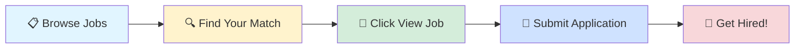

# 🚀 Tech Jobs Board

### Your Gateway to Amazing Career Opportunities

---

## 🎯 Browse by Job Profile

<table>
<tr>
<td align="center" width="25%">

 
<b>1000</b> total positions
</td>
<td align="center" width="25%">

 
<b>1000</b> total positions
</td>
<td align="center" width="25%">

 
<b>1000</b> total positions
</td>
<td align="center" width="25%">

 
<b>1000</b> total positions
</td>
</tr>
</table>

---

## 📊 Data Scientist

> 💼 **1000** positions available

<table>
<thead>
<tr>
<th width="20%">🏢 Company</th>
<th width="35%">💼 Role</th>
<th width="20%">📍 Location</th>
<th width="10%">⏰ Posted</th>
<th width="15%">🔗 Action</th>
</tr>
</thead>
<tbody>
<tr>
<td>Differentbyte Technologies</td>
<td>Python Developer(Fast API)</td>
<td>📍 Kochi</td>
<td>1d ago</td>
<td align="center"></td>
</tr>
<tr>
<td>The Celeritas Ai</td>
<td>Machine Learning And Artificial Intelligence engineer</td>
<td>📍 India</td>
<td>1d ago</td>
<td align="center"></td>
</tr>
<tr>
<td><a href="https://sg.linkedin.com/company/funding-societies-modalku">Funding Societies | Modalku Group</a></td>
<td>Data Analytics Intern</td>
<td>📍 Bangalore</td>
<td>1d ago</td>
<td align="center"></td>
</tr>
<tr>
<td><a href="https://sg.linkedin.com/company/funding-societies-modalku">Funding Societies | Modalku Group</a></td>
<td>Data Analytics Intern</td>
<td>📍 Kuala Lumpur, Federal Territory of Kuala Lumpur, Malaysia</td>
<td>1d ago</td>
<td align="center"></td>
</tr>
<tr>
<td><a href="https://www.linkedin.com/company/bayone-solutions">BayOne Solutions</a></td>
<td>Software Engineer (Network/Python)</td>
<td>📍 India</td>
<td>1d ago</td>
<td align="center"></td>
</tr>
<tr>
<td><a href="https://www.linkedin.com/company/bayone-solutions">BayOne Solutions</a></td>
<td>AI/ML Engineer</td>
<td>📍 India</td>
<td>1d ago</td>
<td align="center"></td>
</tr>
<tr>
<td><a href="https://de.linkedin.com/company/contentful">Contentful</a></td>
<td>Analytics Engineer</td>
<td>📍 Denver, CO</td>
<td>1d ago</td>
<td align="center"></td>
</tr>
<tr>
<td><a href="https://in.linkedin.com/company/hcltech">HCLTech</a></td>
<td>Business Analyst (Data & Analytics)</td>
<td>📍 Bangkok, Bangkok City, Thailand</td>
<td>1d ago</td>
<td align="center"></td>
</tr>
<tr>
<td><a href="https://www.ambitionbox.com/overview/accelyzei-overview">Accelyzei</a></td>
<td>AI/ML Intern</td>
<td>📍 Hyderabad</td>
<td>1d ago</td>
<td align="center"></td>
</tr>
<tr>
<td><a href="https://www.linkedin.com/company/%E7%A1%95%E8%BD%AF%EF%BC%88%E4%B8%8A%E6%B5%B7%EF%BC%89%E8%BD%AF%E4%BB%B6%E8%B4%B8%E6%98%93%E6%9C%89%E9%99%90%E5%85%AC%E5%8F%B8">硕软（上海）软件贸易有限公司</a></td>
<td>Python Engineer</td>
<td>📍 Shanghai, Shanghai, China</td>
<td>1d ago</td>
<td align="center"></td>
</tr>
<tr>
<td><a href="https://www.linkedin.com/company/%E5%87%AF%E6%98%93%E8%AE%AF%E7%BD%91%E7%BB%9C%E6%8A%80%E6%9C%AF%E5%BC%80%E5%8F%91-%E5%8D%97%E4%BA%AC-%E6%9C%89%E9%99%90%E5%85%AC%E5%8F%B8">凯易讯网络技术开发(南京)有限公司</a></td>
<td>高级后端开发工程师（Python, Ops)</td>
<td>📍 Nanjing, Jiangsu, China</td>
<td>1d ago</td>
<td align="center"></td>
</tr>
<tr>
<td><a href="https://www.linkedin.com/company/nightwing-us">Nightwing</a></td>
<td>Artificial Intelligence Intern - 2026</td>
<td>📍 Sterling, VA</td>
<td>1d ago</td>
<td align="center"></td>
</tr>
<tr>
<td><a href="https://www.linkedin.com/company/cienet-technologies">CIeNET Technologies</a></td>
<td>Pyhton后端开发（AWS\微软云\机器学习)</td>
<td>📍 Nanjing, Jiangsu, China</td>
<td>1d ago</td>
<td align="center"></td>
</tr>
<tr>
<td><a href="https://cn.linkedin.com/company/%E5%8C%97%E4%BA%AC%E4%B8%BB%E7%BA%BF%E7%A7%91%E6%8A%80%E6%9C%89%E9%99%90%E5%85%AC%E5%8F%B8">主线科技 TRUNK.TECH</a></td>
<td>（校招）平台软件开发工程师（python）</td>
<td>📍 Tianjin, Tianjin, China</td>
<td>1d ago</td>
<td align="center"></td>
</tr>
<tr>
<td><a href="https://www.linkedin.com/company/%E5%87%AF%E6%98%93%E8%AE%AF%E7%BD%91%E7%BB%9C%E6%8A%80%E6%9C%AF%E5%BC%80%E5%8F%91-%E5%8D%97%E4%BA%AC-%E6%9C%89%E9%99%90%E5%85%AC%E5%8F%B8">凯易讯网络技术开发(南京)有限公司</a></td>
<td>高级后端开发工程师(Python, Go, Ops)</td>
<td>📍 Nanjing, Jiangsu, China</td>
<td>1d ago</td>
<td align="center"></td>
</tr>
<tr>
<td><a href="https://www.linkedin.com/company/%E9%BA%A6%E6%A0%BC%E7%BA%B3%E7%94%B5%E5%AD%90-%E8%8B%8F%E5%B7%9E-%E6%9C%89%E9%99%90%E5%85%AC%E5%8F%B8">麦格纳电子(苏州)有限公司</a></td>
<td>Python开发</td>
<td>📍 Tianjin, Tianjin, China</td>
<td>1d ago</td>
<td align="center"></td>
</tr>
<tr>
<td><a href="https://www.linkedin.com/company/algosec">AlgoSec</a></td>
<td>CloudFlow Automation Developer, India</td>
<td>📍 Delhi</td>
<td>1d ago</td>
<td align="center"></td>
</tr>
<tr>
<td><a href="https://www.linkedin.com/company/algosec">AlgoSec</a></td>
<td>AlgoNext Automation Developer, India</td>
<td>📍 Delhi</td>
<td>1d ago</td>
<td align="center"></td>
</tr>
<tr>
<td><a href="https://www.linkedin.com/company/algosec">AlgoSec</a></td>
<td>Cloud Automation Developer, India</td>
<td>📍 Delhi</td>
<td>1d ago</td>
<td align="center"></td>
</tr>
<tr>
<td><a href="https://www.linkedin.com/company/algosec">AlgoSec</a></td>
<td>Full Stack Automation Developer, India</td>
<td>📍 Delhi</td>
<td>1d ago</td>
<td align="center"></td>
</tr>
<tr>
<td><a href="https://fr.linkedin.com/company/capgemini">Capgemini</a></td>
<td>Machine Learning Engineer</td>
<td>📍 Dallas, TX</td>
<td>1d ago</td>
<td align="center"></td>
</tr>
<tr>
<td><a href="https://www.linkedin.com/company/nvidia">NVIDIA</a></td>
<td>Senior Deep Learning Software Engineer, Inference and Model Optimization</td>
<td>📍 Santa Clara, CA</td>
<td>1d ago</td>
<td align="center"></td>
</tr>
<tr>
<td><a href="https://www.linkedin.com/company/nvidia">NVIDIA</a></td>
<td>Senior Deep Learning Software Engineer, Inference and Model Optimization</td>
<td>📍 Santa Clara, CA</td>
<td>1d ago</td>
<td align="center"></td>
</tr>
<tr>
<td><a href="https://www.linkedin.com/company/mayo-clinic">Mayo Clinic</a></td>
<td>Intern - Data Science - AI</td>
<td>📍 Rochester, MN</td>
<td>1d ago</td>
<td align="center"></td>
</tr>
<tr>
<td><a href="https://www.linkedin.com/company/sas">SAS</a></td>
<td>CareerStart@SAS 2026 - Customer Facing Intern – AI, Data Science & Risk Management</td>
<td>📍 Marlow, England, United Kingdom</td>
<td>1d ago</td>
<td align="center"></td>
</tr>
<tr>
<td><a href="https://www.linkedin.com/company/plymouth-rock-assurance">Plymouth Rock Assurance</a></td>
<td>Data Science Intern</td>
<td>📍 Boston, MA</td>
<td>1d ago</td>
<td align="center"></td>
</tr>
<tr>
<td><a href="https://www.linkedin.com/company/jabil">Jabil</a></td>
<td>Data Science Engineering Intern</td>
<td>📍 St. Petersburg, FL</td>
<td>1d ago</td>
<td align="center"></td>
</tr>
<tr>
<td><a href="https://www.linkedin.com/company/ibm">IBM</a></td>
<td>Data Scientist - Generative AI</td>
<td>📍 Gurugram</td>
<td>1d ago</td>
<td align="center"></td>
</tr>
<tr>
<td><a href="https://www.linkedin.com/company/genentech">Genentech</a></td>
<td>2026 Summer Intern - Product Development Data Sciences and Analytics</td>
<td>📍 South San Francisco, CA</td>
<td>1d ago</td>
<td align="center"></td>
</tr>
<tr>
<td><a href="https://ch.linkedin.com/company/world-health-organization">World Health Organization</a></td>
<td>SSA - Monitoring, Evaluation, Research and Learning Officer</td>
<td>📍 Suva, Central, Fiji</td>
<td>1d ago</td>
<td align="center"></td>
</tr>
<tr>
<td><a href="https://www.linkedin.com/company/ascensionorg">Ascension</a></td>
<td>Clinical Research Analytics Intern</td>
<td>📍 United States</td>
<td>1d ago</td>
<td align="center"></td>
</tr>
<tr>
<td><a href="https://www.linkedin.com/company/sigmacomputing">Sigma</a></td>
<td>AI/ML PhD Intern (Summer 2026)</td>
<td>📍 San Francisco, CA</td>
<td>1d ago</td>
<td align="center"></td>
</tr>
<tr>
<td><a href="https://www.linkedin.com/company/bakerhughes">Baker Hughes</a></td>
<td>Lead Engineer, Customer Order Engineering - Automation & Control</td>
<td>📍 Hyderabad</td>
<td>1d ago</td>
<td align="center"></td>
</tr>
<tr>
<td><a href="https://www.linkedin.com/company/eosysgroup">EOSYS</a></td>
<td>Associate Commercial Data Science Intern</td>
<td>📍 New York, NY</td>
<td>1d ago</td>
<td align="center"></td>
</tr>
<tr>
<td><a href="https://www.linkedin.com/company/instacart">Instacart</a></td>
<td>Machine Learning Engineer, PhD Intern</td>
<td>📍 United States</td>
<td>1d ago</td>
<td align="center"></td>
</tr>
<tr>
<td><a href="https://www.linkedin.com/company/sigmacomputing">Sigma</a></td>
<td>Senior AI/ML Engineer</td>
<td>📍 San Francisco, CA</td>
<td>1d ago</td>
<td align="center"></td>
</tr>
<tr>
<td><a href="https://www.linkedin.com/company/sigmacomputing">Sigma</a></td>
<td>Senior AI/ML Engineer</td>
<td>📍 New York, NY</td>
<td>1d ago</td>
<td align="center"></td>
</tr>
<tr>
<td><a href="https://in.linkedin.com/company/infosys">Infosys</a></td>
<td>Automation Tester</td>
<td>📍 Bangalore</td>
<td>1d ago</td>
<td align="center"></td>
</tr>
<tr>
<td><a href="https://www.linkedin.com/company/morningstar">Morningstar</a></td>
<td>Lead Machine Learning Engineer</td>
<td>📍 Navi Mumbai, Maharashtra, India</td>
<td>1d ago</td>
<td align="center"></td>
</tr>
<tr>
<td><a href="https://www.linkedin.com/company/ai-tensors">AI Tensors, Corp. (Aka: AITCare)</a></td>
<td>Computer Vision Founding Engineer (Prior AI&ML Experience required)</td>
<td>📍 Greater Visakhapatnam Area</td>
<td>1d ago</td>
<td align="center"></td>
</tr>
<tr>
<td><a href="https://in.linkedin.com/company/infosys">Infosys</a></td>
<td>S2R_DNA_JAVA/PYTHON/APACHE_Q4_FY26</td>
<td>📍 Bangalore</td>
<td>1d ago</td>
<td align="center"></td>
</tr>
<tr>
<td><a href="https://au.linkedin.com/company/qantas">Qantas</a></td>
<td>Principal Analyst Reporting & Data Analysis</td>
<td>📍 Sydney, New South Wales, Australia</td>
<td>1d ago</td>
<td align="center"></td>
</tr>
<tr>
<td><a href="https://www.linkedin.com/company/ncratleos">NCR Atleos</a></td>
<td>Artificial Intelligence Engineer</td>
<td>📍 Hyderabad</td>
<td>1d ago</td>
<td align="center"></td>
</tr>
<tr>
<td><a href="https://in.linkedin.com/company/infosys">Infosys</a></td>
<td>AI/ML Architect</td>
<td>📍 Trivandrum, Kerala, India</td>
<td>1d ago</td>
<td align="center"></td>
</tr>
<tr>
<td><a href="https://www.linkedin.com/company/grid-dynamics">Grid Dynamics</a></td>
<td>Python Full Stack Developer</td>
<td>📍 Chennai</td>
<td>1d ago</td>
<td align="center"></td>
</tr>
<tr>
<td><a href="https://ca.linkedin.com/company/cgi">CGI</a></td>
<td>Senior Test Engineer-Automation Testing</td>
<td>📍 Hyderabad</td>
<td>1d ago</td>
<td align="center"></td>
</tr>
<tr>
<td><a href="https://ca.linkedin.com/company/cgi">CGI</a></td>
<td>Automation-Senior Test Engineer</td>
<td>📍 Hyderabad</td>
<td>1d ago</td>
<td align="center"></td>
</tr>
<tr>
<td><a href="https://in.linkedin.com/company/infosys">Infosys</a></td>
<td>AVD (Azure Virtual Desktop) Consultant</td>
<td>📍 Bangalore</td>
<td>1d ago</td>
<td align="center"></td>
</tr>
<tr>
<td><a href="https://uk.linkedin.com/company/gsk">GSK</a></td>
<td>Associate Director, Trial Operations Analytics</td>
<td>📍 Bangalore</td>
<td>1d ago</td>
<td align="center"></td>
</tr>
<tr>
<td><a href="https://www.linkedin.com/company/grid-dynamics">Grid Dynamics</a></td>
<td>Python Full Stack Developer</td>
<td>📍 Hyderabad</td>
<td>1d ago</td>
<td align="center"></td>
</tr>
<tr>
<td><a href="https://www.linkedin.com/company/airbnb">Airbnb</a></td>
<td>Senior Data Scientist, Pricing</td>
<td>📍 United States</td>
<td>1d ago</td>
<td align="center"></td>
</tr>
<tr>
<td><a href="https://in.linkedin.com/company/infosys">Infosys</a></td>
<td>AWS DevOps Consultant - QLTY</td>
<td>📍 Bangalore</td>
<td>1d ago</td>
<td align="center"></td>
</tr>
<tr>
<td><a href="https://ch.linkedin.com/company/jobcourier">JobCourier</a></td>
<td>Cybersecurity Engineer ? Azure Cloud Environment</td>
<td>📍 Vaud, Switzerland</td>
<td>1d ago</td>
<td align="center"></td>
</tr>
<tr>
<td><a href="https://in.linkedin.com/company/best-job-tool">Best Job Tool</a></td>
<td>AWS Engineer</td>
<td>📍 India</td>
<td>1d ago</td>
<td align="center"></td>
</tr>
<tr>
<td><a href="https://in.linkedin.com/company/infosys">Infosys</a></td>
<td>Automation Tester- Cypress Testing Framework</td>
<td>📍 Pune</td>
<td>1d ago</td>
<td align="center"></td>
</tr>
<tr>
<td><a href="https://www.linkedin.com/company/lensa">Lensa</a></td>
<td>AWS Engineer - Manager</td>
<td>📍 Los Angeles, CA</td>
<td>1d ago</td>
<td align="center"></td>
</tr>
<tr>
<td><a href="https://www.linkedin.com/company/crashplan">CrashPlan</a></td>
<td>AI/ML Engineer Intern</td>
<td>📍 Bangalore</td>
<td>1d ago</td>
<td align="center"></td>
</tr>
<tr>
<td><a href="https://in.linkedin.com/company/infosys">Infosys</a></td>
<td>AWS Professional</td>
<td>📍 Bangalore</td>
<td>1d ago</td>
<td align="center"></td>
</tr>
<tr>
<td><a href="https://in.linkedin.com/company/infosys">Infosys</a></td>
<td>Python Developer</td>
<td>📍 Bangalore</td>
<td>1d ago</td>
<td align="center"></td>
</tr>
<tr>
<td><a href="https://in.linkedin.com/company/infosys">Infosys</a></td>
<td>Python ML Engineer</td>
<td>📍 Bangalore</td>
<td>1d ago</td>
<td align="center"></td>
</tr>
<tr>
<td><a href="https://www.linkedin.com/school/year-up-united/">Year Up United</a></td>
<td>Data Analytics Job Training Program</td>
<td>📍 Charlotte, NC</td>
<td>1d ago</td>
<td align="center"></td>
</tr>
<tr>
<td><a href="https://www.linkedin.com/company/jobs-via-dice">Jobs via Dice</a></td>
<td>Data Science and Machine Learning Intern</td>
<td>📍 Bedford, MA</td>
<td>1d ago</td>
<td align="center"></td>
</tr>
<tr>
<td><a href="https://www.linkedin.com/company/racetrac">RaceTrac</a></td>
<td>Data Science Intern (Summer 2026)</td>
<td>📍 Atlanta, GA</td>
<td>1d ago</td>
<td align="center"></td>
</tr>
<tr>
<td><a href="https://www.linkedin.com/school/year-up-united/">Year Up United</a></td>
<td>Data Analytics Job Training Program</td>
<td>📍 Washington, DC</td>
<td>1d ago</td>
<td align="center"></td>
</tr>
<tr>
<td><a href="https://www.linkedin.com/company/eg4-electronics">EG4 Electronics</a></td>
<td>Engineering Data Analysis Intern</td>
<td>📍 Dallas, TX</td>
<td>1d ago</td>
<td align="center"></td>
</tr>
<tr>
<td><a href="https://fr.linkedin.com/company/indefi">INDEFI</a></td>
<td>Data Scientist Intern F/H</td>
<td>📍 Paris, Île-de-France, France</td>
<td>1d ago</td>
<td align="center"></td>
</tr>
<tr>
<td><a href="https://ae.linkedin.com/company/theoceann">theoceann.ai</a></td>
<td>theoceann.ai - Senior Full Stack Developer - Python/React.js</td>
<td>📍 Noida</td>
<td>1d ago</td>
<td align="center"></td>
</tr>
<tr>
<td><a href="https://in.linkedin.com/company/ripik-ai">Ripik.AI</a></td>
<td>Ripik AI - Tech Lead - Java/Python</td>
<td>📍 Noida</td>
<td>1d ago</td>
<td align="center"></td>
</tr>
<tr>
<td><a href="https://www.linkedin.com/company/ingrain-systems-inc">Ingrain Systems Inc</a></td>
<td>Quality Assurance Automation Engineer - Java/Selenium</td>
<td>📍 Hyderabad</td>
<td>1d ago</td>
<td align="center"></td>
</tr>
<tr>
<td><a href="https://www.ambitionbox.com/overview/hcl-technologies-overview">HCLTech</a></td>
<td>Hiring Python & Senior Python Developer - Bangalore Location</td>
<td>📍 Bangalore</td>
<td>1d ago</td>
<td align="center"></td>
</tr>
<tr>
<td><a href="https://www.ambitionbox.com/overview/cloudraptor-overview">Cloud Raptor</a></td>
<td>Python Software Developer</td>
<td>📍 Mumbai, Hyderabad</td>
<td>1d ago</td>
<td align="center"></td>
</tr>
<tr>
<td><a href="https://in.linkedin.com/company/hirenza-pvt-ltd">Hirenza</a></td>
<td>Python Developer</td>
<td>📍 India</td>
<td>1d ago</td>
<td align="center"></td>
</tr>
<tr>
<td><a href="https://in.linkedin.com/company/hyperface">Hyperface</a></td>
<td>Software Development Engineer - Golang/Java/Python</td>
<td>📍 Bangalore</td>
<td>1d ago</td>
<td align="center"></td>
</tr>
<tr>
<td><a href="https://jp.linkedin.com/company/ntt-data-inc">NTT DATA, Inc.</a></td>
<td>Senior Sales Analyt Senior Specialist – Sales Performance Reporting & Analytics Specialist</td>
<td>📍 Gurugram</td>
<td>1d ago</td>
<td align="center"></td>
</tr>
<tr>
<td><a href="https://in.linkedin.com/company/hirenza-pvt-ltd">Hirenza</a></td>
<td>Data Science Analyst</td>
<td>📍 India</td>
<td>1d ago</td>
<td align="center"></td>
</tr>
<tr>
<td><a href="https://in.linkedin.com/company/golden-legand-leasing-and-finance-ltd">Golden Legand Leasing and Finance Ltd.</a></td>
<td>Interesting Job Opportunity: Data Scientist - Machine Learning</td>
<td>📍 Mumbai</td>
<td>1d ago</td>
<td align="center"></td>
</tr>
<tr>
<td><a href="https://jp.linkedin.com/company/ntt-data-inc">NTT DATA, Inc.</a></td>
<td>Principal Specialist – Sales Analytics & Forecasting</td>
<td>📍 Gurugram</td>
<td>1d ago</td>
<td align="center"></td>
</tr>
<tr>
<td><a href="https://in.linkedin.com/company/sedin-technologies">Sedin Technologies</a></td>
<td>Sedin Technologies - Data Architect - Python/Spark</td>
<td>📍 Chennai</td>
<td>1d ago</td>
<td align="center"></td>
</tr>
<tr>
<td><a href="https://www.linkedin.com/company/ingrain-systems-inc">Ingrain Systems Inc</a></td>
<td>Data Engineer - AWS/PySpark</td>
<td>📍 Hyderabad</td>
<td>1d ago</td>
<td align="center"></td>
</tr>
<tr>
<td><a href="https://www.linkedin.com/company/robosoft-technologies">Robosoft Technologies</a></td>
<td>Interesting Job Opportunity: Robosoft Technologies - Automation Tester - Appium/Java/Selenium</td>
<td>📍 Udupi, Karnataka, India</td>
<td>1d ago</td>
<td align="center"></td>
</tr>
<tr>
<td><a href="https://www.linkedin.com/company/somani-technologies">Somani Technologies</a></td>
<td>Somani Technologies - Automation Test Engineer - Java/Selenium</td>
<td>📍 Bangalore</td>
<td>1d ago</td>
<td align="center"></td>
</tr>
<tr>
<td><a href="https://www.linkedin.com/company/themoderndatacompany">The Modern Data Company</a></td>
<td>Backend Developer - Python Frameworks</td>
<td>📍 Hyderabad</td>
<td>1d ago</td>
<td align="center"></td>
</tr>
<tr>
<td><a href="https://www.linkedin.com/company/optimuminfo">Optimum Info</a></td>
<td>Optimum Info - Quality Assurance Engineer - Manual/Automation Testing</td>
<td>📍 Noida</td>
<td>1d ago</td>
<td align="center"></td>
</tr>
<tr>
<td><a href="https://in.linkedin.com/company/element-skill-llp">ElementSkill</a></td>
<td>AI/ML Architect - LLM Models</td>
<td>📍 Greater Kolkata Area</td>
<td>1d ago</td>
<td align="center"></td>
</tr>
<tr>
<td><a href="https://in.linkedin.com/company/congregate-technologies">Congregate Technologies</a></td>
<td>Artificial Intelligence Engineer - LLM/RAG</td>
<td>📍 Hyderabad</td>
<td>1d ago</td>
<td align="center"></td>
</tr>
<tr>
<td><a href="https://www.linkedin.com/company/strategic-hr-solutions">Strategic HR Solutions</a></td>
<td>Azure VMware Solution Architect</td>
<td>📍 Pune</td>
<td>1d ago</td>
<td align="center"></td>
</tr>
<tr>
<td><a href="https://www.linkedin.com/company/strategic-hr-solutions">Strategic HR Solutions</a></td>
<td>Data Engineer/Big Data Engineer - Python</td>
<td>📍 Chennai</td>
<td>1d ago</td>
<td align="center"></td>
</tr>
<tr>
<td><a href="https://www.linkedin.com/company/applore">Applore Technologies</a></td>
<td>Applore Technologies - Computer Vision Engineer - OpenCV/Tensorflow</td>
<td>📍 Ahmedabad, Gujarat, India</td>
<td>1d ago</td>
<td align="center"></td>
</tr>
<tr>
<td><a href="https://in.linkedin.com/company/golden-legand-leasing-and-finance-ltd">Golden Legand Leasing and Finance Ltd.</a></td>
<td>Interesting Job Opportunity: Artificial Intelligence Engineer - PyTorch/Tensorflow</td>
<td>📍 Mumbai</td>
<td>1d ago</td>
<td align="center"></td>
</tr>
<tr>
<td><a href="https://in.linkedin.com/company/frd-studio">FRD Studio</a></td>
<td>Artificial Intelligence (AI) Internship in Gurgaon (Hybrid)</td>
<td>📍 Gurugram</td>
<td>1d ago</td>
<td align="center"></td>
</tr>
<tr>
<td><a href="https://www.linkedin.com/company/solace-manpower-consultants">Solace Manpower Consultants</a></td>
<td>Senior Data Scientist - Machine Learning</td>
<td>📍 Pune</td>
<td>1d ago</td>
<td align="center"></td>
</tr>
<tr>
<td><a href="https://www.linkedin.com/showcase/framatome-north-america/">Framatome North America</a></td>
<td>Intern / Co - Op Software/Computer Science Engineer</td>
<td>📍 Richland, WA</td>
<td>2d ago</td>
<td align="center"></td>
</tr>
<tr>
<td><a href="https://in.linkedin.com/company/webbybutter">WebbyButter Technologies Pvt.Ltd ®</a></td>
<td>Python & AI Developer Internship in Vadodara</td>
<td>📍 Vadodara, Gujarat, India</td>
<td>1d ago</td>
<td align="center"></td>
</tr>
<tr>
<td><a href="https://www.linkedin.com/company/sonoco">Sonoco</a></td>
<td>AI & Analytics Intern</td>
<td>📍 Hartsville, SC</td>
<td>1d ago</td>
<td align="center"></td>
</tr>
<tr>
<td><a href="https://www.linkedin.com/company/oura">ŌURA</a></td>
<td>Machine Learning Scientist - Summer Intern</td>
<td>📍 United States</td>
<td>2d ago</td>
<td align="center"></td>
</tr>
<tr>
<td><a href="https://in.linkedin.com/company/inspironlabsindia">InspironLabs</a></td>
<td>Python Developer</td>
<td>📍 Bangalore Urban, Karnataka, India</td>
<td>2d ago</td>
<td align="center"></td>
</tr>
<tr>
<td><a href="https://de.linkedin.com/company/deutsche-bank">Deutsche Bank</a></td>
<td>QA Automation Engineer, AVP</td>
<td>📍 Bangalore</td>
<td>2d ago</td>
<td align="center"></td>
</tr>
<tr>
<td><a href="https://www.linkedin.com/company/bristol-myers-squibb">Bristol Myers Squibb</a></td>
<td>Analyst I, Portfolio Analytics</td>
<td>📍 Hyderabad</td>
<td>2d ago</td>
<td align="center"></td>
</tr>
<tr>
<td><a href="https://www.linkedin.com/company/blackrock">BlackRock</a></td>
<td>Associate - Python Developer (Finance Platform Strategies)</td>
<td>📍 Mumbai</td>
<td>2d ago</td>
<td align="center"></td>
</tr>
<tr>
<td><a href="https://in.linkedin.com/company/accentureindia">Accenture in India</a></td>
<td>AI / ML Engineer</td>
<td>📍 Chennai</td>
<td>2d ago</td>
<td align="center"></td>
</tr>
<tr><td colspan="5" align="center"><i>... and 900 more positions</i></td></tr>
</tbody>
</table>

---

## 💼 Business Analyst

> 💼 **1000** positions available

<table>
<thead>
<tr>
<th width="20%">🏢 Company</th>
<th width="35%">💼 Role</th>
<th width="20%">📍 Location</th>
<th width="10%">⏰ Posted</th>
<th width="15%">🔗 Action</th>
</tr>
</thead>
<tbody>
<tr>
<td>Differentbyte Technologies</td>
<td>Python Developer(Fast API)</td>
<td>📍 Kochi</td>
<td>1d ago</td>
<td align="center"></td>
</tr>
<tr>
<td><a href="https://sg.linkedin.com/company/funding-societies-modalku">Funding Societies | Modalku Group</a></td>
<td>Data Analytics Intern</td>
<td>📍 Bangalore</td>
<td>1d ago</td>
<td align="center"></td>
</tr>
<tr>
<td><a href="https://sg.linkedin.com/company/funding-societies-modalku">Funding Societies | Modalku Group</a></td>
<td>Data Analytics Intern</td>
<td>📍 Kuala Lumpur, Federal Territory of Kuala Lumpur, Malaysia</td>
<td>1d ago</td>
<td align="center"></td>
</tr>
<tr>
<td><a href="https://www.linkedin.com/company/bayone-solutions">BayOne Solutions</a></td>
<td>Software Engineer (Network/Python)</td>
<td>📍 India</td>
<td>1d ago</td>
<td align="center"></td>
</tr>
<tr>
<td><a href="https://ph.linkedin.com/company/risingtideph">Rising Tide Digital Inc</a></td>
<td>IT Business Analyst</td>
<td>📍 Taguig, National Capital Region, Philippines</td>
<td>1d ago</td>
<td align="center"></td>
</tr>
<tr>
<td><a href="https://www.ambitionbox.com/overview/expansion-soft-overview">Expansion Soft</a></td>
<td>Salesforce Developer Intern</td>
<td></td>
<td>1d ago</td>
<td align="center"></td>
</tr>
<tr>
<td><a href="https://de.linkedin.com/company/contentful">Contentful</a></td>
<td>Analytics Engineer</td>
<td>📍 Denver, CO</td>
<td>1d ago</td>
<td align="center"></td>
</tr>
<tr>
<td><a href="https://www.linkedin.com/company/talentallyatwork">TalentAlly</a></td>
<td>Business Analyst Associate - August 2026</td>
<td>📍 McLean, VA</td>
<td>1d ago</td>
<td align="center"></td>
</tr>
<tr>
<td><a href="https://www.linkedin.com/company/talentallyatwork">TalentAlly</a></td>
<td>Business Analyst Intern - Summer 2026</td>
<td>📍 Plano, TX</td>
<td>1d ago</td>
<td align="center"></td>
</tr>
<tr>
<td><a href="https://www.linkedin.com/company/talentallyatwork">TalentAlly</a></td>
<td>Business Analyst Intern - Summer 2026</td>
<td>📍 Richmond, VA</td>
<td>1d ago</td>
<td align="center"></td>
</tr>
<tr>
<td><a href="https://www.linkedin.com/company/talentallyatwork">TalentAlly</a></td>
<td>Business Analyst Intern - Summer 2026</td>
<td>📍 McLean, VA</td>
<td>1d ago</td>
<td align="center"></td>
</tr>
<tr>
<td><a href="https://in.linkedin.com/company/hcltech">HCLTech</a></td>
<td>Business Analyst (Data & Analytics)</td>
<td>📍 Bangkok, Bangkok City, Thailand</td>
<td>1d ago</td>
<td align="center"></td>
</tr>
<tr>
<td><a href="https://id.linkedin.com/company/erajayaswasembada">PT. Erajaya Swasembada, Tbk.</a></td>
<td>Project Management Specialist</td>
<td>📍 Jakarta, Indonesia</td>
<td>1d ago</td>
<td align="center"></td>
</tr>
<tr>
<td><a href="https://www.linkedin.com/company/%E6%B5%99%E6%B1%9F%E8%8A%AF%E6%99%96%E8%A3%85%E5%A4%87%E6%8A%80%E6%9C%AF%E6%9C%89%E9%99%90%E5%85%AC%E5%8F%B8">浙江芯晖装备技术有限公司</a></td>
<td>Project Management 项目管理</td>
<td>📍 Shanghai, Shanghai, China</td>
<td>1d ago</td>
<td align="center"></td>
</tr>
<tr>
<td><a href="https://www.linkedin.com/company/%E7%A1%95%E8%BD%AF%EF%BC%88%E4%B8%8A%E6%B5%B7%EF%BC%89%E8%BD%AF%E4%BB%B6%E8%B4%B8%E6%98%93%E6%9C%89%E9%99%90%E5%85%AC%E5%8F%B8">硕软（上海）软件贸易有限公司</a></td>
<td>Python Engineer</td>
<td>📍 Shanghai, Shanghai, China</td>
<td>1d ago</td>
<td align="center"></td>
</tr>
<tr>
<td><a href="https://www.linkedin.com/company/%E5%87%AF%E6%98%93%E8%AE%AF%E7%BD%91%E7%BB%9C%E6%8A%80%E6%9C%AF%E5%BC%80%E5%8F%91-%E5%8D%97%E4%BA%AC-%E6%9C%89%E9%99%90%E5%85%AC%E5%8F%B8">凯易讯网络技术开发(南京)有限公司</a></td>
<td>高级后端开发工程师（Python, Ops)</td>
<td>📍 Nanjing, Jiangsu, China</td>
<td>1d ago</td>
<td align="center"></td>
</tr>
<tr>
<td><a href="https://at.linkedin.com/company/dachverband-der-sozialversicherungstr%C3%A4ger">Dachverband der Sozialversicherungen</a></td>
<td>Business Analyst:in</td>
<td>📍 Vienna, Vienna, Austria</td>
<td>1d ago</td>
<td align="center"></td>
</tr>
<tr>
<td><a href="https://cn.linkedin.com/company/%E5%8C%97%E4%BA%AC%E4%B8%BB%E7%BA%BF%E7%A7%91%E6%8A%80%E6%9C%89%E9%99%90%E5%85%AC%E5%8F%B8">主线科技 TRUNK.TECH</a></td>
<td>（校招）平台软件开发工程师（python）</td>
<td>📍 Tianjin, Tianjin, China</td>
<td>1d ago</td>
<td align="center"></td>
</tr>
<tr>
<td><a href="https://www.linkedin.com/company/vivint">Vivint</a></td>
<td>Salesforce Developer Intern</td>
<td>📍 Lehi, UT</td>
<td>1d ago</td>
<td align="center"></td>
</tr>
<tr>
<td><a href="https://www.linkedin.com/company/%E5%87%AF%E6%98%93%E8%AE%AF%E7%BD%91%E7%BB%9C%E6%8A%80%E6%9C%AF%E5%BC%80%E5%8F%91-%E5%8D%97%E4%BA%AC-%E6%9C%89%E9%99%90%E5%85%AC%E5%8F%B8">凯易讯网络技术开发(南京)有限公司</a></td>
<td>高级后端开发工程师(Python, Go, Ops)</td>
<td>📍 Nanjing, Jiangsu, China</td>
<td>1d ago</td>
<td align="center"></td>
</tr>
<tr>
<td><a href="https://www.linkedin.com/company/%E9%BA%A6%E6%A0%BC%E7%BA%B3%E7%94%B5%E5%AD%90-%E8%8B%8F%E5%B7%9E-%E6%9C%89%E9%99%90%E5%85%AC%E5%8F%B8">麦格纳电子(苏州)有限公司</a></td>
<td>Python开发</td>
<td>📍 Tianjin, Tianjin, China</td>
<td>1d ago</td>
<td align="center"></td>
</tr>
<tr>
<td><a href="https://www.linkedin.com/company/algosec">AlgoSec</a></td>
<td>CloudFlow Automation Developer, India</td>
<td>📍 Delhi</td>
<td>1d ago</td>
<td align="center"></td>
</tr>
<tr>
<td><a href="https://www.linkedin.com/company/algosec">AlgoSec</a></td>
<td>AlgoNext Automation Developer, India</td>
<td>📍 Delhi</td>
<td>1d ago</td>
<td align="center"></td>
</tr>
<tr>
<td><a href="https://www.linkedin.com/company/algosec">AlgoSec</a></td>
<td>Cloud Automation Developer, India</td>
<td>📍 Delhi</td>
<td>1d ago</td>
<td align="center"></td>
</tr>
<tr>
<td><a href="https://www.linkedin.com/company/algosec">AlgoSec</a></td>
<td>Full Stack Automation Developer, India</td>
<td>📍 Delhi</td>
<td>1d ago</td>
<td align="center"></td>
</tr>
<tr>
<td><a href="https://br.linkedin.com/company/innolevels">innolevels</a></td>
<td>Scrum Master  - SP</td>
<td>📍 Greater São Paulo Area</td>
<td>1d ago</td>
<td align="center"></td>
</tr>
<tr>
<td><a href="https://br.linkedin.com/company/ibrowse-consultoria-e-inform-tica">Ibrowse Consultoria e Informática</a></td>
<td>Scrum Master Presencial São Paulo - SP</td>
<td>📍 Greater São Paulo Area</td>
<td>1d ago</td>
<td align="center"></td>
</tr>
<tr>
<td><a href="https://in.linkedin.com/company/naga-mills-limited">Naga Limited</a></td>
<td>ICT Business Analyst</td>
<td>📍 Baden, Ontario, Canada</td>
<td>1d ago</td>
<td align="center"></td>
</tr>
<tr>
<td><a href="https://ca.linkedin.com/company/td">TD</a></td>
<td>Senior Business Analyst</td>
<td>📍 Toronto, Ontario, Canada</td>
<td>1d ago</td>
<td align="center"></td>
</tr>
<tr>
<td><a href="https://www.linkedin.com/company/spglobal">S&P Global</a></td>
<td>Lead Scrum Master</td>
<td>📍 Ahmedabad, Gujarat, India</td>
<td>1d ago</td>
<td align="center"></td>
</tr>
<tr>
<td><a href="https://dk.linkedin.com/company/svitzer">Svitzer</a></td>
<td>Global Business Process Owner - Procure‑to‑Pay (P2P)</td>
<td>📍 Mumbai</td>
<td>1d ago</td>
<td align="center"></td>
</tr>
<tr>
<td><a href="https://dk.linkedin.com/company/svitzer">Svitzer</a></td>
<td>Global Business Process Owner - Procure‑to‑Pay (P2P)</td>
<td>📍 Mumbai</td>
<td>1d ago</td>
<td align="center"></td>
</tr>
<tr>
<td><a href="https://fi.linkedin.com/company/wartsila">Wärtsilä</a></td>
<td>Software Business Analyst</td>
<td>📍 Vancouver, British Columbia, Canada</td>
<td>1d ago</td>
<td align="center"></td>
</tr>
<tr>
<td><a href="https://in.linkedin.com/company/kimirica">Kimirica</a></td>
<td>Business Analyst - Luxury D2C</td>
<td>📍 Mumbai</td>
<td>1d ago</td>
<td align="center"></td>
</tr>
<tr>
<td><a href="https://www.linkedin.com/company/genentech">Genentech</a></td>
<td>2026 Summer Intern - Product Development Data Sciences and Analytics</td>
<td>📍 South San Francisco, CA</td>
<td>1d ago</td>
<td align="center"></td>
</tr>
<tr>
<td><a href="https://www.linkedin.com/company/ascensionorg">Ascension</a></td>
<td>Clinical Research Analytics Intern</td>
<td>📍 United States</td>
<td>1d ago</td>
<td align="center"></td>
</tr>
<tr>
<td><a href="https://www.linkedin.com/company/bakerhughes">Baker Hughes</a></td>
<td>Lead Engineer, Customer Order Engineering - Automation & Control</td>
<td>📍 Hyderabad</td>
<td>1d ago</td>
<td align="center"></td>
</tr>
<tr>
<td><a href="https://in.linkedin.com/company/infosys">Infosys</a></td>
<td>Automation Tester</td>
<td>📍 Bangalore</td>
<td>1d ago</td>
<td align="center"></td>
</tr>
<tr>
<td><a href="https://in.linkedin.com/company/infosys">Infosys</a></td>
<td>S2R_DNA_JAVA/PYTHON/APACHE_Q4_FY26</td>
<td>📍 Bangalore</td>
<td>1d ago</td>
<td align="center"></td>
</tr>
<tr>
<td><a href="https://au.linkedin.com/company/qantas">Qantas</a></td>
<td>Principal Analyst Reporting & Data Analysis</td>
<td>📍 Sydney, New South Wales, Australia</td>
<td>1d ago</td>
<td align="center"></td>
</tr>
<tr>
<td><a href="https://in.linkedin.com/company/infosys">Infosys</a></td>
<td>Salesforce Senior Developer/Consultant</td>
<td>📍 Pune</td>
<td>1d ago</td>
<td align="center"></td>
</tr>
<tr>
<td><a href="https://au.linkedin.com/company/westpac-group">Westpac Group</a></td>
<td>Business Analyst</td>
<td>📍 Sydney, New South Wales, Australia</td>
<td>1d ago</td>
<td align="center"></td>
</tr>
<tr>
<td><a href="https://www.linkedin.com/company/grid-dynamics">Grid Dynamics</a></td>
<td>Python Full Stack Developer</td>
<td>📍 Chennai</td>
<td>1d ago</td>
<td align="center"></td>
</tr>
<tr>
<td><a href="https://ca.linkedin.com/company/cgi">CGI</a></td>
<td>Senior Test Engineer-Automation Testing</td>
<td>📍 Hyderabad</td>
<td>1d ago</td>
<td align="center"></td>
</tr>
<tr>
<td><a href="https://ca.linkedin.com/company/cgi">CGI</a></td>
<td>Automation-Senior Test Engineer</td>
<td>📍 Hyderabad</td>
<td>1d ago</td>
<td align="center"></td>
</tr>
<tr>
<td><a href="https://in.linkedin.com/company/infosys">Infosys</a></td>
<td>Senior Business Analyst (CMS)</td>
<td>📍 Bangalore</td>
<td>1d ago</td>
<td align="center"></td>
</tr>
<tr>
<td><a href="https://in.linkedin.com/company/infosys">Infosys</a></td>
<td>IT Project Management</td>
<td>📍 Bangalore</td>
<td>1d ago</td>
<td align="center"></td>
</tr>
<tr>
<td><a href="https://www.linkedin.com/company/lensa">Lensa</a></td>
<td>Business Analyst (Hybrid, Schaumburg, IL)</td>
<td>📍 Schaumburg, IL</td>
<td>1d ago</td>
<td align="center"></td>
</tr>
<tr>
<td><a href="https://de.linkedin.com/company/nagarro">Nagarro</a></td>
<td>Associate Staff Consultant (Business Analyst)</td>
<td>📍 Gurugram</td>
<td>1d ago</td>
<td align="center"></td>
</tr>
<tr>
<td><a href="https://www.linkedin.com/company/revfederal">REV Federal Credit Union</a></td>
<td>Business Analyst</td>
<td>📍 Summerville, SC</td>
<td>1d ago</td>
<td align="center"></td>
</tr>
<tr>
<td><a href="https://uk.linkedin.com/company/gsk">GSK</a></td>
<td>Associate Director, Trial Operations Analytics</td>
<td>📍 Bangalore</td>
<td>1d ago</td>
<td align="center"></td>
</tr>
<tr>
<td><a href="https://www.linkedin.com/company/grid-dynamics">Grid Dynamics</a></td>
<td>Python Full Stack Developer</td>
<td>📍 Hyderabad</td>
<td>1d ago</td>
<td align="center"></td>
</tr>
<tr>
<td><a href="https://in.linkedin.com/company/infosys">Infosys</a></td>
<td>Power BI Developer (Mid-Level)</td>
<td>📍 Chennai</td>
<td>1d ago</td>
<td align="center"></td>
</tr>
<tr>
<td><a href="https://in.linkedin.com/company/best-job-tool">Best Job Tool</a></td>
<td>Business Analyst</td>
<td>📍 India</td>
<td>1d ago</td>
<td align="center"></td>
</tr>
<tr>
<td><a href="https://ca.linkedin.com/company/cibc">CIBC</a></td>
<td>GAM Business Analyst, Summer 2026 Co-op</td>
<td>📍 Toronto, Ontario, Canada</td>
<td>1d ago</td>
<td align="center"></td>
</tr>
<tr>
<td><a href="https://www.linkedin.com/company/lensa">Lensa</a></td>
<td>Scrum Master I</td>
<td>📍 Westwood, MA</td>
<td>1d ago</td>
<td align="center"></td>
</tr>
<tr>
<td><a href="https://www.linkedin.com/company/keepsupply">Keep Supply</a></td>
<td>Salesforce Administrator</td>
<td>📍 Springfield, MO</td>
<td>1d ago</td>
<td align="center"></td>
</tr>
<tr>
<td><a href="https://www.linkedin.com/company/lockheed-martin">Lockheed Martin</a></td>
<td>Software Business Analyst</td>
<td>📍 Cape Canaveral, FL</td>
<td>1d ago</td>
<td align="center"></td>
</tr>
<tr>
<td><a href="https://www.linkedin.com/company/lensa">Lensa</a></td>
<td>Associate Salesforce Developer</td>
<td>📍 Renton, WA</td>
<td>1d ago</td>
<td align="center"></td>
</tr>
<tr>
<td><a href="https://in.linkedin.com/company/infosys">Infosys</a></td>
<td>Automation Tester- Cypress Testing Framework</td>
<td>📍 Pune</td>
<td>1d ago</td>
<td align="center"></td>
</tr>
<tr>
<td><a href="https://in.linkedin.com/company/hirenza-pvt-ltd">Hirenza</a></td>
<td>Business Analyst</td>
<td>📍 India</td>
<td>1d ago</td>
<td align="center"></td>
</tr>
<tr>
<td><a href="https://www.linkedin.com/company/lensa">Lensa</a></td>
<td>Business Analyst</td>
<td>📍 Rohnert Park, CA</td>
<td>1d ago</td>
<td align="center"></td>
</tr>
<tr>
<td><a href="https://in.linkedin.com/company/infosys">Infosys</a></td>
<td>Python Developer</td>
<td>📍 Bangalore</td>
<td>1d ago</td>
<td align="center"></td>
</tr>
<tr>
<td><a href="https://in.linkedin.com/company/infosys">Infosys</a></td>
<td>Python ML Engineer</td>
<td>📍 Bangalore</td>
<td>1d ago</td>
<td align="center"></td>
</tr>
<tr>
<td><a href="https://www.linkedin.com/school/year-up-united/">Year Up United</a></td>
<td>Data Analytics Job Training Program</td>
<td>📍 Charlotte, NC</td>
<td>1d ago</td>
<td align="center"></td>
</tr>
<tr>
<td><a href="https://www.linkedin.com/school/year-up-united/">Year Up United</a></td>
<td>Project Management Career Training Program</td>
<td>📍 Los Angeles, CA</td>
<td>1d ago</td>
<td align="center"></td>
</tr>
<tr>
<td><a href="https://www.linkedin.com/school/year-up-united/">Year Up United</a></td>
<td>Data Analytics Job Training Program</td>
<td>📍 Washington, DC</td>
<td>1d ago</td>
<td align="center"></td>
</tr>
<tr>
<td><a href="https://www.linkedin.com/company/eg4-electronics">EG4 Electronics</a></td>
<td>Engineering Data Analysis Intern</td>
<td>📍 Dallas, TX</td>
<td>1d ago</td>
<td align="center"></td>
</tr>
<tr>
<td><a href="https://ae.linkedin.com/company/theoceann">theoceann.ai</a></td>
<td>theoceann.ai - Senior Full Stack Developer - Python/React.js</td>
<td>📍 Noida</td>
<td>1d ago</td>
<td align="center"></td>
</tr>
<tr>
<td><a href="https://in.linkedin.com/company/ripik-ai">Ripik.AI</a></td>
<td>Ripik AI - Tech Lead - Java/Python</td>
<td>📍 Noida</td>
<td>1d ago</td>
<td align="center"></td>
</tr>
<tr>
<td><a href="https://www.linkedin.com/company/ingrain-systems-inc">Ingrain Systems Inc</a></td>
<td>Quality Assurance Automation Engineer - Java/Selenium</td>
<td>📍 Hyderabad</td>
<td>1d ago</td>
<td align="center"></td>
</tr>
<tr>
<td><a href="https://www.ambitionbox.com/overview/hcl-technologies-overview">HCLTech</a></td>
<td>Hiring Python & Senior Python Developer - Bangalore Location</td>
<td>📍 Bangalore</td>
<td>1d ago</td>
<td align="center"></td>
</tr>
<tr>
<td><a href="https://www.ambitionbox.com/overview/cloudraptor-overview">Cloud Raptor</a></td>
<td>Python Software Developer</td>
<td>📍 Mumbai, Hyderabad</td>
<td>1d ago</td>
<td align="center"></td>
</tr>
<tr>
<td><a href="https://in.linkedin.com/company/hirenza-pvt-ltd">Hirenza</a></td>
<td>Python Developer</td>
<td>📍 India</td>
<td>1d ago</td>
<td align="center"></td>
</tr>
<tr>
<td><a href="https://in.linkedin.com/company/hyperface">Hyperface</a></td>
<td>Software Development Engineer - Golang/Java/Python</td>
<td>📍 Bangalore</td>
<td>1d ago</td>
<td align="center"></td>
</tr>
<tr>
<td><a href="https://jp.linkedin.com/company/ntt-data-inc">NTT DATA, Inc.</a></td>
<td>Senior Sales Analyt Senior Specialist – Sales Performance Reporting & Analytics Specialist</td>
<td>📍 Gurugram</td>
<td>1d ago</td>
<td align="center"></td>
</tr>
<tr>
<td><a href="https://in.linkedin.com/company/bridgestone-india-">Bridgestone India</a></td>
<td>Bridgestone - Salesforce Revenue Cloud Expert</td>
<td>📍 Bangalore</td>
<td>1d ago</td>
<td align="center"></td>
</tr>
<tr>
<td><a href="https://in.linkedin.com/company/kansoft">Kansoft</a></td>
<td>Project Manager - Agile Methodologies</td>
<td>📍 Udaipur, Tripura, India</td>
<td>1d ago</td>
<td align="center"></td>
</tr>
<tr>
<td><a href="https://jp.linkedin.com/company/ntt-data-inc">NTT DATA, Inc.</a></td>
<td>Principal Specialist – Sales Analytics & Forecasting</td>
<td>📍 Gurugram</td>
<td>1d ago</td>
<td align="center"></td>
</tr>
<tr>
<td><a href="https://in.linkedin.com/company/niche-search-consultants">Niche-Search Consultants</a></td>
<td>Technical Delivery Head - Agile Methodologies</td>
<td>📍 Mumbai</td>
<td>1d ago</td>
<td align="center"></td>
</tr>
<tr>
<td><a href="https://in.linkedin.com/company/sedin-technologies">Sedin Technologies</a></td>
<td>Sedin Technologies - Data Architect - Python/Spark</td>
<td>📍 Chennai</td>
<td>1d ago</td>
<td align="center"></td>
</tr>
<tr>
<td><a href="https://www.linkedin.com/company/robosoft-technologies">Robosoft Technologies</a></td>
<td>Interesting Job Opportunity: Robosoft Technologies - Automation Tester - Appium/Java/Selenium</td>
<td>📍 Udupi, Karnataka, India</td>
<td>1d ago</td>
<td align="center"></td>
</tr>
<tr>
<td><a href="https://www.linkedin.com/company/somani-technologies">Somani Technologies</a></td>
<td>Somani Technologies - Automation Test Engineer - Java/Selenium</td>
<td>📍 Bangalore</td>
<td>1d ago</td>
<td align="center"></td>
</tr>
<tr>
<td><a href="https://www.linkedin.com/company/themoderndatacompany">The Modern Data Company</a></td>
<td>Backend Developer - Python Frameworks</td>
<td>📍 Hyderabad</td>
<td>1d ago</td>
<td align="center"></td>
</tr>
<tr>
<td><a href="https://in.linkedin.com/company/hurix-digital">HurixDigital</a></td>
<td>HurixDigital - Technical Project Manager - Agile Methodologies</td>
<td>📍 Chennai</td>
<td>1d ago</td>
<td align="center"></td>
</tr>
<tr>
<td><a href="https://www.linkedin.com/company/optimuminfo">Optimum Info</a></td>
<td>Optimum Info - Quality Assurance Engineer - Manual/Automation Testing</td>
<td>📍 Noida</td>
<td>1d ago</td>
<td align="center"></td>
</tr>
<tr>
<td><a href="https://www.linkedin.com/company/optum">Optum</a></td>
<td>Business Analyst</td>
<td>📍 Noida</td>
<td>2d ago</td>
<td align="center"></td>
</tr>
<tr>
<td><a href="https://www.linkedin.com/company/strategic-hr-solutions">Strategic HR Solutions</a></td>
<td>Data Engineer/Big Data Engineer - Python</td>
<td>📍 Chennai</td>
<td>1d ago</td>
<td align="center"></td>
</tr>
<tr>
<td><a href="https://in.linkedin.com/company/abi-health">ABI Health</a></td>
<td>ABI Health - Junior Data Analyst - Power BI/PostgreSQL</td>
<td>📍 Bangalore</td>
<td>1d ago</td>
<td align="center"></td>
</tr>
<tr>
<td>Cvent</td>
<td>Scrum Master II</td>
<td>📍 Gurugram</td>
<td>NaNy ago</td>
<td align="center"></td>
</tr>
<tr>
<td><a href="https://www.linkedin.com/showcase/framatome-north-america/">Framatome North America</a></td>
<td>Intern / Co - Op Software/Computer Science Engineer</td>
<td>📍 Richland, WA</td>
<td>2d ago</td>
<td align="center"></td>
</tr>
<tr>
<td><a href="https://www.linkedin.com/company/lenovo">Lenovo</a></td>
<td>Project Management Office Operations Intern - Summer 2026</td>
<td>📍 North Carolina, United States</td>
<td>1d ago</td>
<td align="center"></td>
</tr>
<tr>
<td><a href="https://in.linkedin.com/company/webbybutter">WebbyButter Technologies Pvt.Ltd ®</a></td>
<td>Python & AI Developer Internship in Vadodara</td>
<td>📍 Vadodara, Gujarat, India</td>
<td>1d ago</td>
<td align="center"></td>
</tr>
<tr>
<td><a href="https://www.linkedin.com/company/sonoco">Sonoco</a></td>
<td>AI & Analytics Intern</td>
<td>📍 Hartsville, SC</td>
<td>1d ago</td>
<td align="center"></td>
</tr>
<tr>
<td><a href="https://in.linkedin.com/company/inspironlabsindia">InspironLabs</a></td>
<td>Python Developer</td>
<td>📍 Bangalore Urban, Karnataka, India</td>
<td>2d ago</td>
<td align="center"></td>
</tr>
<tr>
<td><a href="https://de.linkedin.com/company/deutsche-bank">Deutsche Bank</a></td>
<td>QA Automation Engineer, AVP</td>
<td>📍 Bangalore</td>
<td>2d ago</td>
<td align="center"></td>
</tr>
<tr>
<td>Wabtec Corporation</td>
<td>Senior, IT Business Analyst</td>
<td>📍 Bangalore</td>
<td>NaNy ago</td>
<td align="center"></td>
</tr>
<tr>
<td><a href="https://www.linkedin.com/company/bristol-myers-squibb">Bristol Myers Squibb</a></td>
<td>Analyst I, Portfolio Analytics</td>
<td>📍 Hyderabad</td>
<td>2d ago</td>
<td align="center"></td>
</tr>
<tr>
<td><a href="https://www.linkedin.com/company/blackrock">BlackRock</a></td>
<td>Associate - Python Developer (Finance Platform Strategies)</td>
<td>📍 Mumbai</td>
<td>2d ago</td>
<td align="center"></td>
</tr>
<tr>
<td><a href="https://in.linkedin.com/company/naukripay-group">Naukripay group</a></td>
<td>Analytical chemistry teacher ( Pune)</td>
<td>📍 Pune</td>
<td>2d ago</td>
<td align="center"></td>
</tr>
<tr><td colspan="5" align="center"><i>... and 900 more positions</i></td></tr>
</tbody>
</table>

---

## 🚀 Product Manager

> 💼 **1000** positions available

<table>
<thead>
<tr>
<th width="20%">🏢 Company</th>
<th width="35%">💼 Role</th>
<th width="20%">📍 Location</th>
<th width="10%">⏰ Posted</th>
<th width="15%">🔗 Action</th>
</tr>
</thead>
<tbody>
<tr>
<td><a href="https://www.linkedin.com/company/bln24">BLN24</a></td>
<td>Learning Management System Administrator</td>
<td>📍 McLean, VA</td>
<td>1d ago</td>
<td align="center"></td>
</tr>
<tr>
<td><a href="https://sg.linkedin.com/company/funding-societies-modalku">Funding Societies | Modalku Group</a></td>
<td>Data Analytics Intern</td>
<td>📍 Bangalore</td>
<td>1d ago</td>
<td align="center"></td>
</tr>
<tr>
<td><a href="https://sg.linkedin.com/company/funding-societies-modalku">Funding Societies | Modalku Group</a></td>
<td>Data Analytics Intern</td>
<td>📍 Kuala Lumpur, Federal Territory of Kuala Lumpur, Malaysia</td>
<td>1d ago</td>
<td align="center"></td>
</tr>
<tr>
<td><a href="https://au.linkedin.com/company/ansell">Ansell</a></td>
<td>Sr Manager, IT Process & Technology (D365 - Enterprise Asset Management)</td>
<td>📍 Mumbai</td>
<td>1d ago</td>
<td align="center"></td>
</tr>
<tr>
<td><a href="https://www.linkedin.com/company/vyncacare">Vynca</a></td>
<td>Jr. Product Manager</td>
<td>📍 San Mateo, CA</td>
<td>1d ago</td>
<td align="center"></td>
</tr>
<tr>
<td><a href="https://www.linkedin.com/company/cherubic-ventures-us">Cherubic Ventures-US</a></td>
<td>Chief Product Officer</td>
<td>📍 United States</td>
<td>1d ago</td>
<td align="center"></td>
</tr>
<tr>
<td><a href="https://de.linkedin.com/company/contentful">Contentful</a></td>
<td>Analytics Engineer</td>
<td>📍 Denver, CO</td>
<td>1d ago</td>
<td align="center"></td>
</tr>
<tr>
<td><a href="https://in.linkedin.com/company/hcltech">HCLTech</a></td>
<td>Business Analyst (Data & Analytics)</td>
<td>📍 Bangkok, Bangkok City, Thailand</td>
<td>1d ago</td>
<td align="center"></td>
</tr>
<tr>
<td><a href="https://id.linkedin.com/company/erajayaswasembada">PT. Erajaya Swasembada, Tbk.</a></td>
<td>Project Management Specialist</td>
<td>📍 Jakarta, Indonesia</td>
<td>1d ago</td>
<td align="center"></td>
</tr>
<tr>
<td><a href="https://www.linkedin.com/company/%E6%B5%99%E6%B1%9F%E8%8A%AF%E6%99%96%E8%A3%85%E5%A4%87%E6%8A%80%E6%9C%AF%E6%9C%89%E9%99%90%E5%85%AC%E5%8F%B8">浙江芯晖装备技术有限公司</a></td>
<td>线上会议活动管理Event Management</td>
<td>📍 Shanghai, Shanghai, China</td>
<td>1d ago</td>
<td align="center"></td>
</tr>
<tr>
<td><a href="https://www.linkedin.com/company/%E6%B5%99%E6%B1%9F%E8%8A%AF%E6%99%96%E8%A3%85%E5%A4%87%E6%8A%80%E6%9C%AF%E6%9C%89%E9%99%90%E5%85%AC%E5%8F%B8">浙江芯晖装备技术有限公司</a></td>
<td>运营审批专员Operation Management Associate</td>
<td>📍 Nanjing, Jiangsu, China</td>
<td>1d ago</td>
<td align="center"></td>
</tr>
<tr>
<td><a href="https://www.linkedin.com/company/t-mobile">T-Mobile</a></td>
<td>Summer 2026 Product Management Internship</td>
<td>📍 Bellevue, WA</td>
<td>1d ago</td>
<td align="center"></td>
</tr>
<tr>
<td><a href="https://www.linkedin.com/company/%E6%B5%99%E6%B1%9F%E8%8A%AF%E6%99%96%E8%A3%85%E5%A4%87%E6%8A%80%E6%9C%AF%E6%9C%89%E9%99%90%E5%85%AC%E5%8F%B8">浙江芯晖装备技术有限公司</a></td>
<td>Project Management 项目管理</td>
<td>📍 Shanghai, Shanghai, China</td>
<td>1d ago</td>
<td align="center"></td>
</tr>
<tr>
<td><a href="https://cn.linkedin.com/company/%E5%8C%97%E4%BA%AC%E7%88%B1%E7%A7%91%E8%BF%AA%E9%80%9A%E4%BF%A1%E6%8A%80%E6%9C%AF%E8%82%A1%E4%BB%BD%E6%9C%89%E9%99%90%E5%85%AC%E5%8F%B8">北京爱科迪通信技术股份有限公司</a></td>
<td>Test Vehicle Management测试车辆管理</td>
<td>📍 Hefei, Anhui, China</td>
<td>1d ago</td>
<td align="center"></td>
</tr>
<tr>
<td><a href="https://ch.linkedin.com/company/abb">ABB</a></td>
<td>Buyer - Supply Chain Management</td>
<td>📍 Bangalore</td>
<td>1d ago</td>
<td align="center"></td>
</tr>
<tr>
<td><a href="https://cn.linkedin.com/company/w%C3%BCrth-china">Würth China</a></td>
<td>Management Trainee</td>
<td>📍 Shanghai, Shanghai, China</td>
<td>1d ago</td>
<td align="center"></td>
</tr>
<tr>
<td><a href="https://www.linkedin.com/company/elevarebranding">Elevare Branding</a></td>
<td>Management Trainee</td>
<td>📍 Fayetteville, NC</td>
<td>1d ago</td>
<td align="center"></td>
</tr>
<tr>
<td><a href="https://www.linkedin.com/company/beloform-craft">BeloForm Craft</a></td>
<td>Management Trainee</td>
<td>📍 Cincinnati, OH</td>
<td>1d ago</td>
<td align="center"></td>
</tr>
<tr>
<td><a href="https://www.linkedin.com/company/%E9%80%9A%E5%BF%AB-%E4%B8%AD%E5%9B%BD-%E6%9C%89%E9%99%90%E5%85%AC%E5%8F%B8">通快(中国)有限公司</a></td>
<td>Supplier Quality Management Engineer</td>
<td>📍 Suzhou, Jiangsu, China</td>
<td>1d ago</td>
<td align="center"></td>
</tr>
<tr>
<td><a href="https://www.linkedin.com/company/algosec">AlgoSec</a></td>
<td>CloudFlow Automation Developer, India</td>
<td>📍 Delhi</td>
<td>1d ago</td>
<td align="center"></td>
</tr>
<tr>
<td><a href="https://www.linkedin.com/company/algosec">AlgoSec</a></td>
<td>AlgoNext Automation Developer, India</td>
<td>📍 Delhi</td>
<td>1d ago</td>
<td align="center"></td>
</tr>
<tr>
<td><a href="https://www.linkedin.com/company/algosec">AlgoSec</a></td>
<td>Cloud Automation Developer, India</td>
<td>📍 Delhi</td>
<td>1d ago</td>
<td align="center"></td>
</tr>
<tr>
<td><a href="https://www.linkedin.com/company/algosec">AlgoSec</a></td>
<td>Full Stack Automation Developer, India</td>
<td>📍 Delhi</td>
<td>1d ago</td>
<td align="center"></td>
</tr>
<tr>
<td><a href="https://br.linkedin.com/company/innolevels">innolevels</a></td>
<td>Scrum Master  - SP</td>
<td>📍 Greater São Paulo Area</td>
<td>1d ago</td>
<td align="center"></td>
</tr>
<tr>
<td><a href="https://br.linkedin.com/company/ibrowse-consultoria-e-inform-tica">Ibrowse Consultoria e Informática</a></td>
<td>Scrum Master Presencial São Paulo - SP</td>
<td>📍 Greater São Paulo Area</td>
<td>1d ago</td>
<td align="center"></td>
</tr>
<tr>
<td><a href="https://www.linkedin.com/company/voloridge-investment-management">Voloridge Investment Management, LLC</a></td>
<td>Health Product Management Intern 2026</td>
<td>📍 Jupiter, FL</td>
<td>1d ago</td>
<td align="center"></td>
</tr>
<tr>
<td><a href="https://www.linkedin.com/company/spglobal">S&P Global</a></td>
<td>Lead Scrum Master</td>
<td>📍 Ahmedabad, Gujarat, India</td>
<td>1d ago</td>
<td align="center"></td>
</tr>
<tr>
<td><a href="https://ie.linkedin.com/company/foodhubuk">Foodhub</a></td>
<td>task management associate</td>
<td>📍 Chennai</td>
<td>1d ago</td>
<td align="center"></td>
</tr>
<tr>
<td><a href="https://ch.linkedin.com/company/iss-schweiz-ag">ISS Schweiz AG</a></td>
<td>Global Management Trainee Programme (m/w)</td>
<td>📍 Zurich, Zurich, Switzerland</td>
<td>1d ago</td>
<td align="center"></td>
</tr>
<tr>
<td><a href="https://www.linkedin.com/company/sas">SAS</a></td>
<td>CareerStart@SAS 2026 - Customer Facing Intern – AI, Data Science & Risk Management</td>
<td>📍 Marlow, England, United Kingdom</td>
<td>1d ago</td>
<td align="center"></td>
</tr>
<tr>
<td><a href="https://www.linkedin.com/company/lensa">Lensa</a></td>
<td>Product Manager Intern 2026</td>
<td>📍 Austin, TX</td>
<td>1d ago</td>
<td align="center"></td>
</tr>
<tr>
<td><a href="https://ch.linkedin.com/company/world-health-organization">World Health Organization</a></td>
<td>SSA - HIV/SRH/BBV Warehouse Management Officer</td>
<td>📍 Suva, Central, Fiji</td>
<td>1d ago</td>
<td align="center"></td>
</tr>
<tr>
<td><a href="https://ch.linkedin.com/company/iss-schweiz-ag">ISS Schweiz AG</a></td>
<td>Global Management Trainee Programme (m/w)</td>
<td>📍 Basel, Basel, Switzerland</td>
<td>1d ago</td>
<td align="center"></td>
</tr>
<tr>
<td><a href="https://au.linkedin.com/company/people-equity">People Equity</a></td>
<td>Senior Product Manager</td>
<td>📍 Mount Waverley, Victoria, Australia</td>
<td>1d ago</td>
<td align="center"></td>
</tr>
<tr>
<td><a href="https://ch.linkedin.com/company/iss-schweiz-ag">ISS Schweiz AG</a></td>
<td>Global Management Trainee Programme (m/w)</td>
<td>📍 Renens, Vaud, Switzerland</td>
<td>1d ago</td>
<td align="center"></td>
</tr>
<tr>
<td><a href="https://www.linkedin.com/company/sigmacomputing">Sigma</a></td>
<td>Product Management MBA Intern (Summer 2026)</td>
<td>📍 San Francisco, CA</td>
<td>1d ago</td>
<td align="center"></td>
</tr>
<tr>
<td><a href="https://www.linkedin.com/company/genentech">Genentech</a></td>
<td>2026 Summer Intern - Product Development Data Sciences and Analytics</td>
<td>📍 South San Francisco, CA</td>
<td>1d ago</td>
<td align="center"></td>
</tr>
<tr>
<td><a href="https://www.linkedin.com/company/ascensionorg">Ascension</a></td>
<td>Clinical Research Analytics Intern</td>
<td>📍 United States</td>
<td>1d ago</td>
<td align="center"></td>
</tr>
<tr>
<td><a href="https://www.linkedin.com/company/truelogicsoftware">Truelogic Software</a></td>
<td>Senior Product Manager - Technology</td>
<td>📍 Colombia</td>
<td>1d ago</td>
<td align="center"></td>
</tr>
<tr>
<td><a href="https://www.linkedin.com/company/bakerhughes">Baker Hughes</a></td>
<td>Lead Engineer, Customer Order Engineering - Automation & Control</td>
<td>📍 Hyderabad</td>
<td>1d ago</td>
<td align="center"></td>
</tr>
<tr>
<td><a href="https://www.linkedin.com/company/galaxyhq">Galaxy</a></td>
<td>Product Manager (Trading) - GalaxyOne</td>
<td>📍 United States</td>
<td>1d ago</td>
<td align="center"></td>
</tr>
<tr>
<td><a href="https://in.linkedin.com/company/infosys">Infosys</a></td>
<td>Automation Tester</td>
<td>📍 Bangalore</td>
<td>1d ago</td>
<td align="center"></td>
</tr>
<tr>
<td><a href="https://uk.linkedin.com/company/trx-international">TRX</a></td>
<td>Junior Product Manager</td>
<td>📍 United States</td>
<td>1d ago</td>
<td align="center"></td>
</tr>
<tr>
<td><a href="https://au.linkedin.com/company/qantas">Qantas</a></td>
<td>Principal Analyst Reporting & Data Analysis</td>
<td>📍 Sydney, New South Wales, Australia</td>
<td>1d ago</td>
<td align="center"></td>
</tr>
<tr>
<td><a href="https://ca.linkedin.com/company/cgi">CGI</a></td>
<td>Senior Test Engineer-Automation Testing</td>
<td>📍 Hyderabad</td>
<td>1d ago</td>
<td align="center"></td>
</tr>
<tr>
<td><a href="https://ca.linkedin.com/company/cgi">CGI</a></td>
<td>Automation-Senior Test Engineer</td>
<td>📍 Hyderabad</td>
<td>1d ago</td>
<td align="center"></td>
</tr>
<tr>
<td><a href="https://in.linkedin.com/company/infosys">Infosys</a></td>
<td>IT Project Management</td>
<td>📍 Bangalore</td>
<td>1d ago</td>
<td align="center"></td>
</tr>
<tr>
<td><a href="https://www.linkedin.com/company/lensa">Lensa</a></td>
<td>Technical Product Analyst</td>
<td>📍 Vienna, VA</td>
<td>1d ago</td>
<td align="center"></td>
</tr>
<tr>
<td><a href="https://uk.linkedin.com/company/gsk">GSK</a></td>
<td>Associate Director, Trial Operations Analytics</td>
<td>📍 Bangalore</td>
<td>1d ago</td>
<td align="center"></td>
</tr>
<tr>
<td><a href="https://ca.linkedin.com/company/cibc">CIBC</a></td>
<td>Global Asset Management Analyst, Summer 2026 Co-op</td>
<td>📍 Toronto, Ontario, Canada</td>
<td>1d ago</td>
<td align="center"></td>
</tr>
<tr>
<td><a href="https://www.linkedin.com/company/lensa">Lensa</a></td>
<td>Scrum Master I</td>
<td>📍 Westwood, MA</td>
<td>1d ago</td>
<td align="center"></td>
</tr>
<tr>
<td><a href="https://in.linkedin.com/company/knowledgecenterho">Knowledge Center</a></td>
<td>Product Manager</td>
<td>📍 Gurugram</td>
<td>1d ago</td>
<td align="center"></td>
</tr>
<tr>
<td><a href="https://www.linkedin.com/company/lensa">Lensa</a></td>
<td>Clinical Product Development Specialist</td>
<td>📍 United States</td>
<td>1d ago</td>
<td align="center"></td>
</tr>
<tr>
<td><a href="https://in.linkedin.com/company/infosys">Infosys</a></td>
<td>Automation Tester- Cypress Testing Framework</td>
<td>📍 Pune</td>
<td>1d ago</td>
<td align="center"></td>
</tr>
<tr>
<td><a href="https://ca.linkedin.com/company/mini-mall-storage-properties">Mini Mall Storage Properties</a></td>
<td>Analyst, Asset Management (Remote)</td>
<td>📍 Charlotte, NC</td>
<td>1d ago</td>
<td align="center"></td>
</tr>
<tr>
<td><a href="https://ca.linkedin.com/company/cibc">CIBC</a></td>
<td>Product Development & Strategy Analyst, Summer 2026 Co-op</td>
<td>📍 Toronto, Ontario, Canada</td>
<td>1d ago</td>
<td align="center"></td>
</tr>
<tr>
<td><a href="https://ca.linkedin.com/company/mini-mall-storage-properties">Mini Mall Storage Properties</a></td>
<td>Analyst, Asset Management (Remote)</td>
<td>📍 Toronto, Ontario, Canada</td>
<td>1d ago</td>
<td align="center"></td>
</tr>
<tr>
<td><a href="https://www.linkedin.com/school/year-up-united/">Year Up United</a></td>
<td>Data Analytics Job Training Program</td>
<td>📍 Charlotte, NC</td>
<td>1d ago</td>
<td align="center"></td>
</tr>
<tr>
<td><a href="https://www.linkedin.com/company/lensa">Lensa</a></td>
<td>Product Development Intern</td>
<td>📍 Atlanta, GA</td>
<td>1d ago</td>
<td align="center"></td>
</tr>
<tr>
<td><a href="https://www.linkedin.com/school/year-up-united/">Year Up United</a></td>
<td>Project Management Career Training Program</td>
<td>📍 Los Angeles, CA</td>
<td>1d ago</td>
<td align="center"></td>
</tr>
<tr>
<td><a href="https://www.linkedin.com/school/year-up-united/">Year Up United</a></td>
<td>Data Analytics Job Training Program</td>
<td>📍 Washington, DC</td>
<td>1d ago</td>
<td align="center"></td>
</tr>
<tr>
<td><a href="https://www.linkedin.com/company/eg4-electronics">EG4 Electronics</a></td>
<td>Engineering Data Analysis Intern</td>
<td>📍 Dallas, TX</td>
<td>1d ago</td>
<td align="center"></td>
</tr>
<tr>
<td><a href="https://www.linkedin.com/company/ingrain-systems-inc">Ingrain Systems Inc</a></td>
<td>Quality Assurance Automation Engineer - Java/Selenium</td>
<td>📍 Hyderabad</td>
<td>1d ago</td>
<td align="center"></td>
</tr>
<tr>
<td><a href="https://jp.linkedin.com/company/ntt-data-inc">NTT DATA, Inc.</a></td>
<td>Senior Sales Analyt Senior Specialist – Sales Performance Reporting & Analytics Specialist</td>
<td>📍 Gurugram</td>
<td>1d ago</td>
<td align="center"></td>
</tr>
<tr>
<td><a href="https://in.linkedin.com/company/bharat-industry-corp">Bharat Industrial Corporation</a></td>
<td>E-Commerce Business Management Internship in Bangalore</td>
<td>📍 Bangalore</td>
<td>1d ago</td>
<td align="center"></td>
</tr>
<tr>
<td><a href="https://in.linkedin.com/company/kansoft">Kansoft</a></td>
<td>Project Manager - Agile Methodologies</td>
<td>📍 Udaipur, Tripura, India</td>
<td>1d ago</td>
<td align="center"></td>
</tr>
<tr>
<td><a href="https://jp.linkedin.com/company/ntt-data-inc">NTT DATA, Inc.</a></td>
<td>Bid Management / Research factory</td>
<td>📍 Hyderabad</td>
<td>1d ago</td>
<td align="center"></td>
</tr>
<tr>
<td><a href="https://jp.linkedin.com/company/ntt-data-inc">NTT DATA, Inc.</a></td>
<td>Principal Specialist – Sales Analytics & Forecasting</td>
<td>📍 Gurugram</td>
<td>1d ago</td>
<td align="center"></td>
</tr>
<tr>
<td><a href="https://www.linkedin.com/company/capital-one">Capital One</a></td>
<td>Director - Product Management</td>
<td>📍 Bangalore</td>
<td>2d ago</td>
<td align="center"></td>
</tr>
<tr>
<td><a href="https://in.linkedin.com/company/pereyan-llp">Pereyan LLP</a></td>
<td>Product Media Specialist in Anekal, Bangalore</td>
<td>📍 Bangalore</td>
<td>1d ago</td>
<td align="center"></td>
</tr>
<tr>
<td><a href="https://in.linkedin.com/company/niche-search-consultants">Niche-Search Consultants</a></td>
<td>Technical Delivery Head - Agile Methodologies</td>
<td>📍 Mumbai</td>
<td>1d ago</td>
<td align="center"></td>
</tr>
<tr>
<td><a href="https://jp.linkedin.com/company/ntt-data-inc">NTT DATA, Inc.</a></td>
<td>Senior Principal Product Marketing Specialist</td>
<td>📍 Chennai</td>
<td>1d ago</td>
<td align="center"></td>
</tr>
<tr>
<td><a href="https://www.linkedin.com/company/robosoft-technologies">Robosoft Technologies</a></td>
<td>Interesting Job Opportunity: Robosoft Technologies - Automation Tester - Appium/Java/Selenium</td>
<td>📍 Udupi, Karnataka, India</td>
<td>1d ago</td>
<td align="center"></td>
</tr>
<tr>
<td><a href="https://www.linkedin.com/company/somani-technologies">Somani Technologies</a></td>
<td>Somani Technologies - Automation Test Engineer - Java/Selenium</td>
<td>📍 Bangalore</td>
<td>1d ago</td>
<td align="center"></td>
</tr>
<tr>
<td><a href="https://in.linkedin.com/company/hurix-digital">HurixDigital</a></td>
<td>HurixDigital - Technical Project Manager - Agile Methodologies</td>
<td>📍 Chennai</td>
<td>1d ago</td>
<td align="center"></td>
</tr>
<tr>
<td><a href="https://www.linkedin.com/company/optimuminfo">Optimum Info</a></td>
<td>Optimum Info - Quality Assurance Engineer - Manual/Automation Testing</td>
<td>📍 Noida</td>
<td>1d ago</td>
<td align="center"></td>
</tr>
<tr>
<td><a href="https://in.linkedin.com/company/sedin-technologies">Sedin Technologies</a></td>
<td>SaaS Product Head</td>
<td>📍 Chennai</td>
<td>1d ago</td>
<td align="center"></td>
</tr>
<tr>
<td><a href="https://in.linkedin.com/company/taxmann">Taxmann</a></td>
<td>Taxmann - Product Manager  Delivery Management</td>
<td>📍 Delhi</td>
<td>1d ago</td>
<td align="center"></td>
</tr>
<tr>
<td>Cvent</td>
<td>Scrum Master II</td>
<td>📍 Gurugram</td>
<td>NaNy ago</td>
<td align="center"></td>
</tr>
<tr>
<td><a href="https://www.linkedin.com/company/situsamc">SitusAMC</a></td>
<td>Asset Management Intern- New York</td>
<td>📍 New York, NY</td>
<td>2d ago</td>
<td align="center"></td>
</tr>
<tr>
<td><a href="https://www.linkedin.com/company/prometheus-real-estate-group">Prometheus Real Estate Group</a></td>
<td>Prometheus Summer Internship - Asset Management</td>
<td>📍 San Mateo, CA</td>
<td>2d ago</td>
<td align="center"></td>
</tr>
<tr>
<td><a href="https://www.linkedin.com/showcase/framatome-north-america/">Framatome North America</a></td>
<td>Intern / Co - Op Software/Computer Science Engineer</td>
<td>📍 Richland, WA</td>
<td>2d ago</td>
<td align="center"></td>
</tr>
<tr>
<td><a href="https://www.linkedin.com/company/lenovo">Lenovo</a></td>
<td>Project Management Office Operations Intern - Summer 2026</td>
<td>📍 North Carolina, United States</td>
<td>1d ago</td>
<td align="center"></td>
</tr>
<tr>
<td><a href="https://www.linkedin.com/company/sonoco">Sonoco</a></td>
<td>AI & Analytics Intern</td>
<td>📍 Hartsville, SC</td>
<td>1d ago</td>
<td align="center"></td>
</tr>
<tr>
<td><a href="https://www.linkedin.com/company/goodera">Goodera</a></td>
<td>Event Management Internship in Bangalore</td>
<td>📍 Bangalore</td>
<td>1d ago</td>
<td align="center"></td>
</tr>
<tr>
<td><a href="https://www.linkedin.com/company/nirvana-consulting-company">Nirvana Consulting Company</a></td>
<td>AI Product Builder Internship</td>
<td>📍 Chicago, IL</td>
<td>2d ago</td>
<td align="center"></td>
</tr>
<tr>
<td><a href="https://de.linkedin.com/company/deutsche-bank">Deutsche Bank</a></td>
<td>QA Automation Engineer, AVP</td>
<td>📍 Bangalore</td>
<td>2d ago</td>
<td align="center"></td>
</tr>
<tr>
<td><a href="https://www.linkedin.com/company/johnson-&-johnson">Johnson & Johnson</a></td>
<td>Manager, Technical Product Owner</td>
<td>📍 Bangalore</td>
<td>2d ago</td>
<td align="center"></td>
</tr>
<tr>
<td><a href="https://www.linkedin.com/company/bristol-myers-squibb">Bristol Myers Squibb</a></td>
<td>Analyst I, Portfolio Analytics</td>
<td>📍 Hyderabad</td>
<td>2d ago</td>
<td align="center"></td>
</tr>
<tr>
<td><a href="https://www.linkedin.com/company/johnson-&-johnson">Johnson & Johnson</a></td>
<td>Manager, Technical Product Owner</td>
<td>📍 Mumbai</td>
<td>2d ago</td>
<td align="center"></td>
</tr>
<tr>
<td><a href="https://in.linkedin.com/company/naukripay-group">Naukripay group</a></td>
<td>Analytical chemistry teacher ( Pune)</td>
<td>📍 Pune</td>
<td>2d ago</td>
<td align="center"></td>
</tr>
<tr>
<td><a href="https://uk.linkedin.com/company/energy-job-search">Energy Job Search</a></td>
<td>Intern Project Management (all genders)</td>
<td>📍 Munich, Bavaria, Germany</td>
<td>2d ago</td>
<td align="center"></td>
</tr>
<tr>
<td><a href="https://www.linkedin.com/company/oracle">Oracle</a></td>
<td>Consulting Technical Manager - Java/ PL/SQL</td>
<td>📍 Noida</td>
<td>2d ago</td>
<td align="center"></td>
</tr>
<tr>
<td><a href="https://www.linkedin.com/company/oracle">Oracle</a></td>
<td>Associate Consultant - Java/ PL/SQL</td>
<td>📍 Hyderabad</td>
<td>2d ago</td>
<td align="center"></td>
</tr>
<tr>
<td><a href="https://www.linkedin.com/company/mastercard">Mastercard</a></td>
<td>Associate Managing Consultant, Advisors & Consulting Services, Performance Analytics</td>
<td>📍 Gurugram</td>
<td>2d ago</td>
<td align="center"></td>
</tr>
<tr>
<td><a href="https://in.linkedin.com/company/accentureindia">Accenture in India</a></td>
<td>Test Automation Lead</td>
<td>📍 Bangalore</td>
<td>2d ago</td>
<td align="center"></td>
</tr>
<tr>
<td><a href="https://www.linkedin.com/company/oracle">Oracle</a></td>
<td>Associate Consultant - Java/ PL/SQL</td>
<td>📍 Chennai</td>
<td>2d ago</td>
<td align="center"></td>
</tr>
<tr>
<td><a href="https://www.linkedin.com/company/oracle">Oracle</a></td>
<td>Senior Consultant - Java/ PL/SQL</td>
<td>📍 Chennai</td>
<td>2d ago</td>
<td align="center"></td>
</tr>
<tr>
<td>Imaging Endpoints</td>
<td>Product Manager (Imaging Platform)</td>
<td>📍 Hyderabad</td>
<td>NaNy ago</td>
<td align="center"></td>
</tr>
<tr>
<td><a href="https://www.linkedin.com/company/oracle">Oracle</a></td>
<td>Consulting Technical Manager - Java/ PL/SQL</td>
<td>📍 Chennai</td>
<td>2d ago</td>
<td align="center"></td>
</tr>
<tr><td colspan="5" align="center"><i>... and 900 more positions</i></td></tr>
</tbody>
</table>

---

## 💻 Full Stack Developer

> 💼 **1000** positions available

<table>
<thead>
<tr>
<th width="20%">🏢 Company</th>
<th width="35%">💼 Role</th>
<th width="20%">📍 Location</th>
<th width="10%">⏰ Posted</th>
<th width="15%">🔗 Action</th>
</tr>
</thead>
<tbody>
<tr>
<td>Differentbyte Technologies</td>
<td>Python Developer(Fast API)</td>
<td>📍 Kochi</td>
<td>1d ago</td>
<td align="center"></td>
</tr>
<tr>
<td><a href="https://www.ambitionbox.com/overview/ramit-solutions-overview">ramitsolutions.in</a></td>
<td>Software developer fresher/experienced</td>
<td>📍 Delhi, Hyderabad, Pune</td>
<td>1d ago</td>
<td align="center"></td>
</tr>
<tr>
<td><a href="https://www.ambitionbox.com/overview/tcs-overview">Tata Consultancy Services</a></td>
<td>Java Developer</td>
<td>📍 Bangalore</td>
<td>1d ago</td>
<td align="center"></td>
</tr>
<tr>
<td><a href="https://www.ambitionbox.com/overview/wissen-technology-overview">Wissen Technology</a></td>
<td>Software Developer</td>
<td>📍 Mumbai, Pune</td>
<td>1d ago</td>
<td align="center"></td>
</tr>
<tr>
<td><a href="https://in.linkedin.com/company/mpccloudconsulting">MPC Cloud Consulting Pvt Ltd</a></td>
<td>Junior Software Engineer</td>
<td>📍 India</td>
<td>1d ago</td>
<td align="center"></td>
</tr>
<tr>
<td><a href="https://in.linkedin.com/company/accentureindia">Accenture in India</a></td>
<td>Custom Software Engineer</td>
<td>📍 Navi Mumbai, Maharashtra, India</td>
<td>1d ago</td>
<td align="center"></td>
</tr>
<tr>
<td><a href="https://in.linkedin.com/company/accentureindia">Accenture in India</a></td>
<td>Full Stack Engineer</td>
<td>📍 Bangalore</td>
<td>1d ago</td>
<td align="center"></td>
</tr>
<tr>
<td><a href="https://www.linkedin.com/company/bayone-solutions">BayOne Solutions</a></td>
<td>Software Engineer (Network/Python)</td>
<td>📍 India</td>
<td>1d ago</td>
<td align="center"></td>
</tr>
<tr>
<td><a href="https://in.linkedin.com/company/societe_generale_global_solution_centre">Societe Generale Global Solution Centre</a></td>
<td>Specialist Software Engineer - Full Stack Developer (Java & React)</td>
<td>📍 Chennai</td>
<td>1d ago</td>
<td align="center"></td>
</tr>
<tr>
<td><a href="https://www.ambitionbox.com/overview/new-indictrans-technologies-overview">New Indictrans Technologies</a></td>
<td>Software Developer (Intern)</td>
<td>📍 Pune</td>
<td>1d ago</td>
<td align="center"></td>
</tr>
<tr>
<td><a href="https://www.ambitionbox.com/overview/milan-laboratories-overview">Milan Laboratories</a></td>
<td>Software Developer Intern</td>
<td>📍 Navi Mumbai</td>
<td>1d ago</td>
<td align="center"></td>
</tr>
<tr>
<td><a href="https://www.linkedin.com/company/boeing">Boeing</a></td>
<td>Software Engineer–Developer (Development)</td>
<td>📍 Kent, WA</td>
<td>1d ago</td>
<td align="center"></td>
</tr>
<tr>
<td><a href="https://www.linkedin.com/company/hp">HP</a></td>
<td>Software Engineer, Full Stack</td>
<td>📍 Vancouver, WA</td>
<td>1d ago</td>
<td align="center"></td>
</tr>
<tr>
<td><a href="https://www.linkedin.com/company/autodesk">Autodesk</a></td>
<td>Intern Software Developer, Stagiaire en Développement Logiciel</td>
<td>📍 Montreal, Quebec, Canada</td>
<td>1d ago</td>
<td align="center"></td>
</tr>
<tr>
<td><a href="https://au.linkedin.com/company/commonwealthbank">Commonwealth Bank</a></td>
<td>Principal Software Engineer - Node.js</td>
<td>📍 Melbourne, Victoria, Australia</td>
<td>1d ago</td>
<td align="center"></td>
</tr>
<tr>
<td><a href="https://www.linkedin.com/company/%E5%B9%BF%E5%B7%9E%E5%B8%82%E5%A4%A9%E5%A5%95%E4%BF%A1%E6%81%AF%E6%8A%80%E6%9C%AF%E8%82%A1%E4%BB%BD%E6%9C%89%E9%99%90%E5%85%AC%E5%8F%B8">广州市天奕信息技术股份有限公司</a></td>
<td>java工程师</td>
<td>📍 Guangzhou, Guangdong, China</td>
<td>1d ago</td>
<td align="center"></td>
</tr>
<tr>
<td><a href="https://www.linkedin.com/company/%E6%AD%A6%E6%B1%89%E9%B9%8F%E8%BE%BE%E4%BF%A1%E6%81%AF%E6%8A%80%E6%9C%AF%E6%9C%89%E9%99%90%E5%85%AC%E5%8F%B8">武汉鹏达信息技术有限公司</a></td>
<td>Java</td>
<td>📍 Wuhan, Hubei, China</td>
<td>1d ago</td>
<td align="center"></td>
</tr>
<tr>
<td><a href="https://in.linkedin.com/company/tekwissenindia">TekWissen India</a></td>
<td>Software Engineer (III) - Core Senior Engineer</td>
<td>📍 Chennai</td>
<td>1d ago</td>
<td align="center"></td>
</tr>
<tr>
<td><a href="https://www.linkedin.com/company/%E5%87%AF%E6%98%93%E8%AE%AF%E7%BD%91%E7%BB%9C%E6%8A%80%E6%9C%AF%E5%BC%80%E5%8F%91-%E5%8D%97%E4%BA%AC-%E6%9C%89%E9%99%90%E5%85%AC%E5%8F%B8">凯易讯网络技术开发(南京)有限公司</a></td>
<td>Software Engineering Intern – AXOS Tools</td>
<td>📍 Nanjing, Jiangsu, China</td>
<td>1d ago</td>
<td align="center"></td>
</tr>
<tr>
<td><a href="https://www.linkedin.com/company/griddable-io">griddable.io</a></td>
<td>Manager, Software Engineering</td>
<td>📍 Mexico City, Mexico</td>
<td>1d ago</td>
<td align="center"></td>
</tr>
<tr>
<td><a href="https://ca.linkedin.com/company/rbc">RBC</a></td>
<td>Software Quality Engineer</td>
<td>📍 Toronto, Ontario, Canada</td>
<td>1d ago</td>
<td align="center"></td>
</tr>
<tr>
<td><a href="https://uk.linkedin.com/company/hackajob">hackajob</a></td>
<td>Senior Software Test Engineer</td>
<td>📍 Pune</td>
<td>1d ago</td>
<td align="center"></td>
</tr>
<tr>
<td><a href="https://se.linkedin.com/company/syntronic-ab">Syntronic - A Global Design House</a></td>
<td>Java开发</td>
<td>📍 Beijing, Beijing, China</td>
<td>1d ago</td>
<td align="center"></td>
</tr>
<tr>
<td><a href="https://www.linkedin.com/company/apple">Apple</a></td>
<td>Software Engineer - Networking</td>
<td>📍 Cupertino, CA</td>
<td>1d ago</td>
<td align="center"></td>
</tr>
<tr>
<td><a href="https://cn.linkedin.com/company/%E4%B8%AD%E7%A7%91%E8%BD%AF%E7%A7%91%E6%8A%80%E8%82%A1%E4%BB%BD%E6%9C%89%E9%99%90%E5%85%AC%E5%8F%B8">中科软科技股份有限公司</a></td>
<td>Java开发工程师实习生</td>
<td>📍 Beijing, Beijing, China</td>
<td>1d ago</td>
<td align="center"></td>
</tr>
<tr>
<td><a href="https://www.linkedin.com/company/%E5%90%AF%E5%BE%B7%E6%95%99%E8%82%B2%E9%9B%86%E5%9B%A2">启德教育集团 Education International Cooperation Group</a></td>
<td>高级Java开发工程师</td>
<td>📍 Beijing, Beijing, China</td>
<td>1d ago</td>
<td align="center"></td>
</tr>
<tr>
<td><a href="https://www.linkedin.com/company/%E7%A1%95%E8%BD%AF%EF%BC%88%E4%B8%8A%E6%B5%B7%EF%BC%89%E8%BD%AF%E4%BB%B6%E8%B4%B8%E6%98%93%E6%9C%89%E9%99%90%E5%85%AC%E5%8F%B8">硕软（上海）软件贸易有限公司</a></td>
<td>Python Engineer</td>
<td>📍 Shanghai, Shanghai, China</td>
<td>1d ago</td>
<td align="center"></td>
</tr>
<tr>
<td><a href="https://www.linkedin.com/company/%E5%87%AF%E6%98%93%E8%AE%AF%E7%BD%91%E7%BB%9C%E6%8A%80%E6%9C%AF%E5%BC%80%E5%8F%91-%E5%8D%97%E4%BA%AC-%E6%9C%89%E9%99%90%E5%85%AC%E5%8F%B8">凯易讯网络技术开发(南京)有限公司</a></td>
<td>Engineering Intern (Java/Angular)</td>
<td>📍 Nanjing, Jiangsu, China</td>
<td>1d ago</td>
<td align="center"></td>
</tr>
<tr>
<td><a href="https://hk.linkedin.com/company/pr-newswire-asia">PR Newswire APAC</a></td>
<td>Java Web 开发工程师</td>
<td>📍 Beijing, Beijing, China</td>
<td>1d ago</td>
<td align="center"></td>
</tr>
<tr>
<td><a href="https://www.linkedin.com/company/%E5%87%AF%E6%98%93%E8%AE%AF%E7%BD%91%E7%BB%9C%E6%8A%80%E6%9C%AF%E5%BC%80%E5%8F%91-%E5%8D%97%E4%BA%AC-%E6%9C%89%E9%99%90%E5%85%AC%E5%8F%B8">凯易讯网络技术开发(南京)有限公司</a></td>
<td>高级后端开发工程师（Python, Ops)</td>
<td>📍 Nanjing, Jiangsu, China</td>
<td>1d ago</td>
<td align="center"></td>
</tr>
<tr>
<td><a href="https://in.linkedin.com/company/hcltech">HCLTech</a></td>
<td>Software Engineer (Java + Kafka)</td>
<td>📍 Singapore, Singapore</td>
<td>1d ago</td>
<td align="center"></td>
</tr>
<tr>
<td><a href="https://www.linkedin.com/company/cienet-technologies">CIeNET Technologies</a></td>
<td>Pyhton后端开发（AWS\微软云\机器学习)</td>
<td>📍 Nanjing, Jiangsu, China</td>
<td>1d ago</td>
<td align="center"></td>
</tr>
<tr>
<td><a href="https://cn.linkedin.com/company/gosuncn-technology-group">Gosuncn Technology Group Co., Ltd.</a></td>
<td>Java开发实习生（信息系统方向）</td>
<td>📍 Guangzhou, Guangdong, China</td>
<td>1d ago</td>
<td align="center"></td>
</tr>
<tr>
<td><a href="https://cn.linkedin.com/company/%E5%8C%97%E4%BA%AC%E4%B8%BB%E7%BA%BF%E7%A7%91%E6%8A%80%E6%9C%89%E9%99%90%E5%85%AC%E5%8F%B8">主线科技 TRUNK.TECH</a></td>
<td>（校招）平台软件开发工程师（python）</td>
<td>📍 Tianjin, Tianjin, China</td>
<td>1d ago</td>
<td align="center"></td>
</tr>
<tr>
<td><a href="https://cn.linkedin.com/company/archermind-inc.">ArcherMind Technology (Nanjing) Co., Ltd.</a></td>
<td>前端react开工程师</td>
<td>📍 Nanjing, Jiangsu, China</td>
<td>1d ago</td>
<td align="center"></td>
</tr>
<tr>
<td><a href="https://www.linkedin.com/company/lab126">Amazon Lab126</a></td>
<td>Software Dev Engineer II</td>
<td>📍 Bangalore</td>
<td>1d ago</td>
<td align="center"></td>
</tr>
<tr>
<td><a href="https://cn.linkedin.com/company/%E5%8C%97%E4%BA%AC%E6%8E%8C%E4%B8%8A%E5%85%88%E6%9C%BA%E7%BD%91%E7%BB%9C%E7%A7%91%E6%8A%80%E6%9C%89%E9%99%90%E5%85%AC%E5%8F%B8">北京掌上先机网络科技有限公司</a></td>
<td>Java研发-校招/实习转正(J15117)</td>
<td>📍 Beijing, Beijing, China</td>
<td>1d ago</td>
<td align="center"></td>
</tr>
<tr>
<td><a href="https://www.linkedin.com/company/%E5%87%AF%E6%98%93%E8%AE%AF%E7%BD%91%E7%BB%9C%E6%8A%80%E6%9C%AF%E5%BC%80%E5%8F%91-%E5%8D%97%E4%BA%AC-%E6%9C%89%E9%99%90%E5%85%AC%E5%8F%B8">凯易讯网络技术开发(南京)有限公司</a></td>
<td>高级后端开发工程师(Python, Go, Ops)</td>
<td>📍 Nanjing, Jiangsu, China</td>
<td>1d ago</td>
<td align="center"></td>
</tr>
<tr>
<td><a href="https://br.linkedin.com/company/institutoflexpeak">Instituto FlexPeak</a></td>
<td>Instrutor de Desenvolvimento de Software e IA - AM</td>
<td>📍 Brazil</td>
<td>1d ago</td>
<td align="center"></td>
</tr>
<tr>
<td><a href="https://www.linkedin.com/company/washingtonpost">The Washington Post</a></td>
<td>Summer Intern Software Engineering, CloudOps</td>
<td>📍 Washington, DC</td>
<td>1d ago</td>
<td align="center"></td>
</tr>
<tr>
<td><a href="https://www.linkedin.com/company/%E9%BA%A6%E6%A0%BC%E7%BA%B3%E7%94%B5%E5%AD%90-%E8%8B%8F%E5%B7%9E-%E6%9C%89%E9%99%90%E5%85%AC%E5%8F%B8">麦格纳电子(苏州)有限公司</a></td>
<td>Python开发</td>
<td>📍 Tianjin, Tianjin, China</td>
<td>1d ago</td>
<td align="center"></td>
</tr>
<tr>
<td><a href="https://www.linkedin.com/company/algosec">AlgoSec</a></td>
<td>Software Developer (Devices), India</td>
<td>📍 Delhi</td>
<td>1d ago</td>
<td align="center"></td>
</tr>
<tr>
<td><a href="https://at.linkedin.com/company/exploreal-gmbh">Exploreal Gmbh</a></td>
<td>Software Entwickler - Node.js/React/php Fullstack (w/m/d) VZ</td>
<td>📍 Vienna, Vienna, Austria</td>
<td>1d ago</td>
<td align="center"></td>
</tr>
<tr>
<td><a href="https://ca.linkedin.com/company/rbc">RBC</a></td>
<td>Software Quality Engineer</td>
<td>📍 Toronto, Ontario, Canada</td>
<td>1d ago</td>
<td align="center"></td>
</tr>
<tr>
<td><a href="https://www.linkedin.com/company/algosec">AlgoSec</a></td>
<td>Software Developer, India</td>
<td>📍 Delhi</td>
<td>1d ago</td>
<td align="center"></td>
</tr>
<tr>
<td><a href="https://br.linkedin.com/company/handsonmarketing">Hands On</a></td>
<td>Executivo Comercial - Software House - SP</td>
<td>📍 Greater São Paulo Area</td>
<td>1d ago</td>
<td align="center"></td>
</tr>
<tr>
<td><a href="https://www.linkedin.com/company/algosec">AlgoSec</a></td>
<td>Full Stack Automation Developer, India</td>
<td>📍 Delhi</td>
<td>1d ago</td>
<td align="center"></td>
</tr>
<tr>
<td><a href="https://www.linkedin.com/company/algosec">AlgoSec</a></td>
<td>Software Developer Student, Israel</td>
<td>📍 Petah Tikva, Center District, Israel</td>
<td>1d ago</td>
<td align="center"></td>
</tr>
<tr>
<td><a href="https://br.linkedin.com/company/grupomuffato">Grupo Muffato</a></td>
<td>Desenvolvedor Full Stack - PR</td>
<td>📍 Greater Londrina</td>
<td>1d ago</td>
<td align="center"></td>
</tr>
<tr>
<td><a href="https://br.linkedin.com/company/innolevels">innolevels</a></td>
<td>Desenvolvedor Java Sênior  - SP</td>
<td>📍 Greater São Paulo Area</td>
<td>1d ago</td>
<td align="center"></td>
</tr>
<tr>
<td><a href="https://br.linkedin.com/company/innolevels">innolevels</a></td>
<td>Desenvolvedor Backend Node.js - RJ</td>
<td>📍 Greater Rio de Janeiro</td>
<td>1d ago</td>
<td align="center"></td>
</tr>
<tr>
<td><a href="https://www.linkedin.com/company/globalelife">Elife Transfer</a></td>
<td>Software Development Engineer in Test</td>
<td>📍 India</td>
<td>1d ago</td>
<td align="center"></td>
</tr>
<tr>
<td><a href="https://br.linkedin.com/company/innolevels">innolevels</a></td>
<td>Desenvolvedor Front-end Angular  - SP</td>
<td>📍 Greater São Paulo Area</td>
<td>1d ago</td>
<td align="center"></td>
</tr>
<tr>
<td><a href="https://www.linkedin.com/company/clarity-partners-chicago">Clarity Partners</a></td>
<td>Software Development Internship</td>
<td>📍 Chicago, IL</td>
<td>1d ago</td>
<td align="center"></td>
</tr>
<tr>
<td><a href="https://www.linkedin.com/company/american-express-global-business-travel">American Express Global Business Travel</a></td>
<td>Software Development Engineer I</td>
<td>📍 Gurugram</td>
<td>1d ago</td>
<td align="center"></td>
</tr>
<tr>
<td><a href="https://uk.linkedin.com/company/barclays-bank">Barclays</a></td>
<td>Full Stack Developer</td>
<td>📍 Pune</td>
<td>1d ago</td>
<td align="center"></td>
</tr>
<tr>
<td><a href="https://www.linkedin.com/company/spglobal">S&P Global</a></td>
<td>Associate Director - Full Stack Java Developer</td>
<td>📍 Gurugram</td>
<td>1d ago</td>
<td align="center"></td>
</tr>
<tr>
<td><a href="https://www.linkedin.com/company/vetsez">VetsEZ</a></td>
<td>Full Stack Developer (Remote Opportunity)</td>
<td>📍 Austin, TX</td>
<td>1d ago</td>
<td align="center"></td>
</tr>
<tr>
<td><a href="https://www.linkedin.com/company/halliday">Halliday</a></td>
<td>Front End Engineer</td>
<td>📍 San Francisco, CA</td>
<td>1d ago</td>
<td align="center"></td>
</tr>
<tr>
<td><a href="https://www.linkedin.com/company/nvidia">NVIDIA</a></td>
<td>Senior Software Engineer, DL Libraries Infrastructure</td>
<td>📍 Colorado, United States</td>
<td>1d ago</td>
<td align="center"></td>
</tr>
<tr>
<td><a href="https://fi.linkedin.com/company/wartsila">Wärtsilä</a></td>
<td>Software Business Analyst</td>
<td>📍 Vancouver, British Columbia, Canada</td>
<td>1d ago</td>
<td align="center"></td>
</tr>
<tr>
<td><a href="https://www.linkedin.com/company/nvidia">NVIDIA</a></td>
<td>Senior Deep Learning Software Engineer, Inference and Model Optimization</td>
<td>📍 Santa Clara, CA</td>
<td>1d ago</td>
<td align="center"></td>
</tr>
<tr>
<td><a href="https://www.linkedin.com/company/nvidia">NVIDIA</a></td>
<td>Senior Deep Learning Software Engineer, Inference and Model Optimization</td>
<td>📍 Santa Clara, CA</td>
<td>1d ago</td>
<td align="center"></td>
</tr>
<tr>
<td><a href="https://www.linkedin.com/company/nvidia">NVIDIA</a></td>
<td>Senior System Software Engineer for Tegra - Memory SW</td>
<td>📍 Pune</td>
<td>1d ago</td>
<td align="center"></td>
</tr>
<tr>
<td><a href="https://www.linkedin.com/company/nvidia">NVIDIA</a></td>
<td>Senior Software Engineer, DL Libraries Infrastructure</td>
<td>📍 Austin, TX</td>
<td>1d ago</td>
<td align="center"></td>
</tr>
<tr>
<td><a href="https://www.linkedin.com/company/nvidia">NVIDIA</a></td>
<td>Senior Software Engineer, DL Libraries Infrastructure</td>
<td>📍 Texas, United States</td>
<td>1d ago</td>
<td align="center"></td>
</tr>
<tr>
<td><a href="https://www.linkedin.com/company/nvidia">NVIDIA</a></td>
<td>Senior Software Engineer, DL Libraries Infrastructure</td>
<td>📍 Redmond, WA</td>
<td>1d ago</td>
<td align="center"></td>
</tr>
<tr>
<td><a href="https://www.linkedin.com/company/sigmacomputing">Sigma</a></td>
<td>Software Engineering Intern (Summer 2026)</td>
<td>📍 San Francisco, CA</td>
<td>1d ago</td>
<td align="center"></td>
</tr>
<tr>
<td><a href="https://www.linkedin.com/company/nvidia">NVIDIA</a></td>
<td>Senior System Software Engineer for Tegra - Memory SW</td>
<td>📍 Pune</td>
<td>1d ago</td>
<td align="center"></td>
</tr>
<tr>
<td><a href="https://www.linkedin.com/company/airspace-intelligence">Air Space Intelligence</a></td>
<td>Software Engineer Intern (Summer '26)</td>
<td>📍 Boston, MA</td>
<td>1d ago</td>
<td align="center"></td>
</tr>
<tr>
<td><a href="https://www.linkedin.com/company/onestream-software">OneStream Software</a></td>
<td>Associate Software Development Engineering in Test Intern</td>
<td>📍 United States</td>
<td>1d ago</td>
<td align="center"></td>
</tr>
<tr>
<td><a href="https://www.linkedin.com/company/atomic-semi">Atomic Semi</a></td>
<td>Embedded Software Engineering Intern - Summer</td>
<td>📍 San Francisco, CA</td>
<td>1d ago</td>
<td align="center"></td>
</tr>
<tr>
<td><a href="https://www.linkedin.com/company/lensa">Lensa</a></td>
<td>Software Engineering Intern I, Summer 2026</td>
<td>📍 Manchester, NH</td>
<td>1d ago</td>
<td align="center"></td>
</tr>
<tr>
<td><a href="https://www.linkedin.com/company/texas-instruments">Texas Instruments</a></td>
<td>Software Engineering Intern</td>
<td>📍 Dallas, TX</td>
<td>1d ago</td>
<td align="center"></td>
</tr>
<tr>
<td><a href="https://www.linkedin.com/company/airspace-intelligence">Air Space Intelligence</a></td>
<td>Software Engineer Co-Op (Fall '26)</td>
<td>📍 Boston, MA</td>
<td>1d ago</td>
<td align="center"></td>
</tr>
<tr>
<td><a href="https://www.linkedin.com/company/productnowai">ProductNow</a></td>
<td>Fullstack Software Engineer Intern</td>
<td>📍 Palo Alto, CA</td>
<td>1d ago</td>
<td align="center"></td>
</tr>
<tr>
<td><a href="https://www.linkedin.com/company/moveworksai">Moveworks</a></td>
<td>Software Engineer, Agentic AI Systems</td>
<td>📍 Mountain View, CA</td>
<td>1d ago</td>
<td align="center"></td>
</tr>
<tr>
<td><a href="https://www.linkedin.com/company/lensa">Lensa</a></td>
<td>AI Software QA II (Intern) - United States</td>
<td>📍 San Jose, CA</td>
<td>1d ago</td>
<td align="center"></td>
</tr>
<tr>
<td><a href="https://www.linkedin.com/company/sigmacomputing">Sigma</a></td>
<td>Software Engineer (New Grad Program)</td>
<td>📍 New York, NY</td>
<td>1d ago</td>
<td align="center"></td>
</tr>
<tr>
<td><a href="https://www.linkedin.com/company/moveworksai">Moveworks</a></td>
<td>Software Engineer, Agentic AI Systems</td>
<td>📍 San Francisco, CA</td>
<td>1d ago</td>
<td align="center"></td>
</tr>
<tr>
<td><a href="https://www.linkedin.com/company/8vc">8VC</a></td>
<td>Software Engineer Intern - Thorin</td>
<td>📍 San Francisco, CA</td>
<td>1d ago</td>
<td align="center"></td>
</tr>
<tr>
<td><a href="https://www.linkedin.com/company/bristol-myers-squibb">Bristol Myers Squibb</a></td>
<td>Software Engineer II, Workday Core HCM and Security</td>
<td>📍 Hyderabad</td>
<td>1d ago</td>
<td align="center"></td>
</tr>
<tr>
<td>Flare Consulting</td>
<td>Full Stack Developer(React + RESTful/graphQL APIs)</td>
<td>📍 Mumbai</td>
<td>1d ago</td>
<td align="center"></td>
</tr>
<tr>
<td><a href="https://ca.linkedin.com/company/cgi">CGI</a></td>
<td>Software Engineer-Java Production Support</td>
<td>📍 Hyderabad</td>
<td>1d ago</td>
<td align="center"></td>
</tr>
<tr>
<td><a href="https://in.linkedin.com/company/infosys">Infosys</a></td>
<td>S2R_DNA_JAVA/PYTHON/APACHE_Q4_FY26</td>
<td>📍 Bangalore</td>
<td>1d ago</td>
<td align="center"></td>
</tr>
<tr>
<td><a href="https://www.linkedin.com/company/cisco">Cisco</a></td>
<td>Software Engineer</td>
<td>📍 Milpitas, CA</td>
<td>1d ago</td>
<td align="center"></td>
</tr>
<tr>
<td><a href="https://www.linkedin.com/company/grid-dynamics">Grid Dynamics</a></td>
<td>Python Full Stack Developer</td>
<td>📍 Chennai</td>
<td>1d ago</td>
<td align="center"></td>
</tr>
<tr>
<td><a href="https://ca.linkedin.com/company/cgi">CGI</a></td>
<td>Software Engineer-Informatica application support Engineer</td>
<td>📍 Hyderabad</td>
<td>1d ago</td>
<td align="center"></td>
</tr>
<tr>
<td><a href="https://www.linkedin.com/company/grid-dynamics">Grid Dynamics</a></td>
<td>Python Full Stack Developer</td>
<td>📍 Hyderabad</td>
<td>1d ago</td>
<td align="center"></td>
</tr>
<tr>
<td><a href="https://in.linkedin.com/company/infosys">Infosys</a></td>
<td>AWS DevOps Consultant - QLTY</td>
<td>📍 Bangalore</td>
<td>1d ago</td>
<td align="center"></td>
</tr>
<tr>
<td><a href="https://www.linkedin.com/company/lensa">Lensa</a></td>
<td>Software Engineering Internships (Summer 2026, In Person- LA)</td>
<td>📍 Burbank, CA</td>
<td>1d ago</td>
<td align="center"></td>
</tr>
<tr>
<td><a href="https://www.linkedin.com/company/lockheed-martin">Lockheed Martin</a></td>
<td>Software Business Analyst</td>
<td>📍 Cape Canaveral, FL</td>
<td>1d ago</td>
<td align="center"></td>
</tr>
<tr>
<td><a href="https://in.linkedin.com/company/best-job-tool">Best Job Tool</a></td>
<td>AWS Engineer</td>
<td>📍 India</td>
<td>1d ago</td>
<td align="center"></td>
</tr>
<tr>
<td><a href="https://www.linkedin.com/company/lensa">Lensa</a></td>
<td>AWS Engineer - Manager</td>
<td>📍 Los Angeles, CA</td>
<td>1d ago</td>
<td align="center"></td>
</tr>
<tr>
<td><a href="https://www.linkedin.com/company/belay-technologies">Belay Technologies</a></td>
<td>Junior Software Engineer</td>
<td>📍 Fort Meade, MD</td>
<td>1d ago</td>
<td align="center"></td>
</tr>
<tr>
<td><a href="https://in.linkedin.com/company/infosys">Infosys</a></td>
<td>React Js Developer</td>
<td>📍 Bangalore</td>
<td>1d ago</td>
<td align="center"></td>
</tr>
<tr>
<td><a href="https://in.linkedin.com/company/infosys">Infosys</a></td>
<td>AWS Professional</td>
<td>📍 Bangalore</td>
<td>1d ago</td>
<td align="center"></td>
</tr>
<tr>
<td><a href="https://in.linkedin.com/company/infosys">Infosys</a></td>
<td>Python Developer</td>
<td>📍 Bangalore</td>
<td>1d ago</td>
<td align="center"></td>
</tr>
<tr>
<td><a href="https://in.linkedin.com/company/infosys">Infosys</a></td>
<td>Python ML Engineer</td>
<td>📍 Bangalore</td>
<td>1d ago</td>
<td align="center"></td>
</tr>
<tr>
<td><a href="https://www.linkedin.com/company/lensa">Lensa</a></td>
<td>Undergrad Software Engineer Intern - Database Technologies</td>
<td>📍 Honolulu, HI</td>
<td>1d ago</td>
<td align="center"></td>
</tr>
<tr><td colspan="5" align="center"><i>... and 900 more positions</i></td></tr>
</tbody>
</table>

---

## 📈 Statistics

| Metric | Count |
|:-------|------:|
| 📊 Total Listings | **4000** |
| 🌍 Remote Jobs | **43** |
| 📊 Data Scientist | **1000** |
| 💼 Business Analyst | **1000** |
| 🚀 Product Manager | **1000** |
| 💻 Full Stack Developer | **1000** |

---

## 🎯 How to Apply?

### Steps to Apply:
1. 🔍 **Browse** through the positions above
2. 💼 **Click** the "View Job" button on your preferred role
3. 📝 **Complete** the application on our website
4. ✉️ **Wait** for us to review your application
5. 🎉 **Celebrate** when you get the interview call!

---

## 🔔 Stay Updated

### ⭐ Star this repository to receive updates on new job postings!

**This job board is automatically updated every 6 hours**

---

## 💬 Contributing

Found a broken link or want to add a job posting? Feel free to:
- 🐛 Open an issue
- 🔧 Submit a pull request
- 📧 Contact us directly

---

## 🙏 Stay Connected

---

### 📅 Last Updated

**Friday, January 23, 2026 at 02:04 AM UTC**

---

💼 Jobs aggregated from multiple sources • ⚡ Auto-updated every 6 hours • 🤖 Powered by GitHub Actions

**Made with ❤️ for the Tech Community**

⬆️ [Back to Top](#-tech-jobs-board) ⬆️

