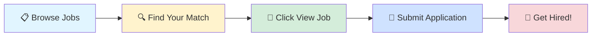

# 🚀 Tech Jobs Board

### Your Gateway to Amazing Career Opportunities

---

## 🎯 Browse by Job Profile

<table>
<tr>
<td align="center" width="25%">

 
<b>1000</b> total positions
</td>
<td align="center" width="25%">

 
<b>1000</b> total positions
</td>
<td align="center" width="25%">

 
<b>1000</b> total positions
</td>
<td align="center" width="25%">

 
<b>1000</b> total positions
</td>
</tr>
</table>

---

## 📊 Data Scientist

> 💼 **1000** positions available

<table>
<thead>
<tr>
<th width="20%">🏢 Company</th>
<th width="35%">💼 Role</th>
<th width="20%">📍 Location</th>
<th width="10%">⏰ Posted</th>
<th width="15%">🔗 Action</th>
</tr>
</thead>
<tbody>
<tr>
<td><a href="https://www.ambitionbox.com/overview/ibm-overview">IBM</a></td>
<td>Data Scientist-Artificial Intelligence</td>
<td>📍 Pune</td>
<td>1d ago</td>
<td align="center"></td>
</tr>
<tr>
<td><a href="https://www.ambitionbox.com/overview/ibm-overview">IBM</a></td>
<td>Data Scientist-Artificial Intelligence</td>
<td>📍 Gurugram</td>
<td>1d ago</td>
<td align="center"></td>
</tr>
<tr>
<td><a href="https://www.ambitionbox.com/overview/cloudxtreme-overview">Cloudxtreme</a></td>
<td>Automation Tester</td>
<td>📍 Gandhinagar</td>
<td>1d ago</td>
<td align="center"></td>
</tr>
<tr>
<td><a href="https://www.ambitionbox.com/overview/explarity-solutions-overview">Explarity Solutions</a></td>
<td>Software Developer Intern (UI/UX | Data Science | Frontend | Backend)</td>
<td>📍 Sangli</td>
<td>1d ago</td>
<td align="center"></td>
</tr>
<tr>
<td><a href="https://www.ambitionbox.com/overview/orion-systems-overview">ORION SYSTEMS</a></td>
<td>DevOps Engineer (Azure)</td>
<td>📍 India</td>
<td>2d ago</td>
<td align="center"></td>
</tr>
<tr>
<td><a href="https://www.ambitionbox.com/overview/dap-e-nnovative-solutions-pvt-dot-ltd-dot-overview">DAP E-nnovative Solutions</a></td>
<td>Artificial Intelligence Developer</td>
<td>📍 Bangalore</td>
<td>2d ago</td>
<td align="center"></td>
</tr>
<tr>
<td>Optiflux Technologies</td>
<td>Churn : Senior Data Scientist</td>
<td>📍 Bangalore</td>
<td>2d ago</td>
<td align="center"></td>
</tr>
<tr>
<td><a href="https://www.ambitionbox.com/overview/tcs-overview">Tata Consultancy Services</a></td>
<td>Java Aws Developer</td>
<td>📍 Pune, Hyderabad, Chennai</td>
<td>2d ago</td>
<td align="center"></td>
</tr>
<tr>
<td>Prefab Logic</td>
<td>AI/ML Integration Specialist</td>
<td>📍 Hyderabad</td>
<td>2d ago</td>
<td align="center"></td>
</tr>
<tr>
<td>Golden Opportunities</td>
<td>Ticket Analyst and Automation Architect - Lead</td>
<td>📍 Chennai</td>
<td>2d ago</td>
<td align="center"></td>
</tr>
<tr>
<td>Randstad</td>
<td>Network data scientist
</td>
<td>📍 Chennai</td>
<td>2d ago</td>
<td align="center"></td>
</tr>
<tr>
<td>Careernet</td>
<td>Analyst - COO Controls Automation</td>
<td>📍 Chennai</td>
<td>2d ago</td>
<td align="center"></td>
</tr>
<tr>
<td><a href="https://www.ambitionbox.com/overview/globant-overview">Clarice Technologie</a></td>
<td>Data Scientist and Vertex AI_Senior Analyst</td>
<td>📍 Mumbai</td>
<td>2d ago</td>
<td align="center"></td>
</tr>
<tr>
<td>Leading Client</td>
<td>Senior Data Scientist - Machine Learning</td>
<td>📍 Chennai</td>
<td>2d ago</td>
<td align="center"></td>
</tr>
<tr>
<td><a href="https://www.ambitionbox.com/overview/pfizer-overview">Pfizer</a></td>
<td>Senior Manager, Data Science and AI Technical Product Owner</td>
<td>📍 Mumbai</td>
<td>2d ago</td>
<td align="center"></td>
</tr>
<tr>
<td><a href="https://www.ambitionbox.com/overview/tredence-overview">Tredence</a></td>
<td>Senior Data Scientist</td>
<td>📍 Pune</td>
<td>2d ago</td>
<td align="center"></td>
</tr>
<tr>
<td>Leading Client</td>
<td>Data Analyst - Python Programming</td>
<td>📍 Chennai</td>
<td>2d ago</td>
<td align="center"></td>
</tr>
<tr>
<td><a href="https://www.ambitionbox.com/overview/overture-rede-overview">Overture Rede</a></td>
<td>Data Analyst (SQL Tableau )</td>
<td>📍 Chennai</td>
<td>2d ago</td>
<td align="center"></td>
</tr>
<tr>
<td><a href="https://www.ambitionbox.com/overview/hcl-technologies-overview">HCLTech</a></td>
<td>HCL Tech Hiring For Python Data Engineer Role</td>
<td>📍 Hyderabad</td>
<td>2d ago</td>
<td align="center"></td>
</tr>
<tr>
<td><a href="https://www.ambitionbox.com/overview/tcs-overview">Tata Consultancy Services</a></td>
<td>Azure AI Architect</td>
<td>📍 Hyderabad</td>
<td>2d ago</td>
<td align="center"></td>
</tr>
<tr>
<td><a href="https://www.ambitionbox.com/overview/accenture-overview">Accenture</a></td>
<td>S&C Global Network - AI - CDI - Data Science Analyst</td>
<td>📍 Hyderabad</td>
<td>2d ago</td>
<td align="center"></td>
</tr>
<tr>
<td><a href="https://www.ambitionbox.com/overview/capgemini-overview">Capgemini</a></td>
<td>Playwright/test automation with P&C</td>
<td>📍 Hyderabad</td>
<td>2d ago</td>
<td align="center"></td>
</tr>
<tr>
<td>Leading Client</td>
<td>Integration Developer - Python</td>
<td>📍 Gurugram</td>
<td>2d ago</td>
<td align="center"></td>
</tr>
<tr>
<td><a href="https://www.ambitionbox.com/overview/ibm-overview">IBM</a></td>
<td>Infrastructure Specialist-AWS DevOps</td>
<td>📍 Kochi</td>
<td>2d ago</td>
<td align="center"></td>
</tr>
<tr>
<td><a href="https://www.ambitionbox.com/overview/logitech-engineering-designs-overview">Logitech Sales Marketing</a></td>
<td>Sr. Audio ML Engineer</td>
<td>📍 Chennai</td>
<td>2d ago</td>
<td align="center"></td>
</tr>
<tr>
<td>Leading Client</td>
<td>Integration Developer - Python</td>
<td>📍 Noida</td>
<td>2d ago</td>
<td align="center"></td>
</tr>
<tr>
<td>Leading Client</td>
<td>Integration Developer - Python</td>
<td>📍 Delhi</td>
<td>2d ago</td>
<td align="center"></td>
</tr>
<tr>
<td>Leading Client</td>
<td>Senior Data Scientist - Machine Learning</td>
<td>📍 Noida</td>
<td>2d ago</td>
<td align="center"></td>
</tr>
<tr>
<td>Leading Client</td>
<td>Senior Data Scientist - Machine Learning</td>
<td>📍 Delhi</td>
<td>2d ago</td>
<td align="center"></td>
</tr>
<tr>
<td>Leading Client</td>
<td>Senior Data Scientist - Machine Learning</td>
<td>📍 Gurugram</td>
<td>2d ago</td>
<td align="center"></td>
</tr>
<tr>
<td><a href="https://www.ambitionbox.com/overview/accenture-overview">Accenture</a></td>
<td>AI/ML Computational Science Sr Analyst</td>
<td>📍 Bangalore</td>
<td>2d ago</td>
<td align="center"></td>
</tr>
<tr>
<td><a href="https://www.ambitionbox.com/overview/accenture-overview">Accenture</a></td>
<td>CAT Modelg & Analytics Specialist</td>
<td>📍 Bangalore</td>
<td>2d ago</td>
<td align="center"></td>
</tr>
<tr>
<td><a href="https://www.ambitionbox.com/overview/ibm-overview">IBM</a></td>
<td>Application Developer-Azure Cloud FullStack</td>
<td>📍 Bangalore</td>
<td>2d ago</td>
<td align="center"></td>
</tr>
<tr>
<td><a href="https://www.ambitionbox.com/overview/ibm-overview">IBM</a></td>
<td>Application Developer-Azure Cloud Full Stack</td>
<td>📍 Bangalore</td>
<td>2d ago</td>
<td align="center"></td>
</tr>
<tr>
<td><a href="https://www.ambitionbox.com/overview/cgi-group-overview">CGI</a></td>
<td>Lead Analyst - Azure Data Brick with ETL and Power BI</td>
<td>📍 Bangalore</td>
<td>2d ago</td>
<td align="center"></td>
</tr>
<tr>
<td><a href="https://www.ambitionbox.com/overview/telus-digital-overview">TELUS Digital</a></td>
<td>AWS Database Administrator</td>
<td>📍 Noida</td>
<td>2d ago</td>
<td align="center"></td>
</tr>
<tr>
<td><a href="https://www.ambitionbox.com/overview/accordion-india-overview">Accordion Partners</a></td>
<td>Accordion India (Formerly Merilytics) - Associate - Data & Analytics</td>
<td>📍 Hyderabad</td>
<td>2d ago</td>
<td align="center"></td>
</tr>
<tr>
<td>Leading Client</td>
<td>Integration Developer - Python</td>
<td>📍 Hyderabad</td>
<td>2d ago</td>
<td align="center"></td>
</tr>
<tr>
<td><a href="https://www.ambitionbox.com/overview/accenture-overview">Accenture</a></td>
<td>S&C Global Network - AI - CDI - Data Science Consultant</td>
<td>📍 Bangalore</td>
<td>2d ago</td>
<td align="center"></td>
</tr>
<tr>
<td><a href="https://www.ambitionbox.com/overview/evernorth-overview">Cigna Medical Group</a></td>
<td>HIH - Database Administration Advisor Postgres/SQL</td>
<td>📍 Hyderabad</td>
<td>2d ago</td>
<td align="center"></td>
</tr>
<tr>
<td>Leading Client</td>
<td>Integration Developer - Python</td>
<td>📍 Chennai</td>
<td>2d ago</td>
<td align="center"></td>
</tr>
<tr>
<td><a href="https://www.ambitionbox.com/overview/amgen-overview">Amgen Inc</a></td>
<td>Specialist Software Engineer - R&D Omics</td>
<td>📍 Hyderabad</td>
<td>2d ago</td>
<td align="center"></td>
</tr>
<tr>
<td>Leading Client</td>
<td>Senior Data Scientist - Machine Learning</td>
<td>📍 Hyderabad</td>
<td>2d ago</td>
<td align="center"></td>
</tr>
<tr>
<td>Leading Client</td>
<td>Senior Data Scientist - Machine Learning</td>
<td>📍 Hyderabad</td>
<td>2d ago</td>
<td align="center"></td>
</tr>
<tr>
<td>Leading Client</td>
<td>Integration Developer - Python</td>
<td>📍 Mumbai</td>
<td>2d ago</td>
<td align="center"></td>
</tr>
<tr>
<td><a href="https://www.ambitionbox.com/overview/kezan-consulting-overview">Kezan Consulting</a></td>
<td>Python Automation Test Engineer-Immediate Joiner</td>
<td>📍 Mumbai Suburban</td>
<td>2d ago</td>
<td align="center"></td>
</tr>
<tr>
<td><a href="https://www.ambitionbox.com/overview/indian-financial-technology-and-allied-services-overview">Indian Financial Technology And Alliedservices</a></td>
<td>Tableau Developer and Configuration Specialist</td>
<td>📍 Mumbai</td>
<td>2d ago</td>
<td align="center"></td>
</tr>
<tr>
<td><a href="https://www.ambitionbox.com/overview/aspire-systems-overview">Aspire Systems</a></td>
<td>ETL Testing - SSIS, SQL, Azure - 5 To 7.5 Years - Chennai -</td>
<td>📍 Kochi</td>
<td>2d ago</td>
<td align="center"></td>
</tr>
<tr>
<td><a href="https://www.ambitionbox.com/overview/accenture-overview">Accenture</a></td>
<td>AI / ML Engineer</td>
<td>📍 Bhubaneswar</td>
<td>2d ago</td>
<td align="center"></td>
</tr>
<tr>
<td><a href="https://www.ambitionbox.com/overview/accenture-overview">Accenture</a></td>
<td>AI / ML Engineer</td>
<td>📍 Bhubaneswar</td>
<td>2d ago</td>
<td align="center"></td>
</tr>
<tr>
<td>Leading Client</td>
<td>Senior Data Scientist - Machine Learning</td>
<td>📍 Mumbai</td>
<td>2d ago</td>
<td align="center"></td>
</tr>
<tr>
<td><a href="https://www.ambitionbox.com/overview/jpmorgan-chase-and-co-dot-overview">JPMorgan Chase Bank</a></td>
<td>Data Scientist Associate Senior</td>
<td>📍 Bangalore</td>
<td>2d ago</td>
<td align="center"></td>
</tr>
<tr>
<td>Leading Client</td>
<td>Integration Developer - Python</td>
<td>📍 Ahmedabad</td>
<td>2d ago</td>
<td align="center"></td>
</tr>
<tr>
<td><a href="https://www.ambitionbox.com/overview/reuters-overview">Reuters</a></td>
<td>Lead Data Scientist</td>
<td>📍 Hyderabad</td>
<td>2d ago</td>
<td align="center"></td>
</tr>
<tr>
<td><a href="https://www.ambitionbox.com/overview/jpmorgan-chase-and-co-dot-overview">JPMorgan Chase Bank</a></td>
<td>Associate- Break Resolution and Analytics team</td>
<td>📍 Bangalore</td>
<td>2d ago</td>
<td align="center"></td>
</tr>
<tr>
<td>Client of Augusta Infotech</td>
<td>Modern Data Engineer - Python, Pyspark, AWS, Data Lake</td>
<td>📍 Bangalore</td>
<td>2d ago</td>
<td align="center"></td>
</tr>
<tr>
<td><a href="https://www.ambitionbox.com/overview/wipro-enterprises-ltd-overview">WIPRO GE HEALTHCARE PRIVATE LIMITED</a></td>
<td>Staff Data Scientist</td>
<td>📍 Bangalore</td>
<td>2d ago</td>
<td align="center"></td>
</tr>
<tr>
<td>Leading Client</td>
<td>Senior Data Scientist - Machine Learning</td>
<td>📍 Kolkata</td>
<td>2d ago</td>
<td align="center"></td>
</tr>
<tr>
<td><a href="https://www.ambitionbox.com/overview/moniepoint-overview">Moniepoint</a></td>
<td>Data Science Manager (Credit)</td>
<td>📍 Bangalore</td>
<td>2d ago</td>
<td align="center"></td>
</tr>
<tr>
<td><a href="https://www.ambitionbox.com/overview/infogain-overview">Infogain</a></td>
<td>Azure Data Engineer (Standard)</td>
<td>📍 Mumbai</td>
<td>2d ago</td>
<td align="center"></td>
</tr>
<tr>
<td>Leading Client</td>
<td>Senior Data Scientist - Machine Learning</td>
<td>📍 Ahmedabad</td>
<td>2d ago</td>
<td align="center"></td>
</tr>
<tr>
<td>Leading Client</td>
<td>Integration Developer - Python</td>
<td>📍 Kolkata</td>
<td>2d ago</td>
<td align="center"></td>
</tr>
<tr>
<td><a href="https://www.ambitionbox.com/overview/jpmorgan-chase-and-co-dot-overview">JPMorgan Chase Bank</a></td>
<td>Data Visualization Associate Senior - Tableau, Alteryx, SQL</td>
<td>📍 Bangalore</td>
<td>2d ago</td>
<td align="center"></td>
</tr>
<tr>
<td><a href="https://www.ambitionbox.com/overview/infogain-overview">Infogain</a></td>
<td>Azure Data Architect (Senior)</td>
<td>📍 Bangalore</td>
<td>2d ago</td>
<td align="center"></td>
</tr>
<tr>
<td><a href="https://www.ambitionbox.com/overview/tcs-overview">Tata Consultancy Services</a></td>
<td>Pyspark Developer</td>
<td>📍 Hyderabad</td>
<td>2d ago</td>
<td align="center"></td>
</tr>
<tr>
<td><a href="https://www.ambitionbox.com/overview/hcl-technologies-overview">HCLTech</a></td>
<td>Technical Lead-Automation</td>
<td>📍 Noida</td>
<td>2d ago</td>
<td align="center"></td>
</tr>
<tr>
<td><a href="https://www.ambitionbox.com/overview/jpmorgan-chase-and-co-dot-overview">JPMorgan Chase Bank</a></td>
<td>BB Strategic Analytics Associate</td>
<td>📍 Bangalore</td>
<td>2d ago</td>
<td align="center"></td>
</tr>
<tr>
<td><a href="https://www.ambitionbox.com/overview/infogain-overview">Infogain</a></td>
<td>AI / ML Developer (Lead)</td>
<td>📍 Bangalore</td>
<td>2d ago</td>
<td align="center"></td>
</tr>
<tr>
<td>Leading Client</td>
<td>Integration Developer - Python</td>
<td>📍 Pune</td>
<td>2d ago</td>
<td align="center"></td>
</tr>
<tr>
<td>Continuity 1</td>
<td>Tech Lead - .Net Core + Azure + Angular</td>
<td>📍 Pune</td>
<td>2d ago</td>
<td align="center"></td>
</tr>
<tr>
<td><a href="https://www.ambitionbox.com/overview/citiustech-overview">Citiustech</a></td>
<td>Automation Testing Lead (Selenium, Java with API)</td>
<td>📍 Pune</td>
<td>2d ago</td>
<td align="center"></td>
</tr>
<tr>
<td><a href="https://www.ambitionbox.com/overview/swits-digital-overview">Swits Digital</a></td>
<td>Python Developer (React)</td>
<td>📍 Chennai</td>
<td>2d ago</td>
<td align="center"></td>
</tr>
<tr>
<td>Eyeota</td>
<td>Associate, Data Operations (R- 18650)</td>
<td>📍 Pune</td>
<td>2d ago</td>
<td align="center"></td>
</tr>
<tr>
<td>Leading Client</td>
<td>Senior Data Scientist - Machine Learning</td>
<td>📍 Pune</td>
<td>2d ago</td>
<td align="center"></td>
</tr>
<tr>
<td><a href="https://www.ambitionbox.com/overview/wtw-global-delivery-and-solutions-overview">WTW Global Delivery And Solutions</a></td>
<td>Business Analyst - Global Sales Analytics</td>
<td>📍 Thane</td>
<td>2d ago</td>
<td align="center"></td>
</tr>
<tr>
<td><a href="https://www.ambitionbox.com/overview/accenture-overview">Accenture</a></td>
<td>Data Science Practitioner</td>
<td>📍 Bangalore</td>
<td>2d ago</td>
<td align="center"></td>
</tr>
<tr>
<td>Elevance Health Inc</td>
<td>Business Analyst, SQL - Lead BA - GR - 39702 -70857 - JR174532</td>
<td>📍 Gurugram</td>
<td>2d ago</td>
<td align="center"></td>
</tr>
<tr>
<td>Leading Client</td>
<td>Senior Data Scientist - Machine Learning</td>
<td>📍 Kolkata</td>
<td>2d ago</td>
<td align="center"></td>
</tr>
<tr>
<td><a href="https://www.ambitionbox.com/overview/qatar-airways-overview">Qatar Airways</a></td>
<td>Business Analyst Data Analytics</td>
<td>📍 Ahmedabad</td>
<td>2d ago</td>
<td align="center"></td>
</tr>
<tr>
<td><a href="https://www.ambitionbox.com/overview/harman-overview">HARMAN</a></td>
<td>Principal Specialist Product Costing & Analytics</td>
<td>📍 Bangalore</td>
<td>2d ago</td>
<td align="center"></td>
</tr>
<tr>
<td>Elevance Health Inc</td>
<td>Business Analyst, SQL - Sr Business Analyst - GR</td>
<td>📍 Gurugram</td>
<td>2d ago</td>
<td align="center"></td>
</tr>
<tr>
<td><a href="https://www.ambitionbox.com/overview/tcs-overview">Tata Consultancy Services</a></td>
<td>Data Engineer (Palantir + Pyspark)</td>
<td>📍 Bangalore Rural</td>
<td>2d ago</td>
<td align="center"></td>
</tr>
<tr>
<td><a href="https://www.ambitionbox.com/overview/transight-systems-pvt-ltd-overview">Transight Systems</a></td>
<td>Programme Manager (Telematics R&D)</td>
<td>📍 Kochi</td>
<td>2d ago</td>
<td align="center"></td>
</tr>
<tr>
<td><a href="https://www.ambitionbox.com/overview/ernst-young-overview">EY</a></td>
<td>Data Science (GEN AI/ AI ML)- Interview - EY GDS Bangalore - 22nd Nov</td>
<td>📍 Bangalore</td>
<td>2d ago</td>
<td align="center"></td>
</tr>
<tr>
<td><a href="https://www.ambitionbox.com/overview/ics-instrumentation-and-control-solution-overview">ICS Instrumentation & Control Solution</a></td>
<td>Head Opertions- Industrial Automation</td>
<td>📍 Indore</td>
<td>2d ago</td>
<td align="center"></td>
</tr>
<tr>
<td><a href="https://www.ambitionbox.com/overview/ibm-overview">IBM</a></td>
<td>Application Developer-AWS Cloud FullStack</td>
<td>📍 Pune</td>
<td>2d ago</td>
<td align="center"></td>
</tr>
<tr>
<td>Emperen Technologies</td>
<td>IBM ELM Plugin Developer - Python</td>
<td>📍 Mumbai</td>
<td>2d ago</td>
<td align="center"></td>
</tr>
<tr>
<td><a href="https://www.ambitionbox.com/overview/ernst-young-overview">EY</a></td>
<td>EY - GDS Consulting - AI and DATA - Data Science- Senior</td>
<td>📍 Bangalore</td>
<td>2d ago</td>
<td align="center"></td>
</tr>
<tr>
<td><a href="https://www.ambitionbox.com/overview/ibm-overview">IBM</a></td>
<td>Package Consultant-Oracle Business Analytics Cloud</td>
<td>📍 Pune</td>
<td>2d ago</td>
<td align="center"></td>
</tr>
<tr>
<td><a href="https://www.ambitionbox.com/overview/sopra-steria-overview">Sopra Steria</a></td>
<td>R&D Senior Business Consultant</td>
<td>📍 Noida</td>
<td>2d ago</td>
<td align="center"></td>
</tr>
<tr>
<td>BhaiFi.com</td>
<td>ML Developer with Cybersecurity</td>
<td>📍 Gurugram</td>
<td>2d ago</td>
<td align="center"></td>
</tr>
<tr>
<td>Emperen Technologies</td>
<td>IBM ELM Plugin Developer - Python</td>
<td>📍 Delhi</td>
<td>2d ago</td>
<td align="center"></td>
</tr>
<tr>
<td><a href="https://www.ambitionbox.com/overview/capgemini-overview">Capgemini</a></td>
<td>Gen AI+GCP Developer</td>
<td>📍 Gurugram</td>
<td>2d ago</td>
<td align="center"></td>
</tr>
<tr>
<td>Emperen Technologies</td>
<td>IBM ELM Plugin Developer - Python</td>
<td>📍 Kolkata</td>
<td>2d ago</td>
<td align="center"></td>
</tr>
<tr>
<td>G R Consultants</td>
<td>Urgent hiring For Fullstack Python-Hyderabad-Immediate Joiner</td>
<td>📍 Hyderabad</td>
<td>2d ago</td>
<td align="center"></td>
</tr>
<tr>
<td><a href="https://www.ambitionbox.com/overview/edulearnntech-technologies-overview">Edulearnntech Technologies Bangalore</a></td>
<td>Python Fullstack Trainer</td>
<td>📍 Bangalore</td>
<td>2d ago</td>
<td align="center"></td>
</tr>
<tr>
<td>Crossing Hurdles</td>
<td>Senior Analytics Engineer (Remote)</td>
<td></td>
<td>2d ago</td>
<td align="center"></td>
</tr>
<tr>
<td>Crossing Hurdles</td>
<td>Analytics Engineer (Remote)</td>
<td></td>
<td>2d ago</td>
<td align="center"></td>
</tr>
<tr>
<td><a href="https://www.ambitionbox.com/overview/becton-dickinson-overview">Becton Dickinson</a></td>
<td>Data Analyst - SQL, Excel & Python (Coding & Development)</td>
<td>📍 Gurugram</td>
<td>2d ago</td>
<td align="center"></td>
</tr>
<tr>
<td>MSys</td>
<td>Senior Python Developer</td>
<td>📍 Hyderabad</td>
<td>2d ago</td>
<td align="center"></td>
</tr>
<tr><td colspan="5" align="center"><i>... and 900 more positions</i></td></tr>
</tbody>
</table>

---

## 💼 Business Analyst

> 💼 **1000** positions available

<table>
<thead>
<tr>
<th width="20%">🏢 Company</th>
<th width="35%">💼 Role</th>
<th width="20%">📍 Location</th>
<th width="10%">⏰ Posted</th>
<th width="15%">🔗 Action</th>
</tr>
</thead>
<tbody>
<tr>
<td><a href="https://www.ambitionbox.com/overview/ernst-young-overview">EY</a></td>
<td>Senior Associate - Business Analyst</td>
<td>📍 Kochi</td>
<td>1d ago</td>
<td align="center"></td>
</tr>
<tr>
<td><a href="https://www.ambitionbox.com/overview/qatar-airways-overview">Qatar Airways</a></td>
<td>Senior Digital Delivery Lead Scrum Master</td>
<td>📍 Ahmedabad</td>
<td>1d ago</td>
<td align="center"></td>
</tr>
<tr>
<td><a href="https://www.ambitionbox.com/overview/barclays-shared-services-overview">Barclaycard Payments</a></td>
<td>Scrum Master-AVP</td>
<td>📍 Pune</td>
<td>1d ago</td>
<td align="center"></td>
</tr>
<tr>
<td><a href="https://www.ambitionbox.com/overview/barclays-shared-services-overview">Barclaycard Payments</a></td>
<td>Scrum Master</td>
<td>📍 Pune</td>
<td>1d ago</td>
<td align="center"></td>
</tr>
<tr>
<td><a href="https://www.ambitionbox.com/overview/cloudxtreme-overview">Cloudxtreme</a></td>
<td>Agile Project Manager at Mphasis, Pune</td>
<td>📍 Pune</td>
<td>1d ago</td>
<td align="center"></td>
</tr>
<tr>
<td><a href="https://www.ambitionbox.com/overview/vernost-marketing-technology-solutions-overview">Vernost Marketing</a></td>
<td>Business Analyst</td>
<td>📍 Mumbai</td>
<td>1d ago</td>
<td align="center"></td>
</tr>
<tr>
<td><a href="https://www.ambitionbox.com/overview/s-and-p-global-overview">S&P Global Market Intelligence</a></td>
<td>Senior Software Developer  (Scrum Master)</td>
<td>📍 Noida</td>
<td>1d ago</td>
<td align="center"></td>
</tr>
<tr>
<td><a href="https://www.ambitionbox.com/overview/hcl-technologies-overview">HCLTech</a></td>
<td>Program Manager/Project Management</td>
<td>📍 Noida</td>
<td>1d ago</td>
<td align="center"></td>
</tr>
<tr>
<td><a href="https://www.ambitionbox.com/overview/fortis-healthcare-overview">Fortis</a></td>
<td>Deputy Manager/Manager : IT Business Applications (Project Management)</td>
<td>📍 Gurugram</td>
<td>1d ago</td>
<td align="center"></td>
</tr>
<tr>
<td><a href="https://www.ambitionbox.com/overview/cloudxtreme-overview">Cloudxtreme</a></td>
<td>Automation Tester</td>
<td>📍 Gandhinagar</td>
<td>1d ago</td>
<td align="center"></td>
</tr>
<tr>
<td>Turbotech Global Business Solutions Llp</td>
<td>Senior Salesforce Developer (8+ Years Experience)</td>
<td>📍 Bangalore</td>
<td>2d ago</td>
<td align="center"></td>
</tr>
<tr>
<td><a href="https://www.ambitionbox.com/overview/turnberry-solutions-overview">Turnberry Solutions</a></td>
<td>Salesforce Omnistudio Developer</td>
<td></td>
<td>2d ago</td>
<td align="center"></td>
</tr>
<tr>
<td>Red Rock Natural Iron Ore</td>
<td>Project Management Consultant</td>
<td>📍 Belgaum</td>
<td>2d ago</td>
<td align="center"></td>
</tr>
<tr>
<td>Golden Opportunities</td>
<td>Ticket Analyst and Automation Architect - Lead</td>
<td>📍 Chennai</td>
<td>2d ago</td>
<td align="center"></td>
</tr>
<tr>
<td>Careernet</td>
<td>Analyst - COO Controls Automation</td>
<td>📍 Chennai</td>
<td>2d ago</td>
<td align="center"></td>
</tr>
<tr>
<td><a href="https://www.ambitionbox.com/overview/artmac-soft-overview">Artmac Soft</a></td>
<td>Business Analyst - Contract & Subscription Model</td>
<td>📍 Chennai</td>
<td>2d ago</td>
<td align="center"></td>
</tr>
<tr>
<td>Leading Client</td>
<td>Data Analyst - Python Programming</td>
<td>📍 Chennai</td>
<td>2d ago</td>
<td align="center"></td>
</tr>
<tr>
<td>Send CV to cv.ch1@adonisstaff.in / Tier1...</td>
<td>Executive - OEM Sales / BD / New Business Analyst (Auto / Steel MNC)</td>
<td>📍 Sriperumbudur</td>
<td>2d ago</td>
<td align="center"></td>
</tr>
<tr>
<td><a href="https://www.ambitionbox.com/overview/blackstraw-ai-overview">Blackstraw Technologies</a></td>
<td>Senior Technical Business Analyst - Spot Offer- Immediate Joiner</td>
<td>📍 Chennai</td>
<td>2d ago</td>
<td align="center"></td>
</tr>
<tr>
<td><a href="https://www.ambitionbox.com/overview/overture-rede-overview">Overture Rede</a></td>
<td>Data Analyst (SQL Tableau )</td>
<td>📍 Chennai</td>
<td>2d ago</td>
<td align="center"></td>
</tr>
<tr>
<td><a href="https://www.ambitionbox.com/overview/hcl-technologies-overview">HCLTech</a></td>
<td>HCL Tech Hiring For Python Data Engineer Role</td>
<td>📍 Hyderabad</td>
<td>2d ago</td>
<td align="center"></td>
</tr>
<tr>
<td><a href="https://www.ambitionbox.com/overview/pwc-overview">PwC Service Delivery Center</a></td>
<td>Business Analyst Property & Casualty Insurance -4-12Y-PWC SDC</td>
<td>📍 Kolkata</td>
<td>2d ago</td>
<td align="center"></td>
</tr>
<tr>
<td><a href="https://www.ambitionbox.com/overview/capgemini-overview">Capgemini</a></td>
<td>Playwright/test automation with P&C</td>
<td>📍 Hyderabad</td>
<td>2d ago</td>
<td align="center"></td>
</tr>
<tr>
<td>Leading Client</td>
<td>Integration Developer - Python</td>
<td>📍 Gurugram</td>
<td>2d ago</td>
<td align="center"></td>
</tr>
<tr>
<td><a href="https://www.ambitionbox.com/overview/light-and-wonder-overview">Light & Wonder</a></td>
<td>Oracle QTC & Agile PLM</td>
<td>📍 Chennai</td>
<td>2d ago</td>
<td align="center"></td>
</tr>
<tr>
<td>Leading Client</td>
<td>Integration Developer - Python</td>
<td>📍 Noida</td>
<td>2d ago</td>
<td align="center"></td>
</tr>
<tr>
<td>Leading Client</td>
<td>Integration Developer - Python</td>
<td>📍 Delhi</td>
<td>2d ago</td>
<td align="center"></td>
</tr>
<tr>
<td><a href="https://www.ambitionbox.com/overview/nokia-overview">Nokia</a></td>
<td>Customer Documentation Developer</td>
<td>📍 Bangalore</td>
<td>2d ago</td>
<td align="center"></td>
</tr>
<tr>
<td><a href="https://www.ambitionbox.com/overview/pwc-overview">PwC Service Delivery Center</a></td>
<td>Senior Associate Salesforce Developer Enterprise Apps-SFDC Advisory</td>
<td>📍 Bangalore</td>
<td>2d ago</td>
<td align="center"></td>
</tr>
<tr>
<td><a href="https://www.ambitionbox.com/overview/accenture-overview">Accenture</a></td>
<td>CAT Modelg & Analytics Specialist</td>
<td>📍 Bangalore</td>
<td>2d ago</td>
<td align="center"></td>
</tr>
<tr>
<td><a href="https://www.ambitionbox.com/overview/cgi-group-overview">CGI</a></td>
<td>Lead Analyst - Azure Data Brick with ETL and Power BI</td>
<td>📍 Bangalore</td>
<td>2d ago</td>
<td align="center"></td>
</tr>
<tr>
<td><a href="https://www.ambitionbox.com/overview/iris-software-overview">Iris Software</a></td>
<td>Salesforce BA/QA - Lead</td>
<td>📍 Noida</td>
<td>2d ago</td>
<td align="center"></td>
</tr>
<tr>
<td><a href="https://www.ambitionbox.com/overview/innova-solutions-overview">Innova Solutions</a></td>
<td>Salesforce cloud developer</td>
<td>📍 Hyderabad</td>
<td>2d ago</td>
<td align="center"></td>
</tr>
<tr>
<td><a href="https://www.ambitionbox.com/overview/iris-software-overview">Iris Software</a></td>
<td>Salesforce BA/QA - Lead</td>
<td>📍 Noida</td>
<td>2d ago</td>
<td align="center"></td>
</tr>
<tr>
<td><a href="https://www.ambitionbox.com/overview/cambridge-technology-enterprises-overview">CAMBRIDGE TECHNOLOGY ENTERPRISES (CTE)</a></td>
<td>Salesforce Developer - Conga</td>
<td>📍 Hyderabad</td>
<td>2d ago</td>
<td align="center"></td>
</tr>
<tr>
<td><a href="https://www.ambitionbox.com/overview/accordion-india-overview">Accordion Partners</a></td>
<td>Accordion India (Formerly Merilytics) - Associate - Data & Analytics</td>
<td>📍 Hyderabad</td>
<td>2d ago</td>
<td align="center"></td>
</tr>
<tr>
<td>Leading Client</td>
<td>Integration Developer - Python</td>
<td>📍 Hyderabad</td>
<td>2d ago</td>
<td align="center"></td>
</tr>
<tr>
<td><a href="https://www.ambitionbox.com/overview/evernorth-overview">Cigna Medical Group</a></td>
<td>HIH - Database Administration Advisor Postgres/SQL</td>
<td>📍 Hyderabad</td>
<td>2d ago</td>
<td align="center"></td>
</tr>
<tr>
<td>Leading Client</td>
<td>Integration Developer - Python</td>
<td>📍 Chennai</td>
<td>2d ago</td>
<td align="center"></td>
</tr>
<tr>
<td><a href="https://www.ambitionbox.com/overview/cloudxtreme-overview">Cloudxtreme</a></td>
<td>Business Analyst IAM Asset/Account Governance & CMDB</td>
<td>📍 Kolkata</td>
<td>2d ago</td>
<td align="center"></td>
</tr>
<tr>
<td><a href="https://www.ambitionbox.com/overview/thought-focus-overview">ThoughtFocus</a></td>
<td>Business Analyst</td>
<td>📍 Bangalore</td>
<td>2d ago</td>
<td align="center"></td>
</tr>
<tr>
<td><a href="https://www.ambitionbox.com/overview/kasmo-cloud-solutions-overview">Kasmo Cloud Solutions</a></td>
<td>Salesforce Business Analyst</td>
<td>📍 Bangalore</td>
<td>2d ago</td>
<td align="center"></td>
</tr>
<tr>
<td><a href="https://www.ambitionbox.com/overview/infinite-computer-solutions-overview">Infinite</a></td>
<td>Lead Business Analyst</td>
<td>📍 Bangalore</td>
<td>2d ago</td>
<td align="center"></td>
</tr>
<tr>
<td><a href="https://www.ambitionbox.com/overview/vaps-technosoft-overview">Vaps Technosoft</a></td>
<td>Business Analyst</td>
<td>📍 Bangalore</td>
<td>2d ago</td>
<td align="center"></td>
</tr>
<tr>
<td><a href="https://www.ambitionbox.com/overview/tata-realty-and-infrastructure-overview">Tata Realty</a></td>
<td>Business Analyst</td>
<td>📍 Bangalore</td>
<td>2d ago</td>
<td align="center"></td>
</tr>
<tr>
<td>Corenza</td>
<td>Business Analyst - Portfolio Finance | CA/MBA</td>
<td>📍 Bangalore</td>
<td>2d ago</td>
<td align="center"></td>
</tr>
<tr>
<td><a href="https://www.ambitionbox.com/overview/geekyants-software-overview">Geekyants</a></td>
<td>Associate Business Analyst</td>
<td>📍 Bangalore</td>
<td>2d ago</td>
<td align="center"></td>
</tr>
<tr>
<td>Leading Client</td>
<td>Integration Developer - Python</td>
<td>📍 Mumbai</td>
<td>2d ago</td>
<td align="center"></td>
</tr>
<tr>
<td><a href="https://www.ambitionbox.com/overview/kezan-consulting-overview">Kezan Consulting</a></td>
<td>Python Automation Test Engineer-Immediate Joiner</td>
<td>📍 Mumbai Suburban</td>
<td>2d ago</td>
<td align="center"></td>
</tr>
<tr>
<td>Nextwebi IT solutions Pvt ltd</td>
<td>Business Analyst Client Communication, Proposals & Sales Support</td>
<td>📍 Bangalore</td>
<td>2d ago</td>
<td align="center"></td>
</tr>
<tr>
<td><a href="https://www.ambitionbox.com/overview/victrix-systems-and-labs-overview">Victrix Systems And Labs</a></td>
<td>Business Analyst - ServiceNow CSDM</td>
<td>📍 Bangalore</td>
<td>2d ago</td>
<td align="center"></td>
</tr>
<tr>
<td><a href="https://www.ambitionbox.com/overview/indian-financial-technology-and-allied-services-overview">Indian Financial Technology And Alliedservices</a></td>
<td>Tableau Developer and Configuration Specialist</td>
<td>📍 Mumbai</td>
<td>2d ago</td>
<td align="center"></td>
</tr>
<tr>
<td><a href="https://www.ambitionbox.com/overview/overture-rede-overview">Overture Rede</a></td>
<td>Salesforce Business Analyst</td>
<td>📍 Bangalore</td>
<td>2d ago</td>
<td align="center"></td>
</tr>
<tr>
<td><a href="https://www.ambitionbox.com/overview/trelleborg-overview">Trelleborg</a></td>
<td>SAP Business Analyst Data Migrations</td>
<td>📍 Bangalore</td>
<td>2d ago</td>
<td align="center"></td>
</tr>
<tr>
<td>Leading Client</td>
<td>EDI Business Analyst</td>
<td>📍 Bangalore</td>
<td>2d ago</td>
<td align="center"></td>
</tr>
<tr>
<td>Acara Solutions</td>
<td>Business Analyst</td>
<td>📍 Coimbatore</td>
<td>2d ago</td>
<td align="center"></td>
</tr>
<tr>
<td><a href="https://www.ambitionbox.com/overview/luxoft-overview">Luxoft</a></td>
<td>Murex Back Office Business Analyst</td>
<td>📍 Bangalore</td>
<td>2d ago</td>
<td align="center"></td>
</tr>
<tr>
<td><a href="https://www.ambitionbox.com/overview/aspire-systems-overview">Aspire Systems</a></td>
<td>ETL Testing - SSIS, SQL, Azure - 5 To 7.5 Years - Chennai -</td>
<td>📍 Kochi</td>
<td>2d ago</td>
<td align="center"></td>
</tr>
<tr>
<td>PwC India</td>
<td>Business Analyst</td>
<td>📍 Bangalore</td>
<td>2d ago</td>
<td align="center"></td>
</tr>
<tr>
<td><a href="https://www.ambitionbox.com/overview/bmw-techworks-india-overview">BMW Techworks India</a></td>
<td>Business Analyst</td>
<td>📍 Bangalore</td>
<td>2d ago</td>
<td align="center"></td>
</tr>
<tr>
<td>Leading Client</td>
<td>Integration Developer - Python</td>
<td>📍 Ahmedabad</td>
<td>2d ago</td>
<td align="center"></td>
</tr>
<tr>
<td><a href="https://www.ambitionbox.com/overview/jpmorgan-chase-and-co-dot-overview">JPMorgan Chase Bank</a></td>
<td>Associate- Break Resolution and Analytics team</td>
<td>📍 Bangalore</td>
<td>2d ago</td>
<td align="center"></td>
</tr>
<tr>
<td><a href="https://www.ambitionbox.com/overview/natwest-group-overview">Natwest Digitalx</a></td>
<td>Business Analyst</td>
<td>📍 Bangalore</td>
<td>2d ago</td>
<td align="center"></td>
</tr>
<tr>
<td><a href="https://www.ambitionbox.com/overview/commerceiq-overview">CommerceIQ</a></td>
<td>Business Analyst- I</td>
<td>📍 Bangalore</td>
<td>2d ago</td>
<td align="center"></td>
</tr>
<tr>
<td>Client of Augusta Infotech</td>
<td>Modern Data Engineer - Python, Pyspark, AWS, Data Lake</td>
<td>📍 Bangalore</td>
<td>2d ago</td>
<td align="center"></td>
</tr>
<tr>
<td><a href="https://www.ambitionbox.com/overview/accenture-overview">Accenture</a></td>
<td>Business Process Architect</td>
<td>📍 Bangalore</td>
<td>2d ago</td>
<td align="center"></td>
</tr>
<tr>
<td><a href="https://www.ambitionbox.com/overview/accenture-overview">Accenture</a></td>
<td>Business Process Architect</td>
<td>📍 Bangalore</td>
<td>2d ago</td>
<td align="center"></td>
</tr>
<tr>
<td><a href="https://www.ambitionbox.com/overview/accenture-overview">Accenture</a></td>
<td>Business Process Designer</td>
<td>📍 Bangalore</td>
<td>2d ago</td>
<td align="center"></td>
</tr>
<tr>
<td>Lib Cap Infotech</td>
<td>Murex Consulant /Business Analyst _BO/FO_Devops</td>
<td>📍 Kolkata</td>
<td>2d ago</td>
<td align="center"></td>
</tr>
<tr>
<td><a href="https://www.ambitionbox.com/overview/accenture-overview">Accenture</a></td>
<td>Business Process Architect</td>
<td>📍 Bangalore</td>
<td>2d ago</td>
<td align="center"></td>
</tr>
<tr>
<td><a href="https://www.ambitionbox.com/overview/accenture-overview">Accenture</a></td>
<td>Business Process Designer</td>
<td>📍 Bangalore</td>
<td>2d ago</td>
<td align="center"></td>
</tr>
<tr>
<td><a href="https://www.ambitionbox.com/overview/accenture-overview">Accenture</a></td>
<td>Business Process Designer</td>
<td>📍 Bangalore</td>
<td>2d ago</td>
<td align="center"></td>
</tr>
<tr>
<td><a href="https://www.ambitionbox.com/overview/accenture-overview">Accenture</a></td>
<td>Business Process Designer</td>
<td>📍 Bangalore</td>
<td>2d ago</td>
<td align="center"></td>
</tr>
<tr>
<td><a href="https://www.ambitionbox.com/overview/accenture-overview">Accenture</a></td>
<td>Business Process Designer</td>
<td>📍 Bangalore</td>
<td>2d ago</td>
<td align="center"></td>
</tr>
<tr>
<td>Leading Client</td>
<td>Integration Developer - Python</td>
<td>📍 Kolkata</td>
<td>2d ago</td>
<td align="center"></td>
</tr>
<tr>
<td>Bell Textron</td>
<td>Sr. Business Analyst - Ariba</td>
<td>📍 Bangalore</td>
<td>2d ago</td>
<td align="center"></td>
</tr>
<tr>
<td>Crescendo Global Leadership Hiring India</td>
<td>MI Report Developer || Power BI Developer</td>
<td>📍 Bangalore</td>
<td>2d ago</td>
<td align="center"></td>
</tr>
<tr>
<td><a href="https://www.ambitionbox.com/overview/victrix-systems-and-labs-overview">Victrix Systems And Labs</a></td>
<td>Business Analyst - ServiceNow CSDM</td>
<td>📍 Kolkata</td>
<td>2d ago</td>
<td align="center"></td>
</tr>
<tr>
<td><a href="https://www.ambitionbox.com/overview/jpmorgan-chase-and-co-dot-overview">JPMorgan Chase Bank</a></td>
<td>Data Visualization Associate Senior - Tableau, Alteryx, SQL</td>
<td>📍 Bangalore</td>
<td>2d ago</td>
<td align="center"></td>
</tr>
<tr>
<td><a href="https://www.ambitionbox.com/overview/hcl-technologies-overview">HCLTech</a></td>
<td>Technical Lead-Automation</td>
<td>📍 Noida</td>
<td>2d ago</td>
<td align="center"></td>
</tr>
<tr>
<td><a href="https://www.ambitionbox.com/overview/jpmorgan-chase-and-co-dot-overview">JPMorgan Chase Bank</a></td>
<td>BB Strategic Analytics Associate</td>
<td>📍 Bangalore</td>
<td>2d ago</td>
<td align="center"></td>
</tr>
<tr>
<td><a href="https://www.ambitionbox.com/overview/aligned-automation-overview">Aligned Automation</a></td>
<td>Business Analyst ( GxP / GMP )</td>
<td>📍 Indore</td>
<td>2d ago</td>
<td align="center"></td>
</tr>
<tr>
<td><a href="https://www.ambitionbox.com/overview/nway-technologies-overview">Nway Technologies</a></td>
<td>Business Analyst (ERP)</td>
<td>📍 Indore</td>
<td>2d ago</td>
<td align="center"></td>
</tr>
<tr>
<td><a href="https://www.ambitionbox.com/overview/overture-rede-overview">Overture Rede</a></td>
<td>Salesforce Business Analyst</td>
<td>📍 Noida</td>
<td>2d ago</td>
<td align="center"></td>
</tr>
<tr>
<td>Leading Client</td>
<td>Integration Developer - Python</td>
<td>📍 Pune</td>
<td>2d ago</td>
<td align="center"></td>
</tr>
<tr>
<td><a href="https://www.ambitionbox.com/overview/abb-overview">ABB</a></td>
<td>IS Business Analyst For Security, Risk & Compliance Service</td>
<td>📍 Bangalore</td>
<td>2d ago</td>
<td align="center"></td>
</tr>
<tr>
<td><a href="https://www.ambitionbox.com/overview/citiustech-overview">Citiustech</a></td>
<td>Automation Testing Lead (Selenium, Java with API)</td>
<td>📍 Pune</td>
<td>2d ago</td>
<td align="center"></td>
</tr>
<tr>
<td>Fortune Infra Services</td>
<td>Business Analyst</td>
<td>📍 Singrauli</td>
<td>2d ago</td>
<td align="center"></td>
</tr>
<tr>
<td><a href="https://www.ambitionbox.com/overview/victrix-systems-and-labs-overview">Victrix Systems And Labs</a></td>
<td>Business Analyst - ServiceNow CSDM</td>
<td>📍 Ahmedabad</td>
<td>2d ago</td>
<td align="center"></td>
</tr>
<tr>
<td><a href="https://www.ambitionbox.com/overview/swits-digital-overview">Swits Digital</a></td>
<td>Python Developer (React)</td>
<td>📍 Chennai</td>
<td>2d ago</td>
<td align="center"></td>
</tr>
<tr>
<td>Leading Client</td>
<td>EDI Business Analyst</td>
<td>📍 Ahmedabad</td>
<td>2d ago</td>
<td align="center"></td>
</tr>
<tr>
<td><a href="https://www.ambitionbox.com/overview/coindcx-overview">Coindcx</a></td>
<td>Senior Business Analyst</td>
<td>📍 Bangalore</td>
<td>2d ago</td>
<td align="center"></td>
</tr>
<tr>
<td>Ziphertech</td>
<td>Business Analyst (Oracle Fusion Financial Module)</td>
<td>📍 Chennai</td>
<td>2d ago</td>
<td align="center"></td>
</tr>
<tr>
<td><a href="https://www.ambitionbox.com/overview/apollo-247-overview">Apollo 247</a></td>
<td>Growth Business Analyst</td>
<td>📍 Gurugram</td>
<td>2d ago</td>
<td align="center"></td>
</tr>
<tr>
<td><a href="https://www.ambitionbox.com/overview/manektech-overview">Manektech</a></td>
<td>Business Analyst</td>
<td>📍 Ahmedabad</td>
<td>2d ago</td>
<td align="center"></td>
</tr>
<tr>
<td><a href="https://www.ambitionbox.com/overview/wtw-global-delivery-and-solutions-overview">WTW Global Delivery And Solutions</a></td>
<td>Business Analyst - Global Sales Analytics</td>
<td>📍 Thane</td>
<td>2d ago</td>
<td align="center"></td>
</tr>
<tr>
<td>SIPM & ASSOCIATES</td>
<td>CA Experienced required in Direct Taxation as Business Analyst</td>
<td>📍 Ghaziabad</td>
<td>2d ago</td>
<td align="center"></td>
</tr>
<tr>
<td><a href="https://www.ambitionbox.com/overview/angler-technologies-overview">Angler Technologies</a></td>
<td>Business Analyst</td>
<td>📍 Coimbatore</td>
<td>2d ago</td>
<td align="center"></td>
</tr>
<tr>
<td>Elevance Health Inc</td>
<td>Business Analyst, SQL - Lead BA - GR - 39702 -70857 - JR174532</td>
<td>📍 Gurugram</td>
<td>2d ago</td>
<td align="center"></td>
</tr>
<tr>
<td><a href="https://www.ambitionbox.com/overview/vrinsoft-technology-overview">Vrinsoft Technology .</a></td>
<td>Senior Business Analyst</td>
<td>📍 Ahmedabad</td>
<td>2d ago</td>
<td align="center"></td>
</tr>
<tr><td colspan="5" align="center"><i>... and 900 more positions</i></td></tr>
</tbody>
</table>

---

## 🚀 Product Manager

> 💼 **1000** positions available

<table>
<thead>
<tr>
<th width="20%">🏢 Company</th>
<th width="35%">💼 Role</th>
<th width="20%">📍 Location</th>
<th width="10%">⏰ Posted</th>
<th width="15%">🔗 Action</th>
</tr>
</thead>
<tbody>
<tr>
<td><a href="https://www.ambitionbox.com/overview/qatar-airways-overview">Qatar Airways</a></td>
<td>Senior Digital Delivery Lead Scrum Master</td>
<td>📍 Ahmedabad</td>
<td>1d ago</td>
<td align="center"></td>
</tr>
<tr>
<td><a href="https://www.ambitionbox.com/overview/barclays-shared-services-overview">Barclaycard Payments</a></td>
<td>Scrum Master-AVP</td>
<td>📍 Pune</td>
<td>1d ago</td>
<td align="center"></td>
</tr>
<tr>
<td><a href="https://www.ambitionbox.com/overview/barclays-shared-services-overview">Barclaycard Payments</a></td>
<td>Scrum Master</td>
<td>📍 Pune</td>
<td>1d ago</td>
<td align="center"></td>
</tr>
<tr>
<td><a href="https://www.ambitionbox.com/overview/cloudxtreme-overview">Cloudxtreme</a></td>
<td>Agile Project Manager at Mphasis, Pune</td>
<td>📍 Pune</td>
<td>1d ago</td>
<td align="center"></td>
</tr>
<tr>
<td><a href="https://www.ambitionbox.com/overview/s-and-p-global-overview">S&P Global Market Intelligence</a></td>
<td>Senior Software Developer  (Scrum Master)</td>
<td>📍 Noida</td>
<td>1d ago</td>
<td align="center"></td>
</tr>
<tr>
<td><a href="https://www.ambitionbox.com/overview/torrent-power-overview">Torrent Power</a></td>
<td>AM/Manager (Lake Restoration & Management) - UNM Foundation</td>
<td>📍 Ahmedabad</td>
<td>1d ago</td>
<td align="center"></td>
</tr>
<tr>
<td><a href="https://www.ambitionbox.com/overview/hcl-technologies-overview">HCLTech</a></td>
<td>Program Manager/Project Management</td>
<td>📍 Noida</td>
<td>1d ago</td>
<td align="center"></td>
</tr>
<tr>
<td><a href="https://www.ambitionbox.com/overview/cisco-overview">Cisco</a></td>
<td>Product Lifecycle Project Manager</td>
<td>📍 Bangalore</td>
<td>1d ago</td>
<td align="center"></td>
</tr>
<tr>
<td><a href="https://www.ambitionbox.com/overview/torrent-power-overview">Torrent Power</a></td>
<td>AM/Manager - Lake restoration & Management (UNM Foundation)</td>
<td>📍 Ahmedabad</td>
<td>1d ago</td>
<td align="center"></td>
</tr>
<tr>
<td><a href="https://www.ambitionbox.com/overview/fortis-healthcare-overview">Fortis</a></td>
<td>Deputy Manager/Manager : IT Business Applications (Project Management)</td>
<td>📍 Gurugram</td>
<td>1d ago</td>
<td align="center"></td>
</tr>
<tr>
<td><a href="https://www.ambitionbox.com/overview/ibm-overview">IBM</a></td>
<td>IBM Power Security Product Manager</td>
<td>📍 Bangalore</td>
<td>1d ago</td>
<td align="center"></td>
</tr>
<tr>
<td><a href="https://www.ambitionbox.com/overview/integreon-overview">Integreon</a></td>
<td>Product Manager (SaaS Asst Mgr Level)</td>
<td>📍 Kolkata</td>
<td>1d ago</td>
<td align="center"></td>
</tr>
<tr>
<td><a href="https://www.ambitionbox.com/overview/cloudxtreme-overview">Cloudxtreme</a></td>
<td>Automation Tester</td>
<td>📍 Gandhinagar</td>
<td>1d ago</td>
<td align="center"></td>
</tr>
<tr>
<td>Red Rock Natural Iron Ore</td>
<td>Project Management Consultant</td>
<td>📍 Belgaum</td>
<td>2d ago</td>
<td align="center"></td>
</tr>
<tr>
<td>Super Management</td>
<td>Deputy Manager Product Design</td>
<td>📍 Bawal</td>
<td>2d ago</td>
<td align="center"></td>
</tr>
<tr>
<td>Orcapod Consulting Services</td>
<td>Integity Access Management</td>
<td>📍 Bangalore</td>
<td>2d ago</td>
<td align="center"></td>
</tr>
<tr>
<td>Golden Opportunities</td>
<td>Ticket Analyst and Automation Architect - Lead</td>
<td>📍 Chennai</td>
<td>2d ago</td>
<td align="center"></td>
</tr>
<tr>
<td>Careernet</td>
<td>Analyst - COO Controls Automation</td>
<td>📍 Chennai</td>
<td>2d ago</td>
<td align="center"></td>
</tr>
<tr>
<td><a href="https://www.ambitionbox.com/overview/pfizer-overview">Pfizer</a></td>
<td>Senior Manager, Data Science and AI Technical Product Owner</td>
<td>📍 Mumbai</td>
<td>2d ago</td>
<td align="center"></td>
</tr>
<tr>
<td><a href="https://www.ambitionbox.com/overview/overture-rede-overview">Overture Rede</a></td>
<td>Data Analyst (SQL Tableau )</td>
<td>📍 Chennai</td>
<td>2d ago</td>
<td align="center"></td>
</tr>
<tr>
<td><a href="https://www.ambitionbox.com/overview/capgemini-overview">Capgemini</a></td>
<td>Playwright/test automation with P&C</td>
<td>📍 Hyderabad</td>
<td>2d ago</td>
<td align="center"></td>
</tr>
<tr>
<td><a href="https://www.ambitionbox.com/overview/bonanza-portfolio-overview">Bigul</a></td>
<td>Senior Manager/AVP API & Structured Product</td>
<td>📍 Navi Mumbai</td>
<td>2d ago</td>
<td align="center"></td>
</tr>
<tr>
<td><a href="https://www.ambitionbox.com/overview/light-and-wonder-overview">Light & Wonder</a></td>
<td>Oracle QTC & Agile PLM</td>
<td>📍 Chennai</td>
<td>2d ago</td>
<td align="center"></td>
</tr>
<tr>
<td><a href="https://www.ambitionbox.com/overview/neovatic-technologies-overview">Neovatic Technologies</a></td>
<td>Siemens Product Sales Specialist</td>
<td>📍 Delhi</td>
<td>2d ago</td>
<td align="center"></td>
</tr>
<tr>
<td><a href="https://www.ambitionbox.com/overview/accenture-overview">Accenture</a></td>
<td>CAT Modelg & Analytics Specialist</td>
<td>📍 Bangalore</td>
<td>2d ago</td>
<td align="center"></td>
</tr>
<tr>
<td><a href="https://www.ambitionbox.com/overview/syfe-overview">Syfe</a></td>
<td>Technical Product Manager</td>
<td>📍 Gurugram</td>
<td>2d ago</td>
<td align="center"></td>
</tr>
<tr>
<td>GIRIDHAR PLACEMENT  SERVICES</td>
<td>Data Management Executive</td>
<td>📍 Delhi</td>
<td>2d ago</td>
<td align="center"></td>
</tr>
<tr>
<td><a href="https://www.ambitionbox.com/overview/ibm-overview">IBM</a></td>
<td>Application Developer-Process Management (BPM)</td>
<td>📍 Bangalore</td>
<td>2d ago</td>
<td align="center"></td>
</tr>
<tr>
<td><a href="https://www.ambitionbox.com/overview/ibm-overview">IBM</a></td>
<td>Application Developer-Process Management (BPM)</td>
<td>📍 Bangalore</td>
<td>2d ago</td>
<td align="center"></td>
</tr>
<tr>
<td><a href="https://www.ambitionbox.com/overview/swiggy-overview">Swiggy</a></td>
<td>Principal Product Manager</td>
<td>📍 Bangalore</td>
<td>2d ago</td>
<td align="center"></td>
</tr>
<tr>
<td><a href="https://www.ambitionbox.com/overview/wipro-overview">Wipro</a></td>
<td>Product Manager L2</td>
<td>📍 Bangalore</td>
<td>2d ago</td>
<td align="center"></td>
</tr>
<tr>
<td><a href="https://www.ambitionbox.com/overview/ibm-overview">IBM</a></td>
<td>Product Manager</td>
<td>📍 Bangalore</td>
<td>2d ago</td>
<td align="center"></td>
</tr>
<tr>
<td>SAI Babuji Projects</td>
<td>Bid Management Executive</td>
<td>📍 Hyderabad</td>
<td>2d ago</td>
<td align="center"></td>
</tr>
<tr>
<td><a href="https://www.ambitionbox.com/overview/accordion-india-overview">Accordion Partners</a></td>
<td>Accordion India (Formerly Merilytics) - Associate - Data & Analytics</td>
<td>📍 Hyderabad</td>
<td>2d ago</td>
<td align="center"></td>
</tr>
<tr>
<td><a href="https://www.ambitionbox.com/overview/evernorth-overview">Cigna Medical Group</a></td>
<td>HIH - Database Administration Advisor Postgres/SQL</td>
<td>📍 Hyderabad</td>
<td>2d ago</td>
<td align="center"></td>
</tr>
<tr>
<td><a href="https://www.ambitionbox.com/overview/swiggy-overview">Swiggy</a></td>
<td>Senior Product Manager</td>
<td>📍 Bangalore</td>
<td>2d ago</td>
<td align="center"></td>
</tr>
<tr>
<td><a href="https://www.ambitionbox.com/overview/kezan-consulting-overview">Kezan Consulting</a></td>
<td>Python Automation Test Engineer-Immediate Joiner</td>
<td>📍 Mumbai Suburban</td>
<td>2d ago</td>
<td align="center"></td>
</tr>
<tr>
<td><a href="https://www.ambitionbox.com/overview/cyberark-overview">Cyberark</a></td>
<td>Senior Product Owner</td>
<td>📍 Hyderabad</td>
<td>2d ago</td>
<td align="center"></td>
</tr>
<tr>
<td><a href="https://www.ambitionbox.com/overview/aspire-systems-overview">Aspire Systems</a></td>
<td>ETL Testing - SSIS, SQL, Azure - 5 To 7.5 Years - Chennai -</td>
<td>📍 Kochi</td>
<td>2d ago</td>
<td align="center"></td>
</tr>
<tr>
<td><a href="https://www.ambitionbox.com/overview/after-shoot-overview">After Shoot</a></td>
<td>Senior Product Manager</td>
<td>📍 Delhi</td>
<td>2d ago</td>
<td align="center"></td>
</tr>
<tr>
<td><a href="https://www.ambitionbox.com/overview/jpmorgan-chase-and-co-dot-overview">JPMorgan Chase Bank</a></td>
<td>Associate- Break Resolution and Analytics team</td>
<td>📍 Bangalore</td>
<td>2d ago</td>
<td align="center"></td>
</tr>
<tr>
<td><a href="https://www.ambitionbox.com/overview/prssgroup-overview">Prss Group</a></td>
<td>Management Trainee Intern</td>
<td>📍 Chennai</td>
<td>2d ago</td>
<td align="center"></td>
</tr>
<tr>
<td>Weldwell Speciality Pvt. Ltd.,</td>
<td>Application Engineer - Industrial Hitech Product</td>
<td>📍 Chennai</td>
<td>2d ago</td>
<td align="center"></td>
</tr>
<tr>
<td><a href="https://www.ambitionbox.com/overview/indian-financial-technology-and-allied-services-overview">Indian Financial Technology And Alliedservices</a></td>
<td>Incident Management - Manager on Duty</td>
<td>📍 Mumbai</td>
<td>2d ago</td>
<td align="center"></td>
</tr>
<tr>
<td>Growth hub consultants</td>
<td>Product Executive(Medical devices)</td>
<td>📍 Ahmedabad</td>
<td>2d ago</td>
<td align="center"></td>
</tr>
<tr>
<td><a href="https://www.ambitionbox.com/overview/ernst-young-overview">EY</a></td>
<td>Functional Tester -Wealth Asset Management</td>
<td>📍 Chennai</td>
<td>2d ago</td>
<td align="center"></td>
</tr>
<tr>
<td><a href="https://www.ambitionbox.com/overview/kugelblitz-overview">Kugelblitz</a></td>
<td>Associate Product Manager</td>
<td>📍 Jaipur</td>
<td>2d ago</td>
<td align="center"></td>
</tr>
<tr>
<td>AHA Taxis</td>
<td>Digital Product Owner</td>
<td>📍 Bangalore</td>
<td>2d ago</td>
<td align="center"></td>
</tr>
<tr>
<td>WIT Management</td>
<td>BBA/MBA/BCOM/BHM/BCA - Hiring Freshers For Management Profiles</td>
<td>📍 Surat</td>
<td>2d ago</td>
<td align="center"></td>
</tr>
<tr>
<td><a href="https://www.ambitionbox.com/overview/jpmorgan-chase-and-co-dot-overview">JPMorgan Chase Bank</a></td>
<td>Data Visualization Associate Senior - Tableau, Alteryx, SQL</td>
<td>📍 Bangalore</td>
<td>2d ago</td>
<td align="center"></td>
</tr>
<tr>
<td><a href="https://www.ambitionbox.com/overview/hcl-technologies-overview">HCLTech</a></td>
<td>Technical Lead-Automation</td>
<td>📍 Noida</td>
<td>2d ago</td>
<td align="center"></td>
</tr>
<tr>
<td><a href="https://www.ambitionbox.com/overview/jpmorgan-chase-and-co-dot-overview">JPMorgan Chase Bank</a></td>
<td>BB Strategic Analytics Associate</td>
<td>📍 Bangalore</td>
<td>2d ago</td>
<td align="center"></td>
</tr>
<tr>
<td><a href="https://www.ambitionbox.com/overview/twinleaves-retail-ecommerce-overview">Twinleaves Retail Ecommerce</a></td>
<td>Associate Product Manager</td>
<td>📍 Bangalore</td>
<td>2d ago</td>
<td align="center"></td>
</tr>
<tr>
<td><a href="https://www.ambitionbox.com/overview/ernst-young-overview">EY</a></td>
<td>Workforce Planning Analyst-Resource Management-Supervising Associate</td>
<td>📍 Noida</td>
<td>2d ago</td>
<td align="center"></td>
</tr>
<tr>
<td><a href="https://www.ambitionbox.com/overview/wipro-overview">Wipro</a></td>
<td>Product Owner - Cards or Payment Domain</td>
<td>📍 Hyderabad</td>
<td>2d ago</td>
<td align="center"></td>
</tr>
<tr>
<td><a href="https://www.ambitionbox.com/overview/citiustech-overview">Citiustech</a></td>
<td>Automation Testing Lead (Selenium, Java with API)</td>
<td>📍 Pune</td>
<td>2d ago</td>
<td align="center"></td>
</tr>
<tr>
<td><a href="https://www.ambitionbox.com/overview/prasoft-it-services-overview">Prasoft It Services</a></td>
<td>Hiring Product Sales Managers - IT Software and Hardware- 2 To 5 Years</td>
<td>📍 Noida</td>
<td>2d ago</td>
<td align="center"></td>
</tr>
<tr>
<td><a href="https://www.ambitionbox.com/overview/msci-overview">MSCI Services</a></td>
<td>Climate Data Product Development Associate</td>
<td>📍 Mumbai</td>
<td>2d ago</td>
<td align="center"></td>
</tr>
<tr>
<td>Kkinsugi</td>
<td>Infor Workforce Management</td>
<td>📍 Hyderabad</td>
<td>2d ago</td>
<td align="center"></td>
</tr>
<tr>
<td><a href="https://www.ambitionbox.com/overview/wtw-global-delivery-and-solutions-overview">WTW Global Delivery And Solutions</a></td>
<td>Business Analyst - Global Sales Analytics</td>
<td>📍 Thane</td>
<td>2d ago</td>
<td align="center"></td>
</tr>
<tr>
<td>Elevance Health Inc</td>
<td>Business Analyst, SQL - Lead BA - GR - 39702 -70857 - JR174532</td>
<td>📍 Gurugram</td>
<td>2d ago</td>
<td align="center"></td>
</tr>
<tr>
<td><a href="https://www.ambitionbox.com/overview/msci-overview">MSCI Services</a></td>
<td>Climate Data Product Development Associate</td>
<td>📍 Mumbai</td>
<td>2d ago</td>
<td align="center"></td>
</tr>
<tr>
<td><a href="https://www.ambitionbox.com/overview/qatar-airways-overview">Qatar Airways</a></td>
<td>Business Analyst Data Analytics</td>
<td>📍 Ahmedabad</td>
<td>2d ago</td>
<td align="center"></td>
</tr>
<tr>
<td><a href="https://www.ambitionbox.com/overview/te-connectivity-overview">TE Connectivity</a></td>
<td>SAP Integration Specialist ( SAP BTP, CPI & API Management)</td>
<td>📍 Bangalore</td>
<td>2d ago</td>
<td align="center"></td>
</tr>
<tr>
<td>Techsync Innovations</td>
<td>Management Trainee</td>
<td>📍 Pune</td>
<td>2d ago</td>
<td align="center"></td>
</tr>
<tr>
<td><a href="https://www.ambitionbox.com/overview/yash-technologies-overview">Yash Technologies</a></td>
<td>Business Analyst Business Analysis</td>
<td>📍 Hyderabad</td>
<td>2d ago</td>
<td align="center"></td>
</tr>
<tr>
<td><a href="https://www.ambitionbox.com/overview/harman-overview">HARMAN</a></td>
<td>Principal Specialist Product Costing & Analytics</td>
<td>📍 Bangalore</td>
<td>2d ago</td>
<td align="center"></td>
</tr>
<tr>
<td><a href="https://www.ambitionbox.com/overview/evernorth-overview">Cigna Medical Group</a></td>
<td>Business Analysis Senior Analyst - HIH - Evernorth</td>
<td>📍 Hyderabad</td>
<td>2d ago</td>
<td align="center"></td>
</tr>
<tr>
<td><a href="https://www.ambitionbox.com/overview/ernst-young-overview">EY</a></td>
<td>Supervising Associate-Resource Management</td>
<td>📍 Bangalore</td>
<td>2d ago</td>
<td align="center"></td>
</tr>
<tr>
<td>Elevance Health Inc</td>
<td>Business Analyst, SQL - Sr Business Analyst - GR</td>
<td>📍 Gurugram</td>
<td>2d ago</td>
<td align="center"></td>
</tr>
<tr>
<td><a href="https://www.ambitionbox.com/overview/adeptview-overview">Adeptview</a></td>
<td>Business Analyst-Product Development</td>
<td>📍 Chennai</td>
<td>2d ago</td>
<td align="center"></td>
</tr>
<tr>
<td><a href="https://www.ambitionbox.com/overview/harman-overview">HARMAN</a></td>
<td>Associate Project Management & BA</td>
<td>📍 Bangalore</td>
<td>2d ago</td>
<td align="center"></td>
</tr>
<tr>
<td><a href="https://www.ambitionbox.com/overview/floyd-overview">FLOYYD</a></td>
<td>Management Trainee Profile- Business Development- Bangalore</td>
<td>📍 Bangalore</td>
<td>2d ago</td>
<td align="center"></td>
</tr>
<tr>
<td>InsighsCRM.cpm</td>
<td>Management Trainee Business Analyst</td>
<td>📍 Gurugram</td>
<td>2d ago</td>
<td align="center"></td>
</tr>
<tr>
<td><a href="https://www.ambitionbox.com/overview/ibm-overview">IBM</a></td>
<td>Associate Product Manager- Intern</td>
<td>📍 Pune</td>
<td>2d ago</td>
<td align="center"></td>
</tr>
<tr>
<td><a href="https://www.ambitionbox.com/overview/ics-instrumentation-and-control-solution-overview">ICS Instrumentation & Control Solution</a></td>
<td>Head Opertions- Industrial Automation</td>
<td>📍 Indore</td>
<td>2d ago</td>
<td align="center"></td>
</tr>
<tr>
<td><a href="https://www.ambitionbox.com/overview/hindustan-unilever-overview">Unilever</a></td>
<td>Digital Commerce AI Product Analyst</td>
<td>📍 Bangalore</td>
<td>2d ago</td>
<td align="center"></td>
</tr>
<tr>
<td><a href="https://www.ambitionbox.com/overview/accenture-overview">Accenture</a></td>
<td>Product Owner</td>
<td>📍 Bangalore</td>
<td>2d ago</td>
<td align="center"></td>
</tr>
<tr>
<td><a href="https://www.ambitionbox.com/overview/accenture-overview">Accenture</a></td>
<td>Product Owner</td>
<td>📍 Bangalore</td>
<td>2d ago</td>
<td align="center"></td>
</tr>
<tr>
<td><a href="https://www.ambitionbox.com/overview/accenture-overview">Accenture</a></td>
<td>Product Owner</td>
<td>📍 Bangalore</td>
<td>2d ago</td>
<td align="center"></td>
</tr>
<tr>
<td><a href="https://www.ambitionbox.com/overview/target-overview">Target</a></td>
<td>Product Ops Analyst Store Ops</td>
<td>📍 Bangalore</td>
<td>2d ago</td>
<td align="center"></td>
</tr>
<tr>
<td><a href="https://www.ambitionbox.com/overview/accenture-overview">Accenture</a></td>
<td>Digital Content Management Sr Analyst</td>
<td>📍 Mumbai</td>
<td>2d ago</td>
<td align="center"></td>
</tr>
<tr>
<td><a href="https://www.ambitionbox.com/overview/ibm-overview">IBM</a></td>
<td>Package Consultant-Oracle Business Analytics Cloud</td>
<td>📍 Pune</td>
<td>2d ago</td>
<td align="center"></td>
</tr>
<tr>
<td><a href="https://www.ambitionbox.com/overview/deutsche-bank-overview">Deutsche Bank</a></td>
<td>Business Management Senior Analyst, AS</td>
<td>📍 Mumbai</td>
<td>2d ago</td>
<td align="center"></td>
</tr>
<tr>
<td><a href="https://www.ambitionbox.com/overview/natwest-group-overview">Natwest Digitalx</a></td>
<td>Performance & Business Management Analyst</td>
<td>📍 Chennai</td>
<td>2d ago</td>
<td align="center"></td>
</tr>
<tr>
<td><a href="https://www.ambitionbox.com/overview/nagarro-overview">Nagarro</a></td>
<td>Associate Principal Consultant, Business Analysis</td>
<td>📍 Mumbai</td>
<td>2d ago</td>
<td align="center"></td>
</tr>
<tr>
<td><a href="https://www.ambitionbox.com/overview/accenture-overview">Accenture</a></td>
<td>Digital Content Management Sr Analyst</td>
<td>📍 Mumbai</td>
<td>2d ago</td>
<td align="center"></td>
</tr>
<tr>
<td><a href="https://www.ambitionbox.com/overview/accenture-overview">Accenture</a></td>
<td>Digital Content Management Sr Analyst</td>
<td>📍 Mumbai</td>
<td>2d ago</td>
<td align="center"></td>
</tr>
<tr>
<td><a href="https://www.ambitionbox.com/overview/accenture-overview">Accenture</a></td>
<td>Campaign Management Associate</td>
<td>📍 Mumbai</td>
<td>2d ago</td>
<td align="center"></td>
</tr>
<tr>
<td><a href="https://www.ambitionbox.com/overview/accenture-overview">Accenture</a></td>
<td>S&C GN - MC - Industry X - Intelligent Asset Management - Consultant</td>
<td>📍 Bangalore</td>
<td>2d ago</td>
<td align="center"></td>
</tr>
<tr>
<td><a href="https://www.ambitionbox.com/overview/accenture-overview">Accenture</a></td>
<td>Program/Project Management Representativ</td>
<td>📍 Gurugram</td>
<td>2d ago</td>
<td align="center"></td>
</tr>
<tr>
<td><a href="https://www.ambitionbox.com/overview/capgemini-overview">Capgemini</a></td>
<td>Cloud Finance-Revenue Management Cloud Services</td>
<td>📍 Hyderabad</td>
<td>2d ago</td>
<td align="center"></td>
</tr>
<tr>
<td>Crossing Hurdles</td>
<td>Senior Analytics Engineer (Remote)</td>
<td></td>
<td>2d ago</td>
<td align="center"></td>
</tr>
<tr>
<td>Crossing Hurdles</td>
<td>Analytics Engineer (Remote)</td>
<td></td>
<td>2d ago</td>
<td align="center"></td>
</tr>
<tr>
<td><a href="https://www.ambitionbox.com/overview/becton-dickinson-overview">Becton Dickinson</a></td>
<td>Data Analyst - SQL, Excel & Python (Coding & Development)</td>
<td>📍 Gurugram</td>
<td>2d ago</td>
<td align="center"></td>
</tr>
<tr>
<td>Maghil Hub India</td>
<td>Product Owner</td>
<td>📍 Madurai</td>
<td>2d ago</td>
<td align="center"></td>
</tr>
<tr>
<td><a href="https://www.ambitionbox.com/overview/customerxps-software-overview">Customerxps Software</a></td>
<td>Project Management</td>
<td>📍 Bangalore</td>
<td>2d ago</td>
<td align="center"></td>
</tr>
<tr>
<td><a href="https://www.ambitionbox.com/overview/systechcorp-overview">Systechcorp Inc</a></td>
<td>Resource Management Coordinator</td>
<td>📍 Bangalore</td>
<td>2d ago</td>
<td align="center"></td>
</tr>
<tr>
<td><a href="https://www.ambitionbox.com/overview/infosys-overview">Infosys</a></td>
<td>TOSCA Automation Test Engineer-R</td>
<td>📍 Bangalore</td>
<td>2d ago</td>
<td align="center"></td>
</tr>
<tr>
<td><a href="https://www.ambitionbox.com/overview/infosys-overview">Infosys</a></td>
<td>TOSCA Automation Test Engineer-R</td>
<td>📍 Bangalore</td>
<td>2d ago</td>
<td align="center"></td>
</tr>
<tr><td colspan="5" align="center"><i>... and 900 more positions</i></td></tr>
</tbody>
</table>

---

## 💻 Full Stack Developer

> 💼 **1000** positions available

<table>
<thead>
<tr>
<th width="20%">🏢 Company</th>
<th width="35%">💼 Role</th>
<th width="20%">📍 Location</th>
<th width="10%">⏰ Posted</th>
<th width="15%">🔗 Action</th>
</tr>
</thead>
<tbody>
<tr>
<td><a href="https://www.ambitionbox.com/overview/accenture-overview">Accenture</a></td>
<td>Custom Software Engineer</td>
<td>📍 Chennai</td>
<td>1d ago</td>
<td align="center"></td>
</tr>
<tr>
<td><a href="https://www.ambitionbox.com/overview/cloudxtreme-overview">Cloudxtreme</a></td>
<td>Agile Project Manager at Mphasis, Pune</td>
<td>📍 Pune</td>
<td>1d ago</td>
<td align="center"></td>
</tr>
<tr>
<td><a href="https://www.ambitionbox.com/overview/s-and-p-global-overview">S&P Global Market Intelligence</a></td>
<td>Senior Software Developer  (Scrum Master)</td>
<td>📍 Noida</td>
<td>1d ago</td>
<td align="center"></td>
</tr>
<tr>
<td>Idlbay</td>
<td>React & React Native Developer (Web + Mobile)</td>
<td>📍 Chennai</td>
<td>1d ago</td>
<td align="center"></td>
</tr>
<tr>
<td><a href="https://www.ambitionbox.com/overview/sodexo-overview">Manjeet Singh</a></td>
<td>Senior Software Engineer Tech Lead ( 4 To 6 Years Experience)</td>
<td>📍 Mohali</td>
<td>1d ago</td>
<td align="center"></td>
</tr>
<tr>
<td><a href="https://www.ambitionbox.com/overview/meharsoft-technologies-overview">Meharsoft Technologies</a></td>
<td>.NET Software Developer</td>
<td>📍 Malout</td>
<td>1d ago</td>
<td align="center"></td>
</tr>
<tr>
<td>Risinglms</td>
<td>Frontend Developer (React/Next.js) Immediate Hire</td>
<td>📍 Mohali</td>
<td>1d ago</td>
<td align="center"></td>
</tr>
<tr>
<td>Leading Industry</td>
<td>PHP React Developer</td>
<td>📍 Mohali</td>
<td>1d ago</td>
<td align="center"></td>
</tr>
<tr>
<td>Faveo Helpdesk</td>
<td>Front End internship</td>
<td>📍 Jammu</td>
<td>1d ago</td>
<td align="center"></td>
</tr>
<tr>
<td>Faveo Helpdesk</td>
<td>Software Engineering internship</td>
<td>📍 Jammu</td>
<td>1d ago</td>
<td align="center"></td>
</tr>
<tr>
<td><a href="https://www.ambitionbox.com/overview/explarity-solutions-overview">Explarity Solutions</a></td>
<td>Software Developer Intern (UI/UX | Data Science | Frontend | Backend)</td>
<td>📍 Sangli</td>
<td>1d ago</td>
<td align="center"></td>
</tr>
<tr>
<td>Onenextgen Automation</td>
<td>Software Developer</td>
<td>📍 Bangalore Rural</td>
<td>1d ago</td>
<td align="center"></td>
</tr>
<tr>
<td>Kansal Corporate Solutions</td>
<td>Angular Lead</td>
<td>📍 Bangalore</td>
<td>1d ago</td>
<td align="center"></td>
</tr>
<tr>
<td><a href="https://www.ambitionbox.com/overview/hcl-technologies-overview">HCLTech</a></td>
<td>Java Developer - HCL Hiring For Nagpur</td>
<td> Hybrid - Nagpur</td>
<td>2d ago</td>
<td align="center"></td>
</tr>
<tr>
<td><a href="https://www.ambitionbox.com/overview/hcl-technologies-overview">HCLTech</a></td>
<td>Java Full Stack Developer</td>
<td>📍 Nagpur</td>
<td>2d ago</td>
<td align="center"></td>
</tr>
<tr>
<td>Experis</td>
<td>Php Software Developer</td>
<td>📍 Raipur</td>
<td>2d ago</td>
<td align="center"></td>
</tr>
<tr>
<td>Cred It Solutions</td>
<td>Angular Frontend Developer</td>
<td>📍 Visakhapatnam</td>
<td>2d ago</td>
<td align="center"></td>
</tr>
<tr>
<td>Solitude Beacon Technologies</td>
<td>Full Stack Android Developer</td>
<td>📍 Hyderabad</td>
<td>2d ago</td>
<td align="center"></td>
</tr>
<tr>
<td>Flygoog</td>
<td>React Native Developer</td>
<td>📍 Hyderabad</td>
<td>2d ago</td>
<td align="center"></td>
</tr>
<tr>
<td><a href="https://www.ambitionbox.com/overview/infosys-overview">Infosys</a></td>
<td>Java Developer Consultant- Chandigarh</td>
<td>📍 Chandigarh</td>
<td>2d ago</td>
<td align="center"></td>
</tr>
<tr>
<td><a href="https://www.ambitionbox.com/overview/infosys-overview">Infosys</a></td>
<td>Sr. Java + Springboot Developer, Chandigarh DC</td>
<td> Hybrid - Chandigarh</td>
<td>2d ago</td>
<td align="center"></td>
</tr>
<tr>
<td><a href="https://www.ambitionbox.com/overview/infosys-overview">Infosys</a></td>
<td>Java Full Stack Developer - Pune</td>
<td>📍 Mumbai, Hyderabad, Pune</td>
<td>2d ago</td>
<td align="center"></td>
</tr>
<tr>
<td><a href="https://www.ambitionbox.com/overview/infosys-overview">Infosys</a></td>
<td>Java Full Stack Developer - Pune</td>
<td>📍 Mumbai, Hyderabad, Pune</td>
<td>2d ago</td>
<td align="center"></td>
</tr>
<tr>
<td>Lib Cap Infotech</td>
<td>Full Stack .Net Developer_SSIS Exp is mandatory</td>
<td>📍 Gurugram</td>
<td>2d ago</td>
<td align="center"></td>
</tr>
<tr>
<td><a href="https://www.ambitionbox.com/overview/tcs-overview">Tata Consultancy Services</a></td>
<td>Java Aws Developer</td>
<td>📍 Pune, Hyderabad, Chennai</td>
<td>2d ago</td>
<td align="center"></td>
</tr>
<tr>
<td><a href="https://www.ambitionbox.com/overview/quest-global-overview">Quest Global</a></td>
<td>Senior Lead Embedded Software Security</td>
<td>📍 Bangalore</td>
<td>2d ago</td>
<td align="center"></td>
</tr>
<tr>
<td>Maddisoft Solutions</td>
<td>Senior UI/Angular Developer</td>
<td>📍 Hyderabad</td>
<td>2d ago</td>
<td align="center"></td>
</tr>
<tr>
<td><a href="https://www.ambitionbox.com/overview/visions-overview">Visions</a></td>
<td>Full Stack Developer</td>
<td>📍 Chandigarh</td>
<td>2d ago</td>
<td align="center"></td>
</tr>
<tr>
<td><a href="https://www.ambitionbox.com/overview/bnp-paribas-overview">BNP Paribas</a></td>
<td>Java Full Stack Developer</td>
<td>📍 Chennai</td>
<td>2d ago</td>
<td align="center"></td>
</tr>
<tr>
<td>Codefacts</td>
<td>Java Full Stack Developer</td>
<td>📍 Hyderabad</td>
<td>2d ago</td>
<td align="center"></td>
</tr>
<tr>
<td><a href="https://www.ambitionbox.com/overview/senwell-solutions-overview">Senwell Solutions</a></td>
<td>Asp. Net Developer with React</td>
<td>📍 Pune</td>
<td>2d ago</td>
<td align="center"></td>
</tr>
<tr>
<td><a href="https://www.ambitionbox.com/overview/padma-infocom-overview">Padma Infocom</a></td>
<td>React JS Developer</td>
<td>📍 Noida</td>
<td>2d ago</td>
<td align="center"></td>
</tr>
<tr>
<td>Rishabraj Estate Developers</td>
<td>React Developer</td>
<td>📍 Mumbai Suburban</td>
<td>2d ago</td>
<td align="center"></td>
</tr>
<tr>
<td><a href="https://www.ambitionbox.com/overview/pieco-india-engineering-co-dot-pvt-dot-ltd-overview">PIECO INDIA ENGINEERING CO</a></td>
<td>Sr. Mobile Engineer (React Native)</td>
<td>📍 Delhi</td>
<td>2d ago</td>
<td align="center"></td>
</tr>
<tr>
<td><a href="https://www.ambitionbox.com/overview/intersoft-data-labs-overview">Intersoft Data Labs</a></td>
<td>Full stack Developer (Node.js + React) : Immediate Joiners</td>
<td></td>
<td>2d ago</td>
<td align="center"></td>
</tr>
<tr>
<td><a href="https://www.ambitionbox.com/overview/accenture-overview">Accenture</a></td>
<td>Software Development Engineer</td>
<td>📍 Hyderabad</td>
<td>2d ago</td>
<td align="center"></td>
</tr>
<tr>
<td>PES Hr Services</td>
<td>Fullstack Developer-(.NET & Angular)-Mumbai</td>
<td>📍 Mumbai</td>
<td>2d ago</td>
<td align="center"></td>
</tr>
<tr>
<td><a href="https://www.ambitionbox.com/overview/accenture-overview">Accenture</a></td>
<td>Software Development Engineer</td>
<td>📍 Pune</td>
<td>2d ago</td>
<td align="center"></td>
</tr>
<tr>
<td>Leading Client</td>
<td>Data Analyst - Python Programming</td>
<td>📍 Chennai</td>
<td>2d ago</td>
<td align="center"></td>
</tr>
<tr>
<td><a href="https://www.ambitionbox.com/overview/overture-rede-overview">Overture Rede</a></td>
<td>Data Analyst (SQL Tableau )</td>
<td>📍 Chennai</td>
<td>2d ago</td>
<td align="center"></td>
</tr>
<tr>
<td><a href="https://www.ambitionbox.com/overview/hcl-technologies-overview">HCLTech</a></td>
<td>HCL Tech Hiring For Python Data Engineer Role</td>
<td>📍 Hyderabad</td>
<td>2d ago</td>
<td align="center"></td>
</tr>
<tr>
<td><a href="https://www.ambitionbox.com/overview/bentley-systems-overview">Bentley Systems</a></td>
<td>Software Engineer II</td>
<td>📍 Kolkata</td>
<td>2d ago</td>
<td align="center"></td>
</tr>
<tr>
<td><a href="https://www.ambitionbox.com/overview/matrix-comsec-overview">Matrix Comsec</a></td>
<td>Embedded Software Engineer</td>
<td>📍 Vadodara</td>
<td>2d ago</td>
<td align="center"></td>
</tr>
<tr>
<td><a href="https://www.ambitionbox.com/overview/accenture-overview">Accenture</a></td>
<td>Custom Software Engineer</td>
<td>📍 Hyderabad</td>
<td>2d ago</td>
<td align="center"></td>
</tr>
<tr>
<td><a href="https://www.ambitionbox.com/overview/accenture-overview">Accenture</a></td>
<td>Custom Software Engineer</td>
<td>📍 Hyderabad</td>
<td>2d ago</td>
<td align="center"></td>
</tr>
<tr>
<td><a href="https://www.ambitionbox.com/overview/accenture-overview">Accenture</a></td>
<td>Custom Software Engineer</td>
<td>📍 Hyderabad</td>
<td>2d ago</td>
<td align="center"></td>
</tr>
<tr>
<td><a href="https://www.ambitionbox.com/overview/accenture-overview">Accenture</a></td>
<td>Custom Software Engineer</td>
<td>📍 Hyderabad</td>
<td>2d ago</td>
<td align="center"></td>
</tr>
<tr>
<td><a href="https://www.ambitionbox.com/overview/viasat-overview">Viasat</a></td>
<td>Software Engineer - C, C++, Dev, Networking</td>
<td>📍 Hyderabad</td>
<td>2d ago</td>
<td align="center"></td>
</tr>
<tr>
<td><a href="https://www.ambitionbox.com/overview/advanced-micro-devices-overview">Advanced Micro Devices, Inc</a></td>
<td>Manager Software Development C/C++ Development</td>
<td>📍 Hyderabad</td>
<td>2d ago</td>
<td align="center"></td>
</tr>
<tr>
<td><a href="https://www.ambitionbox.com/overview/accenture-overview">Accenture</a></td>
<td>Custom Software Engineer</td>
<td>📍 Hyderabad</td>
<td>2d ago</td>
<td align="center"></td>
</tr>
<tr>
<td>Leading Client</td>
<td>Integration Developer - Python</td>
<td>📍 Gurugram</td>
<td>2d ago</td>
<td align="center"></td>
</tr>
<tr>
<td><a href="https://www.ambitionbox.com/overview/ibm-overview">IBM</a></td>
<td>Infrastructure Specialist-AWS DevOps</td>
<td>📍 Kochi</td>
<td>2d ago</td>
<td align="center"></td>
</tr>
<tr>
<td><a href="https://www.ambitionbox.com/overview/adobe-overview">Adobe</a></td>
<td>Software Development Engineer</td>
<td>📍 Noida</td>
<td>2d ago</td>
<td align="center"></td>
</tr>
<tr>
<td><a href="https://www.ambitionbox.com/overview/natwest-group-overview">Natwest Digitalx</a></td>
<td>Software Engineer, AVP</td>
<td>📍 Gurugram</td>
<td>2d ago</td>
<td align="center"></td>
</tr>
<tr>
<td><a href="https://www.ambitionbox.com/overview/light-and-wonder-overview">Light & Wonder</a></td>
<td>Oracle QTC & Agile PLM</td>
<td>📍 Chennai</td>
<td>2d ago</td>
<td align="center"></td>
</tr>
<tr>
<td><a href="https://www.ambitionbox.com/overview/natwest-group-overview">Natwest Digitalx</a></td>
<td>Software Engineer, AVP</td>
<td>📍 Gurugram</td>
<td>2d ago</td>
<td align="center"></td>
</tr>
<tr>
<td><a href="https://www.ambitionbox.com/overview/bentley-systems-overview">Bentley Systems</a></td>
<td>Software Engineer II</td>
<td>📍 Chennai</td>
<td>2d ago</td>
<td align="center"></td>
</tr>
<tr>
<td><a href="https://www.ambitionbox.com/overview/hexaware-technologies-overview">Hexaware Technologies</a></td>
<td>Microsoft Full Stack Engineer - Associate</td>
<td>📍 Mumbai</td>
<td>2d ago</td>
<td align="center"></td>
</tr>
<tr>
<td><a href="https://www.ambitionbox.com/overview/agiliad-overview">Agiliad</a></td>
<td>Java 8 Senior Developer -Immediate Joiner (Chennai)</td>
<td>📍 Chennai</td>
<td>2d ago</td>
<td align="center"></td>
</tr>
<tr>
<td>Leading Client</td>
<td>Integration Developer - Python</td>
<td>📍 Noida</td>
<td>2d ago</td>
<td align="center"></td>
</tr>
<tr>
<td>Leading Client</td>
<td>Integration Developer - Python</td>
<td>📍 Delhi</td>
<td>2d ago</td>
<td align="center"></td>
</tr>
<tr>
<td><a href="https://www.ambitionbox.com/overview/natwest-group-overview">Natwest Digitalx</a></td>
<td>Software Engineer</td>
<td>📍 Gurugram</td>
<td>2d ago</td>
<td align="center"></td>
</tr>
<tr>
<td><a href="https://www.ambitionbox.com/overview/accenture-overview">Accenture</a></td>
<td>Software Development Lead</td>
<td>📍 Bangalore</td>
<td>2d ago</td>
<td align="center"></td>
</tr>
<tr>
<td><a href="https://www.ambitionbox.com/overview/amantya-technologies-overview">Amantya Technologies</a></td>
<td>Senior Java Developer/Java Lead</td>
<td>📍 Gurugram</td>
<td>2d ago</td>
<td align="center"></td>
</tr>
<tr>
<td><a href="https://www.ambitionbox.com/overview/ibm-overview">IBM</a></td>
<td>Application Developer-Azure Cloud Full Stack</td>
<td>📍 Bangalore</td>
<td>2d ago</td>
<td align="center"></td>
</tr>
<tr>
<td><a href="https://www.ambitionbox.com/overview/sutherland-global-services-overview">Sutherland Global Services Inc</a></td>
<td>Sr. Associate - Software Development</td>
<td>📍 Hyderabad</td>
<td>2d ago</td>
<td align="center"></td>
</tr>
<tr>
<td><a href="https://www.ambitionbox.com/overview/accenture-overview">Accenture</a></td>
<td>Software Development Lead</td>
<td>📍 Bangalore</td>
<td>2d ago</td>
<td align="center"></td>
</tr>
<tr>
<td><a href="https://www.ambitionbox.com/overview/ibm-overview">IBM</a></td>
<td>Application Developer-Experience Front End</td>
<td>📍 Bangalore</td>
<td>2d ago</td>
<td align="center"></td>
</tr>
<tr>
<td><a href="https://www.ambitionbox.com/overview/telus-digital-overview">TELUS Digital</a></td>
<td>AWS Database Administrator</td>
<td>📍 Noida</td>
<td>2d ago</td>
<td align="center"></td>
</tr>
<tr>
<td><a href="https://www.ambitionbox.com/overview/accenture-overview">Accenture</a></td>
<td>Software Development Lead</td>
<td>📍 Bangalore</td>
<td>2d ago</td>
<td align="center"></td>
</tr>
<tr>
<td><a href="https://www.ambitionbox.com/overview/amazon-overview">Amazon</a></td>
<td>Software Development Manager, Amazon - Ads Sales Tech</td>
<td>📍 Bangalore</td>
<td>2d ago</td>
<td align="center"></td>
</tr>
<tr>
<td>Leading Client</td>
<td>Integration Developer - Python</td>
<td>📍 Hyderabad</td>
<td>2d ago</td>
<td align="center"></td>
</tr>
<tr>
<td><a href="https://www.ambitionbox.com/overview/evernorth-overview">Cigna Medical Group</a></td>
<td>HIH - Database Administration Advisor Postgres/SQL</td>
<td>📍 Hyderabad</td>
<td>2d ago</td>
<td align="center"></td>
</tr>
<tr>
<td><a href="https://www.ambitionbox.com/overview/amgen-overview">Amgen Inc</a></td>
<td>Associate PLM Software Engineer</td>
<td>📍 Hyderabad</td>
<td>2d ago</td>
<td align="center"></td>
</tr>
<tr>
<td>Leading Client</td>
<td>Integration Developer - Python</td>
<td>📍 Chennai</td>
<td>2d ago</td>
<td align="center"></td>
</tr>
<tr>
<td><a href="https://www.ambitionbox.com/overview/amgen-overview">Amgen Inc</a></td>
<td>Specialist Software Engineer - R&D Omics</td>
<td>📍 Hyderabad</td>
<td>2d ago</td>
<td align="center"></td>
</tr>
<tr>
<td>Leading Client</td>
<td>Integration Developer - Python</td>
<td>📍 Mumbai</td>
<td>2d ago</td>
<td align="center"></td>
</tr>
<tr>
<td><a href="https://www.ambitionbox.com/overview/kezan-consulting-overview">Kezan Consulting</a></td>
<td>Python Automation Test Engineer-Immediate Joiner</td>
<td>📍 Mumbai Suburban</td>
<td>2d ago</td>
<td align="center"></td>
</tr>
<tr>
<td><a href="https://www.ambitionbox.com/overview/american-express-overview">AMERICAN EXPRESS</a></td>
<td>Java Developer</td>
<td>📍 Gurugram</td>
<td>2d ago</td>
<td align="center"></td>
</tr>
<tr>
<td>Global MNC</td>
<td>Full Stack .Net Developer</td>
<td>📍 Kolkata</td>
<td>2d ago</td>
<td align="center"></td>
</tr>
<tr>
<td><a href="https://www.ambitionbox.com/overview/aspire-systems-overview">Aspire Systems</a></td>
<td>ETL Testing - SSIS, SQL, Azure - 5 To 7.5 Years - Chennai -</td>
<td>📍 Kochi</td>
<td>2d ago</td>
<td align="center"></td>
</tr>
<tr>
<td><a href="https://www.ambitionbox.com/overview/amgen-overview">Amgen Inc</a></td>
<td>Sr. Associate Software Engineer</td>
<td>📍 Hyderabad</td>
<td>2d ago</td>
<td align="center"></td>
</tr>
<tr>
<td><a href="https://www.ambitionbox.com/overview/accenture-overview">Accenture</a></td>
<td>Software Development Engineer</td>
<td>📍 Bhubaneswar</td>
<td>2d ago</td>
<td align="center"></td>
</tr>
<tr>
<td><a href="https://www.ambitionbox.com/overview/accenture-overview">Accenture</a></td>
<td>Software Development Engineer</td>
<td>📍 Bhubaneswar</td>
<td>2d ago</td>
<td align="center"></td>
</tr>
<tr>
<td><a href="https://www.ambitionbox.com/overview/sopra-steria-overview">Sopra Steria</a></td>
<td>Node.JS Module Lead</td>
<td>📍 Bangalore</td>
<td>2d ago</td>
<td align="center"></td>
</tr>
<tr>
<td><a href="https://www.ambitionbox.com/overview/twinleaves-retail-ecommerce-overview">Twinleaves Retail Ecommerce</a></td>
<td>Java Backend Developer (SDE 1)</td>
<td>📍 Bangalore</td>
<td>2d ago</td>
<td align="center"></td>
</tr>
<tr>
<td>Leading Client</td>
<td>Integration Developer - Python</td>
<td>📍 Ahmedabad</td>
<td>2d ago</td>
<td align="center"></td>
</tr>
<tr>
<td><a href="https://www.ambitionbox.com/overview/accenture-overview">Accenture</a></td>
<td>Software Development Engineer</td>
<td>📍 Bhubaneswar</td>
<td>2d ago</td>
<td align="center"></td>
</tr>
<tr>
<td>Client of Augusta Infotech</td>
<td>Modern Data Engineer - Python, Pyspark, AWS, Data Lake</td>
<td>📍 Bangalore</td>
<td>2d ago</td>
<td align="center"></td>
</tr>
<tr>
<td><a href="https://www.ambitionbox.com/overview/accenture-overview">Accenture</a></td>
<td>Software Development Engineer</td>
<td>📍 Bhubaneswar</td>
<td>2d ago</td>
<td align="center"></td>
</tr>
<tr>
<td>Uni-eservices & Hr Solutions</td>
<td>ASP.NET Developer - Sr. Executive / Team Lead For BFSI  - Navi Mumbai</td>
<td>📍 Navi Mumbai</td>
<td>2d ago</td>
<td align="center"></td>
</tr>
<tr>
<td>AGS</td>
<td>Flutter Software Development Kit (SDK)</td>
<td>📍 Bangalore</td>
<td>2d ago</td>
<td align="center"></td>
</tr>
<tr>
<td>Leading Client</td>
<td>Integration Developer - Python</td>
<td>📍 Kolkata</td>
<td>2d ago</td>
<td align="center"></td>
</tr>
<tr>
<td><a href="https://www.ambitionbox.com/overview/natwest-group-overview">Natwest Digitalx</a></td>
<td>Software Engineer, AVP</td>
<td>📍 Bangalore</td>
<td>2d ago</td>
<td align="center"></td>
</tr>
<tr>
<td><a href="https://www.ambitionbox.com/overview/accenture-overview">Accenture</a></td>
<td>Software Development Engineer</td>
<td>📍 Hyderabad</td>
<td>2d ago</td>
<td align="center"></td>
</tr>
<tr>
<td><a href="https://www.ambitionbox.com/overview/accenture-overview">Accenture</a></td>
<td>Software Development Engineer</td>
<td>📍 Hyderabad</td>
<td>2d ago</td>
<td align="center"></td>
</tr>
<tr>
<td><a href="https://www.ambitionbox.com/overview/metlife-overview">Metlife</a></td>
<td>.NET Software Developer</td>
<td>📍 Pune</td>
<td>2d ago</td>
<td align="center"></td>
</tr>
<tr>
<td><a href="https://www.ambitionbox.com/overview/natwest-group-overview">Natwest Digitalx</a></td>
<td>Software Engineer, Full Stack</td>
<td>📍 Bangalore</td>
<td>2d ago</td>
<td align="center"></td>
</tr>
<tr>
<td><a href="https://www.ambitionbox.com/overview/jpmorgan-chase-and-co-dot-overview">JPMorgan Chase Bank</a></td>
<td>Data Visualization Associate Senior - Tableau, Alteryx, SQL</td>
<td>📍 Bangalore</td>
<td>2d ago</td>
<td align="center"></td>
</tr>
<tr>
<td><a href="https://www.ambitionbox.com/overview/trawex-technologies-overview">Trawex Technologies</a></td>
<td>Software Sales & Business Development Executive- B2B/B2C</td>
<td>📍 Bangalore</td>
<td>2d ago</td>
<td align="center"></td>
</tr>
<tr><td colspan="5" align="center"><i>... and 900 more positions</i></td></tr>
</tbody>
</table>

---

## 📈 Statistics

| Metric | Count |
|:-------|------:|
| 📊 Total Listings | **4000** |
| 🌍 Remote Jobs | **36** |
| 📊 Data Scientist | **1000** |
| 💼 Business Analyst | **1000** |
| 🚀 Product Manager | **1000** |
| 💻 Full Stack Developer | **1000** |

---

## 🎯 How to Apply?

### Steps to Apply:
1. 🔍 **Browse** through the positions above
2. 💼 **Click** the "View Job" button on your preferred role
3. 📝 **Complete** the application on our website
4. ✉️ **Wait** for us to review your application
5. 🎉 **Celebrate** when you get the interview call!

---

## 🔔 Stay Updated

### ⭐ Star this repository to receive updates on new job postings!

**This job board is automatically updated every 6 hours**

---

## 💬 Contributing

Found a broken link or want to add a job posting? Feel free to:
- 🐛 Open an issue
- 🔧 Submit a pull request
- 📧 Contact us directly

---

## 🙏 Stay Connected

---

### 📅 Last Updated

**Wednesday, December 17, 2025 at 01:55 AM UTC**

---

💼 Jobs aggregated from multiple sources • ⚡ Auto-updated every 6 hours • 🤖 Powered by GitHub Actions

**Made with ❤️ for the Tech Community**

⬆️ [Back to Top](#-tech-jobs-board) ⬆️

