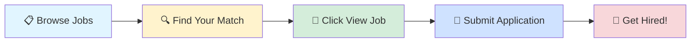

# 🚀 Tech Jobs Board

### Your Gateway to Amazing Career Opportunities

---

## 🎯 Browse by Job Profile

<table>
<tr>
<td align="center" width="25%">

 
<b>1000</b> total positions
</td>
<td align="center" width="25%">

 
<b>1000</b> total positions
</td>
<td align="center" width="25%">

 
<b>1000</b> total positions
</td>
<td align="center" width="25%">

 
<b>1000</b> total positions
</td>
</tr>
</table>

---

## 📊 Data Scientist

> 💼 **1000** positions available

<table>
<thead>
<tr>
<th width="20%">🏢 Company</th>
<th width="35%">💼 Role</th>
<th width="20%">📍 Location</th>
<th width="10%">⏰ Posted</th>
<th width="15%">🔗 Action</th>
</tr>
</thead>
<tbody>
<tr>
<td>Nakshatra Automation</td>
<td>Senior Execution Lead - Automation & Low Current Systems</td>
<td>📍 Chennai</td>
<td>1d ago</td>
<td align="center"></td>
</tr>
<tr>
<td><a href="https://www.ambitionbox.com/overview/manektech-overview">Manektech</a></td>
<td>AI ML - Intern</td>
<td>📍 Ahmedabad</td>
<td>1d ago</td>
<td align="center"></td>
</tr>
<tr>
<td><a href="https://www.ambitionbox.com/overview/ltimindtree-overview">Ltimindtree</a></td>
<td>Senior Data Scientist</td>
<td>📍 Mumbai, Pune, Bangalore</td>
<td>1d ago</td>
<td align="center"></td>
</tr>
<tr>
<td><a href="https://in.linkedin.com/company/ariedge">Ariedge</a></td>
<td>ReactJS and Python Intern (Full Stack)</td>
<td>📍 India</td>
<td>1d ago</td>
<td align="center"></td>
</tr>
<tr>
<td><a href="https://www.linkedin.com/company/great-west-casualty-company">Great West Casualty Company</a></td>
<td>Data Science Intern</td>
<td>📍 South Sioux City, NE</td>
<td>1d ago</td>
<td align="center"></td>
</tr>
<tr>
<td>Itester</td>
<td>AI ML DL Intern  AI Vidya</td>
<td>📍 Hyderabad</td>
<td>1d ago</td>
<td align="center"></td>
</tr>
<tr>
<td><a href="https://sg.linkedin.com/company/dayonedc">DayOne</a></td>
<td>Data Scientist (Internship)</td>
<td>📍 Singapore, Singapore</td>
<td>1d ago</td>
<td align="center"></td>
</tr>
<tr>
<td><a href="https://in.linkedin.com/company/technavia10">TECHNAVIA INDIA</a></td>
<td>Automation Engineer</td>
<td>📍 Chennai</td>
<td>1d ago</td>
<td align="center"></td>
</tr>
<tr>
<td><a href="https://www.linkedin.com/company/micro1">micro1</a></td>
<td>Junior Data Science Associate Consultant</td>
<td>📍 India</td>
<td>1d ago</td>
<td align="center"></td>
</tr>
<tr>
<td><a href="https://www.linkedin.com/company/medtoureasy">MedTourEasy Bengaluru</a></td>
<td>Data Analysis Trainee</td>
<td>📍 India</td>
<td>1d ago</td>
<td align="center"></td>
</tr>
<tr>
<td><a href="https://in.linkedin.com/company/nexora-solutions-in">Nexora Solutions</a></td>
<td>Data Analysis & Automation Intern  (On-site, Raipur, Chhattisgarh)</td>
<td>📍 Raipur, Chhattisgarh, India</td>
<td>1d ago</td>
<td align="center"></td>
</tr>
<tr>
<td><a href="https://www.ambitionbox.com/overview/futops-overview">Futops</a></td>
<td>Python - AIML Professional</td>
<td>📍 Pune</td>
<td>1d ago</td>
<td align="center"></td>
</tr>
<tr>
<td><a href="https://cn.linkedin.com/company/%E9%BC%8E%E6%8D%B7%E8%BD%AF%E4%BB%B6%E8%82%A1%E4%BB%BD%E6%9C%89%E9%99%90%E5%85%AC%E5%8F%B8">鼎捷软件股份有限公司</a></td>
<td>NLP算法工程师</td>
<td>📍 Shanghai, Shanghai, China</td>
<td>1d ago</td>
<td align="center"></td>
</tr>
<tr>
<td>Millionlogics (india)</td>
<td>Sr Python Developer with SOTA</td>
<td></td>
<td>1d ago</td>
<td align="center"></td>
</tr>
<tr>
<td><a href="https://www.linkedin.com/company/citi">Citi</a></td>
<td>Risk Analytics – Assistant Vice President</td>
<td>📍 Mumbai</td>
<td>1d ago</td>
<td align="center"></td>
</tr>
<tr>
<td><a href="https://www.linkedin.com/company/%E6%B7%B1%E5%9C%B3%E7%9B%88%E7%AB%8B%E6%95%B0%E6%99%BA%E7%A7%91%E6%8A%80%EF%BC%88%E6%B7%B1%E5%9C%B3%EF%BC%89%E6%9C%89%E9%99%90%E5%85%AC%E5%8F%B8">深圳盈立数智科技（深圳）有限公司</a></td>
<td>Python量化开发工程师</td>
<td>📍 Shenzhen, Guangdong, China</td>
<td>1d ago</td>
<td align="center"></td>
</tr>
<tr>
<td><a href="https://www.linkedin.com/company/image-electronics-inc-dba-image-associates">Image Associates</a></td>
<td>Director of Engineering R&D</td>
<td>📍 Memphis, TN</td>
<td>1d ago</td>
<td align="center"></td>
</tr>
<tr>
<td><a href="https://www.linkedin.com/company/%E5%B8%83%E4%BC%A6%E6%B3%B0%E6%A0%BC%EF%BC%88%E4%B8%8A%E6%B5%B7%EF%BC%89%E4%BC%81%E4%B8%9A%E7%AE%A1%E7%90%86%E6%9C%89%E9%99%90%E5%85%AC%E5%8F%B8">布伦泰格（上海）企业管理有限公司</a></td>
<td>研发工程师 R&D Engineer</td>
<td>📍 Shanghai, Shanghai, China</td>
<td>1d ago</td>
<td align="center"></td>
</tr>
<tr>
<td><a href="https://www.linkedin.com/company/planit-group-llc">PlanIT Group, LLC</a></td>
<td>Senior Java PL/SQL Developer/AI</td>
<td>📍 Washington Highlands, MD</td>
<td>1d ago</td>
<td align="center"></td>
</tr>
<tr>
<td><a href="https://ca.linkedin.com/company/the-autumn-group">The Autumn Group</a></td>
<td>R&D Quality Project Lead and Principal Business Analyst</td>
<td>📍 Boston, MA</td>
<td>1d ago</td>
<td align="center"></td>
</tr>
<tr>
<td><a href="https://br.linkedin.com/company/transilva">Transilva Log</a></td>
<td>Assistente de Recursos Humanos - R&S/T&D - ES</td>
<td>📍 Cariacica, Espírito Santo, Brazil</td>
<td>1d ago</td>
<td align="center"></td>
</tr>
<tr>
<td><a href="https://br.linkedin.com/company/degrau-publicidade-e-internet">Degrau Publicidade e Internet</a></td>
<td>Auxiliar de Gravação - Rádio - SC</td>
<td>📍 Blumenau, Santa Catarina, Brazil</td>
<td>1d ago</td>
<td align="center"></td>
</tr>
<tr>
<td><a href="https://cn.linkedin.com/company/%E5%A4%A7%E5%8D%8E%E4%BC%9A%E8%AE%A1%E5%B8%88%E4%BA%8B%E5%8A%A1%E6%89%80%EF%BC%88%E7%89%B9%E6%AE%8A%E6%99%AE%E9%80%9A%E5%90%88%E4%BC%99%EF%BC%89">大华会计师事务所（特殊普通合伙）</a></td>
<td>QA Automation Engineer(AI Testing)/English Speaking</td>
<td>📍 Shanghai, Shanghai, China</td>
<td>1d ago</td>
<td align="center"></td>
</tr>
<tr>
<td><a href="https://br.linkedin.com/company/innolevels">innolevels</a></td>
<td>Desenvolvedor Backend Python  - RJ</td>
<td>📍 Greater Rio de Janeiro</td>
<td>1d ago</td>
<td align="center"></td>
</tr>
<tr>
<td><a href="https://br.linkedin.com/company/motobroficial">MOTO BR</a></td>
<td>Administrador de Apoio Corporativo em I R Motos - SP</td>
<td>📍 Greater São Paulo Area</td>
<td>1d ago</td>
<td align="center"></td>
</tr>
<tr>
<td><a href="https://br.linkedin.com/company/innolevels">innolevels</a></td>
<td>Engenheiro de Machine Learning  - SP</td>
<td>📍 Greater São Paulo Area</td>
<td>1d ago</td>
<td align="center"></td>
</tr>
<tr>
<td><a href="https://www.linkedin.com/company/algosec">AlgoSec</a></td>
<td>AlgoNext Automation Developer, India</td>
<td>📍 Delhi</td>
<td>1d ago</td>
<td align="center"></td>
</tr>
<tr>
<td><a href="https://www.linkedin.com/company/algosec">AlgoSec</a></td>
<td>Prevasio Automation Developer, India</td>
<td>📍 Delhi</td>
<td>1d ago</td>
<td align="center"></td>
</tr>
<tr>
<td><a href="https://www.linkedin.com/company/algosec">AlgoSec</a></td>
<td>Full Stack Automation Developer, India</td>
<td>📍 Delhi</td>
<td>1d ago</td>
<td align="center"></td>
</tr>
<tr>
<td><a href="https://www.linkedin.com/company/algosec">AlgoSec</a></td>
<td>CloudFlow Automation Developer, India</td>
<td>📍 Delhi</td>
<td>1d ago</td>
<td align="center"></td>
</tr>
<tr>
<td><a href="https://de.linkedin.com/company/stadtreinigung-hamburg">Stadtreinigung Hamburg</a></td>
<td>Inhouse Consultant (m/w/d) für IT und Prozesse</td>
<td>📍 Hamburg, Hamburg, Germany</td>
<td>1d ago</td>
<td align="center"></td>
</tr>
<tr>
<td><a href="https://de.linkedin.com/company/stadtreinigung-hamburg">Stadtreinigung Hamburg</a></td>
<td>Ausbildung zum/zur Umwelttechnologen/Umwelttechnologin (m/w/d) für Kreislauf- und Abfallwirtschaft</td>
<td>📍 Hamburg, Hamburg, Germany</td>
<td>1d ago</td>
<td align="center"></td>
</tr>
<tr>
<td><a href="https://www.linkedin.com/company/paypal">PayPal</a></td>
<td>Data Science Manager</td>
<td>📍 New York, NY</td>
<td>1d ago</td>
<td align="center"></td>
</tr>
<tr>
<td>Path Mentors Staffing Solutions</td>
<td>Engineering Manager Python (COE)</td>
<td>📍 Hyderabad</td>
<td>1d ago</td>
<td align="center"></td>
</tr>
<tr>
<td><a href="https://www.linkedin.com/company/ebay">eBay</a></td>
<td>Testing & Monitoring Sr Analyst</td>
<td>📍 Austin, TX</td>
<td>1d ago</td>
<td align="center"></td>
</tr>
<tr>
<td><a href="https://www.linkedin.com/company/transcending-brands">Transcending Brands</a></td>
<td>Python Engineer</td>
<td>📍 Nigeria</td>
<td>1d ago</td>
<td align="center"></td>
</tr>
<tr>
<td><a href="https://ae.linkedin.com/company/tatheer-analytics">Tatheer Analytics</a></td>
<td>Project Acquisition Partner – BI & Analytics</td>
<td>📍 United Arab Emirates</td>
<td>1d ago</td>
<td align="center"></td>
</tr>
<tr>
<td><a href="https://de.linkedin.com/company/nagarro">Nagarro</a></td>
<td>Associate Staff Engineer (AWS Cloud)</td>
<td>📍 Bangalore</td>
<td>1d ago</td>
<td align="center"></td>
</tr>
<tr>
<td>TOCUMULUS</td>
<td>Monitoring Application QA Automation Developer</td>
<td>📍 Pune</td>
<td>NaNy ago</td>
<td align="center"></td>
</tr>
<tr>
<td><a href="https://uk.linkedin.com/company/natwest-group">NatWest Group</a></td>
<td>Quality Automation Specialist</td>
<td>📍 Chennai</td>
<td>1d ago</td>
<td align="center"></td>
</tr>
<tr>
<td><a href="https://www.linkedin.com/company/paypal">PayPal</a></td>
<td>Manager, Machine Learning Engineering</td>
<td>📍 Bangalore</td>
<td>1d ago</td>
<td align="center"></td>
</tr>
<tr>
<td>NTT DATA North America</td>
<td>Azure Application Developer</td>
<td>📍 Hyderabad</td>
<td>NaNy ago</td>
<td align="center"></td>
</tr>
<tr>
<td><a href="https://nl.linkedin.com/company/algemene-inlichtingen--en-veiligheidsdienst---aivd">Algemene Inlichtingen- en Veiligheidsdienst - AIVD</a></td>
<td>AI/ML Engineer</td>
<td>📍 Zoetermeer, South Holland, Netherlands</td>
<td>1d ago</td>
<td align="center"></td>
</tr>
<tr>
<td><a href="https://www.linkedin.com/company/agil-corp">Agil Corp</a></td>
<td>Data Scientist – Excelencia Operacional</td>
<td>📍 Rancagua, O'Higgins Region, Chile</td>
<td>1d ago</td>
<td align="center"></td>
</tr>
<tr>
<td><a href="https://www.linkedin.com/company/experian">Experian</a></td>
<td>Data Scientist, Customer Analytics (Remote)</td>
<td>📍 United States</td>
<td>1d ago</td>
<td align="center"></td>
</tr>
<tr>
<td><a href="https://www.linkedin.com/company/sev1tech">Sev1Tech LLC</a></td>
<td>Automation Engineer</td>
<td>📍 North Charleston, SC</td>
<td>1d ago</td>
<td align="center"></td>
</tr>
<tr>
<td><a href="https://in.linkedin.com/company/accordion-india">Accordion India</a></td>
<td>Accordion India - Manager - Data & Analytics Consulting</td>
<td>📍 Hyderabad</td>
<td>1d ago</td>
<td align="center"></td>
</tr>
<tr>
<td><a href="https://de.linkedin.com/company/nagarro">Nagarro</a></td>
<td>Staff Engineer (AWS Cloud Formation)</td>
<td>📍 Bangalore</td>
<td>1d ago</td>
<td align="center"></td>
</tr>
<tr>
<td><a href="https://pe.linkedin.com/company/grupovanguardinternacional">Grupo Vanguard Internacional</a></td>
<td>People Analytics</td>
<td>📍 Ica, Ica, Peru</td>
<td>1d ago</td>
<td align="center"></td>
</tr>
<tr>
<td><a href="https://ca.linkedin.com/company/amii">Amii (Alberta Machine Intelligence Institute)</a></td>
<td>Machine Learning Resident - Client: Thrive Career Wellness (1 year term)</td>
<td>📍 Edmonton, Alberta, Canada</td>
<td>1d ago</td>
<td align="center"></td>
</tr>
<tr>
<td><a href="https://fr.linkedin.com/company/back-market">Back Market</a></td>
<td>Data Analytics Intern, Customer Delight</td>
<td>📍 Paris, Île-de-France, France</td>
<td>1d ago</td>
<td align="center"></td>
</tr>
<tr>
<td><a href="https://www.linkedin.com/company/wherewework">wherewework</a></td>
<td>Python Developer Cairo</td>
<td>📍 Cairo, Cairo, Egypt</td>
<td>1d ago</td>
<td align="center"></td>
</tr>
<tr>
<td><a href="https://in.linkedin.com/company/infosys">Infosys</a></td>
<td>AWS Engineer</td>
<td>📍 Pune</td>
<td>1d ago</td>
<td align="center"></td>
</tr>
<tr>
<td>Cognite</td>
<td>Senior Data Scientist</td>
<td>📍 Bangalore</td>
<td>NaNy ago</td>
<td align="center"></td>
</tr>
<tr>
<td><a href="https://www.linkedin.com/company/wherewework">wherewework</a></td>
<td>Python Developer</td>
<td>📍 Dubai, Dubai, United Arab Emirates</td>
<td>1d ago</td>
<td align="center"></td>
</tr>
<tr>
<td><a href="https://in.linkedin.com/company/accordion-india">Accordion India</a></td>
<td>Accordion India - Director - Data & Analytics Consulting</td>
<td>📍 Hyderabad</td>
<td>1d ago</td>
<td align="center"></td>
</tr>
<tr>
<td><a href="https://www.linkedin.com/company/pinnacle-technical-resources">Pinnacle Group, Inc.</a></td>
<td>Business Intelligence Developer (Tableau)</td>
<td>📍 India</td>
<td>1d ago</td>
<td align="center"></td>
</tr>
<tr>
<td><a href="https://www.linkedin.com/company/wherewework">wherewework</a></td>
<td>Python Developer Rabat</td>
<td>📍 Rabat, Rabat-Salé-Kénitra, Morocco</td>
<td>1d ago</td>
<td align="center"></td>
</tr>
<tr>
<td><a href="https://de.linkedin.com/company/basf">BASF</a></td>
<td>Software Developer for Data Science</td>
<td>📍 Texas, United States</td>
<td>1d ago</td>
<td align="center"></td>
</tr>
<tr>
<td><a href="https://in.linkedin.com/company/hirenza-pvt-ltd">Hirenza</a></td>
<td>SQL Developer</td>
<td>📍 India</td>
<td>1d ago</td>
<td align="center"></td>
</tr>
<tr>
<td><a href="https://www.linkedin.com/company/vanguard">Vanguard</a></td>
<td>Head Of Operations Analytics</td>
<td>📍 Charlotte, NC</td>
<td>1d ago</td>
<td align="center"></td>
</tr>
<tr>
<td><a href="https://pe.linkedin.com/company/innova-schools">Innova Schools</a></td>
<td>Docentes para 2do de Primaria / Sede Rímac Sporting Cristal</td>
<td>📍 Rímac, Peru</td>
<td>1d ago</td>
<td align="center"></td>
</tr>
<tr>
<td><a href="https://nl.linkedin.com/company/algemene-inlichtingen--en-veiligheidsdienst---aivd">Algemene Inlichtingen- en Veiligheidsdienst - AIVD</a></td>
<td>Research Data Scientist AI/ML</td>
<td>📍 Zoetermeer, South Holland, Netherlands</td>
<td>1d ago</td>
<td align="center"></td>
</tr>
<tr>
<td><a href="https://www.linkedin.com/company/us-bank">U.S. Bank</a></td>
<td>Quantitative Analyst - Artificial Intelligence/Machine Learning</td>
<td>📍 Minneapolis, MN</td>
<td>1d ago</td>
<td align="center"></td>
</tr>
<tr>
<td><a href="https://www.linkedin.com/company/us-bank">U.S. Bank</a></td>
<td>Quantitative Analyst - Artificial Intelligence/Machine Learning</td>
<td>📍 Charlotte, NC</td>
<td>1d ago</td>
<td align="center"></td>
</tr>
<tr>
<td><a href="https://lv.linkedin.com/school/sunhillbs/">Sunhill Business School</a></td>
<td>Jr. Data Scientist</td>
<td>📍 Tallinn, Harjumaa, Estonia</td>
<td>1d ago</td>
<td align="center"></td>
</tr>
<tr>
<td><a href="https://sg.linkedin.com/company/bakertillysingapore">Baker Tilly Singapore</a></td>
<td>Intern - Data Analytics, Automation and Machine Learning</td>
<td>📍 Singapore, Singapore</td>
<td>1d ago</td>
<td align="center"></td>
</tr>
<tr>
<td><a href="https://sg.linkedin.com/company/poweritservices">POWER IT SERVICES</a></td>
<td>Analytical Engineer - Python</td>
<td>📍 Federal Territory of Kuala Lumpur, Malaysia</td>
<td>1d ago</td>
<td align="center"></td>
</tr>
<tr>
<td>Clinvvo</td>
<td>Applied Data Scientist</td>
<td>📍 Delhi</td>
<td>NaNy ago</td>
<td align="center"></td>
</tr>
<tr>
<td>Loyalytics AI</td>
<td>Data Scientist</td>
<td>📍 Bangalore</td>
<td>NaNy ago</td>
<td align="center"></td>
</tr>
<tr>
<td>Loyalytics AI</td>
<td>Power BI Developer - Data Visualization</td>
<td>📍 Bangalore</td>
<td>NaNy ago</td>
<td align="center"></td>
</tr>
<tr>
<td><a href="https://in.linkedin.com/company/hirenza-pvt-ltd">Hirenza</a></td>
<td>Python Developer</td>
<td>📍 India</td>
<td>1d ago</td>
<td align="center"></td>
</tr>
<tr>
<td><a href="https://in.linkedin.com/company/smaowl9">Codeyoung</a></td>
<td>Backend Developer - Python/Node.js</td>
<td>📍 Bangalore</td>
<td>1d ago</td>
<td align="center"></td>
</tr>
<tr>
<td><a href="https://in.linkedin.com/company/datagrid-solutions">Datagrid Solutions</a></td>
<td>DevOps Engineer - IT Automation Tools</td>
<td>📍 Mumbai</td>
<td>1d ago</td>
<td align="center"></td>
</tr>
<tr>
<td><a href="https://ch.linkedin.com/company/syngenta">Syngenta</a></td>
<td>Regional Data Quality & Analytics Manager</td>
<td>📍 Pune</td>
<td>2d ago</td>
<td align="center"></td>
</tr>
<tr>
<td><a href="https://fr.linkedin.com/company/73-strings">73 Strings</a></td>
<td>73 Strings - Quality Assurance Engineer - Automation Testing</td>
<td>📍 Bangalore</td>
<td>1d ago</td>
<td align="center"></td>
</tr>
<tr>
<td><a href="https://in.linkedin.com/company/mple">mple.ai</a></td>
<td>Interesting Job Opportunity: mple.ai - Software Development Engineer II - Python &amp; MERN Stack</td>
<td>📍 Mumbai</td>
<td>1d ago</td>
<td align="center"></td>
</tr>
<tr>
<td><a href="https://in.linkedin.com/company/mple">mple.ai</a></td>
<td>Interesting Job Opportunity: mple.ai - Full Stack Developer - Python/MERN Stack</td>
<td>📍 Mumbai</td>
<td>1d ago</td>
<td align="center"></td>
</tr>
<tr>
<td><a href="https://in.linkedin.com/company/sapours-technologies">Sapours Technologies</a></td>
<td>AWS Data Engineering Lead - ETL/PySpark</td>
<td>📍 Pune</td>
<td>1d ago</td>
<td align="center"></td>
</tr>
<tr>
<td><a href="https://in.linkedin.com/company/theskillguru">The Skill Guru Foundation (NGO - Free Education)</a></td>
<td>Data Analytics Internship in Gurgaon</td>
<td>📍 Gurugram</td>
<td>1d ago</td>
<td align="center"></td>
</tr>
<tr>
<td><a href="https://in.linkedin.com/company/pratiti-centre-for-mental-health">Pratiti</a></td>
<td>Azure DevOps Architect - IAC Terraform</td>
<td>📍 Pune</td>
<td>1d ago</td>
<td align="center"></td>
</tr>
<tr>
<td><a href="https://www.linkedin.com/company/advocate-atul-sharma-a">Advocate Atul Sharma</a></td>
<td>Agentic AI/ML Engineer</td>
<td>📍 Delhi</td>
<td>2d ago</td>
<td align="center"></td>
</tr>
<tr>
<td><a href="https://in.linkedin.com/company/techgenzi">Techgenzi Private Limited</a></td>
<td>Senior Artificial Intelligence Engineer - Python</td>
<td>📍 Coimbatore</td>
<td>1d ago</td>
<td align="center"></td>
</tr>
<tr>
<td><a href="https://www.linkedin.com/company/randomtrees">RandomTrees</a></td>
<td>Artificial Intelligence Engineer</td>
<td>📍 San Francisco Bay Area</td>
<td>1d ago</td>
<td align="center"></td>
</tr>
<tr>
<td><a href="https://in.linkedin.com/company/primustechsystems">PRIMUS Techsystems Private Limited</a></td>
<td>Full Stack Engineer - Azure/.Net</td>
<td>📍 Mumbai</td>
<td>1d ago</td>
<td align="center"></td>
</tr>
<tr>
<td>Tata Consultancy Services</td>
<td>Data Scientist</td>
<td>📍 Delhi</td>
<td>NaNy ago</td>
<td align="center"></td>
</tr>
<tr>
<td>Tata Consultancy Services</td>
<td>Java Automation Test Analyst</td>
<td>📍 Bangalore</td>
<td>NaNy ago</td>
<td align="center"></td>
</tr>
<tr>
<td>Crisil</td>
<td>Senior Python Software Engineer</td>
<td>📍 Hyderabad</td>
<td>NaNy ago</td>
<td align="center"></td>
</tr>
<tr>
<td>Sigmoid</td>
<td>Senior Data Scientist</td>
<td>📍 Bangalore</td>
<td>NaNy ago</td>
<td align="center"></td>
</tr>
<tr>
<td>Walmart Global Tech India</td>
<td>DIRECTOR, DATA SCIENCE</td>
<td>📍 Chennai</td>
<td>NaNy ago</td>
<td align="center"></td>
</tr>
<tr>
<td>Calix</td>
<td>Senior Software Engineer, AI/ML</td>
<td>📍 Bangalore</td>
<td>NaNy ago</td>
<td align="center"></td>
</tr>
<tr>
<td>MaximaTek</td>
<td>AI ML Engineer</td>
<td>📍 Hyderabad</td>
<td>NaNy ago</td>
<td align="center"></td>
</tr>
<tr>
<td>Eloelo</td>
<td>Eloelo - Data Engineer- Python/Hadoop</td>
<td>📍 Bangalore</td>
<td>NaNy ago</td>
<td align="center"></td>
</tr>
<tr>
<td>JPMorganChase</td>
<td>Sr Lead Software Engineer - Java AWS Cloud</td>
<td>📍 Bangalore</td>
<td>NaNy ago</td>
<td align="center"></td>
</tr>
<tr>
<td>Prodege, LLC</td>
<td>Analytics Engineer I</td>
<td>📍 Gurugram</td>
<td>NaNy ago</td>
<td align="center"></td>
</tr>
<tr>
<td>Signant Health</td>
<td>Senior Cloud Operations Automation Engineer - Technology R&D</td>
<td>📍 Noida</td>
<td>NaNy ago</td>
<td align="center"></td>
</tr>
<tr>
<td><a href="https://www.linkedin.com/company/lorventech">Lorven Technologies Inc.</a></td>
<td>Artificial Intelligence Researcher</td>
<td>📍 India</td>
<td>2d ago</td>
<td align="center"></td>
</tr>
<tr>
<td>Ripik.AI</td>
<td>Ripik AI - Software Development Engineer II - Java/Python</td>
<td>📍 Noida</td>
<td>NaNy ago</td>
<td align="center"></td>
</tr>
<tr>
<td>CertifyOS</td>
<td>AI/ML Intern</td>
<td>📍 Chennai</td>
<td>NaNy ago</td>
<td align="center"></td>
</tr>
<tr>
<td><a href="https://fr.linkedin.com/company/icom-business-services">iCom by KPMG</a></td>
<td>Consultant Stagiaire Technology Experience Data - Data & Analytics F/H</td>
<td>📍 La Défense, Île-de-France, France</td>
<td>2d ago</td>
<td align="center"></td>
</tr>
<tr><td colspan="5" align="center"><i>... and 900 more positions</i></td></tr>
</tbody>
</table>

---

## 💼 Business Analyst

> 💼 **1000** positions available

<table>
<thead>
<tr>
<th width="20%">🏢 Company</th>
<th width="35%">💼 Role</th>
<th width="20%">📍 Location</th>
<th width="10%">⏰ Posted</th>
<th width="15%">🔗 Action</th>
</tr>
</thead>
<tbody>
<tr>
<td>Nakshatra Automation</td>
<td>Senior Execution Lead - Automation & Low Current Systems</td>
<td>📍 Chennai</td>
<td>1d ago</td>
<td align="center"></td>
</tr>
<tr>
<td><a href="https://in.linkedin.com/company/ariedge">Ariedge</a></td>
<td>ReactJS and Python Intern (Full Stack)</td>
<td>📍 India</td>
<td>1d ago</td>
<td align="center"></td>
</tr>
<tr>
<td><a href="https://www.linkedin.com/company/flowserve">Flowserve Corporation</a></td>
<td>Head, Project Management</td>
<td>📍 Coimbatore</td>
<td>1d ago</td>
<td align="center"></td>
</tr>
<tr>
<td><a href="https://in.linkedin.com/company/technavia10">TECHNAVIA INDIA</a></td>
<td>Automation Engineer</td>
<td>📍 Chennai</td>
<td>1d ago</td>
<td align="center"></td>
</tr>
<tr>
<td><a href="https://www.linkedin.com/company/medtoureasy">MedTourEasy Bengaluru</a></td>
<td>Data Analysis Trainee</td>
<td>📍 India</td>
<td>1d ago</td>
<td align="center"></td>
</tr>
<tr>
<td><a href="https://in.linkedin.com/company/nexora-solutions-in">Nexora Solutions</a></td>
<td>Data Analysis & Automation Intern  (On-site, Raipur, Chhattisgarh)</td>
<td>📍 Raipur, Chhattisgarh, India</td>
<td>1d ago</td>
<td align="center"></td>
</tr>
<tr>
<td><a href="https://www.ambitionbox.com/overview/futops-overview">Futops</a></td>
<td>Python - AIML Professional</td>
<td>📍 Pune</td>
<td>1d ago</td>
<td align="center"></td>
</tr>
<tr>
<td>Millionlogics (india)</td>
<td>Sr Python Developer with SOTA</td>
<td></td>
<td>1d ago</td>
<td align="center"></td>
</tr>
<tr>
<td><a href="https://www.linkedin.com/company/citi">Citi</a></td>
<td>Risk Analytics – Assistant Vice President</td>
<td>📍 Mumbai</td>
<td>1d ago</td>
<td align="center"></td>
</tr>
<tr>
<td><a href="https://www.ambitionbox.com/overview/ernst-young-overview">EY</a></td>
<td>Industrial Trainee - Business Consulting Risk</td>
<td>📍 Kolkata</td>
<td>1d ago</td>
<td align="center"></td>
</tr>
<tr>
<td><a href="https://www.linkedin.com/company/%E6%B7%B1%E5%9C%B3%E7%9B%88%E7%AB%8B%E6%95%B0%E6%99%BA%E7%A7%91%E6%8A%80%EF%BC%88%E6%B7%B1%E5%9C%B3%EF%BC%89%E6%9C%89%E9%99%90%E5%85%AC%E5%8F%B8">深圳盈立数智科技（深圳）有限公司</a></td>
<td>Python量化开发工程师</td>
<td>📍 Shenzhen, Guangdong, China</td>
<td>1d ago</td>
<td align="center"></td>
</tr>
<tr>
<td><a href="https://www.linkedin.com/company/planit-group-llc">PlanIT Group, LLC</a></td>
<td>Senior Java PL/SQL Developer/AI</td>
<td>📍 Washington Highlands, MD</td>
<td>1d ago</td>
<td align="center"></td>
</tr>
<tr>
<td><a href="https://ca.linkedin.com/company/the-autumn-group">The Autumn Group</a></td>
<td>R&D Quality Project Lead and Principal Business Analyst</td>
<td>📍 Boston, MA</td>
<td>1d ago</td>
<td align="center"></td>
</tr>
<tr>
<td><a href="https://www.ambitionbox.com/overview/inq-technologies-overview">INQ Technologies</a></td>
<td>Interns: Software Manual Tester (2) - Business Analyst (1) - Unpaid</td>
<td>📍 Chennai</td>
<td>1d ago</td>
<td align="center"></td>
</tr>
<tr>
<td><a href="https://cn.linkedin.com/company/%E5%A4%A7%E5%8D%8E%E4%BC%9A%E8%AE%A1%E5%B8%88%E4%BA%8B%E5%8A%A1%E6%89%80%EF%BC%88%E7%89%B9%E6%AE%8A%E6%99%AE%E9%80%9A%E5%90%88%E4%BC%99%EF%BC%89">大华会计师事务所（特殊普通合伙）</a></td>
<td>QA Automation Engineer(AI Testing)/English Speaking</td>
<td>📍 Shanghai, Shanghai, China</td>
<td>1d ago</td>
<td align="center"></td>
</tr>
<tr>
<td><a href="https://br.linkedin.com/company/innolevels">innolevels</a></td>
<td>Agile Master - SP</td>
<td>📍 Greater São Paulo Area</td>
<td>1d ago</td>
<td align="center"></td>
</tr>
<tr>
<td><a href="https://br.linkedin.com/company/innolevels">innolevels</a></td>
<td>Desenvolvedor Backend Python  - RJ</td>
<td>📍 Greater Rio de Janeiro</td>
<td>1d ago</td>
<td align="center"></td>
</tr>
<tr>
<td><a href="https://br.linkedin.com/company/innolevels">innolevels</a></td>
<td>Agile Master - SP</td>
<td>📍 Greater São Paulo Area</td>
<td>1d ago</td>
<td align="center"></td>
</tr>
<tr>
<td><a href="https://www.linkedin.com/company/algosec">AlgoSec</a></td>
<td>AlgoNext Automation Developer, India</td>
<td>📍 Delhi</td>
<td>1d ago</td>
<td align="center"></td>
</tr>
<tr>
<td><a href="https://www.linkedin.com/company/algosec">AlgoSec</a></td>
<td>Prevasio Automation Developer, India</td>
<td>📍 Delhi</td>
<td>1d ago</td>
<td align="center"></td>
</tr>
<tr>
<td><a href="https://www.linkedin.com/company/algosec">AlgoSec</a></td>
<td>Full Stack Automation Developer, India</td>
<td>📍 Delhi</td>
<td>1d ago</td>
<td align="center"></td>
</tr>
<tr>
<td><a href="https://www.linkedin.com/company/algosec">AlgoSec</a></td>
<td>CloudFlow Automation Developer, India</td>
<td>📍 Delhi</td>
<td>1d ago</td>
<td align="center"></td>
</tr>
<tr>
<td><a href="https://jp.linkedin.com/company/fptjapanholdings">FPT Japan</a></td>
<td>[FPT Japan] Hiring Bridge System Engineer and Business Analyst</td>
<td>📍 Japan</td>
<td>1d ago</td>
<td align="center"></td>
</tr>
<tr>
<td>Path Mentors Staffing Solutions</td>
<td>Engineering Manager Python (COE)</td>
<td>📍 Hyderabad</td>
<td>1d ago</td>
<td align="center"></td>
</tr>
<tr>
<td><a href="https://www.linkedin.com/company/transcending-brands">Transcending Brands</a></td>
<td>Python Engineer</td>
<td>📍 Nigeria</td>
<td>1d ago</td>
<td align="center"></td>
</tr>
<tr>
<td><a href="https://ae.linkedin.com/company/tatheer-analytics">Tatheer Analytics</a></td>
<td>Project Acquisition Partner – BI & Analytics</td>
<td>📍 United Arab Emirates</td>
<td>1d ago</td>
<td align="center"></td>
</tr>
<tr>
<td><a href="https://www.linkedin.com/company/origencecompany">Origence</a></td>
<td>Scrum Master</td>
<td>📍 Irvine, CA</td>
<td>1d ago</td>
<td align="center"></td>
</tr>
<tr>
<td><a href="https://id.linkedin.com/company/pt-adicipta-inovasi-teknologi">PT Adicipta Inovasi Teknologi</a></td>
<td>Business Analyst</td>
<td>📍 West Jakarta, Jakarta, Indonesia</td>
<td>1d ago</td>
<td align="center"></td>
</tr>
<tr>
<td><a href="https://de.linkedin.com/company/s-s-softwarepartner-gmbh">S+S SoftwarePartner GmbH</a></td>
<td>Business Consultant B2B-Lösungen (m/w/d)</td>
<td>📍 Stemwede, North Rhine-Westphalia, Germany</td>
<td>1d ago</td>
<td align="center"></td>
</tr>
<tr>
<td>TOCUMULUS</td>
<td>Monitoring Application QA Automation Developer</td>
<td>📍 Pune</td>
<td>NaNy ago</td>
<td align="center"></td>
</tr>
<tr>
<td><a href="https://uk.linkedin.com/company/natwest-group">NatWest Group</a></td>
<td>Quality Automation Specialist</td>
<td>📍 Chennai</td>
<td>1d ago</td>
<td align="center"></td>
</tr>
<tr>
<td><a href="https://pk.linkedin.com/company/propstar-technologies">Propstar Technologies</a></td>
<td>Salesforce Admin</td>
<td>📍 Karachi Division, Sindh, Pakistan</td>
<td>1d ago</td>
<td align="center"></td>
</tr>
<tr>
<td>NTT DATA North America</td>
<td>Scrum Master</td>
<td>📍 Bangalore</td>
<td>NaNy ago</td>
<td align="center"></td>
</tr>
<tr>
<td>NTT DATA North America</td>
<td>Sr. Scrum Master Scrum Master</td>
<td>📍 Bangalore</td>
<td>NaNy ago</td>
<td align="center"></td>
</tr>
<tr>
<td><a href="https://ch.linkedin.com/company/abb">ABB</a></td>
<td>Business Process Owner (BPO) – Quotation process for systems. (Location: Flexible worldwide) ABB Robotics.</td>
<td>📍 Plats, Auvergne-Rhône-Alpes, France</td>
<td>1d ago</td>
<td align="center"></td>
</tr>
<tr>
<td><a href="https://www.linkedin.com/company/experian">Experian</a></td>
<td>Data Scientist, Customer Analytics (Remote)</td>
<td>📍 United States</td>
<td>1d ago</td>
<td align="center"></td>
</tr>
<tr>
<td><a href="https://www.linkedin.com/company/sev1tech">Sev1Tech LLC</a></td>
<td>Automation Engineer</td>
<td>📍 North Charleston, SC</td>
<td>1d ago</td>
<td align="center"></td>
</tr>
<tr>
<td><a href="https://in.linkedin.com/company/accordion-india">Accordion India</a></td>
<td>Accordion India - Manager - Data & Analytics Consulting</td>
<td>📍 Hyderabad</td>
<td>1d ago</td>
<td align="center"></td>
</tr>
<tr>
<td><a href="https://pe.linkedin.com/company/grupovanguardinternacional">Grupo Vanguard Internacional</a></td>
<td>People Analytics</td>
<td>📍 Ica, Ica, Peru</td>
<td>1d ago</td>
<td align="center"></td>
</tr>
<tr>
<td><a href="https://fr.linkedin.com/company/back-market">Back Market</a></td>
<td>Data Analytics Intern, Customer Delight</td>
<td>📍 Paris, Île-de-France, France</td>
<td>1d ago</td>
<td align="center"></td>
</tr>
<tr>
<td><a href="https://www.linkedin.com/company/wherewework">wherewework</a></td>
<td>Python Developer Cairo</td>
<td>📍 Cairo, Cairo, Egypt</td>
<td>1d ago</td>
<td align="center"></td>
</tr>
<tr>
<td><a href="https://www.linkedin.com/company/wherewework">wherewework</a></td>
<td>Python Developer</td>
<td>📍 Dubai, Dubai, United Arab Emirates</td>
<td>1d ago</td>
<td align="center"></td>
</tr>
<tr>
<td><a href="https://in.linkedin.com/company/accordion-india">Accordion India</a></td>
<td>Accordion India - Director - Data & Analytics Consulting</td>
<td>📍 Hyderabad</td>
<td>1d ago</td>
<td align="center"></td>
</tr>
<tr>
<td><a href="https://in.linkedin.com/company/hirenza-pvt-ltd">Hirenza</a></td>
<td>Business Analyst</td>
<td>📍 India</td>
<td>1d ago</td>
<td align="center"></td>
</tr>
<tr>
<td><a href="https://www.linkedin.com/company/pinnacle-technical-resources">Pinnacle Group, Inc.</a></td>
<td>Business Intelligence Developer (Tableau)</td>
<td>📍 India</td>
<td>1d ago</td>
<td align="center"></td>
</tr>
<tr>
<td><a href="https://www.linkedin.com/company/wherewework">wherewework</a></td>
<td>Python Developer Rabat</td>
<td>📍 Rabat, Rabat-Salé-Kénitra, Morocco</td>
<td>1d ago</td>
<td align="center"></td>
</tr>
<tr>
<td><a href="https://in.linkedin.com/company/hirenza-pvt-ltd">Hirenza</a></td>
<td>SQL Developer</td>
<td>📍 India</td>
<td>1d ago</td>
<td align="center"></td>
</tr>
<tr>
<td><a href="https://www.linkedin.com/company/vanguard">Vanguard</a></td>
<td>Head Of Operations Analytics</td>
<td>📍 Charlotte, NC</td>
<td>1d ago</td>
<td align="center"></td>
</tr>
<tr>
<td><a href="https://www.linkedin.com/company/confidencialrole">Confidencial</a></td>
<td>Business Analyst (Entry-Level / Associate)</td>
<td>📍 Sydney, New South Wales, Australia</td>
<td>1d ago</td>
<td align="center"></td>
</tr>
<tr>
<td><a href="https://sg.linkedin.com/company/bakertillysingapore">Baker Tilly Singapore</a></td>
<td>Intern - Data Analytics, Automation and Machine Learning</td>
<td>📍 Singapore, Singapore</td>
<td>1d ago</td>
<td align="center"></td>
</tr>
<tr>
<td><a href="https://sg.linkedin.com/company/poweritservices">POWER IT SERVICES</a></td>
<td>Analytical Engineer - Python</td>
<td>📍 Federal Territory of Kuala Lumpur, Malaysia</td>
<td>1d ago</td>
<td align="center"></td>
</tr>
<tr>
<td>Loyalytics AI</td>
<td>Power BI Developer - Data Visualization</td>
<td>📍 Bangalore</td>
<td>NaNy ago</td>
<td align="center"></td>
</tr>
<tr>
<td><a href="https://in.linkedin.com/company/hirenza-pvt-ltd">Hirenza</a></td>
<td>Python Developer</td>
<td>📍 India</td>
<td>1d ago</td>
<td align="center"></td>
</tr>
<tr>
<td><a href="https://in.linkedin.com/company/smaowl9">Codeyoung</a></td>
<td>Backend Developer - Python/Node.js</td>
<td>📍 Bangalore</td>
<td>1d ago</td>
<td align="center"></td>
</tr>
<tr>
<td><a href="https://in.linkedin.com/company/datagrid-solutions">Datagrid Solutions</a></td>
<td>DevOps Engineer - IT Automation Tools</td>
<td>📍 Mumbai</td>
<td>1d ago</td>
<td align="center"></td>
</tr>
<tr>
<td><a href="https://in.linkedin.com/company/hirenza-pvt-ltd">Hirenza</a></td>
<td>Sr Technical Business Analyst</td>
<td>📍 India</td>
<td>1d ago</td>
<td align="center"></td>
</tr>
<tr>
<td><a href="https://ch.linkedin.com/company/syngenta">Syngenta</a></td>
<td>Regional Data Quality & Analytics Manager</td>
<td>📍 Pune</td>
<td>2d ago</td>
<td align="center"></td>
</tr>
<tr>
<td><a href="https://www.linkedin.com/company/conduent">Conduent</a></td>
<td>Technical Business Analysis Engineer II</td>
<td>📍 Noida</td>
<td>1d ago</td>
<td align="center"></td>
</tr>
<tr>
<td><a href="https://www.linkedin.com/company/three-13-solutions-private-limited">THREE 13 SOLUTIONS PRIVATE LIMITED</a></td>
<td>Documentation & Records Operations Internship in Mumbai</td>
<td>📍 Mumbai</td>
<td>1d ago</td>
<td align="center"></td>
</tr>
<tr>
<td><a href="https://fr.linkedin.com/company/73-strings">73 Strings</a></td>
<td>73 Strings - Quality Assurance Engineer - Automation Testing</td>
<td>📍 Bangalore</td>
<td>1d ago</td>
<td align="center"></td>
</tr>
<tr>
<td><a href="https://in.linkedin.com/company/blue-star-diamonds">Blue Star Diamonds Pvt. Ltd.</a></td>
<td>Business Operations Executive (Excel, Admin, Accounts & Inventory) in Mumbai</td>
<td>📍 Mumbai</td>
<td>1d ago</td>
<td align="center"></td>
</tr>
<tr>
<td><a href="https://www.linkedin.com/company/conduent">Conduent</a></td>
<td>Technical Business Analysis Engineer II</td>
<td>📍 Noida</td>
<td>1d ago</td>
<td align="center"></td>
</tr>
<tr>
<td><a href="https://in.linkedin.com/company/mple">mple.ai</a></td>
<td>Interesting Job Opportunity: mple.ai - Software Development Engineer II - Python &amp; MERN Stack</td>
<td>📍 Mumbai</td>
<td>1d ago</td>
<td align="center"></td>
</tr>
<tr>
<td><a href="https://in.linkedin.com/company/mple">mple.ai</a></td>
<td>Interesting Job Opportunity: mple.ai - Full Stack Developer - Python/MERN Stack</td>
<td>📍 Mumbai</td>
<td>1d ago</td>
<td align="center"></td>
</tr>
<tr>
<td><a href="https://www.linkedin.com/company/deltax">DeltaX</a></td>
<td>DeltaX - Business Analyst</td>
<td>📍 Bangalore</td>
<td>1d ago</td>
<td align="center"></td>
</tr>
<tr>
<td><a href="https://in.linkedin.com/company/theskillguru">The Skill Guru Foundation (NGO - Free Education)</a></td>
<td>Data Analytics Internship in Gurgaon</td>
<td>📍 Gurugram</td>
<td>1d ago</td>
<td align="center"></td>
</tr>
<tr>
<td><a href="https://in.linkedin.com/company/techgenzi">Techgenzi Private Limited</a></td>
<td>Senior Artificial Intelligence Engineer - Python</td>
<td>📍 Coimbatore</td>
<td>1d ago</td>
<td align="center"></td>
</tr>
<tr>
<td>Tata Consultancy Services</td>
<td>Java Automation Test Analyst</td>
<td>📍 Bangalore</td>
<td>NaNy ago</td>
<td align="center"></td>
</tr>
<tr>
<td>Tata Consultancy Services</td>
<td>Salesforce Developer</td>
<td>📍 Pune</td>
<td>NaNy ago</td>
<td align="center"></td>
</tr>
<tr>
<td>Crisil</td>
<td>Senior Python Software Engineer</td>
<td>📍 Hyderabad</td>
<td>NaNy ago</td>
<td align="center"></td>
</tr>
<tr>
<td>Nasdaq</td>
<td>Business Analyst- Trade/Transaction Solution</td>
<td>📍 Pune</td>
<td>NaNy ago</td>
<td align="center"></td>
</tr>
<tr>
<td><a href="https://in.linkedin.com/company/trisysit">triSys</a></td>
<td>Account Manager/Business Analyst</td>
<td>📍 Bangalore</td>
<td>2d ago</td>
<td align="center"></td>
</tr>
<tr>
<td>General Mills India</td>
<td>D&T Agile Project Manager</td>
<td>📍 Mumbai</td>
<td>NaNy ago</td>
<td align="center"></td>
</tr>
<tr>
<td>Eloelo</td>
<td>Eloelo - Data Engineer- Python/Hadoop</td>
<td>📍 Bangalore</td>
<td>NaNy ago</td>
<td align="center"></td>
</tr>
<tr>
<td><a href="https://in.linkedin.com/company/exeter-premedia-services">Exeter Premedia Services</a></td>
<td>Scrum Master</td>
<td>📍 Chennai</td>
<td>2d ago</td>
<td align="center"></td>
</tr>
<tr>
<td><a href="https://nl.linkedin.com/company/jobster-com">Jobster</a></td>
<td>Business Analyst/Consultant Technology Strategy & Transformation - Studentjob.ch</td>
<td>📍 Basel, Basel, Switzerland</td>
<td>2d ago</td>
<td align="center"></td>
</tr>
<tr>
<td>Bradsol</td>
<td>Senior Power BI Developer</td>
<td>📍 Hyderabad</td>
<td>NaNy ago</td>
<td align="center"></td>
</tr>
<tr>
<td>Prodege, LLC</td>
<td>Analytics Engineer I</td>
<td>📍 Gurugram</td>
<td>NaNy ago</td>
<td align="center"></td>
</tr>
<tr>
<td>Bekaert</td>
<td>IT Business Analyst</td>
<td>📍 Pune</td>
<td>NaNy ago</td>
<td align="center"></td>
</tr>
<tr>
<td>Signant Health</td>
<td>Senior Cloud Operations Automation Engineer - Technology R&D</td>
<td>📍 Noida</td>
<td>NaNy ago</td>
<td align="center"></td>
</tr>
<tr>
<td>Ripik.AI</td>
<td>Ripik AI - Software Development Engineer II - Java/Python</td>
<td>📍 Noida</td>
<td>NaNy ago</td>
<td align="center"></td>
</tr>
<tr>
<td>algoleap</td>
<td>Business Analyst</td>
<td>📍 Hyderabad</td>
<td>NaNy ago</td>
<td align="center"></td>
</tr>
<tr>
<td><a href="https://www.linkedin.com/company/confidential1234">Confidential Jobs</a></td>
<td>Jira, Confluence, and Bitbucket Administrator</td>
<td>📍 Bangalore</td>
<td>2d ago</td>
<td align="center"></td>
</tr>
<tr>
<td><a href="https://fr.linkedin.com/company/icom-business-services">iCom by KPMG</a></td>
<td>Consultant Stagiaire Technology Experience Data - Data & Analytics F/H</td>
<td>📍 La Défense, Île-de-France, France</td>
<td>2d ago</td>
<td align="center"></td>
</tr>
<tr>
<td>Astria Digital</td>
<td>Astria Digital - Backend Developer - Python</td>
<td>📍 Bangalore</td>
<td>NaNy ago</td>
<td align="center"></td>
</tr>
<tr>
<td>Voyager Partners Consultancy Inc.</td>
<td>Salesforce Developer - Apex/LWC</td>
<td>📍 Chennai</td>
<td>NaNy ago</td>
<td align="center"></td>
</tr>
<tr>
<td>Blue Yonder</td>
<td>Principal Data Science Consultant - Supply Chain Operations Analytics</td>
<td>📍 Hyderabad</td>
<td>NaNy ago</td>
<td align="center"></td>
</tr>
<tr>
<td><a href="https://www.ambitionbox.com/overview/ust-overview">UST</a></td>
<td>Lead I - Software Engineering-Scrum Master</td>
<td>📍 Hyderabad</td>
<td>2d ago</td>
<td align="center"></td>
</tr>
<tr>
<td><a href="https://www.ambitionbox.com/overview/kpit-technologies-overview">KPIT</a></td>
<td>Power BI SQL Expert</td>
<td>📍 Pune</td>
<td>2d ago</td>
<td align="center"></td>
</tr>
<tr>
<td>Harness</td>
<td>Principal Software Engineer - Data Platform(Data Activation & Analytics)</td>
<td>📍 Bangalore</td>
<td>NaNy ago</td>
<td align="center"></td>
</tr>
<tr>
<td>Quest Global</td>
<td>Data & Analytics Engineers</td>
<td>📍 Bangalore</td>
<td>NaNy ago</td>
<td align="center"></td>
</tr>
<tr>
<td><a href="https://de.linkedin.com/company/qualitest-germany">Qualitest acq</a></td>
<td>Sr Automation Test Engineer</td>
<td>📍 Hyderabad</td>
<td>2d ago</td>
<td align="center"></td>
</tr>
<tr>
<td>Tata Consultancy Services</td>
<td>Automation Engineer</td>
<td>📍 Chennai</td>
<td>NaNy ago</td>
<td align="center"></td>
</tr>
<tr>
<td>Deloitte</td>
<td>Data Science -Strategic Analytics-Assistant Manager</td>
<td>📍 Hyderabad</td>
<td>NaNy ago</td>
<td align="center"></td>
</tr>
<tr>
<td>Chemplast Sanmar Limited</td>
<td>Lead Data Scientist - R/Python/Generative AI</td>
<td>📍 Chennai</td>
<td>NaNy ago</td>
<td align="center"></td>
</tr>
<tr>
<td>IBM</td>
<td>Package Consultant-SAP HANA Analytics</td>
<td>📍 Coimbatore</td>
<td>NaNy ago</td>
<td align="center"></td>
</tr>
<tr>
<td><a href="https://www.linkedin.com/company/syntel-private-limited">Accenture services Pvt Ltd</a></td>
<td>Program/Project Management Lead</td>
<td>📍 Bangalore</td>
<td>2d ago</td>
<td align="center"></td>
</tr>
<tr>
<td>NiCE</td>
<td>Specialist Automation Engineer</td>
<td>📍 Pune</td>
<td>NaNy ago</td>
<td align="center"></td>
</tr>
<tr>
<td><a href="https://www.linkedin.com/company/syntel-private-limited">Accenture services Pvt Ltd</a></td>
<td>Program/Project Management Lead</td>
<td>📍 Bangalore</td>
<td>2d ago</td>
<td align="center"></td>
</tr>
<tr>
<td>TechAhead</td>
<td>Quality Assurance Engineer - Manual/Automation Testing</td>
<td>📍 Noida</td>
<td>NaNy ago</td>
<td align="center"></td>
</tr>
<tr><td colspan="5" align="center"><i>... and 900 more positions</i></td></tr>
</tbody>
</table>

---

## 🚀 Product Manager

> 💼 **1000** positions available

<table>
<thead>
<tr>
<th width="20%">🏢 Company</th>
<th width="35%">💼 Role</th>
<th width="20%">📍 Location</th>
<th width="10%">⏰ Posted</th>
<th width="15%">🔗 Action</th>
</tr>
</thead>
<tbody>
<tr>
<td><a href="https://www.ambitionbox.com/overview/havells-overview">Havells</a></td>
<td>Product Marketing-Consumer Lighting (Head Office Noida)</td>
<td>📍 Noida</td>
<td>1d ago</td>
<td align="center"></td>
</tr>
<tr>
<td>Nakshatra Automation</td>
<td>Senior Execution Lead - Automation & Low Current Systems</td>
<td>📍 Chennai</td>
<td>1d ago</td>
<td align="center"></td>
</tr>
<tr>
<td><a href="https://www.ambitionbox.com/overview/coforge-overview">Coforge</a></td>
<td>Product Owner</td>
<td>📍 Hyderabad</td>
<td>1d ago</td>
<td align="center"></td>
</tr>
<tr>
<td><a href="https://www.linkedin.com/company/the-moret-group">The Moret Group</a></td>
<td>Product Developer</td>
<td>📍 New York, NY</td>
<td>1d ago</td>
<td align="center"></td>
</tr>
<tr>
<td><a href="https://www.ambitionbox.com/overview/indiamart-intermesh-overview">IndiaMART</a></td>
<td>Senior Product Manager</td>
<td>📍 Noida, Delhi</td>
<td>1d ago</td>
<td align="center"></td>
</tr>
<tr>
<td><a href="https://in.linkedin.com/company/arunexcello">Arun Excello</a></td>
<td>Management Information System Executive</td>
<td>📍 Chennai</td>
<td>1d ago</td>
<td align="center"></td>
</tr>
<tr>
<td><a href="https://www.linkedin.com/company/flowserve">Flowserve Corporation</a></td>
<td>Head, Project Management</td>
<td>📍 Coimbatore</td>
<td>1d ago</td>
<td align="center"></td>
</tr>
<tr>
<td><a href="https://www.linkedin.com/school/provo-college/">Provo College</a></td>
<td>Sr. Director of Admissions (Admissions Management Exp Required)</td>
<td>📍 Provo, UT</td>
<td>1d ago</td>
<td align="center"></td>
</tr>
<tr>
<td><a href="https://in.linkedin.com/company/technavia10">TECHNAVIA INDIA</a></td>
<td>Automation Engineer</td>
<td>📍 Chennai</td>
<td>1d ago</td>
<td align="center"></td>
</tr>
<tr>
<td><a href="https://www.linkedin.com/company/medtoureasy">MedTourEasy Bengaluru</a></td>
<td>Data Analysis Trainee</td>
<td>📍 India</td>
<td>1d ago</td>
<td align="center"></td>
</tr>
<tr>
<td><a href="https://in.linkedin.com/company/nexora-solutions-in">Nexora Solutions</a></td>
<td>Data Analysis & Automation Intern  (On-site, Raipur, Chhattisgarh)</td>
<td>📍 Raipur, Chhattisgarh, India</td>
<td>1d ago</td>
<td align="center"></td>
</tr>
<tr>
<td><a href="https://tw.linkedin.com/company/siraya-technologies">SIRAYA Technologies</a></td>
<td>產品經理 Product Manager - Cloud</td>
<td>📍 Taipei, Taipei City, Taiwan</td>
<td>1d ago</td>
<td align="center"></td>
</tr>
<tr>
<td><a href="https://www.linkedin.com/company/citi">Citi</a></td>
<td>Risk Analytics – Assistant Vice President</td>
<td>📍 Mumbai</td>
<td>1d ago</td>
<td align="center"></td>
</tr>
<tr>
<td><a href="https://id.linkedin.com/company/pt--global-jet-express-j&t-express-">PT. Global Jet Express (J&T Express)</a></td>
<td>Management Trainee (Mandarin Speaker)</td>
<td>📍 Jakarta, Indonesia</td>
<td>1d ago</td>
<td align="center"></td>
</tr>
<tr>
<td><a href="https://www.linkedin.com/company/vci-construction">VCI Construction</a></td>
<td>Director Operations Management</td>
<td>📍 San Diego, CA</td>
<td>1d ago</td>
<td align="center"></td>
</tr>
<tr>
<td><a href="https://vn.linkedin.com/company/qualgotech">Qualgo Technologies Vietnam</a></td>
<td>Associate Product Manager (Robotics Software Platform)</td>
<td>📍 Ho Chi Minh City Metropolitan Area</td>
<td>1d ago</td>
<td align="center"></td>
</tr>
<tr>
<td><a href="https://www.linkedin.com/company/planit-group-llc">PlanIT Group, LLC</a></td>
<td>Senior Java PL/SQL Developer/AI</td>
<td>📍 Washington Highlands, MD</td>
<td>1d ago</td>
<td align="center"></td>
</tr>
<tr>
<td><a href="https://www.linkedin.com/company/knowhirematch">KnowHireMatch</a></td>
<td>Product Development Manager</td>
<td>📍 Lewistown, PA</td>
<td>1d ago</td>
<td align="center"></td>
</tr>
<tr>
<td><a href="https://www.linkedin.com/company/atri-properties">Atri</a></td>
<td>Estágiario - o Hotel Management - SC</td>
<td>📍 Joinville, Santa Catarina, Brazil</td>
<td>1d ago</td>
<td align="center"></td>
</tr>
<tr>
<td><a href="https://br.linkedin.com/company/redeflex">RedeFlex Comércio e Serviço de Telefonia Ltda</a></td>
<td>Product Owner - E-Commerce/Pagamentos Digitais - SP</td>
<td>📍 Brazil</td>
<td>1d ago</td>
<td align="center"></td>
</tr>
<tr>
<td><a href="https://cn.linkedin.com/company/%E5%A4%A7%E5%8D%8E%E4%BC%9A%E8%AE%A1%E5%B8%88%E4%BA%8B%E5%8A%A1%E6%89%80%EF%BC%88%E7%89%B9%E6%AE%8A%E6%99%AE%E9%80%9A%E5%90%88%E4%BC%99%EF%BC%89">大华会计师事务所（特殊普通合伙）</a></td>
<td>QA Automation Engineer(AI Testing)/English Speaking</td>
<td>📍 Shanghai, Shanghai, China</td>
<td>1d ago</td>
<td align="center"></td>
</tr>
<tr>
<td><a href="https://br.linkedin.com/company/innolevels">innolevels</a></td>
<td>Agile Master - SP</td>
<td>📍 Greater São Paulo Area</td>
<td>1d ago</td>
<td align="center"></td>
</tr>
<tr>
<td><a href="https://br.linkedin.com/company/cifarma-cient%C3%ADfica-farmac%C3%AAutica-ltda.">Cifarma Científica Farmacêutica LTDA.</a></td>
<td>Product Owner - P.O - SP</td>
<td>📍 Greater São Paulo Area</td>
<td>1d ago</td>
<td align="center"></td>
</tr>
<tr>
<td><a href="https://br.linkedin.com/company/innolevels">innolevels</a></td>
<td>Agile Master - SP</td>
<td>📍 Greater São Paulo Area</td>
<td>1d ago</td>
<td align="center"></td>
</tr>
<tr>
<td><a href="https://www.linkedin.com/company/heartlanddental">Heartland Dental</a></td>
<td>Master Data Management (MDM) Lead – Data &amp; Reporting Systems</td>
<td>📍 Chicago, IL</td>
<td>1d ago</td>
<td align="center"></td>
</tr>
<tr>
<td><a href="https://www.linkedin.com/company/algosec">AlgoSec</a></td>
<td>AlgoNext Automation Developer, India</td>
<td>📍 Delhi</td>
<td>1d ago</td>
<td align="center"></td>
</tr>
<tr>
<td><a href="https://www.linkedin.com/company/algosec">AlgoSec</a></td>
<td>Prevasio Automation Developer, India</td>
<td>📍 Delhi</td>
<td>1d ago</td>
<td align="center"></td>
</tr>
<tr>
<td><a href="https://www.linkedin.com/company/algosec">AlgoSec</a></td>
<td>Full Stack Automation Developer, India</td>
<td>📍 Delhi</td>
<td>1d ago</td>
<td align="center"></td>
</tr>
<tr>
<td><a href="https://www.linkedin.com/company/algosec">AlgoSec</a></td>
<td>CloudFlow Automation Developer, India</td>
<td>📍 Delhi</td>
<td>1d ago</td>
<td align="center"></td>
</tr>
<tr>
<td><a href="https://fr.linkedin.com/company/capgemini-invent">Capgemini Invent</a></td>
<td>Capgemini Invent - Management Consultant - Digital Engineering - Industrial Solutions</td>
<td>📍 Atlanta, GA</td>
<td>1d ago</td>
<td align="center"></td>
</tr>
<tr>
<td><a href="https://cn.linkedin.com/company/tencentglobal">Tencent</a></td>
<td>[Tencent Cloud 2026 Internship Program] Technical Product Management Intern (Shenzhen)</td>
<td>📍 California, United States</td>
<td>1d ago</td>
<td align="center"></td>
</tr>
<tr>
<td><a href="https://ee.linkedin.com/company/featurebaseapp">Featurebase</a></td>
<td>Product Engineer</td>
<td>📍 Czechia</td>
<td>1d ago</td>
<td align="center"></td>
</tr>
<tr>
<td><a href="https://www.linkedin.com/company/skechers">Skechers</a></td>
<td>Product Coordinator</td>
<td>📍 Manhattan Beach, CA</td>
<td>1d ago</td>
<td align="center"></td>
</tr>
<tr>
<td><a href="https://www.linkedin.com/company/pairedrecruiting">Paired</a></td>
<td>Customer Service for Property Management (US-Based, Remote)</td>
<td>📍 Honduras</td>
<td>1d ago</td>
<td align="center"></td>
</tr>
<tr>
<td><a href="https://www.linkedin.com/company/tcs-&-starquest-expeditions">TCS World Travel</a></td>
<td>Product Coordinator</td>
<td>📍 San José, San Jose, Costa Rica</td>
<td>1d ago</td>
<td align="center"></td>
</tr>
<tr>
<td><a href="https://www.linkedin.com/company/mediakind">MediaKind</a></td>
<td>Associate Product Manager, MK.IO Platform</td>
<td>📍 Rennes, Brittany, France</td>
<td>1d ago</td>
<td align="center"></td>
</tr>
<tr>
<td><a href="https://ae.linkedin.com/company/tatheer-analytics">Tatheer Analytics</a></td>
<td>Project Acquisition Partner – BI & Analytics</td>
<td>📍 United Arab Emirates</td>
<td>1d ago</td>
<td align="center"></td>
</tr>
<tr>
<td><a href="https://www.linkedin.com/company/wesco">Wesco</a></td>
<td>Product Owner</td>
<td>📍 Pittsburgh, PA</td>
<td>1d ago</td>
<td align="center"></td>
</tr>
<tr>
<td><a href="https://www.linkedin.com/company/origencecompany">Origence</a></td>
<td>Scrum Master</td>
<td>📍 Irvine, CA</td>
<td>1d ago</td>
<td align="center"></td>
</tr>
<tr>
<td><a href="https://www.linkedin.com/company/usaa">USAA</a></td>
<td>Director, Digital/Technical Product Management - Omni Enablement</td>
<td>📍 Phoenix, AZ</td>
<td>1d ago</td>
<td align="center"></td>
</tr>
<tr>
<td><a href="https://www.linkedin.com/company/usaa">USAA</a></td>
<td>Director, Digital/Technical Product Management - Omni Enablement</td>
<td>📍 Chesapeake, VA</td>
<td>1d ago</td>
<td align="center"></td>
</tr>
<tr>
<td><a href="https://fr.linkedin.com/company/free-work-com">Free-Work</a></td>
<td>Product Owner facturation électronique</td>
<td>📍 Courbevoie, Île-de-France, France</td>
<td>1d ago</td>
<td align="center"></td>
</tr>
<tr>
<td><a href="https://www.linkedin.com/company/usaa">USAA</a></td>
<td>Director, Digital/Technical Product Management - Omni Enablement</td>
<td>📍 Plano, TX</td>
<td>1d ago</td>
<td align="center"></td>
</tr>
<tr>
<td><a href="https://www.linkedin.com/company/usaa">USAA</a></td>
<td>Director, Digital/Technical Product Management - Omni Enablement</td>
<td>📍 Colorado Springs, CO</td>
<td>1d ago</td>
<td align="center"></td>
</tr>
<tr>
<td><a href="https://ca.linkedin.com/company/vennca">Venn</a></td>
<td>Product Marketing Manager</td>
<td>📍 Toronto, Ontario, Canada</td>
<td>1d ago</td>
<td align="center"></td>
</tr>
<tr>
<td>TOCUMULUS</td>
<td>Monitoring Application QA Automation Developer</td>
<td>📍 Pune</td>
<td>NaNy ago</td>
<td align="center"></td>
</tr>
<tr>
<td><a href="https://uk.linkedin.com/company/natwest-group">NatWest Group</a></td>
<td>Quality Automation Specialist</td>
<td>📍 Chennai</td>
<td>1d ago</td>
<td align="center"></td>
</tr>
<tr>
<td>NTT DATA North America</td>
<td>Scrum Master</td>
<td>📍 Bangalore</td>
<td>NaNy ago</td>
<td align="center"></td>
</tr>
<tr>
<td>NTT DATA North America</td>
<td>Sr. Scrum Master Scrum Master</td>
<td>📍 Bangalore</td>
<td>NaNy ago</td>
<td align="center"></td>
</tr>
<tr>
<td><a href="https://www.linkedin.com/company/uniteklearning">Unitek Learning</a></td>
<td>Sr. Director of Admissions (Admissions Management Exp Required)</td>
<td>📍 Provo, UT</td>
<td>1d ago</td>
<td align="center"></td>
</tr>
<tr>
<td>The Versatile Club</td>
<td>Lead Product Designer</td>
<td>📍 Bangalore</td>
<td>NaNy ago</td>
<td align="center"></td>
</tr>
<tr>
<td>The Versatile Club</td>
<td>Senior Growth Product Designer</td>
<td>📍 Bangalore</td>
<td>NaNy ago</td>
<td align="center"></td>
</tr>
<tr>
<td><a href="https://www.linkedin.com/company/experian">Experian</a></td>
<td>Data Scientist, Customer Analytics (Remote)</td>
<td>📍 United States</td>
<td>1d ago</td>
<td align="center"></td>
</tr>
<tr>
<td><a href="https://www.linkedin.com/company/experian">Experian</a></td>
<td>Senior Identity and Access Management (IAM) Analyst, Remote</td>
<td>📍 United States</td>
<td>1d ago</td>
<td align="center"></td>
</tr>
<tr>
<td><a href="https://www.linkedin.com/company/sev1tech">Sev1Tech LLC</a></td>
<td>Automation Engineer</td>
<td>📍 North Charleston, SC</td>
<td>1d ago</td>
<td align="center"></td>
</tr>
<tr>
<td><a href="https://www.linkedin.com/company/vantivehealth">Vantive</a></td>
<td>Sr Executive, Product Surveillance</td>
<td>📍 Gurugram</td>
<td>1d ago</td>
<td align="center"></td>
</tr>
<tr>
<td><a href="https://in.linkedin.com/company/superprocure">SuperProcure</a></td>
<td>Product Manager - Trainee</td>
<td>📍 Greater Kolkata Area</td>
<td>1d ago</td>
<td align="center"></td>
</tr>
<tr>
<td><a href="https://in.linkedin.com/company/accordion-india">Accordion India</a></td>
<td>Accordion India - Manager - Data & Analytics Consulting</td>
<td>📍 Hyderabad</td>
<td>1d ago</td>
<td align="center"></td>
</tr>
<tr>
<td><a href="https://www.linkedin.com/company/blue-cross-of-idaho">Blue Cross of Idaho</a></td>
<td>Product Owner</td>
<td>📍 Meridian, ID</td>
<td>1d ago</td>
<td align="center"></td>
</tr>
<tr>
<td><a href="https://pe.linkedin.com/company/grupovanguardinternacional">Grupo Vanguard Internacional</a></td>
<td>People Analytics</td>
<td>📍 Ica, Ica, Peru</td>
<td>1d ago</td>
<td align="center"></td>
</tr>
<tr>
<td><a href="https://be.linkedin.com/company/teamblue">team.blue</a></td>
<td>Product Designer</td>
<td>📍 Ghent, Flemish Region, Belgium</td>
<td>1d ago</td>
<td align="center"></td>
</tr>
<tr>
<td><a href="https://fr.linkedin.com/company/back-market">Back Market</a></td>
<td>Data Analytics Intern, Customer Delight</td>
<td>📍 Paris, Île-de-France, France</td>
<td>1d ago</td>
<td align="center"></td>
</tr>
<tr>
<td><a href="https://br.linkedin.com/company/solutis-tecnologias">Solutis Tecnologias</a></td>
<td>Product Owner Senior | Híbrido| São Paulo-SP</td>
<td>📍 São Paulo, São Paulo, Brazil</td>
<td>1d ago</td>
<td align="center"></td>
</tr>
<tr>
<td><a href="https://www.linkedin.com/company/globalfoundries">GlobalFoundries</a></td>
<td>Product Management Intern, Ultra Low Power CMOS (Summer 2026)</td>
<td>📍 Austin, TX</td>
<td>1d ago</td>
<td align="center"></td>
</tr>
<tr>
<td><a href="https://www.linkedin.com/company/tempur-pedic">Tempur Sealy International</a></td>
<td>Product Manager, Digital Operations</td>
<td>📍 Lexington, KY</td>
<td>1d ago</td>
<td align="center"></td>
</tr>
<tr>
<td><a href="https://br.linkedin.com/company/unecont">UneCont | Automação Fiscal</a></td>
<td>Product Owner Sr</td>
<td>📍 São Caetano do Sul, São Paulo, Brazil</td>
<td>1d ago</td>
<td align="center"></td>
</tr>
<tr>
<td><a href="https://in.linkedin.com/company/accordion-india">Accordion India</a></td>
<td>Accordion India - Director - Data & Analytics Consulting</td>
<td>📍 Hyderabad</td>
<td>1d ago</td>
<td align="center"></td>
</tr>
<tr>
<td><a href="https://cr.linkedin.com/company/pjcostarica">Papa Johns Centroamérica (FENT)</a></td>
<td>Product Owner Digital</td>
<td>📍 San Jose, Costa Rica</td>
<td>1d ago</td>
<td align="center"></td>
</tr>
<tr>
<td><a href="https://www.linkedin.com/company/us-bank">U.S. Bank</a></td>
<td>Data Product Analyst</td>
<td>📍 Minneapolis, MN</td>
<td>1d ago</td>
<td align="center"></td>
</tr>
<tr>
<td><a href="https://in.linkedin.com/company/hirenza-pvt-ltd">Hirenza</a></td>
<td>SQL Developer</td>
<td>📍 India</td>
<td>1d ago</td>
<td align="center"></td>
</tr>
<tr>
<td><a href="https://www.linkedin.com/company/vanguard">Vanguard</a></td>
<td>Head Of Operations Analytics</td>
<td>📍 Charlotte, NC</td>
<td>1d ago</td>
<td align="center"></td>
</tr>
<tr>
<td><a href="https://be.linkedin.com/company/teamblue">team.blue</a></td>
<td>Product Designer</td>
<td>📍 Porto, Porto, Portugal</td>
<td>1d ago</td>
<td align="center"></td>
</tr>
<tr>
<td><a href="https://www.linkedin.com/company/we-are-jobbit">Jobbit</a></td>
<td>Product Specialist - Sicilia Calabria</td>
<td>📍 Catania, Sicily, Italy</td>
<td>1d ago</td>
<td align="center"></td>
</tr>
<tr>
<td><a href="https://be.linkedin.com/company/teamblue">team.blue</a></td>
<td>Product Designer</td>
<td>📍 Barcelona, Catalonia, Spain</td>
<td>1d ago</td>
<td align="center"></td>
</tr>
<tr>
<td><a href="https://ee.linkedin.com/company/featurebaseapp">Featurebase</a></td>
<td>Product Engineer</td>
<td>📍 Portugal</td>
<td>1d ago</td>
<td align="center"></td>
</tr>
<tr>
<td><a href="https://sg.linkedin.com/company/bakertillysingapore">Baker Tilly Singapore</a></td>
<td>Intern - Data Analytics, Automation and Machine Learning</td>
<td>📍 Singapore, Singapore</td>
<td>1d ago</td>
<td align="center"></td>
</tr>
<tr>
<td><a href="https://sg.linkedin.com/company/poweritservices">POWER IT SERVICES</a></td>
<td>Analytical Engineer - Python</td>
<td>📍 Federal Territory of Kuala Lumpur, Malaysia</td>
<td>1d ago</td>
<td align="center"></td>
</tr>
<tr>
<td><a href="https://www.linkedin.com/company/rsm-us-llp">RSM US LLP</a></td>
<td>Talent Development & Management Manager 1 (Assurance)</td>
<td>📍 Gurugram</td>
<td>1d ago</td>
<td align="center"></td>
</tr>
<tr>
<td><a href="https://in.linkedin.com/company/datagrid-solutions">Datagrid Solutions</a></td>
<td>DevOps Engineer - IT Automation Tools</td>
<td>📍 Mumbai</td>
<td>1d ago</td>
<td align="center"></td>
</tr>
<tr>
<td><a href="https://fr.linkedin.com/company/technip-energies">Technip Energies</a></td>
<td>Product Lead (Proxy PO) - Digiteam</td>
<td>📍 Chennai</td>
<td>2d ago</td>
<td align="center"></td>
</tr>
<tr>
<td><a href="https://ch.linkedin.com/company/syngenta">Syngenta</a></td>
<td>Regional Data Quality & Analytics Manager</td>
<td>📍 Pune</td>
<td>2d ago</td>
<td align="center"></td>
</tr>
<tr>
<td><a href="https://www.linkedin.com/company/conduent">Conduent</a></td>
<td>Technical Business Analysis Engineer II</td>
<td>📍 Noida</td>
<td>1d ago</td>
<td align="center"></td>
</tr>
<tr>
<td><a href="https://in.linkedin.com/company/39-solutions">39Solutions</a></td>
<td>Management Consultant Intern Internship in Mumbai</td>
<td>📍 Mumbai</td>
<td>1d ago</td>
<td align="center"></td>
</tr>
<tr>
<td><a href="https://in.linkedin.com/school/mycaptain-in/">MyCaptain</a></td>
<td>Program Management Internship in Bangalore (Hybrid)</td>
<td>📍 Bangalore</td>
<td>1d ago</td>
<td align="center"></td>
</tr>
<tr>
<td><a href="https://fr.linkedin.com/company/73-strings">73 Strings</a></td>
<td>73 Strings - Quality Assurance Engineer - Automation Testing</td>
<td>📍 Bangalore</td>
<td>1d ago</td>
<td align="center"></td>
</tr>
<tr>
<td><a href="https://in.linkedin.com/company/impresio-studio">IMPRESIO STUDIO</a></td>
<td>Human Resource Management Internship in Noida</td>
<td>📍 Noida</td>
<td>1d ago</td>
<td align="center"></td>
</tr>
<tr>
<td><a href="https://in.linkedin.com/company/pereyan-llp">Pereyan LLP</a></td>
<td>Product Media Specialist in Bangalore</td>
<td>📍 Bangalore</td>
<td>1d ago</td>
<td align="center"></td>
</tr>
<tr>
<td><a href="https://www.linkedin.com/company/conduent">Conduent</a></td>
<td>Technical Business Analysis Engineer II</td>
<td>📍 Noida</td>
<td>1d ago</td>
<td align="center"></td>
</tr>
<tr>
<td><a href="https://pe.linkedin.com/company/arumalindcorp">Aruma</a></td>
<td>Practicante Profesional de Global Category Management</td>
<td>📍 Lima, Peru</td>
<td>2d ago</td>
<td align="center"></td>
</tr>
<tr>
<td><a href="https://in.linkedin.com/company/3003bc">3003BC</a></td>
<td>Content & E-commerce Management Associate in Gurgaon</td>
<td>📍 Gurugram</td>
<td>1d ago</td>
<td align="center"></td>
</tr>
<tr>
<td><a href="https://in.linkedin.com/company/theskillguru">The Skill Guru Foundation (NGO - Free Education)</a></td>
<td>Data Analytics Internship in Gurgaon</td>
<td>📍 Gurugram</td>
<td>1d ago</td>
<td align="center"></td>
</tr>
<tr>
<td><a href="https://in.linkedin.com/company/decoding-impact">Decoding Impact</a></td>
<td>Product Associate, IPN</td>
<td>📍 Bangalore</td>
<td>2d ago</td>
<td align="center"></td>
</tr>
<tr>
<td><a href="https://www.linkedin.com/company/capital-one">Capital One</a></td>
<td>Manager, Product Management</td>
<td>📍 Bangalore</td>
<td>2d ago</td>
<td align="center"></td>
</tr>
<tr>
<td><a href="https://www.linkedin.com/company/cortif-technologies">Cortif Technologies</a></td>
<td>Product Sales Intern</td>
<td>📍 San Francisco, CA</td>
<td>2d ago</td>
<td align="center"></td>
</tr>
<tr>
<td><a href="https://in.linkedin.com/company/arthmate">Arthmate</a></td>
<td>Program Management Internship in Gurgaon (Hybrid)</td>
<td>📍 Gurugram</td>
<td>1d ago</td>
<td align="center"></td>
</tr>
<tr>
<td><a href="https://www.linkedin.com/company/comcast">Comcast</a></td>
<td>Product Owner 3</td>
<td>📍 Chennai</td>
<td>1d ago</td>
<td align="center"></td>
</tr>
<tr>
<td>JioHotstar</td>
<td>Senior Product Manager</td>
<td>📍 Bangalore</td>
<td>NaNy ago</td>
<td align="center"></td>
</tr>
<tr>
<td>Tata Consultancy Services</td>
<td>Java Automation Test Analyst</td>
<td>📍 Bangalore</td>
<td>NaNy ago</td>
<td align="center"></td>
</tr>
<tr>
<td>Temenos</td>
<td>Product Owner - Treasury</td>
<td>📍 Bangalore</td>
<td>NaNy ago</td>
<td align="center"></td>
</tr>
<tr>
<td>Saviynt</td>
<td>Staff Product Manager</td>
<td>📍 Bangalore</td>
<td>NaNy ago</td>
<td align="center"></td>
</tr>
<tr><td colspan="5" align="center"><i>... and 900 more positions</i></td></tr>
</tbody>
</table>

---

## 💻 Full Stack Developer

> 💼 **1000** positions available

<table>
<thead>
<tr>
<th width="20%">🏢 Company</th>
<th width="35%">💼 Role</th>
<th width="20%">📍 Location</th>
<th width="10%">⏰ Posted</th>
<th width="15%">🔗 Action</th>
</tr>
</thead>
<tbody>
<tr>
<td><a href="https://in.linkedin.com/company/ariedge">Ariedge</a></td>
<td>ReactJS and Python Intern (Full Stack)</td>
<td>📍 India</td>
<td>1d ago</td>
<td align="center"></td>
</tr>
<tr>
<td><a href="https://in.linkedin.com/company/accentureindia">Accenture in India</a></td>
<td>Software Development Engineer</td>
<td>📍 Gurugram</td>
<td>1d ago</td>
<td align="center"></td>
</tr>
<tr>
<td><a href="https://www.linkedin.com/company/%E5%B9%BF%E5%B7%9E%E6%99%BA%E7%A8%8B%E4%BC%81%E4%B8%9A%E7%AE%A1%E7%90%86%E5%92%A8%E8%AF%A2%E6%9C%89%E9%99%90%E5%85%AC%E5%8F%B8">广州智程企业管理咨询有限公司</a></td>
<td>全栈工程师 Full Stack Developer</td>
<td>📍 Shanghai, Shanghai, China</td>
<td>1d ago</td>
<td align="center"></td>
</tr>
<tr>
<td><a href="https://www.linkedin.com/company/directv">DIRECTV</a></td>
<td>IT Software Engineer 2</td>
<td>📍 El Segundo, CA</td>
<td>1d ago</td>
<td align="center"></td>
</tr>
<tr>
<td>Axisb Inc</td>
<td>Embedded Software Engineer</td>
<td>📍 Hyderabad</td>
<td>1d ago</td>
<td align="center"></td>
</tr>
<tr>
<td><a href="https://www.ambitionbox.com/overview/futops-overview">Futops</a></td>
<td>Python - AIML Professional</td>
<td>📍 Pune</td>
<td>1d ago</td>
<td align="center"></td>
</tr>
<tr>
<td><a href="https://www.ambitionbox.com/overview/entnt-overview">Entnt</a></td>
<td>Software Engineer Summer Intern</td>
<td>📍 Hyderabad</td>
<td>1d ago</td>
<td align="center"></td>
</tr>
<tr>
<td><a href="https://www.ambitionbox.com/overview/panasonic-overview">Panasonic</a></td>
<td>Software Engineering Intern</td>
<td>📍 Pune</td>
<td>1d ago</td>
<td align="center"></td>
</tr>
<tr>
<td>Millionlogics (india)</td>
<td>Sr Python Developer with SOTA</td>
<td></td>
<td>1d ago</td>
<td align="center"></td>
</tr>
<tr>
<td><a href="https://in.linkedin.com/company/web-idea-solution">Web Idea Solution LLP</a></td>
<td>Full Stack Engineer</td>
<td>📍 Australia</td>
<td>1d ago</td>
<td align="center"></td>
</tr>
<tr>
<td><a href="https://www.linkedin.com/company/genparkai">GenPark</a></td>
<td>Front End Intern</td>
<td>📍 Los Angeles, CA</td>
<td>1d ago</td>
<td align="center"></td>
</tr>
<tr>
<td><a href="https://www.linkedin.com/company/%E6%B7%B1%E5%9C%B3%E7%9B%88%E7%AB%8B%E6%95%B0%E6%99%BA%E7%A7%91%E6%8A%80%EF%BC%88%E6%B7%B1%E5%9C%B3%EF%BC%89%E6%9C%89%E9%99%90%E5%85%AC%E5%8F%B8">深圳盈立数智科技（深圳）有限公司</a></td>
<td>Python量化开发工程师</td>
<td>📍 Shenzhen, Guangdong, China</td>
<td>1d ago</td>
<td align="center"></td>
</tr>
<tr>
<td><a href="https://www.ambitionbox.com/overview/orbit-and-skyline-india-overview">ORBIT & SKYLINE</a></td>
<td>Software Intern</td>
<td>📍 Mohali</td>
<td>1d ago</td>
<td align="center"></td>
</tr>
<tr>
<td><a href="https://se.linkedin.com/company/syntronic-ab">Syntronic - A Global Design House</a></td>
<td>QA / Software Tester（英语流利）</td>
<td>📍 Chengdu, Sichuan, China</td>
<td>1d ago</td>
<td align="center"></td>
</tr>
<tr>
<td><a href="https://sg.linkedin.com/company/poweritservices">POWER IT SERVICES</a></td>
<td>Full Stack Engineer</td>
<td>📍 Federal Territory of Kuala Lumpur, Malaysia</td>
<td>1d ago</td>
<td align="center"></td>
</tr>
<tr>
<td><a href="https://www.linkedin.com/company/algosec">AlgoSec</a></td>
<td>Software Developer Student, Israel</td>
<td>📍 Petah Tikva, Center District, Israel</td>
<td>1d ago</td>
<td align="center"></td>
</tr>
<tr>
<td><a href="https://www.linkedin.com/company/%E6%B7%B1%E5%9C%B3%E5%B8%82%E9%9B%B7%E8%9B%87%E7%94%B5%E5%AD%90%E6%9C%89%E9%99%90%E5%85%AC%E5%8F%B8">深圳市雷蛇电子有限公司</a></td>
<td>Software QA Engineer</td>
<td>📍 Chengdu, Sichuan, China</td>
<td>1d ago</td>
<td align="center"></td>
</tr>
<tr>
<td><a href="https://www.linkedin.com/company/videray-technologies">Videray Technologies, Inc.</a></td>
<td>Sr. Full Stack Software Engineer</td>
<td>📍 Boston, MA</td>
<td>1d ago</td>
<td align="center"></td>
</tr>
<tr>
<td><a href="https://www.linkedin.com/company/ennoblefirst">Ennoble First Inc.</a></td>
<td>Mid-Level Software Engineer</td>
<td>📍 Chantilly, VA</td>
<td>1d ago</td>
<td align="center"></td>
</tr>
<tr>
<td><a href="https://www.linkedin.com/company/northstrat-incorporated">Northstrat Incorporated</a></td>
<td>Senior Software Developer</td>
<td>📍 Sterling, VA</td>
<td>1d ago</td>
<td align="center"></td>
</tr>
<tr>
<td><a href="https://www.linkedin.com/company/planit-group-llc">PlanIT Group, LLC</a></td>
<td>Senior Web Software Developer (Java/J2EE)</td>
<td>📍 Washington Highlands, MD</td>
<td>1d ago</td>
<td align="center"></td>
</tr>
<tr>
<td><a href="https://www.linkedin.com/company/planit-group-llc">PlanIT Group, LLC</a></td>
<td>Intermediate Web Software Developer (Java/J2EE)</td>
<td>📍 Washington Highlands, MD</td>
<td>1d ago</td>
<td align="center"></td>
</tr>
<tr>
<td><a href="https://vn.linkedin.com/company/qualgotech">Qualgo Technologies Vietnam</a></td>
<td>Associate Product Manager (Robotics Software Platform)</td>
<td>📍 Ho Chi Minh City Metropolitan Area</td>
<td>1d ago</td>
<td align="center"></td>
</tr>
<tr>
<td><a href="https://www.linkedin.com/company/planit-group-llc">PlanIT Group, LLC</a></td>
<td>Senior Java PL/SQL Developer/AI</td>
<td>📍 Washington Highlands, MD</td>
<td>1d ago</td>
<td align="center"></td>
</tr>
<tr>
<td><a href="https://www.ambitionbox.com/overview/inq-technologies-overview">INQ Technologies</a></td>
<td>Interns: Software Manual Tester (2) - Business Analyst (1) - Unpaid</td>
<td>📍 Chennai</td>
<td>1d ago</td>
<td align="center"></td>
</tr>
<tr>
<td><a href="https://br.linkedin.com/company/handsonmarketing">Hands On</a></td>
<td>Executivo Comercial - Software House - SP</td>
<td>📍 Greater São Paulo Area</td>
<td>1d ago</td>
<td align="center"></td>
</tr>
<tr>
<td><a href="https://br.linkedin.com/company/eccox-technology">Eccox Technology</a></td>
<td>Java Developer II - SP</td>
<td>📍 Brazil</td>
<td>1d ago</td>
<td align="center"></td>
</tr>
<tr>
<td><a href="https://www.linkedin.com/company/registrocom.com.">Registrocom.Com</a></td>
<td>Estagiário em JAVA - MG</td>
<td>📍 Greater Belo Horizonte</td>
<td>1d ago</td>
<td align="center"></td>
</tr>
<tr>
<td><a href="https://br.linkedin.com/company/quicksoft-tecnologia">Quick Soft Tecnologia</a></td>
<td>Desenvolvedor Full Stack - .NET + React - SC</td>
<td>📍 Blumenau, Santa Catarina, Brazil</td>
<td>1d ago</td>
<td align="center"></td>
</tr>
<tr>
<td><a href="https://sg.linkedin.com/company/incomlend">Incomlend</a></td>
<td>Senior Software Engineer</td>
<td>📍 Gurugram</td>
<td>1d ago</td>
<td align="center"></td>
</tr>
<tr>
<td><a href="https://br.linkedin.com/company/innolevels">innolevels</a></td>
<td>Desenvolvedor Java Sênior  - SP</td>
<td>📍 Greater São Paulo Area</td>
<td>1d ago</td>
<td align="center"></td>
</tr>
<tr>
<td><a href="https://br.linkedin.com/company/innolevels">innolevels</a></td>
<td>Desenvolvedor Angular  - SP</td>
<td>📍 Greater São Paulo Area</td>
<td>1d ago</td>
<td align="center"></td>
</tr>
<tr>
<td><a href="https://br.linkedin.com/company/innolevels">innolevels</a></td>
<td>Desenvolvedor Backend Java/Kotlin  - RJ</td>
<td>📍 Greater Rio de Janeiro</td>
<td>1d ago</td>
<td align="center"></td>
</tr>
<tr>
<td><a href="https://br.linkedin.com/company/interact-solutions">Interact Solutions</a></td>
<td>Desenvolvedor de Software - RS</td>
<td>📍 Lajeado, Rio Grande do Sul, Brazil</td>
<td>1d ago</td>
<td align="center"></td>
</tr>
<tr>
<td><a href="https://br.linkedin.com/company/innolevels">innolevels</a></td>
<td>Agile Master - SP</td>
<td>📍 Greater São Paulo Area</td>
<td>1d ago</td>
<td align="center"></td>
</tr>
<tr>
<td><a href="https://br.linkedin.com/company/innolevels">innolevels</a></td>
<td>Desenvolvedor Fullstack Node.js  - SP</td>
<td>📍 Greater São Paulo Area</td>
<td>1d ago</td>
<td align="center"></td>
</tr>
<tr>
<td><a href="https://br.linkedin.com/company/innolevels">innolevels</a></td>
<td>Desenvolvedor Backend Node.js - RJ</td>
<td>📍 Greater Rio de Janeiro</td>
<td>1d ago</td>
<td align="center"></td>
</tr>
<tr>
<td><a href="https://br.linkedin.com/company/innolevels">innolevels</a></td>
<td>Desenvolvedor Backend Python  - RJ</td>
<td>📍 Greater Rio de Janeiro</td>
<td>1d ago</td>
<td align="center"></td>
</tr>
<tr>
<td><a href="https://br.linkedin.com/company/innolevels">innolevels</a></td>
<td>Desenvolvedor Front-end Angular  - SP</td>
<td>📍 Greater São Paulo Area</td>
<td>1d ago</td>
<td align="center"></td>
</tr>
<tr>
<td><a href="https://www.linkedin.com/company/fsbr-software">Fsbr Software</a></td>
<td>Desenvolvimento de Software - PE</td>
<td>📍 Recife, Pernambuco, Brazil</td>
<td>1d ago</td>
<td align="center"></td>
</tr>
<tr>
<td><a href="https://br.linkedin.com/company/innolevels">innolevels</a></td>
<td>Agile Master - SP</td>
<td>📍 Greater São Paulo Area</td>
<td>1d ago</td>
<td align="center"></td>
</tr>
<tr>
<td><a href="https://www.linkedin.com/company/turtil">turtil</a></td>
<td>Software Test Engineer</td>
<td>📍 Hyderabad</td>
<td>1d ago</td>
<td align="center"></td>
</tr>
<tr>
<td><a href="https://ca.linkedin.com/company/propsynk">Propsynk Inc.</a></td>
<td>React Native Developer</td>
<td>📍 India</td>
<td>1d ago</td>
<td align="center"></td>
</tr>
<tr>
<td><a href="https://cn.linkedin.com/company/%E5%8C%97%E4%BA%AC%E6%8E%8C%E4%B8%8A%E5%85%88%E6%9C%BA%E7%BD%91%E7%BB%9C%E7%A7%91%E6%8A%80%E6%9C%89%E9%99%90%E5%85%AC%E5%8F%B8">北京掌上先机网络科技有限公司</a></td>
<td>Java后端开发</td>
<td>📍 Beijing, Beijing, China</td>
<td>1d ago</td>
<td align="center"></td>
</tr>
<tr>
<td><a href="https://www.linkedin.com/company/algosec">AlgoSec</a></td>
<td>Full Stack Automation Developer, India</td>
<td>📍 Delhi</td>
<td>1d ago</td>
<td align="center"></td>
</tr>
<tr>
<td><a href="https://www.linkedin.com/company/algosec">AlgoSec</a></td>
<td>Software Developer, India</td>
<td>📍 Delhi</td>
<td>1d ago</td>
<td align="center"></td>
</tr>
<tr>
<td><a href="https://www.linkedin.com/company/algosec">AlgoSec</a></td>
<td>Software Developer (Devices), India</td>
<td>📍 Delhi</td>
<td>1d ago</td>
<td align="center"></td>
</tr>
<tr>
<td><a href="https://fr.linkedin.com/company/capgemini">Capgemini</a></td>
<td>Associate Software Engineer</td>
<td>📍 Mississauga, Ontario, Canada</td>
<td>1d ago</td>
<td align="center"></td>
</tr>
<tr>
<td>Path Mentors Staffing Solutions</td>
<td>Engineering Manager Python (COE)</td>
<td>📍 Hyderabad</td>
<td>1d ago</td>
<td align="center"></td>
</tr>
<tr>
<td><a href="https://www.linkedin.com/company/paypal">PayPal</a></td>
<td>Staff Software Engineer - Java Backend</td>
<td>📍 San Jose, CA</td>
<td>1d ago</td>
<td align="center"></td>
</tr>
<tr>
<td><a href="https://fr.linkedin.com/company/capgemini">Capgemini</a></td>
<td>Software Engineer</td>
<td>📍 New York, United States</td>
<td>1d ago</td>
<td align="center"></td>
</tr>
<tr>
<td><a href="https://de.linkedin.com/company/nagarro">Nagarro</a></td>
<td>Staff Engineer (Java Fullstack)</td>
<td>📍 Bangalore</td>
<td>1d ago</td>
<td align="center"></td>
</tr>
<tr>
<td><a href="https://www.linkedin.com/company/credera">Credera</a></td>
<td>Software Engineer</td>
<td>📍 Dallas, TX</td>
<td>1d ago</td>
<td align="center"></td>
</tr>
<tr>
<td><a href="https://www.linkedin.com/company/delta-dental">Delta Dental Ins.</a></td>
<td>Senior Software Engineer</td>
<td>📍 Alpharetta, GA</td>
<td>1d ago</td>
<td align="center"></td>
</tr>
<tr>
<td><a href="https://www.linkedin.com/company/credera">Credera</a></td>
<td>Software Engineer</td>
<td>📍 Chicago, IL</td>
<td>1d ago</td>
<td align="center"></td>
</tr>
<tr>
<td><a href="https://www.linkedin.com/company/transcending-brands">Transcending Brands</a></td>
<td>Python Engineer</td>
<td>📍 Nigeria</td>
<td>1d ago</td>
<td align="center"></td>
</tr>
<tr>
<td><a href="https://fr.linkedin.com/company/free-work-com">Free-Work</a></td>
<td>Développeur Java (H/F)</td>
<td>📍 Rodez, Occitanie, France</td>
<td>1d ago</td>
<td align="center"></td>
</tr>
<tr>
<td><a href="https://fr.linkedin.com/company/free-work-com">Free-Work</a></td>
<td>Développeur Javascript/Typescript H/F</td>
<td>📍 Nantes, Pays de la Loire, France</td>
<td>1d ago</td>
<td align="center"></td>
</tr>
<tr>
<td><a href="https://in.linkedin.com/company/ltimindtree">LTIMindtree</a></td>
<td>Senior Software Engineer</td>
<td>📍 Select, KY</td>
<td>1d ago</td>
<td align="center"></td>
</tr>
<tr>
<td><a href="https://in.linkedin.com/company/ltimindtree">LTIMindtree</a></td>
<td>Senior Software Engineer</td>
<td>📍 Select, KY</td>
<td>1d ago</td>
<td align="center"></td>
</tr>
<tr>
<td><a href="https://www.linkedin.com/company/sprymethods">Spry Methods, Inc.</a></td>
<td>Software Engineer (Senior)</td>
<td>📍 Quantico, VA</td>
<td>1d ago</td>
<td align="center"></td>
</tr>
<tr>
<td><a href="https://ca.linkedin.com/company/vennca">Venn</a></td>
<td>Staff Front End Engineer</td>
<td>📍 Toronto, Ontario, Canada</td>
<td>1d ago</td>
<td align="center"></td>
</tr>
<tr>
<td><a href="https://de.linkedin.com/company/nagarro">Nagarro</a></td>
<td>Staff Engineer (Java)</td>
<td>📍 Bangalore</td>
<td>1d ago</td>
<td align="center"></td>
</tr>
<tr>
<td><a href="https://www.linkedin.com/company/atom-computing">Atom Computing</a></td>
<td>Senior Software Engineer - Control Systems</td>
<td>📍 Austin, TX</td>
<td>1d ago</td>
<td align="center"></td>
</tr>
<tr>
<td><a href="https://de.linkedin.com/company/nagarro">Nagarro</a></td>
<td>Senior Engineer (Java)</td>
<td>📍 Bangalore</td>
<td>1d ago</td>
<td align="center"></td>
</tr>
<tr>
<td><a href="https://uk.linkedin.com/company/iongroup">ION</a></td>
<td>Software Development Engineering in Test (SDET), Noida</td>
<td>📍 Noida</td>
<td>1d ago</td>
<td align="center"></td>
</tr>
<tr>
<td><a href="https://de.linkedin.com/company/nagarro">Nagarro</a></td>
<td>Associate Staff Engineer (AWS Cloud)</td>
<td>📍 Bangalore</td>
<td>1d ago</td>
<td align="center"></td>
</tr>
<tr>
<td><a href="https://www.linkedin.com/company/tincankids">Tin Can</a></td>
<td>Software Engineer</td>
<td>📍 Seattle, WA</td>
<td>1d ago</td>
<td align="center"></td>
</tr>
<tr>
<td><a href="https://in.linkedin.com/company/ltimindtree">LTIMindtree</a></td>
<td>Specialist - Software Engineering</td>
<td>📍 Toronto, Ontario, Canada</td>
<td>1d ago</td>
<td align="center"></td>
</tr>
<tr>
<td><a href="https://www.linkedin.com/company/american-specialty-health">American Specialty Health</a></td>
<td>Software Engineer II (Remote)</td>
<td>📍 United States</td>
<td>1d ago</td>
<td align="center"></td>
</tr>
<tr>
<td><a href="https://in.linkedin.com/company/web-idea-solution">Web Idea Solution LLP</a></td>
<td>Software Engineer</td>
<td>📍 Australia</td>
<td>1d ago</td>
<td align="center"></td>
</tr>
<tr>
<td><a href="https://www.linkedin.com/company/mrcoopermortgage">Mr. Cooper</a></td>
<td>Lead Software Engineer (FullStack)</td>
<td>📍 Chennai</td>
<td>1d ago</td>
<td align="center"></td>
</tr>
<tr>
<td><a href="https://www.linkedin.com/company/jobs-via-dice">Jobs via Dice</a></td>
<td>Intern / Trainee Software Engineer</td>
<td>📍 Sacramento, CA</td>
<td>1d ago</td>
<td align="center"></td>
</tr>
<tr>
<td><a href="https://de.linkedin.com/company/nagarro">Nagarro</a></td>
<td>Associate Staff Engineer (Java)</td>
<td>📍 Bangalore</td>
<td>1d ago</td>
<td align="center"></td>
</tr>
<tr>
<td><a href="https://de.linkedin.com/company/nagarro">Nagarro</a></td>
<td>Staff Engineer (AWS Cloud Formation)</td>
<td>📍 Bangalore</td>
<td>1d ago</td>
<td align="center"></td>
</tr>
<tr>
<td><a href="https://in.linkedin.com/company/basebiz-pvt-ltd">BaseBiz Pvt. Ltd.</a></td>
<td>Lead  .Net Software</td>
<td>📍 Pune</td>
<td>1d ago</td>
<td align="center"></td>
</tr>
<tr>
<td><a href="https://www.linkedin.com/company/we-are-jobbit">Jobbit</a></td>
<td>Tecnico Hardware e Software</td>
<td>📍 Mosciano Sant'Angelo, Abruzzi, Italy</td>
<td>1d ago</td>
<td align="center"></td>
</tr>
<tr>
<td><a href="https://www.linkedin.com/company/credera">Credera</a></td>
<td>Software Engineer</td>
<td>📍 Houston, TX</td>
<td>1d ago</td>
<td align="center"></td>
</tr>
<tr>
<td><a href="https://www.linkedin.com/company/va-boston-healthcare-system">VA Boston Healthcare System</a></td>
<td>Software Consultant</td>
<td>📍 Singapore</td>
<td>1d ago</td>
<td align="center"></td>
</tr>
<tr>
<td><a href="https://www.linkedin.com/company/wherewework">wherewework</a></td>
<td>Python Developer Cairo</td>
<td>📍 Cairo, Cairo, Egypt</td>
<td>1d ago</td>
<td align="center"></td>
</tr>
<tr>
<td><a href="https://in.linkedin.com/company/infosys">Infosys</a></td>
<td>AWS Engineer</td>
<td>📍 Pune</td>
<td>1d ago</td>
<td align="center"></td>
</tr>
<tr>
<td><a href="https://www.linkedin.com/company/wherewework">wherewework</a></td>
<td>Python Developer</td>
<td>📍 Dubai, Dubai, United Arab Emirates</td>
<td>1d ago</td>
<td align="center"></td>
</tr>
<tr>
<td><a href="https://www.linkedin.com/company/citizen-health-inc">Citizen Health</a></td>
<td>Early Career Software Engineer</td>
<td>📍 San Francisco, CA</td>
<td>1d ago</td>
<td align="center"></td>
</tr>
<tr>
<td><a href="https://www.linkedin.com/company/wherewework">wherewework</a></td>
<td>Python Developer Rabat</td>
<td>📍 Rabat, Rabat-Salé-Kénitra, Morocco</td>
<td>1d ago</td>
<td align="center"></td>
</tr>
<tr>
<td><a href="https://de.linkedin.com/company/basf">BASF</a></td>
<td>Software Developer for Data Science</td>
<td>📍 Texas, United States</td>
<td>1d ago</td>
<td align="center"></td>
</tr>
<tr>
<td><a href="https://in.linkedin.com/company/hirenza-pvt-ltd">Hirenza</a></td>
<td>SQL Developer</td>
<td>📍 India</td>
<td>1d ago</td>
<td align="center"></td>
</tr>
<tr>
<td><a href="https://ca.linkedin.com/company/leap-tools">Leap Tools</a></td>
<td>Software Developer, Backend</td>
<td>📍 Canada</td>
<td>1d ago</td>
<td align="center"></td>
</tr>
<tr>
<td>Mako IT Lab</td>
<td>Sr. Software Engineer - .NET</td>
<td>📍 Chennai</td>
<td>NaNy ago</td>
<td align="center"></td>
</tr>
<tr>
<td><a href="https://sg.linkedin.com/company/poweritservices">POWER IT SERVICES</a></td>
<td>Analytical Engineer - Python</td>
<td>📍 Federal Territory of Kuala Lumpur, Malaysia</td>
<td>1d ago</td>
<td align="center"></td>
</tr>
<tr>
<td>Siemens Digital Industries Software</td>
<td>Software Engineers - Associate</td>
<td>📍 Pune</td>
<td>NaNy ago</td>
<td align="center"></td>
</tr>
<tr>
<td><a href="https://nz.linkedin.com/company/securitylit">Security Lit</a></td>
<td>Security Lit - Software Composition Analysis Engineer</td>
<td>📍 Mumbai</td>
<td>1d ago</td>
<td align="center"></td>
</tr>
<tr>
<td><a href="https://in.linkedin.com/company/enhancesys-innovations-pvt-ltd-">Enhancesys Innovations</a></td>
<td>Enhancesys - Software Engineer - Java Technologies</td>
<td>📍 Bangalore</td>
<td>1d ago</td>
<td align="center"></td>
</tr>
<tr>
<td><a href="https://www.linkedin.com/company/valzo-soft-solutions">Valzo Soft Solutions</a></td>
<td>Software Engineer</td>
<td>📍 Jaipur, Rajasthan, India</td>
<td>1d ago</td>
<td align="center"></td>
</tr>
<tr>
<td><a href="https://in.linkedin.com/company/gateway-software-solutions">Gateway Software SolutionS</a></td>
<td>Full Stack Development Internship in Chennai, Salem, Dharmapuri, Chengalpattu, Theni, Madurai, Erode, Coimbatore, Namakkal, Tirunelveli, Tiruchirappalli, Viluppuram</td>
<td>📍 Chengalpattu, Tamil Nadu, India</td>
<td>1d ago</td>
<td align="center"></td>
</tr>
<tr>
<td>Confluent</td>
<td>Senior Software Engineer II</td>
<td>📍 Bangalore</td>
<td>NaNy ago</td>
<td align="center"></td>
</tr>
<tr>
<td><a href="https://in.linkedin.com/company/gateway-software-solutions">Gateway Software SolutionS</a></td>
<td>Full Stack Development Internship in Chennai, Salem, Dharmapuri, Chengalpattu, Theni, Madurai, Erode, Coimbatore, Namakkal, Tirunelveli, Tiruchirappalli, Viluppuram</td>
<td>📍 Dharmapuri, Tamil Nadu, India</td>
<td>1d ago</td>
<td align="center"></td>
</tr>
<tr>
<td><a href="https://in.linkedin.com/company/freecharge-in">Freecharge</a></td>
<td>Interesting Job Opportunity: Freecharge - Lead Frontend Engineer - React.js</td>
<td>📍 Itanagar, Arunachal Pradesh, India</td>
<td>1d ago</td>
<td align="center"></td>
</tr>
<tr>
<td><a href="https://in.linkedin.com/company/freecharge-in">Freecharge</a></td>
<td>Freecharge - Lead Backend Engineer - Node.js</td>
<td>📍 Mumbai</td>
<td>1d ago</td>
<td align="center"></td>
</tr>
<tr>
<td><a href="https://in.linkedin.com/company/web3task">Web3task</a></td>
<td>Full Stack Development Internship in Ghaziabad, Delhi, Gautam Buddha Nagar, Greater Noida, Noida (Hybrid)</td>
<td>📍 Noida</td>
<td>1d ago</td>
<td align="center"></td>
</tr>
<tr>
<td><a href="https://in.linkedin.com/company/hirenza-pvt-ltd">Hirenza</a></td>
<td>Python Developer</td>
<td>📍 India</td>
<td>1d ago</td>
<td align="center"></td>
</tr>
<tr><td colspan="5" align="center"><i>... and 900 more positions</i></td></tr>
</tbody>
</table>

---

## 📈 Statistics

| Metric | Count |
|:-------|------:|
| 📊 Total Listings | **4000** |
| 🌍 Remote Jobs | **31** |
| 📊 Data Scientist | **1000** |
| 💼 Business Analyst | **1000** |
| 🚀 Product Manager | **1000** |
| 💻 Full Stack Developer | **1000** |

---

## 🎯 How to Apply?

### Steps to Apply:
1. 🔍 **Browse** through the positions above
2. 💼 **Click** the "View Job" button on your preferred role
3. 📝 **Complete** the application on our website
4. ✉️ **Wait** for us to review your application
5. 🎉 **Celebrate** when you get the interview call!

---

## 🔔 Stay Updated

### ⭐ Star this repository to receive updates on new job postings!

**This job board is automatically updated every 6 hours**

---

## 💬 Contributing

Found a broken link or want to add a job posting? Feel free to:
- 🐛 Open an issue
- 🔧 Submit a pull request
- 📧 Contact us directly

---

## 🙏 Stay Connected

---

### 📅 Last Updated

**Wednesday, December 31, 2025 at 02:01 AM UTC**

---

💼 Jobs aggregated from multiple sources • ⚡ Auto-updated every 6 hours • 🤖 Powered by GitHub Actions

**Made with ❤️ for the Tech Community**

⬆️ [Back to Top](#-tech-jobs-board) ⬆️

