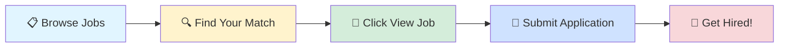

# 🚀 Tech Jobs Board

### Your Gateway to Amazing Career Opportunities

---

## 🎯 Browse by Job Profile

<table>
<tr>
<td align="center" width="25%">

 
<b>1000</b> total positions
</td>
<td align="center" width="25%">

 
<b>1000</b> total positions
</td>
<td align="center" width="25%">

 
<b>1000</b> total positions
</td>
<td align="center" width="25%">

 
<b>1000</b> total positions
</td>
</tr>
</table>

---

## 📊 Data Scientist

> 💼 **1000** positions available

<table>
<thead>
<tr>
<th width="20%">🏢 Company</th>
<th width="35%">💼 Role</th>
<th width="20%">📍 Location</th>
<th width="10%">⏰ Posted</th>
<th width="15%">🔗 Action</th>
</tr>
</thead>
<tbody>
<tr>
<td><a href="https://www.ambitionbox.com/overview/zscaler-softech-overview">Zscaler LATAM</a></td>
<td>Senior Analyst - Business Insights & Analytics</td>
<td>📍 Pune, Bangalore</td>
<td>1d ago</td>
<td align="center"></td>
</tr>
<tr>
<td><a href="https://www.ambitionbox.com/overview/opstree-solutions-overview">Opstree Solutions</a></td>
<td>Partnerships / Alliances Lead (AWS & BuildPiper)</td>
<td>📍 Noida, Bangalore</td>
<td>1d ago</td>
<td align="center"></td>
</tr>
<tr>
<td><a href="https://www.ambitionbox.com/overview/capco-technologies-overview">Capco</a></td>
<td>SDET Automation Test Engineer in Capital Market</td>
<td>📍 Bangalore, Pune</td>
<td>1d ago</td>
<td align="center"></td>
</tr>
<tr>
<td><a href="https://www.ambitionbox.com/overview/neal-analytics-overview">Neal Analytics</a></td>
<td>React + Python + Fast API Professional</td>
<td>📍 Gurugram, Noida, Mumbai, Hyderabad, Pune, Chennai, Coimbatore, Bangalore</td>
<td>1d ago</td>
<td align="center"></td>
</tr>
<tr>
<td><a href="https://www.ambitionbox.com/overview/neal-analytics-overview">Neal Analytics</a></td>
<td>React + Python + Fast API Professional</td>
<td>📍 Gurugram, Noida, Mumbai, Hyderabad, Pune, Chennai, Coimbatore, Bangalore</td>
<td>1d ago</td>
<td align="center"></td>
</tr>
<tr>
<td><a href="https://www.ambitionbox.com/overview/fractal-analytics-overview">Fractal Analytics</a></td>
<td>React, Python & Fast API Professional</td>
<td>📍 Gurugram, Noida, Mumbai, Hyderabad, Pune, Chennai, Coimbatore, Bangalore</td>
<td>1d ago</td>
<td align="center"></td>
</tr>
<tr>
<td><a href="https://www.ambitionbox.com/overview/jpmorgan-chase-and-co-dot-overview">JPMorgan Chase Bank</a></td>
<td>Lead Software Engineer- Java & Aws</td>
<td>📍 Bangalore</td>
<td>1d ago</td>
<td align="center"></td>
</tr>
<tr>
<td><a href="https://www.ambitionbox.com/overview/bmw-techworks-india-overview">BMW Techworks India</a></td>
<td>Junior C++ Developer AI/ML Platform Development</td>
<td>📍 Bangalore, Pune</td>
<td>1d ago</td>
<td align="center"></td>
</tr>
<tr>
<td><a href="https://www.ambitionbox.com/overview/nucleusteq-consulting-overview">Nucleusteq Consulting</a></td>
<td>Data Engineer (GCP & NoSQL)</td>
<td>📍 Bangalore, Gurugram</td>
<td>1d ago</td>
<td align="center"></td>
</tr>
<tr>
<td><a href="https://www.ambitionbox.com/overview/two95-international-overview">Two95 International Inc.</a></td>
<td>Senior Statistician (SAS & R)</td>
<td>📍 Pune, Bangalore</td>
<td>1d ago</td>
<td align="center"></td>
</tr>
<tr>
<td><a href="https://www.ambitionbox.com/overview/yash-technologies-overview">Yash Technologies</a></td>
<td>Sr. Software Engineer - Java+AWS</td>
<td>📍 Hyderabad, Pune, Bangalore</td>
<td>1d ago</td>
<td align="center"></td>
</tr>
<tr>
<td><a href="https://www.ambitionbox.com/overview/yash-technologies-overview">Yash Technologies</a></td>
<td>Sr. Software Engineer - Java+AWS</td>
<td>📍 Pune, Hyderabad, Bangalore</td>
<td>1d ago</td>
<td align="center"></td>
</tr>
<tr>
<td><a href="https://www.ambitionbox.com/overview/yash-technologies-overview">Yash Technologies</a></td>
<td>Sr. Software Engineer - Java+AWS</td>
<td>📍 Pune, Hyderabad, Bangalore</td>
<td>1d ago</td>
<td align="center"></td>
</tr>
<tr>
<td><a href="https://www.ambitionbox.com/overview/apm-terminals-overview">APM Terminals</a></td>
<td>AI/ML Engineer</td>
<td>📍 Pune, Bangalore</td>
<td>1d ago</td>
<td align="center"></td>
</tr>
<tr>
<td>Allegis Group</td>
<td>Python Developer</td>
<td>📍 Hyderabad</td>
<td>1d ago</td>
<td align="center"></td>
</tr>
<tr>
<td><a href="https://www.ambitionbox.com/overview/synechron-overview">Synechron</a></td>
<td>Python developers</td>
<td>📍 Mumbai</td>
<td>1d ago</td>
<td align="center"></td>
</tr>
<tr>
<td><a href="https://www.ambitionbox.com/overview/cgi-group-overview">CGI</a></td>
<td>Python API Developer</td>
<td>📍 Hyderabad</td>
<td>1d ago</td>
<td align="center"></td>
</tr>
<tr>
<td>Crescendo Global Leadership Hiring India</td>
<td>Sr Data Scientist-GEN AI- 5+yrs-PAN INDIA</td>
<td>📍 Delhi, Pune, Bangalore</td>
<td>1d ago</td>
<td align="center"></td>
</tr>
<tr>
<td><a href="https://www.ambitionbox.com/overview/nagarro-overview">Nagarro</a></td>
<td>Associate Staff Engineer (QA Automation)</td>
<td>📍 Mumbai</td>
<td>1d ago</td>
<td align="center"></td>
</tr>
<tr>
<td><a href="https://www.ambitionbox.com/overview/sumago-infotech-overview">Sumago Infotech</a></td>
<td>Python Developer</td>
<td>📍 Pune</td>
<td>1d ago</td>
<td align="center"></td>
</tr>
<tr>
<td><a href="https://www.ambitionbox.com/overview/nice-overview">NICE</a></td>
<td>Specialist Automation Engineer, Actimize (Performance Testing)</td>
<td>📍 Pune</td>
<td>1d ago</td>
<td align="center"></td>
</tr>
<tr>
<td><a href="https://www.ambitionbox.com/overview/techversant-infotech-overview">Techversant</a></td>
<td>Senior Automation Test Engineer</td>
<td>📍 Kochi</td>
<td>1d ago</td>
<td align="center"></td>
</tr>
<tr>
<td><a href="https://www.ambitionbox.com/overview/zeon-solutions-overview">Perficient India</a></td>
<td>NLP - Sub-Contractor</td>
<td>📍 Gurugram, Hyderabad, Chennai</td>
<td>1d ago</td>
<td align="center"></td>
</tr>
<tr>
<td><a href="https://www.ambitionbox.com/overview/exl-service-overview">EXL</a></td>
<td>MANAGER ANALYTICS</td>
<td>📍 Gurugram</td>
<td>1d ago</td>
<td align="center"></td>
</tr>
<tr>
<td><a href="https://www.ambitionbox.com/overview/infogain-overview">Infogain</a></td>
<td>AI / ML Developer (Lead)</td>
<td>📍 Bangalore</td>
<td>1d ago</td>
<td align="center"></td>
</tr>
<tr>
<td>Cygnus Consultancy</td>
<td>Solution Architect (Snowflake on Azure)</td>
<td>📍 Hyderabad</td>
<td>1d ago</td>
<td align="center"></td>
</tr>
<tr>
<td><a href="https://www.ambitionbox.com/overview/bmw-techworks-india-overview">BMW Techworks India</a></td>
<td>Ai Ml Engineer</td>
<td>📍 Bangalore</td>
<td>1d ago</td>
<td align="center"></td>
</tr>
<tr>
<td><a href="https://www.ambitionbox.com/overview/tata-elxsi-overview">Tata Elxsi</a></td>
<td>Principal Python Developer</td>
<td>📍 Chennai, Bangalore</td>
<td>1d ago</td>
<td align="center"></td>
</tr>
<tr>
<td><a href="https://www.ambitionbox.com/overview/walmart-overview">Walmart</a></td>
<td>MANAGER, DATA ANALYTICS-1</td>
<td>📍 Chennai</td>
<td>1d ago</td>
<td align="center"></td>
</tr>
<tr>
<td><a href="https://www.ambitionbox.com/overview/barclays-shared-services-overview">Barclays</a></td>
<td>Data Engineer - AWS</td>
<td>📍 Pune</td>
<td>1d ago</td>
<td align="center"></td>
</tr>
<tr>
<td>Metazone</td>
<td>Python Developer Intern</td>
<td>📍 Faridabad</td>
<td>1d ago</td>
<td align="center"></td>
</tr>
<tr>
<td><a href="https://www.ambitionbox.com/overview/intraedge-overview">IntraEdge Technology</a></td>
<td>Sql Developer</td>
<td>📍 Hyderabad</td>
<td>1d ago</td>
<td align="center"></td>
</tr>
<tr>
<td>Anlage Infotech</td>
<td>Artificial Intelligence Tech lead - 7 To 14 Years - Ban/Hyd</td>
<td>📍 Hyderabad, Bangalore</td>
<td>1d ago</td>
<td align="center"></td>
</tr>
<tr>
<td><a href="https://www.ambitionbox.com/overview/publicis-sapient-overview">Sapient (publicissapient)</a></td>
<td>Prompt Engineer / GenAI Engineer (Python + RAG)</td>
<td>📍 Gurugram</td>
<td>1d ago</td>
<td align="center"></td>
</tr>
<tr>
<td><a href="https://www.ambitionbox.com/overview/publicis-sapient-overview">Sapient (publicissapient)</a></td>
<td>Python + MS Stack + DevOps + AWS</td>
<td>📍 Gurugram, Pune, Bangalore</td>
<td>1d ago</td>
<td align="center"></td>
</tr>
<tr>
<td>Dbiz Consulting</td>
<td>Dot NET and Azure Developer</td>
<td>📍 Bangalore</td>
<td>1d ago</td>
<td align="center"></td>
</tr>
<tr>
<td>Verdantas</td>
<td>AI Data Scientist</td>
<td>📍 Pune</td>
<td>1d ago</td>
<td align="center"></td>
</tr>
<tr>
<td><a href="https://www.ambitionbox.com/overview/smart-working-overview">SWS Smart Working Solutions</a></td>
<td>Quality Engineer (Manual + Automation, AI-Focused), India [HR120]</td>
<td>📍 Delhi</td>
<td>1d ago</td>
<td align="center"></td>
</tr>
<tr>
<td><a href="https://www.ambitionbox.com/overview/byasa-tech-solutions-overview">Byasa Tech Solutions</a></td>
<td>Python Developer</td>
<td>📍 Mumbai</td>
<td>1d ago</td>
<td align="center"></td>
</tr>
<tr>
<td><a href="https://www.ambitionbox.com/overview/byasa-tech-solutions-overview">Byasa Tech Solutions</a></td>
<td>SQL Developer</td>
<td>📍 Mumbai</td>
<td>1d ago</td>
<td align="center"></td>
</tr>
<tr>
<td>Godigi Infotech</td>
<td>PYTHON DEVELOPMENT</td>
<td>📍 Mumbai</td>
<td>1d ago</td>
<td align="center"></td>
</tr>
<tr>
<td><a href="https://www.ambitionbox.com/overview/hevo-data-overview">Hevo Technologies</a></td>
<td>Analytics Manager</td>
<td>📍 Bangalore</td>
<td>1d ago</td>
<td align="center"></td>
</tr>
<tr>
<td><a href="https://www.ambitionbox.com/overview/techverito-overview">Techverito Software Solutions</a></td>
<td>Python AI developer</td>
<td>📍 Chennai</td>
<td>1d ago</td>
<td align="center"></td>
</tr>
<tr>
<td><a href="https://www.ambitionbox.com/overview/ibu-consulting-overview">IBU Consulting</a></td>
<td>Python FS Developer</td>
<td>📍 Bangalore</td>
<td>1d ago</td>
<td align="center"></td>
</tr>
<tr>
<td><a href="https://www.ambitionbox.com/overview/dmacq-software-overview">Dmacq Software</a></td>
<td>QA Engineer - Manual and Automation</td>
<td>📍 Mumbai</td>
<td>1d ago</td>
<td align="center"></td>
</tr>
<tr>
<td><a href="https://www.ambitionbox.com/overview/roche-holding-overview">Hoffmann La Roche</a></td>
<td>Analytics & Intelligence Senior Analyst (Forecasting)</td>
<td>📍 Hyderabad</td>
<td>1d ago</td>
<td align="center"></td>
</tr>
<tr>
<td><a href="https://www.ambitionbox.com/overview/roche-holding-overview">Hoffmann La Roche</a></td>
<td>Analytics & Intelligence - Lead Analyst (Payer Analytics)</td>
<td>📍 Hyderabad</td>
<td>1d ago</td>
<td align="center"></td>
</tr>
<tr>
<td><a href="https://www.ambitionbox.com/overview/roche-holding-overview">Hoffmann La Roche</a></td>
<td>Analytics & Intelligence Senior Analyst (Payer Analytics)</td>
<td>📍 Hyderabad</td>
<td>1d ago</td>
<td align="center"></td>
</tr>
<tr>
<td><a href="https://www.ambitionbox.com/overview/han-digital-overview">Han Digital Solution</a></td>
<td>BI (Tableau,Power BI) Developer</td>
<td>📍 Hyderabad</td>
<td>1d ago</td>
<td align="center"></td>
</tr>
<tr>
<td><a href="https://www.ambitionbox.com/overview/walmart-overview">Walmart</a></td>
<td>SENIOR MANAGER, DATA ANALYTICS</td>
<td>📍 Chennai</td>
<td>1d ago</td>
<td align="center"></td>
</tr>
<tr>
<td><a href="https://www.ambitionbox.com/overview/mahindra-finance-overview">Mahindra & Mahindra Limited.</a></td>
<td>Senior Manager-R&D</td>
<td>📍 Mohali</td>
<td>1d ago</td>
<td align="center"></td>
</tr>
<tr>
<td><a href="https://www.ambitionbox.com/overview/kpi-partners-overview">KPI Partners</a></td>
<td>GenAI Engineer - LLMs, Python, Tensorflow, pytorch</td>
<td>📍 Pune</td>
<td>1d ago</td>
<td align="center"></td>
</tr>
<tr>
<td><a href="https://www.ambitionbox.com/overview/cloudmoyo-overview">CloudMoyo, Inc</a></td>
<td>Full Stack Developer (Dot Net, Azure, Angular)</td>
<td>📍 Pune</td>
<td>1d ago</td>
<td align="center"></td>
</tr>
<tr>
<td><a href="https://www.ambitionbox.com/overview/techversant-infotech-overview">Techversant</a></td>
<td>Senior Data Scientist</td>
<td>📍 Kochi</td>
<td>1d ago</td>
<td align="center"></td>
</tr>
<tr>
<td><a href="https://www.ambitionbox.com/overview/accenture-overview">Accenture</a></td>
<td>AI / ML Engineer</td>
<td>📍 Bangalore</td>
<td>1d ago</td>
<td align="center"></td>
</tr>
<tr>
<td><a href="https://www.ambitionbox.com/overview/barclays-shared-services-overview">Barclays</a></td>
<td>Vice President ML Ops Engineer</td>
<td>📍 Noida</td>
<td>1d ago</td>
<td align="center"></td>
</tr>
<tr>
<td><a href="https://www.ambitionbox.com/overview/barclays-shared-services-overview">Barclays</a></td>
<td>Data Analytics - AVP</td>
<td>📍 Pune</td>
<td>1d ago</td>
<td align="center"></td>
</tr>
<tr>
<td><a href="https://www.ambitionbox.com/overview/barclays-shared-services-overview">Barclays</a></td>
<td>Automation Tester</td>
<td>📍 Pune</td>
<td>1d ago</td>
<td align="center"></td>
</tr>
<tr>
<td><a href="https://www.ambitionbox.com/overview/barclays-shared-services-overview">Barclays</a></td>
<td>AVP - Data Scientist</td>
<td>📍 Noida</td>
<td>1d ago</td>
<td align="center"></td>
</tr>
<tr>
<td><a href="https://www.ambitionbox.com/overview/tiger-analytics-overview">Tiger Analytics</a></td>
<td>Data Science Full stack (Python)</td>
<td>📍 Chennai, Hyderabad, Bangalore</td>
<td>1d ago</td>
<td align="center"></td>
</tr>
<tr>
<td><a href="https://www.ambitionbox.com/overview/accenture-overview">Accenture</a></td>
<td>AI / ML Engineer</td>
<td>📍 Bangalore</td>
<td>1d ago</td>
<td align="center"></td>
</tr>
<tr>
<td><a href="https://www.ambitionbox.com/overview/accenture-overview">Accenture</a></td>
<td>AI / ML Engineer</td>
<td>📍 Bangalore</td>
<td>1d ago</td>
<td align="center"></td>
</tr>
<tr>
<td><a href="https://www.ambitionbox.com/overview/accenture-overview">Accenture</a></td>
<td>AI / ML Engineer</td>
<td>📍 Bangalore</td>
<td>1d ago</td>
<td align="center"></td>
</tr>
<tr>
<td><a href="https://www.ambitionbox.com/overview/wipro-overview">Wipro</a></td>
<td>Data And Analytics Architect L1</td>
<td>📍 Bangalore</td>
<td>1d ago</td>
<td align="center"></td>
</tr>
<tr>
<td>Spectrum Talent Management</td>
<td>QA Automation Engineer</td>
<td>📍 Gurugram, Hyderabad</td>
<td>1d ago</td>
<td align="center"></td>
</tr>
<tr>
<td><a href="https://www.ambitionbox.com/overview/wipro-overview">Wipro</a></td>
<td>Automation Test Engineer</td>
<td>📍 Bangalore</td>
<td>1d ago</td>
<td align="center"></td>
</tr>
<tr>
<td><a href="https://www.ambitionbox.com/overview/wipro-overview">Wipro</a></td>
<td>Product Operations Analyst Onemarket - Data Analytics</td>
<td>📍 Pune</td>
<td>1d ago</td>
<td align="center"></td>
</tr>
<tr>
<td><a href="https://www.ambitionbox.com/overview/wipro-overview">Wipro</a></td>
<td>Lead Automation Engineer</td>
<td>📍 Bangalore</td>
<td>1d ago</td>
<td align="center"></td>
</tr>
<tr>
<td><a href="https://www.ambitionbox.com/overview/wells-fargo-overview">Wells Fargo</a></td>
<td>Senior Risk Analytics Consultant</td>
<td>📍 Hyderabad</td>
<td>1d ago</td>
<td align="center"></td>
</tr>
<tr>
<td><a href="https://www.ambitionbox.com/overview/wipro-overview">Wipro</a></td>
<td>Principal Engineer - Automation</td>
<td>📍 Bangalore</td>
<td>1d ago</td>
<td align="center"></td>
</tr>
<tr>
<td><a href="https://www.ambitionbox.com/overview/iris-software-overview">Iris Software</a></td>
<td>Playwright Test Automation - Senior Engineer</td>
<td>📍 Noida</td>
<td>1d ago</td>
<td align="center"></td>
</tr>
<tr>
<td><a href="https://www.ambitionbox.com/overview/wipro-overview">Wipro</a></td>
<td>Ai Ml Architect</td>
<td>📍 Hyderabad</td>
<td>1d ago</td>
<td align="center"></td>
</tr>
<tr>
<td><a href="https://www.ambitionbox.com/overview/wipro-overview">Wipro</a></td>
<td>Automation Engineer L3</td>
<td>📍 Chennai</td>
<td>1d ago</td>
<td align="center"></td>
</tr>
<tr>
<td><a href="https://www.ambitionbox.com/overview/wipro-overview">Wipro</a></td>
<td>Data And Analytics Architect L2</td>
<td>📍 Bangalore</td>
<td>1d ago</td>
<td align="center"></td>
</tr>
<tr>
<td><a href="https://www.ambitionbox.com/overview/persistent-systems-overview">Persistent</a></td>
<td>Azure Data Engineer</td>
<td>📍 Pune, Hyderabad, Bangalore</td>
<td>1d ago</td>
<td align="center"></td>
</tr>
<tr>
<td><a href="https://www.ambitionbox.com/overview/cgi-group-overview">CGI</a></td>
<td>Python Pyspark Developer</td>
<td>📍 Hyderabad</td>
<td>1d ago</td>
<td align="center"></td>
</tr>
<tr>
<td><a href="https://www.ambitionbox.com/overview/virtusa-consulting-services-overview">Virtusa</a></td>
<td>Senior Java AWS Developer</td>
<td>📍 Mumbai</td>
<td>1d ago</td>
<td align="center"></td>
</tr>
<tr>
<td><a href="https://www.ambitionbox.com/overview/virtusa-consulting-services-overview">Virtusa</a></td>
<td>AWS Engineer</td>
<td>📍 Chennai</td>
<td>1d ago</td>
<td align="center"></td>
</tr>
<tr>
<td><a href="https://www.ambitionbox.com/overview/virtusa-consulting-services-overview">Virtusa</a></td>
<td>Java AWS Professional</td>
<td>📍 Bangalore</td>
<td>1d ago</td>
<td align="center"></td>
</tr>
<tr>
<td><a href="https://www.ambitionbox.com/overview/virtusa-consulting-services-overview">Virtusa</a></td>
<td>Azure Databricks Professional</td>
<td>📍 Hyderabad</td>
<td>1d ago</td>
<td align="center"></td>
</tr>
<tr>
<td>Ascendion Engineering</td>
<td>Automation Engineer - RPA & Agentic AI</td>
<td>📍 Bangalore</td>
<td>1d ago</td>
<td align="center"></td>
</tr>
<tr>
<td>Kriyah Consulting</td>
<td>Data Engineer  GCP | PySpark | SQL</td>
<td>📍 Chennai</td>
<td>1d ago</td>
<td align="center"></td>
</tr>
<tr>
<td><a href="https://www.ambitionbox.com/overview/nutanix-overview">Nutanix</a></td>
<td>Manager - AI/ML</td>
<td>📍 Bangalore</td>
<td>1d ago</td>
<td align="center"></td>
</tr>
<tr>
<td>Creative Solutions</td>
<td>immediate openings For Devops Engineer AI/ML</td>
<td>📍 Bangalore</td>
<td>1d ago</td>
<td align="center"></td>
</tr>
<tr>
<td><a href="https://www.ambitionbox.com/overview/alstom-transportation-overview">Alstom</a></td>
<td>SAP Analytics Technical Specialist - BW</td>
<td>📍 Bangalore</td>
<td>1d ago</td>
<td align="center"></td>
</tr>
<tr>
<td>CODEBASE.COM INDIA PRIVATE LIMITED</td>
<td>Senior Backend Developer (Python)</td>
<td>📍 Pune</td>
<td>1d ago</td>
<td align="center"></td>
</tr>
<tr>
<td><a href="https://www.ambitionbox.com/overview/epam-systems-overview">Epam Systems</a></td>
<td>Azure Data Engineer</td>
<td>📍 Hyderabad</td>
<td>1d ago</td>
<td align="center"></td>
</tr>
<tr>
<td><a href="https://www.ambitionbox.com/overview/cgi-group-overview">CGI</a></td>
<td>Python API Developer</td>
<td>📍 Hyderabad</td>
<td>1d ago</td>
<td align="center"></td>
</tr>
<tr>
<td>hr1@adautomatos.com</td>
<td>Automation Sales Executive</td>
<td>📍 Ghaziabad(Sahibabad Industrial Area Site 4)</td>
<td>1d ago</td>
<td align="center"></td>
</tr>
<tr>
<td><a href="https://www.ambitionbox.com/overview/scatterpie-analytics-overview">Scatterpie Analytics</a></td>
<td>Full Stack Developer ( React Js + Python FAST API)</td>
<td>📍 Pune</td>
<td>1d ago</td>
<td align="center"></td>
</tr>
<tr>
<td><a href="https://www.ambitionbox.com/overview/wipro-overview">Wipro</a></td>
<td>Data And Analytics Architect L1</td>
<td>📍 Hyderabad</td>
<td>1d ago</td>
<td align="center"></td>
</tr>
<tr>
<td><a href="https://www.ambitionbox.com/overview/wipro-overview">Wipro</a></td>
<td>Cloud Azure Admin-L2</td>
<td>📍 Gurugram</td>
<td>1d ago</td>
<td align="center"></td>
</tr>
<tr>
<td><a href="https://www.ambitionbox.com/overview/diageo-overview">Diageo</a></td>
<td>Analyst, Data Science</td>
<td>📍 Bangalore</td>
<td>1d ago</td>
<td align="center"></td>
</tr>
<tr>
<td><a href="https://www.ambitionbox.com/overview/wipro-overview">Wipro</a></td>
<td>Azure Devops L4 Professional</td>
<td>📍 Hyderabad</td>
<td>1d ago</td>
<td align="center"></td>
</tr>
<tr>
<td><a href="https://www.ambitionbox.com/overview/wipro-overview">Wipro</a></td>
<td>Ai Ml Architect</td>
<td>📍 Bangalore</td>
<td>1d ago</td>
<td align="center"></td>
</tr>
<tr>
<td><a href="https://www.ambitionbox.com/overview/wipro-overview">Wipro</a></td>
<td>Gcp Developer</td>
<td>📍 Bangalore</td>
<td>1d ago</td>
<td align="center"></td>
</tr>
<tr>
<td><a href="https://www.ambitionbox.com/overview/wipro-overview">Wipro</a></td>
<td>Aws Administrator</td>
<td>📍 Pune</td>
<td>1d ago</td>
<td align="center"></td>
</tr>
<tr>
<td><a href="https://www.ambitionbox.com/overview/wipro-overview">Wipro</a></td>
<td>Azure Cloud Workload Security Professional</td>
<td>📍 Bangalore</td>
<td>1d ago</td>
<td align="center"></td>
</tr>
<tr>
<td><a href="https://www.ambitionbox.com/overview/silverlink-technologies-overview">Silverlink Technologies</a></td>
<td>Azure Devops Engineer</td>
<td>📍 Mumbai, Pune, Bangalore</td>
<td>1d ago</td>
<td align="center"></td>
</tr>
<tr>
<td>People Prime Worldwide</td>
<td>Azure Data Engineer</td>
<td>📍 Hyderabad</td>
<td>1d ago</td>
<td align="center"></td>
</tr>
<tr><td colspan="5" align="center"><i>... and 900 more positions</i></td></tr>
</tbody>
</table>

---

## 💼 Business Analyst

> 💼 **1000** positions available

<table>
<thead>
<tr>
<th width="20%">🏢 Company</th>
<th width="35%">💼 Role</th>
<th width="20%">📍 Location</th>
<th width="10%">⏰ Posted</th>
<th width="15%">🔗 Action</th>
</tr>
</thead>
<tbody>
<tr>
<td>Zigme Make Dreams Work</td>
<td>Project Management</td>
<td>📍 Hyderabad</td>
<td>1d ago</td>
<td align="center"></td>
</tr>
<tr>
<td>Technogen</td>
<td>Business Analyst</td>
<td>📍 Delhi, Hyderabad, Bangalore</td>
<td>1d ago</td>
<td align="center"></td>
</tr>
<tr>
<td><a href="https://www.ambitionbox.com/overview/zscaler-softech-overview">Zscaler LATAM</a></td>
<td>Senior Analyst - Business Insights & Analytics</td>
<td>📍 Pune, Bangalore</td>
<td>1d ago</td>
<td align="center"></td>
</tr>
<tr>
<td><a href="https://www.ambitionbox.com/overview/caterpillar-inc-overview">Caterpillar Inc</a></td>
<td>Scrum Master - .NET/C# Development</td>
<td>📍 Chennai, Bangalore</td>
<td>1d ago</td>
<td align="center"></td>
</tr>
<tr>
<td><a href="https://www.ambitionbox.com/overview/spotmies-overview">Spotmies</a></td>
<td>Business Analyst</td>
<td>📍 Hyderabad, Chennai, Bangalore</td>
<td>1d ago</td>
<td align="center"></td>
</tr>
<tr>
<td><a href="https://www.ambitionbox.com/overview/capco-technologies-overview">Capco</a></td>
<td>SDET Automation Test Engineer in Capital Market</td>
<td>📍 Bangalore, Pune</td>
<td>1d ago</td>
<td align="center"></td>
</tr>
<tr>
<td><a href="https://www.ambitionbox.com/overview/neal-analytics-overview">Neal Analytics</a></td>
<td>React + Python + Fast API Professional</td>
<td>📍 Gurugram, Noida, Mumbai, Hyderabad, Pune, Chennai, Coimbatore, Bangalore</td>
<td>1d ago</td>
<td align="center"></td>
</tr>
<tr>
<td><a href="https://www.ambitionbox.com/overview/neal-analytics-overview">Neal Analytics</a></td>
<td>React + Python + Fast API Professional</td>
<td>📍 Gurugram, Noida, Mumbai, Hyderabad, Pune, Chennai, Coimbatore, Bangalore</td>
<td>1d ago</td>
<td align="center"></td>
</tr>
<tr>
<td><a href="https://www.ambitionbox.com/overview/fractal-analytics-overview">Fractal Analytics</a></td>
<td>React, Python & Fast API Professional</td>
<td>📍 Gurugram, Noida, Mumbai, Hyderabad, Pune, Chennai, Coimbatore, Bangalore</td>
<td>1d ago</td>
<td align="center"></td>
</tr>
<tr>
<td>Lektronix</td>
<td>Salesforce Engineer</td>
<td>📍 Noida, Delhi, Pune, Bangalore</td>
<td>1d ago</td>
<td align="center"></td>
</tr>
<tr>
<td><a href="https://www.ambitionbox.com/overview/neal-analytics-overview">Neal Analytics</a></td>
<td>Senior Engineer- Power BI</td>
<td>📍 Noida, Mumbai, Pune, Gurugram, Bangalore</td>
<td>1d ago</td>
<td align="center"></td>
</tr>
<tr>
<td><a href="https://www.ambitionbox.com/overview/rockwell-automation-overview">Rockwell Automation</a></td>
<td>Salesforce Engineer</td>
<td>📍 Noida, Delhi, Pune, Bangalore</td>
<td>1d ago</td>
<td align="center"></td>
</tr>
<tr>
<td><a href="https://www.ambitionbox.com/overview/nice-overview">NICE</a></td>
<td>Senior Business Analyst</td>
<td>📍 Pune</td>
<td>1d ago</td>
<td align="center"></td>
</tr>
<tr>
<td>Kalypso A Rockwell Automation Business</td>
<td>Salesforce Engineer</td>
<td>📍 Noida, Delhi, Pune, Bangalore</td>
<td>1d ago</td>
<td align="center"></td>
</tr>
<tr>
<td><a href="https://www.ambitionbox.com/overview/databorough-overview">Databorough India</a></td>
<td>Scrum Master</td>
<td></td>
<td>1d ago</td>
<td align="center"></td>
</tr>
<tr>
<td>Allegis Group</td>
<td>Python Developer</td>
<td>📍 Hyderabad</td>
<td>1d ago</td>
<td align="center"></td>
</tr>
<tr>
<td><a href="https://www.ambitionbox.com/overview/synechron-overview">Synechron</a></td>
<td>Python developers</td>
<td>📍 Mumbai</td>
<td>1d ago</td>
<td align="center"></td>
</tr>
<tr>
<td><a href="https://www.ambitionbox.com/overview/clixlogix-technologies-overview">ClixLogix</a></td>
<td>Hiirng Business Analyst -Hybrid</td>
<td>📍 Noida</td>
<td>1d ago</td>
<td align="center"></td>
</tr>
<tr>
<td><a href="https://www.ambitionbox.com/overview/cgi-group-overview">CGI</a></td>
<td>Python API Developer</td>
<td>📍 Hyderabad</td>
<td>1d ago</td>
<td align="center"></td>
</tr>
<tr>
<td><a href="https://www.ambitionbox.com/overview/algoshack-overview">Algoshack Technologies</a></td>
<td>Business Analyst</td>
<td>📍 Mumbai</td>
<td>1d ago</td>
<td align="center"></td>
</tr>
<tr>
<td><a href="https://www.ambitionbox.com/overview/nagarro-overview">Nagarro</a></td>
<td>Associate Staff Engineer (QA Automation)</td>
<td>📍 Mumbai</td>
<td>1d ago</td>
<td align="center"></td>
</tr>
<tr>
<td>Adecco India</td>
<td>Senior Power Bi Developer</td>
<td>📍 Bangalore</td>
<td>1d ago</td>
<td align="center"></td>
</tr>
<tr>
<td><a href="https://www.ambitionbox.com/overview/sumago-infotech-overview">Sumago Infotech</a></td>
<td>Python Developer</td>
<td>📍 Pune</td>
<td>1d ago</td>
<td align="center"></td>
</tr>
<tr>
<td><a href="https://www.ambitionbox.com/overview/puresoftware-overview">Puresoftware</a></td>
<td>Junior Power Bi Developer</td>
<td>📍 Bangalore</td>
<td>1d ago</td>
<td align="center"></td>
</tr>
<tr>
<td><a href="https://www.ambitionbox.com/overview/nice-overview">NICE</a></td>
<td>Specialist Automation Engineer, Actimize (Performance Testing)</td>
<td>📍 Pune</td>
<td>1d ago</td>
<td align="center"></td>
</tr>
<tr>
<td><a href="https://www.ambitionbox.com/overview/techversant-infotech-overview">Techversant</a></td>
<td>Senior Automation Test Engineer</td>
<td>📍 Kochi</td>
<td>1d ago</td>
<td align="center"></td>
</tr>
<tr>
<td><a href="https://www.ambitionbox.com/overview/exl-service-overview">EXL</a></td>
<td>MANAGER ANALYTICS</td>
<td>📍 Gurugram</td>
<td>1d ago</td>
<td align="center"></td>
</tr>
<tr>
<td>Talent Corner Hr Services</td>
<td>Scrum Master</td>
<td>📍 Bangalore</td>
<td>1d ago</td>
<td align="center"></td>
</tr>
<tr>
<td><a href="https://www.ambitionbox.com/overview/novac-technology-solutions-overview">NOVAC</a></td>
<td>Business Analyst</td>
<td>📍 Chennai</td>
<td>1d ago</td>
<td align="center"></td>
</tr>
<tr>
<td><a href="https://www.ambitionbox.com/overview/sun-life-global-solutions-overview">Sun Life Global Solutions</a></td>
<td>Business Analyst - Reporting</td>
<td>📍 Gurugram</td>
<td>1d ago</td>
<td align="center"></td>
</tr>
<tr>
<td><a href="https://www.ambitionbox.com/overview/polyplex-overview">Polyplex</a></td>
<td>Job Opportunity || Business Analyst (CA-Semi Qualified)</td>
<td>📍 Noida</td>
<td>1d ago</td>
<td align="center"></td>
</tr>
<tr>
<td><a href="https://www.ambitionbox.com/overview/tata-elxsi-overview">Tata Elxsi</a></td>
<td>Principal Python Developer</td>
<td>📍 Chennai, Bangalore</td>
<td>1d ago</td>
<td align="center"></td>
</tr>
<tr>
<td><a href="https://www.ambitionbox.com/overview/walmart-overview">Walmart</a></td>
<td>MANAGER, DATA ANALYTICS-1</td>
<td>📍 Chennai</td>
<td>1d ago</td>
<td align="center"></td>
</tr>
<tr>
<td><a href="https://www.ambitionbox.com/overview/quarks-technosoft-overview">Quarks Technosoft</a></td>
<td>Salesforce Director</td>
<td>📍 Bangalore</td>
<td>1d ago</td>
<td align="center"></td>
</tr>
<tr>
<td>Metazone</td>
<td>Python Developer Intern</td>
<td>📍 Faridabad</td>
<td>1d ago</td>
<td align="center"></td>
</tr>
<tr>
<td><a href="https://www.ambitionbox.com/overview/intraedge-overview">IntraEdge Technology</a></td>
<td>Sql Developer</td>
<td>📍 Hyderabad</td>
<td>1d ago</td>
<td align="center"></td>
</tr>
<tr>
<td><a href="https://www.ambitionbox.com/overview/publicis-sapient-overview">Sapient (publicissapient)</a></td>
<td>Prompt Engineer / GenAI Engineer (Python + RAG)</td>
<td>📍 Gurugram</td>
<td>1d ago</td>
<td align="center"></td>
</tr>
<tr>
<td><a href="https://www.ambitionbox.com/overview/publicis-sapient-overview">Sapient (publicissapient)</a></td>
<td>Python + MS Stack + DevOps + AWS</td>
<td>📍 Gurugram, Pune, Bangalore</td>
<td>1d ago</td>
<td align="center"></td>
</tr>
<tr>
<td>Dbiz Consulting</td>
<td>Senior QA Salesforce- ME- 16th Jan #3</td>
<td>📍 Kochi</td>
<td>1d ago</td>
<td align="center"></td>
</tr>
<tr>
<td><a href="https://www.ambitionbox.com/overview/smart-working-overview">SWS Smart Working Solutions</a></td>
<td>Quality Engineer (Manual + Automation, AI-Focused), India [HR120]</td>
<td>📍 Delhi</td>
<td>1d ago</td>
<td align="center"></td>
</tr>
<tr>
<td><a href="https://www.ambitionbox.com/overview/blend360-overview">Blend360 India</a></td>
<td>Senior Analyst - Power BI</td>
<td>📍 Hyderabad</td>
<td>1d ago</td>
<td align="center"></td>
</tr>
<tr>
<td><a href="https://www.ambitionbox.com/overview/byasa-tech-solutions-overview">Byasa Tech Solutions</a></td>
<td>Python Developer</td>
<td>📍 Mumbai</td>
<td>1d ago</td>
<td align="center"></td>
</tr>
<tr>
<td><a href="https://www.ambitionbox.com/overview/byasa-tech-solutions-overview">Byasa Tech Solutions</a></td>
<td>SQL Developer</td>
<td>📍 Mumbai</td>
<td>1d ago</td>
<td align="center"></td>
</tr>
<tr>
<td><a href="https://www.ambitionbox.com/overview/cloud-odyssey-it-solutions-overview">Cloudodyssey It Solutions</a></td>
<td>Salesforce QA Lead</td>
<td>📍 Hyderabad, Bangalore</td>
<td>1d ago</td>
<td align="center"></td>
</tr>
<tr>
<td><a href="https://www.ambitionbox.com/overview/carmeuse-overview">Carmeuse Lime & Stone</a></td>
<td>Hexagon EAM Business Analyst</td>
<td>📍 Bangalore</td>
<td>1d ago</td>
<td align="center"></td>
</tr>
<tr>
<td>Godigi Infotech</td>
<td>PYTHON DEVELOPMENT</td>
<td>📍 Mumbai</td>
<td>1d ago</td>
<td align="center"></td>
</tr>
<tr>
<td><a href="https://www.ambitionbox.com/overview/hevo-data-overview">Hevo Technologies</a></td>
<td>Analytics Manager</td>
<td>📍 Bangalore</td>
<td>1d ago</td>
<td align="center"></td>
</tr>
<tr>
<td><a href="https://www.ambitionbox.com/overview/techverito-overview">Techverito Software Solutions</a></td>
<td>Python AI developer</td>
<td>📍 Chennai</td>
<td>1d ago</td>
<td align="center"></td>
</tr>
<tr>
<td><a href="https://www.ambitionbox.com/overview/ibu-consulting-overview">IBU Consulting</a></td>
<td>Python FS Developer</td>
<td>📍 Bangalore</td>
<td>1d ago</td>
<td align="center"></td>
</tr>
<tr>
<td><a href="https://www.ambitionbox.com/overview/dmacq-software-overview">Dmacq Software</a></td>
<td>QA Engineer - Manual and Automation</td>
<td>📍 Mumbai</td>
<td>1d ago</td>
<td align="center"></td>
</tr>
<tr>
<td><a href="https://www.ambitionbox.com/overview/roche-holding-overview">Hoffmann La Roche</a></td>
<td>Analytics & Intelligence Senior Analyst (Forecasting)</td>
<td>📍 Hyderabad</td>
<td>1d ago</td>
<td align="center"></td>
</tr>
<tr>
<td><a href="https://www.ambitionbox.com/overview/roche-holding-overview">Hoffmann La Roche</a></td>
<td>Analytics & Intelligence - Lead Analyst (Payer Analytics)</td>
<td>📍 Hyderabad</td>
<td>1d ago</td>
<td align="center"></td>
</tr>
<tr>
<td><a href="https://www.ambitionbox.com/overview/roche-holding-overview">Hoffmann La Roche</a></td>
<td>Analytics & Intelligence Senior Analyst (Payer Analytics)</td>
<td>📍 Hyderabad</td>
<td>1d ago</td>
<td align="center"></td>
</tr>
<tr>
<td><a href="https://www.ambitionbox.com/overview/han-digital-overview">Han Digital Solution</a></td>
<td>BI (Tableau,Power BI) Developer</td>
<td>📍 Hyderabad</td>
<td>1d ago</td>
<td align="center"></td>
</tr>
<tr>
<td><a href="https://www.ambitionbox.com/overview/walmart-overview">Walmart</a></td>
<td>SENIOR MANAGER, DATA ANALYTICS</td>
<td>📍 Chennai</td>
<td>1d ago</td>
<td align="center"></td>
</tr>
<tr>
<td><a href="https://www.ambitionbox.com/overview/jade-global-overview">Jade Global</a></td>
<td>Agile PLM Consultant</td>
<td>📍 Bangalore, Hyderabad, Pune</td>
<td>1d ago</td>
<td align="center"></td>
</tr>
<tr>
<td><a href="https://www.ambitionbox.com/overview/rishabh-software-overview">Rishabh Software</a></td>
<td>Staff Scrum Master</td>
<td>📍 Vadodara</td>
<td>1d ago</td>
<td align="center"></td>
</tr>
<tr>
<td><a href="https://www.ambitionbox.com/overview/kpi-partners-overview">KPI Partners</a></td>
<td>GenAI Engineer - LLMs, Python, Tensorflow, pytorch</td>
<td>📍 Pune</td>
<td>1d ago</td>
<td align="center"></td>
</tr>
<tr>
<td><a href="https://www.ambitionbox.com/overview/cvent-overview">Cvent</a></td>
<td>Scrum Master</td>
<td>📍 Gurugram</td>
<td>1d ago</td>
<td align="center"></td>
</tr>
<tr>
<td><a href="https://www.ambitionbox.com/overview/birlasoft-overview">Birlasoft</a></td>
<td>Business Consulting Specialist</td>
<td>📍 Noida</td>
<td>1d ago</td>
<td align="center"></td>
</tr>
<tr>
<td><a href="https://www.ambitionbox.com/overview/crisil-overview">Crisil</a></td>
<td>Regulatory Business Analyst 2</td>
<td>📍 Mumbai</td>
<td>1d ago</td>
<td align="center"></td>
</tr>
<tr>
<td><a href="https://www.ambitionbox.com/overview/cvent-overview">Cvent</a></td>
<td>Scrum Master II</td>
<td>📍 Gurugram</td>
<td>1d ago</td>
<td align="center"></td>
</tr>
<tr>
<td><a href="https://www.ambitionbox.com/overview/cvent-overview">Cvent</a></td>
<td>Scrum Master</td>
<td>📍 Gurugram</td>
<td>1d ago</td>
<td align="center"></td>
</tr>
<tr>
<td><a href="https://www.ambitionbox.com/overview/barclays-shared-services-overview">Barclays</a></td>
<td>Data Analytics - AVP</td>
<td>📍 Pune</td>
<td>1d ago</td>
<td align="center"></td>
</tr>
<tr>
<td><a href="https://www.ambitionbox.com/overview/barclays-shared-services-overview">Barclays</a></td>
<td>Automation Tester</td>
<td>📍 Pune</td>
<td>1d ago</td>
<td align="center"></td>
</tr>
<tr>
<td><a href="https://www.ambitionbox.com/overview/tiger-analytics-overview">Tiger Analytics</a></td>
<td>Data Science Full stack (Python)</td>
<td>📍 Chennai, Hyderabad, Bangalore</td>
<td>1d ago</td>
<td align="center"></td>
</tr>
<tr>
<td>Attesa Coffee</td>
<td>Business Analysis Intern</td>
<td>📍 Mumbai</td>
<td>1d ago</td>
<td align="center"></td>
</tr>
<tr>
<td><a href="https://www.ambitionbox.com/overview/wipro-overview">Wipro</a></td>
<td>Business Analyst L3</td>
<td>📍 Mumbai</td>
<td>1d ago</td>
<td align="center"></td>
</tr>
<tr>
<td><a href="https://www.ambitionbox.com/overview/accenture-overview">Accenture</a></td>
<td>Business Process Architect</td>
<td>📍 Bangalore</td>
<td>1d ago</td>
<td align="center"></td>
</tr>
<tr>
<td><a href="https://www.ambitionbox.com/overview/accenture-overview">Accenture</a></td>
<td>Program/Project Management Lead</td>
<td>📍 Coimbatore</td>
<td>1d ago</td>
<td align="center"></td>
</tr>
<tr>
<td><a href="https://www.ambitionbox.com/overview/accenture-overview">Accenture</a></td>
<td>Program/Project Management Lead</td>
<td>📍 Coimbatore</td>
<td>1d ago</td>
<td align="center"></td>
</tr>
<tr>
<td><a href="https://www.ambitionbox.com/overview/wipro-overview">Wipro</a></td>
<td>Data And Analytics Architect L1</td>
<td>📍 Bangalore</td>
<td>1d ago</td>
<td align="center"></td>
</tr>
<tr>
<td><a href="https://www.ambitionbox.com/overview/wipro-overview">Wipro</a></td>
<td>Business Analyst L4</td>
<td>📍 Hyderabad</td>
<td>1d ago</td>
<td align="center"></td>
</tr>
<tr>
<td><a href="https://www.ambitionbox.com/overview/wipro-overview">Wipro</a></td>
<td>Business Analyst L4</td>
<td>📍 Bangalore</td>
<td>1d ago</td>
<td align="center"></td>
</tr>
<tr>
<td>Gainserv Tech</td>
<td>Business Analyst</td>
<td>📍 Surat(Adajan)</td>
<td>1d ago</td>
<td align="center"></td>
</tr>
<tr>
<td>Spectrum Talent Management</td>
<td>QA Automation Engineer</td>
<td>📍 Gurugram, Hyderabad</td>
<td>1d ago</td>
<td align="center"></td>
</tr>
<tr>
<td><a href="https://www.ambitionbox.com/overview/wipro-overview">Wipro</a></td>
<td>Salesforce Qa Manager</td>
<td>📍 Bangalore</td>
<td>1d ago</td>
<td align="center"></td>
</tr>
<tr>
<td><a href="https://www.ambitionbox.com/overview/wipro-overview">Wipro</a></td>
<td>Automation Test Engineer</td>
<td>📍 Bangalore</td>
<td>1d ago</td>
<td align="center"></td>
</tr>
<tr>
<td><a href="https://www.ambitionbox.com/overview/wipro-overview">Wipro</a></td>
<td>Product Operations Analyst Onemarket - Data Analytics</td>
<td>📍 Pune</td>
<td>1d ago</td>
<td align="center"></td>
</tr>
<tr>
<td><a href="https://www.ambitionbox.com/overview/wipro-overview">Wipro</a></td>
<td>Business Analyst L5</td>
<td>📍 Hyderabad</td>
<td>1d ago</td>
<td align="center"></td>
</tr>
<tr>
<td><a href="https://www.ambitionbox.com/overview/wipro-overview">Wipro</a></td>
<td>Lead Automation Engineer</td>
<td>📍 Bangalore</td>
<td>1d ago</td>
<td align="center"></td>
</tr>
<tr>
<td><a href="https://www.ambitionbox.com/overview/wells-fargo-overview">Wells Fargo</a></td>
<td>Senior Risk Analytics Consultant</td>
<td>📍 Hyderabad</td>
<td>1d ago</td>
<td align="center"></td>
</tr>
<tr>
<td><a href="https://www.ambitionbox.com/overview/wipro-overview">Wipro</a></td>
<td>Scrum Master L1</td>
<td>📍 Pune</td>
<td>1d ago</td>
<td align="center"></td>
</tr>
<tr>
<td><a href="https://www.ambitionbox.com/overview/wipro-overview">Wipro</a></td>
<td>Principal Engineer - Automation</td>
<td>📍 Bangalore</td>
<td>1d ago</td>
<td align="center"></td>
</tr>
<tr>
<td><a href="https://www.ambitionbox.com/overview/wipro-overview">Wipro</a></td>
<td>Business Analyst L3</td>
<td>📍 Bangalore</td>
<td>1d ago</td>
<td align="center"></td>
</tr>
<tr>
<td><a href="https://www.ambitionbox.com/overview/iris-software-overview">Iris Software</a></td>
<td>Playwright Test Automation - Senior Engineer</td>
<td>📍 Noida</td>
<td>1d ago</td>
<td align="center"></td>
</tr>
<tr>
<td><a href="https://www.ambitionbox.com/overview/wipro-overview">Wipro</a></td>
<td>Business Analyst L4</td>
<td>📍 Hyderabad</td>
<td>1d ago</td>
<td align="center"></td>
</tr>
<tr>
<td><a href="https://www.ambitionbox.com/overview/wipro-overview">Wipro</a></td>
<td>Jira Developer</td>
<td>📍 Hyderabad</td>
<td>1d ago</td>
<td align="center"></td>
</tr>
<tr>
<td><a href="https://www.ambitionbox.com/overview/wipro-overview">Wipro</a></td>
<td>Automation Engineer L3</td>
<td>📍 Chennai</td>
<td>1d ago</td>
<td align="center"></td>
</tr>
<tr>
<td><a href="https://www.ambitionbox.com/overview/wipro-overview">Wipro</a></td>
<td>Business Analyst L4</td>
<td>📍 Bangalore</td>
<td>1d ago</td>
<td align="center"></td>
</tr>
<tr>
<td><a href="https://www.ambitionbox.com/overview/wipro-overview">Wipro</a></td>
<td>Business Analyst L2</td>
<td>📍 Mumbai</td>
<td>1d ago</td>
<td align="center"></td>
</tr>
<tr>
<td><a href="https://www.ambitionbox.com/overview/wipro-overview">Wipro</a></td>
<td>Business Analyst L4</td>
<td>📍 Bangalore</td>
<td>1d ago</td>
<td align="center"></td>
</tr>
<tr>
<td><a href="https://www.ambitionbox.com/overview/bill-gosling-outsourcing-india-overview">Bill Gosling</a></td>
<td>Hiring - Business Analyst</td>
<td>📍 Bangalore</td>
<td>1d ago</td>
<td align="center"></td>
</tr>
<tr>
<td><a href="https://www.ambitionbox.com/overview/wipro-overview">Wipro</a></td>
<td>Data And Analytics Architect L2</td>
<td>📍 Bangalore</td>
<td>1d ago</td>
<td align="center"></td>
</tr>
<tr>
<td><a href="https://www.ambitionbox.com/overview/cgi-group-overview">CGI</a></td>
<td>Python Pyspark Developer</td>
<td>📍 Hyderabad</td>
<td>1d ago</td>
<td align="center"></td>
</tr>
<tr>
<td><a href="https://www.ambitionbox.com/overview/virtusa-consulting-services-overview">Virtusa</a></td>
<td>Business Analyst</td>
<td>📍 Gurugram</td>
<td>1d ago</td>
<td align="center"></td>
</tr>
<tr>
<td><a href="https://www.ambitionbox.com/overview/virtusa-consulting-services-overview">Virtusa</a></td>
<td>Scrum Master</td>
<td>📍 Bangalore</td>
<td>1d ago</td>
<td align="center"></td>
</tr>
<tr>
<td>Ascendion Engineering</td>
<td>Automation Engineer - RPA & Agentic AI</td>
<td>📍 Bangalore</td>
<td>1d ago</td>
<td align="center"></td>
</tr>
<tr>
<td>Kriyah Consulting</td>
<td>Data Engineer  GCP | PySpark | SQL</td>
<td>📍 Chennai</td>
<td>1d ago</td>
<td align="center"></td>
</tr>
<tr>
<td><a href="https://www.ambitionbox.com/overview/alstom-transportation-overview">Alstom</a></td>
<td>SAP Analytics Technical Specialist - BW</td>
<td>📍 Bangalore</td>
<td>1d ago</td>
<td align="center"></td>
</tr>
<tr><td colspan="5" align="center"><i>... and 900 more positions</i></td></tr>
</tbody>
</table>

---

## 🚀 Product Manager

> 💼 **1000** positions available

<table>
<thead>
<tr>
<th width="20%">🏢 Company</th>
<th width="35%">💼 Role</th>
<th width="20%">📍 Location</th>
<th width="10%">⏰ Posted</th>
<th width="15%">🔗 Action</th>
</tr>
</thead>
<tbody>
<tr>
<td>Zigme Make Dreams Work</td>
<td>Project Management</td>
<td>📍 Hyderabad</td>
<td>1d ago</td>
<td align="center"></td>
</tr>
<tr>
<td><a href="https://www.ambitionbox.com/overview/cendyn-overview">Cendyn</a></td>
<td>Director, Account Management - APAC (Customer Success)</td>
<td>📍 Gurugram, Hyderabad</td>
<td>1d ago</td>
<td align="center"></td>
</tr>
<tr>
<td><a href="https://www.ambitionbox.com/overview/zscaler-softech-overview">Zscaler LATAM</a></td>
<td>Senior Analyst - Business Insights & Analytics</td>
<td>📍 Pune, Bangalore</td>
<td>1d ago</td>
<td align="center"></td>
</tr>
<tr>
<td>Welo Data</td>
<td>Senior Life Sciences Product Manager</td>
<td>📍 Gurugram, Noida</td>
<td>1d ago</td>
<td align="center"></td>
</tr>
<tr>
<td><a href="https://www.ambitionbox.com/overview/caterpillar-inc-overview">Caterpillar Inc</a></td>
<td>Senior Digital Product Owner</td>
<td>📍 Chennai, Bangalore</td>
<td>1d ago</td>
<td align="center"></td>
</tr>
<tr>
<td><a href="https://www.ambitionbox.com/overview/testhouse-overview">Testhouse</a></td>
<td>Test Manager -Wealth Management</td>
<td>📍 Bangalore</td>
<td>1d ago</td>
<td align="center"></td>
</tr>
<tr>
<td><a href="https://www.ambitionbox.com/overview/caterpillar-inc-overview">Caterpillar Inc</a></td>
<td>Scrum Master - .NET/C# Development</td>
<td>📍 Chennai, Bangalore</td>
<td>1d ago</td>
<td align="center"></td>
</tr>
<tr>
<td><a href="https://www.ambitionbox.com/overview/capco-technologies-overview">Capco</a></td>
<td>SDET Automation Test Engineer in Capital Market</td>
<td>📍 Bangalore, Pune</td>
<td>1d ago</td>
<td align="center"></td>
</tr>
<tr>
<td><a href="https://www.ambitionbox.com/overview/thomson-reuters-overview">Thomson Reuters</a></td>
<td>Technical Product Manager - CIAM</td>
<td>📍 Hyderabad, Bangalore</td>
<td>1d ago</td>
<td align="center"></td>
</tr>
<tr>
<td>Ionicpartners</td>
<td>Technical Product Manager</td>
<td>📍 Mumbai, Delhi</td>
<td>1d ago</td>
<td align="center"></td>
</tr>
<tr>
<td><a href="https://www.ambitionbox.com/overview/alwin-willcure-pharmaceutical-overview">Alwin Willcure Pharmaceuticals Pvt. Ltd.</a></td>
<td>Product Specialist</td>
<td>📍 Noida</td>
<td>1d ago</td>
<td align="center"></td>
</tr>
<tr>
<td><a href="https://www.ambitionbox.com/overview/databorough-overview">Databorough India</a></td>
<td>Scrum Master</td>
<td></td>
<td>1d ago</td>
<td align="center"></td>
</tr>
<tr>
<td><a href="https://www.ambitionbox.com/overview/niyo-solutions-overview">Niyo Solutions</a></td>
<td>Intern - Product Management</td>
<td>📍 Bangalore</td>
<td>1d ago</td>
<td align="center"></td>
</tr>
<tr>
<td>PYC Consultants</td>
<td>Product Management Trainee</td>
<td>📍 Gurugram</td>
<td>1d ago</td>
<td align="center"></td>
</tr>
<tr>
<td>Peoplefy Infosolutions</td>
<td>Database Architect/Management V-Data Engineer (Oracle)</td>
<td>📍 Pune</td>
<td>1d ago</td>
<td align="center"></td>
</tr>
<tr>
<td><a href="https://www.ambitionbox.com/overview/nagarro-overview">Nagarro</a></td>
<td>Associate Staff Engineer (QA Automation)</td>
<td>📍 Mumbai</td>
<td>1d ago</td>
<td align="center"></td>
</tr>
<tr>
<td><a href="https://www.ambitionbox.com/overview/idemia-overview">Idemia Syscom</a></td>
<td>Application/Technical Support (Integration Engineer) || Product Based.</td>
<td>📍 Noida</td>
<td>1d ago</td>
<td align="center"></td>
</tr>
<tr>
<td><a href="https://www.ambitionbox.com/overview/ferring-therapeutics-overview">Ferring Therapeutics</a></td>
<td>Associate Product Manager</td>
<td>📍 Mumbai</td>
<td>1d ago</td>
<td align="center"></td>
</tr>
<tr>
<td><a href="https://www.ambitionbox.com/overview/air-india-overview">Air India</a></td>
<td>Associate Manager - Workforce Management</td>
<td>📍 Gurugram</td>
<td>1d ago</td>
<td align="center"></td>
</tr>
<tr>
<td><a href="https://www.ambitionbox.com/overview/air-india-overview">Air India</a></td>
<td>Associate Manager - Workforce Management</td>
<td>📍 Gurugram</td>
<td>1d ago</td>
<td align="center"></td>
</tr>
<tr>
<td><a href="https://www.ambitionbox.com/overview/nice-overview">NICE</a></td>
<td>Specialist Automation Engineer, Actimize (Performance Testing)</td>
<td>📍 Pune</td>
<td>1d ago</td>
<td align="center"></td>
</tr>
<tr>
<td><a href="https://www.ambitionbox.com/overview/techversant-infotech-overview">Techversant</a></td>
<td>Senior Automation Test Engineer</td>
<td>📍 Kochi</td>
<td>1d ago</td>
<td align="center"></td>
</tr>
<tr>
<td><a href="https://www.ambitionbox.com/overview/exl-service-overview">EXL</a></td>
<td>MANAGER ANALYTICS</td>
<td>📍 Gurugram</td>
<td>1d ago</td>
<td align="center"></td>
</tr>
<tr>
<td>Talent Corner Hr Services</td>
<td>Scrum Master</td>
<td>📍 Bangalore</td>
<td>1d ago</td>
<td align="center"></td>
</tr>
<tr>
<td><a href="https://www.ambitionbox.com/overview/hcl-technologies-overview">Hclsoftware</a></td>
<td>Product Manager</td>
<td>📍 Noida</td>
<td>1d ago</td>
<td align="center"></td>
</tr>
<tr>
<td><a href="https://www.ambitionbox.com/overview/walmart-overview">Walmart</a></td>
<td>MANAGER, DATA ANALYTICS-1</td>
<td>📍 Chennai</td>
<td>1d ago</td>
<td align="center"></td>
</tr>
<tr>
<td><a href="https://www.ambitionbox.com/overview/barclays-shared-services-overview">Barclays</a></td>
<td>Technical Product Owner</td>
<td>📍 Pune</td>
<td>1d ago</td>
<td align="center"></td>
</tr>
<tr>
<td><a href="https://www.ambitionbox.com/overview/intraedge-overview">IntraEdge Technology</a></td>
<td>Sql Developer</td>
<td>📍 Hyderabad</td>
<td>1d ago</td>
<td align="center"></td>
</tr>
<tr>
<td>Peoplefy Infosolutions</td>
<td>Database Architect/Management V-Data Engineer(Semantic)</td>
<td>📍 Pune</td>
<td>1d ago</td>
<td align="center"></td>
</tr>
<tr>
<td>Restat</td>
<td>Product Engineering Intern</td>
<td>📍 Delhi</td>
<td>1d ago</td>
<td align="center"></td>
</tr>
<tr>
<td><a href="https://www.ambitionbox.com/overview/vit-university-overview">VIT</a></td>
<td>Technical Assistant Learning Management System (LMS)</td>
<td>📍 Vellore</td>
<td>1d ago</td>
<td align="center"></td>
</tr>
<tr>
<td><a href="https://www.ambitionbox.com/overview/ltimindtree-overview">Ltimindtree</a></td>
<td>Senior Specialist - System Management</td>
<td>📍 Bangalore</td>
<td>1d ago</td>
<td align="center"></td>
</tr>
<tr>
<td><a href="https://www.ambitionbox.com/overview/smart-working-overview">SWS Smart Working Solutions</a></td>
<td>Quality Engineer (Manual + Automation, AI-Focused), India [HR120]</td>
<td>📍 Delhi</td>
<td>1d ago</td>
<td align="center"></td>
</tr>
<tr>
<td><a href="https://www.ambitionbox.com/overview/byasa-tech-solutions-overview">Byasa Tech Solutions</a></td>
<td>SQL Developer</td>
<td>📍 Mumbai</td>
<td>1d ago</td>
<td align="center"></td>
</tr>
<tr>
<td><a href="https://www.ambitionbox.com/overview/htic-global-overview">Htic Global</a></td>
<td>Product Specialist - Aviation</td>
<td>📍 Kochi</td>
<td>1d ago</td>
<td align="center"></td>
</tr>
<tr>
<td><a href="https://www.ambitionbox.com/overview/ensono-overview">Ensono</a></td>
<td>Manager, Capacity Management</td>
<td>📍 Pune</td>
<td>1d ago</td>
<td align="center"></td>
</tr>
<tr>
<td><a href="https://www.ambitionbox.com/overview/hevo-data-overview">Hevo Technologies</a></td>
<td>Analytics Manager</td>
<td>📍 Bangalore</td>
<td>1d ago</td>
<td align="center"></td>
</tr>
<tr>
<td><a href="https://www.ambitionbox.com/overview/dmacq-software-overview">Dmacq Software</a></td>
<td>QA Engineer - Manual and Automation</td>
<td>📍 Mumbai</td>
<td>1d ago</td>
<td align="center"></td>
</tr>
<tr>
<td><a href="https://www.ambitionbox.com/overview/dmacq-software-overview">Dmacq Software</a></td>
<td>Product Manager</td>
<td>📍 Mumbai</td>
<td>1d ago</td>
<td align="center"></td>
</tr>
<tr>
<td><a href="https://www.ambitionbox.com/overview/roche-holding-overview">Hoffmann La Roche</a></td>
<td>Analytics & Intelligence Senior Analyst (Forecasting)</td>
<td>📍 Hyderabad</td>
<td>1d ago</td>
<td align="center"></td>
</tr>
<tr>
<td><a href="https://www.ambitionbox.com/overview/roche-holding-overview">Hoffmann La Roche</a></td>
<td>Analytics & Intelligence - Lead Analyst (Payer Analytics)</td>
<td>📍 Hyderabad</td>
<td>1d ago</td>
<td align="center"></td>
</tr>
<tr>
<td><a href="https://www.ambitionbox.com/overview/roche-holding-overview">Hoffmann La Roche</a></td>
<td>Analytics & Intelligence Senior Analyst (Payer Analytics)</td>
<td>📍 Hyderabad</td>
<td>1d ago</td>
<td align="center"></td>
</tr>
<tr>
<td><a href="https://www.ambitionbox.com/overview/walmart-overview">Walmart</a></td>
<td>SENIOR MANAGER, DATA ANALYTICS</td>
<td>📍 Chennai</td>
<td>1d ago</td>
<td align="center"></td>
</tr>
<tr>
<td><a href="https://www.ambitionbox.com/overview/jade-global-overview">Jade Global</a></td>
<td>Agile PLM Consultant</td>
<td>📍 Bangalore, Hyderabad, Pune</td>
<td>1d ago</td>
<td align="center"></td>
</tr>
<tr>
<td><a href="https://www.ambitionbox.com/overview/rishabh-software-overview">Rishabh Software</a></td>
<td>Staff Scrum Master</td>
<td>📍 Vadodara</td>
<td>1d ago</td>
<td align="center"></td>
</tr>
<tr>
<td><a href="https://www.ambitionbox.com/overview/cvent-overview">Cvent</a></td>
<td>Scrum Master</td>
<td>📍 Gurugram</td>
<td>1d ago</td>
<td align="center"></td>
</tr>
<tr>
<td><a href="https://www.ambitionbox.com/overview/cvent-overview">Cvent</a></td>
<td>Scrum Master II</td>
<td>📍 Gurugram</td>
<td>1d ago</td>
<td align="center"></td>
</tr>
<tr>
<td><a href="https://www.ambitionbox.com/overview/cvent-overview">Cvent</a></td>
<td>Scrum Master</td>
<td>📍 Gurugram</td>
<td>1d ago</td>
<td align="center"></td>
</tr>
<tr>
<td><a href="https://www.ambitionbox.com/overview/barclays-shared-services-overview">Barclays</a></td>
<td>Data Analytics - AVP</td>
<td>📍 Pune</td>
<td>1d ago</td>
<td align="center"></td>
</tr>
<tr>
<td><a href="https://www.ambitionbox.com/overview/barclays-shared-services-overview">Barclays</a></td>
<td>Automation Tester</td>
<td>📍 Pune</td>
<td>1d ago</td>
<td align="center"></td>
</tr>
<tr>
<td><a href="https://www.ambitionbox.com/overview/makemytrip-overview">Makemytrip</a></td>
<td>Lead / Sr. Product Manager - Flights</td>
<td>📍 Gurugram</td>
<td>1d ago</td>
<td align="center"></td>
</tr>
<tr>
<td>Attesa Coffee</td>
<td>Business Analysis Intern</td>
<td>📍 Mumbai</td>
<td>1d ago</td>
<td align="center"></td>
</tr>
<tr>
<td><a href="https://www.ambitionbox.com/overview/accenture-overview">Accenture</a></td>
<td>Program/Project Management Lead</td>
<td>📍 Coimbatore</td>
<td>1d ago</td>
<td align="center"></td>
</tr>
<tr>
<td>Peoplefy Infosolutions</td>
<td>Database Architect/Management V Data Architect Modeler</td>
<td>📍 Pune</td>
<td>1d ago</td>
<td align="center"></td>
</tr>
<tr>
<td><a href="https://www.ambitionbox.com/overview/accenture-overview">Accenture</a></td>
<td>Program/Project Management Lead</td>
<td>📍 Coimbatore</td>
<td>1d ago</td>
<td align="center"></td>
</tr>
<tr>
<td><a href="https://www.ambitionbox.com/overview/wipro-overview">Wipro</a></td>
<td>Data And Analytics Architect L1</td>
<td>📍 Bangalore</td>
<td>1d ago</td>
<td align="center"></td>
</tr>
<tr>
<td>Spectrum Talent Management</td>
<td>QA Automation Engineer</td>
<td>📍 Gurugram, Hyderabad</td>
<td>1d ago</td>
<td align="center"></td>
</tr>
<tr>
<td><a href="https://www.ambitionbox.com/overview/wipro-overview">Wipro</a></td>
<td>Automation Test Engineer</td>
<td>📍 Bangalore</td>
<td>1d ago</td>
<td align="center"></td>
</tr>
<tr>
<td><a href="https://www.ambitionbox.com/overview/nielseniq-overview">Nielseniq India</a></td>
<td>Associate Product Manager</td>
<td>📍 Pune</td>
<td>1d ago</td>
<td align="center"></td>
</tr>
<tr>
<td><a href="https://www.ambitionbox.com/overview/wipro-overview">Wipro</a></td>
<td>Product Operations Analyst Onemarket - Data Analytics</td>
<td>📍 Pune</td>
<td>1d ago</td>
<td align="center"></td>
</tr>
<tr>
<td><a href="https://www.ambitionbox.com/overview/wipro-overview">Wipro</a></td>
<td>Product Owner</td>
<td>📍 Bangalore</td>
<td>1d ago</td>
<td align="center"></td>
</tr>
<tr>
<td><a href="https://www.ambitionbox.com/overview/wipro-overview">Wipro</a></td>
<td>Lead Automation Engineer</td>
<td>📍 Bangalore</td>
<td>1d ago</td>
<td align="center"></td>
</tr>
<tr>
<td><a href="https://www.ambitionbox.com/overview/wells-fargo-overview">Wells Fargo</a></td>
<td>Senior Risk Analytics Consultant</td>
<td>📍 Hyderabad</td>
<td>1d ago</td>
<td align="center"></td>
</tr>
<tr>
<td><a href="https://www.ambitionbox.com/overview/wipro-overview">Wipro</a></td>
<td>Scrum Master L1</td>
<td>📍 Pune</td>
<td>1d ago</td>
<td align="center"></td>
</tr>
<tr>
<td><a href="https://www.ambitionbox.com/overview/wipro-overview">Wipro</a></td>
<td>Principal Engineer - Automation</td>
<td>📍 Bangalore</td>
<td>1d ago</td>
<td align="center"></td>
</tr>
<tr>
<td><a href="https://www.ambitionbox.com/overview/gus-global-services-india-overview">Gus Global Services</a></td>
<td>Assistant Director- Business Development(Channel Management)</td>
<td>📍 Delhi</td>
<td>1d ago</td>
<td align="center"></td>
</tr>
<tr>
<td><a href="https://www.ambitionbox.com/overview/iris-software-overview">Iris Software</a></td>
<td>Playwright Test Automation - Senior Engineer</td>
<td>📍 Noida</td>
<td>1d ago</td>
<td align="center"></td>
</tr>
<tr>
<td><a href="https://www.ambitionbox.com/overview/optum-global-solutions-overview">Optum</a></td>
<td>Manager - Digital Product</td>
<td>📍 Gurugram</td>
<td>1d ago</td>
<td align="center"></td>
</tr>
<tr>
<td><a href="https://www.ambitionbox.com/overview/wipro-overview">Wipro</a></td>
<td>Jira Developer</td>
<td>📍 Hyderabad</td>
<td>1d ago</td>
<td align="center"></td>
</tr>
<tr>
<td><a href="https://www.ambitionbox.com/overview/wipro-overview">Wipro</a></td>
<td>Product Test Engineer L2</td>
<td>📍 Pune</td>
<td>1d ago</td>
<td align="center"></td>
</tr>
<tr>
<td><a href="https://www.ambitionbox.com/overview/wipro-overview">Wipro</a></td>
<td>Automation Engineer L3</td>
<td>📍 Chennai</td>
<td>1d ago</td>
<td align="center"></td>
</tr>
<tr>
<td><a href="https://www.ambitionbox.com/overview/wipro-overview">Wipro</a></td>
<td>Data And Analytics Architect L2</td>
<td>📍 Bangalore</td>
<td>1d ago</td>
<td align="center"></td>
</tr>
<tr>
<td><a href="https://www.ambitionbox.com/overview/wipro-overview">Wipro</a></td>
<td>Product Manager L1</td>
<td>📍 Gurugram</td>
<td>1d ago</td>
<td align="center"></td>
</tr>
<tr>
<td><a href="https://www.ambitionbox.com/overview/genpact-overview">Genpact</a></td>
<td>Genpact Hiring For Order Management role - Hyderabad</td>
<td>📍 Hyderabad</td>
<td>1d ago</td>
<td align="center"></td>
</tr>
<tr>
<td><a href="https://www.ambitionbox.com/overview/mercer-overview">Mercer</a></td>
<td>Performance Management Lead, IMEA</td>
<td>📍 Gurugram, Mumbai</td>
<td>1d ago</td>
<td align="center"></td>
</tr>
<tr>
<td><a href="https://www.ambitionbox.com/overview/botree-software-international-ltd-dot-overview">Botree Software </a></td>
<td>Chief Product Officer</td>
<td>📍 Hyderabad</td>
<td>1d ago</td>
<td align="center"></td>
</tr>
<tr>
<td><a href="https://www.ambitionbox.com/overview/virtusa-consulting-services-overview">Virtusa</a></td>
<td>Scrum Master</td>
<td>📍 Bangalore</td>
<td>1d ago</td>
<td align="center"></td>
</tr>
<tr>
<td>Ascendion Engineering</td>
<td>Automation Engineer - RPA & Agentic AI</td>
<td>📍 Bangalore</td>
<td>1d ago</td>
<td align="center"></td>
</tr>
<tr>
<td>Kriyah Consulting</td>
<td>Data Engineer  GCP | PySpark | SQL</td>
<td>📍 Chennai</td>
<td>1d ago</td>
<td align="center"></td>
</tr>
<tr>
<td>Peoplefy Infosolutions</td>
<td>Database Architect/Management IV-Data Engineer(Semantic)</td>
<td>📍 Pune</td>
<td>1d ago</td>
<td align="center"></td>
</tr>
<tr>
<td><a href="https://www.ambitionbox.com/overview/icici-lombard-general-insurance-company-limited-overview">ICICI Lombard</a></td>
<td>AVP Account & Escalation Management</td>
<td>📍 Mumbai</td>
<td>1d ago</td>
<td align="center"></td>
</tr>
<tr>
<td>Shanvi Infotec</td>
<td>AI  Product Manager</td>
<td>📍 Delhi</td>
<td>1d ago</td>
<td align="center"></td>
</tr>
<tr>
<td><a href="https://www.ambitionbox.com/overview/alstom-transportation-overview">Alstom</a></td>
<td>SAP Analytics Technical Specialist - BW</td>
<td>📍 Bangalore</td>
<td>1d ago</td>
<td align="center"></td>
</tr>
<tr>
<td>Pharma Placements</td>
<td>Product Manager  (Dermatology IV  Injectable Portfolio)</td>
<td>📍 Mumbai</td>
<td>1d ago</td>
<td align="center"></td>
</tr>
<tr>
<td>Peoplefy Infosolutions</td>
<td>Database  Architect/Management IV-Data Modeler</td>
<td>📍 Pune</td>
<td>1d ago</td>
<td align="center"></td>
</tr>
<tr>
<td>Peoplefy Infosolutions</td>
<td>Database Architect/Management IV-Data Engineer (Oracle)</td>
<td>📍 Pune</td>
<td>1d ago</td>
<td align="center"></td>
</tr>
<tr>
<td>Quotient Consultancy</td>
<td>Product Mkt Mgr Credit Card -( Female  Mumbai - Tier 1)</td>
<td>📍 Mumbai</td>
<td>1d ago</td>
<td align="center"></td>
</tr>
<tr>
<td>hr1@adautomatos.com</td>
<td>Automation Sales Executive</td>
<td>📍 Ghaziabad(Sahibabad Industrial Area Site 4)</td>
<td>1d ago</td>
<td align="center"></td>
</tr>
<tr>
<td><a href="https://www.ambitionbox.com/overview/wipro-overview">Wipro</a></td>
<td>Data And Analytics Architect L1</td>
<td>📍 Hyderabad</td>
<td>1d ago</td>
<td align="center"></td>
</tr>
<tr>
<td><a href="https://www.ambitionbox.com/overview/wipro-overview">Wipro</a></td>
<td>Product Manager L1</td>
<td>📍 Bangalore</td>
<td>1d ago</td>
<td align="center"></td>
</tr>
<tr>
<td><a href="https://www.ambitionbox.com/overview/wipro-overview">Wipro</a></td>
<td>Scrum Master L1</td>
<td>📍 Bangalore</td>
<td>1d ago</td>
<td align="center"></td>
</tr>
<tr>
<td><a href="https://www.ambitionbox.com/overview/wipro-overview">Wipro</a></td>
<td>Healthcare Scrum Master</td>
<td>📍 Hyderabad</td>
<td>1d ago</td>
<td align="center"></td>
</tr>
<tr>
<td><a href="https://www.ambitionbox.com/overview/wipro-overview">Wipro</a></td>
<td>Itil Cross Functional Service Management-L2 Professional</td>
<td>📍 Hyderabad</td>
<td>1d ago</td>
<td align="center"></td>
</tr>
<tr>
<td><a href="https://www.ambitionbox.com/overview/coastal-marine-construction-and-engineering-ltd-do-overview">Coastal Marine Construction & Engineering (COMACOE)</a></td>
<td>Mechanical - Project Management</td>
<td>📍 Mumbai</td>
<td>1d ago</td>
<td align="center"></td>
</tr>
<tr>
<td><a href="https://www.ambitionbox.com/overview/glenmark-pharmaceuticals-overview">Glenmark Pharmaceuticals</a></td>
<td>Manager - Data analytics</td>
<td>📍 Mumbai</td>
<td>1d ago</td>
<td align="center"></td>
</tr>
<tr>
<td><a href="https://www.ambitionbox.com/overview/equiniti-overview">Equiniti India</a></td>
<td>Product Owner</td>
<td>📍 Bangalore</td>
<td>1d ago</td>
<td align="center"></td>
</tr>
<tr>
<td><a href="https://www.ambitionbox.com/overview/dish-tv-overview">dishtv</a></td>
<td>Product & GTM Manager</td>
<td>📍 Delhi</td>
<td>1d ago</td>
<td align="center"></td>
</tr>
<tr>
<td>Talent Sketchers</td>
<td>Java Developer with Cloud, Kafka & SQL Database</td>
<td>📍 Mumbai</td>
<td>1d ago</td>
<td align="center"></td>
</tr>
<tr>
<td><a href="https://www.ambitionbox.com/overview/mercer-overview">Mercer</a></td>
<td>Manager - Business Management Specialist</td>
<td>📍 Gurugram</td>
<td>1d ago</td>
<td align="center"></td>
</tr>
<tr>
<td>Stranity India</td>
<td>Associate Product Manager - Growth</td>
<td>📍 Gurugram</td>
<td>1d ago</td>
<td align="center"></td>
</tr>
<tr><td colspan="5" align="center"><i>... and 900 more positions</i></td></tr>
</tbody>
</table>

---

## 💻 Full Stack Developer

> 💼 **1000** positions available

<table>
<thead>
<tr>
<th width="20%">🏢 Company</th>
<th width="35%">💼 Role</th>
<th width="20%">📍 Location</th>
<th width="10%">⏰ Posted</th>
<th width="15%">🔗 Action</th>
</tr>
</thead>
<tbody>
<tr>
<td><a href="https://www.ambitionbox.com/overview/jiostar-overview">Viacom18</a></td>
<td>Software Development Engineer II (Web)</td>
<td>📍 Bangalore, Gurugram</td>
<td>1d ago</td>
<td align="center"></td>
</tr>
<tr>
<td><a href="https://www.ambitionbox.com/overview/opstree-solutions-overview">Opstree Solutions</a></td>
<td>Partnerships / Alliances Lead (AWS & BuildPiper)</td>
<td>📍 Noida, Bangalore</td>
<td>1d ago</td>
<td align="center"></td>
</tr>
<tr>
<td><a href="https://www.ambitionbox.com/overview/clifford-chance-overview">Clifford Chance</a></td>
<td>Software Engineer</td>
<td>📍 Gurugram, Delhi</td>
<td>1d ago</td>
<td align="center"></td>
</tr>
<tr>
<td><a href="https://www.ambitionbox.com/overview/hewlett-packard-enterprise-overview">Hewlett Packard Enterprise </a></td>
<td>Senior Software Engineer (Access points)</td>
<td>📍 Chennai, Bangalore</td>
<td>1d ago</td>
<td align="center"></td>
</tr>
<tr>
<td><a href="https://www.ambitionbox.com/overview/fractal-analytics-overview">Fractal Analytics</a></td>
<td>Full Stack Developer (Java & React)</td>
<td>📍 Gurugram, Noida, Mumbai, Pune, Chennai, Bangalore</td>
<td>1d ago</td>
<td align="center"></td>
</tr>
<tr>
<td><a href="https://www.ambitionbox.com/overview/neal-analytics-overview">Neal Analytics</a></td>
<td>Full Stack Developer Role (Java + React)</td>
<td>📍 Gurugram, Noida, Mumbai, Pune, Chennai, Bangalore</td>
<td>1d ago</td>
<td align="center"></td>
</tr>
<tr>
<td><a href="https://www.ambitionbox.com/overview/techdome-overview">Techdome Solutions</a></td>
<td>Software Development Engineer</td>
<td>📍 Hyderabad</td>
<td>1d ago</td>
<td align="center"></td>
</tr>
<tr>
<td><a href="https://www.ambitionbox.com/overview/wing-assistant-overview">Wing Assistant</a></td>
<td>Full Stack Web Developer</td>
<td>📍 Delhi</td>
<td>1d ago</td>
<td align="center"></td>
</tr>
<tr>
<td><a href="https://www.ambitionbox.com/overview/unilog-content-solutions-p-overview">Unilog</a></td>
<td>Software Test Engineer</td>
<td>📍 Bangalore</td>
<td>1d ago</td>
<td align="center"></td>
</tr>
<tr>
<td><a href="https://www.ambitionbox.com/overview/neal-analytics-overview">Neal Analytics</a></td>
<td>React + Python + Fast API Professional</td>
<td>📍 Gurugram, Noida, Mumbai, Hyderabad, Pune, Chennai, Coimbatore, Bangalore</td>
<td>1d ago</td>
<td align="center"></td>
</tr>
<tr>
<td><a href="https://www.ambitionbox.com/overview/neal-analytics-overview">Neal Analytics</a></td>
<td>React + Python + Fast API Professional</td>
<td>📍 Gurugram, Noida, Mumbai, Hyderabad, Pune, Chennai, Coimbatore, Bangalore</td>
<td>1d ago</td>
<td align="center"></td>
</tr>
<tr>
<td><a href="https://www.ambitionbox.com/overview/fractal-analytics-overview">Fractal Analytics</a></td>
<td>React, Python & Fast API Professional</td>
<td>📍 Gurugram, Noida, Mumbai, Hyderabad, Pune, Chennai, Coimbatore, Bangalore</td>
<td>1d ago</td>
<td align="center"></td>
</tr>
<tr>
<td><a href="https://www.ambitionbox.com/overview/atkinsrealis-overview">AtkinsRéalis</a></td>
<td>Senior Software Engineer</td>
<td>📍 Gurugram, Noida, Bangalore</td>
<td>1d ago</td>
<td align="center"></td>
</tr>
<tr>
<td><a href="https://www.ambitionbox.com/overview/jpmorgan-chase-and-co-dot-overview">JPMorgan Chase Bank</a></td>
<td>Lead Software Engineer- Java & Aws</td>
<td>📍 Bangalore</td>
<td>1d ago</td>
<td align="center"></td>
</tr>
<tr>
<td><a href="https://www.ambitionbox.com/overview/unilog-content-solutions-p-overview">Unilog</a></td>
<td>Software Developer / Senior Software Developer</td>
<td>📍 Bangalore</td>
<td>1d ago</td>
<td align="center"></td>
</tr>
<tr>
<td><a href="https://www.ambitionbox.com/overview/salesforce-overview">Salesforce</a></td>
<td>Software Engineering PMTS Professional</td>
<td>📍 Hyderabad, Bangalore</td>
<td>1d ago</td>
<td align="center"></td>
</tr>
<tr>
<td><a href="https://www.ambitionbox.com/overview/bmw-techworks-india-overview">BMW Techworks India</a></td>
<td>AI Software Chatbot/Voicebot Professional -Emerging Tech AI</td>
<td>📍 Pune, Bangalore</td>
<td>1d ago</td>
<td align="center"></td>
</tr>
<tr>
<td><a href="https://www.ambitionbox.com/overview/yash-technologies-overview">Yash Technologies</a></td>
<td>Sr. Software Engineer - Java+AWS</td>
<td>📍 Hyderabad, Pune, Bangalore</td>
<td>1d ago</td>
<td align="center"></td>
</tr>
<tr>
<td><a href="https://www.ambitionbox.com/overview/yash-technologies-overview">Yash Technologies</a></td>
<td>Sr. Software Engineer - Java+AWS</td>
<td>📍 Pune, Hyderabad, Bangalore</td>
<td>1d ago</td>
<td align="center"></td>
</tr>
<tr>
<td><a href="https://www.ambitionbox.com/overview/yash-technologies-overview">Yash Technologies</a></td>
<td>Sr. Software Engineer - Java+AWS</td>
<td>📍 Pune, Hyderabad, Bangalore</td>
<td>1d ago</td>
<td align="center"></td>
</tr>
<tr>
<td><a href="https://www.ambitionbox.com/overview/yash-technologies-overview">Yash Technologies</a></td>
<td>Sr. Software Engineer - Java</td>
<td>📍 Pune, Hyderabad, Bangalore</td>
<td>1d ago</td>
<td align="center"></td>
</tr>
<tr>
<td><a href="https://www.ambitionbox.com/overview/yash-technologies-overview">Yash Technologies</a></td>
<td>Sr. Software Engineer - SnowFlake</td>
<td>📍 Hyderabad, Pune, Bangalore</td>
<td>1d ago</td>
<td align="center"></td>
</tr>
<tr>
<td>Allegis Group</td>
<td>Python Developer</td>
<td>📍 Hyderabad</td>
<td>1d ago</td>
<td align="center"></td>
</tr>
<tr>
<td><a href="https://www.ambitionbox.com/overview/info-edge-overview">Info Edge</a></td>
<td>Senior Software Engineer - Android Developer - Naukrigulf</td>
<td>📍 Noida</td>
<td>1d ago</td>
<td align="center"></td>
</tr>
<tr>
<td><a href="https://www.ambitionbox.com/overview/synechron-overview">Synechron</a></td>
<td>Python developers</td>
<td>📍 Mumbai</td>
<td>1d ago</td>
<td align="center"></td>
</tr>
<tr>
<td><a href="https://www.ambitionbox.com/overview/cgi-group-overview">CGI</a></td>
<td>Python API Developer</td>
<td>📍 Hyderabad</td>
<td>1d ago</td>
<td align="center"></td>
</tr>
<tr>
<td><a href="https://www.ambitionbox.com/overview/walmart-overview">Walmart</a></td>
<td>Senior, Software Engineer</td>
<td>📍 Bangalore</td>
<td>1d ago</td>
<td align="center"></td>
</tr>
<tr>
<td><a href="https://www.ambitionbox.com/overview/moodys-analytics-overview">Moodys Investors Service</a></td>
<td>Software Engineer</td>
<td>📍 Bangalore</td>
<td>1d ago</td>
<td align="center"></td>
</tr>
<tr>
<td><a href="https://www.ambitionbox.com/overview/moodys-analytics-overview">Moodys Investors Service</a></td>
<td>Assc Dir Mgr-Software Eng</td>
<td>📍 Bangalore</td>
<td>1d ago</td>
<td align="center"></td>
</tr>
<tr>
<td><a href="https://www.ambitionbox.com/overview/freshworks-overview">Freshworks</a></td>
<td>Senior Software Engineer - Test</td>
<td>📍 Hyderabad</td>
<td>1d ago</td>
<td align="center"></td>
</tr>
<tr>
<td><a href="https://www.ambitionbox.com/overview/keka-technologies-private-limited-overview">Keka Technologies</a></td>
<td>Software Engineer - Quality Engineer</td>
<td>📍 Bangalore</td>
<td>1d ago</td>
<td align="center"></td>
</tr>
<tr>
<td><a href="https://www.ambitionbox.com/overview/sumago-infotech-overview">Sumago Infotech</a></td>
<td>Java Developer</td>
<td>📍 Pune</td>
<td>1d ago</td>
<td align="center"></td>
</tr>
<tr>
<td><a href="https://www.ambitionbox.com/overview/sumago-infotech-overview">Sumago Infotech</a></td>
<td>Python Developer</td>
<td>📍 Pune</td>
<td>1d ago</td>
<td align="center"></td>
</tr>
<tr>
<td><a href="https://www.ambitionbox.com/overview/keka-technologies-private-limited-overview">Keka Technologies</a></td>
<td>Software Engineer - Quality Engineer</td>
<td>📍 Bangalore</td>
<td>1d ago</td>
<td align="center"></td>
</tr>
<tr>
<td><a href="https://www.ambitionbox.com/overview/brigosha-technologies-overview">Brigosha Technologies</a></td>
<td>EV Charger Software Developer</td>
<td>📍 Bangalore</td>
<td>1d ago</td>
<td align="center"></td>
</tr>
<tr>
<td><a href="https://www.ambitionbox.com/overview/moodys-analytics-overview">Moodys Investors Service</a></td>
<td>Senior Software Engineer</td>
<td>📍 Bangalore</td>
<td>1d ago</td>
<td align="center"></td>
</tr>
<tr>
<td><a href="https://www.ambitionbox.com/overview/oracle-overview">Oracle</a></td>
<td>Software Developer 4</td>
<td>📍 Bangalore</td>
<td>1d ago</td>
<td align="center"></td>
</tr>
<tr>
<td><a href="https://www.ambitionbox.com/overview/sun-life-global-solutions-overview">Sun Life Global Solutions</a></td>
<td>Java Technical Lead</td>
<td>📍 Gurugram, Bangalore</td>
<td>1d ago</td>
<td align="center"></td>
</tr>
<tr>
<td><a href="https://www.ambitionbox.com/overview/tata-elxsi-overview">Tata Elxsi</a></td>
<td>Principal Python Developer</td>
<td>📍 Chennai, Bangalore</td>
<td>1d ago</td>
<td align="center"></td>
</tr>
<tr>
<td><a href="https://www.ambitionbox.com/overview/synechron-overview">Synechron</a></td>
<td>Java backend/ Full stack (Angular/REactJS)</td>
<td>📍 Mumbai, Chennai</td>
<td>1d ago</td>
<td align="center"></td>
</tr>
<tr>
<td>Mount Talent Consulting</td>
<td>Lead Software Engineer / Pune / WFO / Immediate joiner</td>
<td>📍 Pune</td>
<td>1d ago</td>
<td align="center"></td>
</tr>
<tr>
<td><a href="https://www.ambitionbox.com/overview/lkq-india-private-limited-overview">LKQ India</a></td>
<td>Software Quality Engineer (US Shift : 5PM To 2AM)</td>
<td>📍 Bangalore</td>
<td>1d ago</td>
<td align="center"></td>
</tr>
<tr>
<td><a href="https://www.ambitionbox.com/overview/scivision-solution-overview">Scivision Solution</a></td>
<td>Sr. Full Stack Developer (ReactJS, Node.js, MySQL)</td>
<td>📍 Ahmedabad(SG Highway +1)</td>
<td>1d ago</td>
<td align="center"></td>
</tr>
<tr>
<td><a href="https://www.ambitionbox.com/overview/verdantis-overview">Verdantis</a></td>
<td>Java Technical Lead</td>
<td>📍 Mumbai</td>
<td>1d ago</td>
<td align="center"></td>
</tr>
<tr>
<td><a href="https://www.ambitionbox.com/overview/thales-overview">Thales</a></td>
<td>Senior Software Engineer</td>
<td>📍 Noida</td>
<td>1d ago</td>
<td align="center"></td>
</tr>
<tr>
<td><a href="https://www.ambitionbox.com/overview/broadcom-overview">Broadcom</a></td>
<td>Sr. Software Engineer</td>
<td>📍 Bangalore</td>
<td>1d ago</td>
<td align="center"></td>
</tr>
<tr>
<td><a href="https://www.ambitionbox.com/overview/barclays-shared-services-overview">Barclays</a></td>
<td>Data Engineer - AWS</td>
<td>📍 Pune</td>
<td>1d ago</td>
<td align="center"></td>
</tr>
<tr>
<td><a href="https://www.ambitionbox.com/overview/kanand-corporation-overview">Kanand Corporation</a></td>
<td>Senior Java Developer</td>
<td>📍 Chennai, Hyderabad, Bangalore</td>
<td>1d ago</td>
<td align="center"></td>
</tr>
<tr>
<td>xTenTeam</td>
<td>Java Intern</td>
<td>📍 Pune</td>
<td>1d ago</td>
<td align="center"></td>
</tr>
<tr>
<td>Metazone</td>
<td>Python Developer Intern</td>
<td>📍 Faridabad</td>
<td>1d ago</td>
<td align="center"></td>
</tr>
<tr>
<td><a href="https://www.ambitionbox.com/overview/upadpro-software-and-services-overview">Upadpro Software & Services</a></td>
<td>Software Back end and frontend Developer Intern</td>
<td>📍 Noida</td>
<td>1d ago</td>
<td align="center"></td>
</tr>
<tr>
<td><a href="https://www.ambitionbox.com/overview/codinova-technologies-overview">Codinova Technologies</a></td>
<td>Angular Developer</td>
<td>📍 Noida</td>
<td>1d ago</td>
<td align="center"></td>
</tr>
<tr>
<td><a href="https://www.ambitionbox.com/overview/intraedge-overview">IntraEdge Technology</a></td>
<td>Sql Developer</td>
<td>📍 Hyderabad</td>
<td>1d ago</td>
<td align="center"></td>
</tr>
<tr>
<td><a href="https://www.ambitionbox.com/overview/synechron-overview">Synechron</a></td>
<td>Java Backend</td>
<td>📍 Bangalore, Hyderabad, Pune</td>
<td>1d ago</td>
<td align="center"></td>
</tr>
<tr>
<td><a href="https://www.ambitionbox.com/overview/publicis-sapient-overview">Sapient (publicissapient)</a></td>
<td>Prompt Engineer / GenAI Engineer (Python + RAG)</td>
<td>📍 Gurugram</td>
<td>1d ago</td>
<td align="center"></td>
</tr>
<tr>
<td>Indeva India</td>
<td>Software Developer</td>
<td>📍 Delhi</td>
<td>1d ago</td>
<td align="center"></td>
</tr>
<tr>
<td><a href="https://www.ambitionbox.com/overview/publicis-sapient-overview">Sapient (publicissapient)</a></td>
<td>Python + MS Stack + DevOps + AWS</td>
<td>📍 Gurugram, Pune, Bangalore</td>
<td>1d ago</td>
<td align="center"></td>
</tr>
<tr>
<td>Super Tribe</td>
<td>Software Tester</td>
<td>📍 Pune</td>
<td>1d ago</td>
<td align="center"></td>
</tr>
<tr>
<td><a href="https://www.ambitionbox.com/overview/zensar-technologies-overview">Zensar</a></td>
<td>Envista Java Full Stack React Lead</td>
<td>📍 Pune</td>
<td>1d ago</td>
<td align="center"></td>
</tr>
<tr>
<td><a href="https://www.ambitionbox.com/overview/zensar-technologies-overview">Zensar</a></td>
<td>Envista - Front End Developer</td>
<td>📍 Pune</td>
<td>1d ago</td>
<td align="center"></td>
</tr>
<tr>
<td><a href="https://www.ambitionbox.com/overview/ksb-pumps-overview">KSB</a></td>
<td>Sr. Software Developer</td>
<td>📍 Pune</td>
<td>1d ago</td>
<td align="center"></td>
</tr>
<tr>
<td><a href="https://www.ambitionbox.com/overview/zensar-technologies-overview">Zensar</a></td>
<td>Envista - React Tech Lead</td>
<td>📍 Pune</td>
<td>1d ago</td>
<td align="center"></td>
</tr>
<tr>
<td><a href="https://www.ambitionbox.com/overview/byasa-tech-solutions-overview">Byasa Tech Solutions</a></td>
<td>Software Development Manager</td>
<td>📍 Mumbai</td>
<td>1d ago</td>
<td align="center"></td>
</tr>
<tr>
<td><a href="https://www.ambitionbox.com/overview/byasa-tech-solutions-overview">Byasa Tech Solutions</a></td>
<td>Software Tester</td>
<td>📍 Mumbai</td>
<td>1d ago</td>
<td align="center"></td>
</tr>
<tr>
<td><a href="https://www.ambitionbox.com/overview/byasa-tech-solutions-overview">Byasa Tech Solutions</a></td>
<td>Python Developer</td>
<td>📍 Mumbai</td>
<td>1d ago</td>
<td align="center"></td>
</tr>
<tr>
<td><a href="https://www.ambitionbox.com/overview/byasa-tech-solutions-overview">Byasa Tech Solutions</a></td>
<td>SQL Developer</td>
<td>📍 Mumbai</td>
<td>1d ago</td>
<td align="center"></td>
</tr>
<tr>
<td><a href="https://www.ambitionbox.com/overview/evernorth-overview">Cigna Medical Group</a></td>
<td>Software Engineering Advisor - HIH - Evernorth</td>
<td>📍 Hyderabad</td>
<td>1d ago</td>
<td align="center"></td>
</tr>
<tr>
<td><a href="https://www.ambitionbox.com/overview/evernorth-overview">Cigna Medical Group</a></td>
<td>Software Engineering Analyst - HIH - Evernorth</td>
<td>📍 Hyderabad</td>
<td>1d ago</td>
<td align="center"></td>
</tr>
<tr>
<td><a href="https://www.ambitionbox.com/overview/evernorth-overview">Cigna Medical Group</a></td>
<td>HIH - Software Engineering Senior Advisor</td>
<td>📍 Hyderabad</td>
<td>1d ago</td>
<td align="center"></td>
</tr>
<tr>
<td><a href="https://www.ambitionbox.com/overview/clario-overview">Clario</a></td>
<td>Manager, Software Quality Engineering (V&V)</td>
<td>📍 Bangalore</td>
<td>1d ago</td>
<td align="center"></td>
</tr>
<tr>
<td><a href="https://www.ambitionbox.com/overview/werq-labs-overview">Werq Labs</a></td>
<td>Junior Software Test Engineer</td>
<td>📍 Mumbai</td>
<td>1d ago</td>
<td align="center"></td>
</tr>
<tr>
<td><a href="https://www.ambitionbox.com/overview/rarr-technologies-overview">Rarr Technologies</a></td>
<td>Java Backend Developer (F2F)</td>
<td>📍 Mumbai, Pune</td>
<td>1d ago</td>
<td align="center"></td>
</tr>
<tr>
<td>Godigi Infotech</td>
<td>PYTHON DEVELOPMENT</td>
<td>📍 Mumbai</td>
<td>1d ago</td>
<td align="center"></td>
</tr>
<tr>
<td><a href="https://www.ambitionbox.com/overview/techverito-overview">Techverito Software Solutions</a></td>
<td>Python AI developer</td>
<td>📍 Chennai</td>
<td>1d ago</td>
<td align="center"></td>
</tr>
<tr>
<td><a href="https://www.ambitionbox.com/overview/tech-overview">Doctors Recruiter</a></td>
<td>Techindia - Full Stack Developer</td>
<td>📍 Chennai</td>
<td>1d ago</td>
<td align="center"></td>
</tr>
<tr>
<td><a href="https://www.ambitionbox.com/overview/synechron-overview">Synechron</a></td>
<td>Full stack developers( Node+ ReactJS)</td>
<td>📍 Chennai, Bangalore</td>
<td>1d ago</td>
<td align="center"></td>
</tr>
<tr>
<td><a href="https://www.ambitionbox.com/overview/ibu-consulting-overview">IBU Consulting</a></td>
<td>Python FS Developer</td>
<td>📍 Bangalore</td>
<td>1d ago</td>
<td align="center"></td>
</tr>
<tr>
<td><a href="https://www.ambitionbox.com/overview/metlife-overview">Metlife</a></td>
<td>Software Dev Engineer Test I</td>
<td>📍 Pune</td>
<td>1d ago</td>
<td align="center"></td>
</tr>
<tr>
<td><a href="https://www.ambitionbox.com/overview/metlife-overview">Metlife</a></td>
<td>Software Platform Engineer II</td>
<td>📍 Hyderabad</td>
<td>1d ago</td>
<td align="center"></td>
</tr>
<tr>
<td><a href="https://www.ambitionbox.com/overview/metlife-overview">Metlife</a></td>
<td>Software Platform Engineer II</td>
<td>📍 Pune</td>
<td>1d ago</td>
<td align="center"></td>
</tr>
<tr>
<td><a href="https://www.ambitionbox.com/overview/metlife-overview">Metlife</a></td>
<td>Associate Software Dev Engineer</td>
<td>📍 Pune</td>
<td>1d ago</td>
<td align="center"></td>
</tr>
<tr>
<td><a href="https://www.ambitionbox.com/overview/dmacq-software-overview">Dmacq Software</a></td>
<td>Senior Front End Lead</td>
<td>📍 Mumbai</td>
<td>1d ago</td>
<td align="center"></td>
</tr>
<tr>
<td><a href="https://www.ambitionbox.com/overview/se-mentor-overview">SE Mentor</a></td>
<td>Software Engineer (C++) -SJ -VA</td>
<td>📍 Bangalore</td>
<td>1d ago</td>
<td align="center"></td>
</tr>
<tr>
<td><a href="https://www.ambitionbox.com/overview/walmart-overview">Walmart</a></td>
<td>STAFF, SOFTWARE ENGINEER</td>
<td>📍 Bangalore</td>
<td>1d ago</td>
<td align="center"></td>
</tr>
<tr>
<td><a href="https://www.ambitionbox.com/overview/walmart-overview">Walmart</a></td>
<td>PRINCIPAL, SOFTWARE ENGINEER</td>
<td>📍 Bangalore</td>
<td>1d ago</td>
<td align="center"></td>
</tr>
<tr>
<td><a href="https://www.ambitionbox.com/overview/jade-global-overview">Jade Global</a></td>
<td>Agile PLM Consultant</td>
<td>📍 Bangalore, Hyderabad, Pune</td>
<td>1d ago</td>
<td align="center"></td>
</tr>
<tr>
<td><a href="https://www.ambitionbox.com/overview/accenture-overview">Accenture</a></td>
<td>Custom Software Engineer</td>
<td>📍 Bangalore</td>
<td>1d ago</td>
<td align="center"></td>
</tr>
<tr>
<td><a href="https://www.ambitionbox.com/overview/puresoftware-overview">Puresoftware</a></td>
<td>DotNet React Fullstack Engineer</td>
<td>📍 Gurugram</td>
<td>1d ago</td>
<td align="center"></td>
</tr>
<tr>
<td><a href="https://www.ambitionbox.com/overview/kpi-partners-overview">KPI Partners</a></td>
<td>GenAI Engineer - LLMs, Python, Tensorflow, pytorch</td>
<td>📍 Pune</td>
<td>1d ago</td>
<td align="center"></td>
</tr>
<tr>
<td><a href="https://www.ambitionbox.com/overview/cloudmoyo-overview">CloudMoyo, Inc</a></td>
<td>Full Stack Developer (Dot Net, Azure, Angular)</td>
<td>📍 Pune</td>
<td>1d ago</td>
<td align="center"></td>
</tr>
<tr>
<td><a href="https://www.ambitionbox.com/overview/cloudmoyo-overview">CloudMoyo, Inc</a></td>
<td>Full stack developer (.Net with React)</td>
<td>📍 Pune</td>
<td>1d ago</td>
<td align="center"></td>
</tr>
<tr>
<td><a href="https://www.ambitionbox.com/overview/csc-overview">CSC</a></td>
<td>Software Quality Assurance Analyst</td>
<td>📍 Mumbai</td>
<td>1d ago</td>
<td align="center"></td>
</tr>
<tr>
<td><a href="https://www.ambitionbox.com/overview/airbnb-overview">Airbnb</a></td>
<td>Senior Software Engineer, Tax Platform</td>
<td>📍 Bangalore</td>
<td>1d ago</td>
<td align="center"></td>
</tr>
<tr>
<td><a href="https://www.ambitionbox.com/overview/mafiree-overview">Mafiree</a></td>
<td>Software Developer</td>
<td>📍 Nagercoil</td>
<td>1d ago</td>
<td align="center"></td>
</tr>
<tr>
<td><a href="https://www.ambitionbox.com/overview/accenture-overview">Accenture</a></td>
<td>Custom Software Engineer</td>
<td>📍 Bangalore</td>
<td>1d ago</td>
<td align="center"></td>
</tr>
<tr>
<td><a href="https://www.ambitionbox.com/overview/eka-software-solutions-overview">Quoreka</a></td>
<td>Full Stack Developer</td>
<td>📍 Bangalore</td>
<td>1d ago</td>
<td align="center"></td>
</tr>
<tr>
<td><a href="https://www.ambitionbox.com/overview/rishabh-software-overview">Rishabh Software</a></td>
<td>Software Engineer - .net core</td>
<td>📍 Vadodara</td>
<td>1d ago</td>
<td align="center"></td>
</tr>
<tr>
<td><a href="https://www.ambitionbox.com/overview/accenture-overview">Accenture</a></td>
<td>Custom Software Engineer</td>
<td>📍 Bangalore</td>
<td>1d ago</td>
<td align="center"></td>
</tr>
<tr>
<td><a href="https://www.ambitionbox.com/overview/birlasoft-overview">Birlasoft</a></td>
<td>Java Developer-Technical Specialist-App Development</td>
<td>📍 Bangalore</td>
<td>1d ago</td>
<td align="center"></td>
</tr>
<tr>
<td><a href="https://www.ambitionbox.com/overview/birlasoft-overview">Birlasoft</a></td>
<td>Java Backend-Technical Specialist-App Development</td>
<td>📍 Bangalore</td>
<td>1d ago</td>
<td align="center"></td>
</tr>
<tr><td colspan="5" align="center"><i>... and 900 more positions</i></td></tr>
</tbody>
</table>

---

## 📈 Statistics

| Metric | Count |
|:-------|------:|
| 📊 Total Listings | **4000** |
| 🌍 Remote Jobs | **67** |
| 📊 Data Scientist | **1000** |
| 💼 Business Analyst | **1000** |
| 🚀 Product Manager | **1000** |
| 💻 Full Stack Developer | **1000** |

---

## 🎯 How to Apply?

### Steps to Apply:
1. 🔍 **Browse** through the positions above
2. 💼 **Click** the "View Job" button on your preferred role
3. 📝 **Complete** the application on our website
4. ✉️ **Wait** for us to review your application
5. 🎉 **Celebrate** when you get the interview call!

---

## 🔔 Stay Updated

### ⭐ Star this repository to receive updates on new job postings!

**This job board is automatically updated every 6 hours**

---

## 💬 Contributing

Found a broken link or want to add a job posting? Feel free to:
- 🐛 Open an issue
- 🔧 Submit a pull request
- 📧 Contact us directly

---

## 🙏 Stay Connected

---

### 📅 Last Updated

**Saturday, January 17, 2026 at 01:58 AM UTC**

---

💼 Jobs aggregated from multiple sources • ⚡ Auto-updated every 6 hours • 🤖 Powered by GitHub Actions

**Made with ❤️ for the Tech Community**

⬆️ [Back to Top](#-tech-jobs-board) ⬆️

