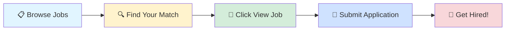

# 🚀 Tech Jobs Board

### Your Gateway to Amazing Career Opportunities

---

## 🎯 Browse by Job Profile

<table>
<tr>
<td align="center" width="25%">

 
<b>1000</b> total positions
</td>
<td align="center" width="25%">

 
<b>1000</b> total positions
</td>
<td align="center" width="25%">

 
<b>1000</b> total positions
</td>
<td align="center" width="25%">

 
<b>1000</b> total positions
</td>
</tr>
</table>

---

## 📊 Data Scientist

> 💼 **1000** positions available

<table>
<thead>
<tr>
<th width="20%">🏢 Company</th>
<th width="35%">💼 Role</th>
<th width="20%">📍 Location</th>
<th width="10%">⏰ Posted</th>
<th width="15%">🔗 Action</th>
</tr>
</thead>
<tbody>
<tr>
<td><a href="https://www.ambitionbox.com/overview/tcs-overview">Tata Consultancy Services</a></td>
<td>AWS Network Architect</td>
<td>📍 Hyderabad, Bangalore</td>
<td>1d ago</td>
<td align="center"></td>
</tr>
<tr>
<td><a href="https://www.ambitionbox.com/overview/tcs-overview">Tata Consultancy Services</a></td>
<td>AI/ML Researcher</td>
<td>📍 Bangalore</td>
<td>1d ago</td>
<td align="center"></td>
</tr>
<tr>
<td><a href="https://www.ambitionbox.com/overview/tcs-overview">Tata Consultancy Services</a></td>
<td>AI / ML Engineer - Tech Leads</td>
<td>📍 Bangalore</td>
<td>1d ago</td>
<td align="center"></td>
</tr>
<tr>
<td><a href="https://www.ambitionbox.com/overview/manektech-overview">Manektech</a></td>
<td>AI ML - Intern</td>
<td>📍 Ahmedabad</td>
<td>1d ago</td>
<td align="center"></td>
</tr>
<tr>
<td><a href="https://www.ambitionbox.com/overview/cybage-overview">Cybage</a></td>
<td>Senior Technical Support Engineer || SQL Expert || 24x7</td>
<td>📍 Pune</td>
<td>1d ago</td>
<td align="center"></td>
</tr>
<tr>
<td><a href="https://www.ambitionbox.com/overview/societe-generale-overview">Societe Generale Global Solution Centre </a></td>
<td>Specialist Software Engineer - Python API, Kubernetes</td>
<td>📍 Chennai, Bangalore</td>
<td>1d ago</td>
<td align="center"></td>
</tr>
<tr>
<td>Ventures Hrd Centre</td>
<td>Senior Data Scientist</td>
<td>📍 Mumbai</td>
<td>1d ago</td>
<td align="center"></td>
</tr>
<tr>
<td><a href="https://www.ambitionbox.com/overview/iquanti-overview">Iquanti</a></td>
<td>Engagement Manager - Analytics</td>
<td>📍 Bangalore</td>
<td>1d ago</td>
<td align="center"></td>
</tr>
<tr>
<td><a href="https://www.ambitionbox.com/overview/v2soft-overview">V2soft</a></td>
<td>DataEngineer with Big Query or GCP</td>
<td>📍 Sholinganallur</td>
<td>1d ago</td>
<td align="center"></td>
</tr>
<tr>
<td>Hirexa Solutions</td>
<td>Python Software Developer</td>
<td>📍 Mumbai</td>
<td>1d ago</td>
<td align="center"></td>
</tr>
<tr>
<td><a href="https://www.ambitionbox.com/overview/v2soft-overview">V2soft</a></td>
<td>Java Full Stack Developer with(React, Python,GCP,Docker)</td>
<td>📍 Sholinganallur</td>
<td>1d ago</td>
<td align="center"></td>
</tr>
<tr>
<td>Meritus Management Service</td>
<td>Data Engineer - AWS</td>
<td>📍 Hyderabad</td>
<td>1d ago</td>
<td align="center"></td>
</tr>
<tr>
<td><a href="https://www.ambitionbox.com/overview/tcs-overview">Tata Consultancy Services</a></td>
<td>Tcs Hiring Automation Tester</td>
<td>📍 Hyderabad, Chennai, Bangalore</td>
<td>1d ago</td>
<td align="center"></td>
</tr>
<tr>
<td><a href="https://www.ambitionbox.com/overview/tcs-overview">Tata Consultancy Services</a></td>
<td>Data science Professional</td>
<td>📍 Hyderabad</td>
<td>1d ago</td>
<td align="center"></td>
</tr>
<tr>
<td><a href="https://www.ambitionbox.com/overview/tcs-overview">Tata Consultancy Services</a></td>
<td>Automation Testing Engineer</td>
<td>📍 Chennai</td>
<td>1d ago</td>
<td align="center"></td>
</tr>
<tr>
<td><a href="https://www.ambitionbox.com/overview/tcs-overview">Tata Consultancy Services</a></td>
<td>AWS/Azure Data Engineer with Databricks</td>
<td>📍 Pune</td>
<td>1d ago</td>
<td align="center"></td>
</tr>
<tr>
<td><a href="https://www.ambitionbox.com/overview/tcs-overview">Tata Consultancy Services</a></td>
<td>GCP Tech Lead</td>
<td>📍 Chennai</td>
<td>1d ago</td>
<td align="center"></td>
</tr>
<tr>
<td><a href="https://www.ambitionbox.com/overview/tcs-overview">Tata Consultancy Services</a></td>
<td>Azure Admin + DevOps</td>
<td>📍 Hyderabad</td>
<td>1d ago</td>
<td align="center"></td>
</tr>
<tr>
<td><a href="https://www.ambitionbox.com/overview/aziro-overview">Aziro</a></td>
<td>Python developer</td>
<td>📍 Bangalore, pune</td>
<td>1d ago</td>
<td align="center"></td>
</tr>
<tr>
<td><a href="https://www.ambitionbox.com/overview/tcs-overview">Tata Consultancy Services</a></td>
<td>AWS Devops + Terraform & Kubernetes Engineer</td>
<td>📍 Bangalore</td>
<td>1d ago</td>
<td align="center"></td>
</tr>
<tr>
<td><a href="https://www.ambitionbox.com/overview/tcs-overview">Tata Consultancy Services</a></td>
<td>Azure Databricks Engineer</td>
<td>📍 Chennai</td>
<td>1d ago</td>
<td align="center"></td>
</tr>
<tr>
<td><a href="https://www.ambitionbox.com/overview/tcs-overview">Tata Consultancy Services</a></td>
<td>AWS Platform Engineer</td>
<td>📍 Bangalore</td>
<td>1d ago</td>
<td align="center"></td>
</tr>
<tr>
<td><a href="https://www.ambitionbox.com/overview/tcs-overview">Tata Consultancy Services</a></td>
<td>ML Engineer (Deep Learning/Generative AI)</td>
<td>📍 Bangalore</td>
<td>1d ago</td>
<td align="center"></td>
</tr>
<tr>
<td><a href="https://www.ambitionbox.com/overview/tcs-overview">Tata Consultancy Services</a></td>
<td>GCP Data Engg/Architect</td>
<td>📍 Hyderabad</td>
<td>1d ago</td>
<td align="center"></td>
</tr>
<tr>
<td><a href="https://www.ambitionbox.com/overview/tcs-overview">Tata Consultancy Services</a></td>
<td>Azure DevOps Paas CICD Professional</td>
<td>📍 Kochi</td>
<td>1d ago</td>
<td align="center"></td>
</tr>
<tr>
<td><a href="https://www.ambitionbox.com/overview/tcs-overview">Tata Consultancy Services</a></td>
<td>Machine Learning / ETL Engineer (Level II)</td>
<td>📍 Chennai</td>
<td>1d ago</td>
<td align="center"></td>
</tr>
<tr>
<td><a href="https://www.ambitionbox.com/overview/tcs-overview">Tata Consultancy Services</a></td>
<td>Ml Engineer</td>
<td>📍 Chennai, Hyderabad, Bangalore</td>
<td>1d ago</td>
<td align="center"></td>
</tr>
<tr>
<td>Creative Hands HR</td>
<td>Data Analytic | Fresher | Business Analytics</td>
<td>📍 Chennai, Hyderabad, Bangalore</td>
<td>1d ago</td>
<td align="center"></td>
</tr>
<tr>
<td><a href="https://www.ambitionbox.com/overview/tcs-overview">Tata Consultancy Services</a></td>
<td>GCP DevOps, Terraform and Python Professional</td>
<td>📍 Hyderabad</td>
<td>1d ago</td>
<td align="center"></td>
</tr>
<tr>
<td><a href="https://www.ambitionbox.com/overview/bonanza-portfolio-overview">Bigul By Bonanza Portfolio</a></td>
<td>Process Audit & Automation-Intern</td>
<td>📍 Navi Mumbai</td>
<td>1d ago</td>
<td align="center"></td>
</tr>
<tr>
<td>Ventures Hrd Centre</td>
<td>Lead  Data Scientist</td>
<td>📍 Mumbai</td>
<td>1d ago</td>
<td align="center"></td>
</tr>
<tr>
<td><a href="https://www.ambitionbox.com/overview/tcs-overview">Tata Consultancy Services</a></td>
<td>Dot net with Azure Professional</td>
<td>📍 Hyderabad</td>
<td>1d ago</td>
<td align="center"></td>
</tr>
<tr>
<td><a href="https://www.ambitionbox.com/overview/calsoft-overview">Calsoft</a></td>
<td>Python / Ruby Automation</td>
<td>📍 Pune, Bangalore</td>
<td>1d ago</td>
<td align="center"></td>
</tr>
<tr>
<td>People Prime Worldwide</td>
<td>Salesforce BI/Analytics Architect</td>
<td>📍 Hyderabad</td>
<td>1d ago</td>
<td align="center"></td>
</tr>
<tr>
<td>Tele Tnfotech</td>
<td>Machine Learning Intern</td>
<td>📍 Pune</td>
<td>1d ago</td>
<td align="center"></td>
</tr>
<tr>
<td><a href="https://www.ambitionbox.com/overview/werq-labs-overview">Werq Labs</a></td>
<td>Python AI Intern</td>
<td>📍 Mumbai</td>
<td>1d ago</td>
<td align="center"></td>
</tr>
<tr>
<td><a href="https://www.ambitionbox.com/overview/tcs-overview">Tata Consultancy Services</a></td>
<td>Data Scientist (PhD in Statistics / AI)</td>
<td>📍 Bangalore</td>
<td>1d ago</td>
<td align="center"></td>
</tr>
<tr>
<td><a href="https://www.ambitionbox.com/overview/tcs-overview">Tata Consultancy Services</a></td>
<td>Azure Dot Net /Dot Net fullstack Professional</td>
<td>📍 Hyderabad</td>
<td>1d ago</td>
<td align="center"></td>
</tr>
<tr>
<td><a href="https://www.ambitionbox.com/overview/tcs-overview">Tata Consultancy Services</a></td>
<td>Data Science with Python Professional</td>
<td>📍 Bangalore</td>
<td>1d ago</td>
<td align="center"></td>
</tr>
<tr>
<td>Teamware Solutions</td>
<td>Automation Testing (SDET)</td>
<td>📍 Noida</td>
<td>1d ago</td>
<td align="center"></td>
</tr>
<tr>
<td><a href="https://www.ambitionbox.com/overview/capgemini-overview">Capgemini</a></td>
<td>Java Full Stack Developer with AWS</td>
<td>📍 Pune</td>
<td>1d ago</td>
<td align="center"></td>
</tr>
<tr>
<td><a href="https://www.ambitionbox.com/overview/tcs-overview">Tata Consultancy Services</a></td>
<td>Azure Virtual Desktop - AVD Professional</td>
<td>📍 Delhi</td>
<td>1d ago</td>
<td align="center"></td>
</tr>
<tr>
<td><a href="https://www.ambitionbox.com/overview/tcs-overview">Tata Consultancy Services</a></td>
<td>Azure Senior Data Engineer</td>
<td>📍 Pune</td>
<td>1d ago</td>
<td align="center"></td>
</tr>
<tr>
<td><a href="https://www.ambitionbox.com/overview/tcs-overview">Tata Consultancy Services</a></td>
<td>AWS Snowflake with Python Professional</td>
<td>📍 Pune</td>
<td>1d ago</td>
<td align="center"></td>
</tr>
<tr>
<td><a href="https://www.ambitionbox.com/overview/tcs-overview">Tata Consultancy Services</a></td>
<td>Azure - DevOps Professional</td>
<td>📍 Chennai</td>
<td>1d ago</td>
<td align="center"></td>
</tr>
<tr>
<td><a href="https://www.ambitionbox.com/overview/cyient-overview">Cyient</a></td>
<td>AWS Architect  : SME</td>
<td>📍 Hyderabad, Bangalore</td>
<td>1d ago</td>
<td align="center"></td>
</tr>
<tr>
<td><a href="https://www.ambitionbox.com/overview/cloudxtreme-overview">Cloudxtreme</a></td>
<td>Java 17+ + AWS chennai</td>
<td>📍 Chennai</td>
<td>1d ago</td>
<td align="center"></td>
</tr>
<tr>
<td><a href="https://www.ambitionbox.com/overview/cloudxtreme-overview">Cloudxtreme</a></td>
<td>Datamart Solution Analyst  SQL SSIS ADF Python</td>
<td>📍 Hyderabad</td>
<td>1d ago</td>
<td align="center"></td>
</tr>
<tr>
<td>Cloudxtreme</td>
<td>Java,Python, TypeScript, Angular, AWS (BELOW 15 DAYS Joiners ONLY )</td>
<td>📍 Bangalore, Delhi</td>
<td>1d ago</td>
<td align="center"></td>
</tr>
<tr>
<td><a href="https://www.ambitionbox.com/overview/cloudxtreme-overview">Cloudxtreme</a></td>
<td>Python Developer</td>
<td>📍 Hyderabad</td>
<td>1d ago</td>
<td align="center"></td>
</tr>
<tr>
<td><a href="https://www.ambitionbox.com/overview/cloudxtreme-overview">Cloudxtreme</a></td>
<td>Java Developer (Angular OR React + AWS) | Long Term Contract | Tier 1</td>
<td>📍 Hyderabad</td>
<td>1d ago</td>
<td align="center"></td>
</tr>
<tr>
<td>Cloudxtreme</td>
<td>AWS Cloud security</td>
<td>📍 Bangalore, Delhi</td>
<td>1d ago</td>
<td align="center"></td>
</tr>
<tr>
<td>Cloudxtreme</td>
<td>Node.js | AWS | MongoDB</td>
<td>📍 Mumbai, Bangalore</td>
<td>1d ago</td>
<td align="center"></td>
</tr>
<tr>
<td>Cloudxtreme</td>
<td>Ansible or Python+EKS/Terraform</td>
<td>📍 Chennai, Bangalore</td>
<td>1d ago</td>
<td align="center"></td>
</tr>
<tr>
<td>Cloudxtreme</td>
<td>Ml Engineer</td>
<td>📍 Mumbai, Bangalore, Delhi</td>
<td>1d ago</td>
<td align="center"></td>
</tr>
<tr>
<td>Cloudxtreme</td>
<td>Azure Cloud Security Lead</td>
<td>📍 Bangalore</td>
<td>1d ago</td>
<td align="center"></td>
</tr>
<tr>
<td>Cloudxtreme</td>
<td>Manual + Automation QA</td>
<td>📍 Hyderabad</td>
<td>1d ago</td>
<td align="center"></td>
</tr>
<tr>
<td>Cloudxtreme</td>
<td>Python Developer</td>
<td>📍 Hyderabad</td>
<td>1d ago</td>
<td align="center"></td>
</tr>
<tr>
<td>Cloudxtreme</td>
<td>Python Developer long term contract with top mnc</td>
<td>📍 Hyderabad</td>
<td>1d ago</td>
<td align="center"></td>
</tr>
<tr>
<td><a href="https://www.ambitionbox.com/overview/cloudxtreme-overview">Cloudxtreme</a></td>
<td>Java Aws Developer Mphasis</td>
<td>📍 Mumbai</td>
<td>1d ago</td>
<td align="center"></td>
</tr>
<tr>
<td><a href="https://www.ambitionbox.com/overview/cloudxtreme-overview">Cloudxtreme</a></td>
<td>Java Aws Developer Mphasis</td>
<td>📍 Bangalore</td>
<td>1d ago</td>
<td align="center"></td>
</tr>
<tr>
<td><a href="https://www.ambitionbox.com/overview/cloudxtreme-overview">Mphasis</a></td>
<td>Java Aws Developer Mpha</td>
<td>📍 Mumbai, Hyderabad</td>
<td>1d ago</td>
<td align="center"></td>
</tr>
<tr>
<td>Cloudxtreme</td>
<td>Java Developer AWS & Microservices</td>
<td>📍 Bangalore</td>
<td>1d ago</td>
<td align="center"></td>
</tr>
<tr>
<td><a href="https://www.ambitionbox.com/overview/cloudxtreme-overview">Cloudxtreme</a></td>
<td>Face-to-Face .NET + Angular / Azure | Chennai & Pune | 28th &</td>
<td>📍 Pune, Chennai</td>
<td>1d ago</td>
<td align="center"></td>
</tr>
<tr>
<td><a href="https://www.ambitionbox.com/overview/cloudxtreme-overview">Cloudxtreme</a></td>
<td>GCP ADMIN C2H</td>
<td>📍 Hyderabad, Coimbatore</td>
<td>1d ago</td>
<td align="center"></td>
</tr>
<tr>
<td><a href="https://www.ambitionbox.com/overview/cloudxtreme-overview">Cloudxtreme</a></td>
<td>Java Developer react/angular aws</td>
<td>📍 Hyderabad</td>
<td>1d ago</td>
<td align="center"></td>
</tr>
<tr>
<td>Cloudxtreme</td>
<td>Dot Net Full Stack Developer Azure & Gen AI</td>
<td>📍 Hyderabad</td>
<td>1d ago</td>
<td align="center"></td>
</tr>
<tr>
<td><a href="https://www.ambitionbox.com/overview/cloudxtreme-overview">Cloudxtreme</a></td>
<td>Dot Net Full Stack Developer Azure & Gen AI</td>
<td>📍 Hyderabad</td>
<td>1d ago</td>
<td align="center"></td>
</tr>
<tr>
<td>Careernet</td>
<td>Automation Test Engineer</td>
<td>📍 Chennai</td>
<td>1d ago</td>
<td align="center"></td>
</tr>
<tr>
<td><a href="https://www.ambitionbox.com/overview/kiya-dot-ai-overview">Kiya.ai</a></td>
<td>ServiceNow  Platform Analytics & Reporting Professional</td>
<td>📍 Chennai, Hyderabad, Bangalore</td>
<td>1d ago</td>
<td align="center"></td>
</tr>
<tr>
<td>Platinus Technologies</td>
<td>Data Scientist</td>
<td>📍 Delhi, Hyderabad</td>
<td>1d ago</td>
<td align="center"></td>
</tr>
<tr>
<td>Careernet</td>
<td>Fullstack Machine Learning Engineer</td>
<td>📍 Bangalore</td>
<td>1d ago</td>
<td align="center"></td>
</tr>
<tr>
<td><a href="https://www.ambitionbox.com/overview/tcs-overview">Tata Consultancy Services</a></td>
<td>Azure Data Analyst/Data Engineer</td>
<td>📍 Indore</td>
<td>1d ago</td>
<td align="center"></td>
</tr>
<tr>
<td><a href="https://www.ambitionbox.com/overview/tcs-overview">Tata Consultancy Services</a></td>
<td>Azure DevOps + Terraform Professional</td>
<td>📍 Hyderabad</td>
<td>1d ago</td>
<td align="center"></td>
</tr>
<tr>
<td><a href="https://www.ambitionbox.com/overview/tcs-overview">Tata Consultancy Services</a></td>
<td>AWS Java Spring boot Developer</td>
<td>📍 Bangalore</td>
<td>1d ago</td>
<td align="center"></td>
</tr>
<tr>
<td><a href="https://www.ambitionbox.com/overview/tcs-overview">Tata Consultancy Services</a></td>
<td>AWS Java spring boot Developer</td>
<td>📍 Kolkata</td>
<td>1d ago</td>
<td align="center"></td>
</tr>
<tr>
<td><a href="https://www.ambitionbox.com/overview/tcs-overview">Tata Consultancy Services</a></td>
<td>AWS Developer</td>
<td>📍 Pune</td>
<td>1d ago</td>
<td align="center"></td>
</tr>
<tr>
<td><a href="https://www.ambitionbox.com/overview/tcs-overview">Tata Consultancy Services</a></td>
<td>AWS + Pyspark Professional</td>
<td>📍 Pune</td>
<td>1d ago</td>
<td align="center"></td>
</tr>
<tr>
<td><a href="https://www.ambitionbox.com/overview/tcs-overview">Tata Consultancy Services</a></td>
<td>AI/ML Professional</td>
<td>📍 Hyderabad</td>
<td>1d ago</td>
<td align="center"></td>
</tr>
<tr>
<td>Crescendo Global Leadership Hiring India</td>
<td>Data Science Consultant</td>
<td>📍 Bangalore</td>
<td>1d ago</td>
<td align="center"></td>
</tr>
<tr>
<td><a href="https://www.ambitionbox.com/overview/cloudxtreme-overview">Cloudxtreme</a></td>
<td>Python Web Developer</td>
<td>📍 Hyderabad, Chennai, Bangalore</td>
<td>1d ago</td>
<td align="center"></td>
</tr>
<tr>
<td>Crescendo Global Leadership Hiring India</td>
<td>Urgent Hiring For Adobe Analytics-PAN INDIA</td>
<td></td>
<td>1d ago</td>
<td align="center"></td>
</tr>
<tr>
<td>KP Hr And Infra Services</td>
<td>Data Analyst (SQL, Power BI)</td>
<td>📍 Pune</td>
<td>1d ago</td>
<td align="center"></td>
</tr>
<tr>
<td>People Prime Worldwide</td>
<td>Plc Automation Engineer || Hybrid || TOP MNC ||</td>
<td>📍 Bangalore</td>
<td>1d ago</td>
<td align="center"></td>
</tr>
<tr>
<td>Crescendo Global Leadership Hiring India</td>
<td>Urgent Hiring For the role of Python Developer</td>
<td>📍 Gurugram, Noida, Delhi</td>
<td>1d ago</td>
<td align="center"></td>
</tr>
<tr>
<td><a href="https://www.linkedin.com/company/wake-up-whistle">Wake Up Whistle</a></td>
<td>Data Analyst Intern – Analytics Reporting & Python Dashboard Cohort</td>
<td>📍 India</td>
<td>1d ago</td>
<td align="center"></td>
</tr>
<tr>
<td><a href="https://www.linkedin.com/company/wake-up-whistle">Wake Up Whistle</a></td>
<td>Machine Learning Intern – Model Engineering & Automation Track</td>
<td>📍 India</td>
<td>1d ago</td>
<td align="center"></td>
</tr>
<tr>
<td><a href="https://www.linkedin.com/company/wake-up-whistle">Wake Up Whistle</a></td>
<td>Data Analyst Intern – Analytics Reporting & Python Dashboard Cohort</td>
<td>📍 India</td>
<td>1d ago</td>
<td align="center"></td>
</tr>
<tr>
<td><a href="https://www.linkedin.com/company/wake-up-whistle">Wake Up Whistle</a></td>
<td>Data Analyst Intern – Data Cleaning, BI & SQL Automation Track</td>
<td>📍 India</td>
<td>1d ago</td>
<td align="center"></td>
</tr>
<tr>
<td><a href="https://www.linkedin.com/company/wake-up-whistle">Wake Up Whistle</a></td>
<td>Data Analyst Intern – Python/SQL Insights Acceleration Program</td>
<td>📍 India</td>
<td>1d ago</td>
<td align="center"></td>
</tr>
<tr>
<td><a href="https://www.ambitionbox.com/overview/cloudxtreme-overview">Cloudxtreme</a></td>
<td>Python Software Developer</td>
<td>📍 Bangalore</td>
<td>1d ago</td>
<td align="center"></td>
</tr>
<tr>
<td><a href="https://www.linkedin.com/company/wake-up-whistle">Wake Up Whistle</a></td>
<td>Business Analyst Intern – Process Mapping, SQL & Requirement Design Lab</td>
<td>📍 India</td>
<td>1d ago</td>
<td align="center"></td>
</tr>
<tr>
<td><a href="https://www.ambitionbox.com/overview/cloudxtreme-overview">Cloudxtreme</a></td>
<td>Python Software Developer</td>
<td>📍 Bangalore</td>
<td>1d ago</td>
<td align="center"></td>
</tr>
<tr>
<td><a href="https://www.ambitionbox.com/overview/cloudxtreme-overview">Cloudxtreme</a></td>
<td>Python Software Developer</td>
<td>📍 Chennai, Bangalore</td>
<td>1d ago</td>
<td align="center"></td>
</tr>
<tr>
<td><a href="https://www.linkedin.com/company/wake-up-whistle">Wake Up Whistle</a></td>
<td>Data Science Intern – Data Pipelines, Feature Engineering & AI Lab</td>
<td>📍 India</td>
<td>1d ago</td>
<td align="center"></td>
</tr>
<tr>
<td><a href="https://de.linkedin.com/company/simplesurance">simplesurance</a></td>
<td>Working Student Web Analytics (all genders) - Berlin, Germany</td>
<td>📍 Berlin, Berlin, Germany</td>
<td>1d ago</td>
<td align="center"></td>
</tr>
<tr>
<td><a href="https://www.linkedin.com/company/moloco">Moloco</a></td>
<td>Machine Learning Engineer Intern</td>
<td>📍 London, England, United Kingdom</td>
<td>1d ago</td>
<td align="center"></td>
</tr>
<tr>
<td><a href="https://www.linkedin.com/company/abbott-">Abbott</a></td>
<td>Data Science & Automation Intern</td>
<td>📍 Diegem, Flemish Region, Belgium</td>
<td>1d ago</td>
<td align="center"></td>
</tr>
<tr>
<td><a href="https://www.linkedin.com/company/wake-up-whistle">Wake Up Whistle</a></td>
<td>Financial Analyst Intern | Financial Modeling | Budgeting & Forecasting</td>
<td>📍 India</td>
<td>1d ago</td>
<td align="center"></td>
</tr>
<tr>
<td><a href="https://www.linkedin.com/company/wake-up-whistle">Wake Up Whistle</a></td>
<td>Entry-Level Data Analyst Intern | Data Analysis | Business Intelligence Tools</td>
<td>📍 India</td>
<td>1d ago</td>
<td align="center"></td>
</tr>
<tr><td colspan="5" align="center"><i>... and 900 more positions</i></td></tr>
</tbody>
</table>

---

## 💼 Business Analyst

> 💼 **1000** positions available

<table>
<thead>
<tr>
<th width="20%">🏢 Company</th>
<th width="35%">💼 Role</th>
<th width="20%">📍 Location</th>
<th width="10%">⏰ Posted</th>
<th width="15%">🔗 Action</th>
</tr>
</thead>
<tbody>
<tr>
<td><a href="https://www.ambitionbox.com/overview/capgemini-overview">Capgemini</a></td>
<td>Business Analyst/ Data Analyst- Liquidity Risk</td>
<td>📍 Bangalore</td>
<td>1d ago</td>
<td align="center"></td>
</tr>
<tr>
<td>Job Trails HR Consulting</td>
<td>Business Analyst</td>
<td>📍 Pune</td>
<td>1d ago</td>
<td align="center"></td>
</tr>
<tr>
<td>Ventures Hrd Centre</td>
<td>Senior Business Analyst</td>
<td>📍 Mumbai</td>
<td>1d ago</td>
<td align="center"></td>
</tr>
<tr>
<td><a href="https://www.ambitionbox.com/overview/milestone-technologies-overview">Milestone Technologies</a></td>
<td>Senior Salesforce Engineer</td>
<td>📍 Bangalore</td>
<td>1d ago</td>
<td align="center"></td>
</tr>
<tr>
<td><a href="https://www.ambitionbox.com/overview/cybage-overview">Cybage</a></td>
<td>Senior Technical Support Engineer || SQL Expert || 24x7</td>
<td>📍 Pune</td>
<td>1d ago</td>
<td align="center"></td>
</tr>
<tr>
<td><a href="https://www.ambitionbox.com/overview/societe-generale-overview">Societe Generale Global Solution Centre </a></td>
<td>Specialist Software Engineer - Python API, Kubernetes</td>
<td>📍 Chennai, Bangalore</td>
<td>1d ago</td>
<td align="center"></td>
</tr>
<tr>
<td><a href="https://www.ambitionbox.com/overview/iquanti-overview">Iquanti</a></td>
<td>Engagement Manager - Analytics</td>
<td>📍 Bangalore</td>
<td>1d ago</td>
<td align="center"></td>
</tr>
<tr>
<td>Hirexa Solutions</td>
<td>Python Software Developer</td>
<td>📍 Mumbai</td>
<td>1d ago</td>
<td align="center"></td>
</tr>
<tr>
<td><a href="https://www.ambitionbox.com/overview/v2soft-overview">V2soft</a></td>
<td>Java Full Stack Developer with(React, Python,GCP,Docker)</td>
<td>📍 Sholinganallur</td>
<td>1d ago</td>
<td align="center"></td>
</tr>
<tr>
<td><a href="https://www.ambitionbox.com/overview/tcs-overview">Tata Consultancy Services</a></td>
<td>Tcs Hiring Automation Tester</td>
<td>📍 Hyderabad, Chennai, Bangalore</td>
<td>1d ago</td>
<td align="center"></td>
</tr>
<tr>
<td><a href="https://www.ambitionbox.com/overview/tcs-overview">Tata Consultancy Services</a></td>
<td>T24 Business Analyst</td>
<td>📍 Bangalore</td>
<td>1d ago</td>
<td align="center"></td>
</tr>
<tr>
<td><a href="https://www.ambitionbox.com/overview/tcs-overview">Tata Consultancy Services</a></td>
<td>Automation Testing Engineer</td>
<td>📍 Chennai</td>
<td>1d ago</td>
<td align="center"></td>
</tr>
<tr>
<td>Raad7 Informatics</td>
<td>Business Analyst</td>
<td>📍 Chennai</td>
<td>1d ago</td>
<td align="center"></td>
</tr>
<tr>
<td><a href="https://www.ambitionbox.com/overview/aziro-overview">Aziro</a></td>
<td>Python developer</td>
<td>📍 Bangalore, pune</td>
<td>1d ago</td>
<td align="center"></td>
</tr>
<tr>
<td>Crescendo Global Leadership Hiring India</td>
<td>Power Bi Developer-4+Yrs-PAN INDIA</td>
<td>📍 Delhi, Pune, Bangalore</td>
<td>1d ago</td>
<td align="center"></td>
</tr>
<tr>
<td><a href="https://www.ambitionbox.com/overview/velocity-technology-solutions-overview">Velocity Software Solutions</a></td>
<td>Business Analyst cum Software Testing Intern</td>
<td>📍 Noida</td>
<td>1d ago</td>
<td align="center"></td>
</tr>
<tr>
<td>Megan Soft</td>
<td>Salesforce MuleSoft Developer</td>
<td>📍 Chennai</td>
<td>1d ago</td>
<td align="center"></td>
</tr>
<tr>
<td><a href="https://www.ambitionbox.com/overview/reizend-it-consultants-overview">Reizend It Consultants</a></td>
<td>Business Analyst (0-1 YRS)</td>
<td>📍 Thiruvananthapuram</td>
<td>1d ago</td>
<td align="center"></td>
</tr>
<tr>
<td>Creative Hands HR</td>
<td>Data Analytic | Fresher | Business Analytics</td>
<td>📍 Chennai, Hyderabad, Bangalore</td>
<td>1d ago</td>
<td align="center"></td>
</tr>
<tr>
<td><a href="https://www.ambitionbox.com/overview/tcs-overview">Tata Consultancy Services</a></td>
<td>GCP DevOps, Terraform and Python Professional</td>
<td>📍 Hyderabad</td>
<td>1d ago</td>
<td align="center"></td>
</tr>
<tr>
<td><a href="https://www.ambitionbox.com/overview/bonanza-portfolio-overview">Bigul By Bonanza Portfolio</a></td>
<td>Process Audit & Automation-Intern</td>
<td>📍 Navi Mumbai</td>
<td>1d ago</td>
<td align="center"></td>
</tr>
<tr>
<td><a href="https://www.ambitionbox.com/overview/wits-innovation-lab-overview">Wits Innovation Lab</a></td>
<td>Sr. Salesforce Developer</td>
<td>📍 Mumbai, Bangalore</td>
<td>1d ago</td>
<td align="center"></td>
</tr>
<tr>
<td>Onusms Smart Technologies</td>
<td>Scrum Master/Project Manager</td>
<td>📍 Vadodara(Vadsar)</td>
<td>1d ago</td>
<td align="center"></td>
</tr>
<tr>
<td><a href="https://www.ambitionbox.com/overview/calsoft-overview">Calsoft</a></td>
<td>Python / Ruby Automation</td>
<td>📍 Pune, Bangalore</td>
<td>1d ago</td>
<td align="center"></td>
</tr>
<tr>
<td>Codehive Labs Hyderabad</td>
<td>Power Bi Developer</td>
<td>📍 Hyderabad</td>
<td>1d ago</td>
<td align="center"></td>
</tr>
<tr>
<td>People Prime Worldwide</td>
<td>Salesforce BI/Analytics Architect</td>
<td>📍 Hyderabad</td>
<td>1d ago</td>
<td align="center"></td>
</tr>
<tr>
<td><a href="https://www.ambitionbox.com/overview/werq-labs-overview">Werq Labs</a></td>
<td>Python AI Intern</td>
<td>📍 Mumbai</td>
<td>1d ago</td>
<td align="center"></td>
</tr>
<tr>
<td><a href="https://www.ambitionbox.com/overview/tcs-overview">Tata Consultancy Services</a></td>
<td>Data Science with Python Professional</td>
<td>📍 Bangalore</td>
<td>1d ago</td>
<td align="center"></td>
</tr>
<tr>
<td><a href="https://www.ambitionbox.com/overview/tcs-overview">Tata Consultancy Services</a></td>
<td>Business Analyst with Japanese</td>
<td>📍 Chennai</td>
<td>1d ago</td>
<td align="center"></td>
</tr>
<tr>
<td>Teamware Solutions</td>
<td>Automation Testing (SDET)</td>
<td>📍 Noida</td>
<td>1d ago</td>
<td align="center"></td>
</tr>
<tr>
<td><a href="https://www.ambitionbox.com/overview/tcs-overview">Tata Consultancy Services</a></td>
<td>AWS Snowflake with Python Professional</td>
<td>📍 Pune</td>
<td>1d ago</td>
<td align="center"></td>
</tr>
<tr>
<td><a href="https://www.ambitionbox.com/overview/cloudxtreme-overview">Cloudxtreme</a></td>
<td>Datamart Solution Analyst  SQL SSIS ADF Python</td>
<td>📍 Hyderabad</td>
<td>1d ago</td>
<td align="center"></td>
</tr>
<tr>
<td><a href="https://www.ambitionbox.com/overview/cloudxtreme-overview">Cloudxtreme</a></td>
<td>SAP GTS Business Analyst</td>
<td>📍 Delhi, Bangalore</td>
<td>1d ago</td>
<td align="center"></td>
</tr>
<tr>
<td><a href="https://www.ambitionbox.com/overview/cloudxtreme-overview">Cloudxtreme</a></td>
<td>Business Analyst IAM IDP & API Authentication</td>
<td>📍 Pune, Hyderabad, Bangalore</td>
<td>1d ago</td>
<td align="center"></td>
</tr>
<tr>
<td><a href="https://www.ambitionbox.com/overview/cloudxtreme-overview">Cloudxtreme</a></td>
<td>Business Analyst IAM Asset/Account Governance & CMDB</td>
<td>📍 Mumbai, Bangalore</td>
<td>1d ago</td>
<td align="center"></td>
</tr>
<tr>
<td>Cloudxtreme</td>
<td>Java,Python, TypeScript, Angular, AWS (BELOW 15 DAYS Joiners ONLY )</td>
<td>📍 Bangalore, Delhi</td>
<td>1d ago</td>
<td align="center"></td>
</tr>
<tr>
<td><a href="https://www.ambitionbox.com/overview/cloudxtreme-overview">Cloudxtreme</a></td>
<td>Python Developer</td>
<td>📍 Hyderabad</td>
<td>1d ago</td>
<td align="center"></td>
</tr>
<tr>
<td>Cloudxtreme</td>
<td>Ansible or Python+EKS/Terraform</td>
<td>📍 Chennai, Bangalore</td>
<td>1d ago</td>
<td align="center"></td>
</tr>
<tr>
<td>Cloudxtreme</td>
<td>Manual + Automation QA</td>
<td>📍 Hyderabad</td>
<td>1d ago</td>
<td align="center"></td>
</tr>
<tr>
<td>Cloudxtreme</td>
<td>Python Developer</td>
<td>📍 Hyderabad</td>
<td>1d ago</td>
<td align="center"></td>
</tr>
<tr>
<td>Cloudxtreme</td>
<td>Python Developer long term contract with top mnc</td>
<td>📍 Hyderabad</td>
<td>1d ago</td>
<td align="center"></td>
</tr>
<tr>
<td><a href="https://www.ambitionbox.com/overview/cloudxtreme-overview">Mphasis</a></td>
<td>Business Analyst  Cards Domain (Technical BA)</td>
<td>📍 Chennai, Hyderabad, Bangalore</td>
<td>1d ago</td>
<td align="center"></td>
</tr>
<tr>
<td><a href="https://www.ambitionbox.com/overview/cloudxtreme-overview">Cloudxtreme</a></td>
<td>Agile Project Manager at Mphasis, Pune</td>
<td>📍 Pune</td>
<td>1d ago</td>
<td align="center"></td>
</tr>
<tr>
<td>Careernet</td>
<td>Automation Test Engineer</td>
<td>📍 Chennai</td>
<td>1d ago</td>
<td align="center"></td>
</tr>
<tr>
<td><a href="https://www.ambitionbox.com/overview/kiya-dot-ai-overview">Kiya.ai</a></td>
<td>ServiceNow  Platform Analytics & Reporting Professional</td>
<td>📍 Chennai, Hyderabad, Bangalore</td>
<td>1d ago</td>
<td align="center"></td>
</tr>
<tr>
<td><a href="https://www.ambitionbox.com/overview/genpact-overview">Genpact</a></td>
<td>Business Analyst</td>
<td>📍 Navi Mumbai</td>
<td>1d ago</td>
<td align="center"></td>
</tr>
<tr>
<td>Praviksha Tek Solutions</td>
<td>Senior Scrum Master</td>
<td>📍 Hyderabad</td>
<td>1d ago</td>
<td align="center"></td>
</tr>
<tr>
<td><a href="https://www.ambitionbox.com/overview/wits-innovation-lab-overview">Wits Innovation Lab</a></td>
<td>Salesforce Developer</td>
<td>📍 Mumbai, Delhi, Bangalore</td>
<td>1d ago</td>
<td align="center"></td>
</tr>
<tr>
<td><a href="https://www.ambitionbox.com/overview/wits-innovation-lab-overview">Wits Innovation Lab</a></td>
<td>Sr. Salesforce Developer</td>
<td>📍 Mumbai</td>
<td>1d ago</td>
<td align="center"></td>
</tr>
<tr>
<td><a href="https://www.ambitionbox.com/overview/cloudxtreme-overview">Cloudxtreme</a></td>
<td>Python Web Developer</td>
<td>📍 Hyderabad, Chennai, Bangalore</td>
<td>1d ago</td>
<td align="center"></td>
</tr>
<tr>
<td>Crescendo Global Leadership Hiring India</td>
<td>Urgent Hiring For Adobe Analytics-PAN INDIA</td>
<td></td>
<td>1d ago</td>
<td align="center"></td>
</tr>
<tr>
<td>KP Hr And Infra Services</td>
<td>Data Analyst (SQL, Power BI)</td>
<td>📍 Pune</td>
<td>1d ago</td>
<td align="center"></td>
</tr>
<tr>
<td>People Prime Worldwide</td>
<td>Plc Automation Engineer || Hybrid || TOP MNC ||</td>
<td>📍 Bangalore</td>
<td>1d ago</td>
<td align="center"></td>
</tr>
<tr>
<td>Crescendo Global Leadership Hiring India</td>
<td>Urgent Hiring For the role of Python Developer</td>
<td>📍 Gurugram, Noida, Delhi</td>
<td>1d ago</td>
<td align="center"></td>
</tr>
<tr>
<td><a href="https://www.linkedin.com/company/wake-up-whistle">Wake Up Whistle</a></td>
<td>Business Analyst Intern – Documentation, Workflow Analysis & BI Systems Track</td>
<td>📍 India</td>
<td>1d ago</td>
<td align="center"></td>
</tr>
<tr>
<td><a href="https://www.linkedin.com/company/wake-up-whistle">Wake Up Whistle</a></td>
<td>Data Analyst Intern – Analytics Reporting & Python Dashboard Cohort</td>
<td>📍 India</td>
<td>1d ago</td>
<td align="center"></td>
</tr>
<tr>
<td><a href="https://www.linkedin.com/company/wake-up-whistle">Wake Up Whistle</a></td>
<td>Machine Learning Intern – Model Engineering & Automation Track</td>
<td>📍 India</td>
<td>1d ago</td>
<td align="center"></td>
</tr>
<tr>
<td><a href="https://www.linkedin.com/company/wake-up-whistle">Wake Up Whistle</a></td>
<td>Data Analyst Intern – Analytics Reporting & Python Dashboard Cohort</td>
<td>📍 India</td>
<td>1d ago</td>
<td align="center"></td>
</tr>
<tr>
<td><a href="https://www.linkedin.com/company/wake-up-whistle">Wake Up Whistle</a></td>
<td>Data Analyst Intern – Data Cleaning, BI & SQL Automation Track</td>
<td>📍 India</td>
<td>1d ago</td>
<td align="center"></td>
</tr>
<tr>
<td><a href="https://www.linkedin.com/company/wake-up-whistle">Wake Up Whistle</a></td>
<td>Data Analyst Intern – Python/SQL Insights Acceleration Program</td>
<td>📍 India</td>
<td>1d ago</td>
<td align="center"></td>
</tr>
<tr>
<td><a href="https://www.ambitionbox.com/overview/cloudxtreme-overview">Cloudxtreme</a></td>
<td>Python Software Developer</td>
<td>📍 Bangalore</td>
<td>1d ago</td>
<td align="center"></td>
</tr>
<tr>
<td><a href="https://www.linkedin.com/company/wake-up-whistle">Wake Up Whistle</a></td>
<td>Business Analyst Intern – Process Mapping, SQL & Requirement Design Lab</td>
<td>📍 India</td>
<td>1d ago</td>
<td align="center"></td>
</tr>
<tr>
<td><a href="https://www.linkedin.com/company/wake-up-whistle">Wake Up Whistle</a></td>
<td>Business Analyst Intern – Documentation, Workflow Analysis & BI Systems Track</td>
<td>📍 India</td>
<td>1d ago</td>
<td align="center"></td>
</tr>
<tr>
<td><a href="https://www.linkedin.com/company/wake-up-whistle">Wake Up Whistle</a></td>
<td>Business Analyst Intern – KPI, Insights & Cross-Functional Strategy Program</td>
<td>📍 India</td>
<td>1d ago</td>
<td align="center"></td>
</tr>
<tr>
<td><a href="https://www.ambitionbox.com/overview/cloudxtreme-overview">Cloudxtreme</a></td>
<td>Python Software Developer</td>
<td>📍 Bangalore</td>
<td>1d ago</td>
<td align="center"></td>
</tr>
<tr>
<td><a href="https://www.ambitionbox.com/overview/cloudxtreme-overview">Cloudxtreme</a></td>
<td>Python Software Developer</td>
<td>📍 Chennai, Bangalore</td>
<td>1d ago</td>
<td align="center"></td>
</tr>
<tr>
<td><a href="https://www.linkedin.com/company/openbi-consulting">OpenBI</a></td>
<td>Power BI Developer</td>
<td>📍 Gurugram</td>
<td>1d ago</td>
<td align="center"></td>
</tr>
<tr>
<td><a href="https://de.linkedin.com/company/simplesurance">simplesurance</a></td>
<td>Working Student Web Analytics (all genders) - Berlin, Germany</td>
<td>📍 Berlin, Berlin, Germany</td>
<td>1d ago</td>
<td align="center"></td>
</tr>
<tr>
<td><a href="https://nl.linkedin.com/company/hot-item">Hot ITem Conclusion</a></td>
<td>Business Consultant</td>
<td>📍 Amsterdam, North Holland, Netherlands</td>
<td>1d ago</td>
<td align="center"></td>
</tr>
<tr>
<td><a href="https://www.linkedin.com/company/abbott-">Abbott</a></td>
<td>Data Science & Automation Intern</td>
<td>📍 Diegem, Flemish Region, Belgium</td>
<td>1d ago</td>
<td align="center"></td>
</tr>
<tr>
<td><a href="https://www.linkedin.com/company/wake-up-whistle">Wake Up Whistle</a></td>
<td>Business Analyst Intern | Requirements Gathering | Process Improvement</td>
<td>📍 India</td>
<td>1d ago</td>
<td align="center"></td>
</tr>
<tr>
<td><a href="https://www.linkedin.com/company/wake-up-whistle">Wake Up Whistle</a></td>
<td>Junior Business Analyst Intern | Data-Driven Decision Support | Reporting & Documentation</td>
<td>📍 India</td>
<td>1d ago</td>
<td align="center"></td>
</tr>
<tr>
<td><a href="https://www.linkedin.com/company/wake-up-whistle">Wake Up Whistle</a></td>
<td>Entry-Level Data Analyst Intern | Data Analysis | Business Intelligence Tools</td>
<td>📍 India</td>
<td>1d ago</td>
<td align="center"></td>
</tr>
<tr>
<td><a href="https://www.linkedin.com/company/wake-up-whistle">Wake Up Whistle</a></td>
<td>Data Analyst Intern | Data Visualization & Insights | Excel & SQL</td>
<td>📍 India</td>
<td>1d ago</td>
<td align="center"></td>
</tr>
<tr>
<td><a href="https://www.linkedin.com/company/wake-up-whistle">Wake Up Whistle</a></td>
<td>Data Analyst Intern | Data Cleansing & Reporting | SQL, Python Skills</td>
<td>📍 India</td>
<td>1d ago</td>
<td align="center"></td>
</tr>
<tr>
<td><a href="https://www.linkedin.com/company/wake-up-whistle">Wake Up Whistle</a></td>
<td>Machine Learning Intern | Model Development | Python & AI Applications</td>
<td>📍 India</td>
<td>1d ago</td>
<td align="center"></td>
</tr>
<tr>
<td><a href="https://www.linkedin.com/company/wake-up-whistle">Wake Up Whistle</a></td>
<td>Data Science Intern | Predictive Analytics | Python & Machine Learning</td>
<td>📍 India</td>
<td>1d ago</td>
<td align="center"></td>
</tr>
<tr>
<td><a href="https://nl.linkedin.com/company/backbase">Backbase</a></td>
<td>Qa Automation Lead/Automation Architect</td>
<td>📍 Noida</td>
<td>1d ago</td>
<td align="center"></td>
</tr>
<tr>
<td><a href="https://uk.linkedin.com/company/british-council">British Council</a></td>
<td>Executive - Business Process Services, English & Exams</td>
<td>📍 Noida</td>
<td>1d ago</td>
<td align="center"></td>
</tr>
<tr>
<td><a href="https://in.linkedin.com/company/chattershots">Chattershots</a></td>
<td>Business Analyst</td>
<td>📍 Bangalore</td>
<td>1d ago</td>
<td align="center"></td>
</tr>
<tr>
<td><a href="https://www.linkedin.com/company/nvidia">NVIDIA</a></td>
<td>Automation Engineer Intern - Autumn 2025</td>
<td>📍 Munich, Bavaria, Germany</td>
<td>1d ago</td>
<td align="center"></td>
</tr>
<tr>
<td><a href="https://www.linkedin.com/company/citi">Citi</a></td>
<td>Lead Business Analytics Analyst</td>
<td>📍 Haryana, India</td>
<td>1d ago</td>
<td align="center"></td>
</tr>
<tr>
<td><a href="https://www.linkedin.com/company/nvidia">NVIDIA</a></td>
<td>Automation Engineer Intern - Autumn 2025</td>
<td>📍 Munich, Bavaria, Germany</td>
<td>1d ago</td>
<td align="center"></td>
</tr>
<tr>
<td><a href="https://uk.linkedin.com/company/targetjobsuk">targetjobs UK</a></td>
<td>Data & Analytics Industrial Placement - Finance</td>
<td>📍 Swindon, England, United Kingdom</td>
<td>1d ago</td>
<td align="center"></td>
</tr>
<tr>
<td><a href="https://www.linkedin.com/company/%E5%8E%A6%E9%97%A8%E4%BA%91%E4%B8%9C%E9%A3%9F%E5%93%81%E6%9C%89%E9%99%90%E5%85%AC%E5%8F%B8">厦门云东食品有限公司</a></td>
<td>python开发</td>
<td>📍 Shanghai, Shanghai, China</td>
<td>1d ago</td>
<td align="center"></td>
</tr>
<tr>
<td><a href="https://www.linkedin.com/company/boeing">Boeing</a></td>
<td>Agile Software Engineer (Experienced)</td>
<td>📍 Herndon, VA</td>
<td>1d ago</td>
<td align="center"></td>
</tr>
<tr>
<td><a href="https://in.linkedin.com/company/vasantha-architects-and-interior-designers">VAID ARCHITECTS</a></td>
<td>Business Analyst</td>
<td>📍 Sydney, New South Wales, Australia</td>
<td>1d ago</td>
<td align="center"></td>
</tr>
<tr>
<td><a href="https://www.linkedin.com/company/abler-vagas-br">abler Vagas</a></td>
<td>Agile Coach</td>
<td>📍 Fortaleza, Ceará, Brazil</td>
<td>1d ago</td>
<td align="center"></td>
</tr>
<tr>
<td><a href="https://www.ambitionbox.com/overview/kodecorp-overview">Kodecorp</a></td>
<td>Python Software Developer</td>
<td>📍 Hyderabad</td>
<td>1d ago</td>
<td align="center"></td>
</tr>
<tr>
<td><a href="https://uk.linkedin.com/company/targetjobsuk">targetjobs UK</a></td>
<td>2026 Summer Internship – Client Solutions & Analytics Analyst</td>
<td>📍 London, England, United Kingdom</td>
<td>1d ago</td>
<td align="center"></td>
</tr>
<tr>
<td><a href="https://cn.linkedin.com/company/capgemini-china">凯捷中国</a></td>
<td>Agile Coach 敏捷专家；</td>
<td>📍 Guangzhou, Guangdong, China</td>
<td>1d ago</td>
<td align="center"></td>
</tr>
<tr>
<td><a href="https://cn.linkedin.com/company/capgemini-china">凯捷中国</a></td>
<td>Salesforce顾问（英语）</td>
<td>📍 Hangzhou, Zhejiang, China</td>
<td>1d ago</td>
<td align="center"></td>
</tr>
<tr>
<td><a href="https://cn.linkedin.com/company/capgemini-china">凯捷中国</a></td>
<td>Python开发工程师</td>
<td>📍 Suzhou, Jiangsu, China</td>
<td>1d ago</td>
<td align="center"></td>
</tr>
<tr>
<td><a href="https://cn.linkedin.com/company/capgemini-china">凯捷中国</a></td>
<td>Salesforce顾问（英语）</td>
<td>📍 Shanghai, Shanghai, China</td>
<td>1d ago</td>
<td align="center"></td>
</tr>
<tr>
<td><a href="https://cn.linkedin.com/company/capgemini-china">凯捷中国</a></td>
<td>Agile Coach</td>
<td>📍 Guangzhou, Guangdong, China</td>
<td>1d ago</td>
<td align="center"></td>
</tr>
<tr>
<td><a href="https://www.linkedin.com/company/oharacorporation">O'Hara Corporation</a></td>
<td>Logistics Documentation Specialist</td>
<td>📍 Seattle, WA</td>
<td>1d ago</td>
<td align="center"></td>
</tr>
<tr>
<td><a href="https://www.linkedin.com/company/caci-international-inc">CACI International Inc</a></td>
<td>Automation Test Engineer</td>
<td>📍 Arlington, VA</td>
<td>1d ago</td>
<td align="center"></td>
</tr>
<tr>
<td><a href="https://cn.linkedin.com/company/elevate-ats">elevate</a></td>
<td>Computer Science Teacher</td>
<td>📍 Chengdu, Sichuan, China</td>
<td>1d ago</td>
<td align="center"></td>
</tr>
<tr>
<td><a href="https://www.linkedin.com/company/nvidia">NVIDIA</a></td>
<td>Python Software Engineer, GPU - Accelerated LLM Data Applications</td>
<td>📍 South Carolina, United States</td>
<td>1d ago</td>
<td align="center"></td>
</tr>
<tr>
<td><a href="https://www.linkedin.com/company/nvidia">NVIDIA</a></td>
<td>Automation Engineer Intern - Autumn 2025</td>
<td>📍 Germany</td>
<td>1d ago</td>
<td align="center"></td>
</tr>
<tr><td colspan="5" align="center"><i>... and 900 more positions</i></td></tr>
</tbody>
</table>

---

## 🚀 Product Manager

> 💼 **1000** positions available

<table>
<thead>
<tr>
<th width="20%">🏢 Company</th>
<th width="35%">💼 Role</th>
<th width="20%">📍 Location</th>
<th width="10%">⏰ Posted</th>
<th width="15%">🔗 Action</th>
</tr>
</thead>
<tbody>
<tr>
<td><a href="https://www.ambitionbox.com/overview/kimberly-clark-professional-overview">Kimberly Clark Hygiene Products</a></td>
<td>Product Safety Data Entry Specialist - Intern</td>
<td>📍 Mumbai, Pune</td>
<td>1d ago</td>
<td align="center"></td>
</tr>
<tr>
<td>Mega Hr Consultant</td>
<td>Assistant Manager- Product Management</td>
<td></td>
<td>1d ago</td>
<td align="center"></td>
</tr>
<tr>
<td><a href="https://www.ambitionbox.com/overview/cybage-overview">Cybage</a></td>
<td>Senior Technical Support Engineer || SQL Expert || 24x7</td>
<td>📍 Pune</td>
<td>1d ago</td>
<td align="center"></td>
</tr>
<tr>
<td><a href="https://www.ambitionbox.com/overview/iquanti-overview">Iquanti</a></td>
<td>Engagement Manager - Analytics</td>
<td>📍 Bangalore</td>
<td>1d ago</td>
<td align="center"></td>
</tr>
<tr>
<td><a href="https://www.ambitionbox.com/overview/tcs-overview">Tata Consultancy Services</a></td>
<td>Tcs Hiring Automation Tester</td>
<td>📍 Hyderabad, Chennai, Bangalore</td>
<td>1d ago</td>
<td align="center"></td>
</tr>
<tr>
<td>xTenTeam</td>
<td>Product Marketing & Comms Manager</td>
<td>📍 Pune</td>
<td>1d ago</td>
<td align="center"></td>
</tr>
<tr>
<td><a href="https://www.ambitionbox.com/overview/tcs-overview">Tata Consultancy Services</a></td>
<td>Automation Testing Engineer</td>
<td>📍 Chennai</td>
<td>1d ago</td>
<td align="center"></td>
</tr>
<tr>
<td>India Hitech Services</td>
<td>Urgent Requirement of Product Specialist For Mumbai Office</td>
<td>📍 Mumbai</td>
<td>1d ago</td>
<td align="center"></td>
</tr>
<tr>
<td>Mega Hr Consultant</td>
<td>Product Manager</td>
<td></td>
<td>1d ago</td>
<td align="center"></td>
</tr>
<tr>
<td>Creative Hands HR</td>
<td>Data Analytic | Fresher | Business Analytics</td>
<td>📍 Chennai, Hyderabad, Bangalore</td>
<td>1d ago</td>
<td align="center"></td>
</tr>
<tr>
<td><a href="https://www.ambitionbox.com/overview/bonanza-portfolio-overview">Bigul By Bonanza Portfolio</a></td>
<td>Process Audit & Automation-Intern</td>
<td>📍 Navi Mumbai</td>
<td>1d ago</td>
<td align="center"></td>
</tr>
<tr>
<td>Premier Consultants</td>
<td>Product Manager- FASTag</td>
<td>📍 Mumbai</td>
<td>1d ago</td>
<td align="center"></td>
</tr>
<tr>
<td>Onusms Smart Technologies</td>
<td>Scrum Master/Project Manager</td>
<td>📍 Vadodara(Vadsar)</td>
<td>1d ago</td>
<td align="center"></td>
</tr>
<tr>
<td><a href="https://www.ambitionbox.com/overview/calsoft-overview">Calsoft</a></td>
<td>Python / Ruby Automation</td>
<td>📍 Pune, Bangalore</td>
<td>1d ago</td>
<td align="center"></td>
</tr>
<tr>
<td>People Prime Worldwide</td>
<td>Salesforce BI/Analytics Architect</td>
<td>📍 Hyderabad</td>
<td>1d ago</td>
<td align="center"></td>
</tr>
<tr>
<td>Teamware Solutions</td>
<td>Automation Testing (SDET)</td>
<td>📍 Noida</td>
<td>1d ago</td>
<td align="center"></td>
</tr>
<tr>
<td><a href="https://www.ambitionbox.com/overview/cloudxtreme-overview">Cloudxtreme</a></td>
<td>Datamart Solution Analyst  SQL SSIS ADF Python</td>
<td>📍 Hyderabad</td>
<td>1d ago</td>
<td align="center"></td>
</tr>
<tr>
<td>Cloudxtreme</td>
<td>Work DAY Technical Product Delivery Manager OR Senior Product Manager</td>
<td>📍 Delhi, Bangalore</td>
<td>1d ago</td>
<td align="center"></td>
</tr>
<tr>
<td>Cloudxtreme</td>
<td>Data Management Analyst HRIS (Contractor)</td>
<td>📍 Hyderabad</td>
<td>1d ago</td>
<td align="center"></td>
</tr>
<tr>
<td>Cloudxtreme</td>
<td>Manual + Automation QA</td>
<td>📍 Hyderabad</td>
<td>1d ago</td>
<td align="center"></td>
</tr>
<tr>
<td><a href="https://www.ambitionbox.com/overview/cloudxtreme-overview">Cloudxtreme</a></td>
<td>Agile Project Manager at Mphasis, Pune</td>
<td>📍 Pune</td>
<td>1d ago</td>
<td align="center"></td>
</tr>
<tr>
<td><a href="https://www.ambitionbox.com/overview/cloudxtreme-overview">Cloudxtreme</a></td>
<td>IT asset management C2h For pune</td>
<td>📍 Pune</td>
<td>1d ago</td>
<td align="center"></td>
</tr>
<tr>
<td>Crescendo Global Leadership Hiring India</td>
<td>Product Designer</td>
<td>📍 Gurugram, Noida, Delhi</td>
<td>1d ago</td>
<td align="center"></td>
</tr>
<tr>
<td>Careernet</td>
<td>Automation Test Engineer</td>
<td>📍 Chennai</td>
<td>1d ago</td>
<td align="center"></td>
</tr>
<tr>
<td><a href="https://www.ambitionbox.com/overview/kiya-dot-ai-overview">Kiya.ai</a></td>
<td>ServiceNow  Platform Analytics & Reporting Professional</td>
<td>📍 Chennai, Hyderabad, Bangalore</td>
<td>1d ago</td>
<td align="center"></td>
</tr>
<tr>
<td><a href="https://www.ambitionbox.com/overview/veyron-technologies-pvt-ltd-overview">Veyron Technologies</a></td>
<td>Business Development & Market Research Intern</td>
<td>📍 Delhi</td>
<td>1d ago</td>
<td align="center"></td>
</tr>
<tr>
<td>Praviksha Tek Solutions</td>
<td>Senior Scrum Master</td>
<td>📍 Hyderabad</td>
<td>1d ago</td>
<td align="center"></td>
</tr>
<tr>
<td><a href="https://www.ambitionbox.com/overview/biocon-overview">Biocon Biologics Limited</a></td>
<td>Assistant Manager_Quality Assurance ( Vendor Management )</td>
<td>📍 Bangalore</td>
<td>1d ago</td>
<td align="center"></td>
</tr>
<tr>
<td>Kamms Management Consultants</td>
<td>Tech Lead- DotNet/Full Stack For Reputed Software Product Company</td>
<td>📍 Chennai</td>
<td>1d ago</td>
<td align="center"></td>
</tr>
<tr>
<td>Crescendo Global Leadership Hiring India</td>
<td>Urgent Hiring For Adobe Analytics-PAN INDIA</td>
<td></td>
<td>1d ago</td>
<td align="center"></td>
</tr>
<tr>
<td>KP Hr And Infra Services</td>
<td>Data Analyst (SQL, Power BI)</td>
<td>📍 Pune</td>
<td>1d ago</td>
<td align="center"></td>
</tr>
<tr>
<td>People Prime Worldwide</td>
<td>Plc Automation Engineer || Hybrid || TOP MNC ||</td>
<td>📍 Bangalore</td>
<td>1d ago</td>
<td align="center"></td>
</tr>
<tr>
<td><a href="https://www.linkedin.com/company/wake-up-whistle">Wake Up Whistle</a></td>
<td>Data Analyst Intern – Analytics Reporting & Python Dashboard Cohort</td>
<td>📍 India</td>
<td>1d ago</td>
<td align="center"></td>
</tr>
<tr>
<td><a href="https://www.linkedin.com/company/wake-up-whistle">Wake Up Whistle</a></td>
<td>Machine Learning Intern – Model Engineering & Automation Track</td>
<td>📍 India</td>
<td>1d ago</td>
<td align="center"></td>
</tr>
<tr>
<td><a href="https://www.linkedin.com/company/wake-up-whistle">Wake Up Whistle</a></td>
<td>Data Analyst Intern – Analytics Reporting & Python Dashboard Cohort</td>
<td>📍 India</td>
<td>1d ago</td>
<td align="center"></td>
</tr>
<tr>
<td><a href="https://www.linkedin.com/company/wake-up-whistle">Wake Up Whistle</a></td>
<td>Data Analyst Intern – Data Cleaning, BI & SQL Automation Track</td>
<td>📍 India</td>
<td>1d ago</td>
<td align="center"></td>
</tr>
<tr>
<td><a href="https://de.linkedin.com/company/siemens">Siemens</a></td>
<td>Supply Chain Management Internship</td>
<td>📍 Buffalo Grove, IL</td>
<td>1d ago</td>
<td align="center"></td>
</tr>
<tr>
<td><a href="https://www.linkedin.com/company/wake-up-whistle">Wake Up Whistle</a></td>
<td>Data Analyst Intern – Python/SQL Insights Acceleration Program</td>
<td>📍 India</td>
<td>1d ago</td>
<td align="center"></td>
</tr>
<tr>
<td><a href="https://www.linkedin.com/company/wake-up-whistle">Wake Up Whistle</a></td>
<td>Business Analyst Intern – Process Mapping, SQL & Requirement Design Lab</td>
<td>📍 India</td>
<td>1d ago</td>
<td align="center"></td>
</tr>
<tr>
<td><a href="https://www.ambitionbox.com/overview/stryker-overview">Stryker</a></td>
<td>Manager, Product Management</td>
<td>📍 Bangalore</td>
<td>1d ago</td>
<td align="center"></td>
</tr>
<tr>
<td><a href="https://www.ambitionbox.com/overview/stryker-overview">Stryker</a></td>
<td>Senior Product Analyst</td>
<td>📍 Bangalore</td>
<td>1d ago</td>
<td align="center"></td>
</tr>
<tr>
<td><a href="https://de.linkedin.com/company/nebenan-de">nebenan.de</a></td>
<td>Chief Technology & Product Officer(w/m/d)</td>
<td>📍 Berlin, Berlin, Germany</td>
<td>1d ago</td>
<td align="center"></td>
</tr>
<tr>
<td><a href="https://de.linkedin.com/company/simplesurance">simplesurance</a></td>
<td>Working Student Web Analytics (all genders) - Berlin, Germany</td>
<td>📍 Berlin, Berlin, Germany</td>
<td>1d ago</td>
<td align="center"></td>
</tr>
<tr>
<td><a href="https://de.linkedin.com/company/nebenan-de">nebenan.de</a></td>
<td>Chief Technology & Product Officer (w/m/d)</td>
<td>📍 Berlin, Berlin, Germany</td>
<td>1d ago</td>
<td align="center"></td>
</tr>
<tr>
<td><a href="https://www.linkedin.com/company/abbott-">Abbott</a></td>
<td>Data Science & Automation Intern</td>
<td>📍 Diegem, Flemish Region, Belgium</td>
<td>1d ago</td>
<td align="center"></td>
</tr>
<tr>
<td>Quantiv Solutions</td>
<td>CPA / Enrolled Agent U.S. 1040 Tax Specialist - Product Role</td>
<td>📍 Bangalore</td>
<td>1d ago</td>
<td align="center"></td>
</tr>
<tr>
<td><a href="https://www.ambitionbox.com/overview/casa-grande-overview">Casagrand</a></td>
<td>Approval Coordination - Product development</td>
<td>📍 Chennai</td>
<td>1d ago</td>
<td align="center"></td>
</tr>
<tr>
<td><a href="https://www.linkedin.com/company/wake-up-whistle">Wake Up Whistle</a></td>
<td>Entry-Level Data Analyst Intern | Data Analysis | Business Intelligence Tools</td>
<td>📍 India</td>
<td>1d ago</td>
<td align="center"></td>
</tr>
<tr>
<td><a href="https://www.linkedin.com/company/wake-up-whistle">Wake Up Whistle</a></td>
<td>Data Analyst Intern | Data Visualization & Insights | Excel & SQL</td>
<td>📍 India</td>
<td>1d ago</td>
<td align="center"></td>
</tr>
<tr>
<td><a href="https://www.linkedin.com/company/wake-up-whistle">Wake Up Whistle</a></td>
<td>Data Analyst Intern | Data Cleansing & Reporting | SQL, Python Skills</td>
<td>📍 India</td>
<td>1d ago</td>
<td align="center"></td>
</tr>
<tr>
<td><a href="https://www.linkedin.com/company/humana">Humana</a></td>
<td>Lead Digital Product Manager - Platform</td>
<td>📍 United States</td>
<td>1d ago</td>
<td align="center"></td>
</tr>
<tr>
<td><a href="https://www.linkedin.com/company/wake-up-whistle">Wake Up Whistle</a></td>
<td>Data Science Intern | Predictive Analytics | Python & Machine Learning</td>
<td>📍 India</td>
<td>1d ago</td>
<td align="center"></td>
</tr>
<tr>
<td><a href="https://nl.linkedin.com/company/strukton-civiel">Strukton Civiel</a></td>
<td>Trainee Incident Management – Locatie Breda</td>
<td>📍 North Brabant, Netherlands</td>
<td>1d ago</td>
<td align="center"></td>
</tr>
<tr>
<td><a href="https://nl.linkedin.com/company/backbase">Backbase</a></td>
<td>Qa Automation Lead/Automation Architect</td>
<td>📍 Noida</td>
<td>1d ago</td>
<td align="center"></td>
</tr>
<tr>
<td><a href="https://ph.linkedin.com/company/lg-electronics-philippines-inc">LG Electronics Philippines</a></td>
<td>Product Assistant Manager</td>
<td>📍 Pasig, National Capital Region, Philippines</td>
<td>1d ago</td>
<td align="center"></td>
</tr>
<tr>
<td><a href="https://www.linkedin.com/company/nvidia">NVIDIA</a></td>
<td>Automation Engineer Intern - Autumn 2025</td>
<td>📍 Munich, Bavaria, Germany</td>
<td>1d ago</td>
<td align="center"></td>
</tr>
<tr>
<td><a href="https://www.linkedin.com/company/citi">Citi</a></td>
<td>Lead Business Analytics Analyst</td>
<td>📍 Haryana, India</td>
<td>1d ago</td>
<td align="center"></td>
</tr>
<tr>
<td><a href="https://www.linkedin.com/company/nvidia">NVIDIA</a></td>
<td>Automation Engineer Intern - Autumn 2025</td>
<td>📍 Munich, Bavaria, Germany</td>
<td>1d ago</td>
<td align="center"></td>
</tr>
<tr>
<td><a href="https://www.linkedin.com/company/strive-globalevents">Strive Global Events</a></td>
<td>Management Trainee</td>
<td>📍 Los Angeles, CA</td>
<td>1d ago</td>
<td align="center"></td>
</tr>
<tr>
<td><a href="https://uk.linkedin.com/company/targetjobsuk">targetjobs UK</a></td>
<td>Data & Analytics Industrial Placement - Finance</td>
<td>📍 Swindon, England, United Kingdom</td>
<td>1d ago</td>
<td align="center"></td>
</tr>
<tr>
<td><a href="https://www.linkedin.com/company/boeing">Boeing</a></td>
<td>Agile Software Engineer (Experienced)</td>
<td>📍 Herndon, VA</td>
<td>1d ago</td>
<td align="center"></td>
</tr>
<tr>
<td><a href="https://www.linkedin.com/company/park6logistics">Park 6 Logistics</a></td>
<td>Management Trainee</td>
<td>📍 Cincinnati, OH</td>
<td>1d ago</td>
<td align="center"></td>
</tr>
<tr>
<td><a href="https://www.linkedin.com/company/abler-vagas-br">abler Vagas</a></td>
<td>Agile Coach</td>
<td>📍 Fortaleza, Ceará, Brazil</td>
<td>1d ago</td>
<td align="center"></td>
</tr>
<tr>
<td><a href="https://www.linkedin.com/company/clarkdietrich-building-systems">ClarkDietrich</a></td>
<td>Management Development Associate</td>
<td>📍 Rochelle, IL</td>
<td>1d ago</td>
<td align="center"></td>
</tr>
<tr>
<td><a href="https://www.linkedin.com/company/precoat-metals">Precoat Metals</a></td>
<td>Product Quality Lab Technician - Night Shift</td>
<td>📍 Washington, MO</td>
<td>1d ago</td>
<td align="center"></td>
</tr>
<tr>
<td><a href="https://www.linkedin.com/company/indeavor">Indeavor</a></td>
<td>Senior Product Manager</td>
<td>📍 Madison, WI</td>
<td>1d ago</td>
<td align="center"></td>
</tr>
<tr>
<td><a href="https://uk.linkedin.com/company/targetjobsuk">targetjobs UK</a></td>
<td>2026 Summer Internship – Client Solutions & Analytics Analyst</td>
<td>📍 London, England, United Kingdom</td>
<td>1d ago</td>
<td align="center"></td>
</tr>
<tr>
<td><a href="https://cn.linkedin.com/company/capgemini-china">凯捷中国</a></td>
<td>Agile Coach 敏捷专家；</td>
<td>📍 Guangzhou, Guangdong, China</td>
<td>1d ago</td>
<td align="center"></td>
</tr>
<tr>
<td><a href="https://www.linkedin.com/company/veeco-instruments">Veeco</a></td>
<td>Senior Manufacturing Engineer - New Product Introduction</td>
<td>📍 Somerset, NJ</td>
<td>1d ago</td>
<td align="center"></td>
</tr>
<tr>
<td><a href="https://cn.linkedin.com/company/capgemini-china">凯捷中国</a></td>
<td>Agile Coach</td>
<td>📍 Guangzhou, Guangdong, China</td>
<td>1d ago</td>
<td align="center"></td>
</tr>
<tr>
<td><a href="https://de.linkedin.com/company/dhl-freight">DHL Freight</a></td>
<td>Head - Product Management</td>
<td>📍 Chennai</td>
<td>1d ago</td>
<td align="center"></td>
</tr>
<tr>
<td><a href="https://www.linkedin.com/company/caci-international-inc">CACI International Inc</a></td>
<td>Automation Test Engineer</td>
<td>📍 Arlington, VA</td>
<td>1d ago</td>
<td align="center"></td>
</tr>
<tr>
<td><a href="https://cn.linkedin.com/company/elevate-ats">elevate</a></td>
<td>Computer Science Teacher</td>
<td>📍 Chengdu, Sichuan, China</td>
<td>1d ago</td>
<td align="center"></td>
</tr>
<tr>
<td><a href="https://www.linkedin.com/company/spiralcuteinternational">Spiralcute International, Inc.</a></td>
<td>Product Development Administrator</td>
<td>📍 Los Angeles County, CA</td>
<td>1d ago</td>
<td align="center"></td>
</tr>
<tr>
<td><a href="https://www.linkedin.com/company/nvidia">NVIDIA</a></td>
<td>Automation Engineer Intern - Autumn 2025</td>
<td>📍 Germany</td>
<td>1d ago</td>
<td align="center"></td>
</tr>
<tr>
<td><a href="https://www.linkedin.com/company/park6logistics">Park 6 Logistics</a></td>
<td>Management Trainee</td>
<td>📍 Orlando, FL</td>
<td>1d ago</td>
<td align="center"></td>
</tr>
<tr>
<td><a href="https://www.linkedin.com/company/beloform-craft">BeloForm Craft</a></td>
<td>Management Trainee</td>
<td>📍 Austin, TX</td>
<td>1d ago</td>
<td align="center"></td>
</tr>
<tr>
<td><a href="https://www.linkedin.com/company/synearfoodsusa">SYNEAR FOODS USA</a></td>
<td>Product Development Manager 面食经验 (Bilingual in Mandarin)</td>
<td>📍 Los Angeles, CA</td>
<td>1d ago</td>
<td align="center"></td>
</tr>
<tr>
<td><a href="https://www.linkedin.com/company/harnessinc">Harness</a></td>
<td>VP, Product Management — API and AI Security</td>
<td>📍 Mountain View, CA</td>
<td>1d ago</td>
<td align="center"></td>
</tr>
<tr>
<td><a href="https://www.linkedin.com/company/mindful-support-services">Mindful Support Services</a></td>
<td>PowerShell and SQL Developer</td>
<td>📍 Mountlake Terrace, WA</td>
<td>1d ago</td>
<td align="center"></td>
</tr>
<tr>
<td><a href="https://in.linkedin.com/company/hilti-india">Hilti India</a></td>
<td>Hilti - Senior Manager - Product Regulatory Compliance - LLB</td>
<td>📍 Gurugram</td>
<td>1d ago</td>
<td align="center"></td>
</tr>
<tr>
<td><a href="https://www.linkedin.com/company/elevarebranding">Elevare Branding</a></td>
<td>Management Trainee</td>
<td>📍 Atlanta, GA</td>
<td>1d ago</td>
<td align="center"></td>
</tr>
<tr>
<td><a href="https://www.linkedin.com/company/elevarebranding">Elevare Branding</a></td>
<td>Management Trainee</td>
<td>📍 San Antonio, TX</td>
<td>1d ago</td>
<td align="center"></td>
</tr>
<tr>
<td><a href="https://www.linkedin.com/company/catchvibevoice">Catch Vibe Voice</a></td>
<td>Management Trainee</td>
<td>📍 Birmingham, AL</td>
<td>1d ago</td>
<td align="center"></td>
</tr>
<tr>
<td><a href="https://www.linkedin.com/company/knowhirematch">KnowHireMatch</a></td>
<td>Product Development Manager</td>
<td>📍 Lewistown, PA</td>
<td>1d ago</td>
<td align="center"></td>
</tr>
<tr>
<td><a href="https://au.linkedin.com/company/commonwealth-treasury">Commonwealth Treasury</a></td>
<td>APS6 Scrum Master, Data Standards Body</td>
<td>📍 Melbourne, Victoria, Australia</td>
<td>1d ago</td>
<td align="center"></td>
</tr>
<tr>
<td><a href="https://au.linkedin.com/company/commonwealth-treasury">Commonwealth Treasury</a></td>
<td>APS6 Scrum Master, Data Standards Body</td>
<td>📍 Sydney, New South Wales, Australia</td>
<td>1d ago</td>
<td align="center"></td>
</tr>
<tr>
<td><a href="https://www.linkedin.com/company/algosec">AlgoSec</a></td>
<td>Prevasio Automation Developer, India</td>
<td>📍 Delhi</td>
<td>1d ago</td>
<td align="center"></td>
</tr>
<tr>
<td><a href="https://www.linkedin.com/company/%E5%BE%B7%E5%B0%94%E7%A6%8F%E8%B4%B8%E6%98%93-%E4%B8%8A%E6%B5%B7-%E6%9C%89%E9%99%90%E5%85%AC%E5%8F%B8">德尔福贸易(上海)有限公司</a></td>
<td>Associate Global Product Manager, Vehicle Electronics</td>
<td>📍 Shanghai, Shanghai, China</td>
<td>1d ago</td>
<td align="center"></td>
</tr>
<tr>
<td><a href="https://www.linkedin.com/company/persolgjo">パーソルテンプスタッフ株式会社 Global Job Office</a></td>
<td>Supply Chain Management</td>
<td>📍 Greater Tokyo Area</td>
<td>1d ago</td>
<td align="center"></td>
</tr>
<tr>
<td><a href="https://cn.linkedin.com/company/%E5%8C%97%E4%BA%AC%E7%88%B1%E7%A7%91%E8%BF%AA%E9%80%9A%E4%BF%A1%E6%8A%80%E6%9C%AF%E8%82%A1%E4%BB%BD%E6%9C%89%E9%99%90%E5%85%AC%E5%8F%B8">北京爱科迪通信技术股份有限公司</a></td>
<td>Function Product Owner - Hicar and Carlink</td>
<td>📍 Hefei, Anhui, China</td>
<td>1d ago</td>
<td align="center"></td>
</tr>
<tr>
<td><a href="https://www.linkedin.com/company/%E6%90%8F%E5%8A%9B%E8%B0%8B%E8%87%AA%E6%8E%A7%E8%AE%BE%E5%A4%87%EF%BC%88%E4%B8%8A%E6%B5%B7%EF%BC%89%E6%9C%89%E9%99%90%E5%85%AC%E5%8F%B8">搏力谋自控设备（上海）有限公司</a></td>
<td>Product Manager AP(Sensors & Meters)</td>
<td>📍 Shanghai, Shanghai, China</td>
<td>1d ago</td>
<td align="center"></td>
</tr>
<tr>
<td><a href="https://cn.linkedin.com/company/%E5%A4%A7%E5%8D%8E%E4%BC%9A%E8%AE%A1%E5%B8%88%E4%BA%8B%E5%8A%A1%E6%89%80%EF%BC%88%E7%89%B9%E6%AE%8A%E6%99%AE%E9%80%9A%E5%90%88%E4%BC%99%EF%BC%89">大华会计师事务所（特殊普通合伙）</a></td>
<td>QA Automation Engineer(AI)/Hybrid</td>
<td>📍 Beijing, Beijing, China</td>
<td>1d ago</td>
<td align="center"></td>
</tr>
<tr>
<td><a href="https://cn.linkedin.com/company/%E5%A4%A7%E5%8D%8E%E4%BC%9A%E8%AE%A1%E5%B8%88%E4%BA%8B%E5%8A%A1%E6%89%80%EF%BC%88%E7%89%B9%E6%AE%8A%E6%99%AE%E9%80%9A%E5%90%88%E4%BC%99%EF%BC%89">大华会计师事务所（特殊普通合伙）</a></td>
<td>QA Automation Engineer(AI)/Hybrid</td>
<td>📍 Shanghai, Shanghai, China</td>
<td>1d ago</td>
<td align="center"></td>
</tr>
<tr>
<td><a href="https://www.linkedin.com/company/algosec">AlgoSec</a></td>
<td>AlgoNext Automation Developer, India</td>
<td>📍 Delhi</td>
<td>1d ago</td>
<td align="center"></td>
</tr>
<tr>
<td><a href="https://www.linkedin.com/company/algosec">AlgoSec</a></td>
<td>CloudFlow Automation Developer, India</td>
<td>📍 Delhi</td>
<td>1d ago</td>
<td align="center"></td>
</tr>
<tr>
<td><a href="https://www.linkedin.com/company/algosec">AlgoSec</a></td>
<td>Full Stack Automation Developer, India</td>
<td>📍 Delhi</td>
<td>1d ago</td>
<td align="center"></td>
</tr>
<tr>
<td><a href="https://sg.linkedin.com/company/national-university-hospital">National University Hospital</a></td>
<td>(Senior) Assistant Manager, Development Office (Project Management Office)</td>
<td>📍 Singapore, Singapore</td>
<td>1d ago</td>
<td align="center"></td>
</tr>
<tr>
<td><a href="https://www.linkedin.com/company/paypal">PayPal</a></td>
<td>Product Manager</td>
<td>📍 Bangalore</td>
<td>1d ago</td>
<td align="center"></td>
</tr>
<tr>
<td><a href="https://www.linkedin.com/company/paypal">PayPal</a></td>
<td>Manager, Technical Account Management</td>
<td>📍 Chicago, IL</td>
<td>1d ago</td>
<td align="center"></td>
</tr>
<tr><td colspan="5" align="center"><i>... and 900 more positions</i></td></tr>
</tbody>
</table>

---

## 💻 Full Stack Developer

> 💼 **1000** positions available

<table>
<thead>
<tr>
<th width="20%">🏢 Company</th>
<th width="35%">💼 Role</th>
<th width="20%">📍 Location</th>
<th width="10%">⏰ Posted</th>
<th width="15%">🔗 Action</th>
</tr>
</thead>
<tbody>
<tr>
<td><a href="https://www.ambitionbox.com/overview/tcs-overview">Tata Consultancy Services</a></td>
<td>AWS Network Architect</td>
<td>📍 Hyderabad, Bangalore</td>
<td>1d ago</td>
<td align="center"></td>
</tr>
<tr>
<td><a href="https://www.ambitionbox.com/overview/zikrabyte-solutions-overview">Zikrabyte Solutions</a></td>
<td>Mern Full Stack Developer(Team Lead)</td>
<td>📍 Bangalore</td>
<td>1d ago</td>
<td align="center"></td>
</tr>
<tr>
<td><a href="https://www.ambitionbox.com/overview/mapmyindia-overview">Mapmyindia</a></td>
<td>Urgent Requirement For Full Stack Developer</td>
<td>📍 Delhi</td>
<td>1d ago</td>
<td align="center"></td>
</tr>
<tr>
<td><a href="https://www.ambitionbox.com/overview/ltimindtree-overview">Ltimindtree</a></td>
<td>Java Microservice Architect</td>
<td>📍 Hyderabad</td>
<td>1d ago</td>
<td align="center"></td>
</tr>
<tr>
<td>Genius Consultants</td>
<td>Front End Mobile and Web Developer @ NBFC | WFO | Bangalore | Upto 8L</td>
<td>📍 Bangalore</td>
<td>1d ago</td>
<td align="center"></td>
</tr>
<tr>
<td><a href="https://www.ambitionbox.com/overview/ust-overview">UST</a></td>
<td>Lead II - Software Engineering</td>
<td>📍 Hyderabad</td>
<td>1d ago</td>
<td align="center"></td>
</tr>
<tr>
<td><a href="https://www.ambitionbox.com/overview/cybage-overview">Cybage</a></td>
<td>Senior Technical Support Engineer || SQL Expert || 24x7</td>
<td>📍 Pune</td>
<td>1d ago</td>
<td align="center"></td>
</tr>
<tr>
<td><a href="https://www.ambitionbox.com/overview/societe-generale-overview">Societe Generale Global Solution Centre </a></td>
<td>Specialist Software Engineer - Python API, Kubernetes</td>
<td>📍 Chennai, Bangalore</td>
<td>1d ago</td>
<td align="center"></td>
</tr>
<tr>
<td><a href="https://www.ambitionbox.com/overview/visilean-overview">Visilean</a></td>
<td>Senior Front End Engineer</td>
<td>📍 Ahmedabad</td>
<td>1d ago</td>
<td align="center"></td>
</tr>
<tr>
<td>B2N Management Consulting Kerala</td>
<td>Senior Software Engineer</td>
<td>📍 Chennai</td>
<td>1d ago</td>
<td align="center"></td>
</tr>
<tr>
<td>Hirexa Solutions</td>
<td>Python Software Developer</td>
<td>📍 Mumbai</td>
<td>1d ago</td>
<td align="center"></td>
</tr>
<tr>
<td><a href="https://www.ambitionbox.com/overview/v2soft-overview">V2soft</a></td>
<td>Java Full Stack Developer with(React, Python,GCP,Docker)</td>
<td>📍 Sholinganallur</td>
<td>1d ago</td>
<td align="center"></td>
</tr>
<tr>
<td>Tekskills</td>
<td>Java Developer</td>
<td>📍 Pune, Bangalore</td>
<td>1d ago</td>
<td align="center"></td>
</tr>
<tr>
<td>Meritus Management Service</td>
<td>Data Engineer - AWS</td>
<td>📍 Hyderabad</td>
<td>1d ago</td>
<td align="center"></td>
</tr>
<tr>
<td><a href="https://www.ambitionbox.com/overview/tcs-overview">Tata Consultancy Services</a></td>
<td>AWS/Azure Data Engineer with Databricks</td>
<td>📍 Pune</td>
<td>1d ago</td>
<td align="center"></td>
</tr>
<tr>
<td><a href="https://www.ambitionbox.com/overview/aziro-overview">Aziro</a></td>
<td>Python developer</td>
<td>📍 Bangalore, pune</td>
<td>1d ago</td>
<td align="center"></td>
</tr>
<tr>
<td><a href="https://www.ambitionbox.com/overview/tcs-overview">Tata Consultancy Services</a></td>
<td>AWS Devops + Terraform & Kubernetes Engineer</td>
<td>📍 Bangalore</td>
<td>1d ago</td>
<td align="center"></td>
</tr>
<tr>
<td><a href="https://www.ambitionbox.com/overview/tcs-overview">Tata Consultancy Services</a></td>
<td>AWS Platform Engineer</td>
<td>📍 Bangalore</td>
<td>1d ago</td>
<td align="center"></td>
</tr>
<tr>
<td>Ekloud Data Labs</td>
<td>Java Technical Lead - Full Stack (Java + React)</td>
<td></td>
<td>1d ago</td>
<td align="center"></td>
</tr>
<tr>
<td><a href="https://www.ambitionbox.com/overview/velocity-technology-solutions-overview">Velocity Software Solutions</a></td>
<td>Business Analyst cum Software Testing Intern</td>
<td>📍 Noida</td>
<td>1d ago</td>
<td align="center"></td>
</tr>
<tr>
<td>Creative Hands HR</td>
<td>Freshers, Software Testing Opportunity, 2025 graduate Can also apply</td>
<td>📍 Hyderabad, Chennai, Bangalore</td>
<td>1d ago</td>
<td align="center"></td>
</tr>
<tr>
<td><a href="https://www.ambitionbox.com/overview/tcs-overview">Tata Consultancy Services</a></td>
<td>Front End Developer (Angular, GraphQL)</td>
<td>📍 Kolkata</td>
<td>1d ago</td>
<td align="center"></td>
</tr>
<tr>
<td><a href="https://www.ambitionbox.com/overview/tcs-overview">Tata Consultancy Services</a></td>
<td>GCP DevOps, Terraform and Python Professional</td>
<td>📍 Hyderabad</td>
<td>1d ago</td>
<td align="center"></td>
</tr>
<tr>
<td><a href="https://www.ambitionbox.com/overview/happiest-minds-technologies-overview">Happiest Minds Technologies</a></td>
<td>Angular Developer</td>
<td>📍 Bangalore</td>
<td>1d ago</td>
<td align="center"></td>
</tr>
<tr>
<td><a href="https://www.ambitionbox.com/overview/capgemini-overview">Capgemini</a></td>
<td>Java Developer</td>
<td>📍 Chennai, Bangalore</td>
<td>1d ago</td>
<td align="center"></td>
</tr>
<tr>
<td>PES Hr Services</td>
<td>Software Engineer- Vikhroli</td>
<td>📍 Thane</td>
<td>1d ago</td>
<td align="center"></td>
</tr>
<tr>
<td>Orcapod Consulting Services</td>
<td>Java Backend</td>
<td>📍 Pune</td>
<td>1d ago</td>
<td align="center"></td>
</tr>
<tr>
<td><a href="https://www.ambitionbox.com/overview/tcs-overview">Tata Consultancy Services</a></td>
<td>.NET Full Stack Developer</td>
<td>📍 Kolkata</td>
<td>1d ago</td>
<td align="center"></td>
</tr>
<tr>
<td>People Prime Worldwide</td>
<td>Java Full Stack Developer with Angular</td>
<td>📍 Chennai, Pune</td>
<td>1d ago</td>
<td align="center"></td>
</tr>
<tr>
<td><a href="https://www.ambitionbox.com/overview/calsoft-overview">Calsoft</a></td>
<td>Python / Ruby Automation</td>
<td>📍 Pune, Bangalore</td>
<td>1d ago</td>
<td align="center"></td>
</tr>
<tr>
<td><a href="https://www.ambitionbox.com/overview/tcs-overview">Tata Consultancy Services</a></td>
<td>Core.net full stack Developer</td>
<td>📍 Pune</td>
<td>1d ago</td>
<td align="center"></td>
</tr>
<tr>
<td><a href="https://www.ambitionbox.com/overview/michelin-overview">Michelin</a></td>
<td>Software Engineer Intern</td>
<td>📍 Pune</td>
<td>1d ago</td>
<td align="center"></td>
</tr>
<tr>
<td><a href="https://www.ambitionbox.com/overview/mongodb-overview">Mongodb</a></td>
<td>Software Engineering Intern</td>
<td>📍 Gurugram</td>
<td>1d ago</td>
<td align="center"></td>
</tr>
<tr>
<td><a href="https://www.ambitionbox.com/overview/disprz-overview">disprz</a></td>
<td>Software Intern</td>
<td>📍 Chennai, Coimbatore</td>
<td>1d ago</td>
<td align="center"></td>
</tr>
<tr>
<td>Seedion India Software Development</td>
<td>Full Stack Developer (React / Node.js / MongoDB)</td>
<td>📍 Thiruvananthapuram</td>
<td>1d ago</td>
<td align="center"></td>
</tr>
<tr>
<td><a href="https://www.ambitionbox.com/overview/keylent-overview">Keylent</a></td>
<td>Front End Engineer (3-5yrs)</td>
<td>📍 Hyderabad</td>
<td>1d ago</td>
<td align="center"></td>
</tr>
<tr>
<td>Phoenix Global It Services</td>
<td>Full Stack .NET and Angular Developer</td>
<td>📍 Delhi, Hyderabad, Bangalore</td>
<td>1d ago</td>
<td align="center"></td>
</tr>
<tr>
<td><a href="https://www.ambitionbox.com/overview/werq-labs-overview">Werq Labs</a></td>
<td>Python AI Intern</td>
<td>📍 Mumbai</td>
<td>1d ago</td>
<td align="center"></td>
</tr>
<tr>
<td><a href="https://www.ambitionbox.com/overview/tcs-overview">Tata Consultancy Services</a></td>
<td>Data Science with Python Professional</td>
<td>📍 Bangalore</td>
<td>1d ago</td>
<td align="center"></td>
</tr>
<tr>
<td><a href="https://www.ambitionbox.com/overview/capgemini-overview">Capgemini</a></td>
<td>Java Full Stack Developer with AWS</td>
<td>📍 Pune</td>
<td>1d ago</td>
<td align="center"></td>
</tr>
<tr>
<td><a href="https://www.ambitionbox.com/overview/tcs-overview">Tata Consultancy Services</a></td>
<td>AWS Snowflake with Python Professional</td>
<td>📍 Pune</td>
<td>1d ago</td>
<td align="center"></td>
</tr>
<tr>
<td>Tekskills</td>
<td>Angular Developer</td>
<td>📍 Hyderabad</td>
<td>1d ago</td>
<td align="center"></td>
</tr>
<tr>
<td>Thinkapps Solutions</td>
<td>Full Stack .Net Developer</td>
<td>📍 Pune, Bangalore</td>
<td>1d ago</td>
<td align="center"></td>
</tr>
<tr>
<td>EDGE Executive Search</td>
<td>IAM Full Stack Development Specialist</td>
<td>📍 Gurugram</td>
<td>1d ago</td>
<td align="center"></td>
</tr>
<tr>
<td><a href="https://www.ambitionbox.com/overview/cyient-overview">Cyient</a></td>
<td>AWS Architect  : SME</td>
<td>📍 Hyderabad, Bangalore</td>
<td>1d ago</td>
<td align="center"></td>
</tr>
<tr>
<td><a href="https://www.ambitionbox.com/overview/southco-overview">Southco</a></td>
<td>Global APQP Software Administrator</td>
<td>📍 Pune</td>
<td>1d ago</td>
<td align="center"></td>
</tr>
<tr>
<td><a href="https://www.ambitionbox.com/overview/cloudxtreme-overview">Cloudxtreme</a></td>
<td>Java MSB For long term contract pan india</td>
<td>📍 Mumbai, Hyderabad, Bangalore</td>
<td>1d ago</td>
<td align="center"></td>
</tr>
<tr>
<td><a href="https://www.ambitionbox.com/overview/cloudxtreme-overview">Cloudxtreme</a></td>
<td>java backend( CHN, BNG, HYD, PUN, Kolkata) Immediate ONLY</td>
<td>📍 Hyderabad, Pune, Bangalore</td>
<td>1d ago</td>
<td align="center"></td>
</tr>
<tr>
<td><a href="https://www.ambitionbox.com/overview/cloudxtreme-overview">Cloudxtreme</a></td>
<td>Java Developer</td>
<td>📍 Delhi, Chennai, Bangalore</td>
<td>1d ago</td>
<td align="center"></td>
</tr>
<tr>
<td><a href="https://www.ambitionbox.com/overview/cloudxtreme-overview">Cloudxtreme</a></td>
<td>Java Angular Developer bangalore</td>
<td>📍 Bangalore</td>
<td>1d ago</td>
<td align="center"></td>
</tr>
<tr>
<td><a href="https://www.ambitionbox.com/overview/cloudxtreme-overview">Cloudxtreme</a></td>
<td>Java 17+ + AWS chennai</td>
<td>📍 Chennai</td>
<td>1d ago</td>
<td align="center"></td>
</tr>
<tr>
<td><a href="https://www.ambitionbox.com/overview/cloudxtreme-overview">Cloudxtreme</a></td>
<td>Datamart Solution Analyst  SQL SSIS ADF Python</td>
<td>📍 Hyderabad</td>
<td>1d ago</td>
<td align="center"></td>
</tr>
<tr>
<td>Cloudxtreme</td>
<td>Software Engineer EdTech Platform (Front-End & Back-End Roles)</td>
<td>📍 Delhi, Hyderabad</td>
<td>1d ago</td>
<td align="center"></td>
</tr>
<tr>
<td>Cloudxtreme</td>
<td>Front-End Developer  React.js and Next.js</td>
<td>📍 Delhi, Hyderabad, Bangalore</td>
<td>1d ago</td>
<td align="center"></td>
</tr>
<tr>
<td>Cloudxtreme</td>
<td>Java,Python, TypeScript, Angular, AWS (BELOW 15 DAYS Joiners ONLY )</td>
<td>📍 Bangalore, Delhi</td>
<td>1d ago</td>
<td align="center"></td>
</tr>
<tr>
<td><a href="https://www.ambitionbox.com/overview/cloudxtreme-overview">Cloudxtreme</a></td>
<td>Python Developer</td>
<td>📍 Hyderabad</td>
<td>1d ago</td>
<td align="center"></td>
</tr>
<tr>
<td><a href="https://www.ambitionbox.com/overview/cloudxtreme-overview">Cloudxtreme</a></td>
<td>Java Developer (Angular OR React + AWS) | Long Term Contract | Tier 1</td>
<td>📍 Hyderabad</td>
<td>1d ago</td>
<td align="center"></td>
</tr>
<tr>
<td><a href="https://www.ambitionbox.com/overview/cloudxtreme-overview">Cloudxtreme</a></td>
<td>Java  Developer Long Term Contract | Tier 1</td>
<td>📍 Bangalore</td>
<td>1d ago</td>
<td align="center"></td>
</tr>
<tr>
<td><a href="https://www.ambitionbox.com/overview/cloudxtreme-overview">Cloudxtreme</a></td>
<td>Java Developer</td>
<td>📍 Mumbai, Hyderabad</td>
<td>1d ago</td>
<td align="center"></td>
</tr>
<tr>
<td>Cloudxtreme</td>
<td>AWS Cloud security</td>
<td>📍 Bangalore, Delhi</td>
<td>1d ago</td>
<td align="center"></td>
</tr>
<tr>
<td>Cloudxtreme</td>
<td>Node.js | AWS | MongoDB</td>
<td>📍 Mumbai, Bangalore</td>
<td>1d ago</td>
<td align="center"></td>
</tr>
<tr>
<td><a href="https://www.ambitionbox.com/overview/cloudxtreme-overview">Mphasis</a></td>
<td>Java Lead Mpha</td>
<td>📍 Chennai, Bangalore</td>
<td>1d ago</td>
<td align="center"></td>
</tr>
<tr>
<td><a href="https://www.ambitionbox.com/overview/cloudxtreme-overview">Mphasis</a></td>
<td>Java Developer</td>
<td>📍 Chennai</td>
<td>1d ago</td>
<td align="center"></td>
</tr>
<tr>
<td>Cloudxtreme</td>
<td>Ansible or Python+EKS/Terraform</td>
<td>📍 Chennai, Bangalore</td>
<td>1d ago</td>
<td align="center"></td>
</tr>
<tr>
<td>Cloudxtreme</td>
<td>Python Developer</td>
<td>📍 Hyderabad</td>
<td>1d ago</td>
<td align="center"></td>
</tr>
<tr>
<td>Cloudxtreme</td>
<td>Python Developer long term contract with top mnc</td>
<td>📍 Hyderabad</td>
<td>1d ago</td>
<td align="center"></td>
</tr>
<tr>
<td><a href="https://www.ambitionbox.com/overview/cloudxtreme-overview">Cloudxtreme</a></td>
<td>Java MVC Developer at Mphasis</td>
<td>📍 Bangalore</td>
<td>1d ago</td>
<td align="center"></td>
</tr>
<tr>
<td><a href="https://www.ambitionbox.com/overview/cloudxtreme-overview">Cloudxtreme</a></td>
<td>Java Aws Developer Mphasis</td>
<td>📍 Mumbai</td>
<td>1d ago</td>
<td align="center"></td>
</tr>
<tr>
<td><a href="https://www.ambitionbox.com/overview/cloudxtreme-overview">Cloudxtreme</a></td>
<td>Java Aws Developer Mphasis</td>
<td>📍 Bangalore</td>
<td>1d ago</td>
<td align="center"></td>
</tr>
<tr>
<td><a href="https://www.ambitionbox.com/overview/cloudxtreme-overview">Mphasis</a></td>
<td>Java Aws Developer Mpha</td>
<td>📍 Mumbai, Hyderabad</td>
<td>1d ago</td>
<td align="center"></td>
</tr>
<tr>
<td>Cloudxtreme</td>
<td>Java Developer AWS & Microservices</td>
<td>📍 Bangalore</td>
<td>1d ago</td>
<td align="center"></td>
</tr>
<tr>
<td><a href="https://www.ambitionbox.com/overview/cloudxtreme-overview">Cloudxtreme</a></td>
<td>Agile Project Manager at Mphasis, Pune</td>
<td>📍 Pune</td>
<td>1d ago</td>
<td align="center"></td>
</tr>
<tr>
<td><a href="https://www.ambitionbox.com/overview/cloudxtreme-overview">Cloudxtreme</a></td>
<td>Java Developer Apache Storm  Mphasis</td>
<td>📍 Bangalore</td>
<td>1d ago</td>
<td align="center"></td>
</tr>
<tr>
<td><a href="https://www.ambitionbox.com/overview/cloudxtreme-overview">Cloudxtreme</a></td>
<td>Java + Spring Batch Developer | Bengaluru mphasis</td>
<td>📍 Bangalore</td>
<td>1d ago</td>
<td align="center"></td>
</tr>
<tr>
<td><a href="https://www.ambitionbox.com/overview/cloudxtreme-overview">Cloudxtreme</a></td>
<td>Java + Spring Batch Developer | Bengaluru mphasis</td>
<td>📍 Bangalore</td>
<td>1d ago</td>
<td align="center"></td>
</tr>
<tr>
<td><a href="https://www.ambitionbox.com/overview/cloudxtreme-overview">Cloudxtreme</a></td>
<td>Java Developer</td>
<td>📍 Chennai</td>
<td>1d ago</td>
<td align="center"></td>
</tr>
<tr>
<td><a href="https://www.ambitionbox.com/overview/cloudxtreme-overview">Cloudxtreme</a></td>
<td>Face-to-Face .NET + Angular / Azure | Chennai & Pune | 28th &</td>
<td>📍 Pune, Chennai</td>
<td>1d ago</td>
<td align="center"></td>
</tr>
<tr>
<td>Cloudxtreme</td>
<td>React JS, Node JS, GraphQL</td>
<td>📍 Delhi, Bangalore</td>
<td>1d ago</td>
<td align="center"></td>
</tr>
<tr>
<td><a href="https://www.ambitionbox.com/overview/cloudxtreme-overview">Mphasis</a></td>
<td>Java Developer</td>
<td>📍 Chennai, Hyderabad, Bangalore</td>
<td>1d ago</td>
<td align="center"></td>
</tr>
<tr>
<td><a href="https://www.ambitionbox.com/overview/cloudxtreme-overview">Cloudxtreme</a></td>
<td>Java Developer  Spring Boot & Microservices</td>
<td>📍 Hyderabad</td>
<td>1d ago</td>
<td align="center"></td>
</tr>
<tr>
<td><a href="https://www.ambitionbox.com/overview/cloudxtreme-overview">Cloudxtreme</a></td>
<td>Java Developer react/angular aws</td>
<td>📍 Hyderabad</td>
<td>1d ago</td>
<td align="center"></td>
</tr>
<tr>
<td>Cloudxtreme</td>
<td>Oracle CC&B Technical Architecture ( Software Development Engineer )</td>
<td>📍 Pune</td>
<td>1d ago</td>
<td align="center"></td>
</tr>
<tr>
<td><a href="https://www.ambitionbox.com/overview/cloudxtreme-overview">Cloudxtreme</a></td>
<td>Java Developer</td>
<td>📍 Chennai, Hyderabad, Bangalore</td>
<td>1d ago</td>
<td align="center"></td>
</tr>
<tr>
<td><a href="https://www.ambitionbox.com/overview/cloudxtreme-overview">Cloudxtreme</a></td>
<td>Java Full Stack Engineer (Java FSE + Angular 8+)</td>
<td>📍 Bangalore</td>
<td>1d ago</td>
<td align="center"></td>
</tr>
<tr>
<td><a href="https://www.ambitionbox.com/overview/cloudxtreme-overview">Cloudxtreme</a></td>
<td>Full Stack .Net Developer</td>
<td>📍 Chennai, Hyderabad, Bangalore</td>
<td>1d ago</td>
<td align="center"></td>
</tr>
<tr>
<td><a href="https://www.ambitionbox.com/overview/cloudxtreme-overview">Cloudxtreme</a></td>
<td>.Net C# React  c2h pan india</td>
<td>📍 Delhi, Bangalore</td>
<td>1d ago</td>
<td align="center"></td>
</tr>
<tr>
<td><a href="https://www.ambitionbox.com/overview/cloudxtreme-overview">Cloudxtreme</a></td>
<td>.NET C# + React + GraphQL Developer | Contract | PAN India</td>
<td>📍 Delhi, Bangalore</td>
<td>1d ago</td>
<td align="center"></td>
</tr>
<tr>
<td><a href="https://www.ambitionbox.com/overview/cloudxtreme-overview">Cloudxtreme</a></td>
<td>.Net Full Stack Developer</td>
<td>📍 Hyderabad</td>
<td>1d ago</td>
<td align="center"></td>
</tr>
<tr>
<td>Cloudxtreme</td>
<td>Dot Net Full Stack Developer Azure & Gen AI</td>
<td>📍 Hyderabad</td>
<td>1d ago</td>
<td align="center"></td>
</tr>
<tr>
<td><a href="https://www.ambitionbox.com/overview/cloudxtreme-overview">Cloudxtreme</a></td>
<td>.NET With Angular( ban hyd chn pun ) banking domain</td>
<td>📍 Hyderabad, Chennai, Bangalore</td>
<td>1d ago</td>
<td align="center"></td>
</tr>
<tr>
<td><a href="https://www.ambitionbox.com/overview/cloudxtreme-overview">Cloudxtreme</a></td>
<td>Dot Net Full Stack Developer Azure & Gen AI</td>
<td>📍 Hyderabad</td>
<td>1d ago</td>
<td align="center"></td>
</tr>
<tr>
<td><a href="https://www.ambitionbox.com/overview/cloudxtreme-overview">Cloudxtreme</a></td>
<td>Angular Developer | CTS ( Long term Contract Role)</td>
<td>📍 Hyderabad</td>
<td>1d ago</td>
<td align="center"></td>
</tr>
<tr>
<td><a href="https://www.ambitionbox.com/overview/dev-information-technology-overview">Dev Information Technology</a></td>
<td>Java Developer</td>
<td>📍 Pune, Hyderabad</td>
<td>1d ago</td>
<td align="center"></td>
</tr>
<tr>
<td>Anlage Infotech</td>
<td>Software Developer</td>
<td>📍 Chennai, Pune, Bangalore</td>
<td>1d ago</td>
<td align="center"></td>
</tr>
<tr>
<td>Epstom Spec Chem</td>
<td>Software Engineer</td>
<td>📍 Bangalore</td>
<td>1d ago</td>
<td align="center"></td>
</tr>
<tr>
<td>Careernet</td>
<td>Java Production Support</td>
<td>📍 Pune</td>
<td>1d ago</td>
<td align="center"></td>
</tr>
<tr>
<td>Reqolentquality Labs</td>
<td>Software Test Engineer- B.Tech/ MCA Freshers- Hyderabad</td>
<td>📍 Hyderabad</td>
<td>1d ago</td>
<td align="center"></td>
</tr>
<tr>
<td>Careernet</td>
<td>Senior Software Engineer - React JS Front End developer</td>
<td>📍 Pune</td>
<td>1d ago</td>
<td align="center"></td>
</tr>
<tr>
<td>Kamms Management Consultants</td>
<td>Tech Lead- DotNet/Full Stack For Reputed Software Product Company</td>
<td>📍 Chennai</td>
<td>1d ago</td>
<td align="center"></td>
</tr>
<tr>
<td><a href="https://www.ambitionbox.com/overview/tcs-overview">Tata Consultancy Services</a></td>
<td>AWS Java Spring boot Developer</td>
<td>📍 Bangalore</td>
<td>1d ago</td>
<td align="center"></td>
</tr>
<tr><td colspan="5" align="center"><i>... and 900 more positions</i></td></tr>
</tbody>
</table>

---

## 📈 Statistics

| Metric | Count |
|:-------|------:|
| 📊 Total Listings | **4000** |
| 🌍 Remote Jobs | **45** |
| 📊 Data Scientist | **1000** |
| 💼 Business Analyst | **1000** |
| 🚀 Product Manager | **1000** |
| 💻 Full Stack Developer | **1000** |

---

## 🎯 How to Apply?

### Steps to Apply:
1. 🔍 **Browse** through the positions above
2. 💼 **Click** the "View Job" button on your preferred role
3. 📝 **Complete** the application on our website
4. ✉️ **Wait** for us to review your application
5. 🎉 **Celebrate** when you get the interview call!

---

## 🔔 Stay Updated

### ⭐ Star this repository to receive updates on new job postings!

**This job board is automatically updated every 6 hours**

---

## 💬 Contributing

Found a broken link or want to add a job posting? Feel free to:
- 🐛 Open an issue
- 🔧 Submit a pull request
- 📧 Contact us directly

---

## 🙏 Stay Connected

---

### 📅 Last Updated

**Saturday, December 13, 2025 at 01:53 AM UTC**

---

💼 Jobs aggregated from multiple sources • ⚡ Auto-updated every 6 hours • 🤖 Powered by GitHub Actions

**Made with ❤️ for the Tech Community**

⬆️ [Back to Top](#-tech-jobs-board) ⬆️

