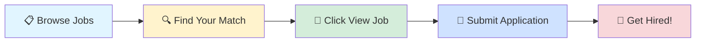

# 🚀 Tech Jobs Board

### Your Gateway to Amazing Career Opportunities

---

## 🎯 Browse by Job Profile

<table>
<tr>
<td align="center" width="25%">

 
<b>1000</b> total positions
</td>
<td align="center" width="25%">

 
<b>1000</b> total positions
</td>
<td align="center" width="25%">

 
<b>1000</b> total positions
</td>
<td align="center" width="25%">

 
<b>1000</b> total positions
</td>
</tr>
</table>

---

## 📊 Data Scientist

> 💼 **1000** positions available

<table>
<thead>
<tr>
<th width="20%">🏢 Company</th>
<th width="35%">💼 Role</th>
<th width="20%">📍 Location</th>
<th width="10%">⏰ Posted</th>
<th width="15%">🔗 Action</th>
</tr>
</thead>
<tbody>
<tr>
<td><a href="https://www.linkedin.com/company/chordy-ai">Chordy.ai</a></td>
<td>Intern AI ML</td>
<td>📍 Bangalore</td>
<td>1d ago</td>
<td align="center"></td>
</tr>
<tr>
<td><a href="https://www.ambitionbox.com/overview/tcs-overview">Tata Consultancy Services</a></td>
<td>Mobile Automation Testing Appium</td>
<td>📍 Pune, Hyderabad</td>
<td>1d ago</td>
<td align="center"></td>
</tr>
<tr>
<td><a href="https://fr.linkedin.com/company/versusmind">Versusmind</a></td>
<td>Ingénieur Systèmes et réseaux H/F</td>
<td>📍 Strasbourg, Grand Est, France</td>
<td>1d ago</td>
<td align="center"></td>
</tr>
<tr>
<td><a href="https://fr.linkedin.com/company/synanto-services">Synanto</a></td>
<td>Chef de projet Systèmes ET réseaux</td>
<td>📍 Avignon, Provence-Alpes-Côte d'Azur, France</td>
<td>1d ago</td>
<td align="center"></td>
</tr>
<tr>
<td><a href="https://www.linkedin.com/company/arealti">ARealTI</a></td>
<td>Ingénieur QA Systèmes & Réseaux</td>
<td>📍 Issy-les-Moulineaux, Île-de-France, France</td>
<td>1d ago</td>
<td align="center"></td>
</tr>
<tr>
<td><a href="https://www.linkedin.com/company/deepgram">Deepgram</a></td>
<td>Research Staff, Data Science</td>
<td>📍 San Francisco, CA</td>
<td>1d ago</td>
<td align="center"></td>
</tr>
<tr>
<td><a href="https://dk.linkedin.com/company/maersk-group">A.P. Moller - Maersk</a></td>
<td>Internship - Artificial Intelligence</td>
<td>📍 Los Angeles, CA</td>
<td>1d ago</td>
<td align="center"></td>
</tr>
<tr>
<td><a href="https://www.linkedin.com/company/boringco">The Boring Company</a></td>
<td>Test (R&D) Technician</td>
<td>📍 Bastrop, TX</td>
<td>1d ago</td>
<td align="center"></td>
</tr>
<tr>
<td>Blitzenx</td>
<td>Data Analytics Intern</td>
<td>📍 Hyderabad</td>
<td>1d ago</td>
<td align="center"></td>
</tr>
<tr>
<td><a href="https://www.ambitionbox.com/overview/tcs-overview">Tata Consultancy Services</a></td>
<td>Data Scientist</td>
<td>📍 Mumbai</td>
<td>1d ago</td>
<td align="center"></td>
</tr>
<tr>
<td><a href="https://www.linkedin.com/company/uber-com">Uber</a></td>
<td>Senior Machine Learning Engineer - Ranking & Recommendations (Generative AI)</td>
<td>📍 Seattle, WA</td>
<td>1d ago</td>
<td align="center"></td>
</tr>
<tr>
<td><a href="https://www.linkedin.com/company/uber-com">Uber</a></td>
<td>Senior Machine Learning Engineer - Ranking & Recommendations (Generative AI)</td>
<td>📍 San Francisco, CA</td>
<td>1d ago</td>
<td align="center"></td>
</tr>
<tr>
<td><a href="https://www.linkedin.com/company/uber-com">Uber</a></td>
<td>Machine Learning Engineer - Ranking & Recommendations- Ranking & Recommendations</td>
<td>📍 Seattle, WA</td>
<td>1d ago</td>
<td align="center"></td>
</tr>
<tr>
<td><a href="https://www.linkedin.com/company/uber-com">Uber</a></td>
<td>Machine Learning Engineer - Ranking & Recommendations- Ranking & Recommendations</td>
<td>📍 San Francisco, CA</td>
<td>1d ago</td>
<td align="center"></td>
</tr>
<tr>
<td><a href="https://www.linkedin.com/company/uber-com">Uber</a></td>
<td>Machine Learning Engineer - Ranking & Recommendations- Ranking & Recommendations</td>
<td>📍 New York, NY</td>
<td>1d ago</td>
<td align="center"></td>
</tr>
<tr>
<td><a href="https://www.linkedin.com/company/uber-com">Uber</a></td>
<td>Sr. Data Scientist, Identity</td>
<td>📍 San Francisco, CA</td>
<td>1d ago</td>
<td align="center"></td>
</tr>
<tr>
<td><a href="https://www.linkedin.com/company/uber-com">Uber</a></td>
<td>Sr. Data Scientist, Identity</td>
<td>📍 Sunnyvale, CA</td>
<td>1d ago</td>
<td align="center"></td>
</tr>
<tr>
<td><a href="https://fi.linkedin.com/company/kesko">Kesko - K-Group</a></td>
<td>Analytics Platform Owner, K Group</td>
<td>📍 Helsinki, Uusimaa, Finland</td>
<td>1d ago</td>
<td align="center"></td>
</tr>
<tr>
<td><a href="https://www.linkedin.com/company/jobs-via-dice">Jobs via Dice</a></td>
<td>QA Automation Selenium Engineer</td>
<td>📍 Enfield, CT</td>
<td>1d ago</td>
<td align="center"></td>
</tr>
<tr>
<td><a href="https://www.linkedin.com/company/tuyen-dung-noblex">NobleX Careers</a></td>
<td>System Architect (AI/ML)</td>
<td>📍 Hanoi Capital Region</td>
<td>1d ago</td>
<td align="center"></td>
</tr>
<tr>
<td><a href="https://www.linkedin.com/company/northrop-grumman-corporation">Northrop Grumman</a></td>
<td>Software Engineer: Automation - Level 2 or 3 (Chandler) - R10213681</td>
<td>📍 Chandler, AZ</td>
<td>1d ago</td>
<td align="center"></td>
</tr>
<tr>
<td><a href="https://www.ambitionbox.com/overview/harman-overview">HARMAN India</a></td>
<td>Intern - Tools & Framework (Python)</td>
<td>📍 Bangalore</td>
<td>1d ago</td>
<td align="center"></td>
</tr>
<tr>
<td><a href="https://www.linkedin.com/company/merck">Merck</a></td>
<td>Associate Director, Business Insights and Analytics - Respiratory</td>
<td>📍 North Wales, PA</td>
<td>1d ago</td>
<td align="center"></td>
</tr>
<tr>
<td><a href="https://www.linkedin.com/company/sanmina">Sanmina</a></td>
<td>Test Engineer 3 (R)</td>
<td>📍 Jal, NM</td>
<td>1d ago</td>
<td align="center"></td>
</tr>
<tr>
<td><a href="https://www.linkedin.com/company/stryker">Stryker</a></td>
<td>R&D Engineer - Clinical Development(Onsite)</td>
<td>📍 Irvine, CA</td>
<td>1d ago</td>
<td align="center"></td>
</tr>
<tr>
<td>Anthrasync Solutions</td>
<td>Artificial Intelligence Intern</td>
<td></td>
<td>1d ago</td>
<td align="center"></td>
</tr>
<tr>
<td><a href="https://www.linkedin.com/company/sherwin-williams">Sherwin-Williams</a></td>
<td>Sr Data Scientist</td>
<td>📍 Cleveland, OH</td>
<td>1d ago</td>
<td align="center"></td>
</tr>
<tr>
<td><a href="https://www.linkedin.com/company/bayone-solutions">BayOne Solutions</a></td>
<td>Software Engineer (Network/Python)</td>
<td>📍 India</td>
<td>1d ago</td>
<td align="center"></td>
</tr>
<tr>
<td><a href="https://www.ambitionbox.com/overview/tcs-overview">Tata Consultancy Services</a></td>
<td>Python Software Developer</td>
<td>📍 Delhi, Hyderabad, Bangalore</td>
<td>1d ago</td>
<td align="center"></td>
</tr>
<tr>
<td><a href="https://www.linkedin.com/company/bayone-solutions">BayOne Solutions</a></td>
<td>AI/ML Engineer</td>
<td>📍 India</td>
<td>1d ago</td>
<td align="center"></td>
</tr>
<tr>
<td><a href="https://www.linkedin.com/company/aiml-com">AIML.com</a></td>
<td>Senior AI Engineer (Agentic AI) - Azure Production Deployments</td>
<td>📍 New York, NY</td>
<td>1d ago</td>
<td align="center"></td>
</tr>
<tr>
<td><a href="https://in.linkedin.com/company/tata-consultancy-services">Tata Consultancy Services</a></td>
<td>Python Developer</td>
<td>📍 Delhi</td>
<td>1d ago</td>
<td align="center"></td>
</tr>
<tr>
<td>Gigafactor Solutions</td>
<td>Python Developer Intern (Remotely)</td>
<td>📍 Bangalore</td>
<td>1d ago</td>
<td align="center"></td>
</tr>
<tr>
<td><a href="https://sa.linkedin.com/company/kanz-co">Kanz</a></td>
<td>Data Scientist</td>
<td>📍 Beirut, Beirut Governorate, Lebanon</td>
<td>1d ago</td>
<td align="center"></td>
</tr>
<tr>
<td>Gigafactor Solutions</td>
<td>Python Developer Intern</td>
<td>📍 Bangalore</td>
<td>1d ago</td>
<td align="center"></td>
</tr>
<tr>
<td>Gigafactor Solutions</td>
<td>Python Developer Intern</td>
<td>📍 Bangalore</td>
<td>1d ago</td>
<td align="center"></td>
</tr>
<tr>
<td>Gigafactor Solutions</td>
<td>Python Developer - Remote Interns</td>
<td>📍 Bangalore</td>
<td>1d ago</td>
<td align="center"></td>
</tr>
<tr>
<td>Blitzenx</td>
<td>Automation Engineer Intern</td>
<td>📍 Chennai</td>
<td>1d ago</td>
<td align="center"></td>
</tr>
<tr>
<td>Blitzenx</td>
<td>AI ML Intern</td>
<td>📍 Hyderabad</td>
<td>1d ago</td>
<td align="center"></td>
</tr>
<tr>
<td>Primis Digital</td>
<td>Jr . Python Full Stack Developer</td>
<td>📍 Pune</td>
<td>1d ago</td>
<td align="center"></td>
</tr>
<tr>
<td><a href="https://www.linkedin.com/company/abler-vagas-br">abler Vagas</a></td>
<td>Assistente de RH - Foco em R&S</td>
<td>📍 Curitiba, Paraná, Brazil</td>
<td>1d ago</td>
<td align="center"></td>
</tr>
<tr>
<td><a href="https://www.linkedin.com/company/enercity-netz-gmbh">enercity Netz GmbH</a></td>
<td>Infrastructure Automation Engineer</td>
<td>📍 Hannover, Lower Saxony, Germany</td>
<td>1d ago</td>
<td align="center"></td>
</tr>
<tr>
<td><a href="https://de.linkedin.com/company/stadtregensburg">Stadt Regensburg</a></td>
<td>Leitung (m/w/d) Veterinär- und Lebensmittelrecht</td>
<td>📍 Regensburg, Bavaria, Germany</td>
<td>1d ago</td>
<td align="center"></td>
</tr>
<tr>
<td><a href="https://de.linkedin.com/company/domus-software">DOMUS Software AG</a></td>
<td>Support Agent für die Kundenbetreuung (m/w/d)</td>
<td>📍 Hohenbrunn, Bavaria, Germany</td>
<td>1d ago</td>
<td align="center"></td>
</tr>
<tr>
<td><a href="https://www.linkedin.com/company/enercity-netz-gmbh">enercity Netz GmbH</a></td>
<td>Infrastructure Automation Engineer</td>
<td>📍 Lower Saxony, Germany</td>
<td>1d ago</td>
<td align="center"></td>
</tr>
<tr>
<td><a href="https://in.linkedin.com/company/evoastra">EVOASTRA VENTURES PVT LTD</a></td>
<td>Artificial Intelligence / Machine Learning Intern (Remote)</td>
<td>📍 India</td>
<td>1d ago</td>
<td align="center"></td>
</tr>
<tr>
<td><a href="https://de.linkedin.com/company/manpowergroup-deutschland">ManpowerGroup Deutschland</a></td>
<td>Business Analyst (m/w/d) – Marketing & Data Analytics</td>
<td>📍 Hamburg, Hamburg, Germany</td>
<td>1d ago</td>
<td align="center"></td>
</tr>
<tr>
<td><a href="https://www.linkedin.com/company/nvidia">NVIDIA</a></td>
<td>Senior Deep Learning Software Engineer</td>
<td>📍 Santa Clara, CA</td>
<td>1d ago</td>
<td align="center"></td>
</tr>
<tr>
<td>Gigafactor Solutions</td>
<td>SQL Developer Fresher Interns</td>
<td>📍 Bangalore</td>
<td>1d ago</td>
<td align="center"></td>
</tr>
<tr>
<td><a href="https://ca.linkedin.com/company/food-basics-on">Food Basics</a></td>
<td>Assistant Responsable de Magasin - Région Sud-Ouest</td>
<td>📍 Port Elgin, Ontario, Canada</td>
<td>1d ago</td>
<td align="center"></td>
</tr>
<tr>
<td><a href="https://www.linkedin.com/company/nvidia">NVIDIA</a></td>
<td>Deep Learning Algorithm Engineer - New College Grad 2026</td>
<td>📍 United States</td>
<td>1d ago</td>
<td align="center"></td>
</tr>
<tr>
<td><a href="https://www.linkedin.com/company/nvidia">NVIDIA</a></td>
<td>Senior Deep Learning Software Engineer</td>
<td>📍 Redmond, WA</td>
<td>1d ago</td>
<td align="center"></td>
</tr>
<tr>
<td><a href="https://www.linkedin.com/company/talentallyatwork">TalentAlly</a></td>
<td>Senior Associate - Data Scientist - Technology Infrastructure & Engineering</td>
<td>📍 Us, Île-de-France, France</td>
<td>1d ago</td>
<td align="center"></td>
</tr>
<tr>
<td>Gigafactor Solutions</td>
<td>Data Analytics Trainee</td>
<td>📍 Bangalore</td>
<td>1d ago</td>
<td align="center"></td>
</tr>
<tr>
<td>Gigafactor Solutions</td>
<td>Data Analytics Trainee</td>
<td>📍 Hyderabad</td>
<td>1d ago</td>
<td align="center"></td>
</tr>
<tr>
<td><a href="https://www.linkedin.com/company/nvidia">NVIDIA</a></td>
<td>Deep Learning Algorithm Engineer - New College Grad 2026</td>
<td>📍 Santa Clara, CA</td>
<td>1d ago</td>
<td align="center"></td>
</tr>
<tr>
<td><a href="https://www.ambitionbox.com/overview/channel-fusion-overview">Channel Fusion</a></td>
<td>Data Science Analytics Engineering Intern</td>
<td></td>
<td>1d ago</td>
<td align="center"></td>
</tr>
<tr>
<td><a href="https://at.linkedin.com/company/kepleruniklinikum">Kepler Universitätsklinikum GmbH</a></td>
<td>Assistenzärztin/Assistenzarzt für Medizinische Genetik</td>
<td>📍 Linz, Upper Austria, Austria</td>
<td>1d ago</td>
<td align="center"></td>
</tr>
<tr>
<td><a href="https://uk.linkedin.com/company/hackajob">hackajob</a></td>
<td>Sr Analyst, Data Analytics & Business Intelligence - FreeWheel</td>
<td>📍 New York, NY</td>
<td>1d ago</td>
<td align="center"></td>
</tr>
<tr>
<td><a href="https://at.linkedin.com/company/rhk-energy-solutions">RHK Energy Solutions</a></td>
<td>Administrative:r Backoffice Allrounder:in (m/w/d)</td>
<td>📍 Vienna, Vienna, Austria</td>
<td>1d ago</td>
<td align="center"></td>
</tr>
<tr>
<td><a href="https://www.linkedin.com/company/algosec">AlgoSec</a></td>
<td>CloudFlow Automation Developer, India</td>
<td>📍 Delhi</td>
<td>1d ago</td>
<td align="center"></td>
</tr>
<tr>
<td><a href="https://www.linkedin.com/company/algosec">AlgoSec</a></td>
<td>Cloud Automation Developer, India</td>
<td>📍 Delhi</td>
<td>1d ago</td>
<td align="center"></td>
</tr>
<tr>
<td><a href="https://www.linkedin.com/company/algosec">AlgoSec</a></td>
<td>AlgoNext Automation Developer, India</td>
<td>📍 Delhi</td>
<td>1d ago</td>
<td align="center"></td>
</tr>
<tr>
<td><a href="https://www.linkedin.com/company/algosec">AlgoSec</a></td>
<td>Full Stack Automation Developer, India</td>
<td>📍 Delhi</td>
<td>1d ago</td>
<td align="center"></td>
</tr>
<tr>
<td><a href="https://br.linkedin.com/company/grupofcamara">FCamara</a></td>
<td>Data Analytics e Negócios</td>
<td>📍 São Paulo, São Paulo, Brazil</td>
<td>1d ago</td>
<td align="center"></td>
</tr>
<tr>
<td><a href="https://www.linkedin.com/company/revolution-medicines">Revolution Medicines</a></td>
<td>Scientist I, Analytical Development</td>
<td>📍 San Francisco Bay Area</td>
<td>1d ago</td>
<td align="center"></td>
</tr>
<tr>
<td><a href="https://br.linkedin.com/company/grupoamp">Grupo AMP</a></td>
<td>ATENDENTE COMERCIAL GUARUJÁ | GRUPOAMP - SALARIO R$ 1.980,00 + COMISSÃO SEM TETO</td>
<td>📍 Guarujá, São Paulo, Brazil</td>
<td>1d ago</td>
<td align="center"></td>
</tr>
<tr>
<td><a href="https://www.linkedin.com/company/rockstar-games">Rockstar Games</a></td>
<td>Associate Project Coordinator: Analytics</td>
<td>📍 Manhattan, NY</td>
<td>1d ago</td>
<td align="center"></td>
</tr>
<tr>
<td><a href="https://www.linkedin.com/company/amazon-web-services">Amazon Web Services (AWS)</a></td>
<td>Software Development Engineer, Open Data Analytics - Engines</td>
<td>📍 Arlington, VA</td>
<td>1d ago</td>
<td align="center"></td>
</tr>
<tr>
<td><a href="https://www.linkedin.com/company/amazon">Amazon</a></td>
<td>Senior Data Scientist, Pricing, Amazon Shipping, Amazon Shipping</td>
<td>📍 Bellevue, WA</td>
<td>1d ago</td>
<td align="center"></td>
</tr>
<tr>
<td><a href="https://www.linkedin.com/company/amazon-web-services">Amazon Web Services (AWS)</a></td>
<td>Machine Learning Engineer, WWPS ProServe Data and Machine Learning</td>
<td>📍 Jessup, MD</td>
<td>1d ago</td>
<td align="center"></td>
</tr>
<tr>
<td><a href="https://br.linkedin.com/company/xpinc">XP Inc.</a></td>
<td>Analista People Analytics Jr</td>
<td>📍 São Paulo, São Paulo, Brazil</td>
<td>1d ago</td>
<td align="center"></td>
</tr>
<tr>
<td><a href="https://www.linkedin.com/company/johnson-health-tech-na">Johnson Health Tech North America</a></td>
<td>Quality Automation Engineer II</td>
<td>📍 Cottage Grove, WI</td>
<td>1d ago</td>
<td align="center"></td>
</tr>
<tr>
<td><a href="https://in.linkedin.com/company/synergie-controls-system-pvt-ltd">Synergie Controls & Systems Pvt Ltd</a></td>
<td>Automation Engineer - Siemens Expert</td>
<td>📍 Navi Mumbai, Maharashtra, India</td>
<td>1d ago</td>
<td align="center"></td>
</tr>
<tr>
<td><a href="https://www.linkedin.com/company/ormco">Ormco</a></td>
<td>R&D Lab Test Engineer</td>
<td>📍 Pomona, CA</td>
<td>1d ago</td>
<td align="center"></td>
</tr>
<tr>
<td><a href="https://www.linkedin.com/company/pacers-sports-&-entertainment">Pacers Sports & Entertainment</a></td>
<td>Indiana Fever Performance Analytics Manager</td>
<td>📍 Indianapolis, IN</td>
<td>1d ago</td>
<td align="center"></td>
</tr>
<tr>
<td><a href="https://www.linkedin.com/company/daxko">Daxko</a></td>
<td>Senior Manager, Marketing Reporting & Analytics</td>
<td>📍 Noida</td>
<td>1d ago</td>
<td align="center"></td>
</tr>
<tr>
<td><a href="https://ca.linkedin.com/company/albertamotorassociation">AMA - Alberta Motor Association</a></td>
<td>Agile Team Lead, Analytics & Business Intelligence</td>
<td>📍 Edmonton, Alberta, Canada</td>
<td>1d ago</td>
<td align="center"></td>
</tr>
<tr>
<td><a href="https://www.linkedin.com/company/nvidia">NVIDIA</a></td>
<td>Senior Deep Learning Software Engineer</td>
<td>📍 Santa Clara, CA</td>
<td>1d ago</td>
<td align="center"></td>
</tr>
<tr>
<td><a href="https://www.linkedin.com/company/nvidia">NVIDIA</a></td>
<td>Deep Learning Algorithm Engineer - New College Grad 2026</td>
<td>📍 Santa Clara, CA</td>
<td>1d ago</td>
<td align="center"></td>
</tr>
<tr>
<td><a href="https://www.linkedin.com/company/eurest-usa">Eurest USA</a></td>
<td>ANALYTICS AND AUTOMATION ANALYST (HYBRID-REDMOND,WA)</td>
<td>📍 Redmond, WA</td>
<td>1d ago</td>
<td align="center"></td>
</tr>
<tr>
<td><a href="https://www.linkedin.com/company/samsung-electronics-america">Samsung Electronics America</a></td>
<td>Specialist – VD Financial Business Planning & Analytics</td>
<td>📍 Englewood Cliffs, NJ</td>
<td>1d ago</td>
<td align="center"></td>
</tr>
<tr>
<td><a href="https://in.linkedin.com/company/peoplestrong">PeopleStrong</a></td>
<td>Vice President - Artificial Intelligence (Product)</td>
<td>📍 Gurugram</td>
<td>1d ago</td>
<td align="center"></td>
</tr>
<tr>
<td><a href="https://www.linkedin.com/company/becu">BECU</a></td>
<td>Statistical Modeling Analyst</td>
<td>📍 Tukwila, WA</td>
<td>1d ago</td>
<td align="center"></td>
</tr>
<tr>
<td><a href="https://www.linkedin.com/company/grid-dynamics">Grid Dynamics</a></td>
<td>Python Full Stack Developer</td>
<td>📍 Hyderabad</td>
<td>1d ago</td>
<td align="center"></td>
</tr>
<tr>
<td><a href="https://www.linkedin.com/company/state-street">State Street</a></td>
<td>Python Developer , Officer</td>
<td>📍 Quincy, MA</td>
<td>1d ago</td>
<td align="center"></td>
</tr>
<tr>
<td><a href="https://ca.linkedin.com/company/fullscript">Fullscript</a></td>
<td>Sr Director, Business Analytics</td>
<td>📍 Ottawa, Ontario, Canada</td>
<td>1d ago</td>
<td align="center"></td>
</tr>
<tr>
<td><a href="https://in.linkedin.com/company/infosys">Infosys</a></td>
<td>Gen AI/ML Workflow Lead</td>
<td>📍 Bangalore</td>
<td>1d ago</td>
<td align="center"></td>
</tr>
<tr>
<td><a href="https://www.linkedin.com/company/booz-allen-hamilton">Booz Allen Hamilton</a></td>
<td>AI/ML Engineer, Mid</td>
<td>📍 Norfolk, VA</td>
<td>1d ago</td>
<td align="center"></td>
</tr>
<tr>
<td><a href="https://www.linkedin.com/company/lensa">Lensa</a></td>
<td>Internships in Computer Science or Software Engineering</td>
<td>📍 Shrewsbury, NJ</td>
<td>1d ago</td>
<td align="center"></td>
</tr>
<tr>
<td><a href="https://ca.linkedin.com/company/fullscript">Fullscript</a></td>
<td>Sr Director, Business Analytics</td>
<td>📍 Toronto, Ontario, Canada</td>
<td>1d ago</td>
<td align="center"></td>
</tr>
<tr>
<td><a href="https://ca.linkedin.com/company/fullscript">Fullscript</a></td>
<td>Sr Director, Business Analytics</td>
<td>📍 Calgary, Alberta, Canada</td>
<td>1d ago</td>
<td align="center"></td>
</tr>
<tr>
<td><a href="https://www.linkedin.com/company/bootbarn">Boot Barn</a></td>
<td>Senior Data Scientist</td>
<td>📍 Irvine, CA</td>
<td>1d ago</td>
<td align="center"></td>
</tr>
<tr>
<td><a href="https://www.linkedin.com/company/legacy-restoration-llc">Legacy Restoration</a></td>
<td>Five9 Manager- Data Analytics</td>
<td>📍 Mumbai</td>
<td>1d ago</td>
<td align="center"></td>
</tr>
<tr>
<td><a href="https://www.linkedin.com/company/legacy-restoration-llc">Legacy Restoration</a></td>
<td>Five9 Manager- Data Analytics</td>
<td>📍 Bangalore</td>
<td>1d ago</td>
<td align="center"></td>
</tr>
<tr>
<td><a href="https://www.linkedin.com/company/legacy-restoration-llc">Legacy Restoration</a></td>
<td>Five9 Manager- Data Analytics</td>
<td>📍 Delhi</td>
<td>1d ago</td>
<td align="center"></td>
</tr>
<tr>
<td><a href="https://www.linkedin.com/company/idt">IDT Corporation</a></td>
<td>ML Engineer</td>
<td>📍 Bangalore</td>
<td>1d ago</td>
<td align="center"></td>
</tr>
<tr>
<td><a href="https://www.linkedin.com/company/idt">IDT Corporation</a></td>
<td>ML Engineer</td>
<td>📍 Pune</td>
<td>1d ago</td>
<td align="center"></td>
</tr>
<tr>
<td><a href="https://www.linkedin.com/company/lensa">Lensa</a></td>
<td>Artificial Intelligence Intern - Summer 2026</td>
<td>📍 Arlington, VA</td>
<td>1d ago</td>
<td align="center"></td>
</tr>
<tr>
<td><a href="https://www.linkedin.com/company/caris-life-sciences">Caris Life Sciences</a></td>
<td>Data Scientist, Data & Science Solutions (Remote)</td>
<td>📍 United States</td>
<td>1d ago</td>
<td align="center"></td>
</tr>
<tr><td colspan="5" align="center"><i>... and 900 more positions</i></td></tr>
</tbody>
</table>

---

## 💼 Business Analyst

> 💼 **1000** positions available

<table>
<thead>
<tr>
<th width="20%">🏢 Company</th>
<th width="35%">💼 Role</th>
<th width="20%">📍 Location</th>
<th width="10%">⏰ Posted</th>
<th width="15%">🔗 Action</th>
</tr>
</thead>
<tbody>
<tr>
<td><a href="https://www.ambitionbox.com/overview/tcs-overview">Tata Consultancy Services</a></td>
<td>Mobile Automation Testing Appium</td>
<td>📍 Pune, Hyderabad</td>
<td>1d ago</td>
<td align="center"></td>
</tr>
<tr>
<td>Zupright Ai And Robotics</td>
<td>Business Analyst Trainee</td>
<td>📍 Pune</td>
<td>1d ago</td>
<td align="center"></td>
</tr>
<tr>
<td>Blitzenx</td>
<td>Data Analytics Intern</td>
<td>📍 Hyderabad</td>
<td>1d ago</td>
<td align="center"></td>
</tr>
<tr>
<td><a href="https://fi.linkedin.com/company/kesko">Kesko - K-Group</a></td>
<td>Analytics Platform Owner, K Group</td>
<td>📍 Helsinki, Uusimaa, Finland</td>
<td>1d ago</td>
<td align="center"></td>
</tr>
<tr>
<td><a href="https://www.linkedin.com/company/jobs-via-dice">Jobs via Dice</a></td>
<td>QA Automation Selenium Engineer</td>
<td>📍 Enfield, CT</td>
<td>1d ago</td>
<td align="center"></td>
</tr>
<tr>
<td><a href="https://de.linkedin.com/company/johannesstift-diakonie">Johannesstift Diakonie</a></td>
<td>Project Management Office Manager - Berlin</td>
<td>📍 Berlin, Berlin, Germany</td>
<td>1d ago</td>
<td align="center"></td>
</tr>
<tr>
<td><a href="https://www.linkedin.com/company/northrop-grumman-corporation">Northrop Grumman</a></td>
<td>Software Engineer: Automation - Level 2 or 3 (Chandler) - R10213681</td>
<td>📍 Chandler, AZ</td>
<td>1d ago</td>
<td align="center"></td>
</tr>
<tr>
<td><a href="https://www.ambitionbox.com/overview/harman-overview">HARMAN India</a></td>
<td>Intern - Tools & Framework (Python)</td>
<td>📍 Bangalore</td>
<td>1d ago</td>
<td align="center"></td>
</tr>
<tr>
<td><a href="https://www.linkedin.com/company/merck">Merck</a></td>
<td>Associate Director, Business Insights and Analytics - Respiratory</td>
<td>📍 North Wales, PA</td>
<td>1d ago</td>
<td align="center"></td>
</tr>
<tr>
<td><a href="https://www.linkedin.com/company/enginehires">eNGINE</a></td>
<td>Manager Business Analysis</td>
<td>📍 Greater Pittsburgh Region</td>
<td>1d ago</td>
<td align="center"></td>
</tr>
<tr>
<td><a href="https://www.linkedin.com/company/bayone-solutions">BayOne Solutions</a></td>
<td>Software Engineer (Network/Python)</td>
<td>📍 India</td>
<td>1d ago</td>
<td align="center"></td>
</tr>
<tr>
<td><a href="https://www.ambitionbox.com/overview/tcs-overview">Tata Consultancy Services</a></td>
<td>Python Software Developer</td>
<td>📍 Delhi, Hyderabad, Bangalore</td>
<td>1d ago</td>
<td align="center"></td>
</tr>
<tr>
<td><a href="https://in.linkedin.com/company/tata-consultancy-services">Tata Consultancy Services</a></td>
<td>Python Developer</td>
<td>📍 Delhi</td>
<td>1d ago</td>
<td align="center"></td>
</tr>
<tr>
<td>Gigafactor Solutions</td>
<td>Python Developer Intern (Remotely)</td>
<td>📍 Bangalore</td>
<td>1d ago</td>
<td align="center"></td>
</tr>
<tr>
<td>Gigafactor Solutions</td>
<td>Python Developer Intern</td>
<td>📍 Bangalore</td>
<td>1d ago</td>
<td align="center"></td>
</tr>
<tr>
<td>Gigafactor Solutions</td>
<td>Python Developer Intern</td>
<td>📍 Bangalore</td>
<td>1d ago</td>
<td align="center"></td>
</tr>
<tr>
<td>Gigafactor Solutions</td>
<td>Python Developer - Remote Interns</td>
<td>📍 Bangalore</td>
<td>1d ago</td>
<td align="center"></td>
</tr>
<tr>
<td>Blitzenx</td>
<td>Automation Engineer Intern</td>
<td>📍 Chennai</td>
<td>1d ago</td>
<td align="center"></td>
</tr>
<tr>
<td><a href="https://www.ambitionbox.com/overview/satat-tech-overview">Greycell Sytem Pvt Ltd.</a></td>
<td>Scrum Master Intern</td>
<td>📍 Ahmedabad</td>
<td>1d ago</td>
<td align="center"></td>
</tr>
<tr>
<td>Primis Digital</td>
<td>Jr . Python Full Stack Developer</td>
<td>📍 Pune</td>
<td>1d ago</td>
<td align="center"></td>
</tr>
<tr>
<td><a href="https://www.linkedin.com/company/enercity-netz-gmbh">enercity Netz GmbH</a></td>
<td>Infrastructure Automation Engineer</td>
<td>📍 Hannover, Lower Saxony, Germany</td>
<td>1d ago</td>
<td align="center"></td>
</tr>
<tr>
<td><a href="https://www.linkedin.com/company/enercity-netz-gmbh">enercity Netz GmbH</a></td>
<td>Infrastructure Automation Engineer</td>
<td>📍 Lower Saxony, Germany</td>
<td>1d ago</td>
<td align="center"></td>
</tr>
<tr>
<td><a href="https://de.linkedin.com/company/manpowergroup-deutschland">ManpowerGroup Deutschland</a></td>
<td>Business Analyst (m/w/d) – Marketing & Data Analytics</td>
<td>📍 Hamburg, Hamburg, Germany</td>
<td>1d ago</td>
<td align="center"></td>
</tr>
<tr>
<td><a href="https://www.linkedin.com/company/talentallyatwork">TalentAlly</a></td>
<td>Business Analyst (TEMP)</td>
<td>📍 Ann Arbor, MI</td>
<td>1d ago</td>
<td align="center"></td>
</tr>
<tr>
<td>Gigafactor Solutions</td>
<td>SQL Developer Fresher Interns</td>
<td>📍 Bangalore</td>
<td>1d ago</td>
<td align="center"></td>
</tr>
<tr>
<td><a href="https://www.linkedin.com/company/talentallyatwork">TalentAlly</a></td>
<td>Business Analyst Resource Management</td>
<td>📍 Glen Ellyn, IL</td>
<td>1d ago</td>
<td align="center"></td>
</tr>
<tr>
<td>Gigafactor Solutions</td>
<td>Data Analytics Trainee</td>
<td>📍 Bangalore</td>
<td>1d ago</td>
<td align="center"></td>
</tr>
<tr>
<td>Gigafactor Solutions</td>
<td>Data Analytics Trainee</td>
<td>📍 Hyderabad</td>
<td>1d ago</td>
<td align="center"></td>
</tr>
<tr>
<td><a href="https://www.ambitionbox.com/overview/channel-fusion-overview">Channel Fusion</a></td>
<td>Data Science Analytics Engineering Intern</td>
<td></td>
<td>1d ago</td>
<td align="center"></td>
</tr>
<tr>
<td><a href="https://uk.linkedin.com/company/hackajob">hackajob</a></td>
<td>Sr Analyst, Data Analytics & Business Intelligence - FreeWheel</td>
<td>📍 New York, NY</td>
<td>1d ago</td>
<td align="center"></td>
</tr>
<tr>
<td><a href="https://www.linkedin.com/company/algosec">AlgoSec</a></td>
<td>CloudFlow Automation Developer, India</td>
<td>📍 Delhi</td>
<td>1d ago</td>
<td align="center"></td>
</tr>
<tr>
<td><a href="https://www.linkedin.com/company/algosec">AlgoSec</a></td>
<td>Cloud Automation Developer, India</td>
<td>📍 Delhi</td>
<td>1d ago</td>
<td align="center"></td>
</tr>
<tr>
<td><a href="https://www.linkedin.com/company/algosec">AlgoSec</a></td>
<td>AlgoNext Automation Developer, India</td>
<td>📍 Delhi</td>
<td>1d ago</td>
<td align="center"></td>
</tr>
<tr>
<td><a href="https://www.linkedin.com/company/algosec">AlgoSec</a></td>
<td>Full Stack Automation Developer, India</td>
<td>📍 Delhi</td>
<td>1d ago</td>
<td align="center"></td>
</tr>
<tr>
<td><a href="https://ca.linkedin.com/company/doane-grant-thornton-llp">Doane Grant Thornton LLP</a></td>
<td>Senior Business Analyst, Business Transformation</td>
<td>📍 Toronto, Ontario, Canada</td>
<td>1d ago</td>
<td align="center"></td>
</tr>
<tr>
<td><a href="https://br.linkedin.com/company/grupofcamara">FCamara</a></td>
<td>Data Analytics e Negócios</td>
<td>📍 São Paulo, São Paulo, Brazil</td>
<td>1d ago</td>
<td align="center"></td>
</tr>
<tr>
<td><a href="https://www.linkedin.com/company/bloom-energy">Bloom Energy</a></td>
<td>Engineering Project Management</td>
<td>📍 San Jose, CA</td>
<td>1d ago</td>
<td align="center"></td>
</tr>
<tr>
<td><a href="https://www.linkedin.com/company/revolution-medicines">Revolution Medicines</a></td>
<td>Intern, Information Sciences, Business Analyst (CRM)</td>
<td>📍 San Francisco Bay Area</td>
<td>1d ago</td>
<td align="center"></td>
</tr>
<tr>
<td>Gigafactor Solutions</td>
<td>Business Analyst Traineeship</td>
<td>📍 Bangalore</td>
<td>1d ago</td>
<td align="center"></td>
</tr>
<tr>
<td><a href="https://uk.linkedin.com/company/nottinghamshire-county-council">Nottinghamshire County Council</a></td>
<td>Business Analyst</td>
<td>📍 Nottinghamshire, England, United Kingdom</td>
<td>1d ago</td>
<td align="center"></td>
</tr>
<tr>
<td><a href="https://www.ambitionbox.com/overview/merkle-b2b-overview">Merkle B2b</a></td>
<td>Associate Business Analyst Trainee</td>
<td>📍 Pune</td>
<td>1d ago</td>
<td align="center"></td>
</tr>
<tr>
<td><a href="https://www.linkedin.com/company/revolution-medicines">Revolution Medicines</a></td>
<td>Scientist I, Analytical Development</td>
<td>📍 San Francisco Bay Area</td>
<td>1d ago</td>
<td align="center"></td>
</tr>
<tr>
<td>Srivango</td>
<td>Business Analyst MFA</td>
<td>📍 Pune, Hyderabad</td>
<td>1d ago</td>
<td align="center"></td>
</tr>
<tr>
<td><a href="https://www.linkedin.com/company/ouhealth">OU Health</a></td>
<td>Director, IT Project Management</td>
<td>📍 São José de Ribamar, Maranhão, Brazil</td>
<td>1d ago</td>
<td align="center"></td>
</tr>
<tr>
<td><a href="https://www.linkedin.com/company/infinite-computer-solutions">Infinite Computer Solutions</a></td>
<td>Project Master/Scrum Master with Healthcare Domain</td>
<td>📍 United States</td>
<td>1d ago</td>
<td align="center"></td>
</tr>
<tr>
<td><a href="https://www.linkedin.com/company/rockstar-games">Rockstar Games</a></td>
<td>Associate Project Coordinator: Analytics</td>
<td>📍 Manhattan, NY</td>
<td>1d ago</td>
<td align="center"></td>
</tr>
<tr>
<td><a href="https://www.linkedin.com/company/amazon-web-services">Amazon Web Services (AWS)</a></td>
<td>Software Development Engineer, Open Data Analytics - Engines</td>
<td>📍 Arlington, VA</td>
<td>1d ago</td>
<td align="center"></td>
</tr>
<tr>
<td><a href="https://br.linkedin.com/company/xpinc">XP Inc.</a></td>
<td>Analista People Analytics Jr</td>
<td>📍 São Paulo, São Paulo, Brazil</td>
<td>1d ago</td>
<td align="center"></td>
</tr>
<tr>
<td><a href="https://www.linkedin.com/company/johnson-health-tech-na">Johnson Health Tech North America</a></td>
<td>Quality Automation Engineer II</td>
<td>📍 Cottage Grove, WI</td>
<td>1d ago</td>
<td align="center"></td>
</tr>
<tr>
<td><a href="https://in.linkedin.com/company/synergie-controls-system-pvt-ltd">Synergie Controls & Systems Pvt Ltd</a></td>
<td>Automation Engineer - Siemens Expert</td>
<td>📍 Navi Mumbai, Maharashtra, India</td>
<td>1d ago</td>
<td align="center"></td>
</tr>
<tr>
<td><a href="https://www.linkedin.com/company/pacers-sports-&-entertainment">Pacers Sports & Entertainment</a></td>
<td>Indiana Fever Performance Analytics Manager</td>
<td>📍 Indianapolis, IN</td>
<td>1d ago</td>
<td align="center"></td>
</tr>
<tr>
<td><a href="https://www.linkedin.com/company/daxko">Daxko</a></td>
<td>Senior Manager, Marketing Reporting & Analytics</td>
<td>📍 Noida</td>
<td>1d ago</td>
<td align="center"></td>
</tr>
<tr>
<td><a href="https://ca.linkedin.com/company/albertamotorassociation">AMA - Alberta Motor Association</a></td>
<td>Agile Team Lead, Analytics & Business Intelligence</td>
<td>📍 Edmonton, Alberta, Canada</td>
<td>1d ago</td>
<td align="center"></td>
</tr>
<tr>
<td><a href="https://www.linkedin.com/company/marco-technologies">Marco Technologies</a></td>
<td>Business Analyst - Copier/Print</td>
<td>📍 United States</td>
<td>1d ago</td>
<td align="center"></td>
</tr>
<tr>
<td><a href="https://www.linkedin.com/company/eurest-usa">Eurest USA</a></td>
<td>ANALYTICS AND AUTOMATION ANALYST (HYBRID-REDMOND,WA)</td>
<td>📍 Redmond, WA</td>
<td>1d ago</td>
<td align="center"></td>
</tr>
<tr>
<td><a href="https://www.linkedin.com/company/samsung-electronics-america">Samsung Electronics America</a></td>
<td>Specialist – VD Financial Business Planning & Analytics</td>
<td>📍 Englewood Cliffs, NJ</td>
<td>1d ago</td>
<td align="center"></td>
</tr>
<tr>
<td><a href="https://www.linkedin.com/company/grid-dynamics">Grid Dynamics</a></td>
<td>Python Full Stack Developer</td>
<td>📍 Hyderabad</td>
<td>1d ago</td>
<td align="center"></td>
</tr>
<tr>
<td><a href="https://www.linkedin.com/company/first-citizens-bank">First Citizens Bank</a></td>
<td>Scrum Master I (Remote)</td>
<td>📍 Arizona, United States</td>
<td>1d ago</td>
<td align="center"></td>
</tr>
<tr>
<td><a href="https://www.linkedin.com/company/state-street">State Street</a></td>
<td>Python Developer , Officer</td>
<td>📍 Quincy, MA</td>
<td>1d ago</td>
<td align="center"></td>
</tr>
<tr>
<td><a href="https://ca.linkedin.com/company/fullscript">Fullscript</a></td>
<td>Sr Director, Business Analytics</td>
<td>📍 Ottawa, Ontario, Canada</td>
<td>1d ago</td>
<td align="center"></td>
</tr>
<tr>
<td><a href="https://www.linkedin.com/company/lensa">Lensa</a></td>
<td>Internships in Computer Science or Software Engineering</td>
<td>📍 Shrewsbury, NJ</td>
<td>1d ago</td>
<td align="center"></td>
</tr>
<tr>
<td><a href="https://ca.linkedin.com/company/fullscript">Fullscript</a></td>
<td>Sr Director, Business Analytics</td>
<td>📍 Toronto, Ontario, Canada</td>
<td>1d ago</td>
<td align="center"></td>
</tr>
<tr>
<td><a href="https://ca.linkedin.com/company/fullscript">Fullscript</a></td>
<td>Sr Director, Business Analytics</td>
<td>📍 Calgary, Alberta, Canada</td>
<td>1d ago</td>
<td align="center"></td>
</tr>
<tr>
<td><a href="https://www.linkedin.com/company/legacy-restoration-llc">Legacy Restoration</a></td>
<td>Five9 Manager- Data Analytics</td>
<td>📍 Mumbai</td>
<td>1d ago</td>
<td align="center"></td>
</tr>
<tr>
<td><a href="https://www.linkedin.com/company/legacy-restoration-llc">Legacy Restoration</a></td>
<td>Five9 Manager- Data Analytics</td>
<td>📍 Bangalore</td>
<td>1d ago</td>
<td align="center"></td>
</tr>
<tr>
<td><a href="https://www.linkedin.com/company/legacy-restoration-llc">Legacy Restoration</a></td>
<td>Five9 Manager- Data Analytics</td>
<td>📍 Delhi</td>
<td>1d ago</td>
<td align="center"></td>
</tr>
<tr>
<td><a href="https://au.linkedin.com/company/westpac-group">Westpac Group</a></td>
<td>Business Analyst/Project Lead</td>
<td>📍 Parramatta, New South Wales, Australia</td>
<td>1d ago</td>
<td align="center"></td>
</tr>
<tr>
<td><a href="https://www.linkedin.com/company/d-matrix">d-Matrix</a></td>
<td>HW Engineering Intern - PCB Layout Automation & AI Tooling</td>
<td>📍 Santa Clara, CA</td>
<td>1d ago</td>
<td align="center"></td>
</tr>
<tr>
<td><a href="https://www.linkedin.com/company/lensa">Lensa</a></td>
<td>Internships in Computer Science or Software Engineering</td>
<td>📍 Gaithersburg, MD</td>
<td>1d ago</td>
<td align="center"></td>
</tr>
<tr>
<td><a href="https://www.linkedin.com/company/lensa">Lensa</a></td>
<td>Internships in Computer Science or Software Engineering</td>
<td>📍 El Segundo, CA</td>
<td>1d ago</td>
<td align="center"></td>
</tr>
<tr>
<td><a href="https://www.linkedin.com/company/lensa">Lensa</a></td>
<td>Internships in Computer Science or Software Engineering</td>
<td>📍 Tampa, FL</td>
<td>1d ago</td>
<td align="center"></td>
</tr>
<tr>
<td><a href="https://www.linkedin.com/company/lensa">Lensa</a></td>
<td>2026 Summer Corporate Intern - Digital and Analytics</td>
<td>📍 Irving, TX</td>
<td>1d ago</td>
<td align="center"></td>
</tr>
<tr>
<td><a href="https://www.linkedin.com/company/lensa">Lensa</a></td>
<td>Service Business Analyst Intern</td>
<td>📍 Seattle, WA</td>
<td>1d ago</td>
<td align="center"></td>
</tr>
<tr>
<td><a href="https://www.linkedin.com/company/sutherland-global">Sutherland</a></td>
<td>Business Analyst</td>
<td>📍 Bogota, D.C., Capital District, Colombia</td>
<td>1d ago</td>
<td align="center"></td>
</tr>
<tr>
<td><a href="https://www.linkedin.com/company/lensa">Lensa</a></td>
<td>Documentation Specialist-Hybrid Remote Schedule (3 Days On-site/2 Days Remote)</td>
<td>📍 Meridian, ID</td>
<td>1d ago</td>
<td align="center"></td>
</tr>
<tr>
<td><a href="https://www.linkedin.com/company/delta-dental-of-michigan">Delta Dental of Michigan</a></td>
<td>Internship - Project Management</td>
<td>📍 Okemos, MI</td>
<td>1d ago</td>
<td align="center"></td>
</tr>
<tr>
<td><a href="https://www.linkedin.com/company/lensa">Lensa</a></td>
<td>Remote Healthcare Scrum Master/Project Manager</td>
<td>📍 United States</td>
<td>1d ago</td>
<td align="center"></td>
</tr>
<tr>
<td><a href="https://www.linkedin.com/company/lensa">Lensa</a></td>
<td>Business Analyst Intern (Summer Internship Program)</td>
<td>📍 New Brunswick, NJ</td>
<td>1d ago</td>
<td align="center"></td>
</tr>
<tr>
<td><a href="https://pe.linkedin.com/company/grupo-hng">GRUPO HNG</a></td>
<td>Business Agile</td>
<td>📍 Santiago de Surco, Peru</td>
<td>1d ago</td>
<td align="center"></td>
</tr>
<tr>
<td><a href="https://www.linkedin.com/company/lensa">Lensa</a></td>
<td>IT Business Analyst</td>
<td>📍 Houston, TX</td>
<td>1d ago</td>
<td align="center"></td>
</tr>
<tr>
<td><a href="https://www.linkedin.com/company/medtronic">Medtronic</a></td>
<td>Sr Advanced Analytics Analyst</td>
<td>📍 Lafayette, CO</td>
<td>1d ago</td>
<td align="center"></td>
</tr>
<tr>
<td><a href="https://www.linkedin.com/company/lensa">Lensa</a></td>
<td>Business Analyst Intern (Summer Internship Program)</td>
<td>📍 New York, NY</td>
<td>1d ago</td>
<td align="center"></td>
</tr>
<tr>
<td><a href="https://www.linkedin.com/company/lensa">Lensa</a></td>
<td>Business Analyst I</td>
<td>📍 Houston, TX</td>
<td>1d ago</td>
<td align="center"></td>
</tr>
<tr>
<td><a href="https://www.linkedin.com/company/lensa">Lensa</a></td>
<td>Director, Project Management- Remote</td>
<td>📍 United States</td>
<td>1d ago</td>
<td align="center"></td>
</tr>
<tr>
<td><a href="https://in.linkedin.com/company/best-job-tool">Best Job Tool</a></td>
<td>Business Analyst</td>
<td>📍 India</td>
<td>1d ago</td>
<td align="center"></td>
</tr>
<tr>
<td><a href="https://no.linkedin.com/company/akkodis-group-nordics">Akkodis Group Nordics</a></td>
<td>QE Automation Tester</td>
<td>📍 Austin, TX</td>
<td>1d ago</td>
<td align="center"></td>
</tr>
<tr>
<td><a href="https://www.linkedin.com/company/lensa">Lensa</a></td>
<td>Director, Project Management- Remote</td>
<td>📍 Denver, CO</td>
<td>1d ago</td>
<td align="center"></td>
</tr>
<tr>
<td><a href="https://www.linkedin.com/company/lensa">Lensa</a></td>
<td>Business Analyst I</td>
<td>📍 Orlando, FL</td>
<td>1d ago</td>
<td align="center"></td>
</tr>
<tr>
<td><a href="https://www.linkedin.com/company/lensa">Lensa</a></td>
<td>Business Analyst Intern</td>
<td>📍 Raleigh, NC</td>
<td>1d ago</td>
<td align="center"></td>
</tr>
<tr>
<td><a href="https://www.linkedin.com/company/rtx">RTX</a></td>
<td>Data and AI Platform Engineering – Platform Automation</td>
<td>📍 Hartford, CT</td>
<td>1d ago</td>
<td align="center"></td>
</tr>
<tr>
<td><a href="https://www.linkedin.com/company/lensa">Lensa</a></td>
<td>Remote Healthcare Scrum Master/Project Manager</td>
<td>📍 Woonsocket, RI</td>
<td>1d ago</td>
<td align="center"></td>
</tr>
<tr>
<td><a href="https://ae.linkedin.com/company/yash-technologies-middle-east-region">YASH Technologies Middle East</a></td>
<td>Sr. Software Engineer - Python Job</td>
<td>📍 Pune</td>
<td>1d ago</td>
<td align="center"></td>
</tr>
<tr>
<td><a href="https://in.linkedin.com/company/infosys">Infosys</a></td>
<td>Python - Network Automation and CPE Tester</td>
<td>📍 Bangalore</td>
<td>1d ago</td>
<td align="center"></td>
</tr>
<tr>
<td><a href="https://www.linkedin.com/company/lensa">Lensa</a></td>
<td>Sr Business Analyst - Remote</td>
<td>📍 Atlanta, GA</td>
<td>1d ago</td>
<td align="center"></td>
</tr>
<tr>
<td><a href="https://www.linkedin.com/company/lensa">Lensa</a></td>
<td>Health Equity Analytics Internship</td>
<td>📍 St Louis, MO</td>
<td>1d ago</td>
<td align="center"></td>
</tr>
<tr>
<td><a href="https://www.linkedin.com/company/lensa">Lensa</a></td>
<td>Analytical Associate</td>
<td>📍 South San Francisco, CA</td>
<td>1d ago</td>
<td align="center"></td>
</tr>
<tr>
<td><a href="https://in.linkedin.com/company/infosys">Infosys</a></td>
<td>Salesforce Technology Lead/Consultant</td>
<td>📍 Bangalore</td>
<td>1d ago</td>
<td align="center"></td>
</tr>
<tr>
<td><a href="https://in.linkedin.com/company/infosys">Infosys</a></td>
<td>Python Automation Network Tester</td>
<td>📍 Bangalore</td>
<td>1d ago</td>
<td align="center"></td>
</tr>
<tr>
<td><a href="https://www.linkedin.com/company/lensa">Lensa</a></td>
<td>Business Analyst - Entry Level</td>
<td>📍 Knoxville, TN</td>
<td>1d ago</td>
<td align="center"></td>
</tr>
<tr>
<td><a href="https://in.linkedin.com/company/infosys">Infosys</a></td>
<td>S2R_DNA_JAVA/PYTHON/APACHE_Q4_FY26</td>
<td>📍 Bangalore</td>
<td>1d ago</td>
<td align="center"></td>
</tr>
<tr><td colspan="5" align="center"><i>... and 900 more positions</i></td></tr>
</tbody>
</table>

---

## 🚀 Product Manager

> 💼 **1000** positions available

<table>
<thead>
<tr>
<th width="20%">🏢 Company</th>
<th width="35%">💼 Role</th>
<th width="20%">📍 Location</th>
<th width="10%">⏰ Posted</th>
<th width="15%">🔗 Action</th>
</tr>
</thead>
<tbody>
<tr>
<td><a href="https://in.linkedin.com/school/reva-university/">REVA University</a></td>
<td>Management Information System Executive</td>
<td>📍 Bangalore Urban, Karnataka, India</td>
<td>1d ago</td>
<td align="center"></td>
</tr>
<tr>
<td><a href="https://www.ambitionbox.com/overview/tcs-overview">Tata Consultancy Services</a></td>
<td>Mobile Automation Testing Appium</td>
<td>📍 Pune, Hyderabad</td>
<td>1d ago</td>
<td align="center"></td>
</tr>
<tr>
<td><a href="https://uk.linkedin.com/company/salespartnersio">Sales Partners</a></td>
<td>Management Trainee | Customer Success & Sales Program</td>
<td>📍 Delhi</td>
<td>1d ago</td>
<td align="center"></td>
</tr>
<tr>
<td>Blitzenx</td>
<td>Data Analytics Intern</td>
<td>📍 Hyderabad</td>
<td>1d ago</td>
<td align="center"></td>
</tr>
<tr>
<td><a href="https://www.linkedin.com/company/everag">Ever.Ag</a></td>
<td>Database Management Intern</td>
<td>📍 United States</td>
<td>1d ago</td>
<td align="center"></td>
</tr>
<tr>
<td><a href="https://www.ambitionbox.com/overview/vizmo-overview">Vizmo</a></td>
<td>Product Intern</td>
<td>📍 Bangalore</td>
<td>1d ago</td>
<td align="center"></td>
</tr>
<tr>
<td>Super Tribe</td>
<td>Product Marketing Intern / Associate</td>
<td>📍 Mumbai</td>
<td>1d ago</td>
<td align="center"></td>
</tr>
<tr>
<td><a href="https://www.linkedin.com/company/macy">Macy's</a></td>
<td>Program Management Advisor</td>
<td>📍 New York, NY</td>
<td>1d ago</td>
<td align="center"></td>
</tr>
<tr>
<td><a href="https://fi.linkedin.com/company/kesko">Kesko - K-Group</a></td>
<td>Analytics Platform Owner, K Group</td>
<td>📍 Helsinki, Uusimaa, Finland</td>
<td>1d ago</td>
<td align="center"></td>
</tr>
<tr>
<td><a href="https://www.linkedin.com/company/jobs-via-dice">Jobs via Dice</a></td>
<td>QA Automation Selenium Engineer</td>
<td>📍 Enfield, CT</td>
<td>1d ago</td>
<td align="center"></td>
</tr>
<tr>
<td><a href="https://www.linkedin.com/company/apple">Apple</a></td>
<td>Design Producer, Product Graphics</td>
<td>📍 San Francisco, CA</td>
<td>1d ago</td>
<td align="center"></td>
</tr>
<tr>
<td><a href="https://www.linkedin.com/company/molina-healthcare">Molina Healthcare</a></td>
<td>Care Management Processor-Texas</td>
<td>📍 Texas, United States</td>
<td>1d ago</td>
<td align="center"></td>
</tr>
<tr>
<td><a href="https://de.linkedin.com/company/johannesstift-diakonie">Johannesstift Diakonie</a></td>
<td>Project Management Office Manager - Berlin</td>
<td>📍 Berlin, Berlin, Germany</td>
<td>1d ago</td>
<td align="center"></td>
</tr>
<tr>
<td><a href="https://www.linkedin.com/company/northrop-grumman-corporation">Northrop Grumman</a></td>
<td>Software Engineer: Automation - Level 2 or 3 (Chandler) - R10213681</td>
<td>📍 Chandler, AZ</td>
<td>1d ago</td>
<td align="center"></td>
</tr>
<tr>
<td><a href="https://www.linkedin.com/company/%E6%88%B4%E5%BE%B7%E6%A2%81%E8%A1%8C">戴德梁行</a></td>
<td>Management Trainee（管理培训生）</td>
<td>📍 Shanghai, Shanghai, China</td>
<td>1d ago</td>
<td align="center"></td>
</tr>
<tr>
<td><a href="https://www.linkedin.com/company/merck">Merck</a></td>
<td>Associate Director, Business Insights and Analytics - Respiratory</td>
<td>📍 North Wales, PA</td>
<td>1d ago</td>
<td align="center"></td>
</tr>
<tr>
<td><a href="https://www.linkedin.com/company/enginehires">eNGINE</a></td>
<td>Manager Business Analysis</td>
<td>📍 Greater Pittsburgh Region</td>
<td>1d ago</td>
<td align="center"></td>
</tr>
<tr>
<td><a href="https://www.linkedin.com/company/expertlinkservices">ExpertLink</a></td>
<td>Logistics Management Trainer</td>
<td>📍 Jakarta, Indonesia</td>
<td>1d ago</td>
<td align="center"></td>
</tr>
<tr>
<td><a href="https://www.linkedin.com/company/revolution-medicines">Revolution Medicines</a></td>
<td>Intern, Pharmaceutical Engineering, Drug Product, PDM</td>
<td>📍 San Francisco Bay Area</td>
<td>1d ago</td>
<td align="center"></td>
</tr>
<tr>
<td>Blitzenx</td>
<td>Automation Engineer Intern</td>
<td>📍 Chennai</td>
<td>1d ago</td>
<td align="center"></td>
</tr>
<tr>
<td><a href="https://www.linkedin.com/company/tiktok">TikTok</a></td>
<td>Product Marketing Manager Intern (Measurement Product) - 2026 Summer (BS/MS)</td>
<td>📍 San Jose, CA</td>
<td>1d ago</td>
<td align="center"></td>
</tr>
<tr>
<td><a href="https://www.ambitionbox.com/overview/satat-tech-overview">Greycell Sytem Pvt Ltd.</a></td>
<td>Scrum Master Intern</td>
<td>📍 Ahmedabad</td>
<td>1d ago</td>
<td align="center"></td>
</tr>
<tr>
<td><a href="https://www.linkedin.com/company/beloform-craft">BeloForm Craft</a></td>
<td>Management Trainee</td>
<td>📍 Austin, TX</td>
<td>1d ago</td>
<td align="center"></td>
</tr>
<tr>
<td><a href="https://www.linkedin.com/company/enercity-netz-gmbh">enercity Netz GmbH</a></td>
<td>Infrastructure Automation Engineer</td>
<td>📍 Hannover, Lower Saxony, Germany</td>
<td>1d ago</td>
<td align="center"></td>
</tr>
<tr>
<td><a href="https://www.linkedin.com/company/enercity-netz-gmbh">enercity Netz GmbH</a></td>
<td>Infrastructure Automation Engineer</td>
<td>📍 Lower Saxony, Germany</td>
<td>1d ago</td>
<td align="center"></td>
</tr>
<tr>
<td><a href="https://www.linkedin.com/company/excellusbcbs">Excellus BCBS</a></td>
<td>Records & Information Management (RIM) Program Manager I</td>
<td>📍 Utica, NY</td>
<td>1d ago</td>
<td align="center"></td>
</tr>
<tr>
<td><a href="https://www.linkedin.com/company/excellusbcbs">Excellus BCBS</a></td>
<td>Records & Information Management (RIM) Program Manager I</td>
<td>📍 Latham, NY</td>
<td>1d ago</td>
<td align="center"></td>
</tr>
<tr>
<td><a href="https://de.linkedin.com/company/manpowergroup-deutschland">ManpowerGroup Deutschland</a></td>
<td>Business Analyst (m/w/d) – Marketing & Data Analytics</td>
<td>📍 Hamburg, Hamburg, Germany</td>
<td>1d ago</td>
<td align="center"></td>
</tr>
<tr>
<td>Gigafactor Solutions</td>
<td>SQL Developer Fresher Interns</td>
<td>📍 Bangalore</td>
<td>1d ago</td>
<td align="center"></td>
</tr>
<tr>
<td><a href="https://www.linkedin.com/company/talentallyatwork">TalentAlly</a></td>
<td>Business Analyst Resource Management</td>
<td>📍 Glen Ellyn, IL</td>
<td>1d ago</td>
<td align="center"></td>
</tr>
<tr>
<td>Gigafactor Solutions</td>
<td>Data Analytics Trainee</td>
<td>📍 Bangalore</td>
<td>1d ago</td>
<td align="center"></td>
</tr>
<tr>
<td><a href="https://www.linkedin.com/company/tranetechnologies">Trane Technologies</a></td>
<td>Product Development Engineer</td>
<td>📍 Tyler, TX</td>
<td>1d ago</td>
<td align="center"></td>
</tr>
<tr>
<td><a href="https://www.linkedin.com/company/nvidia">NVIDIA</a></td>
<td>Test Product Engineer</td>
<td>📍 Raanana, Center District, Israel</td>
<td>1d ago</td>
<td align="center"></td>
</tr>
<tr>
<td>Gigafactor Solutions</td>
<td>Data Analytics Trainee</td>
<td>📍 Hyderabad</td>
<td>1d ago</td>
<td align="center"></td>
</tr>
<tr>
<td><a href="https://www.linkedin.com/company/nvidia">NVIDIA</a></td>
<td>Product Manager - BioNeMo Inference</td>
<td>📍 New York, NY</td>
<td>1d ago</td>
<td align="center"></td>
</tr>
<tr>
<td><a href="https://www.ambitionbox.com/overview/channel-fusion-overview">Channel Fusion</a></td>
<td>Data Science Analytics Engineering Intern</td>
<td></td>
<td>1d ago</td>
<td align="center"></td>
</tr>
<tr>
<td><a href="https://www.linkedin.com/company/cummins-inc">Cummins Inc.</a></td>
<td>Customer Engineering Product Specialist</td>
<td>📍 Auburn Hills, MI</td>
<td>1d ago</td>
<td align="center"></td>
</tr>
<tr>
<td><a href="https://at.linkedin.com/company/smart-energy-services-gmbh">smart Energy Services GmbH</a></td>
<td>Performance Management (all genders)</td>
<td>📍 Vienna, Vienna, Austria</td>
<td>1d ago</td>
<td align="center"></td>
</tr>
<tr>
<td><a href="https://uk.linkedin.com/company/hackajob">hackajob</a></td>
<td>Sr Analyst, Data Analytics & Business Intelligence - FreeWheel</td>
<td>📍 New York, NY</td>
<td>1d ago</td>
<td align="center"></td>
</tr>
<tr>
<td><a href="https://www.linkedin.com/company/algosec">AlgoSec</a></td>
<td>CloudFlow Automation Developer, India</td>
<td>📍 Delhi</td>
<td>1d ago</td>
<td align="center"></td>
</tr>
<tr>
<td><a href="https://www.linkedin.com/company/algosec">AlgoSec</a></td>
<td>Cloud Automation Developer, India</td>
<td>📍 Delhi</td>
<td>1d ago</td>
<td align="center"></td>
</tr>
<tr>
<td><a href="https://www.linkedin.com/company/algosec">AlgoSec</a></td>
<td>AlgoNext Automation Developer, India</td>
<td>📍 Delhi</td>
<td>1d ago</td>
<td align="center"></td>
</tr>
<tr>
<td><a href="https://www.linkedin.com/company/algosec">AlgoSec</a></td>
<td>Full Stack Automation Developer, India</td>
<td>📍 Delhi</td>
<td>1d ago</td>
<td align="center"></td>
</tr>
<tr>
<td><a href="https://www.linkedin.com/company/excellusbcbs">Excellus BCBS</a></td>
<td>Records & Information Management (RIM) Program Manager I</td>
<td>📍 DeWitt, NY</td>
<td>1d ago</td>
<td align="center"></td>
</tr>
<tr>
<td><a href="https://www.linkedin.com/company/excellusbcbs">Excellus BCBS</a></td>
<td>Records & Information Management (RIM) Program Manager I</td>
<td>📍 Elmira, NY</td>
<td>1d ago</td>
<td align="center"></td>
</tr>
<tr>
<td><a href="https://www.linkedin.com/company/excellusbcbs">Excellus BCBS</a></td>
<td>Records & Information Management (RIM) Program Manager I</td>
<td>📍 Binghamton, NY</td>
<td>1d ago</td>
<td align="center"></td>
</tr>
<tr>
<td><a href="https://www.linkedin.com/company/excellusbcbs">Excellus BCBS</a></td>
<td>Records & Information Management (RIM) Program Manager I</td>
<td>📍 Rochester, NY</td>
<td>1d ago</td>
<td align="center"></td>
</tr>
<tr>
<td><a href="https://www.linkedin.com/company/allstate">Allstate</a></td>
<td>Enterprise Project/Program Management Lead Consultant (Remote)</td>
<td>📍 United States</td>
<td>1d ago</td>
<td align="center"></td>
</tr>
<tr>
<td><a href="https://br.linkedin.com/company/grupofcamara">FCamara</a></td>
<td>Data Analytics e Negócios</td>
<td>📍 São Paulo, São Paulo, Brazil</td>
<td>1d ago</td>
<td align="center"></td>
</tr>
<tr>
<td><a href="https://www.linkedin.com/company/bloom-energy">Bloom Energy</a></td>
<td>Engineering Project Management</td>
<td>📍 San Jose, CA</td>
<td>1d ago</td>
<td align="center"></td>
</tr>
<tr>
<td><a href="https://www.linkedin.com/company/revolution-medicines">Revolution Medicines</a></td>
<td>Scientist I, Analytical Development</td>
<td>📍 San Francisco Bay Area</td>
<td>1d ago</td>
<td align="center"></td>
</tr>
<tr>
<td><a href="https://uk.linkedin.com/company/rolls-royce">Rolls-Royce</a></td>
<td>Order Management Coordinator</td>
<td>📍 Mankato, MN</td>
<td>1d ago</td>
<td align="center"></td>
</tr>
<tr>
<td><a href="https://www.linkedin.com/company/ouhealth">OU Health</a></td>
<td>Director, IT Project Management</td>
<td>📍 São José de Ribamar, Maranhão, Brazil</td>
<td>1d ago</td>
<td align="center"></td>
</tr>
<tr>
<td><a href="https://www.linkedin.com/company/infinite-computer-solutions">Infinite Computer Solutions</a></td>
<td>Project Master/Scrum Master with Healthcare Domain</td>
<td>📍 United States</td>
<td>1d ago</td>
<td align="center"></td>
</tr>
<tr>
<td><a href="https://www.linkedin.com/company/bill">BILL</a></td>
<td>Staff Software Engineer - Product, Network, and AI</td>
<td>📍 San Jose, CA</td>
<td>1d ago</td>
<td align="center"></td>
</tr>
<tr>
<td><a href="https://www.linkedin.com/company/rockstar-games">Rockstar Games</a></td>
<td>Associate Project Coordinator: Analytics</td>
<td>📍 Manhattan, NY</td>
<td>1d ago</td>
<td align="center"></td>
</tr>
<tr>
<td><a href="https://www.linkedin.com/company/amazon-web-services">Amazon Web Services (AWS)</a></td>
<td>Software Development Engineer, Open Data Analytics - Engines</td>
<td>📍 Arlington, VA</td>
<td>1d ago</td>
<td align="center"></td>
</tr>
<tr>
<td><a href="https://www.linkedin.com/company/sce">Southern California Edison (SCE)</a></td>
<td>Supply Chain Inventory Management Advisor</td>
<td>📍 Baldwin Park, CA</td>
<td>1d ago</td>
<td align="center"></td>
</tr>
<tr>
<td><a href="https://www.linkedin.com/company/amazon">Amazon</a></td>
<td>Sr. Product Manager-Tech, Amazon Leo</td>
<td>📍 Redmond, WA</td>
<td>1d ago</td>
<td align="center"></td>
</tr>
<tr>
<td><a href="https://www.linkedin.com/company/amazon">Amazon</a></td>
<td>Investigation Associate, Middle Mile Product & Technology</td>
<td>📍 Bangalore</td>
<td>1d ago</td>
<td align="center"></td>
</tr>
<tr>
<td><a href="https://au.linkedin.com/company/adapt-ideations">Adapt Ideations</a></td>
<td>Global Product and Technology Lead</td>
<td>📍 Castle Hill, New South Wales, Australia</td>
<td>1d ago</td>
<td align="center"></td>
</tr>
<tr>
<td><a href="https://www.linkedin.com/company/amazon">Amazon</a></td>
<td>Investigation Associate, Middle Mile Product & Technology</td>
<td>📍 Bangalore</td>
<td>1d ago</td>
<td align="center"></td>
</tr>
<tr>
<td><a href="https://www.linkedin.com/company/amazon">Amazon</a></td>
<td>Investigation Associate, Middle Mile Product & Technology</td>
<td>📍 Bangalore</td>
<td>1d ago</td>
<td align="center"></td>
</tr>
<tr>
<td><a href="https://www.linkedin.com/company/amazon">Amazon</a></td>
<td>Investigation Associate, Middle Mile Product & Technology</td>
<td>📍 Bangalore</td>
<td>1d ago</td>
<td align="center"></td>
</tr>
<tr>
<td><a href="https://www.linkedin.com/company/amazon">Amazon</a></td>
<td>Investigation Associate, Middle Mile Product & Technology</td>
<td>📍 Bangalore</td>
<td>1d ago</td>
<td align="center"></td>
</tr>
<tr>
<td><a href="https://br.linkedin.com/company/xpinc">XP Inc.</a></td>
<td>Analista People Analytics Jr</td>
<td>📍 São Paulo, São Paulo, Brazil</td>
<td>1d ago</td>
<td align="center"></td>
</tr>
<tr>
<td><a href="https://www.linkedin.com/company/amazon">Amazon</a></td>
<td>Investigation Associate, Middle Mile Product & Technology</td>
<td>📍 Bangalore</td>
<td>1d ago</td>
<td align="center"></td>
</tr>
<tr>
<td><a href="https://www.linkedin.com/company/amazon">Amazon</a></td>
<td>Investigation Associate, Middle Mile Product & Technology</td>
<td>📍 Bangalore</td>
<td>1d ago</td>
<td align="center"></td>
</tr>
<tr>
<td><a href="https://www.linkedin.com/company/amazon">Amazon</a></td>
<td>Investigation Associate, Middle Mile Product & Technology</td>
<td>📍 Bangalore</td>
<td>1d ago</td>
<td align="center"></td>
</tr>
<tr>
<td><a href="https://www.linkedin.com/company/amazon">Amazon</a></td>
<td>Investigation Associate, Middle Mile Product & Technology</td>
<td>📍 Bangalore</td>
<td>1d ago</td>
<td align="center"></td>
</tr>
<tr>
<td><a href="https://www.linkedin.com/company/johnson-health-tech-na">Johnson Health Tech North America</a></td>
<td>Quality Automation Engineer II</td>
<td>📍 Cottage Grove, WI</td>
<td>1d ago</td>
<td align="center"></td>
</tr>
<tr>
<td><a href="https://www.linkedin.com/company/m&t-bank">M&T Bank</a></td>
<td>Product Owner II (CIAM team)</td>
<td>📍 Baltimore, MD</td>
<td>1d ago</td>
<td align="center"></td>
</tr>
<tr>
<td><a href="https://in.linkedin.com/company/synergie-controls-system-pvt-ltd">Synergie Controls & Systems Pvt Ltd</a></td>
<td>Automation Engineer - Siemens Expert</td>
<td>📍 Navi Mumbai, Maharashtra, India</td>
<td>1d ago</td>
<td align="center"></td>
</tr>
<tr>
<td><a href="https://www.linkedin.com/company/pacers-sports-&-entertainment">Pacers Sports & Entertainment</a></td>
<td>Indiana Fever Performance Analytics Manager</td>
<td>📍 Indianapolis, IN</td>
<td>1d ago</td>
<td align="center"></td>
</tr>
<tr>
<td><a href="https://www.linkedin.com/company/daxko">Daxko</a></td>
<td>Senior Manager, Marketing Reporting & Analytics</td>
<td>📍 Noida</td>
<td>1d ago</td>
<td align="center"></td>
</tr>
<tr>
<td><a href="https://ca.linkedin.com/company/albertamotorassociation">AMA - Alberta Motor Association</a></td>
<td>Agile Team Lead, Analytics & Business Intelligence</td>
<td>📍 Edmonton, Alberta, Canada</td>
<td>1d ago</td>
<td align="center"></td>
</tr>
<tr>
<td><a href="https://www.linkedin.com/company/datacorinc">Datacor, Inc.</a></td>
<td>Product Support Specialist</td>
<td>📍 United States</td>
<td>1d ago</td>
<td align="center"></td>
</tr>
<tr>
<td>Srivango</td>
<td>Site Reliability Engineer  Secrets Management</td>
<td>📍 Bangalore</td>
<td>1d ago</td>
<td align="center"></td>
</tr>
<tr>
<td><a href="https://www.linkedin.com/company/orascoptic">Orascoptic</a></td>
<td>Global Product Manager</td>
<td>📍 Brea, CA</td>
<td>1d ago</td>
<td align="center"></td>
</tr>
<tr>
<td><a href="https://www.linkedin.com/company/nvidia">NVIDIA</a></td>
<td>Product Manager - BioNeMo Inference</td>
<td>📍 New York, United States</td>
<td>1d ago</td>
<td align="center"></td>
</tr>
<tr>
<td><a href="https://www.linkedin.com/company/att">AT&T</a></td>
<td>Lead Product Technology</td>
<td>📍 Dallas, TX</td>
<td>1d ago</td>
<td align="center"></td>
</tr>
<tr>
<td><a href="https://www.linkedin.com/company/mediakind">MediaKind</a></td>
<td>Associate Product Manager, MK.IO Platform</td>
<td>📍 Rennes, Brittany, France</td>
<td>1d ago</td>
<td align="center"></td>
</tr>
<tr>
<td><a href="https://www.linkedin.com/company/eurest-usa">Eurest USA</a></td>
<td>ANALYTICS AND AUTOMATION ANALYST (HYBRID-REDMOND,WA)</td>
<td>📍 Redmond, WA</td>
<td>1d ago</td>
<td align="center"></td>
</tr>
<tr>
<td><a href="https://www.linkedin.com/company/mayo-clinic">Mayo Clinic</a></td>
<td>Desk Operations Specialist - Office Of Access Management FL</td>
<td>📍 Jacksonville, FL</td>
<td>1d ago</td>
<td align="center"></td>
</tr>
<tr>
<td><a href="https://www.linkedin.com/company/samsung-electronics-america">Samsung Electronics America</a></td>
<td>Specialist – VD Financial Business Planning & Analytics</td>
<td>📍 Englewood Cliffs, NJ</td>
<td>1d ago</td>
<td align="center"></td>
</tr>
<tr>
<td><a href="https://in.linkedin.com/company/peoplestrong">PeopleStrong</a></td>
<td>Vice President - Artificial Intelligence (Product)</td>
<td>📍 Gurugram</td>
<td>1d ago</td>
<td align="center"></td>
</tr>
<tr>
<td><a href="https://in.linkedin.com/company/fnp-world">FNP</a></td>
<td>Product Manager</td>
<td>📍 Stone Head, IN</td>
<td>1d ago</td>
<td align="center"></td>
</tr>
<tr>
<td><a href="https://www.linkedin.com/company/first-citizens-bank">First Citizens Bank</a></td>
<td>Scrum Master I (Remote)</td>
<td>📍 Arizona, United States</td>
<td>1d ago</td>
<td align="center"></td>
</tr>
<tr>
<td>Srivango</td>
<td>Full stack Developer-Secrets Management</td>
<td>📍 Bangalore</td>
<td>1d ago</td>
<td align="center"></td>
</tr>
<tr>
<td><a href="https://www.linkedin.com/company/coindesk">CoinDesk</a></td>
<td>Director, Product Management - Clearing</td>
<td>📍 New York, United States</td>
<td>1d ago</td>
<td align="center"></td>
</tr>
<tr>
<td><a href="https://www.linkedin.com/company/aecom">AECOM</a></td>
<td>Database Management Specialist</td>
<td>📍 San Diego, CA</td>
<td>1d ago</td>
<td align="center"></td>
</tr>
<tr>
<td><a href="https://ca.linkedin.com/company/federation-of-canadian-municipalities">Federation of Canadian Municipalities</a></td>
<td>Jack Layton Fellow, Investment Management</td>
<td>📍 Ottawa, Ontario, Canada</td>
<td>1d ago</td>
<td align="center"></td>
</tr>
<tr>
<td><a href="https://ca.linkedin.com/company/fullscript">Fullscript</a></td>
<td>Sr Director, Business Analytics</td>
<td>📍 Ottawa, Ontario, Canada</td>
<td>1d ago</td>
<td align="center"></td>
</tr>
<tr>
<td><a href="https://www.linkedin.com/company/lensa">Lensa</a></td>
<td>Internships in Computer Science or Software Engineering</td>
<td>📍 Shrewsbury, NJ</td>
<td>1d ago</td>
<td align="center"></td>
</tr>
<tr>
<td><a href="https://ca.linkedin.com/company/fullscript">Fullscript</a></td>
<td>Sr Director, Business Analytics</td>
<td>📍 Toronto, Ontario, Canada</td>
<td>1d ago</td>
<td align="center"></td>
</tr>
<tr>
<td><a href="https://www.linkedin.com/company/twelvelabs">TwelveLabs</a></td>
<td>Product Partnerships Lead, Public Sector</td>
<td>📍 United States</td>
<td>1d ago</td>
<td align="center"></td>
</tr>
<tr>
<td><a href="https://www.linkedin.com/company/homebase-app">Homebase</a></td>
<td>Product Lead, Partnerships & Distribution (Hybrid)</td>
<td>📍 San Francisco, CA</td>
<td>1d ago</td>
<td align="center"></td>
</tr>
<tr>
<td><a href="https://ca.linkedin.com/company/fullscript">Fullscript</a></td>
<td>Sr Director, Business Analytics</td>
<td>📍 Calgary, Alberta, Canada</td>
<td>1d ago</td>
<td align="center"></td>
</tr>
<tr>
<td><a href="https://www.linkedin.com/company/legacy-restoration-llc">Legacy Restoration</a></td>
<td>Five9 Manager- Data Analytics</td>
<td>📍 Mumbai</td>
<td>1d ago</td>
<td align="center"></td>
</tr>
<tr>
<td><a href="https://www.linkedin.com/company/legacy-restoration-llc">Legacy Restoration</a></td>
<td>Five9 Manager- Data Analytics</td>
<td>📍 Bangalore</td>
<td>1d ago</td>
<td align="center"></td>
</tr>
<tr><td colspan="5" align="center"><i>... and 900 more positions</i></td></tr>
</tbody>
</table>

---

## 💻 Full Stack Developer

> 💼 **1000** positions available

<table>
<thead>
<tr>
<th width="20%">🏢 Company</th>
<th width="35%">💼 Role</th>
<th width="20%">📍 Location</th>
<th width="10%">⏰ Posted</th>
<th width="15%">🔗 Action</th>
</tr>
</thead>
<tbody>
<tr>
<td><a href="https://www.linkedin.com/company/genparkai">GenPark</a></td>
<td>Junior software developer</td>
<td>📍 San Diego, CA</td>
<td>1d ago</td>
<td align="center"></td>
</tr>
<tr>
<td><a href="https://de.linkedin.com/company/siemens-healthineers">Siemens Healthineers</a></td>
<td>Software Quality Assurance Specialist Co-Op</td>
<td>📍 Ottawa, Ontario, Canada</td>
<td>1d ago</td>
<td align="center"></td>
</tr>
<tr>
<td><a href="https://www.linkedin.com/company/jpstechsolutions">JPS Tech Solutions</a></td>
<td>Front End Developer / Angular Developer</td>
<td>📍 Dallas, TX</td>
<td>1d ago</td>
<td align="center"></td>
</tr>
<tr>
<td><a href="https://uk.linkedin.com/company/huspyholding">Huspy Holding</a></td>
<td>Associate Software Engineer</td>
<td>📍 Bangalore</td>
<td>1d ago</td>
<td align="center"></td>
</tr>
<tr>
<td><a href="https://uk.linkedin.com/company/huspyholding">Huspy Holding</a></td>
<td>Associate Software Engineer</td>
<td>📍 Delhi</td>
<td>1d ago</td>
<td align="center"></td>
</tr>
<tr>
<td><a href="https://fr.linkedin.com/company/synanto-services">Synanto</a></td>
<td>Développeur NodeJS / Angular</td>
<td>📍 Montpellier, Occitanie, France</td>
<td>1d ago</td>
<td align="center"></td>
</tr>
<tr>
<td><a href="https://ae.linkedin.com/company/miamin-systems-inc">Miamin Systems</a></td>
<td>Associate Software Engineer</td>
<td>📍 Pune</td>
<td>1d ago</td>
<td align="center"></td>
</tr>
<tr>
<td><a href="https://in.linkedin.com/company/cafe-munnar">Cafe Munnar</a></td>
<td>Associate Software Engineer</td>
<td>📍 Madurai, Tamil Nadu, India</td>
<td>1d ago</td>
<td align="center"></td>
</tr>
<tr>
<td><a href="https://www.linkedin.com/company/akasahealth">AKASA</a></td>
<td>Software Engineer, Full Stack</td>
<td>📍 San Francisco, CA</td>
<td>1d ago</td>
<td align="center"></td>
</tr>
<tr>
<td><a href="https://ae.linkedin.com/company/miamin-systems-inc">Miamin Systems</a></td>
<td>Associate Software Engineer</td>
<td>📍 Delhi</td>
<td>1d ago</td>
<td align="center"></td>
</tr>
<tr>
<td><a href="https://in.linkedin.com/company/cafe-munnar">Cafe Munnar</a></td>
<td>Associate Software Engineer</td>
<td>📍 Delhi</td>
<td>1d ago</td>
<td align="center"></td>
</tr>
<tr>
<td><a href="https://www.linkedin.com/company/apex-systems">Apex Systems</a></td>
<td>Software Engineer</td>
<td>📍 Santa Clara, CA</td>
<td>1d ago</td>
<td align="center"></td>
</tr>
<tr>
<td><a href="https://www.linkedin.com/company/oyf-staffing">OYF (Own Your Future) Staffing</a></td>
<td>Software Engineer</td>
<td>📍 New York, NY</td>
<td>1d ago</td>
<td align="center"></td>
</tr>
<tr>
<td><a href="https://www.linkedin.com/company/petrasoft-inc">Petrasoft Inc</a></td>
<td>Software Engineer</td>
<td>📍 Houston, TX</td>
<td>1d ago</td>
<td align="center"></td>
</tr>
<tr>
<td><a href="https://www.linkedin.com/company/knowles-electronics">Knowles Corporation</a></td>
<td>Senior Software Application Engineer</td>
<td>📍 Bayan Lepas, Penang, Malaysia</td>
<td>1d ago</td>
<td align="center"></td>
</tr>
<tr>
<td><a href="https://www.linkedin.com/company/jobs-via-dice">Jobs via Dice</a></td>
<td>React JS Developer</td>
<td>📍 Lowell, MA</td>
<td>1d ago</td>
<td align="center"></td>
</tr>
<tr>
<td><a href="https://www.linkedin.com/company/jobs-via-dice">Jobs via Dice</a></td>
<td>Full Stack Engineer</td>
<td>📍 Texas, United States</td>
<td>1d ago</td>
<td align="center"></td>
</tr>
<tr>
<td><a href="https://www.linkedin.com/company/jobs-via-dice">Jobs via Dice</a></td>
<td>Software Tester</td>
<td>📍 Austin, TX</td>
<td>1d ago</td>
<td align="center"></td>
</tr>
<tr>
<td><a href="https://www.linkedin.com/company/jobs-via-dice">Jobs via Dice</a></td>
<td>Software Engineer - Intern</td>
<td>📍 Niagara Falls, NY</td>
<td>1d ago</td>
<td align="center"></td>
</tr>
<tr>
<td><a href="https://www.linkedin.com/company/jobs-via-dice">Jobs via Dice</a></td>
<td>Software Test Engineer</td>
<td>📍 Dearborn, MI</td>
<td>1d ago</td>
<td align="center"></td>
</tr>
<tr>
<td><a href="https://www.linkedin.com/company/jobs-via-dice">Jobs via Dice</a></td>
<td>Software Engineer (Modeling & Simulation) - Early Career</td>
<td>📍 Fort Worth, TX</td>
<td>1d ago</td>
<td align="center"></td>
</tr>
<tr>
<td><a href="https://www.linkedin.com/company/apple">Apple</a></td>
<td>Senior Software Engineer, Apple Pay — Wallet, Payments & Commerce (WPC)</td>
<td>📍 San Diego, CA</td>
<td>1d ago</td>
<td align="center"></td>
</tr>
<tr>
<td><a href="https://www.linkedin.com/company/apple">Apple</a></td>
<td>Software Engineer, Apple Pay — Wallet, Payments & Commerce (WPC)</td>
<td>📍 Montreal, Quebec, Canada</td>
<td>1d ago</td>
<td align="center"></td>
</tr>
<tr>
<td><a href="https://www.linkedin.com/company/jobs-via-dice">Jobs via Dice</a></td>
<td>WEB DEVELOPER – REACT</td>
<td>📍 United States</td>
<td>1d ago</td>
<td align="center"></td>
</tr>
<tr>
<td><a href="https://www.linkedin.com/company/jobs-via-dice">Jobs via Dice</a></td>
<td>Software Technical Specialist (QA / UAT)</td>
<td>📍 Little Rock, AR</td>
<td>1d ago</td>
<td align="center"></td>
</tr>
<tr>
<td><a href="https://www.linkedin.com/company/apple">Apple</a></td>
<td>Senior Software Engineer, Apple Pay — Wallet, Payments & Commerce (WPC)</td>
<td>📍 Cupertino, CA</td>
<td>1d ago</td>
<td align="center"></td>
</tr>
<tr>
<td><a href="https://www.linkedin.com/company/apple">Apple</a></td>
<td>Software Development Engineer in Test (SDET), Video Apps</td>
<td>📍 Culver City, CA</td>
<td>1d ago</td>
<td align="center"></td>
</tr>
<tr>
<td><a href="https://www.linkedin.com/company/apple">Apple</a></td>
<td>Software Development Engineer in Test (SDET), Video Apps</td>
<td>📍 Cupertino, CA</td>
<td>1d ago</td>
<td align="center"></td>
</tr>
<tr>
<td><a href="https://www.linkedin.com/company/apple">Apple</a></td>
<td>Software Development Engineer in Test (SDET), Video Apps</td>
<td>📍 San Diego, CA</td>
<td>1d ago</td>
<td align="center"></td>
</tr>
<tr>
<td><a href="https://www.linkedin.com/company/apple">Apple</a></td>
<td>Senior Software Engineer, Apple Pay — Wallet, Payments & Commerce (WPC)</td>
<td>📍 Cary, NC</td>
<td>1d ago</td>
<td align="center"></td>
</tr>
<tr>
<td><a href="https://www.linkedin.com/company/apple">Apple</a></td>
<td>Senior Software Engineer, Apple Pay — Wallet, Payments & Commerce (WPC)</td>
<td>📍 Austin, TX</td>
<td>1d ago</td>
<td align="center"></td>
</tr>
<tr>
<td><a href="https://www.linkedin.com/company/apple">Apple</a></td>
<td>Senior Software Engineer, Apple Pay — Wallet, Payments & Commerce (WPC)</td>
<td>📍 New York, NY</td>
<td>1d ago</td>
<td align="center"></td>
</tr>
<tr>
<td><a href="https://www.linkedin.com/company/apple">Apple</a></td>
<td>Senior Software Engineer, Apple Pay — Wallet, Payments & Commerce (WPC)</td>
<td>📍 Montreal, Quebec, Canada</td>
<td>1d ago</td>
<td align="center"></td>
</tr>
<tr>
<td><a href="https://www.linkedin.com/company/apple">Apple</a></td>
<td>Software Development Engineer in Test (SDET), Video Apps</td>
<td>📍 Denver, CO</td>
<td>1d ago</td>
<td align="center"></td>
</tr>
<tr>
<td><a href="https://www.linkedin.com/company/apple">Apple</a></td>
<td>Software Development Engineer in Test (SDET), Video Apps</td>
<td>📍 Austin, TX</td>
<td>1d ago</td>
<td align="center"></td>
</tr>
<tr>
<td><a href="https://www.linkedin.com/company/northrop-grumman-corporation">Northrop Grumman</a></td>
<td>Sentinel Software Engineer / Principal Software Engineer - 11953-1 - R10220869</td>
<td>📍 Roy, UT</td>
<td>1d ago</td>
<td align="center"></td>
</tr>
<tr>
<td><a href="https://www.linkedin.com/company/northrop-grumman-corporation">Northrop Grumman</a></td>
<td>Sr. Principal Software Engineer (AHT) - R10220512</td>
<td>📍 Manhattan Beach, CA</td>
<td>1d ago</td>
<td align="center"></td>
</tr>
<tr>
<td><a href="https://www.linkedin.com/company/northrop-grumman-corporation">Northrop Grumman</a></td>
<td>Software Engineer Level 4 - R10220526</td>
<td>📍 Aurora, CO</td>
<td>1d ago</td>
<td align="center"></td>
</tr>
<tr>
<td><a href="https://www.linkedin.com/company/northrop-grumman-corporation">Northrop Grumman</a></td>
<td>DevOps Staff Software Engineer - R10221229</td>
<td>📍 Melbourne, FL</td>
<td>1d ago</td>
<td align="center"></td>
</tr>
<tr>
<td><a href="https://www.linkedin.com/company/northrop-grumman-corporation">Northrop Grumman</a></td>
<td>Staff Software Engineer - R10220446</td>
<td>📍 Camarillo, CA</td>
<td>1d ago</td>
<td align="center"></td>
</tr>
<tr>
<td><a href="https://www.linkedin.com/company/northrop-grumman-corporation">Northrop Grumman</a></td>
<td>Software Engineer: Automation - Level 2 or 3 (Chandler) - R10213681</td>
<td>📍 Chandler, AZ</td>
<td>1d ago</td>
<td align="center"></td>
</tr>
<tr>
<td><a href="https://www.linkedin.com/company/northrop-grumman-corporation">Northrop Grumman</a></td>
<td>Software Engineer - Level T03/T04 (Space Systems) - R10220547</td>
<td>📍 Redondo Beach, CA</td>
<td>1d ago</td>
<td align="center"></td>
</tr>
<tr>
<td><a href="https://www.linkedin.com/company/appfolio">AppFolio</a></td>
<td>Staff Software Engineer</td>
<td>📍 San Diego, CA</td>
<td>1d ago</td>
<td align="center"></td>
</tr>
<tr>
<td><a href="https://www.linkedin.com/company/appfolio">AppFolio</a></td>
<td>Staff Software Engineer</td>
<td>📍 San Francisco, CA</td>
<td>1d ago</td>
<td align="center"></td>
</tr>
<tr>
<td><a href="https://www.linkedin.com/company/genentech">Genentech</a></td>
<td>Senior Scientific Software Engineer (Visualization)</td>
<td>📍 South San Francisco, CA</td>
<td>1d ago</td>
<td align="center"></td>
</tr>
<tr>
<td><a href="https://www.linkedin.com/company/appfolio">AppFolio</a></td>
<td>Staff Software Engineer</td>
<td>📍 Denver, CO</td>
<td>1d ago</td>
<td align="center"></td>
</tr>
<tr>
<td><a href="https://www.linkedin.com/company/appfolio">AppFolio</a></td>
<td>Staff Software Engineer</td>
<td>📍 Atlanta, GA</td>
<td>1d ago</td>
<td align="center"></td>
</tr>
<tr>
<td><a href="https://www.linkedin.com/company/appfolio">AppFolio</a></td>
<td>Staff Software Engineer</td>
<td>📍 Chicago, IL</td>
<td>1d ago</td>
<td align="center"></td>
</tr>
<tr>
<td><a href="https://www.ambitionbox.com/overview/harman-overview">HARMAN India</a></td>
<td>Intern - Tools & Framework (Python)</td>
<td>📍 Bangalore</td>
<td>1d ago</td>
<td align="center"></td>
</tr>
<tr>
<td><a href="https://www.linkedin.com/company/apple">Apple</a></td>
<td>Software Screening & Integration Engineer, Generative AI Experiences Software (Special Projects)</td>
<td>📍 Sunnyvale, CA</td>
<td>1d ago</td>
<td align="center"></td>
</tr>
<tr>
<td><a href="https://www.linkedin.com/company/citi">Citi</a></td>
<td>Java Full Stack Senior Developer</td>
<td>📍 Mississauga, Ontario, Canada</td>
<td>1d ago</td>
<td align="center"></td>
</tr>
<tr>
<td><a href="https://www.linkedin.com/company/citi">Citi</a></td>
<td>Lead Full Stack Java Developer</td>
<td>📍 Mississauga, Ontario, Canada</td>
<td>1d ago</td>
<td align="center"></td>
</tr>
<tr>
<td><a href="https://www.linkedin.com/company/guidewire-software">Guidewire Software</a></td>
<td>Software Engineer III (Backend, AI)</td>
<td>📍 Curitiba, Paraná, Brazil</td>
<td>1d ago</td>
<td align="center"></td>
</tr>
<tr>
<td><a href="https://www.linkedin.com/company/citi">Citi</a></td>
<td>Full Stack Developer</td>
<td>📍 Mississauga, Ontario, Canada</td>
<td>1d ago</td>
<td align="center"></td>
</tr>
<tr>
<td><a href="https://www.ambitionbox.com/overview/tcs-overview">Tata Consultancy Services</a></td>
<td>Java and J2Ee Developer</td>
<td>📍 Mumbai, Hyderabad, Bangalore</td>
<td>1d ago</td>
<td align="center"></td>
</tr>
<tr>
<td><a href="https://www.linkedin.com/company/sherwin-williams">Sherwin-Williams</a></td>
<td>Software Quality Assurance Engineer</td>
<td>📍 Cleveland, OH</td>
<td>1d ago</td>
<td align="center"></td>
</tr>
<tr>
<td><a href="https://www.linkedin.com/company/griddable-io">griddable.io</a></td>
<td>Software Engineering LMTS</td>
<td>📍 San Francisco, CA</td>
<td>1d ago</td>
<td align="center"></td>
</tr>
<tr>
<td><a href="https://www.linkedin.com/company/ibm">IBM</a></td>
<td>Software Engineer Apprentice</td>
<td>📍 Poughkeepsie, AR</td>
<td>1d ago</td>
<td align="center"></td>
</tr>
<tr>
<td><a href="https://www.linkedin.com/company/bayone-solutions">BayOne Solutions</a></td>
<td>Software Engineer (Network/Python)</td>
<td>📍 India</td>
<td>1d ago</td>
<td align="center"></td>
</tr>
<tr>
<td><a href="https://www.ambitionbox.com/overview/tcs-overview">Tata Consultancy Services</a></td>
<td>Python Software Developer</td>
<td>📍 Delhi, Hyderabad, Bangalore</td>
<td>1d ago</td>
<td align="center"></td>
</tr>
<tr>
<td><a href="https://www.linkedin.com/company/northrop-grumman-corporation">Northrop Grumman</a></td>
<td>Principal Software Engineer (AHT) - R10221179</td>
<td>📍 Beavercreek, OH</td>
<td>1d ago</td>
<td align="center"></td>
</tr>
<tr>
<td><a href="https://in.linkedin.com/company/tata-consultancy-services">Tata Consultancy Services</a></td>
<td>Python Developer</td>
<td>📍 Delhi</td>
<td>1d ago</td>
<td align="center"></td>
</tr>
<tr>
<td>Gigafactor Solutions</td>
<td>Python Developer Intern (Remotely)</td>
<td>📍 Bangalore</td>
<td>1d ago</td>
<td align="center"></td>
</tr>
<tr>
<td>Gigafactor Solutions</td>
<td>Python Developer Intern</td>
<td>📍 Bangalore</td>
<td>1d ago</td>
<td align="center"></td>
</tr>
<tr>
<td>Gigafactor Solutions</td>
<td>Python Developer Intern</td>
<td>📍 Bangalore</td>
<td>1d ago</td>
<td align="center"></td>
</tr>
<tr>
<td>Gigafactor Solutions</td>
<td>Python Developer - Remote Interns</td>
<td>📍 Bangalore</td>
<td>1d ago</td>
<td align="center"></td>
</tr>
<tr>
<td><a href="https://www.ambitionbox.com/overview/capestart-overview">CapeStart</a></td>
<td>React Node Intern</td>
<td>📍 Nagercoil</td>
<td>1d ago</td>
<td align="center"></td>
</tr>
<tr>
<td><a href="https://www.ambitionbox.com/overview/livekeeping-overview">Livekeeping</a></td>
<td>MongoDB Database Intern</td>
<td>📍 Noida</td>
<td>1d ago</td>
<td align="center"></td>
</tr>
<tr>
<td><a href="https://www.ambitionbox.com/overview/capestart-overview">CapeStart</a></td>
<td>Java Developer Intern</td>
<td>📍 Nagercoil</td>
<td>1d ago</td>
<td align="center"></td>
</tr>
<tr>
<td><a href="https://www.ambitionbox.com/overview/upcurve-business-services-overview">Upcurve Business</a></td>
<td>Full Stack Software Development Trainee</td>
<td>📍 Pune</td>
<td>1d ago</td>
<td align="center"></td>
</tr>
<tr>
<td>Primis Digital</td>
<td>Jr . Python Full Stack Developer</td>
<td>📍 Pune</td>
<td>1d ago</td>
<td align="center"></td>
</tr>
<tr>
<td><a href="https://ca.linkedin.com/company/rbc">RBC</a></td>
<td>Sr. Java Full Stack Developer</td>
<td>📍 Mississauga, Ontario, Canada</td>
<td>1d ago</td>
<td align="center"></td>
</tr>
<tr>
<td><a href="https://br.linkedin.com/company/institutoflexpeak">Instituto FlexPeak</a></td>
<td>Instrutor de Desenvolvimento de Software e IA - AM</td>
<td>📍 Brazil</td>
<td>1d ago</td>
<td align="center"></td>
</tr>
<tr>
<td><a href="https://www.linkedin.com/company/nasdaq">Nasdaq</a></td>
<td>Java Developer</td>
<td>📍 Mexico City Metropolitan Area</td>
<td>1d ago</td>
<td align="center"></td>
</tr>
<tr>
<td><a href="https://de.linkedin.com/company/lotto-hessen-gmbh">LOTTO Hessen GmbH</a></td>
<td>Junior Java-Entwickler (m/w/d)</td>
<td>📍 Wiesbaden, Hesse, Germany</td>
<td>1d ago</td>
<td align="center"></td>
</tr>
<tr>
<td><a href="https://www.linkedin.com/company/groundworkscompanies">Groundworks</a></td>
<td>Senior Software Engineer</td>
<td>📍 Dallas, TX</td>
<td>1d ago</td>
<td align="center"></td>
</tr>
<tr>
<td><a href="https://www.linkedin.com/company/hmhlearn">HMH</a></td>
<td>Staff Software Developer (Canada)</td>
<td>📍 Quebec, Canada</td>
<td>1d ago</td>
<td align="center"></td>
</tr>
<tr>
<td><a href="https://ca.linkedin.com/company/medcanlivewell">Medcan</a></td>
<td>Full Stack Developer</td>
<td>📍 Toronto, Ontario, Canada</td>
<td>1d ago</td>
<td align="center"></td>
</tr>
<tr>
<td><a href="https://www.linkedin.com/company/general-motors">General Motors</a></td>
<td>Senior Software Engineer - Autonomous Software Systems</td>
<td>📍 Detroit, MI</td>
<td>1d ago</td>
<td align="center"></td>
</tr>
<tr>
<td><a href="https://in.linkedin.com/company/tekwissenindia">TekWissen India</a></td>
<td>Software Engineer (III) - Core Engineer III</td>
<td>📍 Chennai</td>
<td>1d ago</td>
<td align="center"></td>
</tr>
<tr>
<td><a href="https://www.linkedin.com/company/talentallyatwork">TalentAlly</a></td>
<td>Software Developer AVP</td>
<td>📍 Whippany, NJ</td>
<td>1d ago</td>
<td align="center"></td>
</tr>
<tr>
<td><a href="https://fr.linkedin.com/company/capgemini">Capgemini</a></td>
<td>Sr React.js Frontend Developer - Remote in México</td>
<td>📍 Guadalajara, Jalisco, Mexico</td>
<td>1d ago</td>
<td align="center"></td>
</tr>
<tr>
<td><a href="https://www.linkedin.com/company/nvidia">NVIDIA</a></td>
<td>Software Engineer - AI Solutions</td>
<td>📍 Raanana, Center District, Israel</td>
<td>1d ago</td>
<td align="center"></td>
</tr>
<tr>
<td><a href="https://www.linkedin.com/company/nvidia">NVIDIA</a></td>
<td>Senior Deep Learning Software Engineer</td>
<td>📍 Santa Clara, CA</td>
<td>1d ago</td>
<td align="center"></td>
</tr>
<tr>
<td>Gigafactor Solutions</td>
<td>SQL Developer Fresher Interns</td>
<td>📍 Bangalore</td>
<td>1d ago</td>
<td align="center"></td>
</tr>
<tr>
<td><a href="https://www.linkedin.com/company/nvidia">NVIDIA</a></td>
<td>Manager, Software Support Services</td>
<td>📍 Santa Clara, CA</td>
<td>1d ago</td>
<td align="center"></td>
</tr>
<tr>
<td><a href="https://www.linkedin.com/company/nvidia">NVIDIA</a></td>
<td>Manager, Software Support Services</td>
<td>📍 Santa Clara, CA</td>
<td>1d ago</td>
<td align="center"></td>
</tr>
<tr>
<td><a href="https://www.linkedin.com/company/nvidia">NVIDIA</a></td>
<td>Director, Rack Scale Software Architecture</td>
<td>📍 Boulder, CO</td>
<td>1d ago</td>
<td align="center"></td>
</tr>
<tr>
<td><a href="https://www.linkedin.com/company/nvidia">NVIDIA</a></td>
<td>Senior System Software Engineer - Neural Graphics Performance</td>
<td>📍 Santa Clara, CA</td>
<td>1d ago</td>
<td align="center"></td>
</tr>
<tr>
<td><a href="https://www.linkedin.com/company/nvidia">NVIDIA</a></td>
<td>System Software Engineer, Neural Graphics SDKs</td>
<td>📍 Redmond, WA</td>
<td>1d ago</td>
<td align="center"></td>
</tr>
<tr>
<td><a href="https://www.linkedin.com/company/talentallyatwork">TalentAlly</a></td>
<td>Principal Software Engineer/Sr. Principal Software Engineer</td>
<td>📍 Melbourne, IA</td>
<td>1d ago</td>
<td align="center"></td>
</tr>
<tr>
<td><a href="https://www.linkedin.com/company/nvidia">NVIDIA</a></td>
<td>Senior Deep Learning Software Engineer</td>
<td>📍 Redmond, WA</td>
<td>1d ago</td>
<td align="center"></td>
</tr>
<tr>
<td><a href="https://www.linkedin.com/company/nvidia">NVIDIA</a></td>
<td>Director, Rack Scale Software Architecture</td>
<td>📍 Durham, NC</td>
<td>1d ago</td>
<td align="center"></td>
</tr>
<tr>
<td><a href="https://www.linkedin.com/company/nvidia">NVIDIA</a></td>
<td>Senior Embedded Software Engineer - Yocto and Linux for Tegra</td>
<td>📍 Santa Clara, CA</td>
<td>1d ago</td>
<td align="center"></td>
</tr>
<tr>
<td><a href="https://www.linkedin.com/company/nvidia">NVIDIA</a></td>
<td>Software Engineering Manager, Robotics 3D Perception and Simulation</td>
<td>📍 Santa Clara, CA</td>
<td>1d ago</td>
<td align="center"></td>
</tr>
<tr>
<td><a href="https://www.linkedin.com/company/nvidia">NVIDIA</a></td>
<td>Software Engineering Manager, Robotics 3D Perception and Simulation</td>
<td>📍 Santa Clara, CA</td>
<td>1d ago</td>
<td align="center"></td>
</tr>
<tr>
<td><a href="https://www.linkedin.com/company/nvidia">NVIDIA</a></td>
<td>Senior Software Engineer, Networking Platform</td>
<td>📍 Santa Clara, CA</td>
<td>1d ago</td>
<td align="center"></td>
</tr>
<tr>
<td><a href="https://www.linkedin.com/company/nvidia">NVIDIA</a></td>
<td>Senior Software Engineer, Networking Platform</td>
<td>📍 Santa Clara, CA</td>
<td>1d ago</td>
<td align="center"></td>
</tr>
<tr>
<td><a href="https://www.linkedin.com/company/nvidia">NVIDIA</a></td>
<td>Senior System Software Engineer - Neural Graphics Performance</td>
<td>📍 Santa Clara, CA</td>
<td>1d ago</td>
<td align="center"></td>
</tr>
<tr>
<td><a href="https://www.linkedin.com/company/nvidia">NVIDIA</a></td>
<td>Manager, Software Engineering - Profiling Services</td>
<td>📍 Santa Clara, CA</td>
<td>1d ago</td>
<td align="center"></td>
</tr>
<tr><td colspan="5" align="center"><i>... and 900 more positions</i></td></tr>
</tbody>
</table>

---

## 📈 Statistics

| Metric | Count |
|:-------|------:|
| 📊 Total Listings | **4000** |
| 🌍 Remote Jobs | **50** |
| 📊 Data Scientist | **1000** |
| 💼 Business Analyst | **1000** |
| 🚀 Product Manager | **1000** |
| 💻 Full Stack Developer | **1000** |

---

## 🎯 How to Apply?

### Steps to Apply:
1. 🔍 **Browse** through the positions above
2. 💼 **Click** the "View Job" button on your preferred role
3. 📝 **Complete** the application on our website
4. ✉️ **Wait** for us to review your application
5. 🎉 **Celebrate** when you get the interview call!

---

## 🔔 Stay Updated

### ⭐ Star this repository to receive updates on new job postings!

**This job board is automatically updated every 6 hours**

---

## 💬 Contributing

Found a broken link or want to add a job posting? Feel free to:
- 🐛 Open an issue
- 🔧 Submit a pull request
- 📧 Contact us directly

---

## 🙏 Stay Connected

---

### 📅 Last Updated

**Sunday, February 1, 2026 at 02:49 AM UTC**

---

💼 Jobs aggregated from multiple sources • ⚡ Auto-updated every 6 hours • 🤖 Powered by GitHub Actions

**Made with ❤️ for the Tech Community**

⬆️ [Back to Top](#-tech-jobs-board) ⬆️

