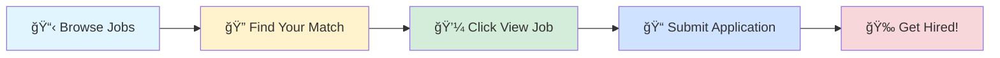

# 🚀 Tech Jobs Board

### Your Gateway to Amazing Career Opportunities

---

## 🎯 Browse by Job Profile

<table>
<tr>
<td align="center" width="25%">

 
<b>1000</b> total positions
</td>
<td align="center" width="25%">

 
<b>1000</b> total positions
</td>
<td align="center" width="25%">

 
<b>1000</b> total positions
</td>
<td align="center" width="25%">

 
<b>1000</b> total positions
</td>
</tr>
</table>

---

## 📊 Data Scientist

> 💼 **1000** positions available

<table>
<thead>
<tr>
<th width="20%">🏢 Company</th>
<th width="35%">💼 Role</th>
<th width="20%">📍 Location</th>
<th width="10%">⏰ Posted</th>
<th width="15%">🔗 Action</th>
</tr>
</thead>
<tbody>
<tr>
<td><a href="https://in.linkedin.com/company/tata-consultancy-services">Tata Consultancy Services</a></td>
<td>Python Developer</td>
<td>📍 Bangalore</td>
<td>1d ago</td>
<td align="center"></td>
</tr>
<tr>
<td><a href="https://uk.linkedin.com/company/zynka-technologies">Zynka Technologies</a></td>
<td>DevOps Engineer (Azure + AWS)</td>
<td>📍 Bhopal, Madhya Pradesh, India</td>
<td>1d ago</td>
<td align="center"></td>
</tr>
<tr>
<td><a href="https://www.linkedin.com/company/ppstack">PPStack</a></td>
<td>AWS Intern</td>
<td>📍 India</td>
<td>1d ago</td>
<td align="center"></td>
</tr>
<tr>
<td><a href="https://www.linkedin.com/company/lexcar-ai">Lexcar</a></td>
<td>Software Engineer Intern (AI/ML)</td>
<td>📍 Los Angeles Metropolitan Area</td>
<td>1d ago</td>
<td align="center"></td>
</tr>
<tr>
<td><a href="https://de.linkedin.com/company/mitte%C2%AE">Mitte</a></td>
<td>Mitarbeiter (m/w/d) für Einkommensteuererklärungen</td>
<td>📍 Merseburg, Saxony-Anhalt, Germany</td>
<td>1d ago</td>
<td align="center"></td>
</tr>
<tr>
<td><a href="https://de.linkedin.com/company/stadtreinigung-hamburg">Stadtreinigung Hamburg</a></td>
<td>Ausbildung zum/zur Umwelttechnologen/Umwelttechnologin (m/w/d) für Kreislauf- und Abfallwirtschaft</td>
<td>📍 Hamburg, Hamburg, Germany</td>
<td>1d ago</td>
<td align="center"></td>
</tr>
<tr>
<td><a href="https://www.linkedin.com/company/accedepro-private-limited">Accedepro Private Limited</a></td>
<td>Test Engineer (API Automation) || 9Y+ || Bangalore (WFO) || Quick Joiner ||</td>
<td>📍 Bangalore</td>
<td>1d ago</td>
<td align="center"></td>
</tr>
<tr>
<td><a href="https://in.linkedin.com/company/jobsnearmenocharges">Jobs Near Me</a></td>
<td>AWS Platform Engineer</td>
<td>📍 Bangalore</td>
<td>1d ago</td>
<td align="center"></td>
</tr>
<tr>
<td><a href="https://cn.linkedin.com/company/moseeker-inc">MoSeeker</a></td>
<td>Python增长运营实习生</td>
<td>📍 Shanghai, Shanghai, China</td>
<td>1d ago</td>
<td align="center"></td>
</tr>
<tr>
<td><a href="https://www.linkedin.com/company/meta">Meta</a></td>
<td>Data Engineer, Product Analytics</td>
<td>📍 San Francisco, CA</td>
<td>1d ago</td>
<td align="center"></td>
</tr>
<tr>
<td><a href="https://www.linkedin.com/company/sidinformation">SID Information Technologies</a></td>
<td>Senior/Lead Data Engineer (AWS,Python, SQL, PySpark/ Databricks)</td>
<td>📍 Hyderabad</td>
<td>1d ago</td>
<td align="center"></td>
</tr>
<tr>
<td><a href="https://de.linkedin.com/company/stadtreinigung-hamburg">Stadtreinigung Hamburg</a></td>
<td>Inhouse Consultant (m/w/d) für IT und Prozesse</td>
<td>📍 Hamburg, Hamburg, Germany</td>
<td>1d ago</td>
<td align="center"></td>
</tr>
<tr>
<td><a href="https://www.linkedin.com/company/bayone-solutions">BayOne Solutions</a></td>
<td>AI/ML Engineer</td>
<td>📍 India</td>
<td>1d ago</td>
<td align="center"></td>
</tr>
<tr>
<td><a href="https://ca.linkedin.com/company/food-basics-on">Food Basics</a></td>
<td>Assistant Responsable de Magasin - Région de Windsor</td>
<td>📍 Windsor, Ontario, Canada</td>
<td>1d ago</td>
<td align="center"></td>
</tr>
<tr>
<td><a href="https://ca.linkedin.com/company/food-basics-on">Food Basics</a></td>
<td>Assistant Responsable de Magasin - Région d'Ottawa</td>
<td>📍 Canada</td>
<td>1d ago</td>
<td align="center"></td>
</tr>
<tr>
<td><a href="https://cn.linkedin.com/company/%E5%AE%89%E5%BE%B7%E7%83%88%E6%96%AF%E8%92%82%E5%B0%94%E5%8A%A8%E5%8A%9B%E5%B7%A5%E5%85%B7%EF%BC%88%E9%9D%92%E5%B2%9B%EF%BC%89%E6%9C%89%E9%99%90%E5%85%AC%E5%8F%B8">安德烈斯蒂尔动力工具（青岛）有限公司</a></td>
<td>AWS IoT后端工程师-[171656]</td>
<td>📍 Suzhou, Jiangsu, China</td>
<td>1d ago</td>
<td align="center"></td>
</tr>
<tr>
<td><a href="https://ca.linkedin.com/company/jean-coutu">Jean Coutu</a></td>
<td>Regional Director, Retail Operations and Management - Maritime Provinces and Ontario / Directeur.rice régional·e, opérations de détail et exploitation - provinces maritimes et Ontario</td>
<td>📍 Varennes, Quebec, Canada</td>
<td>1d ago</td>
<td align="center"></td>
</tr>
<tr>
<td><a href="https://www.linkedin.com/company/algosec">AlgoSec</a></td>
<td>CloudFlow Automation Developer, India</td>
<td>📍 Delhi</td>
<td>1d ago</td>
<td align="center"></td>
</tr>
<tr>
<td><a href="https://www.linkedin.com/company/algosec">AlgoSec</a></td>
<td>AlgoNext Automation Developer, India</td>
<td>📍 Delhi</td>
<td>1d ago</td>
<td align="center"></td>
</tr>
<tr>
<td><a href="https://www.linkedin.com/company/algosec">AlgoSec</a></td>
<td>Prevasio Automation Developer, India</td>
<td>📍 Delhi</td>
<td>1d ago</td>
<td align="center"></td>
</tr>
<tr>
<td><a href="https://www.linkedin.com/company/algosec">AlgoSec</a></td>
<td>Full Stack Automation Developer, India</td>
<td>📍 Delhi</td>
<td>1d ago</td>
<td align="center"></td>
</tr>
<tr>
<td><a href="https://www.linkedin.com/company/bayone-solutions">BayOne Solutions</a></td>
<td>Software Engineer (Network/Python)</td>
<td>📍 Bangalore</td>
<td>1d ago</td>
<td align="center"></td>
</tr>
<tr>
<td><a href="https://www.linkedin.com/company/meta">Meta</a></td>
<td>Data Engineer, Product Analytics</td>
<td>📍 United States</td>
<td>1d ago</td>
<td align="center"></td>
</tr>
<tr>
<td><a href="https://mx.linkedin.com/company/scherdel-de-mexico">SCHERDEL de Mexico</a></td>
<td>Auszubildender zum Elektroniker für Betriebstechnik 2026 (m/w/d)</td>
<td>📍 Greater Wurzburg Area</td>
<td>1d ago</td>
<td align="center"></td>
</tr>
<tr>
<td><a href="https://www.linkedin.com/company/innomountain">InnoMountain</a></td>
<td>System and Hardware Engineering Intern (5G and 6G R&D)</td>
<td>📍 United States</td>
<td>1d ago</td>
<td align="center"></td>
</tr>
<tr>
<td><a href="https://ch.linkedin.com/company/abb">ABB</a></td>
<td>Internship in MV drives R&D (80-100%)</td>
<td>📍 Untersiggenthal, Aargau, Switzerland</td>
<td>1d ago</td>
<td align="center"></td>
</tr>
<tr>
<td><a href="https://www.linkedin.com/company/qsgcap">Quantitative Strategies Group LLC</a></td>
<td>Machine Learning Engineer - Quant Trader</td>
<td>📍 New York City Metropolitan Area</td>
<td>1d ago</td>
<td align="center"></td>
</tr>
<tr>
<td><a href="https://www.linkedin.com/company/jpmorganchase">JPMorganChase</a></td>
<td>Software Engineer III - Java, AWS</td>
<td>📍 Bangalore</td>
<td>1d ago</td>
<td align="center"></td>
</tr>
<tr>
<td><a href="https://in.linkedin.com/company/infosys">Infosys</a></td>
<td>Python Senior lead</td>
<td>📍 Bangalore</td>
<td>1d ago</td>
<td align="center"></td>
</tr>
<tr>
<td><a href="https://in.linkedin.com/company/infosys">Infosys</a></td>
<td>GCP Senior Lead</td>
<td>📍 Bangalore</td>
<td>1d ago</td>
<td align="center"></td>
</tr>
<tr>
<td><a href="https://www.linkedin.com/company/jpmorganchase">JPMorganChase</a></td>
<td>Software Engineer III - Python</td>
<td>📍 Mumbai</td>
<td>1d ago</td>
<td align="center"></td>
</tr>
<tr>
<td><a href="https://www.linkedin.com/company/jpmorganchase">JPMorganChase</a></td>
<td>Machine Learning Scientist - Quant AI - Senior Associate - Machine Learning Center of Excellence</td>
<td>📍 Palo Alto, CA</td>
<td>1d ago</td>
<td align="center"></td>
</tr>
<tr>
<td><a href="https://in.linkedin.com/company/best-job-tool">Tectonic Software</a></td>
<td>SQL Developer</td>
<td>📍 India</td>
<td>1d ago</td>
<td align="center"></td>
</tr>
<tr>
<td><a href="https://www.linkedin.com/company/funtonetwork-consulting">FuntoNetwork Consulting</a></td>
<td>DATA ANALYTICS & BUSINESS INTELLIGENCE CONSULTANT</td>
<td>📍 New Jersey, United States</td>
<td>1d ago</td>
<td align="center"></td>
</tr>
<tr>
<td><a href="https://in.linkedin.com/company/hirenza-pvt-ltd">Hirenza</a></td>
<td>Python Developer</td>
<td>📍 India</td>
<td>1d ago</td>
<td align="center"></td>
</tr>
<tr>
<td><a href="https://in.linkedin.com/company/infosys">Infosys</a></td>
<td>Azure Devops Consultant</td>
<td>📍 Bangalore</td>
<td>1d ago</td>
<td align="center"></td>
</tr>
<tr>
<td><a href="https://www.linkedin.com/company/airbnb">Airbnb</a></td>
<td>Senior Machine Learning Engineer, Automation Platform</td>
<td>📍 United States</td>
<td>1d ago</td>
<td align="center"></td>
</tr>
<tr>
<td><a href="https://in.linkedin.com/company/best-job-tool">Tectonic Software</a></td>
<td>Python Developer</td>
<td>📍 India</td>
<td>1d ago</td>
<td align="center"></td>
</tr>
<tr>
<td><a href="https://in.linkedin.com/company/infosys">Infosys</a></td>
<td>Azure Databricks Fullstack developer</td>
<td>📍 Bangalore</td>
<td>1d ago</td>
<td align="center"></td>
</tr>
<tr>
<td><a href="https://in.linkedin.com/company/infosys">Infosys</a></td>
<td>AWS SRE</td>
<td>📍 Pune</td>
<td>1d ago</td>
<td align="center"></td>
</tr>
<tr>
<td><a href="https://ch.linkedin.com/company/abb">ABB</a></td>
<td>Senior Manager - Data Science</td>
<td>📍 Bangalore</td>
<td>1d ago</td>
<td align="center"></td>
</tr>
<tr>
<td><a href="https://in.linkedin.com/company/hirenza-pvt-ltd">Hirenza</a></td>
<td>Azure DevOps Engineer</td>
<td>📍 India</td>
<td>1d ago</td>
<td align="center"></td>
</tr>
<tr>
<td><a href="https://in.linkedin.com/company/infosys">Infosys</a></td>
<td>AWS Devops Engineer</td>
<td>📍 Pune</td>
<td>1d ago</td>
<td align="center"></td>
</tr>
<tr>
<td><a href="https://in.linkedin.com/company/infosys">Infosys</a></td>
<td>AWS Consultant</td>
<td>📍 Hyderabad</td>
<td>1d ago</td>
<td align="center"></td>
</tr>
<tr>
<td><a href="https://in.linkedin.com/company/infosys">Infosys</a></td>
<td>Python Selenium Automation Testing Engineer</td>
<td>📍 Bangalore</td>
<td>1d ago</td>
<td align="center"></td>
</tr>
<tr>
<td><a href="https://br.linkedin.com/company/sicredi-planalto-rs-mg">Sicredi Planalto RS/MG</a></td>
<td>Data Scientist</td>
<td>📍 Singapore</td>
<td>1d ago</td>
<td align="center"></td>
</tr>
<tr>
<td><a href="https://in.linkedin.com/company/jobsnearmenocharges">Jobs Near Me</a></td>
<td>AWS Platform Engineer</td>
<td>📍 Bangalore</td>
<td>1d ago</td>
<td align="center"></td>
</tr>
<tr>
<td><a href="https://fr.linkedin.com/company/sodexo">Sodexo</a></td>
<td>Vajillero / Lavaplatos / Régimen 6x1 / Cañete</td>
<td>📍 San Vicente de Cañete, Lima, Peru</td>
<td>1d ago</td>
<td align="center"></td>
</tr>
<tr>
<td><a href="https://in.linkedin.com/company/infosys">Infosys</a></td>
<td>Automation Test Lead</td>
<td>📍 Bangalore</td>
<td>1d ago</td>
<td align="center"></td>
</tr>
<tr>
<td><a href="https://ae.linkedin.com/company/techvantage-ai">techvantage.ai</a></td>
<td>Techvantage Analytics - Team Lead - AI Product Development</td>
<td>📍 Trivandrum, Kerala, India</td>
<td>1d ago</td>
<td align="center"></td>
</tr>
<tr>
<td><a href="https://de.linkedin.com/company/rhoenenergie-fulda">RhönEnergie Gruppe</a></td>
<td>Ausbildung 2026 - Informationselektroniker für Geräte und Systeme (m/w/d)</td>
<td>📍 Fulda, Hesse, Germany</td>
<td>1d ago</td>
<td align="center"></td>
</tr>
<tr>
<td><a href="https://in.linkedin.com/company/element-skill-llp">ElementSkill</a></td>
<td>ServiceNow AI Tester - Automation Testing Tools</td>
<td>📍 Greater Kolkata Area</td>
<td>1d ago</td>
<td align="center"></td>
</tr>
<tr>
<td><a href="https://in.linkedin.com/company/bebetta">BeBetta</a></td>
<td>Interesting Job Opportunity: BeBetta - Data Engineer - Python/SQL</td>
<td>📍 Bangalore</td>
<td>1d ago</td>
<td align="center"></td>
</tr>
<tr>
<td><a href="https://in.linkedin.com/company/etg-india">ETG India</a></td>
<td>RBHU Analytics - Data Engineer - Azure Databricks</td>
<td>📍 Navi Mumbai, Maharashtra, India</td>
<td>1d ago</td>
<td align="center"></td>
</tr>
<tr>
<td><a href="https://in.linkedin.com/company/etg-india">ETG India</a></td>
<td>RBHU Analytics - SCM Consulant</td>
<td>📍 Navi Mumbai, Maharashtra, India</td>
<td>1d ago</td>
<td align="center"></td>
</tr>
<tr>
<td>Currenex State Street Trust Company</td>
<td>Data Scientist – Tech Lead</td>
<td>📍 Bangalore</td>
<td>-86d ago</td>
<td align="center"></td>
</tr>
<tr>
<td><a href="https://in.linkedin.com/company/blum-novotest-india">Blum-Novotest India</a></td>
<td>Ausbildung zum Mechatroniker (m/w/d) für 2026</td>
<td>📍 Grünkraut, Baden-Württemberg, Germany</td>
<td>2d ago</td>
<td align="center"></td>
</tr>
<tr>
<td>Philips</td>
<td>Senior Software Engineer - Test (Manual & Automation)</td>
<td>📍 Bangalore</td>
<td>-86d ago</td>
<td align="center"></td>
</tr>
<tr>
<td><a href="https://fr.linkedin.com/company/hellorecit">Hello Récit</a></td>
<td>Stage 2 mois Community Manager et Réseaux Sociaux</td>
<td>📍 Paris, Île-de-France, France</td>
<td>2d ago</td>
<td align="center"></td>
</tr>
<tr>
<td><a href="https://fr.linkedin.com/company/europeancampinggroup">ECG</a></td>
<td>Réceptionniste</td>
<td>📍 Sassetot-le-Mauconduit, Normandy, France</td>
<td>2d ago</td>
<td align="center"></td>
</tr>
<tr>
<td><a href="https://www.linkedin.com/company/simgeselmedia">SimgeselMedia</a></td>
<td>İletişim Koordinatörü</td>
<td>📍 Eskişehir, Eskişehir, Türkiye</td>
<td>2d ago</td>
<td align="center"></td>
</tr>
<tr>
<td><a href="https://www.linkedin.com/company/playsaurus-inc">Playsaurus Inc.</a></td>
<td>LATAM - Data Science Engineer</td>
<td>📍 Alameda, Veracruz, Mexico</td>
<td>2d ago</td>
<td align="center"></td>
</tr>
<tr>
<td><a href="https://il.linkedin.com/company/dustphotonics">DustPhotonics</a></td>
<td>Lab Technician - R&D team</td>
<td>📍 Modiin-Maccabim-Reut, Center District, Israel</td>
<td>2d ago</td>
<td align="center"></td>
</tr>
<tr>
<td><a href="https://in.linkedin.com/company/agronest-ventures">AgroNest Ventures Private Limited</a></td>
<td>Artificial Intelligence Engineer</td>
<td>📍 Bangalore</td>
<td>2d ago</td>
<td align="center"></td>
</tr>
<tr>
<td>State Street Corporation</td>
<td>Data Scientist – Tech Lead</td>
<td>📍 Bangalore</td>
<td>-55d ago</td>
<td align="center"></td>
</tr>
<tr>
<td>Abbott Healthcare</td>
<td>Assistant Manager – Analytics Specialist</td>
<td>📍 Mumbai</td>
<td>-55d ago</td>
<td align="center"></td>
</tr>
<tr>
<td><a href="https://de.linkedin.com/company/metacomp-w%C3%BCrzburg-gmbh">MetaComp Würzburg GmbH</a></td>
<td>Techniker für IT-Systemlösungen - Schwerpunkt Microsoft (m/w/d)</td>
<td>📍 Würzburg, Bavaria, Germany</td>
<td>2d ago</td>
<td align="center"></td>
</tr>
<tr>
<td><a href="https://de.linkedin.com/company/qualitest-germany">Qualitest acq</a></td>
<td>Automation Test Engineer</td>
<td>📍 Bangalore</td>
<td>2d ago</td>
<td align="center"></td>
</tr>
<tr>
<td><a href="https://ir.linkedin.com/company/foursat-kish">FourSat Kish Co.</a></td>
<td>Edge ML Engineer (Quantized Models / TinyML)</td>
<td>📍 Dubai, Dubai, United Arab Emirates</td>
<td>2d ago</td>
<td align="center"></td>
</tr>
<tr>
<td><a href="https://www.linkedin.com/company/plaid-">Plaid</a></td>
<td>ML Engineer</td>
<td>📍 United States</td>
<td>2d ago</td>
<td align="center"></td>
</tr>
<tr>
<td><a href="https://fr.linkedin.com/company/capgemini">Capgemini</a></td>
<td>ETL Test Engineer+ Python</td>
<td>📍 Pune</td>
<td>2d ago</td>
<td align="center"></td>
</tr>
<tr>
<td><a href="https://nl.linkedin.com/company/belgievacature-be">Belgie Vacature</a></td>
<td>Projectengineer Automation</td>
<td>📍 Hasselt, Flemish Region, Belgium</td>
<td>2d ago</td>
<td align="center"></td>
</tr>
<tr>
<td><a href="https://de.linkedin.com/company/qualitest-germany">Qualitest acq</a></td>
<td>Automation Test Engineer</td>
<td>📍 Hyderabad</td>
<td>2d ago</td>
<td align="center"></td>
</tr>
<tr>
<td><a href="https://www.linkedin.com/company/undisclosed_7">Undisclosed</a></td>
<td>Director of Analytics</td>
<td>📍 United States</td>
<td>2d ago</td>
<td align="center"></td>
</tr>
<tr>
<td><a href="https://de.linkedin.com/company/bueckergmbh">Bücker GmbH</a></td>
<td>Software-Vertriebsspezialist (m/w/d) für Microsoft Azure</td>
<td>📍 Neuss, North Rhine-Westphalia, Germany</td>
<td>2d ago</td>
<td align="center"></td>
</tr>
<tr>
<td><a href="https://sk.linkedin.com/company/engieslovensko">ENGIE Slovensko</a></td>
<td>Projektový manažér pre oblasť TZB</td>
<td>📍 Bratislava, Bratislava, Slovakia</td>
<td>2d ago</td>
<td align="center"></td>
</tr>
<tr>
<td><a href="https://au.linkedin.com/company/commonwealthbank">Commonwealth Bank</a></td>
<td>Staff Platform Engineer - AWS</td>
<td>📍 Sydney, New South Wales, Australia</td>
<td>2d ago</td>
<td align="center"></td>
</tr>
<tr>
<td><a href="https://de.linkedin.com/company/gw-software-ag">G&W Software AG</a></td>
<td>Datenbankentwickler / Supporter (.NET, SQL, Oracle) mit tollen Kunden (m/w/d)</td>
<td>📍 Munich, Bavaria, Germany</td>
<td>2d ago</td>
<td align="center"></td>
</tr>
<tr>
<td><a href="https://www.linkedin.com/company/hunthead-headhunting">HUNTHEAD</a></td>
<td>People Analytics Lead</td>
<td>📍 Tel Aviv District, Israel</td>
<td>2d ago</td>
<td align="center"></td>
</tr>
<tr>
<td><a href="https://au.linkedin.com/company/commonwealthbank">Commonwealth Bank</a></td>
<td>Staff Software Engineer - Full Stack / .NET , SQL, API</td>
<td>📍 Sydney, New South Wales, Australia</td>
<td>2d ago</td>
<td align="center"></td>
</tr>
<tr>
<td><a href="https://de.linkedin.com/company/lifbi">LIfBi - Leibniz Institute for Educational Trajectories</a></td>
<td>Studentische Hilfskraft für den Arbeitsbereich Personal/Empfang</td>
<td>📍 Bamberg, Bavaria, Germany</td>
<td>2d ago</td>
<td align="center"></td>
</tr>
<tr>
<td><a href="https://de.linkedin.com/company/lifbi">LIfBi - Leibniz Institute for Educational Trajectories</a></td>
<td>Studentische Hilfskraft (w/m/d) für die Unterstützung bei polnischen Übersetzungen</td>
<td>📍 Bamberg, Bavaria, Germany</td>
<td>2d ago</td>
<td align="center"></td>
</tr>
<tr>
<td><a href="https://de.linkedin.com/company/sap-datagroup">DATAGROUP Enterprise</a></td>
<td>Fachinformatiker für Systemintegration (all genders) - Ausbildung 2026</td>
<td>📍 Ingelheim am Rhein, Rhineland-Palatinate, Germany</td>
<td>2d ago</td>
<td align="center"></td>
</tr>
<tr>
<td><a href="https://in.linkedin.com/company/tataelectronicspvtltd">Tata Electronics</a></td>
<td>HOD – Smart Manufacturing (CIM / Factory Automation)</td>
<td>📍 Dholera, Gujarat, India</td>
<td>2d ago</td>
<td align="center"></td>
</tr>
<tr>
<td><a href="https://uk.linkedin.com/company/remotestar">RemoteStar</a></td>
<td>SDE-2 (TypeScript, Python, Node.js)</td>
<td>📍 Gurugram</td>
<td>2d ago</td>
<td align="center"></td>
</tr>
<tr>
<td><a href="https://in.linkedin.com/company/tata-consultancy-services">Tata Consultancy Services</a></td>
<td>Gen AI/ML</td>
<td>📍 Pune</td>
<td>2d ago</td>
<td align="center"></td>
</tr>
<tr>
<td><a href="https://es.linkedin.com/school/evolve-es/">Evolve</a></td>
<td>Junior Data Scientist – Proyectos reales y evolución profesional</td>
<td>📍 Spain</td>
<td>2d ago</td>
<td align="center"></td>
</tr>
<tr>
<td><a href="https://uk.linkedin.com/company/remotestar">RemoteStar</a></td>
<td>AI/ML Engineer</td>
<td>📍 Bangalore</td>
<td>2d ago</td>
<td align="center"></td>
</tr>
<tr>
<td><a href="https://ca.linkedin.com/company/cozzera">COZZERA INTERNATIONAL LLP</a></td>
<td>Senior AI/ML Engineer</td>
<td>📍 Hyderabad</td>
<td>2d ago</td>
<td align="center"></td>
</tr>
<tr>
<td><a href="https://www.linkedin.com/company/kadencetalent">kadence</a></td>
<td>Senior Data Scientist</td>
<td>📍 United States</td>
<td>2d ago</td>
<td align="center"></td>
</tr>
<tr>
<td>JP Morgan Chase & Co.</td>
<td>Product Director - AWS Enterprise Data Lake</td>
<td>📍 Hyderabad</td>
<td>-55d ago</td>
<td align="center"></td>
</tr>
<tr>
<td>JP Morgan Chase & Co.</td>
<td>Software Engineer III - Java, AWS</td>
<td>📍 Bangalore</td>
<td>-55d ago</td>
<td align="center"></td>
</tr>
<tr>
<td><a href="https://de.linkedin.com/company/konzeptwerkgmbh">konzeptwerk GmbH</a></td>
<td>Auszubildende/r Fachinformatiker/in Anwendungsentwicklung (m/w/d)</td>
<td>📍 Düsseldorf, North Rhine-Westphalia, Germany</td>
<td>2d ago</td>
<td align="center"></td>
</tr>
<tr>
<td>Binaryveda</td>
<td>AWS Cloud Engineer</td>
<td>📍 Navi Mumbai, India</td>
<td>-55d ago</td>
<td align="center"></td>
</tr>
<tr>
<td>Voicegain</td>
<td>Senior Machine Learning Engineer</td>
<td>📍 Bangalore</td>
<td>-55d ago</td>
<td align="center"></td>
</tr>
<tr>
<td><a href="https://in.linkedin.com/company/dexter-s-tech">Dexter's Tech</a></td>
<td>Data Science Intern</td>
<td>📍 India</td>
<td>2d ago</td>
<td align="center"></td>
</tr>
<tr>
<td><a href="https://www.linkedin.com/company/webs-it-solution">Webs IT Solution</a></td>
<td>Machine Learning Intern</td>
<td>📍 India</td>
<td>2d ago</td>
<td align="center"></td>
</tr>
<tr>
<td><a href="https://in.linkedin.com/company/webboostsolutionait">WEBBOOST SOLUTION IT SERVICES</a></td>
<td>Data Science Intern</td>
<td>📍 India</td>
<td>2d ago</td>
<td align="center"></td>
</tr>
<tr>
<td><a href="https://in.linkedin.com/company/webboostsolutionait">WEBBOOST SOLUTION IT SERVICES</a></td>
<td>Data Science Intern</td>
<td>📍 India</td>
<td>2d ago</td>
<td align="center"></td>
</tr>
<tr>
<td><a href="https://in.linkedin.com/company/webboostsolutionait">WEBBOOST SOLUTION IT SERVICES</a></td>
<td>Data Science Intern</td>
<td>📍 India</td>
<td>2d ago</td>
<td align="center"></td>
</tr>
<tr><td colspan="5" align="center"><i>... and 900 more positions</i></td></tr>
</tbody>
</table>

---

## 💼 Business Analyst

> 💼 **1000** positions available

<table>
<thead>
<tr>
<th width="20%">🏢 Company</th>
<th width="35%">💼 Role</th>
<th width="20%">📍 Location</th>
<th width="10%">⏰ Posted</th>
<th width="15%">🔗 Action</th>
</tr>
</thead>
<tbody>
<tr>
<td><a href="https://in.linkedin.com/company/tata-consultancy-services">Tata Consultancy Services</a></td>
<td>Python Developer</td>
<td>📍 Bangalore</td>
<td>1d ago</td>
<td align="center"></td>
</tr>
<tr>
<td><a href="https://www.linkedin.com/company/%E5%8F%8B%E9%82%A6%E7%A7%91%E6%8A%80">友邦科技</a></td>
<td>需求分析师/Business Analyst</td>
<td>📍 Guangzhou, Guangdong, China</td>
<td>1d ago</td>
<td align="center"></td>
</tr>
<tr>
<td><a href="https://uk.linkedin.com/company/fg-mechanical-building-services-ltd">FG Mechanical Building Services</a></td>
<td>Business Analyst (Entry-Level / Associate)</td>
<td>📍 Singapore</td>
<td>1d ago</td>
<td align="center"></td>
</tr>
<tr>
<td><a href="https://www.linkedin.com/company/accedepro-private-limited">Accedepro Private Limited</a></td>
<td>Test Engineer (API Automation) || 9Y+ || Bangalore (WFO) || Quick Joiner ||</td>
<td>📍 Bangalore</td>
<td>1d ago</td>
<td align="center"></td>
</tr>
<tr>
<td><a href="https://www.linkedin.com/company/%E6%A2%85%E7%89%B9%E5%8B%92-%E6%89%98%E5%88%A9%E5%A4%9A-%E5%B8%B8%E5%B7%9E-%E6%B5%8B%E9%87%8F%E6%8A%80%E6%9C%AF%E6%9C%89%E9%99%90%E5%85%AC%E5%8F%B8">梅特勒-托利多(常州)测量技术有限公司</a></td>
<td>16974-SAP Logistics Business Analyst</td>
<td>📍 Changzhou, Jiangsu, China</td>
<td>1d ago</td>
<td align="center"></td>
</tr>
<tr>
<td><a href="https://cn.linkedin.com/company/ehsy">EHSY.com</a></td>
<td>Business Analyst</td>
<td>📍 Wuhan, Hubei, China</td>
<td>1d ago</td>
<td align="center"></td>
</tr>
<tr>
<td><a href="https://cn.linkedin.com/company/moseeker-inc">MoSeeker</a></td>
<td>Python增长运营实习生</td>
<td>📍 Shanghai, Shanghai, China</td>
<td>1d ago</td>
<td align="center"></td>
</tr>
<tr>
<td><a href="https://www.linkedin.com/company/meta">Meta</a></td>
<td>Data Engineer, Product Analytics</td>
<td>📍 San Francisco, CA</td>
<td>1d ago</td>
<td align="center"></td>
</tr>
<tr>
<td><a href="https://cn.linkedin.com/company/ehsy">EHSY.com</a></td>
<td>Business Analyst</td>
<td>📍 Shenzhen, Guangdong, China</td>
<td>1d ago</td>
<td align="center"></td>
</tr>
<tr>
<td><a href="https://www.linkedin.com/company/sidinformation">SID Information Technologies</a></td>
<td>Senior/Lead Data Engineer (AWS,Python, SQL, PySpark/ Databricks)</td>
<td>📍 Hyderabad</td>
<td>1d ago</td>
<td align="center"></td>
</tr>
<tr>
<td><a href="https://www.linkedin.com/company/expedite-talent-solutions">Expedite Talent Solutions</a></td>
<td>Smyrna, DE - IT - DHSS - DPH - Business Analyst 1</td>
<td>📍 Smyrna, DE</td>
<td>1d ago</td>
<td align="center"></td>
</tr>
<tr>
<td><a href="https://www.linkedin.com/company/%E7%89%B9%E7%91%9E%E5%A0%A1%E5%AF%86%E5%B0%81%E7%B3%BB%E7%BB%9F-%E4%B8%AD%E5%9B%BD-%E6%9C%89%E9%99%90%E5%85%AC%E5%8F%B8">特瑞堡密封系统(中国)有限公司</a></td>
<td>ERP支持-ERP Business Analyst</td>
<td>📍 Shanghai, Shanghai, China</td>
<td>1d ago</td>
<td align="center"></td>
</tr>
<tr>
<td><a href="https://ca.linkedin.com/company/metro-inc.">Metro Inc.</a></td>
<td>Intermediate Financial Business Analyst / Analyste fonctionnel·le intermédiaire finances</td>
<td>📍 Terrebonne, Quebec, Canada</td>
<td>1d ago</td>
<td align="center"></td>
</tr>
<tr>
<td><a href="https://www.linkedin.com/company/algosec">AlgoSec</a></td>
<td>CloudFlow Automation Developer, India</td>
<td>📍 Delhi</td>
<td>1d ago</td>
<td align="center"></td>
</tr>
<tr>
<td><a href="https://www.linkedin.com/company/algosec">AlgoSec</a></td>
<td>AlgoNext Automation Developer, India</td>
<td>📍 Delhi</td>
<td>1d ago</td>
<td align="center"></td>
</tr>
<tr>
<td><a href="https://www.linkedin.com/company/algosec">AlgoSec</a></td>
<td>Prevasio Automation Developer, India</td>
<td>📍 Delhi</td>
<td>1d ago</td>
<td align="center"></td>
</tr>
<tr>
<td><a href="https://www.linkedin.com/company/algosec">AlgoSec</a></td>
<td>Full Stack Automation Developer, India</td>
<td>📍 Delhi</td>
<td>1d ago</td>
<td align="center"></td>
</tr>
<tr>
<td><a href="https://www.linkedin.com/company/bayone-solutions">BayOne Solutions</a></td>
<td>Software Engineer (Network/Python)</td>
<td>📍 Bangalore</td>
<td>1d ago</td>
<td align="center"></td>
</tr>
<tr>
<td><a href="https://www.linkedin.com/company/meta">Meta</a></td>
<td>Data Engineer, Product Analytics</td>
<td>📍 United States</td>
<td>1d ago</td>
<td align="center"></td>
</tr>
<tr>
<td><a href="https://www.linkedin.com/company/wake-up-whistle">Wake Up Whistle</a></td>
<td>Business Analyst Intern (Entry Level) | Reporting • Analysis | Remote</td>
<td>📍 India</td>
<td>1d ago</td>
<td align="center"></td>
</tr>
<tr>
<td><a href="https://www.linkedin.com/company/confidencialrole">Confidencial</a></td>
<td>Business Analyst</td>
<td>📍 Singapore</td>
<td>1d ago</td>
<td align="center"></td>
</tr>
<tr>
<td><a href="https://ch.linkedin.com/company/abb">ABB</a></td>
<td>Business Process Owner (BPO) – Ordering process for systems. (Location: Flexible Worldwide) ABB Robotics.</td>
<td>📍 Plats, Auvergne-Rhône-Alpes, France</td>
<td>1d ago</td>
<td align="center"></td>
</tr>
<tr>
<td><a href="https://www.linkedin.com/company/jpmorganchase">JPMorganChase</a></td>
<td>Marketing Delivery Associate Senior-Salesforce Marketing Cloud Lead</td>
<td>📍 Bangalore</td>
<td>1d ago</td>
<td align="center"></td>
</tr>
<tr>
<td><a href="https://www.linkedin.com/company/jpmorganchase">JPMorganChase</a></td>
<td>Marketing Delivery Associate Senior-Salesforce Marketing Cloud Lead</td>
<td>📍 Bangalore</td>
<td>1d ago</td>
<td align="center"></td>
</tr>
<tr>
<td><a href="https://www.linkedin.com/company/playstudios">PLAYSTUDIOS</a></td>
<td>Business Analyst Team Lead</td>
<td>📍 Tel Aviv-Yafo, Tel Aviv District, Israel</td>
<td>1d ago</td>
<td align="center"></td>
</tr>
<tr>
<td><a href="https://in.linkedin.com/company/infosys">Infosys</a></td>
<td>Python Senior lead</td>
<td>📍 Bangalore</td>
<td>1d ago</td>
<td align="center"></td>
</tr>
<tr>
<td><a href="https://www.linkedin.com/company/jpmorganchase">JPMorganChase</a></td>
<td>Software Engineer III - Python</td>
<td>📍 Mumbai</td>
<td>1d ago</td>
<td align="center"></td>
</tr>
<tr>
<td><a href="https://in.linkedin.com/company/best-job-tool">Tectonic Software</a></td>
<td>SQL Developer</td>
<td>📍 India</td>
<td>1d ago</td>
<td align="center"></td>
</tr>
<tr>
<td><a href="https://www.linkedin.com/company/funtonetwork-consulting">FuntoNetwork Consulting</a></td>
<td>DATA ANALYTICS & BUSINESS INTELLIGENCE CONSULTANT</td>
<td>📍 New Jersey, United States</td>
<td>1d ago</td>
<td align="center"></td>
</tr>
<tr>
<td><a href="https://in.linkedin.com/company/hirenza-pvt-ltd">Hirenza</a></td>
<td>Python Developer</td>
<td>📍 India</td>
<td>1d ago</td>
<td align="center"></td>
</tr>
<tr>
<td><a href="https://www.linkedin.com/company/airbnb">Airbnb</a></td>
<td>Senior Machine Learning Engineer, Automation Platform</td>
<td>📍 United States</td>
<td>1d ago</td>
<td align="center"></td>
</tr>
<tr>
<td><a href="https://in.linkedin.com/company/best-job-tool">Tectonic Software</a></td>
<td>Python Developer</td>
<td>📍 India</td>
<td>1d ago</td>
<td align="center"></td>
</tr>
<tr>
<td><a href="https://in.linkedin.com/company/infosys">Infosys</a></td>
<td>Python Selenium Automation Testing Engineer</td>
<td>📍 Bangalore</td>
<td>1d ago</td>
<td align="center"></td>
</tr>
<tr>
<td><a href="https://in.linkedin.com/company/infosys">Infosys</a></td>
<td>Automation Test Lead</td>
<td>📍 Bangalore</td>
<td>1d ago</td>
<td align="center"></td>
</tr>
<tr>
<td><a href="https://www.linkedin.com/company/confidencialrole">Confidencial</a></td>
<td>Project Management / Corporate Strategy Roles</td>
<td>📍 Hong Kong SAR</td>
<td>1d ago</td>
<td align="center"></td>
</tr>
<tr>
<td><a href="https://ae.linkedin.com/company/techvantage-ai">techvantage.ai</a></td>
<td>Techvantage Analytics - Team Lead - AI Product Development</td>
<td>📍 Trivandrum, Kerala, India</td>
<td>1d ago</td>
<td align="center"></td>
</tr>
<tr>
<td><a href="https://in.linkedin.com/company/element-skill-llp">ElementSkill</a></td>
<td>ServiceNow AI Tester - Automation Testing Tools</td>
<td>📍 Greater Kolkata Area</td>
<td>1d ago</td>
<td align="center"></td>
</tr>
<tr>
<td><a href="https://www.linkedin.com/company/confidencialrole">Confidencial</a></td>
<td>Business Analyst</td>
<td>📍 Sydney, New South Wales, Australia</td>
<td>1d ago</td>
<td align="center"></td>
</tr>
<tr>
<td><a href="https://in.linkedin.com/company/bebetta">BeBetta</a></td>
<td>Interesting Job Opportunity: BeBetta - Data Engineer - Python/SQL</td>
<td>📍 Bangalore</td>
<td>1d ago</td>
<td align="center"></td>
</tr>
<tr>
<td><a href="https://in.linkedin.com/company/etg-india">ETG India</a></td>
<td>RBHU Analytics - Data Engineer - Azure Databricks</td>
<td>📍 Navi Mumbai, Maharashtra, India</td>
<td>1d ago</td>
<td align="center"></td>
</tr>
<tr>
<td><a href="https://in.linkedin.com/company/etg-india">ETG India</a></td>
<td>RBHU Analytics - SCM Consulant</td>
<td>📍 Navi Mumbai, Maharashtra, India</td>
<td>1d ago</td>
<td align="center"></td>
</tr>
<tr>
<td><a href="https://cl.linkedin.com/company/socem">Constructora Socem S.A</a></td>
<td>Business Analyst</td>
<td>📍 Australia</td>
<td>2d ago</td>
<td align="center"></td>
</tr>
<tr>
<td>Philips</td>
<td>Senior Software Engineer - Test (Manual & Automation)</td>
<td>📍 Bangalore</td>
<td>-86d ago</td>
<td align="center"></td>
</tr>
<tr>
<td><a href="https://uk.linkedin.com/company/carnival-uk">Carnival UK (P&O Cruises & Cunard)</a></td>
<td>Senior Business Analyst - 21 month FTC</td>
<td>📍 Southampton, England, United Kingdom</td>
<td>2d ago</td>
<td align="center"></td>
</tr>
<tr>
<td>Abbott Healthcare</td>
<td>Assistant Manager – Analytics Specialist</td>
<td>📍 Mumbai</td>
<td>-55d ago</td>
<td align="center"></td>
</tr>
<tr>
<td><a href="https://de.linkedin.com/company/qualitest-germany">Qualitest acq</a></td>
<td>Automation Test Engineer</td>
<td>📍 Bangalore</td>
<td>2d ago</td>
<td align="center"></td>
</tr>
<tr>
<td><a href="https://fr.linkedin.com/company/capgemini">Capgemini</a></td>
<td>ETL Test Engineer+ Python</td>
<td>📍 Pune</td>
<td>2d ago</td>
<td align="center"></td>
</tr>
<tr>
<td><a href="https://nl.linkedin.com/company/belgievacature-be">Belgie Vacature</a></td>
<td>Projectengineer Automation</td>
<td>📍 Hasselt, Flemish Region, Belgium</td>
<td>2d ago</td>
<td align="center"></td>
</tr>
<tr>
<td><a href="https://de.linkedin.com/company/qualitest-germany">Qualitest acq</a></td>
<td>Automation Test Engineer</td>
<td>📍 Hyderabad</td>
<td>2d ago</td>
<td align="center"></td>
</tr>
<tr>
<td><a href="https://www.linkedin.com/company/undisclosed_7">Undisclosed</a></td>
<td>Director of Analytics</td>
<td>📍 United States</td>
<td>2d ago</td>
<td align="center"></td>
</tr>
<tr>
<td><a href="https://pk.linkedin.com/company/propstar-technologies">Propstar Technologies</a></td>
<td>Salesforce Administrator</td>
<td>📍 Karachi Division, Sindh, Pakistan</td>
<td>2d ago</td>
<td align="center"></td>
</tr>
<tr>
<td><a href="https://de.linkedin.com/company/gw-software-ag">G&W Software AG</a></td>
<td>Datenbankentwickler / Supporter (.NET, SQL, Oracle) mit tollen Kunden (m/w/d)</td>
<td>📍 Munich, Bavaria, Germany</td>
<td>2d ago</td>
<td align="center"></td>
</tr>
<tr>
<td><a href="https://www.linkedin.com/company/hunthead-headhunting">HUNTHEAD</a></td>
<td>People Analytics Lead</td>
<td>📍 Tel Aviv District, Israel</td>
<td>2d ago</td>
<td align="center"></td>
</tr>
<tr>
<td>Rupenet Payments</td>
<td>Fresher Business analyst</td>
<td>📍 Chennai</td>
<td>-55d ago</td>
<td align="center"></td>
</tr>
<tr>
<td><a href="https://au.linkedin.com/company/commonwealthbank">Commonwealth Bank</a></td>
<td>Staff Software Engineer - Full Stack / .NET , SQL, API</td>
<td>📍 Sydney, New South Wales, Australia</td>
<td>2d ago</td>
<td align="center"></td>
</tr>
<tr>
<td>STEM</td>
<td>Junior Business Analyst</td>
<td>📍 Gurugram</td>
<td>-55d ago</td>
<td align="center"></td>
</tr>
<tr>
<td><a href="https://uk.linkedin.com/company/informamarkets">Informa Markets</a></td>
<td>Business Analyst - Sales</td>
<td>📍 New York, NY</td>
<td>2d ago</td>
<td align="center"></td>
</tr>
<tr>
<td><a href="https://www.linkedin.com/company/charles-schwab">Charles Schwab</a></td>
<td>Senior Agile Product Owner, Workplace Services</td>
<td>📍 Omaha, NE</td>
<td>2d ago</td>
<td align="center"></td>
</tr>
<tr>
<td><a href="https://www.linkedin.com/company/charles-schwab">Charles Schwab</a></td>
<td>Senior Agile Product Owner, Workplace Services</td>
<td>📍 Westlake, TX</td>
<td>2d ago</td>
<td align="center"></td>
</tr>
<tr>
<td><a href="https://www.linkedin.com/company/charles-schwab">Charles Schwab</a></td>
<td>Senior Agile Product Owner, Workplace Services</td>
<td>📍 Austin, TX</td>
<td>2d ago</td>
<td align="center"></td>
</tr>
<tr>
<td><a href="https://www.linkedin.com/company/princeton10">Princeton10, LLP</a></td>
<td>Vice President, Project Management & Operations</td>
<td>📍 New York, NY</td>
<td>2d ago</td>
<td align="center"></td>
</tr>
<tr>
<td><a href="https://hu.linkedin.com/company/job-personnel-consulting-ltd.">JobGroup | Job Kft.</a></td>
<td>Senior/Medior IT Business Analyst</td>
<td>📍 Ferencváros, Budapest, Hungary</td>
<td>2d ago</td>
<td align="center"></td>
</tr>
<tr>
<td><a href="https://in.linkedin.com/company/tataelectronicspvtltd">Tata Electronics</a></td>
<td>HOD – Smart Manufacturing (CIM / Factory Automation)</td>
<td>📍 Dholera, Gujarat, India</td>
<td>2d ago</td>
<td align="center"></td>
</tr>
<tr>
<td><a href="https://uk.linkedin.com/company/remotestar">RemoteStar</a></td>
<td>SDE-2 (TypeScript, Python, Node.js)</td>
<td>📍 Gurugram</td>
<td>2d ago</td>
<td align="center"></td>
</tr>
<tr>
<td>JP Morgan Chase & Co.</td>
<td>Marketing Delivery Associate Senior-Salesforce Marketing Cloud Lead</td>
<td>📍 Bangalore</td>
<td>-55d ago</td>
<td align="center"></td>
</tr>
<tr>
<td>JP Morgan Chase & Co.</td>
<td>Marketing Delivery Associate Senior-Salesforce Marketing Cloud Lead</td>
<td>📍 Bangalore</td>
<td>-55d ago</td>
<td align="center"></td>
</tr>
<tr>
<td><a href="https://in.linkedin.com/company/august-infotech">August Infotech</a></td>
<td>Senior Python Developer - Fully Remote</td>
<td>📍 Chorasi, Gujarat, India</td>
<td>2d ago</td>
<td align="center"></td>
</tr>
<tr>
<td><a href="https://www.linkedin.com/company/skoollagejobs">SKOOLLAGE</a></td>
<td>Business Analyst Intern</td>
<td>📍 India</td>
<td>2d ago</td>
<td align="center"></td>
</tr>
<tr>
<td><a href="https://in.linkedin.com/company/zenith-byte">Zenithbyte</a></td>
<td>Business Analyst Intern</td>
<td>📍 India</td>
<td>2d ago</td>
<td align="center"></td>
</tr>
<tr>
<td><a href="https://www.linkedin.com/company/ixpert-advisors">IXPERT Advisors</a></td>
<td>Automation & Manual Test Engineer (Android / Cloud)</td>
<td>📍 Bangalore</td>
<td>2d ago</td>
<td align="center"></td>
</tr>
<tr>
<td><a href="https://in.linkedin.com/company/zenith-byte">Zenithbyte</a></td>
<td>Python Developer Intern</td>
<td>📍 India</td>
<td>2d ago</td>
<td align="center"></td>
</tr>
<tr>
<td><a href="https://in.linkedin.com/company/fluidonomics">fluidonomics</a></td>
<td>Business Analyst | Motor Insurance | 4  Years</td>
<td>📍 Mumbai</td>
<td>2d ago</td>
<td align="center"></td>
</tr>
<tr>
<td><a href="https://in.linkedin.com/company/infosys">Infosys</a></td>
<td>Python+ Gen AI Lead</td>
<td>📍 Bangalore</td>
<td>2d ago</td>
<td align="center"></td>
</tr>
<tr>
<td><a href="https://in.linkedin.com/company/fluidonomics">fluidonomics</a></td>
<td>Python Fullstack Developer | 5  Years</td>
<td>📍 Pune</td>
<td>2d ago</td>
<td align="center"></td>
</tr>
<tr>
<td><a href="https://www.linkedin.com/company/cranedge-india-private-limited">No company</a></td>
<td>Senior DevOps Engineer (Azure, Terraform & Python)</td>
<td>📍 Netanya, Center District, Israel</td>
<td>2d ago</td>
<td align="center"></td>
</tr>
<tr>
<td><a href="https://in.linkedin.com/company/infosys">Infosys</a></td>
<td>Python Full stack Lead</td>
<td>📍 Bangalore</td>
<td>2d ago</td>
<td align="center"></td>
</tr>
<tr>
<td><a href="https://in.linkedin.com/company/ll-aisolutions">L&L AI Solutions</a></td>
<td>DataScience/ Data Analytics Trainer</td>
<td>📍 Hyderabad</td>
<td>2d ago</td>
<td align="center"></td>
</tr>
<tr>
<td><a href="https://in.linkedin.com/company/fluidonomics">fluidonomics</a></td>
<td>QA Automation Selenium | 2  Years</td>
<td>📍 Pune</td>
<td>2d ago</td>
<td align="center"></td>
</tr>
<tr>
<td>Danaher</td>
<td>Lead Software Engineer I (Automation test Engineer)</td>
<td>📍 Bangalore</td>
<td>-55d ago</td>
<td align="center"></td>
</tr>
<tr>
<td><a href="https://www.ambitionbox.com/overview/qentelli-overview">Qentelli</a></td>
<td>Automation Test Engineer</td>
<td>📍 Hyderabad</td>
<td>2d ago</td>
<td align="center"></td>
</tr>
<tr>
<td><a href="https://uk.linkedin.com/company/jobs-on-efinancialcareers">Jobs via eFinancialCareers</a></td>
<td>Agile Test Automation Engineer, Quality Assurance - London Stock Exchange Group</td>
<td>📍 Bangalore</td>
<td>2d ago</td>
<td align="center"></td>
</tr>
<tr>
<td><a href="https://in.linkedin.com/company/hrmcounselll">HRM Counsel</a></td>
<td>Data or Business Analyst</td>
<td>📍 India</td>
<td>2d ago</td>
<td align="center"></td>
</tr>
<tr>
<td><a href="https://eg.linkedin.com/company/stemecenter">STEM Entrepreneurship Center</a></td>
<td>Director of Project Management</td>
<td>📍 Cairo, Egypt</td>
<td>2d ago</td>
<td align="center"></td>
</tr>
<tr>
<td>Infosys Limited</td>
<td>Senior Business Analyst (CMS)</td>
<td>📍 Bangalore</td>
<td>-55d ago</td>
<td align="center"></td>
</tr>
<tr>
<td><a href="https://in.linkedin.com/company/hrmcounselll">HRM Counsel</a></td>
<td>SQL or Python Developer</td>
<td>📍 India</td>
<td>2d ago</td>
<td align="center"></td>
</tr>
<tr>
<td>Infosys Limited</td>
<td>SAP Analytics on Cloud (SAC Planning) Consultant (Mid Level)</td>
<td>📍 Bangalore</td>
<td>-55d ago</td>
<td align="center"></td>
</tr>
<tr>
<td>Infosys Limited</td>
<td>Power BI Developer (Mid-Level)</td>
<td>📍 Chennai</td>
<td>-55d ago</td>
<td align="center"></td>
</tr>
<tr>
<td><a href="https://de.linkedin.com/company/deutsche-bank">Deutsche Bank</a></td>
<td>US & EI Performance Management & Analytics, AS</td>
<td>📍 Mumbai</td>
<td>2d ago</td>
<td align="center"></td>
</tr>
<tr>
<td>Pitti Engineering Limited</td>
<td>Senior SAP Analytics Cloud (SAC) Consultant (Analytics & Planning), for an implementation project</td>
<td>📍 Hyderabad</td>
<td>-55d ago</td>
<td align="center"></td>
</tr>
<tr>
<td>People Prime Worldwide</td>
<td>Business Analyst with travel domain</td>
<td>📍 Bangalore</td>
<td>-55d ago</td>
<td align="center"></td>
</tr>
<tr>
<td>People Prime Worldwide</td>
<td>Business Analyst with travel domain</td>
<td>📍 Bangalore</td>
<td>-55d ago</td>
<td align="center"></td>
</tr>
<tr>
<td>ACCA Careers</td>
<td>Senior Business Analyst, FPSL Change (India, Malaysia)</td>
<td>📍 Bangalore</td>
<td>-55d ago</td>
<td align="center"></td>
</tr>
<tr>
<td>EY</td>
<td>Senior Consultant - Business Consulting Risk - TMT - CNS - Risk - Digital Risk - Mumbai</td>
<td>📍 Mumbai</td>
<td>-55d ago</td>
<td align="center"></td>
</tr>
<tr>
<td>Finacus Solutions</td>
<td>Business Analyst</td>
<td>📍 Mumbai</td>
<td>-55d ago</td>
<td align="center"></td>
</tr>
<tr>
<td>algoleap</td>
<td>Azure Automation Engineer</td>
<td>📍 Hyderabad</td>
<td>-55d ago</td>
<td align="center"></td>
</tr>
<tr>
<td>Deloitte</td>
<td>Business Technology Analyst - EMEA RDM Transformation - Business Analyst - Hyderabad</td>
<td>📍 Hyderabad</td>
<td>-55d ago</td>
<td align="center"></td>
</tr>
<tr>
<td>Kyndryl</td>
<td>Automation Test Engineer with QA</td>
<td>📍 Bangalore</td>
<td>-55d ago</td>
<td align="center"></td>
</tr>
<tr>
<td>Cube Hub Inc.</td>
<td>ServiceNow Business Analyst</td>
<td>📍 Hyderabad</td>
<td>-55d ago</td>
<td align="center"></td>
</tr>
<tr>
<td><a href="https://de.linkedin.com/company/chemanager-international">CHEManager International</a></td>
<td>Research Assistant - Computational Biology / Computer Science</td>
<td>📍 Pittsburgh, PA</td>
<td>2d ago</td>
<td align="center"></td>
</tr>
<tr>
<td>Policybazaar.com</td>
<td>Head of Analytics</td>
<td>📍 Gurugram</td>
<td>-55d ago</td>
<td align="center"></td>
</tr>
<tr><td colspan="5" align="center"><i>... and 900 more positions</i></td></tr>
</tbody>
</table>

---

## 🚀 Product Manager

> 💼 **1000** positions available

<table>
<thead>
<tr>
<th width="20%">🏢 Company</th>
<th width="35%">💼 Role</th>
<th width="20%">📍 Location</th>
<th width="10%">⏰ Posted</th>
<th width="15%">🔗 Action</th>
</tr>
</thead>
<tbody>
<tr>
<td><a href="https://de.linkedin.com/company/siemens">Siemens</a></td>
<td>IT Business Partner Management Office IT   - Service Owner (f/m/d)</td>
<td>📍 Mumbai</td>
<td>1d ago</td>
<td align="center"></td>
</tr>
<tr>
<td><a href="https://www.linkedin.com/company/thermo-fisher-scientific">Thermo Fisher Scientific</a></td>
<td>Senior Quality Management Specialist</td>
<td>📍 Texas, United States</td>
<td>1d ago</td>
<td align="center"></td>
</tr>
<tr>
<td><a href="https://in.linkedin.com/company/vital-laboratories-private-limited">Vital Laboratories Private Limited</a></td>
<td>Management Information System (MIS) Executive</td>
<td>📍 Mumbai</td>
<td>1d ago</td>
<td align="center"></td>
</tr>
<tr>
<td><a href="https://www.linkedin.com/company/accedepro-private-limited">Accedepro Private Limited</a></td>
<td>Test Engineer (API Automation) || 9Y+ || Bangalore (WFO) || Quick Joiner ||</td>
<td>📍 Bangalore</td>
<td>1d ago</td>
<td align="center"></td>
</tr>
<tr>
<td><a href="https://www.linkedin.com/company/rlj-lodging-trust">RLJ Lodging Trust</a></td>
<td>Financial Analyst Program - Asset Management</td>
<td>📍 Bethesda, MD</td>
<td>1d ago</td>
<td align="center"></td>
</tr>
<tr>
<td><a href="https://cn.linkedin.com/company/zoomlion">Zoomlion</a></td>
<td>Product Manager</td>
<td>📍 Lower Saxony, Germany</td>
<td>1d ago</td>
<td align="center"></td>
</tr>
<tr>
<td><a href="https://www.linkedin.com/company/%E9%AA%8A%E4%BD%8F%E5%BB%BA%E6%9D%90-%E4%B8%8A%E6%B5%B7-%E6%9C%89%E9%99%90%E5%85%AC%E5%8F%B8">骊住建材(上海)有限公司</a></td>
<td>Product Engineer</td>
<td>📍 Guangzhou, Guangdong, China</td>
<td>1d ago</td>
<td align="center"></td>
</tr>
<tr>
<td><a href="https://www.linkedin.com/company/expeditors">Expeditors</a></td>
<td>Management Trainee</td>
<td>📍 Shanghai, Shanghai, China</td>
<td>1d ago</td>
<td align="center"></td>
</tr>
<tr>
<td><a href="https://www.linkedin.com/company/%E4%BF%9D%E7%82%B9%E8%B4%B8%E6%98%93-%E4%B8%8A%E6%B5%B7-%E6%9C%89%E9%99%90%E5%85%AC%E5%8F%B8">保点贸易(上海)有限公司</a></td>
<td>Alpha Product Manager APAC</td>
<td>📍 Shanghai, Shanghai, China</td>
<td>1d ago</td>
<td align="center"></td>
</tr>
<tr>
<td><a href="https://www.linkedin.com/company/skillzone-corporation">Skillzone</a></td>
<td>Product Engineer-嘉兴</td>
<td>📍 Jiaxing, Zhejiang, China</td>
<td>1d ago</td>
<td align="center"></td>
</tr>
<tr>
<td><a href="https://www.linkedin.com/company/meta">Meta</a></td>
<td>Data Engineer, Product Analytics</td>
<td>📍 San Francisco, CA</td>
<td>1d ago</td>
<td align="center"></td>
</tr>
<tr>
<td><a href="https://www.linkedin.com/company/sidinformation">SID Information Technologies</a></td>
<td>Senior/Lead Data Engineer (AWS,Python, SQL, PySpark/ Databricks)</td>
<td>📍 Hyderabad</td>
<td>1d ago</td>
<td align="center"></td>
</tr>
<tr>
<td><a href="https://cn.linkedin.com/company/%E6%80%9D%E7%89%B9%E6%B2%83%E5%85%8B%E8%BD%AF%E4%BB%B6%E6%8A%80%E6%9C%AF-%E8%A5%BF%E5%AE%89-%E6%9C%89%E9%99%90%E5%85%AC%E5%8F%B8">思特沃克软件技术(西安)有限公司</a></td>
<td>Head of Product Development Solutions</td>
<td>📍 Shenzhen, Guangdong, China</td>
<td>1d ago</td>
<td align="center"></td>
</tr>
<tr>
<td><a href="https://www.linkedin.com/company/tp-link-corporation">TP-Link</a></td>
<td>Product Manager - Network Applications</td>
<td>📍 Irvine, CA</td>
<td>1d ago</td>
<td align="center"></td>
</tr>
<tr>
<td><a href="https://www.linkedin.com/company/pawlicy-advisor">Pawlicy Advisor | America's #1 Pet Insurance Marketplace</a></td>
<td>Senior Product Manager</td>
<td>📍 New York County, NY</td>
<td>1d ago</td>
<td align="center"></td>
</tr>
<tr>
<td><a href="https://ca.linkedin.com/company/halopharmaceuticalcanada">Halo Pharmaceutical Canada</a></td>
<td>Responsable (Product Owner) Systèmes TI de production</td>
<td>📍 Mirabel, Quebec, Canada</td>
<td>1d ago</td>
<td align="center"></td>
</tr>
<tr>
<td><a href="https://cn.linkedin.com/company/%E8%BF%9C%E5%A4%A7%E5%8C%BB%E8%8D%AF%E9%9B%86%E5%9B%A2%E6%9C%89%E9%99%90%E5%85%AC%E5%8F%B8">Grand Pharmaceutical Group Limited</a></td>
<td>中央市场部-产品经理Product Manager</td>
<td>📍 Wuhan, Hubei, China</td>
<td>1d ago</td>
<td align="center"></td>
</tr>
<tr>
<td><a href="https://www.linkedin.com/company/%E6%88%90%E9%83%BD%E6%98%86%E6%B3%B0%E7%A7%91%E6%8A%80%E6%9C%89%E9%99%90%E5%85%AC%E5%8F%B8">成都昆泰科技有限公司</a></td>
<td>Product Manager</td>
<td>📍 Shanghai, Shanghai, China</td>
<td>1d ago</td>
<td align="center"></td>
</tr>
<tr>
<td><a href="https://ca.linkedin.com/company/jean-coutu">Jean Coutu</a></td>
<td>Regional Director, Retail Operations and Management - Maritime Provinces and Ontario / Directeur.rice régional·e, opérations de détail et exploitation - provinces maritimes et Ontario</td>
<td>📍 Varennes, Quebec, Canada</td>
<td>1d ago</td>
<td align="center"></td>
</tr>
<tr>
<td><a href="https://www.linkedin.com/company/simtra-biopharma-solutions">Simtra BioPharma Solutions</a></td>
<td>2026 Summer Internship - Business Management Project Associate</td>
<td>📍 Bloomington, IN</td>
<td>1d ago</td>
<td align="center"></td>
</tr>
<tr>
<td><a href="https://www.linkedin.com/company/algosec">AlgoSec</a></td>
<td>CloudFlow Automation Developer, India</td>
<td>📍 Delhi</td>
<td>1d ago</td>
<td align="center"></td>
</tr>
<tr>
<td><a href="https://www.linkedin.com/company/algosec">AlgoSec</a></td>
<td>AlgoNext Automation Developer, India</td>
<td>📍 Delhi</td>
<td>1d ago</td>
<td align="center"></td>
</tr>
<tr>
<td><a href="https://www.linkedin.com/company/algosec">AlgoSec</a></td>
<td>Prevasio Automation Developer, India</td>
<td>📍 Delhi</td>
<td>1d ago</td>
<td align="center"></td>
</tr>
<tr>
<td><a href="https://www.linkedin.com/company/algosec">AlgoSec</a></td>
<td>Full Stack Automation Developer, India</td>
<td>📍 Delhi</td>
<td>1d ago</td>
<td align="center"></td>
</tr>
<tr>
<td><a href="https://www.linkedin.com/company/jll">JLL</a></td>
<td>Professional, Facilities Management</td>
<td>📍 Pune</td>
<td>1d ago</td>
<td align="center"></td>
</tr>
<tr>
<td><a href="https://www.linkedin.com/company/jll">JLL</a></td>
<td>Professional, Property & Asset Management</td>
<td>📍 Bangalore</td>
<td>1d ago</td>
<td align="center"></td>
</tr>
<tr>
<td><a href="https://www.linkedin.com/company/meta">Meta</a></td>
<td>Data Engineer, Product Analytics</td>
<td>📍 United States</td>
<td>1d ago</td>
<td align="center"></td>
</tr>
<tr>
<td><a href="https://www.linkedin.com/company/marble-partners-uk">Marble Partners</a></td>
<td>Management Trainee</td>
<td>📍 London Area, United Kingdom</td>
<td>1d ago</td>
<td align="center"></td>
</tr>
<tr>
<td><a href="https://www.linkedin.com/company/guerra-wealth-advisors">Guerra Wealth Advisors</a></td>
<td>Wealth Management Specialist Internship</td>
<td>📍 Miami, FL</td>
<td>1d ago</td>
<td align="center"></td>
</tr>
<tr>
<td><a href="https://www.linkedin.com/company/labcorp">Labcorp</a></td>
<td>Crisis Management Analyst Intern</td>
<td>📍 North Carolina, United States</td>
<td>1d ago</td>
<td align="center"></td>
</tr>
<tr>
<td><a href="https://www.linkedin.com/company/menards">Menards</a></td>
<td>Management Internship</td>
<td>📍 Marinette, WI</td>
<td>1d ago</td>
<td align="center"></td>
</tr>
<tr>
<td><a href="https://www.linkedin.com/company/crest-vale">Crest Vale</a></td>
<td>Associate Product Analyst</td>
<td>📍 Austin, Texas Metropolitan Area</td>
<td>1d ago</td>
<td align="center"></td>
</tr>
<tr>
<td><a href="https://www.linkedin.com/company/dear-stephanie">Dear Stephanie</a></td>
<td>Volunteer Product Manager</td>
<td>📍 Lagos, Lagos State, Nigeria</td>
<td>1d ago</td>
<td align="center"></td>
</tr>
<tr>
<td><a href="https://www.linkedin.com/company/wintermotive">Winter Motive</a></td>
<td>Management Program Associate - Fresh Graduates</td>
<td>📍 Lenexa, KS</td>
<td>1d ago</td>
<td align="center"></td>
</tr>
<tr>
<td><a href="https://ch.linkedin.com/company/abb">ABB</a></td>
<td>Product Specialist</td>
<td>📍 Lafortunada, Aragon, Spain</td>
<td>1d ago</td>
<td align="center"></td>
</tr>
<tr>
<td><a href="https://jp.linkedin.com/company/lixil-global">LIXIL</a></td>
<td>Product Activation Manager</td>
<td>📍 Prague, Czechia</td>
<td>1d ago</td>
<td align="center"></td>
</tr>
<tr>
<td><a href="https://www.linkedin.com/company/eversourceenergy">Eversource Energy</a></td>
<td>Principal Engineer, Asset Management (Hybrid)</td>
<td>📍 Hartford, CT</td>
<td>1d ago</td>
<td align="center"></td>
</tr>
<tr>
<td><a href="https://www.linkedin.com/company/confidencialrole">Confidencial</a></td>
<td>Director of Product Operations</td>
<td>📍 United States</td>
<td>1d ago</td>
<td align="center"></td>
</tr>
<tr>
<td><a href="https://jp.linkedin.com/company/lixil-global">LIXIL</a></td>
<td>Technical Product Designer</td>
<td>📍 Gurugram</td>
<td>1d ago</td>
<td align="center"></td>
</tr>
<tr>
<td><a href="https://in.linkedin.com/company/best-job-tool">Tectonic Software</a></td>
<td>SQL Developer</td>
<td>📍 India</td>
<td>1d ago</td>
<td align="center"></td>
</tr>
<tr>
<td><a href="https://www.linkedin.com/company/confidencialrole">Confidencial</a></td>
<td>Research Analyst – Asset Management</td>
<td>📍 Australia</td>
<td>1d ago</td>
<td align="center"></td>
</tr>
<tr>
<td><a href="https://www.linkedin.com/company/funtonetwork-consulting">FuntoNetwork Consulting</a></td>
<td>DATA ANALYTICS & BUSINESS INTELLIGENCE CONSULTANT</td>
<td>📍 New Jersey, United States</td>
<td>1d ago</td>
<td align="center"></td>
</tr>
<tr>
<td><a href="https://www.linkedin.com/company/airbnb">Airbnb</a></td>
<td>Senior Machine Learning Engineer, Automation Platform</td>
<td>📍 United States</td>
<td>1d ago</td>
<td align="center"></td>
</tr>
<tr>
<td><a href="https://www.linkedin.com/company/vantivehealth">Vantive</a></td>
<td>Sr Executive, Product Surveillance</td>
<td>📍 Gurugram</td>
<td>1d ago</td>
<td align="center"></td>
</tr>
<tr>
<td><a href="https://in.linkedin.com/company/vdoitech">VDOIT Technologies</a></td>
<td>Market Research Intern</td>
<td>📍 Gurugram</td>
<td>1d ago</td>
<td align="center"></td>
</tr>
<tr>
<td><a href="https://in.linkedin.com/company/infosys">Infosys</a></td>
<td>Python Selenium Automation Testing Engineer</td>
<td>📍 Bangalore</td>
<td>1d ago</td>
<td align="center"></td>
</tr>
<tr>
<td><a href="https://in.linkedin.com/company/infosys">Infosys</a></td>
<td>Automation Test Lead</td>
<td>📍 Bangalore</td>
<td>1d ago</td>
<td align="center"></td>
</tr>
<tr>
<td><a href="https://www.linkedin.com/company/confidencialrole">Confidencial</a></td>
<td>Project Management / Corporate Strategy Roles</td>
<td>📍 Hong Kong SAR</td>
<td>1d ago</td>
<td align="center"></td>
</tr>
<tr>
<td><a href="https://ae.linkedin.com/company/techvantage-ai">techvantage.ai</a></td>
<td>Techvantage Analytics - Team Lead - AI Product Development</td>
<td>📍 Trivandrum, Kerala, India</td>
<td>1d ago</td>
<td align="center"></td>
</tr>
<tr>
<td><a href="https://in.linkedin.com/company/element-skill-llp">ElementSkill</a></td>
<td>ServiceNow AI Tester - Automation Testing Tools</td>
<td>📍 Greater Kolkata Area</td>
<td>1d ago</td>
<td align="center"></td>
</tr>
<tr>
<td><a href="https://in.linkedin.com/company/trotcot">TrotcoT</a></td>
<td>Brand Management Internship in Ahmedabad</td>
<td>📍 Ahmedabad, Gujarat, India</td>
<td>1d ago</td>
<td align="center"></td>
</tr>
<tr>
<td><a href="https://in.linkedin.com/company/bebetta">BeBetta</a></td>
<td>Interesting Job Opportunity: BeBetta - Data Engineer - Python/SQL</td>
<td>📍 Bangalore</td>
<td>1d ago</td>
<td align="center"></td>
</tr>
<tr>
<td><a href="https://in.linkedin.com/company/etg-india">ETG India</a></td>
<td>RBHU Analytics - Data Engineer - Azure Databricks</td>
<td>📍 Navi Mumbai, Maharashtra, India</td>
<td>1d ago</td>
<td align="center"></td>
</tr>
<tr>
<td><a href="https://in.linkedin.com/company/etg-india">ETG India</a></td>
<td>RBHU Analytics - SCM Consulant</td>
<td>📍 Navi Mumbai, Maharashtra, India</td>
<td>1d ago</td>
<td align="center"></td>
</tr>
<tr>
<td><a href="https://www.linkedin.com/company/surgivance-inc">SurgiVance Inc</a></td>
<td>Product Research Project Leader</td>
<td>📍 Portland, Oregon Metropolitan Area</td>
<td>2d ago</td>
<td align="center"></td>
</tr>
<tr>
<td><a href="https://uk.linkedin.com/company/gamblingcareers">GamblingCareers.com</a></td>
<td>Vice President of Games and Product</td>
<td>📍 London, England, United Kingdom</td>
<td>2d ago</td>
<td align="center"></td>
</tr>
<tr>
<td>Philips</td>
<td>Senior Software Engineer - Test (Manual & Automation)</td>
<td>📍 Bangalore</td>
<td>-86d ago</td>
<td align="center"></td>
</tr>
<tr>
<td><a href="https://ca.linkedin.com/company/experience-internship-canada">EIC - Experience Internship Canada</a></td>
<td>Community Management - Marketing (H/F) - Canada</td>
<td>📍 Paris, Île-de-France, France</td>
<td>2d ago</td>
<td align="center"></td>
</tr>
<tr>
<td>Abbott Healthcare</td>
<td>Assistant Manager – Analytics Specialist</td>
<td>📍 Mumbai</td>
<td>-55d ago</td>
<td align="center"></td>
</tr>
<tr>
<td><a href="https://it.linkedin.com/company/shippypro">ShippyPro</a></td>
<td>Product Manager (SaaS)</td>
<td>📍 Florence, Tuscany, Italy</td>
<td>2d ago</td>
<td align="center"></td>
</tr>
<tr>
<td><a href="https://de.linkedin.com/company/qualitest-germany">Qualitest acq</a></td>
<td>Automation Test Engineer</td>
<td>📍 Bangalore</td>
<td>2d ago</td>
<td align="center"></td>
</tr>
<tr>
<td><a href="https://nl.linkedin.com/company/belgievacature-be">Belgie Vacature</a></td>
<td>Projectengineer Automation</td>
<td>📍 Hasselt, Flemish Region, Belgium</td>
<td>2d ago</td>
<td align="center"></td>
</tr>
<tr>
<td><a href="https://de.linkedin.com/company/qualitest-germany">Qualitest acq</a></td>
<td>Automation Test Engineer</td>
<td>📍 Hyderabad</td>
<td>2d ago</td>
<td align="center"></td>
</tr>
<tr>
<td><a href="https://www.linkedin.com/company/undisclosed_7">Undisclosed</a></td>
<td>Director of Analytics</td>
<td>📍 United States</td>
<td>2d ago</td>
<td align="center"></td>
</tr>
<tr>
<td><a href="https://in.linkedin.com/company/g-base-corporation">G Base Corporation</a></td>
<td>SAP Customer Relationship Management (CRM)</td>
<td>📍 United States</td>
<td>2d ago</td>
<td align="center"></td>
</tr>
<tr>
<td><a href="https://bh.linkedin.com/company/minds-united-resources-hub-wll">Minds United</a></td>
<td>Application Security - Identity and Access Management</td>
<td>📍 Manama, Capital Governorate, Bahrain</td>
<td>2d ago</td>
<td align="center"></td>
</tr>
<tr>
<td><a href="https://uk.linkedin.com/company/eip">EIP</a></td>
<td>Senior Management Accountant</td>
<td>📍 Leeds, England, United Kingdom</td>
<td>2d ago</td>
<td align="center"></td>
</tr>
<tr>
<td><a href="https://fr.linkedin.com/company/kinesth%C3%A9tique">Kinesthétique</a></td>
<td>Assistant responsable community management</td>
<td>📍 Le Rove, Provence-Alpes-Côte d'Azur, France</td>
<td>2d ago</td>
<td align="center"></td>
</tr>
<tr>
<td><a href="https://www.linkedin.com/company/careington-international-corporation">Careington International Corporation</a></td>
<td>Healthcare Product Strategist</td>
<td>📍 Frisco, TX</td>
<td>2d ago</td>
<td align="center"></td>
</tr>
<tr>
<td><a href="https://www.linkedin.com/company/uber-com">Uber</a></td>
<td>Senior Process Optimization Specialist (Amplify - Product)</td>
<td>📍 Cracow, Małopolskie, Poland</td>
<td>2d ago</td>
<td align="center"></td>
</tr>
<tr>
<td><a href="https://de.linkedin.com/company/gw-software-ag">G&W Software AG</a></td>
<td>Datenbankentwickler / Supporter (.NET, SQL, Oracle) mit tollen Kunden (m/w/d)</td>
<td>📍 Munich, Bavaria, Germany</td>
<td>2d ago</td>
<td align="center"></td>
</tr>
<tr>
<td><a href="https://www.linkedin.com/company/hunthead-headhunting">HUNTHEAD</a></td>
<td>People Analytics Lead</td>
<td>📍 Tel Aviv District, Israel</td>
<td>2d ago</td>
<td align="center"></td>
</tr>
<tr>
<td><a href="https://www.linkedin.com/company/rykergis">RYKER</a></td>
<td>Operations Management Trainee - Fleet Services</td>
<td>📍 Escondido, CA</td>
<td>2d ago</td>
<td align="center"></td>
</tr>
<tr>
<td><a href="https://www.linkedin.com/company/rykergis">RYKER</a></td>
<td>Operations Management Trainee - Fleet Services</td>
<td>📍 Billings, MT</td>
<td>2d ago</td>
<td align="center"></td>
</tr>
<tr>
<td><a href="https://pk.linkedin.com/company/efu-life-assurance-karachi-cantt-branch">EFU Life Assurance - Karachi Cantt Branch</a></td>
<td>Management Trainee Officer (Sales)</td>
<td>📍 Karāchi, Sindh, Pakistan</td>
<td>2d ago</td>
<td align="center"></td>
</tr>
<tr>
<td><a href="https://www.linkedin.com/company/rykergis">RYKER</a></td>
<td>Operations Management Trainee</td>
<td>📍 Urbana, IL</td>
<td>2d ago</td>
<td align="center"></td>
</tr>
<tr>
<td><a href="https://au.linkedin.com/company/commonwealthbank">Commonwealth Bank</a></td>
<td>Staff Software Engineer - Full Stack / .NET , SQL, API</td>
<td>📍 Sydney, New South Wales, Australia</td>
<td>2d ago</td>
<td align="center"></td>
</tr>
<tr>
<td><a href="https://www.linkedin.com/company/rykergis">RYKER</a></td>
<td>Operations Management Trainee</td>
<td>📍 Auburn Hills, MI</td>
<td>2d ago</td>
<td align="center"></td>
</tr>
<tr>
<td><a href="https://www.linkedin.com/company/rykergis">RYKER</a></td>
<td>Operations Management Trainee</td>
<td>📍 Hartford, CT</td>
<td>2d ago</td>
<td align="center"></td>
</tr>
<tr>
<td><a href="https://www.linkedin.com/company/rykergis">RYKER</a></td>
<td>Operations Management Trainee</td>
<td>📍 Orange, CA</td>
<td>2d ago</td>
<td align="center"></td>
</tr>
<tr>
<td><a href="https://www.linkedin.com/company/axsome">Axsome Therapeutics, Inc.</a></td>
<td>2026 Summer Intern: Market Research & Competitive Intelligence Development</td>
<td>📍 New York, NY</td>
<td>2d ago</td>
<td align="center"></td>
</tr>
<tr>
<td><a href="https://www.linkedin.com/company/rykergis">RYKER</a></td>
<td>Operations Management Trainee - Fleet Services</td>
<td>📍 Fresno, CA</td>
<td>2d ago</td>
<td align="center"></td>
</tr>
<tr>
<td><a href="https://www.linkedin.com/company/rykergis">RYKER</a></td>
<td>Operations Management Trainee</td>
<td>📍 City of Industry, CA</td>
<td>2d ago</td>
<td align="center"></td>
</tr>
<tr>
<td><a href="https://www.linkedin.com/company/rykergis">RYKER</a></td>
<td>Operations Management Trainee</td>
<td>📍 Grand Rapids, MI</td>
<td>2d ago</td>
<td align="center"></td>
</tr>
<tr>
<td><a href="https://www.linkedin.com/company/rykergis">RYKER</a></td>
<td>Operations Management Trainee - Fleet Services</td>
<td>📍 Los Angeles, CA</td>
<td>2d ago</td>
<td align="center"></td>
</tr>
<tr>
<td><a href="https://www.linkedin.com/company/rykergis">RYKER</a></td>
<td>Operations Management Trainee</td>
<td>📍 Winter Haven, FL</td>
<td>2d ago</td>
<td align="center"></td>
</tr>
<tr>
<td><a href="https://www.linkedin.com/company/charles-schwab">Charles Schwab</a></td>
<td>Senior Agile Product Owner, Workplace Services</td>
<td>📍 Omaha, NE</td>
<td>2d ago</td>
<td align="center"></td>
</tr>
<tr>
<td><a href="https://www.linkedin.com/company/charles-schwab">Charles Schwab</a></td>
<td>Senior Agile Product Owner, Workplace Services</td>
<td>📍 Westlake, TX</td>
<td>2d ago</td>
<td align="center"></td>
</tr>
<tr>
<td><a href="https://www.linkedin.com/company/charles-schwab">Charles Schwab</a></td>
<td>Senior Agile Product Owner, Workplace Services</td>
<td>📍 Austin, TX</td>
<td>2d ago</td>
<td align="center"></td>
</tr>
<tr>
<td><a href="https://www.linkedin.com/company/princeton10">Princeton10, LLP</a></td>
<td>Vice President, Project Management & Operations</td>
<td>📍 New York, NY</td>
<td>2d ago</td>
<td align="center"></td>
</tr>
<tr>
<td><a href="https://eg.linkedin.com/company/al-andalous-for-pharmaceutical-industries">Al Andalous Medical Company</a></td>
<td>Product Specialist</td>
<td>📍 Egypt</td>
<td>2d ago</td>
<td align="center"></td>
</tr>
<tr>
<td><a href="https://ma.linkedin.com/company/orange-maroc">Orange Maroc</a></td>
<td>Product Manager VAS (H/F)</td>
<td>📍 Casablanca-Settat, Morocco</td>
<td>2d ago</td>
<td align="center"></td>
</tr>
<tr>
<td><a href="https://de.linkedin.com/company/strategybridgeai">StrategyBridgeAI</a></td>
<td>Product Manager – Corporate Finance & AI | High-Growth FinTech (Series A)</td>
<td>📍 Munich, Bavaria, Germany</td>
<td>2d ago</td>
<td align="center"></td>
</tr>
<tr>
<td><a href="https://www.linkedin.com/company/thinkescalent">Escalent</a></td>
<td>Product Manager (SaaS - Asst Mgr Level)</td>
<td>📍 Greater Kolkata Area</td>
<td>2d ago</td>
<td align="center"></td>
</tr>
<tr>
<td>Flipkart</td>
<td>Group Product Manager</td>
<td>📍 Bangalore</td>
<td>-55d ago</td>
<td align="center"></td>
</tr>
<tr>
<td><a href="https://in.linkedin.com/company/tataelectronicspvtltd">Tata Electronics</a></td>
<td>HOD – Smart Manufacturing (CIM / Factory Automation)</td>
<td>📍 Dholera, Gujarat, India</td>
<td>2d ago</td>
<td align="center"></td>
</tr>
<tr>
<td><a href="https://www.linkedin.com/company/netapp">NetApp</a></td>
<td>Senior Product Manager (Cloud & AI)</td>
<td>📍 Bangalore</td>
<td>2d ago</td>
<td align="center"></td>
</tr>
<tr>
<td>Modulr</td>
<td>Product Manager</td>
<td>📍 Pune</td>
<td>-55d ago</td>
<td align="center"></td>
</tr>
<tr>
<td>JP Morgan Chase & Co.</td>
<td>Senior Product Associate -Business Lending</td>
<td>📍 Hyderabad</td>
<td>-55d ago</td>
<td align="center"></td>
</tr>
<tr>
<td>JP Morgan Chase & Co.</td>
<td>Product Director - AWS Enterprise Data Lake</td>
<td>📍 Hyderabad</td>
<td>-55d ago</td>
<td align="center"></td>
</tr>
<tr><td colspan="5" align="center"><i>... and 900 more positions</i></td></tr>
</tbody>
</table>

---

## 💻 Full Stack Developer

> 💼 **1000** positions available

<table>
<thead>
<tr>
<th width="20%">🏢 Company</th>
<th width="35%">💼 Role</th>
<th width="20%">📍 Location</th>
<th width="10%">⏰ Posted</th>
<th width="15%">🔗 Action</th>
</tr>
</thead>
<tbody>
<tr>
<td><a href="https://in.linkedin.com/company/tata-consultancy-services">Tata Consultancy Services</a></td>
<td>Python Developer</td>
<td>📍 Bangalore</td>
<td>1d ago</td>
<td align="center"></td>
</tr>
<tr>
<td><a href="https://uk.linkedin.com/company/zynka-technologies">Zynka Technologies</a></td>
<td>DevOps Engineer (Azure + AWS)</td>
<td>📍 Bhopal, Madhya Pradesh, India</td>
<td>1d ago</td>
<td align="center"></td>
</tr>
<tr>
<td><a href="https://www.linkedin.com/company/hebris-infotech-private-limited">Hebris Infotech Private Limited</a></td>
<td>Team Lead - Full stack Developer</td>
<td>📍 Chennai</td>
<td>1d ago</td>
<td align="center"></td>
</tr>
<tr>
<td><a href="https://www.linkedin.com/company/ppstack">PPStack</a></td>
<td>AWS Intern</td>
<td>📍 India</td>
<td>1d ago</td>
<td align="center"></td>
</tr>
<tr>
<td><a href="https://www.linkedin.com/company/lexcar-ai">Lexcar</a></td>
<td>Software Engineer Intern (AI/ML)</td>
<td>📍 Los Angeles Metropolitan Area</td>
<td>1d ago</td>
<td align="center"></td>
</tr>
<tr>
<td><a href="https://in.linkedin.com/company/glimsia-global-private-limited">Glimsia Global Private Limited</a></td>
<td>Remote Internship Opportunity: React.js Developer (Unpaid)</td>
<td>📍 India</td>
<td>1d ago</td>
<td align="center"></td>
</tr>
<tr>
<td><a href="https://in.linkedin.com/company/smartgeniee">SMARTGENIEE</a></td>
<td>Angular developer</td>
<td>📍 Bangalore</td>
<td>1d ago</td>
<td align="center"></td>
</tr>
<tr>
<td><a href="https://in.linkedin.com/company/ecovera-sourcing-llp">Ecovera Sourcing LLP</a></td>
<td>Software Tester</td>
<td>📍 Mumbai</td>
<td>1d ago</td>
<td align="center"></td>
</tr>
<tr>
<td><a href="https://www.linkedin.com/company/wake-up-whistle">Wake Up Whistle</a></td>
<td>MERN Stack Developer Intern (MongoDB, Express, React, Node.js)</td>
<td>📍 India</td>
<td>1d ago</td>
<td align="center"></td>
</tr>
<tr>
<td><a href="https://www.linkedin.com/company/%E6%96%B0%E6%97%B6%E4%BB%A3%E5%81%A5%E5%BA%B7%E4%BA%A7%E4%B8%9A%EF%BC%88%E9%9B%86%E5%9B%A2%EF%BC%89%E6%9C%89%E9%99%90%E5%85%AC%E5%8F%B8">新时代健康产业（集团）有限公司</a></td>
<td>java开发工程师</td>
<td>📍 Beijing, Beijing, China</td>
<td>1d ago</td>
<td align="center"></td>
</tr>
<tr>
<td><a href="https://se.linkedin.com/company/syntronic-ab">Syntronic - A Global Design House</a></td>
<td>java开发工程师</td>
<td>📍 Beijing, Beijing, China</td>
<td>1d ago</td>
<td align="center"></td>
</tr>
<tr>
<td><a href="https://se.linkedin.com/company/syntronic-ab">Syntronic - A Global Design House</a></td>
<td>Java开发工程师</td>
<td>📍 Shanghai, Shanghai, China</td>
<td>1d ago</td>
<td align="center"></td>
</tr>
<tr>
<td><a href="https://www.linkedin.com/company/%E4%B8%87%E8%81%94%E7%94%B5%E5%AD%90%E5%95%86%E5%8A%A1%E8%82%A1%E4%BB%BD%E6%9C%89%E9%99%90%E5%85%AC%E5%8F%B8">万联电子商务股份有限公司</a></td>
<td>初级java开发工程师</td>
<td>📍 Beijing, Beijing, China</td>
<td>1d ago</td>
<td align="center"></td>
</tr>
<tr>
<td><a href="https://www.linkedin.com/company/%E5%B8%8C%E4%BA%9A%E6%80%9D-%E4%B8%8A%E6%B5%B7-%E4%BF%A1%E6%81%AF%E6%8A%80%E6%9C%AF%E6%9C%89%E9%99%90%E5%85%AC%E5%8F%B8">希亚思(上海)信息技术有限公司</a></td>
<td>java开发</td>
<td>📍 Shanghai, Shanghai, China</td>
<td>1d ago</td>
<td align="center"></td>
</tr>
<tr>
<td><a href="https://www.linkedin.com/company/%E5%B9%BF%E5%B7%9E%E7%A7%91%E9%93%84%E8%BD%AF%E4%BB%B6%E7%A7%91%E6%8A%80%E6%9C%89%E9%99%90%E5%85%AC%E5%8F%B8">广州科铄软件科技有限公司</a></td>
<td>java后端开发</td>
<td>📍 Guangzhou, Guangdong, China</td>
<td>1d ago</td>
<td align="center"></td>
</tr>
<tr>
<td><a href="https://cn.linkedin.com/company/%E4%B8%AD%E5%9B%BD%E5%A4%AA%E5%B9%B3%E6%B4%8B%E4%BA%BA%E5%AF%BF%E4%BF%9D%E9%99%A9%E8%82%A1%E4%BB%BD%E6%9C%89%E9%99%90%E5%85%AC%E5%8F%B8">中国太平洋人寿保险股份有限公司</a></td>
<td>JAVA开发实习生 (MJ006690)</td>
<td>📍 Shanghai, Shanghai, China</td>
<td>1d ago</td>
<td align="center"></td>
</tr>
<tr>
<td><a href="https://fr.linkedin.com/company/free-work-com">Free-Work</a></td>
<td>Développeur .NET React H/F</td>
<td>📍 Nice, Provence-Alpes-Côte d'Azur, France</td>
<td>1d ago</td>
<td align="center"></td>
</tr>
<tr>
<td><a href="https://in.linkedin.com/company/trusting-brains">Trusting Brains</a></td>
<td>Internship Opportunity: React native Application Developer</td>
<td>📍 Noida</td>
<td>1d ago</td>
<td align="center"></td>
</tr>
<tr>
<td><a href="https://www.linkedin.com/company/%E5%AE%83%E6%80%9D%E7%A7%91%E6%8A%80-%E5%A4%A9%E6%B4%A5-%E6%9C%89%E9%99%90%E5%85%AC%E5%8F%B8">它思科技(天津)有限公司</a></td>
<td>Java见习生</td>
<td>📍 Tianjin, Tianjin, China</td>
<td>1d ago</td>
<td align="center"></td>
</tr>
<tr>
<td><a href="https://www.linkedin.com/company/%E6%9D%AD%E5%B7%9E%E5%BE%AE%E7%BA%B3%E7%A7%91%E6%8A%80%E8%82%A1%E4%BB%BD%E6%9C%89%E9%99%90%E5%85%AC%E5%8F%B8">杭州微纳科技股份有限公司</a></td>
<td>Java</td>
<td>📍 Beijing, Beijing, China</td>
<td>1d ago</td>
<td align="center"></td>
</tr>
<tr>
<td><a href="https://se.linkedin.com/company/syntronic-ab">Syntronic - A Global Design House</a></td>
<td>外派英诺威尔-5G无线Java开发工程师</td>
<td>📍 Beijing, Beijing, China</td>
<td>1d ago</td>
<td align="center"></td>
</tr>
<tr>
<td><a href="https://in.linkedin.com/company/jobsnearmenocharges">Jobs Near Me</a></td>
<td>AWS Platform Engineer</td>
<td>📍 Bangalore</td>
<td>1d ago</td>
<td align="center"></td>
</tr>
<tr>
<td><a href="https://www.linkedin.com/company/skillfiedmentor">SkillFied Mentor</a></td>
<td>MERN Stack Developer Intern (Mongo DB, Express, React, Node.js))</td>
<td>📍 India</td>
<td>1d ago</td>
<td align="center"></td>
</tr>
<tr>
<td><a href="https://in.linkedin.com/company/tunewave">Tunewave</a></td>
<td>Front End Development Internship in Hyderabad</td>
<td>📍 Hyderabad</td>
<td>1d ago</td>
<td align="center"></td>
</tr>
<tr>
<td><a href="https://cn.linkedin.com/company/%E4%BA%9A%E4%BF%A1%E5%AE%89%E5%85%A8">亚信安全</a></td>
<td>Java Web开发工程师实习生</td>
<td>📍 Nanjing, Jiangsu, China</td>
<td>1d ago</td>
<td align="center"></td>
</tr>
<tr>
<td><a href="https://cn.linkedin.com/company/%E5%B9%B3%E5%AE%89%E5%81%A5%E5%BA%B7%E4%BF%9D%E9%99%A9%E8%82%A1%E4%BB%BD%E6%9C%89%E9%99%90%E5%85%AC%E5%8F%B8">平安健康保险股份有限公司</a></td>
<td>098149-java开发工程师</td>
<td>📍 Shanghai, Shanghai, China</td>
<td>1d ago</td>
<td align="center"></td>
</tr>
<tr>
<td><a href="https://cn.linkedin.com/company/%E4%B8%AD%E5%9B%BD%E9%9B%86%E5%9B%A2">中国集团</a></td>
<td>Software Application Development Engineer</td>
<td>📍 Dalian, Liaoning, China</td>
<td>1d ago</td>
<td align="center"></td>
</tr>
<tr>
<td><a href="https://eg.linkedin.com/company/inventors-incubator1">Inventors Incubator</a></td>
<td>Full Stack Developer</td>
<td>📍 Alexandria, Alexandria, Egypt</td>
<td>1d ago</td>
<td align="center"></td>
</tr>
<tr>
<td><a href="https://www.linkedin.com/company/%E5%8E%A6%E9%97%A8%E5%B8%82%E5%8E%A6%E6%B3%B0%E8%B4%B8%E6%98%93%E6%9C%89%E9%99%90%E5%85%AC%E5%8F%B8">厦门市厦泰贸易有限公司</a></td>
<td>Software Development Engineer（C++/Qt）</td>
<td>📍 Chengdu, Sichuan, China</td>
<td>1d ago</td>
<td align="center"></td>
</tr>
<tr>
<td><a href="https://www.linkedin.com/company/%E6%9B%99%E5%85%89%E4%BF%A1%E6%81%AF%E4%BA%A7%E4%B8%9A-%E5%8C%97%E4%BA%AC-%E6%9C%89%E9%99%90%E5%85%AC%E5%8F%B8">曙光信息产业(北京)有限公司</a></td>
<td>Java开发工程师-实习(J12904)</td>
<td>📍 Beijing, Beijing, China</td>
<td>1d ago</td>
<td align="center"></td>
</tr>
<tr>
<td><a href="https://www.linkedin.com/company/veracitysoftwareinc">Veracity Software Inc</a></td>
<td>Java developer</td>
<td>📍 Jersey City, NJ</td>
<td>1d ago</td>
<td align="center"></td>
</tr>
<tr>
<td><a href="https://cn.linkedin.com/company/eoptolink-technology-inc.-ltd">Eoptolink Technology Inc., Ltd.</a></td>
<td>Java开发工程师(J10394)</td>
<td>📍 Chengdu, Sichuan, China</td>
<td>1d ago</td>
<td align="center"></td>
</tr>
<tr>
<td><a href="https://www.linkedin.com/company/cisco">Cisco</a></td>
<td>Software Engineer</td>
<td>📍 Milpitas, CA</td>
<td>1d ago</td>
<td align="center"></td>
</tr>
<tr>
<td><a href="https://cn.linkedin.com/company/%E5%B9%B3%E5%AE%89%E5%81%A5%E5%BA%B7%E4%BF%9D%E9%99%A9%E8%82%A1%E4%BB%BD%E6%9C%89%E9%99%90%E5%85%AC%E5%8F%B8">平安健康保险股份有限公司</a></td>
<td>09819O-Java开发岗</td>
<td>📍 Shanghai, Shanghai, China</td>
<td>1d ago</td>
<td align="center"></td>
</tr>
<tr>
<td><a href="https://cn.linkedin.com/company/moseeker-inc">MoSeeker</a></td>
<td>Python增长运营实习生</td>
<td>📍 Shanghai, Shanghai, China</td>
<td>1d ago</td>
<td align="center"></td>
</tr>
<tr>
<td><a href="https://www.linkedin.com/company/%E7%A7%91%E5%8B%92-%E4%B8%AD%E5%9B%BD-%E6%8A%95%E8%B5%84%E6%9C%89%E9%99%90%E5%85%AC%E5%8F%B8">科勒(中国)投资有限公司</a></td>
<td>Firmware Engineer - Software</td>
<td>📍 Shanghai, Shanghai, China</td>
<td>1d ago</td>
<td align="center"></td>
</tr>
<tr>
<td><a href="https://cn.linkedin.com/company/pinduoduoinc">Pinduoduo</a></td>
<td>Java后端工程师</td>
<td>📍 Shanghai, Shanghai, China</td>
<td>1d ago</td>
<td align="center"></td>
</tr>
<tr>
<td><a href="https://www.linkedin.com/company/%E6%99%AE%E5%88%A9%E5%92%A8%E8%AF%A2%E5%85%AC%E5%8F%B8">普利咨询公司</a></td>
<td>Staff Design Assurance Quality Engineer- Software</td>
<td>📍 Tianjin, Tianjin, China</td>
<td>1d ago</td>
<td align="center"></td>
</tr>
<tr>
<td><a href="https://www.linkedin.com/company/virtusa">Virtusa</a></td>
<td>Java Developer</td>
<td>📍 Andhra Pradesh, India</td>
<td>1d ago</td>
<td align="center"></td>
</tr>
<tr>
<td><a href="https://www.linkedin.com/company/sidinformation">SID Information Technologies</a></td>
<td>Senior/Lead Data Engineer (AWS,Python, SQL, PySpark/ Databricks)</td>
<td>📍 Hyderabad</td>
<td>1d ago</td>
<td align="center"></td>
</tr>
<tr>
<td><a href="https://www.linkedin.com/company/jpmorganchase">JPMorganChase</a></td>
<td>Lead Software Engineer</td>
<td>📍 Bangalore</td>
<td>1d ago</td>
<td align="center"></td>
</tr>
<tr>
<td><a href="https://www.linkedin.com/company/nvidia">NVIDIA</a></td>
<td>Software Development Engineer in Test - SDET</td>
<td>📍 Ho Chi Minh City, Vietnam</td>
<td>1d ago</td>
<td align="center"></td>
</tr>
<tr>
<td><a href="https://www.linkedin.com/company/jpmorganchase">JPMorganChase</a></td>
<td>Software Engineer III-GenAI</td>
<td>📍 Bangalore</td>
<td>1d ago</td>
<td align="center"></td>
</tr>
<tr>
<td><a href="https://www.linkedin.com/company/valzo-soft-solutions">Valzo Soft Solutions</a></td>
<td>Software Engineer</td>
<td>📍 Jaipur, Rajasthan, India</td>
<td>1d ago</td>
<td align="center"></td>
</tr>
<tr>
<td><a href="https://www.linkedin.com/company/%E6%98%93%E7%A5%A8%E8%81%94%E6%94%AF%E4%BB%98%E6%9C%89%E9%99%90%E5%85%AC%E5%8F%B8">易票联支付有限公司</a></td>
<td>Java工程师</td>
<td>📍 Guangzhou, Guangdong, China</td>
<td>1d ago</td>
<td align="center"></td>
</tr>
<tr>
<td><a href="https://www.linkedin.com/company/office-hours">Office Hours</a></td>
<td>Software Engineer, Full Stack</td>
<td>📍 New York, NY</td>
<td>1d ago</td>
<td align="center"></td>
</tr>
<tr>
<td><a href="https://www.linkedin.com/company/office-hours">Office Hours</a></td>
<td>Senior Software Engineer, Full Stack</td>
<td>📍 San Francisco, CA</td>
<td>1d ago</td>
<td align="center"></td>
</tr>
<tr>
<td><a href="https://www.linkedin.com/company/meta">Meta</a></td>
<td>Software Engineer | Ingénieur logiciel</td>
<td>📍 Canada</td>
<td>1d ago</td>
<td align="center"></td>
</tr>
<tr>
<td><a href="https://cn.linkedin.com/company/%E5%AE%89%E5%BE%B7%E7%83%88%E6%96%AF%E8%92%82%E5%B0%94%E5%8A%A8%E5%8A%9B%E5%B7%A5%E5%85%B7%EF%BC%88%E9%9D%92%E5%B2%9B%EF%BC%89%E6%9C%89%E9%99%90%E5%85%AC%E5%8F%B8">安德烈斯蒂尔动力工具（青岛）有限公司</a></td>
<td>AWS IoT后端工程师-[171656]</td>
<td>📍 Suzhou, Jiangsu, China</td>
<td>1d ago</td>
<td align="center"></td>
</tr>
<tr>
<td><a href="https://www.linkedin.com/company/%E5%9F%83%E5%9C%B0%E6%B2%83%E5%85%B9%E7%9C%9F%E7%A9%BA%E6%B3%B5%E5%88%B6%E9%80%A0%EF%BC%88%E9%9D%92%E5%B2%9B%EF%BC%89%E6%9C%89%E9%99%90%E5%85%AC%E5%8F%B8">埃地沃兹真空泵制造（青岛）有限公司</a></td>
<td>Senior Software & Control Engineer 高级软件和控制工程师 (MJ000969)</td>
<td>📍 Qingdao, Shandong, China</td>
<td>1d ago</td>
<td align="center"></td>
</tr>
<tr>
<td><a href="https://www.linkedin.com/company/algosec">AlgoSec</a></td>
<td>Full Stack Automation Developer, India</td>
<td>📍 Delhi</td>
<td>1d ago</td>
<td align="center"></td>
</tr>
<tr>
<td><a href="https://www.linkedin.com/company/algosec">AlgoSec</a></td>
<td>Software Developer (Devices), India</td>
<td>📍 Delhi</td>
<td>1d ago</td>
<td align="center"></td>
</tr>
<tr>
<td><a href="https://www.linkedin.com/company/algosec">AlgoSec</a></td>
<td>Software Developer Student, Israel</td>
<td>📍 Petah Tikva, Center District, Israel</td>
<td>1d ago</td>
<td align="center"></td>
</tr>
<tr>
<td><a href="https://www.linkedin.com/company/algosec">AlgoSec</a></td>
<td>Software Developer, India</td>
<td>📍 Delhi</td>
<td>1d ago</td>
<td align="center"></td>
</tr>
<tr>
<td><a href="https://www.linkedin.com/company/bayone-solutions">BayOne Solutions</a></td>
<td>Software Engineer (Network/Python)</td>
<td>📍 Bangalore</td>
<td>1d ago</td>
<td align="center"></td>
</tr>
<tr>
<td><a href="https://www.linkedin.com/company/spglobal">S&P Global</a></td>
<td>Software Developer II - ServiceNow</td>
<td>📍 Noida</td>
<td>1d ago</td>
<td align="center"></td>
</tr>
<tr>
<td><a href="https://www.linkedin.com/company/spglobal">S&P Global</a></td>
<td>Software Developer II - ServiceNow</td>
<td>📍 Hyderabad</td>
<td>1d ago</td>
<td align="center"></td>
</tr>
<tr>
<td><a href="https://in.linkedin.com/company/hashhautomations">HASHh Automations</a></td>
<td>Software Engineer - Full Stack (Mobile & Backend)</td>
<td>📍 Pollachi, Tamil Nadu, India</td>
<td>1d ago</td>
<td align="center"></td>
</tr>
<tr>
<td><a href="https://www.linkedin.com/company/office-hours">Office Hours</a></td>
<td>Senior Software Engineer, Full Stack</td>
<td>📍 New York, NY</td>
<td>1d ago</td>
<td align="center"></td>
</tr>
<tr>
<td><a href="https://be.linkedin.com/company/jobgether">Jobgether</a></td>
<td>Software Development Manager (Remote from Malaysia)</td>
<td>📍 Malaysia</td>
<td>1d ago</td>
<td align="center"></td>
</tr>
<tr>
<td><a href="https://www.linkedin.com/company/jpmorganchase">JPMorganChase</a></td>
<td>Software Engineer III - Java Full stack</td>
<td>📍 Mumbai</td>
<td>1d ago</td>
<td align="center"></td>
</tr>
<tr>
<td><a href="https://in.linkedin.com/company/infosys">Infosys</a></td>
<td>React JS Senior Lead-Sourcing Team Q4</td>
<td>📍 Bangalore</td>
<td>1d ago</td>
<td align="center"></td>
</tr>
<tr>
<td><a href="https://www.linkedin.com/company/confidencialrole">Confidencial</a></td>
<td>ENTRY LEVEL SOFTWARE DEVELOPER</td>
<td>📍 Singapore</td>
<td>1d ago</td>
<td align="center"></td>
</tr>
<tr>
<td><a href="https://ch.linkedin.com/company/abb">ABB</a></td>
<td>Global IS Software Lifecycle Specialist</td>
<td>📍 Bangalore</td>
<td>1d ago</td>
<td align="center"></td>
</tr>
<tr>
<td><a href="https://www.linkedin.com/company/cisco">Cisco</a></td>
<td>Software Engineer</td>
<td>📍 Milpitas, CA</td>
<td>1d ago</td>
<td align="center"></td>
</tr>
<tr>
<td><a href="https://www.linkedin.com/company/jpmorganchase">JPMorganChase</a></td>
<td>Software Engineer III - Java, AWS</td>
<td>📍 Bangalore</td>
<td>1d ago</td>
<td align="center"></td>
</tr>
<tr>
<td><a href="https://www.linkedin.com/company/jpmorganchase">JPMorganChase</a></td>
<td>Lead Software Engineer - Asset servicing</td>
<td>📍 Mumbai</td>
<td>1d ago</td>
<td align="center"></td>
</tr>
<tr>
<td><a href="https://in.linkedin.com/company/infosys">Infosys</a></td>
<td>Python Senior lead</td>
<td>📍 Bangalore</td>
<td>1d ago</td>
<td align="center"></td>
</tr>
<tr>
<td><a href="https://in.linkedin.com/company/best-job-tool">Tectonic Software</a></td>
<td>React Angular Developer</td>
<td>📍 India</td>
<td>1d ago</td>
<td align="center"></td>
</tr>
<tr>
<td><a href="https://in.linkedin.com/company/hirenza-pvt-ltd">Hirenza</a></td>
<td>Sr Software Engineer</td>
<td>📍 India</td>
<td>1d ago</td>
<td align="center"></td>
</tr>
<tr>
<td><a href="https://in.linkedin.com/company/best-job-tool">Tectonic Software</a></td>
<td>Full Stack Engineer</td>
<td>📍 India</td>
<td>1d ago</td>
<td align="center"></td>
</tr>
<tr>
<td><a href="https://in.linkedin.com/company/best-job-tool">Tectonic Software</a></td>
<td>Java Backend Developer</td>
<td>📍 India</td>
<td>1d ago</td>
<td align="center"></td>
</tr>
<tr>
<td><a href="https://in.linkedin.com/company/infosys">Infosys</a></td>
<td>Java Senior Developer</td>
<td>📍 Bangalore</td>
<td>1d ago</td>
<td align="center"></td>
</tr>
<tr>
<td><a href="https://www.linkedin.com/company/jpmorganchase">JPMorganChase</a></td>
<td>Software Engineer III - Python</td>
<td>📍 Mumbai</td>
<td>1d ago</td>
<td align="center"></td>
</tr>
<tr>
<td><a href="https://www.linkedin.com/company/jpmorganchase">JPMorganChase</a></td>
<td>Software Engineer III - Java</td>
<td>📍 Mumbai</td>
<td>1d ago</td>
<td align="center"></td>
</tr>
<tr>
<td><a href="https://www.linkedin.com/company/jpmorganchase">JPMorganChase</a></td>
<td>Software Engineer III - Java</td>
<td>📍 Mumbai</td>
<td>1d ago</td>
<td align="center"></td>
</tr>
<tr>
<td><a href="https://www.linkedin.com/company/jpmorganchase">JPMorganChase</a></td>
<td>Manager Software Engineer</td>
<td>📍 Hyderabad</td>
<td>1d ago</td>
<td align="center"></td>
</tr>
<tr>
<td><a href="https://www.linkedin.com/company/jpmorganchase">JPMorganChase</a></td>
<td>Software Engineer III</td>
<td>📍 Hyderabad</td>
<td>1d ago</td>
<td align="center"></td>
</tr>
<tr>
<td><a href="https://www.linkedin.com/company/jpmorganchase">JPMorganChase</a></td>
<td>Software Engineer III - IOS</td>
<td>📍 Bangalore</td>
<td>1d ago</td>
<td align="center"></td>
</tr>
<tr>
<td><a href="https://www.linkedin.com/company/jpmorganchase">JPMorganChase</a></td>
<td>Software Engineer II - Java, Camunda</td>
<td>📍 Hyderabad</td>
<td>1d ago</td>
<td align="center"></td>
</tr>
<tr>
<td><a href="https://www.linkedin.com/company/jpmorganchase">JPMorganChase</a></td>
<td>Software Engineer II - SRE</td>
<td>📍 Bangalore</td>
<td>1d ago</td>
<td align="center"></td>
</tr>
<tr>
<td><a href="https://in.linkedin.com/company/best-job-tool">Tectonic Software</a></td>
<td>SQL Developer</td>
<td>📍 India</td>
<td>1d ago</td>
<td align="center"></td>
</tr>
<tr>
<td><a href="https://in.linkedin.com/company/hirenza-pvt-ltd">Hirenza</a></td>
<td>Python Developer</td>
<td>📍 India</td>
<td>1d ago</td>
<td align="center"></td>
</tr>
<tr>
<td><a href="https://in.linkedin.com/company/mas-callnet-pvt-ltd">Mas Callnet India Private Limited</a></td>
<td>Full Stack Engineer</td>
<td>📍 Australia</td>
<td>1d ago</td>
<td align="center"></td>
</tr>
<tr>
<td><a href="https://kr.linkedin.com/company/nol-universe">NOL UNIVERSE</a></td>
<td>Software Engineer, Backend - 항공서비스</td>
<td>📍 Seongnam, Gyeonggi, South Korea</td>
<td>1d ago</td>
<td align="center"></td>
</tr>
<tr>
<td><a href="https://in.linkedin.com/company/best-job-tool">Tectonic Software</a></td>
<td>Software Engineer</td>
<td>📍 India</td>
<td>1d ago</td>
<td align="center"></td>
</tr>
<tr>
<td><a href="https://in.linkedin.com/company/best-job-tool">Tectonic Software</a></td>
<td>Python Developer</td>
<td>📍 India</td>
<td>1d ago</td>
<td align="center"></td>
</tr>
<tr>
<td><a href="https://www.linkedin.com/company/fluor">Fluor Corporation</a></td>
<td>Software Applications Specialist I</td>
<td>📍 Vadodara, Gujarat, India</td>
<td>1d ago</td>
<td align="center"></td>
</tr>
<tr>
<td><a href="https://in.linkedin.com/company/infosys">Infosys</a></td>
<td>Angular Lead</td>
<td>📍 Pune</td>
<td>1d ago</td>
<td align="center"></td>
</tr>
<tr>
<td><a href="https://pt.linkedin.com/company/welvaartconsulting">Welvaart</a></td>
<td>Java Developer</td>
<td>📍 Lisbon, Lisbon, Portugal</td>
<td>1d ago</td>
<td align="center"></td>
</tr>
<tr>
<td><a href="https://pt.linkedin.com/company/welvaartconsulting">Welvaart</a></td>
<td>Java Developer ( with C#)</td>
<td>📍 Lisbon, Lisbon, Portugal</td>
<td>1d ago</td>
<td align="center"></td>
</tr>
<tr>
<td><a href="https://uk.linkedin.com/company/fg-mechanical-building-services-ltd">FG Mechanical Building Services</a></td>
<td>Full Stack Engineer (Entry-Level / Junior)</td>
<td>📍 Singapore</td>
<td>1d ago</td>
<td align="center"></td>
</tr>
<tr>
<td><a href="https://in.linkedin.com/company/infosys">Infosys</a></td>
<td>AWS SRE</td>
<td>📍 Pune</td>
<td>1d ago</td>
<td align="center"></td>
</tr>
<tr>
<td><a href="https://in.linkedin.com/company/infosys">Infosys</a></td>
<td>AWS Devops Engineer</td>
<td>📍 Pune</td>
<td>1d ago</td>
<td align="center"></td>
</tr>
<tr>
<td><a href="https://in.linkedin.com/company/infosys">Infosys</a></td>
<td>AWS Consultant</td>
<td>📍 Hyderabad</td>
<td>1d ago</td>
<td align="center"></td>
</tr>
<tr>
<td><a href="https://in.linkedin.com/company/infosys">Infosys</a></td>
<td>Python Selenium Automation Testing Engineer</td>
<td>📍 Bangalore</td>
<td>1d ago</td>
<td align="center"></td>
</tr>
<tr>
<td><a href="https://in.linkedin.com/company/jobsnearmenocharges">Jobs Near Me</a></td>
<td>AWS Platform Engineer</td>
<td>📍 Bangalore</td>
<td>1d ago</td>
<td align="center"></td>
</tr>
<tr>
<td><a href="https://in.linkedin.com/company/best-job-tool">Tectonic Software</a></td>
<td>React Native Developer</td>
<td>📍 India</td>
<td>1d ago</td>
<td align="center"></td>
</tr>
<tr>
<td><a href="https://in.linkedin.com/company/best-job-tool">Tectonic Software</a></td>
<td>Angular Developer</td>
<td>📍 India</td>
<td>1d ago</td>
<td align="center"></td>
</tr>
<tr>
<td><a href="https://www.linkedin.com/company/walmart">Walmart</a></td>
<td>Front End Service Team Supervisor</td>
<td>📍 Cadillac, MI</td>
<td>1d ago</td>
<td align="center"></td>
</tr>
<tr><td colspan="5" align="center"><i>... and 900 more positions</i></td></tr>
</tbody>
</table>

---

## 📈 Statistics

| Metric | Count |
|:-------|------:|
| 📊 Total Listings | **4000** |
| 🌍 Remote Jobs | **36** |
| 📊 Data Scientist | **1000** |
| 💼 Business Analyst | **1000** |
| 🚀 Product Manager | **1000** |
| 💻 Full Stack Developer | **1000** |

---

## 🎯 How to Apply?

### Steps to Apply:
1. 🔍 **Browse** through the positions above
2. 💼 **Click** the "View Job" button on your preferred role
3. 📝 **Complete** the application on our website
4. ✉️ **Wait** for us to review your application
5. 🎉 **Celebrate** when you get the interview call!

---

## 🔔 Stay Updated

### ⭐ Star this repository to receive updates on new job postings!

**This job board is automatically updated every 6 hours**

---

## 💬 Contributing

Found a broken link or want to add a job posting? Feel free to:
- 🐛 Open an issue
- 🔧 Submit a pull request
- 📧 Contact us directly

---

## 🙏 Stay Connected

---

### 📅 Last Updated

**Monday, January 5, 2026 at 02:19 AM UTC**

---

💼 Jobs aggregated from multiple sources • ⚡ Auto-updated every 6 hours • 🤖 Powered by GitHub Actions

**Made with ❤️ for the Tech Community**

⬆️ [Back to Top](#-tech-jobs-board) ⬆️

