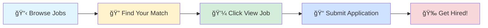

# 🚀 Tech Jobs Board

### Your Gateway to Amazing Career Opportunities

---

## 🎯 Browse by Job Profile

<table>
<tr>
<td align="center" width="25%">

 
<b>1000</b> total positions
</td>
<td align="center" width="25%">

 
<b>1000</b> total positions
</td>
<td align="center" width="25%">

 
<b>1000</b> total positions
</td>
<td align="center" width="25%">

 
<b>1000</b> total positions
</td>
</tr>
</table>

---

## 📊 Data Scientist

> 💼 **1000** positions available

<table>
<thead>
<tr>
<th width="20%">🏢 Company</th>
<th width="35%">💼 Role</th>
<th width="20%">📍 Location</th>
<th width="10%">⏰ Posted</th>
<th width="15%">🔗 Action</th>
</tr>
</thead>
<tbody>
<tr>
<td><a href="https://in.linkedin.com/company/aaizel-international-technologies-pvt-ltd">Aaizel International Technologies Pvt Ltd</a></td>
<td>Senior AI/ML Engineer</td>
<td>📍 Gurugram</td>
<td>Today</td>
<td align="center"></td>
</tr>
<tr>
<td><a href="https://ca.linkedin.com/company/the-autumn-group">The Autumn Group</a></td>
<td>R&D Quality Project Lead and Principal Business Analyst</td>
<td></td>
<td>Today</td>
<td align="center"></td>
</tr>
<tr>
<td><a href="https://www.linkedin.com/company/skillfiedmentor">SkillFied Mentor</a></td>
<td>SQL & Excel Business Analyst Intern</td>
<td>📍 India</td>
<td>Today</td>
<td align="center"></td>
</tr>
<tr>
<td><a href="https://www.linkedin.com/company/algosec">AlgoSec</a></td>
<td>Automation TL, India</td>
<td>📍 Delhi</td>
<td>Today</td>
<td align="center"></td>
</tr>
<tr>
<td><a href="https://www.linkedin.com/company/algosec">AlgoSec</a></td>
<td>Full Stack Automation Developer, India</td>
<td>📍 Delhi</td>
<td>Today</td>
<td align="center"></td>
</tr>
<tr>
<td><a href="https://www.linkedin.com/company/algosec">AlgoSec</a></td>
<td>CloudFlow Automation Developer, India</td>
<td>📍 Delhi</td>
<td>Today</td>
<td align="center"></td>
</tr>
<tr>
<td><a href="https://www.linkedin.com/company/algosec">AlgoSec</a></td>
<td>AlgoNext Automation Developer, India</td>
<td>📍 Delhi</td>
<td>Today</td>
<td align="center"></td>
</tr>
<tr>
<td><a href="https://www.linkedin.com/company/it-services-company2">IT Services Company</a></td>
<td>AI/ML Architect – Generative AI</td>
<td>📍 Chennai</td>
<td>Today</td>
<td align="center"></td>
</tr>
<tr>
<td><a href="https://se.linkedin.com/company/forsvarsmakten">Swedish Armed Forces</a></td>
<td>Systemingenjör</td>
<td></td>
<td>Today</td>
<td align="center"></td>
</tr>
<tr>
<td><a href="https://www.linkedin.com/company/nvidia">NVIDIA</a></td>
<td>Deep Learning Algorithm Engineer, Dynamo - New College Grad 2025</td>
<td></td>
<td>Today</td>
<td align="center"></td>
</tr>
<tr>
<td><a href="https://www.linkedin.com/company/professionalskillhub">Desi Skill Hub</a></td>
<td>AWS Sales Professional</td>
<td>📍 Hyderabad</td>
<td>Today</td>
<td align="center"></td>
</tr>
<tr>
<td><a href="https://uk.linkedin.com/company/hackajob">hackajob</a></td>
<td>Business Analyst-Data Analytics</td>
<td>📍 Gurugram</td>
<td>Today</td>
<td align="center"></td>
</tr>
<tr>
<td><a href="https://ca.linkedin.com/company/td">TD</a></td>
<td>Applied Machine Learning Scientist II, Generative AI (4043)</td>
<td></td>
<td>Today</td>
<td align="center"></td>
</tr>
<tr>
<td><a href="https://www.linkedin.com/company/auctane">Auctane</a></td>
<td>Senior Marketing Analytics Manager</td>
<td></td>
<td>Today</td>
<td align="center"></td>
</tr>
<tr>
<td><a href="https://www.linkedin.com/company/monroe-county">Monroe County</a></td>
<td>Research and Data Analysis Coordinator, prov.</td>
<td></td>
<td>Today</td>
<td align="center"></td>
</tr>
<tr>
<td><a href="https://www.linkedin.com/company/snowflake-computing">Snowflake</a></td>
<td>Principal Software Engineer - Machine Learning</td>
<td></td>
<td>Today</td>
<td align="center"></td>
</tr>
<tr>
<td><a href="https://www.linkedin.com/company/bayone-solutions">BayOne Solutions</a></td>
<td>Network Python  Engineer</td>
<td>📍 India</td>
<td>Today</td>
<td align="center"></td>
</tr>
<tr>
<td><a href="https://www.linkedin.com/company/slalom-consulting">Slalom</a></td>
<td>AI/ML Engineer</td>
<td></td>
<td>Today</td>
<td align="center"></td>
</tr>
<tr>
<td><a href="https://www.linkedin.com/company/slalom-consulting">Slalom</a></td>
<td>AI/ML Engineer</td>
<td></td>
<td>Today</td>
<td align="center"></td>
</tr>
<tr>
<td><a href="https://www.linkedin.com/company/tantus-technologies-inc-">Tantus Technologies, Inc.</a></td>
<td>Test Automation Engineer</td>
<td></td>
<td>Today</td>
<td align="center"></td>
</tr>
<tr>
<td><a href="https://www.linkedin.com/company/bayone-solutions">BayOne Solutions</a></td>
<td>AI/ML Engineer</td>
<td>📍 India</td>
<td>Today</td>
<td align="center"></td>
</tr>
<tr>
<td><a href="https://www.linkedin.com/company/morgan-stanley">Morgan Stanley</a></td>
<td>Assistant Vice President, Client Engagement Analytics</td>
<td></td>
<td>Today</td>
<td align="center"></td>
</tr>
<tr>
<td><a href="https://se.linkedin.com/company/skogsindustrierna">Skogsindustrierna</a></td>
<td>Skogsvårdsbolaget söker Arbetsledare för Skåne</td>
<td></td>
<td>Today</td>
<td align="center"></td>
</tr>
<tr>
<td><a href="https://www.linkedin.com/company/gdit">General Dynamics Information Technology</a></td>
<td>AI/ML Data Engineer</td>
<td></td>
<td>Today</td>
<td align="center"></td>
</tr>
<tr>
<td><a href="https://bd.linkedin.com/company/unicefbangladesh">UNICEF Bangladesh</a></td>
<td>Monitoring Intern (National) , 26 weeks, Accra-Ghana (Onsite)</td>
<td></td>
<td>Today</td>
<td align="center"></td>
</tr>
<tr>
<td><a href="https://www.linkedin.com/company/curaleaf">Curaleaf</a></td>
<td>Lead Analytics Engineer</td>
<td></td>
<td>Today</td>
<td align="center"></td>
</tr>
<tr>
<td><a href="https://www.linkedin.com/company/cognizant">Cognizant</a></td>
<td>Pega Administrator – DevOps & AWS Cloud - 00065844501</td>
<td></td>
<td>Today</td>
<td align="center"></td>
</tr>
<tr>
<td><a href="https://my.linkedin.com/company/mit-academy-sdn-bhd">MIT Academy Sdn Bhd</a></td>
<td>Machine Learning Instructor</td>
<td>📍 Bangalore</td>
<td>Today</td>
<td align="center"></td>
</tr>
<tr>
<td><a href="https://www.linkedin.com/company/mgm-resorts-international">MGM Resorts International</a></td>
<td>Sr Automation Engineer</td>
<td></td>
<td>Today</td>
<td align="center"></td>
</tr>
<tr>
<td><a href="https://www.linkedin.com/company/fasttek">FastTek Global</a></td>
<td>Artificial Intelligence Senior Associate</td>
<td></td>
<td>Today</td>
<td align="center"></td>
</tr>
<tr>
<td><a href="https://www.linkedin.com/company/fasttek">FastTek Global</a></td>
<td>Artificial Intelligence Specialist</td>
<td></td>
<td>Today</td>
<td align="center"></td>
</tr>
<tr>
<td><a href="https://nl.linkedin.com/company/kaiko-ai">kaiko.ai</a></td>
<td>Machine Learning Intern</td>
<td></td>
<td>Today</td>
<td align="center"></td>
</tr>
<tr>
<td><a href="https://www.linkedin.com/company/fuelcycle">Fuel Cycle</a></td>
<td>Senior Python/AI Engineer</td>
<td></td>
<td>Today</td>
<td align="center"></td>
</tr>
<tr>
<td><a href="https://ca.linkedin.com/company/cgi">CGI</a></td>
<td>Python Developer</td>
<td></td>
<td>Today</td>
<td align="center"></td>
</tr>
<tr>
<td>NEC Software Solutions</td>
<td>Java Developer - SSE - Java, Springboot, AWS</td>
<td>📍 Bangalore</td>
<td>Today</td>
<td align="center"></td>
</tr>
<tr>
<td><a href="https://www.linkedin.com/company/bristol-myers-squibb">Bristol Myers Squibb</a></td>
<td>Manager; Manufacturing Optimization Analytics</td>
<td>📍 New Brunswick, NJ</td>
<td>Today</td>
<td align="center"></td>
</tr>
<tr>
<td><a href="https://www.linkedin.com/company/owow-talents">owow</a></td>
<td>AI/ML Engineer</td>
<td>📍 India</td>
<td>Today</td>
<td align="center"></td>
</tr>
<tr>
<td><a href="https://uk.linkedin.com/company/targetjobsuk">targetjobs UK</a></td>
<td>Placement Student – Service Engineering - Digital and Data Analytics</td>
<td></td>
<td>Today</td>
<td align="center"></td>
</tr>
<tr>
<td><a href="https://uk.linkedin.com/company/targetjobsuk">targetjobs UK</a></td>
<td>Placement Student - Data Analytics</td>
<td></td>
<td>Today</td>
<td align="center"></td>
</tr>
<tr>
<td><a href="https://se.linkedin.com/company/bengt-dahlgren-ab">Bengt Dahlgren</a></td>
<td>El-konsult med minst 10 års erfarenhet, är det du?</td>
<td></td>
<td>Today</td>
<td align="center"></td>
</tr>
<tr>
<td><a href="https://www.linkedin.com/school/launchcode/">LaunchCode</a></td>
<td>Data Scientist, Senior TS/SCI</td>
<td></td>
<td>Today</td>
<td align="center"></td>
</tr>
<tr>
<td><a href="https://in.linkedin.com/company/infosys">Infosys</a></td>
<td>AWS Admin And AWS Architect</td>
<td>📍 Pune</td>
<td>Today</td>
<td align="center"></td>
</tr>
<tr>
<td><a href="https://fr.linkedin.com/company/sanofi">Sanofi</a></td>
<td>R&D Global Supply Study Support</td>
<td>📍 Hyderabad</td>
<td>Today</td>
<td align="center"></td>
</tr>
<tr>
<td><a href="https://www.linkedin.com/company/lucidmotors">Lucid Motors</a></td>
<td>Intern, AI/ ML Engineer, Summer 2026</td>
<td></td>
<td>Today</td>
<td align="center"></td>
</tr>
<tr>
<td><a href="https://in.linkedin.com/company/infosys">Infosys</a></td>
<td>Python + AWS Lead</td>
<td>📍 Bangalore</td>
<td>Today</td>
<td align="center"></td>
</tr>
<tr>
<td><a href="https://www.linkedin.com/company/labcorp">Labcorp</a></td>
<td>Lead R&D Data Scientist</td>
<td></td>
<td>Today</td>
<td align="center"></td>
</tr>
<tr>
<td><a href="https://in.linkedin.com/company/infosys">Infosys</a></td>
<td>Automation Testing-JL5 - IHLCP</td>
<td>📍 Bangalore</td>
<td>Today</td>
<td align="center"></td>
</tr>
<tr>
<td><a href="https://in.linkedin.com/company/infosys">Infosys</a></td>
<td>Azure DevOps Consultant</td>
<td>📍 Bangalore</td>
<td>Today</td>
<td align="center"></td>
</tr>
<tr>
<td>JPMorganChase</td>
<td>Quant Analytics Manager</td>
<td>📍 Bangalore</td>
<td>Today</td>
<td align="center"></td>
</tr>
<tr>
<td><a href="https://www.linkedin.com/company/forge-biologics">Forge Biologics</a></td>
<td>Analytical Quality Control, Analyst I (2nd Shift)</td>
<td></td>
<td>Today</td>
<td align="center"></td>
</tr>
<tr>
<td><a href="https://in.linkedin.com/company/infosys">Infosys</a></td>
<td>Python Senior Developer</td>
<td>📍 Chennai</td>
<td>Today</td>
<td align="center"></td>
</tr>
<tr>
<td>JPMorganChase</td>
<td>Manager of Software Engineering - AWS, Java</td>
<td>📍 Hyderabad</td>
<td>Today</td>
<td align="center"></td>
</tr>
<tr>
<td><a href="https://www.linkedin.com/company/lucidmotors">Lucid Motors</a></td>
<td>Intern, Data Analysis, Program Manager - Summer 2026</td>
<td></td>
<td>Today</td>
<td align="center"></td>
</tr>
<tr>
<td><a href="https://www.linkedin.com/company/dairy-queen">Dairy Queen</a></td>
<td>Data Scientist</td>
<td></td>
<td>Today</td>
<td align="center"></td>
</tr>
<tr>
<td><a href="https://www.linkedin.com/company/precoat-metals">Precoat Metals</a></td>
<td>Electrical Controls and Automation Engineer</td>
<td>📍 Weirton, WV</td>
<td>Today</td>
<td align="center"></td>
</tr>
<tr>
<td><a href="https://www.linkedin.com/company/wellmark">Wellmark Blue Cross and Blue Shield</a></td>
<td>Vice President Analytics</td>
<td></td>
<td>Today</td>
<td align="center"></td>
</tr>
<tr>
<td><a href="https://uk.linkedin.com/company/astrazeneca">AstraZeneca</a></td>
<td>Head of Predictive Science, Digital and Automation</td>
<td></td>
<td>Today</td>
<td align="center"></td>
</tr>
<tr>
<td><a href="https://in.linkedin.com/company/infosys">Infosys</a></td>
<td>Infra AI Automation SME</td>
<td>📍 Bangalore</td>
<td>Today</td>
<td align="center"></td>
</tr>
<tr>
<td>JPMorganChase</td>
<td>Statistics/Data Analytics Associate</td>
<td>📍 Bangalore</td>
<td>Today</td>
<td align="center"></td>
</tr>
<tr>
<td><a href="https://uk.linkedin.com/company/targetjobsuk">targetjobs UK</a></td>
<td>R&D Industrial Placement</td>
<td></td>
<td>Today</td>
<td align="center"></td>
</tr>
<tr>
<td><a href="https://www.linkedin.com/company/jobs-via-dice">Jobs via Dice</a></td>
<td>AI / ML Engineer</td>
<td></td>
<td>Today</td>
<td align="center"></td>
</tr>
<tr>
<td><a href="https://www.linkedin.com/company/abglobal">AllianceBernstein</a></td>
<td>Global Analytics Performance Analyst</td>
<td></td>
<td>Today</td>
<td align="center"></td>
</tr>
<tr>
<td><a href="https://uk.linkedin.com/company/tiptopjob">TipTopJob</a></td>
<td>Lead Data Scientist : Remote</td>
<td></td>
<td>Today</td>
<td align="center"></td>
</tr>
<tr>
<td><a href="https://in.linkedin.com/company/infosys">Infosys</a></td>
<td>Azure DevOps - QLTY</td>
<td>📍 Bangalore</td>
<td>Today</td>
<td align="center"></td>
</tr>
<tr>
<td>Antal TECH jobs</td>
<td>Azure Devops Admin</td>
<td>📍 Gurugram</td>
<td>Today</td>
<td align="center"></td>
</tr>
<tr>
<td><a href="https://www.linkedin.com/company/bristol-myers-squibb">Bristol Myers Squibb</a></td>
<td>Machine Learning Scientist, Predictive Biology & AI</td>
<td></td>
<td>Today</td>
<td align="center"></td>
</tr>
<tr>
<td><a href="https://uk.linkedin.com/company/targetjobsuk">targetjobs UK</a></td>
<td>November 2025 Start - Analytics & Sales - Italian/Spanish Speakers</td>
<td></td>
<td>Today</td>
<td align="center"></td>
</tr>
<tr>
<td><a href="https://www.linkedin.com/company/we-are-jobbit">Jobbit</a></td>
<td>R&D Manager - Cosmetic Sector</td>
<td></td>
<td>Today</td>
<td align="center"></td>
</tr>
<tr>
<td>JPMorganChase</td>
<td>Manager of Software Engineering- WDA AWS</td>
<td>📍 Mumbai</td>
<td>Today</td>
<td align="center"></td>
</tr>
<tr>
<td><a href="https://in.linkedin.com/company/infosys">Infosys</a></td>
<td>Analytics Programmers</td>
<td>📍 Delhi</td>
<td>Today</td>
<td align="center"></td>
</tr>
<tr>
<td>JPMorganChase</td>
<td>Software Engineer II JAVA/PYTHON/AWS</td>
<td>📍 Noida</td>
<td>Today</td>
<td align="center"></td>
</tr>
<tr>
<td><a href="https://in.linkedin.com/company/qloron">Qloron Pvt Ltd</a></td>
<td>Python Developer (FastAPI)</td>
<td>📍 Hyderabad</td>
<td>Today</td>
<td align="center"></td>
</tr>
<tr>
<td>STEP One Step Ahead</td>
<td>Sr Automation Anywhere</td>
<td>📍 Thane</td>
<td>Today</td>
<td align="center"></td>
</tr>
<tr>
<td><a href="https://in.linkedin.com/company/bigstep-technologies">BigStep Technologies</a></td>
<td>GCP Certified Developer (Remote)</td>
<td>📍 Gurugram</td>
<td>Today</td>
<td align="center"></td>
</tr>
<tr>
<td>Uplers</td>
<td>ML Engineer</td>
<td>📍 Chennai</td>
<td>Today</td>
<td align="center"></td>
</tr>
<tr>
<td>HCLTech</td>
<td>Weekend drive - Java Springboot+AWS Developer - 27th Sep - Chennai</td>
<td>📍 Chennai</td>
<td>Today</td>
<td align="center"></td>
</tr>
<tr>
<td>HCLTech</td>
<td>Java AWS developer</td>
<td>📍 Chennai</td>
<td>Today</td>
<td align="center"></td>
</tr>
<tr>
<td>RADcube</td>
<td>Backend Developer (Python)</td>
<td>📍 India</td>
<td>Today</td>
<td align="center"></td>
</tr>
<tr>
<td><a href="https://www.linkedin.com/company/smc">SMC</a></td>
<td>Database Administrator - SQL Server</td>
<td>📍 Delhi</td>
<td>Today</td>
<td align="center"></td>
</tr>
<tr>
<td><a href="https://uk.linkedin.com/company/infiniti-research">Infiniti Research Ltd.</a></td>
<td>Infiniti Research - BI Consultant - Data Analytics</td>
<td>📍 Bangalore</td>
<td>Today</td>
<td align="center"></td>
</tr>
<tr>
<td><a href="https://www.linkedin.com/company/atlas-systems">Atlas Systems</a></td>
<td>Atlas Systems - Senior Quality Assurance Automation Engineer</td>
<td>📍 Chennai</td>
<td>Today</td>
<td align="center"></td>
</tr>
<tr>
<td><a href="https://www.linkedin.com/company/thought-frameworks">Thought Frameworks</a></td>
<td>Thought Frameworks - iOS Automation Tester - Java/Appium</td>
<td>📍 Bangalore</td>
<td>Today</td>
<td align="center"></td>
</tr>
<tr>
<td>Peoplefy</td>
<td>Senior Mobile Test Automation Engineer</td>
<td>📍 Pune</td>
<td>Today</td>
<td align="center"></td>
</tr>
<tr>
<td><a href="https://in.linkedin.com/company/loyalytics-ai">Loyalytics AI</a></td>
<td>Senior Data Scientist - eCommerce Analytics</td>
<td>📍 Bangalore</td>
<td>Today</td>
<td align="center"></td>
</tr>
<tr>
<td>GJ Map Solutions Pvt. Ltd.</td>
<td>Senior Python Developer</td>
<td>📍 India</td>
<td>Today</td>
<td align="center"></td>
</tr>
<tr>
<td><a href="https://in.linkedin.com/company/cnr-edtech">CNR EdTech</a></td>
<td>Backend Developer - Python/Odoo</td>
<td>📍 Chennai</td>
<td>Today</td>
<td align="center"></td>
</tr>
<tr>
<td><a href="https://in.linkedin.com/company/yan-it-solutions">YAN IT Solutions Pvt. Ltd.</a></td>
<td>Yan IT Solutions - Cloud Developer - AWS</td>
<td>📍 Pune</td>
<td>Today</td>
<td align="center"></td>
</tr>
<tr>
<td>JPMorganChase</td>
<td>Payments - Analytics & Reporting- Data Scientist Associate</td>
<td>📍 Mumbai</td>
<td>Today</td>
<td align="center"></td>
</tr>
<tr>
<td><a href="https://in.linkedin.com/company/cling-multi-solutions">Cling Multi Solutions</a></td>
<td>GCP Platform Engineer - Python/SQL</td>
<td>📍 Pune</td>
<td>Today</td>
<td align="center"></td>
</tr>
<tr>
<td><a href="https://ae.linkedin.com/company/yash-technologies-middle-east-region">YASH Technologies Middle East</a></td>
<td>Sr. Test Engineer - Automation Testing Job</td>
<td>📍 Pune</td>
<td>Today</td>
<td align="center"></td>
</tr>
<tr>
<td><a href="https://www.linkedin.com/company/gogiggso">Giggso</a></td>
<td>Giggso - AI/ML Engineer - MLOps</td>
<td>📍 Mumbai</td>
<td>Today</td>
<td align="center"></td>
</tr>
<tr>
<td><a href="https://in.linkedin.com/company/synradar">SynRadar</a></td>
<td>Python Developer</td>
<td>📍 Mumbai</td>
<td>Today</td>
<td align="center"></td>
</tr>
<tr>
<td>NTT DATA North America</td>
<td>QA Automation - Digital Solution Consultant Sr. Analyst</td>
<td>📍 Bangalore</td>
<td>Today</td>
<td align="center"></td>
</tr>
<tr>
<td>NTT DATA North America</td>
<td>Business Consulting-Cloud Security Consultant (Azure)</td>
<td>📍 Bangalore</td>
<td>Today</td>
<td align="center"></td>
</tr>
<tr>
<td><a href="https://in.linkedin.com/company/hirenza-pvt-ltd">Hirenza</a></td>
<td>Python Developer</td>
<td>📍 India</td>
<td>Today</td>
<td align="center"></td>
</tr>
<tr>
<td><a href="https://za.linkedin.com/company/the-it-firm">The IT Firm</a></td>
<td>Senior SQL Developer</td>
<td>📍 Bangalore</td>
<td>Today</td>
<td align="center"></td>
</tr>
<tr>
<td>Aptiv</td>
<td>Analytics Lead</td>
<td>📍 Pune</td>
<td>Today</td>
<td align="center"></td>
</tr>
<tr>
<td><a href="https://ae.linkedin.com/company/yash-technologies-middle-east-region">YASH Technologies Middle East</a></td>
<td>Sr. Data Engineer - AWS+Python+Pyspark Job</td>
<td>📍 India</td>
<td>Today</td>
<td align="center"></td>
</tr>
<tr>
<td>GE HealthCare</td>
<td>Senior Automation Engineer</td>
<td>📍 Bangalore</td>
<td>Today</td>
<td align="center"></td>
</tr>
<tr>
<td><a href="https://in.linkedin.com/company/zimetrics">Zimetrics</a></td>
<td>Zimetrics - AWS Architect</td>
<td>📍 Pune</td>
<td>Today</td>
<td align="center"></td>
</tr>
<tr><td colspan="5" align="center"><i>... and 900 more positions</i></td></tr>
</tbody>
</table>

---

## 💼 Business Analyst

> 💼 **1000** positions available

<table>
<thead>
<tr>
<th width="20%">🏢 Company</th>
<th width="35%">💼 Role</th>
<th width="20%">📍 Location</th>
<th width="10%">⏰ Posted</th>
<th width="15%">🔗 Action</th>
</tr>
</thead>
<tbody>
<tr>
<td><a href="https://ca.linkedin.com/company/the-autumn-group">The Autumn Group</a></td>
<td>R&D Quality Project Lead and Principal Business Analyst</td>
<td></td>
<td>Today</td>
<td align="center"></td>
</tr>
<tr>
<td><a href="https://www.linkedin.com/company/skillfiedmentor">SkillFied Mentor</a></td>
<td>SQL & Excel Business Analyst Intern</td>
<td>📍 India</td>
<td>Today</td>
<td align="center"></td>
</tr>
<tr>
<td><a href="https://www.linkedin.com/company/skillfied-mentor-jobs">Skillfied Mentor Jobs</a></td>
<td>Business Analyst</td>
<td>📍 India</td>
<td>Today</td>
<td align="center"></td>
</tr>
<tr>
<td><a href="https://www.linkedin.com/company/algosec">AlgoSec</a></td>
<td>Automation TL, India</td>
<td>📍 Delhi</td>
<td>Today</td>
<td align="center"></td>
</tr>
<tr>
<td><a href="https://www.linkedin.com/company/algosec">AlgoSec</a></td>
<td>Full Stack Automation Developer, India</td>
<td>📍 Delhi</td>
<td>Today</td>
<td align="center"></td>
</tr>
<tr>
<td><a href="https://www.linkedin.com/company/algosec">AlgoSec</a></td>
<td>CloudFlow Automation Developer, India</td>
<td>📍 Delhi</td>
<td>Today</td>
<td align="center"></td>
</tr>
<tr>
<td><a href="https://www.linkedin.com/company/algosec">AlgoSec</a></td>
<td>AlgoNext Automation Developer, India</td>
<td>📍 Delhi</td>
<td>Today</td>
<td align="center"></td>
</tr>
<tr>
<td><a href="https://www.linkedin.com/company/nextinsight-disc">NextInsight disc</a></td>
<td>Business Analyst</td>
<td></td>
<td>Today</td>
<td align="center"></td>
</tr>
<tr>
<td><a href="https://au.linkedin.com/company/xpt-software-australia">XPT Software Australia</a></td>
<td>Business Analyst With Banking Payment</td>
<td></td>
<td>Today</td>
<td align="center"></td>
</tr>
<tr>
<td><a href="https://www.linkedin.com/company/enago">Enago (Crimson Interactive)</a></td>
<td>Business Analyst</td>
<td>📍 Mumbai</td>
<td>Today</td>
<td align="center"></td>
</tr>
<tr>
<td><a href="https://uk.linkedin.com/company/hackajob">hackajob</a></td>
<td>Business Analyst-Data Analytics</td>
<td>📍 Gurugram</td>
<td>Today</td>
<td align="center"></td>
</tr>
<tr>
<td><a href="https://www.linkedin.com/company/milo's-tea-company-inc-">Milo's Tea Company, Inc.</a></td>
<td>Salesforce Administrator</td>
<td></td>
<td>Today</td>
<td align="center"></td>
</tr>
<tr>
<td><a href="https://www.linkedin.com/company/peppercontent">Pepper Content</a></td>
<td>Business Analyst</td>
<td>📍 Mumbai</td>
<td>Today</td>
<td align="center"></td>
</tr>
<tr>
<td><a href="https://www.linkedin.com/company/auctane">Auctane</a></td>
<td>Senior Marketing Analytics Manager</td>
<td></td>
<td>Today</td>
<td align="center"></td>
</tr>
<tr>
<td><a href="https://www.linkedin.com/company/monroe-county">Monroe County</a></td>
<td>Research and Data Analysis Coordinator, prov.</td>
<td></td>
<td>Today</td>
<td align="center"></td>
</tr>
<tr>
<td><a href="https://do.linkedin.com/company/tuempleord">Tu Empleo RD</a></td>
<td>Trabajo en Oficina – Área de Cobros – Manejo de Excel Requerido</td>
<td></td>
<td>Today</td>
<td align="center"></td>
</tr>
<tr>
<td><a href="https://www.linkedin.com/company/bayone-solutions">BayOne Solutions</a></td>
<td>Network Python  Engineer</td>
<td>📍 India</td>
<td>Today</td>
<td align="center"></td>
</tr>
<tr>
<td><a href="https://www.linkedin.com/company/datamatics">Datamatics</a></td>
<td>Senior Business Analyst</td>
<td></td>
<td>Today</td>
<td align="center"></td>
</tr>
<tr>
<td><a href="https://www.linkedin.com/company/parsons">Parsons Corporation</a></td>
<td>Data/Business Analyst</td>
<td></td>
<td>Today</td>
<td align="center"></td>
</tr>
<tr>
<td><a href="https://www.linkedin.com/company/tantus-technologies-inc-">Tantus Technologies, Inc.</a></td>
<td>Test Automation Engineer</td>
<td></td>
<td>Today</td>
<td align="center"></td>
</tr>
<tr>
<td><a href="https://se.linkedin.com/company/skf">SKF Group</a></td>
<td>Business Analyst</td>
<td>📍 Blue Bell, PA</td>
<td>Today</td>
<td align="center"></td>
</tr>
<tr>
<td><a href="https://www.linkedin.com/company/morgan-stanley">Morgan Stanley</a></td>
<td>Assistant Vice President, Client Engagement Analytics</td>
<td></td>
<td>Today</td>
<td align="center"></td>
</tr>
<tr>
<td><a href="https://www.linkedin.com/company/curaleaf">Curaleaf</a></td>
<td>Lead Analytics Engineer</td>
<td></td>
<td>Today</td>
<td align="center"></td>
</tr>
<tr>
<td><a href="https://www.linkedin.com/company/mgm-resorts-international">MGM Resorts International</a></td>
<td>Sr Automation Engineer</td>
<td></td>
<td>Today</td>
<td align="center"></td>
</tr>
<tr>
<td><a href="https://www.linkedin.com/company/fuelcycle">Fuel Cycle</a></td>
<td>Senior Python/AI Engineer</td>
<td></td>
<td>Today</td>
<td align="center"></td>
</tr>
<tr>
<td><a href="https://ca.linkedin.com/company/cgi">CGI</a></td>
<td>Python Developer</td>
<td></td>
<td>Today</td>
<td align="center"></td>
</tr>
<tr>
<td><a href="https://ca.linkedin.com/company/smsoftwaresolutionsinc">S M Software Solutions Inc</a></td>
<td>RQ09773 - Business Analyst - Senior</td>
<td></td>
<td>Today</td>
<td align="center"></td>
</tr>
<tr>
<td><a href="https://www.linkedin.com/company/bristol-myers-squibb">Bristol Myers Squibb</a></td>
<td>Manager; Manufacturing Optimization Analytics</td>
<td>📍 New Brunswick, NJ</td>
<td>Today</td>
<td align="center"></td>
</tr>
<tr>
<td><a href="https://uk.linkedin.com/company/targetjobsuk">targetjobs UK</a></td>
<td>Placement Student – Service Engineering - Digital and Data Analytics</td>
<td></td>
<td>Today</td>
<td align="center"></td>
</tr>
<tr>
<td><a href="https://in.linkedin.com/company/infosys">Infosys</a></td>
<td>Salesforce Technology Lead/Consultant</td>
<td>📍 Bangalore</td>
<td>Today</td>
<td align="center"></td>
</tr>
<tr>
<td><a href="https://uk.linkedin.com/company/targetjobsuk">targetjobs UK</a></td>
<td>Placement Student - Data Analytics</td>
<td></td>
<td>Today</td>
<td align="center"></td>
</tr>
<tr>
<td><a href="https://vn.linkedin.com/company/giaohangtietkiem-vn">GHTK</a></td>
<td>[HN] Business Analyst</td>
<td></td>
<td>Today</td>
<td align="center"></td>
</tr>
<tr>
<td><a href="https://in.linkedin.com/company/infosys">Infosys</a></td>
<td>Python + AWS Lead</td>
<td>📍 Bangalore</td>
<td>Today</td>
<td align="center"></td>
</tr>
<tr>
<td><a href="https://in.linkedin.com/company/infosys">Infosys</a></td>
<td>Consultant - Business Consulting (Telecom, OSS/BSS)</td>
<td>📍 Pune</td>
<td>Today</td>
<td align="center"></td>
</tr>
<tr>
<td><a href="https://in.linkedin.com/company/infosys">Infosys</a></td>
<td>Automation Testing-JL5 - IHLCP</td>
<td>📍 Bangalore</td>
<td>Today</td>
<td align="center"></td>
</tr>
<tr>
<td><a href="https://www.linkedin.com/company/zs-associates">ZS</a></td>
<td>Business Technology Solutions Manager- Salesforce Delivery</td>
<td>📍 Pune</td>
<td>Today</td>
<td align="center"></td>
</tr>
<tr>
<td>JPMorganChase</td>
<td>Quant Analytics Manager</td>
<td>📍 Bangalore</td>
<td>Today</td>
<td align="center"></td>
</tr>
<tr>
<td><a href="https://www.linkedin.com/company/forge-biologics">Forge Biologics</a></td>
<td>Analytical Quality Control, Analyst I (2nd Shift)</td>
<td></td>
<td>Today</td>
<td align="center"></td>
</tr>
<tr>
<td><a href="https://in.linkedin.com/company/infosys">Infosys</a></td>
<td>Python Senior Developer</td>
<td>📍 Chennai</td>
<td>Today</td>
<td align="center"></td>
</tr>
<tr>
<td><a href="https://in.linkedin.com/company/infosys">Infosys</a></td>
<td>Consultant - Business Consulting (Consumer Retail & Logistics)</td>
<td>📍 Bangalore</td>
<td>Today</td>
<td align="center"></td>
</tr>
<tr>
<td><a href="https://www.linkedin.com/company/lucidmotors">Lucid Motors</a></td>
<td>Intern, Data Analysis, Program Manager - Summer 2026</td>
<td></td>
<td>Today</td>
<td align="center"></td>
</tr>
<tr>
<td><a href="https://www.linkedin.com/company/bunge">Bunge</a></td>
<td>Analista de RH Júnior - Temporário (Excelência Ops/Análise de Dados)</td>
<td></td>
<td>Today</td>
<td align="center"></td>
</tr>
<tr>
<td><a href="https://www.linkedin.com/company/precoat-metals">Precoat Metals</a></td>
<td>Electrical Controls and Automation Engineer</td>
<td>📍 Weirton, WV</td>
<td>Today</td>
<td align="center"></td>
</tr>
<tr>
<td><a href="https://www.linkedin.com/company/wellmark">Wellmark Blue Cross and Blue Shield</a></td>
<td>Vice President Analytics</td>
<td></td>
<td>Today</td>
<td align="center"></td>
</tr>
<tr>
<td><a href="https://uk.linkedin.com/company/astrazeneca">AstraZeneca</a></td>
<td>Head of Predictive Science, Digital and Automation</td>
<td></td>
<td>Today</td>
<td align="center"></td>
</tr>
<tr>
<td><a href="https://in.linkedin.com/company/infosys">Infosys</a></td>
<td>Infra AI Automation SME</td>
<td>📍 Bangalore</td>
<td>Today</td>
<td align="center"></td>
</tr>
<tr>
<td>JPMorganChase</td>
<td>Statistics/Data Analytics Associate</td>
<td>📍 Bangalore</td>
<td>Today</td>
<td align="center"></td>
</tr>
<tr>
<td>Nixora Group</td>
<td>Scrum Master / Systems Analyst</td>
<td>📍 Bangalore</td>
<td>Today</td>
<td align="center"></td>
</tr>
<tr>
<td><a href="https://www.linkedin.com/company/abglobal">AllianceBernstein</a></td>
<td>Global Analytics Performance Analyst</td>
<td></td>
<td>Today</td>
<td align="center"></td>
</tr>
<tr>
<td>TribolaTech Inc</td>
<td>Technical APM Business Analyst with Orbus infinity</td>
<td>📍 India</td>
<td>Today</td>
<td align="center"></td>
</tr>
<tr>
<td><a href="https://uk.linkedin.com/company/targetjobsuk">targetjobs UK</a></td>
<td>November 2025 Start - Analytics & Sales - Italian/Spanish Speakers</td>
<td></td>
<td>Today</td>
<td align="center"></td>
</tr>
<tr>
<td>Particleblack</td>
<td>Senior Business Analyst</td>
<td>📍 Chennai</td>
<td>Today</td>
<td align="center"></td>
</tr>
<tr>
<td>Valtech</td>
<td>Business Analyst (Xstore)</td>
<td>📍 Bangalore</td>
<td>Today</td>
<td align="center"></td>
</tr>
<tr>
<td><a href="https://in.linkedin.com/company/infosys">Infosys</a></td>
<td>Project Management - Finacle Technology</td>
<td>📍 Bangalore</td>
<td>Today</td>
<td align="center"></td>
</tr>
<tr>
<td><a href="https://in.linkedin.com/company/infosys">Infosys</a></td>
<td>Analytics Programmers</td>
<td>📍 Delhi</td>
<td>Today</td>
<td align="center"></td>
</tr>
<tr>
<td>LifeWall</td>
<td>Project Management Intern</td>
<td>📍 Delhi</td>
<td>Today</td>
<td align="center"></td>
</tr>
<tr>
<td>JPMorganChase</td>
<td>Software Engineer II JAVA/PYTHON/AWS</td>
<td>📍 Noida</td>
<td>Today</td>
<td align="center"></td>
</tr>
<tr>
<td>LifeWall</td>
<td>Project Management Intern</td>
<td>📍 Delhi</td>
<td>Today</td>
<td align="center"></td>
</tr>
<tr>
<td>LifeWall</td>
<td>Project Management Intern</td>
<td>📍 Delhi</td>
<td>Today</td>
<td align="center"></td>
</tr>
<tr>
<td><a href="https://in.linkedin.com/company/qloron">Qloron Pvt Ltd</a></td>
<td>Python Developer (FastAPI)</td>
<td>📍 Hyderabad</td>
<td>Today</td>
<td align="center"></td>
</tr>
<tr>
<td>STEP One Step Ahead</td>
<td>Sr Automation Anywhere</td>
<td>📍 Thane</td>
<td>Today</td>
<td align="center"></td>
</tr>
<tr>
<td>Zensar Technologies</td>
<td>IVR Business Analyst</td>
<td>📍 Pune</td>
<td>Today</td>
<td align="center"></td>
</tr>
<tr>
<td>Awign</td>
<td>Sr. Business Analyst</td>
<td>📍 India</td>
<td>Today</td>
<td align="center"></td>
</tr>
<tr>
<td>Accolite</td>
<td>Salesforce QA</td>
<td>📍 Chennai</td>
<td>Today</td>
<td align="center"></td>
</tr>
<tr>
<td>Accenture services Pvt Ltd</td>
<td>Business Process Designer</td>
<td>📍 Mumbai</td>
<td>Today</td>
<td align="center"></td>
</tr>
<tr>
<td>Setoo</td>
<td>Business Analyst Intern</td>
<td>📍 Pune</td>
<td>Today</td>
<td align="center"></td>
</tr>
<tr>
<td>NTT DATA North America</td>
<td>IT Project Management Advisor</td>
<td>📍 Chennai</td>
<td>Today</td>
<td align="center"></td>
</tr>
<tr>
<td>JPMorganChase</td>
<td>Product Development Business Analyst</td>
<td>📍 Bangalore</td>
<td>Today</td>
<td align="center"></td>
</tr>
<tr>
<td>Meta</td>
<td>Application Manager, Salesforce Service Cloud</td>
<td>📍 Bangalore</td>
<td>Today</td>
<td align="center"></td>
</tr>
<tr>
<td>Elanco</td>
<td>Business Process Analyst - Supply Chain</td>
<td>📍 Bangalore</td>
<td>Today</td>
<td align="center"></td>
</tr>
<tr>
<td>RADcube</td>
<td>Backend Developer (Python)</td>
<td>📍 India</td>
<td>Today</td>
<td align="center"></td>
</tr>
<tr>
<td><a href="https://www.linkedin.com/company/smc">SMC</a></td>
<td>Database Administrator - SQL Server</td>
<td>📍 Delhi</td>
<td>Today</td>
<td align="center"></td>
</tr>
<tr>
<td><a href="https://uk.linkedin.com/company/infiniti-research">Infiniti Research Ltd.</a></td>
<td>Infiniti Research - BI Consultant - Data Analytics</td>
<td>📍 Bangalore</td>
<td>Today</td>
<td align="center"></td>
</tr>
<tr>
<td><a href="https://www.linkedin.com/company/atlas-systems">Atlas Systems</a></td>
<td>Atlas Systems - Senior Quality Assurance Automation Engineer</td>
<td>📍 Chennai</td>
<td>Today</td>
<td align="center"></td>
</tr>
<tr>
<td><a href="https://www.linkedin.com/company/thought-frameworks">Thought Frameworks</a></td>
<td>Thought Frameworks - iOS Automation Tester - Java/Appium</td>
<td>📍 Bangalore</td>
<td>Today</td>
<td align="center"></td>
</tr>
<tr>
<td>Peoplefy</td>
<td>Senior Mobile Test Automation Engineer</td>
<td>📍 Pune</td>
<td>Today</td>
<td align="center"></td>
</tr>
<tr>
<td><a href="https://in.linkedin.com/company/loyalytics-ai">Loyalytics AI</a></td>
<td>Senior Data Scientist - eCommerce Analytics</td>
<td>📍 Bangalore</td>
<td>Today</td>
<td align="center"></td>
</tr>
<tr>
<td>GJ Map Solutions Pvt. Ltd.</td>
<td>Senior Python Developer</td>
<td>📍 India</td>
<td>Today</td>
<td align="center"></td>
</tr>
<tr>
<td><a href="https://in.linkedin.com/company/cnr-edtech">CNR EdTech</a></td>
<td>Backend Developer - Python/Odoo</td>
<td>📍 Chennai</td>
<td>Today</td>
<td align="center"></td>
</tr>
<tr>
<td>JPMorganChase</td>
<td>Payments - Analytics & Reporting- Data Scientist Associate</td>
<td>📍 Mumbai</td>
<td>Today</td>
<td align="center"></td>
</tr>
<tr>
<td><a href="https://in.linkedin.com/company/cling-multi-solutions">Cling Multi Solutions</a></td>
<td>GCP Platform Engineer - Python/SQL</td>
<td>📍 Pune</td>
<td>Today</td>
<td align="center"></td>
</tr>
<tr>
<td><a href="https://ae.linkedin.com/company/yash-technologies-middle-east-region">YASH Technologies Middle East</a></td>
<td>Sr. Test Engineer - Automation Testing Job</td>
<td>📍 Pune</td>
<td>Today</td>
<td align="center"></td>
</tr>
<tr>
<td>Talentoj</td>
<td>Business Analyst</td>
<td>📍 Bangalore</td>
<td>Today</td>
<td align="center"></td>
</tr>
<tr>
<td>Accenture services Pvt Ltd</td>
<td>Business Process Designer</td>
<td>📍 Coimbatore</td>
<td>Today</td>
<td align="center"></td>
</tr>
<tr>
<td>NTT DATA North America</td>
<td>IT Project Management Specialist</td>
<td>📍 Bangalore</td>
<td>Today</td>
<td align="center"></td>
</tr>
<tr>
<td><a href="https://in.linkedin.com/company/synradar">SynRadar</a></td>
<td>Python Developer</td>
<td>📍 Mumbai</td>
<td>Today</td>
<td align="center"></td>
</tr>
<tr>
<td>NTT DATA North America</td>
<td>QA Automation - Digital Solution Consultant Sr. Analyst</td>
<td>📍 Bangalore</td>
<td>Today</td>
<td align="center"></td>
</tr>
<tr>
<td>NTT DATA North America</td>
<td>Business Consulting-Cloud Security Consultant (Azure)</td>
<td>📍 Bangalore</td>
<td>Today</td>
<td align="center"></td>
</tr>
<tr>
<td><a href="https://in.linkedin.com/company/hirenza-pvt-ltd">Hirenza</a></td>
<td>Python Developer</td>
<td>📍 India</td>
<td>Today</td>
<td align="center"></td>
</tr>
<tr>
<td>NTT DATA North America</td>
<td>Data Governance/Management Business Consultant</td>
<td>📍 Bangalore</td>
<td>Today</td>
<td align="center"></td>
</tr>
<tr>
<td><a href="https://za.linkedin.com/company/the-it-firm">The IT Firm</a></td>
<td>Senior SQL Developer</td>
<td>📍 Bangalore</td>
<td>Today</td>
<td align="center"></td>
</tr>
<tr>
<td>Aptiv</td>
<td>Analytics Lead</td>
<td>📍 Pune</td>
<td>Today</td>
<td align="center"></td>
</tr>
<tr>
<td>Fidelity International</td>
<td>Salesforce Expert Developer</td>
<td>📍 Gurugram</td>
<td>Today</td>
<td align="center"></td>
</tr>
<tr>
<td><a href="https://ae.linkedin.com/company/yash-technologies-middle-east-region">YASH Technologies Middle East</a></td>
<td>Sr. Data Engineer - AWS+Python+Pyspark Job</td>
<td>📍 India</td>
<td>Today</td>
<td align="center"></td>
</tr>
<tr>
<td>dentsu</td>
<td>Business Analyst</td>
<td>📍 Pune</td>
<td>Today</td>
<td align="center"></td>
</tr>
<tr>
<td>GE HealthCare</td>
<td>Senior Automation Engineer</td>
<td>📍 Bangalore</td>
<td>Today</td>
<td align="center"></td>
</tr>
<tr>
<td>Versetti Family Office</td>
<td>Business Analyst</td>
<td>📍 India</td>
<td>Today</td>
<td align="center"></td>
</tr>
<tr>
<td>Valmont Industries, Inc.</td>
<td>IT Business Analyst - Concur</td>
<td>📍 Pune</td>
<td>Today</td>
<td align="center"></td>
</tr>
<tr>
<td><a href="https://in.linkedin.com/company/spider-innovative-technologies">Spider Innovations</a></td>
<td>Project Management Internship in Hyderabad</td>
<td>📍 Hyderabad</td>
<td>Today</td>
<td align="center"></td>
</tr>
<tr>
<td>NTT DATA North America</td>
<td>Business Analyst - Data</td>
<td>📍 Bangalore</td>
<td>Today</td>
<td align="center"></td>
</tr>
<tr><td colspan="5" align="center"><i>... and 900 more positions</i></td></tr>
</tbody>
</table>

---

## 🚀 Product Manager

> 💼 **1000** positions available

<table>
<thead>
<tr>
<th width="20%">🏢 Company</th>
<th width="35%">💼 Role</th>
<th width="20%">📍 Location</th>
<th width="10%">⏰ Posted</th>
<th width="15%">🔗 Action</th>
</tr>
</thead>
<tbody>
<tr>
<td><a href="https://www.linkedin.com/company/csg-">CSG</a></td>
<td>Product Support Analyst II</td>
<td></td>
<td>Today</td>
<td align="center"></td>
</tr>
<tr>
<td><a href="https://www.linkedin.com/company/bluecrestliving">Bluecrest Living</a></td>
<td>Senior Analyst - Real Estate Credit and Portfolio Management</td>
<td></td>
<td>Today</td>
<td align="center"></td>
</tr>
<tr>
<td><a href="https://www.linkedin.com/company/nuvologic">NuvoLogic Consulting</a></td>
<td>Financial Management Consultant</td>
<td></td>
<td>Today</td>
<td align="center"></td>
</tr>
<tr>
<td><a href="https://be.linkedin.com/company/jobgether">Jobgether</a></td>
<td>Product Manager, North America</td>
<td></td>
<td>Today</td>
<td align="center"></td>
</tr>
<tr>
<td><a href="https://www.linkedin.com/company/skillfiedmentor">SkillFied Mentor</a></td>
<td>SQL & Excel Business Analyst Intern</td>
<td>📍 India</td>
<td>Today</td>
<td align="center"></td>
</tr>
<tr>
<td><a href="https://www.linkedin.com/company/algosec">AlgoSec</a></td>
<td>Automation TL, India</td>
<td>📍 Delhi</td>
<td>Today</td>
<td align="center"></td>
</tr>
<tr>
<td><a href="https://www.linkedin.com/company/algosec">AlgoSec</a></td>
<td>Full Stack Automation Developer, India</td>
<td>📍 Delhi</td>
<td>Today</td>
<td align="center"></td>
</tr>
<tr>
<td><a href="https://www.linkedin.com/company/algosec">AlgoSec</a></td>
<td>CloudFlow Automation Developer, India</td>
<td>📍 Delhi</td>
<td>Today</td>
<td align="center"></td>
</tr>
<tr>
<td><a href="https://www.linkedin.com/company/algosec">AlgoSec</a></td>
<td>AlgoNext Automation Developer, India</td>
<td>📍 Delhi</td>
<td>Today</td>
<td align="center"></td>
</tr>
<tr>
<td><a href="https://nl.linkedin.com/company/afas-software">AFAS Software</a></td>
<td>Product specialist</td>
<td></td>
<td>Today</td>
<td align="center"></td>
</tr>
<tr>
<td><a href="https://www.linkedin.com/company/amazon">Amazon</a></td>
<td>Senior Product Manager - Tech, Applied Intelligence</td>
<td></td>
<td>Today</td>
<td align="center"></td>
</tr>
<tr>
<td><a href="https://uk.linkedin.com/company/hackajob">hackajob</a></td>
<td>Product Manager - Voice Recording</td>
<td></td>
<td>Today</td>
<td align="center"></td>
</tr>
<tr>
<td><a href="https://www.linkedin.com/company/sprig-official">Sprig</a></td>
<td>Senior Product Designer, AI</td>
<td></td>
<td>Today</td>
<td align="center"></td>
</tr>
<tr>
<td><a href="https://www.linkedin.com/company/cable-one">Cable ONE</a></td>
<td>Manager, Product Management-Lifestyle & Entertainment</td>
<td></td>
<td>Today</td>
<td align="center"></td>
</tr>
<tr>
<td><a href="https://www.linkedin.com/company/amazon">Amazon</a></td>
<td>Senior Product Manager, Amazon Freight</td>
<td></td>
<td>Today</td>
<td align="center"></td>
</tr>
<tr>
<td><a href="https://www.linkedin.com/company/sigmatech">Sigmatech</a></td>
<td>Information Management Officer</td>
<td></td>
<td>Today</td>
<td align="center"></td>
</tr>
<tr>
<td><a href="https://www.linkedin.com/company/blue-shield-of-california">Blue Shield of California</a></td>
<td>Product Manager, Consultant</td>
<td></td>
<td>Today</td>
<td align="center"></td>
</tr>
<tr>
<td><a href="https://uk.linkedin.com/company/hackajob">hackajob</a></td>
<td>Business Analyst-Data Analytics</td>
<td>📍 Gurugram</td>
<td>Today</td>
<td align="center"></td>
</tr>
<tr>
<td><a href="https://www.linkedin.com/company/auctane">Auctane</a></td>
<td>Senior Marketing Analytics Manager</td>
<td></td>
<td>Today</td>
<td align="center"></td>
</tr>
<tr>
<td><a href="https://in.linkedin.com/company/tata-consultancy-services">Tata Consultancy Services</a></td>
<td>Sap Materials Management Consultant</td>
<td>📍 Bangalore</td>
<td>Today</td>
<td align="center"></td>
</tr>
<tr>
<td><a href="https://in.linkedin.com/company/tata-consultancy-services">Tata Consultancy Services</a></td>
<td>Sap Materials Management Consultant</td>
<td>📍 Mumbai</td>
<td>Today</td>
<td align="center"></td>
</tr>
<tr>
<td><a href="https://www.linkedin.com/company/monroe-county">Monroe County</a></td>
<td>Research and Data Analysis Coordinator, prov.</td>
<td></td>
<td>Today</td>
<td align="center"></td>
</tr>
<tr>
<td><a href="https://www.linkedin.com/company/buyers-edge-platform">Buyers Edge Platform</a></td>
<td>Product Manager</td>
<td></td>
<td>Today</td>
<td align="center"></td>
</tr>
<tr>
<td><a href="https://www.linkedin.com/company/amazon-web-services">Amazon Web Services (AWS)</a></td>
<td>Customer Solutions Manager (ISVs), Customer Solutions Management</td>
<td></td>
<td>Today</td>
<td align="center"></td>
</tr>
<tr>
<td><a href="https://www.linkedin.com/company/tantus-technologies-inc-">Tantus Technologies, Inc.</a></td>
<td>Test Automation Engineer</td>
<td></td>
<td>Today</td>
<td align="center"></td>
</tr>
<tr>
<td><a href="https://www.linkedin.com/company/t-mobile">T-Mobile</a></td>
<td>Product Manager, Care and Retail Experience</td>
<td></td>
<td>Today</td>
<td align="center"></td>
</tr>
<tr>
<td><a href="https://www.linkedin.com/company/morgan-stanley">Morgan Stanley</a></td>
<td>Assistant Vice President, Client Engagement Analytics</td>
<td></td>
<td>Today</td>
<td align="center"></td>
</tr>
<tr>
<td><a href="https://et.linkedin.com/company/temer-realestate">Temer Properties</a></td>
<td>Product Owner</td>
<td></td>
<td>Today</td>
<td align="center"></td>
</tr>
<tr>
<td><a href="https://www.linkedin.com/company/un-women">UN Women</a></td>
<td>Financial Management Consultant</td>
<td>📍 Home, KS</td>
<td>Today</td>
<td align="center"></td>
</tr>
<tr>
<td><a href="https://www.linkedin.com/company/skipwithjoy">Skip</a></td>
<td>Product Design Engineer</td>
<td></td>
<td>Today</td>
<td align="center"></td>
</tr>
<tr>
<td><a href="https://uk.linkedin.com/company/axahealth">AXA Health</a></td>
<td>Product Test Engineer</td>
<td></td>
<td>Today</td>
<td align="center"></td>
</tr>
<tr>
<td><a href="https://www.linkedin.com/company/curaleaf">Curaleaf</a></td>
<td>Lead Analytics Engineer</td>
<td></td>
<td>Today</td>
<td align="center"></td>
</tr>
<tr>
<td><a href="https://www.linkedin.com/company/achievecareers">Achieve</a></td>
<td>Product Designer</td>
<td></td>
<td>Today</td>
<td align="center"></td>
</tr>
<tr>
<td><a href="https://www.linkedin.com/company/mgm-resorts-international">MGM Resorts International</a></td>
<td>Sr Automation Engineer</td>
<td></td>
<td>Today</td>
<td align="center"></td>
</tr>
<tr>
<td><a href="https://www.linkedin.com/company/learn-to-live-llc">Learn to Live, Inc.</a></td>
<td>Digital Product Manager</td>
<td></td>
<td>Today</td>
<td align="center"></td>
</tr>
<tr>
<td><a href="https://www.linkedin.com/company/machindustries">Mach Industries</a></td>
<td>Product Associate</td>
<td>📍 Huntington Beach, CA</td>
<td>Today</td>
<td align="center"></td>
</tr>
<tr>
<td>Deltek</td>
<td>Product Manager</td>
<td>📍 India</td>
<td>Today</td>
<td align="center"></td>
</tr>
<tr>
<td><a href="https://www.linkedin.com/company/corpay">Corpay</a></td>
<td>Director, Product Management</td>
<td></td>
<td>Today</td>
<td align="center"></td>
</tr>
<tr>
<td><a href="https://www.linkedin.com/company/bristol-myers-squibb">Bristol Myers Squibb</a></td>
<td>Manager; Manufacturing Optimization Analytics</td>
<td>📍 New Brunswick, NJ</td>
<td>Today</td>
<td align="center"></td>
</tr>
<tr>
<td><a href="https://uk.linkedin.com/company/targetjobsuk">targetjobs UK</a></td>
<td>Placement Student – Service Engineering - Digital and Data Analytics</td>
<td></td>
<td>Today</td>
<td align="center"></td>
</tr>
<tr>
<td><a href="https://uk.linkedin.com/company/targetjobsuk">targetjobs UK</a></td>
<td>Placement Student - Data Analytics</td>
<td></td>
<td>Today</td>
<td align="center"></td>
</tr>
<tr>
<td><a href="https://ca.linkedin.com/company/hopper">Hopper</a></td>
<td>Senior Product Manager, Supply</td>
<td></td>
<td>Today</td>
<td align="center"></td>
</tr>
<tr>
<td><a href="https://www.linkedin.com/company/marine-credit-union">Marine Credit Union</a></td>
<td>Product Manager</td>
<td></td>
<td>Today</td>
<td align="center"></td>
</tr>
<tr>
<td>Procol</td>
<td>Product Design Intern</td>
<td>📍 Gurugram</td>
<td>Today</td>
<td align="center"></td>
</tr>
<tr>
<td><a href="https://in.linkedin.com/company/infosys">Infosys</a></td>
<td>Automation Testing-JL5 - IHLCP</td>
<td>📍 Bangalore</td>
<td>Today</td>
<td align="center"></td>
</tr>
<tr>
<td><a href="https://uk.linkedin.com/company/targetjobsuk">targetjobs UK</a></td>
<td>Placement Student- New product, Technical Sourcing and Cost</td>
<td></td>
<td>Today</td>
<td align="center"></td>
</tr>
<tr>
<td>JPMorganChase</td>
<td>Associate, Product Delivery</td>
<td>📍 Bangalore</td>
<td>Today</td>
<td align="center"></td>
</tr>
<tr>
<td>JPMorganChase</td>
<td>Quant Analytics Manager</td>
<td>📍 Bangalore</td>
<td>Today</td>
<td align="center"></td>
</tr>
<tr>
<td><a href="https://www.linkedin.com/company/forge-biologics">Forge Biologics</a></td>
<td>Analytical Quality Control, Analyst I (2nd Shift)</td>
<td></td>
<td>Today</td>
<td align="center"></td>
</tr>
<tr>
<td>PALMONAS</td>
<td>Associate Product Manager</td>
<td>📍 Pune</td>
<td>Today</td>
<td align="center"></td>
</tr>
<tr>
<td>Sprinklr</td>
<td>Associate Product Manager</td>
<td>📍 Gurugram</td>
<td>Today</td>
<td align="center"></td>
</tr>
<tr>
<td><a href="https://sg.linkedin.com/company/mandai-wildlife-group">Mandai Wildlife Group</a></td>
<td>Executive (Waste Management), Horticulture - Singapore Zoo</td>
<td></td>
<td>Today</td>
<td align="center"></td>
</tr>
<tr>
<td>JPMorganChase</td>
<td>Product Owner- Content Delivery Services - Associate</td>
<td>📍 Bangalore</td>
<td>Today</td>
<td align="center"></td>
</tr>
<tr>
<td>Momentive Software</td>
<td>Product Owner</td>
<td>📍 Pune</td>
<td>Today</td>
<td align="center"></td>
</tr>
<tr>
<td><a href="https://sg.linkedin.com/company/mandai-wildlife-group">Mandai Wildlife Group</a></td>
<td>Technical Executive, Facilities Management - Indoor Attractions</td>
<td></td>
<td>Today</td>
<td align="center"></td>
</tr>
<tr>
<td><a href="https://www.linkedin.com/company/cai-insights">CAI</a></td>
<td>Product Support Specialist</td>
<td></td>
<td>Today</td>
<td align="center"></td>
</tr>
<tr>
<td><a href="https://www.linkedin.com/company/lucidmotors">Lucid Motors</a></td>
<td>Intern, Data Analysis, Program Manager - Summer 2026</td>
<td></td>
<td>Today</td>
<td align="center"></td>
</tr>
<tr>
<td><a href="https://jp.linkedin.com/company/lixil-global">LIXIL</a></td>
<td>CGI and Product Photo Manager (d/f/m)</td>
<td>📍 Gurugram</td>
<td>Today</td>
<td align="center"></td>
</tr>
<tr>
<td><a href="https://www.linkedin.com/company/achievecareers">Achieve</a></td>
<td>Product Designer</td>
<td></td>
<td>Today</td>
<td align="center"></td>
</tr>
<tr>
<td><a href="https://www.linkedin.com/company/precoat-metals">Precoat Metals</a></td>
<td>Electrical Controls and Automation Engineer</td>
<td>📍 Weirton, WV</td>
<td>Today</td>
<td align="center"></td>
</tr>
<tr>
<td><a href="https://www.linkedin.com/company/wellmark">Wellmark Blue Cross and Blue Shield</a></td>
<td>Vice President Analytics</td>
<td></td>
<td>Today</td>
<td align="center"></td>
</tr>
<tr>
<td><a href="https://www.linkedin.com/company/achievecareers">Achieve</a></td>
<td>Product Designer</td>
<td></td>
<td>Today</td>
<td align="center"></td>
</tr>
<tr>
<td><a href="https://uk.linkedin.com/company/astrazeneca">AstraZeneca</a></td>
<td>Head of Predictive Science, Digital and Automation</td>
<td></td>
<td>Today</td>
<td align="center"></td>
</tr>
<tr>
<td><a href="https://www.linkedin.com/company/taazaa-inc">Taazaa Inc</a></td>
<td>Technical Product Manager</td>
<td>📍 Noida</td>
<td>Today</td>
<td align="center"></td>
</tr>
<tr>
<td><a href="https://dk.linkedin.com/company/landfolk">Landfolk</a></td>
<td>Head of Product</td>
<td></td>
<td>Today</td>
<td align="center"></td>
</tr>
<tr>
<td><a href="https://uk.linkedin.com/company/checkout">Checkout.com</a></td>
<td>Associate, Deal Management</td>
<td></td>
<td>Today</td>
<td align="center"></td>
</tr>
<tr>
<td><a href="https://in.linkedin.com/company/infosys">Infosys</a></td>
<td>Infra AI Automation SME</td>
<td>📍 Bangalore</td>
<td>Today</td>
<td align="center"></td>
</tr>
<tr>
<td>JPMorganChase</td>
<td>Statistics/Data Analytics Associate</td>
<td>📍 Bangalore</td>
<td>Today</td>
<td align="center"></td>
</tr>
<tr>
<td><a href="https://www.linkedin.com/company/gap-inc.-old-navy">Old Navy</a></td>
<td>Manager, Product-to-Market Development Pipeline</td>
<td></td>
<td>Today</td>
<td align="center"></td>
</tr>
<tr>
<td>Nixora Group</td>
<td>Scrum Master / Systems Analyst</td>
<td>📍 Bangalore</td>
<td>Today</td>
<td align="center"></td>
</tr>
<tr>
<td><a href="https://www.linkedin.com/company/abglobal">AllianceBernstein</a></td>
<td>Global Analytics Performance Analyst</td>
<td></td>
<td>Today</td>
<td align="center"></td>
</tr>
<tr>
<td>Google</td>
<td>Product Manager, Partner Platform</td>
<td>📍 Bangalore</td>
<td>Today</td>
<td align="center"></td>
</tr>
<tr>
<td><a href="https://uk.linkedin.com/company/targetjobsuk">targetjobs UK</a></td>
<td>November 2025 Start - Analytics & Sales - Italian/Spanish Speakers</td>
<td></td>
<td>Today</td>
<td align="center"></td>
</tr>
<tr>
<td>JPMorganChase</td>
<td>Product Delivery Manager</td>
<td>📍 Bangalore</td>
<td>Today</td>
<td align="center"></td>
</tr>
<tr>
<td>Marvelloux Design Studio</td>
<td>Sr Product Designer</td>
<td>📍 India</td>
<td>Today</td>
<td align="center"></td>
</tr>
<tr>
<td><a href="https://in.linkedin.com/company/infosys">Infosys</a></td>
<td>Project Management - Finacle Technology</td>
<td>📍 Bangalore</td>
<td>Today</td>
<td align="center"></td>
</tr>
<tr>
<td><a href="https://www.linkedin.com/company/capio-group">Capio Group</a></td>
<td>Product Manager</td>
<td></td>
<td>Today</td>
<td align="center"></td>
</tr>
<tr>
<td>Pfizer</td>
<td>Sr. Associate, Vx Data Product Engineering</td>
<td>📍 Chennai</td>
<td>Today</td>
<td align="center"></td>
</tr>
<tr>
<td><a href="https://in.linkedin.com/company/infosys">Infosys</a></td>
<td>Analytics Programmers</td>
<td>📍 Delhi</td>
<td>Today</td>
<td align="center"></td>
</tr>
<tr>
<td>IDfy</td>
<td>Senior Product Marketing Manager</td>
<td>📍 Mumbai</td>
<td>Today</td>
<td align="center"></td>
</tr>
<tr>
<td>LifeWall</td>
<td>Project Management Intern</td>
<td>📍 Delhi</td>
<td>Today</td>
<td align="center"></td>
</tr>
<tr>
<td>LifeWall</td>
<td>Project Management Intern</td>
<td>📍 Delhi</td>
<td>Today</td>
<td align="center"></td>
</tr>
<tr>
<td>LifeWall</td>
<td>Project Management Intern</td>
<td>📍 Delhi</td>
<td>Today</td>
<td align="center"></td>
</tr>
<tr>
<td>Bank of America</td>
<td>Senior Product Owner - Tech Delivery - GBS IND</td>
<td>📍 Chennai</td>
<td>Today</td>
<td align="center"></td>
</tr>
<tr>
<td>Policybazaar.com</td>
<td>Relationship Management Executive</td>
<td>📍 Mumbai</td>
<td>Today</td>
<td align="center"></td>
</tr>
<tr>
<td><a href="https://www.linkedin.com/company/pax8">Pax8</a></td>
<td>Product Manager - Entry Point</td>
<td></td>
<td>Today</td>
<td align="center"></td>
</tr>
<tr>
<td>RAMKRISHNA PURE FINANCE PRIVATE LIMITED</td>
<td>Product Executive</td>
<td>📍 Mumbai</td>
<td>Today</td>
<td align="center"></td>
</tr>
<tr>
<td>STEP One Step Ahead</td>
<td>Sr Automation Anywhere</td>
<td>📍 Thane</td>
<td>Today</td>
<td align="center"></td>
</tr>
<tr>
<td>Ralph Lauren</td>
<td>Senior Technology Business Management Analyst, SAP Basis</td>
<td>📍 Bangalore</td>
<td>Today</td>
<td align="center"></td>
</tr>
<tr>
<td>Dodo Payments</td>
<td>Product Analyst Intern</td>
<td>📍 Bangalore</td>
<td>Today</td>
<td align="center"></td>
</tr>
<tr>
<td>LifeWall</td>
<td>Management Intern</td>
<td>📍 Delhi</td>
<td>Today</td>
<td align="center"></td>
</tr>
<tr>
<td><a href="https://www.linkedin.com/company/notionhq">Notion</a></td>
<td>Program Specialist, Talent Management</td>
<td></td>
<td>Today</td>
<td align="center"></td>
</tr>
<tr>
<td>LifeWall</td>
<td>Management Intern</td>
<td>📍 Delhi</td>
<td>Today</td>
<td align="center"></td>
</tr>
<tr>
<td>LifeWall</td>
<td>Management Intern</td>
<td>📍 Gurugram</td>
<td>Today</td>
<td align="center"></td>
</tr>
<tr>
<td>LifeWall</td>
<td>Management Intern</td>
<td>📍 Delhi</td>
<td>Today</td>
<td align="center"></td>
</tr>
<tr>
<td><a href="https://in.linkedin.com/company/infosys">Infosys</a></td>
<td>Oracle Warehouse Management System Consultant</td>
<td>📍 Bangalore</td>
<td>Today</td>
<td align="center"></td>
</tr>
<tr>
<td>SCIEX</td>
<td>Technical Product Owner</td>
<td>📍 Bangalore</td>
<td>Today</td>
<td align="center"></td>
</tr>
<tr>
<td>Sprinklr</td>
<td>Product Manager</td>
<td>📍 Gurugram</td>
<td>Today</td>
<td align="center"></td>
</tr>
<tr>
<td>Swaja Robotics</td>
<td>Product Design Intern</td>
<td>📍 Gurugram</td>
<td>Today</td>
<td align="center"></td>
</tr>
<tr>
<td><a href="https://www.linkedin.com/company/house-of-rohl">House of Rohl</a></td>
<td>Luxury Product Consultant (House of Rohl)</td>
<td></td>
<td>Today</td>
<td align="center"></td>
</tr>
<tr><td colspan="5" align="center"><i>... and 900 more positions</i></td></tr>
</tbody>
</table>

---

## 💻 Full Stack Developer

> 💼 **1000** positions available

<table>
<thead>
<tr>
<th width="20%">🏢 Company</th>
<th width="35%">💼 Role</th>
<th width="20%">📍 Location</th>
<th width="10%">⏰ Posted</th>
<th width="15%">🔗 Action</th>
</tr>
</thead>
<tbody>
<tr>
<td><a href="https://be.linkedin.com/company/jobgether">Jobgether</a></td>
<td>React Developer (Remote)</td>
<td></td>
<td>Today</td>
<td align="center"></td>
</tr>
<tr>
<td><a href="https://www.linkedin.com/company/skillfiedmentor">SkillFied Mentor</a></td>
<td>SQL & Excel Business Analyst Intern</td>
<td>📍 India</td>
<td>Today</td>
<td align="center"></td>
</tr>
<tr>
<td><a href="https://www.linkedin.com/company/algosec">AlgoSec</a></td>
<td>Full Stack Automation Developer, India</td>
<td>📍 Delhi</td>
<td>Today</td>
<td align="center"></td>
</tr>
<tr>
<td><a href="https://nl.linkedin.com/company/afas-software">AFAS Software</a></td>
<td>Senior software engineer</td>
<td></td>
<td>Today</td>
<td align="center"></td>
</tr>
<tr>
<td><a href="https://ca.linkedin.com/company/varicent">Varicent</a></td>
<td>Software developer (Remote - Mexico Only)</td>
<td></td>
<td>Today</td>
<td align="center"></td>
</tr>
<tr>
<td><a href="https://www.linkedin.com/company/prime-healthcare">Prime Healthcare</a></td>
<td>Software Developer</td>
<td></td>
<td>Today</td>
<td align="center"></td>
</tr>
<tr>
<td><a href="https://www.linkedin.com/company/professionalskillhub">Desi Skill Hub</a></td>
<td>AWS Sales Professional</td>
<td>📍 Hyderabad</td>
<td>Today</td>
<td align="center"></td>
</tr>
<tr>
<td><a href="https://www.linkedin.com/company/nvidia">NVIDIA</a></td>
<td>Software Engineer - Backend</td>
<td>📍 Bangalore</td>
<td>Today</td>
<td align="center"></td>
</tr>
<tr>
<td><a href="https://uk.linkedin.com/company/hackajob">hackajob</a></td>
<td>Data Software Engineer II</td>
<td></td>
<td>Today</td>
<td align="center"></td>
</tr>
<tr>
<td><a href="https://www.linkedin.com/company/modernai1">Neon Flux</a></td>
<td>소프트웨어 엔지니어 / Software Engineer</td>
<td></td>
<td>Today</td>
<td align="center"></td>
</tr>
<tr>
<td><a href="https://my.linkedin.com/company/aspert-innovations-sdn-bhd">Aspert Innovations Sdn Bhd</a></td>
<td>Software Developer</td>
<td></td>
<td>Today</td>
<td align="center"></td>
</tr>
<tr>
<td><a href="https://www.linkedin.com/company/snowflake-computing">Snowflake</a></td>
<td>Principal Software Engineer - Machine Learning</td>
<td></td>
<td>Today</td>
<td align="center"></td>
</tr>
<tr>
<td><a href="https://www.linkedin.com/company/cnn">CNN</a></td>
<td>Software Engineer II</td>
<td></td>
<td>Today</td>
<td align="center"></td>
</tr>
<tr>
<td><a href="https://www.linkedin.com/company/bayone-solutions">BayOne Solutions</a></td>
<td>Network Python  Engineer</td>
<td>📍 India</td>
<td>Today</td>
<td align="center"></td>
</tr>
<tr>
<td><a href="https://www.linkedin.com/company/amazon">Amazon</a></td>
<td>Software Development Engineer Internship - Winter- 2026 (Canada)</td>
<td></td>
<td>Today</td>
<td align="center"></td>
</tr>
<tr>
<td><a href="https://www.linkedin.com/company/amazon">Amazon</a></td>
<td>Software Development Engineer</td>
<td>📍 Bangalore</td>
<td>Today</td>
<td align="center"></td>
</tr>
<tr>
<td><a href="https://ca.linkedin.com/company/digitifylabs">Digitify Labs</a></td>
<td>Software Developer</td>
<td></td>
<td>Today</td>
<td align="center"></td>
</tr>
<tr>
<td><a href="https://www.linkedin.com/company/guidestone-financial-resources">GuideStone Financial Resources</a></td>
<td>Associate Software Developer</td>
<td></td>
<td>Today</td>
<td align="center"></td>
</tr>
<tr>
<td><a href="https://de.linkedin.com/company/nagarro">Nagarro</a></td>
<td>Senior Java Engineer</td>
<td></td>
<td>Today</td>
<td align="center"></td>
</tr>
<tr>
<td><a href="https://www.linkedin.com/company/bcbst">BlueCross BlueShield of Tennessee</a></td>
<td>Sr. Software Engineer</td>
<td></td>
<td>Today</td>
<td align="center"></td>
</tr>
<tr>
<td><a href="https://www.linkedin.com/company/medtronic">Medtronic</a></td>
<td>Software Engineer II - CRM</td>
<td>📍 Mounds View, MN</td>
<td>Today</td>
<td align="center"></td>
</tr>
<tr>
<td><a href="https://ug.linkedin.com/company/kamatrust-ai">KAMATRUST AI</a></td>
<td>Junior Freelancer Software Developer</td>
<td></td>
<td>Today</td>
<td align="center"></td>
</tr>
<tr>
<td><a href="https://www.linkedin.com/company/cognizant">Cognizant</a></td>
<td>Pega Administrator – DevOps & AWS Cloud - 00065844501</td>
<td></td>
<td>Today</td>
<td align="center"></td>
</tr>
<tr>
<td>Infor</td>
<td>Manager, Software Development (IBMi Series)</td>
<td>📍 Hyderabad</td>
<td>Today</td>
<td align="center"></td>
</tr>
<tr>
<td><a href="https://www.linkedin.com/company/fuelcycle">Fuel Cycle</a></td>
<td>Senior Python/AI Engineer</td>
<td></td>
<td>Today</td>
<td align="center"></td>
</tr>
<tr>
<td><a href="https://ca.linkedin.com/company/stackadapt">StackAdapt</a></td>
<td>Software Engineer, Backend</td>
<td></td>
<td>Today</td>
<td align="center"></td>
</tr>
<tr>
<td><a href="https://ca.linkedin.com/company/cgi">CGI</a></td>
<td>Python Developer</td>
<td></td>
<td>Today</td>
<td align="center"></td>
</tr>
<tr>
<td><a href="https://www.linkedin.com/company/scholarly-software">Scholarly Software</a></td>
<td>Software Engineer</td>
<td></td>
<td>Today</td>
<td align="center"></td>
</tr>
<tr>
<td><a href="https://co.linkedin.com/company/constructora-a2">Constructora A2</a></td>
<td>Vendedor de Software SaaS IA - Agente vendedor</td>
<td></td>
<td>Today</td>
<td align="center"></td>
</tr>
<tr>
<td><a href="https://www.linkedin.com/company/waymo">Waymo</a></td>
<td>2026 Summer Intern, BS/MS, Software Engineering, Commercialization</td>
<td></td>
<td>Today</td>
<td align="center"></td>
</tr>
<tr>
<td>NEC Software Solutions</td>
<td>Java Developer - SSE - Java, Springboot, AWS</td>
<td>📍 Bangalore</td>
<td>Today</td>
<td align="center"></td>
</tr>
<tr>
<td>Uplers</td>
<td>Sr. Software Engineer</td>
<td>📍 India</td>
<td>Today</td>
<td align="center"></td>
</tr>
<tr>
<td><a href="https://ca.linkedin.com/company/smsoftwaresolutionsinc">S M Software Solutions Inc</a></td>
<td>Associate Principal - Software Engineering</td>
<td>📍 Chennai</td>
<td>Today</td>
<td align="center"></td>
</tr>
<tr>
<td><a href="https://ca.linkedin.com/company/smsoftwaresolutionsinc">S M Software Solutions Inc</a></td>
<td>Associate Principal - Software Engineering</td>
<td>📍 Chennai</td>
<td>Today</td>
<td align="center"></td>
</tr>
<tr>
<td><a href="https://ca.linkedin.com/company/smsoftwaresolutionsinc">S M Software Solutions Inc</a></td>
<td>Associate Principal - Software Engineering</td>
<td>📍 Chennai</td>
<td>Today</td>
<td align="center"></td>
</tr>
<tr>
<td><a href="https://ca.linkedin.com/company/smsoftwaresolutionsinc">S M Software Solutions Inc</a></td>
<td>Associate Principal - Software Engineering</td>
<td>📍 Chennai</td>
<td>Today</td>
<td align="center"></td>
</tr>
<tr>
<td><a href="https://ca.linkedin.com/company/smsoftwaresolutionsinc">S M Software Solutions Inc</a></td>
<td>Associate Principal - Software Engineering</td>
<td>📍 Chennai</td>
<td>Today</td>
<td align="center"></td>
</tr>
<tr>
<td><a href="https://ca.linkedin.com/company/smsoftwaresolutionsinc">S M Software Solutions Inc</a></td>
<td>Associate Principal - Software Engineering</td>
<td>📍 Chennai</td>
<td>Today</td>
<td align="center"></td>
</tr>
<tr>
<td><a href="https://ca.linkedin.com/company/smsoftwaresolutionsinc">S M Software Solutions Inc</a></td>
<td>Associate Principal - Software Engineering</td>
<td>📍 Chennai</td>
<td>Today</td>
<td align="center"></td>
</tr>
<tr>
<td><a href="https://ca.linkedin.com/company/smsoftwaresolutionsinc">S M Software Solutions Inc</a></td>
<td>Associate Principal - Software Engineering</td>
<td>📍 Chennai</td>
<td>Today</td>
<td align="center"></td>
</tr>
<tr>
<td><a href="https://ca.linkedin.com/company/smsoftwaresolutionsinc">S M Software Solutions Inc</a></td>
<td>Associate Principal - Software Engineering</td>
<td>📍 Chennai</td>
<td>Today</td>
<td align="center"></td>
</tr>
<tr>
<td><a href="https://de.linkedin.com/company/nagarro">Nagarro</a></td>
<td>Junior Java Engineer</td>
<td></td>
<td>Today</td>
<td align="center"></td>
</tr>
<tr>
<td><a href="https://www.linkedin.com/company/aquila-technology-corp-">Aquila Technology</a></td>
<td>Software Developer</td>
<td></td>
<td>Today</td>
<td align="center"></td>
</tr>
<tr>
<td><a href="https://www.linkedin.com/company/cleargov">ClearGov</a></td>
<td>Sr. Software Engineer (Eastern/Central US Time Zones)</td>
<td></td>
<td>Today</td>
<td align="center"></td>
</tr>
<tr>
<td>Zilter</td>
<td>Software Sales Executive</td>
<td>📍 Mumbai</td>
<td>Today</td>
<td align="center"></td>
</tr>
<tr>
<td><a href="https://in.linkedin.com/company/infosys">Infosys</a></td>
<td>AWS Admin And AWS Architect</td>
<td>📍 Pune</td>
<td>Today</td>
<td align="center"></td>
</tr>
<tr>
<td><a href="https://in.linkedin.com/company/infosys">Infosys</a></td>
<td>Angular Lead</td>
<td>📍 Chennai</td>
<td>Today</td>
<td align="center"></td>
</tr>
<tr>
<td><a href="https://in.linkedin.com/company/infosys">Infosys</a></td>
<td>Python + AWS Lead</td>
<td>📍 Bangalore</td>
<td>Today</td>
<td align="center"></td>
</tr>
<tr>
<td>Caizin</td>
<td>Principal Software Engineer</td>
<td>📍 Pune</td>
<td>Today</td>
<td align="center"></td>
</tr>
<tr>
<td><a href="https://www.linkedin.com/company/pheratech">Pheratech Systems</a></td>
<td>Full Stack and Embedded Software Engineer (Counter UAS)</td>
<td>📍 Claremont, CA</td>
<td>Today</td>
<td align="center"></td>
</tr>
<tr>
<td>Expedia Group</td>
<td>Sr Manager, Software Development</td>
<td>📍 Gurugram</td>
<td>Today</td>
<td align="center"></td>
</tr>
<tr>
<td><a href="https://www.linkedin.com/company/nasuni">Nasuni</a></td>
<td>Software Engineering Manager - Platform (File Systems)</td>
<td>📍 Hyderabad</td>
<td>Today</td>
<td align="center"></td>
</tr>
<tr>
<td><a href="https://ca.linkedin.com/company/smsoftwaresolutionsinc">S M Software Solutions Inc</a></td>
<td>Associate Principal - Software Engineering</td>
<td>📍 Chennai</td>
<td>Today</td>
<td align="center"></td>
</tr>
<tr>
<td><a href="https://ca.linkedin.com/company/smsoftwaresolutionsinc">S M Software Solutions Inc</a></td>
<td>Associate Principal - Software Engineering</td>
<td>📍 Chennai</td>
<td>Today</td>
<td align="center"></td>
</tr>
<tr>
<td><a href="https://ca.linkedin.com/company/smsoftwaresolutionsinc">S M Software Solutions Inc</a></td>
<td>Associate Principal - Software Engineering</td>
<td>📍 Chennai</td>
<td>Today</td>
<td align="center"></td>
</tr>
<tr>
<td><a href="https://ca.linkedin.com/company/smsoftwaresolutionsinc">S M Software Solutions Inc</a></td>
<td>Associate Principal - Software Engineering</td>
<td>📍 Chennai</td>
<td>Today</td>
<td align="center"></td>
</tr>
<tr>
<td><a href="https://ca.linkedin.com/company/smsoftwaresolutionsinc">S M Software Solutions Inc</a></td>
<td>Associate Principal - Software Engineering</td>
<td>📍 Chennai</td>
<td>Today</td>
<td align="center"></td>
</tr>
<tr>
<td><a href="https://ca.linkedin.com/company/smsoftwaresolutionsinc">S M Software Solutions Inc</a></td>
<td>Associate Principal - Software Engineering</td>
<td>📍 Chennai</td>
<td>Today</td>
<td align="center"></td>
</tr>
<tr>
<td><a href="https://in.linkedin.com/company/infosys">Infosys</a></td>
<td>Python Senior Developer</td>
<td>📍 Chennai</td>
<td>Today</td>
<td align="center"></td>
</tr>
<tr>
<td><a href="https://ca.linkedin.com/company/smsoftwaresolutionsinc">S M Software Solutions Inc</a></td>
<td>Associate Principal - Software Engineering</td>
<td>📍 Chennai</td>
<td>Today</td>
<td align="center"></td>
</tr>
<tr>
<td><a href="https://ca.linkedin.com/company/smsoftwaresolutionsinc">S M Software Solutions Inc</a></td>
<td>Associate Principal - Software Engineering</td>
<td>📍 Chennai</td>
<td>Today</td>
<td align="center"></td>
</tr>
<tr>
<td><a href="https://br.linkedin.com/company/inter">Inter</a></td>
<td>SOFTWARE DEVELOPER ANALYST I</td>
<td></td>
<td>Today</td>
<td align="center"></td>
</tr>
<tr>
<td><a href="https://ca.linkedin.com/company/smsoftwaresolutionsinc">S M Software Solutions Inc</a></td>
<td>Associate Principal - Software Engineering</td>
<td>📍 Chennai</td>
<td>Today</td>
<td align="center"></td>
</tr>
<tr>
<td><a href="https://ca.linkedin.com/company/smsoftwaresolutionsinc">S M Software Solutions Inc</a></td>
<td>Associate Principal - Software Engineering</td>
<td>📍 Chennai</td>
<td>Today</td>
<td align="center"></td>
</tr>
<tr>
<td>JPMorganChase</td>
<td>Manager of Software Engineering - AWS, Java</td>
<td>📍 Hyderabad</td>
<td>Today</td>
<td align="center"></td>
</tr>
<tr>
<td><a href="https://ca.linkedin.com/company/smsoftwaresolutionsinc">S M Software Solutions Inc</a></td>
<td>Associate Principal - Software Engineering</td>
<td>📍 Chennai</td>
<td>Today</td>
<td align="center"></td>
</tr>
<tr>
<td><a href="https://ca.linkedin.com/company/smsoftwaresolutionsinc">S M Software Solutions Inc</a></td>
<td>Associate Principal - Software Engineering</td>
<td>📍 Chennai</td>
<td>Today</td>
<td align="center"></td>
</tr>
<tr>
<td><a href="https://ca.linkedin.com/company/smsoftwaresolutionsinc">S M Software Solutions Inc</a></td>
<td>Associate Principal - Software Engineering</td>
<td>📍 Chennai</td>
<td>Today</td>
<td align="center"></td>
</tr>
<tr>
<td><a href="https://ca.linkedin.com/company/smsoftwaresolutionsinc">S M Software Solutions Inc</a></td>
<td>Associate Principal - Software Engineering</td>
<td>📍 Chennai</td>
<td>Today</td>
<td align="center"></td>
</tr>
<tr>
<td><a href="https://ca.linkedin.com/company/smsoftwaresolutionsinc">S M Software Solutions Inc</a></td>
<td>Associate Principal - Software Engineering</td>
<td>📍 Chennai</td>
<td>Today</td>
<td align="center"></td>
</tr>
<tr>
<td><a href="https://ca.linkedin.com/company/smsoftwaresolutionsinc">S M Software Solutions Inc</a></td>
<td>Associate Principal - Software Engineering</td>
<td>📍 Chennai</td>
<td>Today</td>
<td align="center"></td>
</tr>
<tr>
<td><a href="https://ca.linkedin.com/company/smsoftwaresolutionsinc">S M Software Solutions Inc</a></td>
<td>Associate Principal - Software Engineering</td>
<td>📍 Chennai</td>
<td>Today</td>
<td align="center"></td>
</tr>
<tr>
<td><a href="https://ca.linkedin.com/company/smsoftwaresolutionsinc">S M Software Solutions Inc</a></td>
<td>Associate Principal - Software Engineering</td>
<td>📍 Chennai</td>
<td>Today</td>
<td align="center"></td>
</tr>
<tr>
<td><a href="https://www.linkedin.com/company/we-are-jobbit">Jobbit</a></td>
<td>Computer Vision Software Engineer</td>
<td></td>
<td>Today</td>
<td align="center"></td>
</tr>
<tr>
<td><a href="https://in.linkedin.com/company/infosys">Infosys</a></td>
<td>React JS Consultant</td>
<td>📍 Pune</td>
<td>Today</td>
<td align="center"></td>
</tr>
<tr>
<td><a href="https://ca.linkedin.com/company/smsoftwaresolutionsinc">S M Software Solutions Inc</a></td>
<td>Associate Principal - Software Engineering</td>
<td>📍 Chennai</td>
<td>Today</td>
<td align="center"></td>
</tr>
<tr>
<td><a href="https://ca.linkedin.com/company/smsoftwaresolutionsinc">S M Software Solutions Inc</a></td>
<td>Associate Principal - Software Engineering</td>
<td>📍 Chennai</td>
<td>Today</td>
<td align="center"></td>
</tr>
<tr>
<td><a href="https://ca.linkedin.com/company/smsoftwaresolutionsinc">S M Software Solutions Inc</a></td>
<td>Associate Principal - Software Engineering</td>
<td>📍 Chennai</td>
<td>Today</td>
<td align="center"></td>
</tr>
<tr>
<td><a href="https://ae.linkedin.com/company/ccsdae">CCSD</a></td>
<td>Software Engineer</td>
<td></td>
<td>Today</td>
<td align="center"></td>
</tr>
<tr>
<td>PAR Technology</td>
<td>Senior Software Engineer</td>
<td>📍 India</td>
<td>Today</td>
<td align="center"></td>
</tr>
<tr>
<td>Paylocity</td>
<td>Staff Engineer Software, Frontend</td>
<td>📍 Bangalore</td>
<td>Today</td>
<td align="center"></td>
</tr>
<tr>
<td>JPMorganChase</td>
<td>Lead Software Engineer - Security Analyst</td>
<td>📍 Mumbai</td>
<td>Today</td>
<td align="center"></td>
</tr>
<tr>
<td><a href="https://ca.linkedin.com/company/smsoftwaresolutionsinc">S M Software Solutions Inc</a></td>
<td>Associate Principal - Software Engineering</td>
<td>📍 Chennai</td>
<td>Today</td>
<td align="center"></td>
</tr>
<tr>
<td><a href="https://www.linkedin.com/company/digital-auxilius">Digital Auxilius</a></td>
<td>Software Project Coordinator (Evening Shift)</td>
<td></td>
<td>Today</td>
<td align="center"></td>
</tr>
<tr>
<td>Riskonnect, Inc.</td>
<td>Staff Software Developer</td>
<td>📍 India</td>
<td>Today</td>
<td align="center"></td>
</tr>
<tr>
<td>Xminds Infotech Pvt Ltd</td>
<td>Junior Software Developer (Any Technology)</td>
<td>📍 India</td>
<td>Today</td>
<td align="center"></td>
</tr>
<tr>
<td>AutoZone</td>
<td>Drupal/Full Stack Web Developer - Associate Systems Engineer</td>
<td>📍 India</td>
<td>Today</td>
<td align="center"></td>
</tr>
<tr>
<td>Paylocity</td>
<td>Senior Engineer Software, Backend</td>
<td>📍 Bangalore</td>
<td>Today</td>
<td align="center"></td>
</tr>
<tr>
<td>Successive Digital</td>
<td>Solution Architect - Java</td>
<td>📍 Noida</td>
<td>Today</td>
<td align="center"></td>
</tr>
<tr>
<td><a href="https://www.linkedin.com/company/pave">Pave</a></td>
<td>Software Engineer</td>
<td></td>
<td>Today</td>
<td align="center"></td>
</tr>
<tr>
<td>AGT Software Partners</td>
<td>Software Engineer (Java ) (Mid Level Role)</td>
<td>📍 Mumbai</td>
<td>Today</td>
<td align="center"></td>
</tr>
<tr>
<td><a href="https://www.linkedin.com/company/notionhq">Notion</a></td>
<td>Software Engineer, Data Platform</td>
<td></td>
<td>Today</td>
<td align="center"></td>
</tr>
<tr>
<td>Bank of America</td>
<td>Software Engineer II A - GBS IND</td>
<td>📍 Hyderabad</td>
<td>Today</td>
<td align="center"></td>
</tr>
<tr>
<td>JPMorganChase</td>
<td>Manager of Software Engineering- WDA AWS</td>
<td>📍 Mumbai</td>
<td>Today</td>
<td align="center"></td>
</tr>
<tr>
<td>Coditas</td>
<td>Angular Developer</td>
<td>📍 Pune</td>
<td>Today</td>
<td align="center"></td>
</tr>
<tr>
<td>Accolite</td>
<td>Full Stack Java Developer</td>
<td>📍 Chennai</td>
<td>Today</td>
<td align="center"></td>
</tr>
<tr>
<td>JPMorganChase</td>
<td>Software Engineer II JAVA/PYTHON/AWS</td>
<td>📍 Noida</td>
<td>Today</td>
<td align="center"></td>
</tr>
<tr>
<td>AMPLINNO INDIA PVT. LTD.</td>
<td>Java Developer</td>
<td>📍 Mumbai</td>
<td>Today</td>
<td align="center"></td>
</tr>
<tr>
<td><a href="https://www.linkedin.com/company/traziventures">Trazi</a></td>
<td>Front End Engineer</td>
<td></td>
<td>Today</td>
<td align="center"></td>
</tr>
<tr>
<td><a href="https://in.linkedin.com/company/qloron">Qloron Pvt Ltd</a></td>
<td>Python Developer (FastAPI)</td>
<td>📍 Hyderabad</td>
<td>Today</td>
<td align="center"></td>
</tr>
<tr><td colspan="5" align="center"><i>... and 900 more positions</i></td></tr>
</tbody>
</table>

---

## 📈 Statistics

| Metric | Count |
|:-------|------:|
| 📊 Total Listings | **4000** |
| 🌍 Remote Jobs | **661** |
| 📊 Data Scientist | **1000** |
| 💼 Business Analyst | **1000** |
| 🚀 Product Manager | **1000** |
| 💻 Full Stack Developer | **1000** |

---

## 🎯 How to Apply?

### Steps to Apply:
1. 🔍 **Browse** through the positions above
2. 💼 **Click** the "View Job" button on your preferred role
3. 📝 **Complete** the application on our website
4. ✉️ **Wait** for us to review your application
5. 🎉 **Celebrate** when you get the interview call!

---

## 🔔 Stay Updated

### ⭐ Star this repository to receive updates on new job postings!

**This job board is automatically updated every 6 hours**

---

## 💬 Contributing

Found a broken link or want to add a job posting? Feel free to:
- 🐛 Open an issue
- 🔧 Submit a pull request
- 📧 Contact us directly

---

## 🙏 Stay Connected

---

### 📅 Last Updated

**Saturday, October 4, 2025 at 04:51 AM UTC**

---

💼 Jobs aggregated from multiple sources • ⚡ Auto-updated every 6 hours • 🤖 Powered by GitHub Actions

**Made with ❤️ for the Tech Community**

⬆️ [Back to Top](#-tech-jobs-board) ⬆️

