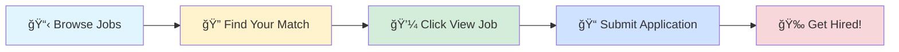

# 🚀 Tech Jobs Board

### Your Gateway to Amazing Career Opportunities

---

## 🎯 Browse by Job Profile

<table>
<tr>
<td align="center" width="25%">

 
<b>1000</b> total positions
</td>
<td align="center" width="25%">

 
<b>1000</b> total positions
</td>
<td align="center" width="25%">

 
<b>1000</b> total positions
</td>
<td align="center" width="25%">

 
<b>1000</b> total positions
</td>
</tr>
</table>

---

## 📊 Data Scientist

> 💼 **1000** positions available

<table>
<thead>
<tr>
<th width="20%">🏢 Company</th>
<th width="35%">💼 Role</th>
<th width="20%">📍 Location</th>
<th width="10%">⏰ Posted</th>
<th width="15%">🔗 Action</th>
</tr>
</thead>
<tbody>
<tr>
<td><a href="https://www.ambitionbox.com/overview/rysun-labs-overview">Rysun Labs</a></td>
<td>Database Lead (SQL)</td>
<td>📍 Ahmedabad</td>
<td>1d ago</td>
<td align="center"></td>
</tr>
<tr>
<td><a href="https://www.ambitionbox.com/overview/kairos-technologies-overview">Kairos Technologies</a></td>
<td>Data Engineer_Python, Pyspark</td>
<td>📍 Hyderabad</td>
<td>1d ago</td>
<td align="center"></td>
</tr>
<tr>
<td><a href="https://www.ambitionbox.com/overview/sun-life-global-solutions-overview">Sun Life Global Solutions</a></td>
<td>Business Analyst - Reporting (SQL, Power BI, Tableau & Python)</td>
<td>📍 Gurugram</td>
<td>1d ago</td>
<td align="center"></td>
</tr>
<tr>
<td><a href="https://www.ambitionbox.com/overview/shadowcast-overview">Shadowcast</a></td>
<td>ML Engineer</td>
<td>📍 Noida</td>
<td>1d ago</td>
<td align="center"></td>
</tr>
<tr>
<td><a href="https://www.ambitionbox.com/overview/idfc-first-bank-overview">IDFC FIRST Bank</a></td>
<td>SDET/ Automation Test Engineer</td>
<td>📍 Chennai</td>
<td>1d ago</td>
<td align="center"></td>
</tr>
<tr>
<td>Talentro</td>
<td>Data Science Trainer</td>
<td>📍 Coimbatore</td>
<td>1d ago</td>
<td align="center"></td>
</tr>
<tr>
<td><a href="https://www.ambitionbox.com/overview/mizuho-global-services-overview">Mizuho Global Services</a></td>
<td>Data Science - AI ML Gen AI</td>
<td>📍 Mumbai</td>
<td>1d ago</td>
<td align="center"></td>
</tr>
<tr>
<td>Cipherstudio</td>
<td>Python Software Developer</td>
<td>📍 Chandigarh(Mohali)</td>
<td>1d ago</td>
<td align="center"></td>
</tr>
<tr>
<td><a href="https://www.ambitionbox.com/overview/mondelez-international-overview">Mondelez</a></td>
<td>Data & Analytics Lead, India</td>
<td>📍 Mumbai</td>
<td>1d ago</td>
<td align="center"></td>
</tr>
<tr>
<td><a href="https://www.ambitionbox.com/overview/persistent-systems-overview">Persistent</a></td>
<td>.Net Azure GenAI</td>
<td>📍 Noida, Pune, Bangalore</td>
<td>1d ago</td>
<td align="center"></td>
</tr>
<tr>
<td><a href="https://www.ambitionbox.com/overview/tcs-overview">Tata Consultancy Services</a></td>
<td>GCP Data Engineer</td>
<td>📍 Bangalore</td>
<td>1d ago</td>
<td align="center"></td>
</tr>
<tr>
<td>Sunrise Solutions</td>
<td>Data Science</td>
<td>📍 Mumbai, Bangalore</td>
<td>1d ago</td>
<td align="center"></td>
</tr>
<tr>
<td><a href="https://www.ambitionbox.com/overview/persistent-systems-overview">Persistent</a></td>
<td>.Net Azure Gen AI Developer/Lead</td>
<td>📍 Pune, Bangalore</td>
<td>1d ago</td>
<td align="center"></td>
</tr>
<tr>
<td>Think People Solutions</td>
<td>TOP MNC Looking For Java / SQL Is Mandatory - TPM/ BRIM / ABAP / RAR</td>
<td>📍 Hyderabad</td>
<td>1d ago</td>
<td align="center"></td>
</tr>
<tr>
<td><a href="https://www.ambitionbox.com/overview/hcl-technologies-overview">HCLTech</a></td>
<td>Data Scientist</td>
<td>📍 Chennai, Bangalore</td>
<td>1d ago</td>
<td align="center"></td>
</tr>
<tr>
<td><a href="https://www.ambitionbox.com/overview/hcl-technologies-overview">HCLTech</a></td>
<td>Python Software Developer</td>
<td>📍 Pune, Hyderabad, Bangalore</td>
<td>1d ago</td>
<td align="center"></td>
</tr>
<tr>
<td><a href="https://www.ambitionbox.com/overview/tech-mahindra-overview">Tech Mahindra</a></td>
<td>GCP Data Engineer</td>
<td>📍 Mumbai</td>
<td>1d ago</td>
<td align="center"></td>
</tr>
<tr>
<td><a href="https://www.ambitionbox.com/overview/globant-overview">Globant</a></td>
<td>Urgently Hiring For Playwright Automation Tester</td>
<td>📍 Pune</td>
<td>1d ago</td>
<td align="center"></td>
</tr>
<tr>
<td><a href="https://www.ambitionbox.com/overview/deutsche-bank-overview">Deutsche Bank</a></td>
<td>Data Automation Engineer, NCT</td>
<td>📍 Bangalore</td>
<td>1d ago</td>
<td align="center"></td>
</tr>
<tr>
<td><a href="https://www.ambitionbox.com/overview/thermo-fisher-scientific-overview">Thermo Fisher Scientific India</a></td>
<td>CDM Programmer-II (Python, R, and SAS Programming)</td>
<td>📍 Bangalore</td>
<td>1d ago</td>
<td align="center"></td>
</tr>
<tr>
<td><a href="https://www.ambitionbox.com/overview/baker-hughes-overview">Baker Hughes</a></td>
<td>Senior Engineer, Customer Order Engineering - Automation & Control</td>
<td>📍 Hyderabad</td>
<td>1d ago</td>
<td align="center"></td>
</tr>
<tr>
<td>Keyrus</td>
<td>Production Support Engineer & DevOps (Java / Azure)</td>
<td>📍 Pune</td>
<td>1d ago</td>
<td align="center"></td>
</tr>
<tr>
<td><a href="https://www.ambitionbox.com/overview/simcorp-overview">Simcorp</a></td>
<td>Principal software engineer (Angular , C# and Azure)</td>
<td>📍 Noida, Hyderabad</td>
<td>1d ago</td>
<td align="center"></td>
</tr>
<tr>
<td><a href="https://www.ambitionbox.com/overview/deloitte-overview">Deloitte Consulting</a></td>
<td>T&T - EAD - Consultant - Automation Testing- Engineering</td>
<td>📍 Bangalore</td>
<td>1d ago</td>
<td align="center"></td>
</tr>
<tr>
<td><a href="https://www.ambitionbox.com/overview/suse-overview">Suse</a></td>
<td>CFL Data Scientist</td>
<td>📍 Bangalore</td>
<td>1d ago</td>
<td align="center"></td>
</tr>
<tr>
<td><a href="https://www.ambitionbox.com/overview/oracle-overview">Oracle</a></td>
<td>Data Scientist 4</td>
<td>📍 Bangalore</td>
<td>1d ago</td>
<td align="center"></td>
</tr>
<tr>
<td><a href="https://www.ambitionbox.com/overview/appzoy-technologies-pvt-dot-ltd-dot-overview">Appzoy Technologies</a></td>
<td>Python Django Developer</td>
<td>📍 Bangalore</td>
<td>1d ago</td>
<td align="center"></td>
</tr>
<tr>
<td><a href="https://www.ambitionbox.com/overview/cgi-group-overview">CGI</a></td>
<td>Senior Software Engineer - Azure Integration Developer</td>
<td>📍 Bangalore</td>
<td>1d ago</td>
<td align="center"></td>
</tr>
<tr>
<td><a href="https://www.ambitionbox.com/overview/hitachi-energy-overview">Hitachi Energy</a></td>
<td>Business R&D Senior Professional</td>
<td>📍 Bangalore</td>
<td>1d ago</td>
<td align="center"></td>
</tr>
<tr>
<td><a href="https://www.ambitionbox.com/overview/cgi-group-overview">CGI</a></td>
<td>Senior Quality Engineer - Automation Lead</td>
<td>📍 Bangalore</td>
<td>1d ago</td>
<td align="center"></td>
</tr>
<tr>
<td><a href="https://www.ambitionbox.com/overview/exl-service-overview">EXL</a></td>
<td>Azure Data Engineer</td>
<td>📍 Pune</td>
<td>1d ago</td>
<td align="center"></td>
</tr>
<tr>
<td><a href="https://www.ambitionbox.com/overview/cgi-group-overview">CGI</a></td>
<td>Software Engineer Azure Data Engineer</td>
<td>📍 Pune</td>
<td>1d ago</td>
<td align="center"></td>
</tr>
<tr>
<td><a href="https://www.ambitionbox.com/overview/v2stech-solutions-pvt-dot-ltd-dot-overview">V2STech</a></td>
<td>Automation Tester</td>
<td>📍 Thane</td>
<td>1d ago</td>
<td align="center"></td>
</tr>
<tr>
<td><a href="https://www.ambitionbox.com/overview/cgi-group-overview">CGI</a></td>
<td>Python Data Engineer - Full stack</td>
<td>📍 Bangalore</td>
<td>1d ago</td>
<td align="center"></td>
</tr>
<tr>
<td><a href="https://www.ambitionbox.com/overview/cgi-group-overview">CGI</a></td>
<td>Python Technical Lead</td>
<td>📍 Bangalore</td>
<td>1d ago</td>
<td align="center"></td>
</tr>
<tr>
<td><a href="https://www.ambitionbox.com/overview/tcs-overview">Tata Consultancy Services</a></td>
<td>Azure Data Engineer</td>
<td>📍 Bangalore</td>
<td>1d ago</td>
<td align="center"></td>
</tr>
<tr>
<td>Integrated Personnel Services</td>
<td>Automation Engineer</td>
<td>📍 Chennai, Pune</td>
<td>1d ago</td>
<td align="center"></td>
</tr>
<tr>
<td><a href="https://www.ambitionbox.com/overview/qcentrio-overview">Qcentrio</a></td>
<td>Automation Test Engineer - Selenium & C#</td>
<td>📍 Bhopal</td>
<td>1d ago</td>
<td align="center"></td>
</tr>
<tr>
<td>Appsource Services</td>
<td>Hiring For Devops AWS</td>
<td>📍 Bangalore</td>
<td>1d ago</td>
<td align="center"></td>
</tr>
<tr>
<td>Naukri Expert Assist</td>
<td>Senior Data Scientist</td>
<td>📍 Hyderabad</td>
<td>1d ago</td>
<td align="center"></td>
</tr>
<tr>
<td><a href="https://www.ambitionbox.com/overview/gravity-engineering-services-overview">Gravity Engineering Services</a></td>
<td>Python CrateDB Internship</td>
<td>📍 Raipur</td>
<td>1d ago</td>
<td align="center"></td>
</tr>
<tr>
<td><a href="https://www.ambitionbox.com/overview/qcentrio-overview">Qcentrio</a></td>
<td>Automation Test Engineer - Selenium & C#</td>
<td>📍 Faridabad</td>
<td>1d ago</td>
<td align="center"></td>
</tr>
<tr>
<td><a href="https://www.ambitionbox.com/overview/qcentrio-overview">Qcentrio</a></td>
<td>Automation Test Engineer - Selenium & C#</td>
<td>📍 Hyderabad</td>
<td>1d ago</td>
<td align="center"></td>
</tr>
<tr>
<td><a href="https://www.ambitionbox.com/overview/qcentrio-overview">Qcentrio</a></td>
<td>Java Backend Developer - AWS Cloud</td>
<td>📍 Kochi</td>
<td>1d ago</td>
<td align="center"></td>
</tr>
<tr>
<td><a href="https://www.ambitionbox.com/overview/iit-delhi-overview">Indian Institute of Technology Delhi (IIT Delhi)</a></td>
<td>Machine Learning Engineer</td>
<td>📍 Hyderabad</td>
<td>1d ago</td>
<td align="center"></td>
</tr>
<tr>
<td><a href="https://www.ambitionbox.com/overview/qcentrio-overview">Qcentrio</a></td>
<td>GCP Data Engineer</td>
<td>📍 Chennai</td>
<td>1d ago</td>
<td align="center"></td>
</tr>
<tr>
<td><a href="https://www.ambitionbox.com/overview/qcentrio-overview">Qcentrio</a></td>
<td>Automation Test Engineer - Selenium & C#</td>
<td>📍 Chennai</td>
<td>1d ago</td>
<td align="center"></td>
</tr>
<tr>
<td><a href="https://www.ambitionbox.com/overview/iris-software-overview">Iris Software</a></td>
<td>Data Scientist</td>
<td>📍 Noida</td>
<td>1d ago</td>
<td align="center"></td>
</tr>
<tr>
<td><a href="https://www.ambitionbox.com/overview/nomiso-overview">Nomiso</a></td>
<td>Nomiso - Lead Cloud Engineer - AWS Platform</td>
<td>📍 Noida</td>
<td>1d ago</td>
<td align="center"></td>
</tr>
<tr>
<td><a href="https://www.ambitionbox.com/overview/qcentrio-overview">Qcentrio</a></td>
<td>Automation Test Engineer - Selenium & C#</td>
<td>📍 Ahmedabad</td>
<td>1d ago</td>
<td align="center"></td>
</tr>
<tr>
<td><a href="https://www.ambitionbox.com/overview/jaggaer-overview">JAGGAER</a></td>
<td>Python Full Stack Developer@ Jaggaer, Hyderabad</td>
<td>📍 Hyderabad</td>
<td>1d ago</td>
<td align="center"></td>
</tr>
<tr>
<td><a href="https://www.ambitionbox.com/overview/qcentrio-overview">Qcentrio</a></td>
<td>Automation Test Engineer - Selenium & C#</td>
<td>📍 Bangalore</td>
<td>1d ago</td>
<td align="center"></td>
</tr>
<tr>
<td><a href="https://www.ambitionbox.com/overview/steer-lean-consulting-overview">Steerlean</a></td>
<td>Senior Full Stack AI Engineer - Python/Node.js/React.js</td>
<td>📍 Gurugram</td>
<td>1d ago</td>
<td align="center"></td>
</tr>
<tr>
<td><a href="https://www.ambitionbox.com/overview/qcentrio-overview">Qcentrio</a></td>
<td>Automation Test Engineer - Selenium & C#</td>
<td>📍 Pune</td>
<td>1d ago</td>
<td align="center"></td>
</tr>
<tr>
<td>Zorba Consulting India Pvt. Ltd.</td>
<td>Dataiku Developer - Data Engineering & Analytics</td>
<td>📍 Bangalore</td>
<td>1d ago</td>
<td align="center"></td>
</tr>
<tr>
<td>Benovymed Healthcare</td>
<td>Technical Lead/Senior Full Stack Developer - Python/AngularJS</td>
<td>📍 Delhi</td>
<td>1d ago</td>
<td align="center"></td>
</tr>
<tr>
<td><a href="https://www.ambitionbox.com/overview/qcentrio-overview">Qcentrio</a></td>
<td>Automation Test Engineer - Selenium & C#</td>
<td>📍 Delhi</td>
<td>1d ago</td>
<td align="center"></td>
</tr>
<tr>
<td><a href="https://www.ambitionbox.com/overview/cgi-group-overview">CGI</a></td>
<td>AI/ML Developer with Vertex AI,Gemini</td>
<td>📍 Chennai, Hyderabad, Bangalore</td>
<td>1d ago</td>
<td align="center"></td>
</tr>
<tr>
<td><a href="https://www.ambitionbox.com/overview/veltris-overview">Veltris</a></td>
<td>Technical Architect - AI ML</td>
<td>📍 Hyderabad</td>
<td>1d ago</td>
<td align="center"></td>
</tr>
<tr>
<td><a href="https://www.ambitionbox.com/overview/amgen-overview">Amgen Inc</a></td>
<td>Sr Associate Media Analytics</td>
<td>📍 Hyderabad</td>
<td>1d ago</td>
<td align="center"></td>
</tr>
<tr>
<td><a href="https://www.ambitionbox.com/overview/qcentrio-overview">Qcentrio</a></td>
<td>Automation Test Engineer - Selenium & C#</td>
<td>📍 Kolkata</td>
<td>1d ago</td>
<td align="center"></td>
</tr>
<tr>
<td><a href="https://www.ambitionbox.com/overview/qcentrio-overview">Qcentrio</a></td>
<td>Automation Test Engineer - Selenium & C#</td>
<td>📍 Noida</td>
<td>1d ago</td>
<td align="center"></td>
</tr>
<tr>
<td><a href="https://www.ambitionbox.com/overview/qcentrio-overview">Qcentrio</a></td>
<td>Automation Test Engineer - Selenium & C#</td>
<td>📍 Bangalore</td>
<td>1d ago</td>
<td align="center"></td>
</tr>
<tr>
<td><a href="https://www.ambitionbox.com/overview/tech-mahindra-overview">Tech Mahindra</a></td>
<td>Artificial Intelligence Engineer/AI Developer/Data Analyst</td>
<td>📍 Noida, Pune, Bangalore</td>
<td>1d ago</td>
<td align="center"></td>
</tr>
<tr>
<td><a href="https://www.ambitionbox.com/overview/cyient-overview">Cyient</a></td>
<td>Python Developer</td>
<td>📍 Bangalore</td>
<td>1d ago</td>
<td align="center"></td>
</tr>
<tr>
<td><a href="https://www.ambitionbox.com/overview/upgrad-overview">upGrad</a></td>
<td>Quality Analyst Automation</td>
<td>📍 Hyderabad</td>
<td>1d ago</td>
<td align="center"></td>
</tr>
<tr>
<td>Skills Bridge</td>
<td>Automation Test Engineer with Playwright- Bangalore location</td>
<td>📍 Bangalore</td>
<td>1d ago</td>
<td align="center"></td>
</tr>
<tr>
<td>Manpowergroup Services India</td>
<td>QA Automation Engineer (Selenium & JMeter)</td>
<td>📍 Pune, Hyderabad, Bangalore</td>
<td>1d ago</td>
<td align="center"></td>
</tr>
<tr>
<td><a href="https://www.ambitionbox.com/overview/capgemini-overview">Capgemini</a></td>
<td>GCP Devops</td>
<td>📍 Bangalore, Mumbai</td>
<td>1d ago</td>
<td align="center"></td>
</tr>
<tr>
<td>Benovymed Healthcare</td>
<td>Technical Lead/Senior Full Stack Developer - Python/AngularJS</td>
<td>📍 Delhi</td>
<td>1d ago</td>
<td align="center"></td>
</tr>
<tr>
<td>Benovymed Healthcare</td>
<td>Technical Lead/Senior Full Stack Developer - Python/AngularJS</td>
<td>📍 Delhi</td>
<td>1d ago</td>
<td align="center"></td>
</tr>
<tr>
<td><a href="https://www.ambitionbox.com/overview/qcentrio-overview">Qcentrio</a></td>
<td>Automation Test Engineer - Selenium & C#</td>
<td>📍 Greater Noida</td>
<td>1d ago</td>
<td align="center"></td>
</tr>
<tr>
<td><a href="https://www.ambitionbox.com/overview/qcentrio-overview">Qcentrio</a></td>
<td>Automation Test Engineer - Selenium & C#</td>
<td>📍 Thane</td>
<td>1d ago</td>
<td align="center"></td>
</tr>
<tr>
<td>Benovymed Healthcare</td>
<td>Technical Lead/Senior Full Stack Developer - Python/AngularJS</td>
<td>📍 Delhi</td>
<td>1d ago</td>
<td align="center"></td>
</tr>
<tr>
<td>Benovymed Healthcare</td>
<td>Technical Lead/Senior Full Stack Developer - Python/AngularJS</td>
<td>📍 Mumbai</td>
<td>1d ago</td>
<td align="center"></td>
</tr>
<tr>
<td><a href="https://www.ambitionbox.com/overview/qcentrio-overview">Qcentrio</a></td>
<td>Automation Test Engineer - Selenium & C#</td>
<td>📍 Kochi</td>
<td>1d ago</td>
<td align="center"></td>
</tr>
<tr>
<td><a href="https://www.ambitionbox.com/overview/qcentrio-overview">Qcentrio</a></td>
<td>Automation Test Engineer - Selenium & C#</td>
<td>📍 Pune</td>
<td>1d ago</td>
<td align="center"></td>
</tr>
<tr>
<td>Benovymed Healthcare</td>
<td>Technical Lead/Senior Full Stack Developer - Python/AngularJS</td>
<td>📍 Bangalore</td>
<td>1d ago</td>
<td align="center"></td>
</tr>
<tr>
<td><a href="https://www.ambitionbox.com/overview/qcentrio-overview">Qcentrio</a></td>
<td>Automation Test Engineer - Selenium & C#</td>
<td>📍 Noida</td>
<td>1d ago</td>
<td align="center"></td>
</tr>
<tr>
<td><a href="https://www.ambitionbox.com/overview/qcentrio-overview">Qcentrio</a></td>
<td>Automation Test Engineer - Selenium & C#</td>
<td>📍 Gurugram</td>
<td>1d ago</td>
<td align="center"></td>
</tr>
<tr>
<td><a href="https://www.ambitionbox.com/overview/qcentrio-overview">Qcentrio</a></td>
<td>Automation Test Engineer - Selenium & C#</td>
<td>📍 Faridabad</td>
<td>1d ago</td>
<td align="center"></td>
</tr>
<tr>
<td><a href="https://www.ambitionbox.com/overview/nisum-technologies-overview">Nisum</a></td>
<td>Machine Learning/Gen Ai Engineer</td>
<td>📍 Hyderabad</td>
<td>1d ago</td>
<td align="center"></td>
</tr>
<tr>
<td><a href="https://www.ambitionbox.com/overview/qcentrio-overview">Qcentrio</a></td>
<td>Automation Test Engineer - Selenium & C#</td>
<td>📍 Jaipur</td>
<td>1d ago</td>
<td align="center"></td>
</tr>
<tr>
<td>Zorba Consulting India Pvt. Ltd.</td>
<td>Dataiku Developer - Data Engineering & Analytics</td>
<td>📍 Bangalore</td>
<td>1d ago</td>
<td align="center"></td>
</tr>
<tr>
<td><a href="https://www.ambitionbox.com/overview/qcentrio-overview">Qcentrio</a></td>
<td>Automation Test Engineer - Selenium & C#</td>
<td>📍 Navi Mumbai</td>
<td>1d ago</td>
<td align="center"></td>
</tr>
<tr>
<td><a href="https://www.ambitionbox.com/overview/qcentrio-overview">Qcentrio</a></td>
<td>Automation Test Engineer - Selenium & C#</td>
<td>📍 Ahmedabad</td>
<td>1d ago</td>
<td align="center"></td>
</tr>
<tr>
<td><a href="https://www.ambitionbox.com/overview/qcentrio-overview">Qcentrio</a></td>
<td>Automation Test Engineer - Selenium & C#</td>
<td>📍 Indore</td>
<td>1d ago</td>
<td align="center"></td>
</tr>
<tr>
<td><a href="https://www.ambitionbox.com/overview/qcentrio-overview">Qcentrio</a></td>
<td>Automation Test Engineer - Selenium & C#</td>
<td>📍 Ghaziabad</td>
<td>1d ago</td>
<td align="center"></td>
</tr>
<tr>
<td><a href="https://www.ambitionbox.com/overview/qcentrio-overview">Qcentrio</a></td>
<td>Automation Test Engineer - Selenium & C#</td>
<td>📍 Mumbai</td>
<td>1d ago</td>
<td align="center"></td>
</tr>
<tr>
<td><a href="https://www.ambitionbox.com/overview/qcentrio-overview">Qcentrio</a></td>
<td>Automation Test Engineer - Selenium & C#</td>
<td>📍 Kolkata</td>
<td>1d ago</td>
<td align="center"></td>
</tr>
<tr>
<td><a href="https://www.ambitionbox.com/overview/qcentrio-overview">Qcentrio</a></td>
<td>Automation Test Engineer - Selenium & C#</td>
<td>📍 Hyderabad</td>
<td>1d ago</td>
<td align="center"></td>
</tr>
<tr>
<td><a href="https://www.ambitionbox.com/overview/qcentrio-overview">Qcentrio</a></td>
<td>Automation Test Engineer - Selenium & C#</td>
<td>📍 Chennai</td>
<td>1d ago</td>
<td align="center"></td>
</tr>
<tr>
<td><a href="https://www.ambitionbox.com/overview/qcentrio-overview">Qcentrio</a></td>
<td>Automation Test Engineer - Selenium & C#</td>
<td>📍 Bangalore</td>
<td>1d ago</td>
<td align="center"></td>
</tr>
<tr>
<td><a href="https://www.ambitionbox.com/overview/qcentrio-overview">Qcentrio</a></td>
<td>Java Backend Developer - AWS Cloud</td>
<td>📍 Kochi</td>
<td>1d ago</td>
<td align="center"></td>
</tr>
<tr>
<td><a href="https://www.ambitionbox.com/overview/qcentrio-overview">Qcentrio</a></td>
<td>Automation Test Engineer - Selenium & C#</td>
<td>📍 Chandigarh</td>
<td>1d ago</td>
<td align="center"></td>
</tr>
<tr>
<td><a href="https://www.ambitionbox.com/overview/iit-delhi-overview">Indian Institute of Technology Delhi (IIT Delhi)</a></td>
<td>Machine Learning Engineer</td>
<td>📍 Hyderabad</td>
<td>1d ago</td>
<td align="center"></td>
</tr>
<tr>
<td><a href="https://www.ambitionbox.com/overview/qcentrio-overview">Qcentrio</a></td>
<td>GCP Data Engineer</td>
<td>📍 Chennai</td>
<td>1d ago</td>
<td align="center"></td>
</tr>
<tr>
<td><a href="https://www.ambitionbox.com/overview/zs-overview">ZS</a></td>
<td>Decision Analytics Associate Consultant - Market Mix Modelling</td>
<td>📍 Gurugram, Bangalore</td>
<td>1d ago</td>
<td align="center"></td>
</tr>
<tr>
<td><a href="https://www.ambitionbox.com/overview/nomiso-overview">Nomiso</a></td>
<td>Nomiso - Lead Cloud Engineer - AWS Platform</td>
<td>📍 Noida</td>
<td>1d ago</td>
<td align="center"></td>
</tr>
<tr>
<td><a href="https://www.ambitionbox.com/overview/steer-lean-consulting-overview">Steerlean</a></td>
<td>Senior Full Stack AI Engineer - Python/Node.js/React.js</td>
<td>📍 Gurugram</td>
<td>1d ago</td>
<td align="center"></td>
</tr>
<tr><td colspan="5" align="center"><i>... and 900 more positions</i></td></tr>
</tbody>
</table>

---

## 💼 Business Analyst

> 💼 **1000** positions available

<table>
<thead>
<tr>
<th width="20%">🏢 Company</th>
<th width="35%">💼 Role</th>
<th width="20%">📍 Location</th>
<th width="10%">⏰ Posted</th>
<th width="15%">🔗 Action</th>
</tr>
</thead>
<tbody>
<tr>
<td><a href="https://www.ambitionbox.com/overview/shell-infotech-overview">Shell Infotech</a></td>
<td>ORMB Business Analyst(Oracle Revenue Management and Billing)</td>
<td>📍 Mumbai</td>
<td>1d ago</td>
<td align="center"></td>
</tr>
<tr>
<td>Cloudlabs Inc</td>
<td>SAP CPI Business Analyst</td>
<td></td>
<td>1d ago</td>
<td align="center"></td>
</tr>
<tr>
<td>Leading Client</td>
<td>Salesforce Business Analyst</td>
<td>📍 Mumbai</td>
<td>1d ago</td>
<td align="center"></td>
</tr>
<tr>
<td><a href="https://www.ambitionbox.com/overview/upl-overview">UPL Limited</a></td>
<td>Business Analyst</td>
<td>📍 Navi Mumbai</td>
<td>1d ago</td>
<td align="center"></td>
</tr>
<tr>
<td>Leading Client</td>
<td>Salesforce Business Analyst</td>
<td>📍 Mumbai</td>
<td>1d ago</td>
<td align="center"></td>
</tr>
<tr>
<td><a href="https://www.ambitionbox.com/overview/amity-software-limited-overview">Amity Software Systems</a></td>
<td>Business Analyst (Finance & Accounting)</td>
<td>📍 Noida</td>
<td>1d ago</td>
<td align="center"></td>
</tr>
<tr>
<td><a href="https://www.ambitionbox.com/overview/solarwinds-overview">Solarwinds</a></td>
<td>Sr Business Analyst - FP&A</td>
<td>📍 Mumbai</td>
<td>1d ago</td>
<td align="center"></td>
</tr>
<tr>
<td>Leading Client</td>
<td>Salesforce Business Analyst</td>
<td>📍 Ahmedabad</td>
<td>1d ago</td>
<td align="center"></td>
</tr>
<tr>
<td>Leading Client</td>
<td>Salesforce Business Analyst</td>
<td>📍 Ahmedabad</td>
<td>1d ago</td>
<td align="center"></td>
</tr>
<tr>
<td><a href="https://www.ambitionbox.com/overview/waste-management-overview">WM Universal Solutions</a></td>
<td>Project Management Officer</td>
<td>📍 Gurugram</td>
<td>1d ago</td>
<td align="center"></td>
</tr>
<tr>
<td><a href="https://www.ambitionbox.com/overview/rysun-labs-overview">Rysun Labs</a></td>
<td>Database Lead (SQL)</td>
<td>📍 Ahmedabad</td>
<td>1d ago</td>
<td align="center"></td>
</tr>
<tr>
<td><a href="https://www.ambitionbox.com/overview/rwaltz-software-overview">Rwaltz Software</a></td>
<td>Business Analyst</td>
<td>📍 Nashik</td>
<td>1d ago</td>
<td align="center"></td>
</tr>
<tr>
<td><a href="https://www.ambitionbox.com/overview/ernst-young-overview">EY</a></td>
<td>Associate Consultant - Business Consulting PI</td>
<td>📍 Gurugram</td>
<td>1d ago</td>
<td align="center"></td>
</tr>
<tr>
<td>Leading Client</td>
<td>Salesforce Business Analyst</td>
<td>📍 Noida</td>
<td>1d ago</td>
<td align="center"></td>
</tr>
<tr>
<td>Leading Client</td>
<td>Salesforce Business Analyst</td>
<td>📍 Delhi</td>
<td>1d ago</td>
<td align="center"></td>
</tr>
<tr>
<td>Leading Client</td>
<td>Salesforce Business Analyst</td>
<td>📍 Noida</td>
<td>1d ago</td>
<td align="center"></td>
</tr>
<tr>
<td>Leading Client</td>
<td>Salesforce Business Analyst</td>
<td>📍 Gurugram</td>
<td>1d ago</td>
<td align="center"></td>
</tr>
<tr>
<td>Leading Client</td>
<td>Salesforce Business Analyst</td>
<td>📍 Gurugram</td>
<td>1d ago</td>
<td align="center"></td>
</tr>
<tr>
<td>Leading Client</td>
<td>Salesforce Business Analyst</td>
<td>📍 Delhi</td>
<td>1d ago</td>
<td align="center"></td>
</tr>
<tr>
<td><a href="https://www.ambitionbox.com/overview/cloud-certitude-overview">Cloud Certitude</a></td>
<td>Salesforce Business Analyst</td>
<td>📍 Gurugram</td>
<td>1d ago</td>
<td align="center"></td>
</tr>
<tr>
<td><a href="https://www.ambitionbox.com/overview/genpact-overview">Genpact</a></td>
<td>Business Analyst</td>
<td>📍 Gurugram</td>
<td>1d ago</td>
<td align="center"></td>
</tr>
<tr>
<td><a href="https://www.ambitionbox.com/overview/wits-innovation-lab-overview">Wits Innovation Lab</a></td>
<td>Business Analyst</td>
<td>📍 Mohali</td>
<td>1d ago</td>
<td align="center"></td>
</tr>
<tr>
<td><a href="https://www.ambitionbox.com/overview/accenture-overview">Accenture</a></td>
<td>Business Analyst</td>
<td>📍 Pune</td>
<td>1d ago</td>
<td align="center"></td>
</tr>
<tr>
<td><a href="https://www.ambitionbox.com/overview/sparken-it-solutions-overview">Sparken It Solutions</a></td>
<td>Business Analyst</td>
<td>📍 Pune</td>
<td>1d ago</td>
<td align="center"></td>
</tr>
<tr>
<td>Confidential</td>
<td>Business Analyst and Project Manager</td>
<td>📍 Pune</td>
<td>1d ago</td>
<td align="center"></td>
</tr>
<tr>
<td><a href="https://www.ambitionbox.com/overview/techahead-software-overview">Techahead Software</a></td>
<td>Business Analyst</td>
<td>📍 Noida</td>
<td>1d ago</td>
<td align="center"></td>
</tr>
<tr>
<td><a href="https://www.ambitionbox.com/overview/sun-life-global-solutions-overview">Sun Life Global Solutions</a></td>
<td>Business Analyst - Reporting (SQL, Power BI, Tableau & Python)</td>
<td>📍 Gurugram</td>
<td>1d ago</td>
<td align="center"></td>
</tr>
<tr>
<td><a href="https://www.ambitionbox.com/overview/voyon-overview">Voyon</a></td>
<td>Business Analyst/ Project Coordinator</td>
<td>📍 Kochi</td>
<td>1d ago</td>
<td align="center"></td>
</tr>
<tr>
<td><a href="https://www.ambitionbox.com/overview/idfc-first-bank-overview">IDFC FIRST Bank</a></td>
<td>SDET/ Automation Test Engineer</td>
<td>📍 Chennai</td>
<td>1d ago</td>
<td align="center"></td>
</tr>
<tr>
<td><a href="https://www.ambitionbox.com/overview/mouri-tech-overview">Mouri Tech</a></td>
<td>Business Analyst - Export and Manufacturing expertised</td>
<td>📍 Mumbai</td>
<td>1d ago</td>
<td align="center"></td>
</tr>
<tr>
<td><a href="https://www.ambitionbox.com/overview/profile-data-center-solutions-overview">Profile Data Center Solutions</a></td>
<td>Project Coordinator (Documentation, Costing & Compliance)</td>
<td>📍 Mumbai</td>
<td>1d ago</td>
<td align="center"></td>
</tr>
<tr>
<td>Cipherstudio</td>
<td>Python Software Developer</td>
<td>📍 Chandigarh(Mohali)</td>
<td>1d ago</td>
<td align="center"></td>
</tr>
<tr>
<td><a href="https://www.ambitionbox.com/overview/mondelez-international-overview">Mondelez</a></td>
<td>Data & Analytics Lead, India</td>
<td>📍 Mumbai</td>
<td>1d ago</td>
<td align="center"></td>
</tr>
<tr>
<td>Think People Solutions</td>
<td>TOP MNC Looking For Java / SQL Is Mandatory - TPM/ BRIM / ABAP / RAR</td>
<td>📍 Hyderabad</td>
<td>1d ago</td>
<td align="center"></td>
</tr>
<tr>
<td><a href="https://www.ambitionbox.com/overview/hcl-technologies-overview">HCLTech</a></td>
<td>Python Software Developer</td>
<td>📍 Pune, Hyderabad, Bangalore</td>
<td>1d ago</td>
<td align="center"></td>
</tr>
<tr>
<td><a href="https://www.ambitionbox.com/overview/globant-overview">Globant</a></td>
<td>Urgently Hiring For Playwright Automation Tester</td>
<td>📍 Pune</td>
<td>1d ago</td>
<td align="center"></td>
</tr>
<tr>
<td><a href="https://www.ambitionbox.com/overview/deutsche-bank-overview">Deutsche Bank</a></td>
<td>Data Automation Engineer, NCT</td>
<td>📍 Bangalore</td>
<td>1d ago</td>
<td align="center"></td>
</tr>
<tr>
<td><a href="https://www.ambitionbox.com/overview/thermo-fisher-scientific-overview">Thermo Fisher Scientific India</a></td>
<td>CDM Programmer-II (Python, R, and SAS Programming)</td>
<td>📍 Bangalore</td>
<td>1d ago</td>
<td align="center"></td>
</tr>
<tr>
<td><a href="https://www.ambitionbox.com/overview/baker-hughes-overview">Baker Hughes</a></td>
<td>Senior Engineer, Customer Order Engineering - Automation & Control</td>
<td>📍 Hyderabad</td>
<td>1d ago</td>
<td align="center"></td>
</tr>
<tr>
<td><a href="https://www.ambitionbox.com/overview/deloitte-overview">Deloitte Consulting</a></td>
<td>T&T - EAD - Consultant - Automation Testing- Engineering</td>
<td>📍 Bangalore</td>
<td>1d ago</td>
<td align="center"></td>
</tr>
<tr>
<td><a href="https://www.ambitionbox.com/overview/cgi-group-overview">CGI</a></td>
<td>Salesforce & Qualtrics Integration Consultant</td>
<td>📍 Bangalore</td>
<td>1d ago</td>
<td align="center"></td>
</tr>
<tr>
<td><a href="https://www.ambitionbox.com/overview/appzoy-technologies-pvt-dot-ltd-dot-overview">Appzoy Technologies</a></td>
<td>Python Django Developer</td>
<td>📍 Bangalore</td>
<td>1d ago</td>
<td align="center"></td>
</tr>
<tr>
<td><a href="https://www.ambitionbox.com/overview/cgi-group-overview">CGI</a></td>
<td>Senior Quality Engineer - Automation Lead</td>
<td>📍 Bangalore</td>
<td>1d ago</td>
<td align="center"></td>
</tr>
<tr>
<td><a href="https://www.ambitionbox.com/overview/cgi-group-overview">CGI</a></td>
<td>Senior Software Engineer - Business Analyst ServiceNow and OM</td>
<td>📍 Bangalore</td>
<td>1d ago</td>
<td align="center"></td>
</tr>
<tr>
<td><a href="https://www.ambitionbox.com/overview/v2stech-solutions-pvt-dot-ltd-dot-overview">V2STech</a></td>
<td>Automation Tester</td>
<td>📍 Thane</td>
<td>1d ago</td>
<td align="center"></td>
</tr>
<tr>
<td><a href="https://www.ambitionbox.com/overview/cgi-group-overview">CGI</a></td>
<td>Python Data Engineer - Full stack</td>
<td>📍 Bangalore</td>
<td>1d ago</td>
<td align="center"></td>
</tr>
<tr>
<td><a href="https://www.ambitionbox.com/overview/cgi-group-overview">CGI</a></td>
<td>Python Technical Lead</td>
<td>📍 Bangalore</td>
<td>1d ago</td>
<td align="center"></td>
</tr>
<tr>
<td><a href="https://www.ambitionbox.com/overview/cgi-group-overview">CGI</a></td>
<td>Mainframe Business Analyst</td>
<td>📍 Bangalore</td>
<td>1d ago</td>
<td align="center"></td>
</tr>
<tr>
<td>Integrated Personnel Services</td>
<td>Automation Engineer</td>
<td>📍 Chennai, Pune</td>
<td>1d ago</td>
<td align="center"></td>
</tr>
<tr>
<td><a href="https://www.ambitionbox.com/overview/qcentrio-overview">Qcentrio</a></td>
<td>Automation Test Engineer - Selenium & C#</td>
<td>📍 Bhopal</td>
<td>1d ago</td>
<td align="center"></td>
</tr>
<tr>
<td><a href="https://www.ambitionbox.com/overview/gravity-engineering-services-overview">Gravity Engineering Services</a></td>
<td>Python CrateDB Internship</td>
<td>📍 Raipur</td>
<td>1d ago</td>
<td align="center"></td>
</tr>
<tr>
<td><a href="https://www.ambitionbox.com/overview/qcentrio-overview">Qcentrio</a></td>
<td>Automation Test Engineer - Selenium & C#</td>
<td>📍 Faridabad</td>
<td>1d ago</td>
<td align="center"></td>
</tr>
<tr>
<td>Zorba Consulting India Pvt. Ltd.</td>
<td>Salesforce Developer - Apex/LWC</td>
<td>📍 Chennai</td>
<td>1d ago</td>
<td align="center"></td>
</tr>
<tr>
<td><a href="https://www.ambitionbox.com/overview/qcentrio-overview">Qcentrio</a></td>
<td>Automation Test Engineer - Selenium & C#</td>
<td>📍 Hyderabad</td>
<td>1d ago</td>
<td align="center"></td>
</tr>
<tr>
<td>Zorba Consulting India Pvt. Ltd.</td>
<td>Salesforce Developer - Apex/LWC</td>
<td>📍 Ahmedabad</td>
<td>1d ago</td>
<td align="center"></td>
</tr>
<tr>
<td>Zorba Consulting India Pvt. Ltd.</td>
<td>Power BI Architect</td>
<td>📍 Pune</td>
<td>1d ago</td>
<td align="center"></td>
</tr>
<tr>
<td>Zorba Consulting India Pvt. Ltd.</td>
<td>Power BI Architect</td>
<td>📍 Bangalore</td>
<td>1d ago</td>
<td align="center"></td>
</tr>
<tr>
<td>Zorba Consulting India Pvt. Ltd.</td>
<td>Salesforce Business Analyst</td>
<td>📍 Bangalore</td>
<td>1d ago</td>
<td align="center"></td>
</tr>
<tr>
<td>Zorba Consulting India Pvt. Ltd.</td>
<td>Salesforce Developer - Apex/LWC</td>
<td>📍 Pune</td>
<td>1d ago</td>
<td align="center"></td>
</tr>
<tr>
<td><a href="https://www.ambitionbox.com/overview/qcentrio-overview">Qcentrio</a></td>
<td>Automation Test Engineer - Selenium & C#</td>
<td>📍 Chennai</td>
<td>1d ago</td>
<td align="center"></td>
</tr>
<tr>
<td>Zorba Consulting India Pvt. Ltd.</td>
<td>Salesforce Developer - Apex/LWC</td>
<td>📍 Bangalore</td>
<td>1d ago</td>
<td align="center"></td>
</tr>
<tr>
<td>Zorba Consulting India Pvt. Ltd.</td>
<td>Power BI Architect</td>
<td>📍 Kolkata</td>
<td>1d ago</td>
<td align="center"></td>
</tr>
<tr>
<td>Zorba Consulting India Pvt. Ltd.</td>
<td>Power BI Architect</td>
<td>📍 Delhi</td>
<td>1d ago</td>
<td align="center"></td>
</tr>
<tr>
<td><a href="https://www.ambitionbox.com/overview/qcentrio-overview">Qcentrio</a></td>
<td>Automation Test Engineer - Selenium & C#</td>
<td>📍 Ahmedabad</td>
<td>1d ago</td>
<td align="center"></td>
</tr>
<tr>
<td>Zorba Consulting India Pvt. Ltd.</td>
<td>Power BI Architect</td>
<td>📍 Noida</td>
<td>1d ago</td>
<td align="center"></td>
</tr>
<tr>
<td><a href="https://www.ambitionbox.com/overview/jaggaer-overview">JAGGAER</a></td>
<td>Python Full Stack Developer@ Jaggaer, Hyderabad</td>
<td>📍 Hyderabad</td>
<td>1d ago</td>
<td align="center"></td>
</tr>
<tr>
<td>Riktam Technology Consulting</td>
<td>Business Analyst</td>
<td>📍 Bangalore</td>
<td>1d ago</td>
<td align="center"></td>
</tr>
<tr>
<td>Zorba Consulting India Pvt. Ltd.</td>
<td>Salesforce Developer - Apex/LWC</td>
<td>📍 Delhi</td>
<td>1d ago</td>
<td align="center"></td>
</tr>
<tr>
<td><a href="https://www.ambitionbox.com/overview/nomiso-overview">Nomiso</a></td>
<td>Nomiso - Delivery Head - Agile Methodologies</td>
<td>📍 Bangalore</td>
<td>1d ago</td>
<td align="center"></td>
</tr>
<tr>
<td>Zorba Consulting India Pvt. Ltd.</td>
<td>Power BI Architect</td>
<td>📍 Mumbai</td>
<td>1d ago</td>
<td align="center"></td>
</tr>
<tr>
<td>Zorba Consulting India Pvt. Ltd.</td>
<td>Salesforce Developer - Apex/LWC</td>
<td>📍 Kolkata</td>
<td>1d ago</td>
<td align="center"></td>
</tr>
<tr>
<td>Zorba Consulting India Pvt. Ltd.</td>
<td>Salesforce Developer - Apex/LWC</td>
<td>📍 Noida</td>
<td>1d ago</td>
<td align="center"></td>
</tr>
<tr>
<td><a href="https://www.ambitionbox.com/overview/qcentrio-overview">Qcentrio</a></td>
<td>Automation Test Engineer - Selenium & C#</td>
<td>📍 Bangalore</td>
<td>1d ago</td>
<td align="center"></td>
</tr>
<tr>
<td>Zorba Consulting India Pvt. Ltd.</td>
<td>Power BI Architect</td>
<td>📍 Hyderabad</td>
<td>1d ago</td>
<td align="center"></td>
</tr>
<tr>
<td><a href="https://www.ambitionbox.com/overview/steer-lean-consulting-overview">Steerlean</a></td>
<td>Senior Full Stack AI Engineer - Python/Node.js/React.js</td>
<td>📍 Gurugram</td>
<td>1d ago</td>
<td align="center"></td>
</tr>
<tr>
<td><a href="https://www.ambitionbox.com/overview/qcentrio-overview">Qcentrio</a></td>
<td>Automation Test Engineer - Selenium & C#</td>
<td>📍 Pune</td>
<td>1d ago</td>
<td align="center"></td>
</tr>
<tr>
<td>Zorba Consulting India Pvt. Ltd.</td>
<td>Salesforce Commerce Cloud Developer</td>
<td>📍 Bangalore</td>
<td>1d ago</td>
<td align="center"></td>
</tr>
<tr>
<td>Zorba Consulting India Pvt. Ltd.</td>
<td>Power BI Architect</td>
<td>📍 Gurugram</td>
<td>1d ago</td>
<td align="center"></td>
</tr>
<tr>
<td>Zorba Consulting India Pvt. Ltd.</td>
<td>Salesforce Developer - Apex/LWC</td>
<td>📍 Mumbai</td>
<td>1d ago</td>
<td align="center"></td>
</tr>
<tr>
<td>Zorba Consulting India Pvt. Ltd.</td>
<td>Dataiku Developer - Data Engineering & Analytics</td>
<td>📍 Bangalore</td>
<td>1d ago</td>
<td align="center"></td>
</tr>
<tr>
<td>Benovymed Healthcare</td>
<td>Technical Lead/Senior Full Stack Developer - Python/AngularJS</td>
<td>📍 Delhi</td>
<td>1d ago</td>
<td align="center"></td>
</tr>
<tr>
<td><a href="https://www.ambitionbox.com/overview/qcentrio-overview">Qcentrio</a></td>
<td>Automation Test Engineer - Selenium & C#</td>
<td>📍 Delhi</td>
<td>1d ago</td>
<td align="center"></td>
</tr>
<tr>
<td>Zorba Consulting India Pvt. Ltd.</td>
<td>Salesforce Developer - Apex/LWC</td>
<td>📍 Hyderabad</td>
<td>1d ago</td>
<td align="center"></td>
</tr>
<tr>
<td><a href="https://www.ambitionbox.com/overview/amgen-overview">Amgen Inc</a></td>
<td>Sr Associate Media Analytics</td>
<td>📍 Hyderabad</td>
<td>1d ago</td>
<td align="center"></td>
</tr>
<tr>
<td><a href="https://www.ambitionbox.com/overview/qcentrio-overview">Qcentrio</a></td>
<td>Automation Test Engineer - Selenium & C#</td>
<td>📍 Kolkata</td>
<td>1d ago</td>
<td align="center"></td>
</tr>
<tr>
<td>Zorba Consulting India Pvt. Ltd.</td>
<td>Power BI Architect</td>
<td>📍 Chennai</td>
<td>1d ago</td>
<td align="center"></td>
</tr>
<tr>
<td>Zorba Consulting India Pvt. Ltd.</td>
<td>Salesforce Developer - Apex/LWC</td>
<td>📍 Gurugram</td>
<td>1d ago</td>
<td align="center"></td>
</tr>
<tr>
<td>Zorba Consulting India Pvt. Ltd.</td>
<td>Power BI Architect</td>
<td>📍 Ahmedabad</td>
<td>1d ago</td>
<td align="center"></td>
</tr>
<tr>
<td><a href="https://www.ambitionbox.com/overview/qcentrio-overview">Qcentrio</a></td>
<td>Automation Test Engineer - Selenium & C#</td>
<td>📍 Noida</td>
<td>1d ago</td>
<td align="center"></td>
</tr>
<tr>
<td><a href="https://www.ambitionbox.com/overview/qcentrio-overview">Qcentrio</a></td>
<td>Automation Test Engineer - Selenium & C#</td>
<td>📍 Bangalore</td>
<td>1d ago</td>
<td align="center"></td>
</tr>
<tr>
<td>Zorba Consulting India Pvt. Ltd.</td>
<td>Power BI Architect</td>
<td>📍 Delhi</td>
<td>1d ago</td>
<td align="center"></td>
</tr>
<tr>
<td><a href="https://www.ambitionbox.com/overview/cyient-overview">Cyient</a></td>
<td>Python Developer</td>
<td>📍 Bangalore</td>
<td>1d ago</td>
<td align="center"></td>
</tr>
<tr>
<td>Zorba Consulting India Pvt. Ltd.</td>
<td>Salesforce Developer - Apex/LWC</td>
<td>📍 Delhi</td>
<td>1d ago</td>
<td align="center"></td>
</tr>
<tr>
<td><a href="https://www.ambitionbox.com/overview/upgrad-overview">upGrad</a></td>
<td>Quality Analyst Automation</td>
<td>📍 Hyderabad</td>
<td>1d ago</td>
<td align="center"></td>
</tr>
<tr>
<td>Skills Bridge</td>
<td>Automation Test Engineer with Playwright- Bangalore location</td>
<td>📍 Bangalore</td>
<td>1d ago</td>
<td align="center"></td>
</tr>
<tr>
<td>Manpowergroup Services India</td>
<td>QA Automation Engineer (Selenium & JMeter)</td>
<td>📍 Pune, Hyderabad, Bangalore</td>
<td>1d ago</td>
<td align="center"></td>
</tr>
<tr>
<td>Benovymed Healthcare</td>
<td>Technical Lead/Senior Full Stack Developer - Python/AngularJS</td>
<td>📍 Delhi</td>
<td>1d ago</td>
<td align="center"></td>
</tr>
<tr>
<td>Benovymed Healthcare</td>
<td>Technical Lead/Senior Full Stack Developer - Python/AngularJS</td>
<td>📍 Delhi</td>
<td>1d ago</td>
<td align="center"></td>
</tr>
<tr>
<td><a href="https://www.ambitionbox.com/overview/qcentrio-overview">Qcentrio</a></td>
<td>Automation Test Engineer - Selenium & C#</td>
<td>📍 Greater Noida</td>
<td>1d ago</td>
<td align="center"></td>
</tr>
<tr>
<td>Zorba Consulting India Pvt. Ltd.</td>
<td>Power BI Architect</td>
<td>📍 Gurugram</td>
<td>1d ago</td>
<td align="center"></td>
</tr>
<tr><td colspan="5" align="center"><i>... and 900 more positions</i></td></tr>
</tbody>
</table>

---

## 🚀 Product Manager

> 💼 **1000** positions available

<table>
<thead>
<tr>
<th width="20%">🏢 Company</th>
<th width="35%">💼 Role</th>
<th width="20%">📍 Location</th>
<th width="10%">⏰ Posted</th>
<th width="15%">🔗 Action</th>
</tr>
</thead>
<tbody>
<tr>
<td><a href="https://www.ambitionbox.com/overview/shell-infotech-overview">Shell Infotech</a></td>
<td>ORMB Business Analyst(Oracle Revenue Management and Billing)</td>
<td>📍 Mumbai</td>
<td>1d ago</td>
<td align="center"></td>
</tr>
<tr>
<td><a href="https://www.ambitionbox.com/overview/waste-management-overview">WM Universal Solutions</a></td>
<td>Project Management Officer</td>
<td>📍 Gurugram</td>
<td>1d ago</td>
<td align="center"></td>
</tr>
<tr>
<td><a href="https://www.ambitionbox.com/overview/rysun-labs-overview">Rysun Labs</a></td>
<td>Database Lead (SQL)</td>
<td>📍 Ahmedabad</td>
<td>1d ago</td>
<td align="center"></td>
</tr>
<tr>
<td><a href="https://www.ambitionbox.com/overview/sun-life-global-solutions-overview">Sun Life Global Solutions</a></td>
<td>Business Analyst - Reporting (SQL, Power BI, Tableau & Python)</td>
<td>📍 Gurugram</td>
<td>1d ago</td>
<td align="center"></td>
</tr>
<tr>
<td><a href="https://www.ambitionbox.com/overview/sthapatya-consultants-overview">Sthapatya Consultants (india)</a></td>
<td>Senior Product Manager</td>
<td>📍 Pune</td>
<td>1d ago</td>
<td align="center"></td>
</tr>
<tr>
<td><a href="https://www.ambitionbox.com/overview/nexthink-india-digital-experience-overview">Nexthink India Digital Experience</a></td>
<td>Product Manager</td>
<td>📍 Bangalore</td>
<td>1d ago</td>
<td align="center"></td>
</tr>
<tr>
<td><a href="https://www.ambitionbox.com/overview/idfc-first-bank-overview">IDFC FIRST Bank</a></td>
<td>SDET/ Automation Test Engineer</td>
<td>📍 Chennai</td>
<td>1d ago</td>
<td align="center"></td>
</tr>
<tr>
<td><a href="https://www.ambitionbox.com/overview/mirai-tech-solutions-overview">MIRAITECH</a></td>
<td>Trainee Engineer / Internship Automotive Product Design</td>
<td>📍 Hyderabad</td>
<td>1d ago</td>
<td align="center"></td>
</tr>
<tr>
<td><a href="https://www.ambitionbox.com/overview/simcorp-overview">Simcorp</a></td>
<td>Senior Software Engineer - OTC Product Area (OCaml, Haskell, Scala)</td>
<td>📍 Noida, Hyderabad</td>
<td>1d ago</td>
<td align="center"></td>
</tr>
<tr>
<td><a href="https://www.ambitionbox.com/overview/mondelez-international-overview">Mondelez</a></td>
<td>Data & Analytics Lead, India</td>
<td>📍 Mumbai</td>
<td>1d ago</td>
<td align="center"></td>
</tr>
<tr>
<td><a href="https://www.ambitionbox.com/overview/thomson-reuters-overview">Thomson Reuters</a></td>
<td>Product Support Associate</td>
<td>📍 Hyderabad</td>
<td>1d ago</td>
<td align="center"></td>
</tr>
<tr>
<td>Think People Solutions</td>
<td>TOP MNC Looking For Java / SQL Is Mandatory - TPM/ BRIM / ABAP / RAR</td>
<td>📍 Hyderabad</td>
<td>1d ago</td>
<td align="center"></td>
</tr>
<tr>
<td><a href="https://www.ambitionbox.com/overview/axis-bank-overview">Axis Bank</a></td>
<td>Axis Bank is hiring Product Manager For Credit Cards -Mumbai location</td>
<td>📍 Mumbai</td>
<td>1d ago</td>
<td align="center"></td>
</tr>
<tr>
<td><a href="https://www.ambitionbox.com/overview/profex-tech-overview">Profex Tech</a></td>
<td>Product Designer || Remote</td>
<td></td>
<td>1d ago</td>
<td align="center"></td>
</tr>
<tr>
<td><a href="https://www.ambitionbox.com/overview/exponential-machine-overview">Exponential AI</a></td>
<td>AI Product Manager</td>
<td>📍 Hyderabad</td>
<td>1d ago</td>
<td align="center"></td>
</tr>
<tr>
<td><a href="https://www.ambitionbox.com/overview/globant-overview">Globant</a></td>
<td>Urgently Hiring For Playwright Automation Tester</td>
<td>📍 Pune</td>
<td>1d ago</td>
<td align="center"></td>
</tr>
<tr>
<td><a href="https://www.ambitionbox.com/overview/deutsche-bank-overview">Deutsche Bank</a></td>
<td>Data Automation Engineer, NCT</td>
<td>📍 Bangalore</td>
<td>1d ago</td>
<td align="center"></td>
</tr>
<tr>
<td><a href="https://www.ambitionbox.com/overview/baker-hughes-overview">Baker Hughes</a></td>
<td>Senior Engineer, Customer Order Engineering - Automation & Control</td>
<td>📍 Hyderabad</td>
<td>1d ago</td>
<td align="center"></td>
</tr>
<tr>
<td><a href="https://www.ambitionbox.com/overview/deloitte-overview">Deloitte Consulting</a></td>
<td>T&T - EAD - Consultant - Automation Testing- Engineering</td>
<td>📍 Bangalore</td>
<td>1d ago</td>
<td align="center"></td>
</tr>
<tr>
<td><a href="https://www.ambitionbox.com/overview/level-ai-overview">Level Ai</a></td>
<td>Group Product Manager</td>
<td>📍 Noida</td>
<td>1d ago</td>
<td align="center"></td>
</tr>
<tr>
<td><a href="https://www.ambitionbox.com/overview/level-ai-overview">Level Ai</a></td>
<td>Group Product Manager</td>
<td>📍 Noida</td>
<td>1d ago</td>
<td align="center"></td>
</tr>
<tr>
<td><a href="https://www.ambitionbox.com/overview/jiostar-overview">Viacom18</a></td>
<td>Senior Product Manager (Subs Retention)</td>
<td>📍 Bangalore</td>
<td>1d ago</td>
<td align="center"></td>
</tr>
<tr>
<td><a href="https://www.ambitionbox.com/overview/cgi-group-overview">CGI</a></td>
<td>Senior Quality Engineer - Automation Lead</td>
<td>📍 Bangalore</td>
<td>1d ago</td>
<td align="center"></td>
</tr>
<tr>
<td><a href="https://www.ambitionbox.com/overview/abbvie-therapeutics-overview">abbvie</a></td>
<td>Sr. Product Manager</td>
<td>📍 Bangalore</td>
<td>1d ago</td>
<td align="center"></td>
</tr>
<tr>
<td><a href="https://www.ambitionbox.com/overview/v2stech-solutions-pvt-dot-ltd-dot-overview">V2STech</a></td>
<td>Automation Tester</td>
<td>📍 Thane</td>
<td>1d ago</td>
<td align="center"></td>
</tr>
<tr>
<td><a href="https://www.ambitionbox.com/overview/accenture-overview">Accenture</a></td>
<td>Digital Content Management Sr Analyst</td>
<td>📍 Mumbai</td>
<td>1d ago</td>
<td align="center"></td>
</tr>
<tr>
<td><a href="https://www.ambitionbox.com/overview/sterlite-technologies-overview">STL Digital</a></td>
<td>Product Security Engineer ( AI Security)</td>
<td></td>
<td>1d ago</td>
<td align="center"></td>
</tr>
<tr>
<td><a href="https://www.ambitionbox.com/overview/capgemini-overview">Capgemini</a></td>
<td>Order management / Logistics Transformation - Chennai - Flexible shift</td>
<td>📍 Chennai</td>
<td>1d ago</td>
<td align="center"></td>
</tr>
<tr>
<td>Integrated Personnel Services</td>
<td>Automation Engineer</td>
<td>📍 Chennai, Pune</td>
<td>1d ago</td>
<td align="center"></td>
</tr>
<tr>
<td><a href="https://www.ambitionbox.com/overview/s-and-p-global-overview">S&P Global Market Intelligence</a></td>
<td>AI Product Lead</td>
<td>📍 Hyderabad, Gurugram</td>
<td>1d ago</td>
<td align="center"></td>
</tr>
<tr>
<td><a href="https://www.ambitionbox.com/overview/qcentrio-overview">Qcentrio</a></td>
<td>Automation Test Engineer - Selenium & C#</td>
<td>📍 Bhopal</td>
<td>1d ago</td>
<td align="center"></td>
</tr>
<tr>
<td><a href="https://www.ambitionbox.com/overview/virtusa-consulting-services-overview">Virtusa</a></td>
<td>Product Owner</td>
<td>📍 Bangalore</td>
<td>1d ago</td>
<td align="center"></td>
</tr>
<tr>
<td><a href="https://www.ambitionbox.com/overview/qcentrio-overview">Qcentrio</a></td>
<td>Automation Test Engineer - Selenium & C#</td>
<td>📍 Faridabad</td>
<td>1d ago</td>
<td align="center"></td>
</tr>
<tr>
<td><a href="https://www.ambitionbox.com/overview/qcentrio-overview">Qcentrio</a></td>
<td>Automation Test Engineer - Selenium & C#</td>
<td>📍 Hyderabad</td>
<td>1d ago</td>
<td align="center"></td>
</tr>
<tr>
<td>BaseBiz</td>
<td>AI Product Manager</td>
<td>📍 Bangalore</td>
<td>1d ago</td>
<td align="center"></td>
</tr>
<tr>
<td><a href="https://www.ambitionbox.com/overview/swiggy-overview">Swiggy</a></td>
<td>Product Support Executive ( Tech Support )</td>
<td>📍 Bangalore</td>
<td>1d ago</td>
<td align="center"></td>
</tr>
<tr>
<td><a href="https://www.ambitionbox.com/overview/qcentrio-overview">Qcentrio</a></td>
<td>Automation Test Engineer - Selenium & C#</td>
<td>📍 Chennai</td>
<td>1d ago</td>
<td align="center"></td>
</tr>
<tr>
<td><a href="https://www.ambitionbox.com/overview/energispeak-analytics-overview">Energispeak Analytics</a></td>
<td>Project Engineer (On field) Energy Management System (EMS)</td>
<td>📍 Chennai, Mumbai</td>
<td>1d ago</td>
<td align="center"></td>
</tr>
<tr>
<td><a href="https://www.ambitionbox.com/overview/ti-steps-overview">ti Steps</a></td>
<td>API Management Solutions Engineer</td>
<td>📍 Pune, Bangalore</td>
<td>1d ago</td>
<td align="center"></td>
</tr>
<tr>
<td><a href="https://www.ambitionbox.com/overview/qcentrio-overview">Qcentrio</a></td>
<td>Automation Test Engineer - Selenium & C#</td>
<td>📍 Ahmedabad</td>
<td>1d ago</td>
<td align="center"></td>
</tr>
<tr>
<td><a href="https://www.ambitionbox.com/overview/nomiso-overview">Nomiso</a></td>
<td>Nomiso - Delivery Head - Agile Methodologies</td>
<td>📍 Bangalore</td>
<td>1d ago</td>
<td align="center"></td>
</tr>
<tr>
<td><a href="https://www.ambitionbox.com/overview/qcentrio-overview">Qcentrio</a></td>
<td>Automation Test Engineer - Selenium & C#</td>
<td>📍 Bangalore</td>
<td>1d ago</td>
<td align="center"></td>
</tr>
<tr>
<td><a href="https://www.ambitionbox.com/overview/qcentrio-overview">Qcentrio</a></td>
<td>Automation Test Engineer - Selenium & C#</td>
<td>📍 Pune</td>
<td>1d ago</td>
<td align="center"></td>
</tr>
<tr>
<td>Zorba Consulting India Pvt. Ltd.</td>
<td>Dataiku Developer - Data Engineering & Analytics</td>
<td>📍 Bangalore</td>
<td>1d ago</td>
<td align="center"></td>
</tr>
<tr>
<td><a href="https://www.ambitionbox.com/overview/qcentrio-overview">Qcentrio</a></td>
<td>Automation Test Engineer - Selenium & C#</td>
<td>📍 Delhi</td>
<td>1d ago</td>
<td align="center"></td>
</tr>
<tr>
<td><a href="https://www.ambitionbox.com/overview/equinix-overview">Equinix</a></td>
<td>Senior Staff Engineer, Product Software</td>
<td>📍 Bangalore</td>
<td>1d ago</td>
<td align="center"></td>
</tr>
<tr>
<td><a href="https://www.ambitionbox.com/overview/amgen-overview">Amgen Inc</a></td>
<td>Sr Associate Media Analytics</td>
<td>📍 Hyderabad</td>
<td>1d ago</td>
<td align="center"></td>
</tr>
<tr>
<td><a href="https://www.ambitionbox.com/overview/qcentrio-overview">Qcentrio</a></td>
<td>Automation Test Engineer - Selenium & C#</td>
<td>📍 Kolkata</td>
<td>1d ago</td>
<td align="center"></td>
</tr>
<tr>
<td><a href="https://www.ambitionbox.com/overview/qcentrio-overview">Qcentrio</a></td>
<td>Automation Test Engineer - Selenium & C#</td>
<td>📍 Noida</td>
<td>1d ago</td>
<td align="center"></td>
</tr>
<tr>
<td><a href="https://www.ambitionbox.com/overview/aecom-overview">Aecom</a></td>
<td>Civil Engineer (Building)  Project Supervision/Construction Management</td>
<td>📍 Gurugram</td>
<td>1d ago</td>
<td align="center"></td>
</tr>
<tr>
<td><a href="https://www.ambitionbox.com/overview/qcentrio-overview">Qcentrio</a></td>
<td>Automation Test Engineer - Selenium & C#</td>
<td>📍 Bangalore</td>
<td>1d ago</td>
<td align="center"></td>
</tr>
<tr>
<td><a href="https://www.ambitionbox.com/overview/upgrad-overview">upGrad</a></td>
<td>Quality Analyst Automation</td>
<td>📍 Hyderabad</td>
<td>1d ago</td>
<td align="center"></td>
</tr>
<tr>
<td>Skills Bridge</td>
<td>Automation Test Engineer with Playwright- Bangalore location</td>
<td>📍 Bangalore</td>
<td>1d ago</td>
<td align="center"></td>
</tr>
<tr>
<td>Manpowergroup Services India</td>
<td>QA Automation Engineer (Selenium & JMeter)</td>
<td>📍 Pune, Hyderabad, Bangalore</td>
<td>1d ago</td>
<td align="center"></td>
</tr>
<tr>
<td><a href="https://www.ambitionbox.com/overview/info-edge-overview">Info Edge</a></td>
<td>Walk In Interview(6 Feb Wed)Product Advisory B2CJeevansathi.com</td>
<td>📍 Noida</td>
<td>1d ago</td>
<td align="center"></td>
</tr>
<tr>
<td><a href="https://www.ambitionbox.com/overview/qcentrio-overview">Qcentrio</a></td>
<td>Automation Test Engineer - Selenium & C#</td>
<td>📍 Greater Noida</td>
<td>1d ago</td>
<td align="center"></td>
</tr>
<tr>
<td><a href="https://www.ambitionbox.com/overview/qcentrio-overview">Qcentrio</a></td>
<td>Automation Test Engineer - Selenium & C#</td>
<td>📍 Thane</td>
<td>1d ago</td>
<td align="center"></td>
</tr>
<tr>
<td><a href="https://www.ambitionbox.com/overview/qcentrio-overview">Qcentrio</a></td>
<td>Automation Test Engineer - Selenium & C#</td>
<td>📍 Kochi</td>
<td>1d ago</td>
<td align="center"></td>
</tr>
<tr>
<td><a href="https://www.ambitionbox.com/overview/qcentrio-overview">Qcentrio</a></td>
<td>Automation Test Engineer - Selenium & C#</td>
<td>📍 Pune</td>
<td>1d ago</td>
<td align="center"></td>
</tr>
<tr>
<td><a href="https://www.ambitionbox.com/overview/qcentrio-overview">Qcentrio</a></td>
<td>Automation Test Engineer - Selenium & C#</td>
<td>📍 Noida</td>
<td>1d ago</td>
<td align="center"></td>
</tr>
<tr>
<td><a href="https://www.ambitionbox.com/overview/qcentrio-overview">Qcentrio</a></td>
<td>Automation Test Engineer - Selenium & C#</td>
<td>📍 Gurugram</td>
<td>1d ago</td>
<td align="center"></td>
</tr>
<tr>
<td><a href="https://www.ambitionbox.com/overview/qcentrio-overview">Qcentrio</a></td>
<td>Automation Test Engineer - Selenium & C#</td>
<td>📍 Faridabad</td>
<td>1d ago</td>
<td align="center"></td>
</tr>
<tr>
<td>Fortune Personnel Services</td>
<td>Operations Head (Project management in EPC)</td>
<td>📍 Mumbai</td>
<td>1d ago</td>
<td align="center"></td>
</tr>
<tr>
<td><a href="https://www.ambitionbox.com/overview/qcentrio-overview">Qcentrio</a></td>
<td>Automation Test Engineer - Selenium & C#</td>
<td>📍 Jaipur</td>
<td>1d ago</td>
<td align="center"></td>
</tr>
<tr>
<td>Zorba Consulting India Pvt. Ltd.</td>
<td>Dataiku Developer - Data Engineering & Analytics</td>
<td>📍 Bangalore</td>
<td>1d ago</td>
<td align="center"></td>
</tr>
<tr>
<td><a href="https://www.ambitionbox.com/overview/qcentrio-overview">Qcentrio</a></td>
<td>Automation Test Engineer - Selenium & C#</td>
<td>📍 Navi Mumbai</td>
<td>1d ago</td>
<td align="center"></td>
</tr>
<tr>
<td><a href="https://www.ambitionbox.com/overview/qcentrio-overview">Qcentrio</a></td>
<td>Automation Test Engineer - Selenium & C#</td>
<td>📍 Ahmedabad</td>
<td>1d ago</td>
<td align="center"></td>
</tr>
<tr>
<td><a href="https://www.ambitionbox.com/overview/qcentrio-overview">Qcentrio</a></td>
<td>Automation Test Engineer - Selenium & C#</td>
<td>📍 Indore</td>
<td>1d ago</td>
<td align="center"></td>
</tr>
<tr>
<td><a href="https://www.ambitionbox.com/overview/icore-software-systems-overview">Icore Software Systems</a></td>
<td>Project Management Trainee</td>
<td>📍 Chennai</td>
<td>1d ago</td>
<td align="center"></td>
</tr>
<tr>
<td><a href="https://www.ambitionbox.com/overview/qcentrio-overview">Qcentrio</a></td>
<td>Automation Test Engineer - Selenium & C#</td>
<td>📍 Ghaziabad</td>
<td>1d ago</td>
<td align="center"></td>
</tr>
<tr>
<td><a href="https://www.ambitionbox.com/overview/qcentrio-overview">Qcentrio</a></td>
<td>Automation Test Engineer - Selenium & C#</td>
<td>📍 Mumbai</td>
<td>1d ago</td>
<td align="center"></td>
</tr>
<tr>
<td><a href="https://www.ambitionbox.com/overview/qcentrio-overview">Qcentrio</a></td>
<td>Automation Test Engineer - Selenium & C#</td>
<td>📍 Kolkata</td>
<td>1d ago</td>
<td align="center"></td>
</tr>
<tr>
<td>BaseBiz</td>
<td>AI Product Manager</td>
<td>📍 Bangalore</td>
<td>1d ago</td>
<td align="center"></td>
</tr>
<tr>
<td><a href="https://www.ambitionbox.com/overview/qcentrio-overview">Qcentrio</a></td>
<td>Automation Test Engineer - Selenium & C#</td>
<td>📍 Hyderabad</td>
<td>1d ago</td>
<td align="center"></td>
</tr>
<tr>
<td><a href="https://www.ambitionbox.com/overview/qcentrio-overview">Qcentrio</a></td>
<td>Automation Test Engineer - Selenium & C#</td>
<td>📍 Chennai</td>
<td>1d ago</td>
<td align="center"></td>
</tr>
<tr>
<td><a href="https://www.ambitionbox.com/overview/qcentrio-overview">Qcentrio</a></td>
<td>Automation Test Engineer - Selenium & C#</td>
<td>📍 Bangalore</td>
<td>1d ago</td>
<td align="center"></td>
</tr>
<tr>
<td><a href="https://www.ambitionbox.com/overview/qcentrio-overview">Qcentrio</a></td>
<td>Automation Test Engineer - Selenium & C#</td>
<td>📍 Chandigarh</td>
<td>1d ago</td>
<td align="center"></td>
</tr>
<tr>
<td><a href="https://www.ambitionbox.com/overview/zs-overview">ZS</a></td>
<td>Decision Analytics Associate Consultant - Market Mix Modelling</td>
<td>📍 Gurugram, Bangalore</td>
<td>1d ago</td>
<td align="center"></td>
</tr>
<tr>
<td>Spes Manning</td>
<td>Senior Analyst - Service Support Management</td>
<td>📍 Mumbai</td>
<td>1d ago</td>
<td align="center"></td>
</tr>
<tr>
<td><a href="https://www.ambitionbox.com/overview/applied-materials-overview">Applied Materials</a></td>
<td>Technical Project/Program Management III</td>
<td>📍 Bangalore</td>
<td>1d ago</td>
<td align="center"></td>
</tr>
<tr>
<td>N-Labs Ai Solutions</td>
<td>SAP Extended Warehouse Management (EWM) Consultant</td>
<td>📍 Hyderabad, Bangalore</td>
<td>1d ago</td>
<td align="center"></td>
</tr>
<tr>
<td><a href="https://www.ambitionbox.com/overview/globant-overview">Globant</a></td>
<td>Urgently Hiring For Senior TOSCA Test Automation Engineer - Pune</td>
<td>📍 Pune</td>
<td>1d ago</td>
<td align="center"></td>
</tr>
<tr>
<td><a href="https://www.ambitionbox.com/overview/wes-consultancy-and-services-pvt-dot-ltd-dot-overview">Wes India</a></td>
<td>Agile Coach</td>
<td>📍 Australia, Canada, Germany</td>
<td>1d ago</td>
<td align="center"></td>
</tr>
<tr>
<td><a href="https://www.ambitionbox.com/overview/wells-fargo-overview">Wells Fargo</a></td>
<td>Senior Risk Analytics Consultant</td>
<td>📍 Hyderabad</td>
<td>1d ago</td>
<td align="center"></td>
</tr>
<tr>
<td><a href="https://www.ambitionbox.com/overview/wells-fargo-overview">Wells Fargo</a></td>
<td>Senior Product Manager- Global Payments and Liquidity</td>
<td>📍 Bangalore</td>
<td>1d ago</td>
<td align="center"></td>
</tr>
<tr>
<td><a href="https://www.ambitionbox.com/overview/ti-steps-overview">ti Steps</a></td>
<td>Senior Data Scientist Supply Chain Analytics</td>
<td>📍 Bangalore</td>
<td>1d ago</td>
<td align="center"></td>
</tr>
<tr>
<td><a href="https://www.ambitionbox.com/overview/esn-technologies-overview">ESN Technologies (india)</a></td>
<td>Full stack Developer ( Internship role -NET, SQL, Angular, and Azure )</td>
<td>📍 Hyderabad</td>
<td>1d ago</td>
<td align="center"></td>
</tr>
<tr>
<td><a href="https://www.ambitionbox.com/overview/sales-partners-overview">Sales Partners</a></td>
<td>Business Management Trainee - Graduates and Freshers</td>
<td>📍 Mumbai</td>
<td>1d ago</td>
<td align="center"></td>
</tr>
<tr>
<td><a href="https://www.ambitionbox.com/overview/tcs-overview">Tata Consultancy Services</a></td>
<td>Test Automation- Selenium</td>
<td>📍 Kolkata</td>
<td>1d ago</td>
<td align="center"></td>
</tr>
<tr>
<td><a href="https://www.ambitionbox.com/overview/e-emphasys-systems-overview">e Emphasys</a></td>
<td>SQL Database Administrator</td>
<td>📍 Pune</td>
<td>1d ago</td>
<td align="center"></td>
</tr>
<tr>
<td>Talent21 Management Shared Services Pvt. ltd.</td>
<td>Jira Developer</td>
<td>📍 Hyderabad</td>
<td>1d ago</td>
<td align="center"></td>
</tr>
<tr>
<td><a href="https://www.ambitionbox.com/overview/tailwebs-technology-overview">Tailwebs</a></td>
<td>Product Manager</td>
<td>📍 Bangalore</td>
<td>1d ago</td>
<td align="center"></td>
</tr>
<tr>
<td>Vbeyond Corporation</td>
<td>Senior Product Manager</td>
<td>📍 Mumbai</td>
<td>1d ago</td>
<td align="center"></td>
</tr>
<tr>
<td><a href="https://www.ambitionbox.com/overview/pepsico-overview">Pepsico</a></td>
<td>Associate Manager - Net Revenue Management</td>
<td>📍 Hyderabad</td>
<td>1d ago</td>
<td align="center"></td>
</tr>
<tr>
<td><a href="https://www.ambitionbox.com/overview/2coms-overview">2coms</a></td>
<td>Hiring  ServiceNow IT Service Management - Bhubaneswar</td>
<td>📍 Bhubaneswar</td>
<td>1d ago</td>
<td align="center"></td>
</tr>
<tr>
<td><a href="https://www.ambitionbox.com/overview/net-connect-overview">Net Connect Global</a></td>
<td>Python Automation Engineer</td>
<td>📍 Bangalore</td>
<td>1d ago</td>
<td align="center"></td>
</tr>
<tr>
<td><a href="https://www.ambitionbox.com/overview/gspann-technologies-overview">GSPANN</a></td>
<td>API Automation Engineers/ Leads</td>
<td>📍 Pune, Hyderabad, Delhi</td>
<td>1d ago</td>
<td align="center"></td>
</tr>
<tr>
<td>PCB Jobs Search Consultant</td>
<td>Senior Manager Industrial Engineering & Automation</td>
<td>📍 Bangalore</td>
<td>1d ago</td>
<td align="center"></td>
</tr>
<tr>
<td>Aasthix Talent Hyderabad</td>
<td>SAFe Scrum Master</td>
<td>📍 Pune, Hyderabad, Bangalore</td>
<td>1d ago</td>
<td align="center"></td>
</tr>
<tr>
<td><a href="https://www.ambitionbox.com/overview/deloitte-overview">Deloitte Consulting</a></td>
<td>Product Owner</td>
<td>📍 Chennai, Hyderabad, Bangalore</td>
<td>1d ago</td>
<td align="center"></td>
</tr>
<tr><td colspan="5" align="center"><i>... and 900 more positions</i></td></tr>
</tbody>
</table>

---

## 💻 Full Stack Developer

> 💼 **1000** positions available

<table>
<thead>
<tr>
<th width="20%">🏢 Company</th>
<th width="35%">💼 Role</th>
<th width="20%">📍 Location</th>
<th width="10%">⏰ Posted</th>
<th width="15%">🔗 Action</th>
</tr>
</thead>
<tbody>
<tr>
<td><a href="https://www.ambitionbox.com/overview/amity-software-limited-overview">Amity Software Systems</a></td>
<td>System  Analyst with Software Development Background</td>
<td>📍 Noida</td>
<td>1d ago</td>
<td align="center"></td>
</tr>
<tr>
<td><a href="https://www.ambitionbox.com/overview/rysun-labs-overview">Rysun Labs</a></td>
<td>Database Lead (SQL)</td>
<td>📍 Ahmedabad</td>
<td>1d ago</td>
<td align="center"></td>
</tr>
<tr>
<td><a href="https://www.ambitionbox.com/overview/caizin-overview">Caizin</a></td>
<td>Software Engineer</td>
<td>📍 Pune</td>
<td>1d ago</td>
<td align="center"></td>
</tr>
<tr>
<td><a href="https://www.ambitionbox.com/overview/entrata-india-overview">Entrata India</a></td>
<td>Software Engineer</td>
<td>📍 Pune</td>
<td>1d ago</td>
<td align="center"></td>
</tr>
<tr>
<td><a href="https://www.ambitionbox.com/overview/forbes-marshall-overview">Forbes Marshall</a></td>
<td>Software Engineer</td>
<td>📍 Pune</td>
<td>1d ago</td>
<td align="center"></td>
</tr>
<tr>
<td><a href="https://www.ambitionbox.com/overview/nice-overview">NICE</a></td>
<td>Software Engineer</td>
<td>📍 Pune</td>
<td>1d ago</td>
<td align="center"></td>
</tr>
<tr>
<td><a href="https://www.ambitionbox.com/overview/accenture-overview">Accenture</a></td>
<td>Custom Software Engineer</td>
<td>📍 Pune</td>
<td>1d ago</td>
<td align="center"></td>
</tr>
<tr>
<td><a href="https://www.ambitionbox.com/overview/accenture-overview">Accenture</a></td>
<td>Custom Software Engineer</td>
<td>📍 Pune</td>
<td>1d ago</td>
<td align="center"></td>
</tr>
<tr>
<td><a href="https://www.ambitionbox.com/overview/accenture-overview">Accenture</a></td>
<td>Custom Software Engineer</td>
<td>📍 Pune</td>
<td>1d ago</td>
<td align="center"></td>
</tr>
<tr>
<td><a href="https://www.ambitionbox.com/overview/accenture-overview">Accenture</a></td>
<td>Custom Software Engineer</td>
<td>📍 Pune</td>
<td>1d ago</td>
<td align="center"></td>
</tr>
<tr>
<td><a href="https://www.ambitionbox.com/overview/accenture-overview">Accenture</a></td>
<td>Custom Software Engineer</td>
<td>📍 Pune</td>
<td>1d ago</td>
<td align="center"></td>
</tr>
<tr>
<td><a href="https://www.ambitionbox.com/overview/accenture-overview">Accenture</a></td>
<td>Custom Software Engineer</td>
<td>📍 Pune</td>
<td>1d ago</td>
<td align="center"></td>
</tr>
<tr>
<td><a href="https://www.ambitionbox.com/overview/accenture-overview">Accenture</a></td>
<td>Custom Software Engineer</td>
<td>📍 Pune</td>
<td>1d ago</td>
<td align="center"></td>
</tr>
<tr>
<td><a href="https://www.ambitionbox.com/overview/nec-overview">NEC Corporation </a></td>
<td>Bilingual Software Engineer-Fresher</td>
<td>📍 Chennai</td>
<td>1d ago</td>
<td align="center"></td>
</tr>
<tr>
<td><a href="https://www.ambitionbox.com/overview/trimble-overview">Trimble</a></td>
<td>Software Engineer</td>
<td>📍 Chennai</td>
<td>1d ago</td>
<td align="center"></td>
</tr>
<tr>
<td><a href="https://www.ambitionbox.com/overview/accenture-overview">Accenture</a></td>
<td>Custom Software Engineer</td>
<td>📍 Pune</td>
<td>1d ago</td>
<td align="center"></td>
</tr>
<tr>
<td><a href="https://www.ambitionbox.com/overview/accenture-overview">Accenture</a></td>
<td>Custom Software Engineer</td>
<td>📍 Pune</td>
<td>1d ago</td>
<td align="center"></td>
</tr>
<tr>
<td><a href="https://www.ambitionbox.com/overview/accenture-overview">Accenture</a></td>
<td>Custom Software Engineer</td>
<td>📍 Pune</td>
<td>1d ago</td>
<td align="center"></td>
</tr>
<tr>
<td><a href="https://www.ambitionbox.com/overview/accenture-overview">Accenture</a></td>
<td>Custom Software Engineer</td>
<td>📍 Pune</td>
<td>1d ago</td>
<td align="center"></td>
</tr>
<tr>
<td><a href="https://www.ambitionbox.com/overview/accenture-overview">Accenture</a></td>
<td>Custom Software Engineer</td>
<td>📍 Pune</td>
<td>1d ago</td>
<td align="center"></td>
</tr>
<tr>
<td><a href="https://www.ambitionbox.com/overview/accenture-overview">Accenture</a></td>
<td>Custom Software Engineer</td>
<td>📍 Mumbai</td>
<td>1d ago</td>
<td align="center"></td>
</tr>
<tr>
<td><a href="https://www.ambitionbox.com/overview/accenture-overview">Accenture</a></td>
<td>Custom Software Engineer</td>
<td>📍 Pune</td>
<td>1d ago</td>
<td align="center"></td>
</tr>
<tr>
<td><a href="https://www.ambitionbox.com/overview/accenture-overview">Accenture</a></td>
<td>Custom Software Engineer</td>
<td>📍 Pune</td>
<td>1d ago</td>
<td align="center"></td>
</tr>
<tr>
<td><a href="https://www.ambitionbox.com/overview/accenture-overview">Accenture</a></td>
<td>Custom Software Engineer</td>
<td>📍 Pune</td>
<td>1d ago</td>
<td align="center"></td>
</tr>
<tr>
<td><a href="https://www.ambitionbox.com/overview/accenture-overview">Accenture</a></td>
<td>Custom Software Engineer</td>
<td>📍 Pune</td>
<td>1d ago</td>
<td align="center"></td>
</tr>
<tr>
<td><a href="https://www.ambitionbox.com/overview/accenture-overview">Accenture</a></td>
<td>Custom Software Engineer</td>
<td>📍 Pune</td>
<td>1d ago</td>
<td align="center"></td>
</tr>
<tr>
<td><a href="https://www.ambitionbox.com/overview/accenture-overview">Accenture</a></td>
<td>Custom Software Engineer</td>
<td>📍 Pune</td>
<td>1d ago</td>
<td align="center"></td>
</tr>
<tr>
<td><a href="https://www.ambitionbox.com/overview/accenture-overview">Accenture</a></td>
<td>Custom Software Engineer</td>
<td>📍 Pune</td>
<td>1d ago</td>
<td align="center"></td>
</tr>
<tr>
<td><a href="https://www.ambitionbox.com/overview/accenture-overview">Accenture</a></td>
<td>Custom Software Engineer</td>
<td>📍 Chennai</td>
<td>1d ago</td>
<td align="center"></td>
</tr>
<tr>
<td><a href="https://www.ambitionbox.com/overview/accenture-overview">Accenture</a></td>
<td>Custom Software Engineer</td>
<td>📍 Pune</td>
<td>1d ago</td>
<td align="center"></td>
</tr>
<tr>
<td><a href="https://www.ambitionbox.com/overview/fujitsu-overview">Fujitsu</a></td>
<td>Java & SQL_Senior Application Developer</td>
<td>📍 Hyderabad</td>
<td>1d ago</td>
<td align="center"></td>
</tr>
<tr>
<td><a href="https://www.ambitionbox.com/overview/accenture-overview">Accenture</a></td>
<td>Custom Software Engineer</td>
<td>📍 Pune</td>
<td>1d ago</td>
<td align="center"></td>
</tr>
<tr>
<td><a href="https://www.ambitionbox.com/overview/accenture-overview">Accenture</a></td>
<td>Custom Software Engineer</td>
<td>📍 Pune</td>
<td>1d ago</td>
<td align="center"></td>
</tr>
<tr>
<td><a href="https://www.ambitionbox.com/overview/accenture-overview">Accenture</a></td>
<td>Custom Software Engineer</td>
<td>📍 Pune</td>
<td>1d ago</td>
<td align="center"></td>
</tr>
<tr>
<td><a href="https://www.ambitionbox.com/overview/accenture-overview">Accenture</a></td>
<td>Custom Software Engineer</td>
<td>📍 Mumbai</td>
<td>1d ago</td>
<td align="center"></td>
</tr>
<tr>
<td><a href="https://www.ambitionbox.com/overview/accenture-overview">Accenture</a></td>
<td>Custom Software Engineer</td>
<td>📍 Chennai</td>
<td>1d ago</td>
<td align="center"></td>
</tr>
<tr>
<td><a href="https://www.ambitionbox.com/overview/accenture-overview">Accenture</a></td>
<td>Custom Software Engineer</td>
<td>📍 Mumbai</td>
<td>1d ago</td>
<td align="center"></td>
</tr>
<tr>
<td><a href="https://www.ambitionbox.com/overview/accenture-overview">Accenture</a></td>
<td>Custom Software Engineer</td>
<td>📍 Chennai</td>
<td>1d ago</td>
<td align="center"></td>
</tr>
<tr>
<td><a href="https://www.ambitionbox.com/overview/accenture-overview">Accenture</a></td>
<td>Custom Software Engineer</td>
<td>📍 Mumbai</td>
<td>1d ago</td>
<td align="center"></td>
</tr>
<tr>
<td><a href="https://www.ambitionbox.com/overview/accenture-overview">Accenture</a></td>
<td>Custom Software Engineer</td>
<td>📍 Chennai</td>
<td>1d ago</td>
<td align="center"></td>
</tr>
<tr>
<td><a href="https://www.ambitionbox.com/overview/accenture-overview">Accenture</a></td>
<td>Custom Software Engineer</td>
<td>📍 Mumbai</td>
<td>1d ago</td>
<td align="center"></td>
</tr>
<tr>
<td><a href="https://www.ambitionbox.com/overview/accenture-overview">Accenture</a></td>
<td>Custom Software Engineer</td>
<td>📍 Chennai</td>
<td>1d ago</td>
<td align="center"></td>
</tr>
<tr>
<td><a href="https://www.ambitionbox.com/overview/accenture-overview">Accenture</a></td>
<td>Custom Software Engineer</td>
<td>📍 Mumbai</td>
<td>1d ago</td>
<td align="center"></td>
</tr>
<tr>
<td><a href="https://www.ambitionbox.com/overview/accenture-overview">Accenture</a></td>
<td>Custom Software Engineer</td>
<td>📍 Mumbai</td>
<td>1d ago</td>
<td align="center"></td>
</tr>
<tr>
<td><a href="https://www.ambitionbox.com/overview/accenture-overview">Accenture</a></td>
<td>Custom Software Engineer</td>
<td>📍 Mumbai</td>
<td>1d ago</td>
<td align="center"></td>
</tr>
<tr>
<td><a href="https://www.ambitionbox.com/overview/accenture-overview">Accenture</a></td>
<td>Custom Software Engineer</td>
<td>📍 Mumbai</td>
<td>1d ago</td>
<td align="center"></td>
</tr>
<tr>
<td><a href="https://www.ambitionbox.com/overview/accenture-overview">Accenture</a></td>
<td>Custom Software Engineer</td>
<td>📍 Noida</td>
<td>1d ago</td>
<td align="center"></td>
</tr>
<tr>
<td><a href="https://www.ambitionbox.com/overview/accevate-technologies-overview">Accevate Technologies</a></td>
<td>React Native Mobile Application Developer</td>
<td>📍 Noida</td>
<td>1d ago</td>
<td align="center"></td>
</tr>
<tr>
<td><a href="https://www.ambitionbox.com/overview/accenture-overview">Accenture</a></td>
<td>Custom Software Engineer</td>
<td>📍 Noida</td>
<td>1d ago</td>
<td align="center"></td>
</tr>
<tr>
<td><a href="https://www.ambitionbox.com/overview/accenture-overview">Accenture</a></td>
<td>Custom Software Engineer</td>
<td>📍 Indore</td>
<td>1d ago</td>
<td align="center"></td>
</tr>
<tr>
<td><a href="https://www.ambitionbox.com/overview/sun-life-global-solutions-overview">Sun Life Global Solutions</a></td>
<td>Business Analyst - Reporting (SQL, Power BI, Tableau & Python)</td>
<td>📍 Gurugram</td>
<td>1d ago</td>
<td align="center"></td>
</tr>
<tr>
<td><a href="https://www.ambitionbox.com/overview/accenture-overview">Accenture</a></td>
<td>Custom Software Engineer</td>
<td>📍 Gurugram</td>
<td>1d ago</td>
<td align="center"></td>
</tr>
<tr>
<td>Aspire Spectrum</td>
<td>Java Full Stack Developer</td>
<td>📍 Hyderabad</td>
<td>1d ago</td>
<td align="center"></td>
</tr>
<tr>
<td><a href="https://www.ambitionbox.com/overview/arcs-technologies-overview">Arcs Technologies</a></td>
<td>MNC looking For React & .NET Developer</td>
<td></td>
<td>1d ago</td>
<td align="center"></td>
</tr>
<tr>
<td><a href="https://www.ambitionbox.com/overview/vlink-overview">Vlink</a></td>
<td>Senior Java Developer</td>
<td>📍 Gurugram, Noida, Bangalore</td>
<td>1d ago</td>
<td align="center"></td>
</tr>
<tr>
<td><a href="https://www.ambitionbox.com/overview/e-zest-overview">e Zest</a></td>
<td>Senior Software Test Engineer</td>
<td>📍 Pune</td>
<td>1d ago</td>
<td align="center"></td>
</tr>
<tr>
<td><a href="https://www.ambitionbox.com/overview/ltimindtree-overview">Ltimindtree</a></td>
<td>Hiring Java Backend Developer at LTIMindtree</td>
<td>📍 Pune, Mumbai</td>
<td>1d ago</td>
<td align="center"></td>
</tr>
<tr>
<td><a href="https://www.ambitionbox.com/overview/tieto-overview">Tieto</a></td>
<td>Full stack Developer (Mobile App Development)</td>
<td>📍 Bangalore</td>
<td>1d ago</td>
<td align="center"></td>
</tr>
<tr>
<td><a href="https://www.ambitionbox.com/overview/bridge-global-overview">Bridge Global</a></td>
<td>.NET Software Developer</td>
<td>📍 Kochi(Edapally +1)</td>
<td>1d ago</td>
<td align="center"></td>
</tr>
<tr>
<td><a href="https://www.ambitionbox.com/overview/ltimindtree-overview">Ltimindtree</a></td>
<td>Full Stack .Net Developer</td>
<td>📍 Hyderabad</td>
<td>1d ago</td>
<td align="center"></td>
</tr>
<tr>
<td><a href="https://www.ambitionbox.com/overview/tcs-overview">Tata Consultancy Services</a></td>
<td>Angular,Javaspringboot and Node JS</td>
<td>📍 Chennai</td>
<td>1d ago</td>
<td align="center"></td>
</tr>
<tr>
<td>Cipherstudio</td>
<td>Python Software Developer</td>
<td>📍 Chandigarh(Mohali)</td>
<td>1d ago</td>
<td align="center"></td>
</tr>
<tr>
<td><a href="https://www.ambitionbox.com/overview/simcorp-overview">Simcorp</a></td>
<td>Senior Software Engineer - OTC Product Area (OCaml, Haskell, Scala)</td>
<td>📍 Noida, Hyderabad</td>
<td>1d ago</td>
<td align="center"></td>
</tr>
<tr>
<td>Advance Career Solutions</td>
<td>Java Developer</td>
<td>📍 Chennai</td>
<td>1d ago</td>
<td align="center"></td>
</tr>
<tr>
<td>KK Hr Services</td>
<td>Software Developer</td>
<td>📍 Ahmedabad</td>
<td>1d ago</td>
<td align="center"></td>
</tr>
<tr>
<td><a href="https://www.ambitionbox.com/overview/tcs-overview">Tata Consultancy Services</a></td>
<td>Java Developer</td>
<td>📍 Kolkata</td>
<td>1d ago</td>
<td align="center"></td>
</tr>
<tr>
<td>Seek Hr Solutions</td>
<td>Senior Software Engineer</td>
<td>📍 Noida</td>
<td>1d ago</td>
<td align="center"></td>
</tr>
<tr>
<td>Think People Solutions</td>
<td>TOP MNC Looking For Java / SQL Is Mandatory - TPM/ BRIM / ABAP / RAR</td>
<td>📍 Hyderabad</td>
<td>1d ago</td>
<td align="center"></td>
</tr>
<tr>
<td>Orcapod Consulting Services</td>
<td>Sr Java backend  kafka  5 To 8 Yrs  Pune</td>
<td>📍 Pune</td>
<td>1d ago</td>
<td align="center"></td>
</tr>
<tr>
<td><a href="https://www.ambitionbox.com/overview/hcl-technologies-overview">HCLTech</a></td>
<td>Python Software Developer</td>
<td>📍 Pune, Hyderabad, Bangalore</td>
<td>1d ago</td>
<td align="center"></td>
</tr>
<tr>
<td>Advance Career Solutions</td>
<td>Java Developer</td>
<td>📍 Chennai, Coimbatore</td>
<td>1d ago</td>
<td align="center"></td>
</tr>
<tr>
<td>IP Supershoppee</td>
<td>Fullstack Software Developer</td>
<td>📍 Mumbai</td>
<td>1d ago</td>
<td align="center"></td>
</tr>
<tr>
<td><a href="https://www.ambitionbox.com/overview/mithi-software-technologies-overview">Amiti Software Technologies</a></td>
<td>SDET (Software Development Engineer in Test)</td>
<td>📍 Bangalore</td>
<td>1d ago</td>
<td align="center"></td>
</tr>
<tr>
<td><a href="https://www.ambitionbox.com/overview/trimble-overview">Trimble</a></td>
<td>Software Development Engineer in Test</td>
<td>📍 Chennai</td>
<td>1d ago</td>
<td align="center"></td>
</tr>
<tr>
<td><a href="https://www.ambitionbox.com/overview/accrete-ai-overview">Accrete.AI</a></td>
<td>Senior Software Engineer</td>
<td>📍 Mumbai</td>
<td>1d ago</td>
<td align="center"></td>
</tr>
<tr>
<td>Yestosystems</td>
<td>Software Engineer</td>
<td>📍 Hyderabad</td>
<td>1d ago</td>
<td align="center"></td>
</tr>
<tr>
<td><a href="https://www.ambitionbox.com/overview/deutsche-bank-overview">Deutsche Bank</a></td>
<td>Full Stack Engineer, AVP</td>
<td>📍 Pune</td>
<td>1d ago</td>
<td align="center"></td>
</tr>
<tr>
<td><a href="https://www.ambitionbox.com/overview/sas-overview">SAS Research and  Developement (India) Pvt Ltd</a></td>
<td>Manager, Software Development</td>
<td>📍 Pune</td>
<td>1d ago</td>
<td align="center"></td>
</tr>
<tr>
<td><a href="https://www.ambitionbox.com/overview/nvidia-overview">Nvidia</a></td>
<td>System Software Engineer - Design Verification</td>
<td>📍 Pune</td>
<td>1d ago</td>
<td align="center"></td>
</tr>
<tr>
<td><a href="https://www.ambitionbox.com/overview/thermo-fisher-scientific-overview">Thermo Fisher Scientific India</a></td>
<td>CDM Programmer-II (Python, R, and SAS Programming)</td>
<td>📍 Bangalore</td>
<td>1d ago</td>
<td align="center"></td>
</tr>
<tr>
<td>Keyrus</td>
<td>Production Support Engineer & DevOps (Java / Azure)</td>
<td>📍 Pune</td>
<td>1d ago</td>
<td align="center"></td>
</tr>
<tr>
<td><a href="https://www.ambitionbox.com/overview/advanced-micro-devices-overview">Advanced Micro Devices, Inc</a></td>
<td>Senior Software Development Engineer in Test (SDET)</td>
<td>📍 Hyderabad</td>
<td>1d ago</td>
<td align="center"></td>
</tr>
<tr>
<td><a href="https://www.ambitionbox.com/overview/cgi-group-overview">CGI</a></td>
<td>Senior Software Engineer- Senior / Principal Java Developer</td>
<td>📍 Chennai</td>
<td>1d ago</td>
<td align="center"></td>
</tr>
<tr>
<td><a href="https://www.ambitionbox.com/overview/toast-overview">Toast</a></td>
<td>Principal Software Engineer - Payments, Fraud & Risk</td>
<td>📍 Bangalore</td>
<td>1d ago</td>
<td align="center"></td>
</tr>
<tr>
<td><a href="https://www.ambitionbox.com/overview/principal-global-services-overview">Principal Global Services</a></td>
<td>Lead Software Engineer</td>
<td>📍 Pune</td>
<td>1d ago</td>
<td align="center"></td>
</tr>
<tr>
<td><a href="https://www.ambitionbox.com/overview/simcorp-overview">Simcorp</a></td>
<td>Principal software engineer (Angular , C# and Azure)</td>
<td>📍 Noida, Hyderabad</td>
<td>1d ago</td>
<td align="center"></td>
</tr>
<tr>
<td><a href="https://www.ambitionbox.com/overview/cgi-group-overview">CGI</a></td>
<td>Senior Software Engineer - Mainframe Security Administrator</td>
<td>📍 Hyderabad</td>
<td>1d ago</td>
<td align="center"></td>
</tr>
<tr>
<td><a href="https://www.ambitionbox.com/overview/globalfoundries-overview">Globalfoundries</a></td>
<td>Specialist Full Stack Web developer</td>
<td>📍 Bangalore</td>
<td>1d ago</td>
<td align="center"></td>
</tr>
<tr>
<td><a href="https://www.ambitionbox.com/overview/appzoy-technologies-pvt-dot-ltd-dot-overview">Appzoy Technologies</a></td>
<td>Python Django Developer</td>
<td>📍 Bangalore</td>
<td>1d ago</td>
<td align="center"></td>
</tr>
<tr>
<td><a href="https://www.ambitionbox.com/overview/cgi-group-overview">CGI</a></td>
<td>Software Engineer - RPG Developer</td>
<td>📍 Bangalore</td>
<td>1d ago</td>
<td align="center"></td>
</tr>
<tr>
<td><a href="https://www.ambitionbox.com/overview/cgi-group-overview">CGI</a></td>
<td>Senior Software Engineer - Azure Integration Developer</td>
<td>📍 Bangalore</td>
<td>1d ago</td>
<td align="center"></td>
</tr>
<tr>
<td><a href="https://www.ambitionbox.com/overview/cgi-group-overview">CGI</a></td>
<td>Senior Software Engineer / Senior Data Engineer</td>
<td>📍 Pune</td>
<td>1d ago</td>
<td align="center"></td>
</tr>
<tr>
<td><a href="https://www.ambitionbox.com/overview/cgi-group-overview">CGI</a></td>
<td>Senior Full Stack Developer</td>
<td>📍 Pune</td>
<td>1d ago</td>
<td align="center"></td>
</tr>
<tr>
<td><a href="https://www.ambitionbox.com/overview/cgi-group-overview">CGI</a></td>
<td>Senior Software Engineer - RPG Developer</td>
<td>📍 Bangalore</td>
<td>1d ago</td>
<td align="center"></td>
</tr>
<tr>
<td><a href="https://www.ambitionbox.com/overview/aziro-overview">Aziro</a></td>
<td>Sr. Java Fullstack Developer</td>
<td>📍 Pune</td>
<td>1d ago</td>
<td align="center"></td>
</tr>
<tr>
<td><a href="https://www.ambitionbox.com/overview/appzoy-technologies-pvt-dot-ltd-dot-overview">Appzoy Technologies</a></td>
<td>React-Native Developer</td>
<td>📍 Bangalore</td>
<td>1d ago</td>
<td align="center"></td>
</tr>
<tr>
<td>Uber Freight</td>
<td>Software Engineer III, Big Data</td>
<td>📍 Hyderabad</td>
<td>1d ago</td>
<td align="center"></td>
</tr>
<tr>
<td><a href="https://www.ambitionbox.com/overview/cgi-group-overview">CGI</a></td>
<td>Senior Software Engineer - ETL Developer</td>
<td>📍 Hyderabad</td>
<td>1d ago</td>
<td align="center"></td>
</tr>
<tr>
<td><a href="https://www.ambitionbox.com/overview/cgi-group-overview">CGI</a></td>
<td>Software Engineer Azure Data Engineer</td>
<td>📍 Pune</td>
<td>1d ago</td>
<td align="center"></td>
</tr>
<tr>
<td><a href="https://www.ambitionbox.com/overview/cgi-group-overview">CGI</a></td>
<td>Senior Software Engineer - Business Analyst ServiceNow and OM</td>
<td>📍 Bangalore</td>
<td>1d ago</td>
<td align="center"></td>
</tr>
<tr><td colspan="5" align="center"><i>... and 900 more positions</i></td></tr>
</tbody>
</table>

---

## 📈 Statistics

| Metric | Count |
|:-------|------:|
| 📊 Total Listings | **4000** |
| 🌍 Remote Jobs | **48** |
| 📊 Data Scientist | **1000** |
| 💼 Business Analyst | **1000** |
| 🚀 Product Manager | **1000** |
| 💻 Full Stack Developer | **1000** |

---

## 🎯 How to Apply?

### Steps to Apply:
1. 🔍 **Browse** through the positions above
2. 💼 **Click** the "View Job" button on your preferred role
3. 📝 **Complete** the application on our website
4. ✉️ **Wait** for us to review your application
5. 🎉 **Celebrate** when you get the interview call!

---

## 🔔 Stay Updated

### ⭐ Star this repository to receive updates on new job postings!

**This job board is automatically updated every 6 hours**

---

## 💬 Contributing

Found a broken link or want to add a job posting? Feel free to:
- 🐛 Open an issue
- 🔧 Submit a pull request
- 📧 Contact us directly

---

## 🙏 Stay Connected

---

### 📅 Last Updated

**Tuesday, February 3, 2026 at 02:35 AM UTC**

---

💼 Jobs aggregated from multiple sources • ⚡ Auto-updated every 6 hours • 🤖 Powered by GitHub Actions

**Made with ❤️ for the Tech Community**

⬆️ [Back to Top](#-tech-jobs-board) ⬆️

