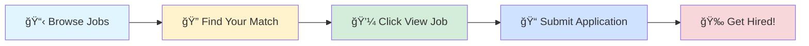

# 🚀 Tech Jobs Board

### Your Gateway to Amazing Career Opportunities

---

## 🎯 Browse by Job Profile

<table>
<tr>
<td align="center" width="25%">

 
<b>1000</b> total positions
</td>
<td align="center" width="25%">

 
<b>1000</b> total positions
</td>
<td align="center" width="25%">

 
<b>1000</b> total positions
</td>
<td align="center" width="25%">

 
<b>1000</b> total positions
</td>
</tr>
</table>

---

## 📊 Data Scientist

> 💼 **1000** positions available

<table>
<thead>
<tr>
<th width="20%">🏢 Company</th>
<th width="35%">💼 Role</th>
<th width="20%">📍 Location</th>
<th width="10%">⏰ Posted</th>
<th width="15%">🔗 Action</th>
</tr>
</thead>
<tbody>
<tr>
<td><a href="https://www.linkedin.com/company/skillfiedmentor">SkillFied Mentor</a></td>
<td>Data Analyst Intern (Excel, SQL, Power BI)</td>
<td>📍 India</td>
<td>1d ago</td>
<td align="center"></td>
</tr>
<tr>
<td><a href="https://kr.linkedin.com/company/nepes">nepes</a></td>
<td>R&D Director</td>
<td>📍 Hsinchu Metropolitan Area</td>
<td>1d ago</td>
<td align="center"></td>
</tr>
<tr>
<td><a href="https://www.linkedin.com/company/smart-ims">Smart IMS Inc.</a></td>
<td>Trading Application Support Specialist (Fixed Income / Bonds / Unix / SQL / Banking)</td>
<td>📍 Singapore, Singapore</td>
<td>1d ago</td>
<td align="center"></td>
</tr>
<tr>
<td><a href="https://www.linkedin.com/company/66degrees">66degrees</a></td>
<td>Cloud Engineer & Admin (GCP, AWS,Azure)</td>
<td>📍 Bangalore Urban, Karnataka, India</td>
<td>1d ago</td>
<td align="center"></td>
</tr>
<tr>
<td><a href="https://www.linkedin.com/company/securin-inc">Securin Inc.</a></td>
<td>Senior Python Developer</td>
<td>📍 Chennai</td>
<td>1d ago</td>
<td align="center"></td>
</tr>
<tr>
<td><a href="https://in.linkedin.com/company/kovalty">Kovalty Technologies</a></td>
<td>Senior Software Engineer (AI/ML + .NET)</td>
<td>📍 Vishakhapatnam, Andhra Pradesh, India</td>
<td>1d ago</td>
<td align="center"></td>
</tr>
<tr>
<td><a href="https://de.linkedin.com/company/harting">HARTING Technology Group</a></td>
<td>Controls and Automation Engineer</td>
<td>📍 Elgin, IL</td>
<td>1d ago</td>
<td align="center"></td>
</tr>
<tr>
<td><a href="https://www.linkedin.com/company/raise-robotics">Raise Robotics</a></td>
<td>Robotics Machine Learning Engineer</td>
<td>📍 San Francisco, CA</td>
<td>1d ago</td>
<td align="center"></td>
</tr>
<tr>
<td><a href="https://www.ambitionbox.com/overview/tcs-overview">Tata Consultancy Services</a></td>
<td>Infra Automation Engineer</td>
<td>📍 Chennai, Hyderabad, Bangalore</td>
<td>1d ago</td>
<td align="center"></td>
</tr>
<tr>
<td><a href="https://www.ambitionbox.com/overview/tcs-overview">Tata Consultancy Services</a></td>
<td>Monitoring Tools Admin (Solarwinds)</td>
<td>📍 Bangalore</td>
<td>1d ago</td>
<td align="center"></td>
</tr>
<tr>
<td><a href="https://www.linkedin.com/company/bayone-solutions">BayOne Solutions</a></td>
<td>AI/ML Engineer</td>
<td>📍 India</td>
<td>1d ago</td>
<td align="center"></td>
</tr>
<tr>
<td><a href="https://www.linkedin.com/company/oracle">Oracle</a></td>
<td>Senior PL/SQL Developer</td>
<td>📍 Makati, National Capital Region, Philippines</td>
<td>1d ago</td>
<td align="center"></td>
</tr>
<tr>
<td><a href="https://uk.linkedin.com/company/hackajob">hackajob</a></td>
<td>Regulatory Data SQL Support Engineer</td>
<td>📍 Manchester, England, United Kingdom</td>
<td>1d ago</td>
<td align="center"></td>
</tr>
<tr>
<td><a href="https://de.linkedin.com/company/contag-ag">CONTAG AG</a></td>
<td>Produktionsmitarbeiter (m/w/d) für die Leiterplattenproduktion in 3-Schichtbetrieb Elektronik/Mechatronik/Mikrotechnologe (m/w/d)</td>
<td>📍 Berlin, Berlin, Germany</td>
<td>1d ago</td>
<td align="center"></td>
</tr>
<tr>
<td><a href="https://de.linkedin.com/company/haelssen-lyon">Hälssen & Lyon GmbH</a></td>
<td>Produktionsmitarbeiter (m/w/d) für die Tee-Mischerei - im Schichtbetrieb</td>
<td>📍 Hamburg, Hamburg, Germany</td>
<td>1d ago</td>
<td align="center"></td>
</tr>
<tr>
<td><a href="https://www.linkedin.com/company/ustglobal">UST</a></td>
<td>DevOps Engineer – Azure | Terraform | GitLab CI | Databricks</td>
<td>📍 Bangalore</td>
<td>1d ago</td>
<td align="center"></td>
</tr>
<tr>
<td><a href="https://be.linkedin.com/company/donbosco">Don Bosco</a></td>
<td>Mitarbeiter/in (m/w/d) für den Empfang</td>
<td>📍 Munich, Bavaria, Germany</td>
<td>1d ago</td>
<td align="center"></td>
</tr>
<tr>
<td><a href="https://de.linkedin.com/company/forschner-group">Eugen Forschner GmbH</a></td>
<td>Entwicklungsingenieur für Embedded Hardware und HV-Systeme (m/w/d)</td>
<td>📍 Spaichingen, Baden-Württemberg, Germany</td>
<td>1d ago</td>
<td align="center"></td>
</tr>
<tr>
<td><a href="https://pl.linkedin.com/company/phoenix-pharma-polska">PHOENIX Pharma Polska</a></td>
<td>Business & Market Analytics Manager (m/w/d)</td>
<td>📍 Mannheim, Baden-Württemberg, Germany</td>
<td>1d ago</td>
<td align="center"></td>
</tr>
<tr>
<td><a href="https://uk.linkedin.com/company/hackajob">hackajob</a></td>
<td>Artificial Intelligence- QA</td>
<td>📍 Bangalore</td>
<td>1d ago</td>
<td align="center"></td>
</tr>
<tr>
<td><a href="https://uk.linkedin.com/company/hackajob">hackajob</a></td>
<td>Regulatory Data SQL Support Engineer</td>
<td>📍 Stoke-On-Trent, England, United Kingdom</td>
<td>1d ago</td>
<td align="center"></td>
</tr>
<tr>
<td><a href="https://uk.linkedin.com/company/hackajob">hackajob</a></td>
<td>Regulatory Data SQL Support Engineer</td>
<td>📍 Stoke-On-Trent, England, United Kingdom</td>
<td>1d ago</td>
<td align="center"></td>
</tr>
<tr>
<td><a href="https://uk.linkedin.com/company/hackajob">hackajob</a></td>
<td>VP - CFR CCO - Monitoring</td>
<td>📍 Pune</td>
<td>1d ago</td>
<td align="center"></td>
</tr>
<tr>
<td><a href="https://uk.linkedin.com/company/hackajob">hackajob</a></td>
<td>Data Engineer - Pyspark</td>
<td>📍 Pune</td>
<td>1d ago</td>
<td align="center"></td>
</tr>
<tr>
<td><a href="https://uk.linkedin.com/company/hackajob">hackajob</a></td>
<td>Data Analytics JOB Training Program at Year Up United</td>
<td>📍 Charlotte, NC</td>
<td>1d ago</td>
<td align="center"></td>
</tr>
<tr>
<td><a href="https://uk.linkedin.com/company/hackajob">hackajob</a></td>
<td>Gen AI and ML Engineer</td>
<td>📍 Bangalore</td>
<td>1d ago</td>
<td align="center"></td>
</tr>
<tr>
<td><a href="https://uk.linkedin.com/company/hackajob">hackajob</a></td>
<td>Java/Python AWS Engineer</td>
<td>📍 Bangalore</td>
<td>1d ago</td>
<td align="center"></td>
</tr>
<tr>
<td><a href="https://www.linkedin.com/company/algosec">AlgoSec</a></td>
<td>Cloud Automation Developer, India</td>
<td>📍 Delhi</td>
<td>1d ago</td>
<td align="center"></td>
</tr>
<tr>
<td><a href="https://www.linkedin.com/company/algosec">AlgoSec</a></td>
<td>AlgoNext Automation Developer, India</td>
<td>📍 Delhi</td>
<td>1d ago</td>
<td align="center"></td>
</tr>
<tr>
<td><a href="https://www.linkedin.com/company/algosec">AlgoSec</a></td>
<td>Full Stack Automation Developer, India</td>
<td>📍 Delhi</td>
<td>1d ago</td>
<td align="center"></td>
</tr>
<tr>
<td><a href="https://www.linkedin.com/company/algosec">AlgoSec</a></td>
<td>CloudFlow Automation Developer, India</td>
<td>📍 Delhi</td>
<td>1d ago</td>
<td align="center"></td>
</tr>
<tr>
<td><a href="https://ph.linkedin.com/company/uphsl">University of Perpetual Help System - Laguna</a></td>
<td>Market Research and Data Analytics Specialist</td>
<td>📍 Metro Manila</td>
<td>1d ago</td>
<td align="center"></td>
</tr>
<tr>
<td><a href="https://www.linkedin.com/company/etched-ai">Etched</a></td>
<td>Technical Recruiter (Supercomputing/ML)</td>
<td>📍 San Jose, CA</td>
<td>1d ago</td>
<td align="center"></td>
</tr>
<tr>
<td><a href="https://in.linkedin.com/company/tata-consultancy-services">Tata Consultancy Services</a></td>
<td>Monitoring Tools Admin (Solarwinds)</td>
<td>📍 Bangalore</td>
<td>1d ago</td>
<td align="center"></td>
</tr>
<tr>
<td><a href="https://www.linkedin.com/company/cooperuniversityhealthcare">Cooper University Health Care</a></td>
<td>ANALYTICS DEVELOPER</td>
<td>📍 Camden, NJ</td>
<td>1d ago</td>
<td align="center"></td>
</tr>
<tr>
<td><a href="https://ma.linkedin.com/school/um6p/">UM6P - University Mohammed VI Polytechnic</a></td>
<td>CBS - Assistant Professor Position in Analytical Environmental Chemistry</td>
<td>📍 Morocco</td>
<td>1d ago</td>
<td align="center"></td>
</tr>
<tr>
<td><a href="https://in.linkedin.com/company/tata-consultancy-services">Tata Consultancy Services</a></td>
<td>Infra Automation Engineer</td>
<td>📍 Bangalore</td>
<td>1d ago</td>
<td align="center"></td>
</tr>
<tr>
<td><a href="https://ma.linkedin.com/school/um6p/">UM6P - University Mohammed VI Polytechnic</a></td>
<td>CBS - Assistant Professor in Artificial Intelligence and Chemistry - Open Rank</td>
<td>📍 Morocco</td>
<td>1d ago</td>
<td align="center"></td>
</tr>
<tr>
<td><a href="https://uk.linkedin.com/company/wearehaystack">Haystack</a></td>
<td>Data Scientist</td>
<td>📍 United States</td>
<td>1d ago</td>
<td align="center"></td>
</tr>
<tr>
<td><a href="https://www.linkedin.com/company/lensa">Lensa</a></td>
<td>AWS Scrum Master - Remote</td>
<td>📍 Irvine, CA</td>
<td>1d ago</td>
<td align="center"></td>
</tr>
<tr>
<td><a href="https://za.linkedin.com/company/novusprintsouthafrica">Novus Print (Pty) Ltd</a></td>
<td>Seasoned SQL / C# Developer</td>
<td>📍 Cape Town, Western Cape, South Africa</td>
<td>1d ago</td>
<td align="center"></td>
</tr>
<tr>
<td><a href="https://www.linkedin.com/company/lensa">Lensa</a></td>
<td>Scientist III - Analytical Chemistry & Molecular Biology - FSP</td>
<td>📍 Honolulu, HI</td>
<td>1d ago</td>
<td align="center"></td>
</tr>
<tr>
<td><a href="https://www.linkedin.com/company/lensa">Lensa</a></td>
<td>Laboratory Technician, Analytical Development Laboratory</td>
<td>📍 Rockville, MD</td>
<td>1d ago</td>
<td align="center"></td>
</tr>
<tr>
<td><a href="https://www.linkedin.com/company/lensa">Lensa</a></td>
<td>Software Engineering Intern - R&D</td>
<td>📍 Beaverton, OR</td>
<td>1d ago</td>
<td align="center"></td>
</tr>
<tr>
<td><a href="https://www.linkedin.com/company/lensa">Lensa</a></td>
<td>Senior Scientist I / II, Biologics Analytical R&D</td>
<td>📍 North Chicago, IL</td>
<td>1d ago</td>
<td align="center"></td>
</tr>
<tr>
<td><a href="https://jp.linkedin.com/company/united-world-corporation">United World Inc</a></td>
<td>【No Japanese required】Artificial Intelligence Engineer</td>
<td>📍 Tokyo, Japan</td>
<td>1d ago</td>
<td align="center"></td>
</tr>
<tr>
<td><a href="https://www.linkedin.com/company/lensa">Lensa</a></td>
<td>Scientist 1 Automation & Assay Development</td>
<td>📍 Frederick, MD</td>
<td>1d ago</td>
<td align="center"></td>
</tr>
<tr>
<td><a href="https://www.linkedin.com/company/congtyeplus-vn">E-plus.vn</a></td>
<td>Data Scientist</td>
<td>📍 Ho Chi Minh City, Vietnam</td>
<td>1d ago</td>
<td align="center"></td>
</tr>
<tr>
<td><a href="https://www.linkedin.com/company/jobs-via-dice">Jobs via Dice</a></td>
<td>Machine Learning Engineer</td>
<td>📍 California, United States</td>
<td>1d ago</td>
<td align="center"></td>
</tr>
<tr>
<td><a href="https://www.linkedin.com/company/jobs-via-dice">Jobs via Dice</a></td>
<td>AWS Cloud Engineer - Intern</td>
<td>📍 McLean, VA</td>
<td>1d ago</td>
<td align="center"></td>
</tr>
<tr>
<td><a href="https://kr.linkedin.com/company/vwsai">VWS</a></td>
<td>Data Scientist(데이터사이언스 시스템 기획 및 LLM설계))</td>
<td>📍 Seoul, South Korea</td>
<td>1d ago</td>
<td align="center"></td>
</tr>
<tr>
<td><a href="https://www.linkedin.com/company/ustglobal">UST</a></td>
<td>Automation Engineer - Perforce & GitHub</td>
<td>📍 Bangalore</td>
<td>1d ago</td>
<td align="center"></td>
</tr>
<tr>
<td><a href="https://www.linkedin.com/company/ustglobal">UST</a></td>
<td>Automation Engineer - Perforce & GitHub</td>
<td>📍 Bangalore</td>
<td>1d ago</td>
<td align="center"></td>
</tr>
<tr>
<td><a href="https://www.linkedin.com/company/ustglobal">UST</a></td>
<td>Lead II - Data Science</td>
<td>📍 Pune</td>
<td>1d ago</td>
<td align="center"></td>
</tr>
<tr>
<td><a href="https://www.linkedin.com/company/ustglobal">UST</a></td>
<td>Associate Data Architect II - Data Architect – SQL, T-SQL, Data Modeling</td>
<td>📍 Chennai</td>
<td>1d ago</td>
<td align="center"></td>
</tr>
<tr>
<td><a href="https://www.linkedin.com/company/ustglobal">UST</a></td>
<td>Linux & Cloud Engineer With Azure AKS & Terraform</td>
<td>📍 Trivandrum, Kerala, India</td>
<td>1d ago</td>
<td align="center"></td>
</tr>
<tr>
<td><a href="https://www.linkedin.com/company/lensa">Lensa</a></td>
<td>Computer Science Bachelor's Intern</td>
<td>📍 San Diego, CA</td>
<td>1d ago</td>
<td align="center"></td>
</tr>
<tr>
<td><a href="https://www.linkedin.com/company/lensa">Lensa</a></td>
<td>Intern - Data Science</td>
<td>📍 San Jose, CA</td>
<td>1d ago</td>
<td align="center"></td>
</tr>
<tr>
<td><a href="https://www.linkedin.com/company/jobs-via-dice">Jobs via Dice</a></td>
<td>Math, Statistics, and Data Analysis Intern</td>
<td>📍 Alexandria, VA</td>
<td>1d ago</td>
<td align="center"></td>
</tr>
<tr>
<td><a href="https://www.linkedin.com/company/labcorp">Labcorp</a></td>
<td>Intern - AWS Public Cloud Administrator</td>
<td>📍 Durham, NC</td>
<td>1d ago</td>
<td align="center"></td>
</tr>
<tr>
<td><a href="https://in.linkedin.com/company/superprocure">SuperProcure</a></td>
<td>QA Automation Engineer</td>
<td>📍 Greater Kolkata Area</td>
<td>1d ago</td>
<td align="center"></td>
</tr>
<tr>
<td><a href="https://www.linkedin.com/company/lensa">Lensa</a></td>
<td>R&D Scientist Beverage</td>
<td>📍 Quincy, MA</td>
<td>1d ago</td>
<td align="center"></td>
</tr>
<tr>
<td><a href="https://ae.linkedin.com/company/yash-technologies-middle-east-region">YASH Technologies Middle East</a></td>
<td>Tech Lead - .NET + AWS Job</td>
<td>📍 Bangalore Urban, Karnataka, India</td>
<td>1d ago</td>
<td align="center"></td>
</tr>
<tr>
<td><a href="https://www.linkedin.com/company/lensa">Lensa</a></td>
<td>Analytical Scientist</td>
<td>📍 New Brunswick, NJ</td>
<td>1d ago</td>
<td align="center"></td>
</tr>
<tr>
<td><a href="https://sa.linkedin.com/company/menaconsultant">MENA Consultant</a></td>
<td>Performance Analytics & Insights Analyst</td>
<td>📍 Riyadh, Riyadh, Saudi Arabia</td>
<td>1d ago</td>
<td align="center"></td>
</tr>
<tr>
<td><a href="https://www.linkedin.com/company/lensa">Lensa</a></td>
<td>R&D Engineering Intern (Medical Devices)</td>
<td>📍 Irvine, CA</td>
<td>1d ago</td>
<td align="center"></td>
</tr>
<tr>
<td><a href="https://www.linkedin.com/company/jobs-via-dice">Jobs via Dice</a></td>
<td>AWS Administrator</td>
<td>📍 West Monroe, LA</td>
<td>1d ago</td>
<td align="center"></td>
</tr>
<tr>
<td><a href="https://www.linkedin.com/school/year-up-united/">Year Up United</a></td>
<td>Data Analytics Job Training Program</td>
<td>📍 Pleasant Hill, CA</td>
<td>1d ago</td>
<td align="center"></td>
</tr>
<tr>
<td><a href="https://in.linkedin.com/company/best-job-tool">Best Job Tool</a></td>
<td>SQL Developer</td>
<td>📍 India</td>
<td>1d ago</td>
<td align="center"></td>
</tr>
<tr>
<td><a href="https://pe.linkedin.com/company/grupo-especializado-de-asistencia-del-per%C3%BA">GEA Perú</a></td>
<td>¡Trabaja R.E.M.O.T.O! Atencion al Cliente Asesores telefónicos</td>
<td>📍 Lima, Peru</td>
<td>1d ago</td>
<td align="center"></td>
</tr>
<tr>
<td><a href="https://www.linkedin.com/company/nalhe">National Association of Latino Healthcare Executives</a></td>
<td>Business Analytics Master&amp;#8217;s Intern</td>
<td>📍 Oakland, CA</td>
<td>1d ago</td>
<td align="center"></td>
</tr>
<tr>
<td><a href="https://www.linkedin.com/company/lensa">Lensa</a></td>
<td>Entry level AI/ML Engineer: SVL</td>
<td>📍 San Jose, CA</td>
<td>1d ago</td>
<td align="center"></td>
</tr>
<tr>
<td><a href="https://ca.linkedin.com/company/myticas-consulting">Myticas Consulting</a></td>
<td>Remote-SQL Implementation Specialist (34589)</td>
<td>📍 New York, NY</td>
<td>1d ago</td>
<td align="center"></td>
</tr>
<tr>
<td><a href="https://www.linkedin.com/company/lensa">Lensa</a></td>
<td>Agentic AI/ML Engineer</td>
<td>📍 Frisco, TX</td>
<td>1d ago</td>
<td align="center"></td>
</tr>
<tr>
<td><a href="https://www.linkedin.com/company/lensa">Lensa</a></td>
<td>Data Science Summer Intern (Remote & Paid)</td>
<td>📍 Costa Mesa, CA</td>
<td>1d ago</td>
<td align="center"></td>
</tr>
<tr>
<td><a href="https://www.linkedin.com/company/lensa">Lensa</a></td>
<td>Data Analytics Intern</td>
<td>📍 Pontiac, MI</td>
<td>1d ago</td>
<td align="center"></td>
</tr>
<tr>
<td><a href="https://de.linkedin.com/company/gisagmbh">GISA GmbH</a></td>
<td>Azure Cloud Engineer (m/w/d)*</td>
<td>📍 Halle, Saxony-Anhalt, Germany</td>
<td>1d ago</td>
<td align="center"></td>
</tr>
<tr>
<td><a href="https://www.linkedin.com/company/lensa">Lensa</a></td>
<td>SQL Server and Azure Intern - Remote</td>
<td>📍 Dallas, TX</td>
<td>1d ago</td>
<td align="center"></td>
</tr>
<tr>
<td><a href="https://www.linkedin.com/company/lensa">Lensa</a></td>
<td>Artificial Intelligence (AI) Intern</td>
<td>📍 Boston, MA</td>
<td>1d ago</td>
<td align="center"></td>
</tr>
<tr>
<td><a href="https://www.linkedin.com/company/lensa">Lensa</a></td>
<td>Data Science Summer Intern (Remote & Paid)</td>
<td>📍 United States</td>
<td>1d ago</td>
<td align="center"></td>
</tr>
<tr>
<td><a href="https://www.linkedin.com/company/lensa">Lensa</a></td>
<td>Data Analysis & Engineering Intern</td>
<td>📍 Dallas, TX</td>
<td>1d ago</td>
<td align="center"></td>
</tr>
<tr>
<td><a href="https://www.linkedin.com/company/lensa">Lensa</a></td>
<td>Data Science Intern</td>
<td>📍 Hartford, CT</td>
<td>1d ago</td>
<td align="center"></td>
</tr>
<tr>
<td><a href="https://www.linkedin.com/company/lensa">Lensa</a></td>
<td>Data Scientist (REMOTE)</td>
<td>📍 Dallas, TX</td>
<td>1d ago</td>
<td align="center"></td>
</tr>
<tr>
<td><a href="https://www.linkedin.com/company/lensa">Lensa</a></td>
<td>Data Science Intern</td>
<td>📍 Plano, TX</td>
<td>1d ago</td>
<td align="center"></td>
</tr>
<tr>
<td><a href="https://www.linkedin.com/company/lensa">Lensa</a></td>
<td>Device Test Engineer, R&D Engineering</td>
<td>📍 San Jose, CA</td>
<td>1d ago</td>
<td align="center"></td>
</tr>
<tr>
<td>Philips</td>
<td>Data Scientist I</td>
<td>📍 Bangalore</td>
<td>-174d ago</td>
<td align="center"></td>
</tr>
<tr>
<td><a href="https://in.linkedin.com/company/best-job-tool">Best Job Tool</a></td>
<td>Python Developer</td>
<td>📍 India</td>
<td>1d ago</td>
<td align="center"></td>
</tr>
<tr>
<td><a href="https://in.linkedin.com/company/info-edge-india-ltd">Info Edge India Ltd</a></td>
<td>EXOedg - Senior Data Engineer - Python</td>
<td>📍 Greater Kolkata Area</td>
<td>1d ago</td>
<td align="center"></td>
</tr>
<tr>
<td><a href="https://br.linkedin.com/company/btgpactual">BTG Pactual</a></td>
<td>Engenheiro(a) de Software (.NET Core) | R&C</td>
<td>📍 Rio de Janeiro, Rio de Janeiro, Brazil</td>
<td>1d ago</td>
<td align="center"></td>
</tr>
<tr>
<td><a href="https://www.linkedin.com/company/geico">GEICO</a></td>
<td>Senior Software Engineer - (Python, Backend, Document AI/ML) - *HYBRID*</td>
<td>📍 Palo Alto, CA</td>
<td>1d ago</td>
<td align="center"></td>
</tr>
<tr>
<td><a href="https://www.linkedin.com/company/geico">GEICO</a></td>
<td>Senior Software Engineer - (Python, Backend, Document AI/ML) - *HYBRID*</td>
<td>📍 Seattle, WA</td>
<td>1d ago</td>
<td align="center"></td>
</tr>
<tr>
<td><a href="https://in.linkedin.com/company/hirenza-pvt-ltd">Hirenza</a></td>
<td>Sr Data Scientist</td>
<td>📍 India</td>
<td>1d ago</td>
<td align="center"></td>
</tr>
<tr>
<td><a href="https://de.linkedin.com/company/rhoenenergie-fulda">RhönEnergie Gruppe</a></td>
<td>Ausbildung 2026 - Elektroniker für Betriebstechnik (m/w/d)</td>
<td>📍 Fulda, Hesse, Germany</td>
<td>1d ago</td>
<td align="center"></td>
</tr>
<tr>
<td><a href="https://de.linkedin.com/company/rhoenenergie-fulda">RhönEnergie Gruppe</a></td>
<td>Ausbildung 2026 - Informationselektroniker für Geräte und Systeme (m/w/d)</td>
<td>📍 Fulda, Hesse, Germany</td>
<td>1d ago</td>
<td align="center"></td>
</tr>
<tr>
<td><a href="https://www.linkedin.com/company/nalhe">National Association of Latino Healthcare Executives</a></td>
<td>Automation Bachelor&amp;#8217;s Intern</td>
<td>📍 Pasadena, CA</td>
<td>1d ago</td>
<td align="center"></td>
</tr>
<tr>
<td><a href="https://www.linkedin.com/company/innomountain">InnoMountain</a></td>
<td>System and Hardware Engineer Internship (5G and 6G Systems R&D)</td>
<td>📍 United States</td>
<td>1d ago</td>
<td align="center"></td>
</tr>
<tr>
<td><a href="https://www.linkedin.com/company/nalhe">National Association of Latino Healthcare Executives</a></td>
<td>Automation Master&amp;#8217;s Intern</td>
<td>📍 Pasadena, CA</td>
<td>1d ago</td>
<td align="center"></td>
</tr>
<tr>
<td>Cubic Corporation</td>
<td>Senior Software Engineer (Java/AWS)</td>
<td>📍 Hyderabad</td>
<td>-174d ago</td>
<td align="center"></td>
</tr>
<tr>
<td>Cubic Corporation</td>
<td>Principal Software Engineer (Java/AWS)</td>
<td>📍 Hyderabad</td>
<td>-174d ago</td>
<td align="center"></td>
</tr>
<tr>
<td><a href="https://ca.linkedin.com/company/telus-digital">TELUS Digital</a></td>
<td>Tableau Developer</td>
<td>📍 Noida</td>
<td>1d ago</td>
<td align="center"></td>
</tr>
<tr><td colspan="5" align="center"><i>... and 900 more positions</i></td></tr>
</tbody>
</table>

---

## 💼 Business Analyst

> 💼 **1000** positions available

<table>
<thead>
<tr>
<th width="20%">🏢 Company</th>
<th width="35%">💼 Role</th>
<th width="20%">📍 Location</th>
<th width="10%">⏰ Posted</th>
<th width="15%">🔗 Action</th>
</tr>
</thead>
<tbody>
<tr>
<td><a href="https://www.linkedin.com/company/skillfiedmentor">SkillFied Mentor</a></td>
<td>Data Analyst Intern (Excel, SQL, Power BI)</td>
<td>📍 India</td>
<td>1d ago</td>
<td align="center"></td>
</tr>
<tr>
<td><a href="https://in.linkedin.com/company/laneway-india">Laneway</a></td>
<td>Project Management Intern</td>
<td>📍 Bangalore</td>
<td>1d ago</td>
<td align="center"></td>
</tr>
<tr>
<td><a href="https://nl.linkedin.com/company/heineken">The HEINEKEN Company</a></td>
<td>Business Analyst - Supply Chain Business Control</td>
<td>📍 Cairo, Cairo, Egypt</td>
<td>1d ago</td>
<td align="center"></td>
</tr>
<tr>
<td><a href="https://www.linkedin.com/company/smart-ims">Smart IMS Inc.</a></td>
<td>Trading Application Support Specialist (Fixed Income / Bonds / Unix / SQL / Banking)</td>
<td>📍 Singapore, Singapore</td>
<td>1d ago</td>
<td align="center"></td>
</tr>
<tr>
<td><a href="https://fr.linkedin.com/company/capgemini">Capgemini</a></td>
<td>Scrum Master_Knutsford_</td>
<td>📍 London, England, United Kingdom</td>
<td>1d ago</td>
<td align="center"></td>
</tr>
<tr>
<td><a href="https://www.linkedin.com/company/securin-inc">Securin Inc.</a></td>
<td>Senior Python Developer</td>
<td>📍 Chennai</td>
<td>1d ago</td>
<td align="center"></td>
</tr>
<tr>
<td><a href="https://de.linkedin.com/company/harting">HARTING Technology Group</a></td>
<td>Controls and Automation Engineer</td>
<td>📍 Elgin, IL</td>
<td>1d ago</td>
<td align="center"></td>
</tr>
<tr>
<td><a href="https://www.ambitionbox.com/overview/tcs-overview">Tata Consultancy Services</a></td>
<td>Infra Automation Engineer</td>
<td>📍 Chennai, Hyderabad, Bangalore</td>
<td>1d ago</td>
<td align="center"></td>
</tr>
<tr>
<td><a href="https://www.linkedin.com/company/oracle">Oracle</a></td>
<td>Senior PL/SQL Developer</td>
<td>📍 Makati, National Capital Region, Philippines</td>
<td>1d ago</td>
<td align="center"></td>
</tr>
<tr>
<td><a href="https://uk.linkedin.com/company/hackajob">hackajob</a></td>
<td>Regulatory Data SQL Support Engineer</td>
<td>📍 Manchester, England, United Kingdom</td>
<td>1d ago</td>
<td align="center"></td>
</tr>
<tr>
<td><a href="https://pl.linkedin.com/company/phoenix-pharma-polska">PHOENIX Pharma Polska</a></td>
<td>Business & Market Analytics Manager (m/w/d)</td>
<td>📍 Mannheim, Baden-Württemberg, Germany</td>
<td>1d ago</td>
<td align="center"></td>
</tr>
<tr>
<td><a href="https://uk.linkedin.com/company/hackajob">hackajob</a></td>
<td>Salesforce Developer</td>
<td>📍 Pune</td>
<td>1d ago</td>
<td align="center"></td>
</tr>
<tr>
<td><a href="https://uk.linkedin.com/company/hackajob">hackajob</a></td>
<td>Regulatory Data SQL Support Engineer</td>
<td>📍 Stoke-On-Trent, England, United Kingdom</td>
<td>1d ago</td>
<td align="center"></td>
</tr>
<tr>
<td><a href="https://uk.linkedin.com/company/hackajob">hackajob</a></td>
<td>Regulatory Data SQL Support Engineer</td>
<td>📍 Stoke-On-Trent, England, United Kingdom</td>
<td>1d ago</td>
<td align="center"></td>
</tr>
<tr>
<td><a href="https://uk.linkedin.com/company/hackajob">hackajob</a></td>
<td>Scrum Master</td>
<td>📍 Pune</td>
<td>1d ago</td>
<td align="center"></td>
</tr>
<tr>
<td><a href="https://uk.linkedin.com/company/hackajob">hackajob</a></td>
<td>Data Analytics JOB Training Program at Year Up United</td>
<td>📍 Charlotte, NC</td>
<td>1d ago</td>
<td align="center"></td>
</tr>
<tr>
<td><a href="https://uk.linkedin.com/company/hackajob">hackajob</a></td>
<td>Loan Business Analyst</td>
<td>📍 Chennai</td>
<td>1d ago</td>
<td align="center"></td>
</tr>
<tr>
<td><a href="https://uk.linkedin.com/company/hackajob">hackajob</a></td>
<td>Java/Python AWS Engineer</td>
<td>📍 Bangalore</td>
<td>1d ago</td>
<td align="center"></td>
</tr>
<tr>
<td><a href="https://www.linkedin.com/company/algosec">AlgoSec</a></td>
<td>Cloud Automation Developer, India</td>
<td>📍 Delhi</td>
<td>1d ago</td>
<td align="center"></td>
</tr>
<tr>
<td><a href="https://ca.linkedin.com/company/enercare-inc">Enercare Inc.</a></td>
<td>Business Analyst</td>
<td>📍 Markham, Ontario, Canada</td>
<td>1d ago</td>
<td align="center"></td>
</tr>
<tr>
<td><a href="https://www.linkedin.com/company/algosec">AlgoSec</a></td>
<td>AlgoNext Automation Developer, India</td>
<td>📍 Delhi</td>
<td>1d ago</td>
<td align="center"></td>
</tr>
<tr>
<td><a href="https://www.linkedin.com/company/algosec">AlgoSec</a></td>
<td>Full Stack Automation Developer, India</td>
<td>📍 Delhi</td>
<td>1d ago</td>
<td align="center"></td>
</tr>
<tr>
<td><a href="https://www.linkedin.com/company/algosec">AlgoSec</a></td>
<td>CloudFlow Automation Developer, India</td>
<td>📍 Delhi</td>
<td>1d ago</td>
<td align="center"></td>
</tr>
<tr>
<td><a href="https://www.linkedin.com/company/apollo-bgs-hospitals">Apollo BGS Hospitals</a></td>
<td>Business Analyst - Operations</td>
<td>📍 Bangalore</td>
<td>1d ago</td>
<td align="center"></td>
</tr>
<tr>
<td><a href="https://ph.linkedin.com/company/uphsl">University of Perpetual Help System - Laguna</a></td>
<td>Market Research and Data Analytics Specialist</td>
<td>📍 Metro Manila</td>
<td>1d ago</td>
<td align="center"></td>
</tr>
<tr>
<td><a href="https://www.linkedin.com/company/cooperuniversityhealthcare">Cooper University Health Care</a></td>
<td>ANALYTICS DEVELOPER</td>
<td>📍 Camden, NJ</td>
<td>1d ago</td>
<td align="center"></td>
</tr>
<tr>
<td><a href="https://www.linkedin.com/company/spglobal">S&P Global</a></td>
<td>Business analyst II</td>
<td>📍 Gurugram</td>
<td>1d ago</td>
<td align="center"></td>
</tr>
<tr>
<td><a href="https://ma.linkedin.com/school/um6p/">UM6P - University Mohammed VI Polytechnic</a></td>
<td>CBS - Assistant Professor Position in Analytical Environmental Chemistry</td>
<td>📍 Morocco</td>
<td>1d ago</td>
<td align="center"></td>
</tr>
<tr>
<td><a href="https://in.linkedin.com/company/tata-consultancy-services">Tata Consultancy Services</a></td>
<td>Infra Automation Engineer</td>
<td>📍 Bangalore</td>
<td>1d ago</td>
<td align="center"></td>
</tr>
<tr>
<td><a href="https://www.linkedin.com/company/mckesson">McKesson</a></td>
<td>Salesforce Developer</td>
<td>📍 Richmond, VA</td>
<td>1d ago</td>
<td align="center"></td>
</tr>
<tr>
<td><a href="https://www.linkedin.com/company/lensa">Lensa</a></td>
<td>AWS Scrum Master - Remote</td>
<td>📍 Irvine, CA</td>
<td>1d ago</td>
<td align="center"></td>
</tr>
<tr>
<td><a href="https://za.linkedin.com/company/novusprintsouthafrica">Novus Print (Pty) Ltd</a></td>
<td>Seasoned SQL / C# Developer</td>
<td>📍 Cape Town, Western Cape, South Africa</td>
<td>1d ago</td>
<td align="center"></td>
</tr>
<tr>
<td><a href="https://www.linkedin.com/company/lensa">Lensa</a></td>
<td>Scientist III - Analytical Chemistry & Molecular Biology - FSP</td>
<td>📍 Honolulu, HI</td>
<td>1d ago</td>
<td align="center"></td>
</tr>
<tr>
<td><a href="https://www.linkedin.com/company/lensa">Lensa</a></td>
<td>Laboratory Technician, Analytical Development Laboratory</td>
<td>📍 Rockville, MD</td>
<td>1d ago</td>
<td align="center"></td>
</tr>
<tr>
<td><a href="https://www.linkedin.com/company/lensa">Lensa</a></td>
<td>Senior Scientist I / II, Biologics Analytical R&D</td>
<td>📍 North Chicago, IL</td>
<td>1d ago</td>
<td align="center"></td>
</tr>
<tr>
<td><a href="https://www.linkedin.com/company/lensa">Lensa</a></td>
<td>Scientist 1 Automation & Assay Development</td>
<td>📍 Frederick, MD</td>
<td>1d ago</td>
<td align="center"></td>
</tr>
<tr>
<td><a href="https://www.linkedin.com/company/ustglobal">UST</a></td>
<td>Lead II - Business Analysis</td>
<td>📍 Kochi, Kerala, India</td>
<td>1d ago</td>
<td align="center"></td>
</tr>
<tr>
<td><a href="https://www.linkedin.com/company/ustglobal">UST</a></td>
<td>Consultant I – Business Analysis</td>
<td>📍 Chennai</td>
<td>1d ago</td>
<td align="center"></td>
</tr>
<tr>
<td><a href="https://www.linkedin.com/company/ustglobal">UST</a></td>
<td>Automation Engineer - Perforce & GitHub</td>
<td>📍 Bangalore</td>
<td>1d ago</td>
<td align="center"></td>
</tr>
<tr>
<td><a href="https://www.linkedin.com/company/ustglobal">UST</a></td>
<td>Automation Engineer - Perforce & GitHub</td>
<td>📍 Bangalore</td>
<td>1d ago</td>
<td align="center"></td>
</tr>
<tr>
<td><a href="https://www.linkedin.com/company/ustglobal">UST</a></td>
<td>Lead I - Business Analysis</td>
<td>📍 Chennai</td>
<td>1d ago</td>
<td align="center"></td>
</tr>
<tr>
<td><a href="https://www.linkedin.com/company/ustglobal">UST</a></td>
<td>Associate Data Architect II - Data Architect – SQL, T-SQL, Data Modeling</td>
<td>📍 Chennai</td>
<td>1d ago</td>
<td align="center"></td>
</tr>
<tr>
<td><a href="https://www.linkedin.com/company/ustglobal">UST</a></td>
<td>Lead II - Business Analysis</td>
<td>📍 Chennai</td>
<td>1d ago</td>
<td align="center"></td>
</tr>
<tr>
<td><a href="https://www.linkedin.com/company/ustglobal">UST</a></td>
<td>Associate III - Business Analysis-Workday HCM</td>
<td>📍 Bangalore</td>
<td>1d ago</td>
<td align="center"></td>
</tr>
<tr>
<td><a href="https://www.linkedin.com/company/ustglobal">UST</a></td>
<td>Lead I - Business Analysis</td>
<td>📍 Hyderabad</td>
<td>1d ago</td>
<td align="center"></td>
</tr>
<tr>
<td><a href="https://www.linkedin.com/company/lensa">Lensa</a></td>
<td>Business Analyst (Intern) - United States</td>
<td>📍 Minneapolis, MN</td>
<td>1d ago</td>
<td align="center"></td>
</tr>
<tr>
<td><a href="https://in.linkedin.com/company/best-job-tool">Best Job Tool</a></td>
<td>Senior Business Analyst</td>
<td>📍 India</td>
<td>1d ago</td>
<td align="center"></td>
</tr>
<tr>
<td><a href="https://www.linkedin.com/company/lensa">Lensa</a></td>
<td>Business Analyst (Intern) - United States</td>
<td>📍 Chicago, IL</td>
<td>1d ago</td>
<td align="center"></td>
</tr>
<tr>
<td><a href="https://www.linkedin.com/company/lensa">Lensa</a></td>
<td>Director Technology Program and Project Management - Cyber Security Programs</td>
<td>📍 Philadelphia, PA</td>
<td>1d ago</td>
<td align="center"></td>
</tr>
<tr>
<td><a href="https://www.linkedin.com/school/year-up-united/">Year Up United</a></td>
<td>Project Management Career Training Program</td>
<td>📍 San Francisco, CA</td>
<td>1d ago</td>
<td align="center"></td>
</tr>
<tr>
<td><a href="https://www.linkedin.com/company/lensa">Lensa</a></td>
<td>Computer Science Bachelor's Intern</td>
<td>📍 San Diego, CA</td>
<td>1d ago</td>
<td align="center"></td>
</tr>
<tr>
<td><a href="https://www.linkedin.com/company/lensa">Lensa</a></td>
<td>Director, Project Management- Remote</td>
<td>📍 Austin, TX</td>
<td>1d ago</td>
<td align="center"></td>
</tr>
<tr>
<td><a href="https://www.linkedin.com/company/jobs-via-dice">Jobs via Dice</a></td>
<td>Math, Statistics, and Data Analysis Intern</td>
<td>📍 Alexandria, VA</td>
<td>1d ago</td>
<td align="center"></td>
</tr>
<tr>
<td><a href="https://in.linkedin.com/company/superprocure">SuperProcure</a></td>
<td>QA Automation Engineer</td>
<td>📍 Greater Kolkata Area</td>
<td>1d ago</td>
<td align="center"></td>
</tr>
<tr>
<td><a href="https://www.linkedin.com/company/lensa">Lensa</a></td>
<td>Analytical Scientist</td>
<td>📍 New Brunswick, NJ</td>
<td>1d ago</td>
<td align="center"></td>
</tr>
<tr>
<td><a href="https://www.linkedin.com/company/lensa">Lensa</a></td>
<td>Data Entry Specialist (SAP and Salesforce)</td>
<td>📍 Atlanta, GA</td>
<td>1d ago</td>
<td align="center"></td>
</tr>
<tr>
<td><a href="https://sa.linkedin.com/company/menaconsultant">MENA Consultant</a></td>
<td>Performance Analytics & Insights Analyst</td>
<td>📍 Riyadh, Riyadh, Saudi Arabia</td>
<td>1d ago</td>
<td align="center"></td>
</tr>
<tr>
<td><a href="https://www.linkedin.com/company/lensa">Lensa</a></td>
<td>Business Analyst Intern (Summer Internship Program)</td>
<td>📍 New Brunswick, NJ</td>
<td>1d ago</td>
<td align="center"></td>
</tr>
<tr>
<td><a href="https://www.linkedin.com/school/year-up-united/">Year Up United</a></td>
<td>Data Analytics Job Training Program</td>
<td>📍 Pleasant Hill, CA</td>
<td>1d ago</td>
<td align="center"></td>
</tr>
<tr>
<td><a href="https://in.linkedin.com/company/best-job-tool">Best Job Tool</a></td>
<td>SQL Developer</td>
<td>📍 India</td>
<td>1d ago</td>
<td align="center"></td>
</tr>
<tr>
<td><a href="https://www.linkedin.com/company/lensa">Lensa</a></td>
<td>Business Analyst - Entry Level</td>
<td>📍 Knoxville, TN</td>
<td>1d ago</td>
<td align="center"></td>
</tr>
<tr>
<td><a href="https://www.linkedin.com/company/lensa">Lensa</a></td>
<td>Project Management</td>
<td>📍 Sunnyvale, CA</td>
<td>1d ago</td>
<td align="center"></td>
</tr>
<tr>
<td><a href="https://www.linkedin.com/company/lensa">Lensa</a></td>
<td>Business Analyst (Intern) - United States</td>
<td>📍 San Jose, CA</td>
<td>1d ago</td>
<td align="center"></td>
</tr>
<tr>
<td><a href="https://www.linkedin.com/company/lensa">Lensa</a></td>
<td>Business Analyst Intern (Summer Internship Program)</td>
<td>📍 New York, NY</td>
<td>1d ago</td>
<td align="center"></td>
</tr>
<tr>
<td><a href="https://www.linkedin.com/company/nalhe">National Association of Latino Healthcare Executives</a></td>
<td>Business Analytics Master&amp;#8217;s Intern</td>
<td>📍 Oakland, CA</td>
<td>1d ago</td>
<td align="center"></td>
</tr>
<tr>
<td><a href="https://www.linkedin.com/company/lensa">Lensa</a></td>
<td>Director, Project Management- Remote</td>
<td>📍 Trenton, NJ</td>
<td>1d ago</td>
<td align="center"></td>
</tr>
<tr>
<td><a href="https://in.linkedin.com/company/best-job-tool">Best Job Tool</a></td>
<td>Business Analyst</td>
<td>📍 India</td>
<td>1d ago</td>
<td align="center"></td>
</tr>
<tr>
<td><a href="https://www.linkedin.com/company/lensa">Lensa</a></td>
<td>Business Analyst (Intern) - United States</td>
<td>📍 Atlanta, GA</td>
<td>1d ago</td>
<td align="center"></td>
</tr>
<tr>
<td><a href="https://ca.linkedin.com/company/myticas-consulting">Myticas Consulting</a></td>
<td>Remote-SQL Implementation Specialist (34589)</td>
<td>📍 New York, NY</td>
<td>1d ago</td>
<td align="center"></td>
</tr>
<tr>
<td><a href="https://ae.linkedin.com/company/yash-technologies-middle-east-region">YASH Technologies Middle East</a></td>
<td>Associate Lead Consultant - Project Management (SCM) Job</td>
<td>📍 Pune</td>
<td>1d ago</td>
<td align="center"></td>
</tr>
<tr>
<td><a href="https://www.linkedin.com/company/lensa">Lensa</a></td>
<td>Data Analytics Intern</td>
<td>📍 Pontiac, MI</td>
<td>1d ago</td>
<td align="center"></td>
</tr>
<tr>
<td><a href="https://www.linkedin.com/company/lensa">Lensa</a></td>
<td>Business Analyst (Intern) - United States</td>
<td>📍 Boston, MA</td>
<td>1d ago</td>
<td align="center"></td>
</tr>
<tr>
<td><a href="https://www.linkedin.com/company/lensa">Lensa</a></td>
<td>SQL Server and Azure Intern - Remote</td>
<td>📍 Dallas, TX</td>
<td>1d ago</td>
<td align="center"></td>
</tr>
<tr>
<td><a href="https://www.linkedin.com/company/lensa">Lensa</a></td>
<td>Business Analyst - Entry Level</td>
<td>📍 Dallas, TX</td>
<td>1d ago</td>
<td align="center"></td>
</tr>
<tr>
<td><a href="https://www.linkedin.com/company/lensa">Lensa</a></td>
<td>Data Analysis & Engineering Intern</td>
<td>📍 Dallas, TX</td>
<td>1d ago</td>
<td align="center"></td>
</tr>
<tr>
<td><a href="https://www.linkedin.com/company/lensa">Lensa</a></td>
<td>Business Analyst (Intern) - United States</td>
<td>📍 Trenton, NJ</td>
<td>1d ago</td>
<td align="center"></td>
</tr>
<tr>
<td><a href="https://in.linkedin.com/company/best-job-tool">Best Job Tool</a></td>
<td>Python Developer</td>
<td>📍 India</td>
<td>1d ago</td>
<td align="center"></td>
</tr>
<tr>
<td><a href="https://in.linkedin.com/company/info-edge-india-ltd">Info Edge India Ltd</a></td>
<td>EXOedg - Senior Data Engineer - Python</td>
<td>📍 Greater Kolkata Area</td>
<td>1d ago</td>
<td align="center"></td>
</tr>
<tr>
<td><a href="https://www.linkedin.com/company/geico">GEICO</a></td>
<td>Senior Software Engineer - (Python, Backend, Document AI/ML) - *HYBRID*</td>
<td>📍 Palo Alto, CA</td>
<td>1d ago</td>
<td align="center"></td>
</tr>
<tr>
<td><a href="https://www.linkedin.com/company/geico">GEICO</a></td>
<td>Senior Software Engineer - (Python, Backend, Document AI/ML) - *HYBRID*</td>
<td>📍 Seattle, WA</td>
<td>1d ago</td>
<td align="center"></td>
</tr>
<tr>
<td>Ernst & Young</td>
<td>Associate Consultant - Business Consulting PI - CHS - CNS - BC - Supply Chain & Operations - Mumbai</td>
<td>📍 Mumbai</td>
<td>-174d ago</td>
<td align="center"></td>
</tr>
<tr>
<td>Ernst & Young</td>
<td>Associate Consultant - Business Consulting PI - CHS - CNS - BC - Supply Chain & Operations - Mumbai</td>
<td>📍 Mumbai</td>
<td>-174d ago</td>
<td align="center"></td>
</tr>
<tr>
<td>Ernst & Young</td>
<td>Associate Consultant - Business Consulting PI - CHS - CNS - BC - Supply Chain & Operations - Mumbai</td>
<td>📍 Mumbai</td>
<td>-174d ago</td>
<td align="center"></td>
</tr>
<tr>
<td>Ernst & Young</td>
<td>Associate Consultant - Business Consulting PI - CHS - CNS - BC - Supply Chain & Operations - Mumbai</td>
<td>📍 Mumbai</td>
<td>-174d ago</td>
<td align="center"></td>
</tr>
<tr>
<td>Ernst & Young</td>
<td>Project Manager - Business Consulting Risk - FS - CNS - RISK - PROCESS & CONTROLS - Mumbai</td>
<td>📍 Mumbai</td>
<td>-174d ago</td>
<td align="center"></td>
</tr>
<tr>
<td>Ernst & Young</td>
<td>Associate Consultant - Business Consulting Risk - TMT - CNS - Risk - Process & Controls - Mumbai</td>
<td>📍 Mumbai</td>
<td>-174d ago</td>
<td align="center"></td>
</tr>
<tr>
<td>Ernst & Young</td>
<td>Senior Consultant - Business Consulting Risk - TMT - CNS - Risk - Process & Controls - New Delhi</td>
<td>📍 Delhi</td>
<td>-174d ago</td>
<td align="center"></td>
</tr>
<tr>
<td>Ernst & Young</td>
<td>Associate Consultant - Business Consulting Risk - TMT - CNS - Risk - Process & Controls - Mumbai</td>
<td>📍 Mumbai</td>
<td>-174d ago</td>
<td align="center"></td>
</tr>
<tr>
<td>Ernst & Young</td>
<td>Project Manager - Business Consulting Risk - FS - CNS - RISK - PROCESS & CONTROLS - Mumbai</td>
<td>📍 Mumbai</td>
<td>-174d ago</td>
<td align="center"></td>
</tr>
<tr>
<td>Ernst & Young</td>
<td>Project Manager - Business Consulting Risk - FS - CNS - RISK - PROCESS & CONTROLS - Mumbai</td>
<td>📍 Mumbai</td>
<td>-174d ago</td>
<td align="center"></td>
</tr>
<tr>
<td>Ernst & Young</td>
<td>Senior Consultant - Business Consulting Risk - FS - CNS - RISK - PROCESS & CONTROLS - Mumbai</td>
<td>📍 Mumbai</td>
<td>-174d ago</td>
<td align="center"></td>
</tr>
<tr>
<td>Ernst & Young</td>
<td>Associate Consultant - Business Consulting Risk - TMT - CNS - RISK - PROCESS & CONTROLS - Bangalore</td>
<td>📍 Bangalore</td>
<td>-174d ago</td>
<td align="center"></td>
</tr>
<tr>
<td>Ernst & Young</td>
<td>Senior Consultant - Business Consulting Risk - TMT - CNS - RISK - PROCESS & CONTROLS - Bangalore</td>
<td>📍 Bangalore</td>
<td>-174d ago</td>
<td align="center"></td>
</tr>
<tr>
<td>Ernst & Young</td>
<td>Consultant - Business Consulting Risk - TMT - CNS - Risk - Process & Controls - Mumbai</td>
<td>📍 Mumbai</td>
<td>-174d ago</td>
<td align="center"></td>
</tr>
<tr>
<td>Ernst & Young</td>
<td>Associate Consultant - Business Consulting Risk - CHS - CNS - Risk - Process & Controls - New Delhi</td>
<td>📍 Delhi</td>
<td>-174d ago</td>
<td align="center"></td>
</tr>
<tr>
<td><a href="https://www.linkedin.com/company/nalhe">National Association of Latino Healthcare Executives</a></td>
<td>Automation Bachelor&amp;#8217;s Intern</td>
<td>📍 Pasadena, CA</td>
<td>1d ago</td>
<td align="center"></td>
</tr>
<tr>
<td><a href="https://uk.linkedin.com/company/jobs-on-efinancialcareers">Jobs via eFinancialCareers</a></td>
<td>Business Analyst Trade Finance - Finance & Accounting Operation Consulting</td>
<td>📍 Paris, Île-de-France, France</td>
<td>1d ago</td>
<td align="center"></td>
</tr>
<tr>
<td><a href="https://www.linkedin.com/company/nalhe">National Association of Latino Healthcare Executives</a></td>
<td>Project Management Bachelor&amp;#8217;s Intern</td>
<td>📍 Portland, OR</td>
<td>1d ago</td>
<td align="center"></td>
</tr>
<tr>
<td><a href="https://www.linkedin.com/company/nalhe">National Association of Latino Healthcare Executives</a></td>
<td>Automation Master&amp;#8217;s Intern</td>
<td>📍 Pasadena, CA</td>
<td>1d ago</td>
<td align="center"></td>
</tr>
<tr>
<td><a href="https://uk.linkedin.com/school/uniofwarwick/">University of Warwick</a></td>
<td>SAP Functional & Business Analyst (111195-0126)</td>
<td>📍 Coventry, England, United Kingdom</td>
<td>1d ago</td>
<td align="center"></td>
</tr>
<tr><td colspan="5" align="center"><i>... and 900 more positions</i></td></tr>
</tbody>
</table>

---

## 🚀 Product Manager

> 💼 **1000** positions available

<table>
<thead>
<tr>
<th width="20%">🏢 Company</th>
<th width="35%">💼 Role</th>
<th width="20%">📍 Location</th>
<th width="10%">⏰ Posted</th>
<th width="15%">🔗 Action</th>
</tr>
</thead>
<tbody>
<tr>
<td><a href="https://www.linkedin.com/company/skillfiedmentor">SkillFied Mentor</a></td>
<td>Data Analyst Intern (Excel, SQL, Power BI)</td>
<td>📍 India</td>
<td>1d ago</td>
<td align="center"></td>
</tr>
<tr>
<td><a href="https://in.linkedin.com/company/laneway-india">Laneway</a></td>
<td>Project Management Intern</td>
<td>📍 Bangalore</td>
<td>1d ago</td>
<td align="center"></td>
</tr>
<tr>
<td><a href="https://www.linkedin.com/company/smart-ims">Smart IMS Inc.</a></td>
<td>Trading Application Support Specialist (Fixed Income / Bonds / Unix / SQL / Banking)</td>
<td>📍 Singapore, Singapore</td>
<td>1d ago</td>
<td align="center"></td>
</tr>
<tr>
<td><a href="https://fr.linkedin.com/company/capgemini">Capgemini</a></td>
<td>Scrum Master_Knutsford_</td>
<td>📍 London, England, United Kingdom</td>
<td>1d ago</td>
<td align="center"></td>
</tr>
<tr>
<td><a href="https://de.linkedin.com/company/harting">HARTING Technology Group</a></td>
<td>Controls and Automation Engineer</td>
<td>📍 Elgin, IL</td>
<td>1d ago</td>
<td align="center"></td>
</tr>
<tr>
<td><a href="https://www.linkedin.com/company/womentor-stem">WoMentor.STEM</a></td>
<td>Product Designer</td>
<td>📍 Greater Boston</td>
<td>1d ago</td>
<td align="center"></td>
</tr>
<tr>
<td><a href="https://www.linkedin.com/company/warnerbrosgames">Warner Bros. Games</a></td>
<td>WB Games Product Management Intern: LA - Summer 2026</td>
<td>📍 Burbank, CA</td>
<td>1d ago</td>
<td align="center"></td>
</tr>
<tr>
<td><a href="https://www.ambitionbox.com/overview/tcs-overview">Tata Consultancy Services</a></td>
<td>Infra Automation Engineer</td>
<td>📍 Chennai, Hyderabad, Bangalore</td>
<td>1d ago</td>
<td align="center"></td>
</tr>
<tr>
<td><a href="https://www.linkedin.com/company/oracle">Oracle</a></td>
<td>Senior PL/SQL Developer</td>
<td>📍 Makati, National Capital Region, Philippines</td>
<td>1d ago</td>
<td align="center"></td>
</tr>
<tr>
<td><a href="https://uk.linkedin.com/company/equansuk-ireland">Equans UK & Ireland</a></td>
<td>Operations Management Year in Industry Placement</td>
<td>📍 United Kingdom</td>
<td>1d ago</td>
<td align="center"></td>
</tr>
<tr>
<td><a href="https://uk.linkedin.com/company/hackajob">hackajob</a></td>
<td>Data Management JOB Training Program at Year Up United</td>
<td>📍 Jacksonville, FL</td>
<td>1d ago</td>
<td align="center"></td>
</tr>
<tr>
<td><a href="https://uk.linkedin.com/company/hackajob">hackajob</a></td>
<td>Regulatory Data SQL Support Engineer</td>
<td>📍 Manchester, England, United Kingdom</td>
<td>1d ago</td>
<td align="center"></td>
</tr>
<tr>
<td><a href="https://www.linkedin.com/company/ustglobal">UST</a></td>
<td>Endpoint Security & Vulnerability Management Analyst</td>
<td>📍 Kochi, Kerala, India</td>
<td>1d ago</td>
<td align="center"></td>
</tr>
<tr>
<td><a href="https://de.linkedin.com/company/ergo-group-ag">ERGO Group AG</a></td>
<td>Spezialist IT-Access Management (m/w/d)</td>
<td>📍 Hamburg, Hamburg, Germany</td>
<td>1d ago</td>
<td align="center"></td>
</tr>
<tr>
<td><a href="https://www.linkedin.com/company/securin-inc">Securin Inc.</a></td>
<td>UI/UX Developer (AI-Forward & Product-Focused)</td>
<td>📍 Chennai</td>
<td>1d ago</td>
<td align="center"></td>
</tr>
<tr>
<td><a href="https://pl.linkedin.com/company/phoenix-pharma-polska">PHOENIX Pharma Polska</a></td>
<td>Business & Market Analytics Manager (m/w/d)</td>
<td>📍 Mannheim, Baden-Württemberg, Germany</td>
<td>1d ago</td>
<td align="center"></td>
</tr>
<tr>
<td><a href="https://www.linkedin.com/company/align-technology">Align Technology</a></td>
<td>Sr. Global Product Manager Platform Services</td>
<td>📍 Rotkreuz, Zug, Switzerland</td>
<td>1d ago</td>
<td align="center"></td>
</tr>
<tr>
<td><a href="https://uk.linkedin.com/company/hackajob">hackajob</a></td>
<td>Regulatory Data SQL Support Engineer</td>
<td>📍 Stoke-On-Trent, England, United Kingdom</td>
<td>1d ago</td>
<td align="center"></td>
</tr>
<tr>
<td><a href="https://uk.linkedin.com/company/hackajob">hackajob</a></td>
<td>Regulatory Data SQL Support Engineer</td>
<td>📍 Stoke-On-Trent, England, United Kingdom</td>
<td>1d ago</td>
<td align="center"></td>
</tr>
<tr>
<td><a href="https://uk.linkedin.com/company/hackajob">hackajob</a></td>
<td>Scrum Master</td>
<td>📍 Pune</td>
<td>1d ago</td>
<td align="center"></td>
</tr>
<tr>
<td><a href="https://uk.linkedin.com/company/hackajob">hackajob</a></td>
<td>Data Analytics JOB Training Program at Year Up United</td>
<td>📍 Charlotte, NC</td>
<td>1d ago</td>
<td align="center"></td>
</tr>
<tr>
<td><a href="https://uk.linkedin.com/company/hackajob">hackajob</a></td>
<td>AI Product Owner</td>
<td>📍 Bangalore</td>
<td>1d ago</td>
<td align="center"></td>
</tr>
<tr>
<td><a href="https://uk.linkedin.com/company/hackajob">hackajob</a></td>
<td>Technical Product Manager (AI Enablement)</td>
<td>📍 London, England, United Kingdom</td>
<td>1d ago</td>
<td align="center"></td>
</tr>
<tr>
<td><a href="https://pt.linkedin.com/company/indie-campers">Indie Campers</a></td>
<td>Revenue Management Specialist</td>
<td>📍 Xico, Veracruz, Mexico</td>
<td>1d ago</td>
<td align="center"></td>
</tr>
<tr>
<td><a href="https://www.linkedin.com/company/algosec">AlgoSec</a></td>
<td>Cloud Automation Developer, India</td>
<td>📍 Delhi</td>
<td>1d ago</td>
<td align="center"></td>
</tr>
<tr>
<td><a href="https://www.linkedin.com/company/algosec">AlgoSec</a></td>
<td>AlgoNext Automation Developer, India</td>
<td>📍 Delhi</td>
<td>1d ago</td>
<td align="center"></td>
</tr>
<tr>
<td><a href="https://www.linkedin.com/company/algosec">AlgoSec</a></td>
<td>Full Stack Automation Developer, India</td>
<td>📍 Delhi</td>
<td>1d ago</td>
<td align="center"></td>
</tr>
<tr>
<td><a href="https://www.linkedin.com/company/algosec">AlgoSec</a></td>
<td>CloudFlow Automation Developer, India</td>
<td>📍 Delhi</td>
<td>1d ago</td>
<td align="center"></td>
</tr>
<tr>
<td><a href="https://www.linkedin.com/company/elevance-health">Elevance Health</a></td>
<td>Digital Product Manager Lead</td>
<td>📍 Norfolk, VA</td>
<td>1d ago</td>
<td align="center"></td>
</tr>
<tr>
<td><a href="https://www.linkedin.com/company/elevance-health">Elevance Health</a></td>
<td>Digital Product Manager Lead</td>
<td>📍 Chicago, IL</td>
<td>1d ago</td>
<td align="center"></td>
</tr>
<tr>
<td><a href="https://www.linkedin.com/company/elevance-health">Elevance Health</a></td>
<td>Digital Product Manager Lead</td>
<td>📍 Tallahassee, FL</td>
<td>1d ago</td>
<td align="center"></td>
</tr>
<tr>
<td><a href="https://ph.linkedin.com/company/uphsl">University of Perpetual Help System - Laguna</a></td>
<td>Market Research and Data Analytics Specialist</td>
<td>📍 Metro Manila</td>
<td>1d ago</td>
<td align="center"></td>
</tr>
<tr>
<td><a href="https://www.linkedin.com/company/cooperuniversityhealthcare">Cooper University Health Care</a></td>
<td>ANALYTICS DEVELOPER</td>
<td>📍 Camden, NJ</td>
<td>1d ago</td>
<td align="center"></td>
</tr>
<tr>
<td><a href="https://ma.linkedin.com/school/um6p/">UM6P - University Mohammed VI Polytechnic</a></td>
<td>CBS - Assistant Professor Position in Analytical Environmental Chemistry</td>
<td>📍 Morocco</td>
<td>1d ago</td>
<td align="center"></td>
</tr>
<tr>
<td><a href="https://in.linkedin.com/company/tata-consultancy-services">Tata Consultancy Services</a></td>
<td>Infra Automation Engineer</td>
<td>📍 Bangalore</td>
<td>1d ago</td>
<td align="center"></td>
</tr>
<tr>
<td><a href="https://uk.linkedin.com/company/equansuk-ireland">Equans UK & Ireland</a></td>
<td>Operational Management Graduate Scheme</td>
<td>📍 United Kingdom</td>
<td>1d ago</td>
<td align="center"></td>
</tr>
<tr>
<td><a href="https://www.linkedin.com/company/oakever-games-pte-ltd">OAKEVER GAMES PTE. LTD.</a></td>
<td>Game Product Operations Manager</td>
<td>📍 Singapore, Singapore</td>
<td>1d ago</td>
<td align="center"></td>
</tr>
<tr>
<td><a href="https://be.linkedin.com/company/jobgether">Jobgether</a></td>
<td>Sr. Product Head (Remote)</td>
<td>📍 Colombia</td>
<td>1d ago</td>
<td align="center"></td>
</tr>
<tr>
<td><a href="https://www.linkedin.com/company/lensa">Lensa</a></td>
<td>AWS Scrum Master - Remote</td>
<td>📍 Irvine, CA</td>
<td>1d ago</td>
<td align="center"></td>
</tr>
<tr>
<td><a href="https://za.linkedin.com/company/novusprintsouthafrica">Novus Print (Pty) Ltd</a></td>
<td>Seasoned SQL / C# Developer</td>
<td>📍 Cape Town, Western Cape, South Africa</td>
<td>1d ago</td>
<td align="center"></td>
</tr>
<tr>
<td><a href="https://www.linkedin.com/company/thinkescalent">Escalent</a></td>
<td>Product Manager (SaaS - Asst Mgr Level)</td>
<td>📍 Delhi</td>
<td>1d ago</td>
<td align="center"></td>
</tr>
<tr>
<td><a href="https://www.linkedin.com/company/lensa">Lensa</a></td>
<td>Scientist III - Analytical Chemistry & Molecular Biology - FSP</td>
<td>📍 Honolulu, HI</td>
<td>1d ago</td>
<td align="center"></td>
</tr>
<tr>
<td><a href="https://www.linkedin.com/company/lensa">Lensa</a></td>
<td>Laboratory Technician, Analytical Development Laboratory</td>
<td>📍 Rockville, MD</td>
<td>1d ago</td>
<td align="center"></td>
</tr>
<tr>
<td><a href="https://www.linkedin.com/company/ustglobal">UST</a></td>
<td>Associate III - Semiconductor Product Validation</td>
<td>📍 Bangalore</td>
<td>1d ago</td>
<td align="center"></td>
</tr>
<tr>
<td><a href="https://www.linkedin.com/company/lensa">Lensa</a></td>
<td>Senior Scientist I / II, Biologics Analytical R&D</td>
<td>📍 North Chicago, IL</td>
<td>1d ago</td>
<td align="center"></td>
</tr>
<tr>
<td><a href="https://www.linkedin.com/company/lensa">Lensa</a></td>
<td>Lead Product Management - Payments</td>
<td>📍 Los Angeles, CA</td>
<td>1d ago</td>
<td align="center"></td>
</tr>
<tr>
<td><a href="https://www.linkedin.com/company/lensa">Lensa</a></td>
<td>Associate Director - Change Management Leader (REMOTE)</td>
<td>📍 Hartford, CT</td>
<td>1d ago</td>
<td align="center"></td>
</tr>
<tr>
<td><a href="https://be.linkedin.com/company/jobgether">Jobgether</a></td>
<td>Sr Product Management Manager - REMOTE</td>
<td>📍 California, United States</td>
<td>1d ago</td>
<td align="center"></td>
</tr>
<tr>
<td><a href="https://www.linkedin.com/company/lensa">Lensa</a></td>
<td>Scientist 1 Automation & Assay Development</td>
<td>📍 Frederick, MD</td>
<td>1d ago</td>
<td align="center"></td>
</tr>
<tr>
<td><a href="https://be.linkedin.com/company/jobgether">Jobgether</a></td>
<td>Head of Product - REMOTE</td>
<td>📍 Arkansas, United States</td>
<td>1d ago</td>
<td align="center"></td>
</tr>
<tr>
<td><a href="https://be.linkedin.com/company/jobgether">Jobgether</a></td>
<td>Director of Product - REMOTE</td>
<td>📍 Idaho, United States</td>
<td>1d ago</td>
<td align="center"></td>
</tr>
<tr>
<td><a href="https://be.linkedin.com/company/jobgether">Jobgether</a></td>
<td>Head of Product (Remote)</td>
<td>📍 Delaware, United States</td>
<td>1d ago</td>
<td align="center"></td>
</tr>
<tr>
<td><a href="https://www.linkedin.com/company/lensa">Lensa</a></td>
<td>VP, Client Management</td>
<td>📍 Scottsdale, AZ</td>
<td>1d ago</td>
<td align="center"></td>
</tr>
<tr>
<td><a href="https://be.linkedin.com/company/jobgether">Jobgether</a></td>
<td>Product Manager - REMOTE</td>
<td>📍 Illinois, United States</td>
<td>1d ago</td>
<td align="center"></td>
</tr>
<tr>
<td><a href="https://www.linkedin.com/company/productwind">ProductWind</a></td>
<td>Product Designer</td>
<td>📍 Seattle, WA</td>
<td>1d ago</td>
<td align="center"></td>
</tr>
<tr>
<td><a href="https://be.linkedin.com/company/jobgether">Jobgether</a></td>
<td>Lead Product Strategist - REMOTE</td>
<td>📍 Maryland, United States</td>
<td>1d ago</td>
<td align="center"></td>
</tr>
<tr>
<td><a href="https://be.linkedin.com/company/jobgether">Jobgether</a></td>
<td>Lead Product Manager - REMOTE</td>
<td>📍 Connecticut, United States</td>
<td>1d ago</td>
<td align="center"></td>
</tr>
<tr>
<td><a href="https://be.linkedin.com/company/jobgether">Jobgether</a></td>
<td>Payments Product Lead - REMOTE</td>
<td>📍 North Carolina, United States</td>
<td>1d ago</td>
<td align="center"></td>
</tr>
<tr>
<td><a href="https://be.linkedin.com/company/jobgether">Jobgether</a></td>
<td>Remote Director of Product Strategy</td>
<td>📍 New York, United States</td>
<td>1d ago</td>
<td align="center"></td>
</tr>
<tr>
<td><a href="https://be.linkedin.com/company/jobgether">Jobgether</a></td>
<td>Payments Product Manager - REMOTE</td>
<td>📍 Kentucky, United States</td>
<td>1d ago</td>
<td align="center"></td>
</tr>
<tr>
<td><a href="https://be.linkedin.com/company/jobgether">Jobgether</a></td>
<td>Product Management Manager - REMOTE</td>
<td>📍 Arkansas, United States</td>
<td>1d ago</td>
<td align="center"></td>
</tr>
<tr>
<td><a href="https://be.linkedin.com/company/jobgether">Jobgether</a></td>
<td>Remote Product Management Manager</td>
<td>📍 Arizona, United States</td>
<td>1d ago</td>
<td align="center"></td>
</tr>
<tr>
<td><a href="https://be.linkedin.com/company/jobgether">Jobgether</a></td>
<td>Remote Payments Product Management Manager</td>
<td>📍 Idaho, United States</td>
<td>1d ago</td>
<td align="center"></td>
</tr>
<tr>
<td><a href="https://be.linkedin.com/company/jobgether">Jobgether</a></td>
<td>Remote Product Strategy Manager</td>
<td>📍 Michigan, United States</td>
<td>1d ago</td>
<td align="center"></td>
</tr>
<tr>
<td><a href="https://be.linkedin.com/company/jobgether">Jobgether</a></td>
<td>Product Management Coordinator - REMOTE</td>
<td>📍 Virginia, United States</td>
<td>1d ago</td>
<td align="center"></td>
</tr>
<tr>
<td><a href="https://be.linkedin.com/company/jobgether">Jobgether</a></td>
<td>Senior Product Leader - REMOTE</td>
<td>📍 Colorado, United States</td>
<td>1d ago</td>
<td align="center"></td>
</tr>
<tr>
<td><a href="https://be.linkedin.com/company/jobgether">Jobgether</a></td>
<td>Remote Product Executive</td>
<td>📍 New Jersey, United States</td>
<td>1d ago</td>
<td align="center"></td>
</tr>
<tr>
<td><a href="https://be.linkedin.com/company/jobgether">Jobgether</a></td>
<td>Sr. Head of Product (Remote)</td>
<td>📍 Alabama, United States</td>
<td>1d ago</td>
<td align="center"></td>
</tr>
<tr>
<td><a href="https://be.linkedin.com/company/jobgether">Jobgether</a></td>
<td>Remote Team Lead, Product Management</td>
<td>📍 Maine, United States</td>
<td>1d ago</td>
<td align="center"></td>
</tr>
<tr>
<td><a href="https://be.linkedin.com/company/jobgether">Jobgether</a></td>
<td>Remote Senior Payments Product Manager</td>
<td>📍 Massachusetts, United States</td>
<td>1d ago</td>
<td align="center"></td>
</tr>
<tr>
<td><a href="https://be.linkedin.com/company/jobgether">Jobgether</a></td>
<td>Remote Head of Product</td>
<td>📍 Arizona, United States</td>
<td>1d ago</td>
<td align="center"></td>
</tr>
<tr>
<td><a href="https://be.linkedin.com/company/jobgether">Jobgether</a></td>
<td>Sr. Product Management Manager (Remote)</td>
<td>📍 Connecticut, United States</td>
<td>1d ago</td>
<td align="center"></td>
</tr>
<tr>
<td><a href="https://be.linkedin.com/company/jobgether">Jobgether</a></td>
<td>Remote Product Lead</td>
<td>📍 Florida, United States</td>
<td>1d ago</td>
<td align="center"></td>
</tr>
<tr>
<td><a href="https://be.linkedin.com/company/jobgether">Jobgether</a></td>
<td>Sr. Product Manager - REMOTE</td>
<td>📍 Pennsylvania, United States</td>
<td>1d ago</td>
<td align="center"></td>
</tr>
<tr>
<td><a href="https://be.linkedin.com/company/jobgether">Jobgether</a></td>
<td>Remote Veterinary Product Manager</td>
<td>📍 Illinois, United States</td>
<td>1d ago</td>
<td align="center"></td>
</tr>
<tr>
<td><a href="https://be.linkedin.com/company/jobgether">Jobgether</a></td>
<td>Remote Lead Product Manager</td>
<td>📍 Colombia</td>
<td>1d ago</td>
<td align="center"></td>
</tr>
<tr>
<td><a href="https://be.linkedin.com/company/jobgether">Jobgether</a></td>
<td>Remote Project Manager - Product</td>
<td>📍 Texas, United States</td>
<td>1d ago</td>
<td align="center"></td>
</tr>
<tr>
<td><a href="https://be.linkedin.com/company/jobgether">Jobgether</a></td>
<td>Senior Product Management Manager (Remote)</td>
<td>📍 Florida, United States</td>
<td>1d ago</td>
<td align="center"></td>
</tr>
<tr>
<td><a href="https://be.linkedin.com/company/jobgether">Jobgether</a></td>
<td>Remote Sr. Product Director</td>
<td>📍 Massachusetts, United States</td>
<td>1d ago</td>
<td align="center"></td>
</tr>
<tr>
<td><a href="https://be.linkedin.com/company/jobgether">Jobgether</a></td>
<td>Remote Product Lead</td>
<td>📍 Maryland, United States</td>
<td>1d ago</td>
<td align="center"></td>
</tr>
<tr>
<td><a href="https://be.linkedin.com/company/jobgether">Jobgether</a></td>
<td>Sr. Payments Product Manager (Remote)</td>
<td>📍 Minnesota, United States</td>
<td>1d ago</td>
<td align="center"></td>
</tr>
<tr>
<td><a href="https://be.linkedin.com/company/jobgether">Jobgether</a></td>
<td>Remote Product Operations Manager</td>
<td>📍 Virginia, United States</td>
<td>1d ago</td>
<td align="center"></td>
</tr>
<tr>
<td><a href="https://kr.linkedin.com/company/vwsai">VWS</a></td>
<td>부실채권 AI 핀테크 플랫폼 PO(Product Owner)</td>
<td>📍 Seoul, South Korea</td>
<td>1d ago</td>
<td align="center"></td>
</tr>
<tr>
<td><a href="https://ca.linkedin.com/company/the-portage-la-prairie-mutual-ins.-co.">Portage Mutual Insurance</a></td>
<td>Business and Product Development Analyst ll</td>
<td>📍 Winnipeg, Manitoba, Canada</td>
<td>1d ago</td>
<td align="center"></td>
</tr>
<tr>
<td><a href="https://www.linkedin.com/company/ustglobal">UST</a></td>
<td>Lead II - Business Analysis</td>
<td>📍 Kochi, Kerala, India</td>
<td>1d ago</td>
<td align="center"></td>
</tr>
<tr>
<td><a href="https://www.linkedin.com/company/ustglobal">UST</a></td>
<td>Lead I - Client onboarding and Event Management</td>
<td>📍 Chennai</td>
<td>1d ago</td>
<td align="center"></td>
</tr>
<tr>
<td><a href="https://www.linkedin.com/company/ustglobal">UST</a></td>
<td>Associate II - Semiconductor Product Validation</td>
<td>📍 Bangalore</td>
<td>1d ago</td>
<td align="center"></td>
</tr>
<tr>
<td><a href="https://www.linkedin.com/company/ustglobal">UST</a></td>
<td>Associate III - Engineering Design</td>
<td>📍 Noida</td>
<td>1d ago</td>
<td align="center"></td>
</tr>
<tr>
<td><a href="https://www.linkedin.com/company/ustglobal">UST</a></td>
<td>Consultant I – Business Analysis</td>
<td>📍 Chennai</td>
<td>1d ago</td>
<td align="center"></td>
</tr>
<tr>
<td><a href="https://www.linkedin.com/company/ustglobal">UST</a></td>
<td>Automation Engineer - Perforce & GitHub</td>
<td>📍 Bangalore</td>
<td>1d ago</td>
<td align="center"></td>
</tr>
<tr>
<td><a href="https://www.linkedin.com/company/ustglobal">UST</a></td>
<td>Automation Engineer - Perforce & GitHub</td>
<td>📍 Bangalore</td>
<td>1d ago</td>
<td align="center"></td>
</tr>
<tr>
<td><a href="https://www.linkedin.com/company/ustglobal">UST</a></td>
<td>Lead I - Business Analysis</td>
<td>📍 Chennai</td>
<td>1d ago</td>
<td align="center"></td>
</tr>
<tr>
<td><a href="https://www.linkedin.com/company/ustglobal">UST</a></td>
<td>Associate Data Architect II - Data Architect – SQL, T-SQL, Data Modeling</td>
<td>📍 Chennai</td>
<td>1d ago</td>
<td align="center"></td>
</tr>
<tr>
<td><a href="https://www.linkedin.com/company/ustglobal">UST</a></td>
<td>Lead I - Product Implementation – Configuration’</td>
<td>📍 Chennai</td>
<td>1d ago</td>
<td align="center"></td>
</tr>
<tr>
<td><a href="https://www.linkedin.com/company/ustglobal">UST</a></td>
<td>Lead I - Product Architect</td>
<td>📍 Pune</td>
<td>1d ago</td>
<td align="center"></td>
</tr>
<tr>
<td><a href="https://www.linkedin.com/company/ustglobal">UST</a></td>
<td>Lead II - Business Analysis</td>
<td>📍 Chennai</td>
<td>1d ago</td>
<td align="center"></td>
</tr>
<tr>
<td><a href="https://www.linkedin.com/company/ustglobal">UST</a></td>
<td>Associate III - Business Analysis-Workday HCM</td>
<td>📍 Bangalore</td>
<td>1d ago</td>
<td align="center"></td>
</tr>
<tr>
<td><a href="https://www.linkedin.com/company/ustglobal">UST</a></td>
<td>Associate III - Engineering Design</td>
<td>📍 Bangalore</td>
<td>1d ago</td>
<td align="center"></td>
</tr>
<tr>
<td><a href="https://www.linkedin.com/company/ustglobal">UST</a></td>
<td>Lead I - Business Analysis</td>
<td>📍 Hyderabad</td>
<td>1d ago</td>
<td align="center"></td>
</tr>
<tr>
<td><a href="https://www.linkedin.com/company/1am-talent-group">1AM Talent Group</a></td>
<td>Director of Talent Management</td>
<td>📍 United States</td>
<td>1d ago</td>
<td align="center"></td>
</tr>
<tr><td colspan="5" align="center"><i>... and 900 more positions</i></td></tr>
</tbody>
</table>

---

## 💻 Full Stack Developer

> 💼 **1000** positions available

<table>
<thead>
<tr>
<th width="20%">🏢 Company</th>
<th width="35%">💼 Role</th>
<th width="20%">📍 Location</th>
<th width="10%">⏰ Posted</th>
<th width="15%">🔗 Action</th>
</tr>
</thead>
<tbody>
<tr>
<td><a href="https://www.linkedin.com/company/skillfiedmentor">SkillFied Mentor</a></td>
<td>Data Analyst Intern (Excel, SQL, Power BI)</td>
<td>📍 India</td>
<td>1d ago</td>
<td align="center"></td>
</tr>
<tr>
<td><a href="https://in.linkedin.com/company/nirmalya">NIRMALYA</a></td>
<td>Software Development Enginer intern</td>
<td>📍 Bhubaneshwar, Odisha, India</td>
<td>1d ago</td>
<td align="center"></td>
</tr>
<tr>
<td><a href="https://sg.linkedin.com/company/cygnify">Cygnify</a></td>
<td>Software Developer</td>
<td>📍 Singapore, Singapore</td>
<td>1d ago</td>
<td align="center"></td>
</tr>
<tr>
<td><a href="https://www.linkedin.com/company/cox-automotive-inc-">Cox Automotive Inc.</a></td>
<td>Software Engineering Intern - Summer 2026, Atlanta</td>
<td>📍 Atlanta, GA</td>
<td>1d ago</td>
<td align="center"></td>
</tr>
<tr>
<td><a href="https://np.linkedin.com/company/codynn">Codynn</a></td>
<td>Remote Backend Internship(Node Express Javascript/TS</td>
<td>📍 Nepal</td>
<td>1d ago</td>
<td align="center"></td>
</tr>
<tr>
<td><a href="https://www.linkedin.com/company/smart-ims">Smart IMS Inc.</a></td>
<td>Trading Application Support Specialist (Fixed Income / Bonds / Unix / SQL / Banking)</td>
<td>📍 Singapore, Singapore</td>
<td>1d ago</td>
<td align="center"></td>
</tr>
<tr>
<td><a href="https://www.linkedin.com/company/66degrees">66degrees</a></td>
<td>Cloud Engineer & Admin (GCP, AWS,Azure)</td>
<td>📍 Bangalore Urban, Karnataka, India</td>
<td>1d ago</td>
<td align="center"></td>
</tr>
<tr>
<td><a href="https://www.linkedin.com/company/securin-inc">Securin Inc.</a></td>
<td>Senior Python Developer</td>
<td>📍 Chennai</td>
<td>1d ago</td>
<td align="center"></td>
</tr>
<tr>
<td><a href="https://in.linkedin.com/company/kovalty">Kovalty Technologies</a></td>
<td>Senior Software Engineer (AI/ML + .NET)</td>
<td>📍 Vishakhapatnam, Andhra Pradesh, India</td>
<td>1d ago</td>
<td align="center"></td>
</tr>
<tr>
<td><a href="https://in.linkedin.com/company/cyient">Cyient</a></td>
<td>Software Engineer</td>
<td>📍 Bangalore</td>
<td>1d ago</td>
<td align="center"></td>
</tr>
<tr>
<td><a href="https://www.linkedin.com/company/duranta-inc">Duranta</a></td>
<td>Senior Software Engineer</td>
<td>📍 Seattle, WA</td>
<td>1d ago</td>
<td align="center"></td>
</tr>
<tr>
<td><a href="https://www.linkedin.com/company/oracle">Oracle</a></td>
<td>Senior Software Engineer</td>
<td>📍 Makati, National Capital Region, Philippines</td>
<td>1d ago</td>
<td align="center"></td>
</tr>
<tr>
<td><a href="https://www.linkedin.com/company/oracle">Oracle</a></td>
<td>Senior PL/SQL Developer</td>
<td>📍 Makati, National Capital Region, Philippines</td>
<td>1d ago</td>
<td align="center"></td>
</tr>
<tr>
<td><a href="https://www.linkedin.com/company/griddable-io">griddable.io</a></td>
<td>Software Engineering Architect - Platform</td>
<td>📍 San Francisco, CA</td>
<td>1d ago</td>
<td align="center"></td>
</tr>
<tr>
<td><a href="https://www.linkedin.com/company/griddable-io">griddable.io</a></td>
<td>Sr. Manager - Software Engineering - Infrastructure</td>
<td>📍 San Francisco, CA</td>
<td>1d ago</td>
<td align="center"></td>
</tr>
<tr>
<td><a href="https://www.linkedin.com/company/%E6%B7%B1%E5%9C%B3%E4%B8%BD%E7%AC%99%E9%A9%AC%E6%AD%87%E5%B0%94%E7%A7%91%E6%8A%80%E8%82%A1%E4%BB%BD%E6%9C%89%E9%99%90%E5%85%AC%E5%8F%B8">深圳丽笙马歇尔科技股份有限公司</a></td>
<td>Software Tester Intern</td>
<td>📍 Shenzhen, Guangdong, China</td>
<td>1d ago</td>
<td align="center"></td>
</tr>
<tr>
<td><a href="https://www.linkedin.com/company/cybereason">Cybereason, A LevelBlue Company</a></td>
<td>Drivers Software Engineer</td>
<td>📍 Tel Aviv-Yafo, Tel Aviv District, Israel</td>
<td>1d ago</td>
<td align="center"></td>
</tr>
<tr>
<td>Synergy5m Llp</td>
<td>Female Freshers with asp.net MVC or core only</td>
<td>📍 Pune</td>
<td>1d ago</td>
<td align="center"></td>
</tr>
<tr>
<td><a href="https://www.linkedin.com/company/ustglobal">UST</a></td>
<td>.Net Full stack Developer</td>
<td>📍 Bangalore</td>
<td>1d ago</td>
<td align="center"></td>
</tr>
<tr>
<td>Callcomm</td>
<td>Senior Software Engineer</td>
<td>📍 Hyderabad</td>
<td>1d ago</td>
<td align="center"></td>
</tr>
<tr>
<td><a href="https://uk.linkedin.com/company/hackajob">hackajob</a></td>
<td>Regulatory Data SQL Support Engineer</td>
<td>📍 Manchester, England, United Kingdom</td>
<td>1d ago</td>
<td align="center"></td>
</tr>
<tr>
<td><a href="https://de.linkedin.com/company/ekato-corporation_2">EKATO GROUP</a></td>
<td>Software Entwickler (m/w/d)</td>
<td>📍 Schopfheim, Baden-Württemberg, Germany</td>
<td>1d ago</td>
<td align="center"></td>
</tr>
<tr>
<td><a href="https://uk.linkedin.com/company/hackajob">hackajob</a></td>
<td>Full Stack Developer</td>
<td>📍 Pune</td>
<td>1d ago</td>
<td align="center"></td>
</tr>
<tr>
<td><a href="https://uk.linkedin.com/company/hackajob">hackajob</a></td>
<td>Full Stack Developer</td>
<td>📍 Pune</td>
<td>1d ago</td>
<td align="center"></td>
</tr>
<tr>
<td><a href="https://uk.linkedin.com/company/hackajob">hackajob</a></td>
<td>Regulatory Data SQL Support Engineer</td>
<td>📍 Stoke-On-Trent, England, United Kingdom</td>
<td>1d ago</td>
<td align="center"></td>
</tr>
<tr>
<td><a href="https://uk.linkedin.com/company/hackajob">hackajob</a></td>
<td>Regulatory Data SQL Support Engineer</td>
<td>📍 Stoke-On-Trent, England, United Kingdom</td>
<td>1d ago</td>
<td align="center"></td>
</tr>
<tr>
<td><a href="https://uk.linkedin.com/company/hackajob">hackajob</a></td>
<td>IFC - Full Stack Developer</td>
<td>📍 Pune</td>
<td>1d ago</td>
<td align="center"></td>
</tr>
<tr>
<td><a href="https://uk.linkedin.com/company/hackajob">hackajob</a></td>
<td>Software Engineer CIAM</td>
<td>📍 Pune</td>
<td>1d ago</td>
<td align="center"></td>
</tr>
<tr>
<td><a href="https://uk.linkedin.com/company/hackajob">hackajob</a></td>
<td>Full Stack Developer</td>
<td>📍 Pune</td>
<td>1d ago</td>
<td align="center"></td>
</tr>
<tr>
<td><a href="https://uk.linkedin.com/company/hackajob">hackajob</a></td>
<td>Full Stack Developer</td>
<td>📍 Pune</td>
<td>1d ago</td>
<td align="center"></td>
</tr>
<tr>
<td><a href="https://uk.linkedin.com/company/hackajob">hackajob</a></td>
<td>Java/Python AWS Engineer</td>
<td>📍 Bangalore</td>
<td>1d ago</td>
<td align="center"></td>
</tr>
<tr>
<td>Achyutas Soft</td>
<td>.NET Consultant / Full Stack .NET</td>
<td></td>
<td>1d ago</td>
<td align="center"></td>
</tr>
<tr>
<td><a href="https://kr.linkedin.com/company/vwsai">VWS</a></td>
<td>NPL채권 관리 AI 플랫폼 개발자, 소프트웨어 엔지니어(Software Engineer)</td>
<td>📍 Seoul, South Korea</td>
<td>1d ago</td>
<td align="center"></td>
</tr>
<tr>
<td>Achyutas Soft</td>
<td>.NET Consultant / Full Stack .NET</td>
<td></td>
<td>1d ago</td>
<td align="center"></td>
</tr>
<tr>
<td><a href="https://www.linkedin.com/company/algosec">AlgoSec</a></td>
<td>Software Developer, India</td>
<td>📍 Delhi</td>
<td>1d ago</td>
<td align="center"></td>
</tr>
<tr>
<td>CHESTA VENTURES PVT LTD</td>
<td>Full Stack Developer (MERN/PERN Stack)</td>
<td> Hybrid - Kolkata(Chinar Park +10)</td>
<td>1d ago</td>
<td align="center"></td>
</tr>
<tr>
<td><a href="https://www.linkedin.com/company/algosec">AlgoSec</a></td>
<td>Full Stack Automation Developer, India</td>
<td>📍 Delhi</td>
<td>1d ago</td>
<td align="center"></td>
</tr>
<tr>
<td><a href="https://www.linkedin.com/company/ustglobal">UST</a></td>
<td>Lead I - Software Engineering - TM1</td>
<td>📍 Bangalore</td>
<td>1d ago</td>
<td align="center"></td>
</tr>
<tr>
<td><a href="https://www.linkedin.com/company/ustglobal">UST</a></td>
<td>Lead I - Software Engineering - Unix shell script</td>
<td>📍 Trivandrum, Kerala, India</td>
<td>1d ago</td>
<td align="center"></td>
</tr>
<tr>
<td><a href="https://www.linkedin.com/company/ustglobal">UST</a></td>
<td>Lead I - Software Engineering</td>
<td>📍 Trivandrum, Kerala, India</td>
<td>1d ago</td>
<td align="center"></td>
</tr>
<tr>
<td><a href="https://ir.linkedin.com/company/sekke-ir">Sekke.ir</a></td>
<td>Java Software Developer</td>
<td>📍 Dubai, Dubai, United Arab Emirates</td>
<td>1d ago</td>
<td align="center"></td>
</tr>
<tr>
<td>Achyutas Soft</td>
<td>.NET Consultant / Full Stack  .NET</td>
<td></td>
<td>1d ago</td>
<td align="center"></td>
</tr>
<tr>
<td><a href="https://www.linkedin.com/company/nvidia">NVIDIA</a></td>
<td>System Software Engineer - Secure Cryptographic Services</td>
<td>📍 Pune</td>
<td>1d ago</td>
<td align="center"></td>
</tr>
<tr>
<td><a href="https://www.linkedin.com/company/nvidia">NVIDIA</a></td>
<td>System Software Engineer - Secure Cryptographic Services</td>
<td>📍 Bangalore</td>
<td>1d ago</td>
<td align="center"></td>
</tr>
<tr>
<td><a href="https://www.linkedin.com/company/nvidia">NVIDIA</a></td>
<td>System Software Engineer - Secure Cryptographic Services</td>
<td>📍 Pune</td>
<td>1d ago</td>
<td align="center"></td>
</tr>
<tr>
<td><a href="https://www.linkedin.com/company/nira">NIRA INC</a></td>
<td>Direct of Software Innovations</td>
<td>📍 Washington, VA</td>
<td>1d ago</td>
<td align="center"></td>
</tr>
<tr>
<td><a href="https://www.linkedin.com/company/lensa">Lensa</a></td>
<td>AWS Scrum Master - Remote</td>
<td>📍 Irvine, CA</td>
<td>1d ago</td>
<td align="center"></td>
</tr>
<tr>
<td><a href="https://www.linkedin.com/company/ustglobal">UST</a></td>
<td>Lead I - Embedded Software</td>
<td>📍 Bangalore</td>
<td>1d ago</td>
<td align="center"></td>
</tr>
<tr>
<td><a href="https://za.linkedin.com/company/novusprintsouthafrica">Novus Print (Pty) Ltd</a></td>
<td>Seasoned SQL / C# Developer</td>
<td>📍 Cape Town, Western Cape, South Africa</td>
<td>1d ago</td>
<td align="center"></td>
</tr>
<tr>
<td><a href="https://www.linkedin.com/company/lensa">Lensa</a></td>
<td>Manager, Software Engineering</td>
<td>📍 Los Angeles, CA</td>
<td>1d ago</td>
<td align="center"></td>
</tr>
<tr>
<td><a href="https://www.linkedin.com/company/jobs-via-dice">Jobs via Dice</a></td>
<td>Software Engineer - Early Career</td>
<td>📍 Highlands Ranch, CO</td>
<td>1d ago</td>
<td align="center"></td>
</tr>
<tr>
<td><a href="https://www.linkedin.com/company/jobs-via-dice">Jobs via Dice</a></td>
<td>Software Engineer Early Career</td>
<td>📍 Littleton, CO</td>
<td>1d ago</td>
<td align="center"></td>
</tr>
<tr>
<td><a href="https://www.linkedin.com/company/productwind">ProductWind</a></td>
<td>Senior or Principal Full Stack Software Engineer</td>
<td>📍 Toronto, Ontario, Canada</td>
<td>1d ago</td>
<td align="center"></td>
</tr>
<tr>
<td><a href="https://www.linkedin.com/company/productwind">ProductWind</a></td>
<td>Senior or Principal Full Stack Software Engineer</td>
<td>📍 Seattle, WA</td>
<td>1d ago</td>
<td align="center"></td>
</tr>
<tr>
<td><a href="https://www.linkedin.com/company/rti">Real-Time Innovations (RTI)</a></td>
<td>Software Engineer, Platforms</td>
<td>📍 Greater Granada Metropolitan Area</td>
<td>1d ago</td>
<td align="center"></td>
</tr>
<tr>
<td><a href="https://www.linkedin.com/company/iron-systems-inc">Iron Systems, Inc</a></td>
<td>Core Engineering - Software Engineer II</td>
<td>📍 Mumbai</td>
<td>1d ago</td>
<td align="center"></td>
</tr>
<tr>
<td><a href="https://sg.linkedin.com/company/clearisk">Clearisk</a></td>
<td>Software Quality Assurance Tester</td>
<td>📍 Sidoarjo, East Java, Indonesia</td>
<td>1d ago</td>
<td align="center"></td>
</tr>
<tr>
<td><a href="https://www.linkedin.com/company/lensa">Lensa</a></td>
<td>Senior Java Developer REMOTE WORK</td>
<td>📍 Cherry Hill, NJ</td>
<td>1d ago</td>
<td align="center"></td>
</tr>
<tr>
<td><a href="https://in.linkedin.com/company/infosys">Infosys</a></td>
<td>Java Full Stack Developer</td>
<td>📍 Bangalore</td>
<td>1d ago</td>
<td align="center"></td>
</tr>
<tr>
<td><a href="https://www.linkedin.com/company/lensa">Lensa</a></td>
<td>Full Stack Developer (Integration & Test) - Early Career</td>
<td>📍 Moorestown, NJ</td>
<td>1d ago</td>
<td align="center"></td>
</tr>
<tr>
<td><a href="https://www.linkedin.com/company/lensa">Lensa</a></td>
<td>Software Developer</td>
<td>📍 Lincoln, NE</td>
<td>1d ago</td>
<td align="center"></td>
</tr>
<tr>
<td><a href="https://www.linkedin.com/company/ustglobal">UST</a></td>
<td>Developer III - Software Engineering</td>
<td>📍 Kochi, Kerala, India</td>
<td>1d ago</td>
<td align="center"></td>
</tr>
<tr>
<td><a href="https://www.linkedin.com/company/ustglobal">UST</a></td>
<td>Lead I - Software Engineering (Angular / React Developer)</td>
<td>📍 Bangalore</td>
<td>1d ago</td>
<td align="center"></td>
</tr>
<tr>
<td><a href="https://www.linkedin.com/company/lensa">Lensa</a></td>
<td>Software Engineering Intern - R&D</td>
<td>📍 Beaverton, OR</td>
<td>1d ago</td>
<td align="center"></td>
</tr>
<tr>
<td><a href="https://www.linkedin.com/company/dynasticx-llc">Dynasticx LLC</a></td>
<td>Java Full Stack Developer</td>
<td>📍 New York City Metropolitan Area</td>
<td>1d ago</td>
<td align="center"></td>
</tr>
<tr>
<td><a href="https://www.linkedin.com/company/lensa">Lensa</a></td>
<td>Entry Level Software Developer 2026</td>
<td>📍 Austin, TX</td>
<td>1d ago</td>
<td align="center"></td>
</tr>
<tr>
<td><a href="https://www.linkedin.com/company/lensa">Lensa</a></td>
<td>Software Engineering Intern</td>
<td>📍 Austin, TX</td>
<td>1d ago</td>
<td align="center"></td>
</tr>
<tr>
<td><a href="https://www.linkedin.com/company/lensa">Lensa</a></td>
<td>Entry Level Software Developer 2026</td>
<td>📍 Durham, NC</td>
<td>1d ago</td>
<td align="center"></td>
</tr>
<tr>
<td><a href="https://www.linkedin.com/company/ustglobal">UST</a></td>
<td>Lead I - Software Engineering (Java / Spring Boot / Node.js / API)</td>
<td>📍 Kochi, Kerala, India</td>
<td>1d ago</td>
<td align="center"></td>
</tr>
<tr>
<td><a href="https://www.linkedin.com/company/lensa">Lensa</a></td>
<td>Summer 2026 Embedded Software Engineering Internship</td>
<td>📍 Parsippany, NJ</td>
<td>1d ago</td>
<td align="center"></td>
</tr>
<tr>
<td><a href="https://www.linkedin.com/company/jobs-via-dice">Jobs via Dice</a></td>
<td>Intern - Software Engineer (Bachelor's)</td>
<td>📍 California, United States</td>
<td>1d ago</td>
<td align="center"></td>
</tr>
<tr>
<td><a href="https://www.linkedin.com/company/jobs-via-dice">Jobs via Dice</a></td>
<td>Intern - Software Engineer (Bachelors) EG</td>
<td>📍 California, United States</td>
<td>1d ago</td>
<td align="center"></td>
</tr>
<tr>
<td><a href="https://www.linkedin.com/company/walmart">Walmart</a></td>
<td>Front End Service Team Trainer</td>
<td>📍 Charlotte, NC</td>
<td>1d ago</td>
<td align="center"></td>
</tr>
<tr>
<td><a href="https://www.linkedin.com/company/jobs-via-dice">Jobs via Dice</a></td>
<td>AWS Cloud Engineer - Intern</td>
<td>📍 McLean, VA</td>
<td>1d ago</td>
<td align="center"></td>
</tr>
<tr>
<td><a href="https://www.linkedin.com/company/jobs-via-dice">Jobs via Dice</a></td>
<td>Early Talent - Engineer Software (PHD Pipeline)</td>
<td>📍 California, United States</td>
<td>1d ago</td>
<td align="center"></td>
</tr>
<tr>
<td><a href="https://www.linkedin.com/company/jobs-via-dice">Jobs via Dice</a></td>
<td>Intern - Software Engineer</td>
<td>📍 California, United States</td>
<td>1d ago</td>
<td align="center"></td>
</tr>
<tr>
<td><a href="https://www.linkedin.com/company/ustglobal">UST</a></td>
<td>Lead II - Software Engineering - Java</td>
<td>📍 Chennai</td>
<td>1d ago</td>
<td align="center"></td>
</tr>
<tr>
<td><a href="https://www.linkedin.com/company/ustglobal">UST</a></td>
<td>Lead I - Software Testing</td>
<td>📍 Chennai</td>
<td>1d ago</td>
<td align="center"></td>
</tr>
<tr>
<td><a href="https://www.linkedin.com/company/ustglobal">UST</a></td>
<td>Lead I - Software Engineering</td>
<td>📍 Bangalore</td>
<td>1d ago</td>
<td align="center"></td>
</tr>
<tr>
<td><a href="https://www.linkedin.com/company/ustglobal">UST</a></td>
<td>Lead II - Software Engineering</td>
<td>📍 Bangalore</td>
<td>1d ago</td>
<td align="center"></td>
</tr>
<tr>
<td><a href="https://www.linkedin.com/company/ustglobal">UST</a></td>
<td>Developer III - Software Engineering - Facets Developer</td>
<td>📍 Bangalore</td>
<td>1d ago</td>
<td align="center"></td>
</tr>
<tr>
<td><a href="https://www.linkedin.com/company/jobs-via-dice">Jobs via Dice</a></td>
<td>Software Engineering Intern</td>
<td>📍 King of Prussia, PA</td>
<td>1d ago</td>
<td align="center"></td>
</tr>
<tr>
<td><a href="https://www.linkedin.com/company/jobs-via-dice">Jobs via Dice</a></td>
<td>Intern - Software Engineer (Master's) EG</td>
<td>📍 California, United States</td>
<td>1d ago</td>
<td align="center"></td>
</tr>
<tr>
<td><a href="https://www.linkedin.com/company/ustglobal">UST</a></td>
<td>Lead I - Software Testing</td>
<td>📍 Chennai</td>
<td>1d ago</td>
<td align="center"></td>
</tr>
<tr>
<td><a href="https://www.linkedin.com/company/ustglobal">UST</a></td>
<td>Developer III - Software Engineering _ ABinitio</td>
<td>📍 Chennai</td>
<td>1d ago</td>
<td align="center"></td>
</tr>
<tr>
<td><a href="https://www.linkedin.com/company/ustglobal">UST</a></td>
<td>Developer III - Software Engineering</td>
<td>📍 Bangalore</td>
<td>1d ago</td>
<td align="center"></td>
</tr>
<tr>
<td><a href="https://www.linkedin.com/company/ustglobal">UST</a></td>
<td>Lead I - Software Testing</td>
<td>📍 Chennai</td>
<td>1d ago</td>
<td align="center"></td>
</tr>
<tr>
<td><a href="https://www.linkedin.com/company/ustglobal">UST</a></td>
<td>Lead I - Software Engineering</td>
<td>📍 Noida</td>
<td>1d ago</td>
<td align="center"></td>
</tr>
<tr>
<td><a href="https://www.linkedin.com/company/ustglobal">UST</a></td>
<td>Lead I - Software Engineering</td>
<td>📍 Bangalore</td>
<td>1d ago</td>
<td align="center"></td>
</tr>
<tr>
<td><a href="https://www.linkedin.com/company/ustglobal">UST</a></td>
<td>Lead I - Software Engineering - Php Developer</td>
<td>📍 Mumbai</td>
<td>1d ago</td>
<td align="center"></td>
</tr>
<tr>
<td><a href="https://www.linkedin.com/company/ustglobal">UST</a></td>
<td>Lead I - Software Engineering - Facets SA/QA</td>
<td>📍 Bangalore</td>
<td>1d ago</td>
<td align="center"></td>
</tr>
<tr>
<td><a href="https://www.linkedin.com/company/ustglobal">UST</a></td>
<td>Lead I - Software Engineering - Facets SA/QA</td>
<td>📍 Bangalore</td>
<td>1d ago</td>
<td align="center"></td>
</tr>
<tr>
<td><a href="https://www.linkedin.com/company/ustglobal">UST</a></td>
<td>Associate Data Architect II - Data Architect – SQL, T-SQL, Data Modeling</td>
<td>📍 Chennai</td>
<td>1d ago</td>
<td align="center"></td>
</tr>
<tr>
<td><a href="https://www.linkedin.com/company/ustglobal">UST</a></td>
<td>Developer III - Software Engineering</td>
<td>📍 Bangalore</td>
<td>1d ago</td>
<td align="center"></td>
</tr>
<tr>
<td><a href="https://www.linkedin.com/company/ustglobal">UST</a></td>
<td>Developer III - Software Engineering</td>
<td>📍 Coimbatore</td>
<td>1d ago</td>
<td align="center"></td>
</tr>
<tr>
<td><a href="https://www.linkedin.com/company/ustglobal">UST</a></td>
<td>Lead I - Software Engineering</td>
<td>📍 Hyderabad</td>
<td>1d ago</td>
<td align="center"></td>
</tr>
<tr>
<td><a href="https://www.linkedin.com/company/ustglobal">UST</a></td>
<td>Oracle BRM Lead II - Software Testing</td>
<td>📍 Pune</td>
<td>1d ago</td>
<td align="center"></td>
</tr>
<tr>
<td><a href="https://www.linkedin.com/company/ustglobal">UST</a></td>
<td>Tester III - Software Testing</td>
<td>📍 Bangalore</td>
<td>1d ago</td>
<td align="center"></td>
</tr>
<tr>
<td><a href="https://www.linkedin.com/company/ustglobal">UST</a></td>
<td>Lead I - Software Testing</td>
<td>📍 Chennai</td>
<td>1d ago</td>
<td align="center"></td>
</tr>
<tr>
<td><a href="https://www.linkedin.com/company/ustglobal">UST</a></td>
<td>Lead II - Software Engineering</td>
<td>📍 Bangalore</td>
<td>1d ago</td>
<td align="center"></td>
</tr>
<tr><td colspan="5" align="center"><i>... and 900 more positions</i></td></tr>
</tbody>
</table>

---

## 📈 Statistics

| Metric | Count |
|:-------|------:|
| 📊 Total Listings | **4000** |
| 🌍 Remote Jobs | **14** |
| 📊 Data Scientist | **1000** |
| 💼 Business Analyst | **1000** |
| 🚀 Product Manager | **1000** |
| 💻 Full Stack Developer | **1000** |

---

## 🎯 How to Apply?

### Steps to Apply:
1. 🔍 **Browse** through the positions above
2. 💼 **Click** the "View Job" button on your preferred role
3. 📝 **Complete** the application on our website
4. ✉️ **Wait** for us to review your application
5. 🎉 **Celebrate** when you get the interview call!

---

## 🔔 Stay Updated

### ⭐ Star this repository to receive updates on new job postings!

**This job board is automatically updated every 6 hours**

---

## 💬 Contributing

Found a broken link or want to add a job posting? Feel free to:
- 🐛 Open an issue
- 🔧 Submit a pull request
- 📧 Contact us directly

---

## 🙏 Stay Connected

---

### 📅 Last Updated

**Monday, February 9, 2026 at 02:40 AM UTC**

---

💼 Jobs aggregated from multiple sources • ⚡ Auto-updated every 6 hours • 🤖 Powered by GitHub Actions

**Made with ❤️ for the Tech Community**

⬆️ [Back to Top](#-tech-jobs-board) ⬆️

