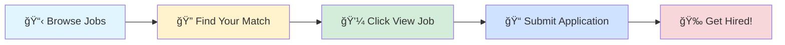

# 🚀 Tech Jobs Board

### Your Gateway to Amazing Career Opportunities

---

## 🎯 Browse by Job Profile

<table>
<tr>
<td align="center" width="25%">

 
<b>1000</b> total positions
</td>
<td align="center" width="25%">

 
<b>1000</b> total positions
</td>
<td align="center" width="25%">

 
<b>1000</b> total positions
</td>
<td align="center" width="25%">

 
<b>1000</b> total positions
</td>
</tr>
</table>

---

## 📊 Data Scientist

> 💼 **1000** positions available

<table>
<thead>
<tr>
<th width="20%">🏢 Company</th>
<th width="35%">💼 Role</th>
<th width="20%">📍 Location</th>
<th width="10%">⏰ Posted</th>
<th width="15%">🔗 Action</th>
</tr>
</thead>
<tbody>
<tr>
<td><a href="https://www.ambitionbox.com/overview/dataart-overview">Dataart Technologies</a></td>
<td>Quality Automation Specialist with UIpath</td>
<td>📍 Bangalore</td>
<td>1d ago</td>
<td align="center"></td>
</tr>
<tr>
<td><a href="https://www.ambitionbox.com/overview/meena-bazaar-overview">Meena Bazaar</a></td>
<td>Artificial Intelligence Intern</td>
<td>📍 Delhi</td>
<td>1d ago</td>
<td align="center"></td>
</tr>
<tr>
<td><a href="https://www.ambitionbox.com/overview/wits-innovation-lab-overview">Wits Innovation Lab</a></td>
<td>QA Automation Professional</td>
<td>📍 Mohali</td>
<td>1d ago</td>
<td align="center"></td>
</tr>
<tr>
<td>Cyber On Air</td>
<td>Data Scientist</td>
<td>📍 Ahmedabad</td>
<td>1d ago</td>
<td align="center"></td>
</tr>
<tr>
<td><a href="https://www.ambitionbox.com/overview/ust-overview">UST</a></td>
<td>L2 Engineer - AWS & Automation</td>
<td>📍 Thiruvananthapuram</td>
<td>1d ago</td>
<td align="center"></td>
</tr>
<tr>
<td><a href="https://www.ambitionbox.com/overview/ozrit-overview">Ozrit Ai Solutions</a></td>
<td>AI/ML</td>
<td>📍 Hyderabad</td>
<td>1d ago</td>
<td align="center"></td>
</tr>
<tr>
<td><a href="https://www.ambitionbox.com/overview/cleareye-dot-ai-overview">Cleareye Ai</a></td>
<td>Python Developer (Senior / Lead) (Immediate - 30 Days)</td>
<td>📍 Thiruvananthapuram</td>
<td>1d ago</td>
<td align="center"></td>
</tr>
<tr>
<td>Core Staffing Solutions Gurgaon</td>
<td>Data Developer- Azure</td>
<td>📍 Gurugram</td>
<td>1d ago</td>
<td align="center"></td>
</tr>
<tr>
<td><a href="https://www.ambitionbox.com/overview/equifax-overview">Equifax</a></td>
<td>Quality Automation Engineer (SDET) - Intermediate</td>
<td>📍 Kazhakkoottam</td>
<td>1d ago</td>
<td align="center"></td>
</tr>
<tr>
<td><a href="https://www.ambitionbox.com/overview/wits-innovation-lab-overview">Wits Innovation Lab</a></td>
<td>QA Automation</td>
<td>📍 Mohali</td>
<td>1d ago</td>
<td align="center"></td>
</tr>
<tr>
<td>Qrewz Ventures Opc Private Limited</td>
<td>Full Stack  Developer (Python & ReactJS)</td>
<td>📍 Thane, Mumbai</td>
<td>1d ago</td>
<td align="center"></td>
</tr>
<tr>
<td><a href="https://www.ambitionbox.com/overview/neosoft-technologies-overview">NeoSOFT</a></td>
<td>Python Fullstack Developer</td>
<td>📍 Pune</td>
<td>1d ago</td>
<td align="center"></td>
</tr>
<tr>
<td>Embarkgcc Services</td>
<td>Product Owner - AI/Data Science initiatives  - WT GS SCB</td>
<td>📍 Chennai, Bangalore</td>
<td>1d ago</td>
<td align="center"></td>
</tr>
<tr>
<td>Vikruthi Technologies</td>
<td>AI / ML Data Scientist - Lead</td>
<td>📍 Chennai</td>
<td>1d ago</td>
<td align="center"></td>
</tr>
<tr>
<td>Intelli Search Services</td>
<td>GCP Data Engineer</td>
<td>📍 Chennai, Hyderabad, Bangalore</td>
<td>1d ago</td>
<td align="center"></td>
</tr>
<tr>
<td><a href="https://www.ambitionbox.com/overview/ust-overview">UST</a></td>
<td>Tester III - Software Testing- Automation, Playwright</td>
<td>📍 Thiruvananthapuram</td>
<td>1d ago</td>
<td align="center"></td>
</tr>
<tr>
<td><a href="https://www.ambitionbox.com/overview/fint-solutions-overview">Fint Solutions</a></td>
<td>Azure DevOps Engineer</td>
<td>📍 Chennai</td>
<td>1d ago</td>
<td align="center"></td>
</tr>
<tr>
<td><a href="https://www.ambitionbox.com/overview/isocrates-overview">Isocrates</a></td>
<td>Lead Data Scientist</td>
<td>📍 Bangalore</td>
<td>1d ago</td>
<td align="center"></td>
</tr>
<tr>
<td><a href="https://www.ambitionbox.com/overview/innominds-software-overview">Innominds Software</a></td>
<td>Azure Devops Engineer</td>
<td>📍 Hyderabad</td>
<td>1d ago</td>
<td align="center"></td>
</tr>
<tr>
<td><a href="https://www.ambitionbox.com/overview/natwest-group-overview">Natwest Digitalx</a></td>
<td>Data Scientist</td>
<td>📍 Bangalore</td>
<td>1d ago</td>
<td align="center"></td>
</tr>
<tr>
<td><a href="https://www.ambitionbox.com/overview/tcs-overview">Tata Consultancy Services</a></td>
<td>Azure Data Engineer</td>
<td>📍 Mumbai, Bangalore</td>
<td>1d ago</td>
<td align="center"></td>
</tr>
<tr>
<td><a href="https://www.ambitionbox.com/overview/tcs-overview">Tata Consultancy Services</a></td>
<td>AWS Devops with teraform (Also Open For Hyd/Kochi/BBSR)</td>
<td>📍 Chennai, Pune, Bangalore</td>
<td>1d ago</td>
<td align="center"></td>
</tr>
<tr>
<td><a href="https://www.ambitionbox.com/overview/manufac-analytics-overview">Manufac Analytics</a></td>
<td>Node Js/Python  (Backend Developer)</td>
<td>📍 Gurugram</td>
<td>1d ago</td>
<td align="center"></td>
</tr>
<tr>
<td>Codeflix Consultancy Services</td>
<td>Python Fullstack Developer</td>
<td>📍 Coimbatore</td>
<td>1d ago</td>
<td align="center"></td>
</tr>
<tr>
<td><a href="https://www.ambitionbox.com/overview/dilip-buildcon-overview">Dilip Buildcon</a></td>
<td>Data Analytics Lead - Bhopal</td>
<td>📍 Bhopal</td>
<td>1d ago</td>
<td align="center"></td>
</tr>
<tr>
<td><a href="https://www.ambitionbox.com/overview/tcs-overview">Tata Consultancy Services</a></td>
<td>Aws Devops Engineer</td>
<td>📍 Pune</td>
<td>1d ago</td>
<td align="center"></td>
</tr>
<tr>
<td><a href="https://www.ambitionbox.com/overview/quinnox-overview">Quinnox</a></td>
<td>Ai Ml Engineer</td>
<td>📍 Mumbai, Bangalore</td>
<td>1d ago</td>
<td align="center"></td>
</tr>
<tr>
<td>Capital Placement Services</td>
<td>AWS/Azure Cloud Engineer</td>
<td>📍 Gurugram</td>
<td>1d ago</td>
<td align="center"></td>
</tr>
<tr>
<td><a href="https://www.ambitionbox.com/overview/reliance-bp-mobility-overview">Jio bp</a></td>
<td>Sr Manager Planning & Analytics</td>
<td>📍 Mumbai</td>
<td>1d ago</td>
<td align="center"></td>
</tr>
<tr>
<td>SRS Infoway</td>
<td>Machine Learning Engineer</td>
<td>📍 Pune, Hyderabad, Chennai</td>
<td>1d ago</td>
<td align="center"></td>
</tr>
<tr>
<td><a href="https://www.ambitionbox.com/overview/accenture-overview">Accenture</a></td>
<td>Test Automation Engineer</td>
<td>📍 Bangalore</td>
<td>1d ago</td>
<td align="center"></td>
</tr>
<tr>
<td><a href="https://www.ambitionbox.com/overview/comvision-overview">Comvision</a></td>
<td>Senior Python Developer</td>
<td>📍 Gurugram</td>
<td>1d ago</td>
<td align="center"></td>
</tr>
<tr>
<td><a href="https://www.ambitionbox.com/overview/deloitte-overview">Deloitte Consulting</a></td>
<td>AWS Data Engineer</td>
<td>📍 Hyderabad</td>
<td>1d ago</td>
<td align="center"></td>
</tr>
<tr>
<td><a href="https://www.ambitionbox.com/overview/accenture-overview">Accenture</a></td>
<td>Test Automation Engineer</td>
<td>📍 Bangalore</td>
<td>1d ago</td>
<td align="center"></td>
</tr>
<tr>
<td><a href="https://www.ambitionbox.com/overview/accenture-overview">Accenture</a></td>
<td>CAT Modeling & Analytics Sr Analyst</td>
<td>📍 Bangalore</td>
<td>1d ago</td>
<td align="center"></td>
</tr>
<tr>
<td><a href="https://www.ambitionbox.com/overview/constellation-technologies-overview">Constellation Technologies</a></td>
<td>.Net Azure Developer</td>
<td>📍 Hyderabad</td>
<td>1d ago</td>
<td align="center"></td>
</tr>
<tr>
<td><a href="https://www.ambitionbox.com/overview/accenture-overview">Accenture</a></td>
<td>Test Automation Engineer</td>
<td>📍 Bangalore</td>
<td>1d ago</td>
<td align="center"></td>
</tr>
<tr>
<td><a href="https://www.ambitionbox.com/overview/ernst-young-overview">EY</a></td>
<td>Python Developer</td>
<td>📍 Pune, Hyderabad, Bangalore</td>
<td>1d ago</td>
<td align="center"></td>
</tr>
<tr>
<td><a href="https://www.ambitionbox.com/overview/deloitte-overview">Deloitte Consulting</a></td>
<td>Python Data Engineers</td>
<td>📍 Hyderabad</td>
<td>1d ago</td>
<td align="center"></td>
</tr>
<tr>
<td>Enrich And Enlight Business Consulting</td>
<td>AML- Transaction Monitoring</td>
<td>📍 Chennai</td>
<td>1d ago</td>
<td align="center"></td>
</tr>
<tr>
<td><a href="https://www.ambitionbox.com/overview/writer-corporation-overview">Writer Corporation</a></td>
<td>Azure Data Engineer</td>
<td>📍 Dubai</td>
<td>1d ago</td>
<td align="center"></td>
</tr>
<tr>
<td><a href="https://www.ambitionbox.com/overview/techvantage-systems-overview">TechVantage</a></td>
<td>Automation Test Engineer</td>
<td>📍 Thiruvananthapuram</td>
<td>1d ago</td>
<td align="center"></td>
</tr>
<tr>
<td>Naukri Expert Assist</td>
<td>Python Developer</td>
<td>📍 Noida, Gurugram, Bangalore</td>
<td>1d ago</td>
<td align="center"></td>
</tr>
<tr>
<td><a href="https://www.ambitionbox.com/overview/deloitte-overview">Deloitte Consulting</a></td>
<td>Machine Learning Engineer</td>
<td>📍 Hyderabad</td>
<td>1d ago</td>
<td align="center"></td>
</tr>
<tr>
<td><a href="https://www.ambitionbox.com/overview/wells-fargo-overview">Wells Fargo</a></td>
<td>Senior Balance Sheet Management Analyst - Python Developer</td>
<td>📍 Bangalore</td>
<td>1d ago</td>
<td align="center"></td>
</tr>
<tr>
<td><a href="https://www.ambitionbox.com/overview/wells-fargo-overview">Wells Fargo</a></td>
<td>Market Risk Model Performance Monitoring Professional</td>
<td>📍 Hyderabad</td>
<td>1d ago</td>
<td align="center"></td>
</tr>
<tr>
<td><a href="https://www.ambitionbox.com/overview/happlabs-software-overview">HappLabs</a></td>
<td>Python Developer (Immediate joinee preferred)</td>
<td>📍 Bangalore</td>
<td>1d ago</td>
<td align="center"></td>
</tr>
<tr>
<td>Capital Placement Services</td>
<td>R&D (Analytical Development)</td>
<td>📍 Bharuch</td>
<td>1d ago</td>
<td align="center"></td>
</tr>
<tr>
<td>One Prosource</td>
<td>Data Scientist</td>
<td>📍 Bangalore</td>
<td>1d ago</td>
<td align="center"></td>
</tr>
<tr>
<td>Authorasist Hyderabad</td>
<td>Vmware System Administrator/Storage Admin/Automation Infra/CISCO UCS</td>
<td>📍 Pune, Hyderabad, Bangalore</td>
<td>1d ago</td>
<td align="center"></td>
</tr>
<tr>
<td>Jero Technologies</td>
<td>Data Engineer | Data Analyst | SQL| Python | Excel</td>
<td>📍 Pune, Mumbai</td>
<td>1d ago</td>
<td align="center"></td>
</tr>
<tr>
<td><a href="https://www.ambitionbox.com/overview/softices-overview">Softices Consultancy</a></td>
<td>Python (Django) Developer</td>
<td>📍 Gujarat</td>
<td>1d ago</td>
<td align="center"></td>
</tr>
<tr>
<td><a href="https://www.ambitionbox.com/overview/altered-security-overview">Altered Security</a></td>
<td>Azure Security Researcher (Remote)</td>
<td>📍 Kakinada</td>
<td>1d ago</td>
<td align="center"></td>
</tr>
<tr>
<td><a href="https://www.ambitionbox.com/overview/altered-security-overview">Altered Security</a></td>
<td>Azure Security Researcher (Remote)</td>
<td>📍 Thiruvananthapuram</td>
<td>1d ago</td>
<td align="center"></td>
</tr>
<tr>
<td><a href="https://www.ambitionbox.com/overview/soul-ai-overview">Soul Ai</a></td>
<td>Computer Science Research Annotator</td>
<td>📍 Delhi, Mumbai, Bangalore</td>
<td>1d ago</td>
<td align="center"></td>
</tr>
<tr>
<td><a href="https://www.ambitionbox.com/overview/wells-fargo-overview">Wells Fargo</a></td>
<td>Senior Analytics Consultant</td>
<td>📍 Bangalore</td>
<td>1d ago</td>
<td align="center"></td>
</tr>
<tr>
<td><a href="https://www.ambitionbox.com/overview/wells-fargo-overview">Wells Fargo</a></td>
<td>Analytics Consultant</td>
<td>📍 Hyderabad</td>
<td>1d ago</td>
<td align="center"></td>
</tr>
<tr>
<td><a href="https://www.ambitionbox.com/overview/anovip-overview">Anovip</a></td>
<td>AM/Manager - Patent Analytics (ECE/Mechanical/CS)</td>
<td>📍 Noida</td>
<td>1d ago</td>
<td align="center"></td>
</tr>
<tr>
<td><a href="https://www.ambitionbox.com/overview/robotico-overview">Robotico</a></td>
<td>AWS Connect Developer</td>
<td>📍 Mumbai, Bangalore, Delhi</td>
<td>1d ago</td>
<td align="center"></td>
</tr>
<tr>
<td>Cste International</td>
<td>AI-First Automation Professional

</td>
<td>📍 Delhi</td>
<td>1d ago</td>
<td align="center"></td>
</tr>
<tr>
<td>Suzva Software Technologies</td>
<td>Azure Data Tech Lead / Sr. Azure Data Engineer</td>
<td>📍 Chennai</td>
<td>1d ago</td>
<td align="center"></td>
</tr>
<tr>
<td>Suzva Software Technologies</td>
<td>AI Lead Engineer AWS Solutions Architect, AWS Machine Learning</td>
<td>📍 Hyderabad</td>
<td>1d ago</td>
<td align="center"></td>
</tr>
<tr>
<td>Suzva Software Technologies</td>
<td>Lead AI/ML/NLP Engineer</td>
<td>📍 Chennai, Bangalore</td>
<td>1d ago</td>
<td align="center"></td>
</tr>
<tr>
<td>Suzva Software Technologies</td>
<td>Data Scientist / Senior Data Scientist</td>
<td>📍 Mumbai, Delhi, Bangalore</td>
<td>1d ago</td>
<td align="center"></td>
</tr>
<tr>
<td>Suzva Software Technologies</td>
<td>Azure Data Engineer – Senior / Lead</td>
<td>📍 Hyderabad</td>
<td>1d ago</td>
<td align="center"></td>
</tr>
<tr>
<td>Suzva Software Technologies</td>
<td>Machine Learning Engineer | Contract Role</td>
<td>📍 Delhi, Mumbai, Bangalore</td>
<td>1d ago</td>
<td align="center"></td>
</tr>
<tr>
<td><a href="https://fr.linkedin.com/company/primaa">Primaa</a></td>
<td>AI Platform / ML Engineer</td>
<td>📍 Paris, Île-de-France, France</td>
<td>1d ago</td>
<td align="center"></td>
</tr>
<tr>
<td><a href="https://www.ambitionbox.com/overview/cby-services-overview">CBY Services</a></td>
<td>DevOps Engineer L3 Azure</td>
<td>📍 Mumbai</td>
<td>1d ago</td>
<td align="center"></td>
</tr>
<tr>
<td><a href="https://www.ambitionbox.com/overview/cambium-networks-overview">Cambium Networks</a></td>
<td>Test Automation Engineer</td>
<td>📍 Bangalore</td>
<td>1d ago</td>
<td align="center"></td>
</tr>
<tr>
<td><a href="https://www.ambitionbox.com/overview/bombay-softwares-overview">Bombay Softwares</a></td>
<td>SDE 2 Python Developer</td>
<td>📍 Mumbai</td>
<td>1d ago</td>
<td align="center"></td>
</tr>
<tr>
<td><a href="https://www.ambitionbox.com/overview/bombay-softwares-overview">Bombay Softwares</a></td>
<td>Senior Software Engineer Python</td>
<td>📍 Navi Mumbai</td>
<td>1d ago</td>
<td align="center"></td>
</tr>
<tr>
<td><a href="https://www.ambitionbox.com/overview/bombay-softwares-overview">Bombay Softwares</a></td>
<td>SDE 2 Python/Django Developer</td>
<td>📍 Mumbai</td>
<td>1d ago</td>
<td align="center"></td>
</tr>
<tr>
<td><a href="https://www.ambitionbox.com/overview/razorthink-overview">Razorthink</a></td>
<td>ML Engineer</td>
<td>📍 Bangalore</td>
<td>1d ago</td>
<td align="center"></td>
</tr>
<tr>
<td><a href="https://www.ambitionbox.com/overview/razorthink-overview">Razorthink</a></td>
<td>Data Scientist</td>
<td>📍 Mumbai, Delhi, Bangalore</td>
<td>1d ago</td>
<td align="center"></td>
</tr>
<tr>
<td><a href="https://www.ambitionbox.com/overview/razorthink-overview">Razorthink</a></td>
<td>AI/ML Developer (LLMs & Prompt Engineering) – Python & AI</td>
<td>📍 Mumbai, Delhi, Bangalore</td>
<td>1d ago</td>
<td align="center"></td>
</tr>
<tr>
<td><a href="https://www.ambitionbox.com/overview/razorthink-overview">Razorthink</a></td>
<td>Data Scientist</td>
<td>📍 Bangalore</td>
<td>1d ago</td>
<td align="center"></td>
</tr>
<tr>
<td><a href="https://www.ambitionbox.com/overview/wells-fargo-overview">Wells Fargo</a></td>
<td>Senior Software Engineer-Agile, azure, SQL and .net</td>
<td>📍 Hyderabad</td>
<td>1d ago</td>
<td align="center"></td>
</tr>
<tr>
<td><a href="https://www.ambitionbox.com/overview/mostedge-overview">Mostedge</a></td>
<td>Data Analytics Manager</td>
<td>📍 Hyderabad</td>
<td>1d ago</td>
<td align="center"></td>
</tr>
<tr>
<td><a href="https://www.ambitionbox.com/overview/mostedge-overview">Mostedge</a></td>
<td>AI / ML Engineer</td>
<td>📍 Ahmedabad, Vadodara</td>
<td>1d ago</td>
<td align="center"></td>
</tr>
<tr>
<td><a href="https://www.ambitionbox.com/overview/neudeep-technologies-overview">Neudeep Technologies</a></td>
<td>Automation Engineer - CI/CD Pipeline</td>
<td>📍 Pune, Bangalore</td>
<td>1d ago</td>
<td align="center"></td>
</tr>
<tr>
<td>Tekskills</td>
<td>Azure Data Engineer</td>
<td>📍 Pune, Hyderabad, Bangalore</td>
<td>1d ago</td>
<td align="center"></td>
</tr>
<tr>
<td><a href="https://www.ambitionbox.com/overview/lateshipment-dot-com-overview">LateShipment.com</a></td>
<td>Senior Software Engineer - Process Automation with Prior US Experience</td>
<td>📍 Chennai</td>
<td>1d ago</td>
<td align="center"></td>
</tr>
<tr>
<td><a href="https://www.ambitionbox.com/overview/tech-holding-overview">Tech Holding</a></td>
<td>GCP Data Engineer</td>
<td>📍 Pune</td>
<td>1d ago</td>
<td align="center"></td>
</tr>
<tr>
<td><a href="https://www.ambitionbox.com/overview/vichara-technologies-overview">Vichara Technologies</a></td>
<td>Associate, Risk Reporting & Analytics</td>
<td>📍 Mumbai, Hyderabad</td>
<td>1d ago</td>
<td align="center"></td>
</tr>
<tr>
<td><a href="https://www.ambitionbox.com/overview/tcs-overview">Tata Consultancy Services</a></td>
<td>Azure Devops Engineer</td>
<td>📍 Pune, Hyderabad, Bangalore</td>
<td>1d ago</td>
<td align="center"></td>
</tr>
<tr>
<td><a href="https://www.ambitionbox.com/overview/clicflyer-overview">Clicflyer</a></td>
<td>Artificial Intelligence & Machine Learning Engineer</td>
<td>📍 Gurugram</td>
<td>1d ago</td>
<td align="center"></td>
</tr>
<tr>
<td><a href="https://www.linkedin.com/company/syntel-private-limited">Accenture services Pvt Ltd</a></td>
<td>AI / ML Engineer</td>
<td>📍 Pune</td>
<td>1d ago</td>
<td align="center"></td>
</tr>
<tr>
<td><a href="https://www.ambitionbox.com/overview/tcs-overview">Tata Consultancy Services</a></td>
<td>Aws Data Engineer</td>
<td>📍 Pune</td>
<td>1d ago</td>
<td align="center"></td>
</tr>
<tr>
<td><a href="https://www.ambitionbox.com/overview/getronics-overview">Getronics</a></td>
<td>Openings - GCP Data Engineer | Getronics Solutions| Chennai</td>
<td>📍 Chennai</td>
<td>1d ago</td>
<td align="center"></td>
</tr>
<tr>
<td><a href="https://www.ambitionbox.com/overview/bay-area-technology-solutions-overview">BAY Area Technology Solutions</a></td>
<td>Azure Devops Engineer</td>
<td>📍 Bangalore</td>
<td>1d ago</td>
<td align="center"></td>
</tr>
<tr>
<td><a href="https://www.ambitionbox.com/overview/innova-am-tech-overview">Innova AM Tech</a></td>
<td>Data Visualization / Qlik sense Engineer</td>
<td>📍 Bangalore</td>
<td>1d ago</td>
<td align="center"></td>
</tr>
<tr>
<td><a href="https://www.ambitionbox.com/overview/innova-am-tech-overview">Innova AM Tech</a></td>
<td>SQL Developer - SSAS & AWS (5-7 yrs)</td>
<td>📍 Bangalore</td>
<td>1d ago</td>
<td align="center"></td>
</tr>
<tr>
<td><a href="https://www.ambitionbox.com/overview/adwest-digital-overview">Adwest Digital</a></td>
<td>Senior SQL Developer</td>
<td>📍 Delhi, Bangalore</td>
<td>1d ago</td>
<td align="center"></td>
</tr>
<tr>
<td><a href="https://www.ambitionbox.com/overview/purecode-software-overview">Purecode Software</a></td>
<td>DevOps Engineer – Azure Devops Engineer</td>
<td></td>
<td>1d ago</td>
<td align="center"></td>
</tr>
<tr>
<td><a href="https://www.ambitionbox.com/overview/evnek-overview">Evnek</a></td>
<td>Statistical Analytics Engineer</td>
<td>📍 Bangalore</td>
<td>1d ago</td>
<td align="center"></td>
</tr>
<tr>
<td><a href="https://www.ambitionbox.com/overview/evnek-overview">Evnek</a></td>
<td>Tosca Automation Test Engineer</td>
<td>📍 Pune, Hyderabad, Bangalore</td>
<td>1d ago</td>
<td align="center"></td>
</tr>
<tr>
<td><a href="https://www.ambitionbox.com/overview/evnek-overview">Evnek</a></td>
<td>Data Scientist</td>
<td>📍 Bangalore</td>
<td>1d ago</td>
<td align="center"></td>
</tr>
<tr>
<td><a href="https://www.ambitionbox.com/overview/evnek-overview">Evnek</a></td>
<td>AI/ML Engineer( LLM Specialist)</td>
<td>📍 Bangalore</td>
<td>1d ago</td>
<td align="center"></td>
</tr>
<tr>
<td><a href="https://www.ambitionbox.com/overview/the-henson-group-overview">Henson Group</a></td>
<td>Azure DevOps Engineer</td>
<td>📍 Mumbai, Delhi, Bangalore</td>
<td>1d ago</td>
<td align="center"></td>
</tr>
<tr>
<td><a href="https://www.ambitionbox.com/overview/saasvaap-techies-overview">Saasvaap Techies</a></td>
<td>AWS Cloud Engineer</td>
<td></td>
<td>1d ago</td>
<td align="center"></td>
</tr>
<tr><td colspan="5" align="center"><i>... and 900 more positions</i></td></tr>
</tbody>
</table>

---

## 💼 Business Analyst

> 💼 **1000** positions available

<table>
<thead>
<tr>
<th width="20%">🏢 Company</th>
<th width="35%">💼 Role</th>
<th width="20%">📍 Location</th>
<th width="10%">⏰ Posted</th>
<th width="15%">🔗 Action</th>
</tr>
</thead>
<tbody>
<tr>
<td><a href="https://www.ambitionbox.com/overview/dataart-overview">Dataart Technologies</a></td>
<td>Quality Automation Specialist with UIpath</td>
<td>📍 Bangalore</td>
<td>1d ago</td>
<td align="center"></td>
</tr>
<tr>
<td><a href="https://www.ambitionbox.com/overview/merkle-b2b-overview">Merkle B2b</a></td>
<td>Senior Business Analyst</td>
<td>📍 Pune</td>
<td>1d ago</td>
<td align="center"></td>
</tr>
<tr>
<td><a href="https://www.ambitionbox.com/overview/ltimindtree-overview">Ltimindtree</a></td>
<td>Scrum Master-Chennai/Mumbai</td>
<td>📍 Chennai, Mumbai</td>
<td>1d ago</td>
<td align="center"></td>
</tr>
<tr>
<td><a href="https://www.ambitionbox.com/overview/aizant-drug-research-solutions-overview">Aizant</a></td>
<td>Executive - Project Management (Formulation CMO)</td>
<td>📍 Hyderabad</td>
<td>1d ago</td>
<td align="center"></td>
</tr>
<tr>
<td><a href="https://www.ambitionbox.com/overview/wits-innovation-lab-overview">Wits Innovation Lab</a></td>
<td>QA Automation Professional</td>
<td>📍 Mohali</td>
<td>1d ago</td>
<td align="center"></td>
</tr>
<tr>
<td><a href="https://www.ambitionbox.com/overview/ust-overview">UST</a></td>
<td>L2 Engineer - AWS & Automation</td>
<td>📍 Thiruvananthapuram</td>
<td>1d ago</td>
<td align="center"></td>
</tr>
<tr>
<td><a href="https://www.ambitionbox.com/overview/cleareye-dot-ai-overview">Cleareye Ai</a></td>
<td>Python Developer (Senior / Lead) (Immediate - 30 Days)</td>
<td>📍 Thiruvananthapuram</td>
<td>1d ago</td>
<td align="center"></td>
</tr>
<tr>
<td><a href="https://www.ambitionbox.com/overview/kotak-mahindra-bank-overview">Kotak Mahindra Bank</a></td>
<td>Business Analyst - AML</td>
<td>📍 Mumbai</td>
<td>1d ago</td>
<td align="center"></td>
</tr>
<tr>
<td><a href="https://www.ambitionbox.com/overview/equifax-overview">Equifax</a></td>
<td>Quality Automation Engineer (SDET) - Intermediate</td>
<td>📍 Kazhakkoottam</td>
<td>1d ago</td>
<td align="center"></td>
</tr>
<tr>
<td><a href="https://www.ambitionbox.com/overview/wits-innovation-lab-overview">Wits Innovation Lab</a></td>
<td>QA Automation</td>
<td>📍 Mohali</td>
<td>1d ago</td>
<td align="center"></td>
</tr>
<tr>
<td>Qrewz Ventures Opc Private Limited</td>
<td>Full Stack  Developer (Python & ReactJS)</td>
<td>📍 Thane, Mumbai</td>
<td>1d ago</td>
<td align="center"></td>
</tr>
<tr>
<td><a href="https://www.ambitionbox.com/overview/guidehouse-overview">Guidehouse</a></td>
<td>Senior Salesforce Developer</td>
<td>📍 Chennai</td>
<td>1d ago</td>
<td align="center"></td>
</tr>
<tr>
<td><a href="https://www.ambitionbox.com/overview/neosoft-technologies-overview">NeoSOFT</a></td>
<td>Python Fullstack Developer</td>
<td>📍 Pune</td>
<td>1d ago</td>
<td align="center"></td>
</tr>
<tr>
<td>Embarkgcc Services</td>
<td>MIFID/FINRA- Business Analyst/Project Manager  - WT GS SCB</td>
<td>📍 Bangalore</td>
<td>1d ago</td>
<td align="center"></td>
</tr>
<tr>
<td>Processautometa Llp</td>
<td>Salesforce Field Service Developers</td>
<td>📍 Bangalore</td>
<td>1d ago</td>
<td align="center"></td>
</tr>
<tr>
<td><a href="https://www.ambitionbox.com/overview/ust-overview">UST</a></td>
<td>Tester III - Software Testing- Automation, Playwright</td>
<td>📍 Thiruvananthapuram</td>
<td>1d ago</td>
<td align="center"></td>
</tr>
<tr>
<td>Fashionc Overseas Exports</td>
<td>Founder's office Executive/Business Analyst</td>
<td>📍 Noida</td>
<td>1d ago</td>
<td align="center"></td>
</tr>
<tr>
<td><a href="https://www.ambitionbox.com/overview/manufac-analytics-overview">Manufac Analytics</a></td>
<td>Node Js/Python  (Backend Developer)</td>
<td>📍 Gurugram</td>
<td>1d ago</td>
<td align="center"></td>
</tr>
<tr>
<td>Codeflix Consultancy Services</td>
<td>Python Fullstack Developer</td>
<td>📍 Coimbatore</td>
<td>1d ago</td>
<td align="center"></td>
</tr>
<tr>
<td><a href="https://www.ambitionbox.com/overview/dilip-buildcon-overview">Dilip Buildcon</a></td>
<td>Data Analytics Lead - Bhopal</td>
<td>📍 Bhopal</td>
<td>1d ago</td>
<td align="center"></td>
</tr>
<tr>
<td><a href="https://www.ambitionbox.com/overview/sincro-overview">Sincro </a></td>
<td>Salesforce Architect - DealerOn(Product Company)- Pune - Night Shift</td>
<td>📍 Pune</td>
<td>1d ago</td>
<td align="center"></td>
</tr>
<tr>
<td><a href="https://www.ambitionbox.com/overview/systechcorp-overview">Systechcorp Inc</a></td>
<td>Power BI</td>
<td>📍 Gurugram</td>
<td>1d ago</td>
<td align="center"></td>
</tr>
<tr>
<td><a href="https://www.ambitionbox.com/overview/reliance-bp-mobility-overview">Jio bp</a></td>
<td>Sr Manager Planning & Analytics</td>
<td>📍 Mumbai</td>
<td>1d ago</td>
<td align="center"></td>
</tr>
<tr>
<td><a href="https://www.ambitionbox.com/overview/accenture-overview">Accenture</a></td>
<td>Test Automation Engineer</td>
<td>📍 Bangalore</td>
<td>1d ago</td>
<td align="center"></td>
</tr>
<tr>
<td><a href="https://www.ambitionbox.com/overview/comvision-overview">Comvision</a></td>
<td>Senior Python Developer</td>
<td>📍 Gurugram</td>
<td>1d ago</td>
<td align="center"></td>
</tr>
<tr>
<td><a href="https://www.ambitionbox.com/overview/accenture-overview">Accenture</a></td>
<td>Test Automation Engineer</td>
<td>📍 Bangalore</td>
<td>1d ago</td>
<td align="center"></td>
</tr>
<tr>
<td><a href="https://www.ambitionbox.com/overview/accenture-overview">Accenture</a></td>
<td>CAT Modeling & Analytics Sr Analyst</td>
<td>📍 Bangalore</td>
<td>1d ago</td>
<td align="center"></td>
</tr>
<tr>
<td><a href="https://www.ambitionbox.com/overview/aventior-digital-overview">Aventior Digital</a></td>
<td>Business Analyst/Quality Assurance (BA/QA)</td>
<td></td>
<td>1d ago</td>
<td align="center"></td>
</tr>
<tr>
<td><a href="https://www.ambitionbox.com/overview/accenture-overview">Accenture</a></td>
<td>Business Analyst</td>
<td>📍 Bangalore</td>
<td>1d ago</td>
<td align="center"></td>
</tr>
<tr>
<td><a href="https://www.ambitionbox.com/overview/accenture-overview">Accenture</a></td>
<td>Business Analyst</td>
<td>📍 Chennai</td>
<td>1d ago</td>
<td align="center"></td>
</tr>
<tr>
<td>Techno Facts Solutions</td>
<td>Business Analyst</td>
<td>📍 Gurugram, Hyderabad, Bangalore</td>
<td>1d ago</td>
<td align="center"></td>
</tr>
<tr>
<td><a href="https://www.ambitionbox.com/overview/accenture-overview">Accenture</a></td>
<td>Test Automation Engineer</td>
<td>📍 Bangalore</td>
<td>1d ago</td>
<td align="center"></td>
</tr>
<tr>
<td><a href="https://www.ambitionbox.com/overview/ernst-young-overview">EY</a></td>
<td>Python Developer</td>
<td>📍 Pune, Hyderabad, Bangalore</td>
<td>1d ago</td>
<td align="center"></td>
</tr>
<tr>
<td><a href="https://www.ambitionbox.com/overview/deloitte-overview">Deloitte Consulting</a></td>
<td>Python Data Engineers</td>
<td>📍 Hyderabad</td>
<td>1d ago</td>
<td align="center"></td>
</tr>
<tr>
<td><a href="https://www.ambitionbox.com/overview/sun-pharmaceutical-industries-overview">Sun Pharma</a></td>
<td>Senior Manager - FRD Non Orals</td>
<td>📍 Vadodara</td>
<td>1d ago</td>
<td align="center"></td>
</tr>
<tr>
<td>Talent Corner Hr Services</td>
<td>Salesforce Developer</td>
<td>📍 Noida</td>
<td>1d ago</td>
<td align="center"></td>
</tr>
<tr>
<td><a href="https://www.ambitionbox.com/overview/goboult-overview">Exotic Mile</a></td>
<td>Business Analyst- D2C Operations</td>
<td>📍 Gurugram</td>
<td>1d ago</td>
<td align="center"></td>
</tr>
<tr>
<td><a href="https://www.ambitionbox.com/overview/techvantage-systems-overview">TechVantage</a></td>
<td>Automation Test Engineer</td>
<td>📍 Thiruvananthapuram</td>
<td>1d ago</td>
<td align="center"></td>
</tr>
<tr>
<td>Naukri Expert Assist</td>
<td>Python Developer</td>
<td>📍 Noida, Gurugram, Bangalore</td>
<td>1d ago</td>
<td align="center"></td>
</tr>
<tr>
<td>N53 TECHWORKS LLP</td>
<td>Salesforce Developer</td>
<td>📍 Mumbai</td>
<td>1d ago</td>
<td align="center"></td>
</tr>
<tr>
<td><a href="https://www.ambitionbox.com/overview/wells-fargo-overview">Wells Fargo</a></td>
<td>Senior Balance Sheet Management Analyst - Python Developer</td>
<td>📍 Bangalore</td>
<td>1d ago</td>
<td align="center"></td>
</tr>
<tr>
<td><a href="https://www.ambitionbox.com/overview/subtlelabs-software-solutions-overview">Subtlelabs</a></td>
<td>Power Bi Developer</td>
<td>📍 Noida</td>
<td>1d ago</td>
<td align="center"></td>
</tr>
<tr>
<td><a href="https://www.ambitionbox.com/overview/happlabs-software-overview">HappLabs</a></td>
<td>Python Developer (Immediate joinee preferred)</td>
<td>📍 Bangalore</td>
<td>1d ago</td>
<td align="center"></td>
</tr>
<tr>
<td>Capital Placement Services</td>
<td>R&D (Analytical Development)</td>
<td>📍 Bharuch</td>
<td>1d ago</td>
<td align="center"></td>
</tr>
<tr>
<td>Talent Hired-the Job Store</td>
<td>Business Analyst</td>
<td>📍 Chennai</td>
<td>1d ago</td>
<td align="center"></td>
</tr>
<tr>
<td><a href="https://www.ambitionbox.com/overview/shilpa-medicare-overview">Shilpa Medicare</a></td>
<td>Project Management Manager</td>
<td>📍 Hyderabad</td>
<td>1d ago</td>
<td align="center"></td>
</tr>
<tr>
<td>Authorasist Hyderabad</td>
<td>Vmware System Administrator/Storage Admin/Automation Infra/CISCO UCS</td>
<td>📍 Pune, Hyderabad, Bangalore</td>
<td>1d ago</td>
<td align="center"></td>
</tr>
<tr>
<td>Jero Technologies</td>
<td>Data Engineer | Data Analyst | SQL| Python | Excel</td>
<td>📍 Pune, Mumbai</td>
<td>1d ago</td>
<td align="center"></td>
</tr>
<tr>
<td><a href="https://www.ambitionbox.com/overview/softices-overview">Softices Consultancy</a></td>
<td>Python (Django) Developer</td>
<td>📍 Gujarat</td>
<td>1d ago</td>
<td align="center"></td>
</tr>
<tr>
<td><a href="https://www.ambitionbox.com/overview/soul-ai-overview">Soul Ai</a></td>
<td>Computer Science Research Annotator</td>
<td>📍 Delhi, Mumbai, Bangalore</td>
<td>1d ago</td>
<td align="center"></td>
</tr>
<tr>
<td><a href="https://www.ambitionbox.com/overview/bitespeed-overview">Bitespeed</a></td>
<td>Business Analyst</td>
<td>📍 Bangalore</td>
<td>1d ago</td>
<td align="center"></td>
</tr>
<tr>
<td><a href="https://www.ambitionbox.com/overview/wells-fargo-overview">Wells Fargo</a></td>
<td>Senior Analytics Consultant</td>
<td>📍 Bangalore</td>
<td>1d ago</td>
<td align="center"></td>
</tr>
<tr>
<td><a href="https://www.ambitionbox.com/overview/wells-fargo-overview">Wells Fargo</a></td>
<td>Analytics Consultant</td>
<td>📍 Hyderabad</td>
<td>1d ago</td>
<td align="center"></td>
</tr>
<tr>
<td><a href="https://www.ambitionbox.com/overview/anovip-overview">Anovip</a></td>
<td>AM/Manager - Patent Analytics (ECE/Mechanical/CS)</td>
<td>📍 Noida</td>
<td>1d ago</td>
<td align="center"></td>
</tr>
<tr>
<td><a href="https://www.ambitionbox.com/overview/netzwerk-dot-ai-overview">Netzwerk.Ai</a></td>
<td>SR. ODOO Business Analyst / ODOO Implementation Specialist</td>
<td>📍 Coimbatore, Bangalore</td>
<td>1d ago</td>
<td align="center"></td>
</tr>
<tr>
<td>Cste International</td>
<td>AI-First Automation Professional

</td>
<td>📍 Delhi</td>
<td>1d ago</td>
<td align="center"></td>
</tr>
<tr>
<td>Techno Facts Solutions</td>
<td>Business Analyst</td>
<td>📍 Noida, Hyderabad, Bangalore</td>
<td>1d ago</td>
<td align="center"></td>
</tr>
<tr>
<td>Black And White Business Solutions</td>
<td>Senior Business Analyst</td>
<td>📍 Bangalore</td>
<td>1d ago</td>
<td align="center"></td>
</tr>
<tr>
<td><a href="https://www.ambitionbox.com/overview/cambium-networks-overview">Cambium Networks</a></td>
<td>Test Automation Engineer</td>
<td>📍 Bangalore</td>
<td>1d ago</td>
<td align="center"></td>
</tr>
<tr>
<td><a href="https://www.ambitionbox.com/overview/bombay-softwares-overview">Bombay Softwares</a></td>
<td>SDE 2 Python Developer</td>
<td>📍 Mumbai</td>
<td>1d ago</td>
<td align="center"></td>
</tr>
<tr>
<td><a href="https://www.ambitionbox.com/overview/bombay-softwares-overview">Bombay Softwares</a></td>
<td>Business Analyst Project Documentation & Coordination</td>
<td>📍 Ahmedabad</td>
<td>1d ago</td>
<td align="center"></td>
</tr>
<tr>
<td><a href="https://www.ambitionbox.com/overview/bombay-softwares-overview">Bombay Softwares</a></td>
<td>Senior Software Engineer Python</td>
<td>📍 Navi Mumbai</td>
<td>1d ago</td>
<td align="center"></td>
</tr>
<tr>
<td><a href="https://www.ambitionbox.com/overview/bombay-softwares-overview">Bombay Softwares</a></td>
<td>SDE 2 Python/Django Developer</td>
<td>📍 Mumbai</td>
<td>1d ago</td>
<td align="center"></td>
</tr>
<tr>
<td><a href="https://www.ambitionbox.com/overview/razorthink-overview">Razorthink</a></td>
<td>AI/ML Developer (LLMs & Prompt Engineering) – Python & AI</td>
<td>📍 Mumbai, Delhi, Bangalore</td>
<td>1d ago</td>
<td align="center"></td>
</tr>
<tr>
<td><a href="https://www.ambitionbox.com/overview/razorthink-overview">Razorthink</a></td>
<td>Business Analyst – Retirement Planning</td>
<td>📍 Mumbai, Bangalore, Delhi</td>
<td>1d ago</td>
<td align="center"></td>
</tr>
<tr>
<td><a href="https://www.ambitionbox.com/overview/razorthink-overview">Razorthink</a></td>
<td>Business Analyst - Retirement AI</td>
<td>📍 Mumbai, Delhi, Bangalore</td>
<td>1d ago</td>
<td align="center"></td>
</tr>
<tr>
<td><a href="https://www.ambitionbox.com/overview/wells-fargo-overview">Wells Fargo</a></td>
<td>Senior Software Engineer-Agile, azure, SQL and .net</td>
<td>📍 Hyderabad</td>
<td>1d ago</td>
<td align="center"></td>
</tr>
<tr>
<td><a href="https://www.ambitionbox.com/overview/mostedge-overview">Mostedge</a></td>
<td>Data Analytics Manager</td>
<td>📍 Hyderabad</td>
<td>1d ago</td>
<td align="center"></td>
</tr>
<tr>
<td>Black And White Business Solutions</td>
<td>Junior Business Analyst</td>
<td>📍 Bangalore</td>
<td>1d ago</td>
<td align="center"></td>
</tr>
<tr>
<td><a href="https://www.ambitionbox.com/overview/mostedge-overview">Mostedge</a></td>
<td>Scrum Master</td>
<td>📍 Hyderabad</td>
<td>1d ago</td>
<td align="center"></td>
</tr>
<tr>
<td><a href="https://www.ambitionbox.com/overview/neudeep-technologies-overview">Neudeep Technologies</a></td>
<td>Automation Engineer - CI/CD Pipeline</td>
<td>📍 Pune, Bangalore</td>
<td>1d ago</td>
<td align="center"></td>
</tr>
<tr>
<td><a href="https://www.ambitionbox.com/overview/lateshipment-dot-com-overview">LateShipment.com</a></td>
<td>Senior Software Engineer - Process Automation with Prior US Experience</td>
<td>📍 Chennai</td>
<td>1d ago</td>
<td align="center"></td>
</tr>
<tr>
<td><a href="https://www.ambitionbox.com/overview/vichara-technologies-overview">Vichara Technologies</a></td>
<td>Associate, Risk Reporting & Analytics</td>
<td>📍 Mumbai, Hyderabad</td>
<td>1d ago</td>
<td align="center"></td>
</tr>
<tr>
<td>Techno Facts Solutions</td>
<td>Business Analyst</td>
<td>📍 Gurugram, Hyderabad, Bangalore</td>
<td>1d ago</td>
<td align="center"></td>
</tr>
<tr>
<td><a href="https://www.ambitionbox.com/overview/innova-am-tech-overview">Innova AM Tech</a></td>
<td>Project Portfolio Manager/Business Analyst</td>
<td>📍 Bangalore</td>
<td>1d ago</td>
<td align="center"></td>
</tr>
<tr>
<td><a href="https://www.ambitionbox.com/overview/innova-am-tech-overview">Innova AM Tech</a></td>
<td>SQL Developer - SSAS & AWS (5-7 yrs)</td>
<td>📍 Bangalore</td>
<td>1d ago</td>
<td align="center"></td>
</tr>
<tr>
<td><a href="https://www.ambitionbox.com/overview/adwest-digital-overview">Adwest Digital</a></td>
<td>Senior SQL Developer</td>
<td>📍 Delhi, Bangalore</td>
<td>1d ago</td>
<td align="center"></td>
</tr>
<tr>
<td><a href="https://www.ambitionbox.com/overview/evnek-overview">Evnek</a></td>
<td>Statistical Analytics Engineer</td>
<td>📍 Bangalore</td>
<td>1d ago</td>
<td align="center"></td>
</tr>
<tr>
<td><a href="https://www.ambitionbox.com/overview/evnek-overview">Evnek</a></td>
<td>Tosca Automation Test Engineer</td>
<td>📍 Pune, Hyderabad, Bangalore</td>
<td>1d ago</td>
<td align="center"></td>
</tr>
<tr>
<td><a href="https://www.ambitionbox.com/overview/tenacious-techies-overview">Tenacious Techies</a></td>
<td>Agile Business Analyst Intern For Software Development</td>
<td>📍 Surat</td>
<td>1d ago</td>
<td align="center"></td>
</tr>
<tr>
<td><a href="https://www.ambitionbox.com/overview/chimpsatwork-studios-overview">Chimpsatwork Studios</a></td>
<td>Staff Automation Engineer</td>
<td>📍 Hyderabad</td>
<td>1d ago</td>
<td align="center"></td>
</tr>
<tr>
<td><a href="https://www.ambitionbox.com/overview/oritur-technologies-overview">Oritur Technologies</a></td>
<td>WizCommerce Software Engineer Python</td>
<td>📍 Bangalore</td>
<td>1d ago</td>
<td align="center"></td>
</tr>
<tr>
<td><a href="https://www.ambitionbox.com/overview/algonox-technologies-overview">Algonox Technologies</a></td>
<td>AlgonoX Technologies Technical Lead Python Frameworks</td>
<td>📍 Hyderabad</td>
<td>1d ago</td>
<td align="center"></td>
</tr>
<tr>
<td><a href="https://www.ambitionbox.com/overview/bit-by-bit-solutions-overview">Bitbybit Solutions</a></td>
<td>Senior Associate Agile Project Management</td>
<td>📍 Chennai, Mumbai, Bangalore</td>
<td>1d ago</td>
<td align="center"></td>
</tr>
<tr>
<td><a href="https://www.ambitionbox.com/overview/quadratyx-overview">Quadratyx</a></td>
<td>Senior Business Analyst</td>
<td>📍 Chennai</td>
<td>1d ago</td>
<td align="center"></td>
</tr>
<tr>
<td><a href="https://www.ambitionbox.com/overview/forward-eye-technologies-overview">Forward Eye Technologies</a></td>
<td>Project Management Consultant - Agile/Waterfall Methodologies</td>
<td>📍 Mumbai, Bangalore, Delhi</td>
<td>1d ago</td>
<td align="center"></td>
</tr>
<tr>
<td><a href="https://www.ambitionbox.com/overview/forward-eye-technologies-overview">Forward Eye Technologies</a></td>
<td>Azure Data Engineer - SQL / Python</td>
<td>📍 Mumbai, Bangalore, Delhi</td>
<td>1d ago</td>
<td align="center"></td>
</tr>
<tr>
<td><a href="https://www.ambitionbox.com/overview/forward-eye-technologies-overview">Forward Eye Technologies</a></td>
<td>Automation Test Engineer</td>
<td>📍 Hyderabad</td>
<td>1d ago</td>
<td align="center"></td>
</tr>
<tr>
<td><a href="https://www.ambitionbox.com/overview/forward-eye-technologies-overview">Forward Eye Technologies</a></td>
<td>Automation Test Engineer - Python & Selenium</td>
<td>📍 Lucknow</td>
<td>1d ago</td>
<td align="center"></td>
</tr>
<tr>
<td><a href="https://www.ambitionbox.com/overview/forward-eye-technologies-overview">Forward Eye Technologies</a></td>
<td>Full Stack Developer - Python/React.js</td>
<td>📍 Indore</td>
<td>1d ago</td>
<td align="center"></td>
</tr>
<tr>
<td><a href="https://www.ambitionbox.com/overview/forward-eye-technologies-overview">Forward Eye Technologies</a></td>
<td>Business Analyst - Data Management - Healthcare Domain</td>
<td>📍 Pune, Hyderabad, Bangalore</td>
<td>1d ago</td>
<td align="center"></td>
</tr>
<tr>
<td><a href="https://www.ambitionbox.com/overview/forward-eye-technologies-overview">Forward Eye Technologies</a></td>
<td>Full Stack Developer - Python / React.js</td>
<td>📍 Chennai</td>
<td>1d ago</td>
<td align="center"></td>
</tr>
<tr>
<td><a href="https://www.ambitionbox.com/overview/forward-eye-technologies-overview">Forward Eye Technologies</a></td>
<td>Full Stack Developer - Python/React.js</td>
<td>📍 Kolkata</td>
<td>1d ago</td>
<td align="center"></td>
</tr>
<tr>
<td><a href="https://www.ambitionbox.com/overview/forward-eye-technologies-overview">Forward Eye Technologies</a></td>
<td>Data Engineer - SQL/PySpark</td>
<td>📍 Mumbai, Bangalore, Delhi</td>
<td>1d ago</td>
<td align="center"></td>
</tr>
<tr>
<td>Techno Facts Solutions</td>
<td>Business Analyst</td>
<td>📍 Noida, Hyderabad, Bangalore</td>
<td>1d ago</td>
<td align="center"></td>
</tr>
<tr>
<td><a href="https://www.ambitionbox.com/overview/oriserve-overview">Oriserve</a></td>
<td>Python Developer - IIT / NIT</td>
<td>📍 Noida</td>
<td>1d ago</td>
<td align="center"></td>
</tr>
<tr>
<td><a href="https://www.ambitionbox.com/overview/mavenmagnet-research-overview">MavenMagnet</a></td>
<td>Python Data Analyst (Indore, Full Time)</td>
<td>📍 Indore</td>
<td>1d ago</td>
<td align="center"></td>
</tr>
<tr>
<td><a href="https://www.ambitionbox.com/overview/cn-solutions-overview">CN Solutions</a></td>
<td>Tableau Developer</td>
<td>📍 Hyderabad</td>
<td>1d ago</td>
<td align="center"></td>
</tr>
<tr>
<td><a href="https://in.linkedin.com/company/peopleprimeww">People Prime Worldwide</a></td>
<td>Automation Test Engineer</td>
<td>📍 Hyderabad</td>
<td>1d ago</td>
<td align="center"></td>
</tr>
<tr>
<td><a href="https://uk.linkedin.com/company/blackmontconsulting">Blackmont Consulting</a></td>
<td>Business Consultant</td>
<td>📍 Manchester, England, United Kingdom</td>
<td>1d ago</td>
<td align="center"></td>
</tr>
<tr><td colspan="5" align="center"><i>... and 900 more positions</i></td></tr>
</tbody>
</table>

---

## 🚀 Product Manager

> 💼 **1000** positions available

<table>
<thead>
<tr>
<th width="20%">🏢 Company</th>
<th width="35%">💼 Role</th>
<th width="20%">📍 Location</th>
<th width="10%">⏰ Posted</th>
<th width="15%">🔗 Action</th>
</tr>
</thead>
<tbody>
<tr>
<td>Imprezz Innolabs</td>
<td>Web Management Intern</td>
<td>📍 Thiruvananthapuram</td>
<td>1d ago</td>
<td align="center"></td>
</tr>
<tr>
<td><a href="https://www.ambitionbox.com/overview/dataart-overview">Dataart Technologies</a></td>
<td>Quality Automation Specialist with UIpath</td>
<td>📍 Bangalore</td>
<td>1d ago</td>
<td align="center"></td>
</tr>
<tr>
<td><a href="https://www.ambitionbox.com/overview/ltimindtree-overview">Ltimindtree</a></td>
<td>Scrum Master-Chennai/Mumbai</td>
<td>📍 Chennai, Mumbai</td>
<td>1d ago</td>
<td align="center"></td>
</tr>
<tr>
<td><a href="https://www.ambitionbox.com/overview/aizant-drug-research-solutions-overview">Aizant</a></td>
<td>Executive - Project Management (Formulation CMO)</td>
<td>📍 Hyderabad</td>
<td>1d ago</td>
<td align="center"></td>
</tr>
<tr>
<td><a href="https://www.ambitionbox.com/overview/wits-innovation-lab-overview">Wits Innovation Lab</a></td>
<td>QA Automation Professional</td>
<td>📍 Mohali</td>
<td>1d ago</td>
<td align="center"></td>
</tr>
<tr>
<td><a href="https://www.ambitionbox.com/overview/ust-overview">UST</a></td>
<td>L2 Engineer - AWS & Automation</td>
<td>📍 Thiruvananthapuram</td>
<td>1d ago</td>
<td align="center"></td>
</tr>
<tr>
<td><a href="https://www.ambitionbox.com/overview/equifax-overview">Equifax</a></td>
<td>Quality Automation Engineer (SDET) - Intermediate</td>
<td>📍 Kazhakkoottam</td>
<td>1d ago</td>
<td align="center"></td>
</tr>
<tr>
<td><a href="https://www.ambitionbox.com/overview/wits-innovation-lab-overview">Wits Innovation Lab</a></td>
<td>QA Automation</td>
<td>📍 Mohali</td>
<td>1d ago</td>
<td align="center"></td>
</tr>
<tr>
<td>G2mhub Global</td>
<td>Product Designer</td>
<td>📍 Pune</td>
<td>1d ago</td>
<td align="center"></td>
</tr>
<tr>
<td>Embarkgcc Services</td>
<td>Product Owner - AI/Data Science initiatives  - WT GS SCB</td>
<td>📍 Chennai, Bangalore</td>
<td>1d ago</td>
<td align="center"></td>
</tr>
<tr>
<td><a href="https://www.ambitionbox.com/overview/ust-overview">UST</a></td>
<td>Tester III - Software Testing- Automation, Playwright</td>
<td>📍 Thiruvananthapuram</td>
<td>1d ago</td>
<td align="center"></td>
</tr>
<tr>
<td>Embarkgcc Services</td>
<td>Product Owner - WT GS SCB</td>
<td>📍 Chennai, Bangalore</td>
<td>1d ago</td>
<td align="center"></td>
</tr>
<tr>
<td><a href="https://www.ambitionbox.com/overview/persistent-systems-overview">Persistent</a></td>
<td>Product Owner</td>
<td>📍 Pune</td>
<td>1d ago</td>
<td align="center"></td>
</tr>
<tr>
<td>Embarkgcc Services</td>
<td>Product Managers - WT GS SCB</td>
<td>📍 Chennai, Bangalore</td>
<td>1d ago</td>
<td align="center"></td>
</tr>
<tr>
<td><a href="https://www.ambitionbox.com/overview/hdfc-bank-overview">Hdfc Bank</a></td>
<td>Product Manager - Government Business</td>
<td>📍 Mumbai</td>
<td>1d ago</td>
<td align="center"></td>
</tr>
<tr>
<td><a href="https://www.ambitionbox.com/overview/dilip-buildcon-overview">Dilip Buildcon</a></td>
<td>Data Analyst - Asset Valuation & Management - Fleets/P & M - Bhopal</td>
<td>📍 Bhopal</td>
<td>1d ago</td>
<td align="center"></td>
</tr>
<tr>
<td><a href="https://www.ambitionbox.com/overview/guidewire-software-overview">Guidewire Software</a></td>
<td>Technical Product Manager-Guidewire Product US Company BLR</td>
<td>📍 Bangalore</td>
<td>1d ago</td>
<td align="center"></td>
</tr>
<tr>
<td>job Circle</td>
<td>Sr Cross Sell Manager (DVP / VP Grade)-Product Partnereship Marketing</td>
<td>📍 Mumbai</td>
<td>1d ago</td>
<td align="center"></td>
</tr>
<tr>
<td><a href="https://www.ambitionbox.com/overview/dilip-buildcon-overview">Dilip Buildcon</a></td>
<td>Data Analytics Lead - Bhopal</td>
<td>📍 Bhopal</td>
<td>1d ago</td>
<td align="center"></td>
</tr>
<tr>
<td>Capital Placement Services</td>
<td>Data Management Executive - MIS ( Male)</td>
<td>📍 Gurugram</td>
<td>1d ago</td>
<td align="center"></td>
</tr>
<tr>
<td><a href="https://www.ambitionbox.com/overview/sincro-overview">Sincro </a></td>
<td>Salesforce Architect - DealerOn(Product Company)- Pune - Night Shift</td>
<td>📍 Pune</td>
<td>1d ago</td>
<td align="center"></td>
</tr>
<tr>
<td>Capital Placement Services</td>
<td>Software Product Engineer</td>
<td>📍 Gurugram, Hyderabad</td>
<td>1d ago</td>
<td align="center"></td>
</tr>
<tr>
<td><a href="https://www.ambitionbox.com/overview/reliance-bp-mobility-overview">Jio bp</a></td>
<td>Sr Manager Planning & Analytics</td>
<td>📍 Mumbai</td>
<td>1d ago</td>
<td align="center"></td>
</tr>
<tr>
<td><a href="https://www.ambitionbox.com/overview/kotak-mahindra-bank-overview">Kotak Mahindra Bank</a></td>
<td>Product Manager-Home Loan</td>
<td>📍 Mumbai</td>
<td>1d ago</td>
<td align="center"></td>
</tr>
<tr>
<td><a href="https://www.ambitionbox.com/overview/health-nu-therapeutics-overview">Health N U Therapeutics</a></td>
<td>Product Executive</td>
<td>📍 Mumbai</td>
<td>1d ago</td>
<td align="center"></td>
</tr>
<tr>
<td><a href="https://www.ambitionbox.com/overview/accenture-overview">Accenture</a></td>
<td>Test Automation Engineer</td>
<td>📍 Bangalore</td>
<td>1d ago</td>
<td align="center"></td>
</tr>
<tr>
<td><a href="https://www.ambitionbox.com/overview/accenture-overview">Accenture</a></td>
<td>S&CGN - Data Management and Master Data Management- Senior Manager</td>
<td>📍 Bangalore</td>
<td>1d ago</td>
<td align="center"></td>
</tr>
<tr>
<td><a href="https://www.ambitionbox.com/overview/accenture-overview">Accenture</a></td>
<td>Product Owner</td>
<td>📍 Chennai</td>
<td>1d ago</td>
<td align="center"></td>
</tr>
<tr>
<td><a href="https://www.ambitionbox.com/overview/accenture-overview">Accenture</a></td>
<td>S&C GN - T&O â?? Change Management â?? Consultant</td>
<td>📍 Bangalore</td>
<td>1d ago</td>
<td align="center"></td>
</tr>
<tr>
<td><a href="https://www.ambitionbox.com/overview/accenture-overview">Accenture</a></td>
<td>GN - T&O - Change Management Media - Analyst</td>
<td>📍 Bangalore</td>
<td>1d ago</td>
<td align="center"></td>
</tr>
<tr>
<td><a href="https://www.ambitionbox.com/overview/accenture-overview">Accenture</a></td>
<td>Test Automation Engineer</td>
<td>📍 Bangalore</td>
<td>1d ago</td>
<td align="center"></td>
</tr>
<tr>
<td><a href="https://www.ambitionbox.com/overview/accenture-overview">Accenture</a></td>
<td>CAT Modeling & Analytics Sr Analyst</td>
<td>📍 Bangalore</td>
<td>1d ago</td>
<td align="center"></td>
</tr>
<tr>
<td><a href="https://www.ambitionbox.com/overview/accenture-overview">Accenture</a></td>
<td>Test Automation Engineer</td>
<td>📍 Bangalore</td>
<td>1d ago</td>
<td align="center"></td>
</tr>
<tr>
<td><a href="https://www.ambitionbox.com/overview/insphere-solutions-pvt-dot-ltd-dot-overview">Insphere Solutions</a></td>
<td>Market Research Analyst</td>
<td>📍 Delhi</td>
<td>1d ago</td>
<td align="center"></td>
</tr>
<tr>
<td><a href="https://www.ambitionbox.com/overview/techvantage-systems-overview">TechVantage</a></td>
<td>Automation Test Engineer</td>
<td>📍 Thiruvananthapuram</td>
<td>1d ago</td>
<td align="center"></td>
</tr>
<tr>
<td><a href="https://www.ambitionbox.com/overview/wells-fargo-overview">Wells Fargo</a></td>
<td>Senior Balance Sheet Management Analyst - Python Developer</td>
<td>📍 Bangalore</td>
<td>1d ago</td>
<td align="center"></td>
</tr>
<tr>
<td>Capital Placement Services</td>
<td>R&D (Analytical Development)</td>
<td>📍 Bharuch</td>
<td>1d ago</td>
<td align="center"></td>
</tr>
<tr>
<td><a href="https://www.ambitionbox.com/overview/shilpa-medicare-overview">Shilpa Medicare</a></td>
<td>Project Management Manager</td>
<td>📍 Hyderabad</td>
<td>1d ago</td>
<td align="center"></td>
</tr>
<tr>
<td>Authorasist Hyderabad</td>
<td>Vmware System Administrator/Storage Admin/Automation Infra/CISCO UCS</td>
<td>📍 Pune, Hyderabad, Bangalore</td>
<td>1d ago</td>
<td align="center"></td>
</tr>
<tr>
<td>Jero Technologies</td>
<td>Data Engineer | Data Analyst | SQL| Python | Excel</td>
<td>📍 Pune, Mumbai</td>
<td>1d ago</td>
<td align="center"></td>
</tr>
<tr>
<td>The Rasich Group Trg</td>
<td>Knowledge Management Specialist</td>
<td>📍 Thane</td>
<td>1d ago</td>
<td align="center"></td>
</tr>
<tr>
<td><a href="https://www.ambitionbox.com/overview/soul-ai-overview">Soul Ai</a></td>
<td>Computer Science Research Annotator</td>
<td>📍 Delhi, Mumbai, Bangalore</td>
<td>1d ago</td>
<td align="center"></td>
</tr>
<tr>
<td><a href="https://www.ambitionbox.com/overview/bitespeed-overview">Bitespeed</a></td>
<td>Product Support Specialist(L0 Support)</td>
<td>📍 Madurai</td>
<td>1d ago</td>
<td align="center"></td>
</tr>
<tr>
<td><a href="https://www.ambitionbox.com/overview/bitespeed-overview">Bitespeed</a></td>
<td>Product Support Specialist(L0 Support)</td>
<td>📍 Delhi</td>
<td>1d ago</td>
<td align="center"></td>
</tr>
<tr>
<td><a href="https://www.ambitionbox.com/overview/bitespeed-overview">Bitespeed</a></td>
<td>Product Marketing Manager</td>
<td>📍 Delhi</td>
<td>1d ago</td>
<td align="center"></td>
</tr>
<tr>
<td><a href="https://www.ambitionbox.com/overview/wells-fargo-overview">Wells Fargo</a></td>
<td>Senior Analytics Consultant</td>
<td>📍 Bangalore</td>
<td>1d ago</td>
<td align="center"></td>
</tr>
<tr>
<td><a href="https://www.ambitionbox.com/overview/wells-fargo-overview">Wells Fargo</a></td>
<td>Analytics Consultant</td>
<td>📍 Hyderabad</td>
<td>1d ago</td>
<td align="center"></td>
</tr>
<tr>
<td><a href="https://www.ambitionbox.com/overview/anovip-overview">Anovip</a></td>
<td>AM/Manager - Patent Analytics (ECE/Mechanical/CS)</td>
<td>📍 Noida</td>
<td>1d ago</td>
<td align="center"></td>
</tr>
<tr>
<td>Capital Placement Services</td>
<td>Pre-Sales Support - Product Compliance</td>
<td>📍 Gurugram</td>
<td>1d ago</td>
<td align="center"></td>
</tr>
<tr>
<td>Cste International</td>
<td>AI-First Automation Professional

</td>
<td>📍 Delhi</td>
<td>1d ago</td>
<td align="center"></td>
</tr>
<tr>
<td>Good Job Hr Services</td>
<td>Cloud Architects & DevOps || Product Base Exp Must || Mumbai Location</td>
<td>📍 Mumbai</td>
<td>1d ago</td>
<td align="center"></td>
</tr>
<tr>
<td><a href="https://www.ambitionbox.com/overview/cambium-networks-overview">Cambium Networks</a></td>
<td>Test Automation Engineer</td>
<td>📍 Bangalore</td>
<td>1d ago</td>
<td align="center"></td>
</tr>
<tr>
<td><a href="https://www.ambitionbox.com/overview/razorthink-overview">Razorthink</a></td>
<td>Product Management Lead</td>
<td>📍 Delhi</td>
<td>1d ago</td>
<td align="center"></td>
</tr>
<tr>
<td>Webtraffic Agency</td>
<td>Management Trainee</td>
<td>📍 Thane</td>
<td>1d ago</td>
<td align="center"></td>
</tr>
<tr>
<td><a href="https://www.ambitionbox.com/overview/boku-overview">Boku</a></td>
<td>Senior Technical Product Manager</td>
<td>📍 Mumbai</td>
<td>1d ago</td>
<td align="center"></td>
</tr>
<tr>
<td><a href="https://www.ambitionbox.com/overview/boku-overview">Boku</a></td>
<td>Senior Technical Product Manager</td>
<td>📍 Mumbai</td>
<td>1d ago</td>
<td align="center"></td>
</tr>
<tr>
<td><a href="https://www.ambitionbox.com/overview/wells-fargo-overview">Wells Fargo</a></td>
<td>Senior Software Engineer-Agile, azure, SQL and .net</td>
<td>📍 Hyderabad</td>
<td>1d ago</td>
<td align="center"></td>
</tr>
<tr>
<td><a href="https://www.ambitionbox.com/overview/mostedge-overview">Mostedge</a></td>
<td>Associate - Pricing Management</td>
<td>📍 Vijayawada, Vadodara</td>
<td>1d ago</td>
<td align="center"></td>
</tr>
<tr>
<td><a href="https://www.ambitionbox.com/overview/mostedge-overview">Mostedge</a></td>
<td>Data Analytics Manager</td>
<td>📍 Hyderabad</td>
<td>1d ago</td>
<td align="center"></td>
</tr>
<tr>
<td><a href="https://www.ambitionbox.com/overview/mostedge-overview">Mostedge</a></td>
<td>Senior Process Management Specialist (Six Sigma Certified)</td>
<td>📍 Vijayawada, Vadodara</td>
<td>1d ago</td>
<td align="center"></td>
</tr>
<tr>
<td><a href="https://www.ambitionbox.com/overview/mostedge-overview">Mostedge</a></td>
<td>Scrum Master</td>
<td>📍 Hyderabad</td>
<td>1d ago</td>
<td align="center"></td>
</tr>
<tr>
<td><a href="https://www.ambitionbox.com/overview/neudeep-technologies-overview">Neudeep Technologies</a></td>
<td>Automation Engineer - CI/CD Pipeline</td>
<td>📍 Pune, Bangalore</td>
<td>1d ago</td>
<td align="center"></td>
</tr>
<tr>
<td><a href="https://www.ambitionbox.com/overview/lateshipment-dot-com-overview">LateShipment.com</a></td>
<td>Senior Software Engineer - Process Automation with Prior US Experience</td>
<td>📍 Chennai</td>
<td>1d ago</td>
<td align="center"></td>
</tr>
<tr>
<td><a href="https://www.ambitionbox.com/overview/vichara-technologies-overview">Vichara Technologies</a></td>
<td>Associate, Risk Reporting & Analytics</td>
<td>📍 Mumbai, Hyderabad</td>
<td>1d ago</td>
<td align="center"></td>
</tr>
<tr>
<td>Adeptuz Management Solutions</td>
<td>Assistant Manager - Janitorial Facility Management</td>
<td>📍 Bangalore</td>
<td>1d ago</td>
<td align="center"></td>
</tr>
<tr>
<td><a href="https://www.ambitionbox.com/overview/rhysley-couture-overview">Rhysley</a></td>
<td>Senior Product Manager</td>
<td>📍 Delhi</td>
<td>1d ago</td>
<td align="center"></td>
</tr>
<tr>
<td><a href="https://www.ambitionbox.com/overview/innova-am-tech-overview">Innova AM Tech</a></td>
<td>Product Owner - IT</td>
<td>📍 Bangalore</td>
<td>1d ago</td>
<td align="center"></td>
</tr>
<tr>
<td><a href="https://www.ambitionbox.com/overview/innova-am-tech-overview">Innova AM Tech</a></td>
<td>SQL Developer - SSAS & AWS (5-7 yrs)</td>
<td>📍 Bangalore</td>
<td>1d ago</td>
<td align="center"></td>
</tr>
<tr>
<td><a href="https://www.ambitionbox.com/overview/adwest-digital-overview">Adwest Digital</a></td>
<td>Senior SQL Developer</td>
<td>📍 Delhi, Bangalore</td>
<td>1d ago</td>
<td align="center"></td>
</tr>
<tr>
<td><a href="https://www.ambitionbox.com/overview/evnek-overview">Evnek</a></td>
<td>Statistical Analytics Engineer</td>
<td>📍 Bangalore</td>
<td>1d ago</td>
<td align="center"></td>
</tr>
<tr>
<td><a href="https://www.ambitionbox.com/overview/evnek-overview">Evnek</a></td>
<td>Tosca Automation Test Engineer</td>
<td>📍 Pune, Hyderabad, Bangalore</td>
<td>1d ago</td>
<td align="center"></td>
</tr>
<tr>
<td><a href="https://www.ambitionbox.com/overview/tenacious-techies-overview">Tenacious Techies</a></td>
<td>Agile Business Analyst Intern For Software Development</td>
<td>📍 Surat</td>
<td>1d ago</td>
<td align="center"></td>
</tr>
<tr>
<td><a href="https://www.ambitionbox.com/overview/chimpsatwork-studios-overview">Chimpsatwork Studios</a></td>
<td>Staff Automation Engineer</td>
<td>📍 Hyderabad</td>
<td>1d ago</td>
<td align="center"></td>
</tr>
<tr>
<td><a href="https://www.ambitionbox.com/overview/bit-by-bit-solutions-overview">Bitbybit Solutions</a></td>
<td>Senior Associate Agile Project Management</td>
<td>📍 Chennai, Mumbai, Bangalore</td>
<td>1d ago</td>
<td align="center"></td>
</tr>
<tr>
<td><a href="https://www.ambitionbox.com/overview/forward-eye-technologies-overview">Forward Eye Technologies</a></td>
<td>Project Management Consultant - Agile/Waterfall Methodologies</td>
<td>📍 Mumbai, Bangalore, Delhi</td>
<td>1d ago</td>
<td align="center"></td>
</tr>
<tr>
<td><a href="https://www.ambitionbox.com/overview/forward-eye-technologies-overview">Forward Eye Technologies</a></td>
<td>Azure Data Engineer - SQL / Python</td>
<td>📍 Mumbai, Bangalore, Delhi</td>
<td>1d ago</td>
<td align="center"></td>
</tr>
<tr>
<td><a href="https://www.ambitionbox.com/overview/forward-eye-technologies-overview">Forward Eye Technologies</a></td>
<td>SAP ISU Device Management Consultant</td>
<td>📍 Surat</td>
<td>1d ago</td>
<td align="center"></td>
</tr>
<tr>
<td><a href="https://www.ambitionbox.com/overview/forward-eye-technologies-overview">Forward Eye Technologies</a></td>
<td>Automation Test Engineer</td>
<td>📍 Hyderabad</td>
<td>1d ago</td>
<td align="center"></td>
</tr>
<tr>
<td><a href="https://www.ambitionbox.com/overview/forward-eye-technologies-overview">Forward Eye Technologies</a></td>
<td>Automation Test Engineer - Python & Selenium</td>
<td>📍 Lucknow</td>
<td>1d ago</td>
<td align="center"></td>
</tr>
<tr>
<td><a href="https://www.ambitionbox.com/overview/forward-eye-technologies-overview">Forward Eye Technologies</a></td>
<td>Business Analyst - Data Management - Healthcare Domain</td>
<td>📍 Pune, Hyderabad, Bangalore</td>
<td>1d ago</td>
<td align="center"></td>
</tr>
<tr>
<td><a href="https://www.ambitionbox.com/overview/forward-eye-technologies-overview">Forward Eye Technologies</a></td>
<td>Data Engineer - SQL/PySpark</td>
<td>📍 Mumbai, Bangalore, Delhi</td>
<td>1d ago</td>
<td align="center"></td>
</tr>
<tr>
<td>Webynatics</td>
<td>Manager - Oracle Project Portfolio Management</td>
<td>📍 Noida</td>
<td>1d ago</td>
<td align="center"></td>
</tr>
<tr>
<td><a href="https://in.linkedin.com/company/peopleprimeww">People Prime Worldwide</a></td>
<td>Automation Test Engineer</td>
<td>📍 Hyderabad</td>
<td>1d ago</td>
<td align="center"></td>
</tr>
<tr>
<td><a href="https://www.ambitionbox.com/overview/sciative-solutions-overview">Sciative Solutions</a></td>
<td>Product Manager (Hospitality domain)</td>
<td>📍 Navi Mumbai, Vashi</td>
<td>1d ago</td>
<td align="center"></td>
</tr>
<tr>
<td><a href="https://cl.linkedin.com/company/prosuenos">ProSueños (acquired by Betterfly.com)</a></td>
<td>Data Analytics Intern</td>
<td>📍 Las Condes, Santiago Metropolitan Region, Chile</td>
<td>1d ago</td>
<td align="center"></td>
</tr>
<tr>
<td><a href="https://de.linkedin.com/company/p-s">P.S. Cooperation GmbH</a></td>
<td>Werkstudent/-in als Fullstack Developer (m/w/d) - Fokus auf Data Analytics</td>
<td>📍 Bielefeld, North Rhine-Westphalia, Germany</td>
<td>1d ago</td>
<td align="center"></td>
</tr>
<tr>
<td><a href="https://www.ambitionbox.com/overview/reliable-software-systems-overview">Reliable Software Systems</a></td>
<td>Software Quality Engineer - Automation & Release Assurance</td>
<td>📍 Mumbai Suburban</td>
<td>1d ago</td>
<td align="center"></td>
</tr>
<tr>
<td><a href="https://www.ambitionbox.com/overview/rhythmsoft-robotics-automation-overview">Rhythmsoft Robotics Automation</a></td>
<td>PLC  Programmer/ Automation Engineer/ Application Engineer</td>
<td>📍 Chennai, Pune</td>
<td>1d ago</td>
<td align="center"></td>
</tr>
<tr>
<td><a href="https://in.linkedin.com/company/crisil">Crisil</a></td>
<td>Management Trainee</td>
<td>📍 Mumbai</td>
<td>1d ago</td>
<td align="center"></td>
</tr>
<tr>
<td><a href="https://www.ambitionbox.com/overview/clover-infotech-overview">Clover Infotech</a></td>
<td>SQL developer required -immediate joiner and willing To Work in shifts</td>
<td>📍 Mumbai</td>
<td>1d ago</td>
<td align="center"></td>
</tr>
<tr>
<td><a href="https://www.ambitionbox.com/overview/capacite-infraprojects-overview">Capacite</a></td>
<td>Assistant Manager IT Product Implemention</td>
<td>📍 Mumbai</td>
<td>1d ago</td>
<td align="center"></td>
</tr>
<tr>
<td><a href="https://uk.linkedin.com/company/hackajob">hackajob</a></td>
<td>Quality and Automation Engineer 3</td>
<td>📍 Chennai</td>
<td>1d ago</td>
<td align="center"></td>
</tr>
<tr>
<td><a href="https://in.linkedin.com/company/mukul-garg-associates">MUKUL GARG & ASSOCIATES | CHARTERED ACCOUNTANTS</a></td>
<td>Tender Filing & Bid Management Executive</td>
<td>📍 Delhi</td>
<td>1d ago</td>
<td align="center"></td>
</tr>
<tr>
<td><a href="https://ch.linkedin.com/company/staubli">STÄUBLI</a></td>
<td>Product Design Engineer</td>
<td>📍 Windsor, CA</td>
<td>1d ago</td>
<td align="center"></td>
</tr>
<tr>
<td><a href="https://www.linkedin.com/company/kb-signaling">KB Signaling</a></td>
<td>Intern, Product Support Team Mechanical Engineer</td>
<td>📍 Grain Valley, MO</td>
<td>1d ago</td>
<td align="center"></td>
</tr>
<tr>
<td><a href="https://www.linkedin.com/company/risalabs">RISA</a></td>
<td>Talent Acquisition Lead - Tech & Product Hiring</td>
<td>📍 Bangalore</td>
<td>1d ago</td>
<td align="center"></td>
</tr>
<tr>
<td><a href="https://in.linkedin.com/company/food-matters-group">Food Matters Group</a></td>
<td>Management Information System Analyst</td>
<td>📍 Colaba, Maharashtra, India</td>
<td>1d ago</td>
<td align="center"></td>
</tr>
<tr>
<td><a href="https://www.linkedin.com/company/wellsfargo">Wells Fargo</a></td>
<td>Analytics Associate</td>
<td>📍 Bangalore</td>
<td>1d ago</td>
<td align="center"></td>
</tr>
<tr>
<td>Imedhas</td>
<td>Content Management Developer (ECM)- 3 To 6 yrs exp</td>
<td>📍 Chennai, Hyderabad, Bangalore</td>
<td>1d ago</td>
<td align="center"></td>
</tr>
<tr>
<td><a href="https://www.ambitionbox.com/overview/millennium-semiconductors-overview">Millennium Semiconductors</a></td>
<td>Product Marketing Manager</td>
<td>📍 Pune</td>
<td>1d ago</td>
<td align="center"></td>
</tr>
<tr><td colspan="5" align="center"><i>... and 900 more positions</i></td></tr>
</tbody>
</table>

---

## 💻 Full Stack Developer

> 💼 **1000** positions available

<table>
<thead>
<tr>
<th width="20%">🏢 Company</th>
<th width="35%">💼 Role</th>
<th width="20%">📍 Location</th>
<th width="10%">⏰ Posted</th>
<th width="15%">🔗 Action</th>
</tr>
</thead>
<tbody>
<tr>
<td><a href="https://www.ambitionbox.com/overview/zebra-technologies-overview">Zebra Technologies</a></td>
<td>Manager Software Engineering</td>
<td>📍 Bangalore</td>
<td>1d ago</td>
<td align="center"></td>
</tr>
<tr>
<td><a href="https://www.ambitionbox.com/overview/kiya-dot-ai-overview">Kiya.ai</a></td>
<td>Full Stack AI Engineer</td>
<td>📍 Hyderabad, Mumbai, Bangalore</td>
<td>1d ago</td>
<td align="center"></td>
</tr>
<tr>
<td><a href="https://www.ambitionbox.com/overview/ust-overview">UST</a></td>
<td>L2 Engineer - AWS & Automation</td>
<td>📍 Thiruvananthapuram</td>
<td>1d ago</td>
<td align="center"></td>
</tr>
<tr>
<td><a href="https://www.ambitionbox.com/overview/valasys-media-overview">Valasys Media</a></td>
<td>Software Tester</td>
<td>📍 Pune</td>
<td>1d ago</td>
<td align="center"></td>
</tr>
<tr>
<td><a href="https://www.ambitionbox.com/overview/persistent-systems-overview">Persistent</a></td>
<td>Java Developer</td>
<td>📍 Hyderabad</td>
<td>1d ago</td>
<td align="center"></td>
</tr>
<tr>
<td><a href="https://www.ambitionbox.com/overview/kiya-dot-ai-overview">Kiya.ai</a></td>
<td>Full Stack AI Engineer</td>
<td>📍 Hyderabad, Mumbai, Bangalore</td>
<td>1d ago</td>
<td align="center"></td>
</tr>
<tr>
<td><a href="https://www.ambitionbox.com/overview/cleareye-dot-ai-overview">Cleareye Ai</a></td>
<td>Python Developer (Senior / Lead) (Immediate - 30 Days)</td>
<td>📍 Thiruvananthapuram</td>
<td>1d ago</td>
<td align="center"></td>
</tr>
<tr>
<td>Qrewz Ventures Opc Private Limited</td>
<td>Full Stack  Developer (Python & ReactJS)</td>
<td>📍 Thane, Mumbai</td>
<td>1d ago</td>
<td align="center"></td>
</tr>
<tr>
<td><a href="https://www.ambitionbox.com/overview/arcs-technologies-overview">Arcs Technologies</a></td>
<td>MNC looking For React & .NET Developer</td>
<td></td>
<td>1d ago</td>
<td align="center"></td>
</tr>
<tr>
<td><a href="https://www.ambitionbox.com/overview/nielseniq-overview">Nielseniq India</a></td>
<td>Senior Software Engineer</td>
<td>📍 Chennai</td>
<td>1d ago</td>
<td align="center"></td>
</tr>
<tr>
<td><a href="https://www.ambitionbox.com/overview/neosoft-technologies-overview">NeoSOFT</a></td>
<td>Python Fullstack Developer</td>
<td>📍 Pune</td>
<td>1d ago</td>
<td align="center"></td>
</tr>
<tr>
<td><a href="https://www.ambitionbox.com/overview/ust-overview">UST</a></td>
<td>Tester III - Software Testing- Automation, Playwright</td>
<td>📍 Thiruvananthapuram</td>
<td>1d ago</td>
<td align="center"></td>
</tr>
<tr>
<td><a href="https://www.ambitionbox.com/overview/great-developers-overview">Great Developers</a></td>
<td>Software Developers (.NET )/ Noida/ 0-1 Yr/ IT Company</td>
<td>📍 Noida</td>
<td>1d ago</td>
<td align="center"></td>
</tr>
<tr>
<td><a href="https://www.ambitionbox.com/overview/nielseniq-overview">Nielseniq India</a></td>
<td>Software Engineer</td>
<td>📍 Chennai</td>
<td>1d ago</td>
<td align="center"></td>
</tr>
<tr>
<td><a href="https://www.ambitionbox.com/overview/jai-insurance-brokers-pvt-dot-ltd-dot-overview">Jai Insurance Brokers</a></td>
<td>Senior Full Stack Developer(Node.js, Next.js & React.js)</td>
<td>📍 Delhi</td>
<td>1d ago</td>
<td align="center"></td>
</tr>
<tr>
<td><a href="https://www.ambitionbox.com/overview/natwest-group-overview">Natwest Digitalx</a></td>
<td>Software Engineer, VP</td>
<td>📍 Bangalore</td>
<td>1d ago</td>
<td align="center"></td>
</tr>
<tr>
<td><a href="https://www.ambitionbox.com/overview/natwest-group-overview">Natwest Digitalx</a></td>
<td>Software Engineer, AVP</td>
<td>📍 Bangalore</td>
<td>1d ago</td>
<td align="center"></td>
</tr>
<tr>
<td><a href="https://www.ambitionbox.com/overview/natwest-group-overview">Natwest Digitalx</a></td>
<td>Software Engineer, AVP</td>
<td>📍 Bangalore</td>
<td>1d ago</td>
<td align="center"></td>
</tr>
<tr>
<td><a href="https://www.ambitionbox.com/overview/evolutionary-algorithms-overview">Evolutionary Algorithms</a></td>
<td>Software Engineer - FrontEnd</td>
<td>📍 Bhubaneswar</td>
<td>1d ago</td>
<td align="center"></td>
</tr>
<tr>
<td>Neuranics Lab</td>
<td>Software Development Engineer</td>
<td>📍 Gurugram</td>
<td>1d ago</td>
<td align="center"></td>
</tr>
<tr>
<td><a href="https://www.ambitionbox.com/overview/armanino-india-overview">Armanino</a></td>
<td>Senior Full Stack Developer</td>
<td>📍 Hyderabad</td>
<td>1d ago</td>
<td align="center"></td>
</tr>
<tr>
<td><a href="https://www.ambitionbox.com/overview/tcs-overview">Tata Consultancy Services</a></td>
<td>AWS Devops with teraform (Also Open For Hyd/Kochi/BBSR)</td>
<td>📍 Chennai, Pune, Bangalore</td>
<td>1d ago</td>
<td align="center"></td>
</tr>
<tr>
<td><a href="https://www.ambitionbox.com/overview/ringcentral-overview">Ringcentral</a></td>
<td>Senior Java Backend Developer</td>
<td>📍 Bangalore</td>
<td>1d ago</td>
<td align="center"></td>
</tr>
<tr>
<td><a href="https://www.ambitionbox.com/overview/manufac-analytics-overview">Manufac Analytics</a></td>
<td>Node Js/Python  (Backend Developer)</td>
<td>📍 Gurugram</td>
<td>1d ago</td>
<td align="center"></td>
</tr>
<tr>
<td><a href="https://www.ambitionbox.com/overview/quick-heal-technologies-overview">Quick Heal Technologies</a></td>
<td>Software Engineer - Java Full Stack</td>
<td>📍 Pune</td>
<td>1d ago</td>
<td align="center"></td>
</tr>
<tr>
<td><a href="https://www.ambitionbox.com/overview/larsen-and-toubro-limited-overview">Larsen & Toubro (L&T)</a></td>
<td>Walk-In Drive: Senior Software Development Engineer - Airborne</td>
<td>📍 Chennai</td>
<td>1d ago</td>
<td align="center"></td>
</tr>
<tr>
<td><a href="https://www.ambitionbox.com/overview/ringcentral-overview">Ringcentral</a></td>
<td>Principal Backend Engineer-Node.js/Nest.js(Scalable Systems)</td>
<td>📍 Bangalore</td>
<td>1d ago</td>
<td align="center"></td>
</tr>
<tr>
<td><a href="https://www.ambitionbox.com/overview/logitech-engineering-designs-overview">Logitech</a></td>
<td>Lead Software Engineer(C++,MacOS/windows)</td>
<td>📍 Chennai</td>
<td>1d ago</td>
<td align="center"></td>
</tr>
<tr>
<td>Codeflix Consultancy Services</td>
<td>Python Fullstack Developer</td>
<td>📍 Coimbatore</td>
<td>1d ago</td>
<td align="center"></td>
</tr>
<tr>
<td><a href="https://www.ambitionbox.com/overview/tcs-overview">Tata Consultancy Services</a></td>
<td>Aws Devops Engineer</td>
<td>📍 Pune</td>
<td>1d ago</td>
<td align="center"></td>
</tr>
<tr>
<td>Artech</td>
<td>Software Engineering Team Lead</td>
<td>📍 Pune, Hyderabad, Bangalore</td>
<td>1d ago</td>
<td align="center"></td>
</tr>
<tr>
<td>Capital Placement Services</td>
<td>Software Product Engineer</td>
<td>📍 Gurugram, Hyderabad</td>
<td>1d ago</td>
<td align="center"></td>
</tr>
<tr>
<td>Capital Placement Services</td>
<td>AWS/Azure Cloud Engineer</td>
<td>📍 Gurugram</td>
<td>1d ago</td>
<td align="center"></td>
</tr>
<tr>
<td>Bright Recruite</td>
<td>Software Test Engineer</td>
<td>📍 Bangalore</td>
<td>1d ago</td>
<td align="center"></td>
</tr>
<tr>
<td><a href="https://www.ambitionbox.com/overview/fiserv-overview">Fiserv</a></td>
<td>Java Solution Architect</td>
<td>📍 Chennai</td>
<td>1d ago</td>
<td align="center"></td>
</tr>
<tr>
<td><a href="https://www.ambitionbox.com/overview/accenture-overview">Accenture</a></td>
<td>Custom Software Engineer</td>
<td>📍 Gurugram</td>
<td>1d ago</td>
<td align="center"></td>
</tr>
<tr>
<td><a href="https://www.ambitionbox.com/overview/accenture-overview">Accenture</a></td>
<td>Custom Software Engineer</td>
<td>📍 Pune</td>
<td>1d ago</td>
<td align="center"></td>
</tr>
<tr>
<td><a href="https://www.ambitionbox.com/overview/accenture-overview">Accenture</a></td>
<td>Custom Software Engineer</td>
<td>📍 Bhubaneswar</td>
<td>1d ago</td>
<td align="center"></td>
</tr>
<tr>
<td><a href="https://www.ambitionbox.com/overview/accenture-overview">Accenture</a></td>
<td>Custom Software Engineer</td>
<td>📍 Bangalore</td>
<td>1d ago</td>
<td align="center"></td>
</tr>
<tr>
<td><a href="https://www.ambitionbox.com/overview/accenture-overview">Accenture</a></td>
<td>Custom Software Engineer</td>
<td>📍 Gurugram</td>
<td>1d ago</td>
<td align="center"></td>
</tr>
<tr>
<td><a href="https://www.ambitionbox.com/overview/accenture-overview">Accenture</a></td>
<td>Custom Software Engineer</td>
<td>📍 Bangalore</td>
<td>1d ago</td>
<td align="center"></td>
</tr>
<tr>
<td><a href="https://www.ambitionbox.com/overview/accenture-overview">Accenture</a></td>
<td>Custom Software Engineer</td>
<td>📍 Mumbai</td>
<td>1d ago</td>
<td align="center"></td>
</tr>
<tr>
<td><a href="https://www.ambitionbox.com/overview/accenture-overview">Accenture</a></td>
<td>Custom Software Engineer</td>
<td>📍 Bangalore</td>
<td>1d ago</td>
<td align="center"></td>
</tr>
<tr>
<td><a href="https://www.ambitionbox.com/overview/accenture-overview">Accenture</a></td>
<td>Custom Software Engineer</td>
<td>📍 Chennai</td>
<td>1d ago</td>
<td align="center"></td>
</tr>
<tr>
<td><a href="https://www.ambitionbox.com/overview/accenture-overview">Accenture</a></td>
<td>Custom Software Engineer</td>
<td>📍 Chennai</td>
<td>1d ago</td>
<td align="center"></td>
</tr>
<tr>
<td><a href="https://www.ambitionbox.com/overview/accenture-overview">Accenture</a></td>
<td>Custom Software Engineer</td>
<td>📍 Bangalore</td>
<td>1d ago</td>
<td align="center"></td>
</tr>
<tr>
<td><a href="https://www.ambitionbox.com/overview/accenture-overview">Accenture</a></td>
<td>Custom Software Engineer</td>
<td>📍 Hyderabad</td>
<td>1d ago</td>
<td align="center"></td>
</tr>
<tr>
<td><a href="https://www.ambitionbox.com/overview/accenture-overview">Accenture</a></td>
<td>Custom Software Engineer</td>
<td>📍 Bangalore</td>
<td>1d ago</td>
<td align="center"></td>
</tr>
<tr>
<td><a href="https://www.ambitionbox.com/overview/accenture-overview">Accenture</a></td>
<td>Custom Software Engineer</td>
<td>📍 Chennai</td>
<td>1d ago</td>
<td align="center"></td>
</tr>
<tr>
<td><a href="https://www.ambitionbox.com/overview/accenture-overview">Accenture</a></td>
<td>Custom Software Engineer</td>
<td>📍 Bangalore</td>
<td>1d ago</td>
<td align="center"></td>
</tr>
<tr>
<td><a href="https://www.ambitionbox.com/overview/accenture-overview">Accenture</a></td>
<td>Custom Software Engineer</td>
<td>📍 Chennai</td>
<td>1d ago</td>
<td align="center"></td>
</tr>
<tr>
<td><a href="https://www.ambitionbox.com/overview/accenture-overview">Accenture</a></td>
<td>Custom Software Engineer</td>
<td>📍 Bangalore</td>
<td>1d ago</td>
<td align="center"></td>
</tr>
<tr>
<td><a href="https://www.ambitionbox.com/overview/accenture-overview">Accenture</a></td>
<td>Custom Software Engineer</td>
<td>📍 Chennai</td>
<td>1d ago</td>
<td align="center"></td>
</tr>
<tr>
<td><a href="https://www.ambitionbox.com/overview/accenture-overview">Accenture</a></td>
<td>Custom Software Engineer</td>
<td>📍 Chennai</td>
<td>1d ago</td>
<td align="center"></td>
</tr>
<tr>
<td><a href="https://www.ambitionbox.com/overview/accenture-overview">Accenture</a></td>
<td>Custom Software Engineer</td>
<td>📍 Bangalore</td>
<td>1d ago</td>
<td align="center"></td>
</tr>
<tr>
<td><a href="https://www.ambitionbox.com/overview/accenture-overview">Accenture</a></td>
<td>Custom Software Engineer</td>
<td>📍 Chennai</td>
<td>1d ago</td>
<td align="center"></td>
</tr>
<tr>
<td><a href="https://www.ambitionbox.com/overview/accenture-overview">Accenture</a></td>
<td>Custom Software Engineer</td>
<td>📍 Hyderabad</td>
<td>1d ago</td>
<td align="center"></td>
</tr>
<tr>
<td><a href="https://www.ambitionbox.com/overview/accenture-overview">Accenture</a></td>
<td>Custom Software Engineer</td>
<td>📍 Bangalore</td>
<td>1d ago</td>
<td align="center"></td>
</tr>
<tr>
<td><a href="https://www.ambitionbox.com/overview/accenture-overview">Accenture</a></td>
<td>Custom Software Engineer</td>
<td>📍 Chennai</td>
<td>1d ago</td>
<td align="center"></td>
</tr>
<tr>
<td><a href="https://www.ambitionbox.com/overview/accenture-overview">Accenture</a></td>
<td>Custom Software Engineer</td>
<td>📍 Bangalore</td>
<td>1d ago</td>
<td align="center"></td>
</tr>
<tr>
<td><a href="https://www.ambitionbox.com/overview/accenture-overview">Accenture</a></td>
<td>Custom Software Engineer</td>
<td>📍 Bangalore</td>
<td>1d ago</td>
<td align="center"></td>
</tr>
<tr>
<td><a href="https://www.ambitionbox.com/overview/accenture-overview">Accenture</a></td>
<td>Custom Software Engineer</td>
<td>📍 Bangalore</td>
<td>1d ago</td>
<td align="center"></td>
</tr>
<tr>
<td><a href="https://www.ambitionbox.com/overview/accenture-overview">Accenture</a></td>
<td>Custom Software Engineer</td>
<td>📍 Chennai</td>
<td>1d ago</td>
<td align="center"></td>
</tr>
<tr>
<td><a href="https://www.ambitionbox.com/overview/accenture-overview">Accenture</a></td>
<td>Custom Software Engineer</td>
<td>📍 Bangalore</td>
<td>1d ago</td>
<td align="center"></td>
</tr>
<tr>
<td><a href="https://www.ambitionbox.com/overview/accenture-overview">Accenture</a></td>
<td>Custom Software Engineer</td>
<td>📍 Chennai</td>
<td>1d ago</td>
<td align="center"></td>
</tr>
<tr>
<td><a href="https://www.ambitionbox.com/overview/accenture-overview">Accenture</a></td>
<td>Custom Software Engineer</td>
<td>📍 Chennai</td>
<td>1d ago</td>
<td align="center"></td>
</tr>
<tr>
<td><a href="https://www.ambitionbox.com/overview/accenture-overview">Accenture</a></td>
<td>Custom Software Engineer</td>
<td>📍 Bangalore</td>
<td>1d ago</td>
<td align="center"></td>
</tr>
<tr>
<td><a href="https://www.ambitionbox.com/overview/accenture-overview">Accenture</a></td>
<td>Custom Software Engineer</td>
<td>📍 Chennai</td>
<td>1d ago</td>
<td align="center"></td>
</tr>
<tr>
<td><a href="https://www.ambitionbox.com/overview/comvision-overview">Comvision</a></td>
<td>Senior Python Developer</td>
<td>📍 Gurugram</td>
<td>1d ago</td>
<td align="center"></td>
</tr>
<tr>
<td><a href="https://www.ambitionbox.com/overview/accenture-overview">Accenture</a></td>
<td>Custom Software Engineer</td>
<td>📍 Chennai</td>
<td>1d ago</td>
<td align="center"></td>
</tr>
<tr>
<td><a href="https://www.ambitionbox.com/overview/accenture-overview">Accenture</a></td>
<td>Custom Software Engineer</td>
<td>📍 Bangalore</td>
<td>1d ago</td>
<td align="center"></td>
</tr>
<tr>
<td><a href="https://www.ambitionbox.com/overview/accenture-overview">Accenture</a></td>
<td>Custom Software Engineer</td>
<td>📍 Bangalore</td>
<td>1d ago</td>
<td align="center"></td>
</tr>
<tr>
<td><a href="https://www.ambitionbox.com/overview/accenture-overview">Accenture</a></td>
<td>Custom Software Engineer</td>
<td>📍 Chennai</td>
<td>1d ago</td>
<td align="center"></td>
</tr>
<tr>
<td><a href="https://www.ambitionbox.com/overview/accenture-overview">Accenture</a></td>
<td>Custom Software Engineer</td>
<td>📍 Chennai</td>
<td>1d ago</td>
<td align="center"></td>
</tr>
<tr>
<td><a href="https://www.ambitionbox.com/overview/accenture-overview">Accenture</a></td>
<td>Custom Software Engineer</td>
<td>📍 Chennai</td>
<td>1d ago</td>
<td align="center"></td>
</tr>
<tr>
<td><a href="https://www.ambitionbox.com/overview/accenture-overview">Accenture</a></td>
<td>Custom Software Engineer</td>
<td>📍 Bangalore</td>
<td>1d ago</td>
<td align="center"></td>
</tr>
<tr>
<td><a href="https://www.ambitionbox.com/overview/accenture-overview">Accenture</a></td>
<td>Custom Software Engineer</td>
<td>📍 Chennai</td>
<td>1d ago</td>
<td align="center"></td>
</tr>
<tr>
<td><a href="https://www.ambitionbox.com/overview/accenture-overview">Accenture</a></td>
<td>Custom Software Engineer</td>
<td>📍 Chennai</td>
<td>1d ago</td>
<td align="center"></td>
</tr>
<tr>
<td><a href="https://www.ambitionbox.com/overview/accenture-overview">Accenture</a></td>
<td>Custom Software Engineer</td>
<td>📍 Bangalore</td>
<td>1d ago</td>
<td align="center"></td>
</tr>
<tr>
<td><a href="https://www.ambitionbox.com/overview/accenture-overview">Accenture</a></td>
<td>Custom Software Engineer</td>
<td>📍 Bangalore</td>
<td>1d ago</td>
<td align="center"></td>
</tr>
<tr>
<td><a href="https://www.ambitionbox.com/overview/accenture-overview">Accenture</a></td>
<td>Custom Software Engineer</td>
<td>📍 Bangalore</td>
<td>1d ago</td>
<td align="center"></td>
</tr>
<tr>
<td><a href="https://www.ambitionbox.com/overview/accenture-overview">Accenture</a></td>
<td>Custom Software Engineer</td>
<td>📍 Chennai</td>
<td>1d ago</td>
<td align="center"></td>
</tr>
<tr>
<td><a href="https://www.ambitionbox.com/overview/deloitte-overview">Deloitte Consulting</a></td>
<td>AWS Data Engineer</td>
<td>📍 Hyderabad</td>
<td>1d ago</td>
<td align="center"></td>
</tr>
<tr>
<td><a href="https://www.ambitionbox.com/overview/accenture-overview">Accenture</a></td>
<td>Custom Software Engineer</td>
<td>📍 Bangalore</td>
<td>1d ago</td>
<td align="center"></td>
</tr>
<tr>
<td><a href="https://www.ambitionbox.com/overview/accenture-overview">Accenture</a></td>
<td>Custom Software Engineer</td>
<td>📍 Mumbai</td>
<td>1d ago</td>
<td align="center"></td>
</tr>
<tr>
<td><a href="https://www.ambitionbox.com/overview/accenture-overview">Accenture</a></td>
<td>Custom Software Engineer</td>
<td>📍 Bangalore</td>
<td>1d ago</td>
<td align="center"></td>
</tr>
<tr>
<td><a href="https://www.ambitionbox.com/overview/accenture-overview">Accenture</a></td>
<td>Custom Software Engineer</td>
<td>📍 Chennai</td>
<td>1d ago</td>
<td align="center"></td>
</tr>
<tr>
<td><a href="https://www.ambitionbox.com/overview/accenture-overview">Accenture</a></td>
<td>Custom Software Engineer</td>
<td>📍 Chennai</td>
<td>1d ago</td>
<td align="center"></td>
</tr>
<tr>
<td><a href="https://www.ambitionbox.com/overview/accenture-overview">Accenture</a></td>
<td>Custom Software Engineer</td>
<td>📍 Chennai</td>
<td>1d ago</td>
<td align="center"></td>
</tr>
<tr>
<td><a href="https://www.ambitionbox.com/overview/accenture-overview">Accenture</a></td>
<td>Custom Software Engineer</td>
<td>📍 Mumbai</td>
<td>1d ago</td>
<td align="center"></td>
</tr>
<tr>
<td><a href="https://www.ambitionbox.com/overview/accenture-overview">Accenture</a></td>
<td>Custom Software Engineer</td>
<td>📍 Bangalore</td>
<td>1d ago</td>
<td align="center"></td>
</tr>
<tr>
<td><a href="https://www.ambitionbox.com/overview/accenture-overview">Accenture</a></td>
<td>Custom Software Engineer</td>
<td>📍 Bangalore</td>
<td>1d ago</td>
<td align="center"></td>
</tr>
<tr>
<td><a href="https://www.ambitionbox.com/overview/accenture-overview">Accenture</a></td>
<td>Custom Software Engineer</td>
<td>📍 Hyderabad</td>
<td>1d ago</td>
<td align="center"></td>
</tr>
<tr>
<td><a href="https://www.ambitionbox.com/overview/accenture-overview">Accenture</a></td>
<td>Custom Software Engineer</td>
<td>📍 Bangalore</td>
<td>1d ago</td>
<td align="center"></td>
</tr>
<tr>
<td><a href="https://www.ambitionbox.com/overview/accenture-overview">Accenture</a></td>
<td>Custom Software Engineer</td>
<td>📍 Bangalore</td>
<td>1d ago</td>
<td align="center"></td>
</tr>
<tr>
<td><a href="https://www.ambitionbox.com/overview/accenture-overview">Accenture</a></td>
<td>Custom Software Engineer</td>
<td>📍 Chennai</td>
<td>1d ago</td>
<td align="center"></td>
</tr>
<tr>
<td><a href="https://www.ambitionbox.com/overview/accenture-overview">Accenture</a></td>
<td>Full Stack Engineer</td>
<td>📍 Chennai</td>
<td>1d ago</td>
<td align="center"></td>
</tr>
<tr>
<td><a href="https://www.ambitionbox.com/overview/accenture-overview">Accenture</a></td>
<td>Custom Software Engineer</td>
<td>📍 Chennai</td>
<td>1d ago</td>
<td align="center"></td>
</tr>
<tr>
<td><a href="https://www.ambitionbox.com/overview/accenture-overview">Accenture</a></td>
<td>Custom Software Engineer</td>
<td>📍 Hyderabad</td>
<td>1d ago</td>
<td align="center"></td>
</tr>
<tr>
<td><a href="https://www.ambitionbox.com/overview/accenture-overview">Accenture</a></td>
<td>Custom Software Engineer</td>
<td>📍 Bangalore</td>
<td>1d ago</td>
<td align="center"></td>
</tr>
<tr><td colspan="5" align="center"><i>... and 900 more positions</i></td></tr>
</tbody>
</table>

---

## 📈 Statistics

| Metric | Count |
|:-------|------:|
| 📊 Total Listings | **4000** |
| 🌍 Remote Jobs | **27** |
| 📊 Data Scientist | **1000** |
| 💼 Business Analyst | **1000** |
| 🚀 Product Manager | **1000** |
| 💻 Full Stack Developer | **1000** |

---

## 🎯 How to Apply?

### Steps to Apply:
1. 🔍 **Browse** through the positions above
2. 💼 **Click** the "View Job" button on your preferred role
3. 📝 **Complete** the application on our website
4. ✉️ **Wait** for us to review your application
5. 🎉 **Celebrate** when you get the interview call!

---

## 🔔 Stay Updated

### ⭐ Star this repository to receive updates on new job postings!

**This job board is automatically updated every 6 hours**

---

## 💬 Contributing

Found a broken link or want to add a job posting? Feel free to:
- 🐛 Open an issue
- 🔧 Submit a pull request
- 📧 Contact us directly

---

## 🙏 Stay Connected

---

### 📅 Last Updated

**Saturday, February 21, 2026 at 02:26 AM UTC**

---

💼 Jobs aggregated from multiple sources • ⚡ Auto-updated every 6 hours • 🤖 Powered by GitHub Actions

**Made with ❤️ for the Tech Community**

⬆️ [Back to Top](#-tech-jobs-board) ⬆️

