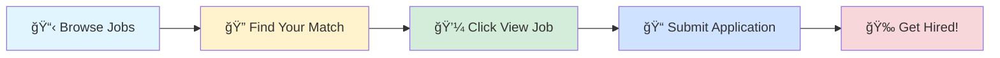

# 🚀 Tech Jobs Board

### Your Gateway to Amazing Career Opportunities

---

## 🎯 Browse by Job Profile

<table>
<tr>
<td align="center" width="25%">

 
<b>1000</b> total positions
</td>
<td align="center" width="25%">

 
<b>1000</b> total positions
</td>
<td align="center" width="25%">

 
<b>1000</b> total positions
</td>
<td align="center" width="25%">

 
<b>1000</b> total positions
</td>
</tr>
</table>

---

## 📊 Data Scientist

> 💼 **1000** positions available

<table>
<thead>
<tr>
<th width="20%">🏢 Company</th>
<th width="35%">💼 Role</th>
<th width="20%">📍 Location</th>
<th width="10%">⏰ Posted</th>
<th width="15%">🔗 Action</th>
</tr>
</thead>
<tbody>
<tr>
<td><a href="https://in.linkedin.com/company/appglide">Appglide Solutions</a></td>
<td>Python Developer</td>
<td>📍 Chennai</td>
<td>1d ago</td>
<td align="center"></td>
</tr>
<tr>
<td><a href="https://in.linkedin.com/company/tata-consultancy-services">Tata Consultancy Services</a></td>
<td>GCP with specialization in Dataproc</td>
<td>📍 Chennai</td>
<td>1d ago</td>
<td align="center"></td>
</tr>
<tr>
<td><a href="https://au.linkedin.com/company/nab">NAB</a></td>
<td>Senior Automation Engineer</td>
<td>📍 Gurugram</td>
<td>1d ago</td>
<td align="center"></td>
</tr>
<tr>
<td><a href="https://www.linkedin.com/company/nielseniq">NielsenIQ</a></td>
<td>Senior Software Engineer (Java, Python & AI Developer)</td>
<td>📍 Chennai</td>
<td>1d ago</td>
<td align="center"></td>
</tr>
<tr>
<td><a href="https://fr.linkedin.com/company/la-poste-groupe">La Poste Groupe</a></td>
<td>Expert Cloud Azure F/H</td>
<td>📍 Issy-les-Moulineaux, Île-de-France, France</td>
<td>1d ago</td>
<td align="center"></td>
</tr>
<tr>
<td><a href="https://www.linkedin.com/company/code-vyasa">CodeVyasa</a></td>
<td>Artificial Intelligence Engineer</td>
<td>📍 Gurugram</td>
<td>1d ago</td>
<td align="center"></td>
</tr>
<tr>
<td><a href="https://www.linkedin.com/company/arauco-north-america">ARAUCO - North America</a></td>
<td>Data Scientist</td>
<td>📍 Atlanta, GA</td>
<td>1d ago</td>
<td align="center"></td>
</tr>
<tr>
<td><a href="https://jo.linkedin.com/company/arabwork">ARABWORK</a></td>
<td>Senior DevOps Engineer (Google Cloud / GCP)</td>
<td>📍 Amman, Amman, Jordan</td>
<td>1d ago</td>
<td align="center"></td>
</tr>
<tr>
<td><a href="https://uk.linkedin.com/company/vois">VOIS</a></td>
<td>AI Automation&RPA Engineer</td>
<td>📍 Pune</td>
<td>1d ago</td>
<td align="center"></td>
</tr>
<tr>
<td><a href="https://in.linkedin.com/company/dexter-s-tech">Dexter's Tech</a></td>
<td>Data Science Intern</td>
<td>📍 India</td>
<td>1d ago</td>
<td align="center"></td>
</tr>
<tr>
<td><a href="https://in.linkedin.com/company/birlasoft">Birlasoft</a></td>
<td>Gen AI/Azure AI Lead</td>
<td>📍 Noida</td>
<td>1d ago</td>
<td align="center"></td>
</tr>
<tr>
<td><a href="https://www.linkedin.com/company/deloitte">Deloitte</a></td>
<td>Python Fast API/Django/Flask</td>
<td>📍 Bangalore</td>
<td>1d ago</td>
<td align="center"></td>
</tr>
<tr>
<td><a href="https://www.linkedin.com/company/lab-sync">Lab Sync</a></td>
<td>Automation Workflow Software Engineer</td>
<td>📍 San Diego, CA</td>
<td>1d ago</td>
<td align="center"></td>
</tr>
<tr>
<td><a href="https://in.linkedin.com/company/talentgigs">Talentgigs</a></td>
<td>Backend Python Developer</td>
<td>📍 Chennai</td>
<td>1d ago</td>
<td align="center"></td>
</tr>
<tr>
<td><a href="https://www.linkedin.com/company/um-it-solutions">UM IT Solutions</a></td>
<td>Python Developer Intern</td>
<td>📍 India</td>
<td>1d ago</td>
<td align="center"></td>
</tr>
<tr>
<td><a href="https://www.linkedin.com/company/uber-com">Uber</a></td>
<td>Sr. Data Scientist, Identity</td>
<td>📍 San Francisco, CA</td>
<td>1d ago</td>
<td align="center"></td>
</tr>
<tr>
<td><a href="https://in.linkedin.com/company/impactodigifintechnologies">Impacto Digifin Technologies</a></td>
<td>PL/SQL  and  Java Developer INTERN TO HIRE</td>
<td>📍 Bangalore</td>
<td>1d ago</td>
<td align="center"></td>
</tr>
<tr>
<td><a href="https://in.linkedin.com/company/truetechpro">True Tech Professionals</a></td>
<td>Artificial Intelligence Engineer</td>
<td>📍 Delhi</td>
<td>1d ago</td>
<td align="center"></td>
</tr>
<tr>
<td><a href="https://www.linkedin.com/company/infogain">Infogain</a></td>
<td>AWS Data Engineer (Lead)</td>
<td>📍 Bangalore</td>
<td>1d ago</td>
<td align="center"></td>
</tr>
<tr>
<td><a href="https://www.linkedin.com/company/hfmbroker">HFM</a></td>
<td>Atlassian Platform Automation Engineer</td>
<td>📍 Bangalore</td>
<td>1d ago</td>
<td align="center"></td>
</tr>
<tr>
<td><a href="https://in.linkedin.com/company/zcodia-technologies">Zcodia Technologies</a></td>
<td>GCP admin / GCP Senior Admin (2-5 years)|| Immediate Joiners Only</td>
<td>📍 Bangalore</td>
<td>1d ago</td>
<td align="center"></td>
</tr>
<tr>
<td><a href="https://in.linkedin.com/company/lowe-s-india">Lowe's India</a></td>
<td>Manager, Analytics  (SQL, Python, Automation)</td>
<td>📍 Bangalore</td>
<td>1d ago</td>
<td align="center"></td>
</tr>
<tr>
<td><a href="https://nl.linkedin.com/company/jobster-com">Jobster</a></td>
<td>Intern AI & Automation (all, 80-100%), 6 Months - Studentjob.ch</td>
<td>📍 Seon, Aargau, Switzerland</td>
<td>1d ago</td>
<td align="center"></td>
</tr>
<tr>
<td><a href="https://www.linkedin.com/company/valleybank">Valley Bank</a></td>
<td>Head of Consumer & SMB Data Analytics</td>
<td>📍 Morristown, NJ</td>
<td>1d ago</td>
<td align="center"></td>
</tr>
<tr>
<td><a href="https://in.linkedin.com/company/globalorizon">Global orizon</a></td>
<td>AWS/DevOps Engineer (Azure)</td>
<td>📍 Bangalore</td>
<td>1d ago</td>
<td align="center"></td>
</tr>
<tr>
<td><a href="https://in.linkedin.com/company/innovaesi">Innova ESI</a></td>
<td>Lead AWS Engineer ( 10+ Yrs, AWS, Networking, Cloud Security )</td>
<td>📍 Mumbai</td>
<td>1d ago</td>
<td align="center"></td>
</tr>
<tr>
<td><a href="https://nl.linkedin.com/company/jobster-com">Jobster</a></td>
<td>Junior Data Scientist - Intellect Group</td>
<td>📍 City Of London, England, United Kingdom</td>
<td>1d ago</td>
<td align="center"></td>
</tr>
<tr>
<td><a href="https://in.linkedin.com/company/wengerwatson">Wenger & Watson</a></td>
<td>Data Scientist</td>
<td>📍 Bangalore</td>
<td>1d ago</td>
<td align="center"></td>
</tr>
<tr>
<td><a href="https://nz.linkedin.com/company/timescapes">Timescapes</a></td>
<td>Machine Learning Engineer</td>
<td>📍 Auckland, Auckland, New Zealand</td>
<td>1d ago</td>
<td align="center"></td>
</tr>
<tr>
<td><a href="https://www.linkedin.com/company/skoollagejobs">SKOOLLAGE</a></td>
<td>Python Developer Intern</td>
<td>📍 India</td>
<td>1d ago</td>
<td align="center"></td>
</tr>
<tr>
<td><a href="https://in.linkedin.com/company/jupiter-money">Jupiter</a></td>
<td>Senior Manager -Risk and Analytics</td>
<td>📍 Bangalore Urban, Karnataka, India</td>
<td>1d ago</td>
<td align="center"></td>
</tr>
<tr>
<td><a href="https://in.linkedin.com/company/zenith-byte">Zenithbyte</a></td>
<td>Python Developer Intern</td>
<td>📍 India</td>
<td>1d ago</td>
<td align="center"></td>
</tr>
<tr>
<td><a href="https://in.linkedin.com/company/teks-academy">Teks Academy</a></td>
<td>Data Science With AI Trainer</td>
<td>📍 Hyderabad</td>
<td>1d ago</td>
<td align="center"></td>
</tr>
<tr>
<td><a href="https://uk.linkedin.com/company/argus-media">Argus Media</a></td>
<td>Consultant (Analytics & Consulting)</td>
<td>📍 Mumbai</td>
<td>1d ago</td>
<td align="center"></td>
</tr>
<tr>
<td><a href="https://www.linkedin.com/company/maryland-department-of-health">Maryland Department of Health</a></td>
<td>ADMINISTRATOR II (BHA Program Monitoring and Performance Analyst) - #26-002587-0006</td>
<td>📍 Maryland, United States</td>
<td>1d ago</td>
<td align="center"></td>
</tr>
<tr>
<td><a href="https://www.linkedin.com/company/provectus-it-inc">Provectus</a></td>
<td>ML Tech Lead Colombia</td>
<td>📍 Bogota, D.C., Capital District, Colombia</td>
<td>1d ago</td>
<td align="center"></td>
</tr>
<tr>
<td><a href="https://in.linkedin.com/school/lexicon-mile/">Lexicon Management Institute of Leadership and Excellence</a></td>
<td>Visiting Faculty Member for Data Analytics and Gererative AI</td>
<td>📍 Pune</td>
<td>1d ago</td>
<td align="center"></td>
</tr>
<tr>
<td><a href="https://in.linkedin.com/company/olaelectric">Ola Electric</a></td>
<td>Data Science Intern</td>
<td>📍 Bangalore</td>
<td>1d ago</td>
<td align="center"></td>
</tr>
<tr>
<td><a href="https://www.linkedin.com/company/northhires">North Hires</a></td>
<td>ML Engineer (Platform)</td>
<td>📍 Bangalore</td>
<td>1d ago</td>
<td align="center"></td>
</tr>
<tr>
<td><a href="https://in.linkedin.com/company/algoleap">algoleap</a></td>
<td>Senior Data Scientist</td>
<td>📍 Hyderabad</td>
<td>1d ago</td>
<td align="center"></td>
</tr>
<tr>
<td><a href="https://www.linkedin.com/company/con-edison">Con Edison</a></td>
<td>Systems Manager - Enterprise Data Science and AI</td>
<td>📍 New York, NY</td>
<td>1d ago</td>
<td align="center"></td>
</tr>
<tr>
<td><a href="https://nl.linkedin.com/company/jobster-com">Jobster</a></td>
<td>Artificial Intelligence Engineer - Synechron</td>
<td>📍 London Area, United Kingdom</td>
<td>1d ago</td>
<td align="center"></td>
</tr>
<tr>
<td><a href="https://ph.linkedin.com/company/outsourcedglobal">Outsourced</a></td>
<td>AI Automation Engineer with Signing Bonus!</td>
<td>📍 National Capital Region, Philippines</td>
<td>1d ago</td>
<td align="center"></td>
</tr>
<tr>
<td><a href="https://fr.linkedin.com/company/suez">SUEZ</a></td>
<td>Azure Container Leader - AKS/Docker</td>
<td>📍 Gurugram</td>
<td>1d ago</td>
<td align="center"></td>
</tr>
<tr>
<td><a href="https://sg.linkedin.com/company/weplus-asia">We+ Asia</a></td>
<td>AI Engineer / Data Scientist</td>
<td>📍 Hong Kong, Hong Kong SAR</td>
<td>1d ago</td>
<td align="center"></td>
</tr>
<tr>
<td><a href="https://www.linkedin.com/company/skoollagejobs">SKOOLLAGE</a></td>
<td>Data Science Intern</td>
<td>📍 India</td>
<td>1d ago</td>
<td align="center"></td>
</tr>
<tr>
<td><a href="https://in.linkedin.com/company/sonata-software">Sonata Software</a></td>
<td>AL/ML Developer Role - Sonata Software - Immediate Joiner</td>
<td>📍 Bangalore</td>
<td>1d ago</td>
<td align="center"></td>
</tr>
<tr>
<td><a href="https://nl.linkedin.com/company/jobster-com">Jobster</a></td>
<td>Data Scientist - Impactive IT</td>
<td>📍 Leeds, England, United Kingdom</td>
<td>1d ago</td>
<td align="center"></td>
</tr>
<tr>
<td><a href="https://nl.linkedin.com/company/jobster-com">Jobster</a></td>
<td>Contract Senior Azure Cloud Engineer - GlobalLogic</td>
<td>📍 City Of London, England, United Kingdom</td>
<td>1d ago</td>
<td align="center"></td>
</tr>
<tr>
<td><a href="https://www.linkedin.com/company/webs-it-solution">Webs IT Solution</a></td>
<td>Machine Learning Intern</td>
<td>📍 India</td>
<td>1d ago</td>
<td align="center"></td>
</tr>
<tr>
<td><a href="https://in.linkedin.com/company/talentgigs">Talentgigs</a></td>
<td>Artificial Intelligence Engineer</td>
<td>📍 Chennai</td>
<td>1d ago</td>
<td align="center"></td>
</tr>
<tr>
<td><a href="https://www.linkedin.com/company/bristol-myers-squibb">Bristol Myers Squibb</a></td>
<td>Regulatory Specialist, Portfolio Acceleration and Analytics</td>
<td>📍 Hyderabad</td>
<td>1d ago</td>
<td align="center"></td>
</tr>
<tr>
<td><a href="https://www.linkedin.com/company/sensiple">Sensiple</a></td>
<td>Sr. Automation Engineer</td>
<td>📍 Chennai</td>
<td>1d ago</td>
<td align="center"></td>
</tr>
<tr>
<td><a href="https://in.linkedin.com/company/tata-consultancy-services">Tata Consultancy Services</a></td>
<td>DevOps Engineer (GCP)</td>
<td>📍 Alpharetta, GA</td>
<td>1d ago</td>
<td align="center"></td>
</tr>
<tr>
<td><a href="https://nl.linkedin.com/company/jobster-com">Jobster</a></td>
<td>Data Scientist - Harnham</td>
<td>📍 City Of London, England, United Kingdom</td>
<td>1d ago</td>
<td align="center"></td>
</tr>
<tr>
<td><a href="https://www.linkedin.com/company/work-force-nexus-recruitment">Work Force Nexus</a></td>
<td>Database Administrator (SQL Server)</td>
<td>📍 Hyderabad</td>
<td>1d ago</td>
<td align="center"></td>
</tr>
<tr>
<td><a href="https://in.linkedin.com/company/sonata-software">Sonata Software</a></td>
<td>SQL DBA / Azure DB / CosmosDB Role - Sonata SOftware - Immediate Joiners</td>
<td>📍 Bangalore</td>
<td>1d ago</td>
<td align="center"></td>
</tr>
<tr>
<td><a href="https://nl.linkedin.com/company/jobster-com">Jobster</a></td>
<td>Data Scientist - Searchability NS&D</td>
<td>📍 London Area, United Kingdom</td>
<td>1d ago</td>
<td align="center"></td>
</tr>
<tr>
<td><a href="https://in.linkedin.com/company/allimetech">Allime Tech Solutions</a></td>
<td>AWS Data Engineer</td>
<td>📍 Chennai</td>
<td>1d ago</td>
<td align="center"></td>
</tr>
<tr>
<td><a href="https://www.linkedin.com/company/provectus-it-inc">Provectus</a></td>
<td>ML Tech Lead Colombia</td>
<td>📍 Medellín, Antioquia, Colombia</td>
<td>1d ago</td>
<td align="center"></td>
</tr>
<tr>
<td><a href="https://www.linkedin.com/company/provectus-it-inc">Provectus</a></td>
<td>ML Tech Lead Colombia</td>
<td>📍 Bucaramanga Metropolitan Area</td>
<td>1d ago</td>
<td align="center"></td>
</tr>
<tr>
<td><a href="https://fr.linkedin.com/company/schneider-electric">Schneider Electric</a></td>
<td>Service Engineer Industrial Automation</td>
<td>📍 Hyderabad</td>
<td>1d ago</td>
<td align="center"></td>
</tr>
<tr>
<td><a href="https://www.linkedin.com/company/provectus-it-inc">Provectus</a></td>
<td>ML Tech Lead Colombia</td>
<td>📍 Bucaramanga, Santander, Colombia</td>
<td>1d ago</td>
<td align="center"></td>
</tr>
<tr>
<td><a href="https://www.linkedin.com/company/blueyonder">Blue Yonder</a></td>
<td>IN-Technical Architect - Cloud (Problem Manager, ServiceNow, Azure, Service Management, Incident Handling, SLA)</td>
<td>📍 Coimbatore</td>
<td>1d ago</td>
<td align="center"></td>
</tr>
<tr>
<td><a href="https://uk.linkedin.com/company/tech-talent-consulting">TTC Group</a></td>
<td>SAP Analytics Cloud</td>
<td>📍 Delhi</td>
<td>1d ago</td>
<td align="center"></td>
</tr>
<tr>
<td><a href="https://nl.linkedin.com/company/jobster-com">Jobster</a></td>
<td>Python Developer – Up to £180,000 + Bonus + Benefits - Hunter Bond</td>
<td>📍 London, England, United Kingdom</td>
<td>1d ago</td>
<td align="center"></td>
</tr>
<tr>
<td><a href="https://www.linkedin.com/company/provectus-it-inc">Provectus</a></td>
<td>ML Tech Lead Colombia</td>
<td>📍 Cali, Valle del Cauca, Colombia</td>
<td>1d ago</td>
<td align="center"></td>
</tr>
<tr>
<td><a href="https://nl.linkedin.com/company/jobster-com">Jobster</a></td>
<td>Machine Learning Engineer - Xcede</td>
<td>📍 City Of London, England, United Kingdom</td>
<td>1d ago</td>
<td align="center"></td>
</tr>
<tr>
<td><a href="https://in.linkedin.com/company/job-returns">Job Returns</a></td>
<td>Junior Python Developer</td>
<td>📍 India</td>
<td>1d ago</td>
<td align="center"></td>
</tr>
<tr>
<td><a href="https://in.linkedin.com/company/recro-io">Recro</a></td>
<td>Artificial Intelligence Engineer</td>
<td>📍 Bangalore</td>
<td>1d ago</td>
<td align="center"></td>
</tr>
<tr>
<td><a href="https://www.linkedin.com/company/praxent">Praxent</a></td>
<td>Software Engineer (Python, SQL, & AWS)</td>
<td>📍 Austin, TX</td>
<td>1d ago</td>
<td align="center"></td>
</tr>
<tr>
<td><a href="https://in.linkedin.com/company/zetheta">Zetheta Algorithms Private Limited</a></td>
<td>Data Science Intern</td>
<td>📍 India</td>
<td>1d ago</td>
<td align="center"></td>
</tr>
<tr>
<td><a href="https://www.linkedin.com/company/epam-systems">EPAM Systems</a></td>
<td>Data Analytics Engineering Trainee</td>
<td>📍 Wrocław, Dolnośląskie, Poland</td>
<td>1d ago</td>
<td align="center"></td>
</tr>
<tr>
<td><a href="https://www.linkedin.com/company/epam-systems">EPAM Systems</a></td>
<td>Data Analytics Engineering Trainee</td>
<td>📍 Cracow Metropolitan Area</td>
<td>1d ago</td>
<td align="center"></td>
</tr>
<tr>
<td><a href="https://ca.linkedin.com/company/midra-ai">Midra AI</a></td>
<td>AI Solutions Intern (Voice Agents & Automation)</td>
<td>📍 Ontario, Canada</td>
<td>1d ago</td>
<td align="center"></td>
</tr>
<tr>
<td><a href="https://fr.linkedin.com/company/sanofi">Sanofi</a></td>
<td>Senior Automation Business Analyst</td>
<td>📍 Petaling Jaya, Selangor, Malaysia</td>
<td>1d ago</td>
<td align="center"></td>
</tr>
<tr>
<td><a href="https://www.linkedin.com/company/info-origin-inc">Info Origin Inc.</a></td>
<td>Python Architect (With Golang, React and AWS)</td>
<td>📍 Pune</td>
<td>1d ago</td>
<td align="center"></td>
</tr>
<tr>
<td><a href="https://www.linkedin.com/company/einfochips">eInfochips (An Arrow Company)</a></td>
<td>AWS Devops Engineer</td>
<td>📍 Hyderabad</td>
<td>1d ago</td>
<td align="center"></td>
</tr>
<tr>
<td><a href="https://in.linkedin.com/company/webboostsolutionait">WEBBOOST SOLUTION IT SERVICES</a></td>
<td>Data Science Intern</td>
<td>📍 India</td>
<td>1d ago</td>
<td align="center"></td>
</tr>
<tr>
<td><a href="https://de.linkedin.com/company/siemens">Siemens</a></td>
<td>Drive & Automation Service engineer - Marine</td>
<td>📍 Bangalore</td>
<td>1d ago</td>
<td align="center"></td>
</tr>
<tr>
<td><a href="https://sg.linkedin.com/company/sginnovate">SGInnovate</a></td>
<td>Senior Manager (Automation)</td>
<td>📍 Singapore, Singapore</td>
<td>1d ago</td>
<td align="center"></td>
</tr>
<tr>
<td><a href="https://in.linkedin.com/company/zetheta">Zetheta Algorithms Private Limited</a></td>
<td>Artificial Intelligence Intern</td>
<td>📍 India</td>
<td>1d ago</td>
<td align="center"></td>
</tr>
<tr>
<td><a href="https://ca.linkedin.com/company/mistplay">Mistplay</a></td>
<td>Senior Manager, Analytics & Experimentation // Gestionnaire senior, Analyse et expérimentation</td>
<td>📍 Toronto, Ontario, Canada</td>
<td>1d ago</td>
<td align="center"></td>
</tr>
<tr>
<td><a href="https://www.linkedin.com/company/bayone-solutions">BayOne Solutions</a></td>
<td>AI/ML Engineer</td>
<td>📍 India</td>
<td>1d ago</td>
<td align="center"></td>
</tr>
<tr>
<td><a href="https://in.linkedin.com/company/mphasis">Mphasis</a></td>
<td>AI/ML Solutions Architect</td>
<td>📍 Bangalore</td>
<td>1d ago</td>
<td align="center"></td>
</tr>
<tr>
<td><a href="https://in.linkedin.com/company/4th-quarter-technologies">4th Quarter Technologies Pvt. Ltd.</a></td>
<td>Intern Software Developer – .NET | HTML | MS SQL</td>
<td>📍 Noida</td>
<td>1d ago</td>
<td align="center"></td>
</tr>
<tr>
<td><a href="https://in.linkedin.com/company/ai-india">Ai India Innovations</a></td>
<td>Ai Intern ( NLP - ASR)</td>
<td>📍 Pune</td>
<td>1d ago</td>
<td align="center"></td>
</tr>
<tr>
<td><a href="https://www.linkedin.com/company/gdms">General Dynamics Mission Systems</a></td>
<td>Intern Administrative / Data Analytics</td>
<td>📍 Dedham, MA</td>
<td>1d ago</td>
<td align="center"></td>
</tr>
<tr>
<td><a href="https://www.linkedin.com/company/mtsi">Modern Technology Solutions, Inc. (MTSI)</a></td>
<td>Data Visualization Intern</td>
<td>📍 United States</td>
<td>1d ago</td>
<td align="center"></td>
</tr>
<tr>
<td><a href="https://www.linkedin.com/company/mtsi">Modern Technology Solutions, Inc. (MTSI)</a></td>
<td>Data Visualization Intern</td>
<td>📍 Huntsville, AL</td>
<td>1d ago</td>
<td align="center"></td>
</tr>
<tr>
<td><a href="https://www.ambitionbox.com/overview/softtek-overview">Softtek</a></td>
<td>Java Developer - AWS</td>
<td>📍 Bangalore</td>
<td>1d ago</td>
<td align="center"></td>
</tr>
<tr>
<td><a href="https://sg.linkedin.com/company/raptor-insights-pte-ltd">Raptor Insights Pte Ltd</a></td>
<td>Full Stack Developer (React.js & Python)</td>
<td>📍 Hyderabad</td>
<td>1d ago</td>
<td align="center"></td>
</tr>
<tr>
<td><a href="https://www.linkedin.com/company/trove-nutrition">Trove Nutrition</a></td>
<td>Forecasting Analyst Intern</td>
<td>📍 Lehi, UT</td>
<td>1d ago</td>
<td align="center"></td>
</tr>
<tr>
<td><a href="https://www.linkedin.com/company/citi">Citi</a></td>
<td>Full Stack Lead (Angular with Java/Python) – Vice President</td>
<td>📍 Chennai</td>
<td>1d ago</td>
<td align="center"></td>
</tr>
<tr>
<td><a href="https://ae.linkedin.com/company/tech-unicorn-sg">Unicorn Lab</a></td>
<td>Azure Infrastructure Cloud Engineer (Intern)</td>
<td>📍 Dubai, Dubai, United Arab Emirates</td>
<td>1d ago</td>
<td align="center"></td>
</tr>
<tr>
<td><a href="https://de.linkedin.com/company/siemens">Siemens</a></td>
<td>Data Engineer - SQL & Analytics Architecture</td>
<td>📍 Mexico City, Mexico</td>
<td>1d ago</td>
<td align="center"></td>
</tr>
<tr>
<td><a href="https://www.linkedin.com/company/trove-brands">Trove Brands</a></td>
<td>Analytics Engineer Intern</td>
<td>📍 Lehi, UT</td>
<td>1d ago</td>
<td align="center"></td>
</tr>
<tr>
<td><a href="https://ph.linkedin.com/company/focus-support-associates">Focus Support Associates</a></td>
<td>Database and SQL Support Specialist</td>
<td>📍 Manila, National Capital Region, Philippines</td>
<td>1d ago</td>
<td align="center"></td>
</tr>
<tr>
<td><a href="https://www.linkedin.com/company/citi">Citi</a></td>
<td>Data Science Lead Analyst - Vice President</td>
<td>📍 Pune</td>
<td>1d ago</td>
<td align="center"></td>
</tr>
<tr>
<td><a href="https://www.linkedin.com/company/algosec">AlgoSec</a></td>
<td>AlgoNext Automation Developer, India</td>
<td>📍 Delhi</td>
<td>1d ago</td>
<td align="center"></td>
</tr>
<tr><td colspan="5" align="center"><i>... and 900 more positions</i></td></tr>
</tbody>
</table>

---

## 💼 Business Analyst

> 💼 **1000** positions available

<table>
<thead>
<tr>
<th width="20%">🏢 Company</th>
<th width="35%">💼 Role</th>
<th width="20%">📍 Location</th>
<th width="10%">⏰ Posted</th>
<th width="15%">🔗 Action</th>
</tr>
</thead>
<tbody>
<tr>
<td><a href="https://in.linkedin.com/company/appglide">Appglide Solutions</a></td>
<td>Python Developer</td>
<td>📍 Chennai</td>
<td>1d ago</td>
<td align="center"></td>
</tr>
<tr>
<td><a href="https://sg.linkedin.com/company/blueincube">Blue InCube</a></td>
<td>Business Analyst Intern</td>
<td>📍 Singapore</td>
<td>1d ago</td>
<td align="center"></td>
</tr>
<tr>
<td><a href="https://in.linkedin.com/company/zenzhub">ZenzHub</a></td>
<td>Business Analyst</td>
<td>📍 India</td>
<td>1d ago</td>
<td align="center"></td>
</tr>
<tr>
<td><a href="https://au.linkedin.com/company/nab">NAB</a></td>
<td>Senior Automation Engineer</td>
<td>📍 Gurugram</td>
<td>1d ago</td>
<td align="center"></td>
</tr>
<tr>
<td><a href="https://www.linkedin.com/company/nielseniq">NielsenIQ</a></td>
<td>Senior Software Engineer (Java, Python & AI Developer)</td>
<td>📍 Chennai</td>
<td>1d ago</td>
<td align="center"></td>
</tr>
<tr>
<td><a href="https://in.linkedin.com/company/persistent-systems">Persistent Systems</a></td>
<td>Salesforce Health Cloud Developer</td>
<td>📍 Pune</td>
<td>1d ago</td>
<td align="center"></td>
</tr>
<tr>
<td><a href="https://uk.linkedin.com/company/vois">VOIS</a></td>
<td>AI Automation&RPA Engineer</td>
<td>📍 Pune</td>
<td>1d ago</td>
<td align="center"></td>
</tr>
<tr>
<td><a href="https://uk.linkedin.com/company/ernstandyoung">EY</a></td>
<td>Associate Consultant - Business Consulting Risk - National - CNS - Risk - Risk Management - Pune</td>
<td>📍 Pune</td>
<td>1d ago</td>
<td align="center"></td>
</tr>
<tr>
<td><a href="https://uk.linkedin.com/company/ernstandyoung">EY</a></td>
<td>Associate Consultant - Business Consulting Risk - National - CNS - Risk - Risk Management - Pune</td>
<td>📍 Pune</td>
<td>1d ago</td>
<td align="center"></td>
</tr>
<tr>
<td><a href="https://be.linkedin.com/company/ingestic">Ingestic SRL</a></td>
<td>Business Analyst Junior / Medior</td>
<td>📍 Wavre, Walloon Region, Belgium</td>
<td>1d ago</td>
<td align="center"></td>
</tr>
<tr>
<td><a href="https://www.linkedin.com/company/deloitte">Deloitte</a></td>
<td>Python Fast API/Django/Flask</td>
<td>📍 Bangalore</td>
<td>1d ago</td>
<td align="center"></td>
</tr>
<tr>
<td><a href="https://www.linkedin.com/company/lab-sync">Lab Sync</a></td>
<td>Automation Workflow Software Engineer</td>
<td>📍 San Diego, CA</td>
<td>1d ago</td>
<td align="center"></td>
</tr>
<tr>
<td><a href="https://www.linkedin.com/company/webs-it-solution">Webs IT Solution</a></td>
<td>Business Analyst Intern</td>
<td>📍 India</td>
<td>1d ago</td>
<td align="center"></td>
</tr>
<tr>
<td><a href="https://in.linkedin.com/company/talentgigs">Talentgigs</a></td>
<td>Backend Python Developer</td>
<td>📍 Chennai</td>
<td>1d ago</td>
<td align="center"></td>
</tr>
<tr>
<td><a href="https://www.linkedin.com/company/um-it-solutions">UM IT Solutions</a></td>
<td>Python Developer Intern</td>
<td>📍 India</td>
<td>1d ago</td>
<td align="center"></td>
</tr>
<tr>
<td><a href="https://in.linkedin.com/company/impactodigifintechnologies">Impacto Digifin Technologies</a></td>
<td>PL/SQL  and  Java Developer INTERN TO HIRE</td>
<td>📍 Bangalore</td>
<td>1d ago</td>
<td align="center"></td>
</tr>
<tr>
<td><a href="https://www.linkedin.com/company/copart">Copart</a></td>
<td>Sr. Business Process Executive</td>
<td>📍 Hyderabad</td>
<td>1d ago</td>
<td align="center"></td>
</tr>
<tr>
<td><a href="https://www.linkedin.com/company/copart">Copart</a></td>
<td>Sr. Business Process Executive</td>
<td>📍 Hyderabad</td>
<td>1d ago</td>
<td align="center"></td>
</tr>
<tr>
<td><a href="https://in.linkedin.com/company/talentoindia">Talentoindia - Jobs & Hiring Platform</a></td>
<td>Business Analyst</td>
<td>📍 India</td>
<td>1d ago</td>
<td align="center"></td>
</tr>
<tr>
<td><a href="https://in.linkedin.com/company/pehchaan-the-street-school-trust">Pehchaan The Street School (Trust)</a></td>
<td>Project Management Intern</td>
<td>📍 Delhi</td>
<td>1d ago</td>
<td align="center"></td>
</tr>
<tr>
<td><a href="https://vn.linkedin.com/company/cocacolavietnam">Coca-Cola Beverages Vietnam</a></td>
<td>Senior Business Analyst - Commercial Finance</td>
<td>📍 Ho Chi Minh City, Vietnam</td>
<td>1d ago</td>
<td align="center"></td>
</tr>
<tr>
<td><a href="https://in.linkedin.com/company/speshally">Speshally.nhs</a></td>
<td>Business Analyst (Person with Disability only)</td>
<td>📍 Hyderabad</td>
<td>1d ago</td>
<td align="center"></td>
</tr>
<tr>
<td><a href="https://www.linkedin.com/company/hfmbroker">HFM</a></td>
<td>Atlassian Platform Automation Engineer</td>
<td>📍 Bangalore</td>
<td>1d ago</td>
<td align="center"></td>
</tr>
<tr>
<td><a href="https://in.linkedin.com/company/krayr-hr-solutions">Krayr Solutions</a></td>
<td>Sr Agile Leader JIS125594</td>
<td>📍 Ahmedabad, Gujarat, India</td>
<td>1d ago</td>
<td align="center"></td>
</tr>
<tr>
<td><a href="https://in.linkedin.com/company/lowe-s-india">Lowe's India</a></td>
<td>Manager, Analytics  (SQL, Python, Automation)</td>
<td>📍 Bangalore</td>
<td>1d ago</td>
<td align="center"></td>
</tr>
<tr>
<td><a href="https://nl.linkedin.com/company/jobster-com">Jobster</a></td>
<td>Intern AI & Automation (all, 80-100%), 6 Months - Studentjob.ch</td>
<td>📍 Seon, Aargau, Switzerland</td>
<td>1d ago</td>
<td align="center"></td>
</tr>
<tr>
<td><a href="https://www.linkedin.com/company/valleybank">Valley Bank</a></td>
<td>Head of Consumer & SMB Data Analytics</td>
<td>📍 Morristown, NJ</td>
<td>1d ago</td>
<td align="center"></td>
</tr>
<tr>
<td><a href="https://in.linkedin.com/company/policybazaar">Policybazaar.com</a></td>
<td>Business Analyst</td>
<td>📍 Gurugram</td>
<td>1d ago</td>
<td align="center"></td>
</tr>
<tr>
<td><a href="https://www.linkedin.com/company/teksystems">TEKsystems</a></td>
<td>Business Analyst</td>
<td>📍 West Palm Beach, FL</td>
<td>1d ago</td>
<td align="center"></td>
</tr>
<tr>
<td><a href="https://www.linkedin.com/company/tribolatech-inc">TribolaTech Inc</a></td>
<td>IT Business Analyst (Sales and Project Delivery)</td>
<td>📍 United States</td>
<td>1d ago</td>
<td align="center"></td>
</tr>
<tr>
<td><a href="https://in.linkedin.com/company/zenith-byte">Zenithbyte</a></td>
<td>Business Analyst Intern</td>
<td>📍 India</td>
<td>1d ago</td>
<td align="center"></td>
</tr>
<tr>
<td><a href="https://www.linkedin.com/company/skoollagejobs">SKOOLLAGE</a></td>
<td>Python Developer Intern</td>
<td>📍 India</td>
<td>1d ago</td>
<td align="center"></td>
</tr>
<tr>
<td><a href="https://in.linkedin.com/company/jupiter-money">Jupiter</a></td>
<td>Senior Manager -Risk and Analytics</td>
<td>📍 Bangalore Urban, Karnataka, India</td>
<td>1d ago</td>
<td align="center"></td>
</tr>
<tr>
<td><a href="https://in.linkedin.com/company/zenith-byte">Zenithbyte</a></td>
<td>Python Developer Intern</td>
<td>📍 India</td>
<td>1d ago</td>
<td align="center"></td>
</tr>
<tr>
<td><a href="https://uk.linkedin.com/company/argus-media">Argus Media</a></td>
<td>Consultant (Analytics & Consulting)</td>
<td>📍 Mumbai</td>
<td>1d ago</td>
<td align="center"></td>
</tr>
<tr>
<td><a href="https://www.linkedin.com/company/riametric">RIAmetric</a></td>
<td>Scrum Master</td>
<td>📍 Singapore, Singapore</td>
<td>1d ago</td>
<td align="center"></td>
</tr>
<tr>
<td><a href="https://sg.linkedin.com/company/rapsys-technologies-pte-td">RAPSYS TECHNOLOGIES PTE LTD</a></td>
<td>Senior Business Analyst – Temenos (Trading Products Domain)</td>
<td>📍 Singapore, Singapore</td>
<td>1d ago</td>
<td align="center"></td>
</tr>
<tr>
<td><a href="https://in.linkedin.com/company/zenith-byte">Zenithbyte</a></td>
<td>Business Analyst Intern</td>
<td>📍 India</td>
<td>1d ago</td>
<td align="center"></td>
</tr>
<tr>
<td><a href="https://in.linkedin.com/school/lexicon-mile/">Lexicon Management Institute of Leadership and Excellence</a></td>
<td>Visiting Faculty Member for Data Analytics and Gererative AI</td>
<td>📍 Pune</td>
<td>1d ago</td>
<td align="center"></td>
</tr>
<tr>
<td><a href="https://in.linkedin.com/company/solguruz">SolGuruz®</a></td>
<td>Business Analyst (WFO - Ahmedabad)</td>
<td>📍 Ahmedabad, Gujarat, India</td>
<td>1d ago</td>
<td align="center"></td>
</tr>
<tr>
<td><a href="https://www.linkedin.com/company/yakshna-solutions">Yakshna Solutions</a></td>
<td>Business Analyst 4</td>
<td>📍 Herndon, VA</td>
<td>1d ago</td>
<td align="center"></td>
</tr>
<tr>
<td><a href="https://www.linkedin.com/company/cisco">Cisco</a></td>
<td>Finance Analyst - E2E Accounts Payable Process, Compliance, Auditing, Tax & Project Management (5+ Years)</td>
<td>📍 Bangalore</td>
<td>1d ago</td>
<td align="center"></td>
</tr>
<tr>
<td><a href="https://ph.linkedin.com/company/outsourcedglobal">Outsourced</a></td>
<td>AI Automation Engineer with Signing Bonus!</td>
<td>📍 National Capital Region, Philippines</td>
<td>1d ago</td>
<td align="center"></td>
</tr>
<tr>
<td><a href="https://www.linkedin.com/company/gravityinfosolutions">Gravity Infosolutions, Inc.</a></td>
<td>Salesforce & Vlocity (SFI) DevOps - Full Time</td>
<td>📍 Pune</td>
<td>1d ago</td>
<td align="center"></td>
</tr>
<tr>
<td><a href="https://jp.linkedin.com/company/mizuho">Mizuho</a></td>
<td>Business Analyst - CASA Operations</td>
<td>📍 Chennai</td>
<td>1d ago</td>
<td align="center"></td>
</tr>
<tr>
<td><a href="https://www.linkedin.com/company/zoetis">Zoetis</a></td>
<td>Business Analyst - eCommerce</td>
<td>📍 Hyderabad</td>
<td>1d ago</td>
<td align="center"></td>
</tr>
<tr>
<td><a href="https://www.linkedin.com/company/bristol-myers-squibb">Bristol Myers Squibb</a></td>
<td>Regulatory Specialist, Portfolio Acceleration and Analytics</td>
<td>📍 Hyderabad</td>
<td>1d ago</td>
<td align="center"></td>
</tr>
<tr>
<td><a href="https://www.linkedin.com/company/skoollagejobs">SKOOLLAGE</a></td>
<td>Business Analyst Intern</td>
<td>📍 India</td>
<td>1d ago</td>
<td align="center"></td>
</tr>
<tr>
<td><a href="https://www.linkedin.com/company/sensiple">Sensiple</a></td>
<td>Sr. Automation Engineer</td>
<td>📍 Chennai</td>
<td>1d ago</td>
<td align="center"></td>
</tr>
<tr>
<td><a href="https://www.linkedin.com/company/work-force-nexus-recruitment">Work Force Nexus</a></td>
<td>Database Administrator (SQL Server)</td>
<td>📍 Hyderabad</td>
<td>1d ago</td>
<td align="center"></td>
</tr>
<tr>
<td><a href="https://in.linkedin.com/company/sonata-software">Sonata Software</a></td>
<td>SQL DBA / Azure DB / CosmosDB Role - Sonata SOftware - Immediate Joiners</td>
<td>📍 Bangalore</td>
<td>1d ago</td>
<td align="center"></td>
</tr>
<tr>
<td><a href="https://www.linkedin.com/company/talent-bridgee">Talent Bridge</a></td>
<td>Associate Business Analyst</td>
<td>📍 Noida</td>
<td>1d ago</td>
<td align="center"></td>
</tr>
<tr>
<td><a href="https://www.linkedin.com/company/growthally-advisors-private-limited">GrowthAlly Advisors Private Limited</a></td>
<td>Data & Documentation Executive – Debt Syndication</td>
<td>📍 Mumbai</td>
<td>1d ago</td>
<td align="center"></td>
</tr>
<tr>
<td><a href="https://my.linkedin.com/company/silentmode-sdn-bhd">Silentmode Sdn. Bhd.</a></td>
<td>Senior Business Analyst</td>
<td>📍 Seri Kembangan, Malaysia</td>
<td>1d ago</td>
<td align="center"></td>
</tr>
<tr>
<td><a href="https://nl.linkedin.com/company/jobster-com">Jobster</a></td>
<td>Agile Business Analyst - InfoSec People Ltd</td>
<td>📍 Coventry, England, United Kingdom</td>
<td>1d ago</td>
<td align="center"></td>
</tr>
<tr>
<td><a href="https://in.linkedin.com/company/anand-rathi-share-and-stock-brokers-ltd">Anand Rathi Share and Stock Brokers Ltd</a></td>
<td>Business Analyst - Middleware System</td>
<td>📍 Mumbai</td>
<td>1d ago</td>
<td align="center"></td>
</tr>
<tr>
<td><a href="https://fr.linkedin.com/company/schneider-electric">Schneider Electric</a></td>
<td>Service Engineer Industrial Automation</td>
<td>📍 Hyderabad</td>
<td>1d ago</td>
<td align="center"></td>
</tr>
<tr>
<td><a href="https://sg.linkedin.com/company/fujifilm-business-innovation-singapore">FUJIFILM Business Innovation Singapore</a></td>
<td>Business Analyst</td>
<td>📍 Singapore, Singapore</td>
<td>1d ago</td>
<td align="center"></td>
</tr>
<tr>
<td><a href="https://uk.linkedin.com/company/tech-talent-consulting">TTC Group</a></td>
<td>SAP Analytics Cloud</td>
<td>📍 Delhi</td>
<td>1d ago</td>
<td align="center"></td>
</tr>
<tr>
<td><a href="https://nl.linkedin.com/company/jobster-com">Jobster</a></td>
<td>Python Developer – Up to £180,000 + Bonus + Benefits - Hunter Bond</td>
<td>📍 London, England, United Kingdom</td>
<td>1d ago</td>
<td align="center"></td>
</tr>
<tr>
<td><a href="https://mm.linkedin.com/company/yomagroupcareer">YOMA GROUP</a></td>
<td>Business Analyst</td>
<td>📍 Yangon Region, Myanmar</td>
<td>1d ago</td>
<td align="center"></td>
</tr>
<tr>
<td><a href="https://in.linkedin.com/company/job-returns">Job Returns</a></td>
<td>Junior Python Developer</td>
<td>📍 India</td>
<td>1d ago</td>
<td align="center"></td>
</tr>
<tr>
<td><a href="https://www.linkedin.com/company/praxent">Praxent</a></td>
<td>Software Engineer (Python, SQL, & AWS)</td>
<td>📍 Austin, TX</td>
<td>1d ago</td>
<td align="center"></td>
</tr>
<tr>
<td><a href="https://www.linkedin.com/company/epam-systems">EPAM Systems</a></td>
<td>Data Analytics Engineering Trainee</td>
<td>📍 Wrocław, Dolnośląskie, Poland</td>
<td>1d ago</td>
<td align="center"></td>
</tr>
<tr>
<td><a href="https://www.linkedin.com/company/epam-systems">EPAM Systems</a></td>
<td>Data Analytics Engineering Trainee</td>
<td>📍 Cracow Metropolitan Area</td>
<td>1d ago</td>
<td align="center"></td>
</tr>
<tr>
<td><a href="https://ca.linkedin.com/company/midra-ai">Midra AI</a></td>
<td>AI Solutions Intern (Voice Agents & Automation)</td>
<td>📍 Ontario, Canada</td>
<td>1d ago</td>
<td align="center"></td>
</tr>
<tr>
<td><a href="https://fr.linkedin.com/company/sanofi">Sanofi</a></td>
<td>Senior Automation Business Analyst</td>
<td>📍 Petaling Jaya, Selangor, Malaysia</td>
<td>1d ago</td>
<td align="center"></td>
</tr>
<tr>
<td><a href="https://np.linkedin.com/company/infodevelopers-pvt-ltd">InfoDevelopers Pvt. Ltd.</a></td>
<td>Business Analyst</td>
<td>📍 Kathmandu, Bāgmatī, Nepal</td>
<td>1d ago</td>
<td align="center"></td>
</tr>
<tr>
<td><a href="https://fr.linkedin.com/company/capgemini">Capgemini</a></td>
<td>Senior Business Analyst</td>
<td>📍 Brisbane, Queensland, Australia</td>
<td>1d ago</td>
<td align="center"></td>
</tr>
<tr>
<td><a href="https://www.linkedin.com/company/info-origin-inc">Info Origin Inc.</a></td>
<td>Python Architect (With Golang, React and AWS)</td>
<td>📍 Pune</td>
<td>1d ago</td>
<td align="center"></td>
</tr>
<tr>
<td><a href="https://www.linkedin.com/company/robert-half-international">Robert Half</a></td>
<td>Top Tier Insurer - Business Analyst up to 40k</td>
<td>📍 Hong Kong, Hong Kong SAR</td>
<td>1d ago</td>
<td align="center"></td>
</tr>
<tr>
<td><a href="https://www.linkedin.com/company/syneos-health">Syneos Health</a></td>
<td>HR Business Analyst II</td>
<td>📍 Serilingampalli, Telangana, India</td>
<td>1d ago</td>
<td align="center"></td>
</tr>
<tr>
<td><a href="https://de.linkedin.com/company/siemens">Siemens</a></td>
<td>Drive & Automation Service engineer - Marine</td>
<td>📍 Bangalore</td>
<td>1d ago</td>
<td align="center"></td>
</tr>
<tr>
<td><a href="https://sg.linkedin.com/company/sginnovate">SGInnovate</a></td>
<td>Senior Manager (Automation)</td>
<td>📍 Singapore, Singapore</td>
<td>1d ago</td>
<td align="center"></td>
</tr>
<tr>
<td><a href="https://ca.linkedin.com/company/mistplay">Mistplay</a></td>
<td>Senior Manager, Analytics & Experimentation // Gestionnaire senior, Analyse et expérimentation</td>
<td>📍 Toronto, Ontario, Canada</td>
<td>1d ago</td>
<td align="center"></td>
</tr>
<tr>
<td><a href="https://au.linkedin.com/company/isuzu-australia-limited">Isuzu Australia Limited</a></td>
<td>Business Analyst</td>
<td>📍 Truganina, Victoria, Australia</td>
<td>1d ago</td>
<td align="center"></td>
</tr>
<tr>
<td><a href="https://in.linkedin.com/company/4th-quarter-technologies">4th Quarter Technologies Pvt. Ltd.</a></td>
<td>Intern Software Developer – .NET | HTML | MS SQL</td>
<td>📍 Noida</td>
<td>1d ago</td>
<td align="center"></td>
</tr>
<tr>
<td><a href="https://www.linkedin.com/company/gdms">General Dynamics Mission Systems</a></td>
<td>Intern Administrative / Data Analytics</td>
<td>📍 Dedham, MA</td>
<td>1d ago</td>
<td align="center"></td>
</tr>
<tr>
<td><a href="https://do.linkedin.com/company/tuempleord">Tu Empleo RD</a></td>
<td>Auxiliar de Contabilidad con manejo de excel</td>
<td>📍 Santo Domingo Este, Santo Domingo, Dominican Republic</td>
<td>1d ago</td>
<td align="center"></td>
</tr>
<tr>
<td><a href="https://sg.linkedin.com/company/raptor-insights-pte-ltd">Raptor Insights Pte Ltd</a></td>
<td>Full Stack Developer (React.js & Python)</td>
<td>📍 Hyderabad</td>
<td>1d ago</td>
<td align="center"></td>
</tr>
<tr>
<td><a href="https://in.linkedin.com/company/human-powered-health-technologies">Human Powered Health Technologies</a></td>
<td>Clinical documentation integrity Coder</td>
<td>📍 Hyderabad</td>
<td>1d ago</td>
<td align="center"></td>
</tr>
<tr>
<td><a href="https://www.linkedin.com/company/citi">Citi</a></td>
<td>Full Stack Lead (Angular with Java/Python) – Vice President</td>
<td>📍 Chennai</td>
<td>1d ago</td>
<td align="center"></td>
</tr>
<tr>
<td><a href="https://de.linkedin.com/company/siemens">Siemens</a></td>
<td>Data Engineer - SQL & Analytics Architecture</td>
<td>📍 Mexico City, Mexico</td>
<td>1d ago</td>
<td align="center"></td>
</tr>
<tr>
<td><a href="https://www.linkedin.com/company/trove-brands">Trove Brands</a></td>
<td>Analytics Engineer Intern</td>
<td>📍 Lehi, UT</td>
<td>1d ago</td>
<td align="center"></td>
</tr>
<tr>
<td><a href="https://www.linkedin.com/company/80twenty">80Twenty</a></td>
<td>Business Analyst</td>
<td>📍 La Mirada, CA</td>
<td>1d ago</td>
<td align="center"></td>
</tr>
<tr>
<td><a href="https://ph.linkedin.com/company/focus-support-associates">Focus Support Associates</a></td>
<td>Database and SQL Support Specialist</td>
<td>📍 Manila, National Capital Region, Philippines</td>
<td>1d ago</td>
<td align="center"></td>
</tr>
<tr>
<td><a href="https://www.linkedin.com/company/algosec">AlgoSec</a></td>
<td>AlgoNext Automation Developer, India</td>
<td>📍 Delhi</td>
<td>1d ago</td>
<td align="center"></td>
</tr>
<tr>
<td><a href="https://www.linkedin.com/company/algosec">AlgoSec</a></td>
<td>Full Stack Automation Developer, India</td>
<td>📍 Delhi</td>
<td>1d ago</td>
<td align="center"></td>
</tr>
<tr>
<td><a href="https://ch.linkedin.com/company/abb">ABB</a></td>
<td>Data Analytics and BI Specialist</td>
<td>📍 Bangalore</td>
<td>1d ago</td>
<td align="center"></td>
</tr>
<tr>
<td><a href="https://www.linkedin.com/company/algosec">AlgoSec</a></td>
<td>CloudFlow Automation Developer, India</td>
<td>📍 Delhi</td>
<td>1d ago</td>
<td align="center"></td>
</tr>
<tr>
<td><a href="https://www.linkedin.com/company/ntt-data-americas">NTT DATA North America</a></td>
<td>Business Consulting-Project Manager</td>
<td>📍 Pune</td>
<td>1d ago</td>
<td align="center"></td>
</tr>
<tr>
<td><a href="https://www.linkedin.com/company/algosec">AlgoSec</a></td>
<td>Cloud Automation Developer, India</td>
<td>📍 Delhi</td>
<td>1d ago</td>
<td align="center"></td>
</tr>
<tr>
<td><a href="https://www.ambitionbox.com/overview/koireader-technologies-overview">Koireader Technologies</a></td>
<td>Python Developer Intern</td>
<td></td>
<td>1d ago</td>
<td align="center"></td>
</tr>
<tr>
<td><a href="https://in.linkedin.com/company/b2w-infotech-private-limited">B2W Infotech</a></td>
<td>Business Analyst (2–3 Years Experience)</td>
<td>📍 Mumbai</td>
<td>1d ago</td>
<td align="center"></td>
</tr>
<tr>
<td><a href="https://in.linkedin.com/company/speshally">Speshally.nhs</a></td>
<td>Analyst – Field Analytics (People with Disabilities Only)</td>
<td>📍 Hyderabad</td>
<td>1d ago</td>
<td align="center"></td>
</tr>
<tr>
<td><a href="https://id.linkedin.com/company/smpxit">SMP (Technology)</a></td>
<td>Project Management Intern</td>
<td>📍 Tangerang, Banten, Indonesia</td>
<td>1d ago</td>
<td align="center"></td>
</tr>
<tr>
<td><a href="https://www.linkedin.com/company/client-company-game-industry">Client Company (Game Industry)</a></td>
<td>IT Business Analyst (Game Industry, English)</td>
<td>📍 Ho Chi Minh City, Vietnam</td>
<td>1d ago</td>
<td align="center"></td>
</tr>
<tr>
<td><a href="https://www.ambitionbox.com/overview/difinity-digital-overview">Difinity Digital</a></td>
<td>Automation Developer Intern</td>
<td>📍 Coimbatore</td>
<td>1d ago</td>
<td align="center"></td>
</tr>
<tr>
<td><a href="https://ph.linkedin.com/company/outsourcedglobal">Outsourced</a></td>
<td>Analytics Specialist</td>
<td>📍 National Capital Region, Philippines</td>
<td>1d ago</td>
<td align="center"></td>
</tr>
<tr>
<td><a href="https://www.linkedin.com/company/qode-jobs">Qode Jobs</a></td>
<td>Senior Software Engineer (Java, Python & GCP)</td>
<td>📍 Thane</td>
<td>1d ago</td>
<td align="center"></td>
</tr>
<tr><td colspan="5" align="center"><i>... and 900 more positions</i></td></tr>
</tbody>
</table>

---

## 🚀 Product Manager

> 💼 **1000** positions available

<table>
<thead>
<tr>
<th width="20%">🏢 Company</th>
<th width="35%">💼 Role</th>
<th width="20%">📍 Location</th>
<th width="10%">⏰ Posted</th>
<th width="15%">🔗 Action</th>
</tr>
</thead>
<tbody>
<tr>
<td><a href="https://in.linkedin.com/company/agumentikeducamp">Agumentik Educamp Private Limited</a></td>
<td>Product Designer (Figma) – Trainee</td>
<td>📍 Kerala, India</td>
<td>1d ago</td>
<td align="center"></td>
</tr>
<tr>
<td><a href="https://www.linkedin.com/company/arena-investors-lp">Arena Investors, LP</a></td>
<td>Analyst - Loan Management</td>
<td>📍 Bangalore</td>
<td>1d ago</td>
<td align="center"></td>
</tr>
<tr>
<td><a href="https://au.linkedin.com/company/nab">NAB</a></td>
<td>Senior Automation Engineer</td>
<td>📍 Gurugram</td>
<td>1d ago</td>
<td align="center"></td>
</tr>
<tr>
<td><a href="https://ph.linkedin.com/company/microsourcing">MicroSourcing</a></td>
<td>Digital Product Manager - Flexible Work Setup</td>
<td>📍 Pasay, National Capital Region, Philippines</td>
<td>1d ago</td>
<td align="center"></td>
</tr>
<tr>
<td><a href="https://www.linkedin.com/company/devhub-ro">DevHub</a></td>
<td>Product Data Analyst</td>
<td>📍 Cluj-Napoca metropolitan area, Cluj, Romania</td>
<td>1d ago</td>
<td align="center"></td>
</tr>
<tr>
<td><a href="https://in.linkedin.com/company/zekoai">Zeko AI</a></td>
<td>Product Operations Trainee</td>
<td>📍 Noida</td>
<td>1d ago</td>
<td align="center"></td>
</tr>
<tr>
<td><a href="https://in.linkedin.com/company/transasia-bio-medicals-ltd">Transasia Bio-Medicals Ltd.</a></td>
<td>Product Manager</td>
<td>📍 Mumbai</td>
<td>1d ago</td>
<td align="center"></td>
</tr>
<tr>
<td><a href="https://uk.linkedin.com/company/vois">VOIS</a></td>
<td>AI Automation&RPA Engineer</td>
<td>📍 Pune</td>
<td>1d ago</td>
<td align="center"></td>
</tr>
<tr>
<td><a href="https://www.linkedin.com/company/beijing-foreign-enterprise-management-consultants">Beijing Foreign Enterprise Management Consultants Co.,Ltd.</a></td>
<td>Network Product Manager</td>
<td>📍 Greater Kuala Lumpur</td>
<td>1d ago</td>
<td align="center"></td>
</tr>
<tr>
<td><a href="https://uk.linkedin.com/company/ernstandyoung">EY</a></td>
<td>Associate Consultant - Business Consulting Risk - National - CNS - Risk - Risk Management - Pune</td>
<td>📍 Pune</td>
<td>1d ago</td>
<td align="center"></td>
</tr>
<tr>
<td><a href="https://uk.linkedin.com/company/ernstandyoung">EY</a></td>
<td>Associate Consultant - Business Consulting Risk - National - CNS - Risk - Risk Management - Pune</td>
<td>📍 Pune</td>
<td>1d ago</td>
<td align="center"></td>
</tr>
<tr>
<td><a href="https://in.linkedin.com/company/edufund-app">EduFund</a></td>
<td>Product Engineer - 3</td>
<td>📍 Pune</td>
<td>1d ago</td>
<td align="center"></td>
</tr>
<tr>
<td><a href="https://sg.linkedin.com/company/mindsprint">Mindsprint</a></td>
<td>Product Sales</td>
<td>📍 Chennai</td>
<td>1d ago</td>
<td align="center"></td>
</tr>
<tr>
<td><a href="https://www.linkedin.com/company/turingedge">TuringEdge</a></td>
<td>AI Agent Product Manager</td>
<td>📍 Noida</td>
<td>1d ago</td>
<td align="center"></td>
</tr>
<tr>
<td><a href="https://www.linkedin.com/company/lab-sync">Lab Sync</a></td>
<td>Automation Workflow Software Engineer</td>
<td>📍 San Diego, CA</td>
<td>1d ago</td>
<td align="center"></td>
</tr>
<tr>
<td><a href="https://www.linkedin.com/company/global-industrial-company">Global Industrial Company</a></td>
<td>Intern, Product Operations</td>
<td>📍 Port Washington, NY</td>
<td>1d ago</td>
<td align="center"></td>
</tr>
<tr>
<td><a href="https://in.linkedin.com/company/planmyhealthindia">Plan My Health</a></td>
<td>Healthcare Management Internship office Lower Parel mumbai Immediate stipend 15k pm MPH MHA Medicos can apply</td>
<td>📍 Mumbai</td>
<td>1d ago</td>
<td align="center"></td>
</tr>
<tr>
<td><a href="https://www.linkedin.com/company/alliance-consulting-co">Alliance Consulting Co.</a></td>
<td>Product Development Engineer</td>
<td>📍 Chalco, NE</td>
<td>1d ago</td>
<td align="center"></td>
</tr>
<tr>
<td><a href="https://in.linkedin.com/company/samsung-india">Samsung India</a></td>
<td>Product Solution Specialist</td>
<td>📍 Gurugram</td>
<td>1d ago</td>
<td align="center"></td>
</tr>
<tr>
<td><a href="https://in.linkedin.com/company/impactodigifintechnologies">Impacto Digifin Technologies</a></td>
<td>PL/SQL  and  Java Developer INTERN TO HIRE</td>
<td>📍 Bangalore</td>
<td>1d ago</td>
<td align="center"></td>
</tr>
<tr>
<td><a href="https://in.linkedin.com/company/pehchaan-the-street-school-trust">Pehchaan The Street School (Trust)</a></td>
<td>Project Management Intern</td>
<td>📍 Delhi</td>
<td>1d ago</td>
<td align="center"></td>
</tr>
<tr>
<td><a href="https://in.linkedin.com/company/mapeach-consulting-pvt-ltd">Mapeach Consulting Pvt Ltd</a></td>
<td>Sales and Marketing Management Trainee</td>
<td>📍 India</td>
<td>1d ago</td>
<td align="center"></td>
</tr>
<tr>
<td><a href="https://in.linkedin.com/company/transasia-bio-medicals-ltd">Transasia Bio-Medicals Ltd.</a></td>
<td>Product Manager (Diabetes Management)</td>
<td>📍 Mumbai</td>
<td>1d ago</td>
<td align="center"></td>
</tr>
<tr>
<td><a href="https://www.linkedin.com/company/hfmbroker">HFM</a></td>
<td>Atlassian Platform Automation Engineer</td>
<td>📍 Bangalore</td>
<td>1d ago</td>
<td align="center"></td>
</tr>
<tr>
<td><a href="https://www.linkedin.com/company/galileo-financial-technologies">Galileo Financial Technologies</a></td>
<td>Intern, Software Engineer, Management Experience</td>
<td>📍 San Francisco Bay Area</td>
<td>1d ago</td>
<td align="center"></td>
</tr>
<tr>
<td><a href="https://in.linkedin.com/company/krayr-hr-solutions">Krayr Solutions</a></td>
<td>Sr Agile Leader JIS125594</td>
<td>📍 Ahmedabad, Gujarat, India</td>
<td>1d ago</td>
<td align="center"></td>
</tr>
<tr>
<td><a href="https://www.linkedin.com/company/fortemcementcorporation">Fortem Cement Corporation</a></td>
<td>Graduate Management Trainee</td>
<td>📍 Quezon City, National Capital Region, Philippines</td>
<td>1d ago</td>
<td align="center"></td>
</tr>
<tr>
<td><a href="https://www.linkedin.com/company/hologic">Hologic, Inc.</a></td>
<td>Sr. Manager, Global Product Management, Molecular Instrumentation</td>
<td>📍 San Diego, CA</td>
<td>1d ago</td>
<td align="center"></td>
</tr>
<tr>
<td><a href="https://sg.linkedin.com/company/shopee">Shopee</a></td>
<td>Growth Product Strategist - Marketing, Shopee</td>
<td>📍 Ho Chi Minh City, Ho Chi Minh City, Vietnam</td>
<td>1d ago</td>
<td align="center"></td>
</tr>
<tr>
<td><a href="https://cn.linkedin.com/company/%E5%9C%A8%E7%BA%BF%E9%80%94%E6%B8%B8%EF%BC%88%E5%8C%97%E4%BA%AC%EF%BC%89%E7%A7%91%E6%8A%80%E6%9C%89%E9%99%90%E5%85%AC%E5%8F%B8">Tuyoo Games</a></td>
<td>Junior Product Manager / Game Designer</td>
<td>📍 Singapore, Singapore</td>
<td>1d ago</td>
<td align="center"></td>
</tr>
<tr>
<td><a href="https://in.linkedin.com/company/lowe-s-india">Lowe's India</a></td>
<td>Manager, Analytics  (SQL, Python, Automation)</td>
<td>📍 Bangalore</td>
<td>1d ago</td>
<td align="center"></td>
</tr>
<tr>
<td><a href="https://nl.linkedin.com/company/jobster-com">Jobster</a></td>
<td>Intern AI & Automation (all, 80-100%), 6 Months - Studentjob.ch</td>
<td>📍 Seon, Aargau, Switzerland</td>
<td>1d ago</td>
<td align="center"></td>
</tr>
<tr>
<td><a href="https://www.linkedin.com/company/valleybank">Valley Bank</a></td>
<td>Head of Consumer & SMB Data Analytics</td>
<td>📍 Morristown, NJ</td>
<td>1d ago</td>
<td align="center"></td>
</tr>
<tr>
<td><a href="https://in.linkedin.com/company/kotech-infra-private-limited">Kotech Infra Private Limited</a></td>
<td>Manager Quality Management</td>
<td>📍 Pune</td>
<td>1d ago</td>
<td align="center"></td>
</tr>
<tr>
<td><a href="https://www.linkedin.com/company/the-home-depot">The Home Depot</a></td>
<td>Product Manager</td>
<td>📍 Atlanta, GA</td>
<td>1d ago</td>
<td align="center"></td>
</tr>
<tr>
<td><a href="https://in.linkedin.com/company/pocket-fm">Pocket FM</a></td>
<td>Product Manager</td>
<td>📍 Bangalore</td>
<td>1d ago</td>
<td align="center"></td>
</tr>
<tr>
<td><a href="https://in.linkedin.com/company/jupiter-money">Jupiter</a></td>
<td>Senior Manager -Risk and Analytics</td>
<td>📍 Bangalore Urban, Karnataka, India</td>
<td>1d ago</td>
<td align="center"></td>
</tr>
<tr>
<td><a href="https://uk.linkedin.com/company/argus-media">Argus Media</a></td>
<td>Consultant (Analytics & Consulting)</td>
<td>📍 Mumbai</td>
<td>1d ago</td>
<td align="center"></td>
</tr>
<tr>
<td><a href="https://in.linkedin.com/company/golocobear">Loco Bear</a></td>
<td>Product Manager</td>
<td>📍 Bangalore</td>
<td>1d ago</td>
<td align="center"></td>
</tr>
<tr>
<td><a href="https://in.linkedin.com/company/2070health">2070 Health</a></td>
<td>Product Manager</td>
<td>📍 Bronx, NY</td>
<td>1d ago</td>
<td align="center"></td>
</tr>
<tr>
<td><a href="https://www.linkedin.com/company/riametric">RIAmetric</a></td>
<td>Scrum Master</td>
<td>📍 Singapore, Singapore</td>
<td>1d ago</td>
<td align="center"></td>
</tr>
<tr>
<td><a href="https://in.linkedin.com/company/vmc-mcube">MCUBE</a></td>
<td>Management Information System Intern</td>
<td>📍 Bangalore</td>
<td>1d ago</td>
<td align="center"></td>
</tr>
<tr>
<td><a href="https://nl.linkedin.com/company/jobster-com">Jobster</a></td>
<td>Product Strategist - SoftServe</td>
<td>📍 City Of London, England, United Kingdom</td>
<td>1d ago</td>
<td align="center"></td>
</tr>
<tr>
<td><a href="https://in.linkedin.com/company/torrent-pharmaceuticals-ltd">Torrent Pharmaceuticals Ltd</a></td>
<td>Group Product Manager</td>
<td>📍 Ahmedabad, Gujarat, India</td>
<td>1d ago</td>
<td align="center"></td>
</tr>
<tr>
<td><a href="https://in.linkedin.com/company/hire22">Hire22.ai</a></td>
<td>Regional Product Manager</td>
<td>📍 Mumbai</td>
<td>1d ago</td>
<td align="center"></td>
</tr>
<tr>
<td><a href="https://nl.linkedin.com/company/jobster-com">Jobster</a></td>
<td>Senior Technical Product Manager - Circuit Mind</td>
<td>📍 London Area, United Kingdom</td>
<td>1d ago</td>
<td align="center"></td>
</tr>
<tr>
<td><a href="https://in.linkedin.com/school/lexicon-mile/">Lexicon Management Institute of Leadership and Excellence</a></td>
<td>Visiting Faculty Member for Data Analytics and Gererative AI</td>
<td>📍 Pune</td>
<td>1d ago</td>
<td align="center"></td>
</tr>
<tr>
<td><a href="https://www.linkedin.com/company/sufalamtech">Sufalam Technologies</a></td>
<td>Product Head - Fintech</td>
<td>📍 Ahmedabad, Gujarat, India</td>
<td>1d ago</td>
<td align="center"></td>
</tr>
<tr>
<td><a href="https://nl.linkedin.com/company/jobster-com">Jobster</a></td>
<td>Senior Product Manager at AdTech Scale Up (Remote) - Grey Matter Recruitment</td>
<td>📍 City Of London, England, United Kingdom</td>
<td>1d ago</td>
<td align="center"></td>
</tr>
<tr>
<td><a href="https://nl.linkedin.com/company/jobster-com">Jobster</a></td>
<td>Product Manager (Based in Bangladesh with relocation assistance) - Next Sourcing Limited</td>
<td>📍 City Of London, England, United Kingdom</td>
<td>1d ago</td>
<td align="center"></td>
</tr>
<tr>
<td><a href="https://www.linkedin.com/company/constant-contact">Constant Contact</a></td>
<td>Principal Product Manager - Customer Experience and AI</td>
<td>📍 Waltham, MA</td>
<td>1d ago</td>
<td align="center"></td>
</tr>
<tr>
<td><a href="https://de.linkedin.com/company/heraeuselectronics">Heraeus Electronics</a></td>
<td>Global Product Manager (Semiconductor)</td>
<td>📍 Singapore, Singapore</td>
<td>1d ago</td>
<td align="center"></td>
</tr>
<tr>
<td><a href="https://in.linkedin.com/company/tupperware-india">Tupperware India</a></td>
<td>Product and Sourcing Manager</td>
<td>📍 Dehradun, Uttarakhand, India</td>
<td>1d ago</td>
<td align="center"></td>
</tr>
<tr>
<td><a href="https://www.linkedin.com/company/gspann-technologies-inc">GSPANN Technologies, Inc</a></td>
<td>D365 Product Owner, Production & Logistics (Smart Core)</td>
<td>📍 Hyderabad</td>
<td>1d ago</td>
<td align="center"></td>
</tr>
<tr>
<td><a href="https://ae.linkedin.com/company/modon">Modon</a></td>
<td>Document Controller-Property Management</td>
<td>📍 Abu Dhabi Emirate, United Arab Emirates</td>
<td>1d ago</td>
<td align="center"></td>
</tr>
<tr>
<td><a href="https://in.linkedin.com/company/smytten">Smytten</a></td>
<td>Deputy Manager - Category Management</td>
<td>📍 Bangalore</td>
<td>1d ago</td>
<td align="center"></td>
</tr>
<tr>
<td><a href="https://nl.linkedin.com/company/jobster-com">Jobster</a></td>
<td>Product Analyst - Harnham</td>
<td>📍 City Of London, England, United Kingdom</td>
<td>1d ago</td>
<td align="center"></td>
</tr>
<tr>
<td><a href="https://www.linkedin.com/company/cisco">Cisco</a></td>
<td>Finance Analyst - E2E Accounts Payable Process, Compliance, Auditing, Tax & Project Management (5+ Years)</td>
<td>📍 Bangalore</td>
<td>1d ago</td>
<td align="center"></td>
</tr>
<tr>
<td><a href="https://uk.linkedin.com/company/antal-international">Antal International</a></td>
<td>Senior Product Manager</td>
<td>📍 India</td>
<td>1d ago</td>
<td align="center"></td>
</tr>
<tr>
<td><a href="https://ph.linkedin.com/company/outsourcedglobal">Outsourced</a></td>
<td>AI Automation Engineer with Signing Bonus!</td>
<td>📍 National Capital Region, Philippines</td>
<td>1d ago</td>
<td align="center"></td>
</tr>
<tr>
<td><a href="https://www.linkedin.com/company/aquent">Aquent</a></td>
<td>Product Development Manager [207560]</td>
<td>📍 United States</td>
<td>1d ago</td>
<td align="center"></td>
</tr>
<tr>
<td><a href="https://ke.linkedin.com/company/unep">UN Environment Programme</a></td>
<td>ASSOCIATE PROGRAMME MANAGEMENT OFFICER</td>
<td>📍 Nairobi, Nairobi County, Kenya</td>
<td>1d ago</td>
<td align="center"></td>
</tr>
<tr>
<td><a href="https://uk.linkedin.com/company/michael-page">Michael Page</a></td>
<td>Product Manager - SPM / Group PM | US HQ'd HR-tech | Bengaluru</td>
<td>📍 Bangalore</td>
<td>1d ago</td>
<td align="center"></td>
</tr>
<tr>
<td><a href="https://ae.linkedin.com/company/first-abu-dhabi-bank">First Abu Dhabi Bank (FAB)</a></td>
<td>ED, GTB Product Sales - India</td>
<td>📍 Mumbai</td>
<td>1d ago</td>
<td align="center"></td>
</tr>
<tr>
<td><a href="https://www.linkedin.com/company/equitable-advisors">Equitable Advisors</a></td>
<td>Wealth Management Associate</td>
<td>📍 Honolulu, HI</td>
<td>1d ago</td>
<td align="center"></td>
</tr>
<tr>
<td><a href="https://www.linkedin.com/company/bristol-myers-squibb">Bristol Myers Squibb</a></td>
<td>Regulatory Specialist, Portfolio Acceleration and Analytics</td>
<td>📍 Hyderabad</td>
<td>1d ago</td>
<td align="center"></td>
</tr>
<tr>
<td><a href="https://www.linkedin.com/company/sensiple">Sensiple</a></td>
<td>Sr. Automation Engineer</td>
<td>📍 Chennai</td>
<td>1d ago</td>
<td align="center"></td>
</tr>
<tr>
<td><a href="https://www.linkedin.com/company/work-force-nexus-recruitment">Work Force Nexus</a></td>
<td>Database Administrator (SQL Server)</td>
<td>📍 Hyderabad</td>
<td>1d ago</td>
<td align="center"></td>
</tr>
<tr>
<td><a href="https://in.linkedin.com/company/sonata-software">Sonata Software</a></td>
<td>SQL DBA / Azure DB / CosmosDB Role - Sonata SOftware - Immediate Joiners</td>
<td>📍 Bangalore</td>
<td>1d ago</td>
<td align="center"></td>
</tr>
<tr>
<td><a href="https://nl.linkedin.com/company/jobster-com">Jobster</a></td>
<td>Product Owner – Marketing Optimization - BrandDelta</td>
<td>📍 City Of London, England, United Kingdom</td>
<td>1d ago</td>
<td align="center"></td>
</tr>
<tr>
<td><a href="https://nl.linkedin.com/company/jobster-com">Jobster</a></td>
<td>Agile Business Analyst - InfoSec People Ltd</td>
<td>📍 Coventry, England, United Kingdom</td>
<td>1d ago</td>
<td align="center"></td>
</tr>
<tr>
<td><a href="https://nl.linkedin.com/company/jobster-com">Jobster</a></td>
<td>Product Manager - Mokveld</td>
<td>📍 Gouda, South Holland, Netherlands</td>
<td>1d ago</td>
<td align="center"></td>
</tr>
<tr>
<td><a href="https://www.linkedin.com/company/techolution-mobi">techolution</a></td>
<td>Talent Acquisition Associate - Product Hiring</td>
<td>📍 Hyderabad</td>
<td>1d ago</td>
<td align="center"></td>
</tr>
<tr>
<td><a href="https://fr.linkedin.com/company/schneider-electric">Schneider Electric</a></td>
<td>Service Engineer Industrial Automation</td>
<td>📍 Hyderabad</td>
<td>1d ago</td>
<td align="center"></td>
</tr>
<tr>
<td><a href="https://in.linkedin.com/company/talentgigs">Talentgigs</a></td>
<td>Treasury Management Specialist</td>
<td>📍 Chennai</td>
<td>1d ago</td>
<td align="center"></td>
</tr>
<tr>
<td><a href="https://www.linkedin.com/company/blueyonder">Blue Yonder</a></td>
<td>IN-Technical Architect - Cloud (Problem Manager, ServiceNow, Azure, Service Management, Incident Handling, SLA)</td>
<td>📍 Coimbatore</td>
<td>1d ago</td>
<td align="center"></td>
</tr>
<tr>
<td><a href="https://sg.linkedin.com/company/aspireapp-global">Aspire</a></td>
<td>Product Manager - FinCrime</td>
<td>📍 Bangalore</td>
<td>1d ago</td>
<td align="center"></td>
</tr>
<tr>
<td><a href="https://uk.linkedin.com/company/tech-talent-consulting">TTC Group</a></td>
<td>SAP Analytics Cloud</td>
<td>📍 Delhi</td>
<td>1d ago</td>
<td align="center"></td>
</tr>
<tr>
<td><a href="https://www.linkedin.com/company/phenomai">Phenom</a></td>
<td>Product Development Engineer</td>
<td>📍 Hyderabad</td>
<td>1d ago</td>
<td align="center"></td>
</tr>
<tr>
<td><a href="https://in.linkedin.com/company/copods">Copods</a></td>
<td>Product Designer</td>
<td>📍 Pune</td>
<td>1d ago</td>
<td align="center"></td>
</tr>
<tr>
<td><a href="https://in.linkedin.com/company/summit-consulting-services-pvt-ltd">Summit Consulting Services</a></td>
<td>Product Manager</td>
<td>📍 Kochi, Kerala, India</td>
<td>1d ago</td>
<td align="center"></td>
</tr>
<tr>
<td><a href="https://fr.linkedin.com/company/icover-services">iCOVER Services</a></td>
<td>Product Manager</td>
<td>📍 Bangalore</td>
<td>1d ago</td>
<td align="center"></td>
</tr>
<tr>
<td><a href="https://nl.linkedin.com/company/jobster-com">Jobster</a></td>
<td>Intern Product Management Jointing Solutions (m/f/d) - 6 - 9 Months - Studentjob.ch</td>
<td>📍 Schaffhausen, Switzerland</td>
<td>1d ago</td>
<td align="center"></td>
</tr>
<tr>
<td><a href="https://in.linkedin.com/company/scoutit-in">Scoutit</a></td>
<td>Associate Product Manager</td>
<td>📍 Pune</td>
<td>1d ago</td>
<td align="center"></td>
</tr>
<tr>
<td><a href="https://in.linkedin.com/company/2070health">2070 Health</a></td>
<td>Data Engineer - Product</td>
<td>📍 Bronx, NY</td>
<td>1d ago</td>
<td align="center"></td>
</tr>
<tr>
<td><a href="https://www.linkedin.com/company/praxent">Praxent</a></td>
<td>Software Engineer (Python, SQL, & AWS)</td>
<td>📍 Austin, TX</td>
<td>1d ago</td>
<td align="center"></td>
</tr>
<tr>
<td><a href="https://www.linkedin.com/company/epam-systems">EPAM Systems</a></td>
<td>Data Analytics Engineering Trainee</td>
<td>📍 Wrocław, Dolnośląskie, Poland</td>
<td>1d ago</td>
<td align="center"></td>
</tr>
<tr>
<td><a href="https://www.linkedin.com/company/epam-systems">EPAM Systems</a></td>
<td>Data Analytics Engineering Trainee</td>
<td>📍 Cracow Metropolitan Area</td>
<td>1d ago</td>
<td align="center"></td>
</tr>
<tr>
<td><a href="https://ca.linkedin.com/company/midra-ai">Midra AI</a></td>
<td>AI Solutions Intern (Voice Agents & Automation)</td>
<td>📍 Ontario, Canada</td>
<td>1d ago</td>
<td align="center"></td>
</tr>
<tr>
<td><a href="https://www.linkedin.com/company/kroll">Kroll</a></td>
<td>Intern, Technology – IT Service Management</td>
<td>📍 Toronto, Ontario, Canada</td>
<td>1d ago</td>
<td align="center"></td>
</tr>
<tr>
<td><a href="https://id.linkedin.com/company/prudential-syariah-indonesia">Prudential Syariah</a></td>
<td>Assistant Manager Project Portofolio Management</td>
<td>📍 Jakarta, Indonesia</td>
<td>1d ago</td>
<td align="center"></td>
</tr>
<tr>
<td><a href="https://sg.linkedin.com/company/watsons-personal-care-stores-pte-ltd">Watsons Singapore</a></td>
<td>Customer Relationship Management (CRM) Executive</td>
<td>📍 Singapore, Singapore</td>
<td>1d ago</td>
<td align="center"></td>
</tr>
<tr>
<td><a href="https://fr.linkedin.com/company/sanofi">Sanofi</a></td>
<td>Senior Automation Business Analyst</td>
<td>📍 Petaling Jaya, Selangor, Malaysia</td>
<td>1d ago</td>
<td align="center"></td>
</tr>
<tr>
<td><a href="https://www.linkedin.com/company/level-ai">Level AI</a></td>
<td>Group Product Manager - Noida</td>
<td>📍 Noida</td>
<td>1d ago</td>
<td align="center"></td>
</tr>
<tr>
<td><a href="https://de.linkedin.com/company/siemens">Siemens</a></td>
<td>Senior IT Provider Management Professional</td>
<td>📍 Pune</td>
<td>1d ago</td>
<td align="center"></td>
</tr>
<tr>
<td><a href="https://de.linkedin.com/company/siemens">Siemens</a></td>
<td>Drive & Automation Service engineer - Marine</td>
<td>📍 Bangalore</td>
<td>1d ago</td>
<td align="center"></td>
</tr>
<tr>
<td><a href="https://sg.linkedin.com/company/sginnovate">SGInnovate</a></td>
<td>Senior Manager (Automation)</td>
<td>📍 Singapore, Singapore</td>
<td>1d ago</td>
<td align="center"></td>
</tr>
<tr>
<td><a href="https://au.linkedin.com/company/removify">Removify</a></td>
<td>Product experience & Delivery Lead</td>
<td>📍 Cremorne, Victoria, Australia</td>
<td>1d ago</td>
<td align="center"></td>
</tr>
<tr>
<td><a href="https://sg.linkedin.com/company/peoplesearch">PeopleSearch</a></td>
<td>Product Manager</td>
<td>📍 Singapore, Singapore</td>
<td>1d ago</td>
<td align="center"></td>
</tr>
<tr>
<td><a href="https://www.linkedin.com/company/cartrade-tech-ltd">CarTrade Tech Ltd.</a></td>
<td>Management Information System Executive</td>
<td>📍 Navi Mumbai, Maharashtra, India</td>
<td>1d ago</td>
<td align="center"></td>
</tr>
<tr><td colspan="5" align="center"><i>... and 900 more positions</i></td></tr>
</tbody>
</table>

---

## 💻 Full Stack Developer

> 💼 **1000** positions available

<table>
<thead>
<tr>
<th width="20%">🏢 Company</th>
<th width="35%">💼 Role</th>
<th width="20%">📍 Location</th>
<th width="10%">⏰ Posted</th>
<th width="15%">🔗 Action</th>
</tr>
</thead>
<tbody>
<tr>
<td><a href="https://in.linkedin.com/company/appglide">Appglide Solutions</a></td>
<td>Python Developer</td>
<td>📍 Chennai</td>
<td>1d ago</td>
<td align="center"></td>
</tr>
<tr>
<td><a href="https://cr.linkedin.com/company/tu-trabajocr">Tu TrabajoCR</a></td>
<td>Software Engineeer Internship</td>
<td>📍 Australia</td>
<td>1d ago</td>
<td align="center"></td>
</tr>
<tr>
<td><a href="https://in.linkedin.com/school/adhi-college-of-engineering-and-technology/">Adhi College Of Engineering and Technology</a></td>
<td>Software Trainer</td>
<td>📍 Chennai</td>
<td>1d ago</td>
<td align="center"></td>
</tr>
<tr>
<td><a href="https://www.linkedin.com/company/genparkai">GenPark</a></td>
<td>Full Stack Engineer Intern</td>
<td>📍 Vancouver, British Columbia, Canada</td>
<td>1d ago</td>
<td align="center"></td>
</tr>
<tr>
<td><a href="https://in.linkedin.com/company/recro-io">Recro</a></td>
<td>React Developer</td>
<td>📍 Gurugram</td>
<td>1d ago</td>
<td align="center"></td>
</tr>
<tr>
<td><a href="https://www.linkedin.com/company/oppia-org">Oppia Foundation</a></td>
<td>Software Developer (Android)</td>
<td>📍 United States</td>
<td>1d ago</td>
<td align="center"></td>
</tr>
<tr>
<td><a href="https://www.linkedin.com/company/nielseniq">NielsenIQ</a></td>
<td>Senior Software Engineer (Java, Python & AI Developer)</td>
<td>📍 Chennai</td>
<td>1d ago</td>
<td align="center"></td>
</tr>
<tr>
<td><a href="https://jp.linkedin.com/company/ntt-data-inc">NTT DATA, Inc.</a></td>
<td>Director, Software Applications Development</td>
<td>📍 Chennai</td>
<td>1d ago</td>
<td align="center"></td>
</tr>
<tr>
<td><a href="https://ae.linkedin.com/company/miamin-systems-inc">Miamin Systems</a></td>
<td>Associate Software Engineer</td>
<td>📍 Pune</td>
<td>1d ago</td>
<td align="center"></td>
</tr>
<tr>
<td><a href="https://in.linkedin.com/company/cafe-munnar">Cafe Munnar</a></td>
<td>Associate Software Engineer</td>
<td>📍 Delhi</td>
<td>1d ago</td>
<td align="center"></td>
</tr>
<tr>
<td><a href="https://my.linkedin.com/company/troffeeeducation">Troffee Education</a></td>
<td>INTERNSHIP IN LMS  SOFTWARE DEVELOPMENT AI</td>
<td>📍 Cyberjaya, Selangor, Malaysia</td>
<td>1d ago</td>
<td align="center"></td>
</tr>
<tr>
<td><a href="https://www.linkedin.com/company/nielseniq">NielsenIQ</a></td>
<td>Software Engineer</td>
<td>📍 Chennai</td>
<td>1d ago</td>
<td align="center"></td>
</tr>
<tr>
<td><a href="https://www.linkedin.com/company/deloitte">Deloitte</a></td>
<td>Python Fast API/Django/Flask</td>
<td>📍 Bangalore</td>
<td>1d ago</td>
<td align="center"></td>
</tr>
<tr>
<td><a href="https://www.linkedin.com/company/lab-sync">Lab Sync</a></td>
<td>Automation Workflow Software Engineer</td>
<td>📍 San Diego, CA</td>
<td>1d ago</td>
<td align="center"></td>
</tr>
<tr>
<td><a href="https://my.linkedin.com/company/troffeeeducation">Troffee Education</a></td>
<td>Internship in IT Software Development</td>
<td>📍 Cyberjaya, Selangor, Malaysia</td>
<td>1d ago</td>
<td align="center"></td>
</tr>
<tr>
<td><a href="https://in.linkedin.com/company/talentgigs">Talentgigs</a></td>
<td>Backend Python Developer</td>
<td>📍 Chennai</td>
<td>1d ago</td>
<td align="center"></td>
</tr>
<tr>
<td><a href="https://www.linkedin.com/company/um-it-solutions">UM IT Solutions</a></td>
<td>Python Developer Intern</td>
<td>📍 India</td>
<td>1d ago</td>
<td align="center"></td>
</tr>
<tr>
<td><a href="https://in.linkedin.com/company/cafe-munnar">Cafe Munnar</a></td>
<td>Associate Software Engineer</td>
<td>📍 Madurai, Tamil Nadu, India</td>
<td>1d ago</td>
<td align="center"></td>
</tr>
<tr>
<td><a href="https://ae.linkedin.com/company/miamin-systems-inc">Miamin Systems</a></td>
<td>Associate Software Engineer</td>
<td>📍 Delhi</td>
<td>1d ago</td>
<td align="center"></td>
</tr>
<tr>
<td><a href="https://uk.linkedin.com/company/huspyholding">Huspy Holding</a></td>
<td>Associate Software Engineer</td>
<td>📍 Bangalore</td>
<td>1d ago</td>
<td align="center"></td>
</tr>
<tr>
<td><a href="https://uk.linkedin.com/company/huspyholding">Huspy Holding</a></td>
<td>Associate Software Engineer</td>
<td>📍 Delhi</td>
<td>1d ago</td>
<td align="center"></td>
</tr>
<tr>
<td><a href="https://in.linkedin.com/company/impactodigifintechnologies">Impacto Digifin Technologies</a></td>
<td>PL/SQL  and  Java Developer INTERN TO HIRE</td>
<td>📍 Bangalore</td>
<td>1d ago</td>
<td align="center"></td>
</tr>
<tr>
<td><a href="https://in.linkedin.com/company/live-connections">Live Connections</a></td>
<td>Software Developer</td>
<td>📍 Chennai</td>
<td>1d ago</td>
<td align="center"></td>
</tr>
<tr>
<td><a href="https://www.linkedin.com/company/infogain">Infogain</a></td>
<td>AWS Data Engineer (Lead)</td>
<td>📍 Bangalore</td>
<td>1d ago</td>
<td align="center"></td>
</tr>
<tr>
<td><a href="https://www.linkedin.com/company/galileo-financial-technologies">Galileo Financial Technologies</a></td>
<td>Intern, Software Engineer, Management Experience</td>
<td>📍 San Francisco Bay Area</td>
<td>1d ago</td>
<td align="center"></td>
</tr>
<tr>
<td><a href="https://in.linkedin.com/company/krayr-hr-solutions">Krayr Solutions</a></td>
<td>Sr Agile Leader JIS125594</td>
<td>📍 Ahmedabad, Gujarat, India</td>
<td>1d ago</td>
<td align="center"></td>
</tr>
<tr>
<td><a href="https://fr.linkedin.com/company/brevo">Brevo</a></td>
<td>Golang Developer - Software Engineer</td>
<td>📍 Noida</td>
<td>1d ago</td>
<td align="center"></td>
</tr>
<tr>
<td><a href="https://www.linkedin.com/company/asha-health-ai">Asha Health (YC F24)</a></td>
<td>Software Engineer, AI Agents</td>
<td>📍 Bangalore</td>
<td>1d ago</td>
<td align="center"></td>
</tr>
<tr>
<td><a href="https://in.linkedin.com/company/lowe-s-india">Lowe's India</a></td>
<td>Manager, Analytics  (SQL, Python, Automation)</td>
<td>📍 Bangalore</td>
<td>1d ago</td>
<td align="center"></td>
</tr>
<tr>
<td><a href="https://in.linkedin.com/company/thevirtual-cto">The Virtual CTO</a></td>
<td>Next.js/React  Intern – Remote Internship</td>
<td>📍 Nigeria</td>
<td>1d ago</td>
<td align="center"></td>
</tr>
<tr>
<td><a href="https://www.linkedin.com/company/ken-garff-automotive-group">Ken Garff Automotive Group</a></td>
<td>Ken Garff For Good Jr. Software Developer</td>
<td>📍 Salt Lake City, UT</td>
<td>1d ago</td>
<td align="center"></td>
</tr>
<tr>
<td><a href="https://in.linkedin.com/company/globalorizon">Global orizon</a></td>
<td>AWS/DevOps Engineer (Azure)</td>
<td>📍 Bangalore</td>
<td>1d ago</td>
<td align="center"></td>
</tr>
<tr>
<td><a href="https://nl.linkedin.com/company/jobster-com">Jobster</a></td>
<td>Software Engineer Intern/Student - Studentjob.ch</td>
<td>📍 Zurich, Zurich, Switzerland</td>
<td>1d ago</td>
<td align="center"></td>
</tr>
<tr>
<td><a href="https://in.linkedin.com/company/tc_consulting_services">TC CONSULTING SERVICES</a></td>
<td>Software Developer Intern (Web Development)</td>
<td>📍 India</td>
<td>1d ago</td>
<td align="center"></td>
</tr>
<tr>
<td><a href="https://in.linkedin.com/company/dexter-s-tech">Dexter's Tech</a></td>
<td>Full Stack Web Developer Intern</td>
<td>📍 India</td>
<td>1d ago</td>
<td align="center"></td>
</tr>
<tr>
<td><a href="https://in.linkedin.com/company/innovaesi">Innova ESI</a></td>
<td>Lead AWS Engineer ( 10+ Yrs, AWS, Networking, Cloud Security )</td>
<td>📍 Mumbai</td>
<td>1d ago</td>
<td align="center"></td>
</tr>
<tr>
<td><a href="https://www.linkedin.com/company/ddn">DDN</a></td>
<td>Software Engineer - Sustenance (Storage)</td>
<td>📍 Pune</td>
<td>1d ago</td>
<td align="center"></td>
</tr>
<tr>
<td><a href="https://in.linkedin.com/company/vayuz-technologies">VAYUZ Technologies</a></td>
<td>React.js Developer</td>
<td>📍 Gurugram</td>
<td>1d ago</td>
<td align="center"></td>
</tr>
<tr>
<td><a href="https://www.linkedin.com/company/skoollagejobs">SKOOLLAGE</a></td>
<td>Python Developer Intern</td>
<td>📍 India</td>
<td>1d ago</td>
<td align="center"></td>
</tr>
<tr>
<td><a href="https://in.linkedin.com/company/zenith-byte">Zenithbyte</a></td>
<td>Python Developer Intern</td>
<td>📍 India</td>
<td>1d ago</td>
<td align="center"></td>
</tr>
<tr>
<td><a href="https://uk.linkedin.com/company/esourcing-data">eSourcing Data</a></td>
<td>Software Development Intern</td>
<td>📍 London, England, United Kingdom</td>
<td>1d ago</td>
<td align="center"></td>
</tr>
<tr>
<td><a href="https://uk.linkedin.com/company/virtual-internships">Virtual Internships</a></td>
<td>Software Development Intern (Fully Remote)</td>
<td>📍 Bangalore</td>
<td>1d ago</td>
<td align="center"></td>
</tr>
<tr>
<td><a href="https://in.linkedin.com/company/automotive-exchange-private-limited-carwale-com-">CarWale</a></td>
<td>Associate Software Development Engineer</td>
<td>📍 Navi Mumbai, Maharashtra, India</td>
<td>1d ago</td>
<td align="center"></td>
</tr>
<tr>
<td><a href="https://in.linkedin.com/company/global-consulting-gc">Global Consulting GC.</a></td>
<td>Full Stack Developer (UI/UX Focus)</td>
<td>📍 Mumbai</td>
<td>1d ago</td>
<td align="center"></td>
</tr>
<tr>
<td><a href="https://nl.linkedin.com/company/jobster-com">Jobster</a></td>
<td>Software Engineer (Applied AI) - Euphoric</td>
<td>📍 City Of London, England, United Kingdom</td>
<td>1d ago</td>
<td align="center"></td>
</tr>
<tr>
<td><a href="https://in.linkedin.com/company/teamware-solutions">Teamware Solutions</a></td>
<td>Software Engineer</td>
<td>📍 Bangalore</td>
<td>1d ago</td>
<td align="center"></td>
</tr>
<tr>
<td><a href="https://in.linkedin.com/company/peopleprimeww">People Prime Worldwide</a></td>
<td>Java Backend Developer</td>
<td>📍 Hyderabad</td>
<td>1d ago</td>
<td align="center"></td>
</tr>
<tr>
<td><a href="https://nl.linkedin.com/company/jobster-com">Jobster</a></td>
<td>React Developer (Junior - Mid-Level) - Up to £130k Base Salary + Bonus + Package - Hunter Bond</td>
<td>📍 London Area, United Kingdom</td>
<td>1d ago</td>
<td align="center"></td>
</tr>
<tr>
<td><a href="https://fr.linkedin.com/company/suez">SUEZ</a></td>
<td>Azure Container Leader - AKS/Docker</td>
<td>📍 Gurugram</td>
<td>1d ago</td>
<td align="center"></td>
</tr>
<tr>
<td><a href="https://nl.linkedin.com/company/jobster-com">Jobster</a></td>
<td>React Developer (Junior - Mid-Level) - Up to £130k Base Salary + Bonus + Package - Hunter Bond</td>
<td>📍 City Of London, England, United Kingdom</td>
<td>1d ago</td>
<td align="center"></td>
</tr>
<tr>
<td><a href="https://www.linkedin.com/company/derq">Derq</a></td>
<td>Deployment & Maintenance Software Engineer</td>
<td>📍 Bogota, D.C., Capital District, Colombia</td>
<td>1d ago</td>
<td align="center"></td>
</tr>
<tr>
<td><a href="https://in.linkedin.com/company/automotive-exchange-private-limited-carwale-com-">CarWale</a></td>
<td>Software Development Engineer I</td>
<td>📍 Navi Mumbai, Maharashtra, India</td>
<td>1d ago</td>
<td align="center"></td>
</tr>
<tr>
<td><a href="https://in.linkedin.com/company/automotive-exchange-private-limited-carwale-com-">CarWale</a></td>
<td>Software Development Engineer II</td>
<td>📍 Navi Mumbai, Maharashtra, India</td>
<td>1d ago</td>
<td align="center"></td>
</tr>
<tr>
<td><a href="https://in.linkedin.com/company/sonata-software">Sonata Software</a></td>
<td>AL/ML Developer Role - Sonata Software - Immediate Joiner</td>
<td>📍 Bangalore</td>
<td>1d ago</td>
<td align="center"></td>
</tr>
<tr>
<td><a href="https://www.linkedin.com/company/salesforce">Salesforce</a></td>
<td>Director- Software Engineering- Performance Engineering</td>
<td>📍 Hyderabad</td>
<td>1d ago</td>
<td align="center"></td>
</tr>
<tr>
<td><a href="https://www.linkedin.com/company/work-force-nexus-recruitment">Work Force Nexus</a></td>
<td>Database Administrator (SQL Server)</td>
<td>📍 Hyderabad</td>
<td>1d ago</td>
<td align="center"></td>
</tr>
<tr>
<td><a href="https://in.linkedin.com/company/sonata-software">Sonata Software</a></td>
<td>SQL DBA / Azure DB / CosmosDB Role - Sonata SOftware - Immediate Joiners</td>
<td>📍 Bangalore</td>
<td>1d ago</td>
<td align="center"></td>
</tr>
<tr>
<td><a href="https://in.linkedin.com/company/stackfusion-pvt-ltd">Stackfusion Private Limited</a></td>
<td>Full Stack Developer</td>
<td>📍 Pune</td>
<td>1d ago</td>
<td align="center"></td>
</tr>
<tr>
<td><a href="https://in.linkedin.com/company/allimetech">Allime Tech Solutions</a></td>
<td>AWS Data Engineer</td>
<td>📍 Chennai</td>
<td>1d ago</td>
<td align="center"></td>
</tr>
<tr>
<td><a href="https://nl.linkedin.com/company/jobster-com">Jobster</a></td>
<td>Agile Business Analyst - InfoSec People Ltd</td>
<td>📍 Coventry, England, United Kingdom</td>
<td>1d ago</td>
<td align="center"></td>
</tr>
<tr>
<td><a href="https://nl.linkedin.com/company/jobster-com">Jobster</a></td>
<td>Python Developer – Up to £180,000 + Bonus + Benefits - Hunter Bond</td>
<td>📍 London, England, United Kingdom</td>
<td>1d ago</td>
<td align="center"></td>
</tr>
<tr>
<td><a href="https://in.linkedin.com/company/job-returns">Job Returns</a></td>
<td>Junior Python Developer</td>
<td>📍 India</td>
<td>1d ago</td>
<td align="center"></td>
</tr>
<tr>
<td><a href="https://www.linkedin.com/company/praxent">Praxent</a></td>
<td>Software Engineer (Python, SQL, & AWS)</td>
<td>📍 Austin, TX</td>
<td>1d ago</td>
<td align="center"></td>
</tr>
<tr>
<td><a href="https://www.linkedin.com/company/skillfiedmentor">SkillFied Mentor</a></td>
<td>MERN Stack Developer Intern (Mongo DB, Express, React, Node.js))</td>
<td>📍 India</td>
<td>1d ago</td>
<td align="center"></td>
</tr>
<tr>
<td><a href="https://in.linkedin.com/company/zetheta">Zetheta Algorithms Private Limited</a></td>
<td>Full Stack Engineer</td>
<td>📍 India</td>
<td>1d ago</td>
<td align="center"></td>
</tr>
<tr>
<td><a href="https://in.linkedin.com/company/zetheta">Zetheta Algorithms Private Limited</a></td>
<td>Software Engineer</td>
<td>📍 India</td>
<td>1d ago</td>
<td align="center"></td>
</tr>
<tr>
<td><a href="https://in.linkedin.com/company/unified-mentor-jobs">Unified Mentor Jobs</a></td>
<td>Full Stack Web Developer Intern</td>
<td>📍 India</td>
<td>1d ago</td>
<td align="center"></td>
</tr>
<tr>
<td><a href="https://in.linkedin.com/company/vedanta-mobility">VEDANTA MOBILITY</a></td>
<td>Internship Opportunities for  Finance& Accounts for Software AI tech company- Bangalore, India - 2 Nos.</td>
<td>📍 Bangalore Urban district, India</td>
<td>1d ago</td>
<td align="center"></td>
</tr>
<tr>
<td><a href="https://ca.linkedin.com/company/midra-ai">Midra AI</a></td>
<td>Software Engineering Intern (AI Platform)</td>
<td>📍 Ontario, Canada</td>
<td>1d ago</td>
<td align="center"></td>
</tr>
<tr>
<td><a href="https://www.linkedin.com/company/info-origin-inc">Info Origin Inc.</a></td>
<td>Python Architect (With Golang, React and AWS)</td>
<td>📍 Pune</td>
<td>1d ago</td>
<td align="center"></td>
</tr>
<tr>
<td><a href="https://www.linkedin.com/company/einfochips">eInfochips (An Arrow Company)</a></td>
<td>AWS Devops Engineer</td>
<td>📍 Hyderabad</td>
<td>1d ago</td>
<td align="center"></td>
</tr>
<tr>
<td><a href="https://de.linkedin.com/company/siemens">Siemens</a></td>
<td>Software Architect</td>
<td>📍 Gurugram</td>
<td>1d ago</td>
<td align="center"></td>
</tr>
<tr>
<td><a href="https://in.linkedin.com/company/peopleprimeww">People Prime Worldwide</a></td>
<td>Java full stack developer</td>
<td>📍 Pune</td>
<td>1d ago</td>
<td align="center"></td>
</tr>
<tr>
<td><a href="https://jp.linkedin.com/company/takeda-pharmaceuticals">Takeda</a></td>
<td>Software Test Engineer</td>
<td>📍 Bangalore</td>
<td>1d ago</td>
<td align="center"></td>
</tr>
<tr>
<td><a href="https://in.linkedin.com/company/peopleprimeww">People Prime Worldwide</a></td>
<td>Full Stack Engineer</td>
<td>📍 Pune</td>
<td>1d ago</td>
<td align="center"></td>
</tr>
<tr>
<td><a href="https://www.linkedin.com/company/visa">Visa</a></td>
<td>Software Engineer - Java Backend , 2024/2025 passout</td>
<td>📍 Bangalore</td>
<td>1d ago</td>
<td align="center"></td>
</tr>
<tr>
<td><a href="https://www.linkedin.com/company/insight-global">Insight Global</a></td>
<td>Software Engineer</td>
<td>📍 Mumbai</td>
<td>1d ago</td>
<td align="center"></td>
</tr>
<tr>
<td><a href="https://www.linkedin.com/company/zebra-technologies">Zebra Technologies</a></td>
<td>Software Engineer, I</td>
<td>📍 Pune</td>
<td>1d ago</td>
<td align="center"></td>
</tr>
<tr>
<td><a href="https://de.linkedin.com/company/siemens">Siemens</a></td>
<td>Software Development Engineer Internship</td>
<td>📍 Bellevue, WA</td>
<td>1d ago</td>
<td align="center"></td>
</tr>
<tr>
<td><a href="https://www.linkedin.com/company/linkedin">LinkedIn</a></td>
<td>Senior Software Engineer - Applications</td>
<td>📍 Bangalore</td>
<td>1d ago</td>
<td align="center"></td>
</tr>
<tr>
<td><a href="https://www.linkedin.com/company/visionist-inc-">Visionist, Inc.</a></td>
<td>Cloud Software Engineer</td>
<td>📍 Columbia, MD</td>
<td>1d ago</td>
<td align="center"></td>
</tr>
<tr>
<td><a href="https://www.linkedin.com/company/uber-com">Uber</a></td>
<td>Software Engineer II</td>
<td>📍 Bangalore</td>
<td>1d ago</td>
<td align="center"></td>
</tr>
<tr>
<td><a href="https://www.linkedin.com/company/linkedin">LinkedIn</a></td>
<td>Software Engineer - Applications</td>
<td>📍 Bangalore</td>
<td>1d ago</td>
<td align="center"></td>
</tr>
<tr>
<td><a href="https://in.linkedin.com/company/4th-quarter-technologies">4th Quarter Technologies Pvt. Ltd.</a></td>
<td>Intern Software Developer – .NET | HTML | MS SQL</td>
<td>📍 Noida</td>
<td>1d ago</td>
<td align="center"></td>
</tr>
<tr>
<td><a href="https://www.linkedin.com/company/gdms">General Dynamics Mission Systems</a></td>
<td>Software Engineering Intern</td>
<td>📍 Dedham, MA</td>
<td>1d ago</td>
<td align="center"></td>
</tr>
<tr>
<td><a href="https://www.linkedin.com/company/gdms">General Dynamics Mission Systems</a></td>
<td>Intern Software and Test Engineer for Space and Embedded Crypto Solutions</td>
<td>📍 Scottsdale, AZ</td>
<td>1d ago</td>
<td align="center"></td>
</tr>
<tr>
<td><a href="https://www.linkedin.com/company/gdms">General Dynamics Mission Systems</a></td>
<td>Intern Software and Test Engineer for Space and Embedded Crypto Solutions</td>
<td>📍 Scottsdale, AZ</td>
<td>1d ago</td>
<td align="center"></td>
</tr>
<tr>
<td><a href="https://www.linkedin.com/company/%E5%87%AF%E6%98%93%E8%AE%AF%E7%BD%91%E7%BB%9C%E6%8A%80%E6%9C%AF%E5%BC%80%E5%8F%91-%E5%8D%97%E4%BA%AC-%E6%9C%89%E9%99%90%E5%85%AC%E5%8F%B8">凯易讯网络技术开发(南京)有限公司</a></td>
<td>Software Engineering Intern - IAE AXOS PON</td>
<td>📍 Nanjing, Jiangsu, China</td>
<td>1d ago</td>
<td align="center"></td>
</tr>
<tr>
<td><a href="https://www.linkedin.com/company/trove-brands">Trove Brands</a></td>
<td>Software Developer Intern</td>
<td>📍 Lehi, UT</td>
<td>1d ago</td>
<td align="center"></td>
</tr>
<tr>
<td><a href="https://www.linkedin.com/company/werfen-na">Werfen North America</a></td>
<td>Software Engineering Intern</td>
<td>📍 Bedford, MA</td>
<td>1d ago</td>
<td align="center"></td>
</tr>
<tr>
<td><a href="https://www.linkedin.com/company/werfen-na">Werfen North America</a></td>
<td>Software Engineering Intern</td>
<td>📍 Bedford, MA</td>
<td>1d ago</td>
<td align="center"></td>
</tr>
<tr>
<td><a href="https://www.linkedin.com/company/gdms">General Dynamics Mission Systems</a></td>
<td>Software Engineering Intern</td>
<td>📍 Dedham, MA</td>
<td>1d ago</td>
<td align="center"></td>
</tr>
<tr>
<td><a href="https://www.linkedin.com/company/werfen-na">Werfen North America</a></td>
<td>Software Engineering Intern</td>
<td>📍 Bedford, MA</td>
<td>1d ago</td>
<td align="center"></td>
</tr>
<tr>
<td><a href="https://www.ambitionbox.com/overview/softtek-overview">Softtek</a></td>
<td>Java Developer - AWS</td>
<td>📍 Bangalore</td>
<td>1d ago</td>
<td align="center"></td>
</tr>
<tr>
<td><a href="https://in.linkedin.com/company/tekwissenindia">TekWissen India</a></td>
<td>Software Engineer (II) - Commodity Engineer II</td>
<td>📍 Chennai</td>
<td>1d ago</td>
<td align="center"></td>
</tr>
<tr>
<td><a href="https://sg.linkedin.com/company/raptor-insights-pte-ltd">Raptor Insights Pte Ltd</a></td>
<td>Full Stack Developer (React.js & Python)</td>
<td>📍 Hyderabad</td>
<td>1d ago</td>
<td align="center"></td>
</tr>
<tr>
<td><a href="https://in.linkedin.com/company/tekwissenindia">TekWissen India</a></td>
<td>Software Engineer (III) - Core Senior Engineer</td>
<td>📍 Chennai</td>
<td>1d ago</td>
<td align="center"></td>
</tr>
<tr>
<td><a href="https://www.linkedin.com/company/citi">Citi</a></td>
<td>Full Stack Lead (Angular with Java/Python) – Vice President</td>
<td>📍 Chennai</td>
<td>1d ago</td>
<td align="center"></td>
</tr>
<tr>
<td><a href="https://de.linkedin.com/company/siemens">Siemens</a></td>
<td>Data Engineer - SQL & Analytics Architecture</td>
<td>📍 Mexico City, Mexico</td>
<td>1d ago</td>
<td align="center"></td>
</tr>
<tr>
<td><a href="https://www.linkedin.com/company/salespatriot">SalesPatriot (YC W25)</a></td>
<td>Full Stack Engineer</td>
<td>📍 San Francisco, CA</td>
<td>1d ago</td>
<td align="center"></td>
</tr>
<tr><td colspan="5" align="center"><i>... and 900 more positions</i></td></tr>
</tbody>
</table>

---

## 📈 Statistics

| Metric | Count |
|:-------|------:|
| 📊 Total Listings | **4000** |
| 🌍 Remote Jobs | **9** |
| 📊 Data Scientist | **1000** |
| 💼 Business Analyst | **1000** |
| 🚀 Product Manager | **1000** |
| 💻 Full Stack Developer | **1000** |

---

## 🎯 How to Apply?

### Steps to Apply:
1. 🔍 **Browse** through the positions above
2. 💼 **Click** the "View Job" button on your preferred role
3. 📝 **Complete** the application on our website
4. ✉️ **Wait** for us to review your application
5. 🎉 **Celebrate** when you get the interview call!

---

## 🔔 Stay Updated

### ⭐ Star this repository to receive updates on new job postings!

**This job board is automatically updated every 6 hours**

---

## 💬 Contributing

Found a broken link or want to add a job posting? Feel free to:
- 🐛 Open an issue
- 🔧 Submit a pull request
- 📧 Contact us directly

---

## 🙏 Stay Connected

---

### 📅 Last Updated

**Thursday, February 5, 2026 at 02:32 AM UTC**

---

💼 Jobs aggregated from multiple sources • ⚡ Auto-updated every 6 hours • 🤖 Powered by GitHub Actions

**Made with ❤️ for the Tech Community**

⬆️ [Back to Top](#-tech-jobs-board) ⬆️

