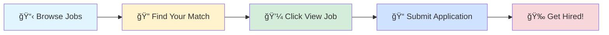

# 🚀 Tech Jobs Board

### Your Gateway to Amazing Career Opportunities

---

## 🎯 Browse by Job Profile

<table>
<tr>
<td align="center" width="25%">

 
<b>1000</b> total positions
</td>
<td align="center" width="25%">

 
<b>1000</b> total positions
</td>
<td align="center" width="25%">

 
<b>1000</b> total positions
</td>
<td align="center" width="25%">

 
<b>1000</b> total positions
</td>
</tr>
</table>

---

## 📊 Data Scientist

> 💼 **1000** positions available

<table>
<thead>
<tr>
<th width="20%">🏢 Company</th>
<th width="35%">💼 Role</th>
<th width="20%">📍 Location</th>
<th width="10%">⏰ Posted</th>
<th width="15%">🔗 Action</th>
</tr>
</thead>
<tbody>
<tr>
<td><a href="https://es.linkedin.com/company/okuant">OKUANT</a></td>
<td>Becario -Desarrollo de Producto IA (Python Backend & AI Strategy)</td>
<td></td>
<td>1d ago</td>
<td align="center"></td>
</tr>
<tr>
<td><a href="https://www.linkedin.com/company/duolingoschools">Duolingo for Schools</a></td>
<td>Data Scientist, New Graduate</td>
<td></td>
<td>1d ago</td>
<td align="center"></td>
</tr>
<tr>
<td><a href="https://fr.linkedin.com/company/weareecotonebiodiversity">Ecotone</a></td>
<td>Assistant R&D Réglementaire (STAGE) - H/F</td>
<td></td>
<td>1d ago</td>
<td align="center"></td>
</tr>
<tr>
<td><a href="https://www.linkedin.com/company/medtoureasy">MedTourEasy Bengaluru</a></td>
<td>Data Analysis Trainee</td>
<td>📍 India</td>
<td>1d ago</td>
<td align="center"></td>
</tr>
<tr>
<td><a href="https://in.linkedin.com/company/bakerandgrey">Baker & Grey</a></td>
<td>ELV / Building Automation Engineer – Trainee</td>
<td>📍 India</td>
<td>1d ago</td>
<td align="center"></td>
</tr>
<tr>
<td><a href="https://www.linkedin.com/company/innovaccer">Innovaccer</a></td>
<td>Apprentice- Analytics</td>
<td>📍 Noida</td>
<td>1d ago</td>
<td align="center"></td>
</tr>
<tr>
<td><a href="https://www.linkedin.com/company/medtoureasy-hyde">MedtourEasy Hyderabad</a></td>
<td>Data Analysis Trainee</td>
<td>📍 India</td>
<td>1d ago</td>
<td align="center"></td>
</tr>
<tr>
<td><a href="https://www.linkedin.com/company/virtusa">Virtusa</a></td>
<td>Python Data Engineer</td>
<td>📍 Chennai</td>
<td>1d ago</td>
<td align="center"></td>
</tr>
<tr>
<td><a href="https://in.linkedin.com/company/medtoureasyyy-gurugram">MedTourEasy Gurugram</a></td>
<td>Data Analysis Trainee</td>
<td>📍 India</td>
<td>1d ago</td>
<td align="center"></td>
</tr>
<tr>
<td><a href="https://in.linkedin.com/company/minfy">Minfy</a></td>
<td>AWS Security Specialist</td>
<td>📍 Delhi</td>
<td>1d ago</td>
<td align="center"></td>
</tr>
<tr>
<td><a href="https://vn.linkedin.com/company/vmogroup">VMO</a></td>
<td>Junior-Senior Python Developer - offer up to 55M</td>
<td></td>
<td>1d ago</td>
<td align="center"></td>
</tr>
<tr>
<td><a href="https://www.linkedin.com/company/executive-placements">ExecutivePlacements.com - The JOB Portal</a></td>
<td>Machine Learning Engineer (Remote)</td>
<td>📍 California, PA</td>
<td>1d ago</td>
<td align="center"></td>
</tr>
<tr>
<td><a href="https://www.linkedin.com/company/ntt-data-americas">NTT DATA North America</a></td>
<td>Salesforce AWS developer</td>
<td>📍 Mumbai</td>
<td>1d ago</td>
<td align="center"></td>
</tr>
<tr>
<td><a href="https://uk.linkedin.com/company/mygwork">myGwork - LGBTQ+ Business Community</a></td>
<td>R&D Executive-Microbiology</td>
<td>📍 Gurugram</td>
<td>1d ago</td>
<td align="center"></td>
</tr>
<tr>
<td><a href="https://www.linkedin.com/company/algosec">AlgoSec</a></td>
<td>Automation TL, India</td>
<td>📍 Delhi</td>
<td>1d ago</td>
<td align="center"></td>
</tr>
<tr>
<td><a href="https://www.linkedin.com/company/expertshubai">ExpertsHub.ai</a></td>
<td>AI/Python Engineer</td>
<td>📍 Bangalore</td>
<td>1d ago</td>
<td align="center"></td>
</tr>
<tr>
<td><a href="https://uk.linkedin.com/company/thehouseofai">The House Of AI</a></td>
<td>Artificial Intelligence Engineer</td>
<td></td>
<td>1d ago</td>
<td align="center"></td>
</tr>
<tr>
<td><a href="https://in.linkedin.com/company/nbits-it-company">NBITS IT Company</a></td>
<td>Full Stack Engineer (React js & Python)</td>
<td>📍 Hyderabad</td>
<td>1d ago</td>
<td align="center"></td>
</tr>
<tr>
<td><a href="https://in.linkedin.com/company/buildskillin">Buildskill</a></td>
<td>Inventory Forecasting Lead</td>
<td>📍 Gurugram</td>
<td>1d ago</td>
<td align="center"></td>
</tr>
<tr>
<td><a href="https://vn.linkedin.com/company/larion-computing-ltd-">LARION</a></td>
<td>Backend Developer (Python)</td>
<td></td>
<td>1d ago</td>
<td align="center"></td>
</tr>
<tr>
<td><a href="https://www.linkedin.com/company/sprinklr">Sprinklr</a></td>
<td>Director ML Engineering</td>
<td>📍 Gurugram</td>
<td>1d ago</td>
<td align="center"></td>
</tr>
<tr>
<td><a href="https://fr.linkedin.com/company/soprasteria">Sopra Steria</a></td>
<td>Data Scientist IA Generativa</td>
<td></td>
<td>1d ago</td>
<td align="center"></td>
</tr>
<tr>
<td><a href="https://www.linkedin.com/company/concentrix">Concentrix</a></td>
<td>Sr Software Engg ( Test Automation )</td>
<td>📍 Bangalore</td>
<td>1d ago</td>
<td align="center"></td>
</tr>
<tr>
<td><a href="https://www.linkedin.com/company/siemens-energy">Siemens Energy</a></td>
<td>Quality Professional (w/m/d) Produkte für die Energiewende</td>
<td></td>
<td>1d ago</td>
<td align="center"></td>
</tr>
<tr>
<td><a href="https://in.linkedin.com/company/edurun-virtuoso-pvt-ltd">EduRun Group</a></td>
<td>Java (Selenium) Automation Engineer</td>
<td>📍 India</td>
<td>1d ago</td>
<td align="center"></td>
</tr>
<tr>
<td><a href="https://www.linkedin.com/company/lawrence-berkeley-national-laboratory">Berkeley Lab</a></td>
<td>Data Scientist</td>
<td>📍 Berkeley, CA</td>
<td>1d ago</td>
<td align="center"></td>
</tr>
<tr>
<td><a href="https://www.linkedin.com/company/cvshealth">CVS Health</a></td>
<td>Data Scientist</td>
<td></td>
<td>1d ago</td>
<td align="center"></td>
</tr>
<tr>
<td><a href="https://uk.linkedin.com/company/ventureups">Venture Up</a></td>
<td>Python Developer</td>
<td></td>
<td>1d ago</td>
<td align="center"></td>
</tr>
<tr>
<td><a href="https://www.linkedin.com/company/cvshealth">CVS Health</a></td>
<td>Data Scientist</td>
<td></td>
<td>1d ago</td>
<td align="center"></td>
</tr>
<tr>
<td><a href="https://www.linkedin.com/company/northern-trust">Northern Trust</a></td>
<td>Compliance Monitoring Analyst</td>
<td></td>
<td>1d ago</td>
<td align="center"></td>
</tr>
<tr>
<td><a href="https://au.linkedin.com/company/accentureaustralia">Accenture Australia</a></td>
<td>Developer Automation Tester</td>
<td></td>
<td>1d ago</td>
<td align="center"></td>
</tr>
<tr>
<td><a href="https://au.linkedin.com/company/kaizen-global-technologies">Kaizen Global Technologies</a></td>
<td>Artificial Intelligence Engineer</td>
<td></td>
<td>1d ago</td>
<td align="center"></td>
</tr>
<tr>
<td><a href="https://www.linkedin.com/company/quantum-integrators-group-llc">Quantum Integrators</a></td>
<td>Analytics Designer</td>
<td>📍 Pune</td>
<td>1d ago</td>
<td align="center"></td>
</tr>
<tr>
<td><a href="https://in.linkedin.com/company/tata-consultancy-services">Tata Consultancy Services</a></td>
<td>Azure Virtual Desktop_Hyderabad</td>
<td>📍 Hyderabad</td>
<td>1d ago</td>
<td align="center"></td>
</tr>
<tr>
<td><a href="https://in.linkedin.com/company/brucode-technologies-pvt-ltd-">Brucode Technologies</a></td>
<td>Python Developer</td>
<td>📍 India</td>
<td>1d ago</td>
<td align="center"></td>
</tr>
<tr>
<td><a href="https://es.linkedin.com/company/izertis">IZERTIS</a></td>
<td>Backend Developer (Python) / Madrid</td>
<td></td>
<td>1d ago</td>
<td align="center"></td>
</tr>
<tr>
<td><a href="https://uk.linkedin.com/company/allianz-insurance-plc">Allianz UK</a></td>
<td>Head of Analytics and Insight</td>
<td></td>
<td>1d ago</td>
<td align="center"></td>
</tr>
<tr>
<td><a href="https://in.linkedin.com/company/vrinda-consultants">Vrinda Global</a></td>
<td>Sr Python Developer Contract Role</td>
<td>📍 Gurugram</td>
<td>1d ago</td>
<td align="center"></td>
</tr>
<tr>
<td><a href="https://ph.linkedin.com/company/tcl-online-services-incorporated">TCL.Online Services Incorporated</a></td>
<td>工具开发工程师（Python）</td>
<td></td>
<td>1d ago</td>
<td align="center"></td>
</tr>
<tr>
<td><a href="https://cz.linkedin.com/company/qinshift">Qinshift</a></td>
<td>Senior Automation Quality Engineer</td>
<td></td>
<td>1d ago</td>
<td align="center"></td>
</tr>
<tr>
<td><a href="https://de.linkedin.com/company/improveqm-gmbh">improveQM GmbH</a></td>
<td>Lackierer (m/w/d) für exklusive Fahrzeuge und Sportwagen</td>
<td></td>
<td>1d ago</td>
<td align="center"></td>
</tr>
<tr>
<td><a href="https://hu.linkedin.com/company/sonrisatechnologies">Sonrisa Technologies</a></td>
<td>Automation Engineer</td>
<td>📍 Targu Mures Metropolitan Area</td>
<td>1d ago</td>
<td align="center"></td>
</tr>
<tr>
<td><a href="https://in.linkedin.com/company/welaunchai">Welaunch.ai</a></td>
<td>GTM & Automation Engineer</td>
<td>📍 Gurugram</td>
<td>1d ago</td>
<td align="center"></td>
</tr>
<tr>
<td><a href="https://www.linkedin.com/company/medtoureasy">MedTourEasy Bengaluru</a></td>
<td>Data Analysis Trainee</td>
<td>📍 India</td>
<td>1d ago</td>
<td align="center"></td>
</tr>
<tr>
<td><a href="https://www.linkedin.com/company/webs-it-solution">Webs IT Solution</a></td>
<td>Data Science Intern</td>
<td>📍 India</td>
<td>1d ago</td>
<td align="center"></td>
</tr>
<tr>
<td><a href="https://dk.linkedin.com/company/simcorp">SimCorp</a></td>
<td>Senior Software Engineer (Test Automation)</td>
<td>📍 Noida</td>
<td>1d ago</td>
<td align="center"></td>
</tr>
<tr>
<td><a href="https://dk.linkedin.com/company/simcorp">SimCorp</a></td>
<td>Principal Software Engineer – AI and C# with Azure</td>
<td>📍 Noida</td>
<td>1d ago</td>
<td align="center"></td>
</tr>
<tr>
<td><a href="https://fr.linkedin.com/company/coexya">Coexya</a></td>
<td>Stage Data scientist</td>
<td></td>
<td>1d ago</td>
<td align="center"></td>
</tr>
<tr>
<td><a href="https://in.linkedin.com/company/grant-thornton-indus">Grant Thornton INDUS</a></td>
<td>GTM Analytics - Senior Associate Business Analyst</td>
<td>📍 Bangalore</td>
<td>1d ago</td>
<td align="center"></td>
</tr>
<tr>
<td><a href="https://de.linkedin.com/company/bungert">Bungert oHG</a></td>
<td>Koch/Köchin (m/w/d) für unser Golden Pig</td>
<td></td>
<td>1d ago</td>
<td align="center"></td>
</tr>
<tr>
<td><a href="https://www.linkedin.com/company/american-modern-insurance-group">American Modern Insurance Group</a></td>
<td>Data Scientist - AI</td>
<td>📍 Amelia, OH</td>
<td>1d ago</td>
<td align="center"></td>
</tr>
<tr>
<td><a href="https://www.linkedin.com/company/proadsw3-relations-pvt-ltd">PROADSW3 Relations pvt. ltd.</a></td>
<td>Quality Assurance Automation Engineer</td>
<td>📍 Bangalore</td>
<td>1d ago</td>
<td align="center"></td>
</tr>
<tr>
<td><a href="https://www.linkedin.com/company/ustglobal">UST</a></td>
<td>Lead I - Data Science</td>
<td>📍 Pune</td>
<td>1d ago</td>
<td align="center"></td>
</tr>
<tr>
<td><a href="https://www.linkedin.com/company/ustglobal">UST</a></td>
<td>Lead II - Software Engineering-Python Technical Lead</td>
<td>📍 Chennai</td>
<td>1d ago</td>
<td align="center"></td>
</tr>
<tr>
<td><a href="https://www.linkedin.com/company/ustglobal">UST</a></td>
<td>Python FullStack Developer</td>
<td>📍 Bangalore</td>
<td>1d ago</td>
<td align="center"></td>
</tr>
<tr>
<td><a href="https://www.linkedin.com/company/ustglobal">UST</a></td>
<td>Automation Development</td>
<td>📍 Bangalore</td>
<td>1d ago</td>
<td align="center"></td>
</tr>
<tr>
<td><a href="https://www.linkedin.com/company/ustglobal">UST</a></td>
<td>ML Engineer I</td>
<td>📍 Bangalore</td>
<td>1d ago</td>
<td align="center"></td>
</tr>
<tr>
<td><a href="https://www.linkedin.com/company/ustglobal">UST</a></td>
<td>Lead II - .Net, React, AWS</td>
<td>📍 Pune</td>
<td>1d ago</td>
<td align="center"></td>
</tr>
<tr>
<td><a href="https://www.linkedin.com/company/ustglobal">UST</a></td>
<td>Python fullstack Angular -Developer III - Software Engineering</td>
<td>📍 Pune</td>
<td>1d ago</td>
<td align="center"></td>
</tr>
<tr>
<td><a href="https://www.linkedin.com/company/ustglobal">UST</a></td>
<td>Python- Lead I - Software Engineering</td>
<td>📍 Pune</td>
<td>1d ago</td>
<td align="center"></td>
</tr>
<tr>
<td><a href="https://www.linkedin.com/company/ustglobal">UST</a></td>
<td>Lead I - Business Analysis - ETL AWS</td>
<td>📍 Bangalore</td>
<td>1d ago</td>
<td align="center"></td>
</tr>
<tr>
<td><a href="https://www.linkedin.com/company/ustglobal">UST</a></td>
<td>Cypress Automation Test Engineer</td>
<td>📍 Coimbatore</td>
<td>1d ago</td>
<td align="center"></td>
</tr>
<tr>
<td><a href="https://www.linkedin.com/company/ustglobal">UST</a></td>
<td>Tester III - Automation Testing</td>
<td>📍 Chennai</td>
<td>1d ago</td>
<td align="center"></td>
</tr>
<tr>
<td><a href="https://www.linkedin.com/company/ustglobal">UST</a></td>
<td>Lead I - Enterprise Solutions (Salesforce Automation Tester)</td>
<td>📍 Pune</td>
<td>1d ago</td>
<td align="center"></td>
</tr>
<tr>
<td><a href="https://www.linkedin.com/company/mtetrainings">MTE Trainings</a></td>
<td>Data Analysis Trainee</td>
<td>📍 India</td>
<td>1d ago</td>
<td align="center"></td>
</tr>
<tr>
<td><a href="https://uk.linkedin.com/company/qualitest">Qualitest</a></td>
<td>Sr SQL Developer</td>
<td>📍 Bangalore</td>
<td>1d ago</td>
<td align="center"></td>
</tr>
<tr>
<td><a href="https://in.linkedin.com/company/technogenindia">Technogen India Pvt. Ltd.</a></td>
<td>Python Developer</td>
<td>📍 Hyderabad</td>
<td>1d ago</td>
<td align="center"></td>
</tr>
<tr>
<td><a href="https://www.linkedin.com/company/moodys-corporation">Moody's Corporation</a></td>
<td>Assc Analytics & Model Analyst</td>
<td>📍 Noida</td>
<td>1d ago</td>
<td align="center"></td>
</tr>
<tr>
<td><a href="https://www.linkedin.com/company/toast-inc">Toast</a></td>
<td>Transaction Monitoring Risk Analyst</td>
<td>📍 Bangalore</td>
<td>1d ago</td>
<td align="center"></td>
</tr>
<tr>
<td><a href="https://www.linkedin.com/company/ustglobal">UST</a></td>
<td>Lead I - Python Engineer</td>
<td>📍 Pune</td>
<td>1d ago</td>
<td align="center"></td>
</tr>
<tr>
<td><a href="https://ng.linkedin.com/company/dreef-co">DREEF</a></td>
<td>AI Engineer (SOP Automation and Document Generation)</td>
<td></td>
<td>1d ago</td>
<td align="center"></td>
</tr>
<tr>
<td><a href="https://in.linkedin.com/company/spirensavvy-software-solutions-pvt-ltd">SpireNSavvy Software Solutions Pvt Ltd</a></td>
<td>AWS Data Engineer</td>
<td>📍 Bangalore</td>
<td>1d ago</td>
<td align="center"></td>
</tr>
<tr>
<td><a href="https://www.linkedin.com/company/emerson">Emerson</a></td>
<td>Automation Test Engineer</td>
<td>📍 Pune</td>
<td>1d ago</td>
<td align="center"></td>
</tr>
<tr>
<td><a href="https://www.linkedin.com/company/ustglobal">UST</a></td>
<td>Tester III - Automation Testing</td>
<td>📍 Chennai</td>
<td>1d ago</td>
<td align="center"></td>
</tr>
<tr>
<td><a href="https://hk.linkedin.com/company/aqumon">AQUMON</a></td>
<td>Python Senior Software Engineer (Financial Data)</td>
<td></td>
<td>1d ago</td>
<td align="center"></td>
</tr>
<tr>
<td><a href="https://in.linkedin.com/company/kpmgindia">KPMG India</a></td>
<td>Consultant-Data Analytics</td>
<td>📍 Bangalore</td>
<td>1d ago</td>
<td align="center"></td>
</tr>
<tr>
<td><a href="https://www.linkedin.com/company/dun-&-bradstreet">Dun & Bradstreet</a></td>
<td>Analyst II (R-18290)</td>
<td>📍 Mumbai</td>
<td>1d ago</td>
<td align="center"></td>
</tr>
<tr>
<td><a href="https://uk.linkedin.com/company/jcl-burns-sheehan">Burns Sheehan</a></td>
<td>Python Contractor</td>
<td></td>
<td>1d ago</td>
<td align="center"></td>
</tr>
<tr>
<td><a href="https://www.linkedin.com/company/paktolus">Paktolus</a></td>
<td>Sr. Data Science Engineer (Remote)</td>
<td>📍 Mumbai</td>
<td>1d ago</td>
<td align="center"></td>
</tr>
<tr>
<td><a href="https://qa.linkedin.com/company/asmacs-recruitment-qatar">Asmacs Recruitment Qatar</a></td>
<td>Monitoring Lead Technician</td>
<td></td>
<td>1d ago</td>
<td align="center"></td>
</tr>
<tr>
<td><a href="https://br.linkedin.com/company/chavantes">Grupo Chavantes</a></td>
<td>RÁDIO OPERADOR – Edital 006/2025 – SAMU - MARÍLIA/SP</td>
<td></td>
<td>1d ago</td>
<td align="center"></td>
</tr>
<tr>
<td><a href="https://uk.linkedin.com/school/citystgeorges/">City St George’s, University of London</a></td>
<td>Machine Learning Engineer</td>
<td></td>
<td>1d ago</td>
<td align="center"></td>
</tr>
<tr>
<td><a href="https://www.linkedin.com/company/nuware">NuWare</a></td>
<td>Automation Test Engineer</td>
<td>📍 Bangalore</td>
<td>1d ago</td>
<td align="center"></td>
</tr>
<tr>
<td><a href="https://www.linkedin.com/company/itdzberlin">IT-Dienstleistungszentrum Berlin</a></td>
<td>Administrator*in für den IT-Service Hardware Server</td>
<td></td>
<td>1d ago</td>
<td align="center"></td>
</tr>
<tr>
<td><a href="https://www.linkedin.com/company/ustglobal">UST</a></td>
<td>Lead I - Software Engineering (Java+Azure Cloud)</td>
<td>📍 Chennai</td>
<td>1d ago</td>
<td align="center"></td>
</tr>
<tr>
<td><a href="https://www.linkedin.com/company/ustglobal">UST</a></td>
<td>Lead I - Python fullstack (Python +React)</td>
<td>📍 Hyderabad</td>
<td>1d ago</td>
<td align="center"></td>
</tr>
<tr>
<td><a href="https://in.linkedin.com/company/cummins-india">Cummins India</a></td>
<td>AI/ML Technical Enablement Specialist</td>
<td>📍 Pune</td>
<td>1d ago</td>
<td align="center"></td>
</tr>
<tr>
<td><a href="https://id.linkedin.com/company/gotogroup">GoTo Group</a></td>
<td>GoTo Group - Software Engineer - AI/ML - Infrastructure Engineer</td>
<td>📍 Bangalore</td>
<td>1d ago</td>
<td align="center"></td>
</tr>
<tr>
<td><a href="https://www.linkedin.com/company/vasitum">Vasitum</a></td>
<td>Technical Lead- Java & Python</td>
<td>📍 Noida</td>
<td>1d ago</td>
<td align="center"></td>
</tr>
<tr>
<td><a href="https://uk.linkedin.com/company/funic-tech">Funic Tech</a></td>
<td>Automation QA with Salesforce  4-8 yrs</td>
<td>📍 Pune</td>
<td>1d ago</td>
<td align="center"></td>
</tr>
<tr>
<td><a href="https://in.linkedin.com/company/reliance">Reliance Industries Limited</a></td>
<td>Team Lead - Internal Audit Analytics</td>
<td>📍 Mumbai</td>
<td>1d ago</td>
<td align="center"></td>
</tr>
<tr>
<td><a href="https://www.linkedin.com/company/syntel-private-limited">Accenture services Pvt Ltd</a></td>
<td>Test Automation Engineer</td>
<td>📍 Bangalore</td>
<td>1d ago</td>
<td align="center"></td>
</tr>
<tr>
<td><a href="https://de.linkedin.com/company/live-reply-de">Live Reply DE</a></td>
<td>Software Developer Process Automation (m/w/d) - BU2</td>
<td></td>
<td>1d ago</td>
<td align="center"></td>
</tr>
<tr>
<td><a href="https://it.linkedin.com/company/bonfiglioli-riduttori-spa">Bonfiglioli</a></td>
<td>R&D Design Engineer</td>
<td></td>
<td>1d ago</td>
<td align="center"></td>
</tr>
<tr>
<td><a href="https://de.linkedin.com/company/rmstegos">RMStegos</a></td>
<td>Fachinformatiker für Systemintegration (m/w/d)</td>
<td></td>
<td>1d ago</td>
<td align="center"></td>
</tr>
<tr>
<td><a href="https://sg.linkedin.com/company/aspireapp-global">Aspire</a></td>
<td>FinCrime Specialist, Transaction Monitoring</td>
<td>📍 India</td>
<td>1d ago</td>
<td align="center"></td>
</tr>
<tr>
<td><a href="https://www.linkedin.com/company/fractal-analytics">Fractal</a></td>
<td>Fullstack Engineers (Java/Python Django/Angular/ React/Dot Net)</td>
<td>📍 Pune</td>
<td>1d ago</td>
<td align="center"></td>
</tr>
<tr>
<td><a href="https://www.linkedin.com/company/ahold-delhaize-usa">Ahold Delhaize USA</a></td>
<td>GIS & Market Analytics Intern</td>
<td>📍 Salisbury, NC</td>
<td>1d ago</td>
<td align="center"></td>
</tr>
<tr>
<td><a href="https://pt.linkedin.com/company/gbtsolutions">GBT Solutions, Lda</a></td>
<td>Data Engineer (Azure)</td>
<td></td>
<td>1d ago</td>
<td align="center"></td>
</tr>
<tr>
<td><a href="https://pt.linkedin.com/company/gbtsolutions">GBT Solutions, Lda</a></td>
<td>Data Analyst (Azure)</td>
<td></td>
<td>1d ago</td>
<td align="center"></td>
</tr>
<tr><td colspan="5" align="center"><i>... and 900 more positions</i></td></tr>
</tbody>
</table>

---

## 💼 Business Analyst

> 💼 **1000** positions available

<table>
<thead>
<tr>
<th width="20%">🏢 Company</th>
<th width="35%">💼 Role</th>
<th width="20%">📍 Location</th>
<th width="10%">⏰ Posted</th>
<th width="15%">🔗 Action</th>
</tr>
</thead>
<tbody>
<tr>
<td><a href="https://es.linkedin.com/company/okuant">OKUANT</a></td>
<td>Becario -Desarrollo de Producto IA (Python Backend & AI Strategy)</td>
<td></td>
<td>1d ago</td>
<td align="center"></td>
</tr>
<tr>
<td><a href="https://ca.linkedin.com/company/colliers">Colliers</a></td>
<td>Project Management - Internship</td>
<td></td>
<td>1d ago</td>
<td align="center"></td>
</tr>
<tr>
<td><a href="https://www.linkedin.com/company/medtoureasy">MedTourEasy Bengaluru</a></td>
<td>Data Analysis Trainee</td>
<td>📍 India</td>
<td>1d ago</td>
<td align="center"></td>
</tr>
<tr>
<td><a href="https://fr.linkedin.com/company/messika">Messika</a></td>
<td>Stage - Assistant Business Analyst H/F</td>
<td></td>
<td>1d ago</td>
<td align="center"></td>
</tr>
<tr>
<td><a href="https://in.linkedin.com/company/bakerandgrey">Baker & Grey</a></td>
<td>ELV / Building Automation Engineer – Trainee</td>
<td>📍 India</td>
<td>1d ago</td>
<td align="center"></td>
</tr>
<tr>
<td><a href="https://www.linkedin.com/company/innovaccer">Innovaccer</a></td>
<td>Apprentice- Analytics</td>
<td>📍 Noida</td>
<td>1d ago</td>
<td align="center"></td>
</tr>
<tr>
<td><a href="https://www.linkedin.com/company/medtoureasy-hyde">MedtourEasy Hyderabad</a></td>
<td>Data Analysis Trainee</td>
<td>📍 India</td>
<td>1d ago</td>
<td align="center"></td>
</tr>
<tr>
<td><a href="https://in.linkedin.com/company/wipro">Wipro</a></td>
<td>Business Analyst L4</td>
<td>📍 Pune</td>
<td>1d ago</td>
<td align="center"></td>
</tr>
<tr>
<td><a href="https://www.linkedin.com/company/virtusa">Virtusa</a></td>
<td>Python Data Engineer</td>
<td>📍 Chennai</td>
<td>1d ago</td>
<td align="center"></td>
</tr>
<tr>
<td><a href="https://in.linkedin.com/company/medtoureasyyy-gurugram">MedTourEasy Gurugram</a></td>
<td>Data Analysis Trainee</td>
<td>📍 India</td>
<td>1d ago</td>
<td align="center"></td>
</tr>
<tr>
<td><a href="https://ae.linkedin.com/company/smaarttdigital">Smaartt Digital | Salesforce SUMMIT Partner</a></td>
<td>Salesforce Project Manager</td>
<td></td>
<td>1d ago</td>
<td align="center"></td>
</tr>
<tr>
<td><a href="https://vn.linkedin.com/company/vmogroup">VMO</a></td>
<td>Junior-Senior Python Developer - offer up to 55M</td>
<td></td>
<td>1d ago</td>
<td align="center"></td>
</tr>
<tr>
<td><a href="https://in.linkedin.com/company/meragi">Meragi</a></td>
<td>Business Analyst Intern - Marketing</td>
<td>📍 Bangalore</td>
<td>1d ago</td>
<td align="center"></td>
</tr>
<tr>
<td><a href="https://www.linkedin.com/company/ntt-data-americas">NTT DATA North America</a></td>
<td>Salesforce AWS developer</td>
<td>📍 Mumbai</td>
<td>1d ago</td>
<td align="center"></td>
</tr>
<tr>
<td><a href="https://uk.linkedin.com/company/mygwork">myGwork - LGBTQ+ Business Community</a></td>
<td>PROJECT & BUSINESS ANALYSIS INTERN W/M</td>
<td></td>
<td>1d ago</td>
<td align="center"></td>
</tr>
<tr>
<td><a href="https://www.linkedin.com/company/algosec">AlgoSec</a></td>
<td>Automation TL, India</td>
<td>📍 Delhi</td>
<td>1d ago</td>
<td align="center"></td>
</tr>
<tr>
<td><a href="https://www.linkedin.com/company/expertshubai">ExpertsHub.ai</a></td>
<td>AI/Python Engineer</td>
<td>📍 Bangalore</td>
<td>1d ago</td>
<td align="center"></td>
</tr>
<tr>
<td><a href="https://in.linkedin.com/company/nbits-it-company">NBITS IT Company</a></td>
<td>Full Stack Engineer (React js & Python)</td>
<td>📍 Hyderabad</td>
<td>1d ago</td>
<td align="center"></td>
</tr>
<tr>
<td><a href="https://vn.linkedin.com/company/larion-computing-ltd-">LARION</a></td>
<td>Backend Developer (Python)</td>
<td></td>
<td>1d ago</td>
<td align="center"></td>
</tr>
<tr>
<td><a href="https://in.linkedin.com/school/teamlease-edtech/">TeamLease Edtech</a></td>
<td>Business Analyst</td>
<td>📍 Mumbai</td>
<td>1d ago</td>
<td align="center"></td>
</tr>
<tr>
<td><a href="https://www.linkedin.com/company/fugetron-corp">Fugetron Corp</a></td>
<td>Power BI Developer</td>
<td>📍 Mumbai</td>
<td>1d ago</td>
<td align="center"></td>
</tr>
<tr>
<td><a href="https://www.linkedin.com/company/concentrix">Concentrix</a></td>
<td>Sr Software Engg ( Test Automation )</td>
<td>📍 Bangalore</td>
<td>1d ago</td>
<td align="center"></td>
</tr>
<tr>
<td><a href="https://mt.linkedin.com/company/boston-link">Boston Link</a></td>
<td>IT Business Analyst – CRM/ERP</td>
<td></td>
<td>1d ago</td>
<td align="center"></td>
</tr>
<tr>
<td><a href="https://www.linkedin.com/company/emerson">Emerson</a></td>
<td>Senior SCM Business Analyst</td>
<td>📍 Pune</td>
<td>1d ago</td>
<td align="center"></td>
</tr>
<tr>
<td><a href="https://in.linkedin.com/company/edurun-virtuoso-pvt-ltd">EduRun Group</a></td>
<td>Java (Selenium) Automation Engineer</td>
<td>📍 India</td>
<td>1d ago</td>
<td align="center"></td>
</tr>
<tr>
<td><a href="https://uk.linkedin.com/company/ventureups">Venture Up</a></td>
<td>Python Developer</td>
<td></td>
<td>1d ago</td>
<td align="center"></td>
</tr>
<tr>
<td><a href="https://au.linkedin.com/company/accentureaustralia">Accenture Australia</a></td>
<td>Developer Automation Tester</td>
<td></td>
<td>1d ago</td>
<td align="center"></td>
</tr>
<tr>
<td><a href="https://in.linkedin.com/company/physicswallah">PW (PhysicsWallah)</a></td>
<td>Business Analyst</td>
<td>📍 Noida</td>
<td>1d ago</td>
<td align="center"></td>
</tr>
<tr>
<td><a href="https://www.linkedin.com/company/deloitte">Deloitte</a></td>
<td>Business Analyst | Deloitte Technology Delivery Center</td>
<td></td>
<td>1d ago</td>
<td align="center"></td>
</tr>
<tr>
<td><a href="https://www.linkedin.com/company/quantum-integrators-group-llc">Quantum Integrators</a></td>
<td>Analytics Designer</td>
<td>📍 Pune</td>
<td>1d ago</td>
<td align="center"></td>
</tr>
<tr>
<td><a href="https://in.linkedin.com/company/brucode-technologies-pvt-ltd-">Brucode Technologies</a></td>
<td>Python Developer</td>
<td>📍 India</td>
<td>1d ago</td>
<td align="center"></td>
</tr>
<tr>
<td><a href="https://es.linkedin.com/company/izertis">IZERTIS</a></td>
<td>Backend Developer (Python) / Madrid</td>
<td></td>
<td>1d ago</td>
<td align="center"></td>
</tr>
<tr>
<td><a href="https://uk.linkedin.com/company/allianz-insurance-plc">Allianz UK</a></td>
<td>Head of Analytics and Insight</td>
<td></td>
<td>1d ago</td>
<td align="center"></td>
</tr>
<tr>
<td><a href="https://sa.linkedin.com/company/hr360s">360Solutions</a></td>
<td>Business Analyst</td>
<td></td>
<td>1d ago</td>
<td align="center"></td>
</tr>
<tr>
<td><a href="https://de.linkedin.com/company/rutronik">RUTRONIK Electronics Worldwide</a></td>
<td>Business Analyst (m/w/d)</td>
<td></td>
<td>1d ago</td>
<td align="center"></td>
</tr>
<tr>
<td><a href="https://in.linkedin.com/company/vrinda-consultants">Vrinda Global</a></td>
<td>Sr Python Developer Contract Role</td>
<td>📍 Gurugram</td>
<td>1d ago</td>
<td align="center"></td>
</tr>
<tr>
<td><a href="https://ph.linkedin.com/company/tcl-online-services-incorporated">TCL.Online Services Incorporated</a></td>
<td>工具开发工程师（Python）</td>
<td></td>
<td>1d ago</td>
<td align="center"></td>
</tr>
<tr>
<td><a href="https://cz.linkedin.com/company/qinshift">Qinshift</a></td>
<td>Senior Automation Quality Engineer</td>
<td></td>
<td>1d ago</td>
<td align="center"></td>
</tr>
<tr>
<td><a href="https://vn.linkedin.com/company/misa-jsc">MISA JSC</a></td>
<td>HN|Business Analyst (MBA) - Upto 2000$ - Không yêu cầu kinh nghiệm</td>
<td></td>
<td>1d ago</td>
<td align="center"></td>
</tr>
<tr>
<td><a href="https://hu.linkedin.com/company/sonrisatechnologies">Sonrisa Technologies</a></td>
<td>Automation Engineer</td>
<td>📍 Targu Mures Metropolitan Area</td>
<td>1d ago</td>
<td align="center"></td>
</tr>
<tr>
<td><a href="https://br.linkedin.com/company/stefanini-na-apac">Stefanini North America and APAC</a></td>
<td>CRM Business Analyst</td>
<td>📍 Topeka, KS</td>
<td>1d ago</td>
<td align="center"></td>
</tr>
<tr>
<td><a href="https://in.linkedin.com/company/welaunchai">Welaunch.ai</a></td>
<td>GTM & Automation Engineer</td>
<td>📍 Gurugram</td>
<td>1d ago</td>
<td align="center"></td>
</tr>
<tr>
<td><a href="https://www.linkedin.com/company/medtoureasy">MedTourEasy Bengaluru</a></td>
<td>Data Analysis Trainee</td>
<td>📍 India</td>
<td>1d ago</td>
<td align="center"></td>
</tr>
<tr>
<td><a href="https://dk.linkedin.com/company/simcorp">SimCorp</a></td>
<td>Senior Software Engineer (Test Automation)</td>
<td>📍 Noida</td>
<td>1d ago</td>
<td align="center"></td>
</tr>
<tr>
<td><a href="https://fr.linkedin.com/company/synchrone-fr">Synchrone Fr</a></td>
<td>SCRUM MASTER – H/F</td>
<td></td>
<td>1d ago</td>
<td align="center"></td>
</tr>
<tr>
<td><a href="https://nl.linkedin.com/company/stemzhealthcare">Stemz Healthcare</a></td>
<td>Healthcare Operation -Business Analyst</td>
<td>📍 Gurugram</td>
<td>1d ago</td>
<td align="center"></td>
</tr>
<tr>
<td><a href="https://uk.linkedin.com/company/esp-global-services">ESP Global Services</a></td>
<td>ServiceNow Business Analyst - India</td>
<td>📍 Pune</td>
<td>1d ago</td>
<td align="center"></td>
</tr>
<tr>
<td><a href="https://in.linkedin.com/company/grant-thornton-indus">Grant Thornton INDUS</a></td>
<td>GTM Analytics - Senior Associate Business Analyst</td>
<td>📍 Bangalore</td>
<td>1d ago</td>
<td align="center"></td>
</tr>
<tr>
<td><a href="https://www.linkedin.com/company/ustglobal">UST</a></td>
<td>Lead II - Business Analysis</td>
<td>📍 Bangalore</td>
<td>1d ago</td>
<td align="center"></td>
</tr>
<tr>
<td><a href="https://www.linkedin.com/company/proadsw3-relations-pvt-ltd">PROADSW3 Relations pvt. ltd.</a></td>
<td>Quality Assurance Automation Engineer</td>
<td>📍 Bangalore</td>
<td>1d ago</td>
<td align="center"></td>
</tr>
<tr>
<td><a href="https://it.linkedin.com/company/siae">SIAE</a></td>
<td>Business Analyst - Network Tools & Processes Evolution</td>
<td></td>
<td>1d ago</td>
<td align="center"></td>
</tr>
<tr>
<td><a href="https://www.linkedin.com/company/ustglobal">UST</a></td>
<td>Lead I - Business Analysis</td>
<td>📍 Bangalore</td>
<td>1d ago</td>
<td align="center"></td>
</tr>
<tr>
<td><a href="https://www.linkedin.com/company/ustglobal">UST</a></td>
<td>Associate III - Business Analysis</td>
<td>📍 Chennai</td>
<td>1d ago</td>
<td align="center"></td>
</tr>
<tr>
<td><a href="https://www.linkedin.com/company/ustglobal">UST</a></td>
<td>Architect I - Enterprise Solutions (Salesforce Architect)</td>
<td>📍 Chennai</td>
<td>1d ago</td>
<td align="center"></td>
</tr>
<tr>
<td><a href="https://www.linkedin.com/company/ustglobal">UST</a></td>
<td>Lead I - Business Analysis</td>
<td>📍 Bangalore</td>
<td>1d ago</td>
<td align="center"></td>
</tr>
<tr>
<td><a href="https://ae.linkedin.com/company/dx-futuretech">DX FutureTech</a></td>
<td>Information Technology Project Manager - Salesforce</td>
<td></td>
<td>1d ago</td>
<td align="center"></td>
</tr>
<tr>
<td><a href="https://www.linkedin.com/company/ustglobal">UST</a></td>
<td>Lead II - Software Engineering-Python Technical Lead</td>
<td>📍 Chennai</td>
<td>1d ago</td>
<td align="center"></td>
</tr>
<tr>
<td><a href="https://www.linkedin.com/company/ustglobal">UST</a></td>
<td>Python FullStack Developer</td>
<td>📍 Bangalore</td>
<td>1d ago</td>
<td align="center"></td>
</tr>
<tr>
<td><a href="https://www.linkedin.com/company/ustglobal">UST</a></td>
<td>Automation Development</td>
<td>📍 Bangalore</td>
<td>1d ago</td>
<td align="center"></td>
</tr>
<tr>
<td><a href="https://www.linkedin.com/company/ustglobal">UST</a></td>
<td>Lead I - Business Analysis</td>
<td>📍 Chennai</td>
<td>1d ago</td>
<td align="center"></td>
</tr>
<tr>
<td><a href="https://www.linkedin.com/company/ustglobal">UST</a></td>
<td>Python fullstack Angular -Developer III - Software Engineering</td>
<td>📍 Pune</td>
<td>1d ago</td>
<td align="center"></td>
</tr>
<tr>
<td><a href="https://www.linkedin.com/company/ustglobal">UST</a></td>
<td>Python- Lead I - Software Engineering</td>
<td>📍 Pune</td>
<td>1d ago</td>
<td align="center"></td>
</tr>
<tr>
<td><a href="https://www.linkedin.com/company/ustglobal">UST</a></td>
<td>Lead I - Business Analysis - ETL AWS</td>
<td>📍 Bangalore</td>
<td>1d ago</td>
<td align="center"></td>
</tr>
<tr>
<td><a href="https://www.linkedin.com/company/ustglobal">UST</a></td>
<td>Cypress Automation Test Engineer</td>
<td>📍 Coimbatore</td>
<td>1d ago</td>
<td align="center"></td>
</tr>
<tr>
<td><a href="https://www.linkedin.com/company/ustglobal">UST</a></td>
<td>Tester III - Automation Testing</td>
<td>📍 Chennai</td>
<td>1d ago</td>
<td align="center"></td>
</tr>
<tr>
<td><a href="https://www.linkedin.com/company/ustglobal">UST</a></td>
<td>Lead I - Enterprise Solutions (Salesforce Automation Tester)</td>
<td>📍 Pune</td>
<td>1d ago</td>
<td align="center"></td>
</tr>
<tr>
<td><a href="https://www.linkedin.com/company/mtetrainings">MTE Trainings</a></td>
<td>Data Analysis Trainee</td>
<td>📍 India</td>
<td>1d ago</td>
<td align="center"></td>
</tr>
<tr>
<td><a href="https://uk.linkedin.com/company/qualitest">Qualitest</a></td>
<td>Sr SQL Developer</td>
<td>📍 Bangalore</td>
<td>1d ago</td>
<td align="center"></td>
</tr>
<tr>
<td><a href="https://ae.linkedin.com/company/talent-higher">Talent Higher</a></td>
<td>Data Specialist (Microsoft Excel)</td>
<td></td>
<td>1d ago</td>
<td align="center"></td>
</tr>
<tr>
<td><a href="https://in.linkedin.com/company/technogenindia">Technogen India Pvt. Ltd.</a></td>
<td>Python Developer</td>
<td>📍 Hyderabad</td>
<td>1d ago</td>
<td align="center"></td>
</tr>
<tr>
<td><a href="https://www.linkedin.com/company/verisk-analytics">Verisk</a></td>
<td>Analyst, Software Engineering | Business Analyst I</td>
<td>📍 Hyderabad</td>
<td>1d ago</td>
<td align="center"></td>
</tr>
<tr>
<td><a href="https://in.linkedin.com/company/tata-consultancy-services">Tata Consultancy Services</a></td>
<td>Presales Solution Architect -Salesforce Field Service</td>
<td>📍 Mumbai</td>
<td>1d ago</td>
<td align="center"></td>
</tr>
<tr>
<td><a href="https://www.linkedin.com/company/moodys-corporation">Moody's Corporation</a></td>
<td>Assc Analytics & Model Analyst</td>
<td>📍 Noida</td>
<td>1d ago</td>
<td align="center"></td>
</tr>
<tr>
<td><a href="https://www.linkedin.com/company/ustglobal">UST</a></td>
<td>Lead I - Python Engineer</td>
<td>📍 Pune</td>
<td>1d ago</td>
<td align="center"></td>
</tr>
<tr>
<td><a href="https://ng.linkedin.com/company/dreef-co">DREEF</a></td>
<td>AI Engineer (SOP Automation and Document Generation)</td>
<td></td>
<td>1d ago</td>
<td align="center"></td>
</tr>
<tr>
<td><a href="https://www.linkedin.com/company/emerson">Emerson</a></td>
<td>Automation Test Engineer</td>
<td>📍 Pune</td>
<td>1d ago</td>
<td align="center"></td>
</tr>
<tr>
<td><a href="https://www.linkedin.com/company/ustglobal">UST</a></td>
<td>Associate III - Business Analysis - Jira Admin</td>
<td>📍 Chennai</td>
<td>1d ago</td>
<td align="center"></td>
</tr>
<tr>
<td><a href="https://www.linkedin.com/company/ustglobal">UST</a></td>
<td>Tester III - Automation Testing</td>
<td>📍 Chennai</td>
<td>1d ago</td>
<td align="center"></td>
</tr>
<tr>
<td><a href="https://hk.linkedin.com/company/aqumon">AQUMON</a></td>
<td>Python Senior Software Engineer (Financial Data)</td>
<td></td>
<td>1d ago</td>
<td align="center"></td>
</tr>
<tr>
<td><a href="https://in.linkedin.com/company/kpmgindia">KPMG India</a></td>
<td>Consultant-Data Analytics</td>
<td>📍 Bangalore</td>
<td>1d ago</td>
<td align="center"></td>
</tr>
<tr>
<td><a href="https://uk.linkedin.com/company/jcl-burns-sheehan">Burns Sheehan</a></td>
<td>Python Contractor</td>
<td></td>
<td>1d ago</td>
<td align="center"></td>
</tr>
<tr>
<td><a href="https://dk.linkedin.com/company/bloom">Bloom</a></td>
<td>Agile Release Manager</td>
<td></td>
<td>1d ago</td>
<td align="center"></td>
</tr>
<tr>
<td><a href="https://www.linkedin.com/company/nuware">NuWare</a></td>
<td>Automation Test Engineer</td>
<td>📍 Bangalore</td>
<td>1d ago</td>
<td align="center"></td>
</tr>
<tr>
<td><a href="https://www.linkedin.com/company/labcorp">Labcorp</a></td>
<td>Intern - Global Project Management [ Diagnostic Development Service ]</td>
<td></td>
<td>1d ago</td>
<td align="center"></td>
</tr>
<tr>
<td><a href="https://www.linkedin.com/company/ustglobal">UST</a></td>
<td>Lead I - Python fullstack (Python +React)</td>
<td>📍 Hyderabad</td>
<td>1d ago</td>
<td align="center"></td>
</tr>
<tr>
<td><a href="https://www.linkedin.com/company/ustglobal">UST</a></td>
<td>Associate III - Business Analysis</td>
<td>📍 Bangalore</td>
<td>1d ago</td>
<td align="center"></td>
</tr>
<tr>
<td><a href="https://ca.linkedin.com/company/thomson-reuters">Thomson Reuters</a></td>
<td>Salesforce Engineer</td>
<td>📍 Bangalore</td>
<td>1d ago</td>
<td align="center"></td>
</tr>
<tr>
<td><a href="https://www.linkedin.com/company/vasitum">Vasitum</a></td>
<td>Technical Lead- Java & Python</td>
<td>📍 Noida</td>
<td>1d ago</td>
<td align="center"></td>
</tr>
<tr>
<td><a href="https://uk.linkedin.com/company/funic-tech">Funic Tech</a></td>
<td>Automation QA with Salesforce  4-8 yrs</td>
<td>📍 Pune</td>
<td>1d ago</td>
<td align="center"></td>
</tr>
<tr>
<td><a href="https://in.linkedin.com/company/reliance">Reliance Industries Limited</a></td>
<td>Team Lead - Internal Audit Analytics</td>
<td>📍 Mumbai</td>
<td>1d ago</td>
<td align="center"></td>
</tr>
<tr>
<td><a href="https://www.linkedin.com/company/syntel-private-limited">Accenture services Pvt Ltd</a></td>
<td>Test Automation Engineer</td>
<td>📍 Bangalore</td>
<td>1d ago</td>
<td align="center"></td>
</tr>
<tr>
<td><a href="https://de.linkedin.com/company/live-reply-de">Live Reply DE</a></td>
<td>Software Developer Process Automation (m/w/d) - BU2</td>
<td></td>
<td>1d ago</td>
<td align="center"></td>
</tr>
<tr>
<td><a href="https://www.linkedin.com/company/programmingcom">Programming.com</a></td>
<td>Business Analyst with LMS/LOS)</td>
<td>📍 Pune</td>
<td>1d ago</td>
<td align="center"></td>
</tr>
<tr>
<td><a href="https://www.linkedin.com/company/fractal-analytics">Fractal</a></td>
<td>Fullstack Engineers (Java/Python Django/Angular/ React/Dot Net)</td>
<td>📍 Pune</td>
<td>1d ago</td>
<td align="center"></td>
</tr>
<tr>
<td><a href="https://www.linkedin.com/company/ahold-delhaize-usa">Ahold Delhaize USA</a></td>
<td>GIS & Market Analytics Intern</td>
<td>📍 Salisbury, NC</td>
<td>1d ago</td>
<td align="center"></td>
</tr>
<tr>
<td><a href="https://ae.linkedin.com/company/engie-middle-east">ENGIE Middle East</a></td>
<td>Stakeholder Management</td>
<td>📍 Delhi</td>
<td>1d ago</td>
<td align="center"></td>
</tr>
<tr>
<td><a href="https://www.linkedin.com/company/ptcinc">PTC</a></td>
<td>Release Project Management Consultant</td>
<td>📍 Pune</td>
<td>1d ago</td>
<td align="center"></td>
</tr>
<tr>
<td><a href="https://pt.linkedin.com/company/volkswagen-financial-services-portugal">Volkswagen Financial Services Portugal</a></td>
<td>Salesforce Business Analyst</td>
<td>📍 Porto Metropolitan Area</td>
<td>1d ago</td>
<td align="center"></td>
</tr>
<tr>
<td><a href="https://jo.linkedin.com/company/arabwork">ArabWork</a></td>
<td>Power BI Support Consultant</td>
<td></td>
<td>1d ago</td>
<td align="center"></td>
</tr>
<tr>
<td><a href="https://www.linkedin.com/company/ustglobal">UST</a></td>
<td>Lead I - Business Analysis</td>
<td>📍 Pune</td>
<td>1d ago</td>
<td align="center"></td>
</tr>
<tr><td colspan="5" align="center"><i>... and 900 more positions</i></td></tr>
</tbody>
</table>

---

## 🚀 Product Manager

> 💼 **1000** positions available

<table>
<thead>
<tr>
<th width="20%">🏢 Company</th>
<th width="35%">💼 Role</th>
<th width="20%">📍 Location</th>
<th width="10%">⏰ Posted</th>
<th width="15%">🔗 Action</th>
</tr>
</thead>
<tbody>
<tr>
<td><a href="https://ca.linkedin.com/company/colliers">Colliers</a></td>
<td>Project Management - Internship</td>
<td></td>
<td>1d ago</td>
<td align="center"></td>
</tr>
<tr>
<td><a href="https://pt.linkedin.com/company/amorimluxurygroup">Amorim Luxury Group</a></td>
<td>Product Development Intern</td>
<td></td>
<td>1d ago</td>
<td align="center"></td>
</tr>
<tr>
<td><a href="https://www.linkedin.com/company/medtoureasy">MedTourEasy Bengaluru</a></td>
<td>Data Analysis Trainee</td>
<td>📍 India</td>
<td>1d ago</td>
<td align="center"></td>
</tr>
<tr>
<td><a href="https://in.linkedin.com/company/bakerandgrey">Baker & Grey</a></td>
<td>ELV / Building Automation Engineer – Trainee</td>
<td>📍 India</td>
<td>1d ago</td>
<td align="center"></td>
</tr>
<tr>
<td><a href="https://www.linkedin.com/company/innovaccer">Innovaccer</a></td>
<td>Apprentice- Analytics</td>
<td>📍 Noida</td>
<td>1d ago</td>
<td align="center"></td>
</tr>
<tr>
<td><a href="https://www.linkedin.com/company/abbvie">AbbVie</a></td>
<td>Associate, Study Management III</td>
<td></td>
<td>1d ago</td>
<td align="center"></td>
</tr>
<tr>
<td><a href="https://www.linkedin.com/company/medtoureasy-hyde">MedtourEasy Hyderabad</a></td>
<td>Data Analysis Trainee</td>
<td>📍 India</td>
<td>1d ago</td>
<td align="center"></td>
</tr>
<tr>
<td><a href="https://in.linkedin.com/company/xenonstack-life">XenonStack Moments</a></td>
<td>Product Marketing Apprentice</td>
<td>📍 India</td>
<td>1d ago</td>
<td align="center"></td>
</tr>
<tr>
<td><a href="https://pt.linkedin.com/company/mc-sonae">MC</a></td>
<td>Market Research Trainee</td>
<td></td>
<td>1d ago</td>
<td align="center"></td>
</tr>
<tr>
<td><a href="https://it.linkedin.com/showcase/prada/">Prada</a></td>
<td>Digital Store Sales Product Owner Intern</td>
<td></td>
<td>1d ago</td>
<td align="center"></td>
</tr>
<tr>
<td><a href="https://fr.linkedin.com/company/segula-technologies">SEGULA Technologies</a></td>
<td>Customer Research Specialist - Product Development (m/w/d)</td>
<td></td>
<td>1d ago</td>
<td align="center"></td>
</tr>
<tr>
<td><a href="https://www.linkedin.com/company/transverse-global">Transverse Global</a></td>
<td>Management trainee officer</td>
<td></td>
<td>1d ago</td>
<td align="center"></td>
</tr>
<tr>
<td><a href="https://in.linkedin.com/company/medtoureasyyy-gurugram">MedTourEasy Gurugram</a></td>
<td>Data Analysis Trainee</td>
<td>📍 India</td>
<td>1d ago</td>
<td align="center"></td>
</tr>
<tr>
<td><a href="https://in.linkedin.com/company/xenonstack-life">XenonStack Moments</a></td>
<td>Product Marketing Specialist</td>
<td>📍 India</td>
<td>1d ago</td>
<td align="center"></td>
</tr>
<tr>
<td><a href="https://sg.linkedin.com/company/carousellgroup">Carousell Group</a></td>
<td>Market Research Intern _ Jan 2026</td>
<td></td>
<td>1d ago</td>
<td align="center"></td>
</tr>
<tr>
<td><a href="https://uk.linkedin.com/company/mygwork">myGwork - LGBTQ+ Business Community</a></td>
<td>PROJECT & BUSINESS ANALYSIS INTERN W/M</td>
<td></td>
<td>1d ago</td>
<td align="center"></td>
</tr>
<tr>
<td><a href="https://in.linkedin.com/company/shipway">Shipway by Unicommerce</a></td>
<td>Associate Product Manager</td>
<td>📍 Gurugram</td>
<td>1d ago</td>
<td align="center"></td>
</tr>
<tr>
<td><a href="https://www.linkedin.com/company/algosec">AlgoSec</a></td>
<td>Automation TL, India</td>
<td>📍 Delhi</td>
<td>1d ago</td>
<td align="center"></td>
</tr>
<tr>
<td><a href="https://www.linkedin.com/company/mastercard">Mastercard</a></td>
<td>Manager, Product Management Disputes</td>
<td>📍 Pune</td>
<td>1d ago</td>
<td align="center"></td>
</tr>
<tr>
<td><a href="https://uk.linkedin.com/company/mygwork">myGwork - LGBTQ+ Business Community</a></td>
<td>Associate Safety Data Management Specialist</td>
<td>📍 Chennai</td>
<td>1d ago</td>
<td align="center"></td>
</tr>
<tr>
<td><a href="https://fr.linkedin.com/company/agile-rh-france">AGILE-RH</a></td>
<td>Formations RH & Management</td>
<td></td>
<td>1d ago</td>
<td align="center"></td>
</tr>
<tr>
<td><a href="https://lt.linkedin.com/company/grida">GRIDA</a></td>
<td>Assistant Product Manager</td>
<td></td>
<td>1d ago</td>
<td align="center"></td>
</tr>
<tr>
<td><a href="https://in.linkedin.com/company/fpltech">FPL Technologies</a></td>
<td>Product Manager</td>
<td>📍 Pune</td>
<td>1d ago</td>
<td align="center"></td>
</tr>
<tr>
<td><a href="https://in.linkedin.com/company/thermovac-aerospace">Thermovac</a></td>
<td>Management Representative</td>
<td>📍 Bangalore</td>
<td>1d ago</td>
<td align="center"></td>
</tr>
<tr>
<td><a href="https://in.linkedin.com/company/thence-digital">Thence Digital</a></td>
<td>Associate Product Consultant</td>
<td>📍 Bangalore</td>
<td>1d ago</td>
<td align="center"></td>
</tr>
<tr>
<td><a href="https://www.linkedin.com/company/concentrix">Concentrix</a></td>
<td>Sr Software Engg ( Test Automation )</td>
<td>📍 Bangalore</td>
<td>1d ago</td>
<td align="center"></td>
</tr>
<tr>
<td><a href="https://in.linkedin.com/company/edurun-virtuoso-pvt-ltd">EduRun Group</a></td>
<td>Java (Selenium) Automation Engineer</td>
<td>📍 India</td>
<td>1d ago</td>
<td align="center"></td>
</tr>
<tr>
<td><a href="https://in.linkedin.com/company/hungerbox">HungerBox</a></td>
<td>Supply City Head (Vendor Onboarding, Vendor Management, Sales)</td>
<td>📍 Hyderabad</td>
<td>1d ago</td>
<td align="center"></td>
</tr>
<tr>
<td><a href="https://www.linkedin.com/company/standard-chartered-india">Standard Chartered India</a></td>
<td>Associate Manager, Product Control GBS</td>
<td>📍 Chennai</td>
<td>1d ago</td>
<td align="center"></td>
</tr>
<tr>
<td><a href="https://www.linkedin.com/company/cvshealth">CVS Health</a></td>
<td>Lead Director, Product Strategy</td>
<td>📍 Wellesley Hills, MA</td>
<td>1d ago</td>
<td align="center"></td>
</tr>
<tr>
<td><a href="https://au.linkedin.com/company/accentureaustralia">Accenture Australia</a></td>
<td>Developer Automation Tester</td>
<td></td>
<td>1d ago</td>
<td align="center"></td>
</tr>
<tr>
<td><a href="https://www.linkedin.com/company/bocusa">Bank of China USA</a></td>
<td>Human Resources Department-Employee Management Intern</td>
<td></td>
<td>1d ago</td>
<td align="center"></td>
</tr>
<tr>
<td><a href="https://www.linkedin.com/company/mastercard">Mastercard</a></td>
<td>Senior Specialist, Product Management Disputes</td>
<td>📍 Pune</td>
<td>1d ago</td>
<td align="center"></td>
</tr>
<tr>
<td><a href="https://in.linkedin.com/company/accentureindia">Accenture in India</a></td>
<td>Product Owner</td>
<td>📍 Pune</td>
<td>1d ago</td>
<td align="center"></td>
</tr>
<tr>
<td><a href="https://www.linkedin.com/company/quantum-integrators-group-llc">Quantum Integrators</a></td>
<td>Analytics Designer</td>
<td>📍 Pune</td>
<td>1d ago</td>
<td align="center"></td>
</tr>
<tr>
<td><a href="https://www.linkedin.com/company/xsolla">Xsolla</a></td>
<td>Product Analyst</td>
<td></td>
<td>1d ago</td>
<td align="center"></td>
</tr>
<tr>
<td><a href="https://www.linkedin.com/company/bluevine">Bluevine</a></td>
<td>Product Operations Analyst</td>
<td>📍 Bangalore</td>
<td>1d ago</td>
<td align="center"></td>
</tr>
<tr>
<td><a href="https://cn.linkedin.com/company/thundersoft">ThunderSoft</a></td>
<td>Asset Management Specialist</td>
<td></td>
<td>1d ago</td>
<td align="center"></td>
</tr>
<tr>
<td><a href="https://uk.linkedin.com/company/allianz-insurance-plc">Allianz UK</a></td>
<td>Head of Analytics and Insight</td>
<td></td>
<td>1d ago</td>
<td align="center"></td>
</tr>
<tr>
<td><a href="https://www.linkedin.com/company/freshworks-inc">Freshworks</a></td>
<td>Specialist - Product Adoption</td>
<td>📍 Chennai</td>
<td>1d ago</td>
<td align="center"></td>
</tr>
<tr>
<td><a href="https://nl.linkedin.com/company/philips">Philips</a></td>
<td>Product Sourcing Engineer - X Ray Devices</td>
<td>📍 Pune</td>
<td>1d ago</td>
<td align="center"></td>
</tr>
<tr>
<td><a href="https://cz.linkedin.com/company/qinshift">Qinshift</a></td>
<td>Senior Automation Quality Engineer</td>
<td></td>
<td>1d ago</td>
<td align="center"></td>
</tr>
<tr>
<td><a href="https://hu.linkedin.com/company/sonrisatechnologies">Sonrisa Technologies</a></td>
<td>Automation Engineer</td>
<td>📍 Targu Mures Metropolitan Area</td>
<td>1d ago</td>
<td align="center"></td>
</tr>
<tr>
<td><a href="https://in.linkedin.com/company/welaunchai">Welaunch.ai</a></td>
<td>GTM & Automation Engineer</td>
<td>📍 Gurugram</td>
<td>1d ago</td>
<td align="center"></td>
</tr>
<tr>
<td><a href="https://www.linkedin.com/company/medtoureasy">MedTourEasy Bengaluru</a></td>
<td>Data Analysis Trainee</td>
<td>📍 India</td>
<td>1d ago</td>
<td align="center"></td>
</tr>
<tr>
<td><a href="https://dk.linkedin.com/company/simcorp">SimCorp</a></td>
<td>Senior Software Engineer (Test Automation)</td>
<td>📍 Noida</td>
<td>1d ago</td>
<td align="center"></td>
</tr>
<tr>
<td><a href="https://fr.linkedin.com/company/synchrone-fr">Synchrone Fr</a></td>
<td>SCRUM MASTER – H/F</td>
<td></td>
<td>1d ago</td>
<td align="center"></td>
</tr>
<tr>
<td><a href="https://fr.linkedin.com/company/fortuneo">Fortuneo</a></td>
<td>Product Owner Data - H/F - CDI</td>
<td></td>
<td>1d ago</td>
<td align="center"></td>
</tr>
<tr>
<td><a href="https://uk.linkedin.com/company/propel-together">Propel</a></td>
<td>Junior Product Manager</td>
<td></td>
<td>1d ago</td>
<td align="center"></td>
</tr>
<tr>
<td><a href="https://jp.linkedin.com/company/shiseido">Shiseido</a></td>
<td>Internship - Product Manager Assistant - Designer Brands - 6 months</td>
<td></td>
<td>1d ago</td>
<td align="center"></td>
</tr>
<tr>
<td><a href="https://de.linkedin.com/company/sunfire-group">Sunfire</a></td>
<td>Operator Warehouse Management (w/m/d)</td>
<td></td>
<td>1d ago</td>
<td align="center"></td>
</tr>
<tr>
<td><a href="https://de.linkedin.com/company/thestepstonegroup">The Stepstone Group</a></td>
<td>Product Analyst</td>
<td></td>
<td>1d ago</td>
<td align="center"></td>
</tr>
<tr>
<td><a href="https://in.linkedin.com/company/grant-thornton-indus">Grant Thornton INDUS</a></td>
<td>GTM Analytics - Senior Associate Business Analyst</td>
<td>📍 Bangalore</td>
<td>1d ago</td>
<td align="center"></td>
</tr>
<tr>
<td><a href="https://www.linkedin.com/company/ustglobal">UST</a></td>
<td>Lead I - Product Implementation</td>
<td>📍 Chennai</td>
<td>1d ago</td>
<td align="center"></td>
</tr>
<tr>
<td><a href="https://www.linkedin.com/company/under-armour">Under Armour</a></td>
<td>Professional, House Management</td>
<td></td>
<td>1d ago</td>
<td align="center"></td>
</tr>
<tr>
<td><a href="https://www.linkedin.com/company/ustglobal">UST</a></td>
<td>Lead II - Business Analysis</td>
<td>📍 Bangalore</td>
<td>1d ago</td>
<td align="center"></td>
</tr>
<tr>
<td><a href="https://www.linkedin.com/company/proadsw3-relations-pvt-ltd">PROADSW3 Relations pvt. ltd.</a></td>
<td>Quality Assurance Automation Engineer</td>
<td>📍 Bangalore</td>
<td>1d ago</td>
<td align="center"></td>
</tr>
<tr>
<td><a href="https://ro.linkedin.com/company/yoursoft-alternative">Yoursoft Alternative</a></td>
<td>Application Developer - Web Content Management</td>
<td></td>
<td>1d ago</td>
<td align="center"></td>
</tr>
<tr>
<td><a href="https://www.linkedin.com/company/ustglobal">UST</a></td>
<td>Lead I - Business Analysis</td>
<td>📍 Bangalore</td>
<td>1d ago</td>
<td align="center"></td>
</tr>
<tr>
<td><a href="https://www.linkedin.com/company/ustglobal">UST</a></td>
<td>Associate III - Business Analysis</td>
<td>📍 Chennai</td>
<td>1d ago</td>
<td align="center"></td>
</tr>
<tr>
<td><a href="https://www.linkedin.com/company/ustglobal">UST</a></td>
<td>Lead I - Business Analysis</td>
<td>📍 Bangalore</td>
<td>1d ago</td>
<td align="center"></td>
</tr>
<tr>
<td><a href="https://www.linkedin.com/company/ustglobal">UST</a></td>
<td>Automation Development</td>
<td>📍 Bangalore</td>
<td>1d ago</td>
<td align="center"></td>
</tr>
<tr>
<td><a href="https://www.linkedin.com/company/ustglobal">UST</a></td>
<td>Lead I - Business Analysis</td>
<td>📍 Chennai</td>
<td>1d ago</td>
<td align="center"></td>
</tr>
<tr>
<td><a href="https://www.linkedin.com/company/ustglobal">UST</a></td>
<td>Tester II - Semiconductor Product Validation</td>
<td>📍 Bangalore</td>
<td>1d ago</td>
<td align="center"></td>
</tr>
<tr>
<td><a href="https://www.linkedin.com/company/ustglobal">UST</a></td>
<td>Product Manager I</td>
<td>📍 Noida</td>
<td>1d ago</td>
<td align="center"></td>
</tr>
<tr>
<td><a href="https://www.linkedin.com/company/verisk-analytics">Verisk</a></td>
<td>2026 | Summer Intern Program | Junior Product Specialist</td>
<td></td>
<td>1d ago</td>
<td align="center"></td>
</tr>
<tr>
<td><a href="https://www.linkedin.com/company/ustglobal">UST</a></td>
<td>Associate II - Product Support</td>
<td>📍 Chennai</td>
<td>1d ago</td>
<td align="center"></td>
</tr>
<tr>
<td><a href="https://www.linkedin.com/company/ustglobal">UST</a></td>
<td>Lead I - Business Analysis - ETL AWS</td>
<td>📍 Bangalore</td>
<td>1d ago</td>
<td align="center"></td>
</tr>
<tr>
<td><a href="https://www.linkedin.com/company/ustglobal">UST</a></td>
<td>Cypress Automation Test Engineer</td>
<td>📍 Coimbatore</td>
<td>1d ago</td>
<td align="center"></td>
</tr>
<tr>
<td><a href="https://www.linkedin.com/company/ustglobal">UST</a></td>
<td>Tester III - Automation Testing</td>
<td>📍 Chennai</td>
<td>1d ago</td>
<td align="center"></td>
</tr>
<tr>
<td><a href="https://www.linkedin.com/company/teradata">Teradata</a></td>
<td>Senior Product Designer</td>
<td>📍 Hyderabad</td>
<td>1d ago</td>
<td align="center"></td>
</tr>
<tr>
<td><a href="https://www.linkedin.com/company/ustglobal">UST</a></td>
<td>Lead I - Enterprise Solutions (Salesforce Automation Tester)</td>
<td>📍 Pune</td>
<td>1d ago</td>
<td align="center"></td>
</tr>
<tr>
<td><a href="https://www.linkedin.com/company/mtetrainings">MTE Trainings</a></td>
<td>Data Analysis Trainee</td>
<td>📍 India</td>
<td>1d ago</td>
<td align="center"></td>
</tr>
<tr>
<td><a href="https://uk.linkedin.com/company/qualitest">Qualitest</a></td>
<td>Sr SQL Developer</td>
<td>📍 Bangalore</td>
<td>1d ago</td>
<td align="center"></td>
</tr>
<tr>
<td><a href="https://www.linkedin.com/company/ustglobal">UST</a></td>
<td>Associate III - Product Engineering</td>
<td>📍 Pune</td>
<td>1d ago</td>
<td align="center"></td>
</tr>
<tr>
<td><a href="https://www.linkedin.com/company/moodys-corporation">Moody's Corporation</a></td>
<td>Assc Analytics & Model Analyst</td>
<td>📍 Noida</td>
<td>1d ago</td>
<td align="center"></td>
</tr>
<tr>
<td><a href="https://ae.linkedin.com/company/space42ai">Space42</a></td>
<td>Management Trainee</td>
<td></td>
<td>1d ago</td>
<td align="center"></td>
</tr>
<tr>
<td><a href="https://www.linkedin.com/company/jpmorganchase">JPMorganChase</a></td>
<td>Compliance Risk Management Lead - Vice President</td>
<td>📍 Mumbai</td>
<td>1d ago</td>
<td align="center"></td>
</tr>
<tr>
<td><a href="https://vn.linkedin.com/company/misacompany">MISA CAREERS</a></td>
<td>Market Research Analyst / Trợ lý nghiên cứu và phát triển sản phẩm</td>
<td></td>
<td>1d ago</td>
<td align="center"></td>
</tr>
<tr>
<td><a href="https://uk.linkedin.com/company/nothingtech">Nothing</a></td>
<td>Product Quality Engineer</td>
<td>📍 Gurugram</td>
<td>1d ago</td>
<td align="center"></td>
</tr>
<tr>
<td><a href="https://fr.linkedin.com/company/idelink">Idelink</a></td>
<td>Product Owner</td>
<td></td>
<td>1d ago</td>
<td align="center"></td>
</tr>
<tr>
<td><a href="https://ng.linkedin.com/company/dreef-co">DREEF</a></td>
<td>AI Engineer (SOP Automation and Document Generation)</td>
<td></td>
<td>1d ago</td>
<td align="center"></td>
</tr>
<tr>
<td><a href="https://www.linkedin.com/company/emerson">Emerson</a></td>
<td>Automation Test Engineer</td>
<td>📍 Pune</td>
<td>1d ago</td>
<td align="center"></td>
</tr>
<tr>
<td><a href="https://www.linkedin.com/company/ustglobal">UST</a></td>
<td>Associate III - Business Analysis - Jira Admin</td>
<td>📍 Chennai</td>
<td>1d ago</td>
<td align="center"></td>
</tr>
<tr>
<td><a href="https://www.linkedin.com/company/ustglobal">UST</a></td>
<td>Tester III - Automation Testing</td>
<td>📍 Chennai</td>
<td>1d ago</td>
<td align="center"></td>
</tr>
<tr>
<td><a href="https://in.linkedin.com/company/kpmgindia">KPMG India</a></td>
<td>Consultant-Data Analytics</td>
<td>📍 Bangalore</td>
<td>1d ago</td>
<td align="center"></td>
</tr>
<tr>
<td><a href="https://www.linkedin.com/company/western-digital">Western Digital</a></td>
<td>PRODUCT ENGINEER</td>
<td></td>
<td>1d ago</td>
<td align="center"></td>
</tr>
<tr>
<td><a href="https://www.linkedin.com/company/sprinklr">Sprinklr</a></td>
<td>Product Engineer</td>
<td>📍 Gurugram</td>
<td>1d ago</td>
<td align="center"></td>
</tr>
<tr>
<td><a href="https://in.linkedin.com/company/bajaj-finserv-lending">Bajaj Finserv</a></td>
<td>Assistant Manager - Debt Management Services - SME</td>
<td>📍 Delhi</td>
<td>1d ago</td>
<td align="center"></td>
</tr>
<tr>
<td><a href="https://www.linkedin.com/company/enterprise-rent-a-car">Enterprise</a></td>
<td>Graduate Management Trainee - Sligo</td>
<td></td>
<td>1d ago</td>
<td align="center"></td>
</tr>
<tr>
<td><a href="https://www.linkedin.com/company/edelman">Edelman</a></td>
<td>Management Trainee</td>
<td></td>
<td>1d ago</td>
<td align="center"></td>
</tr>
<tr>
<td><a href="https://fr.linkedin.com/company/eutelsat">Eutelsat</a></td>
<td>Trainee Market research Analyst Video</td>
<td></td>
<td>1d ago</td>
<td align="center"></td>
</tr>
<tr>
<td><a href="https://dk.linkedin.com/company/bloom">Bloom</a></td>
<td>Agile Release Manager</td>
<td></td>
<td>1d ago</td>
<td align="center"></td>
</tr>
<tr>
<td><a href="https://www.linkedin.com/company/nuware">NuWare</a></td>
<td>Automation Test Engineer</td>
<td>📍 Bangalore</td>
<td>1d ago</td>
<td align="center"></td>
</tr>
<tr>
<td><a href="https://www.linkedin.com/company/labcorp">Labcorp</a></td>
<td>Intern - Global Project Management [ Diagnostic Development Service ]</td>
<td></td>
<td>1d ago</td>
<td align="center"></td>
</tr>
<tr>
<td><a href="https://qa.linkedin.com/company/asmacs-recruitment-qatar">Asmacs Recruitment Qatar</a></td>
<td>Product Handling Loading Technician</td>
<td>📍 Ribnica na Pohorju, Slovenia</td>
<td>1d ago</td>
<td align="center"></td>
</tr>
<tr>
<td><a href="https://se.linkedin.com/company/jobbusters-ab">JobBusters AB</a></td>
<td>Customer Relationship Management Specialist</td>
<td></td>
<td>1d ago</td>
<td align="center"></td>
</tr>
<tr>
<td><a href="https://www.linkedin.com/company/nice-systems">NiCE</a></td>
<td>Senior Specialist Product Manager</td>
<td>📍 Pune</td>
<td>1d ago</td>
<td align="center"></td>
</tr>
<tr>
<td><a href="https://www.linkedin.com/company/ustglobal">UST</a></td>
<td>Lead I - Engineering Design</td>
<td>📍 Noida</td>
<td>1d ago</td>
<td align="center"></td>
</tr>
<tr>
<td><a href="https://www.linkedin.com/company/ustglobal">UST</a></td>
<td>Associate III - Business Analysis</td>
<td>📍 Bangalore</td>
<td>1d ago</td>
<td align="center"></td>
</tr>
<tr><td colspan="5" align="center"><i>... and 900 more positions</i></td></tr>
</tbody>
</table>

---

## 💻 Full Stack Developer

> 💼 **1000** positions available

<table>
<thead>
<tr>
<th width="20%">🏢 Company</th>
<th width="35%">💼 Role</th>
<th width="20%">📍 Location</th>
<th width="10%">⏰ Posted</th>
<th width="15%">🔗 Action</th>
</tr>
</thead>
<tbody>
<tr>
<td><a href="https://it.linkedin.com/company/bendingspoons">Bending Spoons</a></td>
<td>Software Engineer, Summer Intern Uk</td>
<td></td>
<td>1d ago</td>
<td align="center"></td>
</tr>
<tr>
<td><a href="https://it.linkedin.com/company/bendingspoons">Bending Spoons</a></td>
<td>Software Engineer, Summer Intern Uk</td>
<td></td>
<td>1d ago</td>
<td align="center"></td>
</tr>
<tr>
<td><a href="https://it.linkedin.com/company/bendingspoons">Bending Spoons</a></td>
<td>Software Engineer, Summer Intern Spain</td>
<td></td>
<td>1d ago</td>
<td align="center"></td>
</tr>
<tr>
<td><a href="https://it.linkedin.com/company/bendingspoons">Bending Spoons</a></td>
<td>Software Engineer, Summer Intern Uk</td>
<td></td>
<td>1d ago</td>
<td align="center"></td>
</tr>
<tr>
<td><a href="https://it.linkedin.com/company/bendingspoons">Bending Spoons</a></td>
<td>Software Engineer, Summer Intern Spain</td>
<td></td>
<td>1d ago</td>
<td align="center"></td>
</tr>
<tr>
<td><a href="https://es.linkedin.com/company/okuant">OKUANT</a></td>
<td>Becario -Desarrollo de Producto IA (Python Backend & AI Strategy)</td>
<td></td>
<td>1d ago</td>
<td align="center"></td>
</tr>
<tr>
<td><a href="https://www.linkedin.com/company/corelation-inc-">Corelation, Inc.</a></td>
<td>Software Training Specialist</td>
<td></td>
<td>1d ago</td>
<td align="center"></td>
</tr>
<tr>
<td><a href="https://de.linkedin.com/company/bsh-home-appliances-group">BSH Home Appliances Group</a></td>
<td>Working Student Software Development & Integration Support (m/f/d)</td>
<td></td>
<td>1d ago</td>
<td align="center"></td>
</tr>
<tr>
<td><a href="https://www.linkedin.com/company/av-software-engineering">AV Software Engineering</a></td>
<td>Software Engineering Student Intern (Co-op)</td>
<td></td>
<td>1d ago</td>
<td align="center"></td>
</tr>
<tr>
<td><a href="https://sg.linkedin.com/company/nets">NETS</a></td>
<td>Software Developer Intern</td>
<td></td>
<td>1d ago</td>
<td align="center"></td>
</tr>
<tr>
<td><a href="https://lk.linkedin.com/company/all-in-one-holdings">All In One Holdings</a></td>
<td>Software QA Internship</td>
<td></td>
<td>1d ago</td>
<td align="center"></td>
</tr>
<tr>
<td><a href="https://it.linkedin.com/company/re-lab-s-r-l-">RE:LAB s.r.l.</a></td>
<td>Software Development (C/C++) - Extracurricular Internship</td>
<td></td>
<td>1d ago</td>
<td align="center"></td>
</tr>
<tr>
<td><a href="https://www.linkedin.com/company/virtusa">Virtusa</a></td>
<td>Python Data Engineer</td>
<td>📍 Chennai</td>
<td>1d ago</td>
<td align="center"></td>
</tr>
<tr>
<td><a href="https://in.linkedin.com/company/minfy">Minfy</a></td>
<td>AWS Security Specialist</td>
<td>📍 Delhi</td>
<td>1d ago</td>
<td align="center"></td>
</tr>
<tr>
<td><a href="https://www.linkedin.com/company/oracle">Oracle</a></td>
<td>Software Developer 3</td>
<td></td>
<td>1d ago</td>
<td align="center"></td>
</tr>
<tr>
<td><a href="https://in.linkedin.com/company/spectral-consultants">Spectral Consultants</a></td>
<td>Software Solution Architect (23+years)</td>
<td>📍 Hyderabad</td>
<td>1d ago</td>
<td align="center"></td>
</tr>
<tr>
<td><a href="https://vn.linkedin.com/company/vmogroup">VMO</a></td>
<td>Junior-Senior Python Developer - offer up to 55M</td>
<td></td>
<td>1d ago</td>
<td align="center"></td>
</tr>
<tr>
<td><a href="https://www.linkedin.com/company/oracle">Oracle</a></td>
<td>Software Developer 2</td>
<td>📍 Hyderabad</td>
<td>1d ago</td>
<td align="center"></td>
</tr>
<tr>
<td><a href="https://www.linkedin.com/company/gevernova">GE Vernova</a></td>
<td>Sr. Staff Software Engineer</td>
<td>📍 Hyderabad</td>
<td>1d ago</td>
<td align="center"></td>
</tr>
<tr>
<td><a href="https://www.linkedin.com/company/ntt-data-americas">NTT DATA North America</a></td>
<td>Salesforce AWS developer</td>
<td>📍 Mumbai</td>
<td>1d ago</td>
<td align="center"></td>
</tr>
<tr>
<td><a href="https://www.linkedin.com/company/virtusa">Virtusa</a></td>
<td>Java Full Stack Developer</td>
<td>📍 Chennai</td>
<td>1d ago</td>
<td align="center"></td>
</tr>
<tr>
<td><a href="https://www.linkedin.com/company/avenir-techcorp">Avenir Tech</a></td>
<td>Embedded Software Developer</td>
<td>📍 Gurugram</td>
<td>1d ago</td>
<td align="center"></td>
</tr>
<tr>
<td><a href="https://ch.linkedin.com/company/primeitswitzerland">PrimeIT Switzerland</a></td>
<td>Développeur Java FullStack</td>
<td></td>
<td>1d ago</td>
<td align="center"></td>
</tr>
<tr>
<td><a href="https://in.linkedin.com/company/blowtrumpet">Blowtrumpet</a></td>
<td>Front End Engineer – Intern</td>
<td>📍 Delhi</td>
<td>1d ago</td>
<td align="center"></td>
</tr>
<tr>
<td><a href="https://www.linkedin.com/company/expertshubai">ExpertsHub.ai</a></td>
<td>AI/Python Engineer</td>
<td>📍 Bangalore</td>
<td>1d ago</td>
<td align="center"></td>
</tr>
<tr>
<td><a href="https://in.linkedin.com/company/nbits-it-company">NBITS IT Company</a></td>
<td>Full Stack Engineer (React js & Python)</td>
<td>📍 Hyderabad</td>
<td>1d ago</td>
<td align="center"></td>
</tr>
<tr>
<td><a href="https://www.linkedin.com/company/eptura">Eptura</a></td>
<td>Senior Software Engineer</td>
<td>📍 Gurugram</td>
<td>1d ago</td>
<td align="center"></td>
</tr>
<tr>
<td><a href="https://vn.linkedin.com/company/larion-computing-ltd-">LARION</a></td>
<td>Backend Developer (Python)</td>
<td></td>
<td>1d ago</td>
<td align="center"></td>
</tr>
<tr>
<td><a href="https://uk.linkedin.com/company/caspianone">Caspian One</a></td>
<td>Senior Software Engineer | On-Site | Toronto</td>
<td></td>
<td>1d ago</td>
<td align="center"></td>
</tr>
<tr>
<td><a href="https://www.linkedin.com/company/highlevel">HighLevel</a></td>
<td>Software Development Engineer III - Full Stack Development - Ecom</td>
<td>📍 Delhi</td>
<td>1d ago</td>
<td align="center"></td>
</tr>
<tr>
<td><a href="https://www.linkedin.com/company/springdale-ice-cream-and-beverage">Springdale Ice Cream and Beverage</a></td>
<td>FRONT END/DEPT LEADER</td>
<td>📍 Okemos, MI</td>
<td>1d ago</td>
<td align="center"></td>
</tr>
<tr>
<td><a href="https://www.linkedin.com/company/concentrix">Concentrix</a></td>
<td>Sr Software Engg ( Test Automation )</td>
<td>📍 Bangalore</td>
<td>1d ago</td>
<td align="center"></td>
</tr>
<tr>
<td><a href="https://in.linkedin.com/company/squadltechnologies">Squadl Technologies</a></td>
<td>Junior Software Tester</td>
<td>📍 Coimbatore</td>
<td>1d ago</td>
<td align="center"></td>
</tr>
<tr>
<td><a href="https://www.linkedin.com/company/allstate">Allstate</a></td>
<td>Full Stack Developer- Senior Consultant</td>
<td>📍 Pune</td>
<td>1d ago</td>
<td align="center"></td>
</tr>
<tr>
<td><a href="https://in.linkedin.com/company/edurun-virtuoso-pvt-ltd">EduRun Group</a></td>
<td>Java (Selenium) Automation Engineer</td>
<td>📍 India</td>
<td>1d ago</td>
<td align="center"></td>
</tr>
<tr>
<td><a href="https://uk.linkedin.com/company/spectrumsearch">Spectrum Search</a></td>
<td>Full Stack Developer (Java/Spring) - VISA SPONSORSHIP</td>
<td></td>
<td>1d ago</td>
<td align="center"></td>
</tr>
<tr>
<td><a href="https://uk.linkedin.com/company/veripark">VeriPark</a></td>
<td>Software Developer CRM</td>
<td></td>
<td>1d ago</td>
<td align="center"></td>
</tr>
<tr>
<td><a href="https://in.linkedin.com/company/ekasila-chemicals-ltd">Ekasila Chemicals Limited</a></td>
<td>Software Engineer</td>
<td>📍 Hyderabad</td>
<td>1d ago</td>
<td align="center"></td>
</tr>
<tr>
<td><a href="https://www.linkedin.com/company/cvshealth">CVS Health</a></td>
<td>Senior Full Stack Developer, IAM</td>
<td></td>
<td>1d ago</td>
<td align="center"></td>
</tr>
<tr>
<td><a href="https://www.linkedin.com/company/emerson">Emerson</a></td>
<td>Technical Lead - Software Development</td>
<td>📍 Pune</td>
<td>1d ago</td>
<td align="center"></td>
</tr>
<tr>
<td><a href="https://in.linkedin.com/company/clickites">Clickites</a></td>
<td>Software Engineer Intern</td>
<td>📍 Noida</td>
<td>1d ago</td>
<td align="center"></td>
</tr>
<tr>
<td><a href="https://www.linkedin.com/company/standard-chartered-india">Standard Chartered India</a></td>
<td>Manager, Development - Java Fullstack</td>
<td>📍 Chennai</td>
<td>1d ago</td>
<td align="center"></td>
</tr>
<tr>
<td><a href="https://eg.linkedin.com/company/tqniait">Tqnia IT | تقنية</a></td>
<td>ٍSoftware Solutions Engineer</td>
<td></td>
<td>1d ago</td>
<td align="center"></td>
</tr>
<tr>
<td><a href="https://uk.linkedin.com/company/ventureups">Venture Up</a></td>
<td>Python Developer</td>
<td></td>
<td>1d ago</td>
<td align="center"></td>
</tr>
<tr>
<td><a href="https://de.linkedin.com/company/merck-group">Merck Group</a></td>
<td>Senior Software Engineer</td>
<td>📍 Bangalore</td>
<td>1d ago</td>
<td align="center"></td>
</tr>
<tr>
<td><a href="https://vn.linkedin.com/company/hopee">HOPEE</a></td>
<td>Software Developer (EXPAT)</td>
<td></td>
<td>1d ago</td>
<td align="center"></td>
</tr>
<tr>
<td><a href="https://sg.linkedin.com/company/ninja-van">Ninja Van</a></td>
<td>Engineering Manager - Full Stack (React.js +Golang)</td>
<td>📍 Hyderabad</td>
<td>1d ago</td>
<td align="center"></td>
</tr>
<tr>
<td><a href="https://in.linkedin.com/company/happy-clicks-softwares-media-advertisements">HAPPY CLICKS</a></td>
<td>Junior Full Stack Developer</td>
<td>📍 India</td>
<td>1d ago</td>
<td align="center"></td>
</tr>
<tr>
<td><a href="https://au.linkedin.com/company/ambitionrecruitment">Ambition</a></td>
<td>Software Engineer (Golang - Trading/Fintech Startup)</td>
<td></td>
<td>1d ago</td>
<td align="center"></td>
</tr>
<tr>
<td><a href="https://sg.linkedin.com/company/ninja-van">Ninja Van</a></td>
<td>Tech Lead Manager - Full Stack(React.Js + Golang)</td>
<td>📍 Hyderabad</td>
<td>1d ago</td>
<td align="center"></td>
</tr>
<tr>
<td><a href="https://ae.linkedin.com/company/tahalufuae">Tahaluf Al Emarat Technical Solutions تحالف الإمارات للحلول التقنية</a></td>
<td>Senior Software Quality Assurance Engineer</td>
<td></td>
<td>1d ago</td>
<td align="center"></td>
</tr>
<tr>
<td><a href="https://www.linkedin.com/company/oracle">Oracle</a></td>
<td>Software Developer 2</td>
<td>📍 Noida</td>
<td>1d ago</td>
<td align="center"></td>
</tr>
<tr>
<td><a href="https://www.linkedin.com/company/oracle">Oracle</a></td>
<td>Software Developer 2</td>
<td>📍 Bangalore</td>
<td>1d ago</td>
<td align="center"></td>
</tr>
<tr>
<td><a href="https://in.linkedin.com/company/transcurators">TransCurators, The Content Factory</a></td>
<td>Full Stack Developer Intern</td>
<td>📍 Delhi</td>
<td>1d ago</td>
<td align="center"></td>
</tr>
<tr>
<td><a href="https://www.linkedin.com/company/ncrvoyix">NCR Voyix</a></td>
<td>Software Engineer I - Golang Developer</td>
<td>📍 Hyderabad</td>
<td>1d ago</td>
<td align="center"></td>
</tr>
<tr>
<td><a href="https://www.linkedin.com/company/oracle">Oracle</a></td>
<td>Software Developer 2</td>
<td>📍 Chennai</td>
<td>1d ago</td>
<td align="center"></td>
</tr>
<tr>
<td><a href="https://uk.linkedin.com/company/infinityquest">Infinity Quest</a></td>
<td>Java Software Engineer</td>
<td></td>
<td>1d ago</td>
<td align="center"></td>
</tr>
<tr>
<td><a href="https://www.linkedin.com/company/oracle">Oracle</a></td>
<td>Software Developer 2</td>
<td>📍 India</td>
<td>1d ago</td>
<td align="center"></td>
</tr>
<tr>
<td><a href="https://in.linkedin.com/company/sdinnovations">SD Innovations</a></td>
<td>Java Developer</td>
<td>📍 Gurugram</td>
<td>1d ago</td>
<td align="center"></td>
</tr>
<tr>
<td><a href="https://www.linkedin.com/company/uber-com">Uber</a></td>
<td>Software Engineer II - Autonomous Mobility & Delivery</td>
<td></td>
<td>1d ago</td>
<td align="center"></td>
</tr>
<tr>
<td><a href="https://www.linkedin.com/company/uber-com">Uber</a></td>
<td>Senior Software Engineer - Consumer Pricing</td>
<td></td>
<td>1d ago</td>
<td align="center"></td>
</tr>
<tr>
<td><a href="https://www.linkedin.com/company/uber-com">Uber</a></td>
<td>Software Engineer II - Autonomous Mobility & Delivery</td>
<td></td>
<td>1d ago</td>
<td align="center"></td>
</tr>
<tr>
<td><a href="https://fr.linkedin.com/company/econocom">Econocom</a></td>
<td>Développeur Fullstack Java/Angular (H/F)</td>
<td></td>
<td>1d ago</td>
<td align="center"></td>
</tr>
<tr>
<td><a href="https://www.linkedin.com/company/uber-com">Uber</a></td>
<td>Senior Software Engineer</td>
<td>📍 Bangalore</td>
<td>1d ago</td>
<td align="center"></td>
</tr>
<tr>
<td><a href="https://in.linkedin.com/company/brucode-technologies-pvt-ltd-">Brucode Technologies</a></td>
<td>Python Developer</td>
<td>📍 India</td>
<td>1d ago</td>
<td align="center"></td>
</tr>
<tr>
<td><a href="https://es.linkedin.com/company/izertis">IZERTIS</a></td>
<td>Backend Developer (Python) / Madrid</td>
<td></td>
<td>1d ago</td>
<td align="center"></td>
</tr>
<tr>
<td><a href="https://www.linkedin.com/company/robinhood">Robinhood</a></td>
<td>Software Developer Intern, Backend (Summer 2026)</td>
<td></td>
<td>1d ago</td>
<td align="center"></td>
</tr>
<tr>
<td><a href="https://www.linkedin.com/company/zscaler">Zscaler</a></td>
<td>Principal Software Development Engineer</td>
<td>📍 Hyderabad</td>
<td>1d ago</td>
<td align="center"></td>
</tr>
<tr>
<td><a href="https://www.linkedin.com/company/blinkrx">BlinkRx</a></td>
<td>Senior Software Engineer</td>
<td>📍 Bangalore</td>
<td>1d ago</td>
<td align="center"></td>
</tr>
<tr>
<td><a href="https://in.linkedin.com/company/vrinda-consultants">Vrinda Global</a></td>
<td>Sr Python Developer Contract Role</td>
<td>📍 Gurugram</td>
<td>1d ago</td>
<td align="center"></td>
</tr>
<tr>
<td><a href="https://www.linkedin.com/company/visa">Visa</a></td>
<td>Software Engineer (Analyst)</td>
<td></td>
<td>1d ago</td>
<td align="center"></td>
</tr>
<tr>
<td><a href="https://nl.linkedin.com/company/philips">Philips</a></td>
<td>Software Technologist - AI</td>
<td>📍 Bangalore</td>
<td>1d ago</td>
<td align="center"></td>
</tr>
<tr>
<td><a href="https://ph.linkedin.com/company/tcl-online-services-incorporated">TCL.Online Services Incorporated</a></td>
<td>工具开发工程师（Python）</td>
<td></td>
<td>1d ago</td>
<td align="center"></td>
</tr>
<tr>
<td><a href="https://at.linkedin.com/company/trilite-tech">TriLite Technologies</a></td>
<td>Software Engineer (full-time)  (f/m/d)</td>
<td></td>
<td>1d ago</td>
<td align="center"></td>
</tr>
<tr>
<td><a href="https://ie.linkedin.com/company/ninedots-io">nineDots.io</a></td>
<td>Full-Stack Software Engineer</td>
<td></td>
<td>1d ago</td>
<td align="center"></td>
</tr>
<tr>
<td><a href="https://www.linkedin.com/company/epam-systems">EPAM Systems</a></td>
<td>Software Engineer – Java</td>
<td>📍 Pune</td>
<td>1d ago</td>
<td align="center"></td>
</tr>
<tr>
<td><a href="https://www.linkedin.com/company/sonatype">Sonatype</a></td>
<td>Software Engineer in Test</td>
<td>📍 Hyderabad</td>
<td>1d ago</td>
<td align="center"></td>
</tr>
<tr>
<td><a href="https://nl.linkedin.com/company/philips">Philips</a></td>
<td>Senior Software Technologist I</td>
<td>📍 Bangalore</td>
<td>1d ago</td>
<td align="center"></td>
</tr>
<tr>
<td><a href="https://de.linkedin.com/company/innoapps-agentur-gmbh">InnoApps</a></td>
<td>Senior Java Backend Engineer (all genders)</td>
<td></td>
<td>1d ago</td>
<td align="center"></td>
</tr>
<tr>
<td><a href="https://www.linkedin.com/company/uipath">UiPath</a></td>
<td>Software Engineer - External</td>
<td>📍 Bangalore</td>
<td>1d ago</td>
<td align="center"></td>
</tr>
<tr>
<td><a href="https://in.linkedin.com/company/sonata-software">Sonata Software</a></td>
<td>Software Engineer</td>
<td>📍 Hyderabad</td>
<td>1d ago</td>
<td align="center"></td>
</tr>
<tr>
<td><a href="https://dk.linkedin.com/company/simcorp">SimCorp</a></td>
<td>Senior Software Engineer (Test Automation)</td>
<td>📍 Noida</td>
<td>1d ago</td>
<td align="center"></td>
</tr>
<tr>
<td><a href="https://uk.linkedin.com/company/reach-plc">Reach plc</a></td>
<td>Full Stack Engineer</td>
<td></td>
<td>1d ago</td>
<td align="center"></td>
</tr>
<tr>
<td><a href="https://se.linkedin.com/company/enmanskonsulterna">Enmanskonsulterna</a></td>
<td>Fullstack Java-utvecklare</td>
<td></td>
<td>1d ago</td>
<td align="center"></td>
</tr>
<tr>
<td><a href="https://dk.linkedin.com/company/simcorp">SimCorp</a></td>
<td>Principal Software Engineer – AI and C# with Azure</td>
<td>📍 Noida</td>
<td>1d ago</td>
<td align="center"></td>
</tr>
<tr>
<td><a href="https://uk.linkedin.com/company/twentyai">twentyAI</a></td>
<td>Full Stack Engineer - E-commerce - Remote - TWE43397</td>
<td></td>
<td>1d ago</td>
<td align="center"></td>
</tr>
<tr>
<td><a href="https://fr.linkedin.com/company/neosoft-">Neosoft</a></td>
<td>Développeur Full Stack</td>
<td></td>
<td>1d ago</td>
<td align="center"></td>
</tr>
<tr>
<td><a href="https://es.linkedin.com/company/vortech-pci-group">Vortech PCI Group</a></td>
<td>Desarrollador de front-end (React)</td>
<td></td>
<td>1d ago</td>
<td align="center"></td>
</tr>
<tr>
<td><a href="https://in.linkedin.com/company/riddhi-siddhi-career-point">Riddhi Siddhi Career Point</a></td>
<td>ASP.Net Developer</td>
<td>📍 Mumbai</td>
<td>1d ago</td>
<td align="center"></td>
</tr>
<tr>
<td><a href="https://au.linkedin.com/company/commonwealthbank">Commonwealth Bank</a></td>
<td>Staff Software Engineer</td>
<td>📍 Bangalore</td>
<td>1d ago</td>
<td align="center"></td>
</tr>
<tr>
<td><a href="https://in.linkedin.com/company/zehn-solutions">Zehn Solutions</a></td>
<td>Sr. React Native + React Developer</td>
<td></td>
<td>1d ago</td>
<td align="center"></td>
</tr>
<tr>
<td><a href="https://www.linkedin.com/company/ustglobal">UST</a></td>
<td>Developer III - Software Engineering</td>
<td>📍 Chennai</td>
<td>1d ago</td>
<td align="center"></td>
</tr>
<tr>
<td><a href="https://in.linkedin.com/company/xeedotechnologies">Xeedo Technologies</a></td>
<td>Java Developer</td>
<td>📍 Mumbai</td>
<td>1d ago</td>
<td align="center"></td>
</tr>
<tr>
<td><a href="https://in.linkedin.com/company/accentureindia">Accenture in India</a></td>
<td>Software Development Engineer</td>
<td>📍 Pune</td>
<td>1d ago</td>
<td align="center"></td>
</tr>
<tr>
<td><a href="https://in.linkedin.com/company/accentureindia">Accenture in India</a></td>
<td>Software Development Engineer</td>
<td>📍 Bangalore</td>
<td>1d ago</td>
<td align="center"></td>
</tr>
<tr>
<td><a href="https://www.linkedin.com/company/ustglobal">UST</a></td>
<td>Lead I - Software Engineering - JAVA Angular</td>
<td>📍 Chennai</td>
<td>1d ago</td>
<td align="center"></td>
</tr>
<tr>
<td><a href="https://www.linkedin.com/company/raiffeisen-career">Career @ Raiffeisen Bank Kosovo</a></td>
<td>Senior Software Engineer</td>
<td></td>
<td>1d ago</td>
<td align="center"></td>
</tr>
<tr>
<td><a href="https://www.linkedin.com/company/ustglobal">UST</a></td>
<td>JAVA Playwright--Lead II - Software Testing</td>
<td>📍 Pune</td>
<td>1d ago</td>
<td align="center"></td>
</tr>
<tr>
<td><a href="https://in.linkedin.com/company/accentureindia">Accenture in India</a></td>
<td>Software Development Engineer</td>
<td>📍 Bangalore</td>
<td>1d ago</td>
<td align="center"></td>
</tr>
<tr>
<td><a href="https://www.linkedin.com/company/ustglobal">UST</a></td>
<td>Developer III - Software Engineering</td>
<td>📍 Chennai</td>
<td>1d ago</td>
<td align="center"></td>
</tr>
<tr><td colspan="5" align="center"><i>... and 900 more positions</i></td></tr>
</tbody>
</table>

---

## 📈 Statistics

| Metric | Count |
|:-------|------:|
| 📊 Total Listings | **4000** |
| 🌍 Remote Jobs | **1111** |
| 📊 Data Scientist | **1000** |
| 💼 Business Analyst | **1000** |
| 🚀 Product Manager | **1000** |
| 💻 Full Stack Developer | **1000** |

---

## 🎯 How to Apply?

### Steps to Apply:
1. 🔍 **Browse** through the positions above
2. 💼 **Click** the "View Job" button on your preferred role
3. 📝 **Complete** the application on our website
4. ✉️ **Wait** for us to review your application
5. 🎉 **Celebrate** when you get the interview call!

---

## 🔔 Stay Updated

### ⭐ Star this repository to receive updates on new job postings!

**This job board is automatically updated every 6 hours**

---

## 💬 Contributing

Found a broken link or want to add a job posting? Feel free to:
- 🐛 Open an issue
- 🔧 Submit a pull request
- 📧 Contact us directly

---

## 🙏 Stay Connected

---

### 📅 Last Updated

**Wednesday, October 15, 2025 at 03:16 AM UTC**

---

💼 Jobs aggregated from multiple sources • ⚡ Auto-updated every 6 hours • 🤖 Powered by GitHub Actions

**Made with ❤️ for the Tech Community**

⬆️ [Back to Top](#-tech-jobs-board) ⬆️

