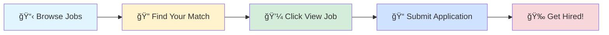

# 🚀 Tech Jobs Board

### Your Gateway to Amazing Career Opportunities

---

## 🎯 Browse by Job Profile

<table>
<tr>
<td align="center" width="25%">

 
<b>1000</b> total positions
</td>
<td align="center" width="25%">

 
<b>1000</b> total positions
</td>
<td align="center" width="25%">

 
<b>1000</b> total positions
</td>
<td align="center" width="25%">

 
<b>1000</b> total positions
</td>
</tr>
</table>

---

## 📊 Data Scientist

> 💼 **1000** positions available

<table>
<thead>
<tr>
<th width="20%">🏢 Company</th>
<th width="35%">💼 Role</th>
<th width="20%">📍 Location</th>
<th width="10%">⏰ Posted</th>
<th width="15%">🔗 Action</th>
</tr>
</thead>
<tbody>
<tr>
<td><a href="https://www.linkedin.com/company/turingcom">Turing</a></td>
<td>Remote Data Scientist</td>
<td>📍 Mumbai</td>
<td>Today</td>
<td align="center"></td>
</tr>
<tr>
<td><a href="https://gr.linkedin.com/company/agile-actors">Agile Actors</a></td>
<td>Data Engineer on Azure</td>
<td></td>
<td>Today</td>
<td align="center"></td>
</tr>
<tr>
<td><a href="https://www.linkedin.com/company/cloudmoyo">CloudMoyo</a></td>
<td>Technical Manager (.NET, Azure)</td>
<td></td>
<td>Today</td>
<td align="center"></td>
</tr>
<tr>
<td><a href="https://pt.linkedin.com/company/quickopsconsulting">QuickOps Consulting</a></td>
<td>QA Automation Engineer – Outsystems</td>
<td></td>
<td>Today</td>
<td align="center"></td>
</tr>
<tr>
<td><a href="https://sg.linkedin.com/company/tothenew">TO THE NEW</a></td>
<td>Marketing Automation Specialist (Hubspot)</td>
<td>📍 Noida</td>
<td>Today</td>
<td align="center"></td>
</tr>
<tr>
<td><a href="https://www.linkedin.com/company/highlevel">HighLevel</a></td>
<td>Data Scientist</td>
<td>📍 Delhi</td>
<td>Today</td>
<td align="center"></td>
</tr>
<tr>
<td><a href="https://in.linkedin.com/company/alponent-digital-solutions">Alponent Digital Solutions Private Limited</a></td>
<td>Python and Data Science Developer (Freshers)</td>
<td>📍 India</td>
<td>Today</td>
<td align="center"></td>
</tr>
<tr>
<td><a href="https://nl.linkedin.com/company/fintribv">Fintri</a></td>
<td>Procesmanager – Transaction Monitoring (TM)</td>
<td></td>
<td>Today</td>
<td align="center"></td>
</tr>
<tr>
<td><a href="https://www.linkedin.com/company/turingcom">Turing</a></td>
<td>Remote Sr Software Developer - Python</td>
<td>📍 Mumbai</td>
<td>Today</td>
<td align="center"></td>
</tr>
<tr>
<td><a href="https://www.linkedin.com/company/turingcom">Turing</a></td>
<td>Remote Data Scientist</td>
<td>📍 Hyderabad</td>
<td>Today</td>
<td align="center"></td>
</tr>
<tr>
<td><a href="https://uk.linkedin.com/company/lgcgroup">LGC</a></td>
<td>Assistant Director Portfolio Analytics</td>
<td></td>
<td>Today</td>
<td align="center"></td>
</tr>
<tr>
<td><a href="https://www.linkedin.com/company/turingcom">Turing</a></td>
<td>Remote Data Scientist</td>
<td>📍 Mumbai</td>
<td>Today</td>
<td align="center"></td>
</tr>
<tr>
<td><a href="https://www.linkedin.com/company/turingcom">Turing</a></td>
<td>Remote Data Scientist</td>
<td>📍 Hyderabad</td>
<td>Today</td>
<td align="center"></td>
</tr>
<tr>
<td><a href="https://www.linkedin.com/company/turingcom">Turing</a></td>
<td>Remote Data Scientist</td>
<td>📍 Delhi</td>
<td>Today</td>
<td align="center"></td>
</tr>
<tr>
<td><a href="https://www.linkedin.com/company/turingcom">Turing</a></td>
<td>Remote Data Scientist</td>
<td>📍 Delhi</td>
<td>Today</td>
<td align="center"></td>
</tr>
<tr>
<td><a href="https://fr.linkedin.com/company/groupe-alliance">GROUPE ALLIANCE</a></td>
<td>DÉVELOPPEUR CONFIRMÉ ORACLE - PL/SQL (H/F)</td>
<td></td>
<td>Today</td>
<td align="center"></td>
</tr>
<tr>
<td><a href="https://fr.linkedin.com/company/pilot-systems">Pilot Systems</a></td>
<td>Admin sys junior passionné Linux / Python - rentrée septembre 2019</td>
<td></td>
<td>Today</td>
<td align="center"></td>
</tr>
<tr>
<td><a href="https://www.linkedin.com/company/turingcom">Turing</a></td>
<td>Remote Data Scientist</td>
<td>📍 Mumbai</td>
<td>Today</td>
<td align="center"></td>
</tr>
<tr>
<td><a href="https://in.linkedin.com/company/syansoft">SyanSoft Technologies Private Limited</a></td>
<td>Data Scientist</td>
<td>📍 Gurugram</td>
<td>Today</td>
<td align="center"></td>
</tr>
<tr>
<td><a href="https://pl.linkedin.com/company/softwarely">Softwarely</a></td>
<td>Java Developer (doświadczenie w PL/SQL)</td>
<td></td>
<td>Today</td>
<td align="center"></td>
</tr>
<tr>
<td><a href="https://in.linkedin.com/school/masaischool/">Masai</a></td>
<td>Curriculum Engineer - AI/ML</td>
<td>📍 Bangalore</td>
<td>Today</td>
<td align="center"></td>
</tr>
<tr>
<td><a href="https://www.linkedin.com/company/euronet-eft">Euronet EFT Segment</a></td>
<td>Junior / Medior MS SQL Adatbázis Szakértő</td>
<td></td>
<td>Today</td>
<td align="center"></td>
</tr>
<tr>
<td><a href="https://www.linkedin.com/company/little-caesars">Little Caesars Pizza</a></td>
<td>Data Scientist</td>
<td></td>
<td>Today</td>
<td align="center"></td>
</tr>
<tr>
<td><a href="https://no.linkedin.com/company/helgevold">Helgevold</a></td>
<td>Senioringeniør - Automasjon</td>
<td></td>
<td>Today</td>
<td align="center"></td>
</tr>
<tr>
<td><a href="https://uk.linkedin.com/company/idox-information-solutions">Idox Grants and Policy</a></td>
<td>Site Reliability Engineer (AWS)</td>
<td>📍 Pune</td>
<td>Today</td>
<td align="center"></td>
</tr>
<tr>
<td><a href="https://www.linkedin.com/company/ascentt-systems">Ascentt</a></td>
<td>Azure Cloud Engineer</td>
<td>📍 Pune</td>
<td>Today</td>
<td align="center"></td>
</tr>
<tr>
<td><a href="https://www.linkedin.com/company/micron-technology">Micron Technology</a></td>
<td>MTS, Data scientist</td>
<td>📍 Hyderabad</td>
<td>Today</td>
<td align="center"></td>
</tr>
<tr>
<td><a href="https://www.linkedin.com/company/iql-private-office">Private Office Holdings</a></td>
<td>Data Analytics Principle</td>
<td></td>
<td>Today</td>
<td align="center"></td>
</tr>
<tr>
<td><a href="https://www.linkedin.com/company/infobeans">InfoBeans</a></td>
<td>Python Fullstack Developer</td>
<td>📍 Bangalore</td>
<td>Today</td>
<td align="center"></td>
</tr>
<tr>
<td><a href="https://www.linkedin.com/company/um-it-solutions">UM IT Solutions</a></td>
<td>Machine Learning Intern</td>
<td>📍 India</td>
<td>Today</td>
<td align="center"></td>
</tr>
<tr>
<td><a href="https://www.linkedin.com/company/eci-1995">ECI</a></td>
<td>Software Engineer - AWS</td>
<td>📍 Bangalore</td>
<td>Today</td>
<td align="center"></td>
</tr>
<tr>
<td><a href="https://www.linkedin.com/company/aptean">Aptean</a></td>
<td>Senior Automation Engineer</td>
<td>📍 Bangalore</td>
<td>Today</td>
<td align="center"></td>
</tr>
<tr>
<td><a href="https://www.linkedin.com/company/micron-technology">Micron Technology</a></td>
<td>Automation Engineer</td>
<td>📍 India</td>
<td>Today</td>
<td align="center"></td>
</tr>
<tr>
<td><a href="https://es.linkedin.com/company/amadeus">Amadeus</a></td>
<td>INTERNSHIP - Data scientist & AI</td>
<td></td>
<td>Today</td>
<td align="center"></td>
</tr>
<tr>
<td><a href="https://my.linkedin.com/company/pentamaster-corporation-berhad-official">Pentamaster Corporation Berhad (Official)</a></td>
<td>Software Automation Engineer</td>
<td>📍 India</td>
<td>Today</td>
<td align="center"></td>
</tr>
<tr>
<td><a href="https://in.linkedin.com/company/itc-infotech">ITC Infotech</a></td>
<td>AWS Cloud Lead Developer</td>
<td>📍 Pune</td>
<td>Today</td>
<td align="center"></td>
</tr>
<tr>
<td><a href="https://www.linkedin.com/company/um-it-solutions">UM IT Solutions</a></td>
<td>Artificial Intelligence Intern</td>
<td>📍 India</td>
<td>Today</td>
<td align="center"></td>
</tr>
<tr>
<td><a href="https://www.linkedin.com/company/bydpakistan">BYD Pakistan</a></td>
<td>Manager Analytics</td>
<td></td>
<td>Today</td>
<td align="center"></td>
</tr>
<tr>
<td><a href="https://uk.linkedin.com/company/darwin-recruitment-3">Darwin Recruitment</a></td>
<td>PLC Automation Engineer</td>
<td></td>
<td>Today</td>
<td align="center"></td>
</tr>
<tr>
<td><a href="https://www.linkedin.com/company/turingcom">Turing</a></td>
<td>Remote Data Scientist</td>
<td>📍 Delhi</td>
<td>Today</td>
<td align="center"></td>
</tr>
<tr>
<td><a href="https://www.linkedin.com/company/educational-testing-service-ets">ETS</a></td>
<td>SQL Server Database Admin Ld - India</td>
<td>📍 Delhi</td>
<td>Today</td>
<td align="center"></td>
</tr>
<tr>
<td><a href="https://www.linkedin.com/company/turingcom">Turing</a></td>
<td>Remote Data Scientist</td>
<td>📍 Mumbai</td>
<td>Today</td>
<td align="center"></td>
</tr>
<tr>
<td><a href="https://www.linkedin.com/company/jobunifiedmentor">UM IT PRIVATE LIMITED</a></td>
<td>Data Science Intern</td>
<td>📍 India</td>
<td>Today</td>
<td align="center"></td>
</tr>
<tr>
<td><a href="https://www.linkedin.com/company/turingcom">Turing</a></td>
<td>Remote Data Scientist</td>
<td>📍 Hyderabad</td>
<td>Today</td>
<td align="center"></td>
</tr>
<tr>
<td><a href="https://www.linkedin.com/company/infobeans">InfoBeans</a></td>
<td>Python Fullstack Developer</td>
<td>📍 India</td>
<td>Today</td>
<td align="center"></td>
</tr>
<tr>
<td><a href="https://www.linkedin.com/company/turingcom">Turing</a></td>
<td>Remote Data Scientist</td>
<td>📍 Mumbai</td>
<td>Today</td>
<td align="center"></td>
</tr>
<tr>
<td><a href="https://uk.linkedin.com/company/technipfmc">TechnipFMC</a></td>
<td>Automation Engineer I</td>
<td>📍 Hyderabad</td>
<td>Today</td>
<td align="center"></td>
</tr>
<tr>
<td><a href="https://vn.linkedin.com/company/724software">724SOFTWARE</a></td>
<td>Automation Test (N2)</td>
<td></td>
<td>Today</td>
<td align="center"></td>
</tr>
<tr>
<td><a href="https://jp.linkedin.com/company/nissan-motor-corporation">Nissan Motor Corporation</a></td>
<td>Data Scientist Intern - Summer 2026</td>
<td>📍 Farmington Hills, MI</td>
<td>Today</td>
<td align="center"></td>
</tr>
<tr>
<td><a href="https://in.linkedin.com/company/nextjobhunt">NextjobHunt.com</a></td>
<td>Machine Learning Engineer</td>
<td>📍 Hyderabad</td>
<td>Today</td>
<td align="center"></td>
</tr>
<tr>
<td><a href="https://www.linkedin.com/company/developers-inc">Devsinc</a></td>
<td>Senior AI/ML Engineer</td>
<td></td>
<td>Today</td>
<td align="center"></td>
</tr>
<tr>
<td><a href="https://www.linkedin.com/company/developers-inc">Devsinc</a></td>
<td>Senior AI/ML Engineer</td>
<td></td>
<td>Today</td>
<td align="center"></td>
</tr>
<tr>
<td><a href="https://uk.linkedin.com/company/ascentia-partners">Ascentia Partners</a></td>
<td>Data Scientist (iGaming and Betting) - REMOTE - up to £70,000</td>
<td></td>
<td>Today</td>
<td align="center"></td>
</tr>
<tr>
<td><a href="https://fr.linkedin.com/company/bulq-ai">BulQ</a></td>
<td>Junior Data Scientist/ ML Engineer</td>
<td></td>
<td>Today</td>
<td align="center"></td>
</tr>
<tr>
<td><a href="https://es.linkedin.com/company/its-security">Ayesa</a></td>
<td>Data Scientist</td>
<td></td>
<td>Today</td>
<td align="center"></td>
</tr>
<tr>
<td><a href="https://www.linkedin.com/company/visa">Visa</a></td>
<td>Data Science Graduate</td>
<td></td>
<td>Today</td>
<td align="center"></td>
</tr>
<tr>
<td><a href="https://www.linkedin.com/company/infobeans">InfoBeans</a></td>
<td>Python Fullstack Developer</td>
<td>📍 Bangalore</td>
<td>Today</td>
<td align="center"></td>
</tr>
<tr>
<td><a href="https://www.linkedin.com/company/wexinc">WEX</a></td>
<td>Cloud Engineer - AWS</td>
<td></td>
<td>Today</td>
<td align="center"></td>
</tr>
<tr>
<td><a href="https://in.linkedin.com/company/zetamicron">Zetamicron</a></td>
<td>BDD Automation Tester ( 5-6 Years Experience )</td>
<td>📍 Hyderabad</td>
<td>Today</td>
<td align="center"></td>
</tr>
<tr>
<td><a href="https://www.linkedin.com/company/infobeans">InfoBeans</a></td>
<td>Python Fullstack Developer</td>
<td>📍 Chennai</td>
<td>Today</td>
<td align="center"></td>
</tr>
<tr>
<td><a href="https://www.linkedin.com/company/databricks">Databricks</a></td>
<td>Sr. Solutions Engineer AI/ML</td>
<td>📍 Mumbai</td>
<td>Today</td>
<td align="center"></td>
</tr>
<tr>
<td><a href="https://uk.linkedin.com/company/omnis-partners">Omnis Partners</a></td>
<td>Artificial Intelligence Engineer</td>
<td></td>
<td>Today</td>
<td align="center"></td>
</tr>
<tr>
<td><a href="https://in.linkedin.com/company/atomgrid">Atomgrid</a></td>
<td>Program Manager - R&D Projects</td>
<td>📍 Bangalore</td>
<td>Today</td>
<td align="center"></td>
</tr>
<tr>
<td><a href="https://in.linkedin.com/company/minutus-computing">Minutus Computing</a></td>
<td>Management Trainee – Sales (AWS/Cloud Sales)</td>
<td>📍 Pune</td>
<td>Today</td>
<td align="center"></td>
</tr>
<tr>
<td><a href="https://www.linkedin.com/company/databricks">Databricks</a></td>
<td>Sr Software Engineer, Machine Learning (Search)</td>
<td>📍 Bangalore</td>
<td>Today</td>
<td align="center"></td>
</tr>
<tr>
<td><a href="https://es.linkedin.com/company/its-security">Ayesa</a></td>
<td>Data Scientist IA Generativa</td>
<td></td>
<td>Today</td>
<td align="center"></td>
</tr>
<tr>
<td><a href="https://pl.linkedin.com/company/sii-polska">Sii Poland</a></td>
<td>QA Automation Tester with Java, Selenium, React</td>
<td>📍 Bangalore</td>
<td>Today</td>
<td align="center"></td>
</tr>
<tr>
<td><a href="https://pl.linkedin.com/company/sii-polska">Sii Poland</a></td>
<td>QA Test Automation Engineer – automotive sector</td>
<td>📍 Bangalore</td>
<td>Today</td>
<td align="center"></td>
</tr>
<tr>
<td><a href="https://be.linkedin.com/company/hellosunrise">Sunrise</a></td>
<td>Python Back-End Developer</td>
<td></td>
<td>Today</td>
<td align="center"></td>
</tr>
<tr>
<td><a href="https://in.linkedin.com/company/tata-consultancy-services">Tata Consultancy Services</a></td>
<td>Test Automation Selenium with Python</td>
<td>📍 Mumbai</td>
<td>Today</td>
<td align="center"></td>
</tr>
<tr>
<td><a href="https://hk.linkedin.com/company/sapientia-technologies-limited">Sapientia Technologies Limited</a></td>
<td>Machine Learning Engineer</td>
<td></td>
<td>Today</td>
<td align="center"></td>
</tr>
<tr>
<td><a href="https://hk.linkedin.com/company/sapientia-technologies-limited">Sapientia Technologies Limited</a></td>
<td>Data Engineer/Data Scientist, Internship Program</td>
<td></td>
<td>Today</td>
<td align="center"></td>
</tr>
<tr>
<td><a href="https://www.linkedin.com/company/autodesk">Autodesk</a></td>
<td>Principal Engineer (Java , DB, AWS)</td>
<td>📍 Pune</td>
<td>Today</td>
<td align="center"></td>
</tr>
<tr>
<td><a href="https://tr.linkedin.com/company/do-an-irketler-grubu">Doğan Jeotermal Group</a></td>
<td>Mali İşler Direktörü</td>
<td>📍 Edremit, Balıkesir, Türkiye</td>
<td>Today</td>
<td align="center"></td>
</tr>
<tr>
<td><a href="https://in.linkedin.com/company/koenig-solutions">Koenig Solutions Pvt. Ltd.</a></td>
<td>Corporate Trainer- Data Analytics (Remote)</td>
<td>📍 Delhi</td>
<td>Today</td>
<td align="center"></td>
</tr>
<tr>
<td><a href="https://in.linkedin.com/company/my-tech-focus">My Tech Focus</a></td>
<td>Senior SDET - QA Automation with Appium & Playwright</td>
<td>📍 Pune</td>
<td>Today</td>
<td align="center"></td>
</tr>
<tr>
<td><a href="https://www.linkedin.com/company/alvarez-&-marsal">Alvarez & Marsal</a></td>
<td>Test Automation Specialist</td>
<td>📍 Gurugram</td>
<td>Today</td>
<td align="center"></td>
</tr>
<tr>
<td><a href="https://www.linkedin.com/company/skillfied-mentor-jobs">Skillfied Mentor Jobs</a></td>
<td>SQL & Excel Business Analyst Intern</td>
<td>📍 India</td>
<td>Today</td>
<td align="center"></td>
</tr>
<tr>
<td><a href="https://www.linkedin.com/company/ntt-data-americas">NTT DATA North America</a></td>
<td>SFDC QA Automation</td>
<td>📍 Chennai</td>
<td>Today</td>
<td align="center"></td>
</tr>
<tr>
<td><a href="https://in.linkedin.com/company/tata-consultancy-services">Tata Consultancy Services</a></td>
<td>Tableau Developer</td>
<td>📍 Pune</td>
<td>Today</td>
<td align="center"></td>
</tr>
<tr>
<td><a href="https://www.linkedin.com/company/dappunk">dappunk</a></td>
<td>AWS Cloud Intern</td>
<td>📍 India</td>
<td>Today</td>
<td align="center"></td>
</tr>
<tr>
<td><a href="https://www.linkedin.com/company/skillfiedmentor">SkillFied Mentor</a></td>
<td>Data Science Intern</td>
<td>📍 India</td>
<td>Today</td>
<td align="center"></td>
</tr>
<tr>
<td><a href="https://in.linkedin.com/company/itc-infotech">ITC Infotech</a></td>
<td>AWS Cloud Tech Lead</td>
<td>📍 Pune</td>
<td>Today</td>
<td align="center"></td>
</tr>
<tr>
<td><a href="https://fr.linkedin.com/company/worldlineglobal">Worldline</a></td>
<td>Data Science & AI</td>
<td>📍 Bangalore</td>
<td>Today</td>
<td align="center"></td>
</tr>
<tr>
<td><a href="https://fr.linkedin.com/company/sanofi">Sanofi</a></td>
<td>Senior Analyst – Business Analytics</td>
<td>📍 Hyderabad</td>
<td>Today</td>
<td align="center"></td>
</tr>
<tr>
<td><a href="https://in.linkedin.com/company/itc-infotech">ITC Infotech</a></td>
<td>AWS Cloud Lead Developer</td>
<td>📍 Pune</td>
<td>Today</td>
<td align="center"></td>
</tr>
<tr>
<td><a href="https://www.linkedin.com/company/micron-technology">Micron Technology</a></td>
<td>SR. GCP DATA ENGINEER, SMAI</td>
<td>📍 Hyderabad</td>
<td>Today</td>
<td align="center"></td>
</tr>
<tr>
<td><a href="https://in.linkedin.com/company/talentgigs">Talentgigs</a></td>
<td>Python Developer - AWS</td>
<td>📍 Hyderabad</td>
<td>Today</td>
<td align="center"></td>
</tr>
<tr>
<td><a href="https://in.linkedin.com/company/qurencia">Qurencia Technologies Pvt Ltd</a></td>
<td>AWS Technical Lead</td>
<td>📍 Hyderabad</td>
<td>Today</td>
<td align="center"></td>
</tr>
<tr>
<td><a href="https://in.linkedin.com/company/talentgigs">Talentgigs</a></td>
<td>Full Stack Engineer - React/Python</td>
<td>📍 Chennai</td>
<td>Today</td>
<td align="center"></td>
</tr>
<tr>
<td><a href="https://www.linkedin.com/company/hitachi-vantara">Hitachi Vantara</a></td>
<td>Azure - Cloud and Data Centre Services Specialist</td>
<td>📍 Delhi</td>
<td>Today</td>
<td align="center"></td>
</tr>
<tr>
<td><a href="https://mt.linkedin.com/company/n-ix">N-iX</a></td>
<td>Senior DevOps (AWS) Engineer</td>
<td></td>
<td>Today</td>
<td align="center"></td>
</tr>
<tr>
<td><a href="https://in.linkedin.com/company/weareuplers">Uplers</a></td>
<td>Full Stack Developer (Python / React)</td>
<td>📍 Thane</td>
<td>Today</td>
<td align="center"></td>
</tr>
<tr>
<td><a href="https://in.linkedin.com/company/qurencia">Qurencia Technologies Pvt Ltd</a></td>
<td>Backend Developer (Python)</td>
<td>📍 Hyderabad</td>
<td>Today</td>
<td align="center"></td>
</tr>
<tr>
<td><a href="https://in.linkedin.com/company/qurencia">Qurencia Technologies Pvt Ltd</a></td>
<td>AWS Data Engineer</td>
<td>📍 Hyderabad</td>
<td>Today</td>
<td align="center"></td>
</tr>
<tr>
<td><a href="https://in.linkedin.com/company/weareuplers">Uplers</a></td>
<td>Full Stack Developer (Python / React)</td>
<td>📍 Mumbai</td>
<td>Today</td>
<td align="center"></td>
</tr>
<tr>
<td><a href="https://fr.linkedin.com/company/amiltone">Amiltone</a></td>
<td>Développeur Temps Réel c H/F</td>
<td></td>
<td>Today</td>
<td align="center"></td>
</tr>
<tr>
<td><a href="https://www.linkedin.com/company/argano">Argano</a></td>
<td>Technical Architect-Azure AI</td>
<td>📍 Hyderabad</td>
<td>Today</td>
<td align="center"></td>
</tr>
<tr>
<td><a href="https://in.linkedin.com/company/talentgigs">Talentgigs</a></td>
<td>Data Scientist</td>
<td>📍 Hyderabad</td>
<td>Today</td>
<td align="center"></td>
</tr>
<tr>
<td><a href="https://fr.linkedin.com/company/amiltone">Amiltone</a></td>
<td>Développeur PL - SQL H/F</td>
<td></td>
<td>Today</td>
<td align="center"></td>
</tr>
<tr><td colspan="5" align="center"><i>... and 900 more positions</i></td></tr>
</tbody>
</table>

---

## 💼 Business Analyst

> 💼 **1000** positions available

<table>
<thead>
<tr>
<th width="20%">🏢 Company</th>
<th width="35%">💼 Role</th>
<th width="20%">📍 Location</th>
<th width="10%">⏰ Posted</th>
<th width="15%">🔗 Action</th>
</tr>
</thead>
<tbody>
<tr>
<td><a href="https://pt.linkedin.com/company/quickopsconsulting">QuickOps Consulting</a></td>
<td>QA Automation Engineer – Outsystems</td>
<td></td>
<td>Today</td>
<td align="center"></td>
</tr>
<tr>
<td><a href="https://in.linkedin.com/company/birlasoft">Birlasoft</a></td>
<td>Scrum Master Sr Project Lead-Data Engg</td>
<td>📍 Bangalore</td>
<td>Today</td>
<td align="center"></td>
</tr>
<tr>
<td><a href="https://sg.linkedin.com/company/tothenew">TO THE NEW</a></td>
<td>Marketing Automation Specialist (Hubspot)</td>
<td>📍 Noida</td>
<td>Today</td>
<td align="center"></td>
</tr>
<tr>
<td><a href="https://in.linkedin.com/company/alponent-digital-solutions">Alponent Digital Solutions Private Limited</a></td>
<td>Python and Data Science Developer (Freshers)</td>
<td>📍 India</td>
<td>Today</td>
<td align="center"></td>
</tr>
<tr>
<td><a href="https://www.linkedin.com/company/waste-management">WM</a></td>
<td>Power Bi (Developer I, II, TL)- Gurgaon</td>
<td>📍 Gurugram</td>
<td>Today</td>
<td align="center"></td>
</tr>
<tr>
<td><a href="https://nl.linkedin.com/company/signifycompany">Signify</a></td>
<td>Project Management Officer - Project FORCE</td>
<td>📍 Gurugram</td>
<td>Today</td>
<td align="center"></td>
</tr>
<tr>
<td><a href="https://www.linkedin.com/company/turingcom">Turing</a></td>
<td>Remote Sr Software Developer - Python</td>
<td>📍 Mumbai</td>
<td>Today</td>
<td align="center"></td>
</tr>
<tr>
<td><a href="https://uk.linkedin.com/company/lgcgroup">LGC</a></td>
<td>Assistant Director Portfolio Analytics</td>
<td></td>
<td>Today</td>
<td align="center"></td>
</tr>
<tr>
<td><a href="https://nl.linkedin.com/company/louis-dreyfus-company">Louis Dreyfus Company</a></td>
<td>Business Analyst</td>
<td>📍 Gurugram</td>
<td>Today</td>
<td align="center"></td>
</tr>
<tr>
<td><a href="https://fr.linkedin.com/company/groupe-alliance">GROUPE ALLIANCE</a></td>
<td>DÉVELOPPEUR CONFIRMÉ ORACLE - PL/SQL (H/F)</td>
<td></td>
<td>Today</td>
<td align="center"></td>
</tr>
<tr>
<td><a href="https://fr.linkedin.com/company/pilot-systems">Pilot Systems</a></td>
<td>Admin sys junior passionné Linux / Python - rentrée septembre 2019</td>
<td></td>
<td>Today</td>
<td align="center"></td>
</tr>
<tr>
<td><a href="https://www.linkedin.com/company/sstllc">Shri Sai Tech LLC</a></td>
<td>Power BI Developer</td>
<td>📍 Chennai</td>
<td>Today</td>
<td align="center"></td>
</tr>
<tr>
<td><a href="https://za.linkedin.com/company/vodacom">Vodacom</a></td>
<td>Business Analyst</td>
<td></td>
<td>Today</td>
<td align="center"></td>
</tr>
<tr>
<td><a href="https://pl.linkedin.com/company/softwarely">Softwarely</a></td>
<td>Java Developer (doświadczenie w PL/SQL)</td>
<td></td>
<td>Today</td>
<td align="center"></td>
</tr>
<tr>
<td><a href="https://www.linkedin.com/company/euronet-eft">Euronet EFT Segment</a></td>
<td>Junior / Medior MS SQL Adatbázis Szakértő</td>
<td></td>
<td>Today</td>
<td align="center"></td>
</tr>
<tr>
<td><a href="https://www.linkedin.com/company/american-technology-consulting">ATC</a></td>
<td>Business Analyst</td>
<td></td>
<td>Today</td>
<td align="center"></td>
</tr>
<tr>
<td><a href="https://www.linkedin.com/company/iql-private-office">Private Office Holdings</a></td>
<td>Data Analytics Principle</td>
<td></td>
<td>Today</td>
<td align="center"></td>
</tr>
<tr>
<td><a href="https://www.linkedin.com/company/infobeans">InfoBeans</a></td>
<td>Python Fullstack Developer</td>
<td>📍 Bangalore</td>
<td>Today</td>
<td align="center"></td>
</tr>
<tr>
<td><a href="https://www.linkedin.com/company/aptean">Aptean</a></td>
<td>Senior Automation Engineer</td>
<td>📍 Bangalore</td>
<td>Today</td>
<td align="center"></td>
</tr>
<tr>
<td><a href="https://www.linkedin.com/company/micron-technology">Micron Technology</a></td>
<td>Automation Engineer</td>
<td>📍 India</td>
<td>Today</td>
<td align="center"></td>
</tr>
<tr>
<td><a href="https://my.linkedin.com/company/pentamaster-corporation-berhad-official">Pentamaster Corporation Berhad (Official)</a></td>
<td>Software Automation Engineer</td>
<td>📍 India</td>
<td>Today</td>
<td align="center"></td>
</tr>
<tr>
<td><a href="https://www.linkedin.com/company/bydpakistan">BYD Pakistan</a></td>
<td>Manager Analytics</td>
<td></td>
<td>Today</td>
<td align="center"></td>
</tr>
<tr>
<td><a href="https://uk.linkedin.com/company/darwin-recruitment-3">Darwin Recruitment</a></td>
<td>PLC Automation Engineer</td>
<td></td>
<td>Today</td>
<td align="center"></td>
</tr>
<tr>
<td><a href="https://www.linkedin.com/company/educational-testing-service-ets">ETS</a></td>
<td>SQL Server Database Admin Ld - India</td>
<td>📍 Delhi</td>
<td>Today</td>
<td align="center"></td>
</tr>
<tr>
<td><a href="https://www.linkedin.com/company/infobeans">InfoBeans</a></td>
<td>Python Fullstack Developer</td>
<td>📍 India</td>
<td>Today</td>
<td align="center"></td>
</tr>
<tr>
<td><a href="https://uk.linkedin.com/company/technipfmc">TechnipFMC</a></td>
<td>Automation Engineer I</td>
<td>📍 Hyderabad</td>
<td>Today</td>
<td align="center"></td>
</tr>
<tr>
<td><a href="https://vn.linkedin.com/company/724software">724SOFTWARE</a></td>
<td>Automation Test (N2)</td>
<td></td>
<td>Today</td>
<td align="center"></td>
</tr>
<tr>
<td><a href="https://hu.linkedin.com/company/nix-europe">NIX Europe</a></td>
<td>Medior IT Business Analyst</td>
<td></td>
<td>Today</td>
<td align="center"></td>
</tr>
<tr>
<td><a href="https://de.linkedin.com/company/regnology">Regnology</a></td>
<td>Business Analyst</td>
<td>📍 Pune</td>
<td>Today</td>
<td align="center"></td>
</tr>
<tr>
<td><a href="https://fr.linkedin.com/company/cnam-caisse-nationale-assurance-maladie">CNAM</a></td>
<td>Expert fonctionnel / Business analyst H/F</td>
<td></td>
<td>Today</td>
<td align="center"></td>
</tr>
<tr>
<td><a href="https://www.linkedin.com/company/infobeans">InfoBeans</a></td>
<td>Python Fullstack Developer</td>
<td>📍 Bangalore</td>
<td>Today</td>
<td align="center"></td>
</tr>
<tr>
<td><a href="https://uk.linkedin.com/company/natwest-group">NatWest Group</a></td>
<td>Business Analyst</td>
<td>📍 Chennai</td>
<td>Today</td>
<td align="center"></td>
</tr>
<tr>
<td><a href="https://in.linkedin.com/company/zetamicron">Zetamicron</a></td>
<td>BDD Automation Tester ( 5-6 Years Experience )</td>
<td>📍 Hyderabad</td>
<td>Today</td>
<td align="center"></td>
</tr>
<tr>
<td><a href="https://uk.linkedin.com/company/xpertnest">XpertNest</a></td>
<td>Power BI Developer / Analyst</td>
<td>📍 India</td>
<td>Today</td>
<td align="center"></td>
</tr>
<tr>
<td><a href="https://www.linkedin.com/company/infobeans">InfoBeans</a></td>
<td>Python Fullstack Developer</td>
<td>📍 Chennai</td>
<td>Today</td>
<td align="center"></td>
</tr>
<tr>
<td><a href="https://uk.linkedin.com/company/wtwcorporate">WTW</a></td>
<td>Business Analyst</td>
<td></td>
<td>Today</td>
<td align="center"></td>
</tr>
<tr>
<td><a href="https://pl.linkedin.com/company/sii-polska">Sii Poland</a></td>
<td>QA Automation Tester with Java, Selenium, React</td>
<td>📍 Bangalore</td>
<td>Today</td>
<td align="center"></td>
</tr>
<tr>
<td><a href="https://pl.linkedin.com/company/sii-polska">Sii Poland</a></td>
<td>QA Test Automation Engineer – automotive sector</td>
<td>📍 Bangalore</td>
<td>Today</td>
<td align="center"></td>
</tr>
<tr>
<td><a href="https://in.linkedin.com/company/raahtechservices">Raah Techservices</a></td>
<td>Salesforce Data Cloud Engineer | 5+years</td>
<td>📍 Chennai</td>
<td>Today</td>
<td align="center"></td>
</tr>
<tr>
<td><a href="https://be.linkedin.com/company/hellosunrise">Sunrise</a></td>
<td>Python Back-End Developer</td>
<td></td>
<td>Today</td>
<td align="center"></td>
</tr>
<tr>
<td><a href="https://in.linkedin.com/company/tata-consultancy-services">Tata Consultancy Services</a></td>
<td>Test Automation Selenium with Python</td>
<td>📍 Mumbai</td>
<td>Today</td>
<td align="center"></td>
</tr>
<tr>
<td><a href="https://pl.linkedin.com/company/talentcomplete">Talent Complete</a></td>
<td>Business Analyst with SAP</td>
<td></td>
<td>Today</td>
<td align="center"></td>
</tr>
<tr>
<td><a href="https://it.linkedin.com/company/scr-selezione-e-consulenza-per-le-risorse-umane-srl">SCR</a></td>
<td>IT Business Analyst</td>
<td></td>
<td>Today</td>
<td align="center"></td>
</tr>
<tr>
<td><a href="https://in.linkedin.com/company/koenig-solutions">Koenig Solutions Pvt. Ltd.</a></td>
<td>Corporate Trainer- Data Analytics (Remote)</td>
<td>📍 Delhi</td>
<td>Today</td>
<td align="center"></td>
</tr>
<tr>
<td><a href="https://uk.linkedin.com/company/tp-icap">TP ICAP</a></td>
<td>Technical Business Analyst (Corporate Functions)</td>
<td></td>
<td>Today</td>
<td align="center"></td>
</tr>
<tr>
<td><a href="https://in.linkedin.com/company/my-tech-focus">My Tech Focus</a></td>
<td>Senior SDET - QA Automation with Appium & Playwright</td>
<td>📍 Pune</td>
<td>Today</td>
<td align="center"></td>
</tr>
<tr>
<td><a href="https://www.linkedin.com/company/alvarez-&-marsal">Alvarez & Marsal</a></td>
<td>Test Automation Specialist</td>
<td>📍 Gurugram</td>
<td>Today</td>
<td align="center"></td>
</tr>
<tr>
<td><a href="https://id.linkedin.com/company/msbukonsultan">MSBU Konsultan</a></td>
<td>Information Technology Business Analyst</td>
<td></td>
<td>Today</td>
<td align="center"></td>
</tr>
<tr>
<td><a href="https://www.linkedin.com/company/skillfied-mentor-jobs">Skillfied Mentor Jobs</a></td>
<td>SQL & Excel Business Analyst Intern</td>
<td>📍 India</td>
<td>Today</td>
<td align="center"></td>
</tr>
<tr>
<td><a href="https://www.linkedin.com/company/ntt-data-americas">NTT DATA North America</a></td>
<td>SFDC QA Automation</td>
<td>📍 Chennai</td>
<td>Today</td>
<td align="center"></td>
</tr>
<tr>
<td><a href="https://www.linkedin.com/company/mass-247">Mass 247</a></td>
<td>Business Performance Management Lead (Business Analyst)</td>
<td></td>
<td>Today</td>
<td align="center"></td>
</tr>
<tr>
<td><a href="https://in.linkedin.com/company/tata-consultancy-services">Tata Consultancy Services</a></td>
<td>Tableau Developer</td>
<td>📍 Pune</td>
<td>Today</td>
<td align="center"></td>
</tr>
<tr>
<td><a href="https://www.linkedin.com/company/skillfied-mentor-jobs">Skillfied Mentor Jobs</a></td>
<td>Business Analyst</td>
<td>📍 India</td>
<td>Today</td>
<td align="center"></td>
</tr>
<tr>
<td><a href="https://www.linkedin.com/company/skillfied-mentor-jobs">Skillfied Mentor Jobs</a></td>
<td>Business Analyst Intern</td>
<td>📍 India</td>
<td>Today</td>
<td align="center"></td>
</tr>
<tr>
<td><a href="https://www.linkedin.com/company/zelis">Zelis</a></td>
<td>Sr. Salesforce Developer-2</td>
<td>📍 Hyderabad</td>
<td>Today</td>
<td align="center"></td>
</tr>
<tr>
<td><a href="https://fr.linkedin.com/company/sanofi">Sanofi</a></td>
<td>Senior Analyst – Business Analytics</td>
<td>📍 Hyderabad</td>
<td>Today</td>
<td align="center"></td>
</tr>
<tr>
<td><a href="https://in.linkedin.com/company/one-click-it-consultancy">OneClick IT Consultancy P Ltd</a></td>
<td>Information Technology Business Analyst</td>
<td>📍 India</td>
<td>Today</td>
<td align="center"></td>
</tr>
<tr>
<td><a href="https://sg.linkedin.com/company/weareada">ADA</a></td>
<td>Project Management Lead – Digital Commerce</td>
<td>📍 Bangalore</td>
<td>Today</td>
<td align="center"></td>
</tr>
<tr>
<td><a href="https://www.linkedin.com/company/skillfiedmentor">SkillFied Mentor</a></td>
<td>Business Analyst Intern</td>
<td>📍 India</td>
<td>Today</td>
<td align="center"></td>
</tr>
<tr>
<td><a href="https://in.linkedin.com/company/talentgigs">Talentgigs</a></td>
<td>Python Developer - AWS</td>
<td>📍 Hyderabad</td>
<td>Today</td>
<td align="center"></td>
</tr>
<tr>
<td><a href="https://www.linkedin.com/company/blackbaud">Blackbaud</a></td>
<td>Principal Software Engineer - Salesforce</td>
<td>📍 Hyderabad</td>
<td>Today</td>
<td align="center"></td>
</tr>
<tr>
<td><a href="https://in.linkedin.com/company/talentgigs">Talentgigs</a></td>
<td>Full Stack Engineer - React/Python</td>
<td>📍 Chennai</td>
<td>Today</td>
<td align="center"></td>
</tr>
<tr>
<td><a href="https://in.linkedin.com/company/weareuplers">Uplers</a></td>
<td>Full Stack Developer (Python / React)</td>
<td>📍 Thane</td>
<td>Today</td>
<td align="center"></td>
</tr>
<tr>
<td><a href="https://in.linkedin.com/company/qurencia">Qurencia Technologies Pvt Ltd</a></td>
<td>Backend Developer (Python)</td>
<td>📍 Hyderabad</td>
<td>Today</td>
<td align="center"></td>
</tr>
<tr>
<td><a href="https://in.linkedin.com/company/weareuplers">Uplers</a></td>
<td>Full Stack Developer (Python / React)</td>
<td>📍 Mumbai</td>
<td>Today</td>
<td align="center"></td>
</tr>
<tr>
<td><a href="https://www.linkedin.com/company/ntt-data-americas">NTT DATA North America</a></td>
<td>Business Analysis Specialist</td>
<td>📍 Chennai</td>
<td>Today</td>
<td align="center"></td>
</tr>
<tr>
<td><a href="https://fr.linkedin.com/company/amiltone">Amiltone</a></td>
<td>Business Analyst H/F</td>
<td></td>
<td>Today</td>
<td align="center"></td>
</tr>
<tr>
<td><a href="https://fr.linkedin.com/company/amiltone">Amiltone</a></td>
<td>Développeur PL - SQL H/F</td>
<td></td>
<td>Today</td>
<td align="center"></td>
</tr>
<tr>
<td><a href="https://fr.linkedin.com/company/capgemini">Capgemini</a></td>
<td>ServiceNow Business Analyst | 9 to 12 | Bangalore/Pune</td>
<td>📍 Pune</td>
<td>Today</td>
<td align="center"></td>
</tr>
<tr>
<td><a href="https://www.linkedin.com/company/msci-inc">MSCI Inc.</a></td>
<td>Python Developer Lead</td>
<td>📍 Pune</td>
<td>Today</td>
<td align="center"></td>
</tr>
<tr>
<td><a href="https://fr.linkedin.com/company/scaliangroup">Scalian</a></td>
<td>Business analyst SIRH talentsoft - H/F</td>
<td></td>
<td>Today</td>
<td align="center"></td>
</tr>
<tr>
<td><a href="https://www.linkedin.com/company/morningstar">Morningstar</a></td>
<td>Marketing Automation Specialist</td>
<td>📍 Mumbai</td>
<td>Today</td>
<td align="center"></td>
</tr>
<tr>
<td><a href="https://in.linkedin.com/company/keus-smart-home">Keus Smart Home</a></td>
<td>Sales Manager- Smart Home Automation</td>
<td>📍 Hyderabad</td>
<td>Today</td>
<td align="center"></td>
</tr>
<tr>
<td><a href="https://www.linkedin.com/company/labcorp">Labcorp</a></td>
<td>Marketing Operation Lead, Agile Delivery</td>
<td>📍 Bangalore</td>
<td>Today</td>
<td align="center"></td>
</tr>
<tr>
<td><a href="https://in.linkedin.com/company/weareuplers">Uplers</a></td>
<td>Microsoft SQL Server Developer</td>
<td>📍 Pune</td>
<td>Today</td>
<td align="center"></td>
</tr>
<tr>
<td><a href="https://in.linkedin.com/company/igtsolutions">IGT Solutions</a></td>
<td>Business Analyst</td>
<td>📍 India</td>
<td>Today</td>
<td align="center"></td>
</tr>
<tr>
<td><a href="https://in.linkedin.com/company/weareuplers">Uplers</a></td>
<td>Microsoft SQL Server Developer</td>
<td>📍 Chennai</td>
<td>Today</td>
<td align="center"></td>
</tr>
<tr>
<td><a href="https://ie.linkedin.com/company/eaton">Eaton</a></td>
<td>Engineer - Design Automation</td>
<td>📍 Pune</td>
<td>Today</td>
<td align="center"></td>
</tr>
<tr>
<td><a href="https://in.linkedin.com/company/packfora-llp">Packfora</a></td>
<td>Executive (Business Analyst | Business Development | Marketing)</td>
<td>📍 Mumbai</td>
<td>Today</td>
<td align="center"></td>
</tr>
<tr>
<td><a href="https://es.linkedin.com/company/joppyme">Joppy</a></td>
<td>QA Engineer (Automation)</td>
<td></td>
<td>Today</td>
<td align="center"></td>
</tr>
<tr>
<td><a href="https://in.linkedin.com/company/weareuplers">Uplers</a></td>
<td>Full Stack Developer (Python / React)</td>
<td>📍 Pune</td>
<td>Today</td>
<td align="center"></td>
</tr>
<tr>
<td><a href="https://in.linkedin.com/company/scoutit-in">Scoutit</a></td>
<td>Business Consultant - Strategic Accounts</td>
<td>📍 Mumbai</td>
<td>Today</td>
<td align="center"></td>
</tr>
<tr>
<td><a href="https://fr.linkedin.com/company/worldlineglobal">Worldline</a></td>
<td>Business analyst (F/H)</td>
<td></td>
<td>Today</td>
<td align="center"></td>
</tr>
<tr>
<td><a href="https://www.linkedin.com/company/aarav-solutions-private-limited">Aarav Solutions</a></td>
<td>Salesforce Developer / Tester</td>
<td></td>
<td>Today</td>
<td align="center"></td>
</tr>
<tr>
<td><a href="https://au.linkedin.com/company/atlassian">Atlassian</a></td>
<td>Support Engineer, Jira</td>
<td>📍 India</td>
<td>Today</td>
<td align="center"></td>
</tr>
<tr>
<td><a href="https://in.linkedin.com/company/unijob-solution-training-pvt-ltd">Unijob Solution & Training Pvt Ltd</a></td>
<td>Senior SDET - AI/ML with Python, Agentic AI</td>
<td>📍 Pune</td>
<td>Today</td>
<td align="center"></td>
</tr>
<tr>
<td><a href="https://www.linkedin.com/company/teradata">Teradata</a></td>
<td>Senior Software Test and Automation Engineer</td>
<td>📍 Hyderabad</td>
<td>Today</td>
<td align="center"></td>
</tr>
<tr>
<td><a href="https://in.linkedin.com/company/dentsuglobalservices">Dentsu Global Services</a></td>
<td>QA Automation Engineer</td>
<td>📍 Pune</td>
<td>Today</td>
<td align="center"></td>
</tr>
<tr>
<td><a href="https://www.linkedin.com/company/teradata">Teradata</a></td>
<td>Software Test and Automation Engineer</td>
<td>📍 India</td>
<td>Today</td>
<td align="center"></td>
</tr>
<tr>
<td><a href="https://www.linkedin.com/company/teradata">Teradata</a></td>
<td>Software Test and Automation Engineer</td>
<td>📍 Pune</td>
<td>Today</td>
<td align="center"></td>
</tr>
<tr>
<td><a href="https://www.linkedin.com/company/teradata">Teradata</a></td>
<td>Software Test and Automation Engineer</td>
<td>📍 Hyderabad</td>
<td>Today</td>
<td align="center"></td>
</tr>
<tr>
<td><a href="https://www.linkedin.com/company/flexera">Flexera</a></td>
<td>Software Engineer - Automation</td>
<td>📍 India</td>
<td>Today</td>
<td align="center"></td>
</tr>
<tr>
<td><a href="https://www.linkedin.com/company/syntel-private-limited">Accenture services Pvt Ltd</a></td>
<td>Business Process Architect</td>
<td>📍 Bangalore</td>
<td>Today</td>
<td align="center"></td>
</tr>
<tr>
<td><a href="https://www.linkedin.com/company/ntt-data-americas">NTT DATA North America</a></td>
<td>Salesforce Deployment/DevOps Engineer</td>
<td>📍 Chennai</td>
<td>Today</td>
<td align="center"></td>
</tr>
<tr>
<td><a href="https://mt.linkedin.com/company/n-ix">N-iX</a></td>
<td>Senior Python Engineer</td>
<td></td>
<td>Today</td>
<td align="center"></td>
</tr>
<tr>
<td><a href="https://uk.linkedin.com/company/barclays-bank">Barclays</a></td>
<td>AVP Java and Python developer</td>
<td></td>
<td>Today</td>
<td align="center"></td>
</tr>
<tr>
<td><a href="https://ie.linkedin.com/company/optimisedtalent">Optimised Talent</a></td>
<td>Data Engineer (Python & SQL) – Hybrid (3 Days Onsite, Manila)</td>
<td></td>
<td>Today</td>
<td align="center"></td>
</tr>
<tr>
<td><a href="https://in.linkedin.com/company/opsolute">Opsolute</a></td>
<td>Software Engineer – Backend (Python/Go)</td>
<td>📍 Bangalore</td>
<td>Today</td>
<td align="center"></td>
</tr>
<tr>
<td><a href="https://pl.linkedin.com/company/dcgcareer">DCG</a></td>
<td>Test Automation Engineer</td>
<td></td>
<td>Today</td>
<td align="center"></td>
</tr>
<tr>
<td><a href="https://ph.linkedin.com/company/bank-of-the-philippine-islands">Bank of the Philippine Islands (BPI)</a></td>
<td>RISK ANALYTICS ASSOCIATE</td>
<td></td>
<td>Today</td>
<td align="center"></td>
</tr>
<tr><td colspan="5" align="center"><i>... and 900 more positions</i></td></tr>
</tbody>
</table>

---

## 🚀 Product Manager

> 💼 **1000** positions available

<table>
<thead>
<tr>
<th width="20%">🏢 Company</th>
<th width="35%">💼 Role</th>
<th width="20%">📍 Location</th>
<th width="10%">⏰ Posted</th>
<th width="15%">🔗 Action</th>
</tr>
</thead>
<tbody>
<tr>
<td><a href="https://www.linkedin.com/company/entropiktech">Entropik</a></td>
<td>Product Marketing Associate</td>
<td>📍 Chennai</td>
<td>Today</td>
<td align="center"></td>
</tr>
<tr>
<td><a href="https://gr.linkedin.com/company/qualco">QUALCO</a></td>
<td>Product Analyst</td>
<td></td>
<td>Today</td>
<td align="center"></td>
</tr>
<tr>
<td><a href="https://uk.linkedin.com/company/buzzacott">Buzzacott</a></td>
<td>Management Accountant</td>
<td></td>
<td>Today</td>
<td align="center"></td>
</tr>
<tr>
<td><a href="https://www.linkedin.com/company/united-airlines">United Airlines</a></td>
<td>Senior Analyst - Supplier Performance Management</td>
<td>📍 Gurugram</td>
<td>Today</td>
<td align="center"></td>
</tr>
<tr>
<td><a href="https://pt.linkedin.com/company/quickopsconsulting">QuickOps Consulting</a></td>
<td>QA Automation Engineer – Outsystems</td>
<td></td>
<td>Today</td>
<td align="center"></td>
</tr>
<tr>
<td><a href="https://in.linkedin.com/company/birlasoft">Birlasoft</a></td>
<td>Scrum Master Sr Project Lead-Data Engg</td>
<td>📍 Bangalore</td>
<td>Today</td>
<td align="center"></td>
</tr>
<tr>
<td><a href="https://in.linkedin.com/school/masaischool/">Masai</a></td>
<td>Curriculum Engineer - Management & Business</td>
<td>📍 Bangalore</td>
<td>Today</td>
<td align="center"></td>
</tr>
<tr>
<td><a href="https://sg.linkedin.com/company/tothenew">TO THE NEW</a></td>
<td>Marketing Automation Specialist (Hubspot)</td>
<td>📍 Noida</td>
<td>Today</td>
<td align="center"></td>
</tr>
<tr>
<td><a href="https://uk.linkedin.com/company/ihghotels&resorts">IHG Hotels & Resorts</a></td>
<td>Specialist Revenue & Credit Management - HFS</td>
<td>📍 Gurugram</td>
<td>Today</td>
<td align="center"></td>
</tr>
<tr>
<td><a href="https://in.linkedin.com/company/sbi-card">SBI Card</a></td>
<td>Assistant Vice President – Security Incident Management Lead</td>
<td>📍 Gurugram</td>
<td>Today</td>
<td align="center"></td>
</tr>
<tr>
<td><a href="https://nl.linkedin.com/company/signifycompany">Signify</a></td>
<td>Project Management Officer - Project FORCE</td>
<td>📍 Gurugram</td>
<td>Today</td>
<td align="center"></td>
</tr>
<tr>
<td><a href="https://uk.linkedin.com/company/lgcgroup">LGC</a></td>
<td>Assistant Director Portfolio Analytics</td>
<td></td>
<td>Today</td>
<td align="center"></td>
</tr>
<tr>
<td><a href="https://www.linkedin.com/company/mastercard">Mastercard</a></td>
<td>Manager, Product Management</td>
<td>📍 Pune</td>
<td>Today</td>
<td align="center"></td>
</tr>
<tr>
<td><a href="https://mc.linkedin.com/company/gvtmonaco">Gouvernement Monaco</a></td>
<td>Ingénieur en Management des Risques</td>
<td>📍 Monaco, Monaco</td>
<td>Today</td>
<td align="center"></td>
</tr>
<tr>
<td><a href="https://fr.linkedin.com/company/groupe-alliance">GROUPE ALLIANCE</a></td>
<td>DÉVELOPPEUR CONFIRMÉ ORACLE - PL/SQL (H/F)</td>
<td></td>
<td>Today</td>
<td align="center"></td>
</tr>
<tr>
<td><a href="https://in.linkedin.com/company/commutec">Commutec : Corporate Mobility</a></td>
<td>Product Trainer</td>
<td>📍 Thane</td>
<td>Today</td>
<td align="center"></td>
</tr>
<tr>
<td><a href="https://uk.linkedin.com/company/lloyds-banking-group">Lloyds Banking Group</a></td>
<td>Sourcing and Supplier Management Graduate</td>
<td></td>
<td>Today</td>
<td align="center"></td>
</tr>
<tr>
<td><a href="https://pl.linkedin.com/company/softwarely">Softwarely</a></td>
<td>Java Developer (doświadczenie w PL/SQL)</td>
<td></td>
<td>Today</td>
<td align="center"></td>
</tr>
<tr>
<td><a href="https://www.linkedin.com/company/euronet-eft">Euronet EFT Segment</a></td>
<td>Junior / Medior MS SQL Adatbázis Szakértő</td>
<td></td>
<td>Today</td>
<td align="center"></td>
</tr>
<tr>
<td><a href="https://uk.linkedin.com/company/rentokil-initial-careers">Rentokil Initial Careers</a></td>
<td>Management Accountant</td>
<td></td>
<td>Today</td>
<td align="center"></td>
</tr>
<tr>
<td><a href="https://www.linkedin.com/company/sprinklr">Sprinklr</a></td>
<td>Product Manager</td>
<td>📍 Gurugram</td>
<td>Today</td>
<td align="center"></td>
</tr>
<tr>
<td><a href="https://in.linkedin.com/company/srchoutsoftware">Srchout Software</a></td>
<td>UXUI Product Designer</td>
<td>📍 Gurugram</td>
<td>Today</td>
<td align="center"></td>
</tr>
<tr>
<td><a href="https://fr.linkedin.com/company/schneider-electric">Schneider Electric</a></td>
<td>Senior Manager – Product Management and Marketing</td>
<td>📍 Mumbai</td>
<td>Today</td>
<td align="center"></td>
</tr>
<tr>
<td><a href="https://eg.linkedin.com/company/drivewithdrop">Drop App</a></td>
<td>Operations Management Intern</td>
<td></td>
<td>Today</td>
<td align="center"></td>
</tr>
<tr>
<td><a href="https://uk.linkedin.com/company/idox-information-solutions">Idox Grants and Policy</a></td>
<td>Solution Consultant, Engineering Information Management</td>
<td>📍 Greater Glasgow Area</td>
<td>Today</td>
<td align="center"></td>
</tr>
<tr>
<td><a href="https://in.linkedin.com/company/bajaj-finserv-lending">Bajaj Finserv</a></td>
<td>Senior AI Product Specialist</td>
<td>📍 Pune</td>
<td>Today</td>
<td align="center"></td>
</tr>
<tr>
<td><a href="https://lk.linkedin.com/company/hcltech-srilanka">HCLTech Sri Lanka</a></td>
<td>Functional consultant - Incident management</td>
<td></td>
<td>Today</td>
<td align="center"></td>
</tr>
<tr>
<td><a href="https://www.linkedin.com/company/iql-private-office">Private Office Holdings</a></td>
<td>Data Analytics Principle</td>
<td></td>
<td>Today</td>
<td align="center"></td>
</tr>
<tr>
<td><a href="https://uk.linkedin.com/company/tribeca-recruitment">Tribeca Recruitment</a></td>
<td>Research / Delivery Consultant - Executive Search - Asset Management</td>
<td></td>
<td>Today</td>
<td align="center"></td>
</tr>
<tr>
<td><a href="https://www.linkedin.com/company/aptean">Aptean</a></td>
<td>Senior Automation Engineer</td>
<td>📍 Bangalore</td>
<td>Today</td>
<td align="center"></td>
</tr>
<tr>
<td><a href="https://www.linkedin.com/company/micron-technology">Micron Technology</a></td>
<td>Automation Engineer</td>
<td>📍 India</td>
<td>Today</td>
<td align="center"></td>
</tr>
<tr>
<td><a href="https://es.linkedin.com/company/amadeus">Amadeus</a></td>
<td>Product Definition Analyst 2</td>
<td>📍 Bangalore</td>
<td>Today</td>
<td align="center"></td>
</tr>
<tr>
<td><a href="https://in.linkedin.com/company/sitaramayurveda">Sitaram Ayurveda</a></td>
<td>Product Officer</td>
<td>📍 India</td>
<td>Today</td>
<td align="center"></td>
</tr>
<tr>
<td><a href="https://my.linkedin.com/company/pentamaster-corporation-berhad-official">Pentamaster Corporation Berhad (Official)</a></td>
<td>Software Automation Engineer</td>
<td>📍 India</td>
<td>Today</td>
<td align="center"></td>
</tr>
<tr>
<td><a href="https://de.linkedin.com/company/feinmetall-gmbh">FEINMETALL</a></td>
<td>Product Engineer Wafer Probe Card</td>
<td>📍 Le Kram, Tunis, Tunisia</td>
<td>Today</td>
<td align="center"></td>
</tr>
<tr>
<td><a href="https://www.linkedin.com/company/bydpakistan">BYD Pakistan</a></td>
<td>Manager Analytics</td>
<td></td>
<td>Today</td>
<td align="center"></td>
</tr>
<tr>
<td><a href="https://in.linkedin.com/company/bajaj-finserv-lending">Bajaj Finserv</a></td>
<td>Assistant Manager - Debt Management Services - SME</td>
<td>📍 Pune</td>
<td>Today</td>
<td align="center"></td>
</tr>
<tr>
<td><a href="https://uk.linkedin.com/company/darwin-recruitment-3">Darwin Recruitment</a></td>
<td>PLC Automation Engineer</td>
<td></td>
<td>Today</td>
<td align="center"></td>
</tr>
<tr>
<td><a href="https://uk.linkedin.com/company/tebillion">TEBillion</a></td>
<td>Product Trainer</td>
<td></td>
<td>Today</td>
<td align="center"></td>
</tr>
<tr>
<td><a href="https://www.linkedin.com/company/educational-testing-service-ets">ETS</a></td>
<td>SQL Server Database Admin Ld - India</td>
<td>📍 Delhi</td>
<td>Today</td>
<td align="center"></td>
</tr>
<tr>
<td><a href="https://be.linkedin.com/company/jobgether">Jobgether</a></td>
<td>Director, Product Management - Integrations</td>
<td></td>
<td>Today</td>
<td align="center"></td>
</tr>
<tr>
<td><a href="https://uk.linkedin.com/company/technipfmc">TechnipFMC</a></td>
<td>Automation Engineer I</td>
<td>📍 Hyderabad</td>
<td>Today</td>
<td align="center"></td>
</tr>
<tr>
<td><a href="https://vn.linkedin.com/company/724software">724SOFTWARE</a></td>
<td>Automation Test (N2)</td>
<td></td>
<td>Today</td>
<td align="center"></td>
</tr>
<tr>
<td><a href="https://www.linkedin.com/company/prophecytechs">Prophecy Technologies</a></td>
<td>SME - Client Lifecycle Management (Intune, SCCM/SMS)</td>
<td>📍 Noida</td>
<td>Today</td>
<td align="center"></td>
</tr>
<tr>
<td><a href="https://ca.linkedin.com/company/head-in-cloud-inc">HIC Global Solutions</a></td>
<td>IT Sales Executive_ (SaaS Product)</td>
<td>📍 Delhi</td>
<td>Today</td>
<td align="center"></td>
</tr>
<tr>
<td><a href="https://cy.linkedin.com/company/logicom-public">Logicom Public Ltd</a></td>
<td>Integrated Management System Officer</td>
<td></td>
<td>Today</td>
<td align="center"></td>
</tr>
<tr>
<td><a href="https://in.linkedin.com/company/bajaj-finserv-lending">Bajaj Finserv</a></td>
<td>Senior AI Product Specialist</td>
<td>📍 Pune</td>
<td>Today</td>
<td align="center"></td>
</tr>
<tr>
<td><a href="https://uk.linkedin.com/company/boomfi">BoomFi</a></td>
<td>Product & Customer Operations Associate (Entry-Level)</td>
<td></td>
<td>Today</td>
<td align="center"></td>
</tr>
<tr>
<td><a href="https://www.linkedin.com/company/surveysparrow">SurveySparrow</a></td>
<td>Product Marketing Specialist</td>
<td>📍 Chennai</td>
<td>Today</td>
<td align="center"></td>
</tr>
<tr>
<td>Eurofins It Solutions India</td>
<td>Senior Product support specialist</td>
<td>📍 Bangalore</td>
<td>Today</td>
<td align="center"></td>
</tr>
<tr>
<td><a href="https://it.linkedin.com/company/cedic-biomedical">CEDIC</a></td>
<td>Junior Product Development Specialist - 1 year contract</td>
<td></td>
<td>Today</td>
<td align="center"></td>
</tr>
<tr>
<td><a href="https://www.linkedin.com/company/odav-ag">ODAV AG</a></td>
<td>Software Developer (m/w/d) - Tech Lead Data Management</td>
<td></td>
<td>Today</td>
<td align="center"></td>
</tr>
<tr>
<td><a href="https://my.linkedin.com/company/cocacolasima">Coca-Cola Beverages Singapore, Malaysia & Brunei</a></td>
<td>Digital Product Analyst - Executive</td>
<td></td>
<td>Today</td>
<td align="center"></td>
</tr>
<tr>
<td><a href="https://in.linkedin.com/company/zetamicron">Zetamicron</a></td>
<td>BDD Automation Tester ( 5-6 Years Experience )</td>
<td>📍 Hyderabad</td>
<td>Today</td>
<td align="center"></td>
</tr>
<tr>
<td>Larsen & Toubro Limited</td>
<td>Technical Product manager</td>
<td>📍 Delhi</td>
<td>Today</td>
<td align="center"></td>
</tr>
<tr>
<td><a href="https://www.linkedin.com/company/surveysparrow">SurveySparrow</a></td>
<td>Product Marketing Specialist</td>
<td>📍 Chennai</td>
<td>Today</td>
<td align="center"></td>
</tr>
<tr>
<td><a href="https://in.linkedin.com/company/raise-financial-services">Raise Financial Services</a></td>
<td>Product Management Intern - Fresher</td>
<td>📍 Mumbai</td>
<td>Today</td>
<td align="center"></td>
</tr>
<tr>
<td><a href="https://in.linkedin.com/company/minutus-computing">Minutus Computing</a></td>
<td>Management Trainee – Sales (AWS/Cloud Sales)</td>
<td>📍 Pune</td>
<td>Today</td>
<td align="center"></td>
</tr>
<tr>
<td><a href="https://in.linkedin.com/company/bharatresearcherscloud">BHARAT RESEARCHERS CLOUD</a></td>
<td>Management Associate</td>
<td>📍 Bangalore</td>
<td>Today</td>
<td align="center"></td>
</tr>
<tr>
<td><a href="https://www.linkedin.com/company/sprinklr">Sprinklr</a></td>
<td>Lead Product Engineer(Frontend)</td>
<td>📍 Gurugram</td>
<td>Today</td>
<td align="center"></td>
</tr>
<tr>
<td><a href="https://pl.linkedin.com/company/sii-polska">Sii Poland</a></td>
<td>QA Automation Tester with Java, Selenium, React</td>
<td>📍 Bangalore</td>
<td>Today</td>
<td align="center"></td>
</tr>
<tr>
<td><a href="https://pl.linkedin.com/company/sii-polska">Sii Poland</a></td>
<td>QA Test Automation Engineer – automotive sector</td>
<td>📍 Bangalore</td>
<td>Today</td>
<td align="center"></td>
</tr>
<tr>
<td><a href="https://in.linkedin.com/company/tata-consultancy-services">Tata Consultancy Services</a></td>
<td>Test Automation Selenium with Python</td>
<td>📍 Mumbai</td>
<td>Today</td>
<td align="center"></td>
</tr>
<tr>
<td><a href="https://in.linkedin.com/company/arete-softwares">Arete Software</a></td>
<td>Market Research & Business Development Trainee</td>
<td>📍 Delhi</td>
<td>Today</td>
<td align="center"></td>
</tr>
<tr>
<td><a href="https://ae.linkedin.com/company/mywallmedia">My Wall</a></td>
<td>Market Research Intern</td>
<td>📍 Gurugram</td>
<td>Today</td>
<td align="center"></td>
</tr>
<tr>
<td><a href="https://www.linkedin.com/company/valley-forge-fabrics-inc-">Valley Forge Fabrics, Inc.</a></td>
<td>Product Data and Supply Chain Analyst</td>
<td></td>
<td>Today</td>
<td align="center"></td>
</tr>
<tr>
<td><a href="https://sg.linkedin.com/company/nextyn">Nextyn</a></td>
<td>Senior Consultant - Market Research</td>
<td>📍 Mumbai</td>
<td>Today</td>
<td align="center"></td>
</tr>
<tr>
<td><a href="https://sg.linkedin.com/company/charterhouseasia">Charterhouse Partnership | Asia</a></td>
<td>Product Lead – Payment Solutions (APAC)</td>
<td></td>
<td>Today</td>
<td align="center"></td>
</tr>
<tr>
<td><a href="https://uk.linkedin.com/company/salespartnersio">Sales Partners</a></td>
<td>🌟🎯Management Trainee – Sales, Marketing & Events | Bangalore</td>
<td>📍 Bangalore</td>
<td>Today</td>
<td align="center"></td>
</tr>
<tr>
<td><a href="https://in.linkedin.com/company/bajaj-finserv-lending">Bajaj Finserv</a></td>
<td>Senior Executive - Debt Management Services - SME</td>
<td>📍 Hyderabad</td>
<td>Today</td>
<td align="center"></td>
</tr>
<tr>
<td><a href="https://in.linkedin.com/company/koenig-solutions">Koenig Solutions Pvt. Ltd.</a></td>
<td>Corporate Trainer- Data Analytics (Remote)</td>
<td>📍 Delhi</td>
<td>Today</td>
<td align="center"></td>
</tr>
<tr>
<td><a href="https://in.linkedin.com/company/my-tech-focus">My Tech Focus</a></td>
<td>Senior SDET - QA Automation with Appium & Playwright</td>
<td>📍 Pune</td>
<td>Today</td>
<td align="center"></td>
</tr>
<tr>
<td><a href="https://www.linkedin.com/company/alvarez-&-marsal">Alvarez & Marsal</a></td>
<td>Test Automation Specialist</td>
<td>📍 Gurugram</td>
<td>Today</td>
<td align="center"></td>
</tr>
<tr>
<td><a href="https://www.linkedin.com/company/skillfied-mentor-jobs">Skillfied Mentor Jobs</a></td>
<td>SQL & Excel Business Analyst Intern</td>
<td>📍 India</td>
<td>Today</td>
<td align="center"></td>
</tr>
<tr>
<td><a href="https://www.linkedin.com/company/ntt-data-americas">NTT DATA North America</a></td>
<td>SFDC QA Automation</td>
<td>📍 Chennai</td>
<td>Today</td>
<td align="center"></td>
</tr>
<tr>
<td><a href="https://www.linkedin.com/company/mass-247">Mass 247</a></td>
<td>Business Performance Management Lead (Business Analyst)</td>
<td></td>
<td>Today</td>
<td align="center"></td>
</tr>
<tr>
<td><a href="https://uk.linkedin.com/company/erdem">ERDEM</a></td>
<td>Product Development Manager – Accessories</td>
<td></td>
<td>Today</td>
<td align="center"></td>
</tr>
<tr>
<td><a href="https://in.linkedin.com/company/bajaj-finserv-lending">Bajaj Finserv</a></td>
<td>Senior Executive - Debt Management Services - SME</td>
<td>📍 Hyderabad</td>
<td>Today</td>
<td align="center"></td>
</tr>
<tr>
<td><a href="https://fr.linkedin.com/company/sanofi">Sanofi</a></td>
<td>Senior Analyst – Business Analytics</td>
<td>📍 Hyderabad</td>
<td>Today</td>
<td align="center"></td>
</tr>
<tr>
<td><a href="https://sg.linkedin.com/company/weareada">ADA</a></td>
<td>Project Management Lead – Digital Commerce</td>
<td>📍 Bangalore</td>
<td>Today</td>
<td align="center"></td>
</tr>
<tr>
<td><a href="https://www.linkedin.com/company/publicissapient">Publicis Sapient</a></td>
<td>Product Manager</td>
<td>📍 Gurugram</td>
<td>Today</td>
<td align="center"></td>
</tr>
<tr>
<td><a href="https://www.linkedin.com/company/micron-technology">Micron Technology</a></td>
<td>Staff/ Principal  Product Development</td>
<td>📍 Hyderabad</td>
<td>Today</td>
<td align="center"></td>
</tr>
<tr>
<td><a href="https://uk.linkedin.com/company/kantar">Kantar</a></td>
<td>Principle Service Desk Product Owner</td>
<td>📍 Bangalore</td>
<td>Today</td>
<td align="center"></td>
</tr>
<tr>
<td><a href="https://www.linkedin.com/company/micron-technology">Micron Technology</a></td>
<td>Senior/Staff Product Development Engineer-Sim Solutions</td>
<td>📍 Hyderabad</td>
<td>Today</td>
<td align="center"></td>
</tr>
<tr>
<td><a href="https://www.linkedin.com/company/sailpoint-technologies">SailPoint</a></td>
<td>Product Security Engineer</td>
<td>📍 Pune</td>
<td>Today</td>
<td align="center"></td>
</tr>
<tr>
<td><a href="https://in.linkedin.com/company/bajaj-finserv-lending">Bajaj Finserv</a></td>
<td>Senior Executive - Debt Management Services - SME</td>
<td>📍 Hyderabad</td>
<td>Today</td>
<td align="center"></td>
</tr>
<tr>
<td><a href="https://in.linkedin.com/company/bajaj-finserv-lending">Bajaj Finserv</a></td>
<td>Senior Executive - Debt Management Services - SME</td>
<td>📍 Hyderabad</td>
<td>Today</td>
<td align="center"></td>
</tr>
<tr>
<td><a href="https://in.linkedin.com/company/bajaj-finserv-lending">Bajaj Finserv</a></td>
<td>Assistant Manager - Debt Management Services - Consumer</td>
<td>📍 Pune</td>
<td>Today</td>
<td align="center"></td>
</tr>
<tr>
<td><a href="https://www.linkedin.com/company/blackbaud">Blackbaud</a></td>
<td>Product Manager, Principal</td>
<td>📍 Hyderabad</td>
<td>Today</td>
<td align="center"></td>
</tr>
<tr>
<td><a href="https://in.linkedin.com/company/bajaj-finserv-lending">Bajaj Finserv</a></td>
<td>Assistant Manager - Debt Management Services - SME</td>
<td>📍 Pune</td>
<td>Today</td>
<td align="center"></td>
</tr>
<tr>
<td><a href="https://www.linkedin.com/company/ntt-data-americas">NTT DATA North America</a></td>
<td>Business Analysis Specialist</td>
<td>📍 Chennai</td>
<td>Today</td>
<td align="center"></td>
</tr>
<tr>
<td><a href="https://www.linkedin.com/company/boston-consulting-group">Boston Consulting Group (BCG)</a></td>
<td>Product Owner - Candidate Selection</td>
<td>📍 Gurugram</td>
<td>Today</td>
<td align="center"></td>
</tr>
<tr>
<td><a href="https://www.linkedin.com/company/micron-technology">Micron Technology</a></td>
<td>Staff/ Principal  Product Development Engineer- CAD Solutions</td>
<td>📍 Hyderabad</td>
<td>Today</td>
<td align="center"></td>
</tr>
<tr>
<td><a href="https://sg.linkedin.com/company/singapore-post">Singapore Post</a></td>
<td>Intern, Product Solutioning</td>
<td></td>
<td>Today</td>
<td align="center"></td>
</tr>
<tr>
<td><a href="https://fr.linkedin.com/company/amiltone">Amiltone</a></td>
<td>Développeur PL - SQL H/F</td>
<td></td>
<td>Today</td>
<td align="center"></td>
</tr>
<tr>
<td><a href="https://www.linkedin.com/company/morningstar">Morningstar</a></td>
<td>Marketing Automation Specialist</td>
<td>📍 Mumbai</td>
<td>Today</td>
<td align="center"></td>
</tr>
<tr>
<td><a href="https://www.linkedin.com/company/publicissapient">Publicis Sapient</a></td>
<td>Senior Systems Engineer_Service Management</td>
<td>📍 Gurugram</td>
<td>Today</td>
<td align="center"></td>
</tr>
<tr>
<td><a href="https://in.linkedin.com/company/keus-smart-home">Keus Smart Home</a></td>
<td>Sales Manager- Smart Home Automation</td>
<td>📍 Hyderabad</td>
<td>Today</td>
<td align="center"></td>
</tr>
<tr>
<td><a href="https://www.linkedin.com/company/labcorp">Labcorp</a></td>
<td>Marketing Operation Lead, Agile Delivery</td>
<td>📍 Bangalore</td>
<td>Today</td>
<td align="center"></td>
</tr>
<tr>
<td><a href="https://www.linkedin.com/company/publicissapient">Publicis Sapient</a></td>
<td>Service Manager_Service Management</td>
<td>📍 Gurugram</td>
<td>Today</td>
<td align="center"></td>
</tr>
<tr><td colspan="5" align="center"><i>... and 900 more positions</i></td></tr>
</tbody>
</table>

---

## 💻 Full Stack Developer

> 💼 **1000** positions available

<table>
<thead>
<tr>
<th width="20%">🏢 Company</th>
<th width="35%">💼 Role</th>
<th width="20%">📍 Location</th>
<th width="10%">⏰ Posted</th>
<th width="15%">🔗 Action</th>
</tr>
</thead>
<tbody>
<tr>
<td><a href="https://pk.linkedin.com/company/amphersoft">AmpherSoft</a></td>
<td>Software Engineer Intern(Paid)</td>
<td></td>
<td>Today</td>
<td align="center"></td>
</tr>
<tr>
<td><a href="https://lu.linkedin.com/showcase/synechronluxembourg/">SynechronLuxembourg</a></td>
<td>IT Java Developer</td>
<td></td>
<td>Today</td>
<td align="center"></td>
</tr>
<tr>
<td><a href="https://au.linkedin.com/company/partpay">PartPay - Acquired by Zip (ASX:ZIP)</a></td>
<td>Senior Software Engineer (Full Stack)</td>
<td></td>
<td>Today</td>
<td align="center"></td>
</tr>
<tr>
<td><a href="https://uk.linkedin.com/company/mygwork">myGwork - LGBTQ+ Business Community</a></td>
<td>Engineer III, Software</td>
<td>📍 Bangalore</td>
<td>Today</td>
<td align="center"></td>
</tr>
<tr>
<td><a href="https://uk.linkedin.com/company/kantar">Kantar</a></td>
<td>Full Stack Engineer - .NET and Angular</td>
<td>📍 Bangalore</td>
<td>Today</td>
<td align="center"></td>
</tr>
<tr>
<td><a href="https://www.linkedin.com/company/rebooted-solutions-oy">Rebooted Solutions Oy</a></td>
<td>CTO / Lead Developer / Senior Full Stack</td>
<td></td>
<td>Today</td>
<td align="center"></td>
</tr>
<tr>
<td><a href="https://www.linkedin.com/company/randstaddigital">Randstad Digital</a></td>
<td>Ingénieur logiciel Java/Ingénieure logiciel Java</td>
<td></td>
<td>Today</td>
<td align="center"></td>
</tr>
<tr>
<td><a href="https://fr.linkedin.com/company/infotel">Infotel</a></td>
<td>Développeur FS JAVA ANGULAR SENIOR</td>
<td></td>
<td>Today</td>
<td align="center"></td>
</tr>
<tr>
<td><a href="https://in.linkedin.com/company/alponent-digital-solutions">Alponent Digital Solutions Private Limited</a></td>
<td>Python and Data Science Developer (Freshers)</td>
<td>📍 India</td>
<td>Today</td>
<td align="center"></td>
</tr>
<tr>
<td><a href="https://ph.linkedin.com/company/tcl-online-services-incorporated">TCL.Online Services Incorporated</a></td>
<td>JAVA开发工程师</td>
<td></td>
<td>Today</td>
<td align="center"></td>
</tr>
<tr>
<td><a href="https://es.linkedin.com/company/wehunt-espana">WeHunt España</a></td>
<td>C++ Software Developer</td>
<td></td>
<td>Today</td>
<td align="center"></td>
</tr>
<tr>
<td><a href="https://uk.linkedin.com/company/optimus-search">Optimus Search</a></td>
<td>Embedded Software Engineer</td>
<td></td>
<td>Today</td>
<td align="center"></td>
</tr>
<tr>
<td><a href="https://ch.linkedin.com/company/adecco">Adecco</a></td>
<td>PROGETTISTA SOFTWARE (PLC)</td>
<td></td>
<td>Today</td>
<td align="center"></td>
</tr>
<tr>
<td><a href="https://www.linkedin.com/company/turingcom">Turing</a></td>
<td>Remote Sr Software Developer - Python</td>
<td>📍 Mumbai</td>
<td>Today</td>
<td align="center"></td>
</tr>
<tr>
<td><a href="https://www.linkedin.com/company/oracle">Oracle</a></td>
<td>Senior Java Consultant - Core Banking</td>
<td>📍 Noida</td>
<td>Today</td>
<td align="center"></td>
</tr>
<tr>
<td><a href="https://www.linkedin.com/company/oracle">Oracle</a></td>
<td>Senior Java Consultant - Core Banking</td>
<td>📍 Hyderabad</td>
<td>Today</td>
<td align="center"></td>
</tr>
<tr>
<td><a href="https://www.linkedin.com/company/mastercard">Mastercard</a></td>
<td>Software Engineer I</td>
<td>📍 India</td>
<td>Today</td>
<td align="center"></td>
</tr>
<tr>
<td><a href="https://www.linkedin.com/company/mastercard">Mastercard</a></td>
<td>Senior Software Engineer</td>
<td>📍 Pune</td>
<td>Today</td>
<td align="center"></td>
</tr>
<tr>
<td><a href="https://www.linkedin.com/company/mastercard">Mastercard</a></td>
<td>Software Engineer II</td>
<td>📍 Pune</td>
<td>Today</td>
<td align="center"></td>
</tr>
<tr>
<td><a href="https://it.linkedin.com/company/scalingparrots">Scaling Parrots</a></td>
<td>Ingegnere Full Stack</td>
<td></td>
<td>Today</td>
<td align="center"></td>
</tr>
<tr>
<td><a href="https://www.linkedin.com/company/databricks">Databricks</a></td>
<td>Senior Software Engineer - Infrastructure</td>
<td>📍 Bangalore</td>
<td>Today</td>
<td align="center"></td>
</tr>
<tr>
<td><a href="https://www.linkedin.com/company/noetic-information-systems">Noetic Information Systems LLC</a></td>
<td>Carrers | Lead Software Engineer</td>
<td></td>
<td>Today</td>
<td align="center"></td>
</tr>
<tr>
<td><a href="https://www.linkedin.com/company/noetic-information-systems">Noetic Information Systems LLC</a></td>
<td>SR. SOFTWARE QA ENGINEER</td>
<td></td>
<td>Today</td>
<td align="center"></td>
</tr>
<tr>
<td><a href="https://www.linkedin.com/company/roku">Roku</a></td>
<td>Senior Software Engineer - FullStack</td>
<td>📍 Bangalore</td>
<td>Today</td>
<td align="center"></td>
</tr>
<tr>
<td><a href="https://fr.linkedin.com/company/groupe-alliance">GROUPE ALLIANCE</a></td>
<td>DÉVELOPPEUR CONFIRMÉ ORACLE - PL/SQL (H/F)</td>
<td></td>
<td>Today</td>
<td align="center"></td>
</tr>
<tr>
<td><a href="https://www.linkedin.com/company/uber-com">Uber</a></td>
<td>Sr Software Engineer- (Conversational Voice AI)</td>
<td></td>
<td>Today</td>
<td align="center"></td>
</tr>
<tr>
<td><a href="https://fr.linkedin.com/company/pilot-systems">Pilot Systems</a></td>
<td>Admin sys junior passionné Linux / Python - rentrée septembre 2019</td>
<td></td>
<td>Today</td>
<td align="center"></td>
</tr>
<tr>
<td><a href="https://uk.linkedin.com/company/oho-group-ltd">Oho Group Ltd</a></td>
<td>Embedded Software Engineer</td>
<td></td>
<td>Today</td>
<td align="center"></td>
</tr>
<tr>
<td><a href="https://in.linkedin.com/company/cipher-square-technologies">CIPHER SQUARE TECHNOLOGIES</a></td>
<td>Angular Developer</td>
<td>📍 Delhi</td>
<td>Today</td>
<td align="center"></td>
</tr>
<tr>
<td><a href="https://www.linkedin.com/company/databricks">Databricks</a></td>
<td>Senior Software Engineer - Observability</td>
<td>📍 Bangalore</td>
<td>Today</td>
<td align="center"></td>
</tr>
<tr>
<td><a href="https://www.linkedin.com/company/visa">Visa</a></td>
<td>SW Test Engineer - (2 to 3 Yrs  Java, Rest Assure, API Design )</td>
<td>📍 Bangalore</td>
<td>Today</td>
<td align="center"></td>
</tr>
<tr>
<td><a href="https://www.linkedin.com/company/sprinklr">Sprinklr</a></td>
<td>Senior Software Development Engineer, QA</td>
<td>📍 Gurugram</td>
<td>Today</td>
<td align="center"></td>
</tr>
<tr>
<td><a href="https://www.linkedin.com/company/sprinklr">Sprinklr</a></td>
<td>Senior Software Development Engineer, QA</td>
<td>📍 Gurugram</td>
<td>Today</td>
<td align="center"></td>
</tr>
<tr>
<td><a href="https://www.linkedin.com/company/rithumcommerce">Rithum</a></td>
<td>Software Engineer</td>
<td></td>
<td>Today</td>
<td align="center"></td>
</tr>
<tr>
<td><a href="https://www.linkedin.com/company/epamneoris">NEORIS</a></td>
<td>Trainee - Desarrollo de software enfocado en IA</td>
<td></td>
<td>Today</td>
<td align="center"></td>
</tr>
<tr>
<td><a href="https://at.linkedin.com/company/devjobs-at">DEVjobs</a></td>
<td>Backend Software Engineer @ craftworks GmbH</td>
<td></td>
<td>Today</td>
<td align="center"></td>
</tr>
<tr>
<td><a href="https://pl.linkedin.com/company/softwarely">Softwarely</a></td>
<td>Java Developer (doświadczenie w PL/SQL)</td>
<td></td>
<td>Today</td>
<td align="center"></td>
</tr>
<tr>
<td><a href="https://uk.linkedin.com/company/oliver-james-">Oliver James</a></td>
<td>Head of Software Delivery</td>
<td></td>
<td>Today</td>
<td align="center"></td>
</tr>
<tr>
<td><a href="https://www.linkedin.com/company/euronet-eft">Euronet EFT Segment</a></td>
<td>Junior / Medior MS SQL Adatbázis Szakértő</td>
<td></td>
<td>Today</td>
<td align="center"></td>
</tr>
<tr>
<td><a href="https://fr.linkedin.com/company/multi-impact">Multi-Impact</a></td>
<td>Développeur Front React H/F</td>
<td>📍 Greater Reims Area</td>
<td>Today</td>
<td align="center"></td>
</tr>
<tr>
<td><a href="https://sg.linkedin.com/company/cryptocom">Crypto.com</a></td>
<td>Mobile Developer (iOS/React Native)</td>
<td></td>
<td>Today</td>
<td align="center"></td>
</tr>
<tr>
<td><a href="https://in.linkedin.com/company/mcbird-technologies-private-limited">McBird Technologies</a></td>
<td>Full Stack Developer (React/Vue + Node.js)</td>
<td>📍 India</td>
<td>Today</td>
<td align="center"></td>
</tr>
<tr>
<td><a href="https://in.linkedin.com/company/guardant-health-india">Guardant Health India</a></td>
<td>Sr Software Eng - Full Stack with JS</td>
<td>📍 Hyderabad</td>
<td>Today</td>
<td align="center"></td>
</tr>
<tr>
<td><a href="https://www.linkedin.com/company/mitstaffing">M-IT Staffing</a></td>
<td>Looking for Java Developers Freshers & Seniors</td>
<td>📍 Hyderabad</td>
<td>Today</td>
<td align="center"></td>
</tr>
<tr>
<td><a href="https://jp.linkedin.com/company/nissan-motor-corporation">Nissan Motor Corporation</a></td>
<td>Software Development Intern- Summer 2026- Farmington Hills, MI</td>
<td>📍 Farmington Hills, MI</td>
<td>Today</td>
<td align="center"></td>
</tr>
<tr>
<td><a href="https://www.linkedin.com/company/floqast">FloQast</a></td>
<td>Senior Software Engineer</td>
<td>📍 Pune</td>
<td>Today</td>
<td align="center"></td>
</tr>
<tr>
<td><a href="https://uk.linkedin.com/company/idox-information-solutions">Idox Grants and Policy</a></td>
<td>Site Reliability Engineer (AWS)</td>
<td>📍 Pune</td>
<td>Today</td>
<td align="center"></td>
</tr>
<tr>
<td><a href="https://www.linkedin.com/company/northrop-grumman-corporation">Northrop Grumman</a></td>
<td>Embedded Software Engineer (Flight) - R10210015</td>
<td>📍 Linthicum Heights, MD</td>
<td>Today</td>
<td align="center"></td>
</tr>
<tr>
<td><a href="https://uk.linkedin.com/company/oho-group-ltd">Oho Group Ltd</a></td>
<td>Embedded Software Engineer</td>
<td></td>
<td>Today</td>
<td align="center"></td>
</tr>
<tr>
<td><a href="https://www.linkedin.com/company/zinniatm">Zinnia</a></td>
<td>Software Engineer II - Peoplesoft</td>
<td>📍 Pune</td>
<td>Today</td>
<td align="center"></td>
</tr>
<tr>
<td><a href="https://www.linkedin.com/company/abbott-">Abbott</a></td>
<td>Software Engineer I</td>
<td></td>
<td>Today</td>
<td align="center"></td>
</tr>
<tr>
<td><a href="https://in.linkedin.com/company/softwarehouseworld">Software House World</a></td>
<td>Software Sales Executive</td>
<td>📍 Noida</td>
<td>Today</td>
<td align="center"></td>
</tr>
<tr>
<td><a href="https://in.linkedin.com/company/walmartglobaltechindia">Walmart Global Tech India</a></td>
<td>(IND) STAFF, SOFTWARE ENGINEER</td>
<td>📍 Bangalore</td>
<td>Today</td>
<td align="center"></td>
</tr>
<tr>
<td><a href="https://in.linkedin.com/company/hcltech">HCLTech</a></td>
<td>Senior Software Engineer</td>
<td>📍 Chennai</td>
<td>Today</td>
<td align="center"></td>
</tr>
<tr>
<td><a href="https://it.linkedin.com/company/elettronica-group">ELT Group</a></td>
<td>Software Engineer</td>
<td></td>
<td>Today</td>
<td align="center"></td>
</tr>
<tr>
<td><a href="https://www.linkedin.com/company/thewitslab">Wits Innovation Lab</a></td>
<td>Full Stack Engineer</td>
<td>📍 Mumbai</td>
<td>Today</td>
<td align="center"></td>
</tr>
<tr>
<td><a href="https://in.linkedin.com/company/hcltech">HCLTech</a></td>
<td>Java Developer</td>
<td></td>
<td>Today</td>
<td align="center"></td>
</tr>
<tr>
<td><a href="https://www.linkedin.com/company/wexinc">WEX</a></td>
<td>Software Development Engineer 1 (SDE1) — International Mobility</td>
<td>📍 Bangalore</td>
<td>Today</td>
<td align="center"></td>
</tr>
<tr>
<td><a href="https://www.linkedin.com/company/infobeans">InfoBeans</a></td>
<td>Python Fullstack Developer</td>
<td>📍 Bangalore</td>
<td>Today</td>
<td align="center"></td>
</tr>
<tr>
<td><a href="https://www.linkedin.com/company/freshworks-inc">Freshworks</a></td>
<td>Lead Software Engineer - Dev Relations</td>
<td>📍 Chennai</td>
<td>Today</td>
<td align="center"></td>
</tr>
<tr>
<td><a href="https://in.linkedin.com/company/tata-consultancy-services">Tata Consultancy Services</a></td>
<td>React JS Developer</td>
<td>📍 Chennai</td>
<td>Today</td>
<td align="center"></td>
</tr>
<tr>
<td><a href="https://it.linkedin.com/company/rgi-group">RGI Group</a></td>
<td>FULL STACK DEVELOPER</td>
<td></td>
<td>Today</td>
<td align="center"></td>
</tr>
<tr>
<td><a href="https://www.linkedin.com/company/eci-1995">ECI</a></td>
<td>Software Engineer - AWS</td>
<td>📍 Bangalore</td>
<td>Today</td>
<td align="center"></td>
</tr>
<tr>
<td><a href="https://www.linkedin.com/company/gogreyorange">GreyOrange</a></td>
<td>Senior Engineer - Software Development</td>
<td>📍 Gurugram</td>
<td>Today</td>
<td align="center"></td>
</tr>
<tr>
<td><a href="https://es.linkedin.com/company/amadeus">Amadeus</a></td>
<td>INTERNSHIP - Software engineer</td>
<td></td>
<td>Today</td>
<td align="center"></td>
</tr>
<tr>
<td><a href="https://www.linkedin.com/company/sid-global-solutions-it-consulting-&-training-">SID Global Solutions</a></td>
<td>Software Development Engineer</td>
<td>📍 Hyderabad</td>
<td>Today</td>
<td align="center"></td>
</tr>
<tr>
<td><a href="https://my.linkedin.com/company/pentamaster-corporation-berhad-official">Pentamaster Corporation Berhad (Official)</a></td>
<td>Software Automation Engineer</td>
<td>📍 India</td>
<td>Today</td>
<td align="center"></td>
</tr>
<tr>
<td><a href="https://in.linkedin.com/company/itc-infotech">ITC Infotech</a></td>
<td>AWS Cloud Lead Developer</td>
<td>📍 Pune</td>
<td>Today</td>
<td align="center"></td>
</tr>
<tr>
<td><a href="https://www.linkedin.com/company/fanatics-inc-">Fanatics</a></td>
<td>Software Engineer II - Front End</td>
<td>📍 Hyderabad</td>
<td>Today</td>
<td align="center"></td>
</tr>
<tr>
<td><a href="https://www.linkedin.com/company/ryan-specialty">Ryan Specialty</a></td>
<td>Senior Software Engineer</td>
<td>📍 Mumbai</td>
<td>Today</td>
<td align="center"></td>
</tr>
<tr>
<td><a href="https://in.linkedin.com/company/computronics-csipl">Computronics Systems (India) Private Limited</a></td>
<td>National Sales Manager – Siemens Software Distribution</td>
<td>📍 Gurugram</td>
<td>Today</td>
<td align="center"></td>
</tr>
<tr>
<td><a href="https://www.linkedin.com/company/topskill-io">Topskill.io</a></td>
<td>Lead Software Engineer - Cybersecurity Research</td>
<td>📍 Hyderabad</td>
<td>Today</td>
<td align="center"></td>
</tr>
<tr>
<td><a href="https://in.linkedin.com/company/walmartglobaltechindia">Walmart Global Tech India</a></td>
<td>(IND) Software Engineer III</td>
<td>📍 Bangalore</td>
<td>Today</td>
<td align="center"></td>
</tr>
<tr>
<td><a href="https://www.linkedin.com/company/educational-testing-service-ets">ETS</a></td>
<td>SQL Server Database Admin Ld - India</td>
<td>📍 Delhi</td>
<td>Today</td>
<td align="center"></td>
</tr>
<tr>
<td><a href="https://uk.linkedin.com/company/adroit-people-limited-uk-">Adroit People Limited (UK)</a></td>
<td>Senior Java Developer</td>
<td></td>
<td>Today</td>
<td align="center"></td>
</tr>
<tr>
<td><a href="https://in.linkedin.com/company/cummins-india">Cummins India</a></td>
<td>Software Engineer II</td>
<td>📍 Pune</td>
<td>Today</td>
<td align="center"></td>
</tr>
<tr>
<td><a href="https://www.linkedin.com/company/jobunifiedmentor">UM IT PRIVATE LIMITED</a></td>
<td>JavaScript Developer Intern</td>
<td>📍 India</td>
<td>Today</td>
<td align="center"></td>
</tr>
<tr>
<td><a href="https://www.linkedin.com/company/infobeans">InfoBeans</a></td>
<td>Python Fullstack Developer</td>
<td>📍 India</td>
<td>Today</td>
<td align="center"></td>
</tr>
<tr>
<td><a href="https://uk.linkedin.com/company/optimus-search">Optimus Search</a></td>
<td>Frontend Developer - React, Typescript - Dresden - 75k</td>
<td></td>
<td>Today</td>
<td align="center"></td>
</tr>
<tr>
<td><a href="https://uk.linkedin.com/company/tesco-technology">Tesco Technology</a></td>
<td>Software Development Engineer III</td>
<td>📍 Bangalore</td>
<td>Today</td>
<td align="center"></td>
</tr>
<tr>
<td><a href="https://be.linkedin.com/company/bdo-belgium">BDO Belgium</a></td>
<td>Software (ERP) Implementation Junior Consultant (2026)</td>
<td></td>
<td>Today</td>
<td align="center"></td>
</tr>
<tr>
<td><a href="https://www.linkedin.com/company/partechnology">PAR Technology</a></td>
<td>Software Engineer II</td>
<td>📍 Gurugram</td>
<td>Today</td>
<td align="center"></td>
</tr>
<tr>
<td><a href="https://www.linkedin.com/company/instem">Instem</a></td>
<td>Software Developer-Front end</td>
<td>📍 Pune</td>
<td>Today</td>
<td align="center"></td>
</tr>
<tr>
<td><a href="https://fr.linkedin.com/company/adentis">ADENTIS</a></td>
<td>Ingénieur Software Embarqué – Toulouse (H/F)</td>
<td></td>
<td>Today</td>
<td align="center"></td>
</tr>
<tr>
<td><a href="https://lt.linkedin.com/company/ignitis-grupe">Ignitis Group</a></td>
<td>JAVA DEVELOPER (F/M/D)</td>
<td></td>
<td>Today</td>
<td align="center"></td>
</tr>
<tr>
<td><a href="https://ch.linkedin.com/company/code-compass">Code Compass 🧭</a></td>
<td>.NET Software Engineer (80%-100%) - Basel</td>
<td>📍 Basel Metropolitan Area</td>
<td>Today</td>
<td align="center"></td>
</tr>
<tr>
<td><a href="https://www.linkedin.com/company/emerson">Emerson</a></td>
<td>Engineer I - Embedded Software Testing</td>
<td>📍 Pune</td>
<td>Today</td>
<td align="center"></td>
</tr>
<tr>
<td><a href="https://it.linkedin.com/company/g-spiral">GSpiral</a></td>
<td>Svillupatore Full Stack</td>
<td></td>
<td>Today</td>
<td align="center"></td>
</tr>
<tr>
<td><a href="https://ch.linkedin.com/company/code-compass">Code Compass 🧭</a></td>
<td>Software Engineer (80%-100%) - Bern</td>
<td></td>
<td>Today</td>
<td align="center"></td>
</tr>
<tr>
<td><a href="https://ch.linkedin.com/company/code-compass">Code Compass 🧭</a></td>
<td>.NET Software Engineer (m/f/d) - Hamburg</td>
<td>📍 Greater Hamburg Area</td>
<td>Today</td>
<td align="center"></td>
</tr>
<tr>
<td><a href="https://ch.linkedin.com/company/code-compass">Code Compass 🧭</a></td>
<td>.NET Software Engineer (m/f/d) - Regensburg</td>
<td></td>
<td>Today</td>
<td align="center"></td>
</tr>
<tr>
<td><a href="https://es.linkedin.com/company/alovia-consulting">ALOVIA CONSULTING</a></td>
<td>Desarrollador/a React.js/Next.js</td>
<td></td>
<td>Today</td>
<td align="center"></td>
</tr>
<tr>
<td><a href="https://www.linkedin.com/company/jobunifiedmentor">UM IT PRIVATE LIMITED</a></td>
<td>Full Stack Web Developer Intern</td>
<td>📍 India</td>
<td>Today</td>
<td align="center"></td>
</tr>
<tr>
<td><a href="https://www.linkedin.com/company/fanatics-inc-">Fanatics</a></td>
<td>Senior Software Engineer - Full Stack</td>
<td>📍 Hyderabad</td>
<td>Today</td>
<td align="center"></td>
</tr>
<tr>
<td><a href="https://in.linkedin.com/company/beeyond-tech">Beeyond Tech</a></td>
<td>Full Stack Developer</td>
<td>📍 Mumbai</td>
<td>Today</td>
<td align="center"></td>
</tr>
<tr>
<td><a href="https://au.linkedin.com/company/pingco">PingCo</a></td>
<td>Software Engineering Team Lead</td>
<td></td>
<td>Today</td>
<td align="center"></td>
</tr>
<tr>
<td><a href="https://www.linkedin.com/company/blackbaud">Blackbaud</a></td>
<td>DevOps Software Engineer Staff</td>
<td>📍 Hyderabad</td>
<td>Today</td>
<td align="center"></td>
</tr>
<tr>
<td><a href="https://www.linkedin.com/company/infobeans">InfoBeans</a></td>
<td>Python Fullstack Developer</td>
<td>📍 Bangalore</td>
<td>Today</td>
<td align="center"></td>
</tr>
<tr>
<td><a href="https://www.linkedin.com/company/blackbaud">Blackbaud</a></td>
<td>Software Engineer, Staff - C#</td>
<td>📍 Hyderabad</td>
<td>Today</td>
<td align="center"></td>
</tr>
<tr>
<td><a href="https://ch.linkedin.com/company/code-compass">Code Compass 🧭</a></td>
<td>Software Engineer Java (80%-100%) - Bern</td>
<td></td>
<td>Today</td>
<td align="center"></td>
</tr>
<tr><td colspan="5" align="center"><i>... and 900 more positions</i></td></tr>
</tbody>
</table>

---

## 📈 Statistics

| Metric | Count |
|:-------|------:|
| 📊 Total Listings | **4000** |
| 🌍 Remote Jobs | **871** |
| 📊 Data Scientist | **1000** |
| 💼 Business Analyst | **1000** |
| 🚀 Product Manager | **1000** |
| 💻 Full Stack Developer | **1000** |

---

## 🎯 How to Apply?

### Steps to Apply:
1. 🔍 **Browse** through the positions above
2. 💼 **Click** the "View Job" button on your preferred role
3. 📝 **Complete** the application on our website
4. ✉️ **Wait** for us to review your application
5. 🎉 **Celebrate** when you get the interview call!

---

## 🔔 Stay Updated

### ⭐ Star this repository to receive updates on new job postings!

**This job board is automatically updated every 6 hours**

---

## 💬 Contributing

Found a broken link or want to add a job posting? Feel free to:
- 🐛 Open an issue
- 🔧 Submit a pull request
- 📧 Contact us directly

---

## 🙏 Stay Connected

---

### 📅 Last Updated

**Friday, October 3, 2025 at 02:35 PM UTC**

---

💼 Jobs aggregated from multiple sources • ⚡ Auto-updated every 6 hours • 🤖 Powered by GitHub Actions

**Made with ❤️ for the Tech Community**

⬆️ [Back to Top](#-tech-jobs-board) ⬆️

