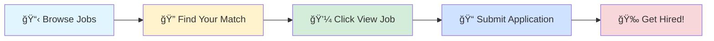

# 🚀 Tech Jobs Board

### Your Gateway to Amazing Career Opportunities

---

## 🎯 Browse by Job Profile

<table>
<tr>
<td align="center" width="25%">

 
<b>1000</b> total positions
</td>
<td align="center" width="25%">

 
<b>1000</b> total positions
</td>
<td align="center" width="25%">

 
<b>1000</b> total positions
</td>
<td align="center" width="25%">

 
<b>1000</b> total positions
</td>
</tr>
</table>

---

## 📊 Data Scientist

> 💼 **1000** positions available

<table>
<thead>
<tr>
<th width="20%">🏢 Company</th>
<th width="35%">💼 Role</th>
<th width="20%">📍 Location</th>
<th width="10%">⏰ Posted</th>
<th width="15%">🔗 Action</th>
</tr>
</thead>
<tbody>
<tr>
<td><a href="https://uk.linkedin.com/company/targetjobsuk">targetjobs UK</a></td>
<td>Data Science Industrial Placement Student</td>
<td></td>
<td>1d ago</td>
<td align="center"></td>
</tr>
<tr>
<td><a href="https://in.linkedin.com/company/ededge-learns">Ededge Learn</a></td>
<td>Data    Analytics  Training  &  Internship</td>
<td></td>
<td>1d ago</td>
<td align="center"></td>
</tr>
<tr>
<td><a href="https://fr.linkedin.com/company/nemera">NEMERA</a></td>
<td>Stage Ingénieur Qualité Amélioration continue en R&D F/H/X</td>
<td></td>
<td>1d ago</td>
<td align="center"></td>
</tr>
<tr>
<td><a href="https://fr.linkedin.com/company/datakeen">Datakeen</a></td>
<td>Stage Machine Learning Engineer</td>
<td></td>
<td>1d ago</td>
<td align="center"></td>
</tr>
<tr>
<td><a href="https://ca.linkedin.com/company/acadiumofficial">Acadium</a></td>
<td>Campaign & Analytics Intern</td>
<td></td>
<td>1d ago</td>
<td align="center"></td>
</tr>
<tr>
<td><a href="https://uk.linkedin.com/company/hyperexponential">hyperexponential</a></td>
<td>AI Builder & Automation Intern</td>
<td></td>
<td>1d ago</td>
<td align="center"></td>
</tr>
<tr>
<td><a href="https://ch.linkedin.com/company/tetra-pak">Tetra Pak</a></td>
<td>Future Talent - Automation Specialist</td>
<td></td>
<td>1d ago</td>
<td align="center"></td>
</tr>
<tr>
<td><a href="https://in.linkedin.com/company/tresvista">TresVista</a></td>
<td>Intern - HR Ops and Analytics (Pune, Hinjewadi Phase 1)</td>
<td>📍 Pune</td>
<td>1d ago</td>
<td align="center"></td>
</tr>
<tr>
<td><a href="https://uk.linkedin.com/company/monzo-bank">Monzo Bank</a></td>
<td>Associate Data Scientist - Intern</td>
<td></td>
<td>1d ago</td>
<td align="center"></td>
</tr>
<tr>
<td><a href="https://it.linkedin.com/company/cosmintspa">Cosmint</a></td>
<td>Internship R&I Technical Support</td>
<td></td>
<td>1d ago</td>
<td align="center"></td>
</tr>
<tr>
<td><a href="https://in.linkedin.com/company/medtoureasyyy-gurugram">MedTourEasy Gurugram</a></td>
<td>Data Analysis Trainee</td>
<td>📍 India</td>
<td>1d ago</td>
<td align="center"></td>
</tr>
<tr>
<td><a href="https://fr.linkedin.com/company/riviera-solutions-rh">Riviera Solutions RH</a></td>
<td>Référent(e)s communication et développement de la visibilité H/F</td>
<td></td>
<td>1d ago</td>
<td align="center"></td>
</tr>
<tr>
<td><a href="https://www.linkedin.com/company/adp">ADP</a></td>
<td>Summer 2026 Data Science/Machine Learning Internship</td>
<td>📍 Florham Park, NJ</td>
<td>1d ago</td>
<td align="center"></td>
</tr>
<tr>
<td><a href="https://at.linkedin.com/company/fresenius-kabi-austria">Fresenius Kabi Austria</a></td>
<td>Abteilungsleitung Analytical Procedure Transfer & Validation (m/w/d)</td>
<td></td>
<td>1d ago</td>
<td align="center"></td>
</tr>
<tr>
<td><a href="https://www.linkedin.com/company/formicstechllc">Formics Tech LLC</a></td>
<td>Python Devloper</td>
<td>📍 India</td>
<td>1d ago</td>
<td align="center"></td>
</tr>
<tr>
<td><a href="https://www.linkedin.com/company/exl-service">EXL</a></td>
<td>Data Scientist</td>
<td>📍 Hyderabad</td>
<td>1d ago</td>
<td align="center"></td>
</tr>
<tr>
<td><a href="https://www.linkedin.com/company/adp">ADP</a></td>
<td>Summer 2026 Data Science/Machine Learning Internship</td>
<td></td>
<td>1d ago</td>
<td align="center"></td>
</tr>
<tr>
<td><a href="https://in.linkedin.com/company/tata-consultancy-services">Tata Consultancy Services</a></td>
<td>Automation Engineer</td>
<td>📍 Chennai</td>
<td>1d ago</td>
<td align="center"></td>
</tr>
<tr>
<td><a href="https://uk.linkedin.com/company/synaprirecruitment">Synapri</a></td>
<td>Artificial Intelligence Engineer</td>
<td></td>
<td>1d ago</td>
<td align="center"></td>
</tr>
<tr>
<td><a href="https://uk.linkedin.com/company/total-it-global">Total IT Global</a></td>
<td>Master’s Thesis Opportunity – Automation & Business Strategy</td>
<td></td>
<td>1d ago</td>
<td align="center"></td>
</tr>
<tr>
<td><a href="https://sg.linkedin.com/company/ministry-of-digital-development-and-information">Ministry of Digital Development and Information</a></td>
<td>Traineeship (Media Analytics and Operations) [GRIT@Gov]</td>
<td></td>
<td>1d ago</td>
<td align="center"></td>
</tr>
<tr>
<td><a href="https://be.linkedin.com/company/wellosolutions">Wello Solutions</a></td>
<td>Senior Software Test Automation Engineer</td>
<td>📍 India</td>
<td>1d ago</td>
<td align="center"></td>
</tr>
<tr>
<td><a href="https://in.linkedin.com/company/tata-consultancy-services">Tata Consultancy Services</a></td>
<td>Data Scientist</td>
<td>📍 Bangalore</td>
<td>1d ago</td>
<td align="center"></td>
</tr>
<tr>
<td><a href="https://www.linkedin.com/company/west-bend-insurance-company">West Bend Insurance Company</a></td>
<td>Intern – IT Data Scientist (Summer 2026)</td>
<td></td>
<td>1d ago</td>
<td align="center"></td>
</tr>
<tr>
<td><a href="https://de.linkedin.com/company/autokontor-bayern">AUTOKONTOR BAYERN GmbH</a></td>
<td>Mitarbeiter (m/w/d) für den Wachschutz</td>
<td></td>
<td>1d ago</td>
<td align="center"></td>
</tr>
<tr>
<td><a href="https://uk.linkedin.com/company/rise-technical-recruitment-ltd">Rise Technical</a></td>
<td>Automation Engineer</td>
<td>📍 Wildwood, FL</td>
<td>1d ago</td>
<td align="center"></td>
</tr>
<tr>
<td><a href="https://in.linkedin.com/company/cyient">Cyient</a></td>
<td>Data Scientist - Junior</td>
<td>📍 Hyderabad</td>
<td>1d ago</td>
<td align="center"></td>
</tr>
<tr>
<td><a href="https://de.linkedin.com/company/agaplesion">AGAPLESION gAG</a></td>
<td>Werkstudent Business Analytics (w/m/d)</td>
<td></td>
<td>1d ago</td>
<td align="center"></td>
</tr>
<tr>
<td><a href="https://de.linkedin.com/company/f%C3%BCrsorge-im-alter-seniorenresidenzen">Fürsorge im Alter Seniorenresidenzen</a></td>
<td>Auszubildende als Fachinformatiker für Systemintegration (w/m/d)</td>
<td></td>
<td>1d ago</td>
<td align="center"></td>
</tr>
<tr>
<td><a href="https://www.linkedin.com/company/intuit">Intuit</a></td>
<td>Senior Data Scientist, Strategy</td>
<td></td>
<td>1d ago</td>
<td align="center"></td>
</tr>
<tr>
<td><a href="https://in.linkedin.com/company/innovaesi">Innova ESI</a></td>
<td>Mobile Automation Test Engineer</td>
<td>📍 Gurugram</td>
<td>1d ago</td>
<td align="center"></td>
</tr>
<tr>
<td><a href="https://si.linkedin.com/company/medius-si">Medius.si</a></td>
<td>Data Scientist</td>
<td>📍 Ljubljana, Ljubljana, Slovenia</td>
<td>1d ago</td>
<td align="center"></td>
</tr>
<tr>
<td><a href="https://uk.linkedin.com/company/london-stock-exchange-group">LSEG</a></td>
<td>Data Scientist</td>
<td>📍 Bangalore</td>
<td>1d ago</td>
<td align="center"></td>
</tr>
<tr>
<td><a href="https://www.linkedin.com/company/hp">HP</a></td>
<td>College Intern - Data Science</td>
<td></td>
<td>1d ago</td>
<td align="center"></td>
</tr>
<tr>
<td><a href="https://fr.linkedin.com/company/bnp-paribas">BNP Paribas</a></td>
<td>Data Science Intern</td>
<td>📍 Mumbai</td>
<td>1d ago</td>
<td align="center"></td>
</tr>
<tr>
<td><a href="https://sg.linkedin.com/company/360tf">360tf</a></td>
<td>Software Engineer (Java | Microservices | AI | AWS)</td>
<td>📍 Mumbai</td>
<td>1d ago</td>
<td align="center"></td>
</tr>
<tr>
<td><a href="https://www.linkedin.com/company/netradyne">Netradyne</a></td>
<td>Staff Data Engineer - ML</td>
<td>📍 Bangalore</td>
<td>1d ago</td>
<td align="center"></td>
</tr>
<tr>
<td><a href="https://de.linkedin.com/company/trench-group">Trench Group</a></td>
<td>AI/ML Intern – Full-Stack Developer</td>
<td></td>
<td>1d ago</td>
<td align="center"></td>
</tr>
<tr>
<td><a href="https://sg.linkedin.com/company/shenzyn">Shenzyn</a></td>
<td>Azure Data Engineer</td>
<td></td>
<td>1d ago</td>
<td align="center"></td>
</tr>
<tr>
<td><a href="https://www.linkedin.com/company/adp">ADP</a></td>
<td>Summer 2026 Data Science/Machine Learning Internship</td>
<td></td>
<td>1d ago</td>
<td align="center"></td>
</tr>
<tr>
<td><a href="https://in.linkedin.com/company/qualitykiosk-technologies">QualityKiosk Technologies Pvt. Ltd.</a></td>
<td>Quality Assurance Automation Engineer</td>
<td>📍 Mumbai</td>
<td>1d ago</td>
<td align="center"></td>
</tr>
<tr>
<td><a href="https://in.linkedin.com/company/softenger">Softenger</a></td>
<td>Automation Testing</td>
<td>📍 Pune</td>
<td>1d ago</td>
<td align="center"></td>
</tr>
<tr>
<td><a href="https://www.linkedin.com/company/novintix">NovintiX</a></td>
<td>Azure Devops Engineer</td>
<td>📍 Coimbatore</td>
<td>1d ago</td>
<td align="center"></td>
</tr>
<tr>
<td><a href="https://be.linkedin.com/company/galactic">GALACTIC</a></td>
<td>R&D Applications Technician</td>
<td></td>
<td>1d ago</td>
<td align="center"></td>
</tr>
<tr>
<td><a href="https://in.linkedin.com/company/atologist-infotech">Atologist Infotech</a></td>
<td>Artificial Intelligence Engineer</td>
<td>📍 India</td>
<td>1d ago</td>
<td align="center"></td>
</tr>
<tr>
<td><a href="https://de.linkedin.com/company/datasquads">DataSquads UG</a></td>
<td>QA Engineer (Quality Engineering & Test Automation) (m/f/n)</td>
<td></td>
<td>1d ago</td>
<td align="center"></td>
</tr>
<tr>
<td><a href="https://www.linkedin.com/company/techconsultingusa">Tech Consulting</a></td>
<td>Jr. Data Science</td>
<td></td>
<td>1d ago</td>
<td align="center"></td>
</tr>
<tr>
<td><a href="https://fr.linkedin.com/company/bnp-paribas">BNP Paribas</a></td>
<td>Assistant Manager - AML Transaction Monitoring</td>
<td>📍 Mumbai</td>
<td>1d ago</td>
<td align="center"></td>
</tr>
<tr>
<td><a href="https://www.linkedin.com/company/maitri-services">Maitri Services</a></td>
<td>Machine Learning, AI, and Data Engineer</td>
<td></td>
<td>1d ago</td>
<td align="center"></td>
</tr>
<tr>
<td><a href="https://www.linkedin.com/company/emerson">Emerson</a></td>
<td>Sr. Machine Learning Engineer</td>
<td>📍 Pune</td>
<td>1d ago</td>
<td align="center"></td>
</tr>
<tr>
<td><a href="https://pk.linkedin.com/company/linkedmatrix">Linked Matrix</a></td>
<td>Python Intern</td>
<td></td>
<td>1d ago</td>
<td align="center"></td>
</tr>
<tr>
<td><a href="https://www.linkedin.com/company/auxia-io">Auxia</a></td>
<td>Data Scientist</td>
<td></td>
<td>1d ago</td>
<td align="center"></td>
</tr>
<tr>
<td><a href="https://www.linkedin.com/company/mastercard">Mastercard</a></td>
<td>Manager, Analytics & Metrics</td>
<td>📍 Gurugram</td>
<td>1d ago</td>
<td align="center"></td>
</tr>
<tr>
<td><a href="https://www.linkedin.com/company/blinkexp">Blink - Employee Experience Platform</a></td>
<td>Analytics Engineer</td>
<td></td>
<td>1d ago</td>
<td align="center"></td>
</tr>
<tr>
<td><a href="https://www.linkedin.com/company/maitri-services">Maitri Services</a></td>
<td>Full Stack Engineer (Python/React.js)</td>
<td></td>
<td>1d ago</td>
<td align="center"></td>
</tr>
<tr>
<td><a href="https://in.linkedin.com/company/wiraa">Wiraa</a></td>
<td>QA Engineer (Automation)</td>
<td></td>
<td>1d ago</td>
<td align="center"></td>
</tr>
<tr>
<td><a href="https://www.linkedin.com/company/grid-dynamics">Grid Dynamics</a></td>
<td>Quality Assurance Automation Engineer</td>
<td></td>
<td>1d ago</td>
<td align="center"></td>
</tr>
<tr>
<td><a href="https://in.linkedin.com/company/wiraa">Wiraa</a></td>
<td>AI/ML DevOps Engineer</td>
<td></td>
<td>1d ago</td>
<td align="center"></td>
</tr>
<tr>
<td><a href="https://in.linkedin.com/company/wiraa">Wiraa</a></td>
<td>Software Engineer (Python, Java)</td>
<td></td>
<td>1d ago</td>
<td align="center"></td>
</tr>
<tr>
<td><a href="https://www.linkedin.com/company/myremoteteam-inc">MyRemoteTeam Inc</a></td>
<td>Quality Assurance Automation Engineer</td>
<td>📍 Bangalore</td>
<td>1d ago</td>
<td align="center"></td>
</tr>
<tr>
<td><a href="https://in.linkedin.com/company/netcore-cloud">Netcore Cloud</a></td>
<td>Strategic Partnerships-Hyperscaler(GCP, AWS): 579</td>
<td>📍 Mumbai</td>
<td>1d ago</td>
<td align="center"></td>
</tr>
<tr>
<td><a href="https://www.linkedin.com/company/um-it-solutions">UM IT Solutions</a></td>
<td>Machine Learning Intern</td>
<td>📍 India</td>
<td>1d ago</td>
<td align="center"></td>
</tr>
<tr>
<td><a href="https://in.linkedin.com/company/live-connections">Live Connections</a></td>
<td>Technical Business Analyst + AI/ ML</td>
<td>📍 Pune</td>
<td>1d ago</td>
<td align="center"></td>
</tr>
<tr>
<td><a href="https://fr.linkedin.com/company/cdiscount">Cdiscount</a></td>
<td>STAGE - DATA SCIENTIST F/H</td>
<td></td>
<td>1d ago</td>
<td align="center"></td>
</tr>
<tr>
<td><a href="https://ae.linkedin.com/company/marcura">Marcura</a></td>
<td>AP Automation Specialist</td>
<td>📍 Mumbai</td>
<td>1d ago</td>
<td align="center"></td>
</tr>
<tr>
<td><a href="https://uk.linkedin.com/company/upper-shirley-high">Upper Shirley High School</a></td>
<td>Head of ICT and Computer Science</td>
<td>📍 Greater Southampton Area</td>
<td>1d ago</td>
<td align="center"></td>
</tr>
<tr>
<td><a href="https://www.linkedin.com/company/jobunifiedmentor">UM IT PRIVATE LIMITED</a></td>
<td>Data Science Intern</td>
<td>📍 India</td>
<td>1d ago</td>
<td align="center"></td>
</tr>
<tr>
<td><a href="https://uk.linkedin.com/company/infoplus-technologies-uk-limited">Infoplus Technologies UK Limited</a></td>
<td>Senior Quality Assurance Automation Engineer</td>
<td></td>
<td>1d ago</td>
<td align="center"></td>
</tr>
<tr>
<td><a href="https://www.linkedin.com/company/nutanix">Nutanix</a></td>
<td>Member Of Technical Staff 2 (QA Automation, Virtualization)</td>
<td>📍 Bangalore</td>
<td>1d ago</td>
<td align="center"></td>
</tr>
<tr>
<td><a href="https://ca.linkedin.com/company/bdo-canada">BDO Canada</a></td>
<td>New Grad 2025, Technical Consultant, Value Creation and Analytics</td>
<td></td>
<td>1d ago</td>
<td align="center"></td>
</tr>
<tr>
<td><a href="https://ch.linkedin.com/company/amarisconsulting">Amaris Consulting</a></td>
<td>Python Developer</td>
<td></td>
<td>1d ago</td>
<td align="center"></td>
</tr>
<tr>
<td><a href="https://in.linkedin.com/company/opura-ai">Opura AI</a></td>
<td>Data Scientist</td>
<td>📍 India</td>
<td>1d ago</td>
<td align="center"></td>
</tr>
<tr>
<td><a href="https://id.linkedin.com/company/gotogroup">GoTo Group</a></td>
<td>Gojek - Data Scientist</td>
<td>📍 Bangalore</td>
<td>1d ago</td>
<td align="center"></td>
</tr>
<tr>
<td><a href="https://www.linkedin.com/company/mccormick">McCormick & Company</a></td>
<td>INTERN R&D</td>
<td>📍 Hunt Valley, MD</td>
<td>1d ago</td>
<td align="center"></td>
</tr>
<tr>
<td><a href="https://www.linkedin.com/company/epam-systems">EPAM Systems</a></td>
<td>JavaScript Automation Test Engineer</td>
<td>📍 Gurugram</td>
<td>1d ago</td>
<td align="center"></td>
</tr>
<tr>
<td><a href="https://es.linkedin.com/company/intelequia">Intelequia</a></td>
<td>Data Scientist</td>
<td></td>
<td>1d ago</td>
<td align="center"></td>
</tr>
<tr>
<td><a href="https://www.linkedin.com/company/amk-solutions-limited">AMK SOLUTIONS LIMITED</a></td>
<td>Automation Test Analyst</td>
<td></td>
<td>1d ago</td>
<td align="center"></td>
</tr>
<tr>
<td><a href="https://www.linkedin.com/company/epam-systems">EPAM Systems</a></td>
<td>JavaScript Automation Test Engineer</td>
<td>📍 Hyderabad</td>
<td>1d ago</td>
<td align="center"></td>
</tr>
<tr>
<td><a href="https://www.linkedin.com/company/epam-systems">EPAM Systems</a></td>
<td>Lead Data Scientist</td>
<td>📍 Hyderabad</td>
<td>1d ago</td>
<td align="center"></td>
</tr>
<tr>
<td><a href="https://www.linkedin.com/company/epam-systems">EPAM Systems</a></td>
<td>Lead Software Engineer (Python, GenAI, LLM)</td>
<td>📍 Chennai</td>
<td>1d ago</td>
<td align="center"></td>
</tr>
<tr>
<td><a href="https://uk.linkedin.com/company/computacenter">Computacenter</a></td>
<td>Quality Assurance Automation Engineer</td>
<td></td>
<td>1d ago</td>
<td align="center"></td>
</tr>
<tr>
<td><a href="https://in.linkedin.com/company/kpmanish">KP Manish Global Ingredients Pvt. Ltd.</a></td>
<td>Manager - R&D (FMCG) Delhi</td>
<td>📍 Delhi</td>
<td>1d ago</td>
<td align="center"></td>
</tr>
<tr>
<td><a href="https://in.linkedin.com/company/prakhar-software">Prakhar Software Solutions Ltd.</a></td>
<td>Data Scientist</td>
<td>📍 India</td>
<td>1d ago</td>
<td align="center"></td>
</tr>
<tr>
<td><a href="https://in.linkedin.com/company/createntropy">Createntropy Private Limited</a></td>
<td>GCP Administrator</td>
<td>📍 Pune</td>
<td>1d ago</td>
<td align="center"></td>
</tr>
<tr>
<td><a href="https://www.linkedin.com/company/epam-systems">EPAM Systems</a></td>
<td>Lead Software Engineer (Python, GenAI, LLM)</td>
<td>📍 Pune</td>
<td>1d ago</td>
<td align="center"></td>
</tr>
<tr>
<td><a href="https://uk.linkedin.com/company/capco">Capco</a></td>
<td>Lead BA - Channels (Contact Center Automation)</td>
<td>📍 Pune</td>
<td>1d ago</td>
<td align="center"></td>
</tr>
<tr>
<td><a href="https://de.linkedin.com/company/k%C3%B6rber-technologies">Körber Technologies</a></td>
<td>R&D Engineer</td>
<td></td>
<td>1d ago</td>
<td align="center"></td>
</tr>
<tr>
<td><a href="https://www.linkedin.com/company/epam-systems">EPAM Systems</a></td>
<td>Cloud Delivery Director - Cloud/Apps Migration - Azure</td>
<td>📍 Pune</td>
<td>1d ago</td>
<td align="center"></td>
</tr>
<tr>
<td><a href="https://de.linkedin.com/company/zertificon-solutions-gmbh">Zertificon Solutions GmbH</a></td>
<td>Senior QA Engineer – Python Test Automation (f/m/d) – IT Security</td>
<td></td>
<td>1d ago</td>
<td align="center"></td>
</tr>
<tr>
<td><a href="https://www.linkedin.com/company/epam-systems">EPAM Systems</a></td>
<td>.NET Automation Test Engineer</td>
<td>📍 Hyderabad</td>
<td>1d ago</td>
<td align="center"></td>
</tr>
<tr>
<td><a href="https://de.linkedin.com/company/medialine-eurotrade-ag">Medialine Group</a></td>
<td>Managed Service Microsoft SQL Administrator (m/w/d)</td>
<td></td>
<td>1d ago</td>
<td align="center"></td>
</tr>
<tr>
<td><a href="https://www.linkedin.com/company/mars">Mars</a></td>
<td>SAP S/4HANA Automation Test Analyst</td>
<td></td>
<td>1d ago</td>
<td align="center"></td>
</tr>
<tr>
<td><a href="https://fr.linkedin.com/company/mb-therapeutics">MB Therapeutics</a></td>
<td>Stagiaire Asistant.e Qualité / Affaires Réglementaires</td>
<td></td>
<td>1d ago</td>
<td align="center"></td>
</tr>
<tr>
<td><a href="https://sg.linkedin.com/company/allied-search-pte-ltd">ALLIED SEARCH PTE.LTD.</a></td>
<td>Data Scientist</td>
<td></td>
<td>1d ago</td>
<td align="center"></td>
</tr>
<tr>
<td><a href="https://www.linkedin.com/company/epam-systems">EPAM Systems</a></td>
<td>Senior Software Engineer – Python, AWS</td>
<td>📍 Chennai</td>
<td>1d ago</td>
<td align="center"></td>
</tr>
<tr>
<td><a href="https://www.linkedin.com/company/myremoteteam-inc">MyRemoteTeam Inc</a></td>
<td>Quality Assurance Automation Engineer</td>
<td>📍 India</td>
<td>1d ago</td>
<td align="center"></td>
</tr>
<tr>
<td><a href="https://www.linkedin.com/company/epam-systems">EPAM Systems</a></td>
<td>Senior Software Engineer – (Python & ReactJS)</td>
<td>📍 Pune</td>
<td>1d ago</td>
<td align="center"></td>
</tr>
<tr>
<td><a href="https://www.linkedin.com/company/epam-systems">EPAM Systems</a></td>
<td>SAP Analytics Cloud Consultant</td>
<td>📍 Gurugram</td>
<td>1d ago</td>
<td align="center"></td>
</tr>
<tr>
<td><a href="https://www.linkedin.com/company/epam-systems">EPAM Systems</a></td>
<td>Lead System Engineer - Microsoft Azure</td>
<td>📍 Bangalore</td>
<td>1d ago</td>
<td align="center"></td>
</tr>
<tr>
<td><a href="https://www.linkedin.com/company/epam-systems">EPAM Systems</a></td>
<td>Senior Systems Engineer (AWS IAM, Python & DevOps)</td>
<td>📍 Hyderabad</td>
<td>1d ago</td>
<td align="center"></td>
</tr>
<tr><td colspan="5" align="center"><i>... and 900 more positions</i></td></tr>
</tbody>
</table>

---

## 💼 Business Analyst

> 💼 **1000** positions available

<table>
<thead>
<tr>
<th width="20%">🏢 Company</th>
<th width="35%">💼 Role</th>
<th width="20%">📍 Location</th>
<th width="10%">⏰ Posted</th>
<th width="15%">🔗 Action</th>
</tr>
</thead>
<tbody>
<tr>
<td><a href="https://in.linkedin.com/company/ededge-learns">Ededge Learn</a></td>
<td>Data    Analytics  Training  &  Internship</td>
<td></td>
<td>1d ago</td>
<td align="center"></td>
</tr>
<tr>
<td><a href="https://ca.linkedin.com/company/acadiumofficial">Acadium</a></td>
<td>Campaign & Analytics Intern</td>
<td></td>
<td>1d ago</td>
<td align="center"></td>
</tr>
<tr>
<td><a href="https://uk.linkedin.com/company/targetjobsuk">targetjobs UK</a></td>
<td>2026 UK and Ireland Graduate Project Management Career Path</td>
<td></td>
<td>1d ago</td>
<td align="center"></td>
</tr>
<tr>
<td><a href="https://uk.linkedin.com/company/hyperexponential">hyperexponential</a></td>
<td>AI Builder & Automation Intern</td>
<td></td>
<td>1d ago</td>
<td align="center"></td>
</tr>
<tr>
<td><a href="https://ch.linkedin.com/company/tetra-pak">Tetra Pak</a></td>
<td>Future Talent - Automation Specialist</td>
<td></td>
<td>1d ago</td>
<td align="center"></td>
</tr>
<tr>
<td><a href="https://in.linkedin.com/company/tresvista">TresVista</a></td>
<td>Intern - HR Ops and Analytics (Pune, Hinjewadi Phase 1)</td>
<td>📍 Pune</td>
<td>1d ago</td>
<td align="center"></td>
</tr>
<tr>
<td><a href="https://uk.linkedin.com/company/targetjobsuk">targetjobs UK</a></td>
<td>Newcastle Program & Project Management Graduate Programme 2026 - 2027</td>
<td></td>
<td>1d ago</td>
<td align="center"></td>
</tr>
<tr>
<td><a href="https://in.linkedin.com/company/medtoureasyyy-gurugram">MedTourEasy Gurugram</a></td>
<td>Data Analysis Trainee</td>
<td>📍 India</td>
<td>1d ago</td>
<td align="center"></td>
</tr>
<tr>
<td><a href="https://in.linkedin.com/company/blacksof">Blacksof</a></td>
<td>Project Management Trainee</td>
<td>📍 India</td>
<td>1d ago</td>
<td align="center"></td>
</tr>
<tr>
<td><a href="https://www.linkedin.com/company/west-bend-insurance-company">West Bend Insurance Company</a></td>
<td>Intern – IT Business Analyst (Summer 2026)</td>
<td>📍 West Bend, WI</td>
<td>1d ago</td>
<td align="center"></td>
</tr>
<tr>
<td><a href="https://in.linkedin.com/company/nspglobaltech">NSP</a></td>
<td>Scrum Master</td>
<td>📍 Bangalore</td>
<td>1d ago</td>
<td align="center"></td>
</tr>
<tr>
<td><a href="https://de.linkedin.com/company/mediadialog">mediaDIALOG</a></td>
<td>Assistant Project Management (m/w/d)</td>
<td></td>
<td>1d ago</td>
<td align="center"></td>
</tr>
<tr>
<td><a href="https://at.linkedin.com/company/fresenius-kabi-austria">Fresenius Kabi Austria</a></td>
<td>Abteilungsleitung Analytical Procedure Transfer & Validation (m/w/d)</td>
<td></td>
<td>1d ago</td>
<td align="center"></td>
</tr>
<tr>
<td><a href="https://www.linkedin.com/company/formicstechllc">Formics Tech LLC</a></td>
<td>Python Devloper</td>
<td>📍 India</td>
<td>1d ago</td>
<td align="center"></td>
</tr>
<tr>
<td><a href="https://in.linkedin.com/company/tata-consultancy-services">Tata Consultancy Services</a></td>
<td>Automation Engineer</td>
<td>📍 Chennai</td>
<td>1d ago</td>
<td align="center"></td>
</tr>
<tr>
<td><a href="https://uk.linkedin.com/company/total-it-global">Total IT Global</a></td>
<td>Master’s Thesis Opportunity – Automation & Business Strategy</td>
<td></td>
<td>1d ago</td>
<td align="center"></td>
</tr>
<tr>
<td><a href="https://sg.linkedin.com/company/ministry-of-digital-development-and-information">Ministry of Digital Development and Information</a></td>
<td>Traineeship (Media Analytics and Operations) [GRIT@Gov]</td>
<td></td>
<td>1d ago</td>
<td align="center"></td>
</tr>
<tr>
<td><a href="https://www.linkedin.com/company/new-york-global-consultants-corporation-inc">New York Global Consultants Inc. (NYGCI)</a></td>
<td>Business Analyst - RPA</td>
<td></td>
<td>1d ago</td>
<td align="center"></td>
</tr>
<tr>
<td><a href="https://be.linkedin.com/company/wellosolutions">Wello Solutions</a></td>
<td>Senior Software Test Automation Engineer</td>
<td>📍 India</td>
<td>1d ago</td>
<td align="center"></td>
</tr>
<tr>
<td><a href="https://dk.linkedin.com/company/relesys">Relesys</a></td>
<td>Client Project Management Associate, Internship</td>
<td></td>
<td>1d ago</td>
<td align="center"></td>
</tr>
<tr>
<td><a href="https://in.linkedin.com/company/hoabl">The House of Abhinandan Lodha</a></td>
<td>Salesforce Admin - Tech</td>
<td>📍 Mumbai</td>
<td>1d ago</td>
<td align="center"></td>
</tr>
<tr>
<td><a href="https://uk.linkedin.com/company/rise-technical-recruitment-ltd">Rise Technical</a></td>
<td>Automation Engineer</td>
<td>📍 Wildwood, FL</td>
<td>1d ago</td>
<td align="center"></td>
</tr>
<tr>
<td><a href="https://pl.linkedin.com/company/lukardi">LUKARDI</a></td>
<td>Project Manager/Business Analyst</td>
<td></td>
<td>1d ago</td>
<td align="center"></td>
</tr>
<tr>
<td><a href="https://de.linkedin.com/company/agaplesion">AGAPLESION gAG</a></td>
<td>Werkstudent Business Analytics (w/m/d)</td>
<td></td>
<td>1d ago</td>
<td align="center"></td>
</tr>
<tr>
<td><a href="https://in.linkedin.com/company/techbridge-2">TechBridge Consultancy Services</a></td>
<td>Associate Business Analyst</td>
<td>📍 Gurugram</td>
<td>1d ago</td>
<td align="center"></td>
</tr>
<tr>
<td><a href="https://sg.linkedin.com/company/grabapp">Grab</a></td>
<td>GRIT Trainee, Business Analyst, Commercial Systems</td>
<td></td>
<td>1d ago</td>
<td align="center"></td>
</tr>
<tr>
<td><a href="https://in.linkedin.com/company/birlasoft">Birlasoft</a></td>
<td>Sr Scrum Master</td>
<td>📍 Noida</td>
<td>1d ago</td>
<td align="center"></td>
</tr>
<tr>
<td><a href="https://in.linkedin.com/company/finacplus">FinacPlus</a></td>
<td>Project Management Intern</td>
<td>📍 Bangalore</td>
<td>1d ago</td>
<td align="center"></td>
</tr>
<tr>
<td><a href="https://in.linkedin.com/company/innovaesi">Innova ESI</a></td>
<td>Mobile Automation Test Engineer</td>
<td>📍 Gurugram</td>
<td>1d ago</td>
<td align="center"></td>
</tr>
<tr>
<td><a href="https://www.linkedin.com/company/your-next-hire-global">Your Next Hire Global</a></td>
<td>Business Analyst</td>
<td></td>
<td>1d ago</td>
<td align="center"></td>
</tr>
<tr>
<td><a href="https://vn.linkedin.com/company/hitachidigitalservicesvn">Hitachi Digital Services Vietnam</a></td>
<td>Junior/Middle Business Analyst</td>
<td></td>
<td>1d ago</td>
<td align="center"></td>
</tr>
<tr>
<td><a href="https://es.linkedin.com/company/amadeus">Amadeus</a></td>
<td>Junior Business Analyst-NDC</td>
<td>📍 Istanbul, Istanbul, Türkiye</td>
<td>1d ago</td>
<td align="center"></td>
</tr>
<tr>
<td><a href="https://www.linkedin.com/company/siemens-energy">Siemens Energy</a></td>
<td>Project Management Officer</td>
<td></td>
<td>1d ago</td>
<td align="center"></td>
</tr>
<tr>
<td><a href="https://uk.linkedin.com/company/performa-it">Performa</a></td>
<td>Salesforce Tech Lead</td>
<td></td>
<td>1d ago</td>
<td align="center"></td>
</tr>
<tr>
<td><a href="https://in.linkedin.com/company/saleon-consulting">Saleon Consulting</a></td>
<td>Salesforce Tech Lead</td>
<td>📍 Pune</td>
<td>1d ago</td>
<td align="center"></td>
</tr>
<tr>
<td><a href="https://in.linkedin.com/company/qualitykiosk-technologies">QualityKiosk Technologies Pvt. Ltd.</a></td>
<td>Quality Assurance Automation Engineer</td>
<td>📍 Mumbai</td>
<td>1d ago</td>
<td align="center"></td>
</tr>
<tr>
<td><a href="https://in.linkedin.com/company/softenger">Softenger</a></td>
<td>Automation Testing</td>
<td>📍 Pune</td>
<td>1d ago</td>
<td align="center"></td>
</tr>
<tr>
<td><a href="https://in.linkedin.com/company/thegarageindia">The Garage India</a></td>
<td>Business Analyst</td>
<td>📍 Bangalore</td>
<td>1d ago</td>
<td align="center"></td>
</tr>
<tr>
<td><a href="https://be.linkedin.com/company/jobgether">Jobgether</a></td>
<td>Senior Director, Project Management & Delivery Operations</td>
<td></td>
<td>1d ago</td>
<td align="center"></td>
</tr>
<tr>
<td><a href="https://vn.linkedin.com/company/trustify-technology">Trustify Technology</a></td>
<td>IT Business Analyst</td>
<td></td>
<td>1d ago</td>
<td align="center"></td>
</tr>
<tr>
<td><a href="https://sa.linkedin.com/company/esensesaudi">eSense</a></td>
<td>Business Analyst</td>
<td></td>
<td>1d ago</td>
<td align="center"></td>
</tr>
<tr>
<td><a href="https://de.linkedin.com/company/datasquads">DataSquads UG</a></td>
<td>QA Engineer (Quality Engineering & Test Automation) (m/f/n)</td>
<td></td>
<td>1d ago</td>
<td align="center"></td>
</tr>
<tr>
<td><a href="https://www.linkedin.com/company/siliconlabs">Silicon Labs</a></td>
<td>Senior Engineer - Salesforce</td>
<td>📍 Hyderabad</td>
<td>1d ago</td>
<td align="center"></td>
</tr>
<tr>
<td><a href="https://in.linkedin.com/company/golden-opportunities-pvt-ltd">Golden Opportunities</a></td>
<td>Kyriba Treasury IT Business Analyst - Lead - GO/JC/1104/2025</td>
<td>📍 Pune</td>
<td>1d ago</td>
<td align="center"></td>
</tr>
<tr>
<td><a href="https://in.linkedin.com/company/zensar">Zensar Technologies</a></td>
<td>Salesforce Developer</td>
<td>📍 Hyderabad</td>
<td>1d ago</td>
<td align="center"></td>
</tr>
<tr>
<td><a href="https://pk.linkedin.com/company/linkedmatrix">Linked Matrix</a></td>
<td>Python Intern</td>
<td></td>
<td>1d ago</td>
<td align="center"></td>
</tr>
<tr>
<td><a href="https://www.linkedin.com/company/cullerton-group">Cullerton Group</a></td>
<td>Salesforce Developer</td>
<td></td>
<td>1d ago</td>
<td align="center"></td>
</tr>
<tr>
<td><a href="https://www.linkedin.com/company/mastercard">Mastercard</a></td>
<td>Manager, Analytics & Metrics</td>
<td>📍 Gurugram</td>
<td>1d ago</td>
<td align="center"></td>
</tr>
<tr>
<td><a href="https://www.linkedin.com/company/blinkexp">Blink - Employee Experience Platform</a></td>
<td>Analytics Engineer</td>
<td></td>
<td>1d ago</td>
<td align="center"></td>
</tr>
<tr>
<td><a href="https://in.linkedin.com/company/wiraa">Wiraa</a></td>
<td>Business Analyst</td>
<td></td>
<td>1d ago</td>
<td align="center"></td>
</tr>
<tr>
<td><a href="https://fr.linkedin.com/company/bnp-paribas">BNP Paribas</a></td>
<td>Lead Business Analyst</td>
<td>📍 Mumbai</td>
<td>1d ago</td>
<td align="center"></td>
</tr>
<tr>
<td><a href="https://uk.linkedin.com/company/mygwork">myGwork - LGBTQ+ Business Community</a></td>
<td>Business Analyst</td>
<td>📍 Mumbai</td>
<td>1d ago</td>
<td align="center"></td>
</tr>
<tr>
<td><a href="https://www.linkedin.com/company/maitri-services">Maitri Services</a></td>
<td>Full Stack Engineer (Python/React.js)</td>
<td></td>
<td>1d ago</td>
<td align="center"></td>
</tr>
<tr>
<td><a href="https://in.linkedin.com/company/pehchaan-the-street-school-trust">Pehchaan The Street School (Trust)</a></td>
<td>Project Management Internship</td>
<td>📍 Delhi</td>
<td>1d ago</td>
<td align="center"></td>
</tr>
<tr>
<td><a href="https://in.linkedin.com/company/wiraa">Wiraa</a></td>
<td>QA Engineer (Automation)</td>
<td></td>
<td>1d ago</td>
<td align="center"></td>
</tr>
<tr>
<td><a href="https://www.linkedin.com/company/grid-dynamics">Grid Dynamics</a></td>
<td>Quality Assurance Automation Engineer</td>
<td></td>
<td>1d ago</td>
<td align="center"></td>
</tr>
<tr>
<td><a href="https://vn.linkedin.com/company/genesolutions">Gene Solutions</a></td>
<td>Power BI Developer</td>
<td></td>
<td>1d ago</td>
<td align="center"></td>
</tr>
<tr>
<td><a href="https://in.linkedin.com/company/wiraa">Wiraa</a></td>
<td>Software Engineer (Python, Java)</td>
<td></td>
<td>1d ago</td>
<td align="center"></td>
</tr>
<tr>
<td><a href="https://in.linkedin.com/company/tech-mahindra">Tech Mahindra</a></td>
<td>ServiceNow Business Analyst</td>
<td></td>
<td>1d ago</td>
<td align="center"></td>
</tr>
<tr>
<td><a href="https://www.linkedin.com/company/myremoteteam-inc">MyRemoteTeam Inc</a></td>
<td>Quality Assurance Automation Engineer</td>
<td>📍 Bangalore</td>
<td>1d ago</td>
<td align="center"></td>
</tr>
<tr>
<td><a href="https://in.linkedin.com/company/live-connections">Live Connections</a></td>
<td>Technical Business Analyst + AI/ ML</td>
<td>📍 Pune</td>
<td>1d ago</td>
<td align="center"></td>
</tr>
<tr>
<td><a href="https://ae.linkedin.com/company/marcura">Marcura</a></td>
<td>AP Automation Specialist</td>
<td>📍 Mumbai</td>
<td>1d ago</td>
<td align="center"></td>
</tr>
<tr>
<td><a href="https://uk.linkedin.com/company/upper-shirley-high">Upper Shirley High School</a></td>
<td>Head of ICT and Computer Science</td>
<td>📍 Greater Southampton Area</td>
<td>1d ago</td>
<td align="center"></td>
</tr>
<tr>
<td><a href="https://uk.linkedin.com/company/infoplus-technologies-uk-limited">Infoplus Technologies UK Limited</a></td>
<td>Senior Quality Assurance Automation Engineer</td>
<td></td>
<td>1d ago</td>
<td align="center"></td>
</tr>
<tr>
<td><a href="https://www.linkedin.com/company/nutanix">Nutanix</a></td>
<td>Member Of Technical Staff 2 (QA Automation, Virtualization)</td>
<td>📍 Bangalore</td>
<td>1d ago</td>
<td align="center"></td>
</tr>
<tr>
<td><a href="https://ca.linkedin.com/company/bdo-canada">BDO Canada</a></td>
<td>New Grad 2025, Technical Consultant, Value Creation and Analytics</td>
<td></td>
<td>1d ago</td>
<td align="center"></td>
</tr>
<tr>
<td><a href="https://ch.linkedin.com/company/amarisconsulting">Amaris Consulting</a></td>
<td>Python Developer</td>
<td></td>
<td>1d ago</td>
<td align="center"></td>
</tr>
<tr>
<td><a href="https://sa.linkedin.com/company/aielements">AiElements</a></td>
<td>Senior Business Analyst (Data Management)- Saudi</td>
<td></td>
<td>1d ago</td>
<td align="center"></td>
</tr>
<tr>
<td><a href="https://hk.linkedin.com/company/hket">Hong Kong Economic Times</a></td>
<td>Business Analyst</td>
<td></td>
<td>1d ago</td>
<td align="center"></td>
</tr>
<tr>
<td><a href="https://www.linkedin.com/company/epam-systems">EPAM Systems</a></td>
<td>JavaScript Automation Test Engineer</td>
<td>📍 Gurugram</td>
<td>1d ago</td>
<td align="center"></td>
</tr>
<tr>
<td><a href="https://www.linkedin.com/company/amk-solutions-limited">AMK SOLUTIONS LIMITED</a></td>
<td>Automation Test Analyst</td>
<td></td>
<td>1d ago</td>
<td align="center"></td>
</tr>
<tr>
<td><a href="https://www.linkedin.com/company/epam-systems">EPAM Systems</a></td>
<td>JavaScript Automation Test Engineer</td>
<td>📍 Hyderabad</td>
<td>1d ago</td>
<td align="center"></td>
</tr>
<tr>
<td><a href="https://www.linkedin.com/company/epam-systems">EPAM Systems</a></td>
<td>Lead Software Engineer (Python, GenAI, LLM)</td>
<td>📍 Chennai</td>
<td>1d ago</td>
<td align="center"></td>
</tr>
<tr>
<td><a href="https://www.linkedin.com/company/vayangroup">Vayan Group, LLC</a></td>
<td>Business Analyst- IT</td>
<td></td>
<td>1d ago</td>
<td align="center"></td>
</tr>
<tr>
<td><a href="https://uk.linkedin.com/company/computacenter">Computacenter</a></td>
<td>Quality Assurance Automation Engineer</td>
<td></td>
<td>1d ago</td>
<td align="center"></td>
</tr>
<tr>
<td><a href="https://it.linkedin.com/company/ovsspa">OVS S.p.A.</a></td>
<td>Stage Business Analyst</td>
<td></td>
<td>1d ago</td>
<td align="center"></td>
</tr>
<tr>
<td><a href="https://www.linkedin.com/company/epam-systems">EPAM Systems</a></td>
<td>Lead Software Engineer (Python, GenAI, LLM)</td>
<td>📍 Pune</td>
<td>1d ago</td>
<td align="center"></td>
</tr>
<tr>
<td><a href="https://uk.linkedin.com/company/capco">Capco</a></td>
<td>Lead BA - Channels (Contact Center Automation)</td>
<td>📍 Pune</td>
<td>1d ago</td>
<td align="center"></td>
</tr>
<tr>
<td><a href="https://de.linkedin.com/company/zertificon-solutions-gmbh">Zertificon Solutions GmbH</a></td>
<td>Senior QA Engineer – Python Test Automation (f/m/d) – IT Security</td>
<td></td>
<td>1d ago</td>
<td align="center"></td>
</tr>
<tr>
<td><a href="https://www.linkedin.com/company/epam-systems">EPAM Systems</a></td>
<td>.NET Automation Test Engineer</td>
<td>📍 Hyderabad</td>
<td>1d ago</td>
<td align="center"></td>
</tr>
<tr>
<td><a href="https://de.linkedin.com/company/medialine-eurotrade-ag">Medialine Group</a></td>
<td>Managed Service Microsoft SQL Administrator (m/w/d)</td>
<td></td>
<td>1d ago</td>
<td align="center"></td>
</tr>
<tr>
<td><a href="https://www.linkedin.com/company/mars">Mars</a></td>
<td>SAP S/4HANA Automation Test Analyst</td>
<td></td>
<td>1d ago</td>
<td align="center"></td>
</tr>
<tr>
<td><a href="https://uk.linkedin.com/company/clifford-chance-llp">Clifford Chance</a></td>
<td>Senior Business Analyst - Service Now 18 Month FTC</td>
<td></td>
<td>1d ago</td>
<td align="center"></td>
</tr>
<tr>
<td><a href="https://www.linkedin.com/company/epam-systems">EPAM Systems</a></td>
<td>Senior Software Engineer – Python, AWS</td>
<td>📍 Chennai</td>
<td>1d ago</td>
<td align="center"></td>
</tr>
<tr>
<td><a href="https://www.linkedin.com/company/nice-systems">NiCE</a></td>
<td>Senior Specialist Business Consultant</td>
<td>📍 Pune</td>
<td>1d ago</td>
<td align="center"></td>
</tr>
<tr>
<td><a href="https://in.linkedin.com/company/wipro">Wipro</a></td>
<td>Scrum Master - L2</td>
<td>📍 Bangalore</td>
<td>1d ago</td>
<td align="center"></td>
</tr>
<tr>
<td><a href="https://www.linkedin.com/company/myremoteteam-inc">MyRemoteTeam Inc</a></td>
<td>Quality Assurance Automation Engineer</td>
<td>📍 India</td>
<td>1d ago</td>
<td align="center"></td>
</tr>
<tr>
<td><a href="https://www.linkedin.com/company/epam-systems">EPAM Systems</a></td>
<td>Senior Software Engineer – (Python & ReactJS)</td>
<td>📍 Pune</td>
<td>1d ago</td>
<td align="center"></td>
</tr>
<tr>
<td><a href="https://www.linkedin.com/company/epam-systems">EPAM Systems</a></td>
<td>SAP Analytics Cloud Consultant</td>
<td>📍 Gurugram</td>
<td>1d ago</td>
<td align="center"></td>
</tr>
<tr>
<td><a href="https://www.linkedin.com/company/epam-systems">EPAM Systems</a></td>
<td>Senior Systems Engineer (AWS IAM, Python & DevOps)</td>
<td>📍 Hyderabad</td>
<td>1d ago</td>
<td align="center"></td>
</tr>
<tr>
<td><a href="https://www.linkedin.com/company/epam-systems">EPAM Systems</a></td>
<td>Senior Automation Tester - JavaScript</td>
<td>📍 Coimbatore</td>
<td>1d ago</td>
<td align="center"></td>
</tr>
<tr>
<td><a href="https://www.linkedin.com/company/epam-systems">EPAM Systems</a></td>
<td>Senior Python Automation Test Engineer</td>
<td>📍 Gurugram</td>
<td>1d ago</td>
<td align="center"></td>
</tr>
<tr>
<td><a href="https://in.linkedin.com/company/infiniminds-private-limited">INFINIMINDS</a></td>
<td>Automation Lead</td>
<td>📍 Hyderabad</td>
<td>1d ago</td>
<td align="center"></td>
</tr>
<tr>
<td><a href="https://www.linkedin.com/company/epam-systems">EPAM Systems</a></td>
<td>Quality Architect Test Automation</td>
<td>📍 Pune</td>
<td>1d ago</td>
<td align="center"></td>
</tr>
<tr>
<td><a href="https://uk.linkedin.com/company/hsbc">HSBC</a></td>
<td>ServiceNow Business Analyst</td>
<td>📍 Pune</td>
<td>1d ago</td>
<td align="center"></td>
</tr>
<tr>
<td><a href="https://uk.linkedin.com/company/jcl-burns-sheehan">Burns Sheehan</a></td>
<td>Python Developer</td>
<td></td>
<td>1d ago</td>
<td align="center"></td>
</tr>
<tr>
<td><a href="https://uk.linkedin.com/company/paragonalpha">Paragon Alpha - Hedge Fund Talent Business</a></td>
<td>Technical Business Analyst - Systematic Trading</td>
<td></td>
<td>1d ago</td>
<td align="center"></td>
</tr>
<tr>
<td><a href="https://www.linkedin.com/company/epam-systems">EPAM Systems</a></td>
<td>Quality Architect Test Automation</td>
<td>📍 Chennai</td>
<td>1d ago</td>
<td align="center"></td>
</tr>
<tr>
<td><a href="https://www.linkedin.com/company/spydra">Spydra</a></td>
<td>Senior SQL Developer</td>
<td>📍 Hyderabad</td>
<td>1d ago</td>
<td align="center"></td>
</tr>
<tr>
<td><a href="https://www.linkedin.com/company/epam-systems">EPAM Systems</a></td>
<td>Senior Business Analyst – APIs and Payments Domain</td>
<td>📍 Pune</td>
<td>1d ago</td>
<td align="center"></td>
</tr>
<tr><td colspan="5" align="center"><i>... and 900 more positions</i></td></tr>
</tbody>
</table>

---

## 🚀 Product Manager

> 💼 **1000** positions available

<table>
<thead>
<tr>
<th width="20%">🏢 Company</th>
<th width="35%">💼 Role</th>
<th width="20%">📍 Location</th>
<th width="10%">⏰ Posted</th>
<th width="15%">🔗 Action</th>
</tr>
</thead>
<tbody>
<tr>
<td><a href="https://uk.linkedin.com/company/targetjobsuk">targetjobs UK</a></td>
<td>Placement Student - Current Product Engineering</td>
<td></td>
<td>1d ago</td>
<td align="center"></td>
</tr>
<tr>
<td><a href="https://in.linkedin.com/company/ededge-learns">Ededge Learn</a></td>
<td>Data    Analytics  Training  &  Internship</td>
<td></td>
<td>1d ago</td>
<td align="center"></td>
</tr>
<tr>
<td><a href="https://de.linkedin.com/company/benchmarkedagency">BENCHMARKED</a></td>
<td>Trainee Brand Performance Management (m/w/d)</td>
<td></td>
<td>1d ago</td>
<td align="center"></td>
</tr>
<tr>
<td><a href="https://ae.linkedin.com/company/seddiqi-holding">Seddiqi Holding</a></td>
<td>Brand Management Intern</td>
<td></td>
<td>1d ago</td>
<td align="center"></td>
</tr>
<tr>
<td><a href="https://in.linkedin.com/company/uniapplyindia">UniApply</a></td>
<td>Management Trainee/Sales Consultant</td>
<td>📍 Gurugram</td>
<td>1d ago</td>
<td align="center"></td>
</tr>
<tr>
<td><a href="https://ca.linkedin.com/company/acadiumofficial">Acadium</a></td>
<td>Campaign & Analytics Intern</td>
<td></td>
<td>1d ago</td>
<td align="center"></td>
</tr>
<tr>
<td><a href="https://uk.linkedin.com/company/targetjobsuk">targetjobs UK</a></td>
<td>2026 UK and Ireland Graduate Project Management Career Path</td>
<td></td>
<td>1d ago</td>
<td align="center"></td>
</tr>
<tr>
<td><a href="https://th.linkedin.com/company/bred-it-thailand">BRED IT Thailand</a></td>
<td>Internship: Fixed Asset Management Project</td>
<td></td>
<td>1d ago</td>
<td align="center"></td>
</tr>
<tr>
<td><a href="https://fr.linkedin.com/company/guerlain">Guerlain</a></td>
<td>Product Marketing Assistant (INTERNSHIP)</td>
<td>📍 India</td>
<td>1d ago</td>
<td align="center"></td>
</tr>
<tr>
<td><a href="https://uk.linkedin.com/company/hyperexponential">hyperexponential</a></td>
<td>AI Builder & Automation Intern</td>
<td></td>
<td>1d ago</td>
<td align="center"></td>
</tr>
<tr>
<td><a href="https://ch.linkedin.com/company/tetra-pak">Tetra Pak</a></td>
<td>Future Talent - Automation Specialist</td>
<td></td>
<td>1d ago</td>
<td align="center"></td>
</tr>
<tr>
<td><a href="https://in.linkedin.com/company/tresvista">TresVista</a></td>
<td>Intern - HR Ops and Analytics (Pune, Hinjewadi Phase 1)</td>
<td>📍 Pune</td>
<td>1d ago</td>
<td align="center"></td>
</tr>
<tr>
<td><a href="https://in.linkedin.com/company/analytics-india-magazine">AIM</a></td>
<td>Management Trainee- Delegate sales (Internship)</td>
<td>📍 Bangalore</td>
<td>1d ago</td>
<td align="center"></td>
</tr>
<tr>
<td><a href="https://in.linkedin.com/company/nyuway">Nyuway</a></td>
<td>Product Management Intern (Remote – India / Fully Remote)</td>
<td>📍 India</td>
<td>1d ago</td>
<td align="center"></td>
</tr>
<tr>
<td><a href="https://uk.linkedin.com/company/targetjobsuk">targetjobs UK</a></td>
<td>Newcastle Program & Project Management Graduate Programme 2026 - 2027</td>
<td></td>
<td>1d ago</td>
<td align="center"></td>
</tr>
<tr>
<td><a href="https://in.linkedin.com/company/medtoureasyyy-gurugram">MedTourEasy Gurugram</a></td>
<td>Data Analysis Trainee</td>
<td>📍 India</td>
<td>1d ago</td>
<td align="center"></td>
</tr>
<tr>
<td><a href="https://nl.linkedin.com/company/hotelprofessionals">Hotelprofessionals</a></td>
<td>Management Assistant Intern</td>
<td></td>
<td>1d ago</td>
<td align="center"></td>
</tr>
<tr>
<td><a href="https://www.linkedin.com/company/bonbloc">BONbLOC</a></td>
<td>Management Trainee Human Resources</td>
<td>📍 Chennai</td>
<td>1d ago</td>
<td align="center"></td>
</tr>
<tr>
<td><a href="https://in.linkedin.com/company/wipro">Wipro</a></td>
<td>Management Trainee</td>
<td>📍 Gurugram</td>
<td>1d ago</td>
<td align="center"></td>
</tr>
<tr>
<td><a href="https://de.linkedin.com/company/limehome">Limehome</a></td>
<td>Working Student Asset Management (d/f/m)</td>
<td></td>
<td>1d ago</td>
<td align="center"></td>
</tr>
<tr>
<td><a href="https://in.linkedin.com/company/hyperlokalgroup">HyperLokal Group</a></td>
<td>Account Management Intern (Marketing)</td>
<td>📍 Mumbai</td>
<td>1d ago</td>
<td align="center"></td>
</tr>
<tr>
<td><a href="https://nl.linkedin.com/company/jobster-com">Jobster</a></td>
<td>Management traineeship - Jobbird.com</td>
<td></td>
<td>1d ago</td>
<td align="center"></td>
</tr>
<tr>
<td><a href="https://www.linkedin.com/company/thatlifestylecoach">Thatlifestylecoach</a></td>
<td>Real Estate & Airbnb Market Research Intern</td>
<td>📍 India</td>
<td>1d ago</td>
<td align="center"></td>
</tr>
<tr>
<td><a href="https://in.linkedin.com/company/blacksof">Blacksof</a></td>
<td>Project Management Trainee</td>
<td>📍 India</td>
<td>1d ago</td>
<td align="center"></td>
</tr>
<tr>
<td><a href="https://dk.linkedin.com/company/aeven-group">Aeven</a></td>
<td>Technical Consultant on Test Management Solution</td>
<td></td>
<td>1d ago</td>
<td align="center"></td>
</tr>
<tr>
<td><a href="https://in.linkedin.com/company/nspglobaltech">NSP</a></td>
<td>Scrum Master</td>
<td>📍 Bangalore</td>
<td>1d ago</td>
<td align="center"></td>
</tr>
<tr>
<td><a href="https://de.linkedin.com/company/mediadialog">mediaDIALOG</a></td>
<td>Assistant Project Management (m/w/d)</td>
<td></td>
<td>1d ago</td>
<td align="center"></td>
</tr>
<tr>
<td><a href="https://at.linkedin.com/company/fresenius-kabi-austria">Fresenius Kabi Austria</a></td>
<td>Abteilungsleitung Analytical Procedure Transfer & Validation (m/w/d)</td>
<td></td>
<td>1d ago</td>
<td align="center"></td>
</tr>
<tr>
<td><a href="https://fr.linkedin.com/company/parfums-christian-dior">Parfums Christian Dior</a></td>
<td>Marketing Intern, Category Management, Travel Retail</td>
<td></td>
<td>1d ago</td>
<td align="center"></td>
</tr>
<tr>
<td><a href="https://es.linkedin.com/company/nabih-yussef">Yussef Co.</a></td>
<td>Video Editor & Social Media Management Assitant with Arabic</td>
<td></td>
<td>1d ago</td>
<td align="center"></td>
</tr>
<tr>
<td><a href="https://uk.linkedin.com/company/element-materials-technology">Element Materials Technology</a></td>
<td>Product Assessor - Trainee / Graduate</td>
<td></td>
<td>1d ago</td>
<td align="center"></td>
</tr>
<tr>
<td><a href="https://in.linkedin.com/company/tata-consultancy-services">Tata Consultancy Services</a></td>
<td>Automation Engineer</td>
<td>📍 Chennai</td>
<td>1d ago</td>
<td align="center"></td>
</tr>
<tr>
<td><a href="https://uk.linkedin.com/company/total-it-global">Total IT Global</a></td>
<td>Master’s Thesis Opportunity – Automation & Business Strategy</td>
<td></td>
<td>1d ago</td>
<td align="center"></td>
</tr>
<tr>
<td><a href="https://sg.linkedin.com/company/ministry-of-digital-development-and-information">Ministry of Digital Development and Information</a></td>
<td>Traineeship (Media Analytics and Operations) [GRIT@Gov]</td>
<td></td>
<td>1d ago</td>
<td align="center"></td>
</tr>
<tr>
<td><a href="https://be.linkedin.com/company/wellosolutions">Wello Solutions</a></td>
<td>Senior Software Test Automation Engineer</td>
<td>📍 India</td>
<td>1d ago</td>
<td align="center"></td>
</tr>
<tr>
<td><a href="https://dk.linkedin.com/company/relesys">Relesys</a></td>
<td>Client Project Management Associate, Internship</td>
<td></td>
<td>1d ago</td>
<td align="center"></td>
</tr>
<tr>
<td><a href="https://sg.linkedin.com/company/grabapp">Grab</a></td>
<td>GRIT Trainee, Product Operations</td>
<td></td>
<td>1d ago</td>
<td align="center"></td>
</tr>
<tr>
<td><a href="https://id.linkedin.com/company/pintarco">PINTAR</a></td>
<td>Product Manager Intern</td>
<td></td>
<td>1d ago</td>
<td align="center"></td>
</tr>
<tr>
<td><a href="https://uk.linkedin.com/company/amari-solutions">Amari Solutions | Marketing Agency</a></td>
<td>Graduate Management Trainee (Entry Level)</td>
<td></td>
<td>1d ago</td>
<td align="center"></td>
</tr>
<tr>
<td><a href="https://uk.linkedin.com/company/rise-technical-recruitment-ltd">Rise Technical</a></td>
<td>Automation Engineer</td>
<td>📍 Wildwood, FL</td>
<td>1d ago</td>
<td align="center"></td>
</tr>
<tr>
<td><a href="https://www.linkedin.com/company/vertiv">Vertiv</a></td>
<td>Product Management Internship (Summer 2026)</td>
<td>📍 Delaware, OH</td>
<td>1d ago</td>
<td align="center"></td>
</tr>
<tr>
<td><a href="https://de.linkedin.com/company/agaplesion">AGAPLESION gAG</a></td>
<td>Werkstudent Business Analytics (w/m/d)</td>
<td></td>
<td>1d ago</td>
<td align="center"></td>
</tr>
<tr>
<td><a href="https://es.linkedin.com/company/negratin">Negratín Global Services</a></td>
<td>ASSET MANAGEMENT TECHNICIAN</td>
<td></td>
<td>1d ago</td>
<td align="center"></td>
</tr>
<tr>
<td><a href="https://hk.linkedin.com/company/the-hong-kong-mortgage-corporation-limited">The Hong Kong Mortgage Corporation Limited</a></td>
<td>Senior Manager (Data Management - Digitalisation Office)</td>
<td></td>
<td>1d ago</td>
<td align="center"></td>
</tr>
<tr>
<td><a href="https://in.linkedin.com/company/birlasoft">Birlasoft</a></td>
<td>Sr Scrum Master</td>
<td>📍 Noida</td>
<td>1d ago</td>
<td align="center"></td>
</tr>
<tr>
<td><a href="https://uk.linkedin.com/company/myriad-solutions-grp">Myriad Solutions</a></td>
<td>Trainee Management Programme</td>
<td></td>
<td>1d ago</td>
<td align="center"></td>
</tr>
<tr>
<td><a href="https://de.linkedin.com/company/cleverpush">CleverPush</a></td>
<td>(Junior) Product Manager (all genders)</td>
<td></td>
<td>1d ago</td>
<td align="center"></td>
</tr>
<tr>
<td><a href="https://ie.linkedin.com/company/azyra">Azyra</a></td>
<td>Product Specialists</td>
<td></td>
<td>1d ago</td>
<td align="center"></td>
</tr>
<tr>
<td><a href="https://in.linkedin.com/company/finacplus">FinacPlus</a></td>
<td>Project Management Intern</td>
<td>📍 Bangalore</td>
<td>1d ago</td>
<td align="center"></td>
</tr>
<tr>
<td><a href="https://in.linkedin.com/company/innovaesi">Innova ESI</a></td>
<td>Mobile Automation Test Engineer</td>
<td>📍 Gurugram</td>
<td>1d ago</td>
<td align="center"></td>
</tr>
<tr>
<td><a href="https://in.linkedin.com/company/navabharatmedia">NavaBharat</a></td>
<td>Product Manager</td>
<td>📍 Mumbai</td>
<td>1d ago</td>
<td align="center"></td>
</tr>
<tr>
<td><a href="https://nl.linkedin.com/company/signifycompany">Signify</a></td>
<td>Product Support Intern</td>
<td></td>
<td>1d ago</td>
<td align="center"></td>
</tr>
<tr>
<td><a href="https://id.linkedin.com/company/pt-indofood-cbp-sukses-makmur-tbk-noodle-division">PT Indofood CBP Sukses Makmur Tbk - Noodle Division</a></td>
<td>Management Trainee - Logistic</td>
<td>📍 India</td>
<td>1d ago</td>
<td align="center"></td>
</tr>
<tr>
<td><a href="https://es.linkedin.com/company/amadeus">Amadeus</a></td>
<td>Product Support Engineer</td>
<td></td>
<td>1d ago</td>
<td align="center"></td>
</tr>
<tr>
<td><a href="https://www.linkedin.com/company/siemens-energy">Siemens Energy</a></td>
<td>Project Management Officer</td>
<td></td>
<td>1d ago</td>
<td align="center"></td>
</tr>
<tr>
<td><a href="https://in.linkedin.com/company/qualitykiosk-technologies">QualityKiosk Technologies Pvt. Ltd.</a></td>
<td>Quality Assurance Automation Engineer</td>
<td>📍 Mumbai</td>
<td>1d ago</td>
<td align="center"></td>
</tr>
<tr>
<td><a href="https://id.linkedin.com/company/pt-indofood-cbp-sukses-makmur-tbk-noodle-division">PT Indofood CBP Sukses Makmur Tbk - Noodle Division</a></td>
<td>Management Trainee - Human Resource</td>
<td>📍 Greater Semarang</td>
<td>1d ago</td>
<td align="center"></td>
</tr>
<tr>
<td><a href="https://in.linkedin.com/company/softenger">Softenger</a></td>
<td>Automation Testing</td>
<td>📍 Pune</td>
<td>1d ago</td>
<td align="center"></td>
</tr>
<tr>
<td><a href="https://eg.linkedin.com/company/medicatechnology">Medicatechnology</a></td>
<td>Product Specialist – " Medical Devices " (Cairo Area)</td>
<td></td>
<td>1d ago</td>
<td align="center"></td>
</tr>
<tr>
<td><a href="https://be.linkedin.com/company/jobgether">Jobgether</a></td>
<td>Senior Director, Project Management & Delivery Operations</td>
<td></td>
<td>1d ago</td>
<td align="center"></td>
</tr>
<tr>
<td><a href="https://de.linkedin.com/company/datasquads">DataSquads UG</a></td>
<td>QA Engineer (Quality Engineering & Test Automation) (m/f/n)</td>
<td></td>
<td>1d ago</td>
<td align="center"></td>
</tr>
<tr>
<td><a href="https://my.linkedin.com/company/rytbankmy">Ryt Bank</a></td>
<td>Credit Evaluation, Risk Management</td>
<td></td>
<td>1d ago</td>
<td align="center"></td>
</tr>
<tr>
<td><a href="https://in.linkedin.com/company/golden-opportunities-pvt-ltd">Golden Opportunities</a></td>
<td>Adobe Campaign Management - GO/JC/1102/2025</td>
<td>📍 Pune</td>
<td>1d ago</td>
<td align="center"></td>
</tr>
<tr>
<td><a href="https://www.linkedin.com/company/emerson">Emerson</a></td>
<td>Regional Product Head</td>
<td>📍 Mumbai</td>
<td>1d ago</td>
<td align="center"></td>
</tr>
<tr>
<td><a href="https://uk.linkedin.com/company/abmuk">ABM UK</a></td>
<td>Product Flow Technician</td>
<td></td>
<td>1d ago</td>
<td align="center"></td>
</tr>
<tr>
<td><a href="https://www.linkedin.com/company/emerson">Emerson</a></td>
<td>Product Manager Co-Op</td>
<td>📍 Marshalltown, IA</td>
<td>1d ago</td>
<td align="center"></td>
</tr>
<tr>
<td><a href="https://www.linkedin.com/company/emerson">Emerson</a></td>
<td>Commodity Management Manager 3</td>
<td>📍 Pune</td>
<td>1d ago</td>
<td align="center"></td>
</tr>
<tr>
<td><a href="https://in.linkedin.com/company/stanmax">Stanmax</a></td>
<td>Management Information System (MIS) Executive</td>
<td>📍 Delhi</td>
<td>1d ago</td>
<td align="center"></td>
</tr>
<tr>
<td><a href="https://www.linkedin.com/company/mastercard">Mastercard</a></td>
<td>Senior Analyst, Deal Management</td>
<td>📍 Gurugram</td>
<td>1d ago</td>
<td align="center"></td>
</tr>
<tr>
<td><a href="https://www.linkedin.com/company/mastercard">Mastercard</a></td>
<td>Senior Analyst, Deal Management</td>
<td>📍 Gurugram</td>
<td>1d ago</td>
<td align="center"></td>
</tr>
<tr>
<td><a href="https://www.linkedin.com/company/mastercard">Mastercard</a></td>
<td>Manager, Analytics & Metrics</td>
<td>📍 Gurugram</td>
<td>1d ago</td>
<td align="center"></td>
</tr>
<tr>
<td><a href="https://www.linkedin.com/company/blinkexp">Blink - Employee Experience Platform</a></td>
<td>Analytics Engineer</td>
<td></td>
<td>1d ago</td>
<td align="center"></td>
</tr>
<tr>
<td><a href="https://in.linkedin.com/company/pehchaan-the-street-school-trust">Pehchaan The Street School (Trust)</a></td>
<td>Project Management Internship</td>
<td>📍 Delhi</td>
<td>1d ago</td>
<td align="center"></td>
</tr>
<tr>
<td><a href="https://in.linkedin.com/company/wiraa">Wiraa</a></td>
<td>QA Engineer (Automation)</td>
<td></td>
<td>1d ago</td>
<td align="center"></td>
</tr>
<tr>
<td><a href="https://www.linkedin.com/company/grid-dynamics">Grid Dynamics</a></td>
<td>Quality Assurance Automation Engineer</td>
<td></td>
<td>1d ago</td>
<td align="center"></td>
</tr>
<tr>
<td><a href="https://de.linkedin.com/company/reonic">Reonic</a></td>
<td>Intern Product Operations – France (m/f/d)</td>
<td></td>
<td>1d ago</td>
<td align="center"></td>
</tr>
<tr>
<td><a href="https://uk.linkedin.com/company/bpm-tech">BPM Tech #BecausePeopleMatter</a></td>
<td>Product Development Engineer</td>
<td></td>
<td>1d ago</td>
<td align="center"></td>
</tr>
<tr>
<td><a href="https://www.linkedin.com/company/myremoteteam-inc">MyRemoteTeam Inc</a></td>
<td>Quality Assurance Automation Engineer</td>
<td>📍 Bangalore</td>
<td>1d ago</td>
<td align="center"></td>
</tr>
<tr>
<td><a href="https://www.linkedin.com/company/standard-chartered-india">Standard Chartered India</a></td>
<td>AVP, Test Management</td>
<td>📍 Chennai</td>
<td>1d ago</td>
<td align="center"></td>
</tr>
<tr>
<td><a href="https://www.linkedin.com/company/asperai">Asper.ai</a></td>
<td>Product Design Intern</td>
<td>📍 Bangalore</td>
<td>1d ago</td>
<td align="center"></td>
</tr>
<tr>
<td><a href="https://ae.linkedin.com/company/marcura">Marcura</a></td>
<td>AP Automation Specialist</td>
<td>📍 Mumbai</td>
<td>1d ago</td>
<td align="center"></td>
</tr>
<tr>
<td><a href="https://uk.linkedin.com/company/upper-shirley-high">Upper Shirley High School</a></td>
<td>Head of ICT and Computer Science</td>
<td>📍 Greater Southampton Area</td>
<td>1d ago</td>
<td align="center"></td>
</tr>
<tr>
<td><a href="https://uk.linkedin.com/company/infoplus-technologies-uk-limited">Infoplus Technologies UK Limited</a></td>
<td>Senior Quality Assurance Automation Engineer</td>
<td></td>
<td>1d ago</td>
<td align="center"></td>
</tr>
<tr>
<td><a href="https://www.linkedin.com/company/nutanix">Nutanix</a></td>
<td>Member Of Technical Staff 2 (QA Automation, Virtualization)</td>
<td>📍 Bangalore</td>
<td>1d ago</td>
<td align="center"></td>
</tr>
<tr>
<td><a href="https://ca.linkedin.com/company/bdo-canada">BDO Canada</a></td>
<td>New Grad 2025, Technical Consultant, Value Creation and Analytics</td>
<td></td>
<td>1d ago</td>
<td align="center"></td>
</tr>
<tr>
<td><a href="https://sa.linkedin.com/company/aielements">AiElements</a></td>
<td>Senior Business Analyst (Data Management)- Saudi</td>
<td></td>
<td>1d ago</td>
<td align="center"></td>
</tr>
<tr>
<td><a href="https://au.linkedin.com/company/globalyhub">Globaly Hub</a></td>
<td>Product Management Intern</td>
<td></td>
<td>1d ago</td>
<td align="center"></td>
</tr>
<tr>
<td><a href="https://www.linkedin.com/company/epam-systems">EPAM Systems</a></td>
<td>JavaScript Automation Test Engineer</td>
<td>📍 Gurugram</td>
<td>1d ago</td>
<td align="center"></td>
</tr>
<tr>
<td><a href="https://www.linkedin.com/company/amk-solutions-limited">AMK SOLUTIONS LIMITED</a></td>
<td>Automation Test Analyst</td>
<td></td>
<td>1d ago</td>
<td align="center"></td>
</tr>
<tr>
<td><a href="https://www.linkedin.com/company/epam-systems">EPAM Systems</a></td>
<td>JavaScript Automation Test Engineer</td>
<td>📍 Hyderabad</td>
<td>1d ago</td>
<td align="center"></td>
</tr>
<tr>
<td><a href="https://uk.linkedin.com/company/computacenter">Computacenter</a></td>
<td>Quality Assurance Automation Engineer</td>
<td></td>
<td>1d ago</td>
<td align="center"></td>
</tr>
<tr>
<td><a href="https://www.linkedin.com/company/zinniatm">Zinnia</a></td>
<td>Associate / Product Manager (Technical)</td>
<td>📍 Noida</td>
<td>1d ago</td>
<td align="center"></td>
</tr>
<tr>
<td><a href="https://uk.linkedin.com/company/capco">Capco</a></td>
<td>Lead BA - Channels (Contact Center Automation)</td>
<td>📍 Pune</td>
<td>1d ago</td>
<td align="center"></td>
</tr>
<tr>
<td><a href="https://de.linkedin.com/company/zertificon-solutions-gmbh">Zertificon Solutions GmbH</a></td>
<td>Senior QA Engineer – Python Test Automation (f/m/d) – IT Security</td>
<td></td>
<td>1d ago</td>
<td align="center"></td>
</tr>
<tr>
<td><a href="https://www.linkedin.com/company/epam-systems">EPAM Systems</a></td>
<td>.NET Automation Test Engineer</td>
<td>📍 Hyderabad</td>
<td>1d ago</td>
<td align="center"></td>
</tr>
<tr>
<td><a href="https://de.linkedin.com/company/medialine-eurotrade-ag">Medialine Group</a></td>
<td>Managed Service Microsoft SQL Administrator (m/w/d)</td>
<td></td>
<td>1d ago</td>
<td align="center"></td>
</tr>
<tr>
<td><a href="https://www.linkedin.com/company/mars">Mars</a></td>
<td>SAP S/4HANA Automation Test Analyst</td>
<td></td>
<td>1d ago</td>
<td align="center"></td>
</tr>
<tr>
<td><a href="https://de.linkedin.com/company/lloyds-bank-gmbh">Lloyds Bank Deutschland</a></td>
<td>Data Management Officer (m/f/d)</td>
<td></td>
<td>1d ago</td>
<td align="center"></td>
</tr>
<tr>
<td><a href="https://www.linkedin.com/company/icertis">Icertis</a></td>
<td>Manager, Customer Success Management</td>
<td>📍 Pune</td>
<td>1d ago</td>
<td align="center"></td>
</tr>
<tr>
<td><a href="https://in.linkedin.com/company/wipro">Wipro</a></td>
<td>Scrum Master - L2</td>
<td>📍 Bangalore</td>
<td>1d ago</td>
<td align="center"></td>
</tr>
<tr><td colspan="5" align="center"><i>... and 900 more positions</i></td></tr>
</tbody>
</table>

---

## 💻 Full Stack Developer

> 💼 **1000** positions available

<table>
<thead>
<tr>
<th width="20%">🏢 Company</th>
<th width="35%">💼 Role</th>
<th width="20%">📍 Location</th>
<th width="10%">⏰ Posted</th>
<th width="15%">🔗 Action</th>
</tr>
</thead>
<tbody>
<tr>
<td><a href="https://www.linkedin.com/company/zadara">Zadara</a></td>
<td>Software Engineer Intern</td>
<td></td>
<td>1d ago</td>
<td align="center"></td>
</tr>
<tr>
<td><a href="https://www.linkedin.com/company/crecentechsystems">CrecenTech Systems Private Limited</a></td>
<td>CRM Software Developer Internship</td>
<td></td>
<td>1d ago</td>
<td align="center"></td>
</tr>
<tr>
<td><a href="https://uk.linkedin.com/company/targetjobsuk">targetjobs UK</a></td>
<td>Bristol Software Engineering Graduate Programme 2026 - 2027</td>
<td></td>
<td>1d ago</td>
<td align="center"></td>
</tr>
<tr>
<td><a href="https://uk.linkedin.com/company/baesystemsdigital">BAE Systems Digital Intelligence</a></td>
<td>Summer Intern Software Engineer</td>
<td></td>
<td>1d ago</td>
<td align="center"></td>
</tr>
<tr>
<td><a href="https://www.linkedin.com/company/skillfiedmentor">SkillFied Mentor</a></td>
<td>React Front-End Developer Internship</td>
<td>📍 India</td>
<td>1d ago</td>
<td align="center"></td>
</tr>
<tr>
<td><a href="https://it.linkedin.com/company/bendingspoons">Bending Spoons</a></td>
<td>Software Engineer, Summer Intern Uk</td>
<td></td>
<td>1d ago</td>
<td align="center"></td>
</tr>
<tr>
<td><a href="https://it.linkedin.com/company/bendingspoons">Bending Spoons</a></td>
<td>Software Engineer, Summer Intern Spain</td>
<td></td>
<td>1d ago</td>
<td align="center"></td>
</tr>
<tr>
<td><a href="https://it.linkedin.com/company/bendingspoons">Bending Spoons</a></td>
<td>Software Engineer, Summer Intern Spain</td>
<td></td>
<td>1d ago</td>
<td align="center"></td>
</tr>
<tr>
<td><a href="https://it.linkedin.com/company/bendingspoons">Bending Spoons</a></td>
<td>Software Engineer, Summer Intern Uk</td>
<td></td>
<td>1d ago</td>
<td align="center"></td>
</tr>
<tr>
<td><a href="https://it.linkedin.com/company/bendingspoons">Bending Spoons</a></td>
<td>Software Engineer, Summer Intern Spain</td>
<td></td>
<td>1d ago</td>
<td align="center"></td>
</tr>
<tr>
<td><a href="https://it.linkedin.com/company/bendingspoons">Bending Spoons</a></td>
<td>Software Engineer, Summer Intern Uk</td>
<td></td>
<td>1d ago</td>
<td align="center"></td>
</tr>
<tr>
<td><a href="https://it.linkedin.com/company/bendingspoons">Bending Spoons</a></td>
<td>Software Engineer, Summer Intern Uk</td>
<td></td>
<td>1d ago</td>
<td align="center"></td>
</tr>
<tr>
<td><a href="https://in.linkedin.com/company/zenthos-2021">Zenthos</a></td>
<td>Software Engineer Intern</td>
<td>📍 Delhi</td>
<td>1d ago</td>
<td align="center"></td>
</tr>
<tr>
<td><a href="https://in.linkedin.com/company/swasti-bharat">Swasti Bharat</a></td>
<td>React.js Developer</td>
<td>📍 Delhi</td>
<td>1d ago</td>
<td align="center"></td>
</tr>
<tr>
<td><a href="https://my.linkedin.com/company/gohubcapital">Go Hub Capital Berhad</a></td>
<td>Software Engineer Intern</td>
<td></td>
<td>1d ago</td>
<td align="center"></td>
</tr>
<tr>
<td><a href="https://lk.linkedin.com/company/nayomu">NAYOMU</a></td>
<td>Software Engineer Intern</td>
<td></td>
<td>1d ago</td>
<td align="center"></td>
</tr>
<tr>
<td><a href="https://uk.linkedin.com/company/targetjobsuk">targetjobs UK</a></td>
<td>Newcastle Software Engineering Graduate Programme 2026 - 2027</td>
<td></td>
<td>1d ago</td>
<td align="center"></td>
</tr>
<tr>
<td><a href="https://br.linkedin.com/company/spiintegradora">SPI Integração de Sistemas Ltda</a></td>
<td>Oportunidade - Estágio técnico em software</td>
<td></td>
<td>1d ago</td>
<td align="center"></td>
</tr>
<tr>
<td><a href="https://www.linkedin.com/company/moloco">Moloco</a></td>
<td>Software Engineer Intern (6 months)</td>
<td>📍 Bangalore</td>
<td>1d ago</td>
<td align="center"></td>
</tr>
<tr>
<td><a href="https://in.linkedin.com/company/udz-engineering">UDZ Engineering</a></td>
<td>Software Developer</td>
<td>📍 India</td>
<td>1d ago</td>
<td align="center"></td>
</tr>
<tr>
<td><a href="https://in.linkedin.com/company/softcaddtechnologies">SOFTCADD TECHNOLOGIES</a></td>
<td>Software Engineer</td>
<td>📍 Pune</td>
<td>1d ago</td>
<td align="center"></td>
</tr>
<tr>
<td><a href="https://www.linkedin.com/company/intrepidcontrol">Intrepid Control Systems</a></td>
<td>Software Intern</td>
<td></td>
<td>1d ago</td>
<td align="center"></td>
</tr>
<tr>
<td><a href="https://in.linkedin.com/company/sunsystechsol-pvt-ltd">SunsysTechsol Pvt. Ltd.</a></td>
<td>Full Stack Developer Intern</td>
<td>📍 India</td>
<td>1d ago</td>
<td align="center"></td>
</tr>
<tr>
<td><a href="https://ca.linkedin.com/company/mdaspace">MDA Space</a></td>
<td>Engineering Student - Software Developer - Winter 2026 (12 months)</td>
<td></td>
<td>1d ago</td>
<td align="center"></td>
</tr>
<tr>
<td><a href="https://uk.linkedin.com/company/monzo-bank">Monzo Bank</a></td>
<td>Associate Software Engineer - Intern</td>
<td></td>
<td>1d ago</td>
<td align="center"></td>
</tr>
<tr>
<td><a href="https://www.linkedin.com/company/meta">Meta</a></td>
<td>Software Engineer, Intern/Co-op</td>
<td></td>
<td>1d ago</td>
<td align="center"></td>
</tr>
<tr>
<td><a href="https://www.linkedin.com/company/meta">Meta</a></td>
<td>Software Engineer, Intern/Co-op</td>
<td></td>
<td>1d ago</td>
<td align="center"></td>
</tr>
<tr>
<td><a href="https://be.linkedin.com/company/smarter-minds">Smarterminds</a></td>
<td>Full Stack Intern</td>
<td></td>
<td>1d ago</td>
<td align="center"></td>
</tr>
<tr>
<td><a href="https://www.linkedin.com/company/acv-auctions">ACV Auctions</a></td>
<td>Senior Software Engineer, ACVMax</td>
<td>📍 Chennai</td>
<td>1d ago</td>
<td align="center"></td>
</tr>
<tr>
<td><a href="https://in.linkedin.com/company/augmenteddatabase">Augmented Database Pvt Ltd ||  Project Implementation || Staff Augmentation</a></td>
<td>Software Test Engineer</td>
<td>📍 Bangalore</td>
<td>1d ago</td>
<td align="center"></td>
</tr>
<tr>
<td><a href="https://uk.linkedin.com/company/icresources">IC Resources</a></td>
<td>Software Engineer - 3D Tooling</td>
<td></td>
<td>1d ago</td>
<td align="center"></td>
</tr>
<tr>
<td><a href="https://www.linkedin.com/company/servicenow">ServiceNow</a></td>
<td>Senior Software Engineer_Fullstack</td>
<td>📍 Hyderabad</td>
<td>1d ago</td>
<td align="center"></td>
</tr>
<tr>
<td><a href="https://uk.linkedin.com/company/bet365">bet365</a></td>
<td>JavaScript Security Software Developer, Fraud</td>
<td></td>
<td>1d ago</td>
<td align="center"></td>
</tr>
<tr>
<td><a href="https://www.linkedin.com/company/virtusa">Virtusa</a></td>
<td>Java Developer [WIPPX]</td>
<td>📍 Chennai</td>
<td>1d ago</td>
<td align="center"></td>
</tr>
<tr>
<td><a href="https://es.linkedin.com/company/joppyme">Joppy</a></td>
<td>Programador/a Full Stack (Java / React) (€40K - €44K)</td>
<td></td>
<td>1d ago</td>
<td align="center"></td>
</tr>
<tr>
<td><a href="https://www.linkedin.com/company/formicstechllc">Formics Tech LLC</a></td>
<td>Python Devloper</td>
<td>📍 India</td>
<td>1d ago</td>
<td align="center"></td>
</tr>
<tr>
<td><a href="https://vn.linkedin.com/company/cmc-global-company-limited">CMC Global Company Limited.</a></td>
<td>Java Developer</td>
<td></td>
<td>1d ago</td>
<td align="center"></td>
</tr>
<tr>
<td><a href="https://www.linkedin.com/company/meta">Meta</a></td>
<td>Software Engineer, Intern/Co-op</td>
<td></td>
<td>1d ago</td>
<td align="center"></td>
</tr>
<tr>
<td><a href="https://eg.linkedin.com/company/innovadigits">innovaDigits</a></td>
<td>Full Stack Engineer</td>
<td></td>
<td>1d ago</td>
<td align="center"></td>
</tr>
<tr>
<td><a href="https://in.linkedin.com/company/sayheloai">Helo.ai by VivaConnect</a></td>
<td>Full Stack Engineer</td>
<td>📍 Mumbai</td>
<td>1d ago</td>
<td align="center"></td>
</tr>
<tr>
<td><a href="https://be.linkedin.com/company/wellosolutions">Wello Solutions</a></td>
<td>Senior Software Test Automation Engineer</td>
<td>📍 India</td>
<td>1d ago</td>
<td align="center"></td>
</tr>
<tr>
<td><a href="https://www.linkedin.com/company/stryker">Stryker</a></td>
<td>Embedded Software Engineering Co-Op Placements 2026 - Cork</td>
<td></td>
<td>1d ago</td>
<td align="center"></td>
</tr>
<tr>
<td><a href="https://www.linkedin.com/company/techconsultingusa">Tech Consulting</a></td>
<td>Software Engineer</td>
<td></td>
<td>1d ago</td>
<td align="center"></td>
</tr>
<tr>
<td><a href="https://es.linkedin.com/company/soltel">SOLTEL Group</a></td>
<td>Programador/a Java - 100% remoto en España</td>
<td></td>
<td>1d ago</td>
<td align="center"></td>
</tr>
<tr>
<td><a href="https://se.linkedin.com/school/chalmers-university-of-technology/">Chalmers University of Technology</a></td>
<td>Amanuensis position – Software engineer for 202Q</td>
<td></td>
<td>1d ago</td>
<td align="center"></td>
</tr>
<tr>
<td><a href="https://www.linkedin.com/company/onto-innovation">Onto Innovation</a></td>
<td>Senior Software Engineer</td>
<td></td>
<td>1d ago</td>
<td align="center"></td>
</tr>
<tr>
<td><a href="https://in.linkedin.com/company/manuhtechnologies">Manuh Technologies</a></td>
<td>Java Software Engineer</td>
<td>📍 India</td>
<td>1d ago</td>
<td align="center"></td>
</tr>
<tr>
<td><a href="https://uk.linkedin.com/company/mygwork">myGwork - LGBTQ+ Business Community</a></td>
<td>Software Engineering Intern</td>
<td></td>
<td>1d ago</td>
<td align="center"></td>
</tr>
<tr>
<td><a href="https://www.linkedin.com/company/meta">Meta</a></td>
<td>Software Engineer, Intern/Co-op</td>
<td></td>
<td>1d ago</td>
<td align="center"></td>
</tr>
<tr>
<td><a href="https://uk.linkedin.com/company/christopher-ali-ltd">Christopher Ali</a></td>
<td>React Native Engineer</td>
<td></td>
<td>1d ago</td>
<td align="center"></td>
</tr>
<tr>
<td><a href="https://uk.linkedin.com/company/hunter-bond">Hunter Bond</a></td>
<td>Software Engineer - Up to £400k + Bonus - London</td>
<td></td>
<td>1d ago</td>
<td align="center"></td>
</tr>
<tr>
<td><a href="https://www.linkedin.com/company/entrust">Entrust</a></td>
<td>Software Engineer Co-op Internship</td>
<td>📍 Shakopee, MN</td>
<td>1d ago</td>
<td align="center"></td>
</tr>
<tr>
<td><a href="https://in.linkedin.com/company/griphic">Griphic</a></td>
<td>Software Engineer - L1  WebGL/Three.js Specialist</td>
<td>📍 Delhi</td>
<td>1d ago</td>
<td align="center"></td>
</tr>
<tr>
<td><a href="https://www.linkedin.com/company/virtusa">Virtusa</a></td>
<td>Java Backend</td>
<td>📍 Bangalore</td>
<td>1d ago</td>
<td align="center"></td>
</tr>
<tr>
<td><a href="https://www.linkedin.com/company/evolent">Evolent</a></td>
<td>Software Engineer (Cache)</td>
<td>📍 Pune</td>
<td>1d ago</td>
<td align="center"></td>
</tr>
<tr>
<td><a href="https://fi.linkedin.com/company/truster-com">Truster</a></td>
<td>Senior Software Developer</td>
<td></td>
<td>1d ago</td>
<td align="center"></td>
</tr>
<tr>
<td><a href="https://my.linkedin.com/company/hiltiasiaitservices">Hilti Asia IT Services</a></td>
<td>Internship - Software Developer</td>
<td></td>
<td>1d ago</td>
<td align="center"></td>
</tr>
<tr>
<td><a href="https://www.linkedin.com/company/mitti-labs">Mitti Labs</a></td>
<td>Full Stack Engineer</td>
<td>📍 India</td>
<td>1d ago</td>
<td align="center"></td>
</tr>
<tr>
<td><a href="https://in.linkedin.com/company/germin8">Germin8</a></td>
<td>Software Engineer</td>
<td>📍 India</td>
<td>1d ago</td>
<td align="center"></td>
</tr>
<tr>
<td><a href="https://uk.linkedin.com/company/talent-connect-group-ltd">Talent Connect Group (TCG)</a></td>
<td>Senior Front End Engineer</td>
<td></td>
<td>1d ago</td>
<td align="center"></td>
</tr>
<tr>
<td><a href="https://in.linkedin.com/company/coder-edtech">Coder Technologies</a></td>
<td>Urgent Hirings for Software Tester Fresher</td>
<td>📍 Mumbai</td>
<td>1d ago</td>
<td align="center"></td>
</tr>
<tr>
<td><a href="https://sg.linkedin.com/company/360tf">360tf</a></td>
<td>Software Engineer (Java | Microservices | AI | AWS)</td>
<td>📍 Mumbai</td>
<td>1d ago</td>
<td align="center"></td>
</tr>
<tr>
<td><a href="https://www.linkedin.com/company/ametek">AMETEK</a></td>
<td>Software Development Intern</td>
<td></td>
<td>1d ago</td>
<td align="center"></td>
</tr>
<tr>
<td><a href="https://za.linkedin.com/company/standard-bank-group">Standard Bank Group</a></td>
<td>Engineer, Software</td>
<td></td>
<td>1d ago</td>
<td align="center"></td>
</tr>
<tr>
<td><a href="https://be.linkedin.com/company/jobgether">Jobgether</a></td>
<td>AI Agent Software Engineer (Remote - US)</td>
<td></td>
<td>1d ago</td>
<td align="center"></td>
</tr>
<tr>
<td><a href="https://nl.linkedin.com/company/traxion">SITS | Traxion</a></td>
<td>Internship - Software Engineering</td>
<td></td>
<td>1d ago</td>
<td align="center"></td>
</tr>
<tr>
<td><a href="https://hk.linkedin.com/company/argyll-scott">Argyll Scott</a></td>
<td>Full Stack Developer (.NET & Angular)</td>
<td></td>
<td>1d ago</td>
<td align="center"></td>
</tr>
<tr>
<td><a href="https://nl.linkedin.com/company/get-there">Get There</a></td>
<td>Senior Java Software Engineer</td>
<td></td>
<td>1d ago</td>
<td align="center"></td>
</tr>
<tr>
<td><a href="https://li.linkedin.com/company/hilti">Hilti Group</a></td>
<td>Internship - Software Developer</td>
<td></td>
<td>1d ago</td>
<td align="center"></td>
</tr>
<tr>
<td><a href="https://be.linkedin.com/company/jobgether">Jobgether</a></td>
<td>Senior Software Engineer (Remote - US)</td>
<td></td>
<td>1d ago</td>
<td align="center"></td>
</tr>
<tr>
<td><a href="https://www.linkedin.com/company/executive-placements">ExecutivePlacements.com - The JOB Portal</a></td>
<td>(Remote)Junior Java Developer</td>
<td></td>
<td>1d ago</td>
<td align="center"></td>
</tr>
<tr>
<td><a href="https://www.linkedin.com/company/executive-placements">ExecutivePlacements.com - The JOB Portal</a></td>
<td>Jr. Java programmer(Remote)</td>
<td></td>
<td>1d ago</td>
<td align="center"></td>
</tr>
<tr>
<td><a href="https://sg.linkedin.com/company/cryptocom">Crypto.com</a></td>
<td>Senior Software Developer - Golang</td>
<td></td>
<td>1d ago</td>
<td align="center"></td>
</tr>
<tr>
<td><a href="https://www.linkedin.com/company/kbr-inc">KBR, Inc.</a></td>
<td>Software Developer</td>
<td></td>
<td>1d ago</td>
<td align="center"></td>
</tr>
<tr>
<td><a href="https://www.linkedin.com/company/executive-placements">ExecutivePlacements.com - The JOB Portal</a></td>
<td>Java Software Engineer(Remote)</td>
<td>📍 Provo, UT</td>
<td>1d ago</td>
<td align="center"></td>
</tr>
<tr>
<td><a href="https://ch.linkedin.com/company/zuehlkegroup">Zühlke Group</a></td>
<td>Senior Java Software Engineer</td>
<td></td>
<td>1d ago</td>
<td align="center"></td>
</tr>
<tr>
<td><a href="https://www.linkedin.com/company/oracle">Oracle</a></td>
<td>Software Developer 3</td>
<td>📍 Bangalore</td>
<td>1d ago</td>
<td align="center"></td>
</tr>
<tr>
<td><a href="https://www.linkedin.com/company/oracle">Oracle</a></td>
<td>Software Developer 2</td>
<td>📍 Bangalore</td>
<td>1d ago</td>
<td align="center"></td>
</tr>
<tr>
<td><a href="https://www.linkedin.com/company/oracle">Oracle</a></td>
<td>Principal Software Developer - Oracle Health</td>
<td>📍 Hyderabad</td>
<td>1d ago</td>
<td align="center"></td>
</tr>
<tr>
<td><a href="https://www.linkedin.com/company/oracle">Oracle</a></td>
<td>Software Developer 3</td>
<td>📍 Chennai</td>
<td>1d ago</td>
<td align="center"></td>
</tr>
<tr>
<td><a href="https://www.linkedin.com/company/oracle">Oracle</a></td>
<td>Software Developer 3</td>
<td>📍 Bangalore</td>
<td>1d ago</td>
<td align="center"></td>
</tr>
<tr>
<td><a href="https://www.linkedin.com/company/oracle">Oracle</a></td>
<td>Principal Software Developer - Oracle Health</td>
<td>📍 Bangalore</td>
<td>1d ago</td>
<td align="center"></td>
</tr>
<tr>
<td><a href="https://www.linkedin.com/company/oracle">Oracle</a></td>
<td>Software Developer 3</td>
<td>📍 Noida</td>
<td>1d ago</td>
<td align="center"></td>
</tr>
<tr>
<td><a href="https://www.linkedin.com/company/oracle">Oracle</a></td>
<td>Software Developer 3</td>
<td>📍 India</td>
<td>1d ago</td>
<td align="center"></td>
</tr>
<tr>
<td><a href="https://www.linkedin.com/company/oracle">Oracle</a></td>
<td>Software Developer 2</td>
<td>📍 India</td>
<td>1d ago</td>
<td align="center"></td>
</tr>
<tr>
<td><a href="https://se.linkedin.com/company/hjl-consulting">HJL Consulting</a></td>
<td>Full Stack Engineer</td>
<td></td>
<td>1d ago</td>
<td align="center"></td>
</tr>
<tr>
<td><a href="https://de.linkedin.com/company/indusol-de">Indu-Sol</a></td>
<td>Embedded Linux Software Entwickler (m/w/d)</td>
<td></td>
<td>1d ago</td>
<td align="center"></td>
</tr>
<tr>
<td><a href="https://www.linkedin.com/company/oracle">Oracle</a></td>
<td>Software Developer 3</td>
<td>📍 Hyderabad</td>
<td>1d ago</td>
<td align="center"></td>
</tr>
<tr>
<td><a href="https://sg.linkedin.com/company/cryptocom">Crypto.com</a></td>
<td>Senior Software Developer - Golang</td>
<td></td>
<td>1d ago</td>
<td align="center"></td>
</tr>
<tr>
<td><a href="https://www.linkedin.com/company/goldman-sachs">Goldman Sachs</a></td>
<td>Software Engineering - Analyst - Global Banking & Markets</td>
<td>📍 Bangalore</td>
<td>1d ago</td>
<td align="center"></td>
</tr>
<tr>
<td><a href="https://www.linkedin.com/company/oracle">Oracle</a></td>
<td>Software Developer 3</td>
<td>📍 India</td>
<td>1d ago</td>
<td align="center"></td>
</tr>
<tr>
<td><a href="https://www.linkedin.com/company/oracle">Oracle</a></td>
<td>Software Developer 2</td>
<td>📍 Hyderabad</td>
<td>1d ago</td>
<td align="center"></td>
</tr>
<tr>
<td><a href="https://www.linkedin.com/company/oracle">Oracle</a></td>
<td>Software Developer 3</td>
<td>📍 Bangalore</td>
<td>1d ago</td>
<td align="center"></td>
</tr>
<tr>
<td><a href="https://de.linkedin.com/company/scope-engineering-gmbh">SCOPE Engineering GmbH</a></td>
<td>Software Engineer (m/w/d)</td>
<td></td>
<td>1d ago</td>
<td align="center"></td>
</tr>
<tr>
<td><a href="https://www.linkedin.com/company/oracle">Oracle</a></td>
<td>Software Developer 2</td>
<td>📍 Chennai</td>
<td>1d ago</td>
<td align="center"></td>
</tr>
<tr>
<td><a href="https://www.linkedin.com/company/oracle">Oracle</a></td>
<td>Software Developer 2</td>
<td>📍 Noida</td>
<td>1d ago</td>
<td align="center"></td>
</tr>
<tr>
<td><a href="https://www.linkedin.com/company/oracle">Oracle</a></td>
<td>Software Developer 2</td>
<td>📍 India</td>
<td>1d ago</td>
<td align="center"></td>
</tr>
<tr>
<td><a href="https://nl.linkedin.com/company/nxp-semiconductors">NXP Semiconductors</a></td>
<td>Software Internship – Embedded Software for Automotive</td>
<td></td>
<td>1d ago</td>
<td align="center"></td>
</tr>
<tr>
<td><a href="https://in.linkedin.com/company/swasthiq">SwasthiQ</a></td>
<td>Full Stack Engineer</td>
<td>📍 India</td>
<td>1d ago</td>
<td align="center"></td>
</tr>
<tr>
<td><a href="https://ae.linkedin.com/company/landmark-group">Landmark Group</a></td>
<td>Senior Software Development Engineer Test</td>
<td>📍 Bangalore</td>
<td>1d ago</td>
<td align="center"></td>
</tr>
<tr><td colspan="5" align="center"><i>... and 900 more positions</i></td></tr>
</tbody>
</table>

---

## 📈 Statistics

| Metric | Count |
|:-------|------:|
| 📊 Total Listings | **4000** |
| 🌍 Remote Jobs | **1136** |
| 📊 Data Scientist | **1000** |
| 💼 Business Analyst | **1000** |
| 🚀 Product Manager | **1000** |
| 💻 Full Stack Developer | **1000** |

---

## 🎯 How to Apply?

### Steps to Apply:
1. 🔍 **Browse** through the positions above
2. 💼 **Click** the "View Job" button on your preferred role
3. 📝 **Complete** the application on our website
4. ✉️ **Wait** for us to review your application
5. 🎉 **Celebrate** when you get the interview call!

---

## 🔔 Stay Updated

### ⭐ Star this repository to receive updates on new job postings!

**This job board is automatically updated every 6 hours**

---

## 💬 Contributing

Found a broken link or want to add a job posting? Feel free to:
- 🐛 Open an issue
- 🔧 Submit a pull request
- 📧 Contact us directly

---

## 🙏 Stay Connected

---

### 📅 Last Updated

**Thursday, October 9, 2025 at 03:11 AM UTC**

---

💼 Jobs aggregated from multiple sources • ⚡ Auto-updated every 6 hours • 🤖 Powered by GitHub Actions

**Made with ❤️ for the Tech Community**

⬆️ [Back to Top](#-tech-jobs-board) ⬆️

