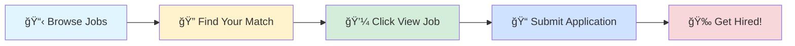

# 🚀 Tech Jobs Board

### Your Gateway to Amazing Career Opportunities

---

## 🎯 Browse by Job Profile

<table>
<tr>
<td align="center" width="25%">

 
<b>1000</b> total positions
</td>
<td align="center" width="25%">

 
<b>1000</b> total positions
</td>
<td align="center" width="25%">

 
<b>1000</b> total positions
</td>
<td align="center" width="25%">

 
<b>1000</b> total positions
</td>
</tr>
</table>

---

## 📊 Data Scientist

> 💼 **1000** positions available

<table>
<thead>
<tr>
<th width="20%">🏢 Company</th>
<th width="35%">💼 Role</th>
<th width="20%">📍 Location</th>
<th width="10%">⏰ Posted</th>
<th width="15%">🔗 Action</th>
</tr>
</thead>
<tbody>
<tr>
<td><a href="https://www.linkedin.com/company/apple">Apple</a></td>
<td>Machine Learning (Knowledge & Content Understanding) Intern - Barcelona, Spain</td>
<td>📍 Barcelona, Catalonia, Spain</td>
<td>1d ago</td>
<td align="center"></td>
</tr>
<tr>
<td><a href="https://de.linkedin.com/company/k%C3%B6rber">Körber</a></td>
<td>Automation Programmer</td>
<td>📍 Fargo, ND</td>
<td>1d ago</td>
<td align="center"></td>
</tr>
<tr>
<td><a href="https://br.linkedin.com/company/bradesco">Banco Bradesco</a></td>
<td>Data Scientist Specialist</td>
<td>📍 Osasco, São Paulo, Brazil</td>
<td>1d ago</td>
<td align="center"></td>
</tr>
<tr>
<td><a href="https://de.linkedin.com/company/soley">Soley</a></td>
<td>Team Lead R&D / Software Development (f/m/d)</td>
<td>📍 Munich, Bavaria, Germany</td>
<td>1d ago</td>
<td align="center"></td>
</tr>
<tr>
<td><a href="https://www.linkedin.com/company/citi">Citi</a></td>
<td>Business Analytics Analyst - SQL,SAS, (4+ Years)</td>
<td>📍 Bangalore</td>
<td>1d ago</td>
<td align="center"></td>
</tr>
<tr>
<td><a href="https://www.linkedin.com/company/innomountain">InnoMountain</a></td>
<td>System Hardware Engineering Internship (R&D 5G System)</td>
<td>📍 United States</td>
<td>1d ago</td>
<td align="center"></td>
</tr>
<tr>
<td><a href="https://www.linkedin.com/company/travelers">Travelers</a></td>
<td>Data Engineer I (Databricks, AWS, Python)</td>
<td>📍 Hartford, CT</td>
<td>1d ago</td>
<td align="center"></td>
</tr>
<tr>
<td><a href="https://www.linkedin.com/company/waymo">Waymo</a></td>
<td>ML Compiler Engineer, Compute</td>
<td>📍 Bangalore</td>
<td>1d ago</td>
<td align="center"></td>
</tr>
<tr>
<td><a href="https://www.ambitionbox.com/overview/immverse-overview">Immverse</a></td>
<td>AI/ML Intern</td>
<td>📍 Nagpur</td>
<td>1d ago</td>
<td align="center"></td>
</tr>
<tr>
<td><a href="https://www.ambitionbox.com/overview/indicus-software-overview">Indicus Software</a></td>
<td>Technical Intern - AI/ML</td>
<td>📍 Pune</td>
<td>1d ago</td>
<td align="center"></td>
</tr>
<tr>
<td><a href="https://www.linkedin.com/company/general-motors">General Motors</a></td>
<td>Data Engineer - Supplier Quality Data Analytics</td>
<td>📍 Warren, MI</td>
<td>1d ago</td>
<td align="center"></td>
</tr>
<tr>
<td><a href="https://www.linkedin.com/company/e-l-f-beauty">E.L.F. BEAUTY</a></td>
<td>Sr. Manager, Supply Chain Data Scientist</td>
<td>📍 Oakland, CA</td>
<td>1d ago</td>
<td align="center"></td>
</tr>
<tr>
<td><a href="https://in.linkedin.com/company/zenith-byte">Zenithbyte</a></td>
<td>Python Developer Intern</td>
<td>📍 India</td>
<td>1d ago</td>
<td align="center"></td>
</tr>
<tr>
<td><a href="https://in.linkedin.com/company/dexter-s-tech">Dexter's Tech</a></td>
<td>Data Science Intern</td>
<td>📍 India</td>
<td>1d ago</td>
<td align="center"></td>
</tr>
<tr>
<td><a href="https://www.linkedin.com/company/nightwing-us">Nightwing</a></td>
<td>Artificial Intelligence Intern - 2026</td>
<td>📍 Sterling, VA</td>
<td>1d ago</td>
<td align="center"></td>
</tr>
<tr>
<td><a href="https://in.linkedin.com/company/webboostsolutionait">WEBBOOST SOLUTION IT SERVICES</a></td>
<td>Data Science Intern</td>
<td>📍 India</td>
<td>1d ago</td>
<td align="center"></td>
</tr>
<tr>
<td><a href="https://ca.linkedin.com/company/food-basics-on">Food Basics</a></td>
<td>Assistant Responsable de Magasin - Région de Kitchener/Waterloo</td>
<td>📍 Kitchener, Ontario, Canada</td>
<td>1d ago</td>
<td align="center"></td>
</tr>
<tr>
<td><a href="https://in.linkedin.com/company/webboostsolutions">WebBoost Solutions by UM</a></td>
<td>Machine Learning Intern</td>
<td>📍 India</td>
<td>1d ago</td>
<td align="center"></td>
</tr>
<tr>
<td><a href="https://br.linkedin.com/company/institutoflexpeak">Instituto FlexPeak</a></td>
<td>Professor de Programação Python e Interfaces Desktop</td>
<td>📍 Brazil</td>
<td>1d ago</td>
<td align="center"></td>
</tr>
<tr>
<td><a href="https://ca.linkedin.com/company/food-basics-on">Food Basics</a></td>
<td>Assistant Responsable de Magasin - Région d'Ottawa</td>
<td>📍 Canada</td>
<td>1d ago</td>
<td align="center"></td>
</tr>
<tr>
<td><a href="https://ca.linkedin.com/company/food-basics-on">Food Basics</a></td>
<td>Assistant Responsable de Magasin - Région de Windsor</td>
<td>📍 Windsor, Ontario, Canada</td>
<td>1d ago</td>
<td align="center"></td>
</tr>
<tr>
<td><a href="https://ca.linkedin.com/company/food-basics-on">Food Basics</a></td>
<td>Assistant Responsable de Magasin - Région Sud-Ouest</td>
<td>📍 Port Elgin, Ontario, Canada</td>
<td>1d ago</td>
<td align="center"></td>
</tr>
<tr>
<td><a href="https://cn.linkedin.com/company/%E5%8C%97%E4%BA%AC%E7%88%B1%E7%A7%91%E8%BF%AA%E9%80%9A%E4%BF%A1%E6%8A%80%E6%9C%AF%E8%82%A1%E4%BB%BD%E6%9C%89%E9%99%90%E5%85%AC%E5%8F%B8">北京爱科迪通信技术股份有限公司</a></td>
<td>Quality Monitoring</td>
<td>📍 Beijing, Beijing, China</td>
<td>1d ago</td>
<td align="center"></td>
</tr>
<tr>
<td><a href="https://cn.linkedin.com/company/troph-inc">时代传浮</a></td>
<td>ML Data Engineer-Remote</td>
<td>📍 Beijing, Beijing, China</td>
<td>1d ago</td>
<td align="center"></td>
</tr>
<tr>
<td><a href="https://at.linkedin.com/company/wuerth-hochenburger">Würth Hochenburger GmbH</a></td>
<td>Technische*r Vertriebsmitarbeiter*in  Innendienst - Fenster & Türen (w/m/d)</td>
<td>📍 Innsbruck, Tyrol, Austria</td>
<td>1d ago</td>
<td align="center"></td>
</tr>
<tr>
<td><a href="https://www.linkedin.com/company/algosec">AlgoSec</a></td>
<td>AlgoNext Automation Developer, India</td>
<td>📍 Delhi</td>
<td>1d ago</td>
<td align="center"></td>
</tr>
<tr>
<td><a href="https://www.linkedin.com/company/algosec">AlgoSec</a></td>
<td>CloudFlow Automation Developer, India</td>
<td>📍 Delhi</td>
<td>1d ago</td>
<td align="center"></td>
</tr>
<tr>
<td><a href="https://www.linkedin.com/company/algosec">AlgoSec</a></td>
<td>Cloud Automation Developer, India</td>
<td>📍 Delhi</td>
<td>1d ago</td>
<td align="center"></td>
</tr>
<tr>
<td><a href="https://www.linkedin.com/company/algosec">AlgoSec</a></td>
<td>Full Stack Automation Developer, India</td>
<td>📍 Delhi</td>
<td>1d ago</td>
<td align="center"></td>
</tr>
<tr>
<td><a href="https://mx.linkedin.com/company/sinnt">SINNT Sistemas de Innovación Tecnológica</a></td>
<td>Servicenow Automation Engineer</td>
<td>📍 Mexico City, Mexico</td>
<td>1d ago</td>
<td align="center"></td>
</tr>
<tr>
<td><a href="https://www.linkedin.com/company/amazon-web-services">Amazon Web Services (AWS)</a></td>
<td>Software Development Engineer II, AWS Events Technology Mobile App Team</td>
<td>📍 Austin, TX</td>
<td>1d ago</td>
<td align="center"></td>
</tr>
<tr>
<td><a href="https://www.linkedin.com/company/baxter-&-woodman">Baxter & Woodman</a></td>
<td>Automation Engineer</td>
<td>📍 Bannockburn, IL</td>
<td>1d ago</td>
<td align="center"></td>
</tr>
<tr>
<td><a href="https://fr.linkedin.com/company/capgemini">Capgemini</a></td>
<td>Associate Data Scientist- Gen AI -ML</td>
<td>📍 Seattle, WA</td>
<td>1d ago</td>
<td align="center"></td>
</tr>
<tr>
<td><a href="https://www.linkedin.com/company/pinterest">Pinterest</a></td>
<td>Machine Learning Intern Fall 2026 (Toronto)</td>
<td>📍 Toronto, Ontario, Canada</td>
<td>1d ago</td>
<td align="center"></td>
</tr>
<tr>
<td><a href="https://www.linkedin.com/company/ann-myers-ea">Ann Myers, EA</a></td>
<td>Consultor Associado de Negócios e R&S</td>
<td>📍 São Paulo, São Paulo, Brazil</td>
<td>1d ago</td>
<td align="center"></td>
</tr>
<tr>
<td><a href="https://www.linkedin.com/company/general-motors">General Motors</a></td>
<td>Product Safety Data Analytics – Data Analyst</td>
<td>📍 Warren, MI</td>
<td>1d ago</td>
<td align="center"></td>
</tr>
<tr>
<td><a href="https://www.linkedin.com/company/t-mobile">T-Mobile</a></td>
<td>Decision Scientist, Marketing Program Analytics</td>
<td>📍 Bellevue, WA</td>
<td>1d ago</td>
<td align="center"></td>
</tr>
<tr>
<td><a href="https://jp.linkedin.com/company/wovenbytoyota">Woven by Toyota</a></td>
<td>Data Scientist, Ego and Ado Decision (Internship)</td>
<td>📍 Ann Arbor, MI</td>
<td>1d ago</td>
<td align="center"></td>
</tr>
<tr>
<td><a href="https://www.linkedin.com/company/pfizer">Pfizer</a></td>
<td>Sr Manager, R&D Product Analyst</td>
<td>📍 Thessaloniki Metropolitan Area</td>
<td>1d ago</td>
<td align="center"></td>
</tr>
<tr>
<td><a href="https://www.linkedin.com/company/warner-bros-discovery">Warner Bros. Discovery</a></td>
<td>Manager, Machine Learning Engineering</td>
<td>📍 San Francisco, CA</td>
<td>1d ago</td>
<td align="center"></td>
</tr>
<tr>
<td><a href="https://www.linkedin.com/company/pfizer">Pfizer</a></td>
<td>Sr Manager, R&D Product Analyst</td>
<td>📍 Tadworth, England, United Kingdom</td>
<td>1d ago</td>
<td align="center"></td>
</tr>
<tr>
<td><a href="https://uk.linkedin.com/company/barclays-bank">Barclays</a></td>
<td>Data Scientist (AI Engineer)</td>
<td>📍 Noida</td>
<td>1d ago</td>
<td align="center"></td>
</tr>
<tr>
<td><a href="https://www.linkedin.com/company/nvidia">NVIDIA</a></td>
<td>Deep Learning Senior Engineer, End-To-End Autonomous Driving</td>
<td>📍 Santa Clara, CA</td>
<td>1d ago</td>
<td align="center"></td>
</tr>
<tr>
<td><a href="https://www.linkedin.com/company/nvidia">NVIDIA</a></td>
<td>Applied Machine Learning Engineer, Circuit Design - New College Grad 2026</td>
<td>📍 Santa Clara, CA</td>
<td>1d ago</td>
<td align="center"></td>
</tr>
<tr>
<td><a href="https://www.linkedin.com/company/nvidia">NVIDIA</a></td>
<td>Deep Learning Senior Engineer, End-To-End Autonomous Driving</td>
<td>📍 Santa Clara, CA</td>
<td>1d ago</td>
<td align="center"></td>
</tr>
<tr>
<td><a href="https://www.linkedin.com/company/lensa">Lensa</a></td>
<td>Internships in Computer Science or Software Engineering</td>
<td>📍 El Segundo, CA</td>
<td>1d ago</td>
<td align="center"></td>
</tr>
<tr>
<td><a href="https://www.linkedin.com/company/nvidia">NVIDIA</a></td>
<td>Applied Machine Learning Engineer, Circuit Design - New College Grad 2026</td>
<td>📍 Santa Clara, CA</td>
<td>1d ago</td>
<td align="center"></td>
</tr>
<tr>
<td><a href="https://www.linkedin.com/company/nvidia">NVIDIA</a></td>
<td>Applied Machine Learning Engineer, Circuit Design - New College Grad 2026</td>
<td>📍 California, United States</td>
<td>1d ago</td>
<td align="center"></td>
</tr>
<tr>
<td><a href="https://www.linkedin.com/company/nvidia">NVIDIA</a></td>
<td>Applied Deep Learning Research Intern, Vision Language Models and Computer Graphics - 2026</td>
<td>📍 Helsinki, Uusimaa, Finland</td>
<td>1d ago</td>
<td align="center"></td>
</tr>
<tr>
<td><a href="https://www.linkedin.com/company/nvidia">NVIDIA</a></td>
<td>Applied Deep Learning Research Intern, Vision Language Models and Computer Graphics - 2026</td>
<td>📍 Helsinki, Uusimaa, Finland</td>
<td>1d ago</td>
<td align="center"></td>
</tr>
<tr>
<td><a href="https://www.linkedin.com/company/mayo-clinic">Mayo Clinic</a></td>
<td>Data Science AI&I Intern – (PhD degree level) - Florida campus</td>
<td>📍 Jacksonville, FL</td>
<td>1d ago</td>
<td align="center"></td>
</tr>
<tr>
<td><a href="https://www.linkedin.com/company/mayo-clinic">Mayo Clinic</a></td>
<td>Data Science AI&I Intern – (MS degree level) Florida campus</td>
<td>📍 Jacksonville, FL</td>
<td>1d ago</td>
<td align="center"></td>
</tr>
<tr>
<td><a href="https://www.linkedin.com/company/lensa">Lensa</a></td>
<td>Health Equity Analytics Internship</td>
<td>📍 United States</td>
<td>1d ago</td>
<td align="center"></td>
</tr>
<tr>
<td><a href="https://www.linkedin.com/company/lensa">Lensa</a></td>
<td>Data Science Clinical AI Intern</td>
<td>📍 United States</td>
<td>1d ago</td>
<td align="center"></td>
</tr>
<tr>
<td><a href="https://www.linkedin.com/company/lensa">Lensa</a></td>
<td>Data Science Intern</td>
<td>📍 Denver, CO</td>
<td>1d ago</td>
<td align="center"></td>
</tr>
<tr>
<td><a href="https://de.linkedin.com/company/aumovio">AUMOVIO</a></td>
<td>Application Automation Engineer Intern [00002]</td>
<td>📍 Singapore, Singapore</td>
<td>1d ago</td>
<td align="center"></td>
</tr>
<tr>
<td><a href="https://www.linkedin.com/company/lensa">Lensa</a></td>
<td>Data Science Summer Intern (Remote & Paid)</td>
<td>📍 Costa Mesa, CA</td>
<td>1d ago</td>
<td align="center"></td>
</tr>
<tr>
<td><a href="https://ca.linkedin.com/company/thomson-reuters">Thomson Reuters</a></td>
<td>Data Science Intern</td>
<td>📍 McLean, VA</td>
<td>1d ago</td>
<td align="center"></td>
</tr>
<tr>
<td><a href="https://www.linkedin.com/company/lensa">Lensa</a></td>
<td>Machine Learning Intern - Summer 2026</td>
<td>📍 New York, NY</td>
<td>1d ago</td>
<td align="center"></td>
</tr>
<tr>
<td><a href="https://jp.linkedin.com/company/wovenbytoyota">Woven by Toyota</a></td>
<td>Machine Learning Engineer, Behavior (Internship)</td>
<td>📍 Palo Alto, CA</td>
<td>1d ago</td>
<td align="center"></td>
</tr>
<tr>
<td><a href="https://in.linkedin.com/company/infosys">Infosys</a></td>
<td>Automation Tester- Cypress Testing Framework</td>
<td>📍 Pune</td>
<td>1d ago</td>
<td align="center"></td>
</tr>
<tr>
<td><a href="https://www.linkedin.com/company/physical-intelligence">Physical Intelligence</a></td>
<td>ML Infra Engineer (Data Systems)</td>
<td>📍 San Francisco, CA</td>
<td>1d ago</td>
<td align="center"></td>
</tr>
<tr>
<td><a href="https://www.linkedin.com/company/guidehouse">Guidehouse</a></td>
<td>Data Scientist</td>
<td>📍 Huntsville, AL</td>
<td>1d ago</td>
<td align="center"></td>
</tr>
<tr>
<td><a href="https://uk.linkedin.com/company/wearehaystack">Haystack</a></td>
<td>AI/ML Engineer</td>
<td>📍 United Kingdom</td>
<td>1d ago</td>
<td align="center"></td>
</tr>
<tr>
<td><a href="https://www.linkedin.com/company/loram">Loram Maintenance of Way, Inc.</a></td>
<td>Engineer III, AI/ML</td>
<td>📍 Hamel, MN</td>
<td>1d ago</td>
<td align="center"></td>
</tr>
<tr>
<td><a href="https://in.linkedin.com/company/infosys">Infosys</a></td>
<td>Python Senior Developer</td>
<td>📍 Bangalore</td>
<td>1d ago</td>
<td align="center"></td>
</tr>
<tr>
<td><a href="https://www.linkedin.com/company/zefr">Zefr</a></td>
<td>Data Scientist</td>
<td>📍 Tel Aviv-Yafo, Tel Aviv District, Israel</td>
<td>1d ago</td>
<td align="center"></td>
</tr>
<tr>
<td><a href="https://ca.linkedin.com/company/bdo-canada">BDO Canada</a></td>
<td>Consultant, Strategy Value Creation & Analytics - New Grad (2026)</td>
<td>📍 Toronto, Ontario, Canada</td>
<td>1d ago</td>
<td align="center"></td>
</tr>
<tr>
<td><a href="https://in.linkedin.com/company/best-job-tool">Best Job Tool</a></td>
<td>Data Scientist</td>
<td>📍 India</td>
<td>1d ago</td>
<td align="center"></td>
</tr>
<tr>
<td><a href="https://www.linkedin.com/company/lightfeather-io">LightFeather</a></td>
<td>Senior GCP Cloud Engineer</td>
<td>📍 Alexandria, VA</td>
<td>1d ago</td>
<td align="center"></td>
</tr>
<tr>
<td><a href="https://www.linkedin.com/company/lightfeather-io">LightFeather</a></td>
<td>Lead GCP Cloud Engineer</td>
<td>📍 Alexandria, VA</td>
<td>1d ago</td>
<td align="center"></td>
</tr>
<tr>
<td><a href="https://in.linkedin.com/company/infosys">Infosys</a></td>
<td>IT Consulting - Q4 (Multiple openings - Azure Devops, WMQ)</td>
<td>📍 Bangalore</td>
<td>1d ago</td>
<td align="center"></td>
</tr>
<tr>
<td><a href="https://www.linkedin.com/company/lightfeather-io">LightFeather</a></td>
<td>GCP Cloud/DevOps Engineer</td>
<td>📍 Alexandria, VA</td>
<td>1d ago</td>
<td align="center"></td>
</tr>
<tr>
<td><a href="https://www.linkedin.com/company/fis">FIS</a></td>
<td>Application Support (SQL) – Rotational Shifts (24/7)</td>
<td>📍 Pune</td>
<td>1d ago</td>
<td align="center"></td>
</tr>
<tr>
<td><a href="https://in.linkedin.com/company/infosys">Infosys</a></td>
<td>Python developer</td>
<td>📍 Hyderabad</td>
<td>1d ago</td>
<td align="center"></td>
</tr>
<tr>
<td><a href="https://www.linkedin.com/company/jpmorganchase">JPMorganChase</a></td>
<td>Applied AI ML Director</td>
<td>📍 Bangalore</td>
<td>1d ago</td>
<td align="center"></td>
</tr>
<tr>
<td><a href="https://in.linkedin.com/company/infosys">Infosys</a></td>
<td>Automation Tester</td>
<td>📍 Bangalore</td>
<td>1d ago</td>
<td align="center"></td>
</tr>
<tr>
<td><a href="https://in.linkedin.com/company/infosys">Infosys</a></td>
<td>Automation - Selenium Java Python_JL5</td>
<td>📍 Bangalore</td>
<td>1d ago</td>
<td align="center"></td>
</tr>
<tr>
<td><a href="https://in.linkedin.com/company/infosys">Infosys</a></td>
<td>Data Scientist</td>
<td>📍 Bangalore</td>
<td>1d ago</td>
<td align="center"></td>
</tr>
<tr>
<td><a href="https://www.linkedin.com/company/sensehq">Sense</a></td>
<td>Analytics Engineering Intern</td>
<td>📍 Bangalore</td>
<td>1d ago</td>
<td align="center"></td>
</tr>
<tr>
<td><a href="https://in.linkedin.com/company/infosys">Infosys</a></td>
<td>AWS Professional</td>
<td>📍 Bangalore</td>
<td>1d ago</td>
<td align="center"></td>
</tr>
<tr>
<td><a href="https://in.linkedin.com/company/infosys">Infosys</a></td>
<td>AWS Devops developer</td>
<td>📍 Bangalore</td>
<td>1d ago</td>
<td align="center"></td>
</tr>
<tr>
<td><a href="https://in.linkedin.com/company/infosys">Infosys</a></td>
<td>Lead Data Scientist</td>
<td>📍 Delhi</td>
<td>1d ago</td>
<td align="center"></td>
</tr>
<tr>
<td><a href="https://in.linkedin.com/company/infosys">Infosys</a></td>
<td>Gen AI/ML Workflow Lead</td>
<td>📍 Bangalore</td>
<td>1d ago</td>
<td align="center"></td>
</tr>
<tr>
<td><a href="https://in.linkedin.com/company/infosys">Infosys</a></td>
<td>NLP- Data Scientist</td>
<td>📍 Pune</td>
<td>1d ago</td>
<td align="center"></td>
</tr>
<tr>
<td><a href="https://www.linkedin.com/company/comcast">Comcast</a></td>
<td>Comcast Data Scientist Co-op</td>
<td>📍 Philadelphia, PA</td>
<td>1d ago</td>
<td align="center"></td>
</tr>
<tr>
<td><a href="https://www.linkedin.com/school/year-up-united/">Year Up United</a></td>
<td>Data Analytics Job Training Program</td>
<td>📍 Pleasant Hill, CA</td>
<td>1d ago</td>
<td align="center"></td>
</tr>
<tr>
<td><a href="https://ca.linkedin.com/company/circle-k">Circle K</a></td>
<td>Data Science Intern, Global Data & Analytics</td>
<td>📍 Scarborough, Ontario, Canada</td>
<td>1d ago</td>
<td align="center"></td>
</tr>
<tr>
<td><a href="https://mx.linkedin.com/company/oxxo">OXXO</a></td>
<td>Practicante Analytics</td>
<td>📍 Monterrey Metropolitan Area</td>
<td>1d ago</td>
<td align="center"></td>
</tr>
<tr>
<td><a href="https://de.linkedin.com/company/grenkegroup">grenke</a></td>
<td>Fachinformatik für Systemintegration (IHK) (m/w/d)</td>
<td>📍 Baden-Baden, Baden-Württemberg, Germany</td>
<td>1d ago</td>
<td align="center"></td>
</tr>
<tr>
<td><a href="https://ie.linkedin.com/company/grenke-leasing-ireland">grenke Ireland</a></td>
<td>Fachinformatik für Systemintegration (IHK) (m/w/d)</td>
<td>📍 Baden-Baden, Baden-Württemberg, Germany</td>
<td>1d ago</td>
<td align="center"></td>
</tr>
<tr>
<td><a href="https://in.linkedin.com/company/hirenza-pvt-ltd">Hirenza</a></td>
<td>Python Developer</td>
<td>📍 India</td>
<td>1d ago</td>
<td align="center"></td>
</tr>
<tr>
<td><a href="https://uk.linkedin.com/company/targetjobsuk">targetjobs UK</a></td>
<td>Junior Java Automation Engineer</td>
<td>📍 Newcastle Upon Tyne, England, United Kingdom</td>
<td>1d ago</td>
<td align="center"></td>
</tr>
<tr>
<td><a href="https://nl.linkedin.com/school/fontys-hogeschool/">Fontys University of Applied Sciences</a></td>
<td>Azure cloud netwerkspecialist</td>
<td>📍 Eindhoven Area</td>
<td>1d ago</td>
<td align="center"></td>
</tr>
<tr>
<td><a href="https://www.linkedin.com/company/futureweitechnologiesinc">Futurewei Technologies, Inc.</a></td>
<td>Intern, ML Algorithms</td>
<td>📍 San Jose, CA</td>
<td>1d ago</td>
<td align="center"></td>
</tr>
<tr>
<td><a href="https://ca.linkedin.com/company/digy4official">Digy4</a></td>
<td>QE Engineer for AI Testing (AI/ML Model Validation)</td>
<td>📍 India</td>
<td>1d ago</td>
<td align="center"></td>
</tr>
<tr>
<td><a href="https://in.linkedin.com/company/hirenza-pvt-ltd">Hirenza</a></td>
<td>SQL Developer</td>
<td>📍 India</td>
<td>1d ago</td>
<td align="center"></td>
</tr>
<tr>
<td><a href="https://www.linkedin.com/company/crest-data">Crest Data</a></td>
<td>Crest Data Systems - Machine Learning Engineer - Computer Vision</td>
<td>📍 Pune</td>
<td>1d ago</td>
<td align="center"></td>
</tr>
<tr>
<td><a href="https://www.linkedin.com/company/infotrellis">InfoTrellis</a></td>
<td>Delivery Lead - Artificial Intelligence</td>
<td>📍 Chennai</td>
<td>1d ago</td>
<td align="center"></td>
</tr>
<tr>
<td><a href="https://www.linkedin.com/company/ckinetics">cKinetics</a></td>
<td>cKinetics - Senior Data Analytics Engineer</td>
<td>📍 Delhi</td>
<td>1d ago</td>
<td align="center"></td>
</tr>
<tr><td colspan="5" align="center"><i>... and 900 more positions</i></td></tr>
</tbody>
</table>

---

## 💼 Business Analyst

> 💼 **1000** positions available

<table>
<thead>
<tr>
<th width="20%">🏢 Company</th>
<th width="35%">💼 Role</th>
<th width="20%">📍 Location</th>
<th width="10%">⏰ Posted</th>
<th width="15%">🔗 Action</th>
</tr>
</thead>
<tbody>
<tr>
<td><a href="https://ca.linkedin.com/company/atbfinancial">ATB Financial</a></td>
<td>ATB 101 - Business Analyst Student</td>
<td>📍 Edmonton, Alberta, Canada</td>
<td>1d ago</td>
<td align="center"></td>
</tr>
<tr>
<td><a href="https://de.linkedin.com/company/k%C3%B6rber">Körber</a></td>
<td>Automation Programmer</td>
<td>📍 Fargo, ND</td>
<td>1d ago</td>
<td align="center"></td>
</tr>
<tr>
<td><a href="https://nl.linkedin.com/company/cisis-goede-doelen-consultancy">CISIS Goede Doelen Consultancy</a></td>
<td>Salesforce Non Profit support consultant (32-40 uur)</td>
<td>📍 Zaandam, North Holland, Netherlands</td>
<td>1d ago</td>
<td align="center"></td>
</tr>
<tr>
<td><a href="https://www.linkedin.com/company/citi">Citi</a></td>
<td>Project Management Lead, VP (Hybrid)</td>
<td>📍 Mumbai</td>
<td>1d ago</td>
<td align="center"></td>
</tr>
<tr>
<td><a href="https://www.linkedin.com/company/citi">Citi</a></td>
<td>Business Analytics Analyst - SQL,SAS, (4+ Years)</td>
<td>📍 Bangalore</td>
<td>1d ago</td>
<td align="center"></td>
</tr>
<tr>
<td><a href="https://www.ambitionbox.com/overview/fourkites-overview">Fourkites</a></td>
<td>Intern - Community & Documentation</td>
<td>📍 Chennai</td>
<td>1d ago</td>
<td align="center"></td>
</tr>
<tr>
<td><a href="https://www.linkedin.com/company/travelers">Travelers</a></td>
<td>Data Engineer I (Databricks, AWS, Python)</td>
<td>📍 Hartford, CT</td>
<td>1d ago</td>
<td align="center"></td>
</tr>
<tr>
<td><a href="https://www.linkedin.com/company/baptisthealth">Baptist Health</a></td>
<td>Revenue Cycle Business Analyst, PAS Workqueue Management, Remote, Baptist Health</td>
<td>📍 Jacksonville, FL</td>
<td>1d ago</td>
<td align="center"></td>
</tr>
<tr>
<td><a href="https://www.linkedin.com/company/talentallyatwork">TalentAlly</a></td>
<td>Business Analyst Intern - Summer 2026</td>
<td>📍 McLean, VA</td>
<td>1d ago</td>
<td align="center"></td>
</tr>
<tr>
<td><a href="https://www.linkedin.com/company/talentallyatwork">TalentAlly</a></td>
<td>Business Analyst Intern - Summer 2026</td>
<td>📍 Plano, TX</td>
<td>1d ago</td>
<td align="center"></td>
</tr>
<tr>
<td><a href="https://www.linkedin.com/company/talentallyatwork">TalentAlly</a></td>
<td>Business Analyst Associate - August 2026</td>
<td>📍 McLean, VA</td>
<td>1d ago</td>
<td align="center"></td>
</tr>
<tr>
<td><a href="https://www.linkedin.com/company/general-motors">General Motors</a></td>
<td>Data Engineer - Supplier Quality Data Analytics</td>
<td>📍 Warren, MI</td>
<td>1d ago</td>
<td align="center"></td>
</tr>
<tr>
<td><a href="https://cn.linkedin.com/company/%E5%AE%89%E5%AF%8C%E5%88%A9%E7%94%B5%E5%AD%90">安富利电子</a></td>
<td>Business Analyst 业务(需求)分析(工程)师</td>
<td>📍 Shenzhen, Guangdong, China</td>
<td>1d ago</td>
<td align="center"></td>
</tr>
<tr>
<td><a href="https://in.linkedin.com/company/zenith-byte">Zenithbyte</a></td>
<td>Python Developer Intern</td>
<td>📍 India</td>
<td>1d ago</td>
<td align="center"></td>
</tr>
<tr>
<td><a href="https://www.linkedin.com/company/conagra-brands">Conagra Brands</a></td>
<td>Senior Technical Business Analyst</td>
<td>📍 Chicago, IL</td>
<td>1d ago</td>
<td align="center"></td>
</tr>
<tr>
<td><a href="https://www.linkedin.com/company/machaon-diagnostics">Machaon Diagnostics</a></td>
<td>Salesforce Database Specialist</td>
<td>📍 Berkeley, CA</td>
<td>1d ago</td>
<td align="center"></td>
</tr>
<tr>
<td><a href="https://br.linkedin.com/company/institutoflexpeak">Instituto FlexPeak</a></td>
<td>Professor de Programação Python e Interfaces Desktop</td>
<td>📍 Brazil</td>
<td>1d ago</td>
<td align="center"></td>
</tr>
<tr>
<td><a href="https://br.linkedin.com/company/innolevels">innolevels</a></td>
<td>Scrum Master</td>
<td>📍 Greater São Paulo Area</td>
<td>1d ago</td>
<td align="center"></td>
</tr>
<tr>
<td><a href="https://br.linkedin.com/company/innolevels">innolevels</a></td>
<td>Agile Master</td>
<td>📍 Greater São Paulo Area</td>
<td>1d ago</td>
<td align="center"></td>
</tr>
<tr>
<td><a href="https://br.linkedin.com/company/innolevels">innolevels</a></td>
<td>Scrum Master</td>
<td>📍 Greater São Paulo Area</td>
<td>1d ago</td>
<td align="center"></td>
</tr>
<tr>
<td><a href="https://www.linkedin.com/company/wright-ryan-construction-inc.">Wright-Ryan Construction, Inc.</a></td>
<td>Project Management Summer Internship - Field Operations</td>
<td>📍 Portland, ME</td>
<td>1d ago</td>
<td align="center"></td>
</tr>
<tr>
<td><a href="https://uk.linkedin.com/company/nottinghamshire-county-council">Nottinghamshire County Council</a></td>
<td>Business Analyst</td>
<td>📍 Nottinghamshire, England, United Kingdom</td>
<td>1d ago</td>
<td align="center"></td>
</tr>
<tr>
<td><a href="https://www.linkedin.com/company/algosec">AlgoSec</a></td>
<td>AlgoNext Automation Developer, India</td>
<td>📍 Delhi</td>
<td>1d ago</td>
<td align="center"></td>
</tr>
<tr>
<td><a href="https://www.linkedin.com/company/algosec">AlgoSec</a></td>
<td>CloudFlow Automation Developer, India</td>
<td>📍 Delhi</td>
<td>1d ago</td>
<td align="center"></td>
</tr>
<tr>
<td><a href="https://www.linkedin.com/company/algosec">AlgoSec</a></td>
<td>Cloud Automation Developer, India</td>
<td>📍 Delhi</td>
<td>1d ago</td>
<td align="center"></td>
</tr>
<tr>
<td><a href="https://www.linkedin.com/company/algosec">AlgoSec</a></td>
<td>Full Stack Automation Developer, India</td>
<td>📍 Delhi</td>
<td>1d ago</td>
<td align="center"></td>
</tr>
<tr>
<td><a href="https://mx.linkedin.com/company/sinnt">SINNT Sistemas de Innovación Tecnológica</a></td>
<td>Servicenow Automation Engineer</td>
<td>📍 Mexico City, Mexico</td>
<td>1d ago</td>
<td align="center"></td>
</tr>
<tr>
<td><a href="https://fr.linkedin.com/company/capgemini">Capgemini</a></td>
<td>Business Analyst</td>
<td>📍 Bergen, Vestland, Norway</td>
<td>1d ago</td>
<td align="center"></td>
</tr>
<tr>
<td><a href="https://www.linkedin.com/company/baxter-&-woodman">Baxter & Woodman</a></td>
<td>Automation Engineer</td>
<td>📍 Bannockburn, IL</td>
<td>1d ago</td>
<td align="center"></td>
</tr>
<tr>
<td><a href="https://www.linkedin.com/company/general-motors">General Motors</a></td>
<td>Product Safety Data Analytics – Data Analyst</td>
<td>📍 Warren, MI</td>
<td>1d ago</td>
<td align="center"></td>
</tr>
<tr>
<td><a href="https://www.linkedin.com/company/t-mobile">T-Mobile</a></td>
<td>Decision Scientist, Marketing Program Analytics</td>
<td>📍 Bellevue, WA</td>
<td>1d ago</td>
<td align="center"></td>
</tr>
<tr>
<td><a href="https://www.linkedin.com/company/lensa">Lensa</a></td>
<td>Internships in Computer Science or Software Engineering</td>
<td>📍 El Segundo, CA</td>
<td>1d ago</td>
<td align="center"></td>
</tr>
<tr>
<td><a href="https://www.linkedin.com/company/lensa">Lensa</a></td>
<td>Business Analyst Intern - Summer 2026</td>
<td>📍 McLean, VA</td>
<td>1d ago</td>
<td align="center"></td>
</tr>
<tr>
<td><a href="https://www.linkedin.com/company/lensa">Lensa</a></td>
<td>Business Analyst Intern - Summer 2026</td>
<td>📍 Plano, TX</td>
<td>1d ago</td>
<td align="center"></td>
</tr>
<tr>
<td><a href="https://www.linkedin.com/company/transunion">TransUnion</a></td>
<td>Financial Services Business Analyst (GCC)</td>
<td>📍 Chennai</td>
<td>1d ago</td>
<td align="center"></td>
</tr>
<tr>
<td><a href="https://www.linkedin.com/company/lensa">Lensa</a></td>
<td>Health Equity Analytics Internship</td>
<td>📍 United States</td>
<td>1d ago</td>
<td align="center"></td>
</tr>
<tr>
<td><a href="https://de.linkedin.com/company/aumovio">AUMOVIO</a></td>
<td>Application Automation Engineer Intern [00002]</td>
<td>📍 Singapore, Singapore</td>
<td>1d ago</td>
<td align="center"></td>
</tr>
<tr>
<td><a href="https://www.linkedin.com/company/lensa">Lensa</a></td>
<td>Business Analyst Intern Remote</td>
<td>📍 Endicott, NY</td>
<td>1d ago</td>
<td align="center"></td>
</tr>
<tr>
<td><a href="https://in.linkedin.com/company/infosys">Infosys</a></td>
<td>Automation Tester- Cypress Testing Framework</td>
<td>📍 Pune</td>
<td>1d ago</td>
<td align="center"></td>
</tr>
<tr>
<td><a href="https://uk.linkedin.com/company/ernstandyoung">EY</a></td>
<td>Manager - Business Consulting Risk - FS - CNS - RISK - FSRM - Mumbai</td>
<td>📍 Mumbai</td>
<td>1d ago</td>
<td align="center"></td>
</tr>
<tr>
<td><a href="https://www.linkedin.com/company/accenturefederalservices">Accenture Federal Services</a></td>
<td>Business Analyst</td>
<td>📍 Washington, DC</td>
<td>1d ago</td>
<td align="center"></td>
</tr>
<tr>
<td><a href="https://in.linkedin.com/company/infosys">Infosys</a></td>
<td>Python Senior Developer</td>
<td>📍 Bangalore</td>
<td>1d ago</td>
<td align="center"></td>
</tr>
<tr>
<td><a href="https://ca.linkedin.com/company/bdo-canada">BDO Canada</a></td>
<td>Consultant, Strategy Value Creation & Analytics - New Grad (2026)</td>
<td>📍 Toronto, Ontario, Canada</td>
<td>1d ago</td>
<td align="center"></td>
</tr>
<tr>
<td><a href="https://www.linkedin.com/company/fis">FIS</a></td>
<td>Application Support (SQL) – Rotational Shifts (24/7)</td>
<td>📍 Pune</td>
<td>1d ago</td>
<td align="center"></td>
</tr>
<tr>
<td><a href="https://in.linkedin.com/company/best-job-tool">Best Job Tool</a></td>
<td>Business Analyst</td>
<td>📍 India</td>
<td>1d ago</td>
<td align="center"></td>
</tr>
<tr>
<td><a href="https://in.linkedin.com/company/infosys">Infosys</a></td>
<td>Python developer</td>
<td>📍 Hyderabad</td>
<td>1d ago</td>
<td align="center"></td>
</tr>
<tr>
<td><a href="https://in.linkedin.com/company/infosys">Infosys</a></td>
<td>Regulatory and Clinical Business Analyst</td>
<td>📍 Hyderabad</td>
<td>1d ago</td>
<td align="center"></td>
</tr>
<tr>
<td><a href="https://in.linkedin.com/company/hirenza-pvt-ltd">Hirenza</a></td>
<td>Business Analyst</td>
<td>📍 India</td>
<td>1d ago</td>
<td align="center"></td>
</tr>
<tr>
<td><a href="https://in.linkedin.com/company/infosys">Infosys</a></td>
<td>Automation Tester</td>
<td>📍 Bangalore</td>
<td>1d ago</td>
<td align="center"></td>
</tr>
<tr>
<td><a href="https://in.linkedin.com/company/infosys">Infosys</a></td>
<td>Automation - Selenium Java Python_JL5</td>
<td>📍 Bangalore</td>
<td>1d ago</td>
<td align="center"></td>
</tr>
<tr>
<td><a href="https://in.linkedin.com/company/infosys">Infosys</a></td>
<td>Consultant - Business Consulting</td>
<td>📍 Bangalore</td>
<td>1d ago</td>
<td align="center"></td>
</tr>
<tr>
<td><a href="https://www.linkedin.com/company/sensehq">Sense</a></td>
<td>Analytics Engineering Intern</td>
<td>📍 Bangalore</td>
<td>1d ago</td>
<td align="center"></td>
</tr>
<tr>
<td><a href="https://www.linkedin.com/school/year-up-united/">Year Up United</a></td>
<td>Data Analytics Job Training Program</td>
<td>📍 Pleasant Hill, CA</td>
<td>1d ago</td>
<td align="center"></td>
</tr>
<tr>
<td><a href="https://www.linkedin.com/school/year-up-united/">Year Up United</a></td>
<td>Project Management Job Training Program</td>
<td>📍 Pleasant Hill, CA</td>
<td>1d ago</td>
<td align="center"></td>
</tr>
<tr>
<td><a href="https://ca.linkedin.com/company/circle-k">Circle K</a></td>
<td>Data Science Intern, Global Data & Analytics</td>
<td>📍 Scarborough, Ontario, Canada</td>
<td>1d ago</td>
<td align="center"></td>
</tr>
<tr>
<td><a href="https://mx.linkedin.com/company/oxxo">OXXO</a></td>
<td>Practicante Analytics</td>
<td>📍 Monterrey Metropolitan Area</td>
<td>1d ago</td>
<td align="center"></td>
</tr>
<tr>
<td><a href="https://in.linkedin.com/company/hirenza-pvt-ltd">Hirenza</a></td>
<td>Python Developer</td>
<td>📍 India</td>
<td>1d ago</td>
<td align="center"></td>
</tr>
<tr>
<td><a href="https://uk.linkedin.com/company/targetjobsuk">targetjobs UK</a></td>
<td>Junior Java Automation Engineer</td>
<td>📍 Newcastle Upon Tyne, England, United Kingdom</td>
<td>1d ago</td>
<td align="center"></td>
</tr>
<tr>
<td><a href="https://in.linkedin.com/company/hirenza-pvt-ltd">Hirenza</a></td>
<td>SQL Developer</td>
<td>📍 India</td>
<td>1d ago</td>
<td align="center"></td>
</tr>
<tr>
<td>Insurity</td>
<td>Business Analyst II (P&C domain)</td>
<td>📍 Noida</td>
<td>NaNy ago</td>
<td align="center"></td>
</tr>
<tr>
<td><a href="https://uk.linkedin.com/company/ernstandyoung">EY</a></td>
<td>Associate Consultant - Business Consulting Risk - CHS - CNS - Risk - Process & Controls - Mumbai</td>
<td>📍 Mumbai</td>
<td>1d ago</td>
<td align="center"></td>
</tr>
<tr>
<td>Ameriprise Financial Services, LLC</td>
<td>Lead Business Analyst</td>
<td>📍 Noida</td>
<td>NaNy ago</td>
<td align="center"></td>
</tr>
<tr>
<td><a href="https://www.linkedin.com/company/ckinetics">cKinetics</a></td>
<td>cKinetics - Senior Data Analytics Engineer</td>
<td>📍 Delhi</td>
<td>1d ago</td>
<td align="center"></td>
</tr>
<tr>
<td><a href="https://sa.linkedin.com/company/geidea">geidea</a></td>
<td>Geidea - Jira Administrator</td>
<td>📍 Bangalore</td>
<td>1d ago</td>
<td align="center"></td>
</tr>
<tr>
<td><a href="https://www.linkedin.com/company/centre-for-social-and-behaviour-change-communication">Centre for Social and Behaviour Change Communication</a></td>
<td>Project Management Internship in Mumbai</td>
<td>📍 Mumbai</td>
<td>1d ago</td>
<td align="center"></td>
</tr>
<tr>
<td><a href="https://in.linkedin.com/company/pinelabs">Pine Labs</a></td>
<td>Pine Labs - Apache Superset Expert - Data Analytics</td>
<td>📍 Noida</td>
<td>1d ago</td>
<td align="center"></td>
</tr>
<tr>
<td><a href="https://sg.linkedin.com/company/qapita">Qapita</a></td>
<td>Strategy & Analytics Internship in Bangalore</td>
<td>📍 Bangalore</td>
<td>1d ago</td>
<td align="center"></td>
</tr>
<tr>
<td><a href="https://in.linkedin.com/company/tristarengg">Tristar Engineering & Chemical Company</a></td>
<td>Python Development Internship in Navi Mumbai</td>
<td>📍 Navi Mumbai, Maharashtra, India</td>
<td>1d ago</td>
<td align="center"></td>
</tr>
<tr>
<td><a href="https://uk.linkedin.com/company/ernstandyoung">EY</a></td>
<td>Associate Consultant - Business Consulting Risk - CHS - CNS - Risk - Process & Controls - Mumbai</td>
<td>📍 Mumbai</td>
<td>1d ago</td>
<td align="center"></td>
</tr>
<tr>
<td><a href="https://in.linkedin.com/company/slikkclub">Slikk</a></td>
<td>Data Analytics Internship in Bangalore</td>
<td>📍 Bangalore</td>
<td>1d ago</td>
<td align="center"></td>
</tr>
<tr>
<td><a href="https://www.linkedin.com/company/infotrellis">InfoTrellis</a></td>
<td>Analytics Engineer - Google Cloud Platform</td>
<td>📍 Hyderabad</td>
<td>1d ago</td>
<td align="center"></td>
</tr>
<tr>
<td><a href="https://de.linkedin.com/company/deutsche-bank">Deutsche Bank</a></td>
<td>Test Automation engineer, AVP</td>
<td>📍 Pune</td>
<td>2d ago</td>
<td align="center"></td>
</tr>
<tr>
<td><a href="https://fr.linkedin.com/company/stationf">STATION F</a></td>
<td>BUSINESS ANALYST INTERN</td>
<td>📍 Paris, Île-de-France, France</td>
<td>1d ago</td>
<td align="center"></td>
</tr>
<tr>
<td><a href="https://nl.linkedin.com/company/asml">ASML</a></td>
<td>Internship - Software Test Automation Engineer</td>
<td>📍 San Diego, CA</td>
<td>1d ago</td>
<td align="center"></td>
</tr>
<tr>
<td><a href="https://www.linkedin.com/company/federal-express-corporation">Federal Express Corporation</a></td>
<td>Analytics Intern - Global Sales Operations</td>
<td>📍 Memphis, TN</td>
<td>1d ago</td>
<td align="center"></td>
</tr>
<tr>
<td><a href="https://uk.linkedin.com/company/targetjobsuk">targetjobs UK</a></td>
<td>Graduate Business Analyst – via the Grayce Graduate Development Programme</td>
<td>📍 Liverpool, England, United Kingdom</td>
<td>1d ago</td>
<td align="center"></td>
</tr>
<tr>
<td>Gartner</td>
<td>Data Scientist (Data Science & Python programming)</td>
<td>📍 Gurugram</td>
<td>NaNy ago</td>
<td align="center"></td>
</tr>
<tr>
<td>Worley</td>
<td>People & Digital Strategy Business Analyst</td>
<td>📍 Mumbai</td>
<td>NaNy ago</td>
<td align="center"></td>
</tr>
<tr>
<td>Quest Global</td>
<td>Senior Software Engineer - Tableau dashboard developer with SQL Database</td>
<td>📍 Chennai</td>
<td>NaNy ago</td>
<td align="center"></td>
</tr>
<tr>
<td>LSEG</td>
<td>Index Data Business Analyst</td>
<td>📍 Bangalore</td>
<td>NaNy ago</td>
<td align="center"></td>
</tr>
<tr>
<td>techolution</td>
<td>Business Process Transformation Manager / Operational Excellence manager</td>
<td>📍 Hyderabad</td>
<td>NaNy ago</td>
<td align="center"></td>
</tr>
<tr>
<td><a href="https://nl.linkedin.com/company/operator1">Operator One</a></td>
<td>Internship | AI Agent Development / Automation (JSON, Java, Coding) - 072025</td>
<td>📍 Almere, Flevoland, Netherlands</td>
<td>2d ago</td>
<td align="center"></td>
</tr>
<tr>
<td><a href="https://www.linkedin.com/company/advanced-datalytics-llc">Advanced Datalytics</a></td>
<td>Salesforce Developer Intern Consultant</td>
<td>📍 United States</td>
<td>2d ago</td>
<td align="center"></td>
</tr>
<tr>
<td>cKinetics</td>
<td>Senior Data Analytics Engineer</td>
<td>📍 Delhi</td>
<td>NaNy ago</td>
<td align="center"></td>
</tr>
<tr>
<td><a href="https://www.linkedin.com/company/bloomberg-industry-group">Bloomberg Industry Group</a></td>
<td>Content Analytics Intern</td>
<td>📍 Arlington, VA</td>
<td>2d ago</td>
<td align="center"></td>
</tr>
<tr>
<td><a href="https://www.linkedin.com/company/bloomberg-industry-group">Bloomberg Industry Group</a></td>
<td>Content Analytics Intern</td>
<td>📍 Arlington, VA</td>
<td>2d ago</td>
<td align="center"></td>
</tr>
<tr>
<td><a href="https://www.linkedin.com/company/bristlecone">Bristlecone</a></td>
<td>Project Manager - SAP-Project Management</td>
<td>📍 Pune</td>
<td>2d ago</td>
<td align="center"></td>
</tr>
<tr>
<td>LinkedIn</td>
<td>Senior Software Engineer, Salesforce</td>
<td>📍 Bangalore</td>
<td>NaNy ago</td>
<td align="center"></td>
</tr>
<tr>
<td><a href="https://www.linkedin.com/company/mastercard">Mastercard</a></td>
<td>Consultant - Performance Analytics</td>
<td>📍 Gurugram</td>
<td>2d ago</td>
<td align="center"></td>
</tr>
<tr>
<td><a href="https://fr.linkedin.com/company/capgemini">Capgemini</a></td>
<td>Python FullStack Developer</td>
<td>📍 Pune</td>
<td>2d ago</td>
<td align="center"></td>
</tr>
<tr>
<td>ICE</td>
<td>Business Analyst with Identity and Access Management</td>
<td>📍 Hyderabad</td>
<td>NaNy ago</td>
<td align="center"></td>
</tr>
<tr>
<td><a href="https://www.linkedin.com/company/boschhomecomfort-us">Bosch Home Comfort USA</a></td>
<td>Sales & Project Management Intern</td>
<td>📍 Plymouth, MI</td>
<td>2d ago</td>
<td align="center"></td>
</tr>
<tr>
<td><a href="https://www.linkedin.com/company/lamb-weston">Lamb Weston</a></td>
<td>Ag Intern, Analytics</td>
<td>📍 Kennewick, WA</td>
<td>2d ago</td>
<td align="center"></td>
</tr>
<tr>
<td>Staples India</td>
<td>Senior Data Engineer - MS SQL Developer</td>
<td>📍 Chennai</td>
<td>NaNy ago</td>
<td align="center"></td>
</tr>
<tr>
<td><a href="https://www.linkedin.com/company/biomarin">BioMarin Pharmaceutical Inc.</a></td>
<td>Intern, Global External Operations Digital Strategy, Insights & Analytics</td>
<td>📍 San Rafael, CA</td>
<td>2d ago</td>
<td align="center"></td>
</tr>
<tr>
<td><a href="https://ar.linkedin.com/company/lambwestonlatam">Lamb Weston LATAM</a></td>
<td>Ag Intern, Analytics</td>
<td>📍 Kennewick, WA</td>
<td>2d ago</td>
<td align="center"></td>
</tr>
<tr>
<td>Healthify</td>
<td>Business Analyst</td>
<td>📍 Bangalore</td>
<td>NaNy ago</td>
<td align="center"></td>
</tr>
<tr>
<td>Zensciences</td>
<td>Project Management Coordinator</td>
<td>📍 Bangalore</td>
<td>NaNy ago</td>
<td align="center"></td>
</tr>
<tr>
<td>Mott MacDonald</td>
<td>Full Stack Developer-Python</td>
<td>📍 Bangalore</td>
<td>NaNy ago</td>
<td align="center"></td>
</tr>
<tr>
<td><a href="https://www.linkedin.com/company/concentrix">Concentrix</a></td>
<td>Sr. QA Tester (automation)</td>
<td>📍 Bangalore</td>
<td>2d ago</td>
<td align="center"></td>
</tr>
<tr><td colspan="5" align="center"><i>... and 900 more positions</i></td></tr>
</tbody>
</table>

---

## 🚀 Product Manager

> 💼 **1000** positions available

<table>
<thead>
<tr>
<th width="20%">🏢 Company</th>
<th width="35%">💼 Role</th>
<th width="20%">📍 Location</th>
<th width="10%">⏰ Posted</th>
<th width="15%">🔗 Action</th>
</tr>
</thead>
<tbody>
<tr>
<td><a href="https://de.linkedin.com/company/k%C3%B6rber">Körber</a></td>
<td>Automation Programmer</td>
<td>📍 Fargo, ND</td>
<td>1d ago</td>
<td align="center"></td>
</tr>
<tr>
<td><a href="https://www.linkedin.com/company/citi">Citi</a></td>
<td>Project Management Lead, VP (Hybrid)</td>
<td>📍 Mumbai</td>
<td>1d ago</td>
<td align="center"></td>
</tr>
<tr>
<td><a href="https://www.linkedin.com/company/citi">Citi</a></td>
<td>Client Management Lead Analyst</td>
<td>📍 New York, NY</td>
<td>1d ago</td>
<td align="center"></td>
</tr>
<tr>
<td><a href="https://www.linkedin.com/company/citi">Citi</a></td>
<td>Business Analytics Analyst - SQL,SAS, (4+ Years)</td>
<td>📍 Bangalore</td>
<td>1d ago</td>
<td align="center"></td>
</tr>
<tr>
<td><a href="https://www.linkedin.com/company/synearfoodsusa">SYNEAR FOODS USA</a></td>
<td>Product Assistant Manager (Bilingual-Mandarin)</td>
<td>📍 Los Angeles, CA</td>
<td>1d ago</td>
<td align="center"></td>
</tr>
<tr>
<td><a href="https://www.ambitionbox.com/overview/cognizant-overview">Cognizant</a></td>
<td>Cognizant Hiring Product Manager</td>
<td>📍 Hyderabad, Bangalore</td>
<td>1d ago</td>
<td align="center"></td>
</tr>
<tr>
<td><a href="https://www.linkedin.com/company/synearfoodsusa">SYNEAR FOODS USA</a></td>
<td>Food Technologist – Product Development (Chinese Mandarin Required)</td>
<td>📍 Los Angeles, CA</td>
<td>1d ago</td>
<td align="center"></td>
</tr>
<tr>
<td><a href="https://www.linkedin.com/company/directv">DIRECTV</a></td>
<td>Director, Product Management</td>
<td>📍 El Segundo, CA</td>
<td>1d ago</td>
<td align="center"></td>
</tr>
<tr>
<td><a href="https://www.linkedin.com/company/directv">DIRECTV</a></td>
<td>Sr. Director – Technical Product Development – Operations Apps</td>
<td>📍 El Segundo, CA</td>
<td>1d ago</td>
<td align="center"></td>
</tr>
<tr>
<td><a href="https://bt.linkedin.com/company/dkbank">DK Bank</a></td>
<td>Group Product Manager – Crypto/ Digital Assets</td>
<td>📍 Greater Kuala Lumpur</td>
<td>1d ago</td>
<td align="center"></td>
</tr>
<tr>
<td><a href="https://www.linkedin.com/company/nvidia">NVIDIA</a></td>
<td>Senior Product Development Engineer - Datacenter</td>
<td>📍 Santa Clara, CA</td>
<td>1d ago</td>
<td align="center"></td>
</tr>
<tr>
<td><a href="https://www.linkedin.com/company/nvidia">NVIDIA</a></td>
<td>Senior Product Development Engineer - Datacenter</td>
<td>📍 Santa Clara, CA</td>
<td>1d ago</td>
<td align="center"></td>
</tr>
<tr>
<td><a href="https://www.linkedin.com/company/citi">Citi</a></td>
<td>Markets Data Quality Management Senior Analyst, Director</td>
<td>📍 Pune</td>
<td>1d ago</td>
<td align="center"></td>
</tr>
<tr>
<td><a href="https://www.linkedin.com/company/baptisthealth">Baptist Health</a></td>
<td>Revenue Cycle Business Analyst, PAS Workqueue Management, Remote, Baptist Health</td>
<td>📍 Jacksonville, FL</td>
<td>1d ago</td>
<td align="center"></td>
</tr>
<tr>
<td><a href="https://www.linkedin.com/company/general-motors">General Motors</a></td>
<td>Data Engineer - Supplier Quality Data Analytics</td>
<td>📍 Warren, MI</td>
<td>1d ago</td>
<td align="center"></td>
</tr>
<tr>
<td><a href="https://pl.linkedin.com/company/metlife-poland">MetLife Poland</a></td>
<td>CMDB & Asset Management Senior Specialist</td>
<td>📍 Warsaw, Mazowieckie, Poland</td>
<td>1d ago</td>
<td align="center"></td>
</tr>
<tr>
<td>Startupwala</td>
<td>Business Management Intern</td>
<td>📍 Pune</td>
<td>1d ago</td>
<td align="center"></td>
</tr>
<tr>
<td><a href="https://uk.linkedin.com/company/cummins-europe">Cummins Europe</a></td>
<td>Apprenticeship - Customer Order Management</td>
<td>📍 Sandwich, England, United Kingdom</td>
<td>1d ago</td>
<td align="center"></td>
</tr>
<tr>
<td><a href="https://www.ambitionbox.com/overview/reward360-overview">Reward360</a></td>
<td>Intern - Product</td>
<td>📍 Bangalore</td>
<td>1d ago</td>
<td align="center"></td>
</tr>
<tr>
<td><a href="https://www.linkedin.com/company/indigo-slate">Indigo Slate</a></td>
<td>Product Designer (Enterprise SaaS)</td>
<td>📍 Charlotte, NC</td>
<td>1d ago</td>
<td align="center"></td>
</tr>
<tr>
<td><a href="https://br.linkedin.com/company/innolevels">innolevels</a></td>
<td>Scrum Master</td>
<td>📍 Greater São Paulo Area</td>
<td>1d ago</td>
<td align="center"></td>
</tr>
<tr>
<td><a href="https://br.linkedin.com/company/innolevels">innolevels</a></td>
<td>Agile Master</td>
<td>📍 Greater São Paulo Area</td>
<td>1d ago</td>
<td align="center"></td>
</tr>
<tr>
<td><a href="https://br.linkedin.com/company/innolevels">innolevels</a></td>
<td>Scrum Master</td>
<td>📍 Greater São Paulo Area</td>
<td>1d ago</td>
<td align="center"></td>
</tr>
<tr>
<td><a href="https://www.linkedin.com/company/wright-ryan-construction-inc.">Wright-Ryan Construction, Inc.</a></td>
<td>Project Management Summer Internship - Field Operations</td>
<td>📍 Portland, ME</td>
<td>1d ago</td>
<td align="center"></td>
</tr>
<tr>
<td><a href="https://www.linkedin.com/company/solvyr">Solvyr</a></td>
<td>Management Program Associate Intern</td>
<td>📍 United States</td>
<td>1d ago</td>
<td align="center"></td>
</tr>
<tr>
<td><a href="https://www.linkedin.com/company/calfirecareers">California Department of Forestry and Fire Protection (CAL FIRE)</a></td>
<td>Performance Management Analyst</td>
<td>📍 San Diego County, CA</td>
<td>1d ago</td>
<td align="center"></td>
</tr>
<tr>
<td><a href="https://www.linkedin.com/company/algosec">AlgoSec</a></td>
<td>AlgoNext Automation Developer, India</td>
<td>📍 Delhi</td>
<td>1d ago</td>
<td align="center"></td>
</tr>
<tr>
<td><a href="https://www.linkedin.com/company/algosec">AlgoSec</a></td>
<td>CloudFlow Automation Developer, India</td>
<td>📍 Delhi</td>
<td>1d ago</td>
<td align="center"></td>
</tr>
<tr>
<td><a href="https://www.linkedin.com/company/algosec">AlgoSec</a></td>
<td>Cloud Automation Developer, India</td>
<td>📍 Delhi</td>
<td>1d ago</td>
<td align="center"></td>
</tr>
<tr>
<td><a href="https://www.linkedin.com/company/algosec">AlgoSec</a></td>
<td>Full Stack Automation Developer, India</td>
<td>📍 Delhi</td>
<td>1d ago</td>
<td align="center"></td>
</tr>
<tr>
<td><a href="https://bt.linkedin.com/company/dkbank">DK Bank</a></td>
<td>Group Product Manager – Payments & FX Lead</td>
<td>📍 Greater Kuala Lumpur</td>
<td>1d ago</td>
<td align="center"></td>
</tr>
<tr>
<td><a href="https://mx.linkedin.com/company/sinnt">SINNT Sistemas de Innovación Tecnológica</a></td>
<td>Servicenow Automation Engineer</td>
<td>📍 Mexico City, Mexico</td>
<td>1d ago</td>
<td align="center"></td>
</tr>
<tr>
<td><a href="https://www.linkedin.com/company/amazon">Amazon</a></td>
<td>FinOps Specialist, Travel and Expense Management, Finance - Accounts Payable, Finance Manager, Accounts Payable</td>
<td>📍 Hyderabad</td>
<td>1d ago</td>
<td align="center"></td>
</tr>
<tr>
<td><a href="https://www.linkedin.com/company/bill">BILL</a></td>
<td>Lead Product Manager - Spend & Expense</td>
<td>📍 Draper, UT</td>
<td>1d ago</td>
<td align="center"></td>
</tr>
<tr>
<td><a href="https://www.linkedin.com/company/baxter-&-woodman">Baxter & Woodman</a></td>
<td>Automation Engineer</td>
<td>📍 Bannockburn, IL</td>
<td>1d ago</td>
<td align="center"></td>
</tr>
<tr>
<td><a href="https://ch.linkedin.com/company/amcor">Amcor</a></td>
<td>Junior Product Development Specialist</td>
<td>📍 Łódź, Łódzkie, Poland</td>
<td>1d ago</td>
<td align="center"></td>
</tr>
<tr>
<td><a href="https://in.linkedin.com/company/rapsap">rapsap superstores</a></td>
<td>Product Manager – Quick Commerce & Customer Experience</td>
<td>📍 Mumbai</td>
<td>1d ago</td>
<td align="center"></td>
</tr>
<tr>
<td><a href="https://www.linkedin.com/company/general-motors">General Motors</a></td>
<td>Product Safety Data Analytics – Data Analyst</td>
<td>📍 Warren, MI</td>
<td>1d ago</td>
<td align="center"></td>
</tr>
<tr>
<td><a href="https://www.linkedin.com/company/t-mobile">T-Mobile</a></td>
<td>Decision Scientist, Marketing Program Analytics</td>
<td>📍 Bellevue, WA</td>
<td>1d ago</td>
<td align="center"></td>
</tr>
<tr>
<td><a href="https://www.linkedin.com/company/hca">HCA Healthcare</a></td>
<td>Consulting Product Analyst</td>
<td>📍 Nashville, TN</td>
<td>1d ago</td>
<td align="center"></td>
</tr>
<tr>
<td><a href="https://www.linkedin.com/company/avis-budget-group">Avis Budget Group</a></td>
<td>Operations Management Trainee</td>
<td>📍 Jamaica, NY</td>
<td>1d ago</td>
<td align="center"></td>
</tr>
<tr>
<td><a href="https://www.linkedin.com/company/pfizer">Pfizer</a></td>
<td>Sr Manager, R&D Product Analyst</td>
<td>📍 Thessaloniki Metropolitan Area</td>
<td>1d ago</td>
<td align="center"></td>
</tr>
<tr>
<td><a href="https://www.linkedin.com/company/pfizer">Pfizer</a></td>
<td>Global Development Product Lead (Executive Director)</td>
<td>📍 Pennsylvania, United States</td>
<td>1d ago</td>
<td align="center"></td>
</tr>
<tr>
<td><a href="https://www.linkedin.com/company/pfizer">Pfizer</a></td>
<td>Sr Manager, R&D Product Analyst</td>
<td>📍 Tadworth, England, United Kingdom</td>
<td>1d ago</td>
<td align="center"></td>
</tr>
<tr>
<td><a href="https://www.linkedin.com/company/avis-budget-group">Avis Budget Group</a></td>
<td>Operations Management Trainee</td>
<td>📍 New York, NY</td>
<td>1d ago</td>
<td align="center"></td>
</tr>
<tr>
<td><a href="https://www.linkedin.com/company/knitwell-group">KnitWell Group</a></td>
<td>E-Commerce Product Manager - Mobile App</td>
<td>📍 Hingham, MA</td>
<td>1d ago</td>
<td align="center"></td>
</tr>
<tr>
<td><a href="https://www.linkedin.com/company/lensa">Lensa</a></td>
<td>Internships in Computer Science or Software Engineering</td>
<td>📍 El Segundo, CA</td>
<td>1d ago</td>
<td align="center"></td>
</tr>
<tr>
<td><a href="https://www.linkedin.com/company/lensa">Lensa</a></td>
<td>Product Designer Intern</td>
<td>📍 San Francisco, CA</td>
<td>1d ago</td>
<td align="center"></td>
</tr>
<tr>
<td><a href="https://www.linkedin.com/company/lensa">Lensa</a></td>
<td>2026 - Internal AI Product Management Intern, Palo Alto</td>
<td>📍 Palo Alto, CA</td>
<td>1d ago</td>
<td align="center"></td>
</tr>
<tr>
<td><a href="https://uk.linkedin.com/company/schroders">Schroders</a></td>
<td>Product Development Analyst</td>
<td>📍 New York, NY</td>
<td>1d ago</td>
<td align="center"></td>
</tr>
<tr>
<td><a href="https://www.linkedin.com/company/lensa">Lensa</a></td>
<td>Health Equity Analytics Internship</td>
<td>📍 United States</td>
<td>1d ago</td>
<td align="center"></td>
</tr>
<tr>
<td><a href="https://www.linkedin.com/company/openai">OpenAI</a></td>
<td>Product Manager, API Model Behavior</td>
<td>📍 San Francisco, CA</td>
<td>1d ago</td>
<td align="center"></td>
</tr>
<tr>
<td><a href="https://de.linkedin.com/company/aumovio">AUMOVIO</a></td>
<td>Application Automation Engineer Intern [00002]</td>
<td>📍 Singapore, Singapore</td>
<td>1d ago</td>
<td align="center"></td>
</tr>
<tr>
<td><a href="https://in.linkedin.com/company/bhanzu">Bhanzu</a></td>
<td>Management Trainee ( Sales, Night Shift , WFO)</td>
<td>📍 Bangalore</td>
<td>1d ago</td>
<td align="center"></td>
</tr>
<tr>
<td><a href="https://www.linkedin.com/company/lensa">Lensa</a></td>
<td>Product Marketing: Internship Opportunities</td>
<td>📍 Redmond, WA</td>
<td>1d ago</td>
<td align="center"></td>
</tr>
<tr>
<td><a href="https://in.linkedin.com/company/infosys">Infosys</a></td>
<td>Automation Tester- Cypress Testing Framework</td>
<td>📍 Pune</td>
<td>1d ago</td>
<td align="center"></td>
</tr>
<tr>
<td><a href="https://www.linkedin.com/company/versemed">Verse Medical</a></td>
<td>Product Manager, RCM</td>
<td>📍 New York, NY</td>
<td>1d ago</td>
<td align="center"></td>
</tr>
<tr>
<td><a href="https://www.linkedin.com/company/noora-health">Noora Health</a></td>
<td>Product Development Engineer (Frontend)</td>
<td>📍 Bangalore</td>
<td>1d ago</td>
<td align="center"></td>
</tr>
<tr>
<td><a href="https://www.linkedin.com/company/noora-health">Noora Health</a></td>
<td>Product Development Engineer (Backend)</td>
<td>📍 Bangalore</td>
<td>1d ago</td>
<td align="center"></td>
</tr>
<tr>
<td><a href="https://ca.linkedin.com/company/bdo-canada">BDO Canada</a></td>
<td>Consultant, Strategy Value Creation & Analytics - New Grad (2026)</td>
<td>📍 Toronto, Ontario, Canada</td>
<td>1d ago</td>
<td align="center"></td>
</tr>
<tr>
<td><a href="https://www.linkedin.com/company/fis">FIS</a></td>
<td>Application Support (SQL) – Rotational Shifts (24/7)</td>
<td>📍 Pune</td>
<td>1d ago</td>
<td align="center"></td>
</tr>
<tr>
<td><a href="https://www.linkedin.com/company/appdirect">AppDirect</a></td>
<td>Software Development Engineer – Product Reliability</td>
<td>📍 Pune</td>
<td>1d ago</td>
<td align="center"></td>
</tr>
<tr>
<td><a href="https://in.linkedin.com/company/infosys">Infosys</a></td>
<td>Automation Tester</td>
<td>📍 Bangalore</td>
<td>1d ago</td>
<td align="center"></td>
</tr>
<tr>
<td><a href="https://in.linkedin.com/company/infosys">Infosys</a></td>
<td>Automation - Selenium Java Python_JL5</td>
<td>📍 Bangalore</td>
<td>1d ago</td>
<td align="center"></td>
</tr>
<tr>
<td><a href="https://www.linkedin.com/company/sensehq">Sense</a></td>
<td>Analytics Engineering Intern</td>
<td>📍 Bangalore</td>
<td>1d ago</td>
<td align="center"></td>
</tr>
<tr>
<td><a href="https://ng.linkedin.com/company/hedreg-group-ltd">Hedreg Group LTD</a></td>
<td>Product Manager</td>
<td>📍 Abuja, Federal Capital Territory, Nigeria</td>
<td>1d ago</td>
<td align="center"></td>
</tr>
<tr>
<td><a href="https://ca.linkedin.com/company/cibc">CIBC</a></td>
<td>Production Support Co-op - Enterprise Technology & Business Management</td>
<td>📍 Toronto, Ontario, Canada</td>
<td>1d ago</td>
<td align="center"></td>
</tr>
<tr>
<td><a href="https://www.linkedin.com/company/lensa">Lensa</a></td>
<td>Product Development Intern</td>
<td>📍 Atlanta, GA</td>
<td>1d ago</td>
<td align="center"></td>
</tr>
<tr>
<td><a href="https://www.linkedin.com/company/lowes-foods">Lowes Foods</a></td>
<td>Internship - Private Label Product Branding and Marketing</td>
<td>📍 Winston-Salem, NC</td>
<td>1d ago</td>
<td align="center"></td>
</tr>
<tr>
<td><a href="https://www.linkedin.com/school/year-up-united/">Year Up United</a></td>
<td>Data Analytics Job Training Program</td>
<td>📍 Pleasant Hill, CA</td>
<td>1d ago</td>
<td align="center"></td>
</tr>
<tr>
<td><a href="https://www.linkedin.com/school/year-up-united/">Year Up United</a></td>
<td>Project Management Job Training Program</td>
<td>📍 Pleasant Hill, CA</td>
<td>1d ago</td>
<td align="center"></td>
</tr>
<tr>
<td><a href="https://ca.linkedin.com/company/circle-k">Circle K</a></td>
<td>Data Science Intern, Global Data & Analytics</td>
<td>📍 Scarborough, Ontario, Canada</td>
<td>1d ago</td>
<td align="center"></td>
</tr>
<tr>
<td><a href="https://www.linkedin.com/company/lensa">Lensa</a></td>
<td>Product Management Internships (Summer 2026, In Person- NYC)</td>
<td>📍 New York, NY</td>
<td>1d ago</td>
<td align="center"></td>
</tr>
<tr>
<td><a href="https://mx.linkedin.com/company/oxxo">OXXO</a></td>
<td>Practicante Analytics</td>
<td>📍 Monterrey Metropolitan Area</td>
<td>1d ago</td>
<td align="center"></td>
</tr>
<tr>
<td><a href="https://uk.linkedin.com/company/targetjobsuk">targetjobs UK</a></td>
<td>Junior Java Automation Engineer</td>
<td>📍 Newcastle Upon Tyne, England, United Kingdom</td>
<td>1d ago</td>
<td align="center"></td>
</tr>
<tr>
<td><a href="https://in.linkedin.com/company/hirenza-pvt-ltd">Hirenza</a></td>
<td>SQL Developer</td>
<td>📍 India</td>
<td>1d ago</td>
<td align="center"></td>
</tr>
<tr>
<td><a href="https://www.linkedin.com/company/capital-one">Capital One</a></td>
<td>Senior Director- Product Management</td>
<td>📍 Bangalore</td>
<td>2d ago</td>
<td align="center"></td>
</tr>
<tr>
<td><a href="https://www.linkedin.com/company/ckinetics">cKinetics</a></td>
<td>cKinetics - Senior Data Analytics Engineer</td>
<td>📍 Delhi</td>
<td>1d ago</td>
<td align="center"></td>
</tr>
<tr>
<td><a href="https://sa.linkedin.com/company/geidea">geidea</a></td>
<td>Geidea - Jira Administrator</td>
<td>📍 Bangalore</td>
<td>1d ago</td>
<td align="center"></td>
</tr>
<tr>
<td><a href="https://www.linkedin.com/company/centre-for-social-and-behaviour-change-communication">Centre for Social and Behaviour Change Communication</a></td>
<td>Project Management Internship in Mumbai</td>
<td>📍 Mumbai</td>
<td>1d ago</td>
<td align="center"></td>
</tr>
<tr>
<td><a href="https://in.linkedin.com/company/pinelabs">Pine Labs</a></td>
<td>Pine Labs - Apache Superset Expert - Data Analytics</td>
<td>📍 Noida</td>
<td>1d ago</td>
<td align="center"></td>
</tr>
<tr>
<td><a href="https://in.linkedin.com/company/patilkaki">PatilKaki</a></td>
<td>Store Management Internship in Mumbai</td>
<td>📍 Mumbai</td>
<td>1d ago</td>
<td align="center"></td>
</tr>
<tr>
<td><a href="https://sg.linkedin.com/company/qapita">Qapita</a></td>
<td>Strategy & Analytics Internship in Bangalore</td>
<td>📍 Bangalore</td>
<td>1d ago</td>
<td align="center"></td>
</tr>
<tr>
<td>Newgen Software</td>
<td>Product Manager</td>
<td>📍 Gurugram</td>
<td>NaNy ago</td>
<td align="center"></td>
</tr>
<tr>
<td><a href="https://in.linkedin.com/company/pereyan-llp">Pereyan LLP</a></td>
<td>Product Designer in Anekal, Bangalore</td>
<td>📍 Bangalore</td>
<td>1d ago</td>
<td align="center"></td>
</tr>
<tr>
<td><a href="https://www.linkedin.com/company/uber-com">Uber</a></td>
<td>Product Operations Manager</td>
<td>📍 Bangalore</td>
<td>1d ago</td>
<td align="center"></td>
</tr>
<tr>
<td><a href="https://in.linkedin.com/company/slikkclub">Slikk</a></td>
<td>Data Analytics Internship in Bangalore</td>
<td>📍 Bangalore</td>
<td>1d ago</td>
<td align="center"></td>
</tr>
<tr>
<td><a href="https://www.linkedin.com/company/infotrellis">InfoTrellis</a></td>
<td>Analytics Engineer - Google Cloud Platform</td>
<td>📍 Hyderabad</td>
<td>1d ago</td>
<td align="center"></td>
</tr>
<tr>
<td><a href="https://de.linkedin.com/company/deutsche-bank">Deutsche Bank</a></td>
<td>Test Automation engineer, AVP</td>
<td>📍 Pune</td>
<td>2d ago</td>
<td align="center"></td>
</tr>
<tr>
<td><a href="https://in.linkedin.com/company/insurancedekho">InsuranceDekho</a></td>
<td>InsuranceDekho - Senior Product Manager - Roadmap &amp; Strategy</td>
<td>📍 Gurugram</td>
<td>1d ago</td>
<td align="center"></td>
</tr>
<tr>
<td><a href="https://nl.linkedin.com/company/asml">ASML</a></td>
<td>Internship - Software Test Automation Engineer</td>
<td>📍 San Diego, CA</td>
<td>1d ago</td>
<td align="center"></td>
</tr>
<tr>
<td><a href="https://www.linkedin.com/company/federal-express-corporation">Federal Express Corporation</a></td>
<td>Analytics Intern - Global Sales Operations</td>
<td>📍 Memphis, TN</td>
<td>1d ago</td>
<td align="center"></td>
</tr>
<tr>
<td>ERM</td>
<td>SAP EHS Product Stewardship Consultant</td>
<td>📍 Bangalore</td>
<td>NaNy ago</td>
<td align="center"></td>
</tr>
<tr>
<td><a href="https://www.linkedin.com/company/hologic">Hologic, Inc.</a></td>
<td>Intern, Global Product Management - Women's Health</td>
<td>📍 San Diego, CA</td>
<td>1d ago</td>
<td align="center"></td>
</tr>
<tr>
<td>Nouryon</td>
<td>Information Management Specialist</td>
<td>📍 Navi Mumbai, India</td>
<td>NaNy ago</td>
<td align="center"></td>
</tr>
<tr>
<td><a href="https://uk.linkedin.com/company/targetjobsuk">targetjobs UK</a></td>
<td>Product Management Trainee - Polar Capital</td>
<td>📍 London, England, United Kingdom</td>
<td>1d ago</td>
<td align="center"></td>
</tr>
<tr>
<td>SSOE Group</td>
<td>Product Support Manager- Deltek (Vantagepoint)</td>
<td>📍 Mumbai</td>
<td>NaNy ago</td>
<td align="center"></td>
</tr>
<tr>
<td><a href="https://in.linkedin.com/company/pereyan-llp">Pereyan LLP</a></td>
<td>Product Designer Internship in Bangalore, Anekal</td>
<td>📍 Anekal, Karnataka, India</td>
<td>1d ago</td>
<td align="center"></td>
</tr>
<tr>
<td><a href="https://in.linkedin.com/company/pereyan-llp">Pereyan LLP</a></td>
<td>Product Designer Internship in Bangalore, Anekal</td>
<td>📍 Bangalore</td>
<td>1d ago</td>
<td align="center"></td>
</tr>
<tr>
<td>Gartner</td>
<td>Product Manager</td>
<td>📍 Gurugram</td>
<td>NaNy ago</td>
<td align="center"></td>
</tr>
<tr><td colspan="5" align="center"><i>... and 900 more positions</i></td></tr>
</tbody>
</table>

---

## 💻 Full Stack Developer

> 💼 **1000** positions available

<table>
<thead>
<tr>
<th width="20%">🏢 Company</th>
<th width="35%">💼 Role</th>
<th width="20%">📍 Location</th>
<th width="10%">⏰ Posted</th>
<th width="15%">🔗 Action</th>
</tr>
</thead>
<tbody>
<tr>
<td>Choice Consultants</td>
<td>Project Manager-Embedded Software & Hardware</td>
<td>📍 Noida</td>
<td>1d ago</td>
<td align="center"></td>
</tr>
<tr>
<td><a href="https://sn.linkedin.com/company/club-des-comptables-du-s%C3%A9n%C3%A9gal">Club Des Comptables et Financiers Du Sénégal</a></td>
<td>Software Engineer</td>
<td>📍 Madrid, Community of Madrid, Spain</td>
<td>1d ago</td>
<td align="center"></td>
</tr>
<tr>
<td><a href="https://ca.linkedin.com/company/atbfinancial">ATB Financial</a></td>
<td>Full Stack Software Developer</td>
<td>📍 Calgary, Alberta, Canada</td>
<td>1d ago</td>
<td align="center"></td>
</tr>
<tr>
<td><a href="https://de.linkedin.com/company/soley">Soley</a></td>
<td>Team Lead R&D / Software Development (f/m/d)</td>
<td>📍 Munich, Bavaria, Germany</td>
<td>1d ago</td>
<td align="center"></td>
</tr>
<tr>
<td><a href="https://www.ambitionbox.com/overview/ramit-solutions-overview">ramitsolutions.in</a></td>
<td>Software engineer/Quality analyst</td>
<td>📍 Pune, Hyderabad, Bangalore</td>
<td>1d ago</td>
<td align="center"></td>
</tr>
<tr>
<td><a href="https://ch.linkedin.com/company/alcon">Alcon</a></td>
<td>Software Intern</td>
<td>📍 Lake Forest, CA</td>
<td>1d ago</td>
<td align="center"></td>
</tr>
<tr>
<td><a href="https://www.linkedin.com/company/citi">Citi</a></td>
<td>Business Analytics Analyst - SQL,SAS, (4+ Years)</td>
<td>📍 Bangalore</td>
<td>1d ago</td>
<td align="center"></td>
</tr>
<tr>
<td><a href="https://www.linkedin.com/company/hp">HP</a></td>
<td>VP, Software Applications</td>
<td>📍 Palo Alto, CA</td>
<td>1d ago</td>
<td align="center"></td>
</tr>
<tr>
<td><a href="https://www.linkedin.com/company/%E6%B7%B1%E5%9C%B3%E5%A5%A5%E5%94%90%E6%99%BA%E8%83%BD%E7%A7%91%E6%8A%80%E6%9C%89%E9%99%90%E5%85%AC%E5%8F%B8">深圳奥唐智能科技有限公司</a></td>
<td>Senior Java Developer</td>
<td>📍 Shenzhen, Guangdong, China</td>
<td>1d ago</td>
<td align="center"></td>
</tr>
<tr>
<td>Myraid</td>
<td>SDE Intern Full Stack</td>
<td>📍 Delhi</td>
<td>1d ago</td>
<td align="center"></td>
</tr>
<tr>
<td><a href="https://www.linkedin.com/company/aig">AIG</a></td>
<td>GenAI Software Engineer (Full Stack)</td>
<td>📍 Dublin, County Dublin, Ireland</td>
<td>1d ago</td>
<td align="center"></td>
</tr>
<tr>
<td><a href="https://sn.linkedin.com/company/club-des-comptables-du-s%C3%A9n%C3%A9gal">Club Des Comptables et Financiers Du Sénégal</a></td>
<td>ENTRY LEVEL SOFTWARE DEVELOPER</td>
<td>📍 Madrid, Community of Madrid, Spain</td>
<td>1d ago</td>
<td align="center"></td>
</tr>
<tr>
<td><a href="https://in.linkedin.com/company/blackhawk-network-india">Blackhawk Network India</a></td>
<td>Staff Software Engineer II</td>
<td>📍 Bangalore</td>
<td>1d ago</td>
<td align="center"></td>
</tr>
<tr>
<td><a href="https://www.linkedin.com/company/griddable-io">griddable.io</a></td>
<td>Senior Software Engineer - AI Productivity Tools & Performance Engineering</td>
<td>📍 San Francisco, CA</td>
<td>1d ago</td>
<td align="center"></td>
</tr>
<tr>
<td><a href="https://in.linkedin.com/company/pinandpaper">PinAndPaper</a></td>
<td>Full Stack Engineer</td>
<td>📍 Gurugram</td>
<td>1d ago</td>
<td align="center"></td>
</tr>
<tr>
<td><a href="https://www.linkedin.com/company/travelers">Travelers</a></td>
<td>Data Engineer I (Databricks, AWS, Python)</td>
<td>📍 Hartford, CT</td>
<td>1d ago</td>
<td align="center"></td>
</tr>
<tr>
<td><a href="https://www.linkedin.com/company/epic1979">Epic</a></td>
<td>Software Developer (Entry Level)</td>
<td>📍 Watertown, SD</td>
<td>1d ago</td>
<td align="center"></td>
</tr>
<tr>
<td><a href="https://www.linkedin.com/company/epic1979">Epic</a></td>
<td>Software Developer (Entry Level)</td>
<td>📍 Mankato, MN</td>
<td>1d ago</td>
<td align="center"></td>
</tr>
<tr>
<td><a href="https://www.linkedin.com/company/epic1979">Epic</a></td>
<td>Software Developer (Entry Level)</td>
<td>📍 Carbondale, IL</td>
<td>1d ago</td>
<td align="center"></td>
</tr>
<tr>
<td><a href="https://www.linkedin.com/company/epic1979">Epic</a></td>
<td>Software Developer (Entry Level)</td>
<td>📍 Lawrence, KS</td>
<td>1d ago</td>
<td align="center"></td>
</tr>
<tr>
<td><a href="https://www.linkedin.com/company/epic1979">Epic</a></td>
<td>Software Developer (Entry Level)</td>
<td>📍 Omaha, NE</td>
<td>1d ago</td>
<td align="center"></td>
</tr>
<tr>
<td><a href="https://www.linkedin.com/company/epic1979">Epic</a></td>
<td>Software Developer (Entry Level)</td>
<td>📍 West Fargo, ND</td>
<td>1d ago</td>
<td align="center"></td>
</tr>
<tr>
<td><a href="https://www.linkedin.com/company/epic1979">Epic</a></td>
<td>Software Developer (Entry Level)</td>
<td>📍 Minot, ND</td>
<td>1d ago</td>
<td align="center"></td>
</tr>
<tr>
<td><a href="https://www.linkedin.com/company/epic1979">Epic</a></td>
<td>Software Developer (Entry Level)</td>
<td>📍 Oklahoma City, OK</td>
<td>1d ago</td>
<td align="center"></td>
</tr>
<tr>
<td><a href="https://www.linkedin.com/company/epic1979">Epic</a></td>
<td>Software Developer (Entry Level)</td>
<td>📍 DeKalb, IL</td>
<td>1d ago</td>
<td align="center"></td>
</tr>
<tr>
<td><a href="https://www.linkedin.com/company/epic1979">Epic</a></td>
<td>Software Developer (Entry Level)</td>
<td>📍 Brookings, SD</td>
<td>1d ago</td>
<td align="center"></td>
</tr>
<tr>
<td><a href="https://www.linkedin.com/company/epic1979">Epic</a></td>
<td>Software Developer (Entry Level)</td>
<td>📍 Fort Wayne, IN</td>
<td>1d ago</td>
<td align="center"></td>
</tr>
<tr>
<td><a href="https://www.linkedin.com/company/epic1979">Epic</a></td>
<td>Software Developer (Entry Level)</td>
<td>📍 Janesville, WI</td>
<td>1d ago</td>
<td align="center"></td>
</tr>
<tr>
<td><a href="https://www.linkedin.com/company/epic1979">Epic</a></td>
<td>Software Developer (Entry Level)</td>
<td>📍 Lansing, MI</td>
<td>1d ago</td>
<td align="center"></td>
</tr>
<tr>
<td><a href="https://www.linkedin.com/company/epic1979">Epic</a></td>
<td>Software Developer (Entry Level)</td>
<td>📍 Carmel, IN</td>
<td>1d ago</td>
<td align="center"></td>
</tr>
<tr>
<td><a href="https://www.linkedin.com/company/epic1979">Epic</a></td>
<td>Software Developer (Entry Level)</td>
<td>📍 Champaign, IL</td>
<td>1d ago</td>
<td align="center"></td>
</tr>
<tr>
<td><a href="https://www.linkedin.com/company/epic1979">Epic</a></td>
<td>Software Developer (Entry Level)</td>
<td>📍 Urbana, IL</td>
<td>1d ago</td>
<td align="center"></td>
</tr>
<tr>
<td><a href="https://www.linkedin.com/company/epic1979">Epic</a></td>
<td>Software Developer (Entry Level)</td>
<td>📍 Minneapolis–Saint Paul, WI</td>
<td>1d ago</td>
<td align="center"></td>
</tr>
<tr>
<td><a href="https://www.linkedin.com/company/epic1979">Epic</a></td>
<td>Software Developer (Entry Level)</td>
<td>📍 Davenport, IA</td>
<td>1d ago</td>
<td align="center"></td>
</tr>
<tr>
<td><a href="https://www.linkedin.com/company/epic1979">Epic</a></td>
<td>Software Developer (Entry Level)</td>
<td>📍 Milwaukee, WI</td>
<td>1d ago</td>
<td align="center"></td>
</tr>
<tr>
<td><a href="https://www.linkedin.com/company/epic1979">Epic</a></td>
<td>Software Developer (Entry Level)</td>
<td>📍 Duluth, MN</td>
<td>1d ago</td>
<td align="center"></td>
</tr>
<tr>
<td><a href="https://www.linkedin.com/company/epic1979">Epic</a></td>
<td>Software Developer (Entry Level)</td>
<td>📍 Kearney, NE</td>
<td>1d ago</td>
<td align="center"></td>
</tr>
<tr>
<td><a href="https://www.linkedin.com/company/epic1979">Epic</a></td>
<td>Software Developer (Entry Level)</td>
<td>📍 Joliet, IL</td>
<td>1d ago</td>
<td align="center"></td>
</tr>
<tr>
<td><a href="https://www.linkedin.com/company/epic1979">Epic</a></td>
<td>Software Developer (Entry Level)</td>
<td>📍 Springdale, AR</td>
<td>1d ago</td>
<td align="center"></td>
</tr>
<tr>
<td><a href="https://www.linkedin.com/company/epic1979">Epic</a></td>
<td>Software Developer (Entry Level)</td>
<td>📍 Lawton, OK</td>
<td>1d ago</td>
<td align="center"></td>
</tr>
<tr>
<td><a href="https://www.linkedin.com/company/epic1979">Epic</a></td>
<td>Software Developer (Entry Level)</td>
<td>📍 Platteville, WI</td>
<td>1d ago</td>
<td align="center"></td>
</tr>
<tr>
<td><a href="https://www.linkedin.com/company/epic1979">Epic</a></td>
<td>Software Developer (Entry Level)</td>
<td>📍 Norman, OK</td>
<td>1d ago</td>
<td align="center"></td>
</tr>
<tr>
<td><a href="https://www.linkedin.com/company/epic1979">Epic</a></td>
<td>Software Developer (Entry Level)</td>
<td>📍 Kenosha, WI</td>
<td>1d ago</td>
<td align="center"></td>
</tr>
<tr>
<td><a href="https://www.linkedin.com/company/epic1979">Epic</a></td>
<td>Software Developer (Entry Level)</td>
<td>📍 Bismarck, ND</td>
<td>1d ago</td>
<td align="center"></td>
</tr>
<tr>
<td><a href="https://www.linkedin.com/company/epic1979">Epic</a></td>
<td>Software Developer (Entry Level)</td>
<td>📍 Bellevue, NE</td>
<td>1d ago</td>
<td align="center"></td>
</tr>
<tr>
<td><a href="https://ca.linkedin.com/company/rbc">RBC</a></td>
<td>Software Quality Engineer</td>
<td>📍 Toronto, Ontario, Canada</td>
<td>1d ago</td>
<td align="center"></td>
</tr>
<tr>
<td><a href="https://ca.linkedin.com/company/rbc">RBC</a></td>
<td>Software Quality Engineer</td>
<td>📍 Toronto, Ontario, Canada</td>
<td>1d ago</td>
<td align="center"></td>
</tr>
<tr>
<td><a href="https://www.linkedin.com/company/nvidia">NVIDIA</a></td>
<td>Software Engineer, DL Libraries Infrastructure - New College Grad 2026</td>
<td>📍 Boulder, CO</td>
<td>1d ago</td>
<td align="center"></td>
</tr>
<tr>
<td><a href="https://www.linkedin.com/company/nvidia">NVIDIA</a></td>
<td>Senior System Software Engineer, Enterprise MODS</td>
<td>📍 Santa Clara, CA</td>
<td>1d ago</td>
<td align="center"></td>
</tr>
<tr>
<td><a href="https://www.linkedin.com/company/nvidia">NVIDIA</a></td>
<td>Software Engineer, DL Libraries Infrastructure - New College Grad 2026</td>
<td>📍 Santa Clara, CA</td>
<td>1d ago</td>
<td align="center"></td>
</tr>
<tr>
<td><a href="https://www.linkedin.com/company/nvidia">NVIDIA</a></td>
<td>Software Engineer, DL Libraries Infrastructure - New College Grad 2026</td>
<td>📍 Redmond, WA</td>
<td>1d ago</td>
<td align="center"></td>
</tr>
<tr>
<td><a href="https://www.linkedin.com/company/nvidia">NVIDIA</a></td>
<td>Systems Software Engineer - Tegra</td>
<td>📍 Santa Clara, CA</td>
<td>1d ago</td>
<td align="center"></td>
</tr>
<tr>
<td><a href="https://www.linkedin.com/company/nvidia">NVIDIA</a></td>
<td>Systems Software Engineer - Tegra</td>
<td>📍 Santa Clara, CA</td>
<td>1d ago</td>
<td align="center"></td>
</tr>
<tr>
<td><a href="https://www.linkedin.com/company/nvidia">NVIDIA</a></td>
<td>Frontend Web Applications Software Engineer</td>
<td>📍 Santa Clara, CA</td>
<td>1d ago</td>
<td align="center"></td>
</tr>
<tr>
<td><a href="https://www.linkedin.com/company/nvidia">NVIDIA</a></td>
<td>Software Engineer, DL Libraries Infrastructure - New College Grad 2026</td>
<td>📍 Austin, TX</td>
<td>1d ago</td>
<td align="center"></td>
</tr>
<tr>
<td><a href="https://www.linkedin.com/company/nvidia">NVIDIA</a></td>
<td>Software Engineer, DL Libraries Infrastructure - New College Grad 2026</td>
<td>📍 Santa Clara, CA</td>
<td>1d ago</td>
<td align="center"></td>
</tr>
<tr>
<td><a href="https://www.linkedin.com/company/nvidia">NVIDIA</a></td>
<td>Director, BioNemo Software</td>
<td>📍 Santa Clara, CA</td>
<td>1d ago</td>
<td align="center"></td>
</tr>
<tr>
<td><a href="https://www.linkedin.com/company/nvidia">NVIDIA</a></td>
<td>Director, BioNemo Software</td>
<td>📍 Santa Clara, CA</td>
<td>1d ago</td>
<td align="center"></td>
</tr>
<tr>
<td><a href="https://in.linkedin.com/company/tekwissenindia">TekWissen India</a></td>
<td>Software Engineer (III) - Core Engineer III</td>
<td>📍 Chennai</td>
<td>1d ago</td>
<td align="center"></td>
</tr>
<tr>
<td><a href="https://in.linkedin.com/company/tekwissenindia">TekWissen India</a></td>
<td>Software Engineer (I) - Established Engineer III</td>
<td>📍 Chennai</td>
<td>1d ago</td>
<td align="center"></td>
</tr>
<tr>
<td><a href="https://www.linkedin.com/company/athenahealth">athenahealth</a></td>
<td>Software Engineer – Clinicals, Services and Task</td>
<td>📍 Boston, MA</td>
<td>1d ago</td>
<td align="center"></td>
</tr>
<tr>
<td><a href="https://www.linkedin.com/company/stablekernel">Stable Kernel</a></td>
<td>Principal Software Engineer</td>
<td>📍 Atlanta, GA</td>
<td>1d ago</td>
<td align="center"></td>
</tr>
<tr>
<td><a href="https://cn.linkedin.com/company/%E5%8C%97%E4%BA%AC%E6%8E%8C%E4%B8%8A%E5%85%88%E6%9C%BA%E7%BD%91%E7%BB%9C%E7%A7%91%E6%8A%80%E6%9C%89%E9%99%90%E5%85%AC%E5%8F%B8">北京掌上先机网络科技有限公司</a></td>
<td>Java开发-校招【硕士北京落户】(J15117)</td>
<td>📍 Beijing, Beijing, China</td>
<td>1d ago</td>
<td align="center"></td>
</tr>
<tr>
<td><a href="https://cn.linkedin.com/company/%E5%8C%97%E4%BA%AC%E6%8E%8C%E4%B8%8A%E5%85%88%E6%9C%BA%E7%BD%91%E7%BB%9C%E7%A7%91%E6%8A%80%E6%9C%89%E9%99%90%E5%85%AC%E5%8F%B8">北京掌上先机网络科技有限公司</a></td>
<td>Java-实习</td>
<td>📍 Beijing, Beijing, China</td>
<td>1d ago</td>
<td align="center"></td>
</tr>
<tr>
<td><a href="https://ec.linkedin.com/company/ioet">ioet</a></td>
<td>Software Engineer</td>
<td>📍 Bolivia</td>
<td>1d ago</td>
<td align="center"></td>
</tr>
<tr>
<td><a href="https://br.linkedin.com/company/g4fbr">G4F</a></td>
<td>ENGENHEIRO DE SOFTWARE</td>
<td>📍 Florianópolis, Santa Catarina, Brazil</td>
<td>1d ago</td>
<td align="center"></td>
</tr>
<tr>
<td><a href="https://www.linkedin.com/company/general-motors">General Motors</a></td>
<td>Senior Software Engineer-Aero Platform (GM Motorsports)</td>
<td>📍 Austin, TX</td>
<td>1d ago</td>
<td align="center"></td>
</tr>
<tr>
<td><a href="https://www.linkedin.com/company/general-motors">General Motors</a></td>
<td>Senior Software Engineer-Aero Platform (GM Motorsports)</td>
<td>📍 Concord, NC</td>
<td>1d ago</td>
<td align="center"></td>
</tr>
<tr>
<td><a href="https://de.linkedin.com/company/synfis">synfis Service GmbH</a></td>
<td>Junior Software Entwickler (m/w/d)</td>
<td>📍 Isernhagen Farster Bauerschaft, Lower Saxony, Germany</td>
<td>1d ago</td>
<td align="center"></td>
</tr>
<tr>
<td><a href="https://www.linkedin.com/company/%E5%B1%B1%E4%B8%9C%E8%B5%9B%E8%AF%BA%E8%8F%B2%E7%94%B5%E5%AD%90%E7%A7%91%E6%8A%80%E6%9C%89%E9%99%90%E5%85%AC%E5%8F%B8">山东赛诺菲电子科技有限公司</a></td>
<td>高级java后台开发工程师</td>
<td>📍 Chengdu, Sichuan, China</td>
<td>1d ago</td>
<td align="center"></td>
</tr>
<tr>
<td><a href="https://www.linkedin.com/company/xdr-radiology">XDR Radiology</a></td>
<td>Programming / Software Development Intern</td>
<td>📍 Los Angeles, CA</td>
<td>1d ago</td>
<td align="center"></td>
</tr>
<tr>
<td><a href="https://id.linkedin.com/company/docotelgroup">Docotel Group</a></td>
<td>Full Stack Developer</td>
<td>📍 St Louis, MO</td>
<td>1d ago</td>
<td align="center"></td>
</tr>
<tr>
<td><a href="https://br.linkedin.com/company/institutoflexpeak">Instituto FlexPeak</a></td>
<td>Instrutor de Desenvolvimento de Software e IA</td>
<td>📍 Brazil</td>
<td>1d ago</td>
<td align="center"></td>
</tr>
<tr>
<td><a href="https://in.linkedin.com/company/zenith-byte">Zenithbyte</a></td>
<td>Python Developer Intern</td>
<td>📍 India</td>
<td>1d ago</td>
<td align="center"></td>
</tr>
<tr>
<td><a href="https://www.linkedin.com/company/caci-international-inc">CACI International Inc</a></td>
<td>Senior Full Stack Developer</td>
<td>📍 State Farm, VA</td>
<td>1d ago</td>
<td align="center"></td>
</tr>
<tr>
<td><a href="https://www.linkedin.com/company/caci-international-inc">CACI International Inc</a></td>
<td>Junior Software Developer</td>
<td>📍 National Harbor, MD</td>
<td>1d ago</td>
<td align="center"></td>
</tr>
<tr>
<td><a href="https://br.linkedin.com/company/itau">Itaú Unibanco</a></td>
<td>Engenharia de Software Jr</td>
<td>📍 São Paulo, São Paulo, Brazil</td>
<td>1d ago</td>
<td align="center"></td>
</tr>
<tr>
<td><a href="https://in.linkedin.com/company/unified-mentor-jobs">Unified Mentor Jobs</a></td>
<td>Full Stack Web Developer Intern</td>
<td>📍 India</td>
<td>1d ago</td>
<td align="center"></td>
</tr>
<tr>
<td><a href="https://br.linkedin.com/company/institutoflexpeak">Instituto FlexPeak</a></td>
<td>Professor de Programação Python e Interfaces Desktop</td>
<td>📍 Brazil</td>
<td>1d ago</td>
<td align="center"></td>
</tr>
<tr>
<td><a href="https://br.linkedin.com/company/innolevels">innolevels</a></td>
<td>Agile Master</td>
<td>📍 Greater São Paulo Area</td>
<td>1d ago</td>
<td align="center"></td>
</tr>
<tr>
<td><a href="https://ca.linkedin.com/company/cineplex-entertainment">Cineplex</a></td>
<td>Senior Fullstack Software Developer</td>
<td>📍 Toronto, Ontario, Canada</td>
<td>1d ago</td>
<td align="center"></td>
</tr>
<tr>
<td><a href="https://br.linkedin.com/company/innolevels">innolevels</a></td>
<td>Líder Técnico Node.js</td>
<td>📍 Greater São Paulo Area</td>
<td>1d ago</td>
<td align="center"></td>
</tr>
<tr>
<td><a href="https://www.linkedin.com/company/first-citizens-bank">First Citizens Bank</a></td>
<td>Senior Software Engineer - Java Full Stack (remote)</td>
<td>📍 Texas, United States</td>
<td>1d ago</td>
<td align="center"></td>
</tr>
<tr>
<td><a href="https://br.linkedin.com/company/ibrowse-consultoria-e-inform-tica">Ibrowse Consultoria e Informática</a></td>
<td>Analista de Desenvolvimento Front End Presencial Recife</td>
<td>📍 Recife, Pernambuco, Brazil</td>
<td>1d ago</td>
<td align="center"></td>
</tr>
<tr>
<td><a href="https://www.linkedin.com/company/first-citizens-bank">First Citizens Bank</a></td>
<td>Senior Software Engineer - Java (Remote)</td>
<td>📍 Nebraska, United States</td>
<td>1d ago</td>
<td align="center"></td>
</tr>
<tr>
<td><a href="https://www.linkedin.com/company/first-citizens-bank">First Citizens Bank</a></td>
<td>Senior Software Engineer - Java (Remote)</td>
<td>📍 Raleigh, NC</td>
<td>1d ago</td>
<td align="center"></td>
</tr>
<tr>
<td><a href="https://www.linkedin.com/company/first-citizens-bank">First Citizens Bank</a></td>
<td>Senior Software Engineer - Java (Remote)</td>
<td>📍 Texas, United States</td>
<td>1d ago</td>
<td align="center"></td>
</tr>
<tr>
<td><a href="https://www.linkedin.com/company/first-citizens-bank">First Citizens Bank</a></td>
<td>Senior Software Engineer - Java Full Stack (remote)</td>
<td>📍 Florida, United States</td>
<td>1d ago</td>
<td align="center"></td>
</tr>
<tr>
<td><a href="https://www.linkedin.com/company/first-citizens-bank">First Citizens Bank</a></td>
<td>Senior Software Engineer - Java (Remote)</td>
<td>📍 Arizona, United States</td>
<td>1d ago</td>
<td align="center"></td>
</tr>
<tr>
<td><a href="https://www.linkedin.com/company/first-citizens-bank">First Citizens Bank</a></td>
<td>Senior Software Engineer - Java Full Stack (remote)</td>
<td>📍 Raleigh, NC</td>
<td>1d ago</td>
<td align="center"></td>
</tr>
<tr>
<td><a href="https://www.linkedin.com/company/algosec">AlgoSec</a></td>
<td>Software Developer Student, Israel</td>
<td>📍 Petah Tikva, Center District, Israel</td>
<td>1d ago</td>
<td align="center"></td>
</tr>
<tr>
<td><a href="https://www.linkedin.com/company/algosec">AlgoSec</a></td>
<td>Software Developer, India</td>
<td>📍 Delhi</td>
<td>1d ago</td>
<td align="center"></td>
</tr>
<tr>
<td><a href="https://www.linkedin.com/company/algosec">AlgoSec</a></td>
<td>Software Developer (Devices), India</td>
<td>📍 Delhi</td>
<td>1d ago</td>
<td align="center"></td>
</tr>
<tr>
<td><a href="https://www.linkedin.com/company/algosec">AlgoSec</a></td>
<td>Full Stack Automation Developer, India</td>
<td>📍 Delhi</td>
<td>1d ago</td>
<td align="center"></td>
</tr>
<tr>
<td><a href="https://www.linkedin.com/company/amazon">Amazon</a></td>
<td>Senior Software Development Engineer, Prime Air</td>
<td>📍 Seattle, WA</td>
<td>1d ago</td>
<td align="center"></td>
</tr>
<tr>
<td><a href="https://www.ambitionbox.com/overview/cognizant-overview">Cognizant</a></td>
<td>Cognizant Hiring React UI Developer</td>
<td>📍 Hyderabad, Bangalore</td>
<td>1d ago</td>
<td align="center"></td>
</tr>
<tr>
<td><a href="https://www.linkedin.com/company/amazon-web-services">Amazon Web Services (AWS)</a></td>
<td>Software Development Engineer II, AWS Events Technology Mobile App Team</td>
<td>📍 Austin, TX</td>
<td>1d ago</td>
<td align="center"></td>
</tr>
<tr>
<td><a href="https://www.linkedin.com/company/knorr-brake-company">Knorr Brake Company</a></td>
<td>Software Engineer 1</td>
<td>📍 Westminster, MD</td>
<td>1d ago</td>
<td align="center"></td>
</tr>
<tr>
<td><a href="https://www.linkedin.com/company/epic1979">Epic</a></td>
<td>Software Developer (Entry Level)</td>
<td>📍 Minneapolis, MN</td>
<td>1d ago</td>
<td align="center"></td>
</tr>
<tr>
<td><a href="https://www.linkedin.com/company/epic1979">Epic</a></td>
<td>Software Developer (Entry Level)</td>
<td>📍 Detroit, MI</td>
<td>1d ago</td>
<td align="center"></td>
</tr>
<tr><td colspan="5" align="center"><i>... and 900 more positions</i></td></tr>
</tbody>
</table>

---

## 📈 Statistics

| Metric | Count |
|:-------|------:|
| 📊 Total Listings | **4000** |
| 🌍 Remote Jobs | **32** |
| 📊 Data Scientist | **1000** |
| 💼 Business Analyst | **1000** |
| 🚀 Product Manager | **1000** |
| 💻 Full Stack Developer | **1000** |

---

## 🎯 How to Apply?

### Steps to Apply:
1. 🔍 **Browse** through the positions above
2. 💼 **Click** the "View Job" button on your preferred role
3. 📝 **Complete** the application on our website
4. ✉️ **Wait** for us to review your application
5. 🎉 **Celebrate** when you get the interview call!

---

## 🔔 Stay Updated

### ⭐ Star this repository to receive updates on new job postings!

**This job board is automatically updated every 6 hours**

---

## 💬 Contributing

Found a broken link or want to add a job posting? Feel free to:
- 🐛 Open an issue
- 🔧 Submit a pull request
- 📧 Contact us directly

---

## 🙏 Stay Connected

---

### 📅 Last Updated

**Sunday, January 25, 2026 at 02:22 AM UTC**

---

💼 Jobs aggregated from multiple sources • ⚡ Auto-updated every 6 hours • 🤖 Powered by GitHub Actions

**Made with ❤️ for the Tech Community**

⬆️ [Back to Top](#-tech-jobs-board) ⬆️

