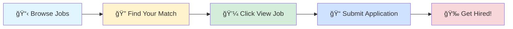

# 🚀 Tech Jobs Board

### Your Gateway to Amazing Career Opportunities

---

## 🎯 Browse by Job Profile

<table>
<tr>
<td align="center" width="25%">

 
<b>1000</b> total positions
</td>
<td align="center" width="25%">

 
<b>1000</b> total positions
</td>
<td align="center" width="25%">

 
<b>1000</b> total positions
</td>
<td align="center" width="25%">

 
<b>1000</b> total positions
</td>
</tr>
</table>

---

## 📊 Data Scientist

> 💼 **1000** positions available

<table>
<thead>
<tr>
<th width="20%">🏢 Company</th>
<th width="35%">💼 Role</th>
<th width="20%">📍 Location</th>
<th width="10%">⏰ Posted</th>
<th width="15%">🔗 Action</th>
</tr>
</thead>
<tbody>
<tr>
<td><a href="https://in.linkedin.com/company/webboostsolutionait">WEBBOOST SOLUTION IT SERVICES</a></td>
<td>Python Developer Intern</td>
<td>📍 India</td>
<td>1d ago</td>
<td align="center"></td>
</tr>
<tr>
<td><a href="https://www.linkedin.com/company/um-it-solutions">UM IT Solutions</a></td>
<td>Machine Learning Intern</td>
<td>📍 India</td>
<td>1d ago</td>
<td align="center"></td>
</tr>
<tr>
<td><a href="https://www.linkedin.com/company/gehealthcare">GE HealthCare</a></td>
<td>Data Science Intern</td>
<td></td>
<td>1d ago</td>
<td align="center"></td>
</tr>
<tr>
<td><a href="https://uk.linkedin.com/company/hitachirail">Hitachi Rail</a></td>
<td>Intern – Automation Engineering</td>
<td></td>
<td>1d ago</td>
<td align="center"></td>
</tr>
<tr>
<td><a href="https://ma.linkedin.com/company/calliope-groupe-officiel">Calliope Group</a></td>
<td>Technicien réseau informatique (Stage pré-embauche)</td>
<td></td>
<td>1d ago</td>
<td align="center"></td>
</tr>
<tr>
<td><a href="https://uk.linkedin.com/company/hitachirail">Hitachi Rail</a></td>
<td>Intern – Automation Engineering</td>
<td></td>
<td>1d ago</td>
<td align="center"></td>
</tr>
<tr>
<td><a href="https://uk.linkedin.com/company/revolut">Revolut</a></td>
<td>Rev-celerator Graduate Programme 2026: Data Scientist and Analyst</td>
<td></td>
<td>1d ago</td>
<td align="center"></td>
</tr>
<tr>
<td><a href="https://de.linkedin.com/company/optadata">opta data</a></td>
<td>Ausbildung zum Fachinformatiker für Systemintegration (w/m/x)</td>
<td></td>
<td>1d ago</td>
<td align="center"></td>
</tr>
<tr>
<td><a href="https://www.linkedin.com/company/duolingoschools">Duolingo for Schools</a></td>
<td>Data Scientist Intern (PhD or Masters)</td>
<td></td>
<td>1d ago</td>
<td align="center"></td>
</tr>
<tr>
<td><a href="https://de.linkedin.com/company/volkswagen-financial-services">Volkswagen Financial Services</a></td>
<td>Werkstudent (m/w/d) für Jira & Confluence</td>
<td></td>
<td>1d ago</td>
<td align="center"></td>
</tr>
<tr>
<td><a href="https://in.linkedin.com/company/talrn">Talrn</a></td>
<td>Remote ML Intern</td>
<td>📍 Thane</td>
<td>1d ago</td>
<td align="center"></td>
</tr>
<tr>
<td><a href="https://www.linkedin.com/company/schonfeld-group">Schonfeld</a></td>
<td>2026 Business Analytics Summer Intern</td>
<td></td>
<td>1d ago</td>
<td align="center"></td>
</tr>
<tr>
<td><a href="https://th.linkedin.com/company/blendata">Blendata</a></td>
<td>Data and Analytics Engineer (Interns)</td>
<td></td>
<td>1d ago</td>
<td align="center"></td>
</tr>
<tr>
<td><a href="https://in.linkedin.com/company/talrn">Talrn</a></td>
<td>Remote ML Intern</td>
<td>📍 Thane</td>
<td>1d ago</td>
<td align="center"></td>
</tr>
<tr>
<td><a href="https://th.linkedin.com/company/blendata">Blendata</a></td>
<td>Data Scientist (Interns)</td>
<td></td>
<td>1d ago</td>
<td align="center"></td>
</tr>
<tr>
<td><a href="https://www.linkedin.com/company/coalitioninc">Coalition, Inc.</a></td>
<td>Senior Data Scientist</td>
<td></td>
<td>1d ago</td>
<td align="center"></td>
</tr>
<tr>
<td><a href="https://be.linkedin.com/company/clovr-recruitment">Clovr</a></td>
<td>Python Engineer - machine learning, computer vision,..</td>
<td></td>
<td>1d ago</td>
<td align="center"></td>
</tr>
<tr>
<td><a href="https://be.linkedin.com/company/clovr-recruitment">Clovr</a></td>
<td>Artificial Intelligence Engineer</td>
<td></td>
<td>1d ago</td>
<td align="center"></td>
</tr>
<tr>
<td><a href="https://www.linkedin.com/company/spreedly">Spreedly</a></td>
<td>Analytics Engineer</td>
<td></td>
<td>1d ago</td>
<td align="center"></td>
</tr>
<tr>
<td><a href="https://www.linkedin.com/company/waymo">Waymo</a></td>
<td>Data Scientist</td>
<td></td>
<td>1d ago</td>
<td align="center"></td>
</tr>
<tr>
<td><a href="https://www.linkedin.com/company/ibm">IBM</a></td>
<td>Data Scientist Intern (16 months, September 2026)</td>
<td></td>
<td>1d ago</td>
<td align="center"></td>
</tr>
<tr>
<td><a href="https://in.linkedin.com/company/talrn">Talrn</a></td>
<td>AI\ML INTERNSHIP</td>
<td>📍 India</td>
<td>1d ago</td>
<td align="center"></td>
</tr>
<tr>
<td><a href="https://in.linkedin.com/company/golden-opportunities-pvt-ltd">Golden Opportunities</a></td>
<td>AI/ML Specialist - GO/JC/1074/2025</td>
<td>📍 Hyderabad</td>
<td>1d ago</td>
<td align="center"></td>
</tr>
<tr>
<td><a href="https://in.linkedin.com/company/golden-opportunities-pvt-ltd">Golden Opportunities</a></td>
<td>Manager - AI / Data Analytics - GO/JC/1071/2025</td>
<td>📍 Hyderabad</td>
<td>1d ago</td>
<td align="center"></td>
</tr>
<tr>
<td><a href="https://www.linkedin.com/company/%D8%A7%D9%84%D8%A8%D9%86%D8%A7%D8%A4%D9%88%D9%86-%D8%A7%D9%84%D8%B9%D8%B1%D8%A8-%D8%A7%D9%84%D9%82%D8%A7%D8%A8%D8%B6%D8%A9">البناؤون العرب القابضة</a></td>
<td>Artificial Intelligence Programmer</td>
<td></td>
<td>1d ago</td>
<td align="center"></td>
</tr>
<tr>
<td><a href="https://www.linkedin.com/company/arcticwolf">Arctic Wolf</a></td>
<td>Manager, R&D - Engineering Services</td>
<td>📍 Bangalore</td>
<td>1d ago</td>
<td align="center"></td>
</tr>
<tr>
<td><a href="https://sg.linkedin.com/company/temasek-holdings">Temasek</a></td>
<td>Project Intern, Performance Analytics (Jan - Jun/Jul 2026)</td>
<td></td>
<td>1d ago</td>
<td align="center"></td>
</tr>
<tr>
<td><a href="https://de.linkedin.com/company/volkswagen-group">Volkswagen Group</a></td>
<td>Abschlussarbeit Deep Learning (w/m/d)</td>
<td></td>
<td>1d ago</td>
<td align="center"></td>
</tr>
<tr>
<td><a href="https://sg.linkedin.com/company/temasek-holdings">Temasek</a></td>
<td>Data Science/Analytics Intern, Internal Audit (Jan - Jun/Jul 2026)</td>
<td></td>
<td>1d ago</td>
<td align="center"></td>
</tr>
<tr>
<td><a href="https://www.linkedin.com/company/virtusa">Virtusa</a></td>
<td>QA Automation</td>
<td>📍 Chennai</td>
<td>1d ago</td>
<td align="center"></td>
</tr>
<tr>
<td><a href="https://www.linkedin.com/company/ntt-data-americas">NTT DATA North America</a></td>
<td>QA Automation - Digital Solution Consultant Sr. Analyst</td>
<td>📍 Pune</td>
<td>1d ago</td>
<td align="center"></td>
</tr>
<tr>
<td><a href="https://www.linkedin.com/company/virtusa">Virtusa</a></td>
<td>Automation Testting</td>
<td>📍 Bangalore</td>
<td>1d ago</td>
<td align="center"></td>
</tr>
<tr>
<td><a href="https://www.linkedin.com/company/virtusa">Virtusa</a></td>
<td>QA Automation</td>
<td>📍 Chennai</td>
<td>1d ago</td>
<td align="center"></td>
</tr>
<tr>
<td><a href="https://ca.linkedin.com/company/manulife-financial">Manulife</a></td>
<td>Summer Intern/Co-op 2026 – Data Science</td>
<td></td>
<td>1d ago</td>
<td align="center"></td>
</tr>
<tr>
<td><a href="https://www.linkedin.com/company/united-states-olympic-and-paralympic-committee">United States Olympic & Paralympic Committee</a></td>
<td>Manager, Marketing Analytics</td>
<td></td>
<td>1d ago</td>
<td align="center"></td>
</tr>
<tr>
<td><a href="https://www.linkedin.com/company/tennrai">Tennr</a></td>
<td>Machine Learning Engineer</td>
<td></td>
<td>1d ago</td>
<td align="center"></td>
</tr>
<tr>
<td><a href="https://es.linkedin.com/school/unir-universidad-internet/">Universidad Internacional de La Rioja</a></td>
<td>Beca - Data Science</td>
<td></td>
<td>1d ago</td>
<td align="center"></td>
</tr>
<tr>
<td><a href="https://tr.linkedin.com/company/kartaca">Kartaca</a></td>
<td>System and Service Monitoring Intern</td>
<td>📍 Istanbul, Türkiye</td>
<td>1d ago</td>
<td align="center"></td>
</tr>
<tr>
<td><a href="https://www.linkedin.com/company/springs-window-fashions">Springs Window Fashions</a></td>
<td>Supply Chain Data Analytics Internship - Summer 2026</td>
<td>📍 Middleton, WI</td>
<td>1d ago</td>
<td align="center"></td>
</tr>
<tr>
<td><a href="https://sg.linkedin.com/company/st-engineering">ST Engineering</a></td>
<td>Engineer, Data Analytics (Data Developer)</td>
<td></td>
<td>1d ago</td>
<td align="center"></td>
</tr>
<tr>
<td><a href="https://cn.linkedin.com/company/bytedance">ByteDance</a></td>
<td>Data Scientist Intern (TikTok Ads)- 2025 Fall (BS/MS)</td>
<td></td>
<td>1d ago</td>
<td align="center"></td>
</tr>
<tr>
<td><a href="https://www.linkedin.com/company/highlevel">HighLevel</a></td>
<td>Lead Software Engineer (AI - Data Science)</td>
<td>📍 Delhi</td>
<td>1d ago</td>
<td align="center"></td>
</tr>
<tr>
<td><a href="https://www.linkedin.com/company/visionist-inc-">Visionist, Inc.</a></td>
<td>Systems Administrator - AWS ProServe Partner Opportunity</td>
<td>📍 Fort George G. Meade, MD</td>
<td>1d ago</td>
<td align="center"></td>
</tr>
<tr>
<td><a href="https://az.linkedin.com/company/tesla-group-mmc">Tesla Group MMC</a></td>
<td>Mekanik Tesisat Texniki Rəssam</td>
<td></td>
<td>1d ago</td>
<td align="center"></td>
</tr>
<tr>
<td><a href="https://www.linkedin.com/company/wd-partners">WD Partners</a></td>
<td>BIM Automation Specialist (India)</td>
<td>📍 Mumbai</td>
<td>1d ago</td>
<td align="center"></td>
</tr>
<tr>
<td><a href="https://www.linkedin.com/company/turingcom">Turing</a></td>
<td>Remote Data Scientist</td>
<td>📍 Bangalore</td>
<td>1d ago</td>
<td align="center"></td>
</tr>
<tr>
<td><a href="https://www.linkedin.com/company/turingcom">Turing</a></td>
<td>Remote Data Scientist</td>
<td>📍 Hyderabad</td>
<td>1d ago</td>
<td align="center"></td>
</tr>
<tr>
<td><a href="https://fr.linkedin.com/company/allianz-partners">Allianz Partners</a></td>
<td>Data scientist</td>
<td></td>
<td>1d ago</td>
<td align="center"></td>
</tr>
<tr>
<td><a href="https://www.linkedin.com/company/turingcom">Turing</a></td>
<td>Remote Sr Software Developer - Python</td>
<td>📍 Mumbai</td>
<td>1d ago</td>
<td align="center"></td>
</tr>
<tr>
<td><a href="https://www.linkedin.com/company/turingcom">Turing</a></td>
<td>Remote Sr Software Developer - Python</td>
<td>📍 Mumbai</td>
<td>1d ago</td>
<td align="center"></td>
</tr>
<tr>
<td><a href="https://www.linkedin.com/company/turingcom">Turing</a></td>
<td>Remote Sr Software Developer - Python</td>
<td>📍 Mumbai</td>
<td>1d ago</td>
<td align="center"></td>
</tr>
<tr>
<td><a href="https://uk.linkedin.com/company/mygwork">myGwork - LGBTQ+ Business Community</a></td>
<td>Engineer II, Software Test Automation</td>
<td>📍 Hyderabad</td>
<td>1d ago</td>
<td align="center"></td>
</tr>
<tr>
<td><a href="https://in.linkedin.com/company/wiraa">Wiraa</a></td>
<td>Machine Learning Engineer</td>
<td></td>
<td>1d ago</td>
<td align="center"></td>
</tr>
<tr>
<td><a href="https://uk.linkedin.com/company/tes-fe-news">TES FE News</a></td>
<td>Teacher of Computer Science and ICT</td>
<td></td>
<td>1d ago</td>
<td align="center"></td>
</tr>
<tr>
<td><a href="https://in.linkedin.com/company/wiraa">Wiraa</a></td>
<td>Data Scientist</td>
<td></td>
<td>1d ago</td>
<td align="center"></td>
</tr>
<tr>
<td><a href="https://www.linkedin.com/company/gen-o2">GEN-O2</a></td>
<td>Junior .NET Developer (Angular + Azure) – GEN-O2</td>
<td></td>
<td>1d ago</td>
<td align="center"></td>
</tr>
<tr>
<td><a href="https://www.linkedin.com/company/yahoo">Yahoo</a></td>
<td>Sr. Business Insights (BI) & Analytics Engineer</td>
<td></td>
<td>1d ago</td>
<td align="center"></td>
</tr>
<tr>
<td><a href="https://uk.linkedin.com/company/cooper-parry">Cooper Parry</a></td>
<td>R&D Assistant Manager - IT</td>
<td></td>
<td>1d ago</td>
<td align="center"></td>
</tr>
<tr>
<td><a href="https://www.linkedin.com/company/staples">Staples</a></td>
<td>Quill Pricing Analytics Intern - June 2026 (Hybrid)</td>
<td>📍 Lincolnshire, IL</td>
<td>1d ago</td>
<td align="center"></td>
</tr>
<tr>
<td><a href="https://uk.linkedin.com/company/peoplegenius">PeopleGenius</a></td>
<td>Data Scientist - Collections Analytics</td>
<td></td>
<td>1d ago</td>
<td align="center"></td>
</tr>
<tr>
<td><a href="https://sg.linkedin.com/company/singtel">Singtel</a></td>
<td>Analytics and Insights Intern</td>
<td></td>
<td>1d ago</td>
<td align="center"></td>
</tr>
<tr>
<td><a href="https://in.linkedin.com/company/harp-technologies-and-services">HARP</a></td>
<td>Angular + AWS Developer ( Full-time at a Fortune 500 tech MNC  )</td>
<td>📍 Pune</td>
<td>1d ago</td>
<td align="center"></td>
</tr>
<tr>
<td><a href="https://www.linkedin.com/company/dun-&-bradstreet">Dun & Bradstreet</a></td>
<td>Senior Analyst (R- 18374)</td>
<td>📍 Chennai</td>
<td>1d ago</td>
<td align="center"></td>
</tr>
<tr>
<td><a href="https://in.linkedin.com/company/mphasis">Mphasis</a></td>
<td>Lead Data Scientist</td>
<td>📍 Pune</td>
<td>1d ago</td>
<td align="center"></td>
</tr>
<tr>
<td><a href="https://pt.linkedin.com/company/hexaconsulting">Hexa Consulting</a></td>
<td>Data Scientist (relocation to the Netherlands)</td>
<td></td>
<td>1d ago</td>
<td align="center"></td>
</tr>
<tr>
<td><a href="https://www.linkedin.com/company/texas-instruments">Texas Instruments</a></td>
<td>Design Verification Internship m/f/d - Developing AI and ML apps</td>
<td></td>
<td>1d ago</td>
<td align="center"></td>
</tr>
<tr>
<td><a href="https://se.linkedin.com/company/nobabankgroup">NOBA Bank Group</a></td>
<td>Data Analytics Engineer</td>
<td></td>
<td>1d ago</td>
<td align="center"></td>
</tr>
<tr>
<td><a href="https://fr.linkedin.com/company/parfums-christian-dior">Parfums Christian Dior</a></td>
<td>STAGE – DATA SCIENTIST – JANVIER 2026</td>
<td></td>
<td>1d ago</td>
<td align="center"></td>
</tr>
<tr>
<td><a href="https://www.linkedin.com/company/allstate">Allstate</a></td>
<td>Supplier Management and Data Analytics Intern</td>
<td></td>
<td>1d ago</td>
<td align="center"></td>
</tr>
<tr>
<td><a href="https://www.linkedin.com/company/cushman-&-wakefield">Cushman & Wakefield</a></td>
<td>Automation Engineer</td>
<td>📍 Poway, CA</td>
<td>1d ago</td>
<td align="center"></td>
</tr>
<tr>
<td><a href="https://de.linkedin.com/company/comfnet-solutions">ComfNet Solutions GmbH</a></td>
<td>Python Developer</td>
<td></td>
<td>1d ago</td>
<td align="center"></td>
</tr>
<tr>
<td><a href="https://www.linkedin.com/company/autodesk">Autodesk</a></td>
<td>Machine Learning Research Engineer, 3D</td>
<td></td>
<td>1d ago</td>
<td align="center"></td>
</tr>
<tr>
<td><a href="https://pl.linkedin.com/company/luxoft-poland">Luxoft Poland</a></td>
<td>Quality Assurance Automation Engineer</td>
<td></td>
<td>1d ago</td>
<td align="center"></td>
</tr>
<tr>
<td><a href="https://in.linkedin.com/company/webkit24.com">Webkit24</a></td>
<td>AWS Engineer</td>
<td>📍 India</td>
<td>1d ago</td>
<td align="center"></td>
</tr>
<tr>
<td><a href="https://www.linkedin.com/company/uspharmacopeia">US Pharmacopeia</a></td>
<td>Data Scientist, Digital Products</td>
<td>📍 India</td>
<td>1d ago</td>
<td align="center"></td>
</tr>
<tr>
<td><a href="https://ch.linkedin.com/company/sika">Sika</a></td>
<td>Assistant | Deputy Manager - R&D Concrete</td>
<td>📍 Mumbai</td>
<td>1d ago</td>
<td align="center"></td>
</tr>
<tr>
<td><a href="https://tr.linkedin.com/company/mercedesbenzturk">Mercedes-Benz Türk A.Ş.</a></td>
<td>R&D Engineer - BUS KSW Interior</td>
<td>📍 Istanbul, Istanbul, Türkiye</td>
<td>1d ago</td>
<td align="center"></td>
</tr>
<tr>
<td><a href="https://nl.linkedin.com/company/here">HERE Technologies</a></td>
<td>PS Manager I (Java,AWS)</td>
<td>📍 Mumbai</td>
<td>1d ago</td>
<td align="center"></td>
</tr>
<tr>
<td><a href="https://www.linkedin.com/company/modernizing-medicine">ModMed</a></td>
<td>Software Developer - Python</td>
<td></td>
<td>1d ago</td>
<td align="center"></td>
</tr>
<tr>
<td><a href="https://uk.linkedin.com/company/astrazeneca">AstraZeneca</a></td>
<td>SAP Analytics Products & Services Director</td>
<td>📍 Chennai</td>
<td>1d ago</td>
<td align="center"></td>
</tr>
<tr>
<td><a href="https://uk.linkedin.com/company/hays">Hays</a></td>
<td>Technical Lead - AWS Engineering</td>
<td></td>
<td>1d ago</td>
<td align="center"></td>
</tr>
<tr>
<td><a href="https://www.linkedin.com/company/yash-technologies">YASH Technologies</a></td>
<td>Sr. Test Engineer - Automation Testing Job</td>
<td>📍 Pune</td>
<td>1d ago</td>
<td align="center"></td>
</tr>
<tr>
<td><a href="https://www.linkedin.com/company/um-it-solutions">UM IT Solutions</a></td>
<td>Machine Learning Intern</td>
<td>📍 India</td>
<td>1d ago</td>
<td align="center"></td>
</tr>
<tr>
<td><a href="https://dk.linkedin.com/company/simcorp">SimCorp</a></td>
<td>Analytics Operations Analyst</td>
<td>📍 Noida</td>
<td>1d ago</td>
<td align="center"></td>
</tr>
<tr>
<td><a href="https://www.linkedin.com/company/mckinsey">McKinsey & Company</a></td>
<td>Senior Data Science Analyst - Capabilities & Insights</td>
<td>📍 Gurugram</td>
<td>1d ago</td>
<td align="center"></td>
</tr>
<tr>
<td><a href="https://www.linkedin.com/company/turingcom">Turing</a></td>
<td>Remote Sr Software Developer - Python</td>
<td>📍 Hyderabad</td>
<td>1d ago</td>
<td align="center"></td>
</tr>
<tr>
<td><a href="https://www.linkedin.com/company/brightstar-lottery">Brightstar Lottery</a></td>
<td>SQL Server Database Administrator</td>
<td></td>
<td>1d ago</td>
<td align="center"></td>
</tr>
<tr>
<td><a href="https://www.linkedin.com/company/turingcom">Turing</a></td>
<td>Remote Data Scientist</td>
<td>📍 Delhi</td>
<td>1d ago</td>
<td align="center"></td>
</tr>
<tr>
<td><a href="https://www.linkedin.com/company/sprinklr">Sprinklr</a></td>
<td>Associate Manager, Machine Learning Services</td>
<td>📍 Gurugram</td>
<td>1d ago</td>
<td align="center"></td>
</tr>
<tr>
<td><a href="https://uk.linkedin.com/company/tes-fe-news">TES FE News</a></td>
<td>Head of Computer Science</td>
<td></td>
<td>1d ago</td>
<td align="center"></td>
</tr>
<tr>
<td><a href="https://www.linkedin.com/company/rapid7">Rapid7</a></td>
<td>Senior Software Engineer - Python</td>
<td>📍 Pune</td>
<td>1d ago</td>
<td align="center"></td>
</tr>
<tr>
<td><a href="https://uk.linkedin.com/company/astrazeneca">AstraZeneca</a></td>
<td>Senior Consultant - Scrum Master-SAP Analytics</td>
<td>📍 Chennai</td>
<td>1d ago</td>
<td align="center"></td>
</tr>
<tr>
<td><a href="https://www.linkedin.com/company/expedia">Expedia Group</a></td>
<td>Machine Learning Engineer III</td>
<td>📍 Gurugram</td>
<td>1d ago</td>
<td align="center"></td>
</tr>
<tr>
<td><a href="https://www.linkedin.com/company/lsinextgen">LSInextGen</a></td>
<td>Python Developer</td>
<td>📍 Gurugram</td>
<td>1d ago</td>
<td align="center"></td>
</tr>
<tr>
<td><a href="https://www.linkedin.com/company/nice-systems">NiCE</a></td>
<td>Senior Automation Engineer (API, AWS)</td>
<td>📍 Pune</td>
<td>1d ago</td>
<td align="center"></td>
</tr>
<tr>
<td><a href="https://www.linkedin.com/company/synopsys">Synopsys Inc</a></td>
<td>R&D Software Simulation Engineer</td>
<td>📍 Noida</td>
<td>1d ago</td>
<td align="center"></td>
</tr>
<tr>
<td><a href="https://www.linkedin.com/company/syntel-private-limited">Accenture services Pvt Ltd</a></td>
<td>Analytics and Modeling Analyst</td>
<td>📍 Hyderabad</td>
<td>1d ago</td>
<td align="center"></td>
</tr>
<tr>
<td><a href="https://uk.linkedin.com/company/hackajob">hackajob</a></td>
<td>Analyst-Data Analytics</td>
<td>📍 Gurugram</td>
<td>1d ago</td>
<td align="center"></td>
</tr>
<tr>
<td><a href="https://in.linkedin.com/company/california-software">California Software</a></td>
<td>Global Sales Specialist – WhatsApp Automation, CRM & ERP Solutions</td>
<td>📍 Chennai</td>
<td>1d ago</td>
<td align="center"></td>
</tr>
<tr>
<td><a href="https://www.linkedin.com/company/freshworks-inc">Freshworks</a></td>
<td>Staff - Data Analytics</td>
<td>📍 Chennai</td>
<td>1d ago</td>
<td align="center"></td>
</tr>
<tr><td colspan="5" align="center"><i>... and 900 more positions</i></td></tr>
</tbody>
</table>

---

## 💼 Business Analyst

> 💼 **1000** positions available

<table>
<thead>
<tr>
<th width="20%">🏢 Company</th>
<th width="35%">💼 Role</th>
<th width="20%">📍 Location</th>
<th width="10%">⏰ Posted</th>
<th width="15%">🔗 Action</th>
</tr>
</thead>
<tbody>
<tr>
<td><a href="https://in.linkedin.com/company/webboostsolutionait">WEBBOOST SOLUTION IT SERVICES</a></td>
<td>Python Developer Intern</td>
<td>📍 India</td>
<td>1d ago</td>
<td align="center"></td>
</tr>
<tr>
<td><a href="https://uk.linkedin.com/company/hitachirail">Hitachi Rail</a></td>
<td>Intern – Automation Engineering</td>
<td></td>
<td>1d ago</td>
<td align="center"></td>
</tr>
<tr>
<td><a href="https://uk.linkedin.com/company/hitachirail">Hitachi Rail</a></td>
<td>Intern – Automation Engineering</td>
<td></td>
<td>1d ago</td>
<td align="center"></td>
</tr>
<tr>
<td><a href="https://it.linkedin.com/company/alteafederation">Altea Federation</a></td>
<td>Junior Business Analyst</td>
<td>📍 India</td>
<td>1d ago</td>
<td align="center"></td>
</tr>
<tr>
<td><a href="https://de.linkedin.com/company/volkswagen-financial-services">Volkswagen Financial Services</a></td>
<td>Werkstudent (m/w/d) für Jira & Confluence</td>
<td></td>
<td>1d ago</td>
<td align="center"></td>
</tr>
<tr>
<td><a href="https://www.linkedin.com/company/schonfeld-group">Schonfeld</a></td>
<td>2026 Business Analytics Summer Intern</td>
<td></td>
<td>1d ago</td>
<td align="center"></td>
</tr>
<tr>
<td><a href="https://th.linkedin.com/company/blendata">Blendata</a></td>
<td>Data and Analytics Engineer (Interns)</td>
<td></td>
<td>1d ago</td>
<td align="center"></td>
</tr>
<tr>
<td><a href="https://in.linkedin.com/company/skillshunt-consultancy">Skills Hunt Consultancy (سكيلز هانت للاستشارات)</a></td>
<td>Project Management Specialist</td>
<td></td>
<td>1d ago</td>
<td align="center"></td>
</tr>
<tr>
<td><a href="https://www.linkedin.com/company/brighton-health-plans-solutions">Brighton Health Plan Solutions</a></td>
<td>Vice President, Project Management Office</td>
<td>📍 Westbury, NY</td>
<td>1d ago</td>
<td align="center"></td>
</tr>
<tr>
<td><a href="https://be.linkedin.com/company/clovr-recruitment">Clovr</a></td>
<td>Python Engineer - machine learning, computer vision,..</td>
<td></td>
<td>1d ago</td>
<td align="center"></td>
</tr>
<tr>
<td><a href="https://www.linkedin.com/company/spreedly">Spreedly</a></td>
<td>Analytics Engineer</td>
<td></td>
<td>1d ago</td>
<td align="center"></td>
</tr>
<tr>
<td><a href="https://in.linkedin.com/company/golden-opportunities-pvt-ltd">Golden Opportunities</a></td>
<td>Business Analyst - GO/JC/1077/2025</td>
<td>📍 Hyderabad</td>
<td>1d ago</td>
<td align="center"></td>
</tr>
<tr>
<td><a href="https://in.linkedin.com/company/golden-opportunities-pvt-ltd">Golden Opportunities</a></td>
<td>Manager - AI / Data Analytics - GO/JC/1071/2025</td>
<td>📍 Hyderabad</td>
<td>1d ago</td>
<td align="center"></td>
</tr>
<tr>
<td><a href="https://www.linkedin.com/company/atimaterials">ATI</a></td>
<td>Business Analyst – IT Operations & End User Services</td>
<td></td>
<td>1d ago</td>
<td align="center"></td>
</tr>
<tr>
<td><a href="https://sg.linkedin.com/company/temasek-holdings">Temasek</a></td>
<td>Project Intern, Performance Analytics (Jan - Jun/Jul 2026)</td>
<td></td>
<td>1d ago</td>
<td align="center"></td>
</tr>
<tr>
<td><a href="https://sg.linkedin.com/company/temasek-holdings">Temasek</a></td>
<td>Data Science/Analytics Intern, Internal Audit (Jan - Jun/Jul 2026)</td>
<td></td>
<td>1d ago</td>
<td align="center"></td>
</tr>
<tr>
<td><a href="https://www.linkedin.com/company/virtusa">Virtusa</a></td>
<td>QA Automation</td>
<td>📍 Chennai</td>
<td>1d ago</td>
<td align="center"></td>
</tr>
<tr>
<td><a href="https://www.linkedin.com/company/ntt-data-americas">NTT DATA North America</a></td>
<td>QA Automation - Digital Solution Consultant Sr. Analyst</td>
<td>📍 Pune</td>
<td>1d ago</td>
<td align="center"></td>
</tr>
<tr>
<td><a href="https://www.linkedin.com/company/virtusa">Virtusa</a></td>
<td>Automation Testting</td>
<td>📍 Bangalore</td>
<td>1d ago</td>
<td align="center"></td>
</tr>
<tr>
<td><a href="https://www.linkedin.com/company/virtusa">Virtusa</a></td>
<td>QA Automation</td>
<td>📍 Chennai</td>
<td>1d ago</td>
<td align="center"></td>
</tr>
<tr>
<td><a href="https://www.linkedin.com/company/united-states-olympic-and-paralympic-committee">United States Olympic & Paralympic Committee</a></td>
<td>Manager, Marketing Analytics</td>
<td></td>
<td>1d ago</td>
<td align="center"></td>
</tr>
<tr>
<td><a href="https://www.linkedin.com/company/springs-window-fashions">Springs Window Fashions</a></td>
<td>Supply Chain Data Analytics Internship - Summer 2026</td>
<td>📍 Middleton, WI</td>
<td>1d ago</td>
<td align="center"></td>
</tr>
<tr>
<td><a href="https://sg.linkedin.com/company/st-engineering">ST Engineering</a></td>
<td>Engineer, Data Analytics (Data Developer)</td>
<td></td>
<td>1d ago</td>
<td align="center"></td>
</tr>
<tr>
<td><a href="https://www.linkedin.com/company/a5corp">A5</a></td>
<td>Marketing Cloud Business Analyst</td>
<td></td>
<td>1d ago</td>
<td align="center"></td>
</tr>
<tr>
<td><a href="https://www.linkedin.com/company/springs-window-fashions">Springs Window Fashions</a></td>
<td>Project Management Internship - Summer 2026</td>
<td>📍 Middleton, WI</td>
<td>1d ago</td>
<td align="center"></td>
</tr>
<tr>
<td><a href="https://www.linkedin.com/company/onsetech">Onset Technologies LLC</a></td>
<td>Senior Business Analyst</td>
<td></td>
<td>1d ago</td>
<td align="center"></td>
</tr>
<tr>
<td><a href="https://www.linkedin.com/company/itechag">iTech AG</a></td>
<td>Business Analyst</td>
<td></td>
<td>1d ago</td>
<td align="center"></td>
</tr>
<tr>
<td><a href="https://fr.linkedin.com/company/bnp-paribas">BNP Paribas</a></td>
<td>Business Analyst</td>
<td>📍 Chennai</td>
<td>1d ago</td>
<td align="center"></td>
</tr>
<tr>
<td><a href="https://fr.linkedin.com/company/bnp-paribas">BNP Paribas</a></td>
<td>Business Analyst - Calypso - Global Markets IT</td>
<td>📍 Mumbai</td>
<td>1d ago</td>
<td align="center"></td>
</tr>
<tr>
<td><a href="https://uk.linkedin.com/company/open-energi">Open Energi</a></td>
<td>T&S Business Process Analyst</td>
<td></td>
<td>1d ago</td>
<td align="center"></td>
</tr>
<tr>
<td><a href="https://www.linkedin.com/company/the-pasha-group">The Pasha Group</a></td>
<td>Business Process Manager (Automotive)</td>
<td></td>
<td>1d ago</td>
<td align="center"></td>
</tr>
<tr>
<td><a href="https://www.linkedin.com/company/wd-partners">WD Partners</a></td>
<td>BIM Automation Specialist (India)</td>
<td>📍 Mumbai</td>
<td>1d ago</td>
<td align="center"></td>
</tr>
<tr>
<td><a href="https://www.linkedin.com/company/ibm">IBM</a></td>
<td>Business Analyst</td>
<td></td>
<td>1d ago</td>
<td align="center"></td>
</tr>
<tr>
<td><a href="https://www.linkedin.com/company/turingcom">Turing</a></td>
<td>Remote Sr Software Developer - Python</td>
<td>📍 Mumbai</td>
<td>1d ago</td>
<td align="center"></td>
</tr>
<tr>
<td><a href="https://uk.linkedin.com/company/mygwork">myGwork - LGBTQ+ Business Community</a></td>
<td>Documentation  Specialist</td>
<td></td>
<td>1d ago</td>
<td align="center"></td>
</tr>
<tr>
<td><a href="https://www.linkedin.com/company/turingcom">Turing</a></td>
<td>Remote Sr Software Developer - Python</td>
<td>📍 Mumbai</td>
<td>1d ago</td>
<td align="center"></td>
</tr>
<tr>
<td><a href="https://www.linkedin.com/company/turingcom">Turing</a></td>
<td>Remote Sr Software Developer - Python</td>
<td>📍 Mumbai</td>
<td>1d ago</td>
<td align="center"></td>
</tr>
<tr>
<td><a href="https://uk.linkedin.com/company/mygwork">myGwork - LGBTQ+ Business Community</a></td>
<td>Engineer II, Software Test Automation</td>
<td>📍 Hyderabad</td>
<td>1d ago</td>
<td align="center"></td>
</tr>
<tr>
<td><a href="https://uk.linkedin.com/company/tes-fe-news">TES FE News</a></td>
<td>Teacher of Computer Science and ICT</td>
<td></td>
<td>1d ago</td>
<td align="center"></td>
</tr>
<tr>
<td><a href="https://in.linkedin.com/company/wiraa">Wiraa</a></td>
<td>Business Analyst</td>
<td></td>
<td>1d ago</td>
<td align="center"></td>
</tr>
<tr>
<td><a href="https://de.linkedin.com/company/nagarro">Nagarro</a></td>
<td>Business Analyst (Life Sciences/Healthcare industry)</td>
<td></td>
<td>1d ago</td>
<td align="center"></td>
</tr>
<tr>
<td><a href="https://www.linkedin.com/company/yahoo">Yahoo</a></td>
<td>Sr. Business Insights (BI) & Analytics Engineer</td>
<td></td>
<td>1d ago</td>
<td align="center"></td>
</tr>
<tr>
<td><a href="https://www.linkedin.com/company/staples">Staples</a></td>
<td>Quill Pricing Analytics Intern - June 2026 (Hybrid)</td>
<td>📍 Lincolnshire, IL</td>
<td>1d ago</td>
<td align="center"></td>
</tr>
<tr>
<td><a href="https://uk.linkedin.com/company/peoplegenius">PeopleGenius</a></td>
<td>Data Scientist - Collections Analytics</td>
<td></td>
<td>1d ago</td>
<td align="center"></td>
</tr>
<tr>
<td><a href="https://www.linkedin.com/company/cognizant">Cognizant</a></td>
<td>Senior Business Analyst</td>
<td></td>
<td>1d ago</td>
<td align="center"></td>
</tr>
<tr>
<td><a href="https://sg.linkedin.com/company/singtel">Singtel</a></td>
<td>Analytics and Insights Intern</td>
<td></td>
<td>1d ago</td>
<td align="center"></td>
</tr>
<tr>
<td><a href="https://ca.linkedin.com/company/chrome-technologies">Chrome Technologies</a></td>
<td>SCRUM MASTER</td>
<td></td>
<td>1d ago</td>
<td align="center"></td>
</tr>
<tr>
<td><a href="https://ca.linkedin.com/company/canada-goose-inc">Canada Goose</a></td>
<td>Data Analyst, Business Process Reengineering</td>
<td></td>
<td>1d ago</td>
<td align="center"></td>
</tr>
<tr>
<td><a href="https://se.linkedin.com/company/nobabankgroup">NOBA Bank Group</a></td>
<td>Data Analytics Engineer</td>
<td></td>
<td>1d ago</td>
<td align="center"></td>
</tr>
<tr>
<td><a href="https://www.linkedin.com/company/allstate">Allstate</a></td>
<td>Supplier Management and Data Analytics Intern</td>
<td></td>
<td>1d ago</td>
<td align="center"></td>
</tr>
<tr>
<td><a href="https://www.linkedin.com/company/cushman-&-wakefield">Cushman & Wakefield</a></td>
<td>Automation Engineer</td>
<td>📍 Poway, CA</td>
<td>1d ago</td>
<td align="center"></td>
</tr>
<tr>
<td><a href="https://ca.linkedin.com/company/magellan-aerospace">Magellan Aerospace Limited</a></td>
<td>Inventory Business Analyst</td>
<td></td>
<td>1d ago</td>
<td align="center"></td>
</tr>
<tr>
<td><a href="https://de.linkedin.com/company/comfnet-solutions">ComfNet Solutions GmbH</a></td>
<td>Python Developer</td>
<td></td>
<td>1d ago</td>
<td align="center"></td>
</tr>
<tr>
<td><a href="https://pl.linkedin.com/company/luxoft-poland">Luxoft Poland</a></td>
<td>Quality Assurance Automation Engineer</td>
<td></td>
<td>1d ago</td>
<td align="center"></td>
</tr>
<tr>
<td><a href="https://www.linkedin.com/company/modernizing-medicine">ModMed</a></td>
<td>Software Developer - Python</td>
<td></td>
<td>1d ago</td>
<td align="center"></td>
</tr>
<tr>
<td><a href="https://lu.linkedin.com/company/telkea">Telkea Group</a></td>
<td>Business Consultant Networking, Security & Connectivity (H/F)</td>
<td></td>
<td>1d ago</td>
<td align="center"></td>
</tr>
<tr>
<td><a href="https://uk.linkedin.com/company/astrazeneca">AstraZeneca</a></td>
<td>SAP Analytics Products & Services Director</td>
<td>📍 Chennai</td>
<td>1d ago</td>
<td align="center"></td>
</tr>
<tr>
<td><a href="https://www.linkedin.com/company/valuemomentum">ValueMomentum</a></td>
<td>Guidewire Business Analyst</td>
<td>📍 Hyderabad</td>
<td>1d ago</td>
<td align="center"></td>
</tr>
<tr>
<td><a href="https://www.linkedin.com/company/syntel-private-limited">Accenture services Pvt Ltd</a></td>
<td>Program and Project Management Analyst</td>
<td>📍 Mumbai</td>
<td>1d ago</td>
<td align="center"></td>
</tr>
<tr>
<td><a href="https://www.linkedin.com/company/yash-technologies">YASH Technologies</a></td>
<td>Sr. Test Engineer - Automation Testing Job</td>
<td>📍 Pune</td>
<td>1d ago</td>
<td align="center"></td>
</tr>
<tr>
<td><a href="https://www.linkedin.com/company/syntel-private-limited">Accenture services Pvt Ltd</a></td>
<td>Program and Project Management Senior Analyst</td>
<td>📍 Mumbai</td>
<td>1d ago</td>
<td align="center"></td>
</tr>
<tr>
<td><a href="https://dk.linkedin.com/company/simcorp">SimCorp</a></td>
<td>Analytics Operations Analyst</td>
<td>📍 Noida</td>
<td>1d ago</td>
<td align="center"></td>
</tr>
<tr>
<td><a href="https://www.linkedin.com/company/turingcom">Turing</a></td>
<td>Remote Sr Software Developer - Python</td>
<td>📍 Hyderabad</td>
<td>1d ago</td>
<td align="center"></td>
</tr>
<tr>
<td><a href="https://www.linkedin.com/company/brightstar-lottery">Brightstar Lottery</a></td>
<td>SQL Server Database Administrator</td>
<td></td>
<td>1d ago</td>
<td align="center"></td>
</tr>
<tr>
<td><a href="https://uk.linkedin.com/company/tes-fe-news">TES FE News</a></td>
<td>Head of Computer Science</td>
<td></td>
<td>1d ago</td>
<td align="center"></td>
</tr>
<tr>
<td><a href="https://www.linkedin.com/company/rapid7">Rapid7</a></td>
<td>Senior Software Engineer - Python</td>
<td>📍 Pune</td>
<td>1d ago</td>
<td align="center"></td>
</tr>
<tr>
<td><a href="https://uk.linkedin.com/company/astrazeneca">AstraZeneca</a></td>
<td>Senior Consultant - Scrum Master-SAP Analytics</td>
<td>📍 Chennai</td>
<td>1d ago</td>
<td align="center"></td>
</tr>
<tr>
<td><a href="https://www.linkedin.com/company/lsinextgen">LSInextGen</a></td>
<td>Python Developer</td>
<td>📍 Gurugram</td>
<td>1d ago</td>
<td align="center"></td>
</tr>
<tr>
<td><a href="https://www.linkedin.com/company/nice-systems">NiCE</a></td>
<td>Senior Automation Engineer (API, AWS)</td>
<td>📍 Pune</td>
<td>1d ago</td>
<td align="center"></td>
</tr>
<tr>
<td><a href="https://www.linkedin.com/company/spectrum">Spectrum</a></td>
<td>2026 Summer Intern: Associate Business Analyst</td>
<td></td>
<td>1d ago</td>
<td align="center"></td>
</tr>
<tr>
<td><a href="https://www.linkedin.com/company/syntel-private-limited">Accenture services Pvt Ltd</a></td>
<td>Analytics and Modeling Analyst</td>
<td>📍 Hyderabad</td>
<td>1d ago</td>
<td align="center"></td>
</tr>
<tr>
<td><a href="https://uk.linkedin.com/company/hackajob">hackajob</a></td>
<td>Analyst-Data Analytics</td>
<td>📍 Gurugram</td>
<td>1d ago</td>
<td align="center"></td>
</tr>
<tr>
<td><a href="https://in.linkedin.com/company/california-software">California Software</a></td>
<td>Global Sales Specialist – WhatsApp Automation, CRM & ERP Solutions</td>
<td>📍 Chennai</td>
<td>1d ago</td>
<td align="center"></td>
</tr>
<tr>
<td><a href="https://www.linkedin.com/company/freshworks-inc">Freshworks</a></td>
<td>Staff - Data Analytics</td>
<td>📍 Chennai</td>
<td>1d ago</td>
<td align="center"></td>
</tr>
<tr>
<td><a href="https://eg.linkedin.com/company/tafasel-technology">Tafasel Technology</a></td>
<td>Business Analyst and EM process transformation engineer</td>
<td></td>
<td>1d ago</td>
<td align="center"></td>
</tr>
<tr>
<td><a href="https://www.linkedin.com/company/flexera">Flexera</a></td>
<td>Software Engineer - Automation</td>
<td>📍 Bangalore</td>
<td>1d ago</td>
<td align="center"></td>
</tr>
<tr>
<td><a href="https://www.linkedin.com/company/roku">Roku</a></td>
<td>Salesforce Business Analyst</td>
<td></td>
<td>1d ago</td>
<td align="center"></td>
</tr>
<tr>
<td><a href="https://lu.linkedin.com/company/ing-luxembourg">ING Luxembourg</a></td>
<td>INTERNSHIP - Project Management</td>
<td></td>
<td>1d ago</td>
<td align="center"></td>
</tr>
<tr>
<td><a href="https://www.linkedin.com/company/skillfiedmentor">SkillFied Mentor</a></td>
<td>BA Intern (Business Analyst Intern)</td>
<td>📍 India</td>
<td>1d ago</td>
<td align="center"></td>
</tr>
<tr>
<td><a href="https://www.linkedin.com/company/skillfiedmentor">SkillFied Mentor</a></td>
<td>Business Analyst Intern | Power BI | Excel</td>
<td>📍 India</td>
<td>1d ago</td>
<td align="center"></td>
</tr>
<tr>
<td><a href="https://in.linkedin.com/company/brandsmashers-tech-llp">Brandsmashers Tech</a></td>
<td>Quality Assurance Automation Engineer</td>
<td>📍 India</td>
<td>1d ago</td>
<td align="center"></td>
</tr>
<tr>
<td><a href="https://www.linkedin.com/company/jsm-consulting-inc">JSM Consulting Inc.</a></td>
<td>Salesforce Sales & Service cloud consultant</td>
<td>📍 Pune</td>
<td>1d ago</td>
<td align="center"></td>
</tr>
<tr>
<td><a href="https://in.linkedin.com/company/brandsmashers-tech-llp">Brandsmashers Tech</a></td>
<td>Quality Automation Engineer</td>
<td>📍 India</td>
<td>1d ago</td>
<td align="center"></td>
</tr>
<tr>
<td><a href="https://www.linkedin.com/company/techjays">techjays</a></td>
<td>Senior Software Engineer - Python</td>
<td>📍 Chennai</td>
<td>1d ago</td>
<td align="center"></td>
</tr>
<tr>
<td><a href="https://in.linkedin.com/company/jswgroup">JSW</a></td>
<td>Head data analytics & AI</td>
<td>📍 Mumbai</td>
<td>1d ago</td>
<td align="center"></td>
</tr>
<tr>
<td><a href="https://www.linkedin.com/company/cozzera">Cozzera</a></td>
<td>QA Automation & Manual Engineer</td>
<td>📍 Noida</td>
<td>1d ago</td>
<td align="center"></td>
</tr>
<tr>
<td><a href="https://in.linkedin.com/company/infosys">Infosys</a></td>
<td>Oracle Project Management</td>
<td>📍 Bangalore</td>
<td>1d ago</td>
<td align="center"></td>
</tr>
<tr>
<td><a href="https://in.linkedin.com/company/idfcfirstbank">IDFC FIRST Bank</a></td>
<td>Business Analyst - Wholesale & Risk</td>
<td>📍 Mumbai</td>
<td>1d ago</td>
<td align="center"></td>
</tr>
<tr>
<td><a href="https://in.linkedin.com/company/infosys">Infosys</a></td>
<td>Python Lead</td>
<td>📍 Pune</td>
<td>1d ago</td>
<td align="center"></td>
</tr>
<tr>
<td><a href="https://in.linkedin.com/company/biotalent-search">BioTalent Search®</a></td>
<td>Automation Engineer – PLC/DCS</td>
<td>📍 Pune</td>
<td>1d ago</td>
<td align="center"></td>
</tr>
<tr>
<td><a href="https://in.linkedin.com/company/vtz469">Confidential</a></td>
<td>Power BI Developer - Core Banking / Finance</td>
<td>📍 Pune</td>
<td>1d ago</td>
<td align="center"></td>
</tr>
<tr>
<td><a href="https://in.linkedin.com/company/infosys">Infosys</a></td>
<td>Consultant - Business Consulting (Oil & Gas)</td>
<td>📍 Bangalore</td>
<td>1d ago</td>
<td align="center"></td>
</tr>
<tr>
<td><a href="https://in.linkedin.com/company/infosys">Infosys</a></td>
<td>Python Developer</td>
<td>📍 Pune</td>
<td>1d ago</td>
<td align="center"></td>
</tr>
<tr>
<td><a href="https://in.linkedin.com/company/infosys">Infosys</a></td>
<td>Business analyst - Regulatory reporting</td>
<td>📍 Bangalore</td>
<td>1d ago</td>
<td align="center"></td>
</tr>
<tr>
<td><a href="https://www.naukri.com/cvent-jobs-careers-188630">Cvent</a></td>
<td>Automation Engineer Intern</td>
<td>📍 Gurugram</td>
<td>1d ago</td>
<td align="center"></td>
</tr>
<tr>
<td><a href="https://www.naukri.com/cvent-jobs-careers-188630">Cvent</a></td>
<td>Automation Engineer Intern</td>
<td>📍 Gurugram</td>
<td>1d ago</td>
<td align="center"></td>
</tr>
<tr>
<td><a href="https://in.linkedin.com/company/best-job-tool">Best Job Tool</a></td>
<td>Business Analyst</td>
<td>📍 United Kingdom</td>
<td>1d ago</td>
<td align="center"></td>
</tr>
<tr>
<td><a href="https://in.linkedin.com/company/best-job-tool">Best Job Tool</a></td>
<td>Salesforce Developer</td>
<td>📍 United Kingdom</td>
<td>1d ago</td>
<td align="center"></td>
</tr>
<tr>
<td><a href="https://www.naukri.com/kgk-group-jobs-careers-593597">KGK Group</a></td>
<td>Business Analyst</td>
<td>📍 Mumbai</td>
<td>5mo ago</td>
<td align="center"></td>
</tr>
<tr>
<td><a href="https://www.naukri.com/tagoor-laboratories-jobs-careers-6170748">Tagoor Laboratories</a></td>
<td>Manager / Senior Manager Project Management</td>
<td>📍 Hyderabad</td>
<td>5mo ago</td>
<td align="center"></td>
</tr>
<tr><td colspan="5" align="center"><i>... and 900 more positions</i></td></tr>
</tbody>
</table>

---

## 🚀 Product Manager

> 💼 **1000** positions available

<table>
<thead>
<tr>
<th width="20%">🏢 Company</th>
<th width="35%">💼 Role</th>
<th width="20%">📍 Location</th>
<th width="10%">⏰ Posted</th>
<th width="15%">🔗 Action</th>
</tr>
</thead>
<tbody>
<tr>
<td><a href="https://www.linkedin.com/company/rootingu">RootingU: Calm, Connected & Cybersmart Children</a></td>
<td>Online Event Management Intern</td>
<td>📍 Bangalore</td>
<td>1d ago</td>
<td align="center"></td>
</tr>
<tr>
<td><a href="https://in.linkedin.com/company/inclmediagroup">INCL Media Group</a></td>
<td>Management Trainee Human Resources</td>
<td>📍 Noida</td>
<td>1d ago</td>
<td align="center"></td>
</tr>
<tr>
<td><a href="https://www.linkedin.com/company/ihire-llc">iHire</a></td>
<td>Management Trainee (Hybrid/Remote)</td>
<td></td>
<td>1d ago</td>
<td align="center"></td>
</tr>
<tr>
<td><a href="https://www.linkedin.com/company/ihire-llc">iHire</a></td>
<td>Management Trainee ( Hybrid / Remote )</td>
<td></td>
<td>1d ago</td>
<td align="center"></td>
</tr>
<tr>
<td><a href="https://uk.linkedin.com/company/hitachirail">Hitachi Rail</a></td>
<td>Intern – Automation Engineering</td>
<td></td>
<td>1d ago</td>
<td align="center"></td>
</tr>
<tr>
<td><a href="https://uk.linkedin.com/company/hitachirail">Hitachi Rail</a></td>
<td>Intern – Automation Engineering</td>
<td></td>
<td>1d ago</td>
<td align="center"></td>
</tr>
<tr>
<td><a href="https://www.linkedin.com/company/sezzle">Sezzle</a></td>
<td>Product Data Intern</td>
<td></td>
<td>1d ago</td>
<td align="center"></td>
</tr>
<tr>
<td><a href="https://de.linkedin.com/company/volkswagen-financial-services">Volkswagen Financial Services</a></td>
<td>Werkstudent (m/w/d) für Jira & Confluence</td>
<td></td>
<td>1d ago</td>
<td align="center"></td>
</tr>
<tr>
<td><a href="https://www.linkedin.com/company/robert-w-baird-co">Baird</a></td>
<td>Internship – Private Wealth Management (Murfreesboro, TN Summer 2026)</td>
<td>📍 Murfreesboro, TN</td>
<td>1d ago</td>
<td align="center"></td>
</tr>
<tr>
<td><a href="https://www.linkedin.com/company/schonfeld-group">Schonfeld</a></td>
<td>2026 Business Analytics Summer Intern</td>
<td></td>
<td>1d ago</td>
<td align="center"></td>
</tr>
<tr>
<td><a href="https://th.linkedin.com/company/blendata">Blendata</a></td>
<td>Data and Analytics Engineer (Interns)</td>
<td></td>
<td>1d ago</td>
<td align="center"></td>
</tr>
<tr>
<td><a href="https://uk.linkedin.com/company/revolut">Revolut</a></td>
<td>Rev-celerator Graduate Programme 2026: Product Designer</td>
<td></td>
<td>1d ago</td>
<td align="center"></td>
</tr>
<tr>
<td><a href="https://id.linkedin.com/company/pt-indofood-cbp-sukses-makmur-tbk-noodle-division">PT Indofood CBP Sukses Makmur Tbk - Noodle Division</a></td>
<td>Management Trainee</td>
<td></td>
<td>1d ago</td>
<td align="center"></td>
</tr>
<tr>
<td><a href="https://in.linkedin.com/company/skillshunt-consultancy">Skills Hunt Consultancy (سكيلز هانت للاستشارات)</a></td>
<td>Project Management Specialist</td>
<td></td>
<td>1d ago</td>
<td align="center"></td>
</tr>
<tr>
<td><a href="https://www.linkedin.com/company/brighton-health-plans-solutions">Brighton Health Plan Solutions</a></td>
<td>Vice President, Project Management Office</td>
<td>📍 Westbury, NY</td>
<td>1d ago</td>
<td align="center"></td>
</tr>
<tr>
<td><a href="https://www.linkedin.com/company/naresh-gohel-photography">Naresh Gohel Photography</a></td>
<td>Management Trainee</td>
<td>📍 India</td>
<td>1d ago</td>
<td align="center"></td>
</tr>
<tr>
<td><a href="https://www.linkedin.com/company/orsini-rdps">Orsini - Rare Disease Pharmacy Solutions</a></td>
<td>Call Quality Management Manager</td>
<td>📍 Elk Grove Village, IL</td>
<td>1d ago</td>
<td align="center"></td>
</tr>
<tr>
<td><a href="https://nl.linkedin.com/company/de-heus-voeders-b-v-">De Heus Voeders B.V.</a></td>
<td>Trainee Supply Chain Management</td>
<td></td>
<td>1d ago</td>
<td align="center"></td>
</tr>
<tr>
<td><a href="https://www.linkedin.com/company/spreedly">Spreedly</a></td>
<td>Analytics Engineer</td>
<td></td>
<td>1d ago</td>
<td align="center"></td>
</tr>
<tr>
<td><a href="https://in.linkedin.com/company/songdew-media-pvt-ltd">Songdew</a></td>
<td>6 Month Internship-Human Resource Management</td>
<td>📍 Gurugram</td>
<td>1d ago</td>
<td align="center"></td>
</tr>
<tr>
<td><a href="https://de.linkedin.com/company/bmw-group">BMW Group</a></td>
<td>Praktikant My BMW/MINI App Product Management (w/m/x)</td>
<td></td>
<td>1d ago</td>
<td align="center"></td>
</tr>
<tr>
<td><a href="https://www.linkedin.com/company/infogentech">Infogentech</a></td>
<td>SaaS Product Manager</td>
<td>📍 Delhi</td>
<td>1d ago</td>
<td align="center"></td>
</tr>
<tr>
<td><a href="https://in.linkedin.com/company/starclinch">StarClinch</a></td>
<td>Product ManagerSr. Associate / Client Relations Manager</td>
<td>📍 Delhi</td>
<td>1d ago</td>
<td align="center"></td>
</tr>
<tr>
<td><a href="https://www.linkedin.com/company/tennrai">Tennr</a></td>
<td>Product Engineer</td>
<td></td>
<td>1d ago</td>
<td align="center"></td>
</tr>
<tr>
<td><a href="https://in.linkedin.com/company/golden-opportunities-pvt-ltd">Golden Opportunities</a></td>
<td>Manager - AI / Data Analytics - GO/JC/1071/2025</td>
<td>📍 Hyderabad</td>
<td>1d ago</td>
<td align="center"></td>
</tr>
<tr>
<td><a href="https://th.linkedin.com/company/cleannn">Cleannn</a></td>
<td>Operations and Product Coordinator</td>
<td>📍 India</td>
<td>1d ago</td>
<td align="center"></td>
</tr>
<tr>
<td><a href="https://sg.linkedin.com/company/temasek-holdings">Temasek</a></td>
<td>Project Intern, Performance Analytics (Jan - Jun/Jul 2026)</td>
<td></td>
<td>1d ago</td>
<td align="center"></td>
</tr>
<tr>
<td><a href="https://sg.linkedin.com/company/temasek-holdings">Temasek</a></td>
<td>Data Science/Analytics Intern, Internal Audit (Jan - Jun/Jul 2026)</td>
<td></td>
<td>1d ago</td>
<td align="center"></td>
</tr>
<tr>
<td><a href="https://www.linkedin.com/company/virtusa">Virtusa</a></td>
<td>QA Automation</td>
<td>📍 Chennai</td>
<td>1d ago</td>
<td align="center"></td>
</tr>
<tr>
<td><a href="https://in.linkedin.com/company/aaytham-consulting">Aaytham Consulting (AyC)</a></td>
<td>Senior Management Consultant</td>
<td>📍 Chennai</td>
<td>1d ago</td>
<td align="center"></td>
</tr>
<tr>
<td><a href="https://www.linkedin.com/company/ntt-data-americas">NTT DATA North America</a></td>
<td>QA Automation - Digital Solution Consultant Sr. Analyst</td>
<td>📍 Pune</td>
<td>1d ago</td>
<td align="center"></td>
</tr>
<tr>
<td><a href="https://www.linkedin.com/company/american-express">American Express</a></td>
<td>Assoc-Digital Product Mgmt</td>
<td>📍 Bangalore</td>
<td>1d ago</td>
<td align="center"></td>
</tr>
<tr>
<td><a href="https://www.linkedin.com/company/virtusa">Virtusa</a></td>
<td>Automation Testting</td>
<td>📍 Bangalore</td>
<td>1d ago</td>
<td align="center"></td>
</tr>
<tr>
<td><a href="https://fr.linkedin.com/company/christian-dior-couture">Christian Dior Couture</a></td>
<td>Stage Data Product</td>
<td></td>
<td>1d ago</td>
<td align="center"></td>
</tr>
<tr>
<td><a href="https://www.linkedin.com/company/virtusa">Virtusa</a></td>
<td>QA Automation</td>
<td>📍 Chennai</td>
<td>1d ago</td>
<td align="center"></td>
</tr>
<tr>
<td><a href="https://www.linkedin.com/company/united-states-olympic-and-paralympic-committee">United States Olympic & Paralympic Committee</a></td>
<td>Associate Product Owner</td>
<td></td>
<td>1d ago</td>
<td align="center"></td>
</tr>
<tr>
<td><a href="https://www.linkedin.com/company/tennrai">Tennr</a></td>
<td>Staff Product Engineer</td>
<td></td>
<td>1d ago</td>
<td align="center"></td>
</tr>
<tr>
<td><a href="https://www.linkedin.com/company/united-states-olympic-and-paralympic-committee">United States Olympic & Paralympic Committee</a></td>
<td>Manager, Marketing Analytics</td>
<td></td>
<td>1d ago</td>
<td align="center"></td>
</tr>
<tr>
<td><a href="https://sg.linkedin.com/company/moomoosingapore">Moomoo SG</a></td>
<td>Team Lead, Risk Management</td>
<td></td>
<td>1d ago</td>
<td align="center"></td>
</tr>
<tr>
<td><a href="https://www.linkedin.com/company/tennrai">Tennr</a></td>
<td>Product Designer</td>
<td></td>
<td>1d ago</td>
<td align="center"></td>
</tr>
<tr>
<td><a href="https://www.linkedin.com/company/inspirenhealth">Inspiren</a></td>
<td>Product Support Specialist</td>
<td></td>
<td>1d ago</td>
<td align="center"></td>
</tr>
<tr>
<td><a href="https://www.linkedin.com/company/springs-window-fashions">Springs Window Fashions</a></td>
<td>Supply Chain Data Analytics Internship - Summer 2026</td>
<td>📍 Middleton, WI</td>
<td>1d ago</td>
<td align="center"></td>
</tr>
<tr>
<td><a href="https://sg.linkedin.com/company/st-engineering">ST Engineering</a></td>
<td>Engineer, Data Analytics (Data Developer)</td>
<td></td>
<td>1d ago</td>
<td align="center"></td>
</tr>
<tr>
<td><a href="https://www.linkedin.com/company/springs-window-fashions">Springs Window Fashions</a></td>
<td>Project Management Internship - Summer 2026</td>
<td>📍 Middleton, WI</td>
<td>1d ago</td>
<td align="center"></td>
</tr>
<tr>
<td><a href="https://lu.linkedin.com/company/bdo-luxembourg">BDO Luxembourg</a></td>
<td>Manager for System of Quality Management</td>
<td></td>
<td>1d ago</td>
<td align="center"></td>
</tr>
<tr>
<td><a href="https://www.linkedin.com/company/penta-grp">Penta Group</a></td>
<td>Product Associate, Data</td>
<td></td>
<td>1d ago</td>
<td align="center"></td>
</tr>
<tr>
<td><a href="https://ca.linkedin.com/company/holinova-technology-ltd">Holinova Technology Ltd.</a></td>
<td>information management technician</td>
<td></td>
<td>1d ago</td>
<td align="center"></td>
</tr>
<tr>
<td><a href="https://www.linkedin.com/company/biomarin">BioMarin Pharmaceutical Inc.</a></td>
<td>Senior Database Developer, Data Management Science</td>
<td>📍 San Rafael, CA</td>
<td>1d ago</td>
<td align="center"></td>
</tr>
<tr>
<td><a href="https://www.linkedin.com/company/biomarin">BioMarin Pharmaceutical Inc.</a></td>
<td>Senior Database Developer, Data Management Science</td>
<td>📍 San Rafael, CA</td>
<td>1d ago</td>
<td align="center"></td>
</tr>
<tr>
<td><a href="https://www.linkedin.com/company/wd-partners">WD Partners</a></td>
<td>BIM Automation Specialist (India)</td>
<td>📍 Mumbai</td>
<td>1d ago</td>
<td align="center"></td>
</tr>
<tr>
<td><a href="https://www.linkedin.com/company/vmdcorp">VMD Corp</a></td>
<td>Management Analyst - Top Secret</td>
<td></td>
<td>1d ago</td>
<td align="center"></td>
</tr>
<tr>
<td><a href="https://www.linkedin.com/company/cozzera">Cozzera</a></td>
<td>Customer Relationship Management Developer</td>
<td>📍 Hyderabad</td>
<td>1d ago</td>
<td align="center"></td>
</tr>
<tr>
<td><a href="https://ca.linkedin.com/company/moonvalley-ai">Moonvalley</a></td>
<td>Product Designer - Enterprise</td>
<td></td>
<td>1d ago</td>
<td align="center"></td>
</tr>
<tr>
<td><a href="https://uk.linkedin.com/company/mygwork">myGwork - LGBTQ+ Business Community</a></td>
<td>Product Life cycle management Systems Associate</td>
<td>📍 Gurugram</td>
<td>1d ago</td>
<td align="center"></td>
</tr>
<tr>
<td><a href="https://uk.linkedin.com/company/mygwork">myGwork - LGBTQ+ Business Community</a></td>
<td>Engineer II, Software Test Automation</td>
<td>📍 Hyderabad</td>
<td>1d ago</td>
<td align="center"></td>
</tr>
<tr>
<td><a href="https://uk.linkedin.com/company/tes-fe-news">TES FE News</a></td>
<td>Teacher of Computer Science and ICT</td>
<td></td>
<td>1d ago</td>
<td align="center"></td>
</tr>
<tr>
<td><a href="https://www.linkedin.com/company/nextracker-inc">Nextracker Inc.</a></td>
<td>Mechanical Engineer, Product Lifecycle Management</td>
<td>📍 Hyderabad</td>
<td>1d ago</td>
<td align="center"></td>
</tr>
<tr>
<td><a href="https://www.linkedin.com/company/yahoo">Yahoo</a></td>
<td>Sr. Business Insights (BI) & Analytics Engineer</td>
<td></td>
<td>1d ago</td>
<td align="center"></td>
</tr>
<tr>
<td><a href="https://www.linkedin.com/company/staples">Staples</a></td>
<td>Quill Pricing Analytics Intern - June 2026 (Hybrid)</td>
<td>📍 Lincolnshire, IL</td>
<td>1d ago</td>
<td align="center"></td>
</tr>
<tr>
<td><a href="https://uk.linkedin.com/company/peoplegenius">PeopleGenius</a></td>
<td>Data Scientist - Collections Analytics</td>
<td></td>
<td>1d ago</td>
<td align="center"></td>
</tr>
<tr>
<td><a href="https://sg.linkedin.com/company/singtel">Singtel</a></td>
<td>Analytics and Insights Intern</td>
<td></td>
<td>1d ago</td>
<td align="center"></td>
</tr>
<tr>
<td><a href="https://ca.linkedin.com/company/chrome-technologies">Chrome Technologies</a></td>
<td>SCRUM MASTER</td>
<td></td>
<td>1d ago</td>
<td align="center"></td>
</tr>
<tr>
<td><a href="https://it.linkedin.com/company/creditagricoleitalia">Crédit Agricole Italia</a></td>
<td>RR & Capital Management - Stage M/F</td>
<td></td>
<td>1d ago</td>
<td align="center"></td>
</tr>
<tr>
<td><a href="https://ae.linkedin.com/company/engie-middle-east">ENGIE Middle East</a></td>
<td>Assistant Manager - Solar Asset Management - O&M</td>
<td>📍 Pune</td>
<td>1d ago</td>
<td align="center"></td>
</tr>
<tr>
<td><a href="https://in.linkedin.com/company/universaleducation">Universal Education</a></td>
<td>Product Specialist</td>
<td>📍 Mumbai</td>
<td>1d ago</td>
<td align="center"></td>
</tr>
<tr>
<td><a href="https://www.linkedin.com/company/nextracker-inc">Nextracker Inc.</a></td>
<td>Senior Engineer, Product Development</td>
<td>📍 Hyderabad</td>
<td>1d ago</td>
<td align="center"></td>
</tr>
<tr>
<td><a href="https://in.linkedin.com/company/lemici-ai">LeMiCi IQ</a></td>
<td>Market Research Intern</td>
<td>📍 India</td>
<td>1d ago</td>
<td align="center"></td>
</tr>
<tr>
<td><a href="https://in.linkedin.com/company/workassist-in">Workassist</a></td>
<td>Operational Risk Management</td>
<td>📍 Mumbai</td>
<td>1d ago</td>
<td align="center"></td>
</tr>
<tr>
<td><a href="https://www.linkedin.com/company/monaco-ford">Monaco Ford</a></td>
<td>Product Specialist</td>
<td>📍 Niantic, CT</td>
<td>1d ago</td>
<td align="center"></td>
</tr>
<tr>
<td><a href="https://se.linkedin.com/company/nobabankgroup">NOBA Bank Group</a></td>
<td>Data Analytics Engineer</td>
<td></td>
<td>1d ago</td>
<td align="center"></td>
</tr>
<tr>
<td><a href="https://www.linkedin.com/company/medapativenturestudio">Medapati Venture Studio™</a></td>
<td>Technical Product Manager</td>
<td>📍 Hyderabad</td>
<td>1d ago</td>
<td align="center"></td>
</tr>
<tr>
<td><a href="https://www.linkedin.com/company/allstate">Allstate</a></td>
<td>Supplier Management and Data Analytics Intern</td>
<td></td>
<td>1d ago</td>
<td align="center"></td>
</tr>
<tr>
<td><a href="https://www.linkedin.com/company/cushman-&-wakefield">Cushman & Wakefield</a></td>
<td>Automation Engineer</td>
<td>📍 Poway, CA</td>
<td>1d ago</td>
<td align="center"></td>
</tr>
<tr>
<td><a href="https://www.linkedin.com/company/trinitylifesciences">Trinity Life Sciences</a></td>
<td>Senior Product Engineer</td>
<td>📍 Bangalore</td>
<td>1d ago</td>
<td align="center"></td>
</tr>
<tr>
<td><a href="https://fr.linkedin.com/company/segula-technologies">SEGULA Technologies</a></td>
<td>Battery Management System Software Design Release Engineer</td>
<td></td>
<td>1d ago</td>
<td align="center"></td>
</tr>
<tr>
<td><a href="https://pl.linkedin.com/company/luxoft-poland">Luxoft Poland</a></td>
<td>Quality Assurance Automation Engineer</td>
<td></td>
<td>1d ago</td>
<td align="center"></td>
</tr>
<tr>
<td><a href="https://www.linkedin.com/company/bmwofpittsburgh">BMW of Pittsburgh</a></td>
<td>BMW Product Genius</td>
<td></td>
<td>1d ago</td>
<td align="center"></td>
</tr>
<tr>
<td><a href="https://jp.linkedin.com/company/dentsu">dentsu</a></td>
<td>Senior Manager - Account Management</td>
<td>📍 Mumbai</td>
<td>1d ago</td>
<td align="center"></td>
</tr>
<tr>
<td><a href="https://fr.linkedin.com/company/navblue-an-airbus-company">NAVBLUE, an Airbus Company</a></td>
<td>Product Owner</td>
<td></td>
<td>1d ago</td>
<td align="center"></td>
</tr>
<tr>
<td><a href="https://uk.linkedin.com/company/astrazeneca">AstraZeneca</a></td>
<td>SAP Analytics Products & Services Director</td>
<td>📍 Chennai</td>
<td>1d ago</td>
<td align="center"></td>
</tr>
<tr>
<td><a href="https://www.linkedin.com/company/syntel-private-limited">Accenture services Pvt Ltd</a></td>
<td>Program and Project Management Analyst</td>
<td>📍 Mumbai</td>
<td>1d ago</td>
<td align="center"></td>
</tr>
<tr>
<td><a href="https://www.linkedin.com/company/amd">AMD</a></td>
<td>Senior Management / Leadership -Analog Design</td>
<td>📍 Hyderabad</td>
<td>1d ago</td>
<td align="center"></td>
</tr>
<tr>
<td><a href="https://www.linkedin.com/company/sprinklr">Sprinklr</a></td>
<td>Lead Product Engineer</td>
<td>📍 Gurugram</td>
<td>1d ago</td>
<td align="center"></td>
</tr>
<tr>
<td><a href="https://www.linkedin.com/company/yash-technologies">YASH Technologies</a></td>
<td>Sr. Test Engineer - Automation Testing Job</td>
<td>📍 Pune</td>
<td>1d ago</td>
<td align="center"></td>
</tr>
<tr>
<td><a href="https://www.linkedin.com/company/saicinc">SAIC</a></td>
<td>Configuration/Data Management Analyst</td>
<td></td>
<td>1d ago</td>
<td align="center"></td>
</tr>
<tr>
<td><a href="https://www.linkedin.com/company/syntel-private-limited">Accenture services Pvt Ltd</a></td>
<td>Program and Project Management Senior Analyst</td>
<td>📍 Mumbai</td>
<td>1d ago</td>
<td align="center"></td>
</tr>
<tr>
<td><a href="https://eg.linkedin.com/company/kayanick">KAYANICK</a></td>
<td>Product Specialist</td>
<td></td>
<td>1d ago</td>
<td align="center"></td>
</tr>
<tr>
<td><a href="https://dk.linkedin.com/company/simcorp">SimCorp</a></td>
<td>Analytics Operations Analyst</td>
<td>📍 Noida</td>
<td>1d ago</td>
<td align="center"></td>
</tr>
<tr>
<td><a href="https://www.linkedin.com/company/brightstar-lottery">Brightstar Lottery</a></td>
<td>SQL Server Database Administrator</td>
<td></td>
<td>1d ago</td>
<td align="center"></td>
</tr>
<tr>
<td><a href="https://in.linkedin.com/company/spectral-consultants">Spectral Consultants</a></td>
<td>Product Security Engineer-IOT/Embedded/Device Security(12+yrs.exp.)</td>
<td>📍 Hyderabad</td>
<td>1d ago</td>
<td align="center"></td>
</tr>
<tr>
<td><a href="https://www.linkedin.com/company/icertis">Icertis</a></td>
<td>Senior Manager - Technical Program Management</td>
<td>📍 Pune</td>
<td>1d ago</td>
<td align="center"></td>
</tr>
<tr>
<td><a href="https://in.linkedin.com/company/spectral-consultants">Spectral Consultants</a></td>
<td>Engineering Manager (Product & Device Security)- Team Management exp.</td>
<td>📍 Hyderabad</td>
<td>1d ago</td>
<td align="center"></td>
</tr>
<tr>
<td><a href="https://uk.linkedin.com/company/tes-fe-news">TES FE News</a></td>
<td>Head of Computer Science</td>
<td></td>
<td>1d ago</td>
<td align="center"></td>
</tr>
<tr>
<td><a href="https://ca.linkedin.com/company/manulife-financial">Manulife</a></td>
<td>Graduate Recruitment Opportunities (GRO) - Investment Management</td>
<td></td>
<td>1d ago</td>
<td align="center"></td>
</tr>
<tr>
<td><a href="https://au.linkedin.com/company/atlassian">Atlassian</a></td>
<td>Content Lead, Value Management Office</td>
<td>📍 Bangalore</td>
<td>1d ago</td>
<td align="center"></td>
</tr>
<tr>
<td><a href="https://uk.linkedin.com/company/astrazeneca">AstraZeneca</a></td>
<td>Senior Consultant - Scrum Master-SAP Analytics</td>
<td>📍 Chennai</td>
<td>1d ago</td>
<td align="center"></td>
</tr>
<tr>
<td><a href="https://www.linkedin.com/company/mckinsey">McKinsey & Company</a></td>
<td>Experienced Consultant - Product Development</td>
<td></td>
<td>1d ago</td>
<td align="center"></td>
</tr>
<tr>
<td><a href="https://www.linkedin.com/company/clearwateranalytics">Clearwater Analytics (CWAN)</a></td>
<td>Core Data Product Analyst</td>
<td>📍 Noida</td>
<td>1d ago</td>
<td align="center"></td>
</tr>
<tr>
<td><a href="https://www.linkedin.com/company/clearwateranalytics">Clearwater Analytics (CWAN)</a></td>
<td>Core Data Product Analyst</td>
<td>📍 Noida</td>
<td>1d ago</td>
<td align="center"></td>
</tr>
<tr>
<td><a href="https://au.linkedin.com/company/atlassian">Atlassian</a></td>
<td>Technical Product Lead - Support Operations</td>
<td></td>
<td>1d ago</td>
<td align="center"></td>
</tr>
<tr><td colspan="5" align="center"><i>... and 900 more positions</i></td></tr>
</tbody>
</table>

---

## 💻 Full Stack Developer

> 💼 **1000** positions available

<table>
<thead>
<tr>
<th width="20%">🏢 Company</th>
<th width="35%">💼 Role</th>
<th width="20%">📍 Location</th>
<th width="10%">⏰ Posted</th>
<th width="15%">🔗 Action</th>
</tr>
</thead>
<tbody>
<tr>
<td>Infosys Limited</td>
<td>Java Project Manager</td>
<td>📍 Bangalore</td>
<td>1d ago</td>
<td align="center"></td>
</tr>
<tr>
<td>Infosys Limited</td>
<td>Java Project Manager</td>
<td>📍 Hyderabad</td>
<td>1d ago</td>
<td align="center"></td>
</tr>
<tr>
<td><a href="https://www.linkedin.com/company/jobunifiedmentor">UM IT PRIVATE LIMITED</a></td>
<td>JavaScript Developer Intern</td>
<td>📍 India</td>
<td>1d ago</td>
<td align="center"></td>
</tr>
<tr>
<td><a href="https://in.linkedin.com/company/webboostsolutionait">WEBBOOST SOLUTION IT SERVICES</a></td>
<td>Python Developer Intern</td>
<td>📍 India</td>
<td>1d ago</td>
<td align="center"></td>
</tr>
<tr>
<td><a href="https://in.linkedin.com/company/webboostsolutionait">WEBBOOST SOLUTION IT SERVICES</a></td>
<td>React Developer Intern</td>
<td>📍 India</td>
<td>1d ago</td>
<td align="center"></td>
</tr>
<tr>
<td><a href="https://in.linkedin.com/company/webboostsolutionait">WEBBOOST SOLUTION IT SERVICES</a></td>
<td>Full Stack Web Developer Intern</td>
<td>📍 India</td>
<td>1d ago</td>
<td align="center"></td>
</tr>
<tr>
<td><a href="https://in.linkedin.com/company/cehpoint">Cehpoint (E-Learning, IT Solutions, Cybersecurity)</a></td>
<td>Software Engineer Intern (Flutter React Kotlin)</td>
<td>📍 India</td>
<td>1d ago</td>
<td align="center"></td>
</tr>
<tr>
<td><a href="https://www.linkedin.com/company/binance">Binance</a></td>
<td>Binance Accelerator Programm - Software Engineer Java</td>
<td></td>
<td>1d ago</td>
<td align="center"></td>
</tr>
<tr>
<td><a href="https://www.linkedin.com/company/binance">Binance</a></td>
<td>Binance Accelerator Program - QA (Java)</td>
<td></td>
<td>1d ago</td>
<td align="center"></td>
</tr>
<tr>
<td><a href="https://www.linkedin.com/company/jobunifiedmentor">UM IT PRIVATE LIMITED</a></td>
<td>Full Stack Web Developer Intern</td>
<td>📍 India</td>
<td>1d ago</td>
<td align="center"></td>
</tr>
<tr>
<td><a href="https://tn.linkedin.com/company/tessangroup">Tessan Group</a></td>
<td>Stages Software Testers</td>
<td>📍 Tunis, Tunis, Tunisia</td>
<td>1d ago</td>
<td align="center"></td>
</tr>
<tr>
<td><a href="https://uk.linkedin.com/company/revolut">Revolut</a></td>
<td>Rev-celerator Graduate Programme 2026: Software Engineer (Frontend)</td>
<td></td>
<td>1d ago</td>
<td align="center"></td>
</tr>
<tr>
<td><a href="https://www.linkedin.com/company/sezzle">Sezzle</a></td>
<td>Software Engineer Intern</td>
<td></td>
<td>1d ago</td>
<td align="center"></td>
</tr>
<tr>
<td><a href="https://www.linkedin.com/company/gehealthcare">GE HealthCare</a></td>
<td>Software Engineering Intern</td>
<td></td>
<td>1d ago</td>
<td align="center"></td>
</tr>
<tr>
<td><a href="https://www.linkedin.com/company/dxctechnology">DXC Technology</a></td>
<td>Junior Software Developer - Java Academy</td>
<td></td>
<td>1d ago</td>
<td align="center"></td>
</tr>
<tr>
<td><a href="https://www.linkedin.com/company/um-it-solutions">UM IT Solutions</a></td>
<td>Full Stack Web Developer Intern</td>
<td>📍 India</td>
<td>1d ago</td>
<td align="center"></td>
</tr>
<tr>
<td><a href="https://uk.linkedin.com/company/revolut">Revolut</a></td>
<td>Rev-celerator Graduate Programme 2026: Software Engineer (Frontend)</td>
<td></td>
<td>1d ago</td>
<td align="center"></td>
</tr>
<tr>
<td><a href="https://uk.linkedin.com/company/revolut">Revolut</a></td>
<td>Rev-celerator Graduate Programme 2026: Backend Java Software Engineer</td>
<td></td>
<td>1d ago</td>
<td align="center"></td>
</tr>
<tr>
<td><a href="https://uk.linkedin.com/company/revolut">Revolut</a></td>
<td>Rev-celerator Graduate Programme 2026: Backend Java Software Engineer</td>
<td></td>
<td>1d ago</td>
<td align="center"></td>
</tr>
<tr>
<td><a href="https://www.linkedin.com/company/schonfeld-group">Schonfeld</a></td>
<td>2026 Software Engineering Summer Intern</td>
<td></td>
<td>1d ago</td>
<td align="center"></td>
</tr>
<tr>
<td><a href="https://ca.linkedin.com/company/sychhq">Sych</a></td>
<td>2025 Graduate Software Development Engineer</td>
<td></td>
<td>1d ago</td>
<td align="center"></td>
</tr>
<tr>
<td><a href="https://www.linkedin.com/company/binance">Binance</a></td>
<td>Binance Accelerator Program - Java Engineer (Web3 Wallet)</td>
<td></td>
<td>1d ago</td>
<td align="center"></td>
</tr>
<tr>
<td><a href="https://uk.linkedin.com/company/revolut">Revolut</a></td>
<td>Rev-celerator Graduate Programme 2026: Software Engineer (Frontend)</td>
<td></td>
<td>1d ago</td>
<td align="center"></td>
</tr>
<tr>
<td><a href="https://uk.linkedin.com/company/revolut">Revolut</a></td>
<td>Rev-celerator Graduate Programme 2026: Software Engineer (Frontend)</td>
<td></td>
<td>1d ago</td>
<td align="center"></td>
</tr>
<tr>
<td><a href="https://www.linkedin.com/company/gehealthcare">GE HealthCare</a></td>
<td>Software Engineer Intern</td>
<td></td>
<td>1d ago</td>
<td align="center"></td>
</tr>
<tr>
<td><a href="https://uk.linkedin.com/company/revolut">Revolut</a></td>
<td>Rev-celerator Graduate Programme 2026: Software Engineer (Frontend)</td>
<td></td>
<td>1d ago</td>
<td align="center"></td>
</tr>
<tr>
<td><a href="https://www.linkedin.com/company/visionist-inc-">Visionist, Inc.</a></td>
<td>Software Engineer Intern</td>
<td></td>
<td>1d ago</td>
<td align="center"></td>
</tr>
<tr>
<td><a href="https://www.linkedin.com/company/sohma-ai">SOHMA.AI</a></td>
<td>Junior Full Stack Engineer</td>
<td></td>
<td>1d ago</td>
<td align="center"></td>
</tr>
<tr>
<td><a href="https://www.linkedin.com/company/domino-data-lab">Domino Data Lab</a></td>
<td>Senior Software Engineer, UI</td>
<td></td>
<td>1d ago</td>
<td align="center"></td>
</tr>
<tr>
<td><a href="https://be.linkedin.com/company/clovr-recruitment">Clovr</a></td>
<td>Python Engineer - machine learning, computer vision,..</td>
<td></td>
<td>1d ago</td>
<td align="center"></td>
</tr>
<tr>
<td><a href="https://www.linkedin.com/company/cornerstoneondemand">Cornerstone OnDemand</a></td>
<td>Lead Software Engineer - .NET</td>
<td>📍 Mumbai</td>
<td>1d ago</td>
<td align="center"></td>
</tr>
<tr>
<td><a href="https://www.linkedin.com/company/krakenfx">Kraken</a></td>
<td>Senior Software Engineer - Full Stack - Onchain</td>
<td></td>
<td>1d ago</td>
<td align="center"></td>
</tr>
<tr>
<td><a href="https://be.linkedin.com/company/clovr-recruitment">Clovr</a></td>
<td>Software Engineer - schoolverlaters welkom!</td>
<td></td>
<td>1d ago</td>
<td align="center"></td>
</tr>
<tr>
<td><a href="https://be.linkedin.com/company/clovr-recruitment">Clovr</a></td>
<td>Senior .NET Software Developer</td>
<td>📍 Ghent Metropolitan Area</td>
<td>1d ago</td>
<td align="center"></td>
</tr>
<tr>
<td><a href="https://ca.linkedin.com/company/intelcom-dragonfly">Intelcom | Dragonfly</a></td>
<td>Software Developer Manager- Clients & Consumers</td>
<td></td>
<td>1d ago</td>
<td align="center"></td>
</tr>
<tr>
<td><a href="https://www.linkedin.com/company/epam-systems">EPAM Systems</a></td>
<td>Software Functional Testing Intern</td>
<td></td>
<td>1d ago</td>
<td align="center"></td>
</tr>
<tr>
<td><a href="https://es.linkedin.com/company/super-micro-computer-spain-s-l-">Super Micro Computer Spain, S.L.</a></td>
<td>Sr. Software Engineer- AI/LLM</td>
<td></td>
<td>1d ago</td>
<td align="center"></td>
</tr>
<tr>
<td><a href="https://www.linkedin.com/company/candescent-tech">Candescent</a></td>
<td>Software Engineer III - Java Backend developer</td>
<td>📍 Hyderabad</td>
<td>1d ago</td>
<td align="center"></td>
</tr>
<tr>
<td><a href="https://uk.linkedin.com/company/ravio-com">Ravio</a></td>
<td>Senior Software Engineer</td>
<td></td>
<td>1d ago</td>
<td align="center"></td>
</tr>
<tr>
<td><a href="https://uk.linkedin.com/company/clarivate">Clarivate</a></td>
<td>Software Engineer</td>
<td>📍 India</td>
<td>1d ago</td>
<td align="center"></td>
</tr>
<tr>
<td><a href="https://www.linkedin.com/company/ripplematch">RippleMatch</a></td>
<td>Entry Level Software Engineer, application via RippleMatch</td>
<td></td>
<td>1d ago</td>
<td align="center"></td>
</tr>
<tr>
<td><a href="https://www.linkedin.com/company/ripplematch">RippleMatch</a></td>
<td>Entry Level Software Engineer, application via RippleMatch</td>
<td></td>
<td>1d ago</td>
<td align="center"></td>
</tr>
<tr>
<td><a href="https://www.linkedin.com/company/ripplematch">RippleMatch</a></td>
<td>Entry Level Software Engineer, application via RippleMatch</td>
<td></td>
<td>1d ago</td>
<td align="center"></td>
</tr>
<tr>
<td><a href="https://www.linkedin.com/company/ripplematch">RippleMatch</a></td>
<td>Entry Level Software Engineer, application via RippleMatch</td>
<td></td>
<td>1d ago</td>
<td align="center"></td>
</tr>
<tr>
<td><a href="https://www.linkedin.com/company/ripplematch">RippleMatch</a></td>
<td>Entry Level Software Engineer, application via RippleMatch</td>
<td></td>
<td>1d ago</td>
<td align="center"></td>
</tr>
<tr>
<td><a href="https://ae.linkedin.com/company/links-uae-consultants">Links Consultants</a></td>
<td>Software Engineer</td>
<td></td>
<td>1d ago</td>
<td align="center"></td>
</tr>
<tr>
<td><a href="https://www.linkedin.com/company/ripplematch">RippleMatch</a></td>
<td>Entry Level Software Engineer, application via RippleMatch</td>
<td></td>
<td>1d ago</td>
<td align="center"></td>
</tr>
<tr>
<td><a href="https://www.linkedin.com/company/ripplematch">RippleMatch</a></td>
<td>Entry Level Software Engineer, application via RippleMatch</td>
<td></td>
<td>1d ago</td>
<td align="center"></td>
</tr>
<tr>
<td><a href="https://www.linkedin.com/company/ripplematch">RippleMatch</a></td>
<td>Entry Level Software Engineer, application via RippleMatch</td>
<td></td>
<td>1d ago</td>
<td align="center"></td>
</tr>
<tr>
<td><a href="https://fr.linkedin.com/company/bnp-paribas">BNP Paribas</a></td>
<td>Java Developer</td>
<td>📍 Chennai</td>
<td>1d ago</td>
<td align="center"></td>
</tr>
<tr>
<td><a href="https://www.linkedin.com/company/hyland-software">Hyland</a></td>
<td>Developer 3 (Angular Developer)</td>
<td>📍 Hyderabad</td>
<td>1d ago</td>
<td align="center"></td>
</tr>
<tr>
<td><a href="https://www.linkedin.com/company/mantech">MANTECH</a></td>
<td>Software Developer</td>
<td>📍 Belcamp, MD</td>
<td>1d ago</td>
<td align="center"></td>
</tr>
<tr>
<td><a href="https://www.linkedin.com/company/virtusa">Virtusa</a></td>
<td>Java FSD (FDN)</td>
<td>📍 Chennai</td>
<td>1d ago</td>
<td align="center"></td>
</tr>
<tr>
<td><a href="https://www.linkedin.com/company/virtusa">Virtusa</a></td>
<td>Java Microservices</td>
<td>📍 Chennai</td>
<td>1d ago</td>
<td align="center"></td>
</tr>
<tr>
<td><a href="https://www.linkedin.com/company/epam-systems">EPAM Systems</a></td>
<td>Software Functional Testing Trainee</td>
<td></td>
<td>1d ago</td>
<td align="center"></td>
</tr>
<tr>
<td><a href="https://www.linkedin.com/company/provenskincare">PROVEN Skincare</a></td>
<td>Software Engineering Manager</td>
<td></td>
<td>1d ago</td>
<td align="center"></td>
</tr>
<tr>
<td><a href="https://www.linkedin.com/company/epam-systems">EPAM Systems</a></td>
<td>Software Functional Testing Trainee</td>
<td></td>
<td>1d ago</td>
<td align="center"></td>
</tr>
<tr>
<td><a href="https://www.linkedin.com/company/sovos">Sovos</a></td>
<td>Software Engineer III (.Net)</td>
<td></td>
<td>1d ago</td>
<td align="center"></td>
</tr>
<tr>
<td><a href="https://ae.linkedin.com/company/careem">Careem</a></td>
<td>Senior Software Engineer I</td>
<td></td>
<td>1d ago</td>
<td align="center"></td>
</tr>
<tr>
<td><a href="https://www.linkedin.com/company/ntt-data-americas">NTT DATA North America</a></td>
<td>Java Full Stack Developer</td>
<td>📍 Hyderabad</td>
<td>1d ago</td>
<td align="center"></td>
</tr>
<tr>
<td><a href="https://ca.linkedin.com/company/n43-studio">N43 Studio</a></td>
<td>Senior Full Stack Engineer</td>
<td></td>
<td>1d ago</td>
<td align="center"></td>
</tr>
<tr>
<td><a href="https://www.linkedin.com/company/qualtrics">Qualtrics</a></td>
<td>Software Engineer II</td>
<td></td>
<td>1d ago</td>
<td align="center"></td>
</tr>
<tr>
<td><a href="https://www.linkedin.com/company/sovos">Sovos</a></td>
<td>Software Engineer III (.Net)</td>
<td></td>
<td>1d ago</td>
<td align="center"></td>
</tr>
<tr>
<td><a href="https://www.linkedin.com/company/epam-systems">EPAM Systems</a></td>
<td>Software Functional Testing Trainee</td>
<td></td>
<td>1d ago</td>
<td align="center"></td>
</tr>
<tr>
<td><a href="https://www.linkedin.com/company/epam-systems">EPAM Systems</a></td>
<td>Software Functional Testing Trainee</td>
<td></td>
<td>1d ago</td>
<td align="center"></td>
</tr>
<tr>
<td><a href="https://www.linkedin.com/company/reltio-inc">Reltio</a></td>
<td>Senior Software Engineer</td>
<td>📍 Bangalore</td>
<td>1d ago</td>
<td align="center"></td>
</tr>
<tr>
<td><a href="https://www.linkedin.com/company/tennrai">Tennr</a></td>
<td>Backend Software Engineer</td>
<td></td>
<td>1d ago</td>
<td align="center"></td>
</tr>
<tr>
<td><a href="https://www.linkedin.com/company/epam-systems">EPAM Systems</a></td>
<td>Software Functional Testing Intern</td>
<td></td>
<td>1d ago</td>
<td align="center"></td>
</tr>
<tr>
<td><a href="https://in.linkedin.com/company/azista-industries-private-limited">AZISTA INDUSTRIES PRIVATE LIMITED</a></td>
<td>Full stack Development</td>
<td>📍 Hyderabad</td>
<td>1d ago</td>
<td align="center"></td>
</tr>
<tr>
<td><a href="https://www.linkedin.com/company/epam-systems">EPAM Systems</a></td>
<td>Software Functional Testing Trainee</td>
<td></td>
<td>1d ago</td>
<td align="center"></td>
</tr>
<tr>
<td><a href="https://www.linkedin.com/company/epam-systems">EPAM Systems</a></td>
<td>Software Functional Testing Trainee</td>
<td></td>
<td>1d ago</td>
<td align="center"></td>
</tr>
<tr>
<td><a href="https://fr.linkedin.com/company/bnp-paribas">BNP Paribas</a></td>
<td>Principal Technical Lead - Java - Global Markets IT</td>
<td>📍 Mumbai</td>
<td>1d ago</td>
<td align="center"></td>
</tr>
<tr>
<td><a href="https://www.linkedin.com/company/point-of-rental-software">Point of Rental Software</a></td>
<td>Software Engineer</td>
<td></td>
<td>1d ago</td>
<td align="center"></td>
</tr>
<tr>
<td><a href="https://www.linkedin.com/company/elliott-aviation">Elliott Aviation</a></td>
<td>Software Engineer</td>
<td>📍 Milan, IL</td>
<td>1d ago</td>
<td align="center"></td>
</tr>
<tr>
<td><a href="https://fr.linkedin.com/company/bnp-paribas">BNP Paribas</a></td>
<td>Java Developer</td>
<td>📍 Chennai</td>
<td>1d ago</td>
<td align="center"></td>
</tr>
<tr>
<td><a href="https://fr.linkedin.com/company/bnp-paribas">BNP Paribas</a></td>
<td>Full Stack Lead Java Developer PTTS</td>
<td>📍 Mumbai</td>
<td>1d ago</td>
<td align="center"></td>
</tr>
<tr>
<td><a href="https://www.linkedin.com/company/zscaler">Zscaler</a></td>
<td>Sr Staff Software Development Engineer (Backend - Java/Spring)</td>
<td>📍 Hyderabad</td>
<td>1d ago</td>
<td align="center"></td>
</tr>
<tr>
<td><a href="https://www.linkedin.com/company/groups360">Groups360</a></td>
<td>Software Architect</td>
<td></td>
<td>1d ago</td>
<td align="center"></td>
</tr>
<tr>
<td><a href="https://www.linkedin.com/company/highlevel">HighLevel</a></td>
<td>Software Development Engineer III - Workflows</td>
<td>📍 Delhi</td>
<td>1d ago</td>
<td align="center"></td>
</tr>
<tr>
<td><a href="https://www.linkedin.com/company/staples">Staples</a></td>
<td>Software Engineering Intern (SDS e-Commerce) - June 2026</td>
<td></td>
<td>1d ago</td>
<td align="center"></td>
</tr>
<tr>
<td><a href="https://www.linkedin.com/company/esync-technologies-llc">Esync Technologies</a></td>
<td>Software Engineer Intern</td>
<td>📍 India</td>
<td>1d ago</td>
<td align="center"></td>
</tr>
<tr>
<td><a href="https://www.linkedin.com/company/aryaxai">AryaXAI</a></td>
<td>Software Engineer Developer</td>
<td>📍 Mumbai</td>
<td>1d ago</td>
<td align="center"></td>
</tr>
<tr>
<td><a href="https://www.linkedin.com/company/tiny-spec-inc">Slack</a></td>
<td>Sr. Software Engineer, Compute Platform - Slack</td>
<td></td>
<td>1d ago</td>
<td align="center"></td>
</tr>
<tr>
<td><a href="https://www.linkedin.com/company/bank-of-america">Bank of America</a></td>
<td>Software Engineer III - GBS IND</td>
<td>📍 Mumbai</td>
<td>1d ago</td>
<td align="center"></td>
</tr>
<tr>
<td><a href="https://www.linkedin.com/company/highlevel">HighLevel</a></td>
<td>Software Development Engineer III - Conversations</td>
<td>📍 Delhi</td>
<td>1d ago</td>
<td align="center"></td>
</tr>
<tr>
<td><a href="https://www.linkedin.com/company/epam-systems">EPAM Systems</a></td>
<td>Software Functional Testing Trainee</td>
<td></td>
<td>1d ago</td>
<td align="center"></td>
</tr>
<tr>
<td><a href="https://www.linkedin.com/company/valuemomentum">ValueMomentum</a></td>
<td>Full Stack Developer</td>
<td>📍 Hyderabad</td>
<td>1d ago</td>
<td align="center"></td>
</tr>
<tr>
<td><a href="https://www.linkedin.com/company/ventus-solutions-ves-">Ventus Solutions (VES)</a></td>
<td>Mid-Level Software Engineer</td>
<td></td>
<td>1d ago</td>
<td align="center"></td>
</tr>
<tr>
<td><a href="https://br.linkedin.com/company/bradesco">Banco Bradesco</a></td>
<td>Tech Lead Backend Java</td>
<td></td>
<td>1d ago</td>
<td align="center"></td>
</tr>
<tr>
<td><a href="https://www.linkedin.com/company/highlevel">HighLevel</a></td>
<td>Lead Software Engineer (AI - Data Science)</td>
<td>📍 Delhi</td>
<td>1d ago</td>
<td align="center"></td>
</tr>
<tr>
<td><a href="https://www.linkedin.com/company/visionist-inc-">Visionist, Inc.</a></td>
<td>Systems Administrator - AWS ProServe Partner Opportunity</td>
<td>📍 Fort George G. Meade, MD</td>
<td>1d ago</td>
<td align="center"></td>
</tr>
<tr>
<td><a href="https://in.linkedin.com/company/prolincur">Prolincur Technologies</a></td>
<td>Software Engineer - Computational Geometry</td>
<td>📍 Pune</td>
<td>1d ago</td>
<td align="center"></td>
</tr>
<tr>
<td><a href="https://www.linkedin.com/company/oracle">Oracle</a></td>
<td>Senior Software Engineer - Media Services</td>
<td></td>
<td>1d ago</td>
<td align="center"></td>
</tr>
<tr>
<td><a href="https://www.linkedin.com/company/epam-systems">EPAM Systems</a></td>
<td>Software Functional Testing Trainee</td>
<td></td>
<td>1d ago</td>
<td align="center"></td>
</tr>
<tr>
<td><a href="https://www.linkedin.com/company/essor-talents-consultancy">Essor Talents Consultancy</a></td>
<td>Software Trainee Engineer</td>
<td>📍 Bangalore</td>
<td>1d ago</td>
<td align="center"></td>
</tr>
<tr>
<td><a href="https://es.linkedin.com/school/unir-universidad-internet/">Universidad Internacional de La Rioja</a></td>
<td>Beca - Desarrollador/a Full Stack</td>
<td></td>
<td>1d ago</td>
<td align="center"></td>
</tr>
<tr>
<td><a href="https://www.linkedin.com/company/netskope">Netskope</a></td>
<td>Staff / Sr. Software Development Engineer in Test, Risk Insights</td>
<td>📍 Bangalore</td>
<td>1d ago</td>
<td align="center"></td>
</tr>
<tr>
<td><a href="https://www.linkedin.com/company/texas-instruments">Texas Instruments</a></td>
<td>Software Engineering Intern</td>
<td></td>
<td>1d ago</td>
<td align="center"></td>
</tr>
<tr>
<td><a href="https://www.linkedin.com/company/epam-systems">EPAM Systems</a></td>
<td>Software Functional Testing Trainee</td>
<td></td>
<td>1d ago</td>
<td align="center"></td>
</tr>
<tr>
<td><a href="https://www.linkedin.com/company/datadog">Datadog</a></td>
<td>Staff Software Engineer - Dashboards</td>
<td></td>
<td>1d ago</td>
<td align="center"></td>
</tr>
<tr><td colspan="5" align="center"><i>... and 900 more positions</i></td></tr>
</tbody>
</table>

---

## 📈 Statistics

| Metric | Count |
|:-------|------:|
| 📊 Total Listings | **4000** |
| 🌍 Remote Jobs | **374** |
| 📊 Data Scientist | **1000** |
| 💼 Business Analyst | **1000** |
| 🚀 Product Manager | **1000** |
| 💻 Full Stack Developer | **1000** |

---

## 🎯 How to Apply?

### Steps to Apply:
1. 🔍 **Browse** through the positions above
2. 💼 **Click** the "View Job" button on your preferred role
3. 📝 **Complete** the application on our website
4. ✉️ **Wait** for us to review your application
5. 🎉 **Celebrate** when you get the interview call!

---

## 🔔 Stay Updated

### ⭐ Star this repository to receive updates on new job postings!

**This job board is automatically updated every 6 hours**

---

## 💬 Contributing

Found a broken link or want to add a job posting? Feel free to:
- 🐛 Open an issue
- 🔧 Submit a pull request
- 📧 Contact us directly

---

## 🙏 Stay Connected

---

### 📅 Last Updated

**Sunday, October 5, 2025 at 03:18 AM UTC**

---

💼 Jobs aggregated from multiple sources • ⚡ Auto-updated every 6 hours • 🤖 Powered by GitHub Actions

**Made with ❤️ for the Tech Community**

⬆️ [Back to Top](#-tech-jobs-board) ⬆️

