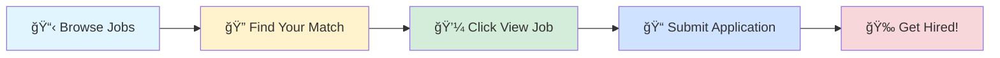

# 🚀 Tech Jobs Board

### Your Gateway to Amazing Career Opportunities

---

## 🎯 Browse by Job Profile

<table>
<tr>
<td align="center" width="25%">

 
<b>1000</b> total positions
</td>
<td align="center" width="25%">

 
<b>1000</b> total positions
</td>
<td align="center" width="25%">

 
<b>1000</b> total positions
</td>
<td align="center" width="25%">

 
<b>1000</b> total positions
</td>
</tr>
</table>

---

## 📊 Data Scientist

> 💼 **1000** positions available

<table>
<thead>
<tr>
<th width="20%">🏢 Company</th>
<th width="35%">💼 Role</th>
<th width="20%">📍 Location</th>
<th width="10%">⏰ Posted</th>
<th width="15%">🔗 Action</th>
</tr>
</thead>
<tbody>
<tr>
<td><a href="https://www.ambitionbox.com/overview/harman-overview">HARMAN</a></td>
<td>Data Scientist</td>
<td>📍 Bangalore</td>
<td>Today</td>
<td align="center"></td>
</tr>
<tr>
<td>Nexdev Solutions</td>
<td>Ai Ml Engineer</td>
<td>📍 Kolkata</td>
<td>Today</td>
<td align="center"></td>
</tr>
<tr>
<td><a href="https://www.ambitionbox.com/overview/to-the-new-overview">TO THE NEW</a></td>
<td>DevOps Engineer - AWS (Noida)</td>
<td>📍 Noida</td>
<td>Today</td>
<td align="center"></td>
</tr>
<tr>
<td>Nomiso</td>
<td>Lead Cloud Engineer AWS</td>
<td>📍 Noida</td>
<td>Today</td>
<td align="center"></td>
</tr>
<tr>
<td><a href="https://www.ambitionbox.com/overview/truecopy-credentials-overview">Truecopy Credentials</a></td>
<td>Qa Automation Testing Engineer</td>
<td>📍 Pune</td>
<td>Today</td>
<td align="center"></td>
</tr>
<tr>
<td><a href="https://in.linkedin.com/company/tata-consultancy-services">Tata Consultancy Services</a></td>
<td>Python Fast API + AWS - F2F Interview : 13th Dec-25 : Chennai</td>
<td>📍 Chennai</td>
<td>Today</td>
<td align="center"></td>
</tr>
<tr>
<td><a href="https://www.linkedin.com/company/tiger-analytics">Tiger Analytics</a></td>
<td>ML Support - Senior System Engineer</td>
<td>📍 Chennai</td>
<td>Today</td>
<td align="center"></td>
</tr>
<tr>
<td><a href="https://jp.linkedin.com/company/takeda-pharmaceuticals">Takeda</a></td>
<td>Head Global Quality Digital Health and Artificial Intelligence Compliance</td>
<td>📍 Zurich, Zurich, Switzerland</td>
<td>Today</td>
<td align="center"></td>
</tr>
<tr>
<td><a href="https://ae.linkedin.com/company/t-all-inspection">T-ALL Inspection</a></td>
<td>Corrosion Monitoring Expert</td>
<td>📍 Al-Basra Governorate, Iraq</td>
<td>Today</td>
<td align="center"></td>
</tr>
<tr>
<td><a href="https://www.linkedin.com/company/o9solutions">o9 Solutions, Inc.</a></td>
<td>Data Science - Retail Demand Forecasting</td>
<td>📍 Bangalore</td>
<td>Today</td>
<td align="center"></td>
</tr>
<tr>
<td><a href="https://in.linkedin.com/company/zetheta">Zetheta Algorithms Private Limited</a></td>
<td>Artificial Intelligence Intern</td>
<td>📍 India</td>
<td>Today</td>
<td align="center"></td>
</tr>
<tr>
<td><a href="https://www.linkedin.com/company/bayone-solutions">BayOne Solutions</a></td>
<td>AI/ML Engineer</td>
<td>📍 India</td>
<td>Today</td>
<td align="center"></td>
</tr>
<tr>
<td><a href="https://pe.linkedin.com/company/metricaperusac">METRICA Perú</a></td>
<td>QA Automation Engineer</td>
<td>📍 Lima, Peru</td>
<td>Today</td>
<td align="center"></td>
</tr>
<tr>
<td><a href="https://www.linkedin.com/company/wake-up-whistle">Wake Up Whistle</a></td>
<td>Machine Learning Intern (Model Building & Evaluation)</td>
<td>📍 India</td>
<td>Today</td>
<td align="center"></td>
</tr>
<tr>
<td><a href="https://www.linkedin.com/company/wake-up-whistle">Wake Up Whistle</a></td>
<td>Business Analytics Intern (Requirements Gathering & Insights)</td>
<td>📍 India</td>
<td>Today</td>
<td align="center"></td>
</tr>
<tr>
<td><a href="https://www.linkedin.com/company/wake-up-whistle">Wake Up Whistle</a></td>
<td>Data Analyst Intern (Excel, SQL, Power BI) – Remote</td>
<td>📍 India</td>
<td>Today</td>
<td align="center"></td>
</tr>
<tr>
<td><a href="https://www.linkedin.com/company/wake-up-whistle">Wake Up Whistle</a></td>
<td>Data Analytics Intern (Dashboards & Reporting)</td>
<td>📍 India</td>
<td>Today</td>
<td align="center"></td>
</tr>
<tr>
<td><a href="https://www.linkedin.com/company/wake-up-whistle">Wake Up Whistle</a></td>
<td>Junior Data Analyst Intern – Python & Analytics Projects</td>
<td>📍 India</td>
<td>Today</td>
<td align="center"></td>
</tr>
<tr>
<td><a href="https://www.linkedin.com/company/citi">Citi</a></td>
<td>Business Analytics Analyst</td>
<td>📍 Bangalore</td>
<td>Today</td>
<td align="center"></td>
</tr>
<tr>
<td><a href="https://www.linkedin.com/company/citi">Citi</a></td>
<td>Data Analyst with SQL and Power Builder</td>
<td>📍 Chennai</td>
<td>Today</td>
<td align="center"></td>
</tr>
<tr>
<td><a href="https://www.linkedin.com/company/procore-technologies">Procore Technologies</a></td>
<td>People Data Scientist</td>
<td>📍 Austin, TX</td>
<td>Today</td>
<td align="center"></td>
</tr>
<tr>
<td><a href="https://www.linkedin.com/company/sanmina">Sanmina</a></td>
<td>Information Systems Engineer 1 (R)</td>
<td>📍 Ixtlahuacán de los Membrillos, Jalisco, Mexico</td>
<td>Today</td>
<td align="center"></td>
</tr>
<tr>
<td><a href="https://www.linkedin.com/company/huntsman">Huntsman Corporation</a></td>
<td>IT - Data & Analytics</td>
<td>📍 The Woodlands, TX</td>
<td>Today</td>
<td align="center"></td>
</tr>
<tr>
<td><a href="https://www.linkedin.com/company/boeing">Boeing</a></td>
<td>Associate AI/ML Researcher</td>
<td>📍 Seoul, Seoul, South Korea</td>
<td>Today</td>
<td align="center"></td>
</tr>
<tr>
<td><a href="https://www.linkedin.com/company/take-2-interactive-software-inc-">Take-Two Interactive</a></td>
<td>Data Science Intern</td>
<td>📍 New York, United States</td>
<td>Today</td>
<td align="center"></td>
</tr>
<tr>
<td><a href="https://in.linkedin.com/company/rk-groupp">RK Group</a></td>
<td>R K Group - Financial Controller - eCommerce Electronics &amp; Fashion Division</td>
<td>📍 Bangalore</td>
<td>Today</td>
<td align="center"></td>
</tr>
<tr>
<td><a href="https://in.linkedin.com/company/rk-groupp">RK Group</a></td>
<td>R K Group - Finance Manager - eCommerce Sportswear Vertical</td>
<td>📍 Bangalore</td>
<td>Today</td>
<td align="center"></td>
</tr>
<tr>
<td><a href="https://www.linkedin.com/company/tp-link-corporation">TP-Link</a></td>
<td>Director of Engineering, Embedded Software Platform and Machine Learning</td>
<td>📍 Irvine, CA</td>
<td>Today</td>
<td align="center"></td>
</tr>
<tr>
<td><a href="https://www.linkedin.com/company/nbcuniversal-inc-">NBCUniversal</a></td>
<td>Associate Engineer, Business Analytics and Industrial Engineering</td>
<td>📍 Universal City, CA</td>
<td>Today</td>
<td align="center"></td>
</tr>
<tr>
<td><a href="https://fr.linkedin.com/company/orpi">ORPI</a></td>
<td>Assistant(e) Commercial(e) Vie du Réseau</td>
<td>📍 Clichy, Île-de-France, France</td>
<td>Today</td>
<td align="center"></td>
</tr>
<tr>
<td><a href="https://www.linkedin.com/company/veracitysoftwareinc">Veracity Software Inc</a></td>
<td>Junior Data Analyst   Azure Databricks</td>
<td>📍 Raleigh, NC</td>
<td>Today</td>
<td align="center"></td>
</tr>
<tr>
<td><a href="https://ca.linkedin.com/company/food-basics-on">Food Basics</a></td>
<td>Assistant Responsable de Magasin - Région d'Ottawa</td>
<td>📍 Canada</td>
<td>Today</td>
<td align="center"></td>
</tr>
<tr>
<td><a href="https://sg.linkedin.com/company/m-daq">M-DAQ Global</a></td>
<td>Compliance Analyst (Transaction Monitoring)</td>
<td>📍 Singapore, Singapore</td>
<td>Today</td>
<td align="center"></td>
</tr>
<tr>
<td><a href="https://www.linkedin.com/company/codi-solutions">CODI</a></td>
<td>QA Automation Engineer (Banking software)</td>
<td>📍 Vilnius, Vilniaus, Lithuania</td>
<td>Today</td>
<td align="center"></td>
</tr>
<tr>
<td><a href="https://www.linkedin.com/company/algosec">AlgoSec</a></td>
<td>Prevasio Automation Developer, India</td>
<td>📍 Delhi</td>
<td>Today</td>
<td align="center"></td>
</tr>
<tr>
<td><a href="https://www.linkedin.com/company/algosec">AlgoSec</a></td>
<td>AlgoNext Automation Developer, India</td>
<td>📍 Delhi</td>
<td>Today</td>
<td align="center"></td>
</tr>
<tr>
<td><a href="https://in.linkedin.com/company/dexianindia">Dexian India</a></td>
<td>Python React Developer</td>
<td>📍 India</td>
<td>Today</td>
<td align="center"></td>
</tr>
<tr>
<td><a href="https://www.linkedin.com/company/algosec">AlgoSec</a></td>
<td>Automation Developer, India</td>
<td>📍 Delhi</td>
<td>Today</td>
<td align="center"></td>
</tr>
<tr>
<td><a href="https://www.linkedin.com/company/algosec">AlgoSec</a></td>
<td>CloudFlow Automation Developer, India</td>
<td>📍 Delhi</td>
<td>Today</td>
<td align="center"></td>
</tr>
<tr>
<td><a href="https://www.linkedin.com/company/algosec">AlgoSec</a></td>
<td>Full Stack Automation Developer, India</td>
<td>📍 Delhi</td>
<td>Today</td>
<td align="center"></td>
</tr>
<tr>
<td><a href="https://fr.linkedin.com/company/free-work-com">Free-Work</a></td>
<td>Administrateur système et réseaux H/F (IT) / Freelance</td>
<td>📍 Brécé, Brittany, France</td>
<td>Today</td>
<td align="center"></td>
</tr>
<tr>
<td><a href="https://cn.linkedin.com/company/elevate-ats">elevate</a></td>
<td>Computer Science & ICT Teacher</td>
<td>📍 Wuhan, Hubei, China</td>
<td>Today</td>
<td align="center"></td>
</tr>
<tr>
<td><a href="https://de.linkedin.com/company/stadtreinigung-hamburg">Stadtreinigung Hamburg</a></td>
<td>Inhouse Consultant (m/w/d) für IT und Prozesse</td>
<td>📍 Hamburg, Hamburg, Germany</td>
<td>Today</td>
<td align="center"></td>
</tr>
<tr>
<td><a href="https://de.linkedin.com/company/stadtreinigung-hamburg">Stadtreinigung Hamburg</a></td>
<td>Elektroniker (m/w/d) für Energie- und Gebäudetechnik</td>
<td>📍 Hamburg, Hamburg, Germany</td>
<td>Today</td>
<td align="center"></td>
</tr>
<tr>
<td><a href="https://es.linkedin.com/company/konecta-group">Konecta</a></td>
<td>Operador de TeleAtendimento- Receptivo-| Ganhos de mais de R$ 2.000,00</td>
<td>📍 Osasco, São Paulo, Brazil</td>
<td>Today</td>
<td align="center"></td>
</tr>
<tr>
<td><a href="https://www.linkedin.com/company/riot-games">Riot Games</a></td>
<td>Staff Data Scientist – VALORANT, Deep Learning</td>
<td>📍 Los Angeles, CA</td>
<td>Today</td>
<td align="center"></td>
</tr>
<tr>
<td><a href="https://www.linkedin.com/company/gdit">General Dynamics Information Technology</a></td>
<td>Environmental Scientist (Data Analysis and Stakeholder Engagement)</td>
<td>📍 United States</td>
<td>Today</td>
<td align="center"></td>
</tr>
<tr>
<td><a href="https://www.linkedin.com/company/articul8-ai">Articul8 AI</a></td>
<td>Backend Engineer - (Python) Brazil</td>
<td>📍 Brazil</td>
<td>Today</td>
<td align="center"></td>
</tr>
<tr>
<td><a href="https://de.linkedin.com/company/stadtreinigung-hamburg">Stadtreinigung Hamburg</a></td>
<td>Anlagenmechaniker (m/w/d) für Klimatechnik</td>
<td>📍 Hamburg, Hamburg, Germany</td>
<td>Today</td>
<td align="center"></td>
</tr>
<tr>
<td><a href="https://www.linkedin.com/company/pfizer">Pfizer</a></td>
<td>Data Science Manager</td>
<td>📍 General Escobedo, Nuevo León, Mexico</td>
<td>Today</td>
<td align="center"></td>
</tr>
<tr>
<td><a href="https://www.linkedin.com/company/pfizer">Pfizer</a></td>
<td>Data Science Manager</td>
<td>📍 Mexico City, Mexico</td>
<td>Today</td>
<td align="center"></td>
</tr>
<tr>
<td><a href="https://in.linkedin.com/company/kgisl-educational-institutions">KGiSL Educational Institutions</a></td>
<td>Assistant professor - Robotics & Automation</td>
<td>📍 Coimbatore</td>
<td>Today</td>
<td align="center"></td>
</tr>
<tr>
<td>Fulfillment IQ</td>
<td>Fulfillment IQ - Quality Assurance Automation Engineer</td>
<td>📍 Bangalore</td>
<td>2mo ago</td>
<td align="center"></td>
</tr>
<tr>
<td><a href="https://www.linkedin.com/company/boeing">Boeing</a></td>
<td>Senior Machine Learning Architect</td>
<td>📍 West Palm Beach, FL</td>
<td>Today</td>
<td align="center"></td>
</tr>
<tr>
<td><a href="https://www.linkedin.com/company/morgan-stanley">Morgan Stanley</a></td>
<td>Data Scientist/Gen AI_Software Engineering - Vice President - Software Engineering</td>
<td>📍 Bangalore</td>
<td>Today</td>
<td align="center"></td>
</tr>
<tr>
<td>BigThinkCode</td>
<td>Software Engineer, Senior (Python)</td>
<td>📍 Chennai</td>
<td>2mo ago</td>
<td align="center"></td>
</tr>
<tr>
<td><a href="https://in.linkedin.com/company/tata-consultancy-services">Tata Consultancy Services</a></td>
<td>Azure Databricks+Pyspark</td>
<td>📍 Pune</td>
<td>Today</td>
<td align="center"></td>
</tr>
<tr>
<td><a href="https://de.linkedin.com/company/nagarro">Nagarro</a></td>
<td>Staff Engineer, Python Fullstack(React)</td>
<td>📍 India</td>
<td>Today</td>
<td align="center"></td>
</tr>
<tr>
<td><a href="https://www.linkedin.com/company/state-street">State Street</a></td>
<td>Middle Office Performance & Analytics - Senior Manager</td>
<td>📍 Mumbai</td>
<td>Today</td>
<td align="center"></td>
</tr>
<tr>
<td><a href="https://www.linkedin.com/company/articul8-ai">Articul8 AI</a></td>
<td>Staff/Senior AI/ML Engineer - (Dublin, CA)</td>
<td>📍 Dublin, CA</td>
<td>Today</td>
<td align="center"></td>
</tr>
<tr>
<td><a href="https://www.linkedin.com/company/articul8-ai">Articul8 AI</a></td>
<td>AI/ML Engineer (Dublin, CA)</td>
<td>📍 Dublin, CA</td>
<td>Today</td>
<td align="center"></td>
</tr>
<tr>
<td>Iris Software Inc.</td>
<td>Data & Analytics - Senior Engineer</td>
<td>📍 Noida</td>
<td>2mo ago</td>
<td align="center"></td>
</tr>
<tr>
<td><a href="https://www.linkedin.com/company/articul8-ai">Articul8 AI</a></td>
<td>AI/ML Manager - Engineering Leader</td>
<td>📍 Dublin, CA</td>
<td>Today</td>
<td align="center"></td>
</tr>
<tr>
<td><a href="https://www.linkedin.com/company/indegene">Indegene</a></td>
<td>Senior Manager - Patient and Medical Analytics SME</td>
<td>📍 Bangalore</td>
<td>Today</td>
<td align="center"></td>
</tr>
<tr>
<td>JPMorganChase</td>
<td>Quant Analytics Analyst- Business Banking Controls reporting</td>
<td>📍 Mumbai</td>
<td>2mo ago</td>
<td align="center"></td>
</tr>
<tr>
<td><a href="https://www.linkedin.com/company/walmart">Walmart</a></td>
<td>Manager, Advanced Analytics</td>
<td>📍 Bentonville, AR</td>
<td>Today</td>
<td align="center"></td>
</tr>
<tr>
<td><a href="https://www.linkedin.com/company/state-street">State Street</a></td>
<td>Senior AI/ML Engineer - Senior Manager</td>
<td>📍 Bangalore</td>
<td>Today</td>
<td align="center"></td>
</tr>
<tr>
<td><a href="https://www.linkedin.com/school/texas-a&m-university/">Texas A&M University</a></td>
<td>Research Data Scientist</td>
<td>📍 Houston, TX</td>
<td>Today</td>
<td align="center"></td>
</tr>
<tr>
<td><a href="https://www.linkedin.com/company/cisco">Cisco</a></td>
<td>Data Scientist - AI/ML, Snowflake, Tableau | 4 - 8 Years</td>
<td>📍 Bangalore</td>
<td>Today</td>
<td align="center"></td>
</tr>
<tr>
<td><a href="https://in.linkedin.com/company/peoplelogic-business-solutions">PeopleLogic</a></td>
<td>Automation Test Analyst</td>
<td>📍 Sydney, New South Wales, Australia</td>
<td>Today</td>
<td align="center"></td>
</tr>
<tr>
<td><a href="https://www.linkedin.com/company/sigmatic-ai">Sigmatic</a></td>
<td>Senior AI and ML Engineer</td>
<td>📍 Delhi</td>
<td>Today</td>
<td align="center"></td>
</tr>
<tr>
<td><a href="https://www.linkedin.com/company/zs-associates">ZS</a></td>
<td>Decision Analytics Associate Consultant</td>
<td>📍 Philadelphia, PA</td>
<td>Today</td>
<td align="center"></td>
</tr>
<tr>
<td><a href="https://www.linkedin.com/company/biogx">BioGX</a></td>
<td>R&amp;D Scientist</td>
<td>📍 Hoover, AL</td>
<td>Today</td>
<td align="center"></td>
</tr>
<tr>
<td><a href="https://ch.linkedin.com/company/tetra-pak">Tetra Pak</a></td>
<td>Future Talent - Automation Engineer</td>
<td>📍 Binh Duong, Vietnam</td>
<td>Today</td>
<td align="center"></td>
</tr>
<tr>
<td><a href="https://www.linkedin.com/company/mathys-potestio">Mathys+Potestio / The Creative Party®</a></td>
<td>Business Intelligence Analyst – People Analytics</td>
<td>📍 Seattle, WA</td>
<td>Today</td>
<td align="center"></td>
</tr>
<tr>
<td>Bloom AI</td>
<td>Senior Analyst - Digital Performance & Analytics</td>
<td>📍 Delhi</td>
<td>2mo ago</td>
<td align="center"></td>
</tr>
<tr>
<td><a href="https://www.linkedin.com/company/jpmorganchase">JPMorganChase</a></td>
<td>Lead Architect - Java, AWS</td>
<td>📍 Mumbai</td>
<td>Today</td>
<td align="center"></td>
</tr>
<tr>
<td><a href="https://www.linkedin.com/company/jerryinc">Jerry</a></td>
<td>Applied Data Scientist</td>
<td>📍 Newark, NJ</td>
<td>Today</td>
<td align="center"></td>
</tr>
<tr>
<td><a href="https://www.linkedin.com/company/jerryinc">Jerry</a></td>
<td>Applied Data Scientist</td>
<td>📍 Atlanta, GA</td>
<td>Today</td>
<td align="center"></td>
</tr>
<tr>
<td><a href="https://www.linkedin.com/company/dataiku">Dataiku</a></td>
<td>Data Scientist</td>
<td>📍 United States</td>
<td>Today</td>
<td align="center"></td>
</tr>
<tr>
<td><a href="https://in.linkedin.com/company/hirenza-pvt-ltd">Hirenza</a></td>
<td>Python Developer</td>
<td>📍 India</td>
<td>Today</td>
<td align="center"></td>
</tr>
<tr>
<td><a href="https://www.linkedin.com/company/jerryinc">Jerry</a></td>
<td>Data Scientist</td>
<td>📍 Newark, NJ</td>
<td>Today</td>
<td align="center"></td>
</tr>
<tr>
<td><a href="https://www.linkedin.com/company/jerryinc">Jerry</a></td>
<td>Data Scientist</td>
<td>📍 Salt Lake City, UT</td>
<td>Today</td>
<td align="center"></td>
</tr>
<tr>
<td><a href="https://www.linkedin.com/company/jerryinc">Jerry</a></td>
<td>Applied Data Scientist</td>
<td>📍 Chicago, IL</td>
<td>Today</td>
<td align="center"></td>
</tr>
<tr>
<td><a href="https://www.linkedin.com/company/jerryinc">Jerry</a></td>
<td>Applied Data Scientist</td>
<td>📍 Portland, OR</td>
<td>Today</td>
<td align="center"></td>
</tr>
<tr>
<td><a href="https://www.linkedin.com/company/jerryinc">Jerry</a></td>
<td>Data Scientist</td>
<td>📍 Nashville, TN</td>
<td>Today</td>
<td align="center"></td>
</tr>
<tr>
<td>Deutsche Bank</td>
<td>Senior Data Scientist- Senior Engineer, AVP</td>
<td>📍 Pune</td>
<td>2mo ago</td>
<td align="center"></td>
</tr>
<tr>
<td><a href="https://www.linkedin.com/company/jerryinc">Jerry</a></td>
<td>Applied Data Scientist</td>
<td>📍 Boston, MA</td>
<td>Today</td>
<td align="center"></td>
</tr>
<tr>
<td><a href="https://www.linkedin.com/company/motion-recruitment-partners">Motion Recruitment</a></td>
<td>Azure DevOps Engineer</td>
<td>📍 Austin, TX</td>
<td>Today</td>
<td align="center"></td>
</tr>
<tr>
<td><a href="https://www.linkedin.com/company/maximus">Maximus</a></td>
<td>IT Eng - ML</td>
<td>📍 Bangalore</td>
<td>Today</td>
<td align="center"></td>
</tr>
<tr>
<td><a href="https://www.linkedin.com/company/jerryinc">Jerry</a></td>
<td>Applied Data Scientist</td>
<td>📍 Palo Alto, CA</td>
<td>Today</td>
<td align="center"></td>
</tr>
<tr>
<td><a href="https://www.linkedin.com/company/jerryinc">Jerry</a></td>
<td>Data Scientist</td>
<td>📍 Charlotte, NC</td>
<td>Today</td>
<td align="center"></td>
</tr>
<tr>
<td><a href="https://www.linkedin.com/company/jerryinc">Jerry</a></td>
<td>Data Scientist</td>
<td>📍 Denver, CO</td>
<td>Today</td>
<td align="center"></td>
</tr>
<tr>
<td><a href="https://www.linkedin.com/company/acquire4hire">Acquire4Hire</a></td>
<td>Data Analytics Manager</td>
<td>📍 Stamford, CT</td>
<td>Today</td>
<td align="center"></td>
</tr>
<tr>
<td><a href="https://www.linkedin.com/company/jerryinc">Jerry</a></td>
<td>Applied Data Scientist</td>
<td>📍 Toronto, Ontario, Canada</td>
<td>Today</td>
<td align="center"></td>
</tr>
<tr>
<td><a href="https://www.linkedin.com/company/jerryinc">Jerry</a></td>
<td>Data Scientist</td>
<td>📍 Los Angeles, CA</td>
<td>Today</td>
<td align="center"></td>
</tr>
<tr>
<td><a href="https://www.linkedin.com/company/jerryinc">Jerry</a></td>
<td>Applied Data Scientist</td>
<td>📍 Miami, FL</td>
<td>Today</td>
<td align="center"></td>
</tr>
<tr>
<td><a href="https://www.linkedin.com/company/jerryinc">Jerry</a></td>
<td>Data Scientist</td>
<td>📍 Miami, FL</td>
<td>Today</td>
<td align="center"></td>
</tr>
<tr>
<td><a href="https://www.linkedin.com/company/phenomai">Phenom</a></td>
<td>Senior Product Manager, (AI-ML)</td>
<td>📍 Hyderabad</td>
<td>Today</td>
<td align="center"></td>
</tr>
<tr>
<td><a href="https://www.linkedin.com/company/emmaoftorre">Emma of Torre.ai</a></td>
<td>Machine Learning Engineer / Data Scientist - Full time</td>
<td>📍 Germany</td>
<td>Today</td>
<td align="center"></td>
</tr>
<tr><td colspan="5" align="center"><i>... and 900 more positions</i></td></tr>
</tbody>
</table>

---

## 💼 Business Analyst

> 💼 **1000** positions available

<table>
<thead>
<tr>
<th width="20%">🏢 Company</th>
<th width="35%">💼 Role</th>
<th width="20%">📍 Location</th>
<th width="10%">⏰ Posted</th>
<th width="15%">🔗 Action</th>
</tr>
</thead>
<tbody>
<tr>
<td><a href="https://www.ambitionbox.com/overview/truecopy-credentials-overview">Truecopy Credentials</a></td>
<td>Qa Automation Testing Engineer</td>
<td>📍 Pune</td>
<td>Today</td>
<td align="center"></td>
</tr>
<tr>
<td><a href="https://in.linkedin.com/company/tata-consultancy-services">Tata Consultancy Services</a></td>
<td>Python Fast API + AWS - F2F Interview : 13th Dec-25 : Chennai</td>
<td>📍 Chennai</td>
<td>Today</td>
<td align="center"></td>
</tr>
<tr>
<td><a href="https://vn.linkedin.com/company/zen8labs">zen8labs</a></td>
<td>QUALITY ASSURANCE cum BUSINESS ANALYST</td>
<td>📍 Hanoi Capital Region</td>
<td>Today</td>
<td align="center"></td>
</tr>
<tr>
<td><a href="https://pe.linkedin.com/company/metricaperusac">METRICA Perú</a></td>
<td>QA Automation Engineer</td>
<td>📍 Lima, Peru</td>
<td>Today</td>
<td align="center"></td>
</tr>
<tr>
<td><a href="https://www.linkedin.com/company/emb-labsrd">EMB LABS R&D</a></td>
<td>Business Analyst</td>
<td>📍 Federal Territory of Kuala Lumpur, Malaysia</td>
<td>Today</td>
<td align="center"></td>
</tr>
<tr>
<td><a href="https://my.linkedin.com/company/aiasharedservices">AIA Shared Services</a></td>
<td>Assistant Manager - Business Analysis and UAT</td>
<td>📍 Cyberjaya, Selangor, Malaysia</td>
<td>Today</td>
<td align="center"></td>
</tr>
<tr>
<td><a href="https://www.linkedin.com/company/wake-up-whistle">Wake Up Whistle</a></td>
<td>Business Analytics Intern (Requirements Gathering & Insights)</td>
<td>📍 India</td>
<td>Today</td>
<td align="center"></td>
</tr>
<tr>
<td><a href="https://www.linkedin.com/company/wake-up-whistle">Wake Up Whistle</a></td>
<td>Junior Business Analyst Intern – Research & Reporting</td>
<td>📍 India</td>
<td>Today</td>
<td align="center"></td>
</tr>
<tr>
<td><a href="https://li.linkedin.com/company/hilti">Hilti Group</a></td>
<td>Junior IT Business Analyst – Finance & Controlling (SAP)</td>
<td>📍 Buchs (SG), St Gallen, Switzerland</td>
<td>Today</td>
<td align="center"></td>
</tr>
<tr>
<td><a href="https://www.linkedin.com/company/wake-up-whistle">Wake Up Whistle</a></td>
<td>Business Analyst Intern (Process Mapping & Documentation)</td>
<td>📍 India</td>
<td>Today</td>
<td align="center"></td>
</tr>
<tr>
<td><a href="https://www.linkedin.com/company/wake-up-whistle">Wake Up Whistle</a></td>
<td>Data Analyst Intern (Excel, SQL, Power BI) – Remote</td>
<td>📍 India</td>
<td>Today</td>
<td align="center"></td>
</tr>
<tr>
<td><a href="https://www.linkedin.com/company/wake-up-whistle">Wake Up Whistle</a></td>
<td>Data Analytics Intern (Dashboards & Reporting)</td>
<td>📍 India</td>
<td>Today</td>
<td align="center"></td>
</tr>
<tr>
<td><a href="https://www.linkedin.com/company/wake-up-whistle">Wake Up Whistle</a></td>
<td>Junior Data Analyst Intern – Python & Analytics Projects</td>
<td>📍 India</td>
<td>Today</td>
<td align="center"></td>
</tr>
<tr>
<td><a href="https://www.linkedin.com/company/citi">Citi</a></td>
<td>Business Analytics Analyst</td>
<td>📍 Bangalore</td>
<td>Today</td>
<td align="center"></td>
</tr>
<tr>
<td><a href="https://www.linkedin.com/company/citi">Citi</a></td>
<td>Data Analyst with SQL and Power Builder</td>
<td>📍 Chennai</td>
<td>Today</td>
<td align="center"></td>
</tr>
<tr>
<td><a href="https://www.linkedin.com/company/huntsman">Huntsman Corporation</a></td>
<td>IT - Data & Analytics</td>
<td>📍 The Woodlands, TX</td>
<td>Today</td>
<td align="center"></td>
</tr>
<tr>
<td><a href="https://www.linkedin.com/company/accellor">Accellor</a></td>
<td>Scrum Master</td>
<td>📍 Piscataway, NJ</td>
<td>Today</td>
<td align="center"></td>
</tr>
<tr>
<td><a href="https://www.linkedin.com/company/expedite-technology-solutions-llc">Expedite Technology Solutions LLC</a></td>
<td>Business Analyst Jr</td>
<td>📍 Nashville, TN</td>
<td>Today</td>
<td align="center"></td>
</tr>
<tr>
<td><a href="https://www.linkedin.com/company/sand-cherry-associates">Sand Cherry</a></td>
<td>Business Analyst, Integration Liaison</td>
<td>📍 Stamford, CT</td>
<td>Today</td>
<td align="center"></td>
</tr>
<tr>
<td><a href="https://www.linkedin.com/company/nbcuniversal-inc-">NBCUniversal</a></td>
<td>Associate Engineer, Business Analytics and Industrial Engineering</td>
<td>📍 Universal City, CA</td>
<td>Today</td>
<td align="center"></td>
</tr>
<tr>
<td><a href="https://www.linkedin.com/company/onedata-software-solutions">OneData Software Solutions</a></td>
<td>Business Analyst</td>
<td>📍 New York County, NY</td>
<td>Today</td>
<td align="center"></td>
</tr>
<tr>
<td><a href="https://www.linkedin.com/company/veracitysoftwareinc">Veracity Software Inc</a></td>
<td>Business Analyst   Expert</td>
<td>📍 Raleigh, NC</td>
<td>Today</td>
<td align="center"></td>
</tr>
<tr>
<td><a href="https://in.linkedin.com/company/gc-technologies-pvt-ltd">GC Technologies Pvt Ltd</a></td>
<td>Business Consultant or Business Analyst - In manufacturing - - MFGDCG (Manufacturing Domain Consulting Group)</td>
<td>📍 India</td>
<td>Today</td>
<td align="center"></td>
</tr>
<tr>
<td><a href="https://ca.linkedin.com/company/metro-inc.">Metro Inc.</a></td>
<td>Intermediate Financial Business Analyst / Analyste fonctionnel·le intermédiaire finances</td>
<td>📍 Terrebonne, Quebec, Canada</td>
<td>Today</td>
<td align="center"></td>
</tr>
<tr>
<td><a href="https://www.linkedin.com/company/codi-solutions">CODI</a></td>
<td>QA Automation Engineer (Banking software)</td>
<td>📍 Vilnius, Vilniaus, Lithuania</td>
<td>Today</td>
<td align="center"></td>
</tr>
<tr>
<td><a href="https://www.linkedin.com/company/algosec">AlgoSec</a></td>
<td>Prevasio Automation Developer, India</td>
<td>📍 Delhi</td>
<td>Today</td>
<td align="center"></td>
</tr>
<tr>
<td><a href="https://www.linkedin.com/company/algosec">AlgoSec</a></td>
<td>AlgoNext Automation Developer, India</td>
<td>📍 Delhi</td>
<td>Today</td>
<td align="center"></td>
</tr>
<tr>
<td><a href="https://in.linkedin.com/company/dexianindia">Dexian India</a></td>
<td>Python React Developer</td>
<td>📍 India</td>
<td>Today</td>
<td align="center"></td>
</tr>
<tr>
<td><a href="https://www.linkedin.com/company/algosec">AlgoSec</a></td>
<td>Automation Developer, India</td>
<td>📍 Delhi</td>
<td>Today</td>
<td align="center"></td>
</tr>
<tr>
<td><a href="https://www.linkedin.com/company/algosec">AlgoSec</a></td>
<td>CloudFlow Automation Developer, India</td>
<td>📍 Delhi</td>
<td>Today</td>
<td align="center"></td>
</tr>
<tr>
<td><a href="https://www.linkedin.com/company/algosec">AlgoSec</a></td>
<td>Full Stack Automation Developer, India</td>
<td>📍 Delhi</td>
<td>Today</td>
<td align="center"></td>
</tr>
<tr>
<td><a href="https://cn.linkedin.com/company/elevate-ats">elevate</a></td>
<td>Computer Science & ICT Teacher</td>
<td>📍 Wuhan, Hubei, China</td>
<td>Today</td>
<td align="center"></td>
</tr>
<tr>
<td><a href="https://fr.linkedin.com/company/free-work-com">Free-Work</a></td>
<td>ingénieur informatique Data Power BI (H/F) (IT) / Freelance</td>
<td>📍 Nantes, Pays de la Loire, France</td>
<td>Today</td>
<td align="center"></td>
</tr>
<tr>
<td><a href="https://www.linkedin.com/company/gdit">General Dynamics Information Technology</a></td>
<td>Environmental Scientist (Data Analysis and Stakeholder Engagement)</td>
<td>📍 United States</td>
<td>Today</td>
<td align="center"></td>
</tr>
<tr>
<td><a href="https://www.linkedin.com/company/articul8-ai">Articul8 AI</a></td>
<td>Backend Engineer - (Python) Brazil</td>
<td>📍 Brazil</td>
<td>Today</td>
<td align="center"></td>
</tr>
<tr>
<td><a href="https://vn.linkedin.com/company/cellphones">CellphoneS</a></td>
<td>Business Analyst ERP</td>
<td>📍 District 1, Ho Chi Minh City, Vietnam</td>
<td>Today</td>
<td align="center"></td>
</tr>
<tr>
<td><a href="https://in.linkedin.com/company/kgisl-educational-institutions">KGiSL Educational Institutions</a></td>
<td>Assistant professor - Robotics & Automation</td>
<td>📍 Coimbatore</td>
<td>Today</td>
<td align="center"></td>
</tr>
<tr>
<td><a href="https://www.linkedin.com/company/core-specialty-insurance-holdings-inc">Core Specialty Insurance Holdings, Inc.</a></td>
<td>Business Analyst</td>
<td>📍 Cincinnati, OH</td>
<td>Today</td>
<td align="center"></td>
</tr>
<tr>
<td>Fulfillment IQ</td>
<td>Fulfillment IQ - Quality Assurance Automation Engineer</td>
<td>📍 Bangalore</td>
<td>2mo ago</td>
<td align="center"></td>
</tr>
<tr>
<td><a href="https://www.linkedin.com/company/turnberrycrew">Crew</a></td>
<td>Business Analyst</td>
<td>📍 Eden Prairie, MN</td>
<td>Today</td>
<td align="center"></td>
</tr>
<tr>
<td>BigThinkCode</td>
<td>Software Engineer, Senior (Python)</td>
<td>📍 Chennai</td>
<td>2mo ago</td>
<td align="center"></td>
</tr>
<tr>
<td><a href="https://fr.linkedin.com/company/free-work-com">Free-Work</a></td>
<td>Scrum Master CRM (H/F) (IT) / Freelance</td>
<td>📍 Neuilly-sur-Seine, Île-de-France, France</td>
<td>Today</td>
<td align="center"></td>
</tr>
<tr>
<td><a href="https://de.linkedin.com/company/nagarro">Nagarro</a></td>
<td>Staff Engineer, Python Fullstack(React)</td>
<td>📍 India</td>
<td>Today</td>
<td align="center"></td>
</tr>
<tr>
<td><a href="https://www.linkedin.com/company/hub-international">HUB International</a></td>
<td>ServiceNow Business Analyst</td>
<td>📍 Chicago, IL</td>
<td>Today</td>
<td align="center"></td>
</tr>
<tr>
<td><a href="https://www.linkedin.com/company/state-street">State Street</a></td>
<td>Middle Office Performance & Analytics - Senior Manager</td>
<td>📍 Mumbai</td>
<td>Today</td>
<td align="center"></td>
</tr>
<tr>
<td>Iris Software Inc.</td>
<td>Data & Analytics - Senior Engineer</td>
<td>📍 Noida</td>
<td>2mo ago</td>
<td align="center"></td>
</tr>
<tr>
<td><a href="https://ca.linkedin.com/company/helicco">Helic & Co.</a></td>
<td>Scrum Master</td>
<td>📍 United States</td>
<td>Today</td>
<td align="center"></td>
</tr>
<tr>
<td><a href="https://www.linkedin.com/company/indegene">Indegene</a></td>
<td>Senior Manager - Patient and Medical Analytics SME</td>
<td>📍 Bangalore</td>
<td>Today</td>
<td align="center"></td>
</tr>
<tr>
<td>JPMorganChase</td>
<td>Quant Analytics Analyst- Business Banking Controls reporting</td>
<td>📍 Mumbai</td>
<td>2mo ago</td>
<td align="center"></td>
</tr>
<tr>
<td><a href="https://uk.linkedin.com/company/ernstandyoung">EY</a></td>
<td>Project Consultant - Business Consulting PI - GOV - CNS - BC - Transformation Delivery - Gurgaon</td>
<td>📍 Gurugram</td>
<td>Today</td>
<td align="center"></td>
</tr>
<tr>
<td><a href="https://uk.linkedin.com/company/ernstandyoung">EY</a></td>
<td>Vice President - Business Consulting PI - CHS - CNS - BC - Supply Chain & Operations - Mumbai</td>
<td>📍 Mumbai</td>
<td>Today</td>
<td align="center"></td>
</tr>
<tr>
<td><a href="https://uk.linkedin.com/company/ernstandyoung">EY</a></td>
<td>Consultant - Business Consulting Risk - OTHSolution - CNS - Risk - Risk Management - New Delhi</td>
<td>📍 Delhi</td>
<td>Today</td>
<td align="center"></td>
</tr>
<tr>
<td>Devlats Pvt Ltd</td>
<td>Project Manager - Agile/Scrum</td>
<td>📍 Hyderabad</td>
<td>2mo ago</td>
<td align="center"></td>
</tr>
<tr>
<td><a href="https://www.linkedin.com/company/walmart">Walmart</a></td>
<td>Manager, Advanced Analytics</td>
<td>📍 Bentonville, AR</td>
<td>Today</td>
<td align="center"></td>
</tr>
<tr>
<td><a href="https://www.linkedin.com/company/gevernova">GE Vernova</a></td>
<td>Sr Project Management Manager 3 - Project Mgmt</td>
<td>📍 Monterrey, Nuevo León, Mexico</td>
<td>Today</td>
<td align="center"></td>
</tr>
<tr>
<td><a href="https://www.linkedin.com/school/uw-school-of-medicine-and-public-health/">UW School of Medicine and Public Health</a></td>
<td>Project Manager, Project Management Innovation Center of Excellence (PROMICE)</td>
<td>📍 Madison, WI</td>
<td>Today</td>
<td align="center"></td>
</tr>
<tr>
<td><a href="https://www.linkedin.com/company/cisco">Cisco</a></td>
<td>Data Scientist - AI/ML, Snowflake, Tableau | 4 - 8 Years</td>
<td>📍 Bangalore</td>
<td>Today</td>
<td align="center"></td>
</tr>
<tr>
<td><a href="https://vn.linkedin.com/school/rmit-university-vietnam/">RMIT University Vietnam</a></td>
<td>Business Analyst (12 months & Third - Party Contract)</td>
<td>📍 Ho Chi Minh City, Ho Chi Minh City, Vietnam</td>
<td>Today</td>
<td align="center"></td>
</tr>
<tr>
<td><a href="https://in.linkedin.com/company/peoplelogic-business-solutions">PeopleLogic</a></td>
<td>Automation Test Analyst</td>
<td>📍 Sydney, New South Wales, Australia</td>
<td>Today</td>
<td align="center"></td>
</tr>
<tr>
<td><a href="https://www.linkedin.com/company/zs-associates">ZS</a></td>
<td>Decision Analytics Associate Consultant</td>
<td>📍 Philadelphia, PA</td>
<td>Today</td>
<td align="center"></td>
</tr>
<tr>
<td><a href="https://uk.linkedin.com/company/targetjobsuk">targetjobs UK</a></td>
<td>Sizewell C Project Management Graduate - Suffolk</td>
<td>📍 Leiston, England, United Kingdom</td>
<td>Today</td>
<td align="center"></td>
</tr>
<tr>
<td><a href="https://au.linkedin.com/company/carecone">CareCone Group</a></td>
<td>Business Analyst</td>
<td>📍 Sydney, New South Wales, Australia</td>
<td>Today</td>
<td align="center"></td>
</tr>
<tr>
<td><a href="https://ch.linkedin.com/company/tetra-pak">Tetra Pak</a></td>
<td>Future Talent - Automation Engineer</td>
<td>📍 Binh Duong, Vietnam</td>
<td>Today</td>
<td align="center"></td>
</tr>
<tr>
<td><a href="https://www.linkedin.com/company/mathys-potestio">Mathys+Potestio / The Creative Party®</a></td>
<td>Business Intelligence Analyst – People Analytics</td>
<td>📍 Seattle, WA</td>
<td>Today</td>
<td align="center"></td>
</tr>
<tr>
<td>Bloom AI</td>
<td>Senior Analyst - Digital Performance & Analytics</td>
<td>📍 Delhi</td>
<td>2mo ago</td>
<td align="center"></td>
</tr>
<tr>
<td><a href="https://in.linkedin.com/company/best-job-tool">Best Job Tool</a></td>
<td>Business Analyst</td>
<td>📍 India</td>
<td>Today</td>
<td align="center"></td>
</tr>
<tr>
<td>Calderys</td>
<td>IT - ERP Business Analyst</td>
<td>📍 Pune</td>
<td>2mo ago</td>
<td align="center"></td>
</tr>
<tr>
<td><a href="https://in.linkedin.com/company/hirenza-pvt-ltd">Hirenza</a></td>
<td>Python Developer</td>
<td>📍 India</td>
<td>Today</td>
<td align="center"></td>
</tr>
<tr>
<td><a href="https://in.linkedin.com/company/infosys">Infosys</a></td>
<td>Agile Consultant/Scrum Master</td>
<td>📍 Bangalore</td>
<td>Today</td>
<td align="center"></td>
</tr>
<tr>
<td><a href="https://in.linkedin.com/company/infosys">Infosys</a></td>
<td>Project Management</td>
<td>📍 Bangalore</td>
<td>Today</td>
<td align="center"></td>
</tr>
<tr>
<td><a href="https://www.linkedin.com/company/syneos-health">Syneos Health</a></td>
<td>Regulatory Consultant/Sr. Consultant - RIM/Veeva Business Analyst (US timeshift)</td>
<td>📍 Gurugram</td>
<td>Today</td>
<td align="center"></td>
</tr>
<tr>
<td><a href="https://in.linkedin.com/company/hirenza-pvt-ltd">Hirenza</a></td>
<td>Business Analyst</td>
<td>📍 India</td>
<td>Today</td>
<td align="center"></td>
</tr>
<tr>
<td><a href="https://www.linkedin.com/company/aggne">Aggne</a></td>
<td>Scrum Master</td>
<td>📍 Hyderabad</td>
<td>Today</td>
<td align="center"></td>
</tr>
<tr>
<td><a href="https://www.linkedin.com/company/syneos-health">Syneos Health</a></td>
<td>Regulatory Consultant/Sr. Consultant - RIM/Veeva Business Analyst (US timeshift)</td>
<td>📍 Pune</td>
<td>Today</td>
<td align="center"></td>
</tr>
<tr>
<td><a href="https://www.linkedin.com/company/acquire4hire">Acquire4Hire</a></td>
<td>Data Analytics Manager</td>
<td>📍 Stamford, CT</td>
<td>Today</td>
<td align="center"></td>
</tr>
<tr>
<td><a href="https://in.linkedin.com/company/infosys">Infosys</a></td>
<td>Consultant - Business Consulting (Digital Transformation)</td>
<td>📍 Bangalore</td>
<td>Today</td>
<td align="center"></td>
</tr>
<tr>
<td>SAP</td>
<td>Principle SAP Build Process Automation Consultant</td>
<td>📍 Pune</td>
<td>2mo ago</td>
<td align="center"></td>
</tr>
<tr>
<td><a href="https://in.linkedin.com/company/hirenza-pvt-ltd">Hirenza</a></td>
<td>SQL Developer</td>
<td>📍 India</td>
<td>Today</td>
<td align="center"></td>
</tr>
<tr>
<td>Tata Consultancy Services</td>
<td>Automation Specialist</td>
<td>📍 Gurugram</td>
<td>2mo ago</td>
<td align="center"></td>
</tr>
<tr>
<td><a href="https://in.linkedin.com/company/citykart-retail-pvt-ltd-">Citykart</a></td>
<td>Citykart - Assistant Manager/Manager - Python Automation</td>
<td>📍 Gurugram</td>
<td>Today</td>
<td align="center"></td>
</tr>
<tr>
<td><a href="https://www.linkedin.com/company/operator">Operator</a></td>
<td>Interesting Job Opportunity: MyOperator - Software Developer - Python Programming</td>
<td>📍 Greater Kolkata Area</td>
<td>Today</td>
<td align="center"></td>
</tr>
<tr>
<td>McCain Foods</td>
<td>Sr Data Analyst, Data AI Analytics</td>
<td>📍 Gurugram</td>
<td>2mo ago</td>
<td align="center"></td>
</tr>
<tr>
<td>SPAR Solutions</td>
<td>Sr. Salesforce Developer</td>
<td>📍 Pune</td>
<td>2mo ago</td>
<td align="center"></td>
</tr>
<tr>
<td><a href="https://www.linkedin.com/company/maximus">Maximus</a></td>
<td>Project Management-Digital Delivery Internship, Digital Solutions</td>
<td>📍 Princeton, NJ</td>
<td>Today</td>
<td align="center"></td>
</tr>
<tr>
<td>Amgen</td>
<td>Senior Associate Data Analytics</td>
<td>📍 Hyderabad</td>
<td>2mo ago</td>
<td align="center"></td>
</tr>
<tr>
<td><a href="https://uk.linkedin.com/company/ernstandyoung">EY</a></td>
<td>Analyst - Business Consulting Risk - National - CNS - Risk - Risk Management - Gurgaon</td>
<td>📍 Gurugram</td>
<td>Today</td>
<td align="center"></td>
</tr>
<tr>
<td><a href="https://in.linkedin.com/company/stl-digital-tech">STL Digital</a></td>
<td>HR Analytics Internship in Ahmedabad</td>
<td>📍 Ahmedabad, Gujarat, India</td>
<td>Today</td>
<td align="center"></td>
</tr>
<tr>
<td>Wolters Kluwer</td>
<td>Senior Test Automation Engineer ((C#, Selenium Mandatory)</td>
<td>📍 Pune</td>
<td>2mo ago</td>
<td align="center"></td>
</tr>
<tr>
<td><a href="https://it.linkedin.com/company/bendingspoons">Bending Spoons</a></td>
<td>Business analyst</td>
<td>📍 Madrid, Community of Madrid, Spain</td>
<td>Today</td>
<td align="center"></td>
</tr>
<tr>
<td><a href="https://it.linkedin.com/company/bendingspoons">Bending Spoons</a></td>
<td>Data analysis, intern</td>
<td>📍 Warsaw, Mazowieckie, Poland</td>
<td>Today</td>
<td align="center"></td>
</tr>
<tr>
<td><a href="https://it.linkedin.com/company/bendingspoons">Bending Spoons</a></td>
<td>Data analysis, intern</td>
<td>📍 Madrid, Community of Madrid, Spain</td>
<td>Today</td>
<td align="center"></td>
</tr>
<tr>
<td><a href="https://www.linkedin.com/company/qentelli">Qentelli</a></td>
<td>Qentelli - Mobile/Automation Test Lead - Appium</td>
<td>📍 Hyderabad</td>
<td>Today</td>
<td align="center"></td>
</tr>
<tr>
<td><a href="https://www.linkedin.com/company/ingrain-systems-inc">Ingrain Systems Inc</a></td>
<td>Data Analyst - Power BI/Looker</td>
<td>📍 Hyderabad</td>
<td>Today</td>
<td align="center"></td>
</tr>
<tr>
<td><a href="https://de.linkedin.com/company/epg-ehrhardt-partner-group">EPG Ehrhardt Partner Group</a></td>
<td>Business Consultant M F D</td>
<td>📍 Dubai, Dubai, United Arab Emirates</td>
<td>Today</td>
<td align="center"></td>
</tr>
<tr>
<td><a href="https://in.linkedin.com/company/rdsolutions-india">RDSolutions India</a></td>
<td>RDSolutions - Machine Learning Engineer - Python</td>
<td>📍 Noida</td>
<td>Today</td>
<td align="center"></td>
</tr>
<tr>
<td><a href="https://in.linkedin.com/company/fpt-software-india">FPT India</a></td>
<td>FPT - SQL Developer - Oracle DB</td>
<td>📍 Hyderabad</td>
<td>Today</td>
<td align="center"></td>
</tr>
<tr>
<td>RSM US LLP</td>
<td>Senior Associate 1, Data & Analytics</td>
<td>📍 Hyderabad</td>
<td>2mo ago</td>
<td align="center"></td>
</tr>
<tr>
<td><a href="https://uk.linkedin.com/company/ernstandyoung">EY</a></td>
<td>Associate Consultant - Business Consulting Risk - National - CNS - Risk - Risk Management - Gurgaon</td>
<td>📍 Gurugram</td>
<td>Today</td>
<td align="center"></td>
</tr>
<tr>
<td><a href="https://in.linkedin.com/company/sportz-interactive">Sportz Interactive</a></td>
<td>Sportz Interactive - QA Automation Lead - Cypress/Selenium</td>
<td>📍 Mumbai</td>
<td>Today</td>
<td align="center"></td>
</tr>
<tr>
<td><a href="https://ae.linkedin.com/company/isonxperiences">iSON Xperiences - Smarter Empathic AI</a></td>
<td>iSON Xperiences - T24 Business Analyst</td>
<td>📍 Chennai</td>
<td>Today</td>
<td align="center"></td>
</tr>
<tr><td colspan="5" align="center"><i>... and 900 more positions</i></td></tr>
</tbody>
</table>

---

## 🚀 Product Manager

> 💼 **1000** positions available

<table>
<thead>
<tr>
<th width="20%">🏢 Company</th>
<th width="35%">💼 Role</th>
<th width="20%">📍 Location</th>
<th width="10%">⏰ Posted</th>
<th width="15%">🔗 Action</th>
</tr>
</thead>
<tbody>
<tr>
<td><a href="https://www.ambitionbox.com/overview/truecopy-credentials-overview">Truecopy Credentials</a></td>
<td>Qa Automation Testing Engineer</td>
<td>📍 Pune</td>
<td>Today</td>
<td align="center"></td>
</tr>
<tr>
<td><a href="https://id.linkedin.com/company/laku6.com">Laku6.com</a></td>
<td>Product Manager Intern</td>
<td>📍 West Jakarta, Jakarta, Indonesia</td>
<td>Today</td>
<td align="center"></td>
</tr>
<tr>
<td><a href="https://www.linkedin.com/company/pacificcoastsupplyllc">Pacific Coast Supply, LLC</a></td>
<td>Business Management Intern</td>
<td>📍 North Highlands, CA</td>
<td>Today</td>
<td align="center"></td>
</tr>
<tr>
<td><a href="https://in.linkedin.com/company/galleon-consultants">Galleon Consultants</a></td>
<td>Manager - Enterprise Risk Management (Business Risk) - Insurance/ Investment Banking</td>
<td>📍 Pune</td>
<td>Today</td>
<td align="center"></td>
</tr>
<tr>
<td><a href="https://vn.linkedin.com/company/zalocareers">Zalo</a></td>
<td>Talent Management Lead</td>
<td>📍 District 7, Ho Chi Minh City, Vietnam</td>
<td>Today</td>
<td align="center"></td>
</tr>
<tr>
<td><a href="https://in.linkedin.com/company/hiret-consulting">Hiret Consulting</a></td>
<td>Security information and event management Lead</td>
<td>📍 Bangalore</td>
<td>Today</td>
<td align="center"></td>
</tr>
<tr>
<td><a href="https://www.linkedin.com/company/cencosud-s-a-">Cencosud S.A.</a></td>
<td>Product Manager Logística</td>
<td>📍 San Isidro, Peru</td>
<td>Today</td>
<td align="center"></td>
</tr>
<tr>
<td><a href="https://www.linkedin.com/company/raydar-xyz">Raydar</a></td>
<td>Product Designer</td>
<td>📍 New York City Metropolitan Area</td>
<td>Today</td>
<td align="center"></td>
</tr>
<tr>
<td><a href="https://www.linkedin.com/company/perspective-innovators-a-passion-project">Perspective Innovators - A passion project</a></td>
<td>Intern-Outreach and competition management(Paid position)</td>
<td>📍 Delhi</td>
<td>Today</td>
<td align="center"></td>
</tr>
<tr>
<td><a href="https://pe.linkedin.com/company/metricaperusac">METRICA Perú</a></td>
<td>QA Automation Engineer</td>
<td>📍 Lima, Peru</td>
<td>Today</td>
<td align="center"></td>
</tr>
<tr>
<td><a href="https://my.linkedin.com/company/aiasharedservices">AIA Shared Services</a></td>
<td>Assistant Manager - Business Analysis and UAT</td>
<td>📍 Cyberjaya, Selangor, Malaysia</td>
<td>Today</td>
<td align="center"></td>
</tr>
<tr>
<td><a href="https://www.linkedin.com/company/wake-up-whistle">Wake Up Whistle</a></td>
<td>Business Analytics Intern (Requirements Gathering & Insights)</td>
<td>📍 India</td>
<td>Today</td>
<td align="center"></td>
</tr>
<tr>
<td><a href="https://li.linkedin.com/company/hilti">Hilti Group</a></td>
<td>Intern - Software Implementation for Real Estate and Facility Management (m/f/x)</td>
<td>📍 Schaan, Schaan, Liechtenstein</td>
<td>Today</td>
<td align="center"></td>
</tr>
<tr>
<td><a href="https://www.linkedin.com/company/wake-up-whistle">Wake Up Whistle</a></td>
<td>Data Analyst Intern (Excel, SQL, Power BI) – Remote</td>
<td>📍 India</td>
<td>Today</td>
<td align="center"></td>
</tr>
<tr>
<td><a href="https://uk.linkedin.com/company/salespartnersio">Sales Partners</a></td>
<td>Business Management Trainee</td>
<td>📍 Hyderabad</td>
<td>Today</td>
<td align="center"></td>
</tr>
<tr>
<td><a href="https://www.linkedin.com/company/wake-up-whistle">Wake Up Whistle</a></td>
<td>Data Analytics Intern (Dashboards & Reporting)</td>
<td>📍 India</td>
<td>Today</td>
<td align="center"></td>
</tr>
<tr>
<td><a href="https://www.linkedin.com/company/wake-up-whistle">Wake Up Whistle</a></td>
<td>Junior Data Analyst Intern – Python & Analytics Projects</td>
<td>📍 India</td>
<td>Today</td>
<td align="center"></td>
</tr>
<tr>
<td><a href="https://www.linkedin.com/company/citi">Citi</a></td>
<td>Business Analytics Analyst</td>
<td>📍 Bangalore</td>
<td>Today</td>
<td align="center"></td>
</tr>
<tr>
<td><a href="https://li.linkedin.com/company/hilti">Hilti Group</a></td>
<td>Intern - Global Product Management (m/f/x)</td>
<td>📍 Schaan, Schaan, Liechtenstein</td>
<td>Today</td>
<td align="center"></td>
</tr>
<tr>
<td><a href="https://www.linkedin.com/company/citi">Citi</a></td>
<td>Data Analyst with SQL and Power Builder</td>
<td>📍 Chennai</td>
<td>Today</td>
<td align="center"></td>
</tr>
<tr>
<td><a href="https://www.linkedin.com/company/guardianltd">OneGuardian Brands</a></td>
<td>Sr. Product Manager  (For Mumbai- From D2C background)</td>
<td>📍 Mumbai</td>
<td>Today</td>
<td align="center"></td>
</tr>
<tr>
<td><a href="https://www.linkedin.com/company/boeing">Boeing</a></td>
<td>Supply Chain Management Analyst</td>
<td>📍 Orangeburg, SC</td>
<td>Today</td>
<td align="center"></td>
</tr>
<tr>
<td><a href="https://www.linkedin.com/company/phoenix-horizons">Phoenix Horizons</a></td>
<td>Identity Management Consultant</td>
<td>📍 United States</td>
<td>Today</td>
<td align="center"></td>
</tr>
<tr>
<td><a href="https://www.linkedin.com/company/trove-brands">Trove Brands</a></td>
<td>Digital Product Manager</td>
<td>📍 Lehi, UT</td>
<td>Today</td>
<td align="center"></td>
</tr>
<tr>
<td><a href="https://www.linkedin.com/company/catchvibevoice">Catch Vibe Voice</a></td>
<td>Management Trainee</td>
<td>📍 Birmingham, AL</td>
<td>Today</td>
<td align="center"></td>
</tr>
<tr>
<td><a href="https://www.linkedin.com/company/www.ethiotelecom.et">ethiotelecom</a></td>
<td>Service Quality and Experience Management Specialist (Wireless Network)</td>
<td>📍 Addis Ababa, Ethiopia</td>
<td>Today</td>
<td align="center"></td>
</tr>
<tr>
<td><a href="https://uk.linkedin.com/company/lpoolcityregion">Liverpool City Region Combined Authority</a></td>
<td>Graduate Management Trainee</td>
<td>📍 Merseyside, England, United Kingdom</td>
<td>Today</td>
<td align="center"></td>
</tr>
<tr>
<td><a href="https://ca.linkedin.com/company/rbc">RBC</a></td>
<td>Senior Manager, Business and Program Management</td>
<td>📍 Toronto, Ontario, Canada</td>
<td>Today</td>
<td align="center"></td>
</tr>
<tr>
<td><a href="https://www.linkedin.com/company/huntsman">Huntsman Corporation</a></td>
<td>IT - Data & Analytics</td>
<td>📍 The Woodlands, TX</td>
<td>Today</td>
<td align="center"></td>
</tr>
<tr>
<td><a href="https://uk.linkedin.com/company/hsbc">HSBC</a></td>
<td>Technology Risk, Control Assessment, Audit Management, Risk Reporting/ Senior Software Engineer</td>
<td>📍 Pune</td>
<td>Today</td>
<td align="center"></td>
</tr>
<tr>
<td><a href="https://www.linkedin.com/company/morgan-stanley">Morgan Stanley</a></td>
<td>Product Owner, Platforms, Director, Wealth Management</td>
<td>📍 Mumbai</td>
<td>Today</td>
<td align="center"></td>
</tr>
<tr>
<td><a href="https://www.linkedin.com/company/accellor">Accellor</a></td>
<td>Scrum Master</td>
<td>📍 Piscataway, NJ</td>
<td>Today</td>
<td align="center"></td>
</tr>
<tr>
<td><a href="https://www.linkedin.com/company/boeing">Boeing</a></td>
<td>Technical Product Manager (Data Platform)</td>
<td>📍 Seattle, WA</td>
<td>Today</td>
<td align="center"></td>
</tr>
<tr>
<td><a href="https://www.linkedin.com/company/confidential-career">Confidential</a></td>
<td>AI Product Engineer</td>
<td>📍 United States</td>
<td>Today</td>
<td align="center"></td>
</tr>
<tr>
<td><a href="https://www.linkedin.com/company/nbcuniversal-inc-">NBCUniversal</a></td>
<td>Associate Engineer, Business Analytics and Industrial Engineering</td>
<td>📍 Universal City, CA</td>
<td>Today</td>
<td align="center"></td>
</tr>
<tr>
<td><a href="https://www.linkedin.com/company/bjc-healthcare">BJC HealthCare</a></td>
<td>Product Manager</td>
<td>📍 St Louis, MO</td>
<td>Today</td>
<td align="center"></td>
</tr>
<tr>
<td><a href="https://www.linkedin.com/company/gamechangermedia">GameChanger</a></td>
<td>Product Designer</td>
<td>📍 New York, NY</td>
<td>Today</td>
<td align="center"></td>
</tr>
<tr>
<td><a href="https://www.linkedin.com/company/motorolasolutions">Motorola Solutions</a></td>
<td>Product Management - 2026 Summer Internship</td>
<td>📍 Schaumburg, IL</td>
<td>Today</td>
<td align="center"></td>
</tr>
<tr>
<td><a href="https://www.linkedin.com/company/upmc">UPMC</a></td>
<td>Quality Management Specialist</td>
<td>📍 Pittsburgh, PA</td>
<td>Today</td>
<td align="center"></td>
</tr>
<tr>
<td><a href="https://www.linkedin.com/company/cps-express">CPS Express</a></td>
<td>Customer Service Management</td>
<td>📍 2nd District, Kabul Province, Afghanistan</td>
<td>Today</td>
<td align="center"></td>
</tr>
<tr>
<td><a href="https://www.linkedin.com/company/codi-solutions">CODI</a></td>
<td>QA Automation Engineer (Banking software)</td>
<td>📍 Vilnius, Vilniaus, Lithuania</td>
<td>Today</td>
<td align="center"></td>
</tr>
<tr>
<td><a href="https://www.linkedin.com/company/algosec">AlgoSec</a></td>
<td>Prevasio Automation Developer, India</td>
<td>📍 Delhi</td>
<td>Today</td>
<td align="center"></td>
</tr>
<tr>
<td><a href="https://www.linkedin.com/company/algosec">AlgoSec</a></td>
<td>AlgoNext Automation Developer, India</td>
<td>📍 Delhi</td>
<td>Today</td>
<td align="center"></td>
</tr>
<tr>
<td><a href="https://uk.linkedin.com/company/reckitt">Reckitt</a></td>
<td>Head of Crisis Management, North America</td>
<td>📍 Parsippany, NJ</td>
<td>Today</td>
<td align="center"></td>
</tr>
<tr>
<td><a href="https://www.linkedin.com/company/algosec">AlgoSec</a></td>
<td>Automation Developer, India</td>
<td>📍 Delhi</td>
<td>Today</td>
<td align="center"></td>
</tr>
<tr>
<td><a href="https://www.linkedin.com/company/algosec">AlgoSec</a></td>
<td>CloudFlow Automation Developer, India</td>
<td>📍 Delhi</td>
<td>Today</td>
<td align="center"></td>
</tr>
<tr>
<td><a href="https://www.linkedin.com/company/algosec">AlgoSec</a></td>
<td>Full Stack Automation Developer, India</td>
<td>📍 Delhi</td>
<td>Today</td>
<td align="center"></td>
</tr>
<tr>
<td><a href="https://cn.linkedin.com/company/elevate-ats">elevate</a></td>
<td>Computer Science & ICT Teacher</td>
<td>📍 Wuhan, Hubei, China</td>
<td>Today</td>
<td align="center"></td>
</tr>
<tr>
<td><a href="https://www.linkedin.com/company/logrocket">LogRocket</a></td>
<td>Head of Product Content Marketing</td>
<td>📍 Greater Boston</td>
<td>Today</td>
<td align="center"></td>
</tr>
<tr>
<td><a href="https://in.linkedin.com/company/pyngyn">Pyngyn</a></td>
<td>Backend & AI Developer Task Management Software</td>
<td>📍 Gurugram</td>
<td>Today</td>
<td align="center"></td>
</tr>
<tr>
<td><a href="https://www.linkedin.com/company/essex-property-trust">Essex Property Trust</a></td>
<td>Product Manager, Enterprise Product</td>
<td>📍 Bellevue, WA</td>
<td>Today</td>
<td align="center"></td>
</tr>
<tr>
<td><a href="https://www.linkedin.com/company/paypal">PayPal</a></td>
<td>Senior Lead Product Manager -Global Pay Later</td>
<td>📍 Chicago, IL</td>
<td>Today</td>
<td align="center"></td>
</tr>
<tr>
<td><a href="https://www.linkedin.com/company/paypal">PayPal</a></td>
<td>Sr Specialist, Technical Account Management</td>
<td>📍 Singapore, Singapore</td>
<td>Today</td>
<td align="center"></td>
</tr>
<tr>
<td><a href="https://www.linkedin.com/company/paypal">PayPal</a></td>
<td>Senior Lead Product Manager -Global Pay Later</td>
<td>📍 San Jose, CA</td>
<td>Today</td>
<td align="center"></td>
</tr>
<tr>
<td><a href="https://www.linkedin.com/company/paypal">PayPal</a></td>
<td>Lead Product Manager</td>
<td>📍 Chicago, IL</td>
<td>Today</td>
<td align="center"></td>
</tr>
<tr>
<td><a href="https://www.linkedin.com/company/wilson-&-company-inc--engineers-and-architects">Wilson & Company, Inc., Engineers and Architects</a></td>
<td>Construction Management Project Manager</td>
<td>📍 Phoenix, AZ</td>
<td>Today</td>
<td align="center"></td>
</tr>
<tr>
<td><a href="https://www.linkedin.com/company/brahma-consulting-group">Brahma Consulting Group</a></td>
<td>Founding Product Engineer</td>
<td>📍 San Francisco Bay Area</td>
<td>Today</td>
<td align="center"></td>
</tr>
<tr>
<td><a href="https://www.linkedin.com/company/caresource">CareSource</a></td>
<td>REMOTE - Data Product Manager I - R10983</td>
<td>📍 United States</td>
<td>Today</td>
<td align="center"></td>
</tr>
<tr>
<td><a href="https://www.linkedin.com/company/gdit">General Dynamics Information Technology</a></td>
<td>Environmental Scientist (Data Analysis and Stakeholder Engagement)</td>
<td>📍 United States</td>
<td>Today</td>
<td align="center"></td>
</tr>
<tr>
<td><a href="https://de.linkedin.com/company/promosie">promosie</a></td>
<td>Marketing / Sales / PMO Management</td>
<td>📍 Humprechtshausen, Bavaria, Germany</td>
<td>Today</td>
<td align="center"></td>
</tr>
<tr>
<td><a href="https://in.linkedin.com/company/vrvsindia">VRVS India Private Limited</a></td>
<td>Building Management System Operator</td>
<td>📍 Hyderabad</td>
<td>Today</td>
<td align="center"></td>
</tr>
<tr>
<td><a href="https://sg.linkedin.com/company/talentvis">Talentvis</a></td>
<td>Product Development Engineer</td>
<td>📍 Selangor, Malaysia</td>
<td>Today</td>
<td align="center"></td>
</tr>
<tr>
<td><a href="https://www.linkedin.com/company/westmonroe">West Monroe</a></td>
<td>Senior Product Manager, US</td>
<td>📍 New York, United States</td>
<td>Today</td>
<td align="center"></td>
</tr>
<tr>
<td>Okta for Developers</td>
<td>Product Design Manager (Developer Experience and Extensibility)</td>
<td>📍 Bangalore</td>
<td>2mo ago</td>
<td align="center"></td>
</tr>
<tr>
<td><a href="https://in.linkedin.com/company/kgisl-educational-institutions">KGiSL Educational Institutions</a></td>
<td>Assistant professor - Robotics & Automation</td>
<td>📍 Coimbatore</td>
<td>Today</td>
<td align="center"></td>
</tr>
<tr>
<td><a href="https://www.linkedin.com/company/covetrus">Covetrus</a></td>
<td>Product Specialist, NZ</td>
<td>📍 Christchurch, Canterbury, New Zealand</td>
<td>Today</td>
<td align="center"></td>
</tr>
<tr>
<td><a href="https://www.linkedin.com/company/confidential-career">Confidential</a></td>
<td>Product Designer</td>
<td>📍 United States</td>
<td>Today</td>
<td align="center"></td>
</tr>
<tr>
<td>Fulfillment IQ</td>
<td>Fulfillment IQ - Quality Assurance Automation Engineer</td>
<td>📍 Bangalore</td>
<td>2mo ago</td>
<td align="center"></td>
</tr>
<tr>
<td>JFrog</td>
<td>Technical Product Manager</td>
<td>📍 Bangalore</td>
<td>2mo ago</td>
<td align="center"></td>
</tr>
<tr>
<td><a href="https://www.linkedin.com/company/ibm">IBM</a></td>
<td>Product Manager (Observability)</td>
<td>📍 Markham, Ontario, Canada</td>
<td>Today</td>
<td align="center"></td>
</tr>
<tr>
<td><a href="https://au.linkedin.com/company/medhealth-group">MedHealth</a></td>
<td>Management Accountant/Analyst</td>
<td>📍 Prahran, Victoria, Australia</td>
<td>Today</td>
<td align="center"></td>
</tr>
<tr>
<td><a href="https://www.linkedin.com/company/ibm">IBM</a></td>
<td>Product Manager</td>
<td>📍 Markham, Ontario, Canada</td>
<td>Today</td>
<td align="center"></td>
</tr>
<tr>
<td><a href="https://www.linkedin.com/company/morgan-stanley">Morgan Stanley</a></td>
<td>Databricks AI Platform SRE_Director_Infrastructure Production Management & Reliability Engineering</td>
<td>📍 Bangalore</td>
<td>Today</td>
<td align="center"></td>
</tr>
<tr>
<td><a href="https://www.linkedin.com/company/newrez-llc">Newrez LLC</a></td>
<td>Senior Director Major Incident Management</td>
<td>📍 Coppell, TX</td>
<td>Today</td>
<td align="center"></td>
</tr>
<tr>
<td><a href="https://fr.linkedin.com/company/free-work-com">Free-Work</a></td>
<td>Scrum Master CRM (H/F) (IT) / Freelance</td>
<td>📍 Neuilly-sur-Seine, Île-de-France, France</td>
<td>Today</td>
<td align="center"></td>
</tr>
<tr>
<td><a href="https://fr.linkedin.com/company/free-work-com">Free-Work</a></td>
<td>Product Owner expérimenté - Bordeaux (IT) / Freelance</td>
<td>📍 Bordeaux, Nouvelle-Aquitaine, France</td>
<td>Today</td>
<td align="center"></td>
</tr>
<tr>
<td><a href="https://www.linkedin.com/company/raydar-xyz">Raydar</a></td>
<td>Digital Product Manager</td>
<td>📍 United States</td>
<td>Today</td>
<td align="center"></td>
</tr>
<tr>
<td><a href="https://www.linkedin.com/company/vertiv">Vertiv</a></td>
<td>Director, IT Systems Product Strategy Americas</td>
<td>📍 Westerville, OH</td>
<td>Today</td>
<td align="center"></td>
</tr>
<tr>
<td><a href="https://www.linkedin.com/company/veracyte">Veracyte, Inc.</a></td>
<td>Technical Product Manager</td>
<td>📍 San Francisco Bay Area</td>
<td>Today</td>
<td align="center"></td>
</tr>
<tr>
<td><a href="https://hk.linkedin.com/company/randstad-hong-kong">Randstad Hong Kong</a></td>
<td>Digital Product Owner, Payment (45K - 65K)</td>
<td>📍 Hong Kong, Hong Kong SAR</td>
<td>Today</td>
<td align="center"></td>
</tr>
<tr>
<td><a href="https://www.linkedin.com/company/veracyte">Veracyte, Inc.</a></td>
<td>Technical Product Manager</td>
<td>📍 San Diego, CA</td>
<td>Today</td>
<td align="center"></td>
</tr>
<tr>
<td><a href="https://www.linkedin.com/company/veracyte">Veracyte, Inc.</a></td>
<td>Technical Product Manager</td>
<td>📍 San Francisco Bay Area</td>
<td>Today</td>
<td align="center"></td>
</tr>
<tr>
<td><a href="https://www.linkedin.com/company/state-street">State Street</a></td>
<td>Middle Office Performance & Analytics - Senior Manager</td>
<td>📍 Mumbai</td>
<td>Today</td>
<td align="center"></td>
</tr>
<tr>
<td>Adobe</td>
<td>Product Manager 4</td>
<td>📍 Noida</td>
<td>2mo ago</td>
<td align="center"></td>
</tr>
<tr>
<td><a href="https://www.linkedin.com/company/astera-institute">Astera Institute</a></td>
<td>The Stacks Product Manager</td>
<td>📍 California, United States</td>
<td>Today</td>
<td align="center"></td>
</tr>
<tr>
<td>Iris Software Inc.</td>
<td>Data & Analytics - Senior Engineer</td>
<td>📍 Noida</td>
<td>2mo ago</td>
<td align="center"></td>
</tr>
<tr>
<td><a href="https://ca.linkedin.com/company/helicco">Helic & Co.</a></td>
<td>Scrum Master</td>
<td>📍 United States</td>
<td>Today</td>
<td align="center"></td>
</tr>
<tr>
<td><a href="https://www.linkedin.com/company/lambda-cloud">Lambda</a></td>
<td>Staff Product Manager – Product Operations (ProdOps)</td>
<td>📍 San Jose, CA</td>
<td>Today</td>
<td align="center"></td>
</tr>
<tr>
<td><a href="https://www.linkedin.com/company/indegene">Indegene</a></td>
<td>Senior Manager - Patient and Medical Analytics SME</td>
<td>📍 Bangalore</td>
<td>Today</td>
<td align="center"></td>
</tr>
<tr>
<td>JPMorganChase</td>
<td>Quant Analytics Analyst- Business Banking Controls reporting</td>
<td>📍 Mumbai</td>
<td>2mo ago</td>
<td align="center"></td>
</tr>
<tr>
<td><a href="https://uk.linkedin.com/company/ernstandyoung">EY</a></td>
<td>Consultant - Business Consulting Risk - OTHSolution - CNS - Risk - Risk Management - New Delhi</td>
<td>📍 Delhi</td>
<td>Today</td>
<td align="center"></td>
</tr>
<tr>
<td><a href="https://www.linkedin.com/company/chime-card">Chime</a></td>
<td>Product Manager – Financial Security, MyPay at Work</td>
<td>📍 San Francisco, CA</td>
<td>Today</td>
<td align="center"></td>
</tr>
<tr>
<td>Devlats Pvt Ltd</td>
<td>Project Manager - Agile/Scrum</td>
<td>📍 Hyderabad</td>
<td>2mo ago</td>
<td align="center"></td>
</tr>
<tr>
<td><a href="https://www.linkedin.com/company/walmart">Walmart</a></td>
<td>Manager, Advanced Analytics</td>
<td>📍 Bentonville, AR</td>
<td>Today</td>
<td align="center"></td>
</tr>
<tr>
<td><a href="https://www.linkedin.com/company/gevernova">GE Vernova</a></td>
<td>Sr Project Management Manager 3 - Project Mgmt</td>
<td>📍 Monterrey, Nuevo León, Mexico</td>
<td>Today</td>
<td align="center"></td>
</tr>
<tr>
<td><a href="https://www.linkedin.com/school/uw-school-of-medicine-and-public-health/">UW School of Medicine and Public Health</a></td>
<td>Project Manager, Project Management Innovation Center of Excellence (PROMICE)</td>
<td>📍 Madison, WI</td>
<td>Today</td>
<td align="center"></td>
</tr>
<tr>
<td><a href="https://in.linkedin.com/company/peoplelogic-business-solutions">PeopleLogic</a></td>
<td>Automation Test Analyst</td>
<td>📍 Sydney, New South Wales, Australia</td>
<td>Today</td>
<td align="center"></td>
</tr>
<tr>
<td><a href="https://www.linkedin.com/company/state-of-colorado">State of Colorado</a></td>
<td>Director of Safety-Program Management II-Colorado Mental Health Hospital in Fort Logan, Denver.</td>
<td>📍 Denver County, CO</td>
<td>Today</td>
<td align="center"></td>
</tr>
<tr>
<td><a href="https://www.linkedin.com/company/oaktree-capital-management">Oaktree Capital Management, L.P.</a></td>
<td>Senior Associate, Asset & Data Management (ABF)</td>
<td>📍 Hyderabad</td>
<td>Today</td>
<td align="center"></td>
</tr>
<tr>
<td><a href="https://ca.linkedin.com/company/brp">BRP</a></td>
<td>Global Product Advisor - On Water</td>
<td>📍 Querétaro, Querétaro, Mexico</td>
<td>Today</td>
<td align="center"></td>
</tr>
<tr><td colspan="5" align="center"><i>... and 900 more positions</i></td></tr>
</tbody>
</table>

---

## 💻 Full Stack Developer

> 💼 **1000** positions available

<table>
<thead>
<tr>
<th width="20%">🏢 Company</th>
<th width="35%">💼 Role</th>
<th width="20%">📍 Location</th>
<th width="10%">⏰ Posted</th>
<th width="15%">🔗 Action</th>
</tr>
</thead>
<tbody>
<tr>
<td><a href="https://www.ambitionbox.com/overview/to-the-new-overview">TO THE NEW</a></td>
<td>DevOps Engineer - AWS (Noida)</td>
<td>📍 Noida</td>
<td>Today</td>
<td align="center"></td>
</tr>
<tr>
<td>Nomiso</td>
<td>Lead Cloud Engineer AWS</td>
<td>📍 Noida</td>
<td>Today</td>
<td align="center"></td>
</tr>
<tr>
<td><a href="https://in.linkedin.com/company/tata-consultancy-services">Tata Consultancy Services</a></td>
<td>Python Fast API + AWS - F2F Interview : 13th Dec-25 : Chennai</td>
<td>📍 Chennai</td>
<td>Today</td>
<td align="center"></td>
</tr>
<tr>
<td><a href="https://in.linkedin.com/company/peopleprimeww">People Prime Worldwide</a></td>
<td>Java Team Lead</td>
<td>📍 Chennai</td>
<td>Today</td>
<td align="center"></td>
</tr>
<tr>
<td><a href="https://www.ambitionbox.com/overview/watermark-overview">Watermark</a></td>
<td>Full Stack Developer</td>
<td>📍 Mohali</td>
<td>Today</td>
<td align="center"></td>
</tr>
<tr>
<td><a href="https://in.linkedin.com/company/computelib">ComputeLib</a></td>
<td>AI Software Development Intern from Premium Colleges</td>
<td>📍 India</td>
<td>Today</td>
<td align="center"></td>
</tr>
<tr>
<td><a href="https://cn.linkedin.com/company/%E6%A0%BC%E5%88%9B%E4%B8%9C%E6%99%BA">Getech Technology</a></td>
<td>Software Engineer</td>
<td>📍 Federal Territory of Kuala Lumpur, Malaysia</td>
<td>Today</td>
<td align="center"></td>
</tr>
<tr>
<td><a href="https://www.linkedin.com/company/joinsquare">Square</a></td>
<td>Senior Frontend Software Engineer, Trust Web</td>
<td>📍 San Francisco Bay Area</td>
<td>Today</td>
<td align="center"></td>
</tr>
<tr>
<td><a href="https://th.linkedin.com/company/smart-shift-solution">Smart Shift Solutions</a></td>
<td>Full Stack Intern</td>
<td>📍 Bangkok, Bangkok City, Thailand</td>
<td>Today</td>
<td align="center"></td>
</tr>
<tr>
<td><a href="https://ca.linkedin.com/company/en3-solutions-canada">EN3 Solutions Ltd. (Canada)</a></td>
<td>software engineer</td>
<td>📍 Mississauga, Ontario, Canada</td>
<td>Today</td>
<td align="center"></td>
</tr>
<tr>
<td><a href="https://www.linkedin.com/company/lowe's-home-improvement">Lowe's Companies, Inc.</a></td>
<td>Software Engineer</td>
<td>📍 Charlotte, NC</td>
<td>Today</td>
<td align="center"></td>
</tr>
<tr>
<td><a href="https://www.linkedin.com/company/dune-security">Dune Security</a></td>
<td>Software Engineer</td>
<td>📍 New York, NY</td>
<td>Today</td>
<td align="center"></td>
</tr>
<tr>
<td><a href="https://www.linkedin.com/company/nexxen-inc">Nexxen</a></td>
<td>Senior Software Engineer</td>
<td>📍 San Carlos, CA</td>
<td>Today</td>
<td align="center"></td>
</tr>
<tr>
<td><a href="https://www.linkedin.com/company/thermo-fisher-scientific">Thermo Fisher Scientific</a></td>
<td>Software Test Engineer</td>
<td>📍 Uppsala, Uppsala County, Sweden</td>
<td>Today</td>
<td align="center"></td>
</tr>
<tr>
<td><a href="https://www.linkedin.com/company/amentumcorp">Amentum</a></td>
<td>Software Developer Mid</td>
<td>📍 Washington, DC</td>
<td>Today</td>
<td align="center"></td>
</tr>
<tr>
<td><a href="https://www.linkedin.com/company/hyve-solutions">Hyve Solutions</a></td>
<td>Software Engineer</td>
<td>📍 New Taipei City, New Taipei City, Taiwan</td>
<td>Today</td>
<td align="center"></td>
</tr>
<tr>
<td><a href="https://in.linkedin.com/company/accentureindia">Accenture in India</a></td>
<td>Full Stack Engineer</td>
<td>📍 Mumbai</td>
<td>Today</td>
<td align="center"></td>
</tr>
<tr>
<td><a href="https://in.linkedin.com/company/accentureindia">Accenture in India</a></td>
<td>Full Stack Engineer</td>
<td>📍 Mumbai</td>
<td>Today</td>
<td align="center"></td>
</tr>
<tr>
<td><a href="https://in.linkedin.com/company/accentureindia">Accenture in India</a></td>
<td>Full Stack Engineer</td>
<td>📍 Mumbai</td>
<td>Today</td>
<td align="center"></td>
</tr>
<tr>
<td><a href="https://in.linkedin.com/company/accentureindia">Accenture in India</a></td>
<td>Full Stack Engineer</td>
<td>📍 Mumbai</td>
<td>Today</td>
<td align="center"></td>
</tr>
<tr>
<td><a href="https://in.linkedin.com/company/accentureindia">Accenture in India</a></td>
<td>Full Stack Engineer</td>
<td>📍 Mumbai</td>
<td>Today</td>
<td align="center"></td>
</tr>
<tr>
<td><a href="https://in.linkedin.com/company/accentureindia">Accenture in India</a></td>
<td>Full Stack Engineer</td>
<td>📍 Mumbai</td>
<td>Today</td>
<td align="center"></td>
</tr>
<tr>
<td><a href="https://in.linkedin.com/company/accentureindia">Accenture in India</a></td>
<td>Full Stack Engineer</td>
<td>📍 Mumbai</td>
<td>Today</td>
<td align="center"></td>
</tr>
<tr>
<td><a href="https://in.linkedin.com/company/accentureindia">Accenture in India</a></td>
<td>Full Stack Engineer</td>
<td>📍 Mumbai</td>
<td>Today</td>
<td align="center"></td>
</tr>
<tr>
<td><a href="https://in.linkedin.com/company/accentureindia">Accenture in India</a></td>
<td>Full Stack Engineer</td>
<td>📍 Mumbai</td>
<td>Today</td>
<td align="center"></td>
</tr>
<tr>
<td><a href="https://in.linkedin.com/company/accentureindia">Accenture in India</a></td>
<td>Full Stack Engineer</td>
<td>📍 Mumbai</td>
<td>Today</td>
<td align="center"></td>
</tr>
<tr>
<td><a href="https://in.linkedin.com/company/accentureindia">Accenture in India</a></td>
<td>Full Stack Engineer</td>
<td>📍 Mumbai</td>
<td>Today</td>
<td align="center"></td>
</tr>
<tr>
<td><a href="https://in.linkedin.com/company/accentureindia">Accenture in India</a></td>
<td>Full Stack Engineer</td>
<td>📍 Mumbai</td>
<td>Today</td>
<td align="center"></td>
</tr>
<tr>
<td><a href="https://in.linkedin.com/company/accentureindia">Accenture in India</a></td>
<td>Full Stack Engineer</td>
<td>📍 Mumbai</td>
<td>Today</td>
<td align="center"></td>
</tr>
<tr>
<td><a href="https://in.linkedin.com/company/accentureindia">Accenture in India</a></td>
<td>Full Stack Engineer</td>
<td>📍 Mumbai</td>
<td>Today</td>
<td align="center"></td>
</tr>
<tr>
<td><a href="https://in.linkedin.com/company/accentureindia">Accenture in India</a></td>
<td>Full Stack Engineer</td>
<td>📍 Mumbai</td>
<td>Today</td>
<td align="center"></td>
</tr>
<tr>
<td><a href="https://in.linkedin.com/company/accentureindia">Accenture in India</a></td>
<td>Full Stack Engineer</td>
<td>📍 Mumbai</td>
<td>Today</td>
<td align="center"></td>
</tr>
<tr>
<td><a href="https://in.linkedin.com/company/accentureindia">Accenture in India</a></td>
<td>Full Stack Engineer</td>
<td>📍 Mumbai</td>
<td>Today</td>
<td align="center"></td>
</tr>
<tr>
<td><a href="https://in.linkedin.com/company/accentureindia">Accenture in India</a></td>
<td>Full Stack Engineer</td>
<td>📍 Mumbai</td>
<td>Today</td>
<td align="center"></td>
</tr>
<tr>
<td><a href="https://in.linkedin.com/company/accentureindia">Accenture in India</a></td>
<td>Full Stack Engineer</td>
<td>📍 Mumbai</td>
<td>Today</td>
<td align="center"></td>
</tr>
<tr>
<td><a href="https://in.linkedin.com/company/accentureindia">Accenture in India</a></td>
<td>Full Stack Engineer</td>
<td>📍 Mumbai</td>
<td>Today</td>
<td align="center"></td>
</tr>
<tr>
<td><a href="https://in.linkedin.com/company/accentureindia">Accenture in India</a></td>
<td>Full Stack Engineer</td>
<td>📍 Mumbai</td>
<td>Today</td>
<td align="center"></td>
</tr>
<tr>
<td><a href="https://in.linkedin.com/company/accentureindia">Accenture in India</a></td>
<td>Full Stack Engineer</td>
<td>📍 Mumbai</td>
<td>Today</td>
<td align="center"></td>
</tr>
<tr>
<td><a href="https://in.linkedin.com/company/accentureindia">Accenture in India</a></td>
<td>Full Stack Engineer</td>
<td>📍 Mumbai</td>
<td>Today</td>
<td align="center"></td>
</tr>
<tr>
<td><a href="https://www.linkedin.com/company/beacon-sec">Beacon Security</a></td>
<td>Full Stack Engineer – Platform</td>
<td>📍 Tel Aviv District, Israel</td>
<td>Today</td>
<td align="center"></td>
</tr>
<tr>
<td><a href="https://www.linkedin.com/company/the-davey-tree-expert-company">The Davey Tree Expert Company</a></td>
<td>Software Engineering Intern</td>
<td>📍 Richfield, OH</td>
<td>Today</td>
<td align="center"></td>
</tr>
<tr>
<td><a href="https://www.linkedin.com/company/wake-up-whistle">Wake Up Whistle</a></td>
<td>Back End Developer Intern (Node.js & API Development)</td>
<td>📍 India</td>
<td>Today</td>
<td align="center"></td>
</tr>
<tr>
<td><a href="https://www.linkedin.com/company/talentzyzx">Talentzy</a></td>
<td>Full Stack Engineer</td>
<td>📍 Australia</td>
<td>Today</td>
<td align="center"></td>
</tr>
<tr>
<td><a href="https://www.linkedin.com/company/wake-up-whistle">Wake Up Whistle</a></td>
<td>Front End Developer Intern (React JS)</td>
<td>📍 India</td>
<td>Today</td>
<td align="center"></td>
</tr>
<tr>
<td><a href="https://li.linkedin.com/company/hilti">Hilti Group</a></td>
<td>Intern - Software Implementation for Real Estate and Facility Management (m/f/x)</td>
<td>📍 Schaan, Schaan, Liechtenstein</td>
<td>Today</td>
<td align="center"></td>
</tr>
<tr>
<td><a href="https://li.linkedin.com/company/hilti">Hilti Group</a></td>
<td>Intern – BIM/CAD & Engineering Software Solutions (m/f/x)</td>
<td>📍 Schaan, Schaan, Liechtenstein</td>
<td>Today</td>
<td align="center"></td>
</tr>
<tr>
<td><a href="https://www.linkedin.com/company/wake-up-whistle">Wake Up Whistle</a></td>
<td>Data Analyst Intern (Excel, SQL, Power BI) – Remote</td>
<td>📍 India</td>
<td>Today</td>
<td align="center"></td>
</tr>
<tr>
<td><a href="https://www.linkedin.com/company/wake-up-whistle">Wake Up Whistle</a></td>
<td>Junior Data Analyst Intern – Python & Analytics Projects</td>
<td>📍 India</td>
<td>Today</td>
<td align="center"></td>
</tr>
<tr>
<td><a href="https://www.linkedin.com/company/citi">Citi</a></td>
<td>Data Analyst with SQL and Power Builder</td>
<td>📍 Chennai</td>
<td>Today</td>
<td align="center"></td>
</tr>
<tr>
<td><a href="https://www.linkedin.com/company/citi">Citi</a></td>
<td>Java Full Stack Solution Architect - Vice President</td>
<td>📍 Pune</td>
<td>Today</td>
<td align="center"></td>
</tr>
<tr>
<td><a href="https://www.linkedin.com/company/gdms">General Dynamics Mission Systems</a></td>
<td>Software Engineering Intern</td>
<td>📍 Dedham, MA</td>
<td>Today</td>
<td align="center"></td>
</tr>
<tr>
<td><a href="https://www.linkedin.com/company/lower">Lower</a></td>
<td>Senior Software Engineer, AI</td>
<td>📍 Columbus, OH</td>
<td>Today</td>
<td align="center"></td>
</tr>
<tr>
<td><a href="https://www.linkedin.com/company/boeing">Boeing</a></td>
<td>Experienced Software Engineer</td>
<td>📍 Bangalore</td>
<td>Today</td>
<td align="center"></td>
</tr>
<tr>
<td><a href="https://co.linkedin.com/company/medallo-dev">Medallo.dev</a></td>
<td>Senior Full Stack Engineer, Design</td>
<td>📍 Medellín Metropolitan Area</td>
<td>Today</td>
<td align="center"></td>
</tr>
<tr>
<td><a href="https://www.linkedin.com/company/talentallyatwork">TalentAlly</a></td>
<td>Software Engineer Intern</td>
<td>📍 Boca Raton, FL</td>
<td>Today</td>
<td align="center"></td>
</tr>
<tr>
<td><a href="https://www.linkedin.com/company/servicetitan">ServiceTitan</a></td>
<td>Senior Software Engineer</td>
<td>📍 United States</td>
<td>Today</td>
<td align="center"></td>
</tr>
<tr>
<td><a href="https://www.linkedin.com/company/noblis">Noblis</a></td>
<td>Senior JAVA Developer</td>
<td>📍 Philadelphia, PA</td>
<td>Today</td>
<td align="center"></td>
</tr>
<tr>
<td><a href="https://uk.linkedin.com/company/hsbc">HSBC</a></td>
<td>Technology Risk, Control Assessment, Audit Management, Risk Reporting/ Senior Software Engineer</td>
<td>📍 Pune</td>
<td>Today</td>
<td align="center"></td>
</tr>
<tr>
<td><a href="https://cn.linkedin.com/company/%E5%8C%97%E4%BA%AC%E6%8E%8C%E4%B8%8A%E5%85%88%E6%9C%BA%E7%BD%91%E7%BB%9C%E7%A7%91%E6%8A%80%E6%9C%89%E9%99%90%E5%85%AC%E5%8F%B8">北京掌上先机网络科技有限公司</a></td>
<td>Java研发-高级</td>
<td>📍 Beijing, Beijing, China</td>
<td>Today</td>
<td align="center"></td>
</tr>
<tr>
<td><a href="https://au.linkedin.com/company/droneshield">DroneShield</a></td>
<td>Senior QA Software Engineer - Sensors and Effectors (AU)</td>
<td>📍 Sydney, New South Wales, Australia</td>
<td>Today</td>
<td align="center"></td>
</tr>
<tr>
<td><a href="https://cn.linkedin.com/company/%E5%8C%97%E4%BA%AC%E6%8E%8C%E4%B8%8A%E5%85%88%E6%9C%BA%E7%BD%91%E7%BB%9C%E7%A7%91%E6%8A%80%E6%9C%89%E9%99%90%E5%85%AC%E5%8F%B8">北京掌上先机网络科技有限公司</a></td>
<td>Java-研发专家/经理(J14927)</td>
<td>📍 Wuhan, Hubei, China</td>
<td>Today</td>
<td align="center"></td>
</tr>
<tr>
<td><a href="https://www.linkedin.com/company/morgan-stanley">Morgan Stanley</a></td>
<td>Java Developer_Assocaite/Director_Software Engineering</td>
<td>📍 Bangalore</td>
<td>Today</td>
<td align="center"></td>
</tr>
<tr>
<td><a href="https://www.linkedin.com/company/honeywell">Honeywell</a></td>
<td>Software Engineer I - DDAS</td>
<td>📍 Phoenix, AZ</td>
<td>Today</td>
<td align="center"></td>
</tr>
<tr>
<td><a href="https://www.linkedin.com/company/honeywell">Honeywell</a></td>
<td>Software Development Eng Intern</td>
<td>📍 Mexico City, Mexico</td>
<td>Today</td>
<td align="center"></td>
</tr>
<tr>
<td><a href="https://www.linkedin.com/company/morgan-stanley">Morgan Stanley</a></td>
<td>Java Developer_ Director_Software Engineering</td>
<td>📍 Mumbai</td>
<td>Today</td>
<td align="center"></td>
</tr>
<tr>
<td><a href="https://www.linkedin.com/company/hp">HP</a></td>
<td>Embedded Firmware and Software Engineer (BIOS/UEFI Systems)</td>
<td>📍 Spring, TX</td>
<td>Today</td>
<td align="center"></td>
</tr>
<tr>
<td><a href="https://www.linkedin.com/company/northstrat-incorporated">Northstrat Incorporated</a></td>
<td>Mid-Level Software Developer</td>
<td>📍 Sterling, VA</td>
<td>Today</td>
<td align="center"></td>
</tr>
<tr>
<td><a href="https://www.linkedin.com/company/northstrat-incorporated">Northstrat Incorporated</a></td>
<td>Mid-Level Software Developer</td>
<td>📍 Aurora, CO</td>
<td>Today</td>
<td align="center"></td>
</tr>
<tr>
<td><a href="https://fr.linkedin.com/company/free-work-com">Free-Work</a></td>
<td>Développeur full stack (70% front/30% back) : Angular 15+ minimum, Java, Spring Boot (IT) / Freelance</td>
<td>📍 Rennes, Brittany, France</td>
<td>Today</td>
<td align="center"></td>
</tr>
<tr>
<td><a href="https://www.linkedin.com/company/nova-point-of-sale">NOVA Point of Sale</a></td>
<td>Senior Software Engineer</td>
<td>📍 United States</td>
<td>Today</td>
<td align="center"></td>
</tr>
<tr>
<td><a href="https://www.linkedin.com/company/tp-link-corporation">TP-Link</a></td>
<td>Software Engineering Manager</td>
<td>📍 Irvine, CA</td>
<td>Today</td>
<td align="center"></td>
</tr>
<tr>
<td><a href="https://www.linkedin.com/company/cisco">Cisco</a></td>
<td>Software Engineering Technical Lead</td>
<td>📍 Milpitas, CA</td>
<td>Today</td>
<td align="center"></td>
</tr>
<tr>
<td><a href="https://www.linkedin.com/company/metlife">MetLife</a></td>
<td>Sr. Software Dev Engineer Test II</td>
<td>📍 Hyderabad</td>
<td>Today</td>
<td align="center"></td>
</tr>
<tr>
<td><a href="https://www.linkedin.com/company/umbraspace">Umbra</a></td>
<td>Flight Software Engineer</td>
<td>📍 Santa Barbara, CA</td>
<td>Today</td>
<td align="center"></td>
</tr>
<tr>
<td><a href="https://www.linkedin.com/company/tp-link-corporation">TP-Link</a></td>
<td>Director of Engineering, Embedded Software Platform and Machine Learning</td>
<td>📍 Irvine, CA</td>
<td>Today</td>
<td align="center"></td>
</tr>
<tr>
<td><a href="https://www.linkedin.com/company/lgc-clinical-diagnostics">LGC Clinical Diagnostics</a></td>
<td>Technical Support- Informatics Software Specialist Level 1</td>
<td>📍 Falmouth, ME</td>
<td>Today</td>
<td align="center"></td>
</tr>
<tr>
<td><a href="https://www.linkedin.com/company/%E5%8C%97%E4%BA%AC%E9%A3%9E%E7%91%9E%E5%92%A8%E8%AF%A2%E6%9C%89%E9%99%90%E5%85%AC%E5%8F%B8">北京飞瑞咨询有限公司</a></td>
<td>OTA Software Engineer</td>
<td>📍 Shanghai, Shanghai, China</td>
<td>Today</td>
<td align="center"></td>
</tr>
<tr>
<td><a href="https://www.linkedin.com/company/umbraspace">Umbra</a></td>
<td>Flight Software Engineer</td>
<td>📍 Reston, VA</td>
<td>Today</td>
<td align="center"></td>
</tr>
<tr>
<td><a href="https://www.linkedin.com/company/umbraspace">Umbra</a></td>
<td>Flight Software Engineer</td>
<td>📍 Arlington, VA</td>
<td>Today</td>
<td align="center"></td>
</tr>
<tr>
<td><a href="https://www.linkedin.com/company/internet-brands">Internet Brands</a></td>
<td>Senior Full Stack AI Engineer</td>
<td>📍 El Segundo, CA</td>
<td>Today</td>
<td align="center"></td>
</tr>
<tr>
<td><a href="https://www.linkedin.com/company/tp-link-corporation">TP-Link</a></td>
<td>Embedded Software Engineer (Networking)</td>
<td>📍 Irvine, CA</td>
<td>Today</td>
<td align="center"></td>
</tr>
<tr>
<td><a href="https://www.linkedin.com/company/tp-link-corporation">TP-Link</a></td>
<td>Senior Embedded Software Engineer (Networking)</td>
<td>📍 Irvine, CA</td>
<td>Today</td>
<td align="center"></td>
</tr>
<tr>
<td><a href="https://www.linkedin.com/company/paypal">PayPal</a></td>
<td>Software Development Engineer in Test</td>
<td>📍 San Jose, CA</td>
<td>Today</td>
<td align="center"></td>
</tr>
<tr>
<td><a href="https://at.linkedin.com/company/walter-group-at">WALTER GROUP</a></td>
<td>Software Quality Engineer (m/w/d)</td>
<td>📍 Wiener Neudorf, Lower Austria, Austria</td>
<td>Today</td>
<td align="center"></td>
</tr>
<tr>
<td><a href="https://www.linkedin.com/company/nightwing-us">Nightwing</a></td>
<td>Software Developer Windows</td>
<td>📍 Alabama, United States</td>
<td>Today</td>
<td align="center"></td>
</tr>
<tr>
<td><a href="https://www.linkedin.com/company/algosec">AlgoSec</a></td>
<td>Software Developer Student, Israel</td>
<td>📍 Petah Tikva, Center District, Israel</td>
<td>Today</td>
<td align="center"></td>
</tr>
<tr>
<td><a href="https://www.linkedin.com/company/algosec">AlgoSec</a></td>
<td>Software Developer (Devices), India</td>
<td>📍 Delhi</td>
<td>Today</td>
<td align="center"></td>
</tr>
<tr>
<td><a href="https://www.linkedin.com/company/algosec">AlgoSec</a></td>
<td>Software Developer, India</td>
<td>📍 Delhi</td>
<td>Today</td>
<td align="center"></td>
</tr>
<tr>
<td><a href="https://www.linkedin.com/company/codi-solutions">CODI</a></td>
<td>QA Automation Engineer (Banking software)</td>
<td>📍 Vilnius, Vilniaus, Lithuania</td>
<td>Today</td>
<td align="center"></td>
</tr>
<tr>
<td><a href="https://www.linkedin.com/company/nightwing-us">Nightwing</a></td>
<td>Software Developer (Linux)</td>
<td>📍 Alabama, United States</td>
<td>Today</td>
<td align="center"></td>
</tr>
<tr>
<td><a href="https://in.linkedin.com/company/dexianindia">Dexian India</a></td>
<td>Python React Developer</td>
<td>📍 India</td>
<td>Today</td>
<td align="center"></td>
</tr>
<tr>
<td><a href="https://br.linkedin.com/company/stefanini-brasil">Stefanini Brasil</a></td>
<td>Desenvolvedor Front End Pleno</td>
<td>📍 Brazil</td>
<td>Today</td>
<td align="center"></td>
</tr>
<tr>
<td><a href="https://www.linkedin.com/company/algosec">AlgoSec</a></td>
<td>Full Stack Automation Developer, India</td>
<td>📍 Delhi</td>
<td>Today</td>
<td align="center"></td>
</tr>
<tr>
<td><a href="https://in.linkedin.com/company/pyngyn">Pyngyn</a></td>
<td>Backend & AI Developer Task Management Software</td>
<td>📍 Gurugram</td>
<td>Today</td>
<td align="center"></td>
</tr>
<tr>
<td><a href="https://www.linkedin.com/company/veracyte">Veracyte, Inc.</a></td>
<td>Principal Software QA Engineer</td>
<td>📍 San Diego, CA</td>
<td>Today</td>
<td align="center"></td>
</tr>
<tr>
<td><a href="https://uk.linkedin.com/company/taxyz">TAXYZ</a></td>
<td>React Native Developer for UK Tax Calculator Apps</td>
<td>📍 London, England, United Kingdom</td>
<td>Today</td>
<td align="center"></td>
</tr>
<tr>
<td><a href="https://www.linkedin.com/company/paypal">PayPal</a></td>
<td>Software Engineer , Fullstack</td>
<td>📍 Austin, TX</td>
<td>Today</td>
<td align="center"></td>
</tr>
<tr>
<td><a href="https://www.linkedin.com/company/paypal">PayPal</a></td>
<td>Software Engineer in Test</td>
<td>📍 San Jose, CA</td>
<td>Today</td>
<td align="center"></td>
</tr>
<tr>
<td><a href="https://www.linkedin.com/company/workato">Workato</a></td>
<td>Staff Software Engineer, MCP & Developer Platform</td>
<td>📍 San Francisco, CA</td>
<td>Today</td>
<td align="center"></td>
</tr>
<tr>
<td><a href="https://www.linkedin.com/company/3pillar">3Pillar</a></td>
<td>Java/Spring Boot Junior Software Engineer</td>
<td>📍 United Kingdom</td>
<td>Today</td>
<td align="center"></td>
</tr>
<tr><td colspan="5" align="center"><i>... and 900 more positions</i></td></tr>
</tbody>
</table>

---

## 📈 Statistics

| Metric | Count |
|:-------|------:|
| 📊 Total Listings | **4000** |
| 🌍 Remote Jobs | **8** |
| 📊 Data Scientist | **1000** |
| 💼 Business Analyst | **1000** |
| 🚀 Product Manager | **1000** |
| 💻 Full Stack Developer | **1000** |

---

## 🎯 How to Apply?

### Steps to Apply:
1. 🔍 **Browse** through the positions above
2. 💼 **Click** the "View Job" button on your preferred role
3. 📝 **Complete** the application on our website
4. ✉️ **Wait** for us to review your application
5. 🎉 **Celebrate** when you get the interview call!

---

## 🔔 Stay Updated

### ⭐ Star this repository to receive updates on new job postings!

**This job board is automatically updated every 6 hours**

---

## 💬 Contributing

Found a broken link or want to add a job posting? Feel free to:
- 🐛 Open an issue
- 🔧 Submit a pull request
- 📧 Contact us directly

---

## 🙏 Stay Connected

---

### 📅 Last Updated

**Tuesday, December 9, 2025 at 04:14 PM GMT+5:30**

---

💼 Jobs aggregated from multiple sources • ⚡ Auto-updated every 6 hours • 🤖 Powered by GitHub Actions

**Made with ❤️ for the Tech Community**

⬆️ [Back to Top](#-tech-jobs-board) ⬆️

