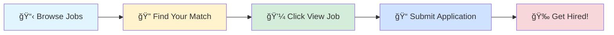

# 🚀 Tech Jobs Board

### Your Gateway to Amazing Career Opportunities

---

## 🎯 Browse by Job Profile

<table>
<tr>
<td align="center" width="25%">

 
<b>1000</b> total positions
</td>
<td align="center" width="25%">

 
<b>1000</b> total positions
</td>
<td align="center" width="25%">

 
<b>1000</b> total positions
</td>
<td align="center" width="25%">

 
<b>1000</b> total positions
</td>
</tr>
</table>

---

## 📊 Data Scientist

> 💼 **1000** positions available

<table>
<thead>
<tr>
<th width="20%">🏢 Company</th>
<th width="35%">💼 Role</th>
<th width="20%">📍 Location</th>
<th width="10%">⏰ Posted</th>
<th width="15%">🔗 Action</th>
</tr>
</thead>
<tbody>
<tr>
<td><a href="https://www.linkedin.com/company/skillfiedmentor">SkillFied Mentor</a></td>
<td>Excel & SQL Data Analyst Intern</td>
<td>📍 India</td>
<td>1d ago</td>
<td align="center"></td>
</tr>
<tr>
<td><a href="https://www.linkedin.com/company/skillfiedmentor">SkillFied Mentor</a></td>
<td>SQL & Excel Business Analyst Intern</td>
<td>📍 India</td>
<td>1d ago</td>
<td align="center"></td>
</tr>
<tr>
<td><a href="https://de.linkedin.com/company/simon-kucher">Simon-Kucher</a></td>
<td>Praktikum Data Engineer im Bereich Advanced Analytics (m/w/d)</td>
<td></td>
<td>1d ago</td>
<td align="center"></td>
</tr>
<tr>
<td><a href="https://de.linkedin.com/company/simon-kucher">Simon-Kucher</a></td>
<td>Data Scientist Intern (m/f/d) - Stage de fin d’études</td>
<td></td>
<td>1d ago</td>
<td align="center"></td>
</tr>
<tr>
<td><a href="https://de.linkedin.com/company/simon-kucher">Simon-Kucher</a></td>
<td>Praktikum Data Engineer im Bereich Advanced Analytics (m/w/d)</td>
<td></td>
<td>1d ago</td>
<td align="center"></td>
</tr>
<tr>
<td><a href="https://www.linkedin.com/company/medtoureasy-hyde">MedtourEasy Hyderabad</a></td>
<td>Data Analysis Trainee</td>
<td>📍 India</td>
<td>1d ago</td>
<td align="center"></td>
</tr>
<tr>
<td><a href="https://de.linkedin.com/company/simon-kucher">Simon-Kucher</a></td>
<td>Praktikum Data Engineer im Bereich Advanced Analytics (m/w/d)</td>
<td></td>
<td>1d ago</td>
<td align="center"></td>
</tr>
<tr>
<td><a href="https://www.linkedin.com/company/medtoureasy">MedTourEasy Bengaluru</a></td>
<td>Data Analysis Trainee</td>
<td>📍 India</td>
<td>1d ago</td>
<td align="center"></td>
</tr>
<tr>
<td><a href="https://www.linkedin.com/company/tiktok">TikTok</a></td>
<td>Data Science Graduate (Advertisement Team) - 2026 Start (PhD)</td>
<td></td>
<td>1d ago</td>
<td align="center"></td>
</tr>
<tr>
<td><a href="https://cn.linkedin.com/company/bytedance">ByteDance</a></td>
<td>Data Scientist Graduate (E-Commerce Governance)-2026 Start (BS/MS)</td>
<td></td>
<td>1d ago</td>
<td align="center"></td>
</tr>
<tr>
<td><a href="https://eg.linkedin.com/company/xceed">Xceed</a></td>
<td>Quality Monitoring Specialist ( English B2);</td>
<td></td>
<td>1d ago</td>
<td align="center"></td>
</tr>
<tr>
<td><a href="https://in.linkedin.com/company/medtoureas">MedTourEasy Mumbai</a></td>
<td>Data Analytics Trainee</td>
<td>📍 India</td>
<td>1d ago</td>
<td align="center"></td>
</tr>
<tr>
<td><a href="https://in.linkedin.com/company/webboostsolutionait">WEBBOOST SOLUTION IT SERVICES</a></td>
<td>Data Science Intern</td>
<td>📍 India</td>
<td>1d ago</td>
<td align="center"></td>
</tr>
<tr>
<td><a href="https://in.linkedin.com/company/medtoureasyyy-gurugram">MedTourEasy Gurugram</a></td>
<td>Data Analysis Trainee</td>
<td>📍 India</td>
<td>1d ago</td>
<td align="center"></td>
</tr>
<tr>
<td><a href="https://www.linkedin.com/company/medtoureasy">MedTourEasy Bengaluru</a></td>
<td>Data Analysis Trainee</td>
<td>📍 India</td>
<td>1d ago</td>
<td align="center"></td>
</tr>
<tr>
<td><a href="https://www.linkedin.com/company/medtoureasy-hyde">MedtourEasy Hyderabad</a></td>
<td>Data Analysis Trainee</td>
<td>📍 India</td>
<td>1d ago</td>
<td align="center"></td>
</tr>
<tr>
<td><a href="https://www.linkedin.com/company/pintals">PinTals</a></td>
<td>Data Science Intern</td>
<td>📍 Mumbai</td>
<td>1d ago</td>
<td align="center"></td>
</tr>
<tr>
<td><a href="https://de.linkedin.com/company/imo-unternehmensgruppe">IMO Group</a></td>
<td>Anwendungsingenieure m/w/d für die Märkte Nordamerika und Europa</td>
<td></td>
<td>1d ago</td>
<td align="center"></td>
</tr>
<tr>
<td><a href="https://de.linkedin.com/company/molkereigropper">Molkerei Gropper GmbH & Co. KG</a></td>
<td>Initiativstelle Abschlussarbeit für Studenten (m/w/d)</td>
<td></td>
<td>1d ago</td>
<td align="center"></td>
</tr>
<tr>
<td><a href="https://de.linkedin.com/company/molkereigropper">Molkerei Gropper GmbH & Co. KG</a></td>
<td>Ausbildung Elektroniker für Betriebstechnik (m/w/d) - Start 2026</td>
<td></td>
<td>1d ago</td>
<td align="center"></td>
</tr>
<tr>
<td><a href="https://in.linkedin.com/company/tata-consultancy-services">Tata Consultancy Services</a></td>
<td>AWS Senior Data Engineer</td>
<td>📍 Hyderabad</td>
<td>1d ago</td>
<td align="center"></td>
</tr>
<tr>
<td><a href="https://be.linkedin.com/company/evs-broadcast-equipment">EVS Broadcast Equipment</a></td>
<td>Software Engineer in Test Automation</td>
<td></td>
<td>1d ago</td>
<td align="center"></td>
</tr>
<tr>
<td><a href="https://in.linkedin.com/company/tata-consultancy-services">Tata Consultancy Services</a></td>
<td>AWS Data Engineer</td>
<td>📍 Hyderabad</td>
<td>1d ago</td>
<td align="center"></td>
</tr>
<tr>
<td><a href="https://eg.linkedin.com/school/giu-as/">German International University - GIU</a></td>
<td>Teaching Assistant - Informatics and Computer Science</td>
<td></td>
<td>1d ago</td>
<td align="center"></td>
</tr>
<tr>
<td><a href="https://in.linkedin.com/company/ltimindtree">LTIMindtree</a></td>
<td>Data Scientist</td>
<td>📍 Pune</td>
<td>1d ago</td>
<td align="center"></td>
</tr>
<tr>
<td><a href="https://de.linkedin.com/company/bruederkrankenhaustrier">Krankenhaus der Barmherzigen Brüder Trier</a></td>
<td>AUSZUBILDENDE/R KAUFFRAU/KAUFMANNFÜR BÜROMANAGEMENT (m/w/d)</td>
<td></td>
<td>1d ago</td>
<td align="center"></td>
</tr>
<tr>
<td><a href="https://in.linkedin.com/company/tata-consultancy-services">Tata Consultancy Services</a></td>
<td>Azure Data Engineer</td>
<td>📍 Hyderabad</td>
<td>1d ago</td>
<td align="center"></td>
</tr>
<tr>
<td><a href="https://www.linkedin.com/company/ibm">IBM</a></td>
<td>Capacity Analytics Engineer</td>
<td>📍 Bangalore</td>
<td>1d ago</td>
<td align="center"></td>
</tr>
<tr>
<td><a href="https://de.linkedin.com/company/wesser-gmbh">Wesser GmbH</a></td>
<td>Promoter für Deutschlandweite Reisekampagne (m/w/d)</td>
<td></td>
<td>1d ago</td>
<td align="center"></td>
</tr>
<tr>
<td><a href="https://de.linkedin.com/company/mrs-electronic-group">MRS Electronic Group</a></td>
<td>Junior Softwareentwickler für Connectivity-/IoT-Systeme (m/w/d)</td>
<td></td>
<td>1d ago</td>
<td align="center"></td>
</tr>
<tr>
<td><a href="https://de.linkedin.com/company/wesser-gmbh">Wesser GmbH</a></td>
<td>Promoter für Deutschlandweite Reisekampagne (m/w/d)</td>
<td></td>
<td>1d ago</td>
<td align="center"></td>
</tr>
<tr>
<td><a href="https://in.linkedin.com/company/tata-consultancy-services">Tata Consultancy Services</a></td>
<td>GCP Data Engineer</td>
<td>📍 Hyderabad</td>
<td>1d ago</td>
<td align="center"></td>
</tr>
<tr>
<td><a href="https://tw.linkedin.com/company/frenchtech-taiwan">La French Tech Taiwan</a></td>
<td>Data Scientist – Computer Vision H/F/X</td>
<td></td>
<td>1d ago</td>
<td align="center"></td>
</tr>
<tr>
<td><a href="https://in.linkedin.com/company/spurqlabs">SpurQLabs | Next-Generation Software Testing & Test Automation Services</a></td>
<td>Sr. Automation Test Engineer –JavaScript-Playwright(5–8 Yrs Exp)</td>
<td>📍 Pune</td>
<td>1d ago</td>
<td align="center"></td>
</tr>
<tr>
<td><a href="https://sg.linkedin.com/company/hlfinance">Hong Leong Finance Limited</a></td>
<td>Cloud Engineer (AWS) / Solution Architect</td>
<td></td>
<td>1d ago</td>
<td align="center"></td>
</tr>
<tr>
<td><a href="https://www.linkedin.com/company/jobs-via-dice">Jobs via Dice</a></td>
<td>Software Engineer I (Python, Web Development, LLM)</td>
<td></td>
<td>1d ago</td>
<td align="center"></td>
</tr>
<tr>
<td><a href="https://www.linkedin.com/company/ims-r%C3%B6ntgensysteme-gmbh">IMS Röntgensysteme GmbH</a></td>
<td>Entwicklungsingenieur (m/w/i) für digitale Inspektionssysteme</td>
<td></td>
<td>1d ago</td>
<td align="center"></td>
</tr>
<tr>
<td><a href="https://www.linkedin.com/company/medtoureasy-hyde">MedtourEasy Hyderabad</a></td>
<td>Data Analysis Trainee</td>
<td>📍 India</td>
<td>1d ago</td>
<td align="center"></td>
</tr>
<tr>
<td><a href="https://de.linkedin.com/company/imo-unternehmensgruppe">IMO Group</a></td>
<td>Elektroniker (Elektriker) m/w/d für Energie- und Gebäudetechnik</td>
<td></td>
<td>1d ago</td>
<td align="center"></td>
</tr>
<tr>
<td><a href="https://in.linkedin.com/company/infosys">Infosys</a></td>
<td>Azure SME</td>
<td>📍 Bangalore</td>
<td>1d ago</td>
<td align="center"></td>
</tr>
<tr>
<td><a href="https://in.linkedin.com/company/infosys">Infosys</a></td>
<td>c sharp automation lead</td>
<td>📍 Bangalore</td>
<td>1d ago</td>
<td align="center"></td>
</tr>
<tr>
<td><a href="https://in.linkedin.com/company/infosys">Infosys</a></td>
<td>Python Senior Developer</td>
<td>📍 Bangalore</td>
<td>1d ago</td>
<td align="center"></td>
</tr>
<tr>
<td><a href="https://in.linkedin.com/company/infosys">Infosys</a></td>
<td>QA Automation Engineer</td>
<td>📍 Chandigarh, Chandigarh, India</td>
<td>1d ago</td>
<td align="center"></td>
</tr>
<tr>
<td><a href="https://in.linkedin.com/company/infosys">Infosys</a></td>
<td>Python Lead</td>
<td>📍 Chennai</td>
<td>1d ago</td>
<td align="center"></td>
</tr>
<tr>
<td><a href="https://in.linkedin.com/company/talentgigs">Talentgigs</a></td>
<td>Full Stack Engineer - React/Python</td>
<td>📍 Chennai</td>
<td>1d ago</td>
<td align="center"></td>
</tr>
<tr>
<td><a href="https://in.linkedin.com/company/talentgigs">Talentgigs</a></td>
<td>Python Developer - AWS</td>
<td>📍 Hyderabad</td>
<td>1d ago</td>
<td align="center"></td>
</tr>
<tr>
<td><a href="https://www.linkedin.com/company/sunbit">Sunbit</a></td>
<td>Machine Learning Engineer</td>
<td>📍 Binyamina - Givat Ada, Haifa District, Israel</td>
<td>1d ago</td>
<td align="center"></td>
</tr>
<tr>
<td><a href="https://www.linkedin.com/company/sunbit">Sunbit</a></td>
<td>Python Developer</td>
<td>📍 Binyamina - Givat Ada, Haifa District, Israel</td>
<td>1d ago</td>
<td align="center"></td>
</tr>
<tr>
<td><a href="https://in.linkedin.com/company/best-job-tool">Best Job Tool</a></td>
<td>Data Scientist</td>
<td>📍 United Kingdom</td>
<td>1d ago</td>
<td align="center"></td>
</tr>
<tr>
<td><a href="https://www.linkedin.com/company/medtoureasy">MedTourEasy Bengaluru</a></td>
<td>Data Analysis Trainee</td>
<td>📍 India</td>
<td>1d ago</td>
<td align="center"></td>
</tr>
<tr>
<td><a href="https://de.linkedin.com/company/techtory">TECHTORY Automation GmbH</a></td>
<td>SPS-Programmierer*in Automation</td>
<td>📍 Appenweier, Baden-Württemberg, Germany</td>
<td>1d ago</td>
<td align="center"></td>
</tr>
<tr>
<td><a href="https://in.linkedin.com/company/reallives-foundation">RealLives Foundation - The Empathy Gamification</a></td>
<td>Internship Opportunity – Node.js / Python Developer – RealLives Foundation</td>
<td>📍 Pune</td>
<td>1d ago</td>
<td align="center"></td>
</tr>
<tr>
<td><a href="https://www.linkedin.com/company/medtoureasy-hyde">MedtourEasy Hyderabad</a></td>
<td>Data Analysis Trainee</td>
<td>📍 India</td>
<td>1d ago</td>
<td align="center"></td>
</tr>
<tr>
<td><a href="https://www.linkedin.com/company/global-classrooms-llc">Global Classrooms L.L.C</a></td>
<td>Artificial Intelligence Intern</td>
<td>📍 Hyderabad</td>
<td>1d ago</td>
<td align="center"></td>
</tr>
<tr>
<td><a href="https://www.linkedin.com/company/webs-it-solution">Webs IT Solution</a></td>
<td>Python Developer Intern</td>
<td>📍 India</td>
<td>1d ago</td>
<td align="center"></td>
</tr>
<tr>
<td><a href="https://de.linkedin.com/company/kloepferholz">Klöpferholz GmbH & Co. KG</a></td>
<td>Vertriebsmitarbeiter für Holzbau und Hobelware (m/w/d)</td>
<td></td>
<td>1d ago</td>
<td align="center"></td>
</tr>
<tr>
<td><a href="https://de.linkedin.com/company/kloepferholz">Klöpferholz GmbH & Co. KG</a></td>
<td>kaufmännische Assistenz (m/w/d) für die Standortleitung Hamburg (Obtüra)</td>
<td>📍 Hamburg, Hamburg, Germany</td>
<td>1d ago</td>
<td align="center"></td>
</tr>
<tr>
<td><a href="https://www.linkedin.com/company/cozzera">Cozzera</a></td>
<td>Python Developer</td>
<td>📍 Noida</td>
<td>1d ago</td>
<td align="center"></td>
</tr>
<tr>
<td><a href="https://www.linkedin.com/company/um-it-solutions">UM IT Solutions</a></td>
<td>Machine Learning Intern</td>
<td>📍 India</td>
<td>1d ago</td>
<td align="center"></td>
</tr>
<tr>
<td><a href="https://www.linkedin.com/company/um-it-solutions">UM IT Solutions</a></td>
<td>Artificial Intelligence Intern</td>
<td>📍 India</td>
<td>1d ago</td>
<td align="center"></td>
</tr>
<tr>
<td><a href="https://uk.linkedin.com/company/arm">Arm</a></td>
<td>Senior System Quality Test and Automation Engineer</td>
<td>📍 Cambridge, England, United Kingdom</td>
<td>1d ago</td>
<td align="center"></td>
</tr>
<tr>
<td><a href="https://in.linkedin.com/company/confidential-career">Confidential</a></td>
<td>Artificial Intelligence Engineer</td>
<td>📍 EMEA</td>
<td>1d ago</td>
<td align="center"></td>
</tr>
<tr>
<td><a href="https://www.linkedin.com/company/sands-capital-management">Sands Capital</a></td>
<td>Data and Analytics Intern (Fall Semester; Hybrid)</td>
<td></td>
<td>1d ago</td>
<td align="center"></td>
</tr>
<tr>
<td><a href="https://uk.linkedin.com/company/arm">Arm</a></td>
<td>Senior System Quality Test and Automation Engineer</td>
<td></td>
<td>1d ago</td>
<td align="center"></td>
</tr>
<tr>
<td><a href="https://in.linkedin.com/company/medtoureas">MedTourEasy Mumbai</a></td>
<td>Data Analytics Trainee</td>
<td>📍 India</td>
<td>1d ago</td>
<td align="center"></td>
</tr>
<tr>
<td><a href="https://kr.linkedin.com/school/ustuniversityofscienceandtechnologykorea/">(UST) University of Science and Technology, Korea</a></td>
<td>Ph.D. position or Master's in AI(Artificial Intelligence) and Robotics</td>
<td></td>
<td>1d ago</td>
<td align="center"></td>
</tr>
<tr>
<td><a href="https://www.linkedin.com/company/custom-capital-strategies">Custom Capital</a></td>
<td>Analytics Engineer / Data Platform Lead</td>
<td>📍 United States</td>
<td>1d ago</td>
<td align="center"></td>
</tr>
<tr>
<td><a href="https://www.linkedin.com/company/medtoureasy">MedTourEasy Bengaluru</a></td>
<td>Data Analysis Trainee</td>
<td>📍 India</td>
<td>1d ago</td>
<td align="center"></td>
</tr>
<tr>
<td><a href="https://in.linkedin.com/company/webboostsolutionait">WEBBOOST SOLUTION IT SERVICES</a></td>
<td>Data Science Intern</td>
<td>📍 India</td>
<td>1d ago</td>
<td align="center"></td>
</tr>
<tr>
<td><a href="https://www.linkedin.com/company/jobunifiedmentor">UM IT PRIVATE LIMITED</a></td>
<td>Data Science Intern</td>
<td>📍 India</td>
<td>1d ago</td>
<td align="center"></td>
</tr>
<tr>
<td><a href="https://www.linkedin.com/company/um-it-solutions">UM IT Solutions</a></td>
<td>Machine Learning Intern</td>
<td>📍 India</td>
<td>1d ago</td>
<td align="center"></td>
</tr>
<tr>
<td><a href="https://in.linkedin.com/company/webboostsolutionait">WEBBOOST SOLUTION IT SERVICES</a></td>
<td>Python Developer Intern</td>
<td>📍 India</td>
<td>1d ago</td>
<td align="center"></td>
</tr>
<tr>
<td><a href="https://www.linkedin.com/company/jobunifiedmentor">UM IT PRIVATE LIMITED</a></td>
<td>Data Science Intern</td>
<td>📍 India</td>
<td>1d ago</td>
<td align="center"></td>
</tr>
<tr>
<td><a href="https://www.linkedin.com/company/tezo">Tezo</a></td>
<td>Data Scientist</td>
<td>📍 Hyderabad</td>
<td>1d ago</td>
<td align="center"></td>
</tr>
<tr>
<td><a href="https://www.linkedin.com/company/webs-it-solution">Webs IT Solution</a></td>
<td>Data Science Intern</td>
<td>📍 India</td>
<td>1d ago</td>
<td align="center"></td>
</tr>
<tr>
<td><a href="https://www.linkedin.com/company/quantum-integrators-group-llc">Quantum Integrators</a></td>
<td>Senior Python Developer</td>
<td>📍 Pune</td>
<td>1d ago</td>
<td align="center"></td>
</tr>
<tr>
<td><a href="https://www.linkedin.com/company/solarturbines">Solar Turbines</a></td>
<td>Software Engineer (Python)</td>
<td></td>
<td>1d ago</td>
<td align="center"></td>
</tr>
<tr>
<td><a href="https://www.linkedin.com/company/webs-it-solution">Webs IT Solution</a></td>
<td>Machine Learning Intern</td>
<td>📍 India</td>
<td>1d ago</td>
<td align="center"></td>
</tr>
<tr>
<td><a href="https://www.linkedin.com/company/webs-it-solution">Webs IT Solution</a></td>
<td>Python Developer Intern</td>
<td>📍 India</td>
<td>1d ago</td>
<td align="center"></td>
</tr>
<tr>
<td><a href="https://www.linkedin.com/company/usamsmartlivings">Usam Concepts Pvt Ltd</a></td>
<td>Home Automation Engineer</td>
<td>📍 Jaipur, Rajasthan, India</td>
<td>1d ago</td>
<td align="center"></td>
</tr>
<tr>
<td><a href="https://in.linkedin.com/company/tata-consultancy-services">Tata Consultancy Services</a></td>
<td>Data Scientist - Supply Chain Management</td>
<td></td>
<td>1d ago</td>
<td align="center"></td>
</tr>
<tr>
<td><a href="https://in.linkedin.com/company/tata-consultancy-services">Tata Consultancy Services</a></td>
<td>Data Scientist</td>
<td></td>
<td>1d ago</td>
<td align="center"></td>
</tr>
<tr>
<td><a href="https://uk.linkedin.com/company/michael-page">Michael Page</a></td>
<td>Head Of Smart Operations & AI Automation - HYD, (12-18 YOE)</td>
<td>📍 Hyderabad</td>
<td>1d ago</td>
<td align="center"></td>
</tr>
<tr>
<td><a href="https://www.linkedin.com/company/webs-it-solution">Webs IT Solution</a></td>
<td>Artificial Intelligence Intern</td>
<td>📍 India</td>
<td>1d ago</td>
<td align="center"></td>
</tr>
<tr>
<td><a href="https://www.linkedin.com/company/hermed-technische-beratungs-gmbh">HERMED Technische Beratungs GmbH</a></td>
<td>Medizintechniker / Servicetechniker (m/w/d) für Pirmasens, Kassel, Siegen, Annaberg und die Region Saarland</td>
<td>📍 Siegen, North Rhine-Westphalia, Germany</td>
<td>1d ago</td>
<td align="center"></td>
</tr>
<tr>
<td><a href="https://www.linkedin.com/company/hermed-technische-beratungs-gmbh">HERMED Technische Beratungs GmbH</a></td>
<td>Medizintechniker / Servicetechniker (m/w/d) für Pirmasens, Kassel, Siegen, Annaberg und die Region Saarland</td>
<td>📍 Greater Kassel Area</td>
<td>1d ago</td>
<td align="center"></td>
</tr>
<tr>
<td><a href="https://www.linkedin.com/company/hermed-technische-beratungs-gmbh">HERMED Technische Beratungs GmbH</a></td>
<td>Medizintechniker / Servicetechniker (m/w/d) für Darmstadt, Frankfurt, Böblingen und Kaufbeuren</td>
<td>📍 Böblingen, Baden-Württemberg, Germany</td>
<td>1d ago</td>
<td align="center"></td>
</tr>
<tr>
<td><a href="https://www.linkedin.com/company/hermed-technische-beratungs-gmbh">HERMED Technische Beratungs GmbH</a></td>
<td>Medizintechniker / Servicetechniker (m/w/d) für Darmstadt, Frankfurt, Böblingen und Kaufbeuren</td>
<td>📍 Darmstadt, Hesse, Germany</td>
<td>1d ago</td>
<td align="center"></td>
</tr>
<tr>
<td><a href="https://www.linkedin.com/company/um-it-solutions">UM IT Solutions</a></td>
<td>Artificial Intelligence Intern</td>
<td>📍 India</td>
<td>1d ago</td>
<td align="center"></td>
</tr>
<tr>
<td><a href="https://at.linkedin.com/company/rosenbauer-group">Rosenbauer Group</a></td>
<td>Student/-in (m/w/d) für Praxissemester Bachelor of Engineering - Bereich Qualitätsmanagement</td>
<td>📍 Karlsruhe, Baden-Württemberg, Germany</td>
<td>1d ago</td>
<td align="center"></td>
</tr>
<tr>
<td><a href="https://www.linkedin.com/company/%E5%87%AF%E6%98%93%E8%AE%AF%E7%BD%91%E7%BB%9C%E6%8A%80%E6%9C%AF%E5%BC%80%E5%8F%91-%E5%8D%97%E4%BA%AC-%E6%9C%89%E9%99%90%E5%85%AC%E5%8F%B8">凯易讯网络技术开发(南京)有限公司</a></td>
<td>自动化测试开发实习生(Python)</td>
<td>📍 Nanjing, Jiangsu, China</td>
<td>1d ago</td>
<td align="center"></td>
</tr>
<tr>
<td><a href="https://www.linkedin.com/company/bayone-solutions">BayOne Solutions</a></td>
<td>Network Python  Engineer</td>
<td>📍 India</td>
<td>1d ago</td>
<td align="center"></td>
</tr>
<tr>
<td><a href="https://au.linkedin.com/company/chamonix-it">Chamonix IT</a></td>
<td>Senior Azure Cloud Engineer (VIC)</td>
<td></td>
<td>1d ago</td>
<td align="center"></td>
</tr>
<tr>
<td><a href="https://www.linkedin.com/company/medtoureasy-hyde">MedtourEasy Hyderabad</a></td>
<td>Data Analysis Trainee</td>
<td>📍 India</td>
<td>1d ago</td>
<td align="center"></td>
</tr>
<tr>
<td><a href="https://om.linkedin.com/company/thisisoq8">OQ8</a></td>
<td>Sr. Engineer Condition Monitoring</td>
<td></td>
<td>1d ago</td>
<td align="center"></td>
</tr>
<tr>
<td>Itester</td>
<td>Generative AI and AI/ML Intern - Unpaid 6 months AIvidya.org</td>
<td>📍 Hyderabad</td>
<td>1d ago</td>
<td align="center"></td>
</tr>
<tr>
<td><a href="https://nl.linkedin.com/company/stahl">Stahl</a></td>
<td>Junior R&D Chemist</td>
<td></td>
<td>1d ago</td>
<td align="center"></td>
</tr>
<tr>
<td><a href="https://ma.linkedin.com/school/um6p/">UM6P - University Mohammed VI Polytechnic</a></td>
<td>VANGUARD - SASE - Scientist in Data Science and Machine Learning</td>
<td></td>
<td>1d ago</td>
<td align="center"></td>
</tr>
<tr>
<td><a href="https://www.linkedin.com/company/bayone-solutions">BayOne Solutions</a></td>
<td>AI/ML Engineer</td>
<td>📍 India</td>
<td>1d ago</td>
<td align="center"></td>
</tr>
<tr>
<td><a href="https://uk.linkedin.com/school/durham-university/">Durham University</a></td>
<td>Assistant / Associate Professor in Computer Science</td>
<td>📍 Durham, England, United Kingdom</td>
<td>1d ago</td>
<td align="center"></td>
</tr>
<tr><td colspan="5" align="center"><i>... and 900 more positions</i></td></tr>
</tbody>
</table>

---

## 💼 Business Analyst

> 💼 **1000** positions available

<table>
<thead>
<tr>
<th width="20%">🏢 Company</th>
<th width="35%">💼 Role</th>
<th width="20%">📍 Location</th>
<th width="10%">⏰ Posted</th>
<th width="15%">🔗 Action</th>
</tr>
</thead>
<tbody>
<tr>
<td><a href="https://www.linkedin.com/company/skillfiedmentor">SkillFied Mentor</a></td>
<td>Business Analyst Intern</td>
<td>📍 India</td>
<td>1d ago</td>
<td align="center"></td>
</tr>
<tr>
<td><a href="https://www.linkedin.com/company/skillfiedmentor">SkillFied Mentor</a></td>
<td>Business Analyst</td>
<td>📍 India</td>
<td>1d ago</td>
<td align="center"></td>
</tr>
<tr>
<td><a href="https://www.linkedin.com/company/skillfiedmentor">SkillFied Mentor</a></td>
<td>Excel & SQL Data Analyst Intern</td>
<td>📍 India</td>
<td>1d ago</td>
<td align="center"></td>
</tr>
<tr>
<td><a href="https://www.linkedin.com/company/skillfiedmentor">SkillFied Mentor</a></td>
<td>SQL & Excel Business Analyst Intern</td>
<td>📍 India</td>
<td>1d ago</td>
<td align="center"></td>
</tr>
<tr>
<td><a href="https://de.linkedin.com/company/simon-kucher">Simon-Kucher</a></td>
<td>Praktikum Data Engineer im Bereich Advanced Analytics (m/w/d)</td>
<td></td>
<td>1d ago</td>
<td align="center"></td>
</tr>
<tr>
<td><a href="https://de.linkedin.com/company/simon-kucher">Simon-Kucher</a></td>
<td>Praktikum Data Engineer im Bereich Advanced Analytics (m/w/d)</td>
<td></td>
<td>1d ago</td>
<td align="center"></td>
</tr>
<tr>
<td><a href="https://www.linkedin.com/company/medtoureasy-hyde">MedtourEasy Hyderabad</a></td>
<td>Data Analysis Trainee</td>
<td>📍 India</td>
<td>1d ago</td>
<td align="center"></td>
</tr>
<tr>
<td><a href="https://de.linkedin.com/company/simon-kucher">Simon-Kucher</a></td>
<td>Praktikum Data Engineer im Bereich Advanced Analytics (m/w/d)</td>
<td></td>
<td>1d ago</td>
<td align="center"></td>
</tr>
<tr>
<td><a href="https://www.linkedin.com/company/medtoureasy">MedTourEasy Bengaluru</a></td>
<td>Data Analysis Trainee</td>
<td>📍 India</td>
<td>1d ago</td>
<td align="center"></td>
</tr>
<tr>
<td><a href="https://in.linkedin.com/company/medtoureas">MedTourEasy Mumbai</a></td>
<td>Data Analytics Trainee</td>
<td>📍 India</td>
<td>1d ago</td>
<td align="center"></td>
</tr>
<tr>
<td><a href="https://in.linkedin.com/company/medtoureasyyy-gurugram">MedTourEasy Gurugram</a></td>
<td>Data Analysis Trainee</td>
<td>📍 India</td>
<td>1d ago</td>
<td align="center"></td>
</tr>
<tr>
<td><a href="https://www.linkedin.com/company/medtoureasy">MedTourEasy Bengaluru</a></td>
<td>Data Analysis Trainee</td>
<td>📍 India</td>
<td>1d ago</td>
<td align="center"></td>
</tr>
<tr>
<td><a href="https://www.linkedin.com/company/medtoureasy-hyde">MedtourEasy Hyderabad</a></td>
<td>Data Analysis Trainee</td>
<td>📍 India</td>
<td>1d ago</td>
<td align="center"></td>
</tr>
<tr>
<td><a href="https://sa.linkedin.com/company/supertech-innovation-labs">Supertech Innovation Labs</a></td>
<td>Senior Business Analyst</td>
<td></td>
<td>1d ago</td>
<td align="center"></td>
</tr>
<tr>
<td><a href="https://es.linkedin.com/company/bolsabme">BME | Bolsas y Mercados Españoles</a></td>
<td>Business Analyst</td>
<td></td>
<td>1d ago</td>
<td align="center"></td>
</tr>
<tr>
<td><a href="https://nl.linkedin.com/company/hr-recruiters-nl">HR Recruiters</a></td>
<td>HR Business Consultant</td>
<td></td>
<td>1d ago</td>
<td align="center"></td>
</tr>
<tr>
<td><a href="https://be.linkedin.com/company/evs-broadcast-equipment">EVS Broadcast Equipment</a></td>
<td>Software Engineer in Test Automation</td>
<td></td>
<td>1d ago</td>
<td align="center"></td>
</tr>
<tr>
<td><a href="https://eg.linkedin.com/school/giu-as/">German International University - GIU</a></td>
<td>Teaching Assistant - Informatics and Computer Science</td>
<td></td>
<td>1d ago</td>
<td align="center"></td>
</tr>
<tr>
<td><a href="https://www.linkedin.com/company/ibm">IBM</a></td>
<td>Capacity Analytics Engineer</td>
<td>📍 Bangalore</td>
<td>1d ago</td>
<td align="center"></td>
</tr>
<tr>
<td><a href="https://jp.linkedin.com/company/lixil-global">LIXIL</a></td>
<td>Senior Salesforce Developer</td>
<td>📍 Gurugram</td>
<td>1d ago</td>
<td align="center"></td>
</tr>
<tr>
<td><a href="https://in.linkedin.com/company/workassist-in">Workassist</a></td>
<td>Jira System Administrator</td>
<td>📍 Chennai</td>
<td>1d ago</td>
<td align="center"></td>
</tr>
<tr>
<td><a href="https://www.linkedin.com/company/qualys">Qualys</a></td>
<td>Lead Salesforce Developer</td>
<td>📍 Pune</td>
<td>1d ago</td>
<td align="center"></td>
</tr>
<tr>
<td><a href="https://in.linkedin.com/company/infosys">Infosys</a></td>
<td>Business Analyst - Metricstream</td>
<td>📍 Bangalore</td>
<td>1d ago</td>
<td align="center"></td>
</tr>
<tr>
<td><a href="https://in.linkedin.com/company/spurqlabs">SpurQLabs | Next-Generation Software Testing & Test Automation Services</a></td>
<td>Sr. Automation Test Engineer –JavaScript-Playwright(5–8 Yrs Exp)</td>
<td>📍 Pune</td>
<td>1d ago</td>
<td align="center"></td>
</tr>
<tr>
<td><a href="https://www.linkedin.com/company/talentify-io">Talentify.io</a></td>
<td>REMOTE QA Documentation Specialist, Medical Device</td>
<td></td>
<td>1d ago</td>
<td align="center"></td>
</tr>
<tr>
<td><a href="https://www.linkedin.com/company/talentify-io">Talentify.io</a></td>
<td>REMOTE Quality Assurance Documentation Specialist</td>
<td></td>
<td>1d ago</td>
<td align="center"></td>
</tr>
<tr>
<td><a href="https://www.linkedin.com/company/jobs-via-dice">Jobs via Dice</a></td>
<td>Software Engineer I (Python, Web Development, LLM)</td>
<td></td>
<td>1d ago</td>
<td align="center"></td>
</tr>
<tr>
<td><a href="https://www.linkedin.com/company/medtoureasy-hyde">MedtourEasy Hyderabad</a></td>
<td>Data Analysis Trainee</td>
<td>📍 India</td>
<td>1d ago</td>
<td align="center"></td>
</tr>
<tr>
<td><a href="https://in.linkedin.com/company/howdy-chats">Howdy Chats</a></td>
<td>Jr Business analyst</td>
<td>📍 Chennai</td>
<td>1d ago</td>
<td align="center"></td>
</tr>
<tr>
<td><a href="https://www.linkedin.com/company/bnyglobal">BNY</a></td>
<td>Associate, Business Analyst  - Controls Hub Team</td>
<td></td>
<td>1d ago</td>
<td align="center"></td>
</tr>
<tr>
<td><a href="https://sg.linkedin.com/company/prudential-assurance-company-singapore">Prudential Assurance Company Singapore</a></td>
<td>Project Management Lead (2 Years Contract)</td>
<td></td>
<td>1d ago</td>
<td align="center"></td>
</tr>
<tr>
<td><a href="https://in.linkedin.com/company/infosys">Infosys</a></td>
<td>IT Consulting - Q3 (Multiple openings - Atlassian-Jira, Shell Scripting, DevOps-platform developer)</td>
<td>📍 Bangalore</td>
<td>1d ago</td>
<td align="center"></td>
</tr>
<tr>
<td><a href="https://in.linkedin.com/company/infosys">Infosys</a></td>
<td>Salesforce Technology Lead/Consultant</td>
<td>📍 Bangalore</td>
<td>1d ago</td>
<td align="center"></td>
</tr>
<tr>
<td><a href="https://in.linkedin.com/company/infosys">Infosys</a></td>
<td>Scrum Master Consultant</td>
<td>📍 Bangalore</td>
<td>1d ago</td>
<td align="center"></td>
</tr>
<tr>
<td><a href="https://in.linkedin.com/company/infosys">Infosys</a></td>
<td>c sharp automation lead</td>
<td>📍 Bangalore</td>
<td>1d ago</td>
<td align="center"></td>
</tr>
<tr>
<td><a href="https://in.linkedin.com/company/infosys">Infosys</a></td>
<td>Python Senior Developer</td>
<td>📍 Bangalore</td>
<td>1d ago</td>
<td align="center"></td>
</tr>
<tr>
<td><a href="https://in.linkedin.com/company/infosys">Infosys</a></td>
<td>QA Automation Engineer</td>
<td>📍 Chandigarh, Chandigarh, India</td>
<td>1d ago</td>
<td align="center"></td>
</tr>
<tr>
<td><a href="https://in.linkedin.com/company/infosys">Infosys</a></td>
<td>Python Lead</td>
<td>📍 Chennai</td>
<td>1d ago</td>
<td align="center"></td>
</tr>
<tr>
<td><a href="https://in.linkedin.com/company/talentgigs">Talentgigs</a></td>
<td>Full Stack Engineer - React/Python</td>
<td>📍 Chennai</td>
<td>1d ago</td>
<td align="center"></td>
</tr>
<tr>
<td><a href="https://in.linkedin.com/company/yoshops">Yoshops.com</a></td>
<td>Business Analyst Intern</td>
<td>📍 Gurugram</td>
<td>1d ago</td>
<td align="center"></td>
</tr>
<tr>
<td><a href="https://in.linkedin.com/company/talentgigs">Talentgigs</a></td>
<td>Python Developer - AWS</td>
<td>📍 Hyderabad</td>
<td>1d ago</td>
<td align="center"></td>
</tr>
<tr>
<td><a href="https://www.linkedin.com/company/sunbit">Sunbit</a></td>
<td>Python Developer</td>
<td>📍 Binyamina - Givat Ada, Haifa District, Israel</td>
<td>1d ago</td>
<td align="center"></td>
</tr>
<tr>
<td><a href="https://in.linkedin.com/company/best-job-tool">Best Job Tool</a></td>
<td>Business Analyst</td>
<td>📍 United Kingdom</td>
<td>1d ago</td>
<td align="center"></td>
</tr>
<tr>
<td><a href="https://www.linkedin.com/company/medtoureasy">MedTourEasy Bengaluru</a></td>
<td>Data Analysis Trainee</td>
<td>📍 India</td>
<td>1d ago</td>
<td align="center"></td>
</tr>
<tr>
<td><a href="https://www.linkedin.com/company/nimbus-careers">Nimbus Careers</a></td>
<td>Senior Business Analyst</td>
<td>📍 District 1, Ho Chi Minh City, Vietnam</td>
<td>1d ago</td>
<td align="center"></td>
</tr>
<tr>
<td><a href="https://de.linkedin.com/company/techtory">TECHTORY Automation GmbH</a></td>
<td>SPS-Programmierer*in Automation</td>
<td>📍 Appenweier, Baden-Württemberg, Germany</td>
<td>1d ago</td>
<td align="center"></td>
</tr>
<tr>
<td><a href="https://sk.linkedin.com/company/matsuko">MATSUKO</a></td>
<td>Project Coordinator, Scrum Master</td>
<td>📍 Kosice Old Town, Kosice, Slovakia</td>
<td>1d ago</td>
<td align="center"></td>
</tr>
<tr>
<td><a href="https://lk.linkedin.com/company/asian-group-of-companies">The Concept Store by Asian Group of Companies</a></td>
<td>Documentation Controller</td>
<td>📍 Colombo, Western Province, Sri Lanka</td>
<td>1d ago</td>
<td align="center"></td>
</tr>
<tr>
<td><a href="https://in.linkedin.com/company/reallives-foundation">RealLives Foundation - The Empathy Gamification</a></td>
<td>Internship Opportunity – Node.js / Python Developer – RealLives Foundation</td>
<td>📍 Pune</td>
<td>1d ago</td>
<td align="center"></td>
</tr>
<tr>
<td><a href="https://www.linkedin.com/company/medtoureasy-hyde">MedtourEasy Hyderabad</a></td>
<td>Data Analysis Trainee</td>
<td>📍 India</td>
<td>1d ago</td>
<td align="center"></td>
</tr>
<tr>
<td><a href="https://www.linkedin.com/company/webs-it-solution">Webs IT Solution</a></td>
<td>Python Developer Intern</td>
<td>📍 India</td>
<td>1d ago</td>
<td align="center"></td>
</tr>
<tr>
<td><a href="https://www.linkedin.com/company/cozzera">Cozzera</a></td>
<td>Python Developer</td>
<td>📍 Noida</td>
<td>1d ago</td>
<td align="center"></td>
</tr>
<tr>
<td><a href="https://uk.linkedin.com/company/arm">Arm</a></td>
<td>Senior System Quality Test and Automation Engineer</td>
<td>📍 Cambridge, England, United Kingdom</td>
<td>1d ago</td>
<td align="center"></td>
</tr>
<tr>
<td><a href="https://np.linkedin.com/company/jobsanjal">Job Sanjal</a></td>
<td>Documentation Officer</td>
<td>📍 Kathmandu, Bāgmatī, Nepal</td>
<td>1d ago</td>
<td align="center"></td>
</tr>
<tr>
<td><a href="https://in.linkedin.com/company/confidential-career">Confidential</a></td>
<td>Business Analyst</td>
<td>📍 India</td>
<td>1d ago</td>
<td align="center"></td>
</tr>
<tr>
<td><a href="https://www.linkedin.com/company/sands-capital-management">Sands Capital</a></td>
<td>Data and Analytics Intern (Fall Semester; Hybrid)</td>
<td></td>
<td>1d ago</td>
<td align="center"></td>
</tr>
<tr>
<td><a href="https://uk.linkedin.com/company/arm">Arm</a></td>
<td>Senior System Quality Test and Automation Engineer</td>
<td></td>
<td>1d ago</td>
<td align="center"></td>
</tr>
<tr>
<td><a href="https://in.linkedin.com/company/medtoureas">MedTourEasy Mumbai</a></td>
<td>Data Analytics Trainee</td>
<td>📍 India</td>
<td>1d ago</td>
<td align="center"></td>
</tr>
<tr>
<td><a href="https://www.linkedin.com/company/custom-capital-strategies">Custom Capital</a></td>
<td>Analytics Engineer / Data Platform Lead</td>
<td>📍 United States</td>
<td>1d ago</td>
<td align="center"></td>
</tr>
<tr>
<td><a href="https://www.linkedin.com/company/medtoureasy">MedTourEasy Bengaluru</a></td>
<td>Data Analysis Trainee</td>
<td>📍 India</td>
<td>1d ago</td>
<td align="center"></td>
</tr>
<tr>
<td><a href="https://in.linkedin.com/company/tata-consultancy-services">Tata Consultancy Services</a></td>
<td>GIS Business Analyst</td>
<td>📍 Oakland, CA</td>
<td>1d ago</td>
<td align="center"></td>
</tr>
<tr>
<td><a href="https://ph.linkedin.com/company/outsourcedglobal">Outsourced</a></td>
<td>Project Manager/Scrum Master (Onsite)</td>
<td>📍 Pretoria, Gauteng, South Africa</td>
<td>1d ago</td>
<td align="center"></td>
</tr>
<tr>
<td><a href="https://in.linkedin.com/company/webboostsolutionait">WEBBOOST SOLUTION IT SERVICES</a></td>
<td>Python Developer Intern</td>
<td>📍 India</td>
<td>1d ago</td>
<td align="center"></td>
</tr>
<tr>
<td><a href="https://www.linkedin.com/company/quantum-integrators-group-llc">Quantum Integrators</a></td>
<td>Senior Python Developer</td>
<td>📍 Pune</td>
<td>1d ago</td>
<td align="center"></td>
</tr>
<tr>
<td><a href="https://www.linkedin.com/company/solarturbines">Solar Turbines</a></td>
<td>Software Engineer (Python)</td>
<td></td>
<td>1d ago</td>
<td align="center"></td>
</tr>
<tr>
<td><a href="https://www.linkedin.com/company/webs-it-solution">Webs IT Solution</a></td>
<td>Python Developer Intern</td>
<td>📍 India</td>
<td>1d ago</td>
<td align="center"></td>
</tr>
<tr>
<td><a href="https://www.linkedin.com/company/usamsmartlivings">Usam Concepts Pvt Ltd</a></td>
<td>Home Automation Engineer</td>
<td>📍 Jaipur, Rajasthan, India</td>
<td>1d ago</td>
<td align="center"></td>
</tr>
<tr>
<td><a href="https://in.linkedin.com/company/tata-consultancy-services">Tata Consultancy Services</a></td>
<td>Business Consultant</td>
<td></td>
<td>1d ago</td>
<td align="center"></td>
</tr>
<tr>
<td><a href="https://in.linkedin.com/company/tata-consultancy-services">Tata Consultancy Services</a></td>
<td>Business Analyst</td>
<td>📍 Mayfield, OH</td>
<td>1d ago</td>
<td align="center"></td>
</tr>
<tr>
<td><a href="https://in.linkedin.com/company/tata-consultancy-services">Tata Consultancy Services</a></td>
<td>Business Analyst</td>
<td></td>
<td>1d ago</td>
<td align="center"></td>
</tr>
<tr>
<td><a href="https://in.linkedin.com/company/tata-consultancy-services">Tata Consultancy Services</a></td>
<td>Business Consultant</td>
<td></td>
<td>1d ago</td>
<td align="center"></td>
</tr>
<tr>
<td><a href="https://uk.linkedin.com/company/michael-page">Michael Page</a></td>
<td>Head Of Smart Operations & AI Automation - HYD, (12-18 YOE)</td>
<td>📍 Hyderabad</td>
<td>1d ago</td>
<td align="center"></td>
</tr>
<tr>
<td><a href="https://www.linkedin.com/company/kreissparkasse-m%C3%BCnchen-starnberg-ebersberg-gesch.st.-taufkirchen">Kreissparkasse München Starnberg Ebersberg Gesch.St. Taufkirchen</a></td>
<td>Vertriebscontroller / Business Analyst (w/m/d) Vertriebssteuerung</td>
<td></td>
<td>1d ago</td>
<td align="center"></td>
</tr>
<tr>
<td><a href="https://www.linkedin.com/company/%E5%87%AF%E6%98%93%E8%AE%AF%E7%BD%91%E7%BB%9C%E6%8A%80%E6%9C%AF%E5%BC%80%E5%8F%91-%E5%8D%97%E4%BA%AC-%E6%9C%89%E9%99%90%E5%85%AC%E5%8F%B8">凯易讯网络技术开发(南京)有限公司</a></td>
<td>自动化测试开发实习生(Python)</td>
<td>📍 Nanjing, Jiangsu, China</td>
<td>1d ago</td>
<td align="center"></td>
</tr>
<tr>
<td><a href="https://www.linkedin.com/company/openlane">OPENLANE</a></td>
<td>Salesforce Administrator</td>
<td></td>
<td>1d ago</td>
<td align="center"></td>
</tr>
<tr>
<td><a href="https://www.linkedin.com/company/bayone-solutions">BayOne Solutions</a></td>
<td>Network Python  Engineer</td>
<td>📍 India</td>
<td>1d ago</td>
<td align="center"></td>
</tr>
<tr>
<td><a href="https://www.linkedin.com/company/medtoureasy-hyde">MedtourEasy Hyderabad</a></td>
<td>Data Analysis Trainee</td>
<td>📍 India</td>
<td>1d ago</td>
<td align="center"></td>
</tr>
<tr>
<td>NLB Group</td>
<td>Senior Business Analyst-Mortgage</td>
<td>📍 Gurugram</td>
<td>1d ago</td>
<td align="center"></td>
</tr>
<tr>
<td><a href="https://uk.linkedin.com/school/durham-university/">Durham University</a></td>
<td>Assistant / Associate Professor in Computer Science</td>
<td>📍 Durham, England, United Kingdom</td>
<td>1d ago</td>
<td align="center"></td>
</tr>
<tr>
<td><a href="https://www.linkedin.com/company/algosec">AlgoSec</a></td>
<td>Automation Developer, India</td>
<td>📍 Delhi</td>
<td>1d ago</td>
<td align="center"></td>
</tr>
<tr>
<td><a href="https://www.linkedin.com/company/algosec">AlgoSec</a></td>
<td>Automation TL, India</td>
<td>📍 Delhi</td>
<td>1d ago</td>
<td align="center"></td>
</tr>
<tr>
<td><a href="https://www.linkedin.com/company/algosec">AlgoSec</a></td>
<td>AlgoNext Automation Developer, India</td>
<td>📍 Delhi</td>
<td>1d ago</td>
<td align="center"></td>
</tr>
<tr>
<td><a href="https://www.linkedin.com/company/algosec">AlgoSec</a></td>
<td>Full Stack Automation Developer, India</td>
<td>📍 Delhi</td>
<td>1d ago</td>
<td align="center"></td>
</tr>
<tr>
<td><a href="https://www.linkedin.com/company/algosec">AlgoSec</a></td>
<td>CloudFlow Automation Developer, India</td>
<td>📍 Delhi</td>
<td>1d ago</td>
<td align="center"></td>
</tr>
<tr>
<td><a href="https://www.linkedin.com/company/skillfiedmentor">SkillFied Mentor</a></td>
<td>Business Analyst | Work From Anywhere</td>
<td>📍 India</td>
<td>1d ago</td>
<td align="center"></td>
</tr>
<tr>
<td><a href="https://www.linkedin.com/company/skillfied-mentor-jobs">Skillfied Mentor Jobs</a></td>
<td>Excel & SQL Data Analyst Intern</td>
<td>📍 India</td>
<td>1d ago</td>
<td align="center"></td>
</tr>
<tr>
<td><a href="https://www.linkedin.com/company/skillfied-mentor-jobs">Skillfied Mentor Jobs</a></td>
<td>Business Analyst</td>
<td>📍 India</td>
<td>1d ago</td>
<td align="center"></td>
</tr>
<tr>
<td><a href="https://www.linkedin.com/company/skillfied-mentor-jobs">Skillfied Mentor Jobs</a></td>
<td>SQL & Excel Business Analyst Intern</td>
<td>📍 India</td>
<td>1d ago</td>
<td align="center"></td>
</tr>
<tr>
<td><a href="https://in.linkedin.com/company/workassist-in">Workassist</a></td>
<td>Jira System Administrator</td>
<td>📍 Chennai</td>
<td>1d ago</td>
<td align="center"></td>
</tr>
<tr>
<td><a href="https://www.linkedin.com/company/skillfied-mentor-jobs">Skillfied Mentor Jobs</a></td>
<td>Business Analyst Intern</td>
<td>📍 India</td>
<td>1d ago</td>
<td align="center"></td>
</tr>
<tr>
<td><a href="https://in.linkedin.com/company/siebener-automation-solution">Siebener Automation & Solution</a></td>
<td>Automation engineer trainee</td>
<td>📍 India</td>
<td>1d ago</td>
<td align="center"></td>
</tr>
<tr>
<td><a href="https://www.linkedin.com/company/strategic-staffing-solutions">Strategic Staffing Solutions</a></td>
<td>Robotic Process Automation Consultant</td>
<td></td>
<td>1d ago</td>
<td align="center"></td>
</tr>
<tr>
<td><a href="https://in.linkedin.com/company/hirenza-pvt-ltd">Hirenza</a></td>
<td>Business Analyst</td>
<td>📍 India</td>
<td>1d ago</td>
<td align="center"></td>
</tr>
<tr>
<td><a href="https://au.linkedin.com/company/infotech-consultancy">InfoTech Consultancy</a></td>
<td>Senior Salesforce Developer</td>
<td>📍 Hyderabad</td>
<td>1d ago</td>
<td align="center"></td>
</tr>
<tr>
<td><a href="https://in.linkedin.com/company/best-job-tool">Best Job Tool</a></td>
<td>Business Analyst</td>
<td>📍 India</td>
<td>1d ago</td>
<td align="center"></td>
</tr>
<tr>
<td><a href="https://uk.linkedin.com/school/university-of-southampton/">University of Southampton</a></td>
<td>Business Analyst</td>
<td></td>
<td>1d ago</td>
<td align="center"></td>
</tr>
<tr>
<td><a href="https://in.linkedin.com/company/linde-india-ltd">Linde@India</a></td>
<td>Manager Automation - Onsite Operations</td>
<td>📍 India</td>
<td>1d ago</td>
<td align="center"></td>
</tr>
<tr>
<td><a href="https://www.linkedin.com/company/deepvue">Deepvue</a></td>
<td>Senior Quality Assurance Automation Engineer</td>
<td></td>
<td>1d ago</td>
<td align="center"></td>
</tr>
<tr>
<td><a href="https://in.linkedin.com/company/best-job-tool">Best Job Tool</a></td>
<td>Python Developer</td>
<td>📍 India</td>
<td>1d ago</td>
<td align="center"></td>
</tr>
<tr>
<td><a href="https://in.linkedin.com/company/nexenstial">Nexenstial LLP</a></td>
<td>Asst Manager -Service, Sales & CRM - Industrial Products/Automation equipment - Chennai</td>
<td>📍 Chennai</td>
<td>1d ago</td>
<td align="center"></td>
</tr>
<tr><td colspan="5" align="center"><i>... and 900 more positions</i></td></tr>
</tbody>
</table>

---

## 🚀 Product Manager

> 💼 **1000** positions available

<table>
<thead>
<tr>
<th width="20%">🏢 Company</th>
<th width="35%">💼 Role</th>
<th width="20%">📍 Location</th>
<th width="10%">⏰ Posted</th>
<th width="15%">🔗 Action</th>
</tr>
</thead>
<tbody>
<tr>
<td><a href="https://www.linkedin.com/company/skillfiedmentor">SkillFied Mentor</a></td>
<td>Excel & SQL Data Analyst Intern</td>
<td>📍 India</td>
<td>1d ago</td>
<td align="center"></td>
</tr>
<tr>
<td><a href="https://www.linkedin.com/company/skillfiedmentor">SkillFied Mentor</a></td>
<td>SQL & Excel Business Analyst Intern</td>
<td>📍 India</td>
<td>1d ago</td>
<td align="center"></td>
</tr>
<tr>
<td><a href="https://de.linkedin.com/company/simon-kucher">Simon-Kucher</a></td>
<td>Praktikum Data Engineer im Bereich Advanced Analytics (m/w/d)</td>
<td></td>
<td>1d ago</td>
<td align="center"></td>
</tr>
<tr>
<td><a href="https://de.linkedin.com/company/simon-kucher">Simon-Kucher</a></td>
<td>Praktikum Data Engineer im Bereich Advanced Analytics (m/w/d)</td>
<td></td>
<td>1d ago</td>
<td align="center"></td>
</tr>
<tr>
<td><a href="https://www.linkedin.com/company/medtoureasy-hyde">MedtourEasy Hyderabad</a></td>
<td>Data Analysis Trainee</td>
<td>📍 India</td>
<td>1d ago</td>
<td align="center"></td>
</tr>
<tr>
<td><a href="https://de.linkedin.com/company/simon-kucher">Simon-Kucher</a></td>
<td>Praktikum Data Engineer im Bereich Advanced Analytics (m/w/d)</td>
<td></td>
<td>1d ago</td>
<td align="center"></td>
</tr>
<tr>
<td><a href="https://cn.linkedin.com/company/bytedance">ByteDance</a></td>
<td>Product Manager Graduate (SMB) - 2026 Start (BS/MS)</td>
<td></td>
<td>1d ago</td>
<td align="center"></td>
</tr>
<tr>
<td><a href="https://www.linkedin.com/company/medtoureasy">MedTourEasy Bengaluru</a></td>
<td>Data Analysis Trainee</td>
<td>📍 India</td>
<td>1d ago</td>
<td align="center"></td>
</tr>
<tr>
<td><a href="https://uk.linkedin.com/company/salespartnersio">Sales Partners</a></td>
<td>Graduate Management Trainee</td>
<td>📍 Mumbai</td>
<td>1d ago</td>
<td align="center"></td>
</tr>
<tr>
<td><a href="https://www.linkedin.com/company/capital-one">Capital One</a></td>
<td>Associate, Process Management- New Grad 2026</td>
<td></td>
<td>1d ago</td>
<td align="center"></td>
</tr>
<tr>
<td><a href="https://de.linkedin.com/company/bmw-group">BMW Group</a></td>
<td>Intern Sales Operations - Order Template Management</td>
<td></td>
<td>1d ago</td>
<td align="center"></td>
</tr>
<tr>
<td><a href="https://de.linkedin.com/company/henkel">Henkel</a></td>
<td>Internship in Key Account Management - January 2026 (m/f/x)</td>
<td></td>
<td>1d ago</td>
<td align="center"></td>
</tr>
<tr>
<td><a href="https://in.linkedin.com/company/zndconnect">ZN Design</a></td>
<td>Market Research Intern</td>
<td>📍 Delhi</td>
<td>1d ago</td>
<td align="center"></td>
</tr>
<tr>
<td><a href="https://www.linkedin.com/company/hilton">Hilton</a></td>
<td>2026 South Asia Management Trainee Program (India South)</td>
<td>📍 Bangalore</td>
<td>1d ago</td>
<td align="center"></td>
</tr>
<tr>
<td><a href="https://www.linkedin.com/company/nationwide">Nationwide</a></td>
<td>Summer 2026 Personal Lines Product Analyst Intern</td>
<td></td>
<td>1d ago</td>
<td align="center"></td>
</tr>
<tr>
<td><a href="https://in.linkedin.com/company/medtoureas">MedTourEasy Mumbai</a></td>
<td>Data Analytics Trainee</td>
<td>📍 India</td>
<td>1d ago</td>
<td align="center"></td>
</tr>
<tr>
<td><a href="https://in.linkedin.com/company/medtoureasyyy-gurugram">MedTourEasy Gurugram</a></td>
<td>Data Analysis Trainee</td>
<td>📍 India</td>
<td>1d ago</td>
<td align="center"></td>
</tr>
<tr>
<td><a href="https://www.linkedin.com/company/weeknd-app">Weeknd App</a></td>
<td>Operations & Management Intern</td>
<td>📍 India</td>
<td>1d ago</td>
<td align="center"></td>
</tr>
<tr>
<td><a href="https://www.linkedin.com/company/sasaki-evolutionary-integration-services">Sasaki Evolutionary Integration Services</a></td>
<td>Product Life Cycle Management Developer Tool Engineer 4</td>
<td></td>
<td>1d ago</td>
<td align="center"></td>
</tr>
<tr>
<td><a href="https://www.linkedin.com/company/medtoureasy">MedTourEasy Bengaluru</a></td>
<td>Data Analysis Trainee</td>
<td>📍 India</td>
<td>1d ago</td>
<td align="center"></td>
</tr>
<tr>
<td><a href="https://www.linkedin.com/company/medtoureasy-hyde">MedtourEasy Hyderabad</a></td>
<td>Data Analysis Trainee</td>
<td>📍 India</td>
<td>1d ago</td>
<td align="center"></td>
</tr>
<tr>
<td><a href="https://www.linkedin.com/company/kwan-ventures">Kwan Ventures</a></td>
<td>Lead - Product Marketing - Consumer Brand</td>
<td>📍 Delhi</td>
<td>1d ago</td>
<td align="center"></td>
</tr>
<tr>
<td><a href="https://www.linkedin.com/company/target">Target</a></td>
<td>Sr Product Manager - Search</td>
<td>📍 Bangalore</td>
<td>1d ago</td>
<td align="center"></td>
</tr>
<tr>
<td><a href="https://om.linkedin.com/company/oman-data-park">Oman Data Park</a></td>
<td>Command Management Center Manager</td>
<td></td>
<td>1d ago</td>
<td align="center"></td>
</tr>
<tr>
<td><a href="https://jo.linkedin.com/company/progresssoftcorp">ProgressSoft Corporation</a></td>
<td>Product Owner</td>
<td></td>
<td>1d ago</td>
<td align="center"></td>
</tr>
<tr>
<td><a href="https://be.linkedin.com/company/evs-broadcast-equipment">EVS Broadcast Equipment</a></td>
<td>Software Engineer in Test Automation</td>
<td></td>
<td>1d ago</td>
<td align="center"></td>
</tr>
<tr>
<td><a href="https://www.linkedin.com/company/confidential-semi-government">Confidential Semi-Government</a></td>
<td>Facility Management Project Manager</td>
<td></td>
<td>1d ago</td>
<td align="center"></td>
</tr>
<tr>
<td><a href="https://np.linkedin.com/company/skillshikshya">Skill Shikshya</a></td>
<td>Digital Marketing & Management Intern</td>
<td></td>
<td>1d ago</td>
<td align="center"></td>
</tr>
<tr>
<td><a href="https://de.linkedin.com/company/festool-group">Festool Group</a></td>
<td>Praktikum Customer Experience & Service Management (SoSe 26)</td>
<td></td>
<td>1d ago</td>
<td align="center"></td>
</tr>
<tr>
<td><a href="https://eg.linkedin.com/school/giu-as/">German International University - GIU</a></td>
<td>Teaching Assistant - Informatics and Computer Science</td>
<td></td>
<td>1d ago</td>
<td align="center"></td>
</tr>
<tr>
<td><a href="https://de.linkedin.com/company/festool-group">Festool Group</a></td>
<td>Praktikum Customer Experience & Service Management (SoSe 26)</td>
<td></td>
<td>1d ago</td>
<td align="center"></td>
</tr>
<tr>
<td><a href="https://pt.linkedin.com/company/bridgein">BRIDGE IN</a></td>
<td>Technical Product Manager</td>
<td></td>
<td>1d ago</td>
<td align="center"></td>
</tr>
<tr>
<td><a href="https://cn.linkedin.com/company/%E4%B8%8A%E6%B5%B7%E4%B9%90%E9%AB%98%E4%B9%90%E5%9B%AD%E5%BA%A6%E5%81%87%E5%8C%BA">LEGOLAND® Shanghai 上海乐高乐园度假区</a></td>
<td>Park Project Engineering Design Intern 乐园项目工程设计实习生</td>
<td></td>
<td>1d ago</td>
<td align="center"></td>
</tr>
<tr>
<td><a href="https://www.linkedin.com/company/ibm">IBM</a></td>
<td>Capacity Analytics Engineer</td>
<td>📍 Bangalore</td>
<td>1d ago</td>
<td align="center"></td>
</tr>
<tr>
<td><a href="https://in.linkedin.com/company/workassist-in">Workassist</a></td>
<td>Jira System Administrator</td>
<td>📍 Chennai</td>
<td>1d ago</td>
<td align="center"></td>
</tr>
<tr>
<td><a href="https://in.linkedin.com/company/infosys">Infosys</a></td>
<td>Oracle Warehouse Management System Consultant</td>
<td>📍 Bangalore</td>
<td>1d ago</td>
<td align="center"></td>
</tr>
<tr>
<td><a href="https://jp.linkedin.com/company/lixil-global">LIXIL</a></td>
<td>CGI and Product Photo Manager (d/f/m)</td>
<td>📍 Gurugram</td>
<td>1d ago</td>
<td align="center"></td>
</tr>
<tr>
<td><a href="https://pt.linkedin.com/company/bridgein">BRIDGE IN</a></td>
<td>Technical Product Manager</td>
<td></td>
<td>1d ago</td>
<td align="center"></td>
</tr>
<tr>
<td><a href="https://id.linkedin.com/company/pt-pegasus-teknologi-indonesia">PT. Pegasus Teknologi Indonesia</a></td>
<td>Event Management Specialist</td>
<td></td>
<td>1d ago</td>
<td align="center"></td>
</tr>
<tr>
<td><a href="https://in.linkedin.com/company/spurqlabs">SpurQLabs | Next-Generation Software Testing & Test Automation Services</a></td>
<td>Sr. Automation Test Engineer –JavaScript-Playwright(5–8 Yrs Exp)</td>
<td>📍 Pune</td>
<td>1d ago</td>
<td align="center"></td>
</tr>
<tr>
<td><a href="https://ae.linkedin.com/company/boundless-consulting">Boundless</a></td>
<td>Product Manager | Crypto</td>
<td></td>
<td>1d ago</td>
<td align="center"></td>
</tr>
<tr>
<td><a href="https://jp.linkedin.com/company/lixil-global">LIXIL</a></td>
<td>Technical Product Designer</td>
<td>📍 Gurugram</td>
<td>1d ago</td>
<td align="center"></td>
</tr>
<tr>
<td><a href="https://www.linkedin.com/company/optimum">Optimum</a></td>
<td>Cash Management Analyst II</td>
<td>📍 Bethpage, NY</td>
<td>1d ago</td>
<td align="center"></td>
</tr>
<tr>
<td><a href="https://de.linkedin.com/company/balluff-emea">Balluff EMEA</a></td>
<td>Werkstudent im Bereich Product Development m|w|d</td>
<td></td>
<td>1d ago</td>
<td align="center"></td>
</tr>
<tr>
<td><a href="https://sg.linkedin.com/company/synapxe">Synapxe</a></td>
<td>Assistant Manager - Enterprise Risk Management (Sector Governance)</td>
<td></td>
<td>1d ago</td>
<td align="center"></td>
</tr>
<tr>
<td><a href="https://www.linkedin.com/company/medtoureasy-hyde">MedtourEasy Hyderabad</a></td>
<td>Data Analysis Trainee</td>
<td>📍 India</td>
<td>1d ago</td>
<td align="center"></td>
</tr>
<tr>
<td><a href="https://pt.linkedin.com/company/bridgein">BRIDGE IN</a></td>
<td>Technical Product Manager</td>
<td></td>
<td>1d ago</td>
<td align="center"></td>
</tr>
<tr>
<td><a href="https://ae.linkedin.com/company/boundless-consulting">Boundless</a></td>
<td>Product Manager | CFDs</td>
<td></td>
<td>1d ago</td>
<td align="center"></td>
</tr>
<tr>
<td><a href="https://pt.linkedin.com/company/bridgein">BRIDGE IN</a></td>
<td>Technical Product Manager</td>
<td></td>
<td>1d ago</td>
<td align="center"></td>
</tr>
<tr>
<td><a href="https://ae.linkedin.com/company/mywallmedia">My Wall</a></td>
<td>Market research intern</td>
<td>📍 Gurugram</td>
<td>1d ago</td>
<td align="center"></td>
</tr>
<tr>
<td><a href="https://sg.linkedin.com/company/prudential-assurance-company-singapore">Prudential Assurance Company Singapore</a></td>
<td>Project Management Lead (2 Years Contract)</td>
<td></td>
<td>1d ago</td>
<td align="center"></td>
</tr>
<tr>
<td><a href="https://au.linkedin.com/company/canva">Canva</a></td>
<td>Product Manager, India</td>
<td>📍 Bangalore</td>
<td>1d ago</td>
<td align="center"></td>
</tr>
<tr>
<td><a href="https://www.linkedin.com/company/inside-higher-ed">Inside Higher Ed</a></td>
<td>Learning Management Systems Specialist (Internal Only)</td>
<td>📍 Pewaukee, WI</td>
<td>1d ago</td>
<td align="center"></td>
</tr>
<tr>
<td><a href="https://in.linkedin.com/company/infosys">Infosys</a></td>
<td>IT Consulting - Q3 (Multiple openings - Atlassian-Jira, Shell Scripting, DevOps-platform developer)</td>
<td>📍 Bangalore</td>
<td>1d ago</td>
<td align="center"></td>
</tr>
<tr>
<td><a href="https://in.linkedin.com/company/infosys">Infosys</a></td>
<td>Product Analyst-Healthcare</td>
<td>📍 Bangalore</td>
<td>1d ago</td>
<td align="center"></td>
</tr>
<tr>
<td><a href="https://sa.linkedin.com/school/batterjee-medical-college/">Batterjee Medical College</a></td>
<td>Faculty Member in Health Inormation Management</td>
<td>📍 Jeddah, Makkah, Saudi Arabia</td>
<td>1d ago</td>
<td align="center"></td>
</tr>
<tr>
<td><a href="https://in.linkedin.com/company/infosys">Infosys</a></td>
<td>Scrum Master Consultant</td>
<td>📍 Bangalore</td>
<td>1d ago</td>
<td align="center"></td>
</tr>
<tr>
<td><a href="https://in.linkedin.com/company/infosys">Infosys</a></td>
<td>c sharp automation lead</td>
<td>📍 Bangalore</td>
<td>1d ago</td>
<td align="center"></td>
</tr>
<tr>
<td><a href="https://in.linkedin.com/company/infosys">Infosys</a></td>
<td>QA Automation Engineer</td>
<td>📍 Chandigarh, Chandigarh, India</td>
<td>1d ago</td>
<td align="center"></td>
</tr>
<tr>
<td><a href="https://in.linkedin.com/company/jitendra-ev">Jitendra New Ev Tech Pvt Ltd</a></td>
<td>Product Development Manager</td>
<td>📍 Nashik, Maharashtra, India</td>
<td>1d ago</td>
<td align="center"></td>
</tr>
<tr>
<td><a href="https://www.linkedin.com/company/verticalmove">Verticalmove, Inc</a></td>
<td>Head of Strategic Operations (Product Operations)</td>
<td></td>
<td>1d ago</td>
<td align="center"></td>
</tr>
<tr>
<td><a href="https://www.linkedin.com/company/speechifyinc">Speechify</a></td>
<td>Software Engineer, iOS Core Product - Corona, USA</td>
<td>📍 Corona, CA</td>
<td>1d ago</td>
<td align="center"></td>
</tr>
<tr>
<td><a href="https://www.linkedin.com/company/speechifyinc">Speechify</a></td>
<td>Software Engineer, Android Core Product - Durham, USA</td>
<td></td>
<td>1d ago</td>
<td align="center"></td>
</tr>
<tr>
<td><a href="https://www.linkedin.com/company/speechifyinc">Speechify</a></td>
<td>Software Engineer, Android Core Product - Lewisville, USA</td>
<td></td>
<td>1d ago</td>
<td align="center"></td>
</tr>
<tr>
<td><a href="https://www.linkedin.com/company/speechifyinc">Speechify</a></td>
<td>Software Engineer, iOS Core Product - Dayton, USA</td>
<td></td>
<td>1d ago</td>
<td align="center"></td>
</tr>
<tr>
<td><a href="https://www.linkedin.com/company/speechifyinc">Speechify</a></td>
<td>Tech Lead, Web Core Product & Chrome Extension - Laredo, USA</td>
<td>📍 Laredo, TX</td>
<td>1d ago</td>
<td align="center"></td>
</tr>
<tr>
<td><a href="https://www.linkedin.com/company/speechifyinc">Speechify</a></td>
<td>Tech Lead, Web Core Product & Chrome Extension - Davenport, USA</td>
<td>📍 Davenport, IA</td>
<td>1d ago</td>
<td align="center"></td>
</tr>
<tr>
<td><a href="https://www.linkedin.com/company/speechifyinc">Speechify</a></td>
<td>Software Engineer, Android Core Product - Pearland, USA</td>
<td>📍 Pearland, TX</td>
<td>1d ago</td>
<td align="center"></td>
</tr>
<tr>
<td><a href="https://www.linkedin.com/company/speechifyinc">Speechify</a></td>
<td>Software Engineer, Android Core Product - Yuma, USA</td>
<td>📍 Yuma, AZ</td>
<td>1d ago</td>
<td align="center"></td>
</tr>
<tr>
<td><a href="https://www.linkedin.com/company/speechifyinc">Speechify</a></td>
<td>Software Engineer, Android Core Product - Woodbridge, USA</td>
<td>📍 Woodbridge, VA</td>
<td>1d ago</td>
<td align="center"></td>
</tr>
<tr>
<td><a href="https://www.linkedin.com/company/speechifyinc">Speechify</a></td>
<td>Tech Lead, Web Core Product & Chrome Extension - Jurupa Valley, USA</td>
<td>📍 Jurupa Valley, CA</td>
<td>1d ago</td>
<td align="center"></td>
</tr>
<tr>
<td><a href="https://eg.linkedin.com/company/imployegypt">Imploy Egypt</a></td>
<td>Senior Product Manager</td>
<td>📍 Cairo, Egypt</td>
<td>1d ago</td>
<td align="center"></td>
</tr>
<tr>
<td><a href="https://www.linkedin.com/company/speechifyinc">Speechify</a></td>
<td>Software Engineer, Android Core Product - Pueblo, USA</td>
<td>📍 Pueblo, CO</td>
<td>1d ago</td>
<td align="center"></td>
</tr>
<tr>
<td><a href="https://www.linkedin.com/company/medtoureasy">MedTourEasy Bengaluru</a></td>
<td>Data Analysis Trainee</td>
<td>📍 India</td>
<td>1d ago</td>
<td align="center"></td>
</tr>
<tr>
<td><a href="https://www.linkedin.com/company/speechifyinc">Speechify</a></td>
<td>Software Engineer, Android Core Product - Fontana, USA</td>
<td>📍 Fontana, CA</td>
<td>1d ago</td>
<td align="center"></td>
</tr>
<tr>
<td><a href="https://www.linkedin.com/company/speechifyinc">Speechify</a></td>
<td>Tech Lead, Web Core Product & Chrome Extension - Rockford, USA</td>
<td>📍 Rockford, IL</td>
<td>1d ago</td>
<td align="center"></td>
</tr>
<tr>
<td><a href="https://www.linkedin.com/company/speechifyinc">Speechify</a></td>
<td>Software Engineer, Android Core Product - Lynn, USA</td>
<td>📍 Lynn, MA</td>
<td>1d ago</td>
<td align="center"></td>
</tr>
<tr>
<td><a href="https://www.linkedin.com/company/speechifyinc">Speechify</a></td>
<td>Software Engineer, Android Core Product - Corona, USA</td>
<td>📍 Corona, CA</td>
<td>1d ago</td>
<td align="center"></td>
</tr>
<tr>
<td><a href="https://www.linkedin.com/company/speechifyinc">Speechify</a></td>
<td>Software Engineer, Android Core Product - Long Beach, USA</td>
<td></td>
<td>1d ago</td>
<td align="center"></td>
</tr>
<tr>
<td><a href="https://www.linkedin.com/company/speechifyinc">Speechify</a></td>
<td>Software Engineer, iOS Core Product - Knoxville, USA</td>
<td></td>
<td>1d ago</td>
<td align="center"></td>
</tr>
<tr>
<td><a href="https://www.linkedin.com/company/speechifyinc">Speechify</a></td>
<td>Software Engineer, iOS Core Product - Norman, USA</td>
<td>📍 Norman, OK</td>
<td>1d ago</td>
<td align="center"></td>
</tr>
<tr>
<td><a href="https://www.linkedin.com/company/speechifyinc">Speechify</a></td>
<td>Tech Lead, Web Core Product & Chrome Extension - Elizabeth, USA</td>
<td>📍 Elizabeth, NJ</td>
<td>1d ago</td>
<td align="center"></td>
</tr>
<tr>
<td><a href="https://www.linkedin.com/company/speechifyinc">Speechify</a></td>
<td>Software Engineer, Android Core Product - Clarksville, USA</td>
<td>📍 Clarksville, TN</td>
<td>1d ago</td>
<td align="center"></td>
</tr>
<tr>
<td><a href="https://www.linkedin.com/company/speechifyinc">Speechify</a></td>
<td>Software Engineer, iOS Core Product - Albuquerque, USA</td>
<td></td>
<td>1d ago</td>
<td align="center"></td>
</tr>
<tr>
<td><a href="https://www.linkedin.com/company/speechifyinc">Speechify</a></td>
<td>Tech Lead, Web Core Product & Chrome Extension - Tyler, USA</td>
<td>📍 Tyler, TX</td>
<td>1d ago</td>
<td align="center"></td>
</tr>
<tr>
<td><a href="https://www.linkedin.com/company/speechifyinc">Speechify</a></td>
<td>Tech Lead, Web Core Product & Chrome Extension - Lubbock, USA</td>
<td>📍 Lubbock, TX</td>
<td>1d ago</td>
<td align="center"></td>
</tr>
<tr>
<td><a href="https://www.linkedin.com/company/speechifyinc">Speechify</a></td>
<td>Tech Lead, Web Core Product & Chrome Extension - Lancaster, USA</td>
<td></td>
<td>1d ago</td>
<td align="center"></td>
</tr>
<tr>
<td><a href="https://www.linkedin.com/company/speechifyinc">Speechify</a></td>
<td>Tech Lead, Web Core Product & Chrome Extension - Sterling Heights, USA</td>
<td></td>
<td>1d ago</td>
<td align="center"></td>
</tr>
<tr>
<td><a href="https://www.linkedin.com/company/speechifyinc">Speechify</a></td>
<td>Software Engineer, Android Core Product - Akron, USA</td>
<td></td>
<td>1d ago</td>
<td align="center"></td>
</tr>
<tr>
<td><a href="https://www.linkedin.com/company/speechifyinc">Speechify</a></td>
<td>Tech Lead, Web Core Product & Chrome Extension - Nampa, USA</td>
<td>📍 Nampa, ID</td>
<td>1d ago</td>
<td align="center"></td>
</tr>
<tr>
<td><a href="https://www.linkedin.com/company/speechifyinc">Speechify</a></td>
<td>Software Engineer, iOS Core Product - Victorville, USA</td>
<td>📍 Victorville, CA</td>
<td>1d ago</td>
<td align="center"></td>
</tr>
<tr>
<td><a href="https://www.linkedin.com/company/speechifyinc">Speechify</a></td>
<td>Software Engineer, iOS Core Product - San Bernardino, USA</td>
<td>📍 San Bernardino, CA</td>
<td>1d ago</td>
<td align="center"></td>
</tr>
<tr>
<td><a href="https://www.linkedin.com/company/speechifyinc">Speechify</a></td>
<td>Software Engineer, Android Core Product - Irving, USA</td>
<td></td>
<td>1d ago</td>
<td align="center"></td>
</tr>
<tr>
<td><a href="https://de.linkedin.com/company/techtory">TECHTORY Automation GmbH</a></td>
<td>SPS-Programmierer*in Automation</td>
<td>📍 Appenweier, Baden-Württemberg, Germany</td>
<td>1d ago</td>
<td align="center"></td>
</tr>
<tr>
<td><a href="https://www.linkedin.com/company/speechifyinc">Speechify</a></td>
<td>Tech Lead, Web Core Product & Chrome Extension - Sacramento, USA</td>
<td></td>
<td>1d ago</td>
<td align="center"></td>
</tr>
<tr>
<td><a href="https://www.linkedin.com/company/speechifyinc">Speechify</a></td>
<td>Software Engineer, Android Core Product - Moreno Valley, USA</td>
<td>📍 Moreno Valley, CA</td>
<td>1d ago</td>
<td align="center"></td>
</tr>
<tr>
<td><a href="https://www.linkedin.com/company/speechifyinc">Speechify</a></td>
<td>Software Engineer, iOS Core Product - Plantation, USA</td>
<td>📍 Plantation, FL</td>
<td>1d ago</td>
<td align="center"></td>
</tr>
<tr>
<td><a href="https://sk.linkedin.com/company/matsuko">MATSUKO</a></td>
<td>Project Coordinator, Scrum Master</td>
<td>📍 Kosice Old Town, Kosice, Slovakia</td>
<td>1d ago</td>
<td align="center"></td>
</tr>
<tr>
<td><a href="https://www.linkedin.com/company/speechifyinc">Speechify</a></td>
<td>Software Engineer, Android Core Product - Sioux Falls, USA</td>
<td></td>
<td>1d ago</td>
<td align="center"></td>
</tr>
<tr>
<td><a href="https://www.linkedin.com/company/speechifyinc">Speechify</a></td>
<td>Software Engineer, iOS Core Product - Fort Wayne, USA</td>
<td></td>
<td>1d ago</td>
<td align="center"></td>
</tr>
<tr><td colspan="5" align="center"><i>... and 900 more positions</i></td></tr>
</tbody>
</table>

---

## 💻 Full Stack Developer

> 💼 **1000** positions available

<table>
<thead>
<tr>
<th width="20%">🏢 Company</th>
<th width="35%">💼 Role</th>
<th width="20%">📍 Location</th>
<th width="10%">⏰ Posted</th>
<th width="15%">🔗 Action</th>
</tr>
</thead>
<tbody>
<tr>
<td><a href="https://www.linkedin.com/company/skillfiedmentor">SkillFied Mentor</a></td>
<td>Excel & SQL Data Analyst Intern</td>
<td>📍 India</td>
<td>1d ago</td>
<td align="center"></td>
</tr>
<tr>
<td><a href="https://www.linkedin.com/company/skillfied-mentor-jobs">Skillfied Mentor Jobs</a></td>
<td>Front-End Developer Intern ( React )</td>
<td>📍 India</td>
<td>1d ago</td>
<td align="center"></td>
</tr>
<tr>
<td><a href="https://www.linkedin.com/company/skillfiedmentor">SkillFied Mentor</a></td>
<td>SQL & Excel Business Analyst Intern</td>
<td>📍 India</td>
<td>1d ago</td>
<td align="center"></td>
</tr>
<tr>
<td><a href="https://www.linkedin.com/company/um-it-solutions">UM IT Solutions</a></td>
<td>Full Stack Web Developer Intern</td>
<td>📍 India</td>
<td>1d ago</td>
<td align="center"></td>
</tr>
<tr>
<td><a href="https://cn.linkedin.com/company/bytedance">ByteDance</a></td>
<td>Backend Software Engineer Intern (Libra Platform) - 2026 Start (BS/MS)</td>
<td></td>
<td>1d ago</td>
<td align="center"></td>
</tr>
<tr>
<td><a href="https://cn.linkedin.com/company/bytedance">ByteDance</a></td>
<td>Software Engineer Intern (Traffic Platform) - 2026 Start (BS/MS)</td>
<td></td>
<td>1d ago</td>
<td align="center"></td>
</tr>
<tr>
<td><a href="https://nl.linkedin.com/company/nxp-semiconductors">NXP Semiconductors</a></td>
<td>Embedded Software Developer - Student</td>
<td></td>
<td>1d ago</td>
<td align="center"></td>
</tr>
<tr>
<td><a href="https://www.linkedin.com/company/blue-origin">Blue Origin</a></td>
<td>Intern Conversion: (Early Career) Avionics Software Engineer I</td>
<td>📍 Van Horn, TX</td>
<td>1d ago</td>
<td align="center"></td>
</tr>
<tr>
<td><a href="https://www.linkedin.com/company/tiktok">TikTok</a></td>
<td>Software Engineer Intern (Business Integrity) - 2026 Summer (BS/MS)</td>
<td></td>
<td>1d ago</td>
<td align="center"></td>
</tr>
<tr>
<td><a href="https://www.linkedin.com/company/revive-physio">Revive - Physio</a></td>
<td>Software Engineer Intern</td>
<td>📍 Hyderabad</td>
<td>1d ago</td>
<td align="center"></td>
</tr>
<tr>
<td><a href="https://www.linkedin.com/company/blue-origin">Blue Origin</a></td>
<td>Intern Conversion: (Early Career) Avionics Software Engineer I</td>
<td></td>
<td>1d ago</td>
<td align="center"></td>
</tr>
<tr>
<td><a href="https://www.linkedin.com/company/snowflake-computing">Snowflake</a></td>
<td>Software Engineer - Cortex Apps (LLM Products)</td>
<td></td>
<td>1d ago</td>
<td align="center"></td>
</tr>
<tr>
<td><a href="https://de.linkedin.com/company/preyer-information-technology-gmbh">Preyer GmbH</a></td>
<td>Werkstudent - Java-Entwicklung (m/w/d)</td>
<td></td>
<td>1d ago</td>
<td align="center"></td>
</tr>
<tr>
<td><a href="https://www.linkedin.com/company/blue-origin">Blue Origin</a></td>
<td>Intern Conversion: (Early Career) Avionics Software Engineer I</td>
<td></td>
<td>1d ago</td>
<td align="center"></td>
</tr>
<tr>
<td><a href="https://www.linkedin.com/company/blue-origin">Blue Origin</a></td>
<td>Intern Conversion: (Early Career) Avionics Software Engineer I</td>
<td></td>
<td>1d ago</td>
<td align="center"></td>
</tr>
<tr>
<td><a href="https://www.linkedin.com/company/blue-origin">Blue Origin</a></td>
<td>Intern Conversion: (Early Career) Avionics Software Engineer I</td>
<td>📍 Merritt Island, FL</td>
<td>1d ago</td>
<td align="center"></td>
</tr>
<tr>
<td><a href="https://it.linkedin.com/company/motorkofficial">MotorK</a></td>
<td>Senior Software Engineer (PHP + Vue.js)</td>
<td></td>
<td>1d ago</td>
<td align="center"></td>
</tr>
<tr>
<td><a href="https://www.linkedin.com/company/snowflake-computing">Snowflake</a></td>
<td>Software Engineer - Cortex Apps (LLM Products)</td>
<td></td>
<td>1d ago</td>
<td align="center"></td>
</tr>
<tr>
<td><a href="https://www.linkedin.com/company/digital-metal-inc">Digital Metal, Inc</a></td>
<td>Founding Engineer - Software</td>
<td></td>
<td>1d ago</td>
<td align="center"></td>
</tr>
<tr>
<td><a href="https://www.linkedin.com/company/timo-talent-co">Timo Talent</a></td>
<td>Frontend Developer (React)</td>
<td>📍 India</td>
<td>1d ago</td>
<td align="center"></td>
</tr>
<tr>
<td><a href="https://in.linkedin.com/company/tata-consultancy-services">Tata Consultancy Services</a></td>
<td>Java Web Developer</td>
<td>📍 Mumbai</td>
<td>1d ago</td>
<td align="center"></td>
</tr>
<tr>
<td><a href="https://tw.linkedin.com/company/frenchtech-taiwan">La French Tech Taiwan</a></td>
<td>Lead Software Engineer - Pulse Team</td>
<td></td>
<td>1d ago</td>
<td align="center"></td>
</tr>
<tr>
<td><a href="https://dz.linkedin.com/company/sarl-batelec">SARL BATELEC</a></td>
<td>Full Stack Software Developer</td>
<td>📍 Akbou District, Bejaia, Algeria</td>
<td>1d ago</td>
<td align="center"></td>
</tr>
<tr>
<td><a href="https://www.linkedin.com/company/fasttek">FastTek Global</a></td>
<td>Software Engineer</td>
<td></td>
<td>1d ago</td>
<td align="center"></td>
</tr>
<tr>
<td><a href="https://uk.linkedin.com/company/jobs-on-efinancialcareers">Jobs via eFinancialCareers</a></td>
<td>Software Engineer CO-OP, CRD, Jan-Jun</td>
<td></td>
<td>1d ago</td>
<td align="center"></td>
</tr>
<tr>
<td><a href="https://www.linkedin.com/company/cognitedata">Cognite</a></td>
<td>Senior Software Engineer</td>
<td>📍 Bangalore</td>
<td>1d ago</td>
<td align="center"></td>
</tr>
<tr>
<td><a href="https://in.linkedin.com/company/tata-consultancy-services">Tata Consultancy Services</a></td>
<td>AWS Senior Data Engineer</td>
<td>📍 Hyderabad</td>
<td>1d ago</td>
<td align="center"></td>
</tr>
<tr>
<td><a href="https://be.linkedin.com/company/evs-broadcast-equipment">EVS Broadcast Equipment</a></td>
<td>Software Engineer in Test Automation</td>
<td></td>
<td>1d ago</td>
<td align="center"></td>
</tr>
<tr>
<td><a href="https://in.linkedin.com/company/tata-consultancy-services">Tata Consultancy Services</a></td>
<td>AWS Data Engineer</td>
<td>📍 Hyderabad</td>
<td>1d ago</td>
<td align="center"></td>
</tr>
<tr>
<td><a href="https://www.linkedin.com/company/esync-technologies-llc">Esync Technologies</a></td>
<td>Software Engineer Intern</td>
<td>📍 India</td>
<td>1d ago</td>
<td align="center"></td>
</tr>
<tr>
<td><a href="https://jp.linkedin.com/company/microtracbel-corp">MicrotracBEL Corp.</a></td>
<td>【大阪】 ソフトウェア開発プロジェクトマネージャー / Software Project Manager</td>
<td></td>
<td>1d ago</td>
<td align="center"></td>
</tr>
<tr>
<td><a href="https://www.linkedin.com/company/um-it-solutions">UM IT Solutions</a></td>
<td>Full Stack Web Developer Intern</td>
<td>📍 India</td>
<td>1d ago</td>
<td align="center"></td>
</tr>
<tr>
<td><a href="https://jo.linkedin.com/company/progresssoftcorp">ProgressSoft Corporation</a></td>
<td>Java Developer</td>
<td></td>
<td>1d ago</td>
<td align="center"></td>
</tr>
<tr>
<td><a href="https://in.linkedin.com/company/asego-india">Asego</a></td>
<td>Java Developer</td>
<td>📍 Bangalore</td>
<td>1d ago</td>
<td align="center"></td>
</tr>
<tr>
<td><a href="https://in.linkedin.com/company/spurqlabs">SpurQLabs | Next-Generation Software Testing & Test Automation Services</a></td>
<td>Sr. Automation Test Engineer –JavaScript-Playwright(5–8 Yrs Exp)</td>
<td>📍 Pune</td>
<td>1d ago</td>
<td align="center"></td>
</tr>
<tr>
<td><a href="https://in.linkedin.com/company/cynosure-corporate-solutions">Cynosure Corporate Solutions</a></td>
<td>Senior Java Developer</td>
<td>📍 India</td>
<td>1d ago</td>
<td align="center"></td>
</tr>
<tr>
<td><a href="https://nl.linkedin.com/company/sioux">Sioux Technologies</a></td>
<td>Software Engineer</td>
<td>📍 Pune</td>
<td>1d ago</td>
<td align="center"></td>
</tr>
<tr>
<td><a href="https://sa.linkedin.com/company/tawawntech">TAWANTECH</a></td>
<td>Angular Developer</td>
<td></td>
<td>1d ago</td>
<td align="center"></td>
</tr>
<tr>
<td><a href="https://tw.linkedin.com/company/frenchtech-taiwan">La French Tech Taiwan</a></td>
<td>Fullstack Software Engineer (Ruby on Rails / React) 🇪🇺</td>
<td></td>
<td>1d ago</td>
<td align="center"></td>
</tr>
<tr>
<td><a href="https://sg.linkedin.com/company/hlfinance">Hong Leong Finance Limited</a></td>
<td>Cloud Engineer (AWS) / Solution Architect</td>
<td></td>
<td>1d ago</td>
<td align="center"></td>
</tr>
<tr>
<td><a href="https://www.linkedin.com/company/jobs-via-dice">Jobs via Dice</a></td>
<td>Software Engineer I (Python, Web Development, LLM)</td>
<td></td>
<td>1d ago</td>
<td align="center"></td>
</tr>
<tr>
<td><a href="https://in.linkedin.com/company/infosys">Infosys</a></td>
<td>Java & Springboot Senior Developer</td>
<td>📍 Hyderabad</td>
<td>1d ago</td>
<td align="center"></td>
</tr>
<tr>
<td><a href="https://in.linkedin.com/company/infosys">Infosys</a></td>
<td>Java Senior Technologist</td>
<td>📍 Bangalore</td>
<td>1d ago</td>
<td align="center"></td>
</tr>
<tr>
<td><a href="https://www.linkedin.com/company/verticalmove">Verticalmove, Inc</a></td>
<td>Senior Software Engineer - Platform AI Infrastructure</td>
<td></td>
<td>1d ago</td>
<td align="center"></td>
</tr>
<tr>
<td><a href="https://ph.linkedin.com/company/penbrothers">Penbrothers</a></td>
<td>Senior Fullstack Engineer (Node.js, Next.js)</td>
<td></td>
<td>1d ago</td>
<td align="center"></td>
</tr>
<tr>
<td><a href="https://www.linkedin.com/company/leaders-solutions-ls">Leaders Solutions LS</a></td>
<td>Full Stack Engineer</td>
<td></td>
<td>1d ago</td>
<td align="center"></td>
</tr>
<tr>
<td><a href="https://in.linkedin.com/company/aiml-inc">AIML INC.</a></td>
<td>Java Specialist</td>
<td>📍 Bangalore</td>
<td>1d ago</td>
<td align="center"></td>
</tr>
<tr>
<td><a href="https://in.linkedin.com/company/infosys">Infosys</a></td>
<td>Python Senior Developer</td>
<td>📍 Bangalore</td>
<td>1d ago</td>
<td align="center"></td>
</tr>
<tr>
<td><a href="https://in.linkedin.com/company/infosys">Infosys</a></td>
<td>Python Lead</td>
<td>📍 Chennai</td>
<td>1d ago</td>
<td align="center"></td>
</tr>
<tr>
<td><a href="https://in.linkedin.com/company/talentgigs">Talentgigs</a></td>
<td>User Interface Designer - React.js</td>
<td>📍 Chennai</td>
<td>1d ago</td>
<td align="center"></td>
</tr>
<tr>
<td><a href="https://in.linkedin.com/company/talentgigs">Talentgigs</a></td>
<td>Full Stack Engineer - React/Python</td>
<td>📍 Chennai</td>
<td>1d ago</td>
<td align="center"></td>
</tr>
<tr>
<td><a href="https://in.linkedin.com/company/talentgigs">Talentgigs</a></td>
<td>Dotnet Developer - React</td>
<td>📍 Hyderabad</td>
<td>1d ago</td>
<td align="center"></td>
</tr>
<tr>
<td><a href="https://in.linkedin.com/company/talentgigs">Talentgigs</a></td>
<td>Python Developer - AWS</td>
<td>📍 Hyderabad</td>
<td>1d ago</td>
<td align="center"></td>
</tr>
<tr>
<td><a href="https://www.linkedin.com/company/sunbit">Sunbit</a></td>
<td>Python Developer</td>
<td>📍 Binyamina - Givat Ada, Haifa District, Israel</td>
<td>1d ago</td>
<td align="center"></td>
</tr>
<tr>
<td><a href="https://www.linkedin.com/company/speechifyinc">Speechify</a></td>
<td>Software Engineer, iOS Core Product - Corona, USA</td>
<td>📍 Corona, CA</td>
<td>1d ago</td>
<td align="center"></td>
</tr>
<tr>
<td><a href="https://www.linkedin.com/company/speechifyinc">Speechify</a></td>
<td>Software Engineer, Platform - Richmond, USA</td>
<td></td>
<td>1d ago</td>
<td align="center"></td>
</tr>
<tr>
<td><a href="https://www.linkedin.com/company/speechifyinc">Speechify</a></td>
<td>Software Engineer, Platform - Lansing, USA</td>
<td></td>
<td>1d ago</td>
<td align="center"></td>
</tr>
<tr>
<td><a href="https://www.linkedin.com/company/speechifyinc">Speechify</a></td>
<td>Software Engineer, Android Core Product - Durham, USA</td>
<td></td>
<td>1d ago</td>
<td align="center"></td>
</tr>
<tr>
<td><a href="https://www.linkedin.com/company/speechifyinc">Speechify</a></td>
<td>Senior Software Engineer, Core Experiences - Tempe, USA</td>
<td></td>
<td>1d ago</td>
<td align="center"></td>
</tr>
<tr>
<td><a href="https://www.linkedin.com/company/speechifyinc">Speechify</a></td>
<td>Software Engineer, Android Core Product - Lewisville, USA</td>
<td></td>
<td>1d ago</td>
<td align="center"></td>
</tr>
<tr>
<td><a href="https://www.linkedin.com/company/speechifyinc">Speechify</a></td>
<td>Software Engineer, iOS Core Product - Dayton, USA</td>
<td></td>
<td>1d ago</td>
<td align="center"></td>
</tr>
<tr>
<td><a href="https://in.linkedin.com/company/best-job-tool">Best Job Tool</a></td>
<td>Full Stack Developer</td>
<td>📍 United Kingdom</td>
<td>1d ago</td>
<td align="center"></td>
</tr>
<tr>
<td><a href="https://www.linkedin.com/company/speechifyinc">Speechify</a></td>
<td>Software Engineer, Android Core Product - Pearland, USA</td>
<td>📍 Pearland, TX</td>
<td>1d ago</td>
<td align="center"></td>
</tr>
<tr>
<td><a href="https://www.linkedin.com/company/speechifyinc">Speechify</a></td>
<td>Software Engineer, Android Core Product - Yuma, USA</td>
<td>📍 Yuma, AZ</td>
<td>1d ago</td>
<td align="center"></td>
</tr>
<tr>
<td><a href="https://in.linkedin.com/company/best-job-tool">Best Job Tool</a></td>
<td>React Developer</td>
<td>📍 United Kingdom</td>
<td>1d ago</td>
<td align="center"></td>
</tr>
<tr>
<td><a href="https://www.linkedin.com/company/speechifyinc">Speechify</a></td>
<td>Software Engineer, Platform - Columbia, USA</td>
<td></td>
<td>1d ago</td>
<td align="center"></td>
</tr>
<tr>
<td><a href="https://in.linkedin.com/company/best-job-tool">Best Job Tool</a></td>
<td>Software Developer</td>
<td>📍 United Kingdom</td>
<td>1d ago</td>
<td align="center"></td>
</tr>
<tr>
<td><a href="https://in.linkedin.com/company/best-job-tool">Best Job Tool</a></td>
<td>Full Stack Java Developer</td>
<td>📍 United Kingdom</td>
<td>1d ago</td>
<td align="center"></td>
</tr>
<tr>
<td><a href="https://www.linkedin.com/company/cybereason">Cybereason</a></td>
<td>Endpoint Protection Software Team Leader</td>
<td>📍 Tel Aviv District, Israel</td>
<td>1d ago</td>
<td align="center"></td>
</tr>
<tr>
<td><a href="https://www.linkedin.com/company/speechifyinc">Speechify</a></td>
<td>Software Engineer, Platform - Palm Coast, USA</td>
<td>📍 Palm Coast, FL</td>
<td>1d ago</td>
<td align="center"></td>
</tr>
<tr>
<td><a href="https://www.linkedin.com/company/speechifyinc">Speechify</a></td>
<td>Software Engineer, Platform - Oakland, USA</td>
<td></td>
<td>1d ago</td>
<td align="center"></td>
</tr>
<tr>
<td><a href="https://www.linkedin.com/company/speechifyinc">Speechify</a></td>
<td>Software Engineer, Platform - El Cajon, USA</td>
<td>📍 El Cajon, CA</td>
<td>1d ago</td>
<td align="center"></td>
</tr>
<tr>
<td><a href="https://www.linkedin.com/company/speechifyinc">Speechify</a></td>
<td>Software Engineer, Android Core Product - Woodbridge, USA</td>
<td>📍 Woodbridge, VA</td>
<td>1d ago</td>
<td align="center"></td>
</tr>
<tr>
<td><a href="https://www.linkedin.com/company/speechifyinc">Speechify</a></td>
<td>Software Engineer, Platform - Cape Coral, USA</td>
<td>📍 Cape Coral, FL</td>
<td>1d ago</td>
<td align="center"></td>
</tr>
<tr>
<td><a href="https://www.linkedin.com/company/yugabyte">Yugabyte</a></td>
<td>Staff Software Engineer I, Database - Languages & Relational Technologies</td>
<td>📍 Bangalore</td>
<td>1d ago</td>
<td align="center"></td>
</tr>
<tr>
<td><a href="https://www.linkedin.com/company/speechifyinc">Speechify</a></td>
<td>Software Engineer, Platform - Chandler, USA</td>
<td></td>
<td>1d ago</td>
<td align="center"></td>
</tr>
<tr>
<td><a href="https://www.linkedin.com/company/speechifyinc">Speechify</a></td>
<td>Senior Software Engineer, Core Experiences - Providence, USA</td>
<td></td>
<td>1d ago</td>
<td align="center"></td>
</tr>
<tr>
<td><a href="https://www.linkedin.com/company/sensi-ai">Sensi.AI</a></td>
<td>Full Stack Tech Lead</td>
<td></td>
<td>1d ago</td>
<td align="center"></td>
</tr>
<tr>
<td><a href="https://www.linkedin.com/company/speechifyinc">Speechify</a></td>
<td>Software Engineer, Platform - Miramar, USA</td>
<td>📍 Miramar, FL</td>
<td>1d ago</td>
<td align="center"></td>
</tr>
<tr>
<td><a href="https://www.linkedin.com/company/speechifyinc">Speechify</a></td>
<td>Senior Software Engineer, Core Experiences - Naperville, USA</td>
<td></td>
<td>1d ago</td>
<td align="center"></td>
</tr>
<tr>
<td><a href="https://www.linkedin.com/company/speechifyinc">Speechify</a></td>
<td>Software Engineer, Platform - Stamford, USA</td>
<td></td>
<td>1d ago</td>
<td align="center"></td>
</tr>
<tr>
<td><a href="https://www.linkedin.com/company/speechifyinc">Speechify</a></td>
<td>Senior Software Engineer, Core Experiences - McKinney, USA</td>
<td></td>
<td>1d ago</td>
<td align="center"></td>
</tr>
<tr>
<td><a href="https://www.linkedin.com/company/speechifyinc">Speechify</a></td>
<td>Software Engineer, Platform - Saint Paul, USA</td>
<td></td>
<td>1d ago</td>
<td align="center"></td>
</tr>
<tr>
<td><a href="https://www.linkedin.com/company/speechifyinc">Speechify</a></td>
<td>Software Engineer, Platform - Raleigh, USA</td>
<td></td>
<td>1d ago</td>
<td align="center"></td>
</tr>
<tr>
<td><a href="https://www.linkedin.com/company/speechifyinc">Speechify</a></td>
<td>Software Engineer, Platform - Victorville, USA</td>
<td>📍 Victorville, CA</td>
<td>1d ago</td>
<td align="center"></td>
</tr>
<tr>
<td><a href="https://www.linkedin.com/company/speechifyinc">Speechify</a></td>
<td>Software Engineer, Android Core Product - Pueblo, USA</td>
<td>📍 Pueblo, CO</td>
<td>1d ago</td>
<td align="center"></td>
</tr>
<tr>
<td><a href="https://www.linkedin.com/company/speechifyinc">Speechify</a></td>
<td>Senior Software Engineer, Core Experiences - Miramar, USA</td>
<td>📍 Miramar, FL</td>
<td>1d ago</td>
<td align="center"></td>
</tr>
<tr>
<td><a href="https://www.linkedin.com/company/speechifyinc">Speechify</a></td>
<td>Software Engineer, Platform - Henderson, USA</td>
<td></td>
<td>1d ago</td>
<td align="center"></td>
</tr>
<tr>
<td><a href="https://www.linkedin.com/company/speechifyinc">Speechify</a></td>
<td>Software Engineer, Platform - Dayton, USA</td>
<td></td>
<td>1d ago</td>
<td align="center"></td>
</tr>
<tr>
<td><a href="https://www.linkedin.com/company/walmart">Walmart</a></td>
<td>Front End Service Team Supervisor</td>
<td>📍 Baton Rouge, LA</td>
<td>1d ago</td>
<td align="center"></td>
</tr>
<tr>
<td><a href="https://www.linkedin.com/company/speechifyinc">Speechify</a></td>
<td>Senior Software Engineer, Core Experiences - Lafayette, USA</td>
<td>📍 Lafayette, LA</td>
<td>1d ago</td>
<td align="center"></td>
</tr>
<tr>
<td><a href="https://www.linkedin.com/company/natus-medical">Natus Medical Incorporated</a></td>
<td>Cloud Software Engineer</td>
<td>📍 Bangalore</td>
<td>1d ago</td>
<td align="center"></td>
</tr>
<tr>
<td><a href="https://www.linkedin.com/company/walmart">Walmart</a></td>
<td>Front End Service Team Associate</td>
<td>📍 Buffalo, NY</td>
<td>1d ago</td>
<td align="center"></td>
</tr>
<tr>
<td><a href="https://np.linkedin.com/company/weflow-agency">WeFlow Agency</a></td>
<td>Mid Level Full Stack Developer</td>
<td>📍 Kathmandu, Bāgmatī, Nepal</td>
<td>1d ago</td>
<td align="center"></td>
</tr>
<tr>
<td><a href="https://www.linkedin.com/company/walmart">Walmart</a></td>
<td>Front End Service Team Supervisor</td>
<td>📍 Odessa, TX</td>
<td>1d ago</td>
<td align="center"></td>
</tr>
<tr>
<td><a href="https://www.linkedin.com/company/speechifyinc">Speechify</a></td>
<td>Software Engineer, Android Core Product - Fontana, USA</td>
<td>📍 Fontana, CA</td>
<td>1d ago</td>
<td align="center"></td>
</tr>
<tr>
<td><a href="https://www.linkedin.com/company/speechifyinc">Speechify</a></td>
<td>Software Engineer, Platform - Mesa, USA</td>
<td></td>
<td>1d ago</td>
<td align="center"></td>
</tr>
<tr>
<td><a href="https://www.linkedin.com/company/speechifyinc">Speechify</a></td>
<td>Software Engineer, Android Core Product - Lynn, USA</td>
<td>📍 Lynn, MA</td>
<td>1d ago</td>
<td align="center"></td>
</tr>
<tr>
<td><a href="https://www.linkedin.com/company/speechifyinc">Speechify</a></td>
<td>Software Engineer, Android Core Product - Corona, USA</td>
<td>📍 Corona, CA</td>
<td>1d ago</td>
<td align="center"></td>
</tr>
<tr>
<td><a href="https://www.linkedin.com/company/speechifyinc">Speechify</a></td>
<td>Software Engineer, Platform - Norman, USA</td>
<td>📍 Norman, OK</td>
<td>1d ago</td>
<td align="center"></td>
</tr>
<tr><td colspan="5" align="center"><i>... and 900 more positions</i></td></tr>
</tbody>
</table>

---

## 📈 Statistics

| Metric | Count |
|:-------|------:|
| 📊 Total Listings | **4000** |
| 🌍 Remote Jobs | **1021** |
| 📊 Data Scientist | **1000** |
| 💼 Business Analyst | **1000** |
| 🚀 Product Manager | **1000** |
| 💻 Full Stack Developer | **1000** |

---

## 🎯 How to Apply?

### Steps to Apply:
1. 🔍 **Browse** through the positions above
2. 💼 **Click** the "View Job" button on your preferred role
3. 📝 **Complete** the application on our website
4. ✉️ **Wait** for us to review your application
5. 🎉 **Celebrate** when you get the interview call!

---

## 🔔 Stay Updated

### ⭐ Star this repository to receive updates on new job postings!

**This job board is automatically updated every 6 hours**

---

## 💬 Contributing

Found a broken link or want to add a job posting? Feel free to:
- 🐛 Open an issue
- 🔧 Submit a pull request
- 📧 Contact us directly

---

## 🙏 Stay Connected

---

### 📅 Last Updated

**Monday, October 13, 2025 at 03:33 AM UTC**

---

💼 Jobs aggregated from multiple sources • ⚡ Auto-updated every 6 hours • 🤖 Powered by GitHub Actions

**Made with ❤️ for the Tech Community**

⬆️ [Back to Top](#-tech-jobs-board) ⬆️

