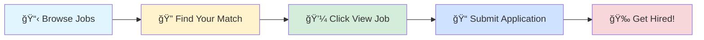

# 🚀 Tech Jobs Board

### Your Gateway to Amazing Career Opportunities

---

## 🎯 Browse by Job Profile

<table>
<tr>
<td align="center" width="25%">

 
<b>1000</b> total positions
</td>
<td align="center" width="25%">

 
<b>1000</b> total positions
</td>
<td align="center" width="25%">

 
<b>1000</b> total positions
</td>
<td align="center" width="25%">

 
<b>1000</b> total positions
</td>
</tr>
</table>

---

## 📊 Data Scientist

> 💼 **1000** positions available

<table>
<thead>
<tr>
<th width="20%">🏢 Company</th>
<th width="35%">💼 Role</th>
<th width="20%">📍 Location</th>
<th width="10%">⏰ Posted</th>
<th width="15%">🔗 Action</th>
</tr>
</thead>
<tbody>
<tr>
<td><a href="https://www.linkedin.com/company/ppstack">PPStack</a></td>
<td>Intern Pyspark</td>
<td>📍 India</td>
<td>1d ago</td>
<td align="center"></td>
</tr>
<tr>
<td><a href="https://fr.linkedin.com/company/versusmind">Versusmind</a></td>
<td>Ingénieur Systèmes et réseaux H/F</td>
<td>📍 Strasbourg, Grand Est, France</td>
<td>1d ago</td>
<td align="center"></td>
</tr>
<tr>
<td><a href="https://fr.linkedin.com/company/synanto-services">Synanto</a></td>
<td>Administrateur Réseau L2</td>
<td>📍 Cavaillon, Provence-Alpes-Côte d'Azur, France</td>
<td>1d ago</td>
<td align="center"></td>
</tr>
<tr>
<td><a href="https://www.linkedin.com/company/endeavor-health">Endeavor Health</a></td>
<td>Data Analytics Analyst II</td>
<td>📍 Skokie, IL</td>
<td>1d ago</td>
<td align="center"></td>
</tr>
<tr>
<td><a href="https://www.linkedin.com/company/apex-systems">Apex Systems</a></td>
<td>SQL Developer</td>
<td>📍 Chicago, IL</td>
<td>1d ago</td>
<td align="center"></td>
</tr>
<tr>
<td><a href="https://www.linkedin.com/company/humana">Humana</a></td>
<td>Stars Analytics Director - CAHPS & HOS</td>
<td>📍 Louisville, KY</td>
<td>1d ago</td>
<td align="center"></td>
</tr>
<tr>
<td><a href="https://www.linkedin.com/company/humana">Humana</a></td>
<td>Senior Associate, Marketing Data Scientist, B2B</td>
<td>📍 New York, United States</td>
<td>1d ago</td>
<td align="center"></td>
</tr>
<tr>
<td><a href="https://www.linkedin.com/company/humana">Humana</a></td>
<td>Senior Associate, Marketing Data Scientist, B2B</td>
<td>📍 Washington, United States</td>
<td>1d ago</td>
<td align="center"></td>
</tr>
<tr>
<td><a href="https://www.linkedin.com/company/citi">Citi</a></td>
<td>Data Engineer - Pyspark</td>
<td>📍 Chennai</td>
<td>1d ago</td>
<td align="center"></td>
</tr>
<tr>
<td><a href="https://www.linkedin.com/company/merck">Merck</a></td>
<td>Assoc Principal Scientist (Assoc. Director) Real World Evidence Capability Analytics</td>
<td>📍 West Point, PA</td>
<td>1d ago</td>
<td align="center"></td>
</tr>
<tr>
<td><a href="https://www.linkedin.com/company/lhhworldwide">LHH</a></td>
<td>Analytics Innovation Analyst</td>
<td>📍 Mexico City, Mexico</td>
<td>1d ago</td>
<td align="center"></td>
</tr>
<tr>
<td><a href="https://ca.linkedin.com/company/kardium-inc.">Kardium Inc.</a></td>
<td>Post-Market Data Scientist Co-op (Hybrid) - May 2026</td>
<td>📍 Burnaby, British Columbia, Canada</td>
<td>1d ago</td>
<td align="center"></td>
</tr>
<tr>
<td><a href="https://www.linkedin.com/company/crbgrp">CRB</a></td>
<td>Automation Engineer III (BAS)</td>
<td>📍 Conshohocken, PA</td>
<td>1d ago</td>
<td align="center"></td>
</tr>
<tr>
<td><a href="https://www.linkedin.com/company/crbgrp">CRB</a></td>
<td>Automation Engineer III (BAS)</td>
<td>📍 Medford, MA</td>
<td>1d ago</td>
<td align="center"></td>
</tr>
<tr>
<td><a href="https://www.linkedin.com/company/crbgrp">CRB</a></td>
<td>Automation Engineer III (BAS)</td>
<td>📍 Rockville, MD</td>
<td>1d ago</td>
<td align="center"></td>
</tr>
<tr>
<td><a href="https://www.linkedin.com/company/%E5%8D%97%E4%BA%AC%E5%A4%A9%E6%B4%91%E8%BD%AF%E4%BB%B6%E6%9C%89%E9%99%90%E5%85%AC%E5%8F%B8">南京天洑软件有限公司</a></td>
<td>python后端开发实习生</td>
<td>📍 Nanjing, Jiangsu, China</td>
<td>1d ago</td>
<td align="center"></td>
</tr>
<tr>
<td><a href="https://www.linkedin.com/company/synearfoodsusa">SYNEAR FOODS USA</a></td>
<td>Food Product Development Manager (R&D in food industry, 中式面食经验优先)</td>
<td>📍 Los Angeles, CA</td>
<td>1d ago</td>
<td align="center"></td>
</tr>
<tr>
<td><a href="https://www.linkedin.com/company/%E7%A1%95%E8%BD%AF%EF%BC%88%E4%B8%8A%E6%B5%B7%EF%BC%89%E8%BD%AF%E4%BB%B6%E8%B4%B8%E6%98%93%E6%9C%89%E9%99%90%E5%85%AC%E5%8F%B8">硕软（上海）软件贸易有限公司</a></td>
<td>Python开发工程师-AI Project</td>
<td>📍 Suzhou, Jiangsu, China</td>
<td>1d ago</td>
<td align="center"></td>
</tr>
<tr>
<td><a href="https://uk.linkedin.com/company/qualitest">Qualitest</a></td>
<td>Automation Test Lead</td>
<td>📍 Bangalore</td>
<td>1d ago</td>
<td align="center"></td>
</tr>
<tr>
<td><a href="https://ch.linkedin.com/company/alcon">Alcon</a></td>
<td>R&D LCM Project Manager</td>
<td>📍 Mexico City, Mexico</td>
<td>1d ago</td>
<td align="center"></td>
</tr>
<tr>
<td><a href="https://www.linkedin.com/company/%E5%A8%81%E8%83%BD-%E4%B8%AD%E5%9B%BD-%E4%BE%9B%E7%83%AD%E5%88%B6%E5%86%B7%E7%8E%AF%E5%A2%83%E6%8A%80%E6%9C%AF%E6%9C%89%E9%99%90%E5%85%AC%E5%8F%B8">威能(中国)供热制冷环境技术有限公司</a></td>
<td>R&D Software Test Engineer-dspace</td>
<td>📍 Wuxi, Jiangsu, China</td>
<td>1d ago</td>
<td align="center"></td>
</tr>
<tr>
<td><a href="https://www.linkedin.com/company/%E5%87%AF%E6%98%93%E8%AE%AF%E7%BD%91%E7%BB%9C%E6%8A%80%E6%9C%AF%E5%BC%80%E5%8F%91-%E5%8D%97%E4%BA%AC-%E6%9C%89%E9%99%90%E5%85%AC%E5%8F%B8">凯易讯网络技术开发(南京)有限公司</a></td>
<td>高级后端开发工程师 (Python, FastAPI)</td>
<td>📍 Nanjing, Jiangsu, China</td>
<td>1d ago</td>
<td align="center"></td>
</tr>
<tr>
<td><a href="https://www.linkedin.com/company/nvidia">NVIDIA</a></td>
<td>Senior Developer, AI-driven Test and Automation</td>
<td>📍 Santa Clara, CA</td>
<td>1d ago</td>
<td align="center"></td>
</tr>
<tr>
<td><a href="https://cn.linkedin.com/company/%E9%AB%98%E6%84%8F%E7%A7%91%E6%8A%80%E6%9C%89%E9%99%90%E5%85%AC%E5%8F%B8">高意科技有限公司</a></td>
<td>R&D Engineer, Mechanical/机械设计工程师(J10050)</td>
<td>📍 Fuzhou, Fujian, China</td>
<td>1d ago</td>
<td align="center"></td>
</tr>
<tr>
<td><a href="https://www.linkedin.com/company/%E6%B7%B1%E5%9C%B3%E7%9B%88%E7%AB%8B%E6%95%B0%E6%99%BA%E7%A7%91%E6%8A%80%EF%BC%88%E6%B7%B1%E5%9C%B3%EF%BC%89%E6%9C%89%E9%99%90%E5%85%AC%E5%8F%B8">深圳盈立数智科技（深圳）有限公司</a></td>
<td>Python量化开发工程师</td>
<td>📍 Shenzhen, Guangdong, China</td>
<td>1d ago</td>
<td align="center"></td>
</tr>
<tr>
<td><a href="https://www.linkedin.com/company/algosec">AlgoSec</a></td>
<td>AlgoNext Automation Developer, India</td>
<td>📍 Delhi</td>
<td>1d ago</td>
<td align="center"></td>
</tr>
<tr>
<td><a href="https://cn.linkedin.com/company/360-finance-360%E9%87%91%E8%9E%8D">360 DigiTech</a></td>
<td>高级Python后端工程师(A117439)</td>
<td>📍 Beijing, Beijing, China</td>
<td>1d ago</td>
<td align="center"></td>
</tr>
<tr>
<td><a href="https://www.linkedin.com/company/%E5%8D%A1%E6%96%AF%E6%9F%AF%E4%BF%A1%E5%8F%B7%E6%9C%89%E9%99%90%E5%85%AC%E5%8F%B8">卡斯柯信号有限公司</a></td>
<td>软件开发工程师（C/C++/Java/C#/Python）(上海·校招)(J10403)</td>
<td>📍 Shanghai, Shanghai, China</td>
<td>1d ago</td>
<td align="center"></td>
</tr>
<tr>
<td><a href="https://www.linkedin.com/company/t-&-m-consulting">T & M CONSULTING</a></td>
<td>Full Stack Developer (React / Python)</td>
<td>📍 Xico, Veracruz, Mexico</td>
<td>1d ago</td>
<td align="center"></td>
</tr>
<tr>
<td><a href="https://de.linkedin.com/company/nvlgroup">NVL B.V. & Co. KG</a></td>
<td>IT-Projektmanager (m/w/d) für die Softwareentwicklung</td>
<td>📍 Hamburg, Hamburg, Germany</td>
<td>1d ago</td>
<td align="center"></td>
</tr>
<tr>
<td><a href="https://www.linkedin.com/company/nvidia">NVIDIA</a></td>
<td>Senior Developer, AI-driven Test and Automation</td>
<td>📍 Santa Clara, CA</td>
<td>1d ago</td>
<td align="center"></td>
</tr>
<tr>
<td><a href="https://www.linkedin.com/company/general-motors">General Motors</a></td>
<td>Senior Machine Learning Engineer</td>
<td>📍 United States</td>
<td>1d ago</td>
<td align="center"></td>
</tr>
<tr>
<td><a href="https://www.linkedin.com/company/dignify-solutions">The Dignify Solutions, LLC</a></td>
<td>Business Analyst with Azure Cloud Services Experience- Remote</td>
<td>📍 New York County, NY</td>
<td>1d ago</td>
<td align="center"></td>
</tr>
<tr>
<td><a href="https://www.linkedin.com/company/benchling">Benchling</a></td>
<td>Solution Consultant - R&D</td>
<td>📍 San Francisco, CA</td>
<td>1d ago</td>
<td align="center"></td>
</tr>
<tr>
<td><a href="https://ca.linkedin.com/company/ph%C3%A9nix-groupe-conseil">Phénix Groupe Conseil</a></td>
<td>R&D Director</td>
<td>📍 Laval, Quebec, Canada</td>
<td>1d ago</td>
<td align="center"></td>
</tr>
<tr>
<td><a href="https://br.linkedin.com/company/cielo">Cielo</a></td>
<td>Especialista em Analytics e Parcerias Comerciais | SP</td>
<td>📍 Barueri, São Paulo, Brazil</td>
<td>1d ago</td>
<td align="center"></td>
</tr>
<tr>
<td><a href="https://ca.linkedin.com/company/ph%C3%A9nix-groupe-conseil">Phénix Groupe Conseil</a></td>
<td>Directeur(trice) R&D</td>
<td>📍 Laval, Quebec, Canada</td>
<td>1d ago</td>
<td align="center"></td>
</tr>
<tr>
<td><a href="https://ca.linkedin.com/company/food-basics-on">Food Basics</a></td>
<td>Assistant Responsable de Magasin - Région de Kitchener/Waterloo</td>
<td>📍 Kitchener, Ontario, Canada</td>
<td>1d ago</td>
<td align="center"></td>
</tr>
<tr>
<td><a href="https://www.linkedin.com/company/cienet-technologies">CIeNET Technologies</a></td>
<td>Python后端工程师（英语口语可交流）</td>
<td>📍 Nanjing, Jiangsu, China</td>
<td>1d ago</td>
<td align="center"></td>
</tr>
<tr>
<td><a href="https://ch.linkedin.com/company/abb">ABB</a></td>
<td>R&D Senior Engineer</td>
<td>📍 Nashik, Maharashtra, India</td>
<td>1d ago</td>
<td align="center"></td>
</tr>
<tr>
<td><a href="https://www.linkedin.com/company/algosec">AlgoSec</a></td>
<td>Cloud Automation Developer, India</td>
<td>📍 Delhi</td>
<td>1d ago</td>
<td align="center"></td>
</tr>
<tr>
<td><a href="https://www.linkedin.com/company/algosec">AlgoSec</a></td>
<td>CloudFlow Automation Developer, India</td>
<td>📍 Delhi</td>
<td>1d ago</td>
<td align="center"></td>
</tr>
<tr>
<td><a href="https://www.linkedin.com/company/algosec">AlgoSec</a></td>
<td>Full Stack Automation Developer, India</td>
<td>📍 Delhi</td>
<td>1d ago</td>
<td align="center"></td>
</tr>
<tr>
<td><a href="https://www.linkedin.com/company/caci-international-inc">CACI International Inc</a></td>
<td>AI/ML Engineer</td>
<td>📍 Aberdeen Proving Ground, MD</td>
<td>1d ago</td>
<td align="center"></td>
</tr>
<tr>
<td><a href="https://www.linkedin.com/company/fieldwirebyhilti">Fieldwire by Hilti</a></td>
<td>QA Automation Engineer - iOS</td>
<td>📍 United States</td>
<td>1d ago</td>
<td align="center"></td>
</tr>
<tr>
<td><a href="https://de.linkedin.com/company/stadtreinigung-hamburg">Stadtreinigung Hamburg</a></td>
<td>Ausbildung zum/zur Umwelttechnologen/Umwelttechnologin (m/w/d) für Kreislauf- und Abfallwirtschaft</td>
<td>📍 Hamburg, Hamburg, Germany</td>
<td>1d ago</td>
<td align="center"></td>
</tr>
<tr>
<td><a href="https://www.linkedin.com/company/concentrix">Concentrix</a></td>
<td>AGENTE DE ATENDIMENTO BACKOFFICE| GANHO DE ATÉ R$3000,00| De Segunda à Sexta</td>
<td>📍 São Paulo, São Paulo, Brazil</td>
<td>1d ago</td>
<td align="center"></td>
</tr>
<tr>
<td><a href="https://ch.linkedin.com/company/srcare">Thermo Fisher Scientific</a></td>
<td>Product Manager - Pharma Analytics</td>
<td>📍 Pleasanton, CA</td>
<td>1d ago</td>
<td align="center"></td>
</tr>
<tr>
<td><a href="https://pe.linkedin.com/company/yapeoficial">Yape</a></td>
<td>Business Specialist Senior - Analytics & Customer Insights</td>
<td>📍 La Molina, Peru</td>
<td>1d ago</td>
<td align="center"></td>
</tr>
<tr>
<td><a href="https://ca.linkedin.com/company/cineplex-entertainment">Cineplex</a></td>
<td>Machine Learning Engineer</td>
<td>📍 Toronto, Ontario, Canada</td>
<td>1d ago</td>
<td align="center"></td>
</tr>
<tr>
<td><a href="https://www.linkedin.com/company/the-new-york-times">The New York Times</a></td>
<td>Senior Analyst, News Product Analytics</td>
<td>📍 New York, NY</td>
<td>1d ago</td>
<td align="center"></td>
</tr>
<tr>
<td><a href="https://www.linkedin.com/company/whoop">WHOOP</a></td>
<td>Senior Machine Learning Engineer (Sensor Intelligence)</td>
<td>📍 Boston, MA</td>
<td>1d ago</td>
<td align="center"></td>
</tr>
<tr>
<td><a href="https://ca.linkedin.com/company/canadian-tire">Canadian Tire Corporation</a></td>
<td>Data Scientist - 12 Months Contract</td>
<td>📍 Calgary, Alberta, Canada</td>
<td>1d ago</td>
<td align="center"></td>
</tr>
<tr>
<td><a href="https://de.linkedin.com/company/alvara-digital-solutions">ALVARA | Digital Solutions</a></td>
<td>Werkstudent (m/w/d) für den IT 1st Level Support</td>
<td>📍 Leipzig, Saxony, Germany</td>
<td>1d ago</td>
<td align="center"></td>
</tr>
<tr>
<td><a href="https://www.linkedin.com/company/airslate">airSlate</a></td>
<td>Data Science Expert</td>
<td>📍 Cracow Metropolitan Area</td>
<td>1d ago</td>
<td align="center"></td>
</tr>
<tr>
<td><a href="https://www.linkedin.com/company/mro">MRO</a></td>
<td>Senior Advisor - Big Data, Analytics and ML</td>
<td>📍 Pune</td>
<td>1d ago</td>
<td align="center"></td>
</tr>
<tr>
<td><a href="https://www.linkedin.com/school/unlv-department-of-accounting/">UNLV Department of Accounting</a></td>
<td>*Revised* Postdoctoral Scholar, Interdisciplinary Data Science, College of Engineering [R0144891]</td>
<td>📍 Las Vegas Metropolitan Area</td>
<td>1d ago</td>
<td align="center"></td>
</tr>
<tr>
<td><a href="https://www.linkedin.com/company/massachusetts-school-building-authority-msba-">Massachusetts School Building Authority (MSBA)</a></td>
<td>SQL Database Developer II</td>
<td>📍 Boston, MA</td>
<td>1d ago</td>
<td align="center"></td>
</tr>
<tr>
<td><a href="https://www.linkedin.com/company/bayesian-health">Bayesian Health</a></td>
<td>Director of AI/ML</td>
<td>📍 United States</td>
<td>1d ago</td>
<td align="center"></td>
</tr>
<tr>
<td><a href="https://www.linkedin.com/company/embeddingvc">Embedding VC</a></td>
<td>Founding Data Scientist</td>
<td>📍 New York, NY</td>
<td>1d ago</td>
<td align="center"></td>
</tr>
<tr>
<td><a href="https://www.linkedin.com/company/reyes-coca-cola-bottling">Reyes Coca-Cola Bottling</a></td>
<td>Machine Learning Engineer</td>
<td>📍 Niles, IL</td>
<td>1d ago</td>
<td align="center"></td>
</tr>
<tr>
<td><a href="https://fr.linkedin.com/company/murfy-repair">Murfy</a></td>
<td>Reconversion - Réparateur Electroménager H/F</td>
<td>📍 Lignon, Grand Est, France</td>
<td>1d ago</td>
<td align="center"></td>
</tr>
<tr>
<td><a href="https://fr.linkedin.com/company/murfy-repair">Murfy</a></td>
<td>Reconversion - Réparateur Electroménager H/F</td>
<td>📍 La Florida, Santiago Metropolitan Region, Chile</td>
<td>1d ago</td>
<td align="center"></td>
</tr>
<tr>
<td><a href="https://fr.linkedin.com/company/murfy-repair">Murfy</a></td>
<td>Reconversion - Réparateur Electroménager H/F Na...</td>
<td>📍 Paris, Île-de-France, France</td>
<td>1d ago</td>
<td align="center"></td>
</tr>
<tr>
<td><a href="https://fr.linkedin.com/company/murfy-repair">Murfy</a></td>
<td>Reconversion - Réparateur Electroménager H/F Na...</td>
<td>📍 Nanterre, Île-de-France, France</td>
<td>1d ago</td>
<td align="center"></td>
</tr>
<tr>
<td><a href="https://www.linkedin.com/company/nalhe">National Association of Latino Healthcare Executives</a></td>
<td>Data Analytics Bachelor&amp;#8217;s Intern</td>
<td>📍 Oakland, CA</td>
<td>1d ago</td>
<td align="center"></td>
</tr>
<tr>
<td><a href="https://jp.linkedin.com/company/wovenbytoyota">Woven by Toyota</a></td>
<td>Machine Learning Intern, Autolabeling</td>
<td>📍 Palo Alto, CA</td>
<td>1d ago</td>
<td align="center"></td>
</tr>
<tr>
<td><a href="https://www.linkedin.com/company/ascensionorg">Ascension</a></td>
<td>Data Science Intern</td>
<td>📍 United States</td>
<td>1d ago</td>
<td align="center"></td>
</tr>
<tr>
<td>Huligemma Consultancy Service</td>
<td>Urgently Hiring for Automation Lead position at Yelachenahalli location</td>
<td>📍 Bangalore</td>
<td>-263d ago</td>
<td align="center"></td>
</tr>
<tr>
<td><a href="https://ca.linkedin.com/company/cgi">CGI</a></td>
<td>Automation Tester with AWS cloud</td>
<td>📍 Bangalore</td>
<td>1d ago</td>
<td align="center"></td>
</tr>
<tr>
<td><a href="https://in.linkedin.com/company/infosys">Infosys</a></td>
<td>AWS Admin And AWS Architect</td>
<td>📍 Pune</td>
<td>1d ago</td>
<td align="center"></td>
</tr>
<tr>
<td><a href="https://www.linkedin.com/company/otis_elevators">Otis Elevator Co.</a></td>
<td>Machine Learning Operations Engineer</td>
<td>📍 Hyderabad</td>
<td>1d ago</td>
<td align="center"></td>
</tr>
<tr>
<td><a href="https://www.linkedin.com/company/comcast">Comcast</a></td>
<td>Quality & Automation Engineer 3</td>
<td>📍 Chennai</td>
<td>1d ago</td>
<td align="center"></td>
</tr>
<tr>
<td><a href="https://in.linkedin.com/company/infosys">Infosys</a></td>
<td>GCP SME</td>
<td>📍 Pune</td>
<td>1d ago</td>
<td align="center"></td>
</tr>
<tr>
<td><a href="https://in.linkedin.com/company/infosys">Infosys</a></td>
<td>Python Automation Tester (Squish)</td>
<td>📍 Pune</td>
<td>1d ago</td>
<td align="center"></td>
</tr>
<tr>
<td><a href="https://sa.linkedin.com/company/marsdevs">MarsDevs</a></td>
<td>MarsDevs - Senior Full Stack Developer - Python/React.js</td>
<td>📍 Pune</td>
<td>1d ago</td>
<td align="center"></td>
</tr>
<tr>
<td><a href="https://www.linkedin.com/company/paralleldots">ParallelDots</a></td>
<td>ParallelDots - Backend Developer - Python/Flask</td>
<td>📍 Greater Kolkata Area</td>
<td>1d ago</td>
<td align="center"></td>
</tr>
<tr>
<td><a href="https://sg.linkedin.com/company/botsync">Botsync</a></td>
<td>Botsync - Software Backend Engineer - Python Technologies</td>
<td>📍 Bangalore</td>
<td>1d ago</td>
<td align="center"></td>
</tr>
<tr>
<td><a href="https://sg.linkedin.com/company/botsync">Botsync</a></td>
<td>Botsync - Software Backend Engineer - Golang/Python</td>
<td>📍 Bangalore</td>
<td>1d ago</td>
<td align="center"></td>
</tr>
<tr>
<td><a href="https://www.linkedin.com/school/year-up-united/">Year Up United</a></td>
<td>Data Analytics Job Training Program</td>
<td>📍 Washington, DC</td>
<td>1d ago</td>
<td align="center"></td>
</tr>
<tr>
<td><a href="https://in.linkedin.com/company/xcoderstec">Xcoders Technologies OPC Pvt. Ltd.</a></td>
<td>AI Developer / AI Engineer – Azure OpenAI & AI Integration</td>
<td>📍 India</td>
<td>1d ago</td>
<td align="center"></td>
</tr>
<tr>
<td>Jash Data Sciences</td>
<td>Data Scientist</td>
<td>📍 Pune</td>
<td>-263d ago</td>
<td align="center"></td>
</tr>
<tr>
<td><a href="https://uk.linkedin.com/company/better-cotton-initiative">Better Cotton Initiative</a></td>
<td>Global MEL Senior Data Analysis Coordinator</td>
<td>📍 Delhi</td>
<td>1d ago</td>
<td align="center"></td>
</tr>
<tr>
<td><a href="https://in.linkedin.com/company/dn-associates-lko">DN Associates</a></td>
<td>Business Analytics (Pharma & Healthcare) Internship in Lucknow</td>
<td>📍 Lucknow, Uttar Pradesh, India</td>
<td>1d ago</td>
<td align="center"></td>
</tr>
<tr>
<td><a href="https://se.linkedin.com/company/jag-personlig-assistans">JAG Personlig assistans</a></td>
<td>Personlig assistent sökes till 14-årig tjej i Rönninge</td>
<td>📍 Salem, Tamil Nadu, India</td>
<td>1d ago</td>
<td align="center"></td>
</tr>
<tr>
<td><a href="https://sg.linkedin.com/company/botsync">Botsync</a></td>
<td>Botsync - Full Stack Engineer - Python/React.js</td>
<td>📍 Bangalore</td>
<td>1d ago</td>
<td align="center"></td>
</tr>
<tr>
<td><a href="https://www.linkedin.com/company/exiger">Exiger</a></td>
<td>Trade Intelligence Analyst Intern – Government Analytics (Summer 2026)</td>
<td>📍 McLean, VA</td>
<td>1d ago</td>
<td align="center"></td>
</tr>
<tr>
<td><a href="https://in.linkedin.com/company/revalsys-technologies">Revalsys Technologies</a></td>
<td>Angular Developer - eCommerce &amp; AI/ML Integration</td>
<td>📍 Hyderabad</td>
<td>1d ago</td>
<td align="center"></td>
</tr>
<tr>
<td><a href="https://www.linkedin.com/company/deqodesolutions">Deqode</a></td>
<td>Azure Data Engineer - Python/SQL/ETL</td>
<td>📍 Greater Kolkata Area</td>
<td>1d ago</td>
<td align="center"></td>
</tr>
<tr>
<td><a href="https://in.linkedin.com/company/vehant">Vehant Technologies</a></td>
<td>Vehant Technologies - Senior Data Analyst - Video &amp; Image Analytics</td>
<td>📍 Noida</td>
<td>1d ago</td>
<td align="center"></td>
</tr>
<tr>
<td><a href="https://in.linkedin.com/company/appzime">AppZime Technologies</a></td>
<td>SAP Analytics Cloud Consultant - E2E Implementation</td>
<td>📍 Bangalore</td>
<td>1d ago</td>
<td align="center"></td>
</tr>
<tr>
<td><a href="https://www.linkedin.com/company/hamari-design">Hamari Design</a></td>
<td>AI & Data Analytics Internship in Delhi</td>
<td>📍 Delhi</td>
<td>1d ago</td>
<td align="center"></td>
</tr>
<tr>
<td><a href="https://www.linkedin.com/company/expediagroup">Expedia Group</a></td>
<td>Data Scientist III</td>
<td>📍 Gurugram</td>
<td>2d ago</td>
<td align="center"></td>
</tr>
<tr>
<td><a href="https://in.linkedin.com/company/mydbops">Mydbops</a></td>
<td>Mydbops - Full Stack Developer - Python/React.js</td>
<td>📍 Chennai</td>
<td>1d ago</td>
<td align="center"></td>
</tr>
<tr>
<td><a href="https://www.linkedin.com/company/optum">Optum</a></td>
<td>Manager AI/ML Engineering - Amazon connect, gen AI</td>
<td>📍 Bangalore</td>
<td>2d ago</td>
<td align="center"></td>
</tr>
<tr>
<td><a href="https://www.linkedin.com/company/deeptek">DeepTek</a></td>
<td>DeepTek.ai - Senior Data Scientist - Machine Learning</td>
<td>📍 Pune</td>
<td>1d ago</td>
<td align="center"></td>
</tr>
<tr>
<td><a href="https://de.linkedin.com/company/deutsche-bank">Deutsche Bank</a></td>
<td>Business Intelligence, Analytics & Automation - AS</td>
<td>📍 Mumbai</td>
<td>2d ago</td>
<td align="center"></td>
</tr>
<tr>
<td><a href="https://www.linkedin.com/company/deqodesolutions">Deqode</a></td>
<td>Azure Data Engineer - ETL/Spark</td>
<td>📍 Pune</td>
<td>1d ago</td>
<td align="center"></td>
</tr>
<tr>
<td><a href="https://sa.linkedin.com/company/marsdevs">MarsDevs</a></td>
<td>MarsDevs - Artificial Intelligence Engineer</td>
<td>📍 Pune</td>
<td>1d ago</td>
<td align="center"></td>
</tr>
<tr>
<td>Head Energy AS</td>
<td>Automation / Control System Engineer.</td>
<td>📍 Mumbai</td>
<td>-263d ago</td>
<td align="center"></td>
</tr>
<tr><td colspan="5" align="center"><i>... and 900 more positions</i></td></tr>
</tbody>
</table>

---

## 💼 Business Analyst

> 💼 **1000** positions available

<table>
<thead>
<tr>
<th width="20%">🏢 Company</th>
<th width="35%">💼 Role</th>
<th width="20%">📍 Location</th>
<th width="10%">⏰ Posted</th>
<th width="15%">🔗 Action</th>
</tr>
</thead>
<tbody>
<tr>
<td><a href="https://www.linkedin.com/company/syneos-health">Syneos Health</a></td>
<td>Director, Project Management</td>
<td>📍 Tokyo, Tokyo, Japan</td>
<td>1d ago</td>
<td align="center"></td>
</tr>
<tr>
<td><a href="https://www.linkedin.com/company/endeavor-health">Endeavor Health</a></td>
<td>Data Analytics Analyst II</td>
<td>📍 Skokie, IL</td>
<td>1d ago</td>
<td align="center"></td>
</tr>
<tr>
<td><a href="https://www.linkedin.com/company/apex-systems">Apex Systems</a></td>
<td>SQL Developer</td>
<td>📍 Chicago, IL</td>
<td>1d ago</td>
<td align="center"></td>
</tr>
<tr>
<td><a href="https://www.linkedin.com/company/humana">Humana</a></td>
<td>Stars Analytics Director - CAHPS & HOS</td>
<td>📍 Louisville, KY</td>
<td>1d ago</td>
<td align="center"></td>
</tr>
<tr>
<td><a href="https://www.linkedin.com/company/merck">Merck</a></td>
<td>Assoc Principal Scientist (Assoc. Director) Real World Evidence Capability Analytics</td>
<td>📍 West Point, PA</td>
<td>1d ago</td>
<td align="center"></td>
</tr>
<tr>
<td><a href="https://www.linkedin.com/company/lhhworldwide">LHH</a></td>
<td>Analytics Innovation Analyst</td>
<td>📍 Mexico City, Mexico</td>
<td>1d ago</td>
<td align="center"></td>
</tr>
<tr>
<td><a href="https://www.linkedin.com/company/latham-&-watkins">Latham & Watkins</a></td>
<td>Manager of Business Process Excellence</td>
<td>📍 Los Angeles, CA</td>
<td>1d ago</td>
<td align="center"></td>
</tr>
<tr>
<td><a href="https://www.linkedin.com/company/crbgrp">CRB</a></td>
<td>Automation Engineer III (BAS)</td>
<td>📍 Conshohocken, PA</td>
<td>1d ago</td>
<td align="center"></td>
</tr>
<tr>
<td><a href="https://www.linkedin.com/company/crbgrp">CRB</a></td>
<td>Automation Engineer III (BAS)</td>
<td>📍 Medford, MA</td>
<td>1d ago</td>
<td align="center"></td>
</tr>
<tr>
<td><a href="https://www.linkedin.com/company/crbgrp">CRB</a></td>
<td>Automation Engineer III (BAS)</td>
<td>📍 Rockville, MD</td>
<td>1d ago</td>
<td align="center"></td>
</tr>
<tr>
<td><a href="https://www.linkedin.com/company/%E5%8D%97%E4%BA%AC%E5%A4%A9%E6%B4%91%E8%BD%AF%E4%BB%B6%E6%9C%89%E9%99%90%E5%85%AC%E5%8F%B8">南京天洑软件有限公司</a></td>
<td>python后端开发实习生</td>
<td>📍 Nanjing, Jiangsu, China</td>
<td>1d ago</td>
<td align="center"></td>
</tr>
<tr>
<td><a href="https://www.linkedin.com/company/griddable-io">griddable.io</a></td>
<td>Lead Salesforce Developer</td>
<td>📍 Indianapolis, IN</td>
<td>1d ago</td>
<td align="center"></td>
</tr>
<tr>
<td><a href="https://www.linkedin.com/company/%E4%B8%8A%E6%B5%B7%E5%87%AF%E8%8E%B1%E8%8B%B1%E7%94%9F%E7%89%A9%E6%8A%80%E6%9C%AF%E6%9C%89%E9%99%90%E5%85%AC%E5%8F%B8">上海凯莱英生物技术有限公司</a></td>
<td>Project Management(J11770)</td>
<td>📍 Tianjin, Tianjin, China</td>
<td>1d ago</td>
<td align="center"></td>
</tr>
<tr>
<td><a href="https://www.linkedin.com/company/%E7%A1%95%E8%BD%AF%EF%BC%88%E4%B8%8A%E6%B5%B7%EF%BC%89%E8%BD%AF%E4%BB%B6%E8%B4%B8%E6%98%93%E6%9C%89%E9%99%90%E5%85%AC%E5%8F%B8">硕软（上海）软件贸易有限公司</a></td>
<td>Python开发工程师-AI Project</td>
<td>📍 Suzhou, Jiangsu, China</td>
<td>1d ago</td>
<td align="center"></td>
</tr>
<tr>
<td><a href="https://uk.linkedin.com/company/qualitest">Qualitest</a></td>
<td>Automation Test Lead</td>
<td>📍 Bangalore</td>
<td>1d ago</td>
<td align="center"></td>
</tr>
<tr>
<td><a href="https://www.linkedin.com/company/latham-&-watkins">Latham & Watkins</a></td>
<td>Manager of Business Process Excellence</td>
<td>📍 Costa Mesa, CA</td>
<td>1d ago</td>
<td align="center"></td>
</tr>
<tr>
<td><a href="https://www.linkedin.com/company/%E5%87%AF%E6%98%93%E8%AE%AF%E7%BD%91%E7%BB%9C%E6%8A%80%E6%9C%AF%E5%BC%80%E5%8F%91-%E5%8D%97%E4%BA%AC-%E6%9C%89%E9%99%90%E5%85%AC%E5%8F%B8">凯易讯网络技术开发(南京)有限公司</a></td>
<td>高级后端开发工程师 (Python, FastAPI)</td>
<td>📍 Nanjing, Jiangsu, China</td>
<td>1d ago</td>
<td align="center"></td>
</tr>
<tr>
<td><a href="https://www.linkedin.com/company/nvidia">NVIDIA</a></td>
<td>Senior Developer, AI-driven Test and Automation</td>
<td>📍 Santa Clara, CA</td>
<td>1d ago</td>
<td align="center"></td>
</tr>
<tr>
<td><a href="https://www.linkedin.com/company/%E6%B7%B1%E5%9C%B3%E7%9B%88%E7%AB%8B%E6%95%B0%E6%99%BA%E7%A7%91%E6%8A%80%EF%BC%88%E6%B7%B1%E5%9C%B3%EF%BC%89%E6%9C%89%E9%99%90%E5%85%AC%E5%8F%B8">深圳盈立数智科技（深圳）有限公司</a></td>
<td>Python量化开发工程师</td>
<td>📍 Shenzhen, Guangdong, China</td>
<td>1d ago</td>
<td align="center"></td>
</tr>
<tr>
<td><a href="https://www.linkedin.com/company/algosec">AlgoSec</a></td>
<td>AlgoNext Automation Developer, India</td>
<td>📍 Delhi</td>
<td>1d ago</td>
<td align="center"></td>
</tr>
<tr>
<td><a href="https://cn.linkedin.com/company/360-finance-360%E9%87%91%E8%9E%8D">360 DigiTech</a></td>
<td>高级Python后端工程师(A117439)</td>
<td>📍 Beijing, Beijing, China</td>
<td>1d ago</td>
<td align="center"></td>
</tr>
<tr>
<td><a href="https://www.linkedin.com/company/%E5%8D%A1%E6%96%AF%E6%9F%AF%E4%BF%A1%E5%8F%B7%E6%9C%89%E9%99%90%E5%85%AC%E5%8F%B8">卡斯柯信号有限公司</a></td>
<td>软件开发工程师（C/C++/Java/C#/Python）(上海·校招)(J10403)</td>
<td>📍 Shanghai, Shanghai, China</td>
<td>1d ago</td>
<td align="center"></td>
</tr>
<tr>
<td><a href="https://www.linkedin.com/company/t-&-m-consulting">T & M CONSULTING</a></td>
<td>Full Stack Developer (React / Python)</td>
<td>📍 Xico, Veracruz, Mexico</td>
<td>1d ago</td>
<td align="center"></td>
</tr>
<tr>
<td><a href="https://www.linkedin.com/company/nvidia">NVIDIA</a></td>
<td>Senior Developer, AI-driven Test and Automation</td>
<td>📍 Santa Clara, CA</td>
<td>1d ago</td>
<td align="center"></td>
</tr>
<tr>
<td><a href="https://www.linkedin.com/company/elevance-health">Elevance Health</a></td>
<td>Agile Product Manager</td>
<td>📍 Louisville, KY</td>
<td>1d ago</td>
<td align="center"></td>
</tr>
<tr>
<td><a href="https://www.linkedin.com/company/dignify-solutions">The Dignify Solutions, LLC</a></td>
<td>Business Analyst with Azure Cloud Services Experience- Remote</td>
<td>📍 New York County, NY</td>
<td>1d ago</td>
<td align="center"></td>
</tr>
<tr>
<td><a href="https://www.linkedin.com/company/elevance-health">Elevance Health</a></td>
<td>Agile Product Manager</td>
<td>📍 Cincinnati, OH</td>
<td>1d ago</td>
<td align="center"></td>
</tr>
<tr>
<td><a href="https://www.linkedin.com/company/elevance-health">Elevance Health</a></td>
<td>Agile Product Manager</td>
<td>📍 Mason, OH</td>
<td>1d ago</td>
<td align="center"></td>
</tr>
<tr>
<td><a href="https://www.linkedin.com/company/elevance-health">Elevance Health</a></td>
<td>Agile Product Manager</td>
<td>📍 West Des Moines, IA</td>
<td>1d ago</td>
<td align="center"></td>
</tr>
<tr>
<td><a href="https://www.linkedin.com/company/elevance-health">Elevance Health</a></td>
<td>Agile Product Manager</td>
<td>📍 Richmond, VA</td>
<td>1d ago</td>
<td align="center"></td>
</tr>
<tr>
<td><a href="https://www.linkedin.com/company/elevance-health">Elevance Health</a></td>
<td>Agile Product Manager</td>
<td>📍 Nashville, TN</td>
<td>1d ago</td>
<td align="center"></td>
</tr>
<tr>
<td><a href="https://www.linkedin.com/company/elevance-health">Elevance Health</a></td>
<td>Agile Product Manager</td>
<td>📍 Tampa, FL</td>
<td>1d ago</td>
<td align="center"></td>
</tr>
<tr>
<td><a href="https://www.linkedin.com/company/elevance-health">Elevance Health</a></td>
<td>Agile Product Manager</td>
<td>📍 Miami, FL</td>
<td>1d ago</td>
<td align="center"></td>
</tr>
<tr>
<td><a href="https://www.linkedin.com/company/elevance-health">Elevance Health</a></td>
<td>Agile Product Manager</td>
<td>📍 Atlanta, GA</td>
<td>1d ago</td>
<td align="center"></td>
</tr>
<tr>
<td><a href="https://br.linkedin.com/company/cielo">Cielo</a></td>
<td>Especialista em Analytics e Parcerias Comerciais | SP</td>
<td>📍 Barueri, São Paulo, Brazil</td>
<td>1d ago</td>
<td align="center"></td>
</tr>
<tr>
<td><a href="https://uk.linkedin.com/company/hackajob">hackajob</a></td>
<td>Scrum Master 3</td>
<td>📍 Chennai</td>
<td>1d ago</td>
<td align="center"></td>
</tr>
<tr>
<td><a href="https://www.linkedin.com/company/cienet-technologies">CIeNET Technologies</a></td>
<td>Python后端工程师（英语口语可交流）</td>
<td>📍 Nanjing, Jiangsu, China</td>
<td>1d ago</td>
<td align="center"></td>
</tr>
<tr>
<td><a href="https://www.linkedin.com/company/algosec">AlgoSec</a></td>
<td>Cloud Automation Developer, India</td>
<td>📍 Delhi</td>
<td>1d ago</td>
<td align="center"></td>
</tr>
<tr>
<td><a href="https://www.linkedin.com/company/algosec">AlgoSec</a></td>
<td>CloudFlow Automation Developer, India</td>
<td>📍 Delhi</td>
<td>1d ago</td>
<td align="center"></td>
</tr>
<tr>
<td><a href="https://www.linkedin.com/company/insurify">Insurify</a></td>
<td>Business Analyst</td>
<td>📍 Cambridge, MA</td>
<td>1d ago</td>
<td align="center"></td>
</tr>
<tr>
<td><a href="https://www.linkedin.com/company/algosec">AlgoSec</a></td>
<td>Full Stack Automation Developer, India</td>
<td>📍 Delhi</td>
<td>1d ago</td>
<td align="center"></td>
</tr>
<tr>
<td><a href="https://www.linkedin.com/company/fieldwirebyhilti">Fieldwire by Hilti</a></td>
<td>QA Automation Engineer - iOS</td>
<td>📍 United States</td>
<td>1d ago</td>
<td align="center"></td>
</tr>
<tr>
<td><a href="https://www.linkedin.com/company/raymond-james-financial-inc-">Raymond James</a></td>
<td>Senior Advisor, Business Process Innovation</td>
<td>📍 St. Petersburg, FL</td>
<td>1d ago</td>
<td align="center"></td>
</tr>
<tr>
<td><a href="https://vn.linkedin.com/company/hasaki-vn">Hasaki.vn</a></td>
<td>Business Analyst</td>
<td>📍 Ho Chi Minh City, Vietnam</td>
<td>1d ago</td>
<td align="center"></td>
</tr>
<tr>
<td><a href="https://ch.linkedin.com/company/srcare">Thermo Fisher Scientific</a></td>
<td>Product Manager - Pharma Analytics</td>
<td>📍 Pleasanton, CA</td>
<td>1d ago</td>
<td align="center"></td>
</tr>
<tr>
<td><a href="https://www.linkedin.com/company/vestiscorp">Vestis Corporation</a></td>
<td>Salesforce Systems Administrator</td>
<td>📍 Phoenix, AZ</td>
<td>1d ago</td>
<td align="center"></td>
</tr>
<tr>
<td><a href="https://www.linkedin.com/company/premera-blue-cross">Premera Blue Cross</a></td>
<td>Business Analyst III</td>
<td>📍 United States</td>
<td>1d ago</td>
<td align="center"></td>
</tr>
<tr>
<td><a href="https://pe.linkedin.com/company/yapeoficial">Yape</a></td>
<td>Business Specialist Senior - Analytics & Customer Insights</td>
<td>📍 La Molina, Peru</td>
<td>1d ago</td>
<td align="center"></td>
</tr>
<tr>
<td><a href="https://www.linkedin.com/company/vestiscorp">Vestis Corporation</a></td>
<td>Salesforce Systems Administrator</td>
<td>📍 Charlotte, NC</td>
<td>1d ago</td>
<td align="center"></td>
</tr>
<tr>
<td><a href="https://www.linkedin.com/company/vestiscorp">Vestis Corporation</a></td>
<td>Salesforce Systems Administrator</td>
<td>📍 Nashville, TN</td>
<td>1d ago</td>
<td align="center"></td>
</tr>
<tr>
<td><a href="https://www.linkedin.com/company/vestiscorp">Vestis Corporation</a></td>
<td>Salesforce Systems Administrator</td>
<td>📍 Kent, WA</td>
<td>1d ago</td>
<td align="center"></td>
</tr>
<tr>
<td><a href="https://www.linkedin.com/company/vestiscorp">Vestis Corporation</a></td>
<td>Salesforce Systems Administrator</td>
<td>📍 Stafford, TX</td>
<td>1d ago</td>
<td align="center"></td>
</tr>
<tr>
<td><a href="https://www.linkedin.com/company/vestiscorp">Vestis Corporation</a></td>
<td>Salesforce Systems Administrator</td>
<td>📍 Dallas, TX</td>
<td>1d ago</td>
<td align="center"></td>
</tr>
<tr>
<td><a href="https://www.linkedin.com/company/nvidia">NVIDIA</a></td>
<td>Senior Agile Program Manager</td>
<td>📍 Santa Clara, CA</td>
<td>1d ago</td>
<td align="center"></td>
</tr>
<tr>
<td><a href="https://www.linkedin.com/company/nvidia">NVIDIA</a></td>
<td>Senior Agile Program Manager</td>
<td>📍 Santa Clara, CA</td>
<td>1d ago</td>
<td align="center"></td>
</tr>
<tr>
<td><a href="https://www.linkedin.com/company/aesc-us">AESC US</a></td>
<td>Project Management Coordinator</td>
<td>📍 United States</td>
<td>1d ago</td>
<td align="center"></td>
</tr>
<tr>
<td><a href="https://www.linkedin.com/company/the-new-york-times">The New York Times</a></td>
<td>Senior Analyst, News Product Analytics</td>
<td>📍 New York, NY</td>
<td>1d ago</td>
<td align="center"></td>
</tr>
<tr>
<td><a href="https://www.linkedin.com/company/mro">MRO</a></td>
<td>Senior Advisor - Big Data, Analytics and ML</td>
<td>📍 Pune</td>
<td>1d ago</td>
<td align="center"></td>
</tr>
<tr>
<td><a href="https://www.linkedin.com/company/massachusetts-school-building-authority-msba-">Massachusetts School Building Authority (MSBA)</a></td>
<td>SQL Database Developer II</td>
<td>📍 Boston, MA</td>
<td>1d ago</td>
<td align="center"></td>
</tr>
<tr>
<td><a href="https://be.linkedin.com/company/jobgether">Jobgether</a></td>
<td>Remote Salesforce Developer</td>
<td>📍 Mexico</td>
<td>1d ago</td>
<td align="center"></td>
</tr>
<tr>
<td><a href="https://www.linkedin.com/company/nalhe">National Association of Latino Healthcare Executives</a></td>
<td>Project Management Intern</td>
<td>📍 Atlanta, GA</td>
<td>1d ago</td>
<td align="center"></td>
</tr>
<tr>
<td><a href="https://www.linkedin.com/company/nalhe">National Association of Latino Healthcare Executives</a></td>
<td>Data Analytics Bachelor&amp;#8217;s Intern</td>
<td>📍 Oakland, CA</td>
<td>1d ago</td>
<td align="center"></td>
</tr>
<tr>
<td><a href="https://de.linkedin.com/company/nagarro">Nagarro</a></td>
<td>Associate Principal Consultant, Product Owner (Salesforce)</td>
<td>📍 India</td>
<td>1d ago</td>
<td align="center"></td>
</tr>
<tr>
<td>Huligemma Consultancy Service</td>
<td>Urgently Hiring for Automation Lead position at Yelachenahalli location</td>
<td>📍 Bangalore</td>
<td>-263d ago</td>
<td align="center"></td>
</tr>
<tr>
<td><a href="https://uk.linkedin.com/company/eurestaglobal">Euresta Global Ltd</a></td>
<td>social housing business consultant</td>
<td>📍 Liverpool, England, United Kingdom</td>
<td>1d ago</td>
<td align="center"></td>
</tr>
<tr>
<td><a href="https://ca.linkedin.com/company/cgi">CGI</a></td>
<td>Automation Tester with AWS cloud</td>
<td>📍 Bangalore</td>
<td>1d ago</td>
<td align="center"></td>
</tr>
<tr>
<td><a href="https://in.linkedin.com/company/best-job-tool">Best Job Tool</a></td>
<td>Business Analyst</td>
<td>📍 India</td>
<td>1d ago</td>
<td align="center"></td>
</tr>
<tr>
<td><a href="https://www.linkedin.com/company/the-bharat-minds-ai">Bharat Minds AI</a></td>
<td>Business Analyst / Data Analyst (Intern)</td>
<td>📍 India</td>
<td>1d ago</td>
<td align="center"></td>
</tr>
<tr>
<td><a href="https://www.linkedin.com/company/comcast">Comcast</a></td>
<td>Quality & Automation Engineer 3</td>
<td>📍 Chennai</td>
<td>1d ago</td>
<td align="center"></td>
</tr>
<tr>
<td><a href="https://in.linkedin.com/company/infosys">Infosys</a></td>
<td>Consultant - Business Consulting (Oracle Implementation)</td>
<td>📍 Bangalore</td>
<td>1d ago</td>
<td align="center"></td>
</tr>
<tr>
<td><a href="https://in.linkedin.com/company/infosys">Infosys</a></td>
<td>Python Automation Tester (Squish)</td>
<td>📍 Pune</td>
<td>1d ago</td>
<td align="center"></td>
</tr>
<tr>
<td>Axis Bank</td>
<td>BIU:Business Analyst-WBP</td>
<td>📍 Mumbai</td>
<td>-263d ago</td>
<td align="center"></td>
</tr>
<tr>
<td><a href="https://in.linkedin.com/company/infosys">Infosys</a></td>
<td>Consultant - Business Consulting (Consumer Retail & Logistics)</td>
<td>📍 Bangalore</td>
<td>1d ago</td>
<td align="center"></td>
</tr>
<tr>
<td><a href="https://sa.linkedin.com/company/marsdevs">MarsDevs</a></td>
<td>MarsDevs - Senior Full Stack Developer - Python/React.js</td>
<td>📍 Pune</td>
<td>1d ago</td>
<td align="center"></td>
</tr>
<tr>
<td><a href="https://www.linkedin.com/company/paralleldots">ParallelDots</a></td>
<td>ParallelDots - Backend Developer - Python/Flask</td>
<td>📍 Greater Kolkata Area</td>
<td>1d ago</td>
<td align="center"></td>
</tr>
<tr>
<td><a href="https://sg.linkedin.com/company/botsync">Botsync</a></td>
<td>Botsync - Software Backend Engineer - Python Technologies</td>
<td>📍 Bangalore</td>
<td>1d ago</td>
<td align="center"></td>
</tr>
<tr>
<td><a href="https://sg.linkedin.com/company/botsync">Botsync</a></td>
<td>Botsync - Software Backend Engineer - Golang/Python</td>
<td>📍 Bangalore</td>
<td>1d ago</td>
<td align="center"></td>
</tr>
<tr>
<td><a href="https://www.linkedin.com/school/year-up-united/">Year Up United</a></td>
<td>Data Analytics Job Training Program</td>
<td>📍 Washington, DC</td>
<td>1d ago</td>
<td align="center"></td>
</tr>
<tr>
<td><a href="https://uk.linkedin.com/company/better-cotton-initiative">Better Cotton Initiative</a></td>
<td>Global MEL Senior Data Analysis Coordinator</td>
<td>📍 Delhi</td>
<td>1d ago</td>
<td align="center"></td>
</tr>
<tr>
<td><a href="https://www.linkedin.com/company/tecumseh">Tecumseh</a></td>
<td>Estágio em Excelência Operacional</td>
<td>📍 São Carlos, São Paulo, Brazil</td>
<td>1d ago</td>
<td align="center"></td>
</tr>
<tr>
<td><a href="https://in.linkedin.com/company/dn-associates-lko">DN Associates</a></td>
<td>Business Analytics (Pharma & Healthcare) Internship in Lucknow</td>
<td>📍 Lucknow, Uttar Pradesh, India</td>
<td>1d ago</td>
<td align="center"></td>
</tr>
<tr>
<td>Newgen Software</td>
<td>Senior Business Analyst</td>
<td>📍 Noida</td>
<td>-263d ago</td>
<td align="center"></td>
</tr>
<tr>
<td><a href="https://sg.linkedin.com/company/botsync">Botsync</a></td>
<td>Botsync - Full Stack Engineer - Python/React.js</td>
<td>📍 Bangalore</td>
<td>1d ago</td>
<td align="center"></td>
</tr>
<tr>
<td><a href="https://www.linkedin.com/company/tecumseh">Tecumseh</a></td>
<td>Estágio em Engenharia de Excelência Operacional</td>
<td>📍 São Carlos, São Paulo, Brazil</td>
<td>1d ago</td>
<td align="center"></td>
</tr>
<tr>
<td>Photon</td>
<td>Temenos Business Analyst</td>
<td>📍 Bangalore</td>
<td>-263d ago</td>
<td align="center"></td>
</tr>
<tr>
<td><a href="https://www.linkedin.com/company/exiger">Exiger</a></td>
<td>Trade Intelligence Analyst Intern – Government Analytics (Summer 2026)</td>
<td>📍 McLean, VA</td>
<td>1d ago</td>
<td align="center"></td>
</tr>
<tr>
<td><a href="https://in.linkedin.com/company/hirenza-pvt-ltd">Hirenza</a></td>
<td>Business Analyst</td>
<td>📍 India</td>
<td>1d ago</td>
<td align="center"></td>
</tr>
<tr>
<td><a href="https://www.linkedin.com/company/xemplarinsights">Xemplar Insights</a></td>
<td>Senior Business Analyst - CRM Platform</td>
<td>📍 Hyderabad</td>
<td>1d ago</td>
<td align="center"></td>
</tr>
<tr>
<td><a href="https://www.linkedin.com/company/deqodesolutions">Deqode</a></td>
<td>Azure Data Engineer - Python/SQL/ETL</td>
<td>📍 Greater Kolkata Area</td>
<td>1d ago</td>
<td align="center"></td>
</tr>
<tr>
<td><a href="https://in.linkedin.com/company/vehant">Vehant Technologies</a></td>
<td>Vehant Technologies - Senior Data Analyst - Video &amp; Image Analytics</td>
<td>📍 Noida</td>
<td>1d ago</td>
<td align="center"></td>
</tr>
<tr>
<td><a href="https://in.linkedin.com/company/appzime">AppZime Technologies</a></td>
<td>SAP Analytics Cloud Consultant - E2E Implementation</td>
<td>📍 Bangalore</td>
<td>1d ago</td>
<td align="center"></td>
</tr>
<tr>
<td><a href="https://in.linkedin.com/company/first-rain-exhibits-india-pvt.-ltd.">First Rain</a></td>
<td>Project Management Internship in Thane, Mumbai, Navi Mumbai (Hybrid)</td>
<td>📍 Thane</td>
<td>1d ago</td>
<td align="center"></td>
</tr>
<tr>
<td><a href="https://in.linkedin.com/company/first-rain-exhibits-india-pvt.-ltd.">First Rain</a></td>
<td>Project Management Internship in Thane, Mumbai, Navi Mumbai (Hybrid)</td>
<td>📍 Navi Mumbai, Maharashtra, India</td>
<td>1d ago</td>
<td align="center"></td>
</tr>
<tr>
<td><a href="https://www.linkedin.com/company/hamari-design">Hamari Design</a></td>
<td>AI & Data Analytics Internship in Delhi</td>
<td>📍 Delhi</td>
<td>1d ago</td>
<td align="center"></td>
</tr>
<tr>
<td><a href="https://in.linkedin.com/company/first-rain-exhibits-india-pvt.-ltd.">First Rain</a></td>
<td>Project Management Internship in Thane, Mumbai, Navi Mumbai (Hybrid)</td>
<td>📍 Mumbai</td>
<td>1d ago</td>
<td align="center"></td>
</tr>
<tr>
<td><a href="https://in.linkedin.com/company/mydbops">Mydbops</a></td>
<td>Mydbops - Full Stack Developer - Python/React.js</td>
<td>📍 Chennai</td>
<td>1d ago</td>
<td align="center"></td>
</tr>
<tr>
<td><a href="https://de.linkedin.com/company/deutsche-bank">Deutsche Bank</a></td>
<td>Business Intelligence, Analytics & Automation - AS</td>
<td>📍 Mumbai</td>
<td>2d ago</td>
<td align="center"></td>
</tr>
<tr>
<td>Head Energy AS</td>
<td>Automation / Control System Engineer.</td>
<td>📍 Mumbai</td>
<td>-263d ago</td>
<td align="center"></td>
</tr>
<tr>
<td>Bellurbis</td>
<td>Business Analyst</td>
<td>📍 Gurugram</td>
<td>-263d ago</td>
<td align="center"></td>
</tr>
<tr>
<td><a href="https://www.linkedin.com/company/arrowhead-pharmaceuticals">Arrowhead Pharmaceuticals</a></td>
<td>Summer Intern, CMC Project Management</td>
<td>📍 Verona, WI</td>
<td>2d ago</td>
<td align="center"></td>
</tr>
<tr><td colspan="5" align="center"><i>... and 900 more positions</i></td></tr>
</tbody>
</table>

---

## 🚀 Product Manager

> 💼 **1000** positions available

<table>
<thead>
<tr>
<th width="20%">🏢 Company</th>
<th width="35%">💼 Role</th>
<th width="20%">📍 Location</th>
<th width="10%">⏰ Posted</th>
<th width="15%">🔗 Action</th>
</tr>
</thead>
<tbody>
<tr>
<td><a href="https://www.linkedin.com/company/syneos-health">Syneos Health</a></td>
<td>Director, Project Management</td>
<td>📍 Tokyo, Tokyo, Japan</td>
<td>1d ago</td>
<td align="center"></td>
</tr>
<tr>
<td><a href="https://www.linkedin.com/company/genparkai">GenPark</a></td>
<td>Product Development Intern</td>
<td>📍 Vancouver, British Columbia, Canada</td>
<td>1d ago</td>
<td align="center"></td>
</tr>
<tr>
<td><a href="https://fr.linkedin.com/company/synanto-services">Synanto</a></td>
<td>Product Owner H/F</td>
<td>📍 Montpellier, Occitanie, France</td>
<td>1d ago</td>
<td align="center"></td>
</tr>
<tr>
<td><a href="https://www.linkedin.com/company/endeavor-health">Endeavor Health</a></td>
<td>Data Analytics Analyst II</td>
<td>📍 Skokie, IL</td>
<td>1d ago</td>
<td align="center"></td>
</tr>
<tr>
<td><a href="https://www.linkedin.com/company/apex-systems">Apex Systems</a></td>
<td>SQL Developer</td>
<td>📍 Chicago, IL</td>
<td>1d ago</td>
<td align="center"></td>
</tr>
<tr>
<td><a href="https://in.linkedin.com/company/eureka-forbes-ltd">Eureka Forbes Ltd</a></td>
<td>Business Management</td>
<td>📍 Delhi</td>
<td>1d ago</td>
<td align="center"></td>
</tr>
<tr>
<td><a href="https://www.linkedin.com/company/humana">Humana</a></td>
<td>Stars Analytics Director - CAHPS & HOS</td>
<td>📍 Louisville, KY</td>
<td>1d ago</td>
<td align="center"></td>
</tr>
<tr>
<td><a href="https://de.linkedin.com/company/sartorius">Sartorius</a></td>
<td>Product Development Scientist</td>
<td>📍 Shanghai, Shanghai, China</td>
<td>1d ago</td>
<td align="center"></td>
</tr>
<tr>
<td><a href="https://www.linkedin.com/company/merck">Merck</a></td>
<td>Assoc Principal Scientist (Assoc. Director) Real World Evidence Capability Analytics</td>
<td>📍 West Point, PA</td>
<td>1d ago</td>
<td align="center"></td>
</tr>
<tr>
<td><a href="https://in.linkedin.com/company/thetrinkaai">Trinka.ai</a></td>
<td>Senior Product Manager</td>
<td>📍 Mumbai</td>
<td>1d ago</td>
<td align="center"></td>
</tr>
<tr>
<td><a href="https://www.linkedin.com/company/lhhworldwide">LHH</a></td>
<td>Analytics Innovation Analyst</td>
<td>📍 Mexico City, Mexico</td>
<td>1d ago</td>
<td align="center"></td>
</tr>
<tr>
<td><a href="https://www.linkedin.com/company/citi">Citi</a></td>
<td>Product Analyst - AVP</td>
<td>📍 Chennai</td>
<td>1d ago</td>
<td align="center"></td>
</tr>
<tr>
<td><a href="https://www.linkedin.com/company/citi">Citi</a></td>
<td>Product Management Senior Manager - VP</td>
<td>📍 Chennai</td>
<td>1d ago</td>
<td align="center"></td>
</tr>
<tr>
<td><a href="https://www.linkedin.com/company/crbgrp">CRB</a></td>
<td>Automation Engineer III (BAS)</td>
<td>📍 Conshohocken, PA</td>
<td>1d ago</td>
<td align="center"></td>
</tr>
<tr>
<td><a href="https://www.linkedin.com/company/crbgrp">CRB</a></td>
<td>Automation Engineer III (BAS)</td>
<td>📍 Medford, MA</td>
<td>1d ago</td>
<td align="center"></td>
</tr>
<tr>
<td><a href="https://www.linkedin.com/company/crbgrp">CRB</a></td>
<td>Automation Engineer III (BAS)</td>
<td>📍 Rockville, MD</td>
<td>1d ago</td>
<td align="center"></td>
</tr>
<tr>
<td><a href="https://www.linkedin.com/company/asana">Asana</a></td>
<td>Product Design Intern - Summer 2026 (San Francisco)</td>
<td>📍 San Francisco, CA</td>
<td>1d ago</td>
<td align="center"></td>
</tr>
<tr>
<td><a href="https://www.linkedin.com/company/synearfoodsusa">SYNEAR FOODS USA</a></td>
<td>Food Product Development Manager (R&D in food industry, 中式面食经验优先)</td>
<td>📍 Los Angeles, CA</td>
<td>1d ago</td>
<td align="center"></td>
</tr>
<tr>
<td><a href="https://www.linkedin.com/company/boeing">Boeing</a></td>
<td>Supply Chain Management Analyst</td>
<td>📍 Everett, WA</td>
<td>1d ago</td>
<td align="center"></td>
</tr>
<tr>
<td><a href="https://www.linkedin.com/company/asana">Asana</a></td>
<td>Product Design Intern - Summer 2026 (New York)</td>
<td>📍 New York, NY</td>
<td>1d ago</td>
<td align="center"></td>
</tr>
<tr>
<td><a href="https://www.linkedin.com/company/podium">Podium</a></td>
<td>Product Management Intern</td>
<td>📍 Lehi, UT</td>
<td>1d ago</td>
<td align="center"></td>
</tr>
<tr>
<td><a href="https://www.linkedin.com/company/%E4%B8%8A%E6%B5%B7%E5%87%AF%E8%8E%B1%E8%8B%B1%E7%94%9F%E7%89%A9%E6%8A%80%E6%9C%AF%E6%9C%89%E9%99%90%E5%85%AC%E5%8F%B8">上海凯莱英生物技术有限公司</a></td>
<td>Project Management(J11770)</td>
<td>📍 Tianjin, Tianjin, China</td>
<td>1d ago</td>
<td align="center"></td>
</tr>
<tr>
<td><a href="https://uk.linkedin.com/company/qualitest">Qualitest</a></td>
<td>Automation Test Lead</td>
<td>📍 Bangalore</td>
<td>1d ago</td>
<td align="center"></td>
</tr>
<tr>
<td><a href="https://uk.linkedin.com/company/betsi-cadwaladr-university-health-board">Betsi Cadwaladr University Health Board</a></td>
<td>Deputy Head of Site Management</td>
<td>📍 Bangor, Wales, United Kingdom</td>
<td>1d ago</td>
<td align="center"></td>
</tr>
<tr>
<td><a href="https://www.linkedin.com/company/cresa">Cresa</a></td>
<td>Analyst, Transaction Management</td>
<td>📍 Austin, TX</td>
<td>1d ago</td>
<td align="center"></td>
</tr>
<tr>
<td><a href="https://www.linkedin.com/company/nvidia">NVIDIA</a></td>
<td>Senior Developer, AI-driven Test and Automation</td>
<td>📍 Santa Clara, CA</td>
<td>1d ago</td>
<td align="center"></td>
</tr>
<tr>
<td><a href="https://de.linkedin.com/company/stadtwerkebalingen">Stadtwerke Balingen</a></td>
<td>IT-Systemadministrator Schwerpunkt Support und Client Management (m/w/d)</td>
<td>📍 Balingen, Baden-Württemberg, Germany</td>
<td>1d ago</td>
<td align="center"></td>
</tr>
<tr>
<td><a href="https://www.linkedin.com/company/algosec">AlgoSec</a></td>
<td>AlgoNext Automation Developer, India</td>
<td>📍 Delhi</td>
<td>1d ago</td>
<td align="center"></td>
</tr>
<tr>
<td><a href="https://www.linkedin.com/company/nvidia">NVIDIA</a></td>
<td>Senior Developer, AI-driven Test and Automation</td>
<td>📍 Santa Clara, CA</td>
<td>1d ago</td>
<td align="center"></td>
</tr>
<tr>
<td><a href="https://www.linkedin.com/company/elevance-health">Elevance Health</a></td>
<td>Agile Product Manager</td>
<td>📍 Louisville, KY</td>
<td>1d ago</td>
<td align="center"></td>
</tr>
<tr>
<td><a href="https://www.linkedin.com/company/t-mobile">T-Mobile</a></td>
<td>Sr Product Strategy Manager</td>
<td>📍 Bellevue, WA</td>
<td>1d ago</td>
<td align="center"></td>
</tr>
<tr>
<td><a href="https://www.linkedin.com/company/berkley-technology-services">Berkley Technology Services</a></td>
<td>Product Manager- Claims</td>
<td>📍 Urbandale, IA</td>
<td>1d ago</td>
<td align="center"></td>
</tr>
<tr>
<td><a href="https://www.linkedin.com/company/berkley-technology-services">Berkley Technology Services</a></td>
<td>Product Manager- Claims</td>
<td>📍 Manassas, VA</td>
<td>1d ago</td>
<td align="center"></td>
</tr>
<tr>
<td><a href="https://www.linkedin.com/company/berkley-technology-services">Berkley Technology Services</a></td>
<td>Product Manager- Claims</td>
<td>📍 Wilmington, DE</td>
<td>1d ago</td>
<td align="center"></td>
</tr>
<tr>
<td><a href="https://www.linkedin.com/company/bernard-chaus-inc">BCI Brands</a></td>
<td>Order Management Specialist</td>
<td>📍 New York County, NY</td>
<td>1d ago</td>
<td align="center"></td>
</tr>
<tr>
<td><a href="https://www.linkedin.com/company/elevance-health">Elevance Health</a></td>
<td>Agile Product Manager</td>
<td>📍 Cincinnati, OH</td>
<td>1d ago</td>
<td align="center"></td>
</tr>
<tr>
<td><a href="https://www.linkedin.com/company/elevance-health">Elevance Health</a></td>
<td>Agile Product Manager</td>
<td>📍 Mason, OH</td>
<td>1d ago</td>
<td align="center"></td>
</tr>
<tr>
<td><a href="https://www.linkedin.com/company/elevance-health">Elevance Health</a></td>
<td>Agile Product Manager</td>
<td>📍 West Des Moines, IA</td>
<td>1d ago</td>
<td align="center"></td>
</tr>
<tr>
<td><a href="https://www.linkedin.com/company/elevance-health">Elevance Health</a></td>
<td>Agile Product Manager</td>
<td>📍 Richmond, VA</td>
<td>1d ago</td>
<td align="center"></td>
</tr>
<tr>
<td><a href="https://www.linkedin.com/company/elevance-health">Elevance Health</a></td>
<td>Clinical Pharmacy Account Director - Clinical Account Management</td>
<td>📍 Seattle, WA</td>
<td>1d ago</td>
<td align="center"></td>
</tr>
<tr>
<td><a href="https://www.linkedin.com/company/elevance-health">Elevance Health</a></td>
<td>Agile Product Manager</td>
<td>📍 Nashville, TN</td>
<td>1d ago</td>
<td align="center"></td>
</tr>
<tr>
<td><a href="https://www.linkedin.com/company/elevance-health">Elevance Health</a></td>
<td>Agile Product Manager</td>
<td>📍 Tampa, FL</td>
<td>1d ago</td>
<td align="center"></td>
</tr>
<tr>
<td><a href="https://www.linkedin.com/company/elevance-health">Elevance Health</a></td>
<td>Agile Product Manager</td>
<td>📍 Miami, FL</td>
<td>1d ago</td>
<td align="center"></td>
</tr>
<tr>
<td><a href="https://www.linkedin.com/company/elevance-health">Elevance Health</a></td>
<td>Agile Product Manager</td>
<td>📍 Atlanta, GA</td>
<td>1d ago</td>
<td align="center"></td>
</tr>
<tr>
<td><a href="https://br.linkedin.com/company/cielo">Cielo</a></td>
<td>Especialista em Analytics e Parcerias Comerciais | SP</td>
<td>📍 Barueri, São Paulo, Brazil</td>
<td>1d ago</td>
<td align="center"></td>
</tr>
<tr>
<td><a href="https://ch.linkedin.com/company/abb">ABB</a></td>
<td>Global Product Manager - Gas Analysis</td>
<td>📍 Frankfurt am Main, Hesse, Germany</td>
<td>1d ago</td>
<td align="center"></td>
</tr>
<tr>
<td><a href="https://uk.linkedin.com/company/hackajob">hackajob</a></td>
<td>Scrum Master 3</td>
<td>📍 Chennai</td>
<td>1d ago</td>
<td align="center"></td>
</tr>
<tr>
<td><a href="https://www.linkedin.com/company/algosec">AlgoSec</a></td>
<td>Cloud Automation Developer, India</td>
<td>📍 Delhi</td>
<td>1d ago</td>
<td align="center"></td>
</tr>
<tr>
<td><a href="https://www.linkedin.com/company/algosec">AlgoSec</a></td>
<td>CloudFlow Automation Developer, India</td>
<td>📍 Delhi</td>
<td>1d ago</td>
<td align="center"></td>
</tr>
<tr>
<td><a href="https://www.linkedin.com/company/algosec">AlgoSec</a></td>
<td>Full Stack Automation Developer, India</td>
<td>📍 Delhi</td>
<td>1d ago</td>
<td align="center"></td>
</tr>
<tr>
<td><a href="https://www.linkedin.com/company/fieldwirebyhilti">Fieldwire by Hilti</a></td>
<td>QA Automation Engineer - iOS</td>
<td>📍 United States</td>
<td>1d ago</td>
<td align="center"></td>
</tr>
<tr>
<td><a href="https://www.linkedin.com/company/gdit">General Dynamics Information Technology</a></td>
<td>Program Risk Management Analyst - REMOTE</td>
<td>📍 United States</td>
<td>1d ago</td>
<td align="center"></td>
</tr>
<tr>
<td><a href="https://www.linkedin.com/company/amazon">Amazon</a></td>
<td>Product Manager Intern - ESP</td>
<td>📍 Madrid, Community of Madrid, Spain</td>
<td>1d ago</td>
<td align="center"></td>
</tr>
<tr>
<td><a href="https://www.linkedin.com/company/amazon">Amazon</a></td>
<td>Product Manager Intern - ESP</td>
<td>📍 Madrid, Community of Madrid, Spain</td>
<td>1d ago</td>
<td align="center"></td>
</tr>
<tr>
<td><a href="https://www.linkedin.com/company/amazon-web-services">Amazon Web Services (AWS)</a></td>
<td>EMEA Data Center Cabling Vendor Manager, EMEA Cable Vendor Management</td>
<td>📍 Dublin, County Dublin, Ireland</td>
<td>1d ago</td>
<td align="center"></td>
</tr>
<tr>
<td><a href="https://www.linkedin.com/company/t-mobile">T-Mobile</a></td>
<td>Product Manager, Broadband</td>
<td>📍 Herndon, VA</td>
<td>1d ago</td>
<td align="center"></td>
</tr>
<tr>
<td><a href="https://www.linkedin.com/company/xeris-pharmaceuticals">Xeris Pharmaceuticals, Inc.</a></td>
<td>Associate Director, Clinical Data Management</td>
<td>📍 Chicago, IL</td>
<td>1d ago</td>
<td align="center"></td>
</tr>
<tr>
<td><a href="https://uk.linkedin.com/company/barclays-bank">Barclays</a></td>
<td>Product Control GTSM Support Analyst</td>
<td>📍 Pune</td>
<td>1d ago</td>
<td align="center"></td>
</tr>
<tr>
<td><a href="https://ch.linkedin.com/company/srcare">Thermo Fisher Scientific</a></td>
<td>Product Manager - Pharma Analytics</td>
<td>📍 Pleasanton, CA</td>
<td>1d ago</td>
<td align="center"></td>
</tr>
<tr>
<td><a href="https://pe.linkedin.com/company/yapeoficial">Yape</a></td>
<td>Business Specialist Senior - Analytics & Customer Insights</td>
<td>📍 La Molina, Peru</td>
<td>1d ago</td>
<td align="center"></td>
</tr>
<tr>
<td><a href="https://www.linkedin.com/company/jll">JLL</a></td>
<td>Assistant Manager - Transactions Management</td>
<td>📍 Bangalore</td>
<td>1d ago</td>
<td align="center"></td>
</tr>
<tr>
<td><a href="https://www.linkedin.com/company/jll">JLL</a></td>
<td>Senior Analyst - Database Management</td>
<td>📍 Gurugram</td>
<td>1d ago</td>
<td align="center"></td>
</tr>
<tr>
<td><a href="https://www.linkedin.com/company/spglobal">S&P Global</a></td>
<td>Well Data Researcher, Data/Content Management</td>
<td>📍 Bangalore</td>
<td>1d ago</td>
<td align="center"></td>
</tr>
<tr>
<td><a href="https://www.linkedin.com/company/centene-corporation">Centene Corporation</a></td>
<td>Commercial Product Analyst</td>
<td>📍 Delaware, United States</td>
<td>1d ago</td>
<td align="center"></td>
</tr>
<tr>
<td><a href="https://www.linkedin.com/company/centene-corporation">Centene Corporation</a></td>
<td>Commercial Product Analyst</td>
<td>📍 Colorado, United States</td>
<td>1d ago</td>
<td align="center"></td>
</tr>
<tr>
<td><a href="https://www.linkedin.com/company/centene-corporation">Centene Corporation</a></td>
<td>Commercial Product Analyst</td>
<td>📍 California, United States</td>
<td>1d ago</td>
<td align="center"></td>
</tr>
<tr>
<td><a href="https://www.linkedin.com/company/nvidia">NVIDIA</a></td>
<td>Senior Agile Program Manager</td>
<td>📍 Santa Clara, CA</td>
<td>1d ago</td>
<td align="center"></td>
</tr>
<tr>
<td><a href="https://www.linkedin.com/company/centene-corporation">Centene Corporation</a></td>
<td>Commercial Product Analyst</td>
<td>📍 Florida, United States</td>
<td>1d ago</td>
<td align="center"></td>
</tr>
<tr>
<td><a href="https://www.linkedin.com/company/nvidia">NVIDIA</a></td>
<td>Senior Agile Program Manager</td>
<td>📍 Santa Clara, CA</td>
<td>1d ago</td>
<td align="center"></td>
</tr>
<tr>
<td><a href="https://www.linkedin.com/company/aesc-us">AESC US</a></td>
<td>Project Management Coordinator</td>
<td>📍 United States</td>
<td>1d ago</td>
<td align="center"></td>
</tr>
<tr>
<td><a href="https://www.linkedin.com/company/the-new-york-times">The New York Times</a></td>
<td>Senior Analyst, News Product Analytics</td>
<td>📍 New York, NY</td>
<td>1d ago</td>
<td align="center"></td>
</tr>
<tr>
<td><a href="https://uk.linkedin.com/company/targetjobsuk">targetjobs UK</a></td>
<td>Management Accountant</td>
<td>📍 Kingston Upon Hull, England, United Kingdom</td>
<td>1d ago</td>
<td align="center"></td>
</tr>
<tr>
<td><a href="https://www.linkedin.com/company/google">Google</a></td>
<td>Product Marketing Manager, Google Search</td>
<td>📍 Gurugram</td>
<td>1d ago</td>
<td align="center"></td>
</tr>
<tr>
<td><a href="https://uk.linkedin.com/company/nadaralivingenergy">Nadara</a></td>
<td>Asset Management Trainee</td>
<td>📍 Greater Milan Metropolitan Area</td>
<td>1d ago</td>
<td align="center"></td>
</tr>
<tr>
<td><a href="https://www.linkedin.com/company/mro">MRO</a></td>
<td>Senior Advisor - Big Data, Analytics and ML</td>
<td>📍 Pune</td>
<td>1d ago</td>
<td align="center"></td>
</tr>
<tr>
<td><a href="https://ca.linkedin.com/company/benevity">Benevity</a></td>
<td>Senior Product Manager</td>
<td>📍 Vancouver, British Columbia, Canada</td>
<td>1d ago</td>
<td align="center"></td>
</tr>
<tr>
<td><a href="https://ca.linkedin.com/company/benevity">Benevity</a></td>
<td>Product Manager, Non-Profit Organization (NPO) Experience</td>
<td>📍 Vancouver, British Columbia, Canada</td>
<td>1d ago</td>
<td align="center"></td>
</tr>
<tr>
<td><a href="https://www.linkedin.com/company/pacific-cycle">Pacific Cycle - Schwinn & Mongoose</a></td>
<td>Associate Manager, Product Marketing (Hybrid)</td>
<td>📍 Madison, WI</td>
<td>1d ago</td>
<td align="center"></td>
</tr>
<tr>
<td><a href="https://www.linkedin.com/company/massachusetts-school-building-authority-msba-">Massachusetts School Building Authority (MSBA)</a></td>
<td>SQL Database Developer II</td>
<td>📍 Boston, MA</td>
<td>1d ago</td>
<td align="center"></td>
</tr>
<tr>
<td><a href="https://www.linkedin.com/company/rlabs-company">Ruby Labs</a></td>
<td>Product Data Analyst (Mid-Level)</td>
<td>📍 European Union</td>
<td>1d ago</td>
<td align="center"></td>
</tr>
<tr>
<td><a href="https://www.linkedin.com/company/rlabs-company">Ruby Labs</a></td>
<td>Product Data Analyst (Mid-Level)</td>
<td>📍 Serbia</td>
<td>1d ago</td>
<td align="center"></td>
</tr>
<tr>
<td><a href="https://www.linkedin.com/company/asana">Asana</a></td>
<td>Product Design Intern - Summer 2026 (Warsaw)</td>
<td>📍 Warsaw, Mazowieckie, Poland</td>
<td>1d ago</td>
<td align="center"></td>
</tr>
<tr>
<td><a href="https://www.linkedin.com/company/rlabs-company">Ruby Labs</a></td>
<td>Product Data Analyst (Mid-Level)</td>
<td>📍 North Macedonia</td>
<td>1d ago</td>
<td align="center"></td>
</tr>
<tr>
<td><a href="https://www.linkedin.com/company/asana">Asana</a></td>
<td>Product Design Intern - Summer 2026 (Vancouver, BC)</td>
<td>📍 Vancouver, British Columbia, Canada</td>
<td>1d ago</td>
<td align="center"></td>
</tr>
<tr>
<td><a href="https://www.linkedin.com/company/rlabs-company">Ruby Labs</a></td>
<td>Product Data Analyst (Mid-Level)</td>
<td>📍 Türkiye</td>
<td>1d ago</td>
<td align="center"></td>
</tr>
<tr>
<td><a href="https://www.linkedin.com/company/cisco">Cisco</a></td>
<td>AI Product Manager (Remote)</td>
<td>📍 San Francisco, CA</td>
<td>1d ago</td>
<td align="center"></td>
</tr>
<tr>
<td><a href="https://www.linkedin.com/company/scottsmiraclegro">The Scotts Miracle-Gro Company</a></td>
<td>Specialist, Social Media Community Management</td>
<td>📍 Marysville, OH</td>
<td>1d ago</td>
<td align="center"></td>
</tr>
<tr>
<td><a href="https://www.linkedin.com/company/nalhe">National Association of Latino Healthcare Executives</a></td>
<td>Project Management Intern</td>
<td>📍 Atlanta, GA</td>
<td>1d ago</td>
<td align="center"></td>
</tr>
<tr>
<td><a href="https://www.linkedin.com/company/cpi-edb">CPI Electron Device Business</a></td>
<td>Management Development Program Associate</td>
<td>📍 Beverly, MA</td>
<td>1d ago</td>
<td align="center"></td>
</tr>
<tr>
<td><a href="https://www.linkedin.com/company/nalhe">National Association of Latino Healthcare Executives</a></td>
<td>Data Analytics Bachelor&amp;#8217;s Intern</td>
<td>📍 Oakland, CA</td>
<td>1d ago</td>
<td align="center"></td>
</tr>
<tr>
<td><a href="https://sg.linkedin.com/company/dbs-bank">DBS Bank</a></td>
<td>Product Manager, Trade (Snr. Asso. ~ AVP)</td>
<td>📍 Shanghai, Shanghai, China</td>
<td>1d ago</td>
<td align="center"></td>
</tr>
<tr>
<td><a href="https://de.linkedin.com/company/nagarro">Nagarro</a></td>
<td>Associate Principal Consultant, Product Owner (Salesforce)</td>
<td>📍 India</td>
<td>1d ago</td>
<td align="center"></td>
</tr>
<tr>
<td><a href="https://sg.linkedin.com/company/dbs-bank">DBS Bank</a></td>
<td>Sr. Associate/AVP, Product Management, UPI & Domestic Payments, Consumer Banking Group</td>
<td>📍 Mumbai</td>
<td>1d ago</td>
<td align="center"></td>
</tr>
<tr>
<td><a href="https://www.linkedin.com/company/david-yurman">David Yurman</a></td>
<td>Product Development - Women's Intern</td>
<td>📍 New York, NY</td>
<td>1d ago</td>
<td align="center"></td>
</tr>
<tr>
<td><a href="https://jp.linkedin.com/company/lixil-global">LIXIL</a></td>
<td>Technical Product Designer</td>
<td>📍 Gurugram</td>
<td>1d ago</td>
<td align="center"></td>
</tr>
<tr>
<td><a href="https://www.linkedin.com/company/cranecompany">Crane Company</a></td>
<td>Product Management Intern</td>
<td>📍 Los Angeles, CA</td>
<td>1d ago</td>
<td align="center"></td>
</tr>
<tr>
<td>Huligemma Consultancy Service</td>
<td>Urgently Hiring for Automation Lead position at Yelachenahalli location</td>
<td>📍 Bangalore</td>
<td>-263d ago</td>
<td align="center"></td>
</tr>
<tr>
<td><a href="https://www.linkedin.com/company/zoox-inc">Zoox</a></td>
<td>Program Management Intern</td>
<td>📍 Foster City, CA</td>
<td>1d ago</td>
<td align="center"></td>
</tr>
<tr>
<td><a href="https://ca.linkedin.com/company/cgi">CGI</a></td>
<td>Automation Tester with AWS cloud</td>
<td>📍 Bangalore</td>
<td>1d ago</td>
<td align="center"></td>
</tr>
<tr>
<td><a href="https://www.linkedin.com/company/comcast">Comcast</a></td>
<td>Quality & Automation Engineer 3</td>
<td>📍 Chennai</td>
<td>1d ago</td>
<td align="center"></td>
</tr>
<tr><td colspan="5" align="center"><i>... and 900 more positions</i></td></tr>
</tbody>
</table>

---

## 💻 Full Stack Developer

> 💼 **1000** positions available

<table>
<thead>
<tr>
<th width="20%">🏢 Company</th>
<th width="35%">💼 Role</th>
<th width="20%">📍 Location</th>
<th width="10%">⏰ Posted</th>
<th width="15%">🔗 Action</th>
</tr>
</thead>
<tbody>
<tr>
<td><a href="https://in.linkedin.com/company/sunsystechsol-pvt-ltd">SunsysTechsol Pvt. Ltd.</a></td>
<td>Software Testing (Manual) Intern</td>
<td>📍 India</td>
<td>1d ago</td>
<td align="center"></td>
</tr>
<tr>
<td><a href="https://fr.linkedin.com/company/allianz-partners">Allianz Partners</a></td>
<td>Golang Software Engineer (all genders) - simplesurance</td>
<td>📍 Berlin, Berlin, Germany</td>
<td>1d ago</td>
<td align="center"></td>
</tr>
<tr>
<td><a href="https://fr.linkedin.com/company/synanto-services">Synanto</a></td>
<td>Développeur Angular confirmé H/F</td>
<td>📍 Avignon, Provence-Alpes-Côte d'Azur, France</td>
<td>1d ago</td>
<td align="center"></td>
</tr>
<tr>
<td><a href="https://fr.linkedin.com/company/versusmind">Versusmind</a></td>
<td>🚀 Responsable d'équipe Software industriel – CDI - Paris - 45K à 48K €</td>
<td>📍 Paris, Île-de-France, France</td>
<td>1d ago</td>
<td align="center"></td>
</tr>
<tr>
<td><a href="https://fr.linkedin.com/company/synanto-services">Synanto</a></td>
<td>Développeur senior JAVA/ spring</td>
<td>📍 Avignon, Provence-Alpes-Côte d'Azur, France</td>
<td>1d ago</td>
<td align="center"></td>
</tr>
<tr>
<td><a href="https://www.linkedin.com/company/liberty-mutual-insurance">Liberty Mutual Insurance</a></td>
<td>Software Engineer - Identity & Access Mngt</td>
<td>📍 Boston, MA</td>
<td>1d ago</td>
<td align="center"></td>
</tr>
<tr>
<td><a href="https://www.linkedin.com/company/freshworks-inc">Freshworks</a></td>
<td>Software Engineer - Test</td>
<td>📍 Chennai</td>
<td>1d ago</td>
<td align="center"></td>
</tr>
<tr>
<td><a href="https://www.linkedin.com/company/radiance-technologies">Radiance Technologies</a></td>
<td>Software Engineer</td>
<td>📍 Huntsville, AL</td>
<td>1d ago</td>
<td align="center"></td>
</tr>
<tr>
<td><a href="https://www.linkedin.com/company/apex-systems">Apex Systems</a></td>
<td>SQL Developer</td>
<td>📍 Chicago, IL</td>
<td>1d ago</td>
<td align="center"></td>
</tr>
<tr>
<td><a href="https://www.linkedin.com/company/freshworks-inc">Freshworks</a></td>
<td>Software Engineer - Test</td>
<td>📍 Chennai</td>
<td>1d ago</td>
<td align="center"></td>
</tr>
<tr>
<td><a href="https://www.linkedin.com/company/uber-com">Uber</a></td>
<td>Software Engineer II</td>
<td>📍 Seattle, WA</td>
<td>1d ago</td>
<td align="center"></td>
</tr>
<tr>
<td><a href="https://www.linkedin.com/company/jarnox">JarNox</a></td>
<td>Backend Developer Intern (Web/Hybrid Software) HFT(High Frequency Trading)</td>
<td>📍 Bhubaneswar, Odisha, India</td>
<td>1d ago</td>
<td align="center"></td>
</tr>
<tr>
<td><a href="https://in.linkedin.com/company/peopleprimeww">People Prime Worldwide</a></td>
<td>Java Developer/Support</td>
<td>📍 Bangalore</td>
<td>1d ago</td>
<td align="center"></td>
</tr>
<tr>
<td><a href="https://www.linkedin.com/company/uipath">UiPath</a></td>
<td>Software Engineer Intern</td>
<td>📍 Bellevue, WA</td>
<td>1d ago</td>
<td align="center"></td>
</tr>
<tr>
<td><a href="https://www.linkedin.com/company/garmin">Garmin</a></td>
<td>Embedded Software Engineer 1</td>
<td>📍 Cary, NC</td>
<td>1d ago</td>
<td align="center"></td>
</tr>
<tr>
<td><a href="https://www.linkedin.com/company/northrop-grumman-corporation">Northrop Grumman</a></td>
<td>C++ Embedded Software Engineer 3 (AHT) - R10218511</td>
<td>📍 Los Angeles, CA</td>
<td>1d ago</td>
<td align="center"></td>
</tr>
<tr>
<td><a href="https://www.linkedin.com/company/northrop-grumman-corporation">Northrop Grumman</a></td>
<td>Staff Engineer Software - Embedded and Real Time (Multiple Locations) - R10209243-2</td>
<td>📍 San Diego, CA</td>
<td>1d ago</td>
<td align="center"></td>
</tr>
<tr>
<td><a href="https://www.linkedin.com/company/northrop-grumman-corporation">Northrop Grumman</a></td>
<td>Staff Engineer Software - Embedded and Real Time (Multiple Locations) - R10209243-3</td>
<td>📍 El Segundo, CA</td>
<td>1d ago</td>
<td align="center"></td>
</tr>
<tr>
<td><a href="https://www.linkedin.com/company/tiny-spec-inc">Slack</a></td>
<td>Software Engineer, Desktop Client</td>
<td>📍 New York City Metropolitan Area</td>
<td>1d ago</td>
<td align="center"></td>
</tr>
<tr>
<td><a href="https://www.linkedin.com/company/tiny-spec-inc">Slack</a></td>
<td>Software Engineer, Desktop Client</td>
<td>📍 Seattle, WA</td>
<td>1d ago</td>
<td align="center"></td>
</tr>
<tr>
<td><a href="https://www.linkedin.com/company/tiny-spec-inc">Slack</a></td>
<td>Software Engineer, Desktop Client</td>
<td>📍 San Francisco, CA</td>
<td>1d ago</td>
<td align="center"></td>
</tr>
<tr>
<td><a href="https://www.linkedin.com/company/tiny-spec-inc">Slack</a></td>
<td>Software Engineer, Desktop Client</td>
<td>📍 Atlanta, GA</td>
<td>1d ago</td>
<td align="center"></td>
</tr>
<tr>
<td><a href="https://www.linkedin.com/company/jobnexusindiadotcom">Job Nexus India</a></td>
<td>React / Next.js Developer Intern</td>
<td>📍 India</td>
<td>1d ago</td>
<td align="center"></td>
</tr>
<tr>
<td><a href="https://www.linkedin.com/company/alkiranet">Alkira, Inc.</a></td>
<td>Software Engineer - Site Reliability Engineer</td>
<td>📍 Bangalore</td>
<td>1d ago</td>
<td align="center"></td>
</tr>
<tr>
<td><a href="https://www.linkedin.com/company/wake-up-whistle">Wake Up Whistle</a></td>
<td>MERN Stack Developer Intern (MongoDB, Express, React, Node.js)</td>
<td>📍 India</td>
<td>1d ago</td>
<td align="center"></td>
</tr>
<tr>
<td><a href="https://www.linkedin.com/company/wake-up-whistle">Wake Up Whistle</a></td>
<td>DevOps Engineer Intern (Linux, Docker, Kubernetes)</td>
<td>📍 India</td>
<td>1d ago</td>
<td align="center"></td>
</tr>
<tr>
<td><a href="https://www.linkedin.com/company/%E5%87%AF%E6%98%93%E8%AE%AF%E7%BD%91%E7%BB%9C%E6%8A%80%E6%9C%AF%E5%BC%80%E5%8F%91-%E5%8D%97%E4%BA%AC-%E6%9C%89%E9%99%90%E5%85%AC%E5%8F%B8">凯易讯网络技术开发(南京)有限公司</a></td>
<td>Software Engineering Intern - IAE AXOS PON</td>
<td>📍 Nanjing, Jiangsu, China</td>
<td>1d ago</td>
<td align="center"></td>
</tr>
<tr>
<td><a href="https://www.linkedin.com/company/northrop-grumman-corporation">Northrop Grumman</a></td>
<td>AI Software Engineer (AHT) - R10208296</td>
<td>📍 Beavercreek, OH</td>
<td>1d ago</td>
<td align="center"></td>
</tr>
<tr>
<td><a href="https://in.linkedin.com/company/societe_generale_global_solution_centre">Societe Generale Global Solution Centre</a></td>
<td>Software Engineer</td>
<td>📍 Bangalore</td>
<td>1d ago</td>
<td align="center"></td>
</tr>
<tr>
<td><a href="https://www.linkedin.com/company/northrop-grumman-corporation">Northrop Grumman</a></td>
<td>Software Engineer (AHT) - R10218776</td>
<td>📍 Rome, NY</td>
<td>1d ago</td>
<td align="center"></td>
</tr>
<tr>
<td><a href="https://uk.linkedin.com/company/valtteams">VALT</a></td>
<td>Senior - Full Stack Developer (Fintech)</td>
<td>📍 Sylhet, Bangladesh</td>
<td>1d ago</td>
<td align="center"></td>
</tr>
<tr>
<td><a href="https://www.linkedin.com/company/%E5%8D%97%E4%BA%AC%E5%A4%A9%E6%B4%91%E8%BD%AF%E4%BB%B6%E6%9C%89%E9%99%90%E5%85%AC%E5%8F%B8">南京天洑软件有限公司</a></td>
<td>python后端开发实习生</td>
<td>📍 Nanjing, Jiangsu, China</td>
<td>1d ago</td>
<td align="center"></td>
</tr>
<tr>
<td><a href="https://www.linkedin.com/company/asana">Asana</a></td>
<td>Software Engineering Intern - Summer 2026 (Reykjavik)</td>
<td>📍 Reykjavík, Capital Region, Iceland</td>
<td>1d ago</td>
<td align="center"></td>
</tr>
<tr>
<td><a href="https://eg.linkedin.com/company/gxcosmetic">GX Cosmetic</a></td>
<td>ENTRY LEVEL SOFTWARE DEVELOPER</td>
<td>📍 Singapore</td>
<td>1d ago</td>
<td align="center"></td>
</tr>
<tr>
<td><a href="https://sg.linkedin.com/company/zenikasingapore">Zenika Singapore</a></td>
<td>Software Engineer (Golang/React)</td>
<td>📍 Singapore, Singapore</td>
<td>1d ago</td>
<td align="center"></td>
</tr>
<tr>
<td><a href="https://br.linkedin.com/company/linxretail">Linx</a></td>
<td>Pessoa Desenvolvedora Fullstack PL (C# e Angular)</td>
<td>📍 Brazil</td>
<td>1d ago</td>
<td align="center"></td>
</tr>
<tr>
<td><a href="https://www.linkedin.com/company/%E7%A1%95%E8%BD%AF%EF%BC%88%E4%B8%8A%E6%B5%B7%EF%BC%89%E8%BD%AF%E4%BB%B6%E8%B4%B8%E6%98%93%E6%9C%89%E9%99%90%E5%85%AC%E5%8F%B8">硕软（上海）软件贸易有限公司</a></td>
<td>Python开发工程师-AI Project</td>
<td>📍 Suzhou, Jiangsu, China</td>
<td>1d ago</td>
<td align="center"></td>
</tr>
<tr>
<td><a href="https://www.linkedin.com/company/bill">BILL</a></td>
<td>Staff Software Engineer - Subscription and Billing</td>
<td>📍 San Jose, CA</td>
<td>1d ago</td>
<td align="center"></td>
</tr>
<tr>
<td><a href="https://www.linkedin.com/company/paypal">PayPal</a></td>
<td>Software Engineer, Android</td>
<td>📍 San Jose, CA</td>
<td>1d ago</td>
<td align="center"></td>
</tr>
<tr>
<td><a href="https://www.linkedin.com/company/sofi">SoFi</a></td>
<td>Full-Stack Software Engineer, Benefits and Rewards</td>
<td>📍 San Francisco, CA</td>
<td>1d ago</td>
<td align="center"></td>
</tr>
<tr>
<td><a href="https://fr.linkedin.com/company/capgemini">Capgemini</a></td>
<td>Software Engineer</td>
<td>📍 New York, United States</td>
<td>1d ago</td>
<td align="center"></td>
</tr>
<tr>
<td><a href="https://www.linkedin.com/company/%E5%A8%81%E8%83%BD-%E4%B8%AD%E5%9B%BD-%E4%BE%9B%E7%83%AD%E5%88%B6%E5%86%B7%E7%8E%AF%E5%A2%83%E6%8A%80%E6%9C%AF%E6%9C%89%E9%99%90%E5%85%AC%E5%8F%B8">威能(中国)供热制冷环境技术有限公司</a></td>
<td>R&D Software Test Engineer-dspace</td>
<td>📍 Wuxi, Jiangsu, China</td>
<td>1d ago</td>
<td align="center"></td>
</tr>
<tr>
<td><a href="https://ca.linkedin.com/company/jobber-software">Jobber</a></td>
<td>Intermediate Software Engineer</td>
<td>📍 Canada</td>
<td>1d ago</td>
<td align="center"></td>
</tr>
<tr>
<td><a href="https://www.linkedin.com/company/%E5%87%AF%E6%98%93%E8%AE%AF%E7%BD%91%E7%BB%9C%E6%8A%80%E6%9C%AF%E5%BC%80%E5%8F%91-%E5%8D%97%E4%BA%AC-%E6%9C%89%E9%99%90%E5%85%AC%E5%8F%B8">凯易讯网络技术开发(南京)有限公司</a></td>
<td>高级后端开发工程师 (Python, FastAPI)</td>
<td>📍 Nanjing, Jiangsu, China</td>
<td>1d ago</td>
<td align="center"></td>
</tr>
<tr>
<td><a href="https://www.linkedin.com/company/abler-vagas-br">abler Vagas</a></td>
<td>Desenvolvedor Java e Angular.Js - Sênior</td>
<td>📍 Brazil</td>
<td>1d ago</td>
<td align="center"></td>
</tr>
<tr>
<td><a href="https://cn.linkedin.com/company/china-institue-of-global-talents">华夏国际人才研究院（China Institue of Global Talents）</a></td>
<td>Java 开发实习生</td>
<td>📍 Guangzhou, Guangdong, China</td>
<td>1d ago</td>
<td align="center"></td>
</tr>
<tr>
<td><a href="https://www.linkedin.com/company/citi">Citi</a></td>
<td>Public Cloud Infrastructure Services - Senior Cloud Terraform Java Lead Engineer - VP</td>
<td>📍 Pune</td>
<td>1d ago</td>
<td align="center"></td>
</tr>
<tr>
<td><a href="https://www.linkedin.com/company/sofi">SoFi</a></td>
<td>Senior Software Engineer, Measurement & Ads</td>
<td>📍 Seattle, WA</td>
<td>1d ago</td>
<td align="center"></td>
</tr>
<tr>
<td><a href="https://www.linkedin.com/company/maybern">Maybern</a></td>
<td>Staff Software Engineer, Scenario Modeling</td>
<td>📍 New York, NY</td>
<td>1d ago</td>
<td align="center"></td>
</tr>
<tr>
<td><a href="https://www.linkedin.com/company/%E6%B7%B1%E5%9C%B3%E7%9B%88%E7%AB%8B%E6%95%B0%E6%99%BA%E7%A7%91%E6%8A%80%EF%BC%88%E6%B7%B1%E5%9C%B3%EF%BC%89%E6%9C%89%E9%99%90%E5%85%AC%E5%8F%B8">深圳盈立数智科技（深圳）有限公司</a></td>
<td>Python量化开发工程师</td>
<td>📍 Shenzhen, Guangdong, China</td>
<td>1d ago</td>
<td align="center"></td>
</tr>
<tr>
<td><a href="https://www.linkedin.com/company/general-motors">General Motors</a></td>
<td>Software Engineering Manager, Compute Systems Software</td>
<td>📍 Mountain View, CA</td>
<td>1d ago</td>
<td align="center"></td>
</tr>
<tr>
<td><a href="https://ca.linkedin.com/company/techso-solutions">Techso</a></td>
<td>Software Architect – PLM Solutions</td>
<td>📍 Montreal, Quebec, Canada</td>
<td>1d ago</td>
<td align="center"></td>
</tr>
<tr>
<td><a href="https://cn.linkedin.com/company/360-finance-360%E9%87%91%E8%9E%8D">360 DigiTech</a></td>
<td>高级Python后端工程师(A117439)</td>
<td>📍 Beijing, Beijing, China</td>
<td>1d ago</td>
<td align="center"></td>
</tr>
<tr>
<td><a href="https://www.linkedin.com/company/%E5%8D%A1%E6%96%AF%E6%9F%AF%E4%BF%A1%E5%8F%B7%E6%9C%89%E9%99%90%E5%85%AC%E5%8F%B8">卡斯柯信号有限公司</a></td>
<td>软件开发工程师（C/C++/Java/C#/Python）(上海·校招)(J10403)</td>
<td>📍 Shanghai, Shanghai, China</td>
<td>1d ago</td>
<td align="center"></td>
</tr>
<tr>
<td><a href="https://za.linkedin.com/company/rewardsco">Rewardsco</a></td>
<td>Junior Software Developer</td>
<td>📍 Durban, KwaZulu-Natal, South Africa</td>
<td>1d ago</td>
<td align="center"></td>
</tr>
<tr>
<td><a href="https://www.linkedin.com/company/gdit">General Dynamics Information Technology</a></td>
<td>Software Developer - Active Top Secret required</td>
<td>📍 Washington, DC</td>
<td>1d ago</td>
<td align="center"></td>
</tr>
<tr>
<td><a href="https://www.linkedin.com/company/nvidia">NVIDIA</a></td>
<td>Principal System Software Engineer, Networking Linux Kernel - DGX Cloud</td>
<td>📍 Tel Aviv-Yafo, Tel Aviv District, Israel</td>
<td>1d ago</td>
<td align="center"></td>
</tr>
<tr>
<td><a href="https://www.linkedin.com/company/t-&-m-consulting">T & M CONSULTING</a></td>
<td>Full Stack Developer (React / Python)</td>
<td>📍 Xico, Veracruz, Mexico</td>
<td>1d ago</td>
<td align="center"></td>
</tr>
<tr>
<td><a href="https://www.linkedin.com/company/nvidia">NVIDIA</a></td>
<td>Senior Software Engineer - Agentic AI</td>
<td>📍 Santa Clara, CA</td>
<td>1d ago</td>
<td align="center"></td>
</tr>
<tr>
<td><a href="https://www.linkedin.com/company/nvidia">NVIDIA</a></td>
<td>Senior Software Engineer - Agentic AI</td>
<td>📍 Santa Clara, CA</td>
<td>1d ago</td>
<td align="center"></td>
</tr>
<tr>
<td><a href="https://www.linkedin.com/company/nvidia">NVIDIA</a></td>
<td>Senior Software Engineer, JAX</td>
<td>📍 California, United States</td>
<td>1d ago</td>
<td align="center"></td>
</tr>
<tr>
<td><a href="https://cn.linkedin.com/company/%E6%B7%B1%E5%9C%B3%E5%B8%82%E8%81%94%E5%90%88%E5%88%A9%E4%B8%B0%E4%BE%9B%E5%BA%94%E9%93%BE%E7%AE%A1%E7%90%86%E6%9C%89%E9%99%90%E5%85%AC%E5%8F%B8">深圳市联合利丰供应链管理有限公司</a></td>
<td>Java开发助理（双休+入职五险一金）</td>
<td>📍 Shenzhen, Guangdong, China</td>
<td>1d ago</td>
<td align="center"></td>
</tr>
<tr>
<td><a href="https://www.linkedin.com/company/nvidia">NVIDIA</a></td>
<td>Senior Software Engineer, JAX</td>
<td>📍 Santa Clara, CA</td>
<td>1d ago</td>
<td align="center"></td>
</tr>
<tr>
<td><a href="https://www.linkedin.com/company/nvidia">NVIDIA</a></td>
<td>Senior Software Engineer, JAX</td>
<td>📍 Santa Clara, CA</td>
<td>1d ago</td>
<td align="center"></td>
</tr>
<tr>
<td><a href="https://www.linkedin.com/company/elevance-health">Elevance Health</a></td>
<td>Agile Product Manager</td>
<td>📍 Louisville, KY</td>
<td>1d ago</td>
<td align="center"></td>
</tr>
<tr>
<td><a href="https://www.linkedin.com/company/trimble">Trimble Inc.</a></td>
<td>Software Engineer</td>
<td>📍 Princeton, NJ</td>
<td>1d ago</td>
<td align="center"></td>
</tr>
<tr>
<td><a href="https://www.linkedin.com/company/sofi">SoFi</a></td>
<td>Staff Software Engineer, Chat</td>
<td>📍 San Francisco, CA</td>
<td>1d ago</td>
<td align="center"></td>
</tr>
<tr>
<td><a href="https://www.linkedin.com/company/general-motors">General Motors</a></td>
<td>Senior Software Engineer - Battery HIL - Simulation and Integration</td>
<td>📍 Warren, MI</td>
<td>1d ago</td>
<td align="center"></td>
</tr>
<tr>
<td><a href="https://www.linkedin.com/company/trexquant-investment-lp">Trexquant Investment LP</a></td>
<td>Software Engineer - Early Career (USA)</td>
<td>📍 New York County, NY</td>
<td>1d ago</td>
<td align="center"></td>
</tr>
<tr>
<td><a href="https://www.linkedin.com/company/general-motors">General Motors</a></td>
<td>Sr Embedded Software Developer</td>
<td>📍 Markham, Ontario, Canada</td>
<td>1d ago</td>
<td align="center"></td>
</tr>
<tr>
<td><a href="https://www.linkedin.com/company/elevance-health">Elevance Health</a></td>
<td>Agile Product Manager</td>
<td>📍 Cincinnati, OH</td>
<td>1d ago</td>
<td align="center"></td>
</tr>
<tr>
<td><a href="https://www.linkedin.com/company/elevance-health">Elevance Health</a></td>
<td>Agile Product Manager</td>
<td>📍 Mason, OH</td>
<td>1d ago</td>
<td align="center"></td>
</tr>
<tr>
<td><a href="https://www.linkedin.com/company/elevance-health">Elevance Health</a></td>
<td>Agile Product Manager</td>
<td>📍 West Des Moines, IA</td>
<td>1d ago</td>
<td align="center"></td>
</tr>
<tr>
<td><a href="https://www.linkedin.com/company/elevance-health">Elevance Health</a></td>
<td>Agile Product Manager</td>
<td>📍 Richmond, VA</td>
<td>1d ago</td>
<td align="center"></td>
</tr>
<tr>
<td><a href="https://www.linkedin.com/company/elevance-health">Elevance Health</a></td>
<td>Agile Product Manager</td>
<td>📍 Nashville, TN</td>
<td>1d ago</td>
<td align="center"></td>
</tr>
<tr>
<td><a href="https://www.linkedin.com/company/elevance-health">Elevance Health</a></td>
<td>Agile Product Manager</td>
<td>📍 Tampa, FL</td>
<td>1d ago</td>
<td align="center"></td>
</tr>
<tr>
<td><a href="https://www.linkedin.com/company/elevance-health">Elevance Health</a></td>
<td>Agile Product Manager</td>
<td>📍 Miami, FL</td>
<td>1d ago</td>
<td align="center"></td>
</tr>
<tr>
<td><a href="https://www.linkedin.com/company/elevance-health">Elevance Health</a></td>
<td>Agile Product Manager</td>
<td>📍 Atlanta, GA</td>
<td>1d ago</td>
<td align="center"></td>
</tr>
<tr>
<td><a href="https://www.linkedin.com/company/tac-informationstechnologie-gmbh">TAC Informationstechnologie GmbH</a></td>
<td>Software Project Manager (m/w/d)</td>
<td>📍 Hartberg, Styria, Austria</td>
<td>1d ago</td>
<td align="center"></td>
</tr>
<tr>
<td><a href="https://uk.linkedin.com/company/hackajob">hackajob</a></td>
<td>Engineer 2, Software Development & Engineering</td>
<td>📍 Chennai</td>
<td>1d ago</td>
<td align="center"></td>
</tr>
<tr>
<td><a href="https://uk.linkedin.com/company/hackajob">hackajob</a></td>
<td>Manager , Software Development & Engineering</td>
<td>📍 Chennai</td>
<td>1d ago</td>
<td align="center"></td>
</tr>
<tr>
<td><a href="https://uk.linkedin.com/company/hackajob">hackajob</a></td>
<td>Engineer 3, Software Development & Engineering</td>
<td>📍 Chennai</td>
<td>1d ago</td>
<td align="center"></td>
</tr>
<tr>
<td><a href="https://uk.linkedin.com/company/hackajob">hackajob</a></td>
<td>Engineer 2, Software Development & Engineering - SDET</td>
<td>📍 Chennai</td>
<td>1d ago</td>
<td align="center"></td>
</tr>
<tr>
<td><a href="https://www.linkedin.com/company/%E6%81%A9%E5%A3%AB%E8%BF%85%E4%BF%A1%E6%81%AF%E7%A7%91%E6%8A%80-%E4%B8%8A%E6%B5%B7-%E6%9C%89%E9%99%90%E5%85%AC%E5%8F%B8">恩士迅信息科技(上海)有限公司</a></td>
<td>React前端工程师</td>
<td>📍 Hangzhou, Zhejiang, China</td>
<td>1d ago</td>
<td align="center"></td>
</tr>
<tr>
<td><a href="https://www.linkedin.com/company/cienet-technologies">CIeNET Technologies</a></td>
<td>Python后端工程师（英语口语可交流）</td>
<td>📍 Nanjing, Jiangsu, China</td>
<td>1d ago</td>
<td align="center"></td>
</tr>
<tr>
<td><a href="https://www.linkedin.com/company/algosec">AlgoSec</a></td>
<td>Software Developer Student, Israel</td>
<td>📍 Petah Tikva, Center District, Israel</td>
<td>1d ago</td>
<td align="center"></td>
</tr>
<tr>
<td><a href="https://www.linkedin.com/company/algosec">AlgoSec</a></td>
<td>Software Developer, India</td>
<td>📍 Delhi</td>
<td>1d ago</td>
<td align="center"></td>
</tr>
<tr>
<td><a href="https://www.linkedin.com/company/algosec">AlgoSec</a></td>
<td>Full Stack Automation Developer, India</td>
<td>📍 Delhi</td>
<td>1d ago</td>
<td align="center"></td>
</tr>
<tr>
<td><a href="https://www.linkedin.com/company/algosec">AlgoSec</a></td>
<td>Software Developer (Devices), India</td>
<td>📍 Delhi</td>
<td>1d ago</td>
<td align="center"></td>
</tr>
<tr>
<td><a href="https://www.linkedin.com/company/caci-international-inc">CACI International Inc</a></td>
<td>Embedded Software Engineer</td>
<td>📍 Rochester, NY</td>
<td>1d ago</td>
<td align="center"></td>
</tr>
<tr>
<td><a href="https://www.linkedin.com/company/sofi">SoFi</a></td>
<td>Senior Software Engineer, Measurement & Ads</td>
<td>📍 San Francisco, CA</td>
<td>1d ago</td>
<td align="center"></td>
</tr>
<tr>
<td><a href="https://www.linkedin.com/company/sofi">SoFi</a></td>
<td>Senior Full-Stack Software Engineer, Benefits and Rewards</td>
<td>📍 San Francisco, CA</td>
<td>1d ago</td>
<td align="center"></td>
</tr>
<tr>
<td><a href="https://www.linkedin.com/company/sofi">SoFi</a></td>
<td>Senior Software Engineer, Full-Stack (Chat)</td>
<td>📍 San Francisco, CA</td>
<td>1d ago</td>
<td align="center"></td>
</tr>
<tr>
<td><a href="https://www.linkedin.com/company/nordstrom">Nordstrom</a></td>
<td>Software Engineer - Corporate Internship</td>
<td>📍 Seattle, WA</td>
<td>1d ago</td>
<td align="center"></td>
</tr>
<tr>
<td><a href="https://fr.linkedin.com/company/capgemini">Capgemini</a></td>
<td>Software Engineer</td>
<td>📍 New York, United States</td>
<td>1d ago</td>
<td align="center"></td>
</tr>
<tr>
<td><a href="https://br.linkedin.com/company/troninformatica">Tron Informática</a></td>
<td>Estagiário em Desenvolvimento de Software</td>
<td>📍 Goiânia, Goiás, Brazil</td>
<td>1d ago</td>
<td align="center"></td>
</tr>
<tr>
<td><a href="https://www.linkedin.com/company/bill">BILL</a></td>
<td>Software Engineer 2 - Sync</td>
<td>📍 Draper, UT</td>
<td>1d ago</td>
<td align="center"></td>
</tr>
<tr>
<td><a href="https://www.linkedin.com/company/nvidia">NVIDIA</a></td>
<td>Senior Agile Program Manager</td>
<td>📍 Santa Clara, CA</td>
<td>1d ago</td>
<td align="center"></td>
</tr>
<tr>
<td><a href="https://www.linkedin.com/company/nvidia">NVIDIA</a></td>
<td>Senior Agile Program Manager</td>
<td>📍 Santa Clara, CA</td>
<td>1d ago</td>
<td align="center"></td>
</tr>
<tr>
<td><a href="https://in.linkedin.com/company/infosys">Infosys</a></td>
<td>Java Architect</td>
<td>📍 Pune</td>
<td>1d ago</td>
<td align="center"></td>
</tr>
<tr><td colspan="5" align="center"><i>... and 900 more positions</i></td></tr>
</tbody>
</table>

---

## 📈 Statistics

| Metric | Count |
|:-------|------:|
| 📊 Total Listings | **4000** |
| 🌍 Remote Jobs | **38** |
| 📊 Data Scientist | **1000** |
| 💼 Business Analyst | **1000** |
| 🚀 Product Manager | **1000** |
| 💻 Full Stack Developer | **1000** |

---

## 🎯 How to Apply?

### Steps to Apply:
1. 🔍 **Browse** through the positions above
2. 💼 **Click** the "View Job" button on your preferred role
3. 📝 **Complete** the application on our website
4. ✉️ **Wait** for us to review your application
5. 🎉 **Celebrate** when you get the interview call!

---

## 🔔 Stay Updated

### ⭐ Star this repository to receive updates on new job postings!

**This job board is automatically updated every 6 hours**

---

## 💬 Contributing

Found a broken link or want to add a job posting? Feel free to:
- 🐛 Open an issue
- 🔧 Submit a pull request
- 📧 Contact us directly

---

## 🙏 Stay Connected

---

### 📅 Last Updated

**Sunday, January 11, 2026 at 02:19 AM UTC**

---

💼 Jobs aggregated from multiple sources • ⚡ Auto-updated every 6 hours • 🤖 Powered by GitHub Actions

**Made with ❤️ for the Tech Community**

⬆️ [Back to Top](#-tech-jobs-board) ⬆️

