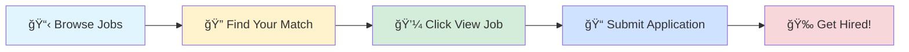

# 🚀 Tech Jobs Board

### Your Gateway to Amazing Career Opportunities

---

## 🎯 Browse by Job Profile

<table>
<tr>
<td align="center" width="25%">

 
<b>1000</b> total positions
</td>
<td align="center" width="25%">

 
<b>1000</b> total positions
</td>
<td align="center" width="25%">

 
<b>1000</b> total positions
</td>
<td align="center" width="25%">

 
<b>1000</b> total positions
</td>
</tr>
</table>

---

## 📊 Data Scientist

> 💼 **1000** positions available

<table>
<thead>
<tr>
<th width="20%">🏢 Company</th>
<th width="35%">💼 Role</th>
<th width="20%">📍 Location</th>
<th width="10%">⏰ Posted</th>
<th width="15%">🔗 Action</th>
</tr>
</thead>
<tbody>
<tr>
<td><a href="https://www.linkedin.com/company/mdtresy-medical-travel-private-limited">Mdtresy Medical Travel Private Limited</a></td>
<td>Data Analysis Trainee</td>
<td>📍 India</td>
<td>1d ago</td>
<td align="center"></td>
</tr>
<tr>
<td><a href="https://in.linkedin.com/company/webboostsolutionait">WEBBOOST SOLUTION IT SERVICES</a></td>
<td>Python Developer Intern</td>
<td>📍 India</td>
<td>1d ago</td>
<td align="center"></td>
</tr>
<tr>
<td><a href="https://in.linkedin.com/company/webboostsolutionait">WEBBOOST SOLUTION IT SERVICES</a></td>
<td>Data Science Intern</td>
<td>📍 India</td>
<td>1d ago</td>
<td align="center"></td>
</tr>
<tr>
<td><a href="https://www.linkedin.com/company/signulu">Signulu</a></td>
<td>Python Developer</td>
<td>📍 Hyderabad</td>
<td>1d ago</td>
<td align="center"></td>
</tr>
<tr>
<td><a href="https://www.linkedin.com/company/the-campbells-company">The Campbell's Company</a></td>
<td>IT Intern - Automation Developer - Summer 2026</td>
<td>📍 Camden, NJ</td>
<td>1d ago</td>
<td align="center"></td>
</tr>
<tr>
<td><a href="https://www.linkedin.com/company/um-it-solutions">UM IT Solutions</a></td>
<td>Machine Learning Intern</td>
<td>📍 India</td>
<td>1d ago</td>
<td align="center"></td>
</tr>
<tr>
<td><a href="https://www.linkedin.com/company/jobunifiedmentor">UM IT PRIVATE LIMITED</a></td>
<td>Data Science Intern</td>
<td>📍 India</td>
<td>1d ago</td>
<td align="center"></td>
</tr>
<tr>
<td><a href="https://www.linkedin.com/company/medtoureasy-hyde">MedtourEasy Hyderabad</a></td>
<td>Data Analysis Trainee</td>
<td>📍 India</td>
<td>1d ago</td>
<td align="center"></td>
</tr>
<tr>
<td><a href="https://in.linkedin.com/company/appendd">Appendd Digital Solutions</a></td>
<td>Senior Quality Assurance Automation Engineer</td>
<td>📍 Pune</td>
<td>1d ago</td>
<td align="center"></td>
</tr>
<tr>
<td><a href="https://www.linkedin.com/company/intellias">Intellias</a></td>
<td>Senior Quality Assurance Automation Engineer</td>
<td>📍 India</td>
<td>1d ago</td>
<td align="center"></td>
</tr>
<tr>
<td><a href="https://www.linkedin.com/company/mtetrainings">MTE Trainings</a></td>
<td>Data Analysis Trainee</td>
<td>📍 India</td>
<td>1d ago</td>
<td align="center"></td>
</tr>
<tr>
<td><a href="https://in.linkedin.com/company/coforge-tech">Coforge</a></td>
<td>Data Scientist</td>
<td>📍 Noida</td>
<td>1d ago</td>
<td align="center"></td>
</tr>
<tr>
<td><a href="https://in.linkedin.com/company/valiance-solutions">Valiance Solutions</a></td>
<td>Artificial Intelligence Researcher</td>
<td>📍 Noida</td>
<td>1d ago</td>
<td align="center"></td>
</tr>
<tr>
<td><a href="https://de.linkedin.com/company/siemens-healthineers">Siemens Healthineers</a></td>
<td>2026 Software & Data Science Internships</td>
<td>📍 Hoffman Estates, IL</td>
<td>1d ago</td>
<td align="center"></td>
</tr>
<tr>
<td><a href="https://de.linkedin.com/company/siemens-healthineers">Siemens Healthineers</a></td>
<td>2026 Software & Data Science Internships</td>
<td></td>
<td>1d ago</td>
<td align="center"></td>
</tr>
<tr>
<td><a href="https://it.linkedin.com/company/umana-spa">UMANA SPA</a></td>
<td>Artificial Intelligence Engineer</td>
<td></td>
<td>1d ago</td>
<td align="center"></td>
</tr>
<tr>
<td><a href="https://ca.linkedin.com/company/gnapi">Gnapi Technologies</a></td>
<td>QA Automation Engineer</td>
<td>📍 Bangalore</td>
<td>1d ago</td>
<td align="center"></td>
</tr>
<tr>
<td><a href="https://de.linkedin.com/company/siemens-healthineers">Siemens Healthineers</a></td>
<td>2026 Software & Data Science Internships</td>
<td></td>
<td>1d ago</td>
<td align="center"></td>
</tr>
<tr>
<td><a href="https://de.linkedin.com/company/siemens-healthineers">Siemens Healthineers</a></td>
<td>Data Science Intern</td>
<td></td>
<td>1d ago</td>
<td align="center"></td>
</tr>
<tr>
<td><a href="https://de.linkedin.com/company/siemens-healthineers">Siemens Healthineers</a></td>
<td>Data Science Intern</td>
<td></td>
<td>1d ago</td>
<td align="center"></td>
</tr>
<tr>
<td><a href="https://de.linkedin.com/company/siemens-healthineers">Siemens Healthineers</a></td>
<td>2026 Software & Data Science Internships</td>
<td></td>
<td>1d ago</td>
<td align="center"></td>
</tr>
<tr>
<td><a href="https://www.linkedin.com/company/unionhomemortgage">Union Home Mortgage Corp.</a></td>
<td>Artificial Intelligence Engineer Intern</td>
<td>📍 Strongsville, OH</td>
<td>1d ago</td>
<td align="center"></td>
</tr>
<tr>
<td><a href="https://www.linkedin.com/company/jobunifiedmentor">UM IT PRIVATE LIMITED</a></td>
<td>Data Science Intern</td>
<td>📍 India</td>
<td>1d ago</td>
<td align="center"></td>
</tr>
<tr>
<td><a href="https://de.linkedin.com/company/siemens-healthineers">Siemens Healthineers</a></td>
<td>Data Science Intern</td>
<td></td>
<td>1d ago</td>
<td align="center"></td>
</tr>
<tr>
<td><a href="https://sg.linkedin.com/company/institute-of-mental-health">Institute of Mental Health</a></td>
<td>Intern (Data Science Office)</td>
<td></td>
<td>1d ago</td>
<td align="center"></td>
</tr>
<tr>
<td><a href="https://ae.linkedin.com/company/magure">Magure</a></td>
<td>AI/ML Research Intern</td>
<td>📍 India</td>
<td>1d ago</td>
<td align="center"></td>
</tr>
<tr>
<td><a href="https://www.linkedin.com/company/lensa">Lensa</a></td>
<td>Current PhD - Data Science Internship - Summer 2026</td>
<td></td>
<td>1d ago</td>
<td align="center"></td>
</tr>
<tr>
<td><a href="https://www.linkedin.com/company/acceler8-talent">Acceler8 Talent</a></td>
<td>Machine Learning Engineer</td>
<td></td>
<td>1d ago</td>
<td align="center"></td>
</tr>
<tr>
<td><a href="https://www.linkedin.com/company/mtetrainings">MTE Trainings</a></td>
<td>Data Analysis Trainee</td>
<td>📍 India</td>
<td>1d ago</td>
<td align="center"></td>
</tr>
<tr>
<td><a href="https://www.linkedin.com/company/unionhomemortgage">Union Home Mortgage Corp.</a></td>
<td>Strategic Data Analytics Intern</td>
<td>📍 Strongsville, OH</td>
<td>1d ago</td>
<td align="center"></td>
</tr>
<tr>
<td><a href="https://uk.linkedin.com/company/hubbul-hiring">hubbul</a></td>
<td>Back End Python Developer, Crypto Trading Systems</td>
<td></td>
<td>1d ago</td>
<td align="center"></td>
</tr>
<tr>
<td><a href="https://www.linkedin.com/company/lensa">Lensa</a></td>
<td>WDW Analytical & Strategic Planning Intern, Spring 2026</td>
<td></td>
<td>1d ago</td>
<td align="center"></td>
</tr>
<tr>
<td><a href="https://in.linkedin.com/company/webarclight">WebArclight</a></td>
<td>AI /ML Intern</td>
<td>📍 India</td>
<td>1d ago</td>
<td align="center"></td>
</tr>
<tr>
<td><a href="https://www.linkedin.com/company/programmingcom">Programming.com</a></td>
<td>Cypress QA automation Engineer</td>
<td>📍 Bangalore</td>
<td>1d ago</td>
<td align="center"></td>
</tr>
<tr>
<td><a href="https://pl.linkedin.com/company/ten-square-games">Ten Square Games</a></td>
<td>Data Scientist</td>
<td></td>
<td>1d ago</td>
<td align="center"></td>
</tr>
<tr>
<td><a href="https://www.linkedin.com/company/it.cor-srl">IT.COR Srl</a></td>
<td>Data Scientist</td>
<td></td>
<td>1d ago</td>
<td align="center"></td>
</tr>
<tr>
<td><a href="https://www.linkedin.com/company/medtoureasy-hyde">MedtourEasy Hyderabad</a></td>
<td>Data Analysis Trainee</td>
<td>📍 India</td>
<td>1d ago</td>
<td align="center"></td>
</tr>
<tr>
<td><a href="https://www.linkedin.com/company/reveille-technologies-inc">Reveille Technologies,Inc</a></td>
<td>Python Developer (Lead Role)</td>
<td>📍 Chennai</td>
<td>1d ago</td>
<td align="center"></td>
</tr>
<tr>
<td><a href="https://www.linkedin.com/company/lensa">Lensa</a></td>
<td>Data Analytics Co-Op Summer 2026 Indefinite Authorization Needed</td>
<td>📍 New Bremen, OH</td>
<td>1d ago</td>
<td align="center"></td>
</tr>
<tr>
<td><a href="https://www.linkedin.com/company/nutanix">Nutanix</a></td>
<td>MTS- 2- System Testing, Python Automation [2+ years]</td>
<td>📍 Bangalore</td>
<td>1d ago</td>
<td align="center"></td>
</tr>
<tr>
<td><a href="https://in.linkedin.com/company/vlaunchuconsultancy">VLaunchU</a></td>
<td>DevOps / Azure Engineer</td>
<td>📍 Chennai</td>
<td>1d ago</td>
<td align="center"></td>
</tr>
<tr>
<td><a href="https://fr.linkedin.com/company/tokimo">Tokimo</a></td>
<td>Référent</td>
<td></td>
<td>1d ago</td>
<td align="center"></td>
</tr>
<tr>
<td><a href="https://fr.linkedin.com/company/mp-data-ds">MP DATA</a></td>
<td>Data Scientist Junior - Energie</td>
<td></td>
<td>1d ago</td>
<td align="center"></td>
</tr>
<tr>
<td><a href="https://de.linkedin.com/company/wechselpilot">Wechselpilot</a></td>
<td>(Junior) Automation Developer (m/w/d)</td>
<td></td>
<td>1d ago</td>
<td align="center"></td>
</tr>
<tr>
<td><a href="https://uk.linkedin.com/company/arup">Arup</a></td>
<td>Geospatial Data Analytics Graduate - 2026 Graduate Programme (5584)</td>
<td></td>
<td>1d ago</td>
<td align="center"></td>
</tr>
<tr>
<td><a href="https://www.linkedin.com/company/datazoic">Datazoic Inc.</a></td>
<td>Artificial Intelligence Engineer</td>
<td>📍 Chennai</td>
<td>1d ago</td>
<td align="center"></td>
</tr>
<tr>
<td><a href="https://www.linkedin.com/company/lensa">Lensa</a></td>
<td>Summer 2026 Evaluation Analytics Graduate Intern</td>
<td></td>
<td>1d ago</td>
<td align="center"></td>
</tr>
<tr>
<td><a href="https://www.linkedin.com/company/lensa">Lensa</a></td>
<td>Summer Associate Internship (Data Scientist)</td>
<td></td>
<td>1d ago</td>
<td align="center"></td>
</tr>
<tr>
<td><a href="https://uk.linkedin.com/company/weareopenr">Openr</a></td>
<td>Data Scientist</td>
<td></td>
<td>1d ago</td>
<td align="center"></td>
</tr>
<tr>
<td><a href="https://www.linkedin.com/company/lensa">Lensa</a></td>
<td>2026 Analytics and Data Summer Internship - Early Careers</td>
<td></td>
<td>1d ago</td>
<td align="center"></td>
</tr>
<tr>
<td><a href="https://it.linkedin.com/company/tropico-security">TROPICO Security</a></td>
<td>AI/ML Engineer (RAL EUR 40-80K)</td>
<td></td>
<td>1d ago</td>
<td align="center"></td>
</tr>
<tr>
<td><a href="https://www.linkedin.com/company/emplay-inc-">Emplay Inc.</a></td>
<td>Intern – Agentic AI Automation Engineer</td>
<td></td>
<td>1d ago</td>
<td align="center"></td>
</tr>
<tr>
<td><a href="https://www.linkedin.com/company/ibm">IBM</a></td>
<td>2026 Intern: Software Engineer – AI-powered Automation</td>
<td></td>
<td>1d ago</td>
<td align="center"></td>
</tr>
<tr>
<td><a href="https://fr.linkedin.com/company/belcorporate">Bel</a></td>
<td>STAGE - Data Scientist (H/F/X) - Janvier 2026</td>
<td></td>
<td>1d ago</td>
<td align="center"></td>
</tr>
<tr>
<td><a href="https://in.linkedin.com/company/cybranex">CybraneX</a></td>
<td>Quantum ML Engineer Intern</td>
<td>📍 India</td>
<td>1d ago</td>
<td align="center"></td>
</tr>
<tr>
<td><a href="https://fr.linkedin.com/company/assystem">Assystem</a></td>
<td>Data Scientist / Python - Stage H/F</td>
<td></td>
<td>1d ago</td>
<td align="center"></td>
</tr>
<tr>
<td><a href="https://www.linkedin.com/company/lensa">Lensa</a></td>
<td>Automation Engineering Intern - The Toro Company</td>
<td></td>
<td>1d ago</td>
<td align="center"></td>
</tr>
<tr>
<td><a href="https://in.linkedin.com/company/apmosys-the-consulting-services-company">ApMoSys Technologies Private Limited</a></td>
<td>Synthetic Monitoring Engineer</td>
<td>📍 Mumbai</td>
<td>1d ago</td>
<td align="center"></td>
</tr>
<tr>
<td><a href="https://www.linkedin.com/company/lensa">Lensa</a></td>
<td>Summer 2026 Quality Analytics Undergraduate Intern</td>
<td></td>
<td>1d ago</td>
<td align="center"></td>
</tr>
<tr>
<td><a href="https://de.linkedin.com/company/avenga">Avenga</a></td>
<td>Senior QA Automation Engineer(Contractor)</td>
<td>📍 Istanbul, Türkiye</td>
<td>1d ago</td>
<td align="center"></td>
</tr>
<tr>
<td><a href="https://www.linkedin.com/company/lensa">Lensa</a></td>
<td>Summer 2026 Evaluation Analytics Graduate Intern</td>
<td></td>
<td>1d ago</td>
<td align="center"></td>
</tr>
<tr>
<td><a href="https://www.linkedin.com/company/lensa">Lensa</a></td>
<td>Data Science & Analytics Intern</td>
<td></td>
<td>1d ago</td>
<td align="center"></td>
</tr>
<tr>
<td><a href="https://www.linkedin.com/company/lensa">Lensa</a></td>
<td>ML Engineer Intern</td>
<td></td>
<td>1d ago</td>
<td align="center"></td>
</tr>
<tr>
<td><a href="https://www.linkedin.com/company/oracle">Oracle</a></td>
<td>Principal/Member of Technical Staff- IC4/IC3- Networking, AI/ML</td>
<td>📍 Noida</td>
<td>1d ago</td>
<td align="center"></td>
</tr>
<tr>
<td><a href="https://www.linkedin.com/company/oracle">Oracle</a></td>
<td>Principal/Member of Technical Staff- IC4/IC3- Networking, AI/ML</td>
<td>📍 Hyderabad</td>
<td>1d ago</td>
<td align="center"></td>
</tr>
<tr>
<td><a href="https://in.linkedin.com/company/harmanindia">HARMAN India</a></td>
<td>ML Engineer</td>
<td>📍 Bangalore</td>
<td>1d ago</td>
<td align="center"></td>
</tr>
<tr>
<td><a href="https://www.linkedin.com/company/lensa">Lensa</a></td>
<td>ETDP Intern - Data Analytics</td>
<td></td>
<td>1d ago</td>
<td align="center"></td>
</tr>
<tr>
<td><a href="https://www.linkedin.com/company/lensa">Lensa</a></td>
<td>Intern, Data Science</td>
<td></td>
<td>1d ago</td>
<td align="center"></td>
</tr>
<tr>
<td><a href="https://www.linkedin.com/company/moodys-corporation">Moody's Corporation</a></td>
<td>Team Lead-Fin Data & Analytics</td>
<td>📍 Gurugram</td>
<td>1d ago</td>
<td align="center"></td>
</tr>
<tr>
<td><a href="https://es.linkedin.com/company/kpmg-espana">KPMG España</a></td>
<td>Data Scientist</td>
<td></td>
<td>1d ago</td>
<td align="center"></td>
</tr>
<tr>
<td><a href="https://in.linkedin.com/company/f13tech">F13 Technologies</a></td>
<td>AWS Cloud Internship</td>
<td>📍 India</td>
<td>1d ago</td>
<td align="center"></td>
</tr>
<tr>
<td><a href="https://www.linkedin.com/company/lensa">Lensa</a></td>
<td>Data Visualization Intern, One Way Team</td>
<td></td>
<td>1d ago</td>
<td align="center"></td>
</tr>
<tr>
<td><a href="https://www.linkedin.com/company/uber-com">Uber</a></td>
<td>Automation Specialist</td>
<td></td>
<td>1d ago</td>
<td align="center"></td>
</tr>
<tr>
<td><a href="https://uk.linkedin.com/company/wearehaystack">Haystack</a></td>
<td>Data Science Intern</td>
<td></td>
<td>1d ago</td>
<td align="center"></td>
</tr>
<tr>
<td><a href="https://de.linkedin.com/company/voss-fluid-gmbh">VOSS Fluid</a></td>
<td>Leiter Finanzen, Buchhaltung (m/w/d) für den Standort Wipperfürth</td>
<td></td>
<td>1d ago</td>
<td align="center"></td>
</tr>
<tr>
<td><a href="https://www.linkedin.com/company/lensa">Lensa</a></td>
<td>Summer 2026 Evaluation Analytics Graduate Intern</td>
<td></td>
<td>1d ago</td>
<td align="center"></td>
</tr>
<tr>
<td><a href="https://www.linkedin.com/company/unicorn-technologies-llc">Unicorn Technologies LLC</a></td>
<td>Azure Devops and Terraform Engineer</td>
<td></td>
<td>1d ago</td>
<td align="center"></td>
</tr>
<tr>
<td><a href="https://www.linkedin.com/company/manpowergroup">ManpowerGroup</a></td>
<td>Head of R&D (HKD 120,000)</td>
<td></td>
<td>1d ago</td>
<td align="center"></td>
</tr>
<tr>
<td><a href="https://fr.linkedin.com/company/needle-concept">Needle Concept</a></td>
<td>Ingénieur R&D Dispositifs Médicaux (H/F)</td>
<td></td>
<td>1d ago</td>
<td align="center"></td>
</tr>
<tr>
<td><a href="https://www.linkedin.com/company/emplay-inc-">Emplay Inc.</a></td>
<td>Senior Associate – Agentic AI Automation Engineer</td>
<td></td>
<td>1d ago</td>
<td align="center"></td>
</tr>
<tr>
<td><a href="https://in.linkedin.com/company/accentureindia">Accenture in India</a></td>
<td>AI / ML Engineer</td>
<td>📍 Noida</td>
<td>1d ago</td>
<td align="center"></td>
</tr>
<tr>
<td><a href="https://de.linkedin.com/company/allianz-technology">Allianz Technology</a></td>
<td>Junior Actuary with Python</td>
<td></td>
<td>1d ago</td>
<td align="center"></td>
</tr>
<tr>
<td><a href="https://www.linkedin.com/company/emplay-inc-">Emplay Inc.</a></td>
<td>Associate-Agentic AI Automation Engineer</td>
<td></td>
<td>1d ago</td>
<td align="center"></td>
</tr>
<tr>
<td><a href="https://tr.linkedin.com/company/aselsan">Aselsan</a></td>
<td>Haberleşme Ürünleri Sayısal Donanım Tasarım Mühendisi</td>
<td></td>
<td>1d ago</td>
<td align="center"></td>
</tr>
<tr>
<td><a href="https://in.linkedin.com/company/live-connections">Live Connections</a></td>
<td>TOSCA Automation Architect (Immediate)</td>
<td>📍 Chennai</td>
<td>1d ago</td>
<td align="center"></td>
</tr>
<tr>
<td><a href="https://www.linkedin.com/company/blend360">Blend</a></td>
<td>Lead / Manager Data Science</td>
<td>📍 Hyderabad</td>
<td>1d ago</td>
<td align="center"></td>
</tr>
<tr>
<td><a href="https://fr.linkedin.com/company/iag-services">IAG Services</a></td>
<td>AI/ML Engineer</td>
<td></td>
<td>1d ago</td>
<td align="center"></td>
</tr>
<tr>
<td><a href="https://www.linkedin.com/company/genpact">Genpact</a></td>
<td>URGENT Senior QA Automation Engineer (HMO on Day 1/Hybrid work set up)</td>
<td></td>
<td>1d ago</td>
<td align="center"></td>
</tr>
<tr>
<td><a href="https://in.linkedin.com/company/mars-cosmetics">MARS Cosmetics</a></td>
<td>Marketing Analytics Intern</td>
<td>📍 Delhi</td>
<td>1d ago</td>
<td align="center"></td>
</tr>
<tr>
<td><a href="https://www.linkedin.com/company/lensa">Lensa</a></td>
<td>2026 Summer Internship - Data Analytics/Data Science</td>
<td></td>
<td>1d ago</td>
<td align="center"></td>
</tr>
<tr>
<td><a href="https://www.linkedin.com/company/lensa">Lensa</a></td>
<td>Summer 2026 Quality Analytics Undergraduate Intern</td>
<td></td>
<td>1d ago</td>
<td align="center"></td>
</tr>
<tr>
<td><a href="https://www.linkedin.com/company/lensa">Lensa</a></td>
<td>Summer 2026 Quality Analytics Undergraduate Intern</td>
<td></td>
<td>1d ago</td>
<td align="center"></td>
</tr>
<tr>
<td><a href="https://uk.linkedin.com/company/qualitest">Qualitest</a></td>
<td>Senior Automation Engineer</td>
<td>📍 Bangalore</td>
<td>1d ago</td>
<td align="center"></td>
</tr>
<tr>
<td><a href="https://in.linkedin.com/company/multicloud4u">Multicloud4U® Technologies</a></td>
<td>Azure Devops & Snowflake Data Engineer</td>
<td>📍 Gurugram</td>
<td>1d ago</td>
<td align="center"></td>
</tr>
<tr>
<td><a href="https://www.linkedin.com/company/um-it-solutions">UM IT Solutions</a></td>
<td>Artificial Intelligence Intern</td>
<td>📍 India</td>
<td>1d ago</td>
<td align="center"></td>
</tr>
<tr>
<td><a href="https://www.linkedin.com/company/perficient">Perficient</a></td>
<td>Senior Python Developer + AWS</td>
<td></td>
<td>1d ago</td>
<td align="center"></td>
</tr>
<tr>
<td><a href="https://de.linkedin.com/company/withsolid">Solid</a></td>
<td>Founding Engineer - ML</td>
<td></td>
<td>1d ago</td>
<td align="center"></td>
</tr>
<tr>
<td><a href="https://in.linkedin.com/company/ltimindtree">LTIMindtree</a></td>
<td>Dot net with Python</td>
<td>📍 Chennai</td>
<td>1d ago</td>
<td align="center"></td>
</tr>
<tr>
<td><a href="https://www.linkedin.com/company/executive-placements">ExecutivePlacements.com - The JOB Portal</a></td>
<td>Python/Sql Developer - Remote</td>
<td></td>
<td>1d ago</td>
<td align="center"></td>
</tr>
<tr>
<td><a href="https://www.linkedin.com/company/blend360">Blend</a></td>
<td>Director – Data Science (Practice Head - India)</td>
<td>📍 Hyderabad</td>
<td>1d ago</td>
<td align="center"></td>
</tr>
<tr><td colspan="5" align="center"><i>... and 900 more positions</i></td></tr>
</tbody>
</table>

---

## 💼 Business Analyst

> 💼 **1000** positions available

<table>
<thead>
<tr>
<th width="20%">🏢 Company</th>
<th width="35%">💼 Role</th>
<th width="20%">📍 Location</th>
<th width="10%">⏰ Posted</th>
<th width="15%">🔗 Action</th>
</tr>
</thead>
<tbody>
<tr>
<td><a href="https://www.linkedin.com/company/mdtresy-medical-travel-private-limited">Mdtresy Medical Travel Private Limited</a></td>
<td>Data Analysis Trainee</td>
<td>📍 India</td>
<td>1d ago</td>
<td align="center"></td>
</tr>
<tr>
<td><a href="https://nl.linkedin.com/company/huisman">Huisman</a></td>
<td>Trainee Project Management Officer</td>
<td></td>
<td>1d ago</td>
<td align="center"></td>
</tr>
<tr>
<td><a href="https://in.linkedin.com/company/webboostsolutionait">WEBBOOST SOLUTION IT SERVICES</a></td>
<td>Python Developer Intern</td>
<td>📍 India</td>
<td>1d ago</td>
<td align="center"></td>
</tr>
<tr>
<td><a href="https://www.linkedin.com/company/signulu">Signulu</a></td>
<td>Python Developer</td>
<td>📍 Hyderabad</td>
<td>1d ago</td>
<td align="center"></td>
</tr>
<tr>
<td><a href="https://www.linkedin.com/company/the-campbells-company">The Campbell's Company</a></td>
<td>IT Intern - Automation Developer - Summer 2026</td>
<td>📍 Camden, NJ</td>
<td>1d ago</td>
<td align="center"></td>
</tr>
<tr>
<td><a href="https://www.linkedin.com/company/medtoureasy-hyde">MedtourEasy Hyderabad</a></td>
<td>Data Analysis Trainee</td>
<td>📍 India</td>
<td>1d ago</td>
<td align="center"></td>
</tr>
<tr>
<td><a href="https://in.linkedin.com/company/appendd">Appendd Digital Solutions</a></td>
<td>Senior Quality Assurance Automation Engineer</td>
<td>📍 Pune</td>
<td>1d ago</td>
<td align="center"></td>
</tr>
<tr>
<td><a href="https://www.linkedin.com/company/intellias">Intellias</a></td>
<td>Senior Quality Assurance Automation Engineer</td>
<td>📍 India</td>
<td>1d ago</td>
<td align="center"></td>
</tr>
<tr>
<td><a href="https://www.linkedin.com/company/mtetrainings">MTE Trainings</a></td>
<td>Data Analysis Trainee</td>
<td>📍 India</td>
<td>1d ago</td>
<td align="center"></td>
</tr>
<tr>
<td><a href="https://www.linkedin.com/company/jbpco-india">JBPCO India</a></td>
<td>Trainee Business Analyst - JD Edwards</td>
<td>📍 Bangalore</td>
<td>1d ago</td>
<td align="center"></td>
</tr>
<tr>
<td><a href="https://ca.linkedin.com/company/gnapi">Gnapi Technologies</a></td>
<td>QA Automation Engineer</td>
<td>📍 Bangalore</td>
<td>1d ago</td>
<td align="center"></td>
</tr>
<tr>
<td><a href="https://ae.linkedin.com/company/dp-world">DP World</a></td>
<td>IT Project Management Intern</td>
<td></td>
<td>1d ago</td>
<td align="center"></td>
</tr>
<tr>
<td><a href="https://ch.linkedin.com/company/cartier">Cartier</a></td>
<td>STAGE - Assistant(e) Business Analyst Parfums - Janvier 2026</td>
<td></td>
<td>1d ago</td>
<td align="center"></td>
</tr>
<tr>
<td><a href="https://ae.linkedin.com/company/dp-world">DP World</a></td>
<td>Project Management (Transformation) Intern</td>
<td></td>
<td>1d ago</td>
<td align="center"></td>
</tr>
<tr>
<td><a href="https://www.linkedin.com/company/mckinsey">McKinsey & Company</a></td>
<td>Summer Business Analyst Intern - McKinsey Digital</td>
<td></td>
<td>1d ago</td>
<td align="center"></td>
</tr>
<tr>
<td><a href="https://www.linkedin.com/company/mtetrainings">MTE Trainings</a></td>
<td>Data Analysis Trainee</td>
<td>📍 India</td>
<td>1d ago</td>
<td align="center"></td>
</tr>
<tr>
<td><a href="https://www.linkedin.com/company/unionhomemortgage">Union Home Mortgage Corp.</a></td>
<td>Strategic Data Analytics Intern</td>
<td>📍 Strongsville, OH</td>
<td>1d ago</td>
<td align="center"></td>
</tr>
<tr>
<td><a href="https://uk.linkedin.com/company/hubbul-hiring">hubbul</a></td>
<td>Back End Python Developer, Crypto Trading Systems</td>
<td></td>
<td>1d ago</td>
<td align="center"></td>
</tr>
<tr>
<td><a href="https://www.linkedin.com/company/lensa">Lensa</a></td>
<td>WDW Analytical & Strategic Planning Intern, Spring 2026</td>
<td></td>
<td>1d ago</td>
<td align="center"></td>
</tr>
<tr>
<td><a href="https://in.linkedin.com/company/birlasoft">Birlasoft</a></td>
<td>Business Analyst- PLM Windchill</td>
<td>📍 Hyderabad</td>
<td>1d ago</td>
<td align="center"></td>
</tr>
<tr>
<td><a href="https://mt.linkedin.com/company/n-ix">N-iX</a></td>
<td>Senior Business Analyst</td>
<td></td>
<td>1d ago</td>
<td align="center"></td>
</tr>
<tr>
<td><a href="https://www.linkedin.com/company/programmingcom">Programming.com</a></td>
<td>Cypress QA automation Engineer</td>
<td>📍 Bangalore</td>
<td>1d ago</td>
<td align="center"></td>
</tr>
<tr>
<td><a href="https://www.linkedin.com/company/siemens-energy">Siemens Energy</a></td>
<td>IT Service Professional /IT PM / Scrum Master</td>
<td>📍 Pune</td>
<td>1d ago</td>
<td align="center"></td>
</tr>
<tr>
<td><a href="https://www.linkedin.com/company/consilio-llc">Consilio LLC</a></td>
<td>Director, eDiscovery Project Management</td>
<td>📍 Gurugram</td>
<td>1d ago</td>
<td align="center"></td>
</tr>
<tr>
<td><a href="https://www.linkedin.com/company/medtoureasy-hyde">MedtourEasy Hyderabad</a></td>
<td>Data Analysis Trainee</td>
<td>📍 India</td>
<td>1d ago</td>
<td align="center"></td>
</tr>
<tr>
<td><a href="https://www.linkedin.com/company/reveille-technologies-inc">Reveille Technologies,Inc</a></td>
<td>Python Developer (Lead Role)</td>
<td>📍 Chennai</td>
<td>1d ago</td>
<td align="center"></td>
</tr>
<tr>
<td><a href="https://www.linkedin.com/company/lensa">Lensa</a></td>
<td>Data Analytics Co-Op Summer 2026 Indefinite Authorization Needed</td>
<td>📍 New Bremen, OH</td>
<td>1d ago</td>
<td align="center"></td>
</tr>
<tr>
<td><a href="https://www.linkedin.com/company/nutanix">Nutanix</a></td>
<td>MTS- 2- System Testing, Python Automation [2+ years]</td>
<td>📍 Bangalore</td>
<td>1d ago</td>
<td align="center"></td>
</tr>
<tr>
<td><a href="https://uk.linkedin.com/company/mygwork">myGwork - LGBTQ+ Business Community</a></td>
<td>Business Analyst - Data Quality</td>
<td>📍 Bangalore</td>
<td>1d ago</td>
<td align="center"></td>
</tr>
<tr>
<td><a href="https://de.linkedin.com/company/wechselpilot">Wechselpilot</a></td>
<td>(Junior) Automation Developer (m/w/d)</td>
<td></td>
<td>1d ago</td>
<td align="center"></td>
</tr>
<tr>
<td><a href="https://uk.linkedin.com/company/mygwork">myGwork - LGBTQ+ Business Community</a></td>
<td>JIRA Administrator</td>
<td>📍 Mumbai</td>
<td>1d ago</td>
<td align="center"></td>
</tr>
<tr>
<td><a href="https://uk.linkedin.com/company/arup">Arup</a></td>
<td>Geospatial Data Analytics Graduate - 2026 Graduate Programme (5584)</td>
<td></td>
<td>1d ago</td>
<td align="center"></td>
</tr>
<tr>
<td><a href="https://www.linkedin.com/company/lensa">Lensa</a></td>
<td>2026 Spring Internship - Business Analyst (NYC)</td>
<td></td>
<td>1d ago</td>
<td align="center"></td>
</tr>
<tr>
<td><a href="https://www.linkedin.com/company/lensa">Lensa</a></td>
<td>Summer 2026 Evaluation Analytics Graduate Intern</td>
<td></td>
<td>1d ago</td>
<td align="center"></td>
</tr>
<tr>
<td><a href="https://www.linkedin.com/company/lensa">Lensa</a></td>
<td>1LMX ERP Business Analyst Intern</td>
<td></td>
<td>1d ago</td>
<td align="center"></td>
</tr>
<tr>
<td><a href="https://www.linkedin.com/company/lensa">Lensa</a></td>
<td>Salesforce Intern</td>
<td></td>
<td>1d ago</td>
<td align="center"></td>
</tr>
<tr>
<td><a href="https://be.linkedin.com/company/b-inside-bvba">b-inside bv</a></td>
<td>Business Consultant</td>
<td></td>
<td>1d ago</td>
<td align="center"></td>
</tr>
<tr>
<td><a href="https://www.linkedin.com/company/lensa">Lensa</a></td>
<td>2026 Analytics and Data Summer Internship - Early Careers</td>
<td></td>
<td>1d ago</td>
<td align="center"></td>
</tr>
<tr>
<td><a href="https://www.linkedin.com/company/emplay-inc-">Emplay Inc.</a></td>
<td>Intern – Agentic AI Automation Engineer</td>
<td></td>
<td>1d ago</td>
<td align="center"></td>
</tr>
<tr>
<td><a href="https://www.linkedin.com/company/ibm">IBM</a></td>
<td>2026 Intern: Software Engineer – AI-powered Automation</td>
<td></td>
<td>1d ago</td>
<td align="center"></td>
</tr>
<tr>
<td><a href="https://fr.linkedin.com/company/assystem">Assystem</a></td>
<td>Data Scientist / Python - Stage H/F</td>
<td></td>
<td>1d ago</td>
<td align="center"></td>
</tr>
<tr>
<td><a href="https://www.linkedin.com/company/lensa">Lensa</a></td>
<td>Automation Engineering Intern - The Toro Company</td>
<td></td>
<td>1d ago</td>
<td align="center"></td>
</tr>
<tr>
<td><a href="https://www.linkedin.com/company/mckinsey">McKinsey & Company</a></td>
<td>Summer Business Analyst Intern - McKinsey Digital</td>
<td></td>
<td>1d ago</td>
<td align="center"></td>
</tr>
<tr>
<td><a href="https://vn.linkedin.com/company/sens-vn">SENS</a></td>
<td>IT Business Analyst Fresher/Junior</td>
<td></td>
<td>1d ago</td>
<td align="center"></td>
</tr>
<tr>
<td><a href="https://www.linkedin.com/company/standard-chartered-india">Standard Chartered India</a></td>
<td>Manager Business Analyst</td>
<td>📍 Chennai</td>
<td>1d ago</td>
<td align="center"></td>
</tr>
<tr>
<td><a href="https://www.linkedin.com/company/lensa">Lensa</a></td>
<td>Summer 2026 Quality Analytics Undergraduate Intern</td>
<td></td>
<td>1d ago</td>
<td align="center"></td>
</tr>
<tr>
<td><a href="https://de.linkedin.com/company/avenga">Avenga</a></td>
<td>Senior QA Automation Engineer(Contractor)</td>
<td>📍 Istanbul, Türkiye</td>
<td>1d ago</td>
<td align="center"></td>
</tr>
<tr>
<td><a href="https://www.linkedin.com/company/lensa">Lensa</a></td>
<td>Summer 2026 Evaluation Analytics Graduate Intern</td>
<td></td>
<td>1d ago</td>
<td align="center"></td>
</tr>
<tr>
<td><a href="https://www.linkedin.com/company/lensa">Lensa</a></td>
<td>Data Science & Analytics Intern</td>
<td></td>
<td>1d ago</td>
<td align="center"></td>
</tr>
<tr>
<td><a href="https://lk.linkedin.com/company/career-consultants-pvt-ltd">CAREER141</a></td>
<td>Intern Documentation & Data Entry</td>
<td></td>
<td>1d ago</td>
<td align="center"></td>
</tr>
<tr>
<td><a href="https://www.linkedin.com/company/lensa">Lensa</a></td>
<td>ETDP Intern - Data Analytics</td>
<td></td>
<td>1d ago</td>
<td align="center"></td>
</tr>
<tr>
<td><a href="https://www.linkedin.com/company/usefulbi-corporation">UsefulBI Corporation</a></td>
<td>Business Analyst(Pharma or medical writing experience)</td>
<td>📍 Pune</td>
<td>1d ago</td>
<td align="center"></td>
</tr>
<tr>
<td><a href="https://www.linkedin.com/company/moodys-corporation">Moody's Corporation</a></td>
<td>Team Lead-Fin Data & Analytics</td>
<td>📍 Gurugram</td>
<td>1d ago</td>
<td align="center"></td>
</tr>
<tr>
<td><a href="https://www.linkedin.com/company/lensa">Lensa</a></td>
<td>IT Business Analyst Intern (Melbourne, FL)</td>
<td></td>
<td>1d ago</td>
<td align="center"></td>
</tr>
<tr>
<td><a href="https://www.linkedin.com/company/uber-com">Uber</a></td>
<td>Automation Specialist</td>
<td></td>
<td>1d ago</td>
<td align="center"></td>
</tr>
<tr>
<td><a href="https://www.linkedin.com/company/uber-com">Uber</a></td>
<td>Business Analyst - Rider Growth, Uber Shuttle</td>
<td>📍 Gurugram</td>
<td>1d ago</td>
<td align="center"></td>
</tr>
<tr>
<td><a href="https://www.linkedin.com/company/lensa">Lensa</a></td>
<td>Summer 2026 Evaluation Analytics Graduate Intern</td>
<td></td>
<td>1d ago</td>
<td align="center"></td>
</tr>
<tr>
<td><a href="https://de.linkedin.com/company/lorenz-informatik">LorenzInformatik - We love IT</a></td>
<td>IT Business Analyst (m/w/d)</td>
<td>📍 Greater Nuremberg Metropolitan Area</td>
<td>1d ago</td>
<td align="center"></td>
</tr>
<tr>
<td><a href="https://www.linkedin.com/company/emplay-inc-">Emplay Inc.</a></td>
<td>Senior Associate – Agentic AI Automation Engineer</td>
<td></td>
<td>1d ago</td>
<td align="center"></td>
</tr>
<tr>
<td><a href="https://de.linkedin.com/company/allianz-technology">Allianz Technology</a></td>
<td>Junior Actuary with Python</td>
<td></td>
<td>1d ago</td>
<td align="center"></td>
</tr>
<tr>
<td><a href="https://www.linkedin.com/company/emplay-inc-">Emplay Inc.</a></td>
<td>Associate-Agentic AI Automation Engineer</td>
<td></td>
<td>1d ago</td>
<td align="center"></td>
</tr>
<tr>
<td><a href="https://mk.linkedin.com/company/iwconnect">⋮IWConnect</a></td>
<td>Technical Business Analyst (Data Focus)</td>
<td></td>
<td>1d ago</td>
<td align="center"></td>
</tr>
<tr>
<td><a href="https://in.linkedin.com/company/live-connections">Live Connections</a></td>
<td>TOSCA Automation Architect (Immediate)</td>
<td>📍 Chennai</td>
<td>1d ago</td>
<td align="center"></td>
</tr>
<tr>
<td><a href="https://uk.linkedin.com/company/pracyva-ltd">PRACYVA</a></td>
<td>Scrum Master</td>
<td></td>
<td>1d ago</td>
<td align="center"></td>
</tr>
<tr>
<td><a href="https://www.linkedin.com/company/lensa">Lensa</a></td>
<td>Finance Business Analyst Intern</td>
<td></td>
<td>1d ago</td>
<td align="center"></td>
</tr>
<tr>
<td><a href="https://www.linkedin.com/company/genpact">Genpact</a></td>
<td>URGENT Senior QA Automation Engineer (HMO on Day 1/Hybrid work set up)</td>
<td></td>
<td>1d ago</td>
<td align="center"></td>
</tr>
<tr>
<td><a href="https://in.linkedin.com/company/mars-cosmetics">MARS Cosmetics</a></td>
<td>Marketing Analytics Intern</td>
<td>📍 Delhi</td>
<td>1d ago</td>
<td align="center"></td>
</tr>
<tr>
<td><a href="https://www.linkedin.com/company/lensa">Lensa</a></td>
<td>Documentation Specialist - Remote</td>
<td></td>
<td>1d ago</td>
<td align="center"></td>
</tr>
<tr>
<td><a href="https://www.linkedin.com/company/lensa">Lensa</a></td>
<td>Business Analyst - Entry Level</td>
<td></td>
<td>1d ago</td>
<td align="center"></td>
</tr>
<tr>
<td><a href="https://www.linkedin.com/company/lensa">Lensa</a></td>
<td>Business Analyst - Remote</td>
<td></td>
<td>1d ago</td>
<td align="center"></td>
</tr>
<tr>
<td><a href="https://www.linkedin.com/company/stryker">Stryker</a></td>
<td>Project Management Co-Op</td>
<td></td>
<td>1d ago</td>
<td align="center"></td>
</tr>
<tr>
<td><a href="https://www.linkedin.com/company/lensa">Lensa</a></td>
<td>2026 Summer Internship - Data Analytics/Data Science</td>
<td></td>
<td>1d ago</td>
<td align="center"></td>
</tr>
<tr>
<td><a href="https://www.linkedin.com/company/lensa">Lensa</a></td>
<td>Scrum Master</td>
<td></td>
<td>1d ago</td>
<td align="center"></td>
</tr>
<tr>
<td><a href="https://www.linkedin.com/company/lensa">Lensa</a></td>
<td>Summer 2026 Quality Analytics Undergraduate Intern</td>
<td></td>
<td>1d ago</td>
<td align="center"></td>
</tr>
<tr>
<td><a href="https://www.linkedin.com/company/lensa">Lensa</a></td>
<td>Summer 2026 Quality Analytics Undergraduate Intern</td>
<td></td>
<td>1d ago</td>
<td align="center"></td>
</tr>
<tr>
<td><a href="https://www.linkedin.com/company/lensa">Lensa</a></td>
<td>Documentation Specialist - Remote</td>
<td></td>
<td>1d ago</td>
<td align="center"></td>
</tr>
<tr>
<td><a href="https://uk.linkedin.com/company/qualitest">Qualitest</a></td>
<td>Senior Automation Engineer</td>
<td>📍 Bangalore</td>
<td>1d ago</td>
<td align="center"></td>
</tr>
<tr>
<td><a href="https://www.linkedin.com/company/lensa">Lensa</a></td>
<td>Business Process Engineering Intern</td>
<td></td>
<td>1d ago</td>
<td align="center"></td>
</tr>
<tr>
<td><a href="https://www.linkedin.com/company/perficient">Perficient</a></td>
<td>Senior Python Developer + AWS</td>
<td></td>
<td>1d ago</td>
<td align="center"></td>
</tr>
<tr>
<td><a href="https://in.linkedin.com/company/ltimindtree">LTIMindtree</a></td>
<td>Dot net with Python</td>
<td>📍 Chennai</td>
<td>1d ago</td>
<td align="center"></td>
</tr>
<tr>
<td><a href="https://www.linkedin.com/company/executive-placements">ExecutivePlacements.com - The JOB Portal</a></td>
<td>Python/Sql Developer - Remote</td>
<td></td>
<td>1d ago</td>
<td align="center"></td>
</tr>
<tr>
<td><a href="https://www.linkedin.com/company/executive-placements">ExecutivePlacements.com - The JOB Portal</a></td>
<td>Scrum Master Remote Opportunity</td>
<td></td>
<td>1d ago</td>
<td align="center"></td>
</tr>
<tr>
<td><a href="https://au.linkedin.com/company/aldi-stores-australia">ALDI Stores Australia</a></td>
<td>Senior Business Analyst</td>
<td></td>
<td>1d ago</td>
<td align="center"></td>
</tr>
<tr>
<td><a href="https://www.linkedin.com/company/sprinklr">Sprinklr</a></td>
<td>Sr. Salesforce Developer</td>
<td>📍 Gurugram</td>
<td>1d ago</td>
<td align="center"></td>
</tr>
<tr>
<td><a href="https://fr.linkedin.com/company/bnp-paribas">BNP Paribas</a></td>
<td>Senior Business Analyst - GRC / Service Now</td>
<td>📍 Chennai</td>
<td>1d ago</td>
<td align="center"></td>
</tr>
<tr>
<td><a href="https://sg.linkedin.com/company/avadacommerce">Avada Commerce</a></td>
<td>Junior Business Analyst</td>
<td></td>
<td>1d ago</td>
<td align="center"></td>
</tr>
<tr>
<td><a href="https://uk.linkedin.com/company/vertical-advantage">Vertical Advantage</a></td>
<td>Ecommerce Analytics Lead</td>
<td></td>
<td>1d ago</td>
<td align="center"></td>
</tr>
<tr>
<td><a href="https://in.linkedin.com/company/step-onestepahead">STEP One Step Ahead</a></td>
<td>UiPath Test Automation</td>
<td>📍 Mumbai</td>
<td>1d ago</td>
<td align="center"></td>
</tr>
<tr>
<td><a href="https://in.linkedin.com/company/bajaj-finserv-lending">Bajaj Finserv</a></td>
<td>Business Analyst</td>
<td>📍 Pune</td>
<td>1d ago</td>
<td align="center"></td>
</tr>
<tr>
<td><a href="https://dk.linkedin.com/company/hempel-as">Hempel A/S</a></td>
<td>Senior IT Project Manager - Data&Analytics</td>
<td>📍 Pune</td>
<td>1d ago</td>
<td align="center"></td>
</tr>
<tr>
<td><a href="https://www.linkedin.com/company/prestige-oss">Prestige OSS</a></td>
<td>Senior SQA Engineer (Automation + Manual)</td>
<td></td>
<td>1d ago</td>
<td align="center"></td>
</tr>
<tr>
<td><a href="https://in.linkedin.com/company/bajaj-finserv-lending">Bajaj Finserv</a></td>
<td>Senior Business Analyst</td>
<td>📍 Pune</td>
<td>1d ago</td>
<td align="center"></td>
</tr>
<tr>
<td><a href="https://sg.linkedin.com/school/singapore-polytechnic/">Singapore Polytechnic</a></td>
<td>Data Analysis Traineeship [GRIT@Gov]</td>
<td></td>
<td>1d ago</td>
<td align="center"></td>
</tr>
<tr>
<td><a href="https://uk.linkedin.com/company/reckitt">Reckitt</a></td>
<td>IT&D Data Scientist & Analytics Manager</td>
<td>📍 Gurugram</td>
<td>1d ago</td>
<td align="center"></td>
</tr>
<tr>
<td><a href="https://in.linkedin.com/company/revolo">Revolo Infotech</a></td>
<td>Project Business Analyst</td>
<td>📍 Mumbai</td>
<td>1d ago</td>
<td align="center"></td>
</tr>
<tr>
<td><a href="https://fr.linkedin.com/company/odit-e">Odit-e</a></td>
<td>Satge PFE - Machine Learning Grid Analytics H/F</td>
<td></td>
<td>1d ago</td>
<td align="center"></td>
</tr>
<tr>
<td><a href="https://es.linkedin.com/company/knowmad-mood">knowmad mood</a></td>
<td>Backend Software Engineer (PYTHON)</td>
<td></td>
<td>1d ago</td>
<td align="center"></td>
</tr>
<tr>
<td><a href="https://be.linkedin.com/company/degroofpetercam">Degroof Petercam</a></td>
<td>Internship in Private Banking Analytics</td>
<td></td>
<td>1d ago</td>
<td align="center"></td>
</tr>
<tr>
<td><a href="https://in.linkedin.com/company/kogtafinancial">KOGTA FINANCIAL (INDIA) LIMITED</a></td>
<td>IT Business Analyst (Risk & Compliance) – Entry/Mid Level</td>
<td>📍 India</td>
<td>1d ago</td>
<td align="center"></td>
</tr>
<tr>
<td><a href="https://www.linkedin.com/company/wellsfargo">Wells Fargo</a></td>
<td>Senior Scrum Master</td>
<td>📍 Hyderabad</td>
<td>1d ago</td>
<td align="center"></td>
</tr>
<tr><td colspan="5" align="center"><i>... and 900 more positions</i></td></tr>
</tbody>
</table>

---

## 🚀 Product Manager

> 💼 **1000** positions available

<table>
<thead>
<tr>
<th width="20%">🏢 Company</th>
<th width="35%">💼 Role</th>
<th width="20%">📍 Location</th>
<th width="10%">⏰ Posted</th>
<th width="15%">🔗 Action</th>
</tr>
</thead>
<tbody>
<tr>
<td><a href="https://www.linkedin.com/company/mdtresy-medical-travel-private-limited">Mdtresy Medical Travel Private Limited</a></td>
<td>Data Analysis Trainee</td>
<td>📍 India</td>
<td>1d ago</td>
<td align="center"></td>
</tr>
<tr>
<td><a href="https://nl.linkedin.com/company/huisman">Huisman</a></td>
<td>Trainee Project Management Officer</td>
<td></td>
<td>1d ago</td>
<td align="center"></td>
</tr>
<tr>
<td><a href="https://www.linkedin.com/company/the-campbells-company">The Campbell's Company</a></td>
<td>IT Intern - Automation Developer - Summer 2026</td>
<td>📍 Camden, NJ</td>
<td>1d ago</td>
<td align="center"></td>
</tr>
<tr>
<td><a href="https://uk.linkedin.com/company/british-american-tobacco">BAT</a></td>
<td>New Product Introduction  Intern</td>
<td></td>
<td>1d ago</td>
<td align="center"></td>
</tr>
<tr>
<td><a href="https://www.linkedin.com/company/medtoureasy-hyde">MedtourEasy Hyderabad</a></td>
<td>Data Analysis Trainee</td>
<td>📍 India</td>
<td>1d ago</td>
<td align="center"></td>
</tr>
<tr>
<td><a href="https://in.linkedin.com/company/appendd">Appendd Digital Solutions</a></td>
<td>Senior Quality Assurance Automation Engineer</td>
<td>📍 Pune</td>
<td>1d ago</td>
<td align="center"></td>
</tr>
<tr>
<td><a href="https://www.linkedin.com/company/intellias">Intellias</a></td>
<td>Senior Quality Assurance Automation Engineer</td>
<td>📍 India</td>
<td>1d ago</td>
<td align="center"></td>
</tr>
<tr>
<td><a href="https://www.linkedin.com/company/mtetrainings">MTE Trainings</a></td>
<td>Data Analysis Trainee</td>
<td>📍 India</td>
<td>1d ago</td>
<td align="center"></td>
</tr>
<tr>
<td><a href="https://de.linkedin.com/company/lufthansa-technik">Lufthansa Technik</a></td>
<td>Internship Supply Chain Management</td>
<td></td>
<td>1d ago</td>
<td align="center"></td>
</tr>
<tr>
<td><a href="https://www.linkedin.com/company/northrop-grumman-corporation">Northrop Grumman</a></td>
<td>2026 Intern Product Support Engineer - R10209920-3</td>
<td>📍 Palmdale, CA</td>
<td>1d ago</td>
<td align="center"></td>
</tr>
<tr>
<td><a href="https://www.linkedin.com/company/rollsburry">Rollsburry</a></td>
<td>Market Research Intern</td>
<td>📍 Delhi</td>
<td>1d ago</td>
<td align="center"></td>
</tr>
<tr>
<td><a href="https://ca.linkedin.com/company/gnapi">Gnapi Technologies</a></td>
<td>QA Automation Engineer</td>
<td>📍 Bangalore</td>
<td>1d ago</td>
<td align="center"></td>
</tr>
<tr>
<td><a href="https://uk.linkedin.com/company/summit-ecc">Linear</a></td>
<td>Entry Level Management Trainee</td>
<td></td>
<td>1d ago</td>
<td align="center"></td>
</tr>
<tr>
<td><a href="https://de.linkedin.com/company/siemens-healthineers">Siemens Healthineers</a></td>
<td>Management Fellowship</td>
<td>📍 Bangalore</td>
<td>1d ago</td>
<td align="center"></td>
</tr>
<tr>
<td><a href="https://ae.linkedin.com/company/dp-world">DP World</a></td>
<td>IT Project Management Intern</td>
<td></td>
<td>1d ago</td>
<td align="center"></td>
</tr>
<tr>
<td><a href="https://www.linkedin.com/company/preciselydata">Precisely</a></td>
<td>Order Management Administrator (UK Shift)</td>
<td>📍 India</td>
<td>1d ago</td>
<td align="center"></td>
</tr>
<tr>
<td><a href="https://www.linkedin.com/company/blue-oak-uk">Blue Oak</a></td>
<td>Management Trainee Program</td>
<td></td>
<td>1d ago</td>
<td align="center"></td>
</tr>
<tr>
<td><a href="https://in.linkedin.com/company/kovon-io">Kovon - Global Talent Mobility Platform</a></td>
<td>Market Research Intern</td>
<td>📍 Bangalore</td>
<td>1d ago</td>
<td align="center"></td>
</tr>
<tr>
<td><a href="https://pk.linkedin.com/company/enrichersinvestmentgroup">Enrichers Investment Group</a></td>
<td>Management Trainee Officer (MTO)</td>
<td></td>
<td>1d ago</td>
<td align="center"></td>
</tr>
<tr>
<td><a href="https://www.linkedin.com/company/enterprise-rent-a-car">Enterprise</a></td>
<td>Management-Trainee</td>
<td></td>
<td>1d ago</td>
<td align="center"></td>
</tr>
<tr>
<td><a href="https://de.linkedin.com/company/bmw-group">BMW Group</a></td>
<td>Working student Defect Management and AI Integration (f/m/x)</td>
<td></td>
<td>1d ago</td>
<td align="center"></td>
</tr>
<tr>
<td><a href="https://ae.linkedin.com/company/dp-world">DP World</a></td>
<td>Project Management (Transformation) Intern</td>
<td></td>
<td>1d ago</td>
<td align="center"></td>
</tr>
<tr>
<td><a href="https://in.linkedin.com/company/tasklabs">TaskLabs</a></td>
<td>Product User Expeirnce designer Intern</td>
<td>📍 India</td>
<td>1d ago</td>
<td align="center"></td>
</tr>
<tr>
<td><a href="https://www.linkedin.com/company/lensa">Lensa</a></td>
<td>Product, Test or Validation Engineering Intern</td>
<td></td>
<td>1d ago</td>
<td align="center"></td>
</tr>
<tr>
<td><a href="https://www.linkedin.com/company/lensa">Lensa</a></td>
<td>Intern - IT Product Management</td>
<td></td>
<td>1d ago</td>
<td align="center"></td>
</tr>
<tr>
<td><a href="https://www.linkedin.com/company/mtetrainings">MTE Trainings</a></td>
<td>Data Analysis Trainee</td>
<td>📍 India</td>
<td>1d ago</td>
<td align="center"></td>
</tr>
<tr>
<td><a href="https://www.linkedin.com/company/unionhomemortgage">Union Home Mortgage Corp.</a></td>
<td>Strategic Data Analytics Intern</td>
<td>📍 Strongsville, OH</td>
<td>1d ago</td>
<td align="center"></td>
</tr>
<tr>
<td><a href="https://www.linkedin.com/company/lensa">Lensa</a></td>
<td>WDW Analytical & Strategic Planning Intern, Spring 2026</td>
<td></td>
<td>1d ago</td>
<td align="center"></td>
</tr>
<tr>
<td><a href="https://www.linkedin.com/company/programmingcom">Programming.com</a></td>
<td>Cypress QA automation Engineer</td>
<td>📍 Bangalore</td>
<td>1d ago</td>
<td align="center"></td>
</tr>
<tr>
<td><a href="https://www.linkedin.com/company/siemens-energy">Siemens Energy</a></td>
<td>IT Service Professional /IT PM / Scrum Master</td>
<td>📍 Pune</td>
<td>1d ago</td>
<td align="center"></td>
</tr>
<tr>
<td><a href="https://in.linkedin.com/company/tigihr">TIGI HR</a></td>
<td>Head of Engineering & Product Development</td>
<td>📍 India</td>
<td>1d ago</td>
<td align="center"></td>
</tr>
<tr>
<td><a href="https://www.linkedin.com/company/consilio-llc">Consilio LLC</a></td>
<td>Director, eDiscovery Project Management</td>
<td>📍 Gurugram</td>
<td>1d ago</td>
<td align="center"></td>
</tr>
<tr>
<td><a href="https://www.linkedin.com/company/medtoureasy-hyde">MedtourEasy Hyderabad</a></td>
<td>Data Analysis Trainee</td>
<td>📍 India</td>
<td>1d ago</td>
<td align="center"></td>
</tr>
<tr>
<td><a href="https://sg.linkedin.com/company/ninja-van">Ninja Van</a></td>
<td>Product Manager</td>
<td>📍 Hyderabad</td>
<td>1d ago</td>
<td align="center"></td>
</tr>
<tr>
<td><a href="https://www.linkedin.com/company/lensa">Lensa</a></td>
<td>Data Analytics Co-Op Summer 2026 Indefinite Authorization Needed</td>
<td>📍 New Bremen, OH</td>
<td>1d ago</td>
<td align="center"></td>
</tr>
<tr>
<td><a href="https://www.linkedin.com/company/highlevel">HighLevel</a></td>
<td>Manager, Customer Success Management</td>
<td>📍 Delhi</td>
<td>1d ago</td>
<td align="center"></td>
</tr>
<tr>
<td><a href="https://www.linkedin.com/company/nutanix">Nutanix</a></td>
<td>MTS- 2- System Testing, Python Automation [2+ years]</td>
<td>📍 Bangalore</td>
<td>1d ago</td>
<td align="center"></td>
</tr>
<tr>
<td><a href="https://fr.linkedin.com/company/sanofi">Sanofi</a></td>
<td>Team Lead - Market Research</td>
<td>📍 Hyderabad</td>
<td>1d ago</td>
<td align="center"></td>
</tr>
<tr>
<td><a href="https://za.linkedin.com/company/vodacom">Vodacom</a></td>
<td>Executive Head: Delivery Management</td>
<td></td>
<td>1d ago</td>
<td align="center"></td>
</tr>
<tr>
<td><a href="https://www.linkedin.com/company/united-airlines">United Airlines</a></td>
<td>Manager - Inventory Management</td>
<td>📍 Gurugram</td>
<td>1d ago</td>
<td align="center"></td>
</tr>
<tr>
<td><a href="https://de.linkedin.com/company/wechselpilot">Wechselpilot</a></td>
<td>(Junior) Automation Developer (m/w/d)</td>
<td></td>
<td>1d ago</td>
<td align="center"></td>
</tr>
<tr>
<td><a href="https://uk.linkedin.com/company/mygwork">myGwork - LGBTQ+ Business Community</a></td>
<td>JIRA Administrator</td>
<td>📍 Mumbai</td>
<td>1d ago</td>
<td align="center"></td>
</tr>
<tr>
<td><a href="https://www.linkedin.com/company/lensa">Lensa</a></td>
<td>Nestl Product Development Intern</td>
<td>📍 Solon, OH</td>
<td>1d ago</td>
<td align="center"></td>
</tr>
<tr>
<td><a href="https://de.linkedin.com/company/wechselpilot">Wechselpilot</a></td>
<td>Product Owner Operations (m/w/d)</td>
<td></td>
<td>1d ago</td>
<td align="center"></td>
</tr>
<tr>
<td><a href="https://de.linkedin.com/company/wechselpilot">Wechselpilot</a></td>
<td>Product Owner Operations (m/w/d)</td>
<td></td>
<td>1d ago</td>
<td align="center"></td>
</tr>
<tr>
<td><a href="https://www.linkedin.com/company/ibm">IBM</a></td>
<td>SWE: Toward Autonomous Data Management with AI Intern 2026</td>
<td></td>
<td>1d ago</td>
<td align="center"></td>
</tr>
<tr>
<td><a href="https://uk.linkedin.com/company/arup">Arup</a></td>
<td>Geospatial Data Analytics Graduate - 2026 Graduate Programme (5584)</td>
<td></td>
<td>1d ago</td>
<td align="center"></td>
</tr>
<tr>
<td><a href="https://vn.linkedin.com/company/masan-consumer-holdings">Masan Consumer Holdings</a></td>
<td>Product Development Supervisor (Beverage)</td>
<td></td>
<td>1d ago</td>
<td align="center"></td>
</tr>
<tr>
<td><a href="https://www.linkedin.com/company/lensa">Lensa</a></td>
<td>Summer 2026 Evaluation Analytics Graduate Intern</td>
<td></td>
<td>1d ago</td>
<td align="center"></td>
</tr>
<tr>
<td><a href="https://www.linkedin.com/company/lensa">Lensa</a></td>
<td>2026 Analytics and Data Summer Internship - Early Careers</td>
<td></td>
<td>1d ago</td>
<td align="center"></td>
</tr>
<tr>
<td><a href="https://www.linkedin.com/company/emplay-inc-">Emplay Inc.</a></td>
<td>Intern – Agentic AI Automation Engineer</td>
<td></td>
<td>1d ago</td>
<td align="center"></td>
</tr>
<tr>
<td><a href="https://www.linkedin.com/company/ibm">IBM</a></td>
<td>SWE: Toward Autonomous Data Management with AI Intern 2026</td>
<td>📍 Yorktown Heights, NY</td>
<td>1d ago</td>
<td align="center"></td>
</tr>
<tr>
<td><a href="https://www.linkedin.com/company/ibm">IBM</a></td>
<td>2026 Intern: Software Engineer – AI-powered Automation</td>
<td></td>
<td>1d ago</td>
<td align="center"></td>
</tr>
<tr>
<td><a href="https://www.linkedin.com/company/lensa">Lensa</a></td>
<td>Automation Engineering Intern - The Toro Company</td>
<td></td>
<td>1d ago</td>
<td align="center"></td>
</tr>
<tr>
<td><a href="https://www.linkedin.com/company/ibm">IBM</a></td>
<td>SWE: Toward Autonomous Data Management with AI Intern 2026</td>
<td></td>
<td>1d ago</td>
<td align="center"></td>
</tr>
<tr>
<td><a href="https://www.linkedin.com/company/standard-chartered-india">Standard Chartered India</a></td>
<td>Product Owner, Call Centre Transformation</td>
<td>📍 Chennai</td>
<td>1d ago</td>
<td align="center"></td>
</tr>
<tr>
<td><a href="https://uk.linkedin.com/company/scpartners-uk">SCPartners</a></td>
<td>Management Trainee (Entry Level)</td>
<td></td>
<td>1d ago</td>
<td align="center"></td>
</tr>
<tr>
<td><a href="https://www.linkedin.com/company/standard-chartered-india">Standard Chartered India</a></td>
<td>Product Owner, Call Centre Transformation</td>
<td>📍 Chennai</td>
<td>1d ago</td>
<td align="center"></td>
</tr>
<tr>
<td><a href="https://sg.linkedin.com/company/grabapp">Grab</a></td>
<td>GRIT Trainee, Product Management, GrabFin</td>
<td></td>
<td>1d ago</td>
<td align="center"></td>
</tr>
<tr>
<td><a href="https://www.linkedin.com/company/samsara">Samsara</a></td>
<td>Associate Product Manager</td>
<td></td>
<td>1d ago</td>
<td align="center"></td>
</tr>
<tr>
<td><a href="https://www.linkedin.com/company/lensa">Lensa</a></td>
<td>Summer 2026 Quality Analytics Undergraduate Intern</td>
<td></td>
<td>1d ago</td>
<td align="center"></td>
</tr>
<tr>
<td><a href="https://de.linkedin.com/company/avenga">Avenga</a></td>
<td>Senior QA Automation Engineer(Contractor)</td>
<td>📍 Istanbul, Türkiye</td>
<td>1d ago</td>
<td align="center"></td>
</tr>
<tr>
<td><a href="https://www.linkedin.com/company/lensa">Lensa</a></td>
<td>Summer 2026 Evaluation Analytics Graduate Intern</td>
<td></td>
<td>1d ago</td>
<td align="center"></td>
</tr>
<tr>
<td><a href="https://in.linkedin.com/company/social-beat">Social Beat</a></td>
<td>AVP - Strategic Account Management</td>
<td>📍 Bangalore</td>
<td>1d ago</td>
<td align="center"></td>
</tr>
<tr>
<td><a href="https://www.linkedin.com/company/lensa">Lensa</a></td>
<td>Data Science & Analytics Intern</td>
<td></td>
<td>1d ago</td>
<td align="center"></td>
</tr>
<tr>
<td><a href="https://de.linkedin.com/company/bericap">BERICAP</a></td>
<td>Quality Engineer / Assistant (m/w/d) Quality Management (in Vollzeit)</td>
<td></td>
<td>1d ago</td>
<td align="center"></td>
</tr>
<tr>
<td><a href="https://www.linkedin.com/company/lensa">Lensa</a></td>
<td>ETDP Intern - Data Analytics</td>
<td></td>
<td>1d ago</td>
<td align="center"></td>
</tr>
<tr>
<td><a href="https://sg.linkedin.com/company/grabapp">Grab</a></td>
<td>GRIT Trainee, Talent Program Management</td>
<td></td>
<td>1d ago</td>
<td align="center"></td>
</tr>
<tr>
<td><a href="https://www.linkedin.com/company/moodys-corporation">Moody's Corporation</a></td>
<td>Team Lead-Fin Data & Analytics</td>
<td>📍 Gurugram</td>
<td>1d ago</td>
<td align="center"></td>
</tr>
<tr>
<td><a href="https://vn.linkedin.com/company/porsche-vietnam">Porsche Vietnam</a></td>
<td>Customer Experience Management Executive - Porsche Center Saigon</td>
<td></td>
<td>1d ago</td>
<td align="center"></td>
</tr>
<tr>
<td><a href="https://www.linkedin.com/company/box">Box</a></td>
<td>Product Support Placement Student, London, UK (July 2026 start date)</td>
<td></td>
<td>1d ago</td>
<td align="center"></td>
</tr>
<tr>
<td><a href="https://uk.linkedin.com/company/foodhubuk">Foodhub</a></td>
<td>Senior Manager - Account Management</td>
<td>📍 Chennai</td>
<td>1d ago</td>
<td align="center"></td>
</tr>
<tr>
<td><a href="https://www.linkedin.com/company/uber-com">Uber</a></td>
<td>Automation Specialist</td>
<td></td>
<td>1d ago</td>
<td align="center"></td>
</tr>
<tr>
<td><a href="https://ca.linkedin.com/company/thomson-reuters">Thomson Reuters</a></td>
<td>Product Manager - Gainsight</td>
<td>📍 Hyderabad</td>
<td>1d ago</td>
<td align="center"></td>
</tr>
<tr>
<td><a href="https://www.linkedin.com/company/freshworks-inc">Freshworks</a></td>
<td>Staff Product designer</td>
<td>📍 Chennai</td>
<td>1d ago</td>
<td align="center"></td>
</tr>
<tr>
<td><a href="https://fr.linkedin.com/company/materafr">Matera</a></td>
<td>WEG-Verwalter*in - Property Management | Start-up</td>
<td></td>
<td>1d ago</td>
<td align="center"></td>
</tr>
<tr>
<td><a href="https://th.linkedin.com/company/line-company-thailand">LINE Company (Thailand)</a></td>
<td>Head of Product</td>
<td></td>
<td>1d ago</td>
<td align="center"></td>
</tr>
<tr>
<td><a href="https://www.linkedin.com/company/lensa">Lensa</a></td>
<td>Summer 2026 Evaluation Analytics Graduate Intern</td>
<td></td>
<td>1d ago</td>
<td align="center"></td>
</tr>
<tr>
<td><a href="https://sg.linkedin.com/company/grabapp">Grab</a></td>
<td>GRIT Trainee, Product Design</td>
<td></td>
<td>1d ago</td>
<td align="center"></td>
</tr>
<tr>
<td><a href="https://ae.linkedin.com/company/udriveuae">Udrive</a></td>
<td>Technical Product Owner</td>
<td></td>
<td>1d ago</td>
<td align="center"></td>
</tr>
<tr>
<td><a href="https://www.linkedin.com/company/tiktok">TikTok</a></td>
<td>Product Partnerships Project Intern (GMPT) - 2026 Start (BS/MS)</td>
<td></td>
<td>1d ago</td>
<td align="center"></td>
</tr>
<tr>
<td><a href="https://in.linkedin.com/company/recro-io">Recro</a></td>
<td>Management Information System Analyst</td>
<td>📍 Bangalore</td>
<td>1d ago</td>
<td align="center"></td>
</tr>
<tr>
<td><a href="https://www.linkedin.com/company/emplay-inc-">Emplay Inc.</a></td>
<td>Senior Associate – Agentic AI Automation Engineer</td>
<td></td>
<td>1d ago</td>
<td align="center"></td>
</tr>
<tr>
<td><a href="https://in.linkedin.com/company/goldsikkalimited">Goldsikka Limited</a></td>
<td>Junior Management Executive</td>
<td>📍 Hyderabad</td>
<td>1d ago</td>
<td align="center"></td>
</tr>
<tr>
<td><a href="https://www.linkedin.com/company/emplay-inc-">Emplay Inc.</a></td>
<td>Associate-Agentic AI Automation Engineer</td>
<td></td>
<td>1d ago</td>
<td align="center"></td>
</tr>
<tr>
<td><a href="https://www.linkedin.com/company/stryker">Stryker</a></td>
<td>Product Management Co-Op and Marketing Co-Op</td>
<td></td>
<td>1d ago</td>
<td align="center"></td>
</tr>
<tr>
<td><a href="https://in.linkedin.com/company/live-connections">Live Connections</a></td>
<td>TOSCA Automation Architect (Immediate)</td>
<td>📍 Chennai</td>
<td>1d ago</td>
<td align="center"></td>
</tr>
<tr>
<td><a href="https://uk.linkedin.com/company/pracyva-ltd">PRACYVA</a></td>
<td>Scrum Master</td>
<td></td>
<td>1d ago</td>
<td align="center"></td>
</tr>
<tr>
<td><a href="https://uk.linkedin.com/company/vector-resourcing">Vector Resourcing</a></td>
<td>Product Support Analyst</td>
<td></td>
<td>1d ago</td>
<td align="center"></td>
</tr>
<tr>
<td><a href="https://www.linkedin.com/company/genpact">Genpact</a></td>
<td>URGENT Senior QA Automation Engineer (HMO on Day 1/Hybrid work set up)</td>
<td></td>
<td>1d ago</td>
<td align="center"></td>
</tr>
<tr>
<td><a href="https://in.linkedin.com/company/mars-cosmetics">MARS Cosmetics</a></td>
<td>Marketing Analytics Intern</td>
<td>📍 Delhi</td>
<td>1d ago</td>
<td align="center"></td>
</tr>
<tr>
<td><a href="https://www.linkedin.com/company/lensa">Lensa</a></td>
<td>Nestlé Product Development Intern</td>
<td>📍 Solon, OH</td>
<td>1d ago</td>
<td align="center"></td>
</tr>
<tr>
<td><a href="https://www.linkedin.com/company/lensa">Lensa</a></td>
<td>Intern - Product Management - Summer 2026</td>
<td></td>
<td>1d ago</td>
<td align="center"></td>
</tr>
<tr>
<td><a href="https://www.linkedin.com/company/lensa">Lensa</a></td>
<td>Intern - Product Management - Summer 2026</td>
<td></td>
<td>1d ago</td>
<td align="center"></td>
</tr>
<tr>
<td><a href="https://www.linkedin.com/company/lensa">Lensa</a></td>
<td>Program Management Specialist - REMOTE</td>
<td></td>
<td>1d ago</td>
<td align="center"></td>
</tr>
<tr>
<td><a href="https://www.linkedin.com/company/stryker">Stryker</a></td>
<td>Project Management Co-Op</td>
<td></td>
<td>1d ago</td>
<td align="center"></td>
</tr>
<tr>
<td><a href="https://www.linkedin.com/company/lensa">Lensa</a></td>
<td>Summer 2026 Internship - Business & Product Strategy Intern</td>
<td></td>
<td>1d ago</td>
<td align="center"></td>
</tr>
<tr>
<td><a href="https://www.linkedin.com/company/lensa">Lensa</a></td>
<td>Intern - Product Management - Summer 2026</td>
<td></td>
<td>1d ago</td>
<td align="center"></td>
</tr>
<tr>
<td><a href="https://www.linkedin.com/company/lensa">Lensa</a></td>
<td>2026 Summer Internship - Data Analytics/Data Science</td>
<td></td>
<td>1d ago</td>
<td align="center"></td>
</tr>
<tr>
<td><a href="https://www.linkedin.com/company/lensa">Lensa</a></td>
<td>Scrum Master</td>
<td></td>
<td>1d ago</td>
<td align="center"></td>
</tr>
<tr><td colspan="5" align="center"><i>... and 900 more positions</i></td></tr>
</tbody>
</table>

---

## 💻 Full Stack Developer

> 💼 **1000** positions available

<table>
<thead>
<tr>
<th width="20%">🏢 Company</th>
<th width="35%">💼 Role</th>
<th width="20%">📍 Location</th>
<th width="10%">⏰ Posted</th>
<th width="15%">🔗 Action</th>
</tr>
</thead>
<tbody>
<tr>
<td><a href="https://de.linkedin.com/company/bosch">Bosch</a></td>
<td>IT Internship (BackEnd/Full Stack) (f/m)</td>
<td></td>
<td>1d ago</td>
<td align="center"></td>
</tr>
<tr>
<td><a href="https://www.linkedin.com/company/jobunifiedmentor">UM IT PRIVATE LIMITED</a></td>
<td>JavaScript Developer Intern</td>
<td>📍 India</td>
<td>1d ago</td>
<td align="center"></td>
</tr>
<tr>
<td><a href="https://in.linkedin.com/company/webboostsolutionait">WEBBOOST SOLUTION IT SERVICES</a></td>
<td>Python Developer Intern</td>
<td>📍 India</td>
<td>1d ago</td>
<td align="center"></td>
</tr>
<tr>
<td><a href="https://in.linkedin.com/company/acredgelandworks">Acredge Landworks Pvt Ltd</a></td>
<td>React Developer</td>
<td>📍 India</td>
<td>1d ago</td>
<td align="center"></td>
</tr>
<tr>
<td><a href="https://in.linkedin.com/company/webboostsolutionait">WEBBOOST SOLUTION IT SERVICES</a></td>
<td>React Developer Intern</td>
<td>📍 India</td>
<td>1d ago</td>
<td align="center"></td>
</tr>
<tr>
<td><a href="https://www.linkedin.com/company/signulu">Signulu</a></td>
<td>Python Developer</td>
<td>📍 Hyderabad</td>
<td>1d ago</td>
<td align="center"></td>
</tr>
<tr>
<td><a href="https://in.linkedin.com/company/webboostsolutionait">WEBBOOST SOLUTION IT SERVICES</a></td>
<td>Full Stack Web Developer Intern</td>
<td>📍 India</td>
<td>1d ago</td>
<td align="center"></td>
</tr>
<tr>
<td><a href="https://www.linkedin.com/company/binance">Binance</a></td>
<td>Binance Accelerator Programm - Java Engineer</td>
<td></td>
<td>1d ago</td>
<td align="center"></td>
</tr>
<tr>
<td><a href="https://sg.linkedin.com/company/logicalis-ap">Logicalis Asia Pacific</a></td>
<td>Software Engineer Intern</td>
<td></td>
<td>1d ago</td>
<td align="center"></td>
</tr>
<tr>
<td><a href="https://www.linkedin.com/company/emburse">Emburse</a></td>
<td>Senior Software Engineer in Test I</td>
<td>📍 Hyderabad</td>
<td>1d ago</td>
<td align="center"></td>
</tr>
<tr>
<td><a href="https://de.linkedin.com/company/siemens-healthineers">Siemens Healthineers</a></td>
<td>2026 Software & Data Science Internships</td>
<td>📍 Hoffman Estates, IL</td>
<td>1d ago</td>
<td align="center"></td>
</tr>
<tr>
<td><a href="https://es.linkedin.com/company/oesia">Oesia</a></td>
<td>Escuela Oesia - Beca Ingeniería software</td>
<td></td>
<td>1d ago</td>
<td align="center"></td>
</tr>
<tr>
<td><a href="https://de.linkedin.com/company/siemens-healthineers">Siemens Healthineers</a></td>
<td>2026 Software & Data Science Internships</td>
<td></td>
<td>1d ago</td>
<td align="center"></td>
</tr>
<tr>
<td><a href="https://www.linkedin.com/company/meta">Meta</a></td>
<td>Software Engineer Intern, Systems & Infrastructure (PhD)</td>
<td></td>
<td>1d ago</td>
<td align="center"></td>
</tr>
<tr>
<td><a href="https://es.linkedin.com/company/tecnobit">Tecnobit-Grupo Oesía</a></td>
<td>Escuela Oesía - Beca Ingeniería Software</td>
<td></td>
<td>1d ago</td>
<td align="center"></td>
</tr>
<tr>
<td><a href="https://de.linkedin.com/company/siemens-healthineers">Siemens Healthineers</a></td>
<td>2026 Software & Data Science Internships</td>
<td></td>
<td>1d ago</td>
<td align="center"></td>
</tr>
<tr>
<td><a href="https://de.linkedin.com/company/siemens-healthineers">Siemens Healthineers</a></td>
<td>2026 Software & Data Science Internships</td>
<td></td>
<td>1d ago</td>
<td align="center"></td>
</tr>
<tr>
<td><a href="https://de.linkedin.com/company/bmw-group">BMW Group</a></td>
<td>Intern Battery Software Development Full Stack (f/m/x)</td>
<td></td>
<td>1d ago</td>
<td align="center"></td>
</tr>
<tr>
<td><a href="https://www.linkedin.com/company/garmin">Garmin</a></td>
<td>Software Engineer Intern - Web/DevOps</td>
<td>📍 Olathe, KS</td>
<td>1d ago</td>
<td align="center"></td>
</tr>
<tr>
<td><a href="https://sg.linkedin.com/company/grabapp">Grab</a></td>
<td>GRIT Trainee, Software Engineer - GrabSupport</td>
<td></td>
<td>1d ago</td>
<td align="center"></td>
</tr>
<tr>
<td><a href="https://de.linkedin.com/company/siemens-healthineers">Siemens Healthineers</a></td>
<td>Software Developer Co-op</td>
<td></td>
<td>1d ago</td>
<td align="center"></td>
</tr>
<tr>
<td><a href="https://uk.linkedin.com/company/redcloud-technologies-ltd">RedCloud</a></td>
<td>Senior Software Engineer</td>
<td></td>
<td>1d ago</td>
<td align="center"></td>
</tr>
<tr>
<td><a href="https://gr.linkedin.com/company/agritrack-sa">Agritrack SA</a></td>
<td>Full Stack Engineer</td>
<td></td>
<td>1d ago</td>
<td align="center"></td>
</tr>
<tr>
<td><a href="https://hk.linkedin.com/company/pinpoint-asia">Pinpoint Asia</a></td>
<td>Full Stack Developer (React + Java/ Node.js) - Leading Insurance Group</td>
<td></td>
<td>1d ago</td>
<td align="center"></td>
</tr>
<tr>
<td><a href="https://uk.linkedin.com/company/hubbul-hiring">hubbul</a></td>
<td>Back End Python Developer, Crypto Trading Systems</td>
<td></td>
<td>1d ago</td>
<td align="center"></td>
</tr>
<tr>
<td><a href="https://www.linkedin.com/company/oracle">Oracle</a></td>
<td>Software Developer 3</td>
<td></td>
<td>1d ago</td>
<td align="center"></td>
</tr>
<tr>
<td><a href="https://www.linkedin.com/company/gevernova">GE Vernova</a></td>
<td>Sr. Software Engineer</td>
<td>📍 Hyderabad</td>
<td>1d ago</td>
<td align="center"></td>
</tr>
<tr>
<td><a href="https://in.linkedin.com/company/batterysmart">Battery Smart</a></td>
<td>Software Developer 2 (Full Stack)</td>
<td>📍 Gurugram</td>
<td>1d ago</td>
<td align="center"></td>
</tr>
<tr>
<td><a href="https://es.linkedin.com/company/siemensgamesa">Siemens Gamesa</a></td>
<td>Software Development Engineering</td>
<td></td>
<td>1d ago</td>
<td align="center"></td>
</tr>
<tr>
<td><a href="https://ng.linkedin.com/company/dlho-solutions">DLHO Solutions</a></td>
<td>TypeScript Developer Full Stack</td>
<td></td>
<td>1d ago</td>
<td align="center"></td>
</tr>
<tr>
<td><a href="https://www.linkedin.com/company/monarchic-clothing">Monarchic Clothing</a></td>
<td>Full Stack Engineer</td>
<td></td>
<td>1d ago</td>
<td align="center"></td>
</tr>
<tr>
<td><a href="https://de.linkedin.com/company/aicuflow">AICU</a></td>
<td>Full time: Software Developer (m/f/d) – Django & Cloud</td>
<td></td>
<td>1d ago</td>
<td align="center"></td>
</tr>
<tr>
<td><a href="https://www.linkedin.com/company/reveille-technologies-inc">Reveille Technologies,Inc</a></td>
<td>Python Developer (Lead Role)</td>
<td>📍 Chennai</td>
<td>1d ago</td>
<td align="center"></td>
</tr>
<tr>
<td><a href="https://fr.linkedin.com/company/vantiva">Vantiva</a></td>
<td>Senior Software Engineer (Bootloader)</td>
<td>📍 Chennai</td>
<td>1d ago</td>
<td align="center"></td>
</tr>
<tr>
<td><a href="https://www.linkedin.com/company/thestaffr">Staffr</a></td>
<td>Senior Software Engineer</td>
<td></td>
<td>1d ago</td>
<td align="center"></td>
</tr>
<tr>
<td><a href="https://www.linkedin.com/company/nutanix">Nutanix</a></td>
<td>MTS- 2- System Testing, Python Automation [2+ years]</td>
<td>📍 Bangalore</td>
<td>1d ago</td>
<td align="center"></td>
</tr>
<tr>
<td><a href="https://in.linkedin.com/company/tonhely">Tonhely</a></td>
<td>Full Stack Engineer</td>
<td>📍 Delhi</td>
<td>1d ago</td>
<td align="center"></td>
</tr>
<tr>
<td><a href="https://in.linkedin.com/company/caizin">Caizin</a></td>
<td>Senior Software Engineer</td>
<td>📍 Pune</td>
<td>1d ago</td>
<td align="center"></td>
</tr>
<tr>
<td><a href="https://www.linkedin.com/company/acceler8-talent">Acceler8 Talent</a></td>
<td>Graduate Software Engineer | Full Stack</td>
<td></td>
<td>1d ago</td>
<td align="center"></td>
</tr>
<tr>
<td><a href="https://uk.linkedin.com/company/mygwork">myGwork - LGBTQ+ Business Community</a></td>
<td>Software Engineer I</td>
<td></td>
<td>1d ago</td>
<td align="center"></td>
</tr>
<tr>
<td><a href="https://uk.linkedin.com/company/endava">Endava</a></td>
<td>Software Testing Intern</td>
<td></td>
<td>1d ago</td>
<td align="center"></td>
</tr>
<tr>
<td><a href="https://www.linkedin.com/company/lensa">Lensa</a></td>
<td>Software Engineering Intern - Summer 2026</td>
<td></td>
<td>1d ago</td>
<td align="center"></td>
</tr>
<tr>
<td><a href="https://www.linkedin.com/company/solera">Solera Holdings, LLC.</a></td>
<td>Lead Software Development Engineer in Test</td>
<td>📍 Hyderabad</td>
<td>1d ago</td>
<td align="center"></td>
</tr>
<tr>
<td><a href="https://ae.linkedin.com/company/staffingbird">StaffingBird</a></td>
<td>Software Architect</td>
<td></td>
<td>1d ago</td>
<td align="center"></td>
</tr>
<tr>
<td><a href="https://fr.linkedin.com/company/bnp-paribas">BNP Paribas</a></td>
<td>Java Engineer - GMIT Engineering</td>
<td>📍 Mumbai</td>
<td>1d ago</td>
<td align="center"></td>
</tr>
<tr>
<td><a href="https://www.linkedin.com/company/lensa">Lensa</a></td>
<td>Software Engineering Intern Level B (Chantilly, VA)</td>
<td></td>
<td>1d ago</td>
<td align="center"></td>
</tr>
<tr>
<td><a href="https://www.linkedin.com/company/ibm">IBM</a></td>
<td>Intern 2026: Software Engineer - Semiconductor</td>
<td></td>
<td>1d ago</td>
<td align="center"></td>
</tr>
<tr>
<td><a href="https://www.linkedin.com/company/symetra">Symetra</a></td>
<td>Sr. Software Engineer I</td>
<td></td>
<td>1d ago</td>
<td align="center"></td>
</tr>
<tr>
<td><a href="https://in.linkedin.com/company/tata-consultancy-services">Tata Consultancy Services</a></td>
<td>Java Developer</td>
<td>📍 Bangalore</td>
<td>1d ago</td>
<td align="center"></td>
</tr>
<tr>
<td><a href="https://uk.linkedin.com/company/venturigroup">Venturi</a></td>
<td>Full Stack Engineer (AI Fintech)</td>
<td></td>
<td>1d ago</td>
<td align="center"></td>
</tr>
<tr>
<td><a href="https://www.linkedin.com/company/ibm">IBM</a></td>
<td>2026 Intern: Software Engineer – AI-powered Automation</td>
<td></td>
<td>1d ago</td>
<td align="center"></td>
</tr>
<tr>
<td><a href="https://www.linkedin.com/company/autodesk">Autodesk</a></td>
<td>Stagiaire en Développement Logiciel, Intern Software Developer</td>
<td></td>
<td>1d ago</td>
<td align="center"></td>
</tr>
<tr>
<td><a href="https://ie.linkedin.com/company/weatherford">Weatherford</a></td>
<td>SOFTWARE DEVELOPER II</td>
<td>📍 Mumbai</td>
<td>1d ago</td>
<td align="center"></td>
</tr>
<tr>
<td><a href="https://fr.linkedin.com/company/assystem">Assystem</a></td>
<td>Data Scientist / Python - Stage H/F</td>
<td></td>
<td>1d ago</td>
<td align="center"></td>
</tr>
<tr>
<td><a href="https://www.linkedin.com/company/ibm">IBM</a></td>
<td>Intern 2026: Software Engineer - Semiconductor</td>
<td></td>
<td>1d ago</td>
<td align="center"></td>
</tr>
<tr>
<td><a href="https://dk.linkedin.com/company/scnordic">S.C. Nordic</a></td>
<td>Software Engineer</td>
<td>📍 India</td>
<td>1d ago</td>
<td align="center"></td>
</tr>
<tr>
<td><a href="https://www.linkedin.com/company/oracle">Oracle</a></td>
<td>Software Developer 3</td>
<td></td>
<td>1d ago</td>
<td align="center"></td>
</tr>
<tr>
<td><a href="https://uk.linkedin.com/company/redcloud-technologies-ltd">RedCloud</a></td>
<td>Software Engineer</td>
<td></td>
<td>1d ago</td>
<td align="center"></td>
</tr>
<tr>
<td><a href="https://www.linkedin.com/company/crecen-tech">CrecenTech</a></td>
<td>CRM Software Developer Internship</td>
<td></td>
<td>1d ago</td>
<td align="center"></td>
</tr>
<tr>
<td><a href="https://es.linkedin.com/company/alten-delivery-centre-spain">ALTEN Delivery Centre Spain</a></td>
<td>C# .NET software intern. Madrid</td>
<td></td>
<td>1d ago</td>
<td align="center"></td>
</tr>
<tr>
<td><a href="https://nl.linkedin.com/company/nxp-semiconductors">NXP Semiconductors</a></td>
<td>Embedded Software Tester - Student</td>
<td></td>
<td>1d ago</td>
<td align="center"></td>
</tr>
<tr>
<td><a href="https://www.linkedin.com/company/lensa">Lensa</a></td>
<td>Android Software Engineer Intern</td>
<td></td>
<td>1d ago</td>
<td align="center"></td>
</tr>
<tr>
<td><a href="https://uk.linkedin.com/company/endava">Endava</a></td>
<td>Software Developer Intern (Java)</td>
<td></td>
<td>1d ago</td>
<td align="center"></td>
</tr>
<tr>
<td><a href="https://www.linkedin.com/company/ibm">IBM</a></td>
<td>AI Foundations - Software Engineer - Research Internship: 2026</td>
<td></td>
<td>1d ago</td>
<td align="center"></td>
</tr>
<tr>
<td><a href="https://www.linkedin.com/company/ibm">IBM</a></td>
<td>AI Foundations - Software Engineer - Research Internship: 2026</td>
<td>📍 Yorktown Heights, NY</td>
<td>1d ago</td>
<td align="center"></td>
</tr>
<tr>
<td><a href="https://in.linkedin.com/company/magentic-ai-agency">Magentic AI</a></td>
<td>Full Stack Intern</td>
<td>📍 Gurugram</td>
<td>1d ago</td>
<td align="center"></td>
</tr>
<tr>
<td><a href="https://www.linkedin.com/company/ibm">IBM</a></td>
<td>AI Foundations - Software Engineer - Research Internship: 2026</td>
<td></td>
<td>1d ago</td>
<td align="center"></td>
</tr>
<tr>
<td><a href="https://es.linkedin.com/company/metricaconsultingsl">METRICA</a></td>
<td>Programador REACT 100% remoto - Plataforma de IA empresarial</td>
<td></td>
<td>1d ago</td>
<td align="center"></td>
</tr>
<tr>
<td><a href="https://ae.linkedin.com/company/tradebeez">Tradebeez DMCC</a></td>
<td>Full Stack Developer</td>
<td>📍 Bangalore</td>
<td>1d ago</td>
<td align="center"></td>
</tr>
<tr>
<td><a href="https://sg.linkedin.com/company/grabapp">Grab</a></td>
<td>GRIT Trainee, Software Engineer - Scribe</td>
<td></td>
<td>1d ago</td>
<td align="center"></td>
</tr>
<tr>
<td><a href="https://www.linkedin.com/company/lensa">Lensa</a></td>
<td>Software Engineer Spring 2026 Intern E (Greenville, TX)</td>
<td></td>
<td>1d ago</td>
<td align="center"></td>
</tr>
<tr>
<td><a href="https://fr.linkedin.com/company/airliquide">Air Liquide</a></td>
<td>Senior Manager - Software Program Planning</td>
<td>📍 Delhi</td>
<td>1d ago</td>
<td align="center"></td>
</tr>
<tr>
<td><a href="https://sg.linkedin.com/company/grabapp">Grab</a></td>
<td>GRIT Trainee, Software Engineer - Comms Platform</td>
<td></td>
<td>1d ago</td>
<td align="center"></td>
</tr>
<tr>
<td><a href="https://uk.linkedin.com/company/optimus-search">Optimus Search</a></td>
<td>Java Developer - Angular, Spring Boot, Cloud - Berlin - 90.000€</td>
<td></td>
<td>1d ago</td>
<td align="center"></td>
</tr>
<tr>
<td><a href="https://in.linkedin.com/company/f13tech">F13 Technologies</a></td>
<td>AWS Cloud Internship</td>
<td>📍 India</td>
<td>1d ago</td>
<td align="center"></td>
</tr>
<tr>
<td><a href="https://www.linkedin.com/company/lensa">Lensa</a></td>
<td>Software Engineering Intern - Summer 2026</td>
<td></td>
<td>1d ago</td>
<td align="center"></td>
</tr>
<tr>
<td><a href="https://www.linkedin.com/company/emerson">Emerson</a></td>
<td>Principal Software Engineer - C++</td>
<td>📍 Bangalore</td>
<td>1d ago</td>
<td align="center"></td>
</tr>
<tr>
<td><a href="https://fr.linkedin.com/company/shift-technology">Shift Technology</a></td>
<td>Senior Fullstack Developer - C# and React - France</td>
<td></td>
<td>1d ago</td>
<td align="center"></td>
</tr>
<tr>
<td><a href="https://sg.linkedin.com/company/grabapp">Grab</a></td>
<td>Software Engineer, Customer Data Platform</td>
<td></td>
<td>1d ago</td>
<td align="center"></td>
</tr>
<tr>
<td><a href="https://www.linkedin.com/company/samsara">Samsara</a></td>
<td>(New Grad) Software Engineering</td>
<td></td>
<td>1d ago</td>
<td align="center"></td>
</tr>
<tr>
<td><a href="https://www.linkedin.com/company/lensa">Lensa</a></td>
<td>Software Engineer - Intern</td>
<td></td>
<td>1d ago</td>
<td align="center"></td>
</tr>
<tr>
<td><a href="https://www.linkedin.com/company/quiq-messaging">Quiq</a></td>
<td>Software Engineer Intern</td>
<td>📍 Bozeman, MT</td>
<td>1d ago</td>
<td align="center"></td>
</tr>
<tr>
<td><a href="https://de.linkedin.com/company/2peaches">2peaches GmbH</a></td>
<td>Web-Entwickler PHP, HTML, JavaScript (m/w/d)</td>
<td></td>
<td>1d ago</td>
<td align="center"></td>
</tr>
<tr>
<td><a href="https://sg.linkedin.com/company/nuetech-stack">Nuetech Stack</a></td>
<td>Software Developer</td>
<td>📍 India</td>
<td>1d ago</td>
<td align="center"></td>
</tr>
<tr>
<td><a href="https://es.linkedin.com/company/iochem-bd">ioChem-BD</a></td>
<td>Support Technician / Junior Software Developer</td>
<td>📍 Greater Tarragona Area</td>
<td>1d ago</td>
<td align="center"></td>
</tr>
<tr>
<td><a href="https://uk.linkedin.com/company/european-recruitment-ltd">European Tech Recruit</a></td>
<td>IT Consultant / Software Engineer</td>
<td></td>
<td>1d ago</td>
<td align="center"></td>
</tr>
<tr>
<td><a href="https://dk.linkedin.com/company/simcorp">SimCorp</a></td>
<td>Software Engineer - Reliability Engineer (Release Quality)</td>
<td>📍 Noida</td>
<td>1d ago</td>
<td align="center"></td>
</tr>
<tr>
<td><a href="https://www.linkedin.com/company/western-digital">Western Digital</a></td>
<td>Internship - Software Development (Embedded)</td>
<td></td>
<td>1d ago</td>
<td align="center"></td>
</tr>
<tr>
<td><a href="https://au.linkedin.com/company/neara">Neara</a></td>
<td>Graduate Software Engineer</td>
<td></td>
<td>1d ago</td>
<td align="center"></td>
</tr>
<tr>
<td><a href="https://in.linkedin.com/company/brainerhub-solutions">BrainerHub Solutions</a></td>
<td>Software Engineering (Full Stack Developer)</td>
<td>📍 India</td>
<td>1d ago</td>
<td align="center"></td>
</tr>
<tr>
<td><a href="https://de.linkedin.com/company/awo-nordhessen">AWO Nordhessen</a></td>
<td>Projektleiter*in Software-Implementierung Vivendi (m/w/d)</td>
<td></td>
<td>1d ago</td>
<td align="center"></td>
</tr>
<tr>
<td><a href="https://www.linkedin.com/company/emerson">Emerson</a></td>
<td>Software Engineer</td>
<td>📍 Marshalltown, IA</td>
<td>1d ago</td>
<td align="center"></td>
</tr>
<tr>
<td><a href="https://de.linkedin.com/company/gfo-verbund">Die GFO</a></td>
<td>Junior Software Consultant KIS (m/w/d)</td>
<td></td>
<td>1d ago</td>
<td align="center"></td>
</tr>
<tr>
<td><a href="https://www.linkedin.com/company/freshworks-inc">Freshworks</a></td>
<td>Lead Software Engineer - Dev Ops</td>
<td>📍 Chennai</td>
<td>1d ago</td>
<td align="center"></td>
</tr>
<tr>
<td><a href="https://es.linkedin.com/company/joppyme">Joppy</a></td>
<td>Frontend Developer (Javascript/Typescript)</td>
<td></td>
<td>1d ago</td>
<td align="center"></td>
</tr>
<tr>
<td><a href="https://www.linkedin.com/company/alphaserve-technologies">Alphaserve Technologies®, an ECI Company</a></td>
<td>Senior Software Engineer</td>
<td>📍 Bangalore</td>
<td>1d ago</td>
<td align="center"></td>
</tr>
<tr>
<td><a href="https://in.linkedin.com/company/accentureindia">Accenture in India</a></td>
<td>Software Development Engineer</td>
<td>📍 Pune</td>
<td>1d ago</td>
<td align="center"></td>
</tr>
<tr>
<td><a href="https://dk.linkedin.com/company/simcorp">SimCorp</a></td>
<td>Principle Software Engineer</td>
<td>📍 Noida</td>
<td>1d ago</td>
<td align="center"></td>
</tr>
<tr>
<td><a href="https://www.linkedin.com/company/foreignerds-inc">Foreignerds Inc.</a></td>
<td>Software Application Developer (Android App Developer)</td>
<td>📍 Noida</td>
<td>1d ago</td>
<td align="center"></td>
</tr>
<tr>
<td><a href="https://www.linkedin.com/company/programmingcom">Programming.com</a></td>
<td>Javascript Developer</td>
<td>📍 Mumbai</td>
<td>1d ago</td>
<td align="center"></td>
</tr>
<tr><td colspan="5" align="center"><i>... and 900 more positions</i></td></tr>
</tbody>
</table>

---

## 📈 Statistics

| Metric | Count |
|:-------|------:|
| 📊 Total Listings | **4000** |
| 🌍 Remote Jobs | **1111** |
| 📊 Data Scientist | **1000** |
| 💼 Business Analyst | **1000** |
| 🚀 Product Manager | **1000** |
| 💻 Full Stack Developer | **1000** |

---

## 🎯 How to Apply?

### Steps to Apply:
1. 🔍 **Browse** through the positions above
2. 💼 **Click** the "View Job" button on your preferred role
3. 📝 **Complete** the application on our website
4. ✉️ **Wait** for us to review your application
5. 🎉 **Celebrate** when you get the interview call!

---

## 🔔 Stay Updated

### ⭐ Star this repository to receive updates on new job postings!

**This job board is automatically updated every 6 hours**

---

## 💬 Contributing

Found a broken link or want to add a job posting? Feel free to:
- 🐛 Open an issue
- 🔧 Submit a pull request
- 📧 Contact us directly

---

## 🙏 Stay Connected

---

### 📅 Last Updated

**Saturday, October 11, 2025 at 03:04 AM UTC**

---

💼 Jobs aggregated from multiple sources • ⚡ Auto-updated every 6 hours • 🤖 Powered by GitHub Actions

**Made with ❤️ for the Tech Community**

⬆️ [Back to Top](#-tech-jobs-board) ⬆️

