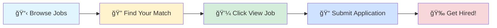

# 🚀 Tech Jobs Board

### Your Gateway to Amazing Career Opportunities

---

## 🎯 Browse by Job Profile

<table>
<tr>
<td align="center" width="25%">

 
<b>1000</b> total positions
</td>
<td align="center" width="25%">

 
<b>1000</b> total positions
</td>
<td align="center" width="25%">

 
<b>1000</b> total positions
</td>
<td align="center" width="25%">

 
<b>1000</b> total positions
</td>
</tr>
</table>

---

## 📊 Data Scientist

> 💼 **1000** positions available

<table>
<thead>
<tr>
<th width="20%">🏢 Company</th>
<th width="35%">💼 Role</th>
<th width="20%">📍 Location</th>
<th width="10%">⏰ Posted</th>
<th width="15%">🔗 Action</th>
</tr>
</thead>
<tbody>
<tr>
<td><a href="https://www.ambitionbox.com/overview/tcs-overview">Tata Consultancy Services</a></td>
<td>Pyspark Developer</td>
<td>📍 Pune</td>
<td>2d ago</td>
<td align="center"></td>
</tr>
<tr>
<td><a href="https://www.linkedin.com/company/nvidia">NVIDIA</a></td>
<td>AI ML Engineer, RTL Power Optimization – New College Grad 2026</td>
<td>📍 Santa Clara, CA</td>
<td>2d ago</td>
<td align="center"></td>
</tr>
<tr>
<td><a href="https://www.linkedin.com/company/bayone-solutions">BayOne Solutions</a></td>
<td>Software Engineer (Network/Python)</td>
<td>📍 India</td>
<td>2d ago</td>
<td align="center"></td>
</tr>
<tr>
<td><a href="https://www.linkedin.com/company/bayone-solutions">BayOne Solutions</a></td>
<td>AI/ML Engineer</td>
<td>📍 India</td>
<td>2d ago</td>
<td align="center"></td>
</tr>
<tr>
<td>Astrasol It Services</td>
<td>Senior Azure Devops Engineer</td>
<td>📍 Chennai, Hyderabad, Bangalore</td>
<td>2d ago</td>
<td align="center"></td>
</tr>
<tr>
<td><a href="https://www.linkedin.com/company/handwerkskammer-karlsruhe">Handwerkskammer Karlsruhe</a></td>
<td>Werkstudent (w/m/d) für den Bereich Digitalisierung</td>
<td>📍 Karlsruhe, Baden-Württemberg, Germany</td>
<td>2d ago</td>
<td align="center"></td>
</tr>
<tr>
<td><a href="https://www.linkedin.com/company/algosec">AlgoSec</a></td>
<td>AlgoNext Automation Developer, India</td>
<td>📍 Delhi</td>
<td>2d ago</td>
<td align="center"></td>
</tr>
<tr>
<td><a href="https://www.linkedin.com/company/algosec">AlgoSec</a></td>
<td>CloudFlow Automation Developer, India</td>
<td>📍 Delhi</td>
<td>2d ago</td>
<td align="center"></td>
</tr>
<tr>
<td><a href="https://www.linkedin.com/company/algosec">AlgoSec</a></td>
<td>Cloud Automation Developer, India</td>
<td>📍 Delhi</td>
<td>2d ago</td>
<td align="center"></td>
</tr>
<tr>
<td><a href="https://www.linkedin.com/company/algosec">AlgoSec</a></td>
<td>Full Stack Automation Developer, India</td>
<td>📍 Delhi</td>
<td>2d ago</td>
<td align="center"></td>
</tr>
<tr>
<td><a href="https://in.linkedin.com/company/zetheta">Zetheta Algorithms Private Limited</a></td>
<td>Data Science Intern</td>
<td>📍 India</td>
<td>2d ago</td>
<td align="center"></td>
</tr>
<tr>
<td><a href="https://www.linkedin.com/company/wellsfargo">Wells Fargo</a></td>
<td>Fraud Model Monitoring Consultant</td>
<td>📍 Bangalore</td>
<td>2d ago</td>
<td align="center"></td>
</tr>
<tr>
<td><a href="https://in.linkedin.com/company/zetheta">Zetheta Algorithms Private Limited</a></td>
<td>Artificial Intelligence Intern</td>
<td>📍 India</td>
<td>2d ago</td>
<td align="center"></td>
</tr>
<tr>
<td><a href="https://www.linkedin.com/company/nvidia">NVIDIA</a></td>
<td>AI ML Engineer, RTL Power Optimization – New College Grad 2026</td>
<td>📍 Santa Clara, CA</td>
<td>2d ago</td>
<td align="center"></td>
</tr>
<tr>
<td><a href="https://www.linkedin.com/company/lensa">Lensa</a></td>
<td>R&D Associate Mechanical Engineer</td>
<td>📍 Houston, TX</td>
<td>2d ago</td>
<td align="center"></td>
</tr>
<tr>
<td><a href="https://www.linkedin.com/company/lensa">Lensa</a></td>
<td>Machine Learning Intern - Summer 2026</td>
<td>📍 New York, NY</td>
<td>2d ago</td>
<td align="center"></td>
</tr>
<tr>
<td><a href="https://www.linkedin.com/company/lensa">Lensa</a></td>
<td>AI\ML Consultant - Remote</td>
<td>📍 Chicago, IL</td>
<td>2d ago</td>
<td align="center"></td>
</tr>
<tr>
<td><a href="https://www.linkedin.com/company/lensa">Lensa</a></td>
<td>Internships in Computer Science or Software Engineering</td>
<td>📍 El Segundo, CA</td>
<td>2d ago</td>
<td align="center"></td>
</tr>
<tr>
<td><a href="https://www.linkedin.com/company/lensa">Lensa</a></td>
<td>Digital Products Analytics Ad-Hoc Analyst - Remote</td>
<td>📍 Plano, TX</td>
<td>2d ago</td>
<td align="center"></td>
</tr>
<tr>
<td><a href="https://www.linkedin.com/company/lensa">Lensa</a></td>
<td>Analytical Laboratory Chemist</td>
<td>📍 Madison Heights, MI</td>
<td>2d ago</td>
<td align="center"></td>
</tr>
<tr>
<td><a href="https://www.linkedin.com/company/lensa">Lensa</a></td>
<td>Analytical Chemist</td>
<td>📍 Indianapolis, IN</td>
<td>2d ago</td>
<td align="center"></td>
</tr>
<tr>
<td><a href="https://www.linkedin.com/company/cisco">Cisco</a></td>
<td>Data Science Analyst I (Full Time) - United States</td>
<td>📍 Triangle, NC</td>
<td>2d ago</td>
<td align="center"></td>
</tr>
<tr>
<td><a href="https://www.linkedin.com/company/cisco">Cisco</a></td>
<td>Data Science Analyst I (Full Time) - United States</td>
<td>📍 San Jose, CA</td>
<td>2d ago</td>
<td align="center"></td>
</tr>
<tr>
<td><a href="https://www.linkedin.com/company/lensa">Lensa</a></td>
<td>Analytical Scientist</td>
<td>📍 New Brunswick, NJ</td>
<td>2d ago</td>
<td align="center"></td>
</tr>
<tr>
<td><a href="https://www.linkedin.com/company/lensa">Lensa</a></td>
<td>Analytical Scientist</td>
<td>📍 Cranbury, NJ</td>
<td>2d ago</td>
<td align="center"></td>
</tr>
<tr>
<td><a href="https://fr.linkedin.com/company/banque-alimentaire">Banques Alimentaires</a></td>
<td>Animation Réseau</td>
<td>📍 Belin, Covasna, Romania</td>
<td>2d ago</td>
<td align="center"></td>
</tr>
<tr>
<td><a href="https://in.linkedin.com/company/infosys">Infosys</a></td>
<td>Principal Consultant - Automation Group</td>
<td>📍 Bangalore</td>
<td>2d ago</td>
<td align="center"></td>
</tr>
<tr>
<td><a href="https://www.linkedin.com/company/jpmorganchase">JPMorganChase</a></td>
<td>Software Engineer II - Java, AWS</td>
<td>📍 Hyderabad</td>
<td>2d ago</td>
<td align="center"></td>
</tr>
<tr>
<td>Oracle</td>
<td>Senior Database Developer-SQL</td>
<td>📍 Mumbai</td>
<td>NaNy ago</td>
<td align="center"></td>
</tr>
<tr>
<td>Oracle</td>
<td>Senior Databricks Python Developer</td>
<td>📍 Mumbai</td>
<td>NaNy ago</td>
<td align="center"></td>
</tr>
<tr>
<td><a href="https://www.linkedin.com/company/shift4">Shift4</a></td>
<td>Lead AWS Cloud DevOps Engineer</td>
<td>📍 North Township, IN</td>
<td>2d ago</td>
<td align="center"></td>
</tr>
<tr>
<td><a href="https://www.linkedin.com/company/synechron">Synechron</a></td>
<td>QA Automation Engineer with GitHub Actions expertise</td>
<td>📍 Bangalore</td>
<td>2d ago</td>
<td align="center"></td>
</tr>
<tr>
<td><a href="https://www.linkedin.com/company/vcheckglobal">Vcheck</a></td>
<td>Senior Software Engineer (Python)</td>
<td>📍 Pune</td>
<td>2d ago</td>
<td align="center"></td>
</tr>
<tr>
<td><a href="https://in.linkedin.com/company/infosys">Infosys</a></td>
<td>Senior Associate Data Scientist</td>
<td>📍 Bangalore</td>
<td>2d ago</td>
<td align="center"></td>
</tr>
<tr>
<td><a href="https://www.linkedin.com/company/vcheckglobal">Vcheck</a></td>
<td>Associate Software Engineer - Intern (React JS + Python)</td>
<td>📍 Pune</td>
<td>2d ago</td>
<td align="center"></td>
</tr>
<tr>
<td><a href="https://www.linkedin.com/company/lensa">Lensa</a></td>
<td>Health Equity Analytics Internship</td>
<td>📍 United States</td>
<td>2d ago</td>
<td align="center"></td>
</tr>
<tr>
<td><a href="https://www.linkedin.com/company/lensa">Lensa</a></td>
<td>Data Science Summer Intern (Remote & Paid)</td>
<td>📍 United States</td>
<td>2d ago</td>
<td align="center"></td>
</tr>
<tr>
<td><a href="https://in.linkedin.com/company/infosys">Infosys</a></td>
<td>AWS Senior Devops Lead</td>
<td>📍 Bangalore</td>
<td>2d ago</td>
<td align="center"></td>
</tr>
<tr>
<td><a href="https://www.linkedin.com/company/lensa">Lensa</a></td>
<td>Data Science Intern</td>
<td>📍 San Diego, CA</td>
<td>2d ago</td>
<td align="center"></td>
</tr>
<tr>
<td><a href="https://www.linkedin.com/company/lensa">Lensa</a></td>
<td>Remote Data Analytics Consultant</td>
<td>📍 Washington, DC</td>
<td>2d ago</td>
<td align="center"></td>
</tr>
<tr>
<td><a href="https://www.linkedin.com/company/lensa">Lensa</a></td>
<td>Data Science Summer Intern (Remote & Paid)</td>
<td>📍 Costa Mesa, CA</td>
<td>2d ago</td>
<td align="center"></td>
</tr>
<tr>
<td><a href="https://www.linkedin.com/company/lensa">Lensa</a></td>
<td>Entry level AI/ML Engineer: SVL</td>
<td>📍 San Jose, CA</td>
<td>2d ago</td>
<td align="center"></td>
</tr>
<tr>
<td><a href="https://www.linkedin.com/company/lensa">Lensa</a></td>
<td>AWS Developer - AI/ML Engineer - FullTime Remote</td>
<td>📍 Dallas, TX</td>
<td>2d ago</td>
<td align="center"></td>
</tr>
<tr>
<td><a href="https://in.linkedin.com/company/quickhyre-ai">Quickhyre AI</a></td>
<td>Data Science Intern</td>
<td>📍 India</td>
<td>2d ago</td>
<td align="center"></td>
</tr>
<tr>
<td><a href="https://www.linkedin.com/company/lensa">Lensa</a></td>
<td>Data Science Intern</td>
<td>📍 Irvine, CA</td>
<td>2d ago</td>
<td align="center"></td>
</tr>
<tr>
<td><a href="https://www.linkedin.com/company/we-are-jobbit">Jobbit</a></td>
<td>R&D Director -Advanced Polymers for Automotive Applications</td>
<td>📍 Lodi, Lombardy, Italy</td>
<td>2d ago</td>
<td align="center"></td>
</tr>
<tr>
<td><a href="https://www.linkedin.com/company/lensa">Lensa</a></td>
<td>Data Science Intern</td>
<td>📍 Denver, CO</td>
<td>2d ago</td>
<td align="center"></td>
</tr>
<tr>
<td><a href="https://in.linkedin.com/company/infosys">Infosys</a></td>
<td>AWS SME</td>
<td>📍 Bangalore</td>
<td>2d ago</td>
<td align="center"></td>
</tr>
<tr>
<td><a href="https://in.linkedin.com/company/infosys">Infosys</a></td>
<td>Automation - Selenium Java Python_JL5</td>
<td>📍 Bangalore</td>
<td>2d ago</td>
<td align="center"></td>
</tr>
<tr>
<td><a href="https://in.linkedin.com/company/infosys">Infosys</a></td>
<td>AI/ML Architect</td>
<td>📍 Trivandrum, Kerala, India</td>
<td>2d ago</td>
<td align="center"></td>
</tr>
<tr>
<td><a href="https://in.linkedin.com/company/infosys">Infosys</a></td>
<td>AWS DevOps - QLTY</td>
<td>📍 Bangalore</td>
<td>2d ago</td>
<td align="center"></td>
</tr>
<tr>
<td><a href="https://www.linkedin.com/company/lensa">Lensa</a></td>
<td>Data Scientist (REMOTE)</td>
<td>📍 Austin, TX</td>
<td>2d ago</td>
<td align="center"></td>
</tr>
<tr>
<td><a href="https://in.linkedin.com/company/infosys">Infosys</a></td>
<td>Python Developer</td>
<td>📍 Bangalore</td>
<td>2d ago</td>
<td align="center"></td>
</tr>
<tr>
<td><a href="https://www.linkedin.com/company/lensa">Lensa</a></td>
<td>2026 Summer Internship Program: Data Scientist for R&D Quality Intern</td>
<td>📍 Lexington, MA</td>
<td>2d ago</td>
<td align="center"></td>
</tr>
<tr>
<td><a href="https://vn.linkedin.com/company/aivision-jsc">AIVISION</a></td>
<td>Data Scientist Internship</td>
<td>📍 Ho Chi Minh City, Vietnam</td>
<td>2d ago</td>
<td align="center"></td>
</tr>
<tr>
<td><a href="https://de.linkedin.com/company/rhoenenergie-fulda">RhönEnergie Gruppe</a></td>
<td>Ausbildung 2026 - Informationselektroniker für Geräte und Systeme (m/w/d)</td>
<td>📍 Fulda, Hesse, Germany</td>
<td>2d ago</td>
<td align="center"></td>
</tr>
<tr>
<td><a href="https://www.linkedin.com/company/labcorp">Labcorp</a></td>
<td>Intern - Test Automation Engineer</td>
<td>📍 North Carolina, United States</td>
<td>2d ago</td>
<td align="center"></td>
</tr>
<tr>
<td><a href="https://in.linkedin.com/company/inclusive-minds-ind">Inclusive Minds</a></td>
<td>Inclusive Minds - Senior Data Analyst - SQL/Python</td>
<td>📍 Bangalore</td>
<td>2d ago</td>
<td align="center"></td>
</tr>
<tr>
<td>Currenex State Street Trust Company</td>
<td>Senior Data Scientist - Assistant Vice President</td>
<td>📍 Bangalore</td>
<td>NaNy ago</td>
<td align="center"></td>
</tr>
<tr>
<td><a href="https://in.linkedin.com/company/hirenza-pvt-ltd">Hirenza</a></td>
<td>SQL Developer</td>
<td>📍 India</td>
<td>2d ago</td>
<td align="center"></td>
</tr>
<tr>
<td><a href="https://in.linkedin.com/company/winjit-technologies">Winjit Technologies Pvt Ltd</a></td>
<td>Winjit Technologies - Senior Data Engineer - Synapse Analytics</td>
<td>📍 Pune</td>
<td>2d ago</td>
<td align="center"></td>
</tr>
<tr>
<td>Evnek</td>
<td>DevOps Engineer (GCP)</td>
<td>📍 Mumbai</td>
<td>NaNy ago</td>
<td align="center"></td>
</tr>
<tr>
<td>Evnek</td>
<td>Python Backend Developer</td>
<td>📍 Mumbai</td>
<td>NaNy ago</td>
<td align="center"></td>
</tr>
<tr>
<td><a href="https://www.linkedin.com/company/p.r.-glolinks-consulting-private-limited">P.R. GLOLINKS CONSULTING PRIVATE LIMITED</a></td>
<td>Data Engineer - Python</td>
<td>📍 Chennai</td>
<td>2d ago</td>
<td align="center"></td>
</tr>
<tr>
<td><a href="https://ae.linkedin.com/company/yash-technologies-middle-east-region">YASH Technologies Middle East</a></td>
<td>Sr. Software Engineer - Java+React+AWS Job</td>
<td>📍 Pune</td>
<td>2d ago</td>
<td align="center"></td>
</tr>
<tr>
<td><a href="https://in.linkedin.com/company/winjit-technologies">Winjit Technologies Pvt Ltd</a></td>
<td>Winjit Technologies - QE Lead - AI &amp; Analytics</td>
<td>📍 Pune</td>
<td>2d ago</td>
<td align="center"></td>
</tr>
<tr>
<td><a href="https://www.linkedin.com/company/hatci">Hyundai America Technical Center, Inc. (HATCI)</a></td>
<td>Data Science Intern (Internship - Summer 2026)</td>
<td>📍 Irvine, CA</td>
<td>2d ago</td>
<td align="center"></td>
</tr>
<tr>
<td>Codvo.ai</td>
<td>AI / ML Engineer</td>
<td>📍 Pune</td>
<td>NaNy ago</td>
<td align="center"></td>
</tr>
<tr>
<td>Global Software Solutions Group</td>
<td>Software Engineer - Test Automation</td>
<td>📍 Chennai</td>
<td>NaNy ago</td>
<td align="center"></td>
</tr>
<tr>
<td><a href="https://www.linkedin.com/company/soleluxellc">Soleluxe</a></td>
<td>(Unpaid) Marketing Analytics & Content Creation Internship</td>
<td>📍 New York, NY</td>
<td>3d ago</td>
<td align="center"></td>
</tr>
<tr>
<td>State Street Corporation</td>
<td>Senior Data Scientist - Assistant Vice President</td>
<td>📍 Bangalore</td>
<td>NaNy ago</td>
<td align="center"></td>
</tr>
<tr>
<td>ShyftLabs</td>
<td>Sr. QA Automation Engineer/SDET</td>
<td>📍 Noida</td>
<td>NaNy ago</td>
<td align="center"></td>
</tr>
<tr>
<td>TransUnion</td>
<td>Sr. Consultant Data Analysis</td>
<td>📍 Hyderabad</td>
<td>NaNy ago</td>
<td align="center"></td>
</tr>
<tr>
<td>ClanX</td>
<td>Senior Quality Assurance Automation Engineer</td>
<td>📍 Mumbai</td>
<td>NaNy ago</td>
<td align="center"></td>
</tr>
<tr>
<td><a href="https://in.linkedin.com/company/smarthyre">smarthyre</a></td>
<td>Senior Machine Learning Engineer</td>
<td>📍 India</td>
<td>3d ago</td>
<td align="center"></td>
</tr>
<tr>
<td><a href="https://de.linkedin.com/company/indiekidz-gmbh">IndieKidz GmbH</a></td>
<td>Unpaid Mandatory Internship, Software Test Automation Engineer, Berlin or remote</td>
<td>📍 Germany</td>
<td>3d ago</td>
<td align="center"></td>
</tr>
<tr>
<td>Quantum Integrators</td>
<td>Cloud Engineer (GCP)</td>
<td>📍 Pune</td>
<td>NaNy ago</td>
<td align="center"></td>
</tr>
<tr>
<td>Qualitest</td>
<td>Sr. Test Automation - SDET</td>
<td>📍 Chennai</td>
<td>NaNy ago</td>
<td align="center"></td>
</tr>
<tr>
<td>ISA</td>
<td>Automation Engineer</td>
<td>📍 Pune</td>
<td>NaNy ago</td>
<td align="center"></td>
</tr>
<tr>
<td>FinacPlus</td>
<td>QA Automation Engineer</td>
<td>📍 Bangalore</td>
<td>NaNy ago</td>
<td align="center"></td>
</tr>
<tr>
<td>LogicValley Technologies Pvt Ltd</td>
<td>Azure Data Engineer</td>
<td>📍 Coimbatore</td>
<td>NaNy ago</td>
<td align="center"></td>
</tr>
<tr>
<td><a href="https://fr.linkedin.com/company/capgemini">Capgemini</a></td>
<td>AWS Practice Lead</td>
<td>📍 Bangalore</td>
<td>3d ago</td>
<td align="center"></td>
</tr>
<tr>
<td><a href="https://www.linkedin.com/company/taxslayerllc">TaxSlayer</a></td>
<td>Data Scientist</td>
<td>📍 United States</td>
<td>3d ago</td>
<td align="center"></td>
</tr>
<tr>
<td><a href="https://in.linkedin.com/company/brightfutureindia">Bright Future</a></td>
<td>Senior Manager – Monitoring & Evaluation (M&E)</td>
<td>📍 Kurla, Maharashtra, India</td>
<td>3d ago</td>
<td align="center"></td>
</tr>
<tr>
<td><a href="https://www.linkedin.com/company/ceragon-networks">Ceragon Networks</a></td>
<td>RF Radio Engineer (mmWave / PtMP Radio R&D)</td>
<td>📍 Bangalore Urban, Karnataka, India</td>
<td>3d ago</td>
<td align="center"></td>
</tr>
<tr>
<td><a href="https://www.ambitionbox.com/overview/cognizant-overview">Cognizant</a></td>
<td>Java MSB + AWS Developer</td>
<td>📍 Bangalore</td>
<td>3d ago</td>
<td align="center"></td>
</tr>
<tr>
<td>Dream11</td>
<td>Senior Machine Learning Scientist</td>
<td>📍 Mumbai</td>
<td>NaNy ago</td>
<td align="center"></td>
</tr>
<tr>
<td>Dream11</td>
<td>Machine Learning Scientist</td>
<td>📍 Mumbai</td>
<td>NaNy ago</td>
<td align="center"></td>
</tr>
<tr>
<td>Amazon Web Services (AWS)</td>
<td>Sr. Procurement Specialist , AWS- DigiFlex</td>
<td>📍 Chennai</td>
<td>NaNy ago</td>
<td align="center"></td>
</tr>
<tr>
<td>Swasti</td>
<td>.Net Engineer - C#/SQL Server</td>
<td>📍 Pune</td>
<td>NaNy ago</td>
<td align="center"></td>
</tr>
<tr>
<td>Quantium</td>
<td>Data Scientist (Senior)</td>
<td>📍 Hyderabad</td>
<td>NaNy ago</td>
<td align="center"></td>
</tr>
<tr>
<td><a href="https://uk.linkedin.com/company/hackajob">hackajob</a></td>
<td>Data Engineer II - BigQuery, GCP, Tableau</td>
<td>📍 Gurugram</td>
<td>3d ago</td>
<td align="center"></td>
</tr>
<tr>
<td><a href="https://www.linkedin.com/company/shef-solutions-e-learning-provider">Shef Solutions LLC</a></td>
<td>Data science Trainer</td>
<td>📍 Dadri, Uttar Pradesh, India</td>
<td>3d ago</td>
<td align="center"></td>
</tr>
<tr>
<td><a href="https://www.linkedin.com/company/wake-up-whistle">Wake Up Whistle</a></td>
<td>Data Science Intern (Python, SQL, Pandas)</td>
<td>📍 India</td>
<td>3d ago</td>
<td align="center"></td>
</tr>
<tr>
<td><a href="https://www.linkedin.com/company/jpmorganchase">JPMorganChase</a></td>
<td>Data Analytics & Reporting - Qlik & Oracle - VP</td>
<td>📍 Mumbai</td>
<td>3d ago</td>
<td align="center"></td>
</tr>
<tr>
<td>JP Morgan Chase & Co.</td>
<td>Software Engineer III - Terraform, AWS</td>
<td>📍 Bangalore</td>
<td>NaNy ago</td>
<td align="center"></td>
</tr>
<tr>
<td>JP Morgan Chase & Co.</td>
<td>Software Engineer III - Java Full Stack, AWS</td>
<td>📍 Hyderabad</td>
<td>NaNy ago</td>
<td align="center"></td>
</tr>
<tr>
<td>JP Morgan Chase & Co.</td>
<td>Software Engineer II - DevOps, AWS, Java</td>
<td>📍 Bangalore</td>
<td>NaNy ago</td>
<td align="center"></td>
</tr>
<tr>
<td>JP Morgan Chase & Co.</td>
<td>Software Engineer III - Java Full Stack, AWS</td>
<td>📍 Hyderabad</td>
<td>NaNy ago</td>
<td align="center"></td>
</tr>
<tr>
<td>JP Morgan Chase & Co.</td>
<td>Lead Data Engineer - Python, Pyspark</td>
<td>📍 Hyderabad</td>
<td>NaNy ago</td>
<td align="center"></td>
</tr>
<tr><td colspan="5" align="center"><i>... and 900 more positions</i></td></tr>
</tbody>
</table>

---

## 💼 Business Analyst

> 💼 **1000** positions available

<table>
<thead>
<tr>
<th width="20%">🏢 Company</th>
<th width="35%">💼 Role</th>
<th width="20%">📍 Location</th>
<th width="10%">⏰ Posted</th>
<th width="15%">🔗 Action</th>
</tr>
</thead>
<tbody>
<tr>
<td><a href="https://www.ambitionbox.com/overview/saletify-overview">Saletify</a></td>
<td>Business Analyst / Client Servicing Officer - Digital Marketing</td>
<td>📍 Pune</td>
<td>2d ago</td>
<td align="center"></td>
</tr>
<tr>
<td><a href="https://www.linkedin.com/company/bayone-solutions">BayOne Solutions</a></td>
<td>Software Engineer (Network/Python)</td>
<td>📍 India</td>
<td>2d ago</td>
<td align="center"></td>
</tr>
<tr>
<td><a href="https://www.ambitionbox.com/overview/tcs-overview">Tata Consultancy Services</a></td>
<td>Power Bi Developer</td>
<td>📍 Delhi</td>
<td>2d ago</td>
<td align="center"></td>
</tr>
<tr>
<td><a href="https://ca.linkedin.com/company/metro-inc.">Metro Inc.</a></td>
<td>Business Analyst, Digital Solutions and Technologies / Analyste d'affaires, solutions numériques et technologies</td>
<td>📍 Montreal, Quebec, Canada</td>
<td>2d ago</td>
<td align="center"></td>
</tr>
<tr>
<td><a href="https://cn.linkedin.com/company/united-service-technology-ltd">United Service Technology Ltd.</a></td>
<td>Power BI</td>
<td>📍 Shanghai, Shanghai, China</td>
<td>2d ago</td>
<td align="center"></td>
</tr>
<tr>
<td><a href="https://uk.linkedin.com/company/nottinghamshire-county-council">Nottinghamshire County Council</a></td>
<td>Business Analyst</td>
<td>📍 Nottinghamshire, England, United Kingdom</td>
<td>2d ago</td>
<td align="center"></td>
</tr>
<tr>
<td><a href="https://www.linkedin.com/company/algosec">AlgoSec</a></td>
<td>AlgoNext Automation Developer, India</td>
<td>📍 Delhi</td>
<td>2d ago</td>
<td align="center"></td>
</tr>
<tr>
<td><a href="https://www.linkedin.com/company/algosec">AlgoSec</a></td>
<td>CloudFlow Automation Developer, India</td>
<td>📍 Delhi</td>
<td>2d ago</td>
<td align="center"></td>
</tr>
<tr>
<td><a href="https://www.linkedin.com/company/algosec">AlgoSec</a></td>
<td>Cloud Automation Developer, India</td>
<td>📍 Delhi</td>
<td>2d ago</td>
<td align="center"></td>
</tr>
<tr>
<td><a href="https://www.linkedin.com/company/algosec">AlgoSec</a></td>
<td>Full Stack Automation Developer, India</td>
<td>📍 Delhi</td>
<td>2d ago</td>
<td align="center"></td>
</tr>
<tr>
<td><a href="https://www.linkedin.com/company/apollo-bgs-hospitals">Apollo BGS Hospitals</a></td>
<td>Business Analyst - Operations</td>
<td>📍 Bangalore</td>
<td>2d ago</td>
<td align="center"></td>
</tr>
<tr>
<td>Introlligent</td>
<td>Supply Chain Business Analyst</td>
<td>📍 Bangalore</td>
<td>NaNy ago</td>
<td align="center"></td>
</tr>
<tr>
<td><a href="https://www.linkedin.com/company/lensa">Lensa</a></td>
<td>Remote Healthcare Scrum Master/Project Manager</td>
<td>📍 United States</td>
<td>2d ago</td>
<td align="center"></td>
</tr>
<tr>
<td><a href="https://www.linkedin.com/company/lensa">Lensa</a></td>
<td>Internships in Computer Science or Software Engineering</td>
<td>📍 El Segundo, CA</td>
<td>2d ago</td>
<td align="center"></td>
</tr>
<tr>
<td><a href="https://www.linkedin.com/company/lensa">Lensa</a></td>
<td>Digital Products Analytics Ad-Hoc Analyst - Remote</td>
<td>📍 Plano, TX</td>
<td>2d ago</td>
<td align="center"></td>
</tr>
<tr>
<td><a href="https://www.linkedin.com/company/lensa">Lensa</a></td>
<td>Analytical Laboratory Chemist</td>
<td>📍 Madison Heights, MI</td>
<td>2d ago</td>
<td align="center"></td>
</tr>
<tr>
<td><a href="https://www.linkedin.com/company/lensa">Lensa</a></td>
<td>Analytical Chemist</td>
<td>📍 Indianapolis, IN</td>
<td>2d ago</td>
<td align="center"></td>
</tr>
<tr>
<td><a href="https://www.linkedin.com/company/lensa">Lensa</a></td>
<td>Analytical Scientist</td>
<td>📍 New Brunswick, NJ</td>
<td>2d ago</td>
<td align="center"></td>
</tr>
<tr>
<td><a href="https://www.linkedin.com/company/lensa">Lensa</a></td>
<td>Analytical Scientist</td>
<td>📍 Cranbury, NJ</td>
<td>2d ago</td>
<td align="center"></td>
</tr>
<tr>
<td><a href="https://www.linkedin.com/company/lensa">Lensa</a></td>
<td>Project Management, Sr. Analyst- Remote CST &EST</td>
<td>📍 Washington, DC</td>
<td>2d ago</td>
<td align="center"></td>
</tr>
<tr>
<td><a href="https://www.linkedin.com/company/lensa">Lensa</a></td>
<td>Director, Project Management- Remote</td>
<td>📍 Hartford, CT</td>
<td>2d ago</td>
<td align="center"></td>
</tr>
<tr>
<td><a href="https://www.linkedin.com/company/lensa">Lensa</a></td>
<td>Director, Project Management- Remote</td>
<td>📍 Sacramento, CA</td>
<td>2d ago</td>
<td align="center"></td>
</tr>
<tr>
<td><a href="https://www.linkedin.com/company/lensa">Lensa</a></td>
<td>Project Management Analyst - Remote</td>
<td>📍 Franklin, TN</td>
<td>2d ago</td>
<td align="center"></td>
</tr>
<tr>
<td><a href="https://www.linkedin.com/company/lensa">Lensa</a></td>
<td>Business Analyst Intern - Summer 2026</td>
<td>📍 Plano, TX</td>
<td>2d ago</td>
<td align="center"></td>
</tr>
<tr>
<td><a href="https://www.linkedin.com/company/lensa">Lensa</a></td>
<td>Materials Project Management, New College Grad- Bachelor's (Austin, TX)</td>
<td>📍 Austin, TX</td>
<td>2d ago</td>
<td align="center"></td>
</tr>
<tr>
<td><a href="https://in.linkedin.com/company/infosys">Infosys</a></td>
<td>Principal Consultant - Automation Group</td>
<td>📍 Bangalore</td>
<td>2d ago</td>
<td align="center"></td>
</tr>
<tr>
<td>Oracle</td>
<td>Senior Database Developer-SQL</td>
<td>📍 Mumbai</td>
<td>NaNy ago</td>
<td align="center"></td>
</tr>
<tr>
<td><a href="https://www.linkedin.com/company/lensa">Lensa</a></td>
<td>Scrum Master - Remote US</td>
<td>📍 Jefferson City, MO</td>
<td>2d ago</td>
<td align="center"></td>
</tr>
<tr>
<td><a href="https://www.linkedin.com/company/lensa">Lensa</a></td>
<td>Remote Healthcare Scrum Master/Project Manager</td>
<td>📍 Woonsocket, RI</td>
<td>2d ago</td>
<td align="center"></td>
</tr>
<tr>
<td><a href="https://www.linkedin.com/company/lensa">Lensa</a></td>
<td>Scrum Master - Remote US</td>
<td>📍 Trenton, NJ</td>
<td>2d ago</td>
<td align="center"></td>
</tr>
<tr>
<td>Oracle</td>
<td>Senior Databricks Python Developer</td>
<td>📍 Mumbai</td>
<td>NaNy ago</td>
<td align="center"></td>
</tr>
<tr>
<td><a href="https://www.linkedin.com/company/lensa">Lensa</a></td>
<td>Business Analyst Intern Remote</td>
<td>📍 Endicott, NY</td>
<td>2d ago</td>
<td align="center"></td>
</tr>
<tr>
<td><a href="https://www.linkedin.com/company/lensa">Lensa</a></td>
<td>Business Analyst Intern (Summer Internship Program)</td>
<td>📍 New York, NY</td>
<td>2d ago</td>
<td align="center"></td>
</tr>
<tr>
<td><a href="https://in.linkedin.com/company/best-job-tool">Best Job Tool</a></td>
<td>Business Analyst</td>
<td>📍 India</td>
<td>2d ago</td>
<td align="center"></td>
</tr>
<tr>
<td><a href="https://www.linkedin.com/company/lensa">Lensa</a></td>
<td>Business Analyst Intern (Summer Internship Program)</td>
<td>📍 New Brunswick, NJ</td>
<td>2d ago</td>
<td align="center"></td>
</tr>
<tr>
<td><a href="https://in.linkedin.com/company/infosys">Infosys</a></td>
<td>Senior Consultant- Business Consulting (Financial Services- Capital Markets)</td>
<td>📍 Bangalore</td>
<td>2d ago</td>
<td align="center"></td>
</tr>
<tr>
<td><a href="https://www.linkedin.com/company/synechron">Synechron</a></td>
<td>QA Automation Engineer with GitHub Actions expertise</td>
<td>📍 Bangalore</td>
<td>2d ago</td>
<td align="center"></td>
</tr>
<tr>
<td><a href="https://www.linkedin.com/company/lensa">Lensa</a></td>
<td>Manager, Agile Practices (Remote)</td>
<td>📍 Irvine, CA</td>
<td>2d ago</td>
<td align="center"></td>
</tr>
<tr>
<td><a href="https://www.linkedin.com/company/vcheckglobal">Vcheck</a></td>
<td>Senior Software Engineer (Python)</td>
<td>📍 Pune</td>
<td>2d ago</td>
<td align="center"></td>
</tr>
<tr>
<td><a href="https://in.linkedin.com/company/infosys">Infosys</a></td>
<td>Power Bi</td>
<td>📍 Bangalore</td>
<td>2d ago</td>
<td align="center"></td>
</tr>
<tr>
<td><a href="https://www.linkedin.com/company/lensa">Lensa</a></td>
<td>Remote Salesforce IT Project Administrator</td>
<td>📍 San Diego, CA</td>
<td>2d ago</td>
<td align="center"></td>
</tr>
<tr>
<td><a href="https://www.linkedin.com/company/vcheckglobal">Vcheck</a></td>
<td>Associate Software Engineer - Intern (React JS + Python)</td>
<td>📍 Pune</td>
<td>2d ago</td>
<td align="center"></td>
</tr>
<tr>
<td><a href="https://www.linkedin.com/company/lensa">Lensa</a></td>
<td>Health Equity Analytics Internship</td>
<td>📍 United States</td>
<td>2d ago</td>
<td align="center"></td>
</tr>
<tr>
<td><a href="https://www.linkedin.com/company/lensa">Lensa</a></td>
<td>Remote Data Analytics Consultant</td>
<td>📍 Washington, DC</td>
<td>2d ago</td>
<td align="center"></td>
</tr>
<tr>
<td><a href="https://www.linkedin.com/company/lensa">Lensa</a></td>
<td>Remote Salesforce Developer</td>
<td>📍 San Diego, CA</td>
<td>2d ago</td>
<td align="center"></td>
</tr>
<tr>
<td><a href="https://www.linkedin.com/company/lensa">Lensa</a></td>
<td>Business Analyst - Entry Level</td>
<td>📍 Dallas, TX</td>
<td>2d ago</td>
<td align="center"></td>
</tr>
<tr>
<td><a href="https://in.linkedin.com/company/infosys">Infosys</a></td>
<td>Automation - Selenium Java Python_JL5</td>
<td>📍 Bangalore</td>
<td>2d ago</td>
<td align="center"></td>
</tr>
<tr>
<td><a href="https://in.linkedin.com/company/infosys">Infosys</a></td>
<td>Regulatory and Clinical Business Analyst</td>
<td>📍 Hyderabad</td>
<td>2d ago</td>
<td align="center"></td>
</tr>
<tr>
<td><a href="https://www.linkedin.com/company/lensa">Lensa</a></td>
<td>Junior Business Analyst</td>
<td>📍 Ashburn, VA</td>
<td>2d ago</td>
<td align="center"></td>
</tr>
<tr>
<td><a href="https://in.linkedin.com/company/hirenza-pvt-ltd">Hirenza</a></td>
<td>Business Analyst</td>
<td>📍 India</td>
<td>2d ago</td>
<td align="center"></td>
</tr>
<tr>
<td><a href="https://in.linkedin.com/company/infosys">Infosys</a></td>
<td>Python Developer</td>
<td>📍 Bangalore</td>
<td>2d ago</td>
<td align="center"></td>
</tr>
<tr>
<td><a href="https://www.linkedin.com/company/labcorp">Labcorp</a></td>
<td>Intern - Test Automation Engineer</td>
<td>📍 North Carolina, United States</td>
<td>2d ago</td>
<td align="center"></td>
</tr>
<tr>
<td>Ernst & Young</td>
<td>Senior Consultant - Business Consulting Risk - FS - CNS - RISK - PROCESS & CONTROLS - New Delhi</td>
<td>📍 Delhi</td>
<td>NaNy ago</td>
<td align="center"></td>
</tr>
<tr>
<td>Ernst & Young</td>
<td>Senior Consultant - Business Consulting PI - TMT - CNS - BC - Supply Chain & Operations - New Delhi</td>
<td>📍 Delhi</td>
<td>NaNy ago</td>
<td align="center"></td>
</tr>
<tr>
<td>Ernst & Young</td>
<td>Senior Consultant - Business Consulting PI - CHS - CNS - BC - Supply Chain & Operations - Mumbai</td>
<td>📍 Mumbai</td>
<td>NaNy ago</td>
<td align="center"></td>
</tr>
<tr>
<td>Ernst & Young</td>
<td>Associate Consultant - Business Consulting Risk - CHS - CNS - Risk - Process & Controls - Mumbai</td>
<td>📍 Mumbai</td>
<td>NaNy ago</td>
<td align="center"></td>
</tr>
<tr>
<td>Ernst & Young</td>
<td>Associate Consultant - Business Consulting Risk - AMI - CNS - Risk - Process & Controls - Mumbai</td>
<td>📍 Mumbai</td>
<td>NaNy ago</td>
<td align="center"></td>
</tr>
<tr>
<td>Ernst & Young</td>
<td>Associate Consultant - Business Consulting Risk - AMI - CNS - Risk - Process & Controls - Mumbai</td>
<td>📍 Mumbai</td>
<td>NaNy ago</td>
<td align="center"></td>
</tr>
<tr>
<td>Insurity</td>
<td>Business Analyst II (P&C domain)</td>
<td>📍 Noida</td>
<td>NaNy ago</td>
<td align="center"></td>
</tr>
<tr>
<td><a href="https://in.linkedin.com/company/inclusive-minds-ind">Inclusive Minds</a></td>
<td>Inclusive Minds - Senior Data Analyst - SQL/Python</td>
<td>📍 Bangalore</td>
<td>2d ago</td>
<td align="center"></td>
</tr>
<tr>
<td>Barclays</td>
<td>Scrum Master</td>
<td>📍 Pune</td>
<td>NaNy ago</td>
<td align="center"></td>
</tr>
<tr>
<td><a href="https://in.linkedin.com/company/hirenza-pvt-ltd">Hirenza</a></td>
<td>SQL Developer</td>
<td>📍 India</td>
<td>2d ago</td>
<td align="center"></td>
</tr>
<tr>
<td><a href="https://in.linkedin.com/company/winjit-technologies">Winjit Technologies Pvt Ltd</a></td>
<td>Winjit Technologies - Senior Data Engineer - Synapse Analytics</td>
<td>📍 Pune</td>
<td>2d ago</td>
<td align="center"></td>
</tr>
<tr>
<td>Evnek</td>
<td>Python Backend Developer</td>
<td>📍 Mumbai</td>
<td>NaNy ago</td>
<td align="center"></td>
</tr>
<tr>
<td><a href="https://www.linkedin.com/company/p.r.-glolinks-consulting-private-limited">P.R. GLOLINKS CONSULTING PRIVATE LIMITED</a></td>
<td>Data Engineer - Python</td>
<td>📍 Chennai</td>
<td>2d ago</td>
<td align="center"></td>
</tr>
<tr>
<td>Flick2Know</td>
<td>Executive - Project Management</td>
<td>📍 Mumbai</td>
<td>NaNy ago</td>
<td align="center"></td>
</tr>
<tr>
<td><a href="https://in.linkedin.com/company/winjit-technologies">Winjit Technologies Pvt Ltd</a></td>
<td>Winjit Technologies - QE Lead - AI &amp; Analytics</td>
<td>📍 Pune</td>
<td>2d ago</td>
<td align="center"></td>
</tr>
<tr>
<td><a href="https://www.linkedin.com/company/wake-up-whistle">Wake Up Whistle</a></td>
<td>Business Analyst Intern (Entry Level) | Reporting • Analysis | Remote</td>
<td>📍 India</td>
<td>2d ago</td>
<td align="center"></td>
</tr>
<tr>
<td>SuperPe</td>
<td>Business Analyst</td>
<td>📍 Bangalore</td>
<td>NaNy ago</td>
<td align="center"></td>
</tr>
<tr>
<td>Global Software Solutions Group</td>
<td>Software Engineer - Test Automation</td>
<td>📍 Chennai</td>
<td>NaNy ago</td>
<td align="center"></td>
</tr>
<tr>
<td><a href="https://www.linkedin.com/company/soleluxellc">Soleluxe</a></td>
<td>(Unpaid) Marketing Analytics & Content Creation Internship</td>
<td>📍 New York, NY</td>
<td>3d ago</td>
<td align="center"></td>
</tr>
<tr>
<td>ShyftLabs</td>
<td>Sr. QA Automation Engineer/SDET</td>
<td>📍 Noida</td>
<td>NaNy ago</td>
<td align="center"></td>
</tr>
<tr>
<td>Corporate Steps</td>
<td>Business Analyst</td>
<td>📍 Pune</td>
<td>NaNy ago</td>
<td align="center"></td>
</tr>
<tr>
<td>TransUnion</td>
<td>Sr. Consultant Data Analysis</td>
<td>📍 Hyderabad</td>
<td>NaNy ago</td>
<td align="center"></td>
</tr>
<tr>
<td>Krones Digital Solutions India</td>
<td>ServiceNow Business Analyst</td>
<td>📍 Bangalore</td>
<td>NaNy ago</td>
<td align="center"></td>
</tr>
<tr>
<td><a href="https://de.linkedin.com/company/dkb">DKB | Deutsche Kreditbank AG</a></td>
<td>Business Analyst</td>
<td>📍 Berlin, Berlin, Germany</td>
<td>3d ago</td>
<td align="center"></td>
</tr>
<tr>
<td>ClanX</td>
<td>Senior Quality Assurance Automation Engineer</td>
<td>📍 Mumbai</td>
<td>NaNy ago</td>
<td align="center"></td>
</tr>
<tr>
<td><a href="https://de.linkedin.com/company/indiekidz-gmbh">IndieKidz GmbH</a></td>
<td>Unpaid Mandatory Internship, Software Test Automation Engineer, Berlin or remote</td>
<td>📍 Germany</td>
<td>3d ago</td>
<td align="center"></td>
</tr>
<tr>
<td>Qualitest</td>
<td>Sr. Test Automation - SDET</td>
<td>📍 Chennai</td>
<td>NaNy ago</td>
<td align="center"></td>
</tr>
<tr>
<td><a href="https://www.ambitionbox.com/overview/agco-corporation-overview">Agco Corporation</a></td>
<td>Senior Business Analyst (Sales, Marketing & Supply chain)</td>
<td>📍 Pune</td>
<td>3d ago</td>
<td align="center"></td>
</tr>
<tr>
<td>ISA</td>
<td>Automation Engineer</td>
<td>📍 Pune</td>
<td>NaNy ago</td>
<td align="center"></td>
</tr>
<tr>
<td>FinacPlus</td>
<td>QA Automation Engineer</td>
<td>📍 Bangalore</td>
<td>NaNy ago</td>
<td align="center"></td>
</tr>
<tr>
<td>VIAVI Solutions</td>
<td>Business Process Analyst</td>
<td>📍 Gurugram</td>
<td>NaNy ago</td>
<td align="center"></td>
</tr>
<tr>
<td>EDMO</td>
<td>Business Analyst</td>
<td>📍 Pune</td>
<td>NaNy ago</td>
<td align="center"></td>
</tr>
<tr>
<td>Tredence Inc.</td>
<td>Lead Business Analyst - Healthcare Domain</td>
<td>📍 Bangalore</td>
<td>NaNy ago</td>
<td align="center"></td>
</tr>
<tr>
<td><a href="https://www.linkedin.com/company/eprosoft">eProSoft</a></td>
<td>Scrum Master with Generative AI Exposure</td>
<td>📍 Hyderabad</td>
<td>3d ago</td>
<td align="center"></td>
</tr>
<tr>
<td>Siemens Energy</td>
<td>IT Business Analyst- Snowflake</td>
<td>📍 Pune</td>
<td>NaNy ago</td>
<td align="center"></td>
</tr>
<tr>
<td>Talent Toppers</td>
<td>Business Analyst- Life400/Smart400</td>
<td>📍 Mumbai</td>
<td>NaNy ago</td>
<td align="center"></td>
</tr>
<tr>
<td>Simpliigence</td>
<td>Salesforce Developer</td>
<td>📍 Chennai</td>
<td>NaNy ago</td>
<td align="center"></td>
</tr>
<tr>
<td><a href="https://www.linkedin.com/company/icma-veterans">International City/County Management Association (ICMA) Veterans</a></td>
<td>Coordinator, Project Management. (Graduate Management Assistant)</td>
<td>📍 Fort Collins, CO</td>
<td>3d ago</td>
<td align="center"></td>
</tr>
<tr>
<td>Bits In Glass</td>
<td>Scrum Master</td>
<td>📍 Pune</td>
<td>NaNy ago</td>
<td align="center"></td>
</tr>
<tr>
<td>Yash Technologies Private Limited</td>
<td>Associate Lead Consultant - Salesforce Job</td>
<td>📍 Hyderabad</td>
<td>NaNy ago</td>
<td align="center"></td>
</tr>
<tr>
<td>Swasti</td>
<td>.Net Engineer - C#/SQL Server</td>
<td>📍 Pune</td>
<td>NaNy ago</td>
<td align="center"></td>
</tr>
<tr>
<td>Worldline</td>
<td>Business Analyst</td>
<td>📍 Pune</td>
<td>NaNy ago</td>
<td align="center"></td>
</tr>
<tr>
<td><a href="https://uk.linkedin.com/company/hackajob">hackajob</a></td>
<td>Data Engineer II - BigQuery, GCP, Tableau</td>
<td>📍 Gurugram</td>
<td>3d ago</td>
<td align="center"></td>
</tr>
<tr>
<td><a href="https://www.linkedin.com/company/wake-up-whistle">Wake Up Whistle</a></td>
<td>Data Science Intern (Python, SQL, Pandas)</td>
<td>📍 India</td>
<td>3d ago</td>
<td align="center"></td>
</tr>
<tr>
<td><a href="https://www.linkedin.com/company/jpmorganchase">JPMorganChase</a></td>
<td>Data Analytics & Reporting - Qlik & Oracle - VP</td>
<td>📍 Mumbai</td>
<td>3d ago</td>
<td align="center"></td>
</tr>
<tr>
<td>JP Morgan Chase & Co.</td>
<td>Lead Data Engineer - Python, Pyspark</td>
<td>📍 Hyderabad</td>
<td>NaNy ago</td>
<td align="center"></td>
</tr>
<tr>
<td>Almonds Ai</td>
<td>Data Analyst - SQL/Python</td>
<td>📍 Gurugram</td>
<td>NaNy ago</td>
<td align="center"></td>
</tr>
<tr>
<td>Indegene</td>
<td>Senior Business Analyst</td>
<td>📍 Bangalore</td>
<td>NaNy ago</td>
<td align="center"></td>
</tr>
<tr><td colspan="5" align="center"><i>... and 900 more positions</i></td></tr>
</tbody>
</table>

---

## 🚀 Product Manager

> 💼 **1000** positions available

<table>
<thead>
<tr>
<th width="20%">🏢 Company</th>
<th width="35%">💼 Role</th>
<th width="20%">📍 Location</th>
<th width="10%">⏰ Posted</th>
<th width="15%">🔗 Action</th>
</tr>
</thead>
<tbody>
<tr>
<td><a href="https://ch.linkedin.com/company/abb">ABB</a></td>
<td>Buyer - Supply Chain Management</td>
<td>📍 Bangalore</td>
<td>2d ago</td>
<td align="center"></td>
</tr>
<tr>
<td><a href="https://uk.linkedin.com/company/hackajob">hackajob</a></td>
<td>Java Product Developer</td>
<td>📍 Pune</td>
<td>2d ago</td>
<td align="center"></td>
</tr>
<tr>
<td><a href="https://www.linkedin.com/company/catchvibevoice">Catch Vibe Voice</a></td>
<td>Management Trainee</td>
<td>📍 Dallas, TX</td>
<td>2d ago</td>
<td align="center"></td>
</tr>
<tr>
<td><a href="https://www.linkedin.com/company/skillzone-corporation">Skillzone</a></td>
<td>Quality Management Engineer（SQE）</td>
<td>📍 Fuzhou, Fujian, China</td>
<td>2d ago</td>
<td align="center"></td>
</tr>
<tr>
<td>Nutribray Healthcare</td>
<td>Product Manager-Infant Nutrition</td>
<td>📍 Gurugram</td>
<td>2d ago</td>
<td align="center"></td>
</tr>
<tr>
<td><a href="https://www.linkedin.com/company/elevance-health">Elevance Health</a></td>
<td>Digital Product Manager Lead</td>
<td>📍 Grand Prairie, TX</td>
<td>2d ago</td>
<td align="center"></td>
</tr>
<tr>
<td><a href="https://www.linkedin.com/company/algosec">AlgoSec</a></td>
<td>AlgoNext Automation Developer, India</td>
<td>📍 Delhi</td>
<td>2d ago</td>
<td align="center"></td>
</tr>
<tr>
<td><a href="https://www.linkedin.com/company/algosec">AlgoSec</a></td>
<td>CloudFlow Automation Developer, India</td>
<td>📍 Delhi</td>
<td>2d ago</td>
<td align="center"></td>
</tr>
<tr>
<td><a href="https://www.linkedin.com/company/algosec">AlgoSec</a></td>
<td>Cloud Automation Developer, India</td>
<td>📍 Delhi</td>
<td>2d ago</td>
<td align="center"></td>
</tr>
<tr>
<td><a href="https://www.linkedin.com/company/algosec">AlgoSec</a></td>
<td>Full Stack Automation Developer, India</td>
<td>📍 Delhi</td>
<td>2d ago</td>
<td align="center"></td>
</tr>
<tr>
<td><a href="https://www.linkedin.com/company/nevada-national-security-sites">Nevada National Security Sites</a></td>
<td>Undergraduate Risk Management Internship (Associate in Business - Levels I - IV)</td>
<td>📍 North Las Vegas, NV</td>
<td>2d ago</td>
<td align="center"></td>
</tr>
<tr>
<td><a href="https://www.linkedin.com/company/bitnestsolutions">BitNest Solutions</a></td>
<td>Accelerated Management Program Associate – Commercial Operations</td>
<td>📍 Wood Dale, IL</td>
<td>2d ago</td>
<td align="center"></td>
</tr>
<tr>
<td><a href="https://www.linkedin.com/company/lensa">Lensa</a></td>
<td>Entry Level Product Manager: 2026</td>
<td>📍 San Jose, CA</td>
<td>2d ago</td>
<td align="center"></td>
</tr>
<tr>
<td><a href="https://www.linkedin.com/company/lensa">Lensa</a></td>
<td>Remote Healthcare Scrum Master/Project Manager</td>
<td>📍 United States</td>
<td>2d ago</td>
<td align="center"></td>
</tr>
<tr>
<td><a href="https://www.linkedin.com/company/lensa">Lensa</a></td>
<td>Internships in Computer Science or Software Engineering</td>
<td>📍 El Segundo, CA</td>
<td>2d ago</td>
<td align="center"></td>
</tr>
<tr>
<td><a href="https://www.linkedin.com/company/lensa">Lensa</a></td>
<td>Digital Products Analytics Ad-Hoc Analyst - Remote</td>
<td>📍 Plano, TX</td>
<td>2d ago</td>
<td align="center"></td>
</tr>
<tr>
<td><a href="https://www.linkedin.com/company/lensa">Lensa</a></td>
<td>Analytical Laboratory Chemist</td>
<td>📍 Madison Heights, MI</td>
<td>2d ago</td>
<td align="center"></td>
</tr>
<tr>
<td><a href="https://www.linkedin.com/company/lensa">Lensa</a></td>
<td>Analytical Chemist</td>
<td>📍 Indianapolis, IN</td>
<td>2d ago</td>
<td align="center"></td>
</tr>
<tr>
<td><a href="https://www.linkedin.com/company/lensa">Lensa</a></td>
<td>Systems Management Analyst - Remote</td>
<td>📍 Eden Prairie, MN</td>
<td>2d ago</td>
<td align="center"></td>
</tr>
<tr>
<td><a href="https://jp.linkedin.com/company/lixil-global">LIXIL</a></td>
<td>Technical Product Designer</td>
<td>📍 Gurugram</td>
<td>2d ago</td>
<td align="center"></td>
</tr>
<tr>
<td><a href="https://www.linkedin.com/company/lensa">Lensa</a></td>
<td>Order Management Representative 1</td>
<td>📍 United States</td>
<td>2d ago</td>
<td align="center"></td>
</tr>
<tr>
<td><a href="https://www.linkedin.com/company/lensa">Lensa</a></td>
<td>Director, Product Operations</td>
<td>📍 Nashville, TN</td>
<td>2d ago</td>
<td align="center"></td>
</tr>
<tr>
<td><a href="https://www.linkedin.com/company/lensa">Lensa</a></td>
<td>Director, Product Operations</td>
<td>📍 Denver, CO</td>
<td>2d ago</td>
<td align="center"></td>
</tr>
<tr>
<td><a href="https://www.linkedin.com/company/lensa">Lensa</a></td>
<td>Vice President, Client Management</td>
<td>📍 New York, NY</td>
<td>2d ago</td>
<td align="center"></td>
</tr>
<tr>
<td><a href="https://www.linkedin.com/company/lensa">Lensa</a></td>
<td>Analytical Scientist</td>
<td>📍 New Brunswick, NJ</td>
<td>2d ago</td>
<td align="center"></td>
</tr>
<tr>
<td><a href="https://www.linkedin.com/company/lensa">Lensa</a></td>
<td>Analytical Scientist</td>
<td>📍 Cranbury, NJ</td>
<td>2d ago</td>
<td align="center"></td>
</tr>
<tr>
<td><a href="https://www.linkedin.com/company/lensa">Lensa</a></td>
<td>INTL - Remote O9 Product Analyst - LATAM</td>
<td>📍 Chicago, IL</td>
<td>2d ago</td>
<td align="center"></td>
</tr>
<tr>
<td><a href="https://www.linkedin.com/company/lensa">Lensa</a></td>
<td>Project Management, Sr. Analyst- Remote CST &EST</td>
<td>📍 Washington, DC</td>
<td>2d ago</td>
<td align="center"></td>
</tr>
<tr>
<td><a href="https://www.linkedin.com/company/lensa">Lensa</a></td>
<td>Director, Project Management- Remote</td>
<td>📍 Hartford, CT</td>
<td>2d ago</td>
<td align="center"></td>
</tr>
<tr>
<td><a href="https://www.linkedin.com/company/lensa">Lensa</a></td>
<td>Director, Project Management- Remote</td>
<td>📍 Sacramento, CA</td>
<td>2d ago</td>
<td align="center"></td>
</tr>
<tr>
<td><a href="https://www.linkedin.com/company/lensa">Lensa</a></td>
<td>Project Management Analyst - Remote</td>
<td>📍 Franklin, TN</td>
<td>2d ago</td>
<td align="center"></td>
</tr>
<tr>
<td><a href="https://www.linkedin.com/company/lensa">Lensa</a></td>
<td>Materials Project Management, New College Grad- Bachelor's (Austin, TX)</td>
<td>📍 Austin, TX</td>
<td>2d ago</td>
<td align="center"></td>
</tr>
<tr>
<td><a href="https://www.linkedin.com/company/sunbird-software">Sunbird Software</a></td>
<td>Product Architect I</td>
<td>📍 Piscataway, NJ</td>
<td>2d ago</td>
<td align="center"></td>
</tr>
<tr>
<td><a href="https://www.linkedin.com/company/lensa">Lensa</a></td>
<td>VP, Product Management for Higher Ed (Remote)</td>
<td>📍 Newark, NJ</td>
<td>2d ago</td>
<td align="center"></td>
</tr>
<tr>
<td><a href="https://www.linkedin.com/company/lensa">Lensa</a></td>
<td>Director, Product Operations</td>
<td>📍 Atlanta, GA</td>
<td>2d ago</td>
<td align="center"></td>
</tr>
<tr>
<td><a href="https://in.linkedin.com/company/infosys">Infosys</a></td>
<td>Principal Consultant - Automation Group</td>
<td>📍 Bangalore</td>
<td>2d ago</td>
<td align="center"></td>
</tr>
<tr>
<td><a href="https://www.linkedin.com/company/lensa">Lensa</a></td>
<td>Operations Management Manager</td>
<td>📍 Redmond, WA</td>
<td>2d ago</td>
<td align="center"></td>
</tr>
<tr>
<td><a href="https://www.linkedin.com/company/lensa">Lensa</a></td>
<td>Change Management Specialist (REMOTE)</td>
<td>📍 Chantilly, VA</td>
<td>2d ago</td>
<td align="center"></td>
</tr>
<tr>
<td><a href="https://www.linkedin.com/company/lensa">Lensa</a></td>
<td>Sr Manager, Program Management</td>
<td>📍 Chicago, IL</td>
<td>2d ago</td>
<td align="center"></td>
</tr>
<tr>
<td><a href="https://www.linkedin.com/company/lensa">Lensa</a></td>
<td>Head of Program Management</td>
<td>📍 Santa Clara, CA</td>
<td>2d ago</td>
<td align="center"></td>
</tr>
<tr>
<td>Oracle</td>
<td>Senior Database Developer-SQL</td>
<td>📍 Mumbai</td>
<td>NaNy ago</td>
<td align="center"></td>
</tr>
<tr>
<td><a href="https://www.linkedin.com/company/lensa">Lensa</a></td>
<td>Project Manager - Construction Management</td>
<td>📍 United States</td>
<td>2d ago</td>
<td align="center"></td>
</tr>
<tr>
<td>Oracle</td>
<td>Product Manager/Strategy 3-ProdDev</td>
<td>📍 Hyderabad</td>
<td>NaNy ago</td>
<td align="center"></td>
</tr>
<tr>
<td><a href="https://www.linkedin.com/company/lensa">Lensa</a></td>
<td>Scrum Master - Remote US</td>
<td>📍 Jefferson City, MO</td>
<td>2d ago</td>
<td align="center"></td>
</tr>
<tr>
<td><a href="https://www.linkedin.com/company/lensa">Lensa</a></td>
<td>Remote Healthcare Scrum Master/Project Manager</td>
<td>📍 Woonsocket, RI</td>
<td>2d ago</td>
<td align="center"></td>
</tr>
<tr>
<td><a href="https://www.linkedin.com/company/lensa">Lensa</a></td>
<td>Scrum Master - Remote US</td>
<td>📍 Trenton, NJ</td>
<td>2d ago</td>
<td align="center"></td>
</tr>
<tr>
<td><a href="https://www.linkedin.com/company/lensa">Lensa</a></td>
<td>2026 - Internal AI Product Management Intern, Palo Alto</td>
<td>📍 Palo Alto, CA</td>
<td>2d ago</td>
<td align="center"></td>
</tr>
<tr>
<td><a href="https://www.linkedin.com/company/lensa">Lensa</a></td>
<td>Director, Product Operations</td>
<td>📍 Trenton, NJ</td>
<td>2d ago</td>
<td align="center"></td>
</tr>
<tr>
<td><a href="https://www.linkedin.com/company/lensa">Lensa</a></td>
<td>Director, Product Operations</td>
<td>📍 St Paul, MN</td>
<td>2d ago</td>
<td align="center"></td>
</tr>
<tr>
<td><a href="https://www.linkedin.com/company/lensa">Lensa</a></td>
<td>Director, Product Operations</td>
<td>📍 Richmond, VA</td>
<td>2d ago</td>
<td align="center"></td>
</tr>
<tr>
<td><a href="https://www.linkedin.com/company/lensa">Lensa</a></td>
<td>Director, Product Operations</td>
<td>📍 Austin, TX</td>
<td>2d ago</td>
<td align="center"></td>
</tr>
<tr>
<td><a href="https://www.linkedin.com/company/lensa">Lensa</a></td>
<td>Senior Vice President, Product Manager</td>
<td>📍 Carrollton, TX</td>
<td>2d ago</td>
<td align="center"></td>
</tr>
<tr>
<td><a href="https://uk.linkedin.com/company/tiptopjob">TipTopJob</a></td>
<td>Product Owner</td>
<td>📍 Cambridge, England, United Kingdom</td>
<td>2d ago</td>
<td align="center"></td>
</tr>
<tr>
<td><a href="https://www.linkedin.com/company/lensa">Lensa</a></td>
<td>Product Manager, Healthcare SaaS - Patient Support (Remote)</td>
<td>📍 Orlando, FL</td>
<td>2d ago</td>
<td align="center"></td>
</tr>
<tr>
<td><a href="https://www.linkedin.com/company/synechron">Synechron</a></td>
<td>QA Automation Engineer with GitHub Actions expertise</td>
<td>📍 Bangalore</td>
<td>2d ago</td>
<td align="center"></td>
</tr>
<tr>
<td><a href="https://www.linkedin.com/company/lensa">Lensa</a></td>
<td>Manager, Agile Practices (Remote)</td>
<td>📍 Irvine, CA</td>
<td>2d ago</td>
<td align="center"></td>
</tr>
<tr>
<td><a href="https://jp.linkedin.com/company/mufg">MUFG</a></td>
<td>Vice President - GCBDA Credit Management</td>
<td>📍 Mumbai</td>
<td>2d ago</td>
<td align="center"></td>
</tr>
<tr>
<td><a href="https://jp.linkedin.com/company/specialized-group">Specialized Group</a></td>
<td>Senior Product Manager - Up to 24M/Global Firm</td>
<td>📍 Tokyo, Japan</td>
<td>2d ago</td>
<td align="center"></td>
</tr>
<tr>
<td><a href="https://www.linkedin.com/company/lensa">Lensa</a></td>
<td>Health Equity Analytics Internship</td>
<td>📍 United States</td>
<td>2d ago</td>
<td align="center"></td>
</tr>
<tr>
<td><a href="https://www.linkedin.com/company/lensa">Lensa</a></td>
<td>Remote UX / Product Designer</td>
<td>📍 San Antonio, TX</td>
<td>2d ago</td>
<td align="center"></td>
</tr>
<tr>
<td><a href="https://www.linkedin.com/company/lensa">Lensa</a></td>
<td>Remote Data Analytics Consultant</td>
<td>📍 Washington, DC</td>
<td>2d ago</td>
<td align="center"></td>
</tr>
<tr>
<td><a href="https://in.linkedin.com/company/infosys">Infosys</a></td>
<td>Oracle Subscription Management Cloud Consultant</td>
<td>📍 Bangalore</td>
<td>2d ago</td>
<td align="center"></td>
</tr>
<tr>
<td><a href="https://www.linkedin.com/company/lensa">Lensa</a></td>
<td>Analyst, Asset Management</td>
<td>📍 New York, NY</td>
<td>2d ago</td>
<td align="center"></td>
</tr>
<tr>
<td><a href="https://uk.linkedin.com/company/planmytouruk">Plan My Tour</a></td>
<td>Head of Product Leisure Travel</td>
<td>📍 Hyderabad</td>
<td>2d ago</td>
<td align="center"></td>
</tr>
<tr>
<td><a href="https://www.linkedin.com/company/lensa">Lensa</a></td>
<td>Vendor Management Coordinator</td>
<td>📍 United States</td>
<td>2d ago</td>
<td align="center"></td>
</tr>
<tr>
<td><a href="https://www.linkedin.com/company/lensa">Lensa</a></td>
<td>Product and Market Education Specialist (NYC / IL / Remote)</td>
<td>📍 New York, NY</td>
<td>2d ago</td>
<td align="center"></td>
</tr>
<tr>
<td><a href="https://in.linkedin.com/company/infosys">Infosys</a></td>
<td>Automation - Selenium Java Python_JL5</td>
<td>📍 Bangalore</td>
<td>2d ago</td>
<td align="center"></td>
</tr>
<tr>
<td><a href="https://jp.linkedin.com/company/mufg">MUFG</a></td>
<td>Associate - GCBDA Credit Management</td>
<td>📍 Mumbai</td>
<td>2d ago</td>
<td align="center"></td>
</tr>
<tr>
<td><a href="https://www.linkedin.com/company/lensa">Lensa</a></td>
<td>Care Management Associate - Remote</td>
<td>📍 United States</td>
<td>2d ago</td>
<td align="center"></td>
</tr>
<tr>
<td><a href="https://www.linkedin.com/company/labcorp">Labcorp</a></td>
<td>Intern - Test Automation Engineer</td>
<td>📍 North Carolina, United States</td>
<td>2d ago</td>
<td align="center"></td>
</tr>
<tr>
<td><a href="https://in.linkedin.com/company/bhanzu">Bhanzu</a></td>
<td>Management Trainee (Sales, WFO)</td>
<td>📍 Bangalore</td>
<td>2d ago</td>
<td align="center"></td>
</tr>
<tr>
<td><a href="https://in.linkedin.com/company/inclusive-minds-ind">Inclusive Minds</a></td>
<td>Inclusive Minds - Senior Data Analyst - SQL/Python</td>
<td>📍 Bangalore</td>
<td>2d ago</td>
<td align="center"></td>
</tr>
<tr>
<td>D. E. Shaw India Private Limited</td>
<td>Lead Tech, Product Management (Investment Services Tech)</td>
<td>📍 Hyderabad</td>
<td>NaNy ago</td>
<td align="center"></td>
</tr>
<tr>
<td>BONbLOC</td>
<td>IOT Product Development Engineer</td>
<td>📍 Chennai</td>
<td>NaNy ago</td>
<td align="center"></td>
</tr>
<tr>
<td>Cummins India</td>
<td>Product Design Technician - Level I</td>
<td>📍 Pune</td>
<td>NaNy ago</td>
<td align="center"></td>
</tr>
<tr>
<td>Barclays</td>
<td>Scrum Master</td>
<td>📍 Pune</td>
<td>NaNy ago</td>
<td align="center"></td>
</tr>
<tr>
<td><a href="https://in.linkedin.com/company/hirenza-pvt-ltd">Hirenza</a></td>
<td>SQL Developer</td>
<td>📍 India</td>
<td>2d ago</td>
<td align="center"></td>
</tr>
<tr>
<td><a href="https://in.linkedin.com/company/winjit-technologies">Winjit Technologies Pvt Ltd</a></td>
<td>Winjit Technologies - Senior Data Engineer - Synapse Analytics</td>
<td>📍 Pune</td>
<td>2d ago</td>
<td align="center"></td>
</tr>
<tr>
<td>Flick2Know</td>
<td>Executive - Project Management</td>
<td>📍 Mumbai</td>
<td>NaNy ago</td>
<td align="center"></td>
</tr>
<tr>
<td><a href="https://www.linkedin.com/company/nucore-software-solutions-private-limited">NUCORE SOFTWARE SOLUTIONS PRIVATE LIMITED</a></td>
<td>Assistant Manager - Product Management</td>
<td>📍 Kozhikode, Kerala, India</td>
<td>2d ago</td>
<td align="center"></td>
</tr>
<tr>
<td><a href="https://www.linkedin.com/company/sardineai">Sardine</a></td>
<td>Product Manager - Bot Detection</td>
<td>📍 North Township, IN</td>
<td>2d ago</td>
<td align="center"></td>
</tr>
<tr>
<td><a href="https://in.linkedin.com/company/meteoros-automation">Meteoros Automation</a></td>
<td>Product Design Internship in Chennai</td>
<td>📍 Chennai</td>
<td>2d ago</td>
<td align="center"></td>
</tr>
<tr>
<td><a href="https://in.linkedin.com/company/winjit-technologies">Winjit Technologies Pvt Ltd</a></td>
<td>Winjit Technologies - QE Lead - AI &amp; Analytics</td>
<td>📍 Pune</td>
<td>2d ago</td>
<td align="center"></td>
</tr>
<tr>
<td><a href="https://uk.linkedin.com/company/jd-sports-fashion-plc">JD Sports Fashion</a></td>
<td>Management Opportunities</td>
<td>📍 Reading, England, United Kingdom</td>
<td>2d ago</td>
<td align="center"></td>
</tr>
<tr>
<td>Salesforce</td>
<td>Senior Product Manager - Energy and Utilities</td>
<td>📍 Bangalore</td>
<td>NaNy ago</td>
<td align="center"></td>
</tr>
<tr>
<td><a href="https://www.linkedin.com/company/hamari-design">Hamari Design</a></td>
<td>General Management Internship in Delhi, South</td>
<td>📍 Delhi</td>
<td>2d ago</td>
<td align="center"></td>
</tr>
<tr>
<td>Airbus pioneers</td>
<td>Proxy Product Owner for Shopfloor Portfolio</td>
<td>📍 Bangalore</td>
<td>NaNy ago</td>
<td align="center"></td>
</tr>
<tr>
<td><a href="https://www.linkedin.com/company/scalepex">Scalepex</a></td>
<td>Technical Product Owner - ONLY México - Fully Remote</td>
<td>📍 Guadalajara, Mexico Metropolitan Area</td>
<td>3d ago</td>
<td align="center"></td>
</tr>
<tr>
<td>Global Software Solutions Group</td>
<td>Software Engineer - Test Automation</td>
<td>📍 Chennai</td>
<td>NaNy ago</td>
<td align="center"></td>
</tr>
<tr>
<td>RateGain</td>
<td>Partner - Program Management</td>
<td>📍 Noida</td>
<td>NaNy ago</td>
<td align="center"></td>
</tr>
<tr>
<td>Fonada</td>
<td>Product Demo Specialist (Inside Sales)</td>
<td>📍 Noida</td>
<td>NaNy ago</td>
<td align="center"></td>
</tr>
<tr>
<td><a href="https://www.linkedin.com/company/soleluxellc">Soleluxe</a></td>
<td>(Unpaid) Marketing Analytics & Content Creation Internship</td>
<td>📍 New York, NY</td>
<td>3d ago</td>
<td align="center"></td>
</tr>
<tr>
<td><a href="https://in.linkedin.com/company/atlasconcilio">Atlas Concilio</a></td>
<td>Management Intern</td>
<td>📍 Vishakhapatnam, Andhra Pradesh, India</td>
<td>3d ago</td>
<td align="center"></td>
</tr>
<tr>
<td>ShyftLabs</td>
<td>Sr. QA Automation Engineer/SDET</td>
<td>📍 Noida</td>
<td>NaNy ago</td>
<td align="center"></td>
</tr>
<tr>
<td>TransUnion</td>
<td>Sr. Consultant Data Analysis</td>
<td>📍 Hyderabad</td>
<td>NaNy ago</td>
<td align="center"></td>
</tr>
<tr>
<td><a href="https://www.linkedin.com/company/pacagen">Pacagen</a></td>
<td>Commercial Product Manager (CPG Industry)</td>
<td>📍 New York, NY</td>
<td>3d ago</td>
<td align="center"></td>
</tr>
<tr>
<td>Alcon</td>
<td>Principal I, Project/Program Management</td>
<td>📍 Bangalore</td>
<td>NaNy ago</td>
<td align="center"></td>
</tr>
<tr>
<td><a href="https://www.linkedin.com/company/bristol-myers-squibb">Bristol Myers Squibb</a></td>
<td>Specialist, Global Product Quality Complaint Triage and Network</td>
<td>📍 Hyderabad</td>
<td>3d ago</td>
<td align="center"></td>
</tr>
<tr>
<td>PayMe</td>
<td>Product Management Internship in Noida</td>
<td>📍 Noida</td>
<td>NaNy ago</td>
<td align="center"></td>
</tr>
<tr>
<td>S&P Global</td>
<td>Senior Product Manager, Digital Product Management - Content Management</td>
<td>📍 Hyderabad</td>
<td>NaNy ago</td>
<td align="center"></td>
</tr>
<tr><td colspan="5" align="center"><i>... and 900 more positions</i></td></tr>
</tbody>
</table>

---

## 💻 Full Stack Developer

> 💼 **1000** positions available

<table>
<thead>
<tr>
<th width="20%">🏢 Company</th>
<th width="35%">💼 Role</th>
<th width="20%">📍 Location</th>
<th width="10%">⏰ Posted</th>
<th width="15%">🔗 Action</th>
</tr>
</thead>
<tbody>
<tr>
<td><a href="https://in.linkedin.com/company/reatchall">ReatchAll</a></td>
<td>Software Testing Specialist</td>
<td>📍 Serilingampalli, Telangana, India</td>
<td>2d ago</td>
<td align="center"></td>
</tr>
<tr>
<td><a href="https://www.linkedin.com/company/northrop-grumman-corporation">Northrop Grumman</a></td>
<td>Software Engineer Level 4 - R10220526</td>
<td>📍 Aurora, CO</td>
<td>2d ago</td>
<td align="center"></td>
</tr>
<tr>
<td><a href="https://www.linkedin.com/company/visa">Visa</a></td>
<td>Senior Software Engineer</td>
<td>📍 Bangalore</td>
<td>2d ago</td>
<td align="center"></td>
</tr>
<tr>
<td><a href="https://www.linkedin.com/company/%E8%BF%9C%E7%9B%9F%E5%BA%B7%E5%81%A5%E7%A7%91%E6%8A%80%E6%9C%89%E9%99%90%E5%85%AC%E5%8F%B8">远盟康健科技有限公司</a></td>
<td>高级java开发工程师</td>
<td>📍 Shanghai, Shanghai, China</td>
<td>2d ago</td>
<td align="center"></td>
</tr>
<tr>
<td><a href="https://www.linkedin.com/company/nvidia">NVIDIA</a></td>
<td>Senior Software Engineer, Authorization</td>
<td>📍 Bangalore</td>
<td>2d ago</td>
<td align="center"></td>
</tr>
<tr>
<td><a href="https://www.linkedin.com/company/nvidia">NVIDIA</a></td>
<td>Senior Software Engineer, Authorization</td>
<td>📍 Pune</td>
<td>2d ago</td>
<td align="center"></td>
</tr>
<tr>
<td><a href="https://www.linkedin.com/company/bayone-solutions">BayOne Solutions</a></td>
<td>Software Engineer (Network/Python)</td>
<td>📍 India</td>
<td>2d ago</td>
<td align="center"></td>
</tr>
<tr>
<td><a href="https://hk.linkedin.com/company/pr-newswire-asia">PR Newswire APAC</a></td>
<td>JAVA 高级开发工程师</td>
<td>📍 Beijing, Beijing, China</td>
<td>2d ago</td>
<td align="center"></td>
</tr>
<tr>
<td><a href="https://cn.linkedin.com/company/%E5%B9%B3%E5%AE%89%E5%81%A5%E5%BA%B7%E4%BF%9D%E9%99%A9%E8%82%A1%E4%BB%BD%E6%9C%89%E9%99%90%E5%85%AC%E5%8F%B8">平安健康保险股份有限公司</a></td>
<td>09819O-Java开发岗</td>
<td>📍 Shanghai, Shanghai, China</td>
<td>2d ago</td>
<td align="center"></td>
</tr>
<tr>
<td><a href="https://uk.linkedin.com/company/hackajob">hackajob</a></td>
<td>Java Product Developer</td>
<td>📍 Pune</td>
<td>2d ago</td>
<td align="center"></td>
</tr>
<tr>
<td><a href="https://cn.linkedin.com/company/%E5%8C%97%E4%BA%AC%E6%8E%8C%E4%B8%8A%E5%85%88%E6%9C%BA%E7%BD%91%E7%BB%9C%E7%A7%91%E6%8A%80%E6%9C%89%E9%99%90%E5%85%AC%E5%8F%B8">北京掌上先机网络科技有限公司</a></td>
<td>Node.js全栈开发工程师</td>
<td>📍 Wuhan, Hubei, China</td>
<td>2d ago</td>
<td align="center"></td>
</tr>
<tr>
<td><a href="https://mx.linkedin.com/company/moneypool">moneypool</a></td>
<td>Software Engineer - Back End</td>
<td>📍 Nuevo León, Mexico</td>
<td>2d ago</td>
<td align="center"></td>
</tr>
<tr>
<td><a href="https://at.linkedin.com/company/value-dimensions-management-services">Value Dimensions Management Services GmbH</a></td>
<td>Senior Software Tester*in (m/w/d)</td>
<td>📍 Vienna, Vienna, Austria</td>
<td>2d ago</td>
<td align="center"></td>
</tr>
<tr>
<td><a href="https://www.linkedin.com/company/algosec">AlgoSec</a></td>
<td>Software Developer (Devices), India</td>
<td>📍 Delhi</td>
<td>2d ago</td>
<td align="center"></td>
</tr>
<tr>
<td><a href="https://www.linkedin.com/company/algosec">AlgoSec</a></td>
<td>Software Developer, India</td>
<td>📍 Delhi</td>
<td>2d ago</td>
<td align="center"></td>
</tr>
<tr>
<td><a href="https://in.linkedin.com/company/zetheta">Zetheta Algorithms Private Limited</a></td>
<td>Software Engineer</td>
<td>📍 India</td>
<td>2d ago</td>
<td align="center"></td>
</tr>
<tr>
<td><a href="https://www.linkedin.com/company/algosec">AlgoSec</a></td>
<td>Full Stack Automation Developer, India</td>
<td>📍 Delhi</td>
<td>2d ago</td>
<td align="center"></td>
</tr>
<tr>
<td><a href="https://www.linkedin.com/company/algosec">AlgoSec</a></td>
<td>Software Developer Student, Israel</td>
<td>📍 Petah Tikva, Center District, Israel</td>
<td>2d ago</td>
<td align="center"></td>
</tr>
<tr>
<td><a href="https://fr.linkedin.com/company/popsu">POPSU - Plateforme d'observation des projets et stratégies urbaines</a></td>
<td>Full Stack Developer</td>
<td>📍 Australia</td>
<td>2d ago</td>
<td align="center"></td>
</tr>
<tr>
<td><a href="https://www.linkedin.com/company/ptnevents">PTN Events</a></td>
<td>Full Stack Developer Intern (MERN Stack)</td>
<td>📍 Vadodara, Gujarat, India</td>
<td>2d ago</td>
<td align="center"></td>
</tr>
<tr>
<td><a href="https://www.linkedin.com/company/wake-up-whistle">Wake Up Whistle</a></td>
<td>DevOps Engineer Intern (Linux, Docker, Kubernetes)</td>
<td>📍 India</td>
<td>2d ago</td>
<td align="center"></td>
</tr>
<tr>
<td><a href="https://in.linkedin.com/company/zetheta">Zetheta Algorithms Private Limited</a></td>
<td>Full Stack Engineer</td>
<td>📍 India</td>
<td>2d ago</td>
<td align="center"></td>
</tr>
<tr>
<td><a href="https://ca.linkedin.com/company/paperlearning">Paper</a></td>
<td>Senior Full Stack Engineer</td>
<td>📍 United States</td>
<td>2d ago</td>
<td align="center"></td>
</tr>
<tr>
<td><a href="https://www.linkedin.com/company/nvidia">NVIDIA</a></td>
<td>Senior Software Engineer, Authorization</td>
<td>📍 Pune</td>
<td>2d ago</td>
<td align="center"></td>
</tr>
<tr>
<td><a href="https://www.linkedin.com/company/runa-consultores---talento-humano">Talento Humano</a></td>
<td>Técnico de Soporte de Software Contable</td>
<td>📍 San Salvador, San Salvador, El Salvador</td>
<td>2d ago</td>
<td align="center"></td>
</tr>
<tr>
<td><a href="https://www.linkedin.com/company/jobs-via-dice">Jobs via Dice</a></td>
<td>Software Engineer - Early Career</td>
<td>📍 Rockville, MD</td>
<td>2d ago</td>
<td align="center"></td>
</tr>
<tr>
<td><a href="https://www.linkedin.com/company/lensa">Lensa</a></td>
<td>Software Engineer Intern</td>
<td>📍 Burbank, CA</td>
<td>2d ago</td>
<td align="center"></td>
</tr>
<tr>
<td><a href="https://www.linkedin.com/company/lensa">Lensa</a></td>
<td>Entry Level Software Developer</td>
<td>📍 Atlanta, GA</td>
<td>2d ago</td>
<td align="center"></td>
</tr>
<tr>
<td>Bank of America</td>
<td>Software Engineer III -GBS IND</td>
<td>📍 Chennai</td>
<td>NaNy ago</td>
<td align="center"></td>
</tr>
<tr>
<td>ESKAPE</td>
<td>Systems Software Engineer (Next.js / Edge Runtime) Internship in Bangalore (Hybrid)</td>
<td>📍 Bangalore</td>
<td>NaNy ago</td>
<td align="center"></td>
</tr>
<tr>
<td><a href="https://www.linkedin.com/company/lensa">Lensa</a></td>
<td>Software Engineer - Embedded Systems (Entry Level)</td>
<td>📍 Columbus, OH</td>
<td>2d ago</td>
<td align="center"></td>
</tr>
<tr>
<td><a href="https://www.linkedin.com/company/lensa">Lensa</a></td>
<td>Entry Level Software Engineer - Ceph</td>
<td>📍 Durham, NC</td>
<td>2d ago</td>
<td align="center"></td>
</tr>
<tr>
<td>PEKLENC RESEARCH</td>
<td>Senior Software Engineer</td>
<td>📍 Noida</td>
<td>NaNy ago</td>
<td align="center"></td>
</tr>
<tr>
<td>ARPSyndicate</td>
<td>Full Stack Engineer (Static Sites & UI Focus)</td>
<td>📍 Delhi</td>
<td>NaNy ago</td>
<td align="center"></td>
</tr>
<tr>
<td><a href="https://www.linkedin.com/company/lensa">Lensa</a></td>
<td>[Entry Level] Software Tester</td>
<td>📍 Bellevue, WA</td>
<td>2d ago</td>
<td align="center"></td>
</tr>
<tr>
<td><a href="https://www.linkedin.com/company/lensa">Lensa</a></td>
<td>Senior Manager, Software Engineering, Back End - Capital One Software (Remote)</td>
<td>📍 Sacramento, CA</td>
<td>2d ago</td>
<td align="center"></td>
</tr>
<tr>
<td><a href="https://www.linkedin.com/company/aiteera-llc">AITEERA LLC</a></td>
<td>AI / Software Engineering & Growth Intern</td>
<td>📍 Sri Lanka</td>
<td>2d ago</td>
<td align="center"></td>
</tr>
<tr>
<td><a href="https://www.linkedin.com/company/lensa">Lensa</a></td>
<td>Junior Software Developer (REMOTE)</td>
<td>📍 Chantilly, VA</td>
<td>2d ago</td>
<td align="center"></td>
</tr>
<tr>
<td><a href="https://in.linkedin.com/company/infosys">Infosys</a></td>
<td>Power Programmer - Specialist Programmer Java Full Stack (Q4-FY-26)</td>
<td>📍 Bangalore</td>
<td>2d ago</td>
<td align="center"></td>
</tr>
<tr>
<td><a href="https://www.linkedin.com/company/lensa">Lensa</a></td>
<td>Software Engineer: Intern Opportunities for University Students, Redmond</td>
<td>📍 Redmond, WA</td>
<td>2d ago</td>
<td align="center"></td>
</tr>
<tr>
<td><a href="https://www.linkedin.com/company/lensa">Lensa</a></td>
<td>New College Graduate - IT - Software Development Engineer Development Program</td>
<td>📍 Dallas, TX</td>
<td>2d ago</td>
<td align="center"></td>
</tr>
<tr>
<td><a href="https://www.linkedin.com/company/lensa">Lensa</a></td>
<td>Software Engineer Intern (Class of 2027)</td>
<td>📍 Chicago, IL</td>
<td>2d ago</td>
<td align="center"></td>
</tr>
<tr>
<td><a href="https://www.linkedin.com/company/lensa">Lensa</a></td>
<td>Internships in Computer Science or Software Engineering</td>
<td>📍 El Segundo, CA</td>
<td>2d ago</td>
<td align="center"></td>
</tr>
<tr>
<td><a href="https://in.linkedin.com/company/infosys">Infosys</a></td>
<td>Java React Senior Lead</td>
<td>📍 Bangalore</td>
<td>2d ago</td>
<td align="center"></td>
</tr>
<tr>
<td><a href="https://www.linkedin.com/company/lensa">Lensa</a></td>
<td>INTL - Remote Full Stack Developer - LATAM</td>
<td>📍 Chicago, IL</td>
<td>2d ago</td>
<td align="center"></td>
</tr>
<tr>
<td><a href="https://www.linkedin.com/company/lensa">Lensa</a></td>
<td>Software Engineer: Intern Opportunities for University Students, Mountain View</td>
<td>📍 Mountain View, CA</td>
<td>2d ago</td>
<td align="center"></td>
</tr>
<tr>
<td><a href="https://www.linkedin.com/company/lensa">Lensa</a></td>
<td>Entry Level Software Developer 2026</td>
<td>📍 Tucson, AZ</td>
<td>2d ago</td>
<td align="center"></td>
</tr>
<tr>
<td><a href="https://www.linkedin.com/company/carri%C3%A8re-et-opportunit%C3%A9s">Carrière et Opportunités</a></td>
<td>Entry Level Software Developer</td>
<td>📍 Australia</td>
<td>2d ago</td>
<td align="center"></td>
</tr>
<tr>
<td><a href="https://www.linkedin.com/company/lensa">Lensa</a></td>
<td>Remote Software Engineer</td>
<td>📍 Chandler, AZ</td>
<td>2d ago</td>
<td align="center"></td>
</tr>
<tr>
<td><a href="https://www.linkedin.com/company/lensa">Lensa</a></td>
<td>Entry Level Software Developer 2026</td>
<td>📍 Poughkeepsie, NY</td>
<td>2d ago</td>
<td align="center"></td>
</tr>
<tr>
<td><a href="https://in.linkedin.com/company/infosys">Infosys</a></td>
<td>Java Developer</td>
<td>📍 Bangalore</td>
<td>2d ago</td>
<td align="center"></td>
</tr>
<tr>
<td><a href="https://www.linkedin.com/company/lensa">Lensa</a></td>
<td>Entry Level Software Developer</td>
<td>📍 Dallas, TX</td>
<td>2d ago</td>
<td align="center"></td>
</tr>
<tr>
<td><a href="https://www.linkedin.com/company/lensa">Lensa</a></td>
<td>Entry Level Software Developer</td>
<td>📍 Washington, DC</td>
<td>2d ago</td>
<td align="center"></td>
</tr>
<tr>
<td><a href="https://www.linkedin.com/company/lensa">Lensa</a></td>
<td>Entry Level Software Engineer</td>
<td>📍 Kent, WA</td>
<td>2d ago</td>
<td align="center"></td>
</tr>
<tr>
<td><a href="https://in.linkedin.com/company/digirestro-pos">Digirestro Solutions</a></td>
<td>Software Test Engineer</td>
<td>📍 Pune</td>
<td>2d ago</td>
<td align="center"></td>
</tr>
<tr>
<td><a href="https://www.linkedin.com/company/lensa">Lensa</a></td>
<td>Software Engineer - Early Career (Head Start)</td>
<td>📍 King of Prussia, PA</td>
<td>2d ago</td>
<td align="center"></td>
</tr>
<tr>
<td><a href="https://www.linkedin.com/company/lensa">Lensa</a></td>
<td>Software Developer/Data Engineer - Entry Level</td>
<td>📍 Nashville, TN</td>
<td>2d ago</td>
<td align="center"></td>
</tr>
<tr>
<td><a href="https://fr.linkedin.com/company/popsu">POPSU - Plateforme d'observation des projets et stratégies urbaines</a></td>
<td>Software Engineer</td>
<td>📍 Sydney, New South Wales, Australia</td>
<td>2d ago</td>
<td align="center"></td>
</tr>
<tr>
<td><a href="https://nl.linkedin.com/company/here">HERE Technologies</a></td>
<td>Sr Software Engineer</td>
<td>📍 Mumbai</td>
<td>2d ago</td>
<td align="center"></td>
</tr>
<tr>
<td><a href="https://nl.linkedin.com/company/here">HERE Technologies</a></td>
<td>Sr Software Engineer</td>
<td>📍 Mumbai</td>
<td>2d ago</td>
<td align="center"></td>
</tr>
<tr>
<td>Oracle</td>
<td>Senior Manager, Software Development</td>
<td>📍 Bangalore</td>
<td>NaNy ago</td>
<td align="center"></td>
</tr>
<tr>
<td><a href="https://www.linkedin.com/company/jpmorganchase">JPMorganChase</a></td>
<td>Software Engineer II - Java, AWS</td>
<td>📍 Hyderabad</td>
<td>2d ago</td>
<td align="center"></td>
</tr>
<tr>
<td>Oracle</td>
<td>Senior Software Developer 3</td>
<td>📍 Bangalore</td>
<td>NaNy ago</td>
<td align="center"></td>
</tr>
<tr>
<td>Oracle</td>
<td>Senior Database Developer-SQL</td>
<td>📍 Mumbai</td>
<td>NaNy ago</td>
<td align="center"></td>
</tr>
<tr>
<td><a href="https://www.linkedin.com/company/jpmorganchase">JPMorganChase</a></td>
<td>Director of Software Engineering - QA</td>
<td>📍 Mumbai</td>
<td>2d ago</td>
<td align="center"></td>
</tr>
<tr>
<td>Oracle</td>
<td>Software Engineer I (Cohesity)</td>
<td>📍 Bangalore</td>
<td>NaNy ago</td>
<td align="center"></td>
</tr>
<tr>
<td>Oracle</td>
<td>Software Developer 3</td>
<td>📍 Bangalore</td>
<td>NaNy ago</td>
<td align="center"></td>
</tr>
<tr>
<td>Oracle</td>
<td>Associate Consultant with  Java, microservices, core banking</td>
<td>📍 Bangalore</td>
<td>NaNy ago</td>
<td align="center"></td>
</tr>
<tr>
<td>Oracle</td>
<td>Senior Databricks Python Developer</td>
<td>📍 Mumbai</td>
<td>NaNy ago</td>
<td align="center"></td>
</tr>
<tr>
<td>Oracle</td>
<td>Software Developer 3</td>
<td>📍 Bangalore</td>
<td>NaNy ago</td>
<td align="center"></td>
</tr>
<tr>
<td>Oracle</td>
<td>Software Developer 3</td>
<td>📍 Bangalore</td>
<td>NaNy ago</td>
<td align="center"></td>
</tr>
<tr>
<td>Oracle</td>
<td>Software Developer 4</td>
<td>📍 Bangalore</td>
<td>NaNy ago</td>
<td align="center"></td>
</tr>
<tr>
<td><a href="https://www.linkedin.com/company/shift4">Shift4</a></td>
<td>Lead AWS Cloud DevOps Engineer</td>
<td>📍 North Township, IN</td>
<td>2d ago</td>
<td align="center"></td>
</tr>
<tr>
<td><a href="https://www.linkedin.com/company/morningstar">Morningstar</a></td>
<td>Software Development Engineer, Data Collection Technology</td>
<td>📍 Navi Mumbai, Maharashtra, India</td>
<td>2d ago</td>
<td align="center"></td>
</tr>
<tr>
<td><a href="https://www.linkedin.com/company/lensa">Lensa</a></td>
<td>Manager, Agile Practices (Remote)</td>
<td>📍 Irvine, CA</td>
<td>2d ago</td>
<td align="center"></td>
</tr>
<tr>
<td>Oracle</td>
<td>Software Developer 4</td>
<td>📍 Bangalore</td>
<td>NaNy ago</td>
<td align="center"></td>
</tr>
<tr>
<td><a href="https://www.linkedin.com/company/lensa">Lensa</a></td>
<td>Software Engineering Internships (Summer 2026, In Person- NYC)</td>
<td>📍 New York, NY</td>
<td>2d ago</td>
<td align="center"></td>
</tr>
<tr>
<td><a href="https://ae.linkedin.com/company/yash-technologies-middle-east-region">YASH Technologies Middle East</a></td>
<td>Sr. Software Engineer - Java+ Angular Job</td>
<td>📍 Pune</td>
<td>2d ago</td>
<td align="center"></td>
</tr>
<tr>
<td><a href="https://www.linkedin.com/company/vcheckglobal">Vcheck</a></td>
<td>Senior Software Engineer (Python)</td>
<td>📍 Pune</td>
<td>2d ago</td>
<td align="center"></td>
</tr>
<tr>
<td><a href="https://www.linkedin.com/company/vcheckglobal">Vcheck</a></td>
<td>Senior Software Engineer (React JS)</td>
<td>📍 Pune</td>
<td>2d ago</td>
<td align="center"></td>
</tr>
<tr>
<td><a href="https://www.linkedin.com/company/mully-tech">MULLY TECHNOLOGY</a></td>
<td>Java Developer</td>
<td>📍 Chennai</td>
<td>2d ago</td>
<td align="center"></td>
</tr>
<tr>
<td><a href="https://www.linkedin.com/company/lensa">Lensa</a></td>
<td>Intern - Software Engineer, HBM</td>
<td>📍 Richardson, TX</td>
<td>2d ago</td>
<td align="center"></td>
</tr>
<tr>
<td><a href="https://www.linkedin.com/company/mully-tech">MULLY TECHNOLOGY</a></td>
<td>Fullstack Developer (React / Node)</td>
<td>📍 Chennai</td>
<td>2d ago</td>
<td align="center"></td>
</tr>
<tr>
<td><a href="https://www.linkedin.com/company/vcheckglobal">Vcheck</a></td>
<td>Associate Software Engineer - Intern (React JS + Python)</td>
<td>📍 Pune</td>
<td>2d ago</td>
<td align="center"></td>
</tr>
<tr>
<td><a href="https://in.linkedin.com/company/aisle">Aisle</a></td>
<td>Backend Software Developer</td>
<td>📍 Bangalore</td>
<td>2d ago</td>
<td align="center"></td>
</tr>
<tr>
<td><a href="https://www.linkedin.com/company/lensa">Lensa</a></td>
<td>Software Intern</td>
<td>📍 San Jose, CA</td>
<td>2d ago</td>
<td align="center"></td>
</tr>
<tr>
<td><a href="https://fr.linkedin.com/company/popsu">POPSU - Plateforme d'observation des projets et stratégies urbaines</a></td>
<td>ENTRY LEVEL SOFTWARE DEVELOPER</td>
<td>📍 Sydney, New South Wales, Australia</td>
<td>2d ago</td>
<td align="center"></td>
</tr>
<tr>
<td><a href="https://www.linkedin.com/company/lensa">Lensa</a></td>
<td>Software Developer/Data Engineer - Entry Level</td>
<td>📍 Atlanta, GA</td>
<td>2d ago</td>
<td align="center"></td>
</tr>
<tr>
<td><a href="https://www.linkedin.com/company/lensa">Lensa</a></td>
<td>Software QA Engineer, Remote</td>
<td>📍 United States</td>
<td>2d ago</td>
<td align="center"></td>
</tr>
<tr>
<td><a href="https://www.linkedin.com/company/lensa">Lensa</a></td>
<td>Entry Level Software Engineer</td>
<td>📍 Greenlawn, NY</td>
<td>2d ago</td>
<td align="center"></td>
</tr>
<tr>
<td><a href="https://www.linkedin.com/company/lensa">Lensa</a></td>
<td>Entry Level Software Developer 2026</td>
<td>📍 Durham, NC</td>
<td>2d ago</td>
<td align="center"></td>
</tr>
<tr>
<td><a href="https://in.linkedin.com/company/infosys">Infosys</a></td>
<td>AWS Senior Devops Lead</td>
<td>📍 Bangalore</td>
<td>2d ago</td>
<td align="center"></td>
</tr>
<tr>
<td><a href="https://www.linkedin.com/company/vcheckglobal">Vcheck</a></td>
<td>Software Engineer (DevOps)</td>
<td>📍 Pune</td>
<td>2d ago</td>
<td align="center"></td>
</tr>
<tr>
<td><a href="https://www.linkedin.com/company/lensa">Lensa</a></td>
<td>Software Engineer Intern</td>
<td>📍 Littleton, CO</td>
<td>2d ago</td>
<td align="center"></td>
</tr>
<tr>
<td><a href="https://www.linkedin.com/company/lensa">Lensa</a></td>
<td>Junior Full Stack AI Engineer (Remote)</td>
<td>📍 United States</td>
<td>2d ago</td>
<td align="center"></td>
</tr>
<tr>
<td><a href="https://www.linkedin.com/company/lensa">Lensa</a></td>
<td>[Entry Level] Software Tester / Field Tester</td>
<td>📍 Bellevue, WA</td>
<td>2d ago</td>
<td align="center"></td>
</tr>
<tr>
<td><a href="https://www.linkedin.com/company/lensa">Lensa</a></td>
<td>Entry Level Software Developer</td>
<td>📍 Chicago, IL</td>
<td>2d ago</td>
<td align="center"></td>
</tr>
<tr>
<td><a href="https://www.linkedin.com/company/lensa">Lensa</a></td>
<td>Junior Software QA Engineer</td>
<td>📍 El Segundo, CA</td>
<td>2d ago</td>
<td align="center"></td>
</tr>
<tr>
<td><a href="https://www.linkedin.com/company/lensa">Lensa</a></td>
<td>AWS Developer - AI/ML Engineer - FullTime Remote</td>
<td>📍 Dallas, TX</td>
<td>2d ago</td>
<td align="center"></td>
</tr>
<tr>
<td>Zryth Solutions Pvt. Ltd.</td>
<td>Full Stack Engineer</td>
<td>📍 Bangalore</td>
<td>NaNy ago</td>
<td align="center"></td>
</tr>
<tr><td colspan="5" align="center"><i>... and 900 more positions</i></td></tr>
</tbody>
</table>

---

## 📈 Statistics

| Metric | Count |
|:-------|------:|
| 📊 Total Listings | **4000** |
| 🌍 Remote Jobs | **32** |
| 📊 Data Scientist | **1000** |
| 💼 Business Analyst | **1000** |
| 🚀 Product Manager | **1000** |
| 💻 Full Stack Developer | **1000** |

---

## 🎯 How to Apply?

### Steps to Apply:
1. 🔍 **Browse** through the positions above
2. 💼 **Click** the "View Job" button on your preferred role
3. 📝 **Complete** the application on our website
4. ✉️ **Wait** for us to review your application
5. 🎉 **Celebrate** when you get the interview call!

---

## 🔔 Stay Updated

### ⭐ Star this repository to receive updates on new job postings!

**This job board is automatically updated every 6 hours**

---

## 💬 Contributing

Found a broken link or want to add a job posting? Feel free to:
- 🐛 Open an issue
- 🔧 Submit a pull request
- 📧 Contact us directly

---

## 🙏 Stay Connected

---

### 📅 Last Updated

**Tuesday, January 27, 2026 at 02:11 AM UTC**

---

💼 Jobs aggregated from multiple sources • ⚡ Auto-updated every 6 hours • 🤖 Powered by GitHub Actions

**Made with ❤️ for the Tech Community**

⬆️ [Back to Top](#-tech-jobs-board) ⬆️

