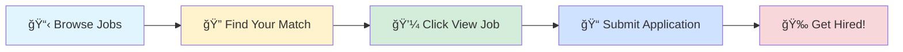

# 🚀 Tech Jobs Board

### Your Gateway to Amazing Career Opportunities

---

## 🎯 Browse by Job Profile

<table>
<tr>
<td align="center" width="25%">

 
<b>1000</b> total positions
</td>
<td align="center" width="25%">

 
<b>1000</b> total positions
</td>
<td align="center" width="25%">

 
<b>1000</b> total positions
</td>
<td align="center" width="25%">

 
<b>1000</b> total positions
</td>
</tr>
</table>

---

## 📊 Data Scientist

> 💼 **1000** positions available

<table>
<thead>
<tr>
<th width="20%">🏢 Company</th>
<th width="35%">💼 Role</th>
<th width="20%">📍 Location</th>
<th width="10%">⏰ Posted</th>
<th width="15%">🔗 Action</th>
</tr>
</thead>
<tbody>
<tr>
<td>Eurofins It Solutions India</td>
<td>Automation Test Engineer</td>
<td>📍 Bangalore</td>
<td>Today</td>
<td align="center"></td>
</tr>
<tr>
<td>Eurofins It Solutions India</td>
<td>Monitoring Engineer</td>
<td>📍 Bangalore</td>
<td>Today</td>
<td align="center"></td>
</tr>
<tr>
<td>Eurofins It Solutions India</td>
<td>Tool Administrator / Automation Consultant</td>
<td>📍 Bangalore</td>
<td>Today</td>
<td align="center"></td>
</tr>
<tr>
<td>Eurofins It Solutions India</td>
<td>Automation QA Engineer</td>
<td>📍 Bangalore</td>
<td>Today</td>
<td align="center"></td>
</tr>
<tr>
<td><a href="https://de.linkedin.com/company/nexuspolitics">Nexus Politics</a></td>
<td>Interdisciplinary Project (Computer Science @ TUM)</td>
<td></td>
<td>Today</td>
<td align="center"></td>
</tr>
<tr>
<td><a href="https://nl.linkedin.com/company/jdepeets">JDE Peet's</a></td>
<td>R&D Sensory & Consumer Science Intern</td>
<td></td>
<td>Today</td>
<td align="center"></td>
</tr>
<tr>
<td><a href="https://nl.linkedin.com/company/jdepeets">JDE Peet's</a></td>
<td>R&D Coffee Academy Intern</td>
<td></td>
<td>Today</td>
<td align="center"></td>
</tr>
<tr>
<td><a href="https://nl.linkedin.com/company/jdepeets">JDE Peet's</a></td>
<td>R&D New Product Development Intern</td>
<td></td>
<td>Today</td>
<td align="center"></td>
</tr>
<tr>
<td><a href="https://nl.linkedin.com/company/jdepeets">JDE Peet's</a></td>
<td>R&D Technology Solutions Intern</td>
<td></td>
<td>Today</td>
<td align="center"></td>
</tr>
<tr>
<td><a href="https://nl.linkedin.com/company/jdepeets">JDE Peet's</a></td>
<td>R&D Packaging Intern</td>
<td></td>
<td>Today</td>
<td align="center"></td>
</tr>
<tr>
<td><a href="https://nl.linkedin.com/company/jdepeets">JDE Peet's</a></td>
<td>R&D Science and Modelling Intern</td>
<td></td>
<td>Today</td>
<td align="center"></td>
</tr>
<tr>
<td><a href="https://np.linkedin.com/company/mach24orbitals">Mach24 Orbitals</a></td>
<td>Artificial Intelligence Intern</td>
<td></td>
<td>Today</td>
<td align="center"></td>
</tr>
<tr>
<td><a href="https://www.linkedin.com/company/lunartechai">LunarTech</a></td>
<td>AI Automation Intern (n8n/Make/Zapier)</td>
<td></td>
<td>Today</td>
<td align="center"></td>
</tr>
<tr>
<td>Eurofins It Solutions India</td>
<td>Senior Software Engineer (Azure Database Developer)</td>
<td>📍 Bangalore</td>
<td>Today</td>
<td align="center"></td>
</tr>
<tr>
<td>Eurofins It Solutions India</td>
<td>Azure DB Developer</td>
<td>📍 Bangalore</td>
<td>Today</td>
<td align="center"></td>
</tr>
<tr>
<td><a href="https://www.linkedin.com/company/meta">Meta</a></td>
<td>Research Scientist Intern, AI Core Machine Learning (PhD)</td>
<td></td>
<td>Today</td>
<td align="center"></td>
</tr>
<tr>
<td><a href="https://uk.linkedin.com/company/alphasights">AlphaSights</a></td>
<td>Graduate Analyst, Product Analytics</td>
<td></td>
<td>Today</td>
<td align="center"></td>
</tr>
<tr>
<td><a href="https://de.linkedin.com/company/railone">RAILONE</a></td>
<td>2026 Ausbildung Elektroniker/-in für Betriebstechnik (m/w/d)</td>
<td></td>
<td>Today</td>
<td align="center"></td>
</tr>
<tr>
<td><a href="https://de.linkedin.com/company/ars-altmann-ag">ARS Altmann AG - Automobillogistik</a></td>
<td>Ausbildung Fachinformatiker für Systemintegration (m/w/d) 2026</td>
<td></td>
<td>Today</td>
<td align="center"></td>
</tr>
<tr>
<td><a href="https://www.linkedin.com/company/aionrobotics">AION ROBOTICS CORPORATION</a></td>
<td>Machine Learning Intern (Fall 2025)</td>
<td>📍 Arvada, CO</td>
<td>Today</td>
<td align="center"></td>
</tr>
<tr>
<td><a href="https://www.linkedin.com/company/tiktok">TikTok</a></td>
<td>Data Science Graduate (Advertisement Team) - 2026 Start (BS/MS)</td>
<td></td>
<td>Today</td>
<td align="center"></td>
</tr>
<tr>
<td><a href="https://www.linkedin.com/company/togethercomputer">Together AI</a></td>
<td>Machine Learning / Research Engineer (New Grad)</td>
<td></td>
<td>Today</td>
<td align="center"></td>
</tr>
<tr>
<td><a href="https://in.linkedin.com/company/birlasoft">Birlasoft</a></td>
<td>Data Scientist</td>
<td>📍 Pune</td>
<td>Today</td>
<td align="center"></td>
</tr>
<tr>
<td><a href="https://fr.linkedin.com/company/capgemini">Capgemini</a></td>
<td>Bluetooth Automation Test Engineer</td>
<td>📍 Hyderabad</td>
<td>Today</td>
<td align="center"></td>
</tr>
<tr>
<td><a href="https://in.linkedin.com/company/arcitechai">Arcitech</a></td>
<td>Python Developer</td>
<td>📍 Mumbai</td>
<td>Today</td>
<td align="center"></td>
</tr>
<tr>
<td><a href="https://za.linkedin.com/company/standard-bank-group">Standard Bank Group</a></td>
<td>Senior, Data Scientist</td>
<td>📍 Dar es-Salaam, Dar es Salaam, Tanzania</td>
<td>Today</td>
<td align="center"></td>
</tr>
<tr>
<td><a href="https://in.linkedin.com/company/arcitechai">Arcitech</a></td>
<td>Python Developer</td>
<td>📍 Mumbai</td>
<td>Today</td>
<td align="center"></td>
</tr>
<tr>
<td><a href="https://in.linkedin.com/company/wiraa">Wiraa</a></td>
<td>Backend Engineer (Python, API)</td>
<td></td>
<td>Today</td>
<td align="center"></td>
</tr>
<tr>
<td><a href="https://fr.linkedin.com/company/interm%C3%A8des">Intermèdes</a></td>
<td>Rédacteur-correcteur contenus éditoriaux et SEO</td>
<td></td>
<td>Today</td>
<td align="center"></td>
</tr>
<tr>
<td><a href="https://in.linkedin.com/company/talentgigs">Talentgigs</a></td>
<td>Python Developer</td>
<td>📍 India</td>
<td>Today</td>
<td align="center"></td>
</tr>
<tr>
<td><a href="https://bg.linkedin.com/company/eastvantage">Eastvantage</a></td>
<td>Python Developer</td>
<td>📍 Bangalore</td>
<td>Today</td>
<td align="center"></td>
</tr>
<tr>
<td><a href="https://in.linkedin.com/company/macrohire">MacroHire</a></td>
<td>Data Scientist</td>
<td>📍 Pune</td>
<td>Today</td>
<td align="center"></td>
</tr>
<tr>
<td><a href="https://pt.linkedin.com/company/mootivatechnologyservices">Mootiva</a></td>
<td>Machine Learning Engineer</td>
<td></td>
<td>Today</td>
<td align="center"></td>
</tr>
<tr>
<td><a href="https://in.linkedin.com/company/zensar">Zensar Technologies</a></td>
<td>Automation Testing - SDET</td>
<td>📍 Bangalore</td>
<td>Today</td>
<td align="center"></td>
</tr>
<tr>
<td><a href="https://www.linkedin.com/company/executive-placements">ExecutivePlacements.com - The JOB Portal</a></td>
<td>Python Programmer (Remote)</td>
<td></td>
<td>Today</td>
<td align="center"></td>
</tr>
<tr>
<td><a href="https://in.linkedin.com/company/zensar">Zensar Technologies</a></td>
<td>Automation Testing - SDET</td>
<td>📍 Bangalore</td>
<td>Today</td>
<td align="center"></td>
</tr>
<tr>
<td><a href="https://www.linkedin.com/company/turingcom">Turing</a></td>
<td>Remote Data Scientist</td>
<td>📍 Mumbai</td>
<td>Today</td>
<td align="center"></td>
</tr>
<tr>
<td><a href="https://www.linkedin.com/company/turingcom">Turing</a></td>
<td>Remote Data Scientist</td>
<td>📍 Hyderabad</td>
<td>Today</td>
<td align="center"></td>
</tr>
<tr>
<td><a href="https://in.linkedin.com/company/rategain">RateGain</a></td>
<td>Senior Machine Learning Engineer</td>
<td>📍 Noida</td>
<td>Today</td>
<td align="center"></td>
</tr>
<tr>
<td><a href="https://gr.linkedin.com/company/agile-actors">Agile Actors</a></td>
<td>Data Engineer on Azure</td>
<td></td>
<td>Today</td>
<td align="center"></td>
</tr>
<tr>
<td><a href="https://www.linkedin.com/company/turingcom">Turing</a></td>
<td>Remote Sr Software Developer - Python</td>
<td>📍 Hyderabad</td>
<td>Today</td>
<td align="center"></td>
</tr>
<tr>
<td><a href="https://www.linkedin.com/company/turingcom">Turing</a></td>
<td>Remote Data Scientist</td>
<td>📍 Mumbai</td>
<td>Today</td>
<td align="center"></td>
</tr>
<tr>
<td><a href="https://www.linkedin.com/company/turingcom">Turing</a></td>
<td>Remote Data Scientist</td>
<td>📍 Delhi</td>
<td>Today</td>
<td align="center"></td>
</tr>
<tr>
<td><a href="https://www.linkedin.com/company/turingcom">Turing</a></td>
<td>Remote Data Scientist</td>
<td>📍 Delhi</td>
<td>Today</td>
<td align="center"></td>
</tr>
<tr>
<td><a href="https://www.linkedin.com/company/omnicom-media-group_2">Omnicom Media Group</a></td>
<td>Junior Monitoring Executive</td>
<td></td>
<td>Today</td>
<td align="center"></td>
</tr>
<tr>
<td><a href="https://www.linkedin.com/company/turingcom">Turing</a></td>
<td>Remote Data Scientist</td>
<td>📍 Hyderabad</td>
<td>Today</td>
<td align="center"></td>
</tr>
<tr>
<td><a href="https://www.linkedin.com/company/turingcom">Turing</a></td>
<td>Remote Sr Software Developer - Python</td>
<td>📍 Mumbai</td>
<td>Today</td>
<td align="center"></td>
</tr>
<tr>
<td><a href="https://www.linkedin.com/company/cloudmoyo">CloudMoyo</a></td>
<td>Technical Manager (.NET, Azure)</td>
<td></td>
<td>Today</td>
<td align="center"></td>
</tr>
<tr>
<td><a href="https://pt.linkedin.com/company/quickopsconsulting">QuickOps Consulting</a></td>
<td>QA Automation Engineer – Outsystems</td>
<td></td>
<td>Today</td>
<td align="center"></td>
</tr>
<tr>
<td><a href="https://sg.linkedin.com/company/tothenew">TO THE NEW</a></td>
<td>Marketing Automation Specialist (Hubspot)</td>
<td>📍 Noida</td>
<td>Today</td>
<td align="center"></td>
</tr>
<tr>
<td><a href="https://www.linkedin.com/company/highlevel">HighLevel</a></td>
<td>Data Scientist</td>
<td>📍 Delhi</td>
<td>Today</td>
<td align="center"></td>
</tr>
<tr>
<td><a href="https://in.linkedin.com/company/alponent-digital-solutions">Alponent Digital Solutions Private Limited</a></td>
<td>Python and Data Science Developer (Freshers)</td>
<td>📍 India</td>
<td>Today</td>
<td align="center"></td>
</tr>
<tr>
<td><a href="https://nl.linkedin.com/company/fintribv">Fintri</a></td>
<td>Procesmanager – Transaction Monitoring (TM)</td>
<td></td>
<td>Today</td>
<td align="center"></td>
</tr>
<tr>
<td><a href="https://www.linkedin.com/company/turingcom">Turing</a></td>
<td>Remote Sr Software Developer - Python</td>
<td>📍 Mumbai</td>
<td>Today</td>
<td align="center"></td>
</tr>
<tr>
<td><a href="https://in.linkedin.com/company/franklintempletonindia">Franklin Templeton India</a></td>
<td>Senior Software Engineer (Backend, RESTAPI, Python, Flask)</td>
<td>📍 Hyderabad</td>
<td>Today</td>
<td align="center"></td>
</tr>
<tr>
<td><a href="https://www.linkedin.com/company/turingcom">Turing</a></td>
<td>Remote Data Scientist</td>
<td>📍 Hyderabad</td>
<td>Today</td>
<td align="center"></td>
</tr>
<tr>
<td><a href="https://uk.linkedin.com/company/lgcgroup">LGC</a></td>
<td>Assistant Director Portfolio Analytics</td>
<td></td>
<td>Today</td>
<td align="center"></td>
</tr>
<tr>
<td><a href="https://www.linkedin.com/company/turingcom">Turing</a></td>
<td>Remote Data Scientist</td>
<td>📍 Bangalore</td>
<td>Today</td>
<td align="center"></td>
</tr>
<tr>
<td><a href="https://www.linkedin.com/company/turingcom">Turing</a></td>
<td>Remote Data Scientist</td>
<td>📍 Mumbai</td>
<td>Today</td>
<td align="center"></td>
</tr>
<tr>
<td><a href="https://www.linkedin.com/company/turingcom">Turing</a></td>
<td>Remote Data Scientist</td>
<td>📍 Hyderabad</td>
<td>Today</td>
<td align="center"></td>
</tr>
<tr>
<td><a href="https://www.linkedin.com/company/turingcom">Turing</a></td>
<td>Remote Data Scientist</td>
<td>📍 Delhi</td>
<td>Today</td>
<td align="center"></td>
</tr>
<tr>
<td><a href="https://www.linkedin.com/company/turingcom">Turing</a></td>
<td>Remote Data Scientist</td>
<td>📍 Delhi</td>
<td>Today</td>
<td align="center"></td>
</tr>
<tr>
<td><a href="https://fr.linkedin.com/company/groupe-alliance">GROUPE ALLIANCE</a></td>
<td>DÉVELOPPEUR CONFIRMÉ ORACLE - PL/SQL (H/F)</td>
<td></td>
<td>Today</td>
<td align="center"></td>
</tr>
<tr>
<td><a href="https://www.linkedin.com/company/turingcom">Turing</a></td>
<td>Remote Sr Software Developer - Python</td>
<td>📍 Mumbai</td>
<td>Today</td>
<td align="center"></td>
</tr>
<tr>
<td><a href="https://fr.linkedin.com/company/pilot-systems">Pilot Systems</a></td>
<td>Admin sys junior passionné Linux / Python - rentrée septembre 2019</td>
<td></td>
<td>Today</td>
<td align="center"></td>
</tr>
<tr>
<td><a href="https://www.linkedin.com/company/turingcom">Turing</a></td>
<td>Remote Data Scientist</td>
<td>📍 Mumbai</td>
<td>Today</td>
<td align="center"></td>
</tr>
<tr>
<td><a href="https://in.linkedin.com/company/syansoft">SyanSoft Technologies Private Limited</a></td>
<td>Data Scientist</td>
<td>📍 Gurugram</td>
<td>Today</td>
<td align="center"></td>
</tr>
<tr>
<td><a href="https://pl.linkedin.com/company/softwarely">Softwarely</a></td>
<td>Java Developer (doświadczenie w PL/SQL)</td>
<td></td>
<td>Today</td>
<td align="center"></td>
</tr>
<tr>
<td><a href="https://in.linkedin.com/school/masaischool/">Masai</a></td>
<td>Curriculum Engineer - AI/ML</td>
<td>📍 Bangalore</td>
<td>Today</td>
<td align="center"></td>
</tr>
<tr>
<td><a href="https://www.linkedin.com/company/euronet-eft">Euronet EFT Segment</a></td>
<td>Junior / Medior MS SQL Adatbázis Szakértő</td>
<td></td>
<td>Today</td>
<td align="center"></td>
</tr>
<tr>
<td><a href="https://www.linkedin.com/company/little-caesars">Little Caesars Pizza</a></td>
<td>Data Scientist</td>
<td></td>
<td>Today</td>
<td align="center"></td>
</tr>
<tr>
<td><a href="https://no.linkedin.com/company/helgevold">Helgevold</a></td>
<td>Senioringeniør - Automasjon</td>
<td></td>
<td>Today</td>
<td align="center"></td>
</tr>
<tr>
<td><a href="https://uk.linkedin.com/company/idox-information-solutions">Idox Grants and Policy</a></td>
<td>Site Reliability Engineer (AWS)</td>
<td>📍 Pune</td>
<td>Today</td>
<td align="center"></td>
</tr>
<tr>
<td><a href="https://www.linkedin.com/company/ascentt-systems">Ascentt</a></td>
<td>Azure Cloud Engineer</td>
<td>📍 Pune</td>
<td>Today</td>
<td align="center"></td>
</tr>
<tr>
<td><a href="https://www.linkedin.com/company/micron-technology">Micron Technology</a></td>
<td>MTS, Data scientist</td>
<td>📍 Hyderabad</td>
<td>Today</td>
<td align="center"></td>
</tr>
<tr>
<td><a href="https://www.linkedin.com/company/iql-private-office">Private Office Holdings</a></td>
<td>Data Analytics Principle</td>
<td></td>
<td>Today</td>
<td align="center"></td>
</tr>
<tr>
<td><a href="https://www.linkedin.com/company/infobeans">InfoBeans</a></td>
<td>Python Fullstack Developer</td>
<td>📍 Bangalore</td>
<td>Today</td>
<td align="center"></td>
</tr>
<tr>
<td><a href="https://www.linkedin.com/company/um-it-solutions">UM IT Solutions</a></td>
<td>Machine Learning Intern</td>
<td>📍 India</td>
<td>Today</td>
<td align="center"></td>
</tr>
<tr>
<td><a href="https://www.linkedin.com/company/adobe">Adobe</a></td>
<td>2026 University Graduate - Data Scientist</td>
<td></td>
<td>Today</td>
<td align="center"></td>
</tr>
<tr>
<td><a href="https://www.linkedin.com/company/eci-1995">ECI</a></td>
<td>Software Engineer - AWS</td>
<td>📍 Bangalore</td>
<td>Today</td>
<td align="center"></td>
</tr>
<tr>
<td><a href="https://www.linkedin.com/company/aptean">Aptean</a></td>
<td>Senior Automation Engineer</td>
<td>📍 Bangalore</td>
<td>Today</td>
<td align="center"></td>
</tr>
<tr>
<td><a href="https://www.linkedin.com/company/adobe">Adobe</a></td>
<td>2026 University Graduate - Data Scientist</td>
<td></td>
<td>Today</td>
<td align="center"></td>
</tr>
<tr>
<td><a href="https://www.linkedin.com/company/micron-technology">Micron Technology</a></td>
<td>Automation Engineer</td>
<td>📍 India</td>
<td>Today</td>
<td align="center"></td>
</tr>
<tr>
<td><a href="https://es.linkedin.com/company/amadeus">Amadeus</a></td>
<td>INTERNSHIP - Data scientist & AI</td>
<td></td>
<td>Today</td>
<td align="center"></td>
</tr>
<tr>
<td><a href="https://www.linkedin.com/company/zinniatm">Zinnia</a></td>
<td>Senior Data Scientist</td>
<td>📍 Noida</td>
<td>Today</td>
<td align="center"></td>
</tr>
<tr>
<td><a href="https://my.linkedin.com/company/pentamaster-corporation-berhad-official">Pentamaster Corporation Berhad (Official)</a></td>
<td>Software Automation Engineer</td>
<td>📍 India</td>
<td>Today</td>
<td align="center"></td>
</tr>
<tr>
<td><a href="https://in.linkedin.com/company/itc-infotech">ITC Infotech</a></td>
<td>AWS Cloud Lead Developer</td>
<td>📍 Pune</td>
<td>Today</td>
<td align="center"></td>
</tr>
<tr>
<td><a href="https://www.linkedin.com/company/um-it-solutions">UM IT Solutions</a></td>
<td>Artificial Intelligence Intern</td>
<td>📍 India</td>
<td>Today</td>
<td align="center"></td>
</tr>
<tr>
<td><a href="https://www.linkedin.com/company/bydpakistan">BYD Pakistan</a></td>
<td>Manager Analytics</td>
<td></td>
<td>Today</td>
<td align="center"></td>
</tr>
<tr>
<td><a href="https://uk.linkedin.com/company/darwin-recruitment-3">Darwin Recruitment</a></td>
<td>PLC Automation Engineer</td>
<td></td>
<td>Today</td>
<td align="center"></td>
</tr>
<tr>
<td><a href="https://www.linkedin.com/company/turingcom">Turing</a></td>
<td>Remote Data Scientist</td>
<td>📍 Delhi</td>
<td>Today</td>
<td align="center"></td>
</tr>
<tr>
<td><a href="https://www.linkedin.com/company/educational-testing-service-ets">ETS</a></td>
<td>SQL Server Database Admin Ld - India</td>
<td>📍 Delhi</td>
<td>Today</td>
<td align="center"></td>
</tr>
<tr>
<td><a href="https://www.linkedin.com/company/turingcom">Turing</a></td>
<td>Remote Data Scientist</td>
<td>📍 Mumbai</td>
<td>Today</td>
<td align="center"></td>
</tr>
<tr>
<td><a href="https://www.linkedin.com/company/jobunifiedmentor">UM IT PRIVATE LIMITED</a></td>
<td>Data Science Intern</td>
<td>📍 India</td>
<td>Today</td>
<td align="center"></td>
</tr>
<tr>
<td><a href="https://www.linkedin.com/company/turingcom">Turing</a></td>
<td>Remote Data Scientist</td>
<td>📍 Hyderabad</td>
<td>Today</td>
<td align="center"></td>
</tr>
<tr>
<td><a href="https://www.linkedin.com/company/infobeans">InfoBeans</a></td>
<td>Python Fullstack Developer</td>
<td>📍 India</td>
<td>Today</td>
<td align="center"></td>
</tr>
<tr>
<td><a href="https://www.linkedin.com/company/turingcom">Turing</a></td>
<td>Remote Data Scientist</td>
<td>📍 Mumbai</td>
<td>Today</td>
<td align="center"></td>
</tr>
<tr>
<td><a href="https://uk.linkedin.com/company/technipfmc">TechnipFMC</a></td>
<td>Automation Engineer I</td>
<td>📍 Hyderabad</td>
<td>Today</td>
<td align="center"></td>
</tr>
<tr>
<td><a href="https://www.linkedin.com/company/adobe">Adobe</a></td>
<td>2026 University Graduate - Data Scientist</td>
<td></td>
<td>Today</td>
<td align="center"></td>
</tr>
<tr>
<td><a href="https://vn.linkedin.com/company/724software">724SOFTWARE</a></td>
<td>Automation Test (N2)</td>
<td></td>
<td>Today</td>
<td align="center"></td>
</tr>
<tr><td colspan="5" align="center"><i>... and 900 more positions</i></td></tr>
</tbody>
</table>

---

## 💼 Business Analyst

> 💼 **1000** positions available

<table>
<thead>
<tr>
<th width="20%">🏢 Company</th>
<th width="35%">💼 Role</th>
<th width="20%">📍 Location</th>
<th width="10%">⏰ Posted</th>
<th width="15%">🔗 Action</th>
</tr>
</thead>
<tbody>
<tr>
<td>Eurofins It Solutions India</td>
<td>Automation Test Engineer</td>
<td>📍 Bangalore</td>
<td>Today</td>
<td align="center"></td>
</tr>
<tr>
<td>Eurofins It Solutions India</td>
<td>Tool Administrator / Automation Consultant</td>
<td>📍 Bangalore</td>
<td>Today</td>
<td align="center"></td>
</tr>
<tr>
<td>Eurofins It Solutions India</td>
<td>Automation QA Engineer</td>
<td>📍 Bangalore</td>
<td>Today</td>
<td align="center"></td>
</tr>
<tr>
<td><a href="https://de.linkedin.com/company/nexuspolitics">Nexus Politics</a></td>
<td>Interdisciplinary Project (Computer Science @ TUM)</td>
<td></td>
<td>Today</td>
<td align="center"></td>
</tr>
<tr>
<td><a href="https://www.linkedin.com/company/talcott">Talcott Financial Group</a></td>
<td>Project Management Intern</td>
<td></td>
<td>Today</td>
<td align="center"></td>
</tr>
<tr>
<td><a href="https://www.linkedin.com/company/lunartechai">LunarTech</a></td>
<td>AI Automation Intern (n8n/Make/Zapier)</td>
<td></td>
<td>Today</td>
<td align="center"></td>
</tr>
<tr>
<td><a href="https://uk.linkedin.com/company/alphasights">AlphaSights</a></td>
<td>Graduate Analyst, Product Analytics</td>
<td></td>
<td>Today</td>
<td align="center"></td>
</tr>
<tr>
<td><a href="https://in.linkedin.com/company/kissht">Kissht</a></td>
<td>Business Analyst</td>
<td>📍 Mumbai</td>
<td>Today</td>
<td align="center"></td>
</tr>
<tr>
<td><a href="https://fr.linkedin.com/company/capgemini">Capgemini</a></td>
<td>Bluetooth Automation Test Engineer</td>
<td>📍 Hyderabad</td>
<td>Today</td>
<td align="center"></td>
</tr>
<tr>
<td><a href="https://uk.linkedin.com/company/kiauk">Kia UK Limited</a></td>
<td>Placement Year: Business Analyst (Product Marketing) (2026-27)</td>
<td></td>
<td>Today</td>
<td align="center"></td>
</tr>
<tr>
<td><a href="https://in.linkedin.com/company/arcitechai">Arcitech</a></td>
<td>Python Developer</td>
<td>📍 Mumbai</td>
<td>Today</td>
<td align="center"></td>
</tr>
<tr>
<td><a href="https://in.linkedin.com/company/arcitechai">Arcitech</a></td>
<td>Python Developer</td>
<td>📍 Mumbai</td>
<td>Today</td>
<td align="center"></td>
</tr>
<tr>
<td><a href="https://in.linkedin.com/company/wiraa">Wiraa</a></td>
<td>Backend Engineer (Python, API)</td>
<td></td>
<td>Today</td>
<td align="center"></td>
</tr>
<tr>
<td><a href="https://in.linkedin.com/company/wiraa">Wiraa</a></td>
<td>Business Analyst (IT)</td>
<td></td>
<td>Today</td>
<td align="center"></td>
</tr>
<tr>
<td><a href="https://in.linkedin.com/company/talentgigs">Talentgigs</a></td>
<td>Python Developer</td>
<td>📍 India</td>
<td>Today</td>
<td align="center"></td>
</tr>
<tr>
<td><a href="https://bg.linkedin.com/company/eastvantage">Eastvantage</a></td>
<td>Python Developer</td>
<td>📍 Bangalore</td>
<td>Today</td>
<td align="center"></td>
</tr>
<tr>
<td><a href="https://sg.linkedin.com/company/rapsys-technologies-pte-td">RAPSYS TECHNOLOGIES PTE LTD</a></td>
<td>Salesforce Business Analyst</td>
<td>📍 Mumbai</td>
<td>Today</td>
<td align="center"></td>
</tr>
<tr>
<td><a href="https://in.linkedin.com/company/zensar">Zensar Technologies</a></td>
<td>Automation Testing - SDET</td>
<td>📍 Bangalore</td>
<td>Today</td>
<td align="center"></td>
</tr>
<tr>
<td><a href="https://www.linkedin.com/company/executive-placements">ExecutivePlacements.com - The JOB Portal</a></td>
<td>Python Programmer (Remote)</td>
<td></td>
<td>Today</td>
<td align="center"></td>
</tr>
<tr>
<td><a href="https://in.linkedin.com/company/zensar">Zensar Technologies</a></td>
<td>Automation Testing - SDET</td>
<td>📍 Bangalore</td>
<td>Today</td>
<td align="center"></td>
</tr>
<tr>
<td><a href="https://www.linkedin.com/company/turingcom">Turing</a></td>
<td>Remote Sr Software Developer - Python</td>
<td>📍 Hyderabad</td>
<td>Today</td>
<td align="center"></td>
</tr>
<tr>
<td><a href="https://www.linkedin.com/company/turingcom">Turing</a></td>
<td>Remote Sr Software Developer - Python</td>
<td>📍 Mumbai</td>
<td>Today</td>
<td align="center"></td>
</tr>
<tr>
<td><a href="https://pt.linkedin.com/company/quickopsconsulting">QuickOps Consulting</a></td>
<td>QA Automation Engineer – Outsystems</td>
<td></td>
<td>Today</td>
<td align="center"></td>
</tr>
<tr>
<td><a href="https://in.linkedin.com/company/birlasoft">Birlasoft</a></td>
<td>Scrum Master Sr Project Lead-Data Engg</td>
<td>📍 Bangalore</td>
<td>Today</td>
<td align="center"></td>
</tr>
<tr>
<td><a href="https://sg.linkedin.com/company/tothenew">TO THE NEW</a></td>
<td>Marketing Automation Specialist (Hubspot)</td>
<td>📍 Noida</td>
<td>Today</td>
<td align="center"></td>
</tr>
<tr>
<td><a href="https://in.linkedin.com/company/alponent-digital-solutions">Alponent Digital Solutions Private Limited</a></td>
<td>Python and Data Science Developer (Freshers)</td>
<td>📍 India</td>
<td>Today</td>
<td align="center"></td>
</tr>
<tr>
<td><a href="https://www.linkedin.com/company/waste-management">WM</a></td>
<td>Power Bi (Developer I, II, TL)- Gurgaon</td>
<td>📍 Gurugram</td>
<td>Today</td>
<td align="center"></td>
</tr>
<tr>
<td><a href="https://nl.linkedin.com/company/signifycompany">Signify</a></td>
<td>Project Management Officer - Project FORCE</td>
<td>📍 Gurugram</td>
<td>Today</td>
<td align="center"></td>
</tr>
<tr>
<td><a href="https://www.linkedin.com/company/turingcom">Turing</a></td>
<td>Remote Sr Software Developer - Python</td>
<td>📍 Mumbai</td>
<td>Today</td>
<td align="center"></td>
</tr>
<tr>
<td><a href="https://in.linkedin.com/company/franklintempletonindia">Franklin Templeton India</a></td>
<td>Senior Software Engineer (Backend, RESTAPI, Python, Flask)</td>
<td>📍 Hyderabad</td>
<td>Today</td>
<td align="center"></td>
</tr>
<tr>
<td><a href="https://uk.linkedin.com/company/lgcgroup">LGC</a></td>
<td>Assistant Director Portfolio Analytics</td>
<td></td>
<td>Today</td>
<td align="center"></td>
</tr>
<tr>
<td><a href="https://nl.linkedin.com/company/louis-dreyfus-company">Louis Dreyfus Company</a></td>
<td>Business Analyst</td>
<td>📍 Gurugram</td>
<td>Today</td>
<td align="center"></td>
</tr>
<tr>
<td><a href="https://fr.linkedin.com/company/groupe-alliance">GROUPE ALLIANCE</a></td>
<td>DÉVELOPPEUR CONFIRMÉ ORACLE - PL/SQL (H/F)</td>
<td></td>
<td>Today</td>
<td align="center"></td>
</tr>
<tr>
<td><a href="https://www.linkedin.com/company/turingcom">Turing</a></td>
<td>Remote Sr Software Developer - Python</td>
<td>📍 Mumbai</td>
<td>Today</td>
<td align="center"></td>
</tr>
<tr>
<td><a href="https://lk.linkedin.com/company/shoutoutlabs">ShoutOUT Labs</a></td>
<td>Business Analyst Intern</td>
<td></td>
<td>Today</td>
<td align="center"></td>
</tr>
<tr>
<td><a href="https://fr.linkedin.com/company/pilot-systems">Pilot Systems</a></td>
<td>Admin sys junior passionné Linux / Python - rentrée septembre 2019</td>
<td></td>
<td>Today</td>
<td align="center"></td>
</tr>
<tr>
<td><a href="https://www.linkedin.com/company/sstllc">Shri Sai Tech LLC</a></td>
<td>Power BI Developer</td>
<td>📍 Chennai</td>
<td>Today</td>
<td align="center"></td>
</tr>
<tr>
<td><a href="https://za.linkedin.com/company/vodacom">Vodacom</a></td>
<td>Business Analyst</td>
<td></td>
<td>Today</td>
<td align="center"></td>
</tr>
<tr>
<td><a href="https://pl.linkedin.com/company/softwarely">Softwarely</a></td>
<td>Java Developer (doświadczenie w PL/SQL)</td>
<td></td>
<td>Today</td>
<td align="center"></td>
</tr>
<tr>
<td><a href="https://www.linkedin.com/company/euronet-eft">Euronet EFT Segment</a></td>
<td>Junior / Medior MS SQL Adatbázis Szakértő</td>
<td></td>
<td>Today</td>
<td align="center"></td>
</tr>
<tr>
<td><a href="https://www.linkedin.com/company/american-technology-consulting">ATC</a></td>
<td>Business Analyst</td>
<td></td>
<td>Today</td>
<td align="center"></td>
</tr>
<tr>
<td><a href="https://www.linkedin.com/company/iql-private-office">Private Office Holdings</a></td>
<td>Data Analytics Principle</td>
<td></td>
<td>Today</td>
<td align="center"></td>
</tr>
<tr>
<td><a href="https://www.linkedin.com/company/infobeans">InfoBeans</a></td>
<td>Python Fullstack Developer</td>
<td>📍 Bangalore</td>
<td>Today</td>
<td align="center"></td>
</tr>
<tr>
<td><a href="https://www.linkedin.com/company/aptean">Aptean</a></td>
<td>Senior Automation Engineer</td>
<td>📍 Bangalore</td>
<td>Today</td>
<td align="center"></td>
</tr>
<tr>
<td><a href="https://www.linkedin.com/company/micron-technology">Micron Technology</a></td>
<td>Automation Engineer</td>
<td>📍 India</td>
<td>Today</td>
<td align="center"></td>
</tr>
<tr>
<td><a href="https://my.linkedin.com/company/pentamaster-corporation-berhad-official">Pentamaster Corporation Berhad (Official)</a></td>
<td>Software Automation Engineer</td>
<td>📍 India</td>
<td>Today</td>
<td align="center"></td>
</tr>
<tr>
<td><a href="https://www.linkedin.com/company/assurances-de-l'adour">2A Assurances de l'Adour</a></td>
<td>Business Analyst - Stage</td>
<td></td>
<td>Today</td>
<td align="center"></td>
</tr>
<tr>
<td><a href="https://www.linkedin.com/company/bydpakistan">BYD Pakistan</a></td>
<td>Manager Analytics</td>
<td></td>
<td>Today</td>
<td align="center"></td>
</tr>
<tr>
<td><a href="https://uk.linkedin.com/company/darwin-recruitment-3">Darwin Recruitment</a></td>
<td>PLC Automation Engineer</td>
<td></td>
<td>Today</td>
<td align="center"></td>
</tr>
<tr>
<td><a href="https://www.linkedin.com/company/educational-testing-service-ets">ETS</a></td>
<td>SQL Server Database Admin Ld - India</td>
<td>📍 Delhi</td>
<td>Today</td>
<td align="center"></td>
</tr>
<tr>
<td><a href="https://www.linkedin.com/company/infobeans">InfoBeans</a></td>
<td>Python Fullstack Developer</td>
<td>📍 India</td>
<td>Today</td>
<td align="center"></td>
</tr>
<tr>
<td><a href="https://uk.linkedin.com/company/technipfmc">TechnipFMC</a></td>
<td>Automation Engineer I</td>
<td>📍 Hyderabad</td>
<td>Today</td>
<td align="center"></td>
</tr>
<tr>
<td><a href="https://vn.linkedin.com/company/724software">724SOFTWARE</a></td>
<td>Automation Test (N2)</td>
<td></td>
<td>Today</td>
<td align="center"></td>
</tr>
<tr>
<td><a href="https://hu.linkedin.com/company/nix-europe">NIX Europe</a></td>
<td>Medior IT Business Analyst</td>
<td></td>
<td>Today</td>
<td align="center"></td>
</tr>
<tr>
<td><a href="https://de.linkedin.com/company/regnology">Regnology</a></td>
<td>Business Analyst</td>
<td>📍 Pune</td>
<td>Today</td>
<td align="center"></td>
</tr>
<tr>
<td><a href="https://fr.linkedin.com/company/cnam-caisse-nationale-assurance-maladie">CNAM</a></td>
<td>Expert fonctionnel / Business analyst H/F</td>
<td></td>
<td>Today</td>
<td align="center"></td>
</tr>
<tr>
<td><a href="https://www.linkedin.com/company/epamneoris">NEORIS</a></td>
<td>QA Automation</td>
<td></td>
<td>Today</td>
<td align="center"></td>
</tr>
<tr>
<td><a href="https://sg.linkedin.com/company/foodpanda">foodpanda</a></td>
<td>Data & Analytics Intern</td>
<td></td>
<td>Today</td>
<td align="center"></td>
</tr>
<tr>
<td><a href="https://www.linkedin.com/company/mckinsey">McKinsey & Company</a></td>
<td>Business Analyst Intern - McKinsey Digital</td>
<td></td>
<td>Today</td>
<td align="center"></td>
</tr>
<tr>
<td><a href="https://ae.linkedin.com/company/startrader-official">STARTRADER</a></td>
<td>ST11 - Business Analyst at STARTRADER</td>
<td></td>
<td>Today</td>
<td align="center"></td>
</tr>
<tr>
<td><a href="https://www.linkedin.com/company/infobeans">InfoBeans</a></td>
<td>Python Fullstack Developer</td>
<td>📍 Bangalore</td>
<td>Today</td>
<td align="center"></td>
</tr>
<tr>
<td><a href="https://fr.linkedin.com/company/parfums-christian-dior">Parfums Christian Dior</a></td>
<td>STAGE – ASSISTANT(E) BUSINESS ANALYST DIRECT RETAIL – Janvier 2026</td>
<td></td>
<td>Today</td>
<td align="center"></td>
</tr>
<tr>
<td><a href="https://uk.linkedin.com/company/natwest-group">NatWest Group</a></td>
<td>Business Analyst</td>
<td>📍 Chennai</td>
<td>Today</td>
<td align="center"></td>
</tr>
<tr>
<td><a href="https://ph.linkedin.com/company/unionbankph">UnionBank of the Philippines</a></td>
<td>Documentation Officer</td>
<td></td>
<td>Today</td>
<td align="center"></td>
</tr>
<tr>
<td><a href="https://in.linkedin.com/company/zetamicron">Zetamicron</a></td>
<td>BDD Automation Tester ( 5-6 Years Experience )</td>
<td>📍 Hyderabad</td>
<td>Today</td>
<td align="center"></td>
</tr>
<tr>
<td><a href="https://uk.linkedin.com/company/xpertnest">XpertNest</a></td>
<td>Power BI Developer / Analyst</td>
<td>📍 India</td>
<td>Today</td>
<td align="center"></td>
</tr>
<tr>
<td><a href="https://www.linkedin.com/company/infobeans">InfoBeans</a></td>
<td>Python Fullstack Developer</td>
<td>📍 Chennai</td>
<td>Today</td>
<td align="center"></td>
</tr>
<tr>
<td><a href="https://uk.linkedin.com/company/wtwcorporate">WTW</a></td>
<td>Business Analyst</td>
<td></td>
<td>Today</td>
<td align="center"></td>
</tr>
<tr>
<td><a href="https://pl.linkedin.com/company/sii-polska">Sii Poland</a></td>
<td>QA Automation Tester with Java, Selenium, React</td>
<td>📍 Bangalore</td>
<td>Today</td>
<td align="center"></td>
</tr>
<tr>
<td><a href="https://pl.linkedin.com/company/sii-polska">Sii Poland</a></td>
<td>QA Test Automation Engineer – automotive sector</td>
<td>📍 Bangalore</td>
<td>Today</td>
<td align="center"></td>
</tr>
<tr>
<td><a href="https://in.linkedin.com/company/raahtechservices">Raah Techservices</a></td>
<td>Salesforce Data Cloud Engineer | 5+years</td>
<td>📍 Chennai</td>
<td>Today</td>
<td align="center"></td>
</tr>
<tr>
<td><a href="https://be.linkedin.com/company/hellosunrise">Sunrise</a></td>
<td>Python Back-End Developer</td>
<td></td>
<td>Today</td>
<td align="center"></td>
</tr>
<tr>
<td><a href="https://in.linkedin.com/company/tata-consultancy-services">Tata Consultancy Services</a></td>
<td>Test Automation Selenium with Python</td>
<td>📍 Mumbai</td>
<td>Today</td>
<td align="center"></td>
</tr>
<tr>
<td><a href="https://pl.linkedin.com/company/talentcomplete">Talent Complete</a></td>
<td>Business Analyst with SAP</td>
<td></td>
<td>Today</td>
<td align="center"></td>
</tr>
<tr>
<td><a href="https://fr.linkedin.com/company/parfums-christian-dior">Parfums Christian Dior</a></td>
<td>STAGE – ASSISTANT(E) BUSINESS ANALYST WHOLESALE – Janvier 2026</td>
<td></td>
<td>Today</td>
<td align="center"></td>
</tr>
<tr>
<td><a href="https://it.linkedin.com/company/scr-selezione-e-consulenza-per-le-risorse-umane-srl">SCR</a></td>
<td>IT Business Analyst</td>
<td></td>
<td>Today</td>
<td align="center"></td>
</tr>
<tr>
<td><a href="https://in.linkedin.com/company/koenig-solutions">Koenig Solutions Pvt. Ltd.</a></td>
<td>Corporate Trainer- Data Analytics (Remote)</td>
<td>📍 Delhi</td>
<td>Today</td>
<td align="center"></td>
</tr>
<tr>
<td><a href="https://uk.linkedin.com/company/tp-icap">TP ICAP</a></td>
<td>Technical Business Analyst (Corporate Functions)</td>
<td></td>
<td>Today</td>
<td align="center"></td>
</tr>
<tr>
<td><a href="https://in.linkedin.com/company/my-tech-focus">My Tech Focus</a></td>
<td>Senior SDET - QA Automation with Appium & Playwright</td>
<td>📍 Pune</td>
<td>Today</td>
<td align="center"></td>
</tr>
<tr>
<td><a href="https://www.linkedin.com/company/alvarez-&-marsal">Alvarez & Marsal</a></td>
<td>Test Automation Specialist</td>
<td>📍 Gurugram</td>
<td>Today</td>
<td align="center"></td>
</tr>
<tr>
<td><a href="https://id.linkedin.com/company/msbukonsultan">MSBU Konsultan</a></td>
<td>Information Technology Business Analyst</td>
<td></td>
<td>Today</td>
<td align="center"></td>
</tr>
<tr>
<td><a href="https://www.linkedin.com/company/skillfied-mentor-jobs">Skillfied Mentor Jobs</a></td>
<td>SQL & Excel Business Analyst Intern</td>
<td>📍 India</td>
<td>Today</td>
<td align="center"></td>
</tr>
<tr>
<td><a href="https://www.linkedin.com/company/ntt-data-americas">NTT DATA North America</a></td>
<td>SFDC QA Automation</td>
<td>📍 Chennai</td>
<td>Today</td>
<td align="center"></td>
</tr>
<tr>
<td><a href="https://www.linkedin.com/company/mass-247">Mass 247</a></td>
<td>Business Performance Management Lead (Business Analyst)</td>
<td></td>
<td>Today</td>
<td align="center"></td>
</tr>
<tr>
<td><a href="https://in.linkedin.com/company/tata-consultancy-services">Tata Consultancy Services</a></td>
<td>Tableau Developer</td>
<td>📍 Pune</td>
<td>Today</td>
<td align="center"></td>
</tr>
<tr>
<td><a href="https://www.linkedin.com/company/skillfied-mentor-jobs">Skillfied Mentor Jobs</a></td>
<td>Business Analyst</td>
<td>📍 India</td>
<td>Today</td>
<td align="center"></td>
</tr>
<tr>
<td><a href="https://www.linkedin.com/company/skillfied-mentor-jobs">Skillfied Mentor Jobs</a></td>
<td>Business Analyst Intern</td>
<td>📍 India</td>
<td>Today</td>
<td align="center"></td>
</tr>
<tr>
<td><a href="https://www.linkedin.com/company/zelis">Zelis</a></td>
<td>Sr. Salesforce Developer-2</td>
<td>📍 Hyderabad</td>
<td>Today</td>
<td align="center"></td>
</tr>
<tr>
<td><a href="https://fr.linkedin.com/company/sanofi">Sanofi</a></td>
<td>Senior Analyst – Business Analytics</td>
<td>📍 Hyderabad</td>
<td>Today</td>
<td align="center"></td>
</tr>
<tr>
<td><a href="https://in.linkedin.com/company/one-click-it-consultancy">OneClick IT Consultancy P Ltd</a></td>
<td>Information Technology Business Analyst</td>
<td>📍 India</td>
<td>Today</td>
<td align="center"></td>
</tr>
<tr>
<td><a href="https://sg.linkedin.com/company/weareada">ADA</a></td>
<td>Project Management Lead – Digital Commerce</td>
<td>📍 Bangalore</td>
<td>Today</td>
<td align="center"></td>
</tr>
<tr>
<td><a href="https://www.linkedin.com/company/skillfiedmentor">SkillFied Mentor</a></td>
<td>Business Analyst Intern</td>
<td>📍 India</td>
<td>Today</td>
<td align="center"></td>
</tr>
<tr>
<td><a href="https://in.linkedin.com/company/talentgigs">Talentgigs</a></td>
<td>Python Developer - AWS</td>
<td>📍 Hyderabad</td>
<td>Today</td>
<td align="center"></td>
</tr>
<tr>
<td><a href="https://www.linkedin.com/company/blackbaud">Blackbaud</a></td>
<td>Principal Software Engineer - Salesforce</td>
<td>📍 Hyderabad</td>
<td>Today</td>
<td align="center"></td>
</tr>
<tr>
<td><a href="https://in.linkedin.com/company/talentgigs">Talentgigs</a></td>
<td>Full Stack Engineer - React/Python</td>
<td>📍 Chennai</td>
<td>Today</td>
<td align="center"></td>
</tr>
<tr>
<td><a href="https://in.linkedin.com/company/weareuplers">Uplers</a></td>
<td>Full Stack Developer (Python / React)</td>
<td>📍 Thane</td>
<td>Today</td>
<td align="center"></td>
</tr>
<tr>
<td><a href="https://in.linkedin.com/company/qurencia">Qurencia Technologies Pvt Ltd</a></td>
<td>Backend Developer (Python)</td>
<td>📍 Hyderabad</td>
<td>Today</td>
<td align="center"></td>
</tr>
<tr>
<td><a href="https://in.linkedin.com/company/weareuplers">Uplers</a></td>
<td>Full Stack Developer (Python / React)</td>
<td>📍 Mumbai</td>
<td>Today</td>
<td align="center"></td>
</tr>
<tr>
<td><a href="https://www.linkedin.com/company/ntt-data-americas">NTT DATA North America</a></td>
<td>Business Analysis Specialist</td>
<td>📍 Chennai</td>
<td>Today</td>
<td align="center"></td>
</tr>
<tr>
<td><a href="https://fr.linkedin.com/company/amiltone">Amiltone</a></td>
<td>Business Analyst H/F</td>
<td></td>
<td>Today</td>
<td align="center"></td>
</tr>
<tr><td colspan="5" align="center"><i>... and 900 more positions</i></td></tr>
</tbody>
</table>

---

## 🚀 Product Manager

> 💼 **1000** positions available

<table>
<thead>
<tr>
<th width="20%">🏢 Company</th>
<th width="35%">💼 Role</th>
<th width="20%">📍 Location</th>
<th width="10%">⏰ Posted</th>
<th width="15%">🔗 Action</th>
</tr>
</thead>
<tbody>
<tr>
<td>Eurofins It Solutions India</td>
<td>Product Sustenance Engineer- FAMS</td>
<td>📍 Bangalore</td>
<td>Today</td>
<td align="center"></td>
</tr>
<tr>
<td>Eurofins It Solutions India</td>
<td>Senior Product Support Specialist</td>
<td>📍 Bangalore</td>
<td>Today</td>
<td align="center"></td>
</tr>
<tr>
<td>Eurofins It Solutions India</td>
<td>Automation Test Engineer</td>
<td>📍 Bangalore</td>
<td>Today</td>
<td align="center"></td>
</tr>
<tr>
<td>Eurofins It Solutions India</td>
<td>Tool Administrator / Automation Consultant</td>
<td>📍 Bangalore</td>
<td>Today</td>
<td align="center"></td>
</tr>
<tr>
<td>Eurofins It Solutions India</td>
<td>Automation QA Engineer</td>
<td>📍 Bangalore</td>
<td>Today</td>
<td align="center"></td>
</tr>
<tr>
<td><a href="https://de.linkedin.com/company/nexuspolitics">Nexus Politics</a></td>
<td>Interdisciplinary Project (Computer Science @ TUM)</td>
<td></td>
<td>Today</td>
<td align="center"></td>
</tr>
<tr>
<td><a href="https://nl.linkedin.com/company/jdepeets">JDE Peet's</a></td>
<td>R&D New Product Development Intern</td>
<td></td>
<td>Today</td>
<td align="center"></td>
</tr>
<tr>
<td><a href="https://www.linkedin.com/company/talcott">Talcott Financial Group</a></td>
<td>Project Management Intern</td>
<td></td>
<td>Today</td>
<td align="center"></td>
</tr>
<tr>
<td><a href="https://in.linkedin.com/company/arkvrcapital">ARKVR CAPITAL</a></td>
<td>Company Secretary - Management Trainee</td>
<td>📍 Chennai</td>
<td>Today</td>
<td align="center"></td>
</tr>
<tr>
<td><a href="https://www.linkedin.com/company/lunartechai">LunarTech</a></td>
<td>AI Automation Intern (n8n/Make/Zapier)</td>
<td></td>
<td>Today</td>
<td align="center"></td>
</tr>
<tr>
<td>Eurofins It Solutions India</td>
<td>Senior Product Support specialist</td>
<td>📍 Bangalore</td>
<td>Today</td>
<td align="center"></td>
</tr>
<tr>
<td><a href="https://uk.linkedin.com/company/alphasights">AlphaSights</a></td>
<td>Graduate Analyst, Product Analytics</td>
<td></td>
<td>Today</td>
<td align="center"></td>
</tr>
<tr>
<td><a href="https://www.linkedin.com/company/databricks">Databricks</a></td>
<td>Product Design Intern</td>
<td></td>
<td>Today</td>
<td align="center"></td>
</tr>
<tr>
<td><a href="https://uk.linkedin.com/company/mygwork">myGwork - LGBTQ+ Business Community</a></td>
<td>Wealth Management Graduate Programme</td>
<td></td>
<td>Today</td>
<td align="center"></td>
</tr>
<tr>
<td><a href="https://sg.linkedin.com/company/rscw-pte-ltd">RSCW Pte Ltd</a></td>
<td>Associate Management Consultant</td>
<td></td>
<td>Today</td>
<td align="center"></td>
</tr>
<tr>
<td><a href="https://www.linkedin.com/company/ballcorporation">Ball Corporation</a></td>
<td>Graduate Management Trainee</td>
<td></td>
<td>Today</td>
<td align="center"></td>
</tr>
<tr>
<td><a href="https://in.linkedin.com/company/cap-project-x">CAP project X</a></td>
<td>Procurement Management (civil)</td>
<td>📍 Mumbai</td>
<td>Today</td>
<td align="center"></td>
</tr>
<tr>
<td><a href="https://www.linkedin.com/company/imeshai">IMESH</a></td>
<td>Junior Product Marketing Manager (Fresher)</td>
<td>📍 India</td>
<td>Today</td>
<td align="center"></td>
</tr>
<tr>
<td><a href="https://za.linkedin.com/company/communicare-npc">CommunicareNPC</a></td>
<td>Asset Management (Property) Learner</td>
<td></td>
<td>Today</td>
<td align="center"></td>
</tr>
<tr>
<td><a href="https://fr.linkedin.com/company/capgemini">Capgemini</a></td>
<td>Bluetooth Automation Test Engineer</td>
<td>📍 Hyderabad</td>
<td>Today</td>
<td align="center"></td>
</tr>
<tr>
<td><a href="https://fr.linkedin.com/company/bnpparibascorporateandinstitutionalbanking">BNP Paribas CIB</a></td>
<td>Assistant Vice President - Financial Management & Accounting</td>
<td>📍 Mumbai</td>
<td>Today</td>
<td align="center"></td>
</tr>
<tr>
<td><a href="https://uk.linkedin.com/company/kiauk">Kia UK Limited</a></td>
<td>Placement Year: Business Analyst (Product Marketing) (2026-27)</td>
<td></td>
<td>Today</td>
<td align="center"></td>
</tr>
<tr>
<td><a href="https://in.linkedin.com/company/thatmarketinglady-in">That Marketing Lady</a></td>
<td>Product stylist</td>
<td>📍 Mumbai</td>
<td>Today</td>
<td align="center"></td>
</tr>
<tr>
<td><a href="https://es.linkedin.com/company/shakersworks">Shakers</a></td>
<td>Product Onboarding Specialist - Microsoft 365 (Freelancer via Shakers)</td>
<td></td>
<td>Today</td>
<td align="center"></td>
</tr>
<tr>
<td><a href="https://www.linkedin.com/company/entropiktech">Entropik</a></td>
<td>Product Marketing Associate</td>
<td>📍 Chennai</td>
<td>Today</td>
<td align="center"></td>
</tr>
<tr>
<td><a href="https://www.linkedin.com/company/sparkcentral">Sparkcentral by Hootsuite</a></td>
<td>Senior Product Analyst</td>
<td>📍 Location, WV</td>
<td>Today</td>
<td align="center"></td>
</tr>
<tr>
<td><a href="https://www.linkedin.com/company/suprsend">SuprSend</a></td>
<td>Product Marketing Specialist</td>
<td>📍 Bangalore</td>
<td>Today</td>
<td align="center"></td>
</tr>
<tr>
<td><a href="https://in.linkedin.com/company/zensar">Zensar Technologies</a></td>
<td>Automation Testing - SDET</td>
<td>📍 Bangalore</td>
<td>Today</td>
<td align="center"></td>
</tr>
<tr>
<td><a href="https://in.linkedin.com/company/zensar">Zensar Technologies</a></td>
<td>Automation Testing - SDET</td>
<td>📍 Bangalore</td>
<td>Today</td>
<td align="center"></td>
</tr>
<tr>
<td><a href="https://www.linkedin.com/company/marsh-mclennan-agency">Marsh McLennan Agency</a></td>
<td>Client Management Intern</td>
<td></td>
<td>Today</td>
<td align="center"></td>
</tr>
<tr>
<td><a href="https://fr.linkedin.com/company/bnp-paribas">BNP Paribas</a></td>
<td>Assistant Manager/ Manager- Transversal Risk Management</td>
<td>📍 Mumbai</td>
<td>Today</td>
<td align="center"></td>
</tr>
<tr>
<td><a href="https://gr.linkedin.com/company/qualco">QUALCO</a></td>
<td>Product Analyst</td>
<td></td>
<td>Today</td>
<td align="center"></td>
</tr>
<tr>
<td><a href="https://uk.linkedin.com/company/buzzacott">Buzzacott</a></td>
<td>Management Accountant</td>
<td></td>
<td>Today</td>
<td align="center"></td>
</tr>
<tr>
<td>Eurofins It Solutions India</td>
<td>Sr Product Sustenance Engineer</td>
<td>📍 Bangalore</td>
<td>Today</td>
<td align="center"></td>
</tr>
<tr>
<td><a href="https://uk.linkedin.com/company/mygwork">myGwork - LGBTQ+ Business Community</a></td>
<td>Deputy Manager - Supply Chain Management</td>
<td>📍 Mumbai</td>
<td>Today</td>
<td align="center"></td>
</tr>
<tr>
<td><a href="https://www.linkedin.com/company/united-airlines">United Airlines</a></td>
<td>Senior Analyst - Supplier Performance Management</td>
<td>📍 Gurugram</td>
<td>Today</td>
<td align="center"></td>
</tr>
<tr>
<td><a href="https://www.linkedin.com/company/databricks">Databricks</a></td>
<td>Product Management Intern (2026) - Berlin</td>
<td></td>
<td>Today</td>
<td align="center"></td>
</tr>
<tr>
<td><a href="https://pt.linkedin.com/company/quickopsconsulting">QuickOps Consulting</a></td>
<td>QA Automation Engineer – Outsystems</td>
<td></td>
<td>Today</td>
<td align="center"></td>
</tr>
<tr>
<td><a href="https://in.linkedin.com/company/birlasoft">Birlasoft</a></td>
<td>Scrum Master Sr Project Lead-Data Engg</td>
<td>📍 Bangalore</td>
<td>Today</td>
<td align="center"></td>
</tr>
<tr>
<td><a href="https://in.linkedin.com/school/masaischool/">Masai</a></td>
<td>Curriculum Engineer - Management & Business</td>
<td>📍 Bangalore</td>
<td>Today</td>
<td align="center"></td>
</tr>
<tr>
<td><a href="https://www.linkedin.com/company/databricks">Databricks</a></td>
<td>Product Management Intern (Summer 2026)</td>
<td></td>
<td>Today</td>
<td align="center"></td>
</tr>
<tr>
<td><a href="https://sg.linkedin.com/company/tothenew">TO THE NEW</a></td>
<td>Marketing Automation Specialist (Hubspot)</td>
<td>📍 Noida</td>
<td>Today</td>
<td align="center"></td>
</tr>
<tr>
<td><a href="https://uk.linkedin.com/company/ihghotels&resorts">IHG Hotels & Resorts</a></td>
<td>Specialist Revenue & Credit Management - HFS</td>
<td>📍 Gurugram</td>
<td>Today</td>
<td align="center"></td>
</tr>
<tr>
<td><a href="https://fr.linkedin.com/company/augura-space">Augura Space</a></td>
<td>Market Research Analyst Intern (Space Weather)</td>
<td></td>
<td>Today</td>
<td align="center"></td>
</tr>
<tr>
<td><a href="https://in.linkedin.com/company/sbi-card">SBI Card</a></td>
<td>Assistant Vice President – Security Incident Management Lead</td>
<td>📍 Gurugram</td>
<td>Today</td>
<td align="center"></td>
</tr>
<tr>
<td><a href="https://nl.linkedin.com/company/signifycompany">Signify</a></td>
<td>Project Management Officer - Project FORCE</td>
<td>📍 Gurugram</td>
<td>Today</td>
<td align="center"></td>
</tr>
<tr>
<td><a href="https://uk.linkedin.com/company/lgcgroup">LGC</a></td>
<td>Assistant Director Portfolio Analytics</td>
<td></td>
<td>Today</td>
<td align="center"></td>
</tr>
<tr>
<td><a href="https://www.linkedin.com/company/mastercard">Mastercard</a></td>
<td>Manager, Product Management</td>
<td>📍 Pune</td>
<td>Today</td>
<td align="center"></td>
</tr>
<tr>
<td><a href="https://hr.linkedin.com/company/manpowercroatia">Manpower Croatia</a></td>
<td>Process and Product Industrialization Engineer</td>
<td></td>
<td>Today</td>
<td align="center"></td>
</tr>
<tr>
<td><a href="https://mc.linkedin.com/company/gvtmonaco">Gouvernement Monaco</a></td>
<td>Ingénieur en Management des Risques</td>
<td>📍 Monaco, Monaco</td>
<td>Today</td>
<td align="center"></td>
</tr>
<tr>
<td><a href="https://fr.linkedin.com/company/groupe-alliance">GROUPE ALLIANCE</a></td>
<td>DÉVELOPPEUR CONFIRMÉ ORACLE - PL/SQL (H/F)</td>
<td></td>
<td>Today</td>
<td align="center"></td>
</tr>
<tr>
<td><a href="https://in.linkedin.com/company/commutec">Commutec : Corporate Mobility</a></td>
<td>Product Trainer</td>
<td>📍 Thane</td>
<td>Today</td>
<td align="center"></td>
</tr>
<tr>
<td><a href="https://uk.linkedin.com/company/lloyds-banking-group">Lloyds Banking Group</a></td>
<td>Sourcing and Supplier Management Graduate</td>
<td></td>
<td>Today</td>
<td align="center"></td>
</tr>
<tr>
<td><a href="https://pl.linkedin.com/company/softwarely">Softwarely</a></td>
<td>Java Developer (doświadczenie w PL/SQL)</td>
<td></td>
<td>Today</td>
<td align="center"></td>
</tr>
<tr>
<td><a href="https://www.linkedin.com/company/euronet-eft">Euronet EFT Segment</a></td>
<td>Junior / Medior MS SQL Adatbázis Szakértő</td>
<td></td>
<td>Today</td>
<td align="center"></td>
</tr>
<tr>
<td><a href="https://uk.linkedin.com/company/rentokil-initial-careers">Rentokil Initial Careers</a></td>
<td>Management Accountant</td>
<td></td>
<td>Today</td>
<td align="center"></td>
</tr>
<tr>
<td><a href="https://www.linkedin.com/company/sprinklr">Sprinklr</a></td>
<td>Product Manager</td>
<td>📍 Gurugram</td>
<td>Today</td>
<td align="center"></td>
</tr>
<tr>
<td><a href="https://in.linkedin.com/company/srchoutsoftware">Srchout Software</a></td>
<td>UXUI Product Designer</td>
<td>📍 Gurugram</td>
<td>Today</td>
<td align="center"></td>
</tr>
<tr>
<td><a href="https://cn.linkedin.com/company/bytedance">ByteDance</a></td>
<td>Product Operation Manager Intern-Customer Service Platform-2025 Start</td>
<td></td>
<td>Today</td>
<td align="center"></td>
</tr>
<tr>
<td><a href="https://fr.linkedin.com/company/schneider-electric">Schneider Electric</a></td>
<td>Senior Manager – Product Management and Marketing</td>
<td>📍 Mumbai</td>
<td>Today</td>
<td align="center"></td>
</tr>
<tr>
<td><a href="https://eg.linkedin.com/company/drivewithdrop">Drop App</a></td>
<td>Operations Management Intern</td>
<td></td>
<td>Today</td>
<td align="center"></td>
</tr>
<tr>
<td><a href="https://uk.linkedin.com/company/idox-information-solutions">Idox Grants and Policy</a></td>
<td>Solution Consultant, Engineering Information Management</td>
<td>📍 Greater Glasgow Area</td>
<td>Today</td>
<td align="center"></td>
</tr>
<tr>
<td><a href="https://ca.linkedin.com/company/manulife-financial">Manulife</a></td>
<td>Summer Intern/Co-op 2026 - Investment Management Program</td>
<td></td>
<td>Today</td>
<td align="center"></td>
</tr>
<tr>
<td><a href="https://in.linkedin.com/company/bajaj-finserv-lending">Bajaj Finserv</a></td>
<td>Senior AI Product Specialist</td>
<td>📍 Pune</td>
<td>Today</td>
<td align="center"></td>
</tr>
<tr>
<td><a href="https://lk.linkedin.com/company/hcltech-srilanka">HCLTech Sri Lanka</a></td>
<td>Functional consultant - Incident management</td>
<td></td>
<td>Today</td>
<td align="center"></td>
</tr>
<tr>
<td><a href="https://www.linkedin.com/company/iql-private-office">Private Office Holdings</a></td>
<td>Data Analytics Principle</td>
<td></td>
<td>Today</td>
<td align="center"></td>
</tr>
<tr>
<td><a href="https://www.linkedin.com/company/tiktok">TikTok</a></td>
<td>Product Manager Intern (TikTok-Search-Vertical) - 2026 Start (BS/MS)</td>
<td></td>
<td>Today</td>
<td align="center"></td>
</tr>
<tr>
<td><a href="https://uk.linkedin.com/company/tribeca-recruitment">Tribeca Recruitment</a></td>
<td>Research / Delivery Consultant - Executive Search - Asset Management</td>
<td></td>
<td>Today</td>
<td align="center"></td>
</tr>
<tr>
<td><a href="https://www.linkedin.com/company/tiktok">TikTok</a></td>
<td>Commercial Product Risk Analyst Intern - 2025 Start</td>
<td></td>
<td>Today</td>
<td align="center"></td>
</tr>
<tr>
<td><a href="https://www.linkedin.com/company/aptean">Aptean</a></td>
<td>Senior Automation Engineer</td>
<td>📍 Bangalore</td>
<td>Today</td>
<td align="center"></td>
</tr>
<tr>
<td><a href="https://www.linkedin.com/company/micron-technology">Micron Technology</a></td>
<td>Automation Engineer</td>
<td>📍 India</td>
<td>Today</td>
<td align="center"></td>
</tr>
<tr>
<td><a href="https://es.linkedin.com/company/amadeus">Amadeus</a></td>
<td>Product Definition Analyst 2</td>
<td>📍 Bangalore</td>
<td>Today</td>
<td align="center"></td>
</tr>
<tr>
<td><a href="https://in.linkedin.com/company/sitaramayurveda">Sitaram Ayurveda</a></td>
<td>Product Officer</td>
<td>📍 India</td>
<td>Today</td>
<td align="center"></td>
</tr>
<tr>
<td><a href="https://fr.linkedin.com/company/sanofi">Sanofi</a></td>
<td>Drug Product Development and Biopharmaceutics - Summer/Fall 2026 Co-op</td>
<td></td>
<td>Today</td>
<td align="center"></td>
</tr>
<tr>
<td><a href="https://my.linkedin.com/company/pentamaster-corporation-berhad-official">Pentamaster Corporation Berhad (Official)</a></td>
<td>Software Automation Engineer</td>
<td>📍 India</td>
<td>Today</td>
<td align="center"></td>
</tr>
<tr>
<td><a href="https://de.linkedin.com/company/feinmetall-gmbh">FEINMETALL</a></td>
<td>Product Engineer Wafer Probe Card</td>
<td>📍 Le Kram, Tunis, Tunisia</td>
<td>Today</td>
<td align="center"></td>
</tr>
<tr>
<td><a href="https://www.linkedin.com/company/bydpakistan">BYD Pakistan</a></td>
<td>Manager Analytics</td>
<td></td>
<td>Today</td>
<td align="center"></td>
</tr>
<tr>
<td><a href="https://in.linkedin.com/company/bajaj-finserv-lending">Bajaj Finserv</a></td>
<td>Assistant Manager - Debt Management Services - SME</td>
<td>📍 Pune</td>
<td>Today</td>
<td align="center"></td>
</tr>
<tr>
<td><a href="https://uk.linkedin.com/company/darwin-recruitment-3">Darwin Recruitment</a></td>
<td>PLC Automation Engineer</td>
<td></td>
<td>Today</td>
<td align="center"></td>
</tr>
<tr>
<td><a href="https://uk.linkedin.com/company/tebillion">TEBillion</a></td>
<td>Product Trainer</td>
<td></td>
<td>Today</td>
<td align="center"></td>
</tr>
<tr>
<td><a href="https://www.linkedin.com/company/educational-testing-service-ets">ETS</a></td>
<td>SQL Server Database Admin Ld - India</td>
<td>📍 Delhi</td>
<td>Today</td>
<td align="center"></td>
</tr>
<tr>
<td><a href="https://www.linkedin.com/company/millerknoll">MillerKnoll</a></td>
<td>Indirect Supply Management Intern</td>
<td>📍 Zeeland, MI</td>
<td>Today</td>
<td align="center"></td>
</tr>
<tr>
<td><a href="https://be.linkedin.com/company/jobgether">Jobgether</a></td>
<td>Director, Product Management - Integrations</td>
<td></td>
<td>Today</td>
<td align="center"></td>
</tr>
<tr>
<td><a href="https://it.linkedin.com/company/sapa-superior-auto-parts-always">SAPA - Superior Automotive Parts and Application</a></td>
<td>Integrated Management Systems (IMS) Engineer</td>
<td></td>
<td>Today</td>
<td align="center"></td>
</tr>
<tr>
<td><a href="https://uk.linkedin.com/company/technipfmc">TechnipFMC</a></td>
<td>Automation Engineer I</td>
<td>📍 Hyderabad</td>
<td>Today</td>
<td align="center"></td>
</tr>
<tr>
<td><a href="https://vn.linkedin.com/company/724software">724SOFTWARE</a></td>
<td>Automation Test (N2)</td>
<td></td>
<td>Today</td>
<td align="center"></td>
</tr>
<tr>
<td><a href="https://uk.linkedin.com/company/datasourcerecruitment">Datasource Recruitment</a></td>
<td>Management Consultant</td>
<td></td>
<td>Today</td>
<td align="center"></td>
</tr>
<tr>
<td><a href="https://www.linkedin.com/company/prophecytechs">Prophecy Technologies</a></td>
<td>SME - Client Lifecycle Management (Intune, SCCM/SMS)</td>
<td>📍 Noida</td>
<td>Today</td>
<td align="center"></td>
</tr>
<tr>
<td><a href="https://www.linkedin.com/company/epamneoris">NEORIS</a></td>
<td>QA Automation</td>
<td></td>
<td>Today</td>
<td align="center"></td>
</tr>
<tr>
<td><a href="https://ca.linkedin.com/company/head-in-cloud-inc">HIC Global Solutions</a></td>
<td>IT Sales Executive_ (SaaS Product)</td>
<td>📍 Delhi</td>
<td>Today</td>
<td align="center"></td>
</tr>
<tr>
<td><a href="https://cy.linkedin.com/company/logicom-public">Logicom Public Ltd</a></td>
<td>Integrated Management System Officer</td>
<td></td>
<td>Today</td>
<td align="center"></td>
</tr>
<tr>
<td><a href="https://sg.linkedin.com/company/foodpanda">foodpanda</a></td>
<td>Data & Analytics Intern</td>
<td></td>
<td>Today</td>
<td align="center"></td>
</tr>
<tr>
<td><a href="https://in.linkedin.com/company/bajaj-finserv-lending">Bajaj Finserv</a></td>
<td>Senior AI Product Specialist</td>
<td>📍 Pune</td>
<td>Today</td>
<td align="center"></td>
</tr>
<tr>
<td><a href="https://uk.linkedin.com/company/boomfi">BoomFi</a></td>
<td>Product & Customer Operations Associate (Entry-Level)</td>
<td></td>
<td>Today</td>
<td align="center"></td>
</tr>
<tr>
<td><a href="https://www.linkedin.com/company/surveysparrow">SurveySparrow</a></td>
<td>Product Marketing Specialist</td>
<td>📍 Chennai</td>
<td>Today</td>
<td align="center"></td>
</tr>
<tr>
<td>Eurofins It Solutions India</td>
<td>Senior Product support specialist</td>
<td>📍 Bangalore</td>
<td>Today</td>
<td align="center"></td>
</tr>
<tr>
<td><a href="https://it.linkedin.com/company/cedic-biomedical">CEDIC</a></td>
<td>Junior Product Development Specialist - 1 year contract</td>
<td></td>
<td>Today</td>
<td align="center"></td>
</tr>
<tr>
<td><a href="https://www.linkedin.com/company/odav-ag">ODAV AG</a></td>
<td>Software Developer (m/w/d) - Tech Lead Data Management</td>
<td></td>
<td>Today</td>
<td align="center"></td>
</tr>
<tr>
<td><a href="https://my.linkedin.com/company/cocacolasima">Coca-Cola Beverages Singapore, Malaysia & Brunei</a></td>
<td>Digital Product Analyst - Executive</td>
<td></td>
<td>Today</td>
<td align="center"></td>
</tr>
<tr>
<td><a href="https://in.linkedin.com/company/zetamicron">Zetamicron</a></td>
<td>BDD Automation Tester ( 5-6 Years Experience )</td>
<td>📍 Hyderabad</td>
<td>Today</td>
<td align="center"></td>
</tr>
<tr><td colspan="5" align="center"><i>... and 900 more positions</i></td></tr>
</tbody>
</table>

---

## 💻 Full Stack Developer

> 💼 **1000** positions available

<table>
<thead>
<tr>
<th width="20%">🏢 Company</th>
<th width="35%">💼 Role</th>
<th width="20%">📍 Location</th>
<th width="10%">⏰ Posted</th>
<th width="15%">🔗 Action</th>
</tr>
</thead>
<tbody>
<tr>
<td>Eurofins It Solutions India</td>
<td>Principal Software Engineer</td>
<td>📍 Bangalore</td>
<td>Today</td>
<td align="center"></td>
</tr>
<tr>
<td>Eurofins It Solutions India</td>
<td>Senior Software Engineer</td>
<td>📍 Bangalore</td>
<td>Today</td>
<td align="center"></td>
</tr>
<tr>
<td>Eurofins It Solutions India</td>
<td>Software Engineer</td>
<td>📍 Bangalore</td>
<td>Today</td>
<td align="center"></td>
</tr>
<tr>
<td>Eurofins It Solutions India</td>
<td>Principal Software Engineer</td>
<td>📍 Bangalore</td>
<td>Today</td>
<td align="center"></td>
</tr>
<tr>
<td><a href="https://ch.linkedin.com/company/sita">SITA</a></td>
<td>Software development graduate</td>
<td></td>
<td>Today</td>
<td align="center"></td>
</tr>
<tr>
<td><a href="https://uk.linkedin.com/company/revolut">Revolut</a></td>
<td>Rev-celerator Graduate Programme 2026: Backend Java Software Engineer</td>
<td></td>
<td>Today</td>
<td align="center"></td>
</tr>
<tr>
<td><a href="https://www.linkedin.com/company/quickbase">Quickbase</a></td>
<td>Software Engineering Intern</td>
<td></td>
<td>Today</td>
<td align="center"></td>
</tr>
<tr>
<td>Eurofins It Solutions India</td>
<td>Senior Software Engineer</td>
<td>📍 Bangalore</td>
<td>Today</td>
<td align="center"></td>
</tr>
<tr>
<td><a href="https://uk.linkedin.com/school/university-of-salford/">The University of Salford</a></td>
<td>Student Placement - Software Development</td>
<td></td>
<td>Today</td>
<td align="center"></td>
</tr>
<tr>
<td>Eurofins It Solutions India</td>
<td>Senior Software Engineer (Azure Database Developer)</td>
<td>📍 Bangalore</td>
<td>Today</td>
<td align="center"></td>
</tr>
<tr>
<td><a href="https://www.linkedin.com/company/sourceright">Source-Right</a></td>
<td>Jr. React Developer (NV46FCT RM 3320)</td>
<td>📍 India</td>
<td>Today</td>
<td align="center"></td>
</tr>
<tr>
<td><a href="https://www.linkedin.com/company/garmin">Garmin</a></td>
<td>Software Engineer Intern - Aviation Web Development</td>
<td>📍 Middlebury, CT</td>
<td>Today</td>
<td align="center"></td>
</tr>
<tr>
<td><a href="https://www.linkedin.com/company/esync-technologies-llc">Esync Technologies</a></td>
<td>Software Engineer Intern</td>
<td></td>
<td>Today</td>
<td align="center"></td>
</tr>
<tr>
<td><a href="https://fr.linkedin.com/company/sqli">SQLI</a></td>
<td>STAGE Ingénieur logiciel Java Full-Stack– Projet interne (F/H)</td>
<td></td>
<td>Today</td>
<td align="center"></td>
</tr>
<tr>
<td><a href="https://www.linkedin.com/company/databricks">Databricks</a></td>
<td>Software Engineer - Database Engine Internals</td>
<td></td>
<td>Today</td>
<td align="center"></td>
</tr>
<tr>
<td><a href="https://www.linkedin.com/company/emerson">Emerson</a></td>
<td>Software Engineering Co-op (June-Dec)</td>
<td></td>
<td>Today</td>
<td align="center"></td>
</tr>
<tr>
<td><a href="https://www.linkedin.com/company/emerson">Emerson</a></td>
<td>Software Engineering Co-op (Jan- Aug)</td>
<td></td>
<td>Today</td>
<td align="center"></td>
</tr>
<tr>
<td><a href="https://uk.linkedin.com/company/mygwork">myGwork - LGBTQ+ Business Community</a></td>
<td>Graduate Software Engineering Programme 2026</td>
<td></td>
<td>Today</td>
<td align="center"></td>
</tr>
<tr>
<td><a href="https://www.linkedin.com/company/emerson">Emerson</a></td>
<td>Graduate Software Engineering Intern</td>
<td>📍 Round Rock, TX</td>
<td>Today</td>
<td align="center"></td>
</tr>
<tr>
<td><a href="https://www.linkedin.com/company/tiktok">TikTok</a></td>
<td>Backend Software Engineer Graduate (Account) - 2026 Start (BS/MS)</td>
<td></td>
<td>Today</td>
<td align="center"></td>
</tr>
<tr>
<td><a href="https://www.linkedin.com/company/tiktok">TikTok</a></td>
<td>Backend Software Engineer Graduate (Social) - 2026 Start (BS/MS)</td>
<td></td>
<td>Today</td>
<td align="center"></td>
</tr>
<tr>
<td><a href="https://www.linkedin.com/company/databricks">Databricks</a></td>
<td>Software Engineering Intern (2026)</td>
<td></td>
<td>Today</td>
<td align="center"></td>
</tr>
<tr>
<td><a href="https://cn.linkedin.com/company/bytedance">ByteDance</a></td>
<td>Frontend Software Engineer Intern, Information System - 2025 Start</td>
<td></td>
<td>Today</td>
<td align="center"></td>
</tr>
<tr>
<td><a href="https://fr.linkedin.com/company/scaliangroup">Scalian</a></td>
<td>Développeur Java / Angular - H/F</td>
<td></td>
<td>Today</td>
<td align="center"></td>
</tr>
<tr>
<td><a href="https://au.linkedin.com/company/commonwealthbank">Commonwealth Bank</a></td>
<td>Staff Software Engineer</td>
<td></td>
<td>Today</td>
<td align="center"></td>
</tr>
<tr>
<td><a href="https://www.linkedin.com/company/tiktok">TikTok</a></td>
<td>Software Engineer Graduate Social - 2026 Start (BS/MS)</td>
<td></td>
<td>Today</td>
<td align="center"></td>
</tr>
<tr>
<td>Eurofins It Solutions India</td>
<td>Senior Software Engineer</td>
<td>📍 Bangalore</td>
<td>Today</td>
<td align="center"></td>
</tr>
<tr>
<td><a href="https://in.linkedin.com/company/digitalindiacorporation">Digital India Corporation</a></td>
<td>Senior Software Developer cum Project Manager</td>
<td>📍 Noida</td>
<td>Today</td>
<td align="center"></td>
</tr>
<tr>
<td><a href="https://in.linkedin.com/company/arcitechai">Arcitech</a></td>
<td>Python Developer</td>
<td>📍 Mumbai</td>
<td>Today</td>
<td align="center"></td>
</tr>
<tr>
<td><a href="https://www.linkedin.com/company/allstate">Allstate</a></td>
<td>Full Stack  Developer- Senior Consultant II</td>
<td>📍 Pune</td>
<td>Today</td>
<td align="center"></td>
</tr>
<tr>
<td><a href="https://in.linkedin.com/company/arcitechai">Arcitech</a></td>
<td>Python Developer</td>
<td>📍 Mumbai</td>
<td>Today</td>
<td align="center"></td>
</tr>
<tr>
<td><a href="https://in.linkedin.com/company/wiraa">Wiraa</a></td>
<td>Software Engineer II</td>
<td></td>
<td>Today</td>
<td align="center"></td>
</tr>
<tr>
<td><a href="https://in.linkedin.com/company/wiraa">Wiraa</a></td>
<td>Backend Engineer (Python, API)</td>
<td></td>
<td>Today</td>
<td align="center"></td>
</tr>
<tr>
<td>Eurofins It Solutions India</td>
<td>IT Software Engineer -.NET Full stack+Angular</td>
<td>📍 Bangalore</td>
<td>Today</td>
<td align="center"></td>
</tr>
<tr>
<td><a href="https://pk.linkedin.com/company/amphersoft">AmpherSoft</a></td>
<td>Software Engineer Intern(Paid)</td>
<td></td>
<td>Today</td>
<td align="center"></td>
</tr>
<tr>
<td><a href="https://in.linkedin.com/company/goodspaceai">GoodSpace AI</a></td>
<td>Software Engineer</td>
<td>📍 India</td>
<td>Today</td>
<td align="center"></td>
</tr>
<tr>
<td><a href="https://www.linkedin.com/company/tiktok">TikTok</a></td>
<td>Backend Software Engineer Intern (TikTok-PGC-UCP) - 2026 Summer(BS/MS)</td>
<td></td>
<td>Today</td>
<td align="center"></td>
</tr>
<tr>
<td><a href="https://in.linkedin.com/company/talentgigs">Talentgigs</a></td>
<td>Python Developer</td>
<td>📍 India</td>
<td>Today</td>
<td align="center"></td>
</tr>
<tr>
<td><a href="https://bg.linkedin.com/company/eastvantage">Eastvantage</a></td>
<td>Python Developer</td>
<td>📍 Bangalore</td>
<td>Today</td>
<td align="center"></td>
</tr>
<tr>
<td><a href="https://lu.linkedin.com/showcase/synechronluxembourg/">SynechronLuxembourg</a></td>
<td>IT Java Developer</td>
<td></td>
<td>Today</td>
<td align="center"></td>
</tr>
<tr>
<td><a href="https://kr.linkedin.com/company/nol-universe">NOL UNIVERSE</a></td>
<td>Software Engineer, Backend - 다이나믹 패키지</td>
<td></td>
<td>Today</td>
<td align="center"></td>
</tr>
<tr>
<td>Eurofins It Solutions India</td>
<td>IT Software Engineer</td>
<td>📍 Bangalore</td>
<td>Today</td>
<td align="center"></td>
</tr>
<tr>
<td><a href="https://in.linkedin.com/company/tata-consultancy-services">Tata Consultancy Services</a></td>
<td>Angular Developer</td>
<td>📍 Hyderabad</td>
<td>Today</td>
<td align="center"></td>
</tr>
<tr>
<td><a href="https://www.linkedin.com/company/executive-placements">ExecutivePlacements.com - The JOB Portal</a></td>
<td>Java Developer (Remote)</td>
<td></td>
<td>Today</td>
<td align="center"></td>
</tr>
<tr>
<td><a href="https://www.linkedin.com/company/executive-placements">ExecutivePlacements.com - The JOB Portal</a></td>
<td>Python Programmer (Remote)</td>
<td></td>
<td>Today</td>
<td align="center"></td>
</tr>
<tr>
<td><a href="https://es.linkedin.com/company/gmv">GMV</a></td>
<td>Software engineer</td>
<td></td>
<td>Today</td>
<td align="center"></td>
</tr>
<tr>
<td><a href="https://au.linkedin.com/company/partpay">PartPay - Acquired by Zip (ASX:ZIP)</a></td>
<td>Senior Software Engineer (Full Stack)</td>
<td></td>
<td>Today</td>
<td align="center"></td>
</tr>
<tr>
<td><a href="https://au.linkedin.com/company/partpay">PartPay - Acquired by Zip (ASX:ZIP)</a></td>
<td>Senior Software Engineer (Full Stack)</td>
<td></td>
<td>Today</td>
<td align="center"></td>
</tr>
<tr>
<td><a href="https://www.linkedin.com/company/turingcom">Turing</a></td>
<td>Remote Sr Software Developer - Python</td>
<td>📍 Hyderabad</td>
<td>Today</td>
<td align="center"></td>
</tr>
<tr>
<td><a href="https://uk.linkedin.com/company/mygwork">myGwork - LGBTQ+ Business Community</a></td>
<td>Engineer III, Software</td>
<td>📍 Bangalore</td>
<td>Today</td>
<td align="center"></td>
</tr>
<tr>
<td><a href="https://za.linkedin.com/company/60-degrees-resourcing">60 Degrees</a></td>
<td>Senior Software Engineer - Full Stack [Commerce Pod]</td>
<td></td>
<td>Today</td>
<td align="center"></td>
</tr>
<tr>
<td><a href="https://es.linkedin.com/company/capitole-consulting">Capitole</a></td>
<td>Java Backend Engineer - 100% Remote</td>
<td></td>
<td>Today</td>
<td align="center"></td>
</tr>
<tr>
<td><a href="https://uk.linkedin.com/company/kantar">Kantar</a></td>
<td>Full Stack Engineer - .NET and Angular</td>
<td>📍 Bangalore</td>
<td>Today</td>
<td align="center"></td>
</tr>
<tr>
<td><a href="https://www.linkedin.com/company/noetic-information-systems">Noetic Information Systems LLC</a></td>
<td>SR SOFTWARE QUALITY ENGINEER</td>
<td></td>
<td>Today</td>
<td align="center"></td>
</tr>
<tr>
<td><a href="https://www.linkedin.com/company/turingcom">Turing</a></td>
<td>Remote Sr Software Developer - Python</td>
<td>📍 Mumbai</td>
<td>Today</td>
<td align="center"></td>
</tr>
<tr>
<td><a href="https://www.linkedin.com/company/rebooted-solutions-oy">Rebooted Solutions Oy</a></td>
<td>CTO / Lead Developer / Senior Full Stack</td>
<td></td>
<td>Today</td>
<td align="center"></td>
</tr>
<tr>
<td><a href="https://vn.linkedin.com/company/fptiscareers">FPT IS Careers</a></td>
<td>Java Developer</td>
<td></td>
<td>Today</td>
<td align="center"></td>
</tr>
<tr>
<td><a href="https://ae.linkedin.com/company/technohandz">TechnohandZ</a></td>
<td>Lead React Developer</td>
<td>📍 Gurugram</td>
<td>Today</td>
<td align="center"></td>
</tr>
<tr>
<td><a href="https://uk.linkedin.com/company/qualientsolutions">Qualient Technology Solutions UK Limited</a></td>
<td>Java Software Engineer</td>
<td></td>
<td>Today</td>
<td align="center"></td>
</tr>
<tr>
<td><a href="https://www.linkedin.com/company/noetic-information-systems">Noetic Information Systems LLC</a></td>
<td>SR. SOFTWARE ENGINEER</td>
<td></td>
<td>Today</td>
<td align="center"></td>
</tr>
<tr>
<td><a href="https://www.linkedin.com/company/emerson">Emerson</a></td>
<td>Software Engineer</td>
<td>📍 Pune</td>
<td>Today</td>
<td align="center"></td>
</tr>
<tr>
<td><a href="https://www.linkedin.com/company/databricks">Databricks</a></td>
<td>Software Engineering Intern (2026)</td>
<td></td>
<td>Today</td>
<td align="center"></td>
</tr>
<tr>
<td><a href="https://www.linkedin.com/company/zscaler">Zscaler</a></td>
<td>Senior Staff Software Development Engineer</td>
<td>📍 Bangalore</td>
<td>Today</td>
<td align="center"></td>
</tr>
<tr>
<td><a href="https://www.linkedin.com/company/randstaddigital">Randstad Digital</a></td>
<td>Ingénieur logiciel Java/Ingénieure logiciel Java</td>
<td></td>
<td>Today</td>
<td align="center"></td>
</tr>
<tr>
<td><a href="https://uk.linkedin.com/company/innoforge-io">InnoForge</a></td>
<td>Software Engineer</td>
<td></td>
<td>Today</td>
<td align="center"></td>
</tr>
<tr>
<td><a href="https://es.linkedin.com/company/sploro">Sploro</a></td>
<td>Junior Software Engineer (Presencial-Pamplona)</td>
<td></td>
<td>Today</td>
<td align="center"></td>
</tr>
<tr>
<td><a href="https://fr.linkedin.com/company/infotel">Infotel</a></td>
<td>Développeur FS JAVA ANGULAR SENIOR</td>
<td></td>
<td>Today</td>
<td align="center"></td>
</tr>
<tr>
<td><a href="https://in.linkedin.com/company/tata-consultancy-services">Tata Consultancy Services</a></td>
<td>Senior .NET Software Engineer</td>
<td>📍 Hyderabad</td>
<td>Today</td>
<td align="center"></td>
</tr>
<tr>
<td><a href="https://in.linkedin.com/company/alponent-digital-solutions">Alponent Digital Solutions Private Limited</a></td>
<td>Python and Data Science Developer (Freshers)</td>
<td>📍 India</td>
<td>Today</td>
<td align="center"></td>
</tr>
<tr>
<td><a href="https://ph.linkedin.com/company/tcl-online-services-incorporated">TCL.Online Services Incorporated</a></td>
<td>JAVA开发工程师</td>
<td></td>
<td>Today</td>
<td align="center"></td>
</tr>
<tr>
<td><a href="https://es.linkedin.com/company/wehunt-espana">WeHunt España</a></td>
<td>C++ Software Developer</td>
<td></td>
<td>Today</td>
<td align="center"></td>
</tr>
<tr>
<td><a href="https://uk.linkedin.com/company/optimus-search">Optimus Search</a></td>
<td>Embedded Software Engineer</td>
<td></td>
<td>Today</td>
<td align="center"></td>
</tr>
<tr>
<td><a href="https://ch.linkedin.com/company/adecco">Adecco</a></td>
<td>PROGETTISTA SOFTWARE (PLC)</td>
<td></td>
<td>Today</td>
<td align="center"></td>
</tr>
<tr>
<td><a href="https://www.linkedin.com/company/turingcom">Turing</a></td>
<td>Remote Sr Software Developer - Python</td>
<td>📍 Mumbai</td>
<td>Today</td>
<td align="center"></td>
</tr>
<tr>
<td><a href="https://au.linkedin.com/company/madappgang">MadAppGang</a></td>
<td>Frontend Developer (React)</td>
<td></td>
<td>Today</td>
<td align="center"></td>
</tr>
<tr>
<td><a href="https://in.linkedin.com/company/antino-labs">Antino</a></td>
<td>React Native Developer</td>
<td>📍 Gurugram</td>
<td>Today</td>
<td align="center"></td>
</tr>
<tr>
<td><a href="https://in.linkedin.com/company/franklintempletonindia">Franklin Templeton India</a></td>
<td>Senior Software Engineer (Backend, RESTAPI, Python, Flask)</td>
<td>📍 Hyderabad</td>
<td>Today</td>
<td align="center"></td>
</tr>
<tr>
<td><a href="https://www.linkedin.com/company/oracle">Oracle</a></td>
<td>Senior Java Consultant - Core Banking</td>
<td>📍 Noida</td>
<td>Today</td>
<td align="center"></td>
</tr>
<tr>
<td><a href="https://www.linkedin.com/company/oracle">Oracle</a></td>
<td>Senior Java Consultant - Core Banking</td>
<td>📍 Hyderabad</td>
<td>Today</td>
<td align="center"></td>
</tr>
<tr>
<td><a href="https://www.linkedin.com/company/mastercard">Mastercard</a></td>
<td>Software Engineer I</td>
<td>📍 India</td>
<td>Today</td>
<td align="center"></td>
</tr>
<tr>
<td><a href="https://www.linkedin.com/company/mastercard">Mastercard</a></td>
<td>Senior Software Engineer</td>
<td>📍 Pune</td>
<td>Today</td>
<td align="center"></td>
</tr>
<tr>
<td><a href="https://www.linkedin.com/company/preciselydata">Precisely</a></td>
<td>Software Engineer II (Java Backend)</td>
<td>📍 India</td>
<td>Today</td>
<td align="center"></td>
</tr>
<tr>
<td><a href="https://www.linkedin.com/company/mastercard">Mastercard</a></td>
<td>Software Engineer II</td>
<td>📍 Pune</td>
<td>Today</td>
<td align="center"></td>
</tr>
<tr>
<td><a href="https://it.linkedin.com/company/scalingparrots">Scaling Parrots</a></td>
<td>Ingegnere Full Stack</td>
<td></td>
<td>Today</td>
<td align="center"></td>
</tr>
<tr>
<td><a href="https://www.linkedin.com/company/databricks">Databricks</a></td>
<td>Senior Software Engineer - Money, Infrastructure</td>
<td>📍 Bangalore</td>
<td>Today</td>
<td align="center"></td>
</tr>
<tr>
<td><a href="https://www.linkedin.com/company/databricks">Databricks</a></td>
<td>Senior Software Engineer - Infrastructure</td>
<td>📍 Bangalore</td>
<td>Today</td>
<td align="center"></td>
</tr>
<tr>
<td><a href="https://www.linkedin.com/company/noetic-information-systems">Noetic Information Systems LLC</a></td>
<td>Carrers | Lead Software Engineer</td>
<td></td>
<td>Today</td>
<td align="center"></td>
</tr>
<tr>
<td><a href="https://www.linkedin.com/company/noetic-information-systems">Noetic Information Systems LLC</a></td>
<td>SR. SOFTWARE QA ENGINEER</td>
<td></td>
<td>Today</td>
<td align="center"></td>
</tr>
<tr>
<td><a href="https://www.linkedin.com/company/scoutmotors">Scout Motors Inc.</a></td>
<td>Senior Staff Software Engineer, Backend (Digital Products)</td>
<td></td>
<td>Today</td>
<td align="center"></td>
</tr>
<tr>
<td><a href="https://www.linkedin.com/company/roku">Roku</a></td>
<td>Senior Software Engineer - FullStack</td>
<td>📍 Bangalore</td>
<td>Today</td>
<td align="center"></td>
</tr>
<tr>
<td><a href="https://www.linkedin.com/company/databricks">Databricks</a></td>
<td>Sr Staff Software Engineer (Backend)</td>
<td>📍 Bangalore</td>
<td>Today</td>
<td align="center"></td>
</tr>
<tr>
<td><a href="https://fr.linkedin.com/company/groupe-alliance">GROUPE ALLIANCE</a></td>
<td>DÉVELOPPEUR CONFIRMÉ ORACLE - PL/SQL (H/F)</td>
<td></td>
<td>Today</td>
<td align="center"></td>
</tr>
<tr>
<td><a href="https://www.linkedin.com/company/uber-com">Uber</a></td>
<td>Sr Software Engineer- (Conversational Voice AI)</td>
<td></td>
<td>Today</td>
<td align="center"></td>
</tr>
<tr>
<td><a href="https://www.linkedin.com/company/scoutmotors">Scout Motors Inc.</a></td>
<td>Senior Staff Software Engineer, Front-end (Digital Products)</td>
<td></td>
<td>Today</td>
<td align="center"></td>
</tr>
<tr>
<td><a href="https://www.linkedin.com/company/turingcom">Turing</a></td>
<td>Remote Sr Software Developer - Python</td>
<td>📍 Mumbai</td>
<td>Today</td>
<td align="center"></td>
</tr>
<tr>
<td><a href="https://fr.linkedin.com/company/pilot-systems">Pilot Systems</a></td>
<td>Admin sys junior passionné Linux / Python - rentrée septembre 2019</td>
<td></td>
<td>Today</td>
<td align="center"></td>
</tr>
<tr>
<td><a href="https://uk.linkedin.com/company/oho-group-ltd">Oho Group Ltd</a></td>
<td>Embedded Software Engineer</td>
<td></td>
<td>Today</td>
<td align="center"></td>
</tr>
<tr>
<td><a href="https://www.linkedin.com/company/databricks">Databricks</a></td>
<td>Sr Software Engineer (Backend / Fullstack)</td>
<td>📍 Bangalore</td>
<td>Today</td>
<td align="center"></td>
</tr>
<tr>
<td><a href="https://in.linkedin.com/company/cipher-square-technologies">CIPHER SQUARE TECHNOLOGIES</a></td>
<td>Angular Developer</td>
<td>📍 Delhi</td>
<td>Today</td>
<td align="center"></td>
</tr>
<tr>
<td><a href="https://www.linkedin.com/company/databricks">Databricks</a></td>
<td>Senior Software Engineer - Observability</td>
<td>📍 Bangalore</td>
<td>Today</td>
<td align="center"></td>
</tr>
<tr><td colspan="5" align="center"><i>... and 900 more positions</i></td></tr>
</tbody>
</table>

---

## 📈 Statistics

| Metric | Count |
|:-------|------:|
| 📊 Total Listings | **4000** |
| 🌍 Remote Jobs | **1025** |
| 📊 Data Scientist | **1000** |
| 💼 Business Analyst | **1000** |
| 🚀 Product Manager | **1000** |
| 💻 Full Stack Developer | **1000** |

---

## 🎯 How to Apply?

### Steps to Apply:
1. 🔍 **Browse** through the positions above
2. 💼 **Click** the "View Job" button on your preferred role
3. 📝 **Complete** the application on our website
4. ✉️ **Wait** for us to review your application
5. 🎉 **Celebrate** when you get the interview call!

---

## 🔔 Stay Updated

### ⭐ Star this repository to receive updates on new job postings!

**This job board is automatically updated every 6 hours**

---

## 💬 Contributing

Found a broken link or want to add a job posting? Feel free to:
- 🐛 Open an issue
- 🔧 Submit a pull request
- 📧 Contact us directly

---

## 🙏 Stay Connected

---

### 📅 Last Updated

**Friday, October 3, 2025 at 08:32 PM UTC**

---

💼 Jobs aggregated from multiple sources • ⚡ Auto-updated every 6 hours • 🤖 Powered by GitHub Actions

**Made with ❤️ for the Tech Community**

⬆️ [Back to Top](#-tech-jobs-board) ⬆️

