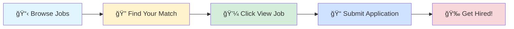

# 🚀 Tech Jobs Board

### Your Gateway to Amazing Career Opportunities

---

## 🎯 Browse by Job Profile

<table>
<tr>
<td align="center" width="25%">

 
<b>1000</b> total positions
</td>
<td align="center" width="25%">

 
<b>1000</b> total positions
</td>
<td align="center" width="25%">

 
<b>1000</b> total positions
</td>
<td align="center" width="25%">

 
<b>1000</b> total positions
</td>
</tr>
</table>

---

## 📊 Data Scientist

> 💼 **1000** positions available

<table>
<thead>
<tr>
<th width="20%">🏢 Company</th>
<th width="35%">💼 Role</th>
<th width="20%">📍 Location</th>
<th width="10%">⏰ Posted</th>
<th width="15%">🔗 Action</th>
</tr>
</thead>
<tbody>
<tr>
<td><a href="https://www.linkedin.com/company/medtoureasy-dwarka">MedTourEasy Dwarka</a></td>
<td>Healthcare Data Analytics</td>
<td>📍 United Arab Emirates</td>
<td>1d ago</td>
<td align="center"></td>
</tr>
<tr>
<td><a href="https://in.linkedin.com/company/talentoindia">Talentoindia - Hire Candidates | Find Jobs</a></td>
<td>AI/ML Developer</td>
<td>📍 India</td>
<td>1d ago</td>
<td align="center"></td>
</tr>
<tr>
<td><a href="https://in.linkedin.com/company/tata-consultancy-services">Tata Consultancy Services</a></td>
<td>Databricks with Python</td>
<td>📍 Hyderabad</td>
<td>1d ago</td>
<td align="center"></td>
</tr>
<tr>
<td><a href="https://fr.linkedin.com/company/usecollective">Collective.work</a></td>
<td>Développeur Full-Stack Python Django / JS - Freelance</td>
<td>📍 Paris, Île-de-France, France</td>
<td>1d ago</td>
<td align="center"></td>
</tr>
<tr>
<td><a href="https://www.linkedin.com/company/tpk-solutions">TPK Solutions</a></td>
<td>Wir suchen DICH: Steuerfachangestellte/r (W/M/D) bis zu 80% REMOTE</td>
<td>📍 Erfurt, Thuringia, Germany</td>
<td>1d ago</td>
<td align="center"></td>
</tr>
<tr>
<td><a href="https://www.linkedin.com/school/middlesex-school/">Middlesex School</a></td>
<td>Teacher of Computer Science and Mathematics</td>
<td>📍 Concord, MA</td>
<td>1d ago</td>
<td align="center"></td>
</tr>
<tr>
<td><a href="https://www.linkedin.com/company/medtoureasy-dwarka">MedTourEasy Dwarka</a></td>
<td>Healthcare Data Analysis Trainee</td>
<td>📍 United Arab Emirates</td>
<td>1d ago</td>
<td align="center"></td>
</tr>
<tr>
<td><a href="https://in.linkedin.com/company/dexianindia">Dexian India</a></td>
<td>Python Data Engineer</td>
<td>📍 Chennai</td>
<td>1d ago</td>
<td align="center"></td>
</tr>
<tr>
<td><a href="https://fr.linkedin.com/company/orpi">ORPI</a></td>
<td>Assistant(e) Commercial(e) Vie du Réseau</td>
<td>📍 Clichy, Île-de-France, France</td>
<td>1d ago</td>
<td align="center"></td>
</tr>
<tr>
<td><a href="https://www.linkedin.com/company/altraize">Altraize</a></td>
<td>Virtual Drive on 26th & 27th Dec 2025 - AUTOMATION ENGINEER</td>
<td>📍 Noida</td>
<td>1d ago</td>
<td align="center"></td>
</tr>
<tr>
<td><a href="https://www.linkedin.com/company/altraize">Altraize</a></td>
<td>Virtual Drive on 26th & 27th Dec 2025 - AUTOMATION ENGINEER</td>
<td>📍 Delhi</td>
<td>1d ago</td>
<td align="center"></td>
</tr>
<tr>
<td><a href="https://www.linkedin.com/company/altraize">Altraize</a></td>
<td>Virtual Drive on 26th & 27th Dec 2025 - AUTOMATION ENGINEER</td>
<td>📍 Delhi</td>
<td>1d ago</td>
<td align="center"></td>
</tr>
<tr>
<td><a href="https://www.linkedin.com/company/altraize">Altraize</a></td>
<td>Virtual Drive on 26th & 27th Dec 2025 - AUTOMATION ENGINEER</td>
<td>📍 Gurugram</td>
<td>1d ago</td>
<td align="center"></td>
</tr>
<tr>
<td><a href="https://www.linkedin.com/company/altraize">Altraize</a></td>
<td>Virtual Drive on 26th & 27th Dec 2025 - AUTOMATION ENGINEER</td>
<td>📍 Ghaziabad, Uttar Pradesh, India</td>
<td>1d ago</td>
<td align="center"></td>
</tr>
<tr>
<td><a href="https://www.linkedin.com/company/grid-dynamics">Grid Dynamics</a></td>
<td>Senior Data Scientist Engineer</td>
<td>📍 Hyderabad</td>
<td>1d ago</td>
<td align="center"></td>
</tr>
<tr>
<td><a href="https://www.ambitionbox.com/overview/hcl-technologies-overview">HCLTech</a></td>
<td>Job opening | Automation tester(Java + Selenium)- Nagpur | HCL Tech</td>
<td>📍 Pune</td>
<td>1d ago</td>
<td align="center"></td>
</tr>
<tr>
<td><a href="https://www.ambitionbox.com/overview/manektech-overview">Manektech</a></td>
<td>AI ML - Intern</td>
<td>📍 Ahmedabad</td>
<td>1d ago</td>
<td align="center"></td>
</tr>
<tr>
<td><a href="https://www.ambitionbox.com/overview/capestart-overview">CapeStart</a></td>
<td>Machine Learning Intern</td>
<td>📍 Nagercoil</td>
<td>1d ago</td>
<td align="center"></td>
</tr>
<tr>
<td><a href="https://www.ambitionbox.com/overview/agilisys-overview">Agilisys It Services</a></td>
<td>Machine Learning Intern</td>
<td>📍 Nagercoil</td>
<td>1d ago</td>
<td align="center"></td>
</tr>
<tr>
<td><a href="https://www.ambitionbox.com/overview/sony-india-software-center-overview">Sony India Software Centre</a></td>
<td>Machine Learning Intern</td>
<td>📍 Nagercoil</td>
<td>1d ago</td>
<td align="center"></td>
</tr>
<tr>
<td><a href="https://www.ambitionbox.com/overview/cleartrip-overview">Cleartrip</a></td>
<td>Machine Learning Intern</td>
<td>📍 Nagercoil</td>
<td>1d ago</td>
<td align="center"></td>
</tr>
<tr>
<td><a href="https://www.linkedin.com/company/medtoureasy">MedTourEasy Bengaluru</a></td>
<td>Health Data Analytics Trainee</td>
<td>📍 United Arab Emirates</td>
<td>1d ago</td>
<td align="center"></td>
</tr>
<tr>
<td><a href="https://uk.linkedin.com/company/resillion">Resillion</a></td>
<td>Senior Automation Test Engineer</td>
<td>📍 Bangalore</td>
<td>1d ago</td>
<td align="center"></td>
</tr>
<tr>
<td>Ell</td>
<td>Artificial Intelligence Intern</td>
<td>📍 Chennai</td>
<td>1d ago</td>
<td align="center"></td>
</tr>
<tr>
<td><a href="https://de.linkedin.com/company/stadtreinigung-hamburg">Stadtreinigung Hamburg</a></td>
<td>Ausbildung zum/zur Umwelttechnologen/Umwelttechnologin (m/w/d) für Kreislauf- und Abfallwirtschaft</td>
<td>📍 Hamburg, Hamburg, Germany</td>
<td>1d ago</td>
<td align="center"></td>
</tr>
<tr>
<td><a href="https://www.linkedin.com/company/wake-up-whistle">Wake Up Whistle</a></td>
<td>Data Analyst Intern | SQL • Excel • Power BI | Remote Internship</td>
<td>📍 India</td>
<td>1d ago</td>
<td align="center"></td>
</tr>
<tr>
<td><a href="https://www.ambitionbox.com/overview/exly-overview">Exly</a></td>
<td>Automation & Growth Intern</td>
<td>📍 Gurugram</td>
<td>1d ago</td>
<td align="center"></td>
</tr>
<tr>
<td><a href="https://www.linkedin.com/company/wake-up-whistle">Wake Up Whistle</a></td>
<td>Data Analyst Intern | Data Visualization & Insights | Excel & SQL</td>
<td>📍 India</td>
<td>1d ago</td>
<td align="center"></td>
</tr>
<tr>
<td><a href="https://www.linkedin.com/company/wake-up-whistle">Wake Up Whistle</a></td>
<td>Data Science Intern | Python • Pandas • Real Projects | Remote</td>
<td>📍 India</td>
<td>1d ago</td>
<td align="center"></td>
</tr>
<tr>
<td><a href="https://www.linkedin.com/company/wake-up-whistle">Wake Up Whistle</a></td>
<td>Machine Learning Intern (Model Building & Evaluation)</td>
<td>📍 India</td>
<td>1d ago</td>
<td align="center"></td>
</tr>
<tr>
<td><a href="https://in.linkedin.com/company/talentgigs">Talentgigs</a></td>
<td>Senior AI Engineer – LLM Frameworks, Vector Databases & Automation</td>
<td>📍 Chennai</td>
<td>1d ago</td>
<td align="center"></td>
</tr>
<tr>
<td><a href="https://in.linkedin.com/company/hrmcounselll">HRM Counsel</a></td>
<td>SQL or Python Developer</td>
<td>📍 India</td>
<td>1d ago</td>
<td align="center"></td>
</tr>
<tr>
<td><a href="https://www.ambitionbox.com/overview/sap-overview">SAP</a></td>
<td>SQL/ Python Associate Consultant</td>
<td>📍 Bangalore</td>
<td>1d ago</td>
<td align="center"></td>
</tr>
<tr>
<td><a href="https://www.linkedin.com/company/medtoureasy">MedTourEasy Bengaluru</a></td>
<td>Data Analytics Trainee</td>
<td>📍 India</td>
<td>1d ago</td>
<td align="center"></td>
</tr>
<tr>
<td><a href="https://www.linkedin.com/company/%E8%A3%95%E5%8A%9B%E5%AF%8C%E9%A3%9F%E5%93%81%EF%BC%88%E4%B8%8A%E6%B5%B7%EF%BC%89%E6%9C%89%E9%99%90%E5%85%AC%E5%8F%B8">裕力富食品（上海）有限公司</a></td>
<td>Head of R&D –FMCG</td>
<td>📍 Shanghai, Shanghai, China</td>
<td>1d ago</td>
<td align="center"></td>
</tr>
<tr>
<td>Blitzenx</td>
<td>Automation Engineer Intern</td>
<td>📍 Chennai</td>
<td>1d ago</td>
<td align="center"></td>
</tr>
<tr>
<td><a href="https://www.linkedin.com/company/greenhouse-inc-">Greenhouse Software</a></td>
<td>Senior ML Ops Engineer</td>
<td>📍 Ontario, Canada</td>
<td>1d ago</td>
<td align="center"></td>
</tr>
<tr>
<td><a href="https://www.linkedin.com/company/nvidia">NVIDIA</a></td>
<td>Senior Software Test Development Engineer - Deep Learning</td>
<td>📍 Shanghai, Shanghai, China</td>
<td>1d ago</td>
<td align="center"></td>
</tr>
<tr>
<td><a href="https://www.linkedin.com/company/nvidia">NVIDIA</a></td>
<td>Research Scientist, ML Systems - PhD New College Grad 2026</td>
<td>📍 Singapore, Singapore</td>
<td>1d ago</td>
<td align="center"></td>
</tr>
<tr>
<td><a href="https://br.linkedin.com/company/claracc">Clara</a></td>
<td>Data Scientist - Risk (Científico de Datos - Riesgo) - Bogota (Hybrid)</td>
<td>📍 Bogota, D.C., Capital District, Colombia</td>
<td>1d ago</td>
<td align="center"></td>
</tr>
<tr>
<td><a href="https://www.linkedin.com/company/five9">Five9</a></td>
<td>Vice President, Data Science</td>
<td>📍 United States</td>
<td>1d ago</td>
<td align="center"></td>
</tr>
<tr>
<td><a href="https://in.linkedin.com/company/medtoureasyyy-gurugram">MedTourEasy Gurugram</a></td>
<td>Healthcare Analytics</td>
<td>📍 United Arab Emirates</td>
<td>1d ago</td>
<td align="center"></td>
</tr>
<tr>
<td><a href="https://www.linkedin.com/company/elevance-health">Elevance Health</a></td>
<td>Advanced Analytics Analyst</td>
<td>📍 Atlanta, GA</td>
<td>1d ago</td>
<td align="center"></td>
</tr>
<tr>
<td><a href="https://www.linkedin.com/company/algosec">AlgoSec</a></td>
<td>CloudFlow Automation Developer, India</td>
<td>📍 Delhi</td>
<td>1d ago</td>
<td align="center"></td>
</tr>
<tr>
<td><a href="https://www.linkedin.com/company/algosec">AlgoSec</a></td>
<td>AlgoNext Automation Developer, India</td>
<td>📍 Delhi</td>
<td>1d ago</td>
<td align="center"></td>
</tr>
<tr>
<td><a href="https://www.linkedin.com/company/algosec">AlgoSec</a></td>
<td>Prevasio Automation Developer, India</td>
<td>📍 Delhi</td>
<td>1d ago</td>
<td align="center"></td>
</tr>
<tr>
<td><a href="https://www.linkedin.com/company/umbbank">UMB Bank</a></td>
<td>Oracle Analytics Developer</td>
<td>📍 Kansas City, MO</td>
<td>1d ago</td>
<td align="center"></td>
</tr>
<tr>
<td><a href="https://www.linkedin.com/company/quadric.io">Quadric</a></td>
<td>Deep Learning Compiler Engineer</td>
<td>📍 Burlingame, CA</td>
<td>1d ago</td>
<td align="center"></td>
</tr>
<tr>
<td><a href="https://fr.linkedin.com/company/l-usine-nouvelle">L'Usine Nouvelle</a></td>
<td>Technicien Support Informatique &amp; Réseau F/H</td>
<td>📍 Chatillon, Valle d'Aosta, Italy</td>
<td>1d ago</td>
<td align="center"></td>
</tr>
<tr>
<td><a href="https://uk.linkedin.com/company/ricoh-uk">Ricoh UK</a></td>
<td>Process Automation Sales</td>
<td>📍 Belgium</td>
<td>1d ago</td>
<td align="center"></td>
</tr>
<tr>
<td><a href="https://www.linkedin.com/company/algosec">AlgoSec</a></td>
<td>Full Stack Automation Developer, India</td>
<td>📍 Delhi</td>
<td>1d ago</td>
<td align="center"></td>
</tr>
<tr>
<td><a href="https://www.ambitionbox.com/overview/cloudsek-overview">Cloudsek Information Security</a></td>
<td>Machine Learning Intern</td>
<td>📍 Bangalore</td>
<td>1d ago</td>
<td align="center"></td>
</tr>
<tr>
<td><a href="https://www.linkedin.com/company/%E5%87%AF%E6%98%93%E8%AE%AF%E7%BD%91%E7%BB%9C%E6%8A%80%E6%9C%AF%E5%BC%80%E5%8F%91-%E5%8D%97%E4%BA%AC-%E6%9C%89%E9%99%90%E5%85%AC%E5%8F%B8">凯易讯网络技术开发(南京)有限公司</a></td>
<td>资深后端开发工程师(Python/FastAPI/架构)</td>
<td>📍 Nanjing, Jiangsu, China</td>
<td>1d ago</td>
<td align="center"></td>
</tr>
<tr>
<td><a href="https://www.linkedin.com/company/accenturefederalservices">Accenture Federal Services</a></td>
<td>Payroll Test Automation Consultant</td>
<td>📍 Washington, DC</td>
<td>1d ago</td>
<td align="center"></td>
</tr>
<tr>
<td><a href="https://cn.linkedin.com/company/unisoctechnologies">UNISOC</a></td>
<td>python开发7943</td>
<td>📍 Nanjing, Jiangsu, China</td>
<td>1d ago</td>
<td align="center"></td>
</tr>
<tr>
<td><a href="https://www.linkedin.com/company/katalystcro">Katalyst CRO</a></td>
<td>R&D Scientist</td>
<td>📍 Jersey City, NJ</td>
<td>1d ago</td>
<td align="center"></td>
</tr>
<tr>
<td><a href="https://br.linkedin.com/company/sistema-fiesc">FIESC - Federação das Indústrias de Santa Catarina</a></td>
<td>03005/2025 - Mentor Educacional de TI - Horista - Machine Learning</td>
<td>📍 São Paulo, São Paulo, Brazil</td>
<td>1d ago</td>
<td align="center"></td>
</tr>
<tr>
<td><a href="https://www.linkedin.com/school/harrisburg-university/">Harrisburg University of Science and Technology</a></td>
<td>Adjunct Faculty Computer Science</td>
<td>📍 Harrisburg, PA</td>
<td>1d ago</td>
<td align="center"></td>
</tr>
<tr>
<td><a href="https://ie.linkedin.com/school/maynooth-university/">Maynooth University</a></td>
<td>University Tutor in Mathematics & Statistics</td>
<td>📍 Maynooth, County Kildare, Ireland</td>
<td>1d ago</td>
<td align="center"></td>
</tr>
<tr>
<td><a href="https://www.linkedin.com/company/terralogic">Terralogic</a></td>
<td>PYTHON AUTOMATION WITH HARDWARE</td>
<td>📍 Bangalore</td>
<td>1d ago</td>
<td align="center"></td>
</tr>
<tr>
<td><a href="https://www.linkedin.com/company/att">AT&T</a></td>
<td>Manager-Data/AI Engineering (SQL, Python, ETL, Azure, Databricks)</td>
<td>📍 Hyderabad</td>
<td>1d ago</td>
<td align="center"></td>
</tr>
<tr>
<td>Uber</td>
<td>Program Manager, Analytics</td>
<td>📍 Bangalore</td>
<td>NaNy ago</td>
<td align="center"></td>
</tr>
<tr>
<td><a href="https://www.linkedin.com/company/zefr">Zefr</a></td>
<td>Analytics Engineer</td>
<td>📍 New York, NY</td>
<td>1d ago</td>
<td align="center"></td>
</tr>
<tr>
<td><a href="https://www.linkedin.com/company/huronconsulting">Huron</a></td>
<td>Data Scientist (Associate)</td>
<td>📍 Chicago, IL</td>
<td>1d ago</td>
<td align="center"></td>
</tr>
<tr>
<td><a href="https://www.linkedin.com/company/bellesetech">Bellese Technologies</a></td>
<td>Engineer II, Test Automation & Quality Assurance</td>
<td>📍 United States</td>
<td>1d ago</td>
<td align="center"></td>
</tr>
<tr>
<td><a href="https://www.linkedin.com/company/huronconsulting">Huron</a></td>
<td>Machine Learning Engineer (Associate)</td>
<td>📍 Chicago, IL</td>
<td>1d ago</td>
<td align="center"></td>
</tr>
<tr>
<td><a href="https://www.linkedin.com/company/netpreme">Netpreme</a></td>
<td>Member of Technical Staff, ML Systems</td>
<td>📍 Cambridge, MA</td>
<td>1d ago</td>
<td align="center"></td>
</tr>
<tr>
<td><a href="https://in.linkedin.com/company/artingdigital">Arting Digital</a></td>
<td>Senior/ Lead Python Engineer</td>
<td>📍 Ladpura, Rajasthan, India</td>
<td>1d ago</td>
<td align="center"></td>
</tr>
<tr>
<td><a href="https://fr.linkedin.com/company/l-usine-nouvelle">L'Usine Nouvelle</a></td>
<td>Technicien régleur CN (H/F)</td>
<td>📍 Marignier, Auvergne-Rhône-Alpes, France</td>
<td>1d ago</td>
<td align="center"></td>
</tr>
<tr>
<td><a href="https://uk.linkedin.com/company/balmoral-tanks-direct">Balmoral Tanks</a></td>
<td>Graduate R&D Engineer</td>
<td>📍 Scotland, United Kingdom</td>
<td>1d ago</td>
<td align="center"></td>
</tr>
<tr>
<td><a href="https://www.linkedin.com/company/netpreme">Netpreme</a></td>
<td>Member of Technical Staff, ML Systems</td>
<td>📍 Santa Clara, CA</td>
<td>1d ago</td>
<td align="center"></td>
</tr>
<tr>
<td><a href="https://www.linkedin.com/company/huronconsulting">Huron</a></td>
<td>Data Scientist (Manager)</td>
<td>📍 Chicago, IL</td>
<td>1d ago</td>
<td align="center"></td>
</tr>
<tr>
<td><a href="https://nl.linkedin.com/company/mso">MSO</a></td>
<td>Tech Lead met R&D ambitie | Utrecht</td>
<td>📍 Utrecht, Utrecht, Netherlands</td>
<td>1d ago</td>
<td align="center"></td>
</tr>
<tr>
<td><a href="https://www.linkedin.com/company/dc-office-of-planning">DC Office of Planning</a></td>
<td>Associate Director, Data Analysis & Visualization</td>
<td>📍 Washington, DC</td>
<td>1d ago</td>
<td align="center"></td>
</tr>
<tr>
<td><a href="https://uk.linkedin.com/company/infinite-lambda">Infinite Lambda</a></td>
<td>UK I Analytics Engineer</td>
<td>📍 London, England, United Kingdom</td>
<td>1d ago</td>
<td align="center"></td>
</tr>
<tr>
<td><a href="https://www.linkedin.com/company/renuityhome">Renuity</a></td>
<td>Lead AI Engineer (Machine Learning)</td>
<td>📍 Charlotte, NC</td>
<td>1d ago</td>
<td align="center"></td>
</tr>
<tr>
<td>emagine</td>
<td>Data Scientist AI</td>
<td>📍 Pune</td>
<td>NaNy ago</td>
<td align="center"></td>
</tr>
<tr>
<td><a href="https://ca.linkedin.com/company/scotiabank">Scotiabank</a></td>
<td>Global Operations - Analytics and Business Intelligence Internship/Co-op - Summer 2026 (8 months)</td>
<td>📍 Toronto, Ontario, Canada</td>
<td>1d ago</td>
<td align="center"></td>
</tr>
<tr>
<td><a href="https://www.linkedin.com/company/gevernova">GE Vernova</a></td>
<td>Finance IT Intern - Data & Analytics</td>
<td>📍 Monterrey, Nuevo León, Mexico</td>
<td>1d ago</td>
<td align="center"></td>
</tr>
<tr>
<td><a href="https://www.linkedin.com/company/gevernova">GE Vernova</a></td>
<td>Early Career Trainee- Substation Automation Engineer</td>
<td>📍 Al Khobar, Eastern, Saudi Arabia</td>
<td>1d ago</td>
<td align="center"></td>
</tr>
<tr>
<td><a href="https://fr.linkedin.com/company/l-usine-nouvelle">L'Usine Nouvelle</a></td>
<td>Responsable R&amp;D H/F</td>
<td>📍 Paris, Île-de-France, France</td>
<td>1d ago</td>
<td align="center"></td>
</tr>
<tr>
<td><a href="https://ch.linkedin.com/company/eterna-concept-store">Eterna Concept Store</a></td>
<td>Kreative/r Florist/in mit Showroom-Verantwortung</td>
<td>📍 Stäfa, Zurich, Switzerland</td>
<td>1d ago</td>
<td align="center"></td>
</tr>
<tr>
<td><a href="https://fr.linkedin.com/company/l-usine-nouvelle">L'Usine Nouvelle</a></td>
<td>Ingénieur de Projet R&amp;D Mécanique H/F</td>
<td>📍 Massy, Île-de-France, France</td>
<td>1d ago</td>
<td align="center"></td>
</tr>
<tr>
<td><a href="https://fr.linkedin.com/company/l-usine-nouvelle">L'Usine Nouvelle</a></td>
<td>Analyste Conformité Réglementaire H/F</td>
<td>📍 Roissy-en-France, Île-de-France, France</td>
<td>1d ago</td>
<td align="center"></td>
</tr>
<tr>
<td><a href="https://fr.linkedin.com/company/l-usine-nouvelle">L'Usine Nouvelle</a></td>
<td>Responsable R&amp;D - Orthopédie H/F</td>
<td>📍 Lyon, Auvergne-Rhône-Alpes, France</td>
<td>1d ago</td>
<td align="center"></td>
</tr>
<tr>
<td><a href="https://in.linkedin.com/company/socialmmin">SocialMM</a></td>
<td>Automation & Workflow (Internship)</td>
<td>📍 India</td>
<td>1d ago</td>
<td align="center"></td>
</tr>
<tr>
<td><a href="https://br.linkedin.com/company/claracc">Clara</a></td>
<td>Data Scientist - Risk (Científico de Datos - Riesgo) - Mexico City (Hybrid)</td>
<td>📍 Mexico City, Mexico</td>
<td>1d ago</td>
<td align="center"></td>
</tr>
<tr>
<td><a href="https://fr.linkedin.com/company/babilou">Babilou</a></td>
<td>Référent(e) Technique</td>
<td>📍 Paris, Île-de-France, France</td>
<td>1d ago</td>
<td align="center"></td>
</tr>
<tr>
<td><a href="https://www.linkedin.com/company/oscar-health">Oscar Health</a></td>
<td>Senior Data Scientist, Advanced Risk Modeling</td>
<td>📍 Boston, MA</td>
<td>1d ago</td>
<td align="center"></td>
</tr>
<tr>
<td>AALUCKS Talent Pro</td>
<td>Engineering Manager - Java-AWS</td>
<td>📍 Hyderabad</td>
<td>NaNy ago</td>
<td align="center"></td>
</tr>
<tr>
<td><a href="https://www.linkedin.com/company/huronconsulting">Huron</a></td>
<td>Machine Learning Engineer (Manager)</td>
<td>📍 Chicago, IL</td>
<td>1d ago</td>
<td align="center"></td>
</tr>
<tr>
<td><a href="https://www.linkedin.com/company/tate-access-floors">Tate</a></td>
<td>Data Analytics & ETL Coordinator</td>
<td>📍 Columbia, MD</td>
<td>1d ago</td>
<td align="center"></td>
</tr>
<tr>
<td><a href="https://www.linkedin.com/company/hyatt">Hyatt</a></td>
<td>Senior Analyst RM & Distribution Analytics (Remote opportunity)</td>
<td>📍 Chicago, IL</td>
<td>1d ago</td>
<td align="center"></td>
</tr>
<tr>
<td><a href="https://www.linkedin.com/company/thehive-freelancing">TheHiveCareers</a></td>
<td>Remote Industrial Automation Consultant</td>
<td>📍 Bangalore</td>
<td>1d ago</td>
<td align="center"></td>
</tr>
<tr>
<td><a href="https://ae.linkedin.com/company/yash-technologies-middle-east-region">YASH Technologies Middle East</a></td>
<td>Sr. Software Engineer - ReactJS + Python Job</td>
<td>📍 Pune</td>
<td>1d ago</td>
<td align="center"></td>
</tr>
<tr>
<td><a href="https://in.linkedin.com/company/best-job-tool">Best Job Tool</a></td>
<td>Python Developer</td>
<td>📍 India</td>
<td>1d ago</td>
<td align="center"></td>
</tr>
<tr>
<td><a href="https://www.linkedin.com/company/the-aerospace-corporation">The Aerospace Corporation</a></td>
<td>2026 Data Scientist</td>
<td>📍 El Segundo, CA</td>
<td>1d ago</td>
<td align="center"></td>
</tr>
<tr>
<td><a href="https://de.linkedin.com/company/nagarro">Nagarro</a></td>
<td>Senior Staff Engineer,Google Analytics</td>
<td>📍 India</td>
<td>1d ago</td>
<td align="center"></td>
</tr>
<tr>
<td><a href="https://www.linkedin.com/company/progressive-machine-and-design">Progressive  Machine and Design</a></td>
<td>Automation Controls Engineer</td>
<td>📍 Victor, NY</td>
<td>1d ago</td>
<td align="center"></td>
</tr>
<tr>
<td><a href="https://www.linkedin.com/company/acquire4hire">Acquire4Hire</a></td>
<td>Analytics & Impact Program Manager</td>
<td>📍 Montpelier, VT</td>
<td>1d ago</td>
<td align="center"></td>
</tr>
<tr><td colspan="5" align="center"><i>... and 900 more positions</i></td></tr>
</tbody>
</table>

---

## 💼 Business Analyst

> 💼 **1000** positions available

<table>
<thead>
<tr>
<th width="20%">🏢 Company</th>
<th width="35%">💼 Role</th>
<th width="20%">📍 Location</th>
<th width="10%">⏰ Posted</th>
<th width="15%">🔗 Action</th>
</tr>
</thead>
<tbody>
<tr>
<td><a href="https://www.linkedin.com/company/techolution-mobi">techolution</a></td>
<td>Project Management Intern</td>
<td>📍 Hyderabad</td>
<td>1d ago</td>
<td align="center"></td>
</tr>
<tr>
<td><a href="https://www.linkedin.com/company/medtoureasy-dwarka">MedTourEasy Dwarka</a></td>
<td>Healthcare Data Analytics</td>
<td>📍 United Arab Emirates</td>
<td>1d ago</td>
<td align="center"></td>
</tr>
<tr>
<td><a href="https://in.linkedin.com/company/tata-consultancy-services">Tata Consultancy Services</a></td>
<td>Databricks with Python</td>
<td>📍 Hyderabad</td>
<td>1d ago</td>
<td align="center"></td>
</tr>
<tr>
<td><a href="https://fr.linkedin.com/company/usecollective">Collective.work</a></td>
<td>Développeur Full-Stack Python Django / JS - Freelance</td>
<td>📍 Paris, Île-de-France, France</td>
<td>1d ago</td>
<td align="center"></td>
</tr>
<tr>
<td><a href="https://cn.linkedin.com/company/bytedance">ByteDance</a></td>
<td>Lead Business Analyst - Cloud Infrastructure and Supply Chain</td>
<td>📍 San Jose, CA</td>
<td>1d ago</td>
<td align="center"></td>
</tr>
<tr>
<td><a href="https://www.linkedin.com/school/middlesex-school/">Middlesex School</a></td>
<td>Teacher of Computer Science and Mathematics</td>
<td>📍 Concord, MA</td>
<td>1d ago</td>
<td align="center"></td>
</tr>
<tr>
<td><a href="https://www.linkedin.com/company/medtoureasy-dwarka">MedTourEasy Dwarka</a></td>
<td>Healthcare Data Analysis Trainee</td>
<td>📍 United Arab Emirates</td>
<td>1d ago</td>
<td align="center"></td>
</tr>
<tr>
<td><a href="https://in.linkedin.com/company/dexianindia">Dexian India</a></td>
<td>Python Data Engineer</td>
<td>📍 Chennai</td>
<td>1d ago</td>
<td align="center"></td>
</tr>
<tr>
<td><a href="https://de.linkedin.com/company/basf">BASF</a></td>
<td>Data Business Analyst</td>
<td>📍 Montevideo, Montevideo, Uruguay</td>
<td>1d ago</td>
<td align="center"></td>
</tr>
<tr>
<td><a href="https://www.linkedin.com/company/altraize">Altraize</a></td>
<td>Virtual Drive on 26th & 27th Dec 2025 - AUTOMATION ENGINEER</td>
<td>📍 Noida</td>
<td>1d ago</td>
<td align="center"></td>
</tr>
<tr>
<td><a href="https://www.linkedin.com/company/altraize">Altraize</a></td>
<td>Virtual Drive on 26th & 27th Dec 2025 - AUTOMATION ENGINEER</td>
<td>📍 Delhi</td>
<td>1d ago</td>
<td align="center"></td>
</tr>
<tr>
<td><a href="https://www.linkedin.com/company/altraize">Altraize</a></td>
<td>Virtual Drive on 26th & 27th Dec 2025 - AUTOMATION ENGINEER</td>
<td>📍 Delhi</td>
<td>1d ago</td>
<td align="center"></td>
</tr>
<tr>
<td><a href="https://www.linkedin.com/company/altraize">Altraize</a></td>
<td>Virtual Drive on 26th & 27th Dec 2025 - AUTOMATION ENGINEER</td>
<td>📍 Gurugram</td>
<td>1d ago</td>
<td align="center"></td>
</tr>
<tr>
<td><a href="https://www.linkedin.com/company/altraize">Altraize</a></td>
<td>Virtual Drive on 26th & 27th Dec 2025 - AUTOMATION ENGINEER</td>
<td>📍 Ghaziabad, Uttar Pradesh, India</td>
<td>1d ago</td>
<td align="center"></td>
</tr>
<tr>
<td><a href="https://www.ambitionbox.com/overview/hcl-technologies-overview">HCLTech</a></td>
<td>Job opening | Automation tester(Java + Selenium)- Nagpur | HCL Tech</td>
<td>📍 Pune</td>
<td>1d ago</td>
<td align="center"></td>
</tr>
<tr>
<td><a href="https://www.linkedin.com/company/medtoureasy">MedTourEasy Bengaluru</a></td>
<td>Health Data Analytics Trainee</td>
<td>📍 United Arab Emirates</td>
<td>1d ago</td>
<td align="center"></td>
</tr>
<tr>
<td><a href="https://uk.linkedin.com/company/resillion">Resillion</a></td>
<td>Senior Automation Test Engineer</td>
<td>📍 Bangalore</td>
<td>1d ago</td>
<td align="center"></td>
</tr>
<tr>
<td><a href="https://www.linkedin.com/company/wake-up-whistle">Wake Up Whistle</a></td>
<td>Business Analyst Intern (Entry Level) | Reporting • Analysis | Remote</td>
<td>📍 India</td>
<td>1d ago</td>
<td align="center"></td>
</tr>
<tr>
<td><a href="https://www.linkedin.com/company/wake-up-whistle">Wake Up Whistle</a></td>
<td>Business Analyst Intern | Market Research • Documentation | Remote</td>
<td>📍 India</td>
<td>1d ago</td>
<td align="center"></td>
</tr>
<tr>
<td><a href="https://www.linkedin.com/company/wake-up-whistle">Wake Up Whistle</a></td>
<td>Data Analyst Intern | Data Reporting • Excel • Startup Exposure</td>
<td>📍 India</td>
<td>1d ago</td>
<td align="center"></td>
</tr>
<tr>
<td><a href="https://www.linkedin.com/company/wake-up-whistle">Wake Up Whistle</a></td>
<td>Data Analyst Intern | SQL • Excel • Power BI | Remote Internship</td>
<td>📍 India</td>
<td>1d ago</td>
<td align="center"></td>
</tr>
<tr>
<td><a href="https://www.ambitionbox.com/overview/exly-overview">Exly</a></td>
<td>Automation & Growth Intern</td>
<td>📍 Gurugram</td>
<td>1d ago</td>
<td align="center"></td>
</tr>
<tr>
<td><a href="https://www.linkedin.com/company/wake-up-whistle">Wake Up Whistle</a></td>
<td>Data Analyst Intern | Data Visualization & Insights | Excel & SQL</td>
<td>📍 India</td>
<td>1d ago</td>
<td align="center"></td>
</tr>
<tr>
<td><a href="https://www.linkedin.com/company/wake-up-whistle">Wake Up Whistle</a></td>
<td>Data Science Intern | Python • Pandas • Real Projects | Remote</td>
<td>📍 India</td>
<td>1d ago</td>
<td align="center"></td>
</tr>
<tr>
<td><a href="https://www.linkedin.com/company/wake-up-whistle">Wake Up Whistle</a></td>
<td>Financial Analyst Intern | Excel • Financial Modeling • Reporting | Remote</td>
<td>📍 India</td>
<td>1d ago</td>
<td align="center"></td>
</tr>
<tr>
<td><a href="https://in.linkedin.com/company/hrmcounselll">HRM Counsel</a></td>
<td>Data or Business Analyst</td>
<td>📍 India</td>
<td>1d ago</td>
<td align="center"></td>
</tr>
<tr>
<td><a href="https://in.linkedin.com/company/talentgigs">Talentgigs</a></td>
<td>Senior AI Engineer – LLM Frameworks, Vector Databases & Automation</td>
<td>📍 Chennai</td>
<td>1d ago</td>
<td align="center"></td>
</tr>
<tr>
<td><a href="https://in.linkedin.com/company/hrmcounselll">HRM Counsel</a></td>
<td>SQL or Python Developer</td>
<td>📍 India</td>
<td>1d ago</td>
<td align="center"></td>
</tr>
<tr>
<td><a href="https://ch.linkedin.com/company/abb">ABB</a></td>
<td>Business Process Owner (BPO) – Ordering process for systems. (Location: Flexible Worldwide) ABB Robotics.</td>
<td>📍 Le Pas-Saint-l’Homer, Normandy, France</td>
<td>1d ago</td>
<td align="center"></td>
</tr>
<tr>
<td><a href="https://www.ambitionbox.com/overview/sap-overview">SAP</a></td>
<td>SQL/ Python Associate Consultant</td>
<td>📍 Bangalore</td>
<td>1d ago</td>
<td align="center"></td>
</tr>
<tr>
<td><a href="https://www.linkedin.com/company/medtoureasy">MedTourEasy Bengaluru</a></td>
<td>Data Analytics Trainee</td>
<td>📍 India</td>
<td>1d ago</td>
<td align="center"></td>
</tr>
<tr>
<td>Blitzenx</td>
<td>Automation Engineer Intern</td>
<td>📍 Chennai</td>
<td>1d ago</td>
<td align="center"></td>
</tr>
<tr>
<td><a href="https://in.linkedin.com/company/medtoureasyyy-gurugram">MedTourEasy Gurugram</a></td>
<td>Healthcare Analytics</td>
<td>📍 United Arab Emirates</td>
<td>1d ago</td>
<td align="center"></td>
</tr>
<tr>
<td><a href="https://www.linkedin.com/company/elevance-health">Elevance Health</a></td>
<td>Advanced Analytics Analyst</td>
<td>📍 Atlanta, GA</td>
<td>1d ago</td>
<td align="center"></td>
</tr>
<tr>
<td><a href="https://www.linkedin.com/company/barings">Barings</a></td>
<td>Technical Business Analyst</td>
<td>📍 Charlotte, NC</td>
<td>1d ago</td>
<td align="center"></td>
</tr>
<tr>
<td><a href="https://www.linkedin.com/company/algosec">AlgoSec</a></td>
<td>CloudFlow Automation Developer, India</td>
<td>📍 Delhi</td>
<td>1d ago</td>
<td align="center"></td>
</tr>
<tr>
<td><a href="https://www.linkedin.com/company/algosec">AlgoSec</a></td>
<td>AlgoNext Automation Developer, India</td>
<td>📍 Delhi</td>
<td>1d ago</td>
<td align="center"></td>
</tr>
<tr>
<td><a href="https://www.linkedin.com/company/algosec">AlgoSec</a></td>
<td>Prevasio Automation Developer, India</td>
<td>📍 Delhi</td>
<td>1d ago</td>
<td align="center"></td>
</tr>
<tr>
<td><a href="https://www.linkedin.com/company/umbbank">UMB Bank</a></td>
<td>Oracle Analytics Developer</td>
<td>📍 Kansas City, MO</td>
<td>1d ago</td>
<td align="center"></td>
</tr>
<tr>
<td><a href="https://uk.linkedin.com/company/ricoh-uk">Ricoh UK</a></td>
<td>Process Automation Sales</td>
<td>📍 Belgium</td>
<td>1d ago</td>
<td align="center"></td>
</tr>
<tr>
<td><a href="https://www.linkedin.com/company/algosec">AlgoSec</a></td>
<td>Full Stack Automation Developer, India</td>
<td>📍 Delhi</td>
<td>1d ago</td>
<td align="center"></td>
</tr>
<tr>
<td><a href="https://www.linkedin.com/company/strategic-legal-practices">Strategic Legal Practices, APC</a></td>
<td>Salesforce Engineer</td>
<td>📍 Los Angeles, CA</td>
<td>1d ago</td>
<td align="center"></td>
</tr>
<tr>
<td><a href="https://www.linkedin.com/company/%E5%87%AF%E6%98%93%E8%AE%AF%E7%BD%91%E7%BB%9C%E6%8A%80%E6%9C%AF%E5%BC%80%E5%8F%91-%E5%8D%97%E4%BA%AC-%E6%9C%89%E9%99%90%E5%85%AC%E5%8F%B8">凯易讯网络技术开发(南京)有限公司</a></td>
<td>资深后端开发工程师(Python/FastAPI/架构)</td>
<td>📍 Nanjing, Jiangsu, China</td>
<td>1d ago</td>
<td align="center"></td>
</tr>
<tr>
<td><a href="https://www.linkedin.com/company/accenturefederalservices">Accenture Federal Services</a></td>
<td>Payroll Test Automation Consultant</td>
<td>📍 Washington, DC</td>
<td>1d ago</td>
<td align="center"></td>
</tr>
<tr>
<td><a href="https://cn.linkedin.com/company/unisoctechnologies">UNISOC</a></td>
<td>python开发7943</td>
<td>📍 Nanjing, Jiangsu, China</td>
<td>1d ago</td>
<td align="center"></td>
</tr>
<tr>
<td><a href="https://www.linkedin.com/company/city-and-county-of-san-francisco">City and County of San Francisco</a></td>
<td>IS Business Analyst-Principal - ITS (SFPUC) - 1054</td>
<td>📍 San Francisco, CA</td>
<td>1d ago</td>
<td align="center"></td>
</tr>
<tr>
<td><a href="https://www.linkedin.com/company/expedite-talent-solutions">Expedite Talent Solutions</a></td>
<td>Principal Consultant - Techno-Functional Business Analyst</td>
<td>📍 Exton, PA</td>
<td>1d ago</td>
<td align="center"></td>
</tr>
<tr>
<td><a href="https://www.linkedin.com/company/veracitysoftwareinc">Veracity Software Inc</a></td>
<td>IT Healthcare Consultant   Business Analyst (Advanced)</td>
<td>📍 Columbia Heights, RI</td>
<td>1d ago</td>
<td align="center"></td>
</tr>
<tr>
<td><a href="https://br.linkedin.com/company/grupozelo">Grupo Zelo</a></td>
<td>Analista de Excelência Operacional Jr</td>
<td>📍 Belo Horizonte, Minas Gerais, Brazil</td>
<td>1d ago</td>
<td align="center"></td>
</tr>
<tr>
<td><a href="https://www.linkedin.com/school/harrisburg-university/">Harrisburg University of Science and Technology</a></td>
<td>Adjunct Faculty Computer Science</td>
<td>📍 Harrisburg, PA</td>
<td>1d ago</td>
<td align="center"></td>
</tr>
<tr>
<td><a href="https://www.linkedin.com/company/terralogic">Terralogic</a></td>
<td>PYTHON AUTOMATION WITH HARDWARE</td>
<td>📍 Bangalore</td>
<td>1d ago</td>
<td align="center"></td>
</tr>
<tr>
<td><a href="https://www.linkedin.com/company/att">AT&T</a></td>
<td>Manager-Data/AI Engineering (SQL, Python, ETL, Azure, Databricks)</td>
<td>📍 Hyderabad</td>
<td>1d ago</td>
<td align="center"></td>
</tr>
<tr>
<td><a href="https://www.linkedin.com/company/delta-dental">Delta Dental Ins.</a></td>
<td>Business Analyst -Alpharetta, GA or Camp Hill, PA</td>
<td>📍 Camp Hill, PA</td>
<td>1d ago</td>
<td align="center"></td>
</tr>
<tr>
<td><a href="https://www.linkedin.com/company/delta-dental">Delta Dental Ins.</a></td>
<td>Business Analyst -Alpharetta, GA or Camp Hill, PA</td>
<td>📍 Alpharetta, GA</td>
<td>1d ago</td>
<td align="center"></td>
</tr>
<tr>
<td>Uber</td>
<td>Program Manager, Analytics</td>
<td>📍 Bangalore</td>
<td>NaNy ago</td>
<td align="center"></td>
</tr>
<tr>
<td><a href="https://ca.linkedin.com/company/scotiabank">Scotiabank</a></td>
<td>Technical Business Analyst</td>
<td>📍 Toronto, Ontario, Canada</td>
<td>1d ago</td>
<td align="center"></td>
</tr>
<tr>
<td><a href="https://www.linkedin.com/company/zefr">Zefr</a></td>
<td>Analytics Engineer</td>
<td>📍 New York, NY</td>
<td>1d ago</td>
<td align="center"></td>
</tr>
<tr>
<td><a href="https://www.linkedin.com/company/braintrust-data">Braintrust</a></td>
<td>Documentation Engineer</td>
<td>📍 San Francisco, CA</td>
<td>1d ago</td>
<td align="center"></td>
</tr>
<tr>
<td><a href="https://www.linkedin.com/company/bellesetech">Bellese Technologies</a></td>
<td>Engineer II, Test Automation & Quality Assurance</td>
<td>📍 United States</td>
<td>1d ago</td>
<td align="center"></td>
</tr>
<tr>
<td><a href="https://in.linkedin.com/company/artingdigital">Arting Digital</a></td>
<td>Senior/ Lead Python Engineer</td>
<td>📍 Ladpura, Rajasthan, India</td>
<td>1d ago</td>
<td align="center"></td>
</tr>
<tr>
<td><a href="https://au.linkedin.com/company/advanceddeliveryconsulting">Advance Delivery Consulting</a></td>
<td>Salesforce Solution Architect &#8211; Immediate Start (x5 Roles) &#8211; (Locations: VIC, TAS)</td>
<td>📍 Hornsby, New South Wales, Australia</td>
<td>1d ago</td>
<td align="center"></td>
</tr>
<tr>
<td><a href="https://www.linkedin.com/company/dc-office-of-planning">DC Office of Planning</a></td>
<td>Associate Director, Data Analysis & Visualization</td>
<td>📍 Washington, DC</td>
<td>1d ago</td>
<td align="center"></td>
</tr>
<tr>
<td><a href="https://uk.linkedin.com/company/infinite-lambda">Infinite Lambda</a></td>
<td>UK I Analytics Engineer</td>
<td>📍 London, England, United Kingdom</td>
<td>1d ago</td>
<td align="center"></td>
</tr>
<tr>
<td><a href="https://ca.linkedin.com/company/scotiabank">Scotiabank</a></td>
<td>Global Operations - Analytics and Business Intelligence Internship/Co-op - Summer 2026 (8 months)</td>
<td>📍 Toronto, Ontario, Canada</td>
<td>1d ago</td>
<td align="center"></td>
</tr>
<tr>
<td><a href="https://www.linkedin.com/company/gevernova">GE Vernova</a></td>
<td>Finance IT Intern - Data & Analytics</td>
<td>📍 Monterrey, Nuevo León, Mexico</td>
<td>1d ago</td>
<td align="center"></td>
</tr>
<tr>
<td><a href="https://www.linkedin.com/company/gevernova">GE Vernova</a></td>
<td>Early Career Trainee- Substation Automation Engineer</td>
<td>📍 Al Khobar, Eastern, Saudi Arabia</td>
<td>1d ago</td>
<td align="center"></td>
</tr>
<tr>
<td><a href="https://in.linkedin.com/company/socialmmin">SocialMM</a></td>
<td>Automation & Workflow (Internship)</td>
<td>📍 India</td>
<td>1d ago</td>
<td align="center"></td>
</tr>
<tr>
<td><a href="https://in.linkedin.com/company/ltimindtree">LTIMindtree</a></td>
<td>Associate Director - Program & Project Management</td>
<td>📍 Portsmouth, England, United Kingdom</td>
<td>1d ago</td>
<td align="center"></td>
</tr>
<tr>
<td><a href="https://www.linkedin.com/company/thehive-freelancing">TheHiveCareers</a></td>
<td>Scrum Master (Remote)</td>
<td>📍 St. George's, Saint George, Grenada</td>
<td>1d ago</td>
<td align="center"></td>
</tr>
<tr>
<td><a href="https://www.linkedin.com/company/jobs-via-dice">Jobs via Dice</a></td>
<td>Business Analyst</td>
<td>📍 Pomona, CA</td>
<td>1d ago</td>
<td align="center"></td>
</tr>
<tr>
<td><a href="https://www.linkedin.com/company/jobs-via-dice">Jobs via Dice</a></td>
<td>Business Analyst</td>
<td>📍 Pomona, CA</td>
<td>1d ago</td>
<td align="center"></td>
</tr>
<tr>
<td><a href="https://de.linkedin.com/company/softwareone-deutschland-gmbh">SoftwareOne Deutschland GmbH</a></td>
<td>Business Process Consultant (gn) ServiceNow ITSM</td>
<td>📍 Leipzig, Saxony, Germany</td>
<td>1d ago</td>
<td align="center"></td>
</tr>
<tr>
<td><a href="https://www.linkedin.com/company/tate-access-floors">Tate</a></td>
<td>Data Analytics & ETL Coordinator</td>
<td>📍 Columbia, MD</td>
<td>1d ago</td>
<td align="center"></td>
</tr>
<tr>
<td><a href="https://www.linkedin.com/company/jpmorganchase">JPMorganChase</a></td>
<td>Associate II - Project Management</td>
<td>📍 Newark, DE</td>
<td>1d ago</td>
<td align="center"></td>
</tr>
<tr>
<td><a href="https://www.linkedin.com/company/lewis-james-professional">Lewis James Professional</a></td>
<td>Scrum Master</td>
<td>📍 Atlanta Metropolitan Area</td>
<td>1d ago</td>
<td align="center"></td>
</tr>
<tr>
<td><a href="https://www.linkedin.com/company/hyatt">Hyatt</a></td>
<td>Senior Analyst RM & Distribution Analytics (Remote opportunity)</td>
<td>📍 Chicago, IL</td>
<td>1d ago</td>
<td align="center"></td>
</tr>
<tr>
<td><a href="https://www.linkedin.com/company/thehive-freelancing">TheHiveCareers</a></td>
<td>Remote Industrial Automation Consultant</td>
<td>📍 Bangalore</td>
<td>1d ago</td>
<td align="center"></td>
</tr>
<tr>
<td><a href="https://www.linkedin.com/company/jobs-via-dice">Jobs via Dice</a></td>
<td>Business Analyst - Payments</td>
<td>📍 Princeton, NJ</td>
<td>1d ago</td>
<td align="center"></td>
</tr>
<tr>
<td><a href="https://ae.linkedin.com/company/yash-technologies-middle-east-region">YASH Technologies Middle East</a></td>
<td>Sr. Software Engineer - ReactJS + Python Job</td>
<td>📍 Pune</td>
<td>1d ago</td>
<td align="center"></td>
</tr>
<tr>
<td><a href="https://in.linkedin.com/company/hirenza-pvt-ltd">Hirenza</a></td>
<td>Business Analyst</td>
<td>📍 India</td>
<td>1d ago</td>
<td align="center"></td>
</tr>
<tr>
<td><a href="https://in.linkedin.com/company/best-job-tool">Best Job Tool</a></td>
<td>Python Developer</td>
<td>📍 India</td>
<td>1d ago</td>
<td align="center"></td>
</tr>
<tr>
<td><a href="https://de.linkedin.com/company/nagarro">Nagarro</a></td>
<td>Senior Staff Engineer,Google Analytics</td>
<td>📍 India</td>
<td>1d ago</td>
<td align="center"></td>
</tr>
<tr>
<td><a href="https://www.linkedin.com/company/progressive-machine-and-design">Progressive  Machine and Design</a></td>
<td>Automation Controls Engineer</td>
<td>📍 Victor, NY</td>
<td>1d ago</td>
<td align="center"></td>
</tr>
<tr>
<td><a href="https://www.linkedin.com/company/acquire4hire">Acquire4Hire</a></td>
<td>Analytics & Impact Program Manager</td>
<td>📍 Montpelier, VT</td>
<td>1d ago</td>
<td align="center"></td>
</tr>
<tr>
<td><a href="https://in.linkedin.com/company/best-job-tool">Best Job Tool</a></td>
<td>SQL Developer</td>
<td>📍 India</td>
<td>1d ago</td>
<td align="center"></td>
</tr>
<tr>
<td><a href="https://in.linkedin.com/company/infosys">Infosys</a></td>
<td>Software Developers (Java/Python/React/Grafana)</td>
<td>📍 Bangalore</td>
<td>1d ago</td>
<td align="center"></td>
</tr>
<tr>
<td><a href="https://www.linkedin.com/company/nrgenergy">NRG Energy</a></td>
<td>Operations Business Analyst, GADS</td>
<td>📍 Princeton, NJ</td>
<td>1d ago</td>
<td align="center"></td>
</tr>
<tr>
<td><a href="https://www.linkedin.com/company/xcel-energy">Xcel Energy</a></td>
<td>Business Analyst - Energy Supply</td>
<td>📍 Denver Metropolitan Area</td>
<td>1d ago</td>
<td align="center"></td>
</tr>
<tr>
<td><a href="https://www.linkedin.com/company/thehive-freelancing">TheHiveCareers</a></td>
<td>Scrum Master (Remote)</td>
<td>📍 St. John's, Antigua, Antigua and Barbuda</td>
<td>1d ago</td>
<td align="center"></td>
</tr>
<tr>
<td><a href="https://www.linkedin.com/company/strata-information-group">SIG (Strata Information Group)</a></td>
<td>Salesforce Administrator</td>
<td>📍 San Diego, CA</td>
<td>1d ago</td>
<td align="center"></td>
</tr>
<tr>
<td><a href="https://www.linkedin.com/company/thehive-freelancing">TheHiveCareers</a></td>
<td>Scrum Master (Remote)</td>
<td>📍 Bridgetown, Saint Michael, Barbados</td>
<td>1d ago</td>
<td align="center"></td>
</tr>
<tr>
<td><a href="https://www.linkedin.com/company/thehive-freelancing">TheHiveCareers</a></td>
<td>Scrum Master (Remote)</td>
<td>📍 Port of Spain, Trinidad and Tobago</td>
<td>1d ago</td>
<td align="center"></td>
</tr>
<tr>
<td><a href="https://www.linkedin.com/company/thehive-freelancing">TheHiveCareers</a></td>
<td>Scrum Master (Remote)</td>
<td>📍 Kingston, Kingston, Jamaica</td>
<td>1d ago</td>
<td align="center"></td>
</tr>
<tr>
<td><a href="https://in.linkedin.com/company/best-job-tool">Best Job Tool</a></td>
<td>Business Analyst</td>
<td>📍 India</td>
<td>1d ago</td>
<td align="center"></td>
</tr>
<tr>
<td><a href="https://www.linkedin.com/company/slbglobal">SLB</a></td>
<td>Associate Business Process Analyst</td>
<td>📍 Pune</td>
<td>1d ago</td>
<td align="center"></td>
</tr>
<tr>
<td><a href="https://www.linkedin.com/company/thehive-freelancing">TheHiveCareers</a></td>
<td>Business Analyst – Agile (Remote)</td>
<td>📍 Port of Spain, Trinidad and Tobago</td>
<td>1d ago</td>
<td align="center"></td>
</tr>
<tr>
<td><a href="https://www.linkedin.com/company/paramountco">Paramount</a></td>
<td>Project Management Internships - Technical/Non-Technical (Summer 2026, In Person- NYC)</td>
<td>📍 New York, NY</td>
<td>1d ago</td>
<td align="center"></td>
</tr>
<tr>
<td><a href="https://www.linkedin.com/company/thehive-freelancing">TheHiveCareers</a></td>
<td>Scrum Master (Remote)</td>
<td>📍 Charlestown, Nevis, Saint Kitts and Nevis</td>
<td>1d ago</td>
<td align="center"></td>
</tr>
<tr>
<td><a href="https://in.linkedin.com/company/hirenza-pvt-ltd">Hirenza</a></td>
<td>Python Engineer</td>
<td>📍 India</td>
<td>1d ago</td>
<td align="center"></td>
</tr>
<tr>
<td>Rockwell Automation Singapore</td>
<td>Python Software Engineer</td>
<td>📍 Bangalore</td>
<td>NaNy ago</td>
<td align="center"></td>
</tr>
<tr><td colspan="5" align="center"><i>... and 900 more positions</i></td></tr>
</tbody>
</table>

---

## 🚀 Product Manager

> 💼 **1000** positions available

<table>
<thead>
<tr>
<th width="20%">🏢 Company</th>
<th width="35%">💼 Role</th>
<th width="20%">📍 Location</th>
<th width="10%">⏰ Posted</th>
<th width="15%">🔗 Action</th>
</tr>
</thead>
<tbody>
<tr>
<td><a href="https://www.linkedin.com/company/techolution-mobi">techolution</a></td>
<td>Project Management Intern</td>
<td>📍 Hyderabad</td>
<td>1d ago</td>
<td align="center"></td>
</tr>
<tr>
<td><a href="https://www.linkedin.com/company/medtoureasy-dwarka">MedTourEasy Dwarka</a></td>
<td>Healthcare Data Analytics</td>
<td>📍 United Arab Emirates</td>
<td>1d ago</td>
<td align="center"></td>
</tr>
<tr>
<td><a href="https://www.linkedin.com/company/mastercard">Mastercard</a></td>
<td>Consultant, Program Management, Advisors & Consulting Services</td>
<td>📍 Bogota, D.C., Capital District, Colombia</td>
<td>1d ago</td>
<td align="center"></td>
</tr>
<tr>
<td><a href="https://www.linkedin.com/company/votely-quiz">Votely</a></td>
<td>Product Manager Intern (Remote)</td>
<td>📍 United States</td>
<td>1d ago</td>
<td align="center"></td>
</tr>
<tr>
<td><a href="https://www.linkedin.com/company/concentrix">Concentrix</a></td>
<td>Product Leader</td>
<td>📍 Great Nicobar, Andaman and Nicobar Islands, India</td>
<td>1d ago</td>
<td align="center"></td>
</tr>
<tr>
<td><a href="https://www.linkedin.com/company/atria-institute">Atria Health and Research Institute</a></td>
<td>Staff Software Engineer, Product</td>
<td>📍 São Paulo, São Paulo, Brazil</td>
<td>1d ago</td>
<td align="center"></td>
</tr>
<tr>
<td><a href="https://www.linkedin.com/company/atria-institute">Atria Health and Research Institute</a></td>
<td>Software Engineer, Product</td>
<td>📍 São Paulo, São Paulo, Brazil</td>
<td>1d ago</td>
<td align="center"></td>
</tr>
<tr>
<td><a href="https://www.linkedin.com/school/middlesex-school/">Middlesex School</a></td>
<td>Teacher of Computer Science and Mathematics</td>
<td>📍 Concord, MA</td>
<td>1d ago</td>
<td align="center"></td>
</tr>
<tr>
<td><a href="https://in.linkedin.com/company/infosys">Infosys</a></td>
<td>Sap Materials Management Consultant</td>
<td>📍 Bangalore</td>
<td>1d ago</td>
<td align="center"></td>
</tr>
<tr>
<td><a href="https://www.linkedin.com/company/medtoureasy-dwarka">MedTourEasy Dwarka</a></td>
<td>Healthcare Data Analysis Trainee</td>
<td>📍 United Arab Emirates</td>
<td>1d ago</td>
<td align="center"></td>
</tr>
<tr>
<td><a href="https://in.linkedin.com/company/acetech-group-of-companies">Acetech Group</a></td>
<td>New Product Development Engineer</td>
<td>📍 Coimbatore</td>
<td>1d ago</td>
<td align="center"></td>
</tr>
<tr>
<td><a href="https://www.linkedin.com/company/argano">Argano</a></td>
<td>Lead SAP Data Management Consultant</td>
<td>📍 United States</td>
<td>1d ago</td>
<td align="center"></td>
</tr>
<tr>
<td><a href="https://www.linkedin.com/company/altraize">Altraize</a></td>
<td>Virtual Drive on 26th & 27th Dec 2025 - AUTOMATION ENGINEER</td>
<td>📍 Noida</td>
<td>1d ago</td>
<td align="center"></td>
</tr>
<tr>
<td><a href="https://www.linkedin.com/company/altraize">Altraize</a></td>
<td>Virtual Drive on 26th & 27th Dec 2025 - AUTOMATION ENGINEER</td>
<td>📍 Delhi</td>
<td>1d ago</td>
<td align="center"></td>
</tr>
<tr>
<td><a href="https://www.linkedin.com/company/altraize">Altraize</a></td>
<td>Virtual Drive on 26th & 27th Dec 2025 - AUTOMATION ENGINEER</td>
<td>📍 Delhi</td>
<td>1d ago</td>
<td align="center"></td>
</tr>
<tr>
<td><a href="https://www.linkedin.com/company/altraize">Altraize</a></td>
<td>Virtual Drive on 26th & 27th Dec 2025 - AUTOMATION ENGINEER</td>
<td>📍 Gurugram</td>
<td>1d ago</td>
<td align="center"></td>
</tr>
<tr>
<td><a href="https://www.linkedin.com/company/altraize">Altraize</a></td>
<td>Virtual Drive on 26th & 27th Dec 2025 - AUTOMATION ENGINEER</td>
<td>📍 Ghaziabad, Uttar Pradesh, India</td>
<td>1d ago</td>
<td align="center"></td>
</tr>
<tr>
<td><a href="https://www.ambitionbox.com/overview/hcl-technologies-overview">HCLTech</a></td>
<td>Job opening | Automation tester(Java + Selenium)- Nagpur | HCL Tech</td>
<td>📍 Pune</td>
<td>1d ago</td>
<td align="center"></td>
</tr>
<tr>
<td><a href="https://www.linkedin.com/company/align-technology">Align Technology</a></td>
<td>Product Intern</td>
<td>📍 San Jose, CA</td>
<td>1d ago</td>
<td align="center"></td>
</tr>
<tr>
<td><a href="https://www.ambitionbox.com/overview/jpmorgan-chase-and-co-dot-overview">JPMorgan Chase Bank</a></td>
<td>Product Analyst</td>
<td>📍 Bangalore</td>
<td>1d ago</td>
<td align="center"></td>
</tr>
<tr>
<td><a href="https://www.linkedin.com/company/medtoureasy">MedTourEasy Bengaluru</a></td>
<td>Health Data Analytics Trainee</td>
<td>📍 United Arab Emirates</td>
<td>1d ago</td>
<td align="center"></td>
</tr>
<tr>
<td><a href="https://uk.linkedin.com/company/resillion">Resillion</a></td>
<td>Senior Automation Test Engineer</td>
<td>📍 Bangalore</td>
<td>1d ago</td>
<td align="center"></td>
</tr>
<tr>
<td><a href="https://www.linkedin.com/company/wake-up-whistle">Wake Up Whistle</a></td>
<td>Business Analyst Intern | Market Research • Documentation | Remote</td>
<td>📍 India</td>
<td>1d ago</td>
<td align="center"></td>
</tr>
<tr>
<td><a href="https://www.linkedin.com/company/wake-up-whistle">Wake Up Whistle</a></td>
<td>Data Analyst Intern | SQL • Excel • Power BI | Remote Internship</td>
<td>📍 India</td>
<td>1d ago</td>
<td align="center"></td>
</tr>
<tr>
<td><a href="https://www.linkedin.com/company/ustglobal">UST</a></td>
<td>Senior Product Development Engineer - ATE (V93K)</td>
<td>📍 Singapore, Singapore</td>
<td>1d ago</td>
<td align="center"></td>
</tr>
<tr>
<td><a href="https://www.linkedin.com/company/origin-infinity">Origin Infinity</a></td>
<td>Fresh Graduate Event Management</td>
<td>📍 Puchong, Selangor, Malaysia</td>
<td>1d ago</td>
<td align="center"></td>
</tr>
<tr>
<td><a href="https://www.ambitionbox.com/overview/exly-overview">Exly</a></td>
<td>Automation & Growth Intern</td>
<td>📍 Gurugram</td>
<td>1d ago</td>
<td align="center"></td>
</tr>
<tr>
<td><a href="https://www.linkedin.com/company/wake-up-whistle">Wake Up Whistle</a></td>
<td>Data Analyst Intern | Data Visualization & Insights | Excel & SQL</td>
<td>📍 India</td>
<td>1d ago</td>
<td align="center"></td>
</tr>
<tr>
<td><a href="https://cn.linkedin.com/company/w%C3%BCrth-china">Würth China</a></td>
<td>Management Trainee</td>
<td>📍 Shanghai, Shanghai, China</td>
<td>1d ago</td>
<td align="center"></td>
</tr>
<tr>
<td><a href="https://in.linkedin.com/company/talentgigs">Talentgigs</a></td>
<td>Senior AI Engineer – LLM Frameworks, Vector Databases & Automation</td>
<td>📍 Chennai</td>
<td>1d ago</td>
<td align="center"></td>
</tr>
<tr>
<td><a href="https://www.linkedin.com/company/bustech-groupllc">BusTech GroupLLC</a></td>
<td>Finance Management Trainee</td>
<td>📍 Budapest, Budapest, Hungary</td>
<td>1d ago</td>
<td align="center"></td>
</tr>
<tr>
<td><a href="https://in.linkedin.com/company/hrmcounselll">HRM Counsel</a></td>
<td>SQL or Python Developer</td>
<td>📍 India</td>
<td>1d ago</td>
<td align="center"></td>
</tr>
<tr>
<td><a href="https://www.linkedin.com/company/align-technology">Align Technology</a></td>
<td>Product Management Intern</td>
<td>📍 San Jose, CA</td>
<td>1d ago</td>
<td align="center"></td>
</tr>
<tr>
<td><a href="https://www.linkedin.com/company/moomoo-securities-japan">Moomoo Securities Japan Co., Ltd.</a></td>
<td>Product Localization & Growth Specialist</td>
<td>📍 Tokyo, Japan</td>
<td>1d ago</td>
<td align="center"></td>
</tr>
<tr>
<td><a href="https://www.ambitionbox.com/overview/sap-overview">SAP</a></td>
<td>SQL/ Python Associate Consultant</td>
<td>📍 Bangalore</td>
<td>1d ago</td>
<td align="center"></td>
</tr>
<tr>
<td><a href="https://www.linkedin.com/company/medtoureasy">MedTourEasy Bengaluru</a></td>
<td>Data Analytics Trainee</td>
<td>📍 India</td>
<td>1d ago</td>
<td align="center"></td>
</tr>
<tr>
<td>Blitzenx</td>
<td>Automation Engineer Intern</td>
<td>📍 Chennai</td>
<td>1d ago</td>
<td align="center"></td>
</tr>
<tr>
<td><a href="https://www.linkedin.com/company/city-of-plymouth">City of Plymouth</a></td>
<td>Records Management - Police Department</td>
<td>📍 Minneapolis, MN</td>
<td>1d ago</td>
<td align="center"></td>
</tr>
<tr>
<td><a href="https://www.linkedin.com/company/grow-with-clay">Clay</a></td>
<td>Product Support Specialist</td>
<td>📍 San Francisco, CA</td>
<td>1d ago</td>
<td align="center"></td>
</tr>
<tr>
<td><a href="https://www.linkedin.com/company/get-basis-ai">Basis</a></td>
<td>Product Designer</td>
<td>📍 New York, NY</td>
<td>1d ago</td>
<td align="center"></td>
</tr>
<tr>
<td><a href="https://in.linkedin.com/company/medtoureasyyy-gurugram">MedTourEasy Gurugram</a></td>
<td>Healthcare Analytics</td>
<td>📍 United Arab Emirates</td>
<td>1d ago</td>
<td align="center"></td>
</tr>
<tr>
<td><a href="https://www.linkedin.com/company/klacorp">KLA</a></td>
<td>Product Development Engineer Intern</td>
<td>📍 Milpitas, CA</td>
<td>1d ago</td>
<td align="center"></td>
</tr>
<tr>
<td><a href="https://www.linkedin.com/company/citi">Citi</a></td>
<td>Governance, Operational & Risk Management Control Reporting Analyst</td>
<td>📍 Mumbai</td>
<td>1d ago</td>
<td align="center"></td>
</tr>
<tr>
<td><a href="https://www.linkedin.com/company/elevance-health">Elevance Health</a></td>
<td>Advanced Analytics Analyst</td>
<td>📍 Atlanta, GA</td>
<td>1d ago</td>
<td align="center"></td>
</tr>
<tr>
<td><a href="https://www.linkedin.com/company/algosec">AlgoSec</a></td>
<td>CloudFlow Automation Developer, India</td>
<td>📍 Delhi</td>
<td>1d ago</td>
<td align="center"></td>
</tr>
<tr>
<td><a href="https://www.linkedin.com/company/grow-with-clay">Clay</a></td>
<td>Product Support Specialist</td>
<td>📍 New York City Metropolitan Area</td>
<td>1d ago</td>
<td align="center"></td>
</tr>
<tr>
<td><a href="https://www.linkedin.com/company/algosec">AlgoSec</a></td>
<td>AlgoNext Automation Developer, India</td>
<td>📍 Delhi</td>
<td>1d ago</td>
<td align="center"></td>
</tr>
<tr>
<td><a href="https://www.linkedin.com/company/algosec">AlgoSec</a></td>
<td>Prevasio Automation Developer, India</td>
<td>📍 Delhi</td>
<td>1d ago</td>
<td align="center"></td>
</tr>
<tr>
<td><a href="https://www.linkedin.com/company/citi">Citi</a></td>
<td>Governance, Operational & Risk Management Analyst</td>
<td>📍 Mumbai</td>
<td>1d ago</td>
<td align="center"></td>
</tr>
<tr>
<td><a href="https://www.linkedin.com/company/citi">Citi</a></td>
<td>Officer – Product Strategy Data Operations – C10 - Mumbai</td>
<td>📍 Mumbai</td>
<td>1d ago</td>
<td align="center"></td>
</tr>
<tr>
<td><a href="https://www.linkedin.com/company/umbbank">UMB Bank</a></td>
<td>Oracle Analytics Developer</td>
<td>📍 Kansas City, MO</td>
<td>1d ago</td>
<td align="center"></td>
</tr>
<tr>
<td><a href="https://www.linkedin.com/company/nestmed">Nestmed</a></td>
<td>Founding Product Engineer</td>
<td>📍 San Francisco, CA</td>
<td>1d ago</td>
<td align="center"></td>
</tr>
<tr>
<td><a href="https://de.linkedin.com/company/synfis">synfis Service GmbH</a></td>
<td>Leiter Supply Chain Management (m/w/d)</td>
<td>📍 Hannover, Lower Saxony, Germany</td>
<td>1d ago</td>
<td align="center"></td>
</tr>
<tr>
<td><a href="https://www.linkedin.com/company/razorfish">Razorfish</a></td>
<td>Associate Director, Product Strategy</td>
<td>📍 New York, NY</td>
<td>1d ago</td>
<td align="center"></td>
</tr>
<tr>
<td><a href="https://uk.linkedin.com/company/ricoh-uk">Ricoh UK</a></td>
<td>Process Automation Sales</td>
<td>📍 Belgium</td>
<td>1d ago</td>
<td align="center"></td>
</tr>
<tr>
<td><a href="https://www.linkedin.com/company/algosec">AlgoSec</a></td>
<td>Full Stack Automation Developer, India</td>
<td>📍 Delhi</td>
<td>1d ago</td>
<td align="center"></td>
</tr>
<tr>
<td><a href="https://www.linkedin.com/company/katalyst-space">Katalyst Space Technologies</a></td>
<td>Director of Product</td>
<td>📍 Broomfield, CO</td>
<td>1d ago</td>
<td align="center"></td>
</tr>
<tr>
<td><a href="https://www.linkedin.com/company/park6logistics">Park 6 Logistics</a></td>
<td>Management Trainee</td>
<td>📍 Riverside, CA</td>
<td>1d ago</td>
<td align="center"></td>
</tr>
<tr>
<td><a href="https://sg.linkedin.com/company/coda">Coda</a></td>
<td>Lead Product Manager (Relocation to Bangkok )</td>
<td>📍 Sydney, New South Wales, Australia</td>
<td>1d ago</td>
<td align="center"></td>
</tr>
<tr>
<td><a href="https://www.linkedin.com/company/katalystcro">Katalyst CRO</a></td>
<td>Product Development Engineer   Medical Device</td>
<td>📍 Broadview Heights, OH</td>
<td>1d ago</td>
<td align="center"></td>
</tr>
<tr>
<td><a href="https://www.linkedin.com/company/accenturefederalservices">Accenture Federal Services</a></td>
<td>Payroll Test Automation Consultant</td>
<td>📍 Washington, DC</td>
<td>1d ago</td>
<td align="center"></td>
</tr>
<tr>
<td><a href="https://www.linkedin.com/company/avinc">AV</a></td>
<td>Senior Program Manager / Product Manager – Directed Energy (LOCUST Programs</td>
<td>📍 Albuquerque, NM</td>
<td>1d ago</td>
<td align="center"></td>
</tr>
<tr>
<td><a href="https://www.linkedin.com/company/paypal">PayPal</a></td>
<td>Sr Product Manager</td>
<td>📍 San Jose, CA</td>
<td>1d ago</td>
<td align="center"></td>
</tr>
<tr>
<td><a href="https://www.linkedin.com/company/paypal">PayPal</a></td>
<td>Senior Product Manager</td>
<td>📍 San Jose, CA</td>
<td>1d ago</td>
<td align="center"></td>
</tr>
<tr>
<td><a href="https://www.linkedin.com/company/paypal">PayPal</a></td>
<td>Lead Product Manager - Partner Integrations</td>
<td>📍 San Jose, CA</td>
<td>1d ago</td>
<td align="center"></td>
</tr>
<tr>
<td><a href="https://www.linkedin.com/company/paypal">PayPal</a></td>
<td>Sr Product Manager - Venmo</td>
<td>📍 San Jose, CA</td>
<td>1d ago</td>
<td align="center"></td>
</tr>
<tr>
<td><a href="https://www.linkedin.com/company/lunarenergyinc">Lunar Energy</a></td>
<td>Manager,  Global Supply Management</td>
<td>📍 San Francisco, CA</td>
<td>1d ago</td>
<td align="center"></td>
</tr>
<tr>
<td><a href="https://www.linkedin.com/company/jump-app-ai">Jump - Advisor AI</a></td>
<td>Product Operations Manager</td>
<td>📍 Salt Lake City, UT</td>
<td>1d ago</td>
<td align="center"></td>
</tr>
<tr>
<td><a href="https://www.linkedin.com/company/redwood-materials">Redwood Materials</a></td>
<td>Technical Program Management Intern</td>
<td>📍 Nevada, United States</td>
<td>1d ago</td>
<td align="center"></td>
</tr>
<tr>
<td><a href="https://www.linkedin.com/company/meta">Meta</a></td>
<td>Product Marketing Manager, Business AI</td>
<td>📍 New York, NY</td>
<td>1d ago</td>
<td align="center"></td>
</tr>
<tr>
<td><a href="https://www.linkedin.com/company/meta">Meta</a></td>
<td>Product Marketing Manager, Business AI</td>
<td>📍 San Francisco, CA</td>
<td>1d ago</td>
<td align="center"></td>
</tr>
<tr>
<td><a href="https://www.linkedin.com/company/meta">Meta</a></td>
<td>Product Marketing Manager, Business AI</td>
<td>📍 Seattle, WA</td>
<td>1d ago</td>
<td align="center"></td>
</tr>
<tr>
<td><a href="https://www.linkedin.com/company/navy-federal-credit-union">Navy Federal Credit Union</a></td>
<td>Program Manager III (Talent Management)</td>
<td>📍 Pensacola, FL</td>
<td>1d ago</td>
<td align="center"></td>
</tr>
<tr>
<td><a href="https://uk.linkedin.com/company/barclays-bank">Barclays</a></td>
<td>Lead - Design Management India & APAC</td>
<td>📍 Noida</td>
<td>1d ago</td>
<td align="center"></td>
</tr>
<tr>
<td><a href="https://www.linkedin.com/school/harrisburg-university/">Harrisburg University of Science and Technology</a></td>
<td>Adjunct Faculty Computer Science</td>
<td>📍 Harrisburg, PA</td>
<td>1d ago</td>
<td align="center"></td>
</tr>
<tr>
<td><a href="https://www.linkedin.com/company/mediakind">MediaKind</a></td>
<td>Associate Product Manager, MK.IO Platform</td>
<td>📍 Rennes, Brittany, France</td>
<td>1d ago</td>
<td align="center"></td>
</tr>
<tr>
<td><a href="https://www.linkedin.com/company/terralogic">Terralogic</a></td>
<td>PYTHON AUTOMATION WITH HARDWARE</td>
<td>📍 Bangalore</td>
<td>1d ago</td>
<td align="center"></td>
</tr>
<tr>
<td><a href="https://www.linkedin.com/company/att">AT&T</a></td>
<td>Manager-Data/AI Engineering (SQL, Python, ETL, Azure, Databricks)</td>
<td>📍 Hyderabad</td>
<td>1d ago</td>
<td align="center"></td>
</tr>
<tr>
<td>Exotel</td>
<td>Product Intern</td>
<td>📍 Bangalore</td>
<td>NaNy ago</td>
<td align="center"></td>
</tr>
<tr>
<td><a href="https://dk.linkedin.com/company/danskebank">Danske Bank</a></td>
<td>Full Stack Developer in Process Information Management</td>
<td>📍 Vilnius, Vilniaus, Lithuania</td>
<td>1d ago</td>
<td align="center"></td>
</tr>
<tr>
<td><a href="https://ch.linkedin.com/company/abb">ABB</a></td>
<td>Product Engineering Specialist</td>
<td>📍 Frosinone, Latium, Italy</td>
<td>1d ago</td>
<td align="center"></td>
</tr>
<tr>
<td>Uber</td>
<td>Program Manager, Analytics</td>
<td>📍 Bangalore</td>
<td>NaNy ago</td>
<td align="center"></td>
</tr>
<tr>
<td><a href="https://www.linkedin.com/company/zefr">Zefr</a></td>
<td>Analytics Engineer</td>
<td>📍 New York, NY</td>
<td>1d ago</td>
<td align="center"></td>
</tr>
<tr>
<td><a href="https://www.linkedin.com/company/bellesetech">Bellese Technologies</a></td>
<td>Engineer II, Test Automation & Quality Assurance</td>
<td>📍 United States</td>
<td>1d ago</td>
<td align="center"></td>
</tr>
<tr>
<td><a href="https://www.linkedin.com/company/state-street">State Street</a></td>
<td>Client Product Support Specialist - Officer</td>
<td>📍 Hyderabad</td>
<td>1d ago</td>
<td align="center"></td>
</tr>
<tr>
<td><a href="https://www.linkedin.com/company/jem-international-inc.">JEM INTERNATIONAL, INC.</a></td>
<td>Senior Product Development Manager</td>
<td>📍 Edison, NJ</td>
<td>1d ago</td>
<td align="center"></td>
</tr>
<tr>
<td><a href="https://www.linkedin.com/company/blend360">Blend</a></td>
<td>Market Research Analyst</td>
<td>📍 New York, NY</td>
<td>1d ago</td>
<td align="center"></td>
</tr>
<tr>
<td><a href="https://www.linkedin.com/company/paramountco">Paramount</a></td>
<td>Product Management Internships (Summer 2026, In Person- LA)</td>
<td>📍 West Hollywood, CA</td>
<td>1d ago</td>
<td align="center"></td>
</tr>
<tr>
<td><a href="https://www.linkedin.com/company/rapidsos">RapidSOS</a></td>
<td>Product MBA Intern - Summer 2026</td>
<td>📍 Boston, MA</td>
<td>1d ago</td>
<td align="center"></td>
</tr>
<tr>
<td><a href="https://www.linkedin.com/company/withprotege">Protege</a></td>
<td>Product Manager, Platform</td>
<td>📍 United States</td>
<td>1d ago</td>
<td align="center"></td>
</tr>
<tr>
<td><a href="https://www.linkedin.com/company/baselane">Baselane</a></td>
<td>Product Designer (4+ years)</td>
<td>📍 Toronto, Ontario, Canada</td>
<td>1d ago</td>
<td align="center"></td>
</tr>
<tr>
<td><a href="https://www.linkedin.com/company/dc-office-of-planning">DC Office of Planning</a></td>
<td>Associate Director, Data Analysis & Visualization</td>
<td>📍 Washington, DC</td>
<td>1d ago</td>
<td align="center"></td>
</tr>
<tr>
<td><a href="https://www.linkedin.com/company/grow-with-clay">Clay</a></td>
<td>Product Support Specialist</td>
<td>📍 New York, NY</td>
<td>1d ago</td>
<td align="center"></td>
</tr>
<tr>
<td><a href="https://www.linkedin.com/company/oakever-games-pte-ltd">OAKEVER GAMES PTE. LTD.</a></td>
<td>Game Product Operations Manager</td>
<td>📍 Singapore, Singapore</td>
<td>1d ago</td>
<td align="center"></td>
</tr>
<tr>
<td><a href="https://uk.linkedin.com/company/infinite-lambda">Infinite Lambda</a></td>
<td>UK I Analytics Engineer</td>
<td>📍 London, England, United Kingdom</td>
<td>1d ago</td>
<td align="center"></td>
</tr>
<tr>
<td><a href="https://my.linkedin.com/company/tng-digital-ewallet">TNG Digital</a></td>
<td>Associate, SOP and Knowledge Management | TNG Digital</td>
<td>📍 Greater Kuala Lumpur</td>
<td>1d ago</td>
<td align="center"></td>
</tr>
<tr>
<td><a href="https://ca.linkedin.com/company/hivehq">Hive.co</a></td>
<td>Senior AI Product Manager</td>
<td>📍 Toronto, Ontario, Canada</td>
<td>1d ago</td>
<td align="center"></td>
</tr>
<tr>
<td><a href="https://www.linkedin.com/company/giant-spoon-llc">Giant Spoon</a></td>
<td>Account Management Intern (Summer)</td>
<td>📍 New York, United States</td>
<td>1d ago</td>
<td align="center"></td>
</tr>
<tr>
<td><a href="https://www.linkedin.com/company/qualcomm">Qualcomm</a></td>
<td>Product Manager, Snr – Developer Relations</td>
<td>📍 San Diego, CA</td>
<td>1d ago</td>
<td align="center"></td>
</tr>
<tr>
<td><a href="https://www.linkedin.com/company/qualcomm">Qualcomm</a></td>
<td>Product Manager, Snr – Developer Relations</td>
<td>📍 New York, NY</td>
<td>1d ago</td>
<td align="center"></td>
</tr>
<tr><td colspan="5" align="center"><i>... and 900 more positions</i></td></tr>
</tbody>
</table>

---

## 💻 Full Stack Developer

> 💼 **1000** positions available

<table>
<thead>
<tr>
<th width="20%">🏢 Company</th>
<th width="35%">💼 Role</th>
<th width="20%">📍 Location</th>
<th width="10%">⏰ Posted</th>
<th width="15%">🔗 Action</th>
</tr>
</thead>
<tbody>
<tr>
<td><a href="https://my.linkedin.com/company/bina-cloudtech-sdn-bhd">Bina Cloud</a></td>
<td>Software Engineer Intern</td>
<td>📍 Kajang, Selangor, Malaysia</td>
<td>1d ago</td>
<td align="center"></td>
</tr>
<tr>
<td><a href="https://www.linkedin.com/company/mercury-systems">Mercury Systems</a></td>
<td>Software/Firmware Engineering Intern</td>
<td>📍 Torrance, CA</td>
<td>1d ago</td>
<td align="center"></td>
</tr>
<tr>
<td><a href="https://www.linkedin.com/company/mercury-systems">Mercury Systems</a></td>
<td>Software/Firmware Engineering Intern</td>
<td>📍 Phoenix, AZ</td>
<td>1d ago</td>
<td align="center"></td>
</tr>
<tr>
<td><a href="https://ae.linkedin.com/company/miamin-systems-inc">Miamin Systems</a></td>
<td>Associate Software Engineer</td>
<td>📍 Trivandrum, Kerala, India</td>
<td>1d ago</td>
<td align="center"></td>
</tr>
<tr>
<td><a href="https://ae.linkedin.com/company/miamin-systems-inc">Miamin Systems</a></td>
<td>Associate Software Engineer</td>
<td>📍 Uttar Pradesh, India</td>
<td>1d ago</td>
<td align="center"></td>
</tr>
<tr>
<td><a href="https://www.linkedin.com/company/adobe">Adobe</a></td>
<td>Full Stack Software Engineer</td>
<td>📍 Seattle, WA</td>
<td>1d ago</td>
<td align="center"></td>
</tr>
<tr>
<td><a href="https://www.linkedin.com/company/mercury-systems">Mercury Systems</a></td>
<td>Software/Firmware Engineering Intern</td>
<td>📍 Gainesville, FL</td>
<td>1d ago</td>
<td align="center"></td>
</tr>
<tr>
<td><a href="https://in.linkedin.com/company/infosys">Infosys</a></td>
<td>Java Developer</td>
<td>📍 Chandigarh, India</td>
<td>1d ago</td>
<td align="center"></td>
</tr>
<tr>
<td><a href="https://www.linkedin.com/company/atria-institute">Atria Health and Research Institute</a></td>
<td>Staff Software Engineer, Product</td>
<td>📍 São Paulo, São Paulo, Brazil</td>
<td>1d ago</td>
<td align="center"></td>
</tr>
<tr>
<td><a href="https://www.linkedin.com/company/atria-institute">Atria Health and Research Institute</a></td>
<td>Software Engineer, Product</td>
<td>📍 São Paulo, São Paulo, Brazil</td>
<td>1d ago</td>
<td align="center"></td>
</tr>
<tr>
<td><a href="https://in.linkedin.com/company/tata-consultancy-services">Tata Consultancy Services</a></td>
<td>Databricks with Python</td>
<td>📍 Hyderabad</td>
<td>1d ago</td>
<td align="center"></td>
</tr>
<tr>
<td><a href="https://fr.linkedin.com/company/usecollective">Collective.work</a></td>
<td>Développeur Full Stack – Toulon (H/F) - Freelance</td>
<td>📍 Toulon, Provence-Alpes-Côte d'Azur, France</td>
<td>1d ago</td>
<td align="center"></td>
</tr>
<tr>
<td><a href="https://fr.linkedin.com/company/usecollective">Collective.work</a></td>
<td>Développeur Full-Stack Python Django / JS - Freelance</td>
<td>📍 Paris, Île-de-France, France</td>
<td>1d ago</td>
<td align="center"></td>
</tr>
<tr>
<td><a href="https://www.linkedin.com/company/kms-technology">KMS Technology, Inc.</a></td>
<td>BONUS-Junior/Senior Full-stack Software Engineer (Java & ReactJS/Angular)</td>
<td>📍 Ho Chi Minh City, Vietnam</td>
<td>1d ago</td>
<td align="center"></td>
</tr>
<tr>
<td><a href="https://www.ambitionbox.com/overview/levelshift-overview">LevelShift</a></td>
<td>Technical Project Manager - Asp.Net core</td>
<td>📍 Chennai</td>
<td>1d ago</td>
<td align="center"></td>
</tr>
<tr>
<td><a href="https://www.linkedin.com/company/algosec">AlgoSec</a></td>
<td>Software Developer Student, Israel</td>
<td>📍 Petah Tikva, Center District, Israel</td>
<td>1d ago</td>
<td align="center"></td>
</tr>
<tr>
<td><a href="https://in.linkedin.com/company/dexianindia">Dexian India</a></td>
<td>Python Data Engineer</td>
<td>📍 Chennai</td>
<td>1d ago</td>
<td align="center"></td>
</tr>
<tr>
<td><a href="https://www.linkedin.com/company/grid-dynamics">Grid Dynamics</a></td>
<td>Principal Engineer - Java</td>
<td>📍 Hyderabad</td>
<td>1d ago</td>
<td align="center"></td>
</tr>
<tr>
<td><a href="https://www.ambitionbox.com/overview/hcl-technologies-overview">HCLTech</a></td>
<td>Job opening | Automation tester(Java + Selenium)- Nagpur | HCL Tech</td>
<td>📍 Pune</td>
<td>1d ago</td>
<td align="center"></td>
</tr>
<tr>
<td><a href="https://www.linkedin.com/company/grid-dynamics">Grid Dynamics</a></td>
<td>Staff Software Engineer</td>
<td>📍 Hyderabad</td>
<td>1d ago</td>
<td align="center"></td>
</tr>
<tr>
<td><a href="https://www.ambitionbox.com/overview/crimson-interactive-overview">Crimson Interactive</a></td>
<td>Hiring For Software Engineer (Asp.net) - Mumbai</td>
<td>📍 Mumbai</td>
<td>1d ago</td>
<td align="center"></td>
</tr>
<tr>
<td><a href="https://in.linkedin.com/company/accentureindia">Accenture in India</a></td>
<td>Full Stack Engineer</td>
<td>📍 Mumbai</td>
<td>1d ago</td>
<td align="center"></td>
</tr>
<tr>
<td><a href="https://www.linkedin.com/company/wake-up-whistle">Wake Up Whistle</a></td>
<td>Data Analyst Intern | SQL • Excel • Power BI | Remote Internship</td>
<td>📍 India</td>
<td>1d ago</td>
<td align="center"></td>
</tr>
<tr>
<td><a href="https://in.linkedin.com/company/talentgigs">Talentgigs</a></td>
<td>Next.js Developer with PostgreSQL</td>
<td>📍 Chennai</td>
<td>1d ago</td>
<td align="center"></td>
</tr>
<tr>
<td><a href="https://www.linkedin.com/company/%E5%87%AF%E6%98%93%E8%AE%AF%E7%BD%91%E7%BB%9C%E6%8A%80%E6%9C%AF%E5%BC%80%E5%8F%91-%E5%8D%97%E4%BA%AC-%E6%9C%89%E9%99%90%E5%85%AC%E5%8F%B8">凯易讯网络技术开发(南京)有限公司</a></td>
<td>Software Engineering Intern – AXOS Tools</td>
<td>📍 Nanjing, Jiangsu, China</td>
<td>1d ago</td>
<td align="center"></td>
</tr>
<tr>
<td><a href="https://www.linkedin.com/company/grid-dynamics">Grid Dynamics</a></td>
<td>Software Engineer- Java</td>
<td>📍 Hyderabad</td>
<td>1d ago</td>
<td align="center"></td>
</tr>
<tr>
<td><a href="https://www.linkedin.com/company/wake-up-whistle">Wake Up Whistle</a></td>
<td>Data Analyst Intern | Data Visualization & Insights | Excel & SQL</td>
<td>📍 India</td>
<td>1d ago</td>
<td align="center"></td>
</tr>
<tr>
<td><a href="https://www.linkedin.com/company/wake-up-whistle">Wake Up Whistle</a></td>
<td>Data Science Intern | Python • Pandas • Real Projects | Remote</td>
<td>📍 India</td>
<td>1d ago</td>
<td align="center"></td>
</tr>
<tr>
<td><a href="https://www.linkedin.com/company/grid-dynamics">Grid Dynamics</a></td>
<td>Java Full stack Developer - ReactJs</td>
<td>📍 Hyderabad</td>
<td>1d ago</td>
<td align="center"></td>
</tr>
<tr>
<td><a href="https://www.linkedin.com/company/tower-research-capital">Tower Research Capital</a></td>
<td>Software Engineer, C++ - 6 Month Internship Opportunity</td>
<td>📍 Singapore</td>
<td>1d ago</td>
<td align="center"></td>
</tr>
<tr>
<td><a href="https://www.linkedin.com/company/wake-up-whistle">Wake Up Whistle</a></td>
<td>Front-End Developer Intern | HTML • CSS • JavaScript | Remote</td>
<td>📍 India</td>
<td>1d ago</td>
<td align="center"></td>
</tr>
<tr>
<td><a href="https://in.linkedin.com/company/techspeex">TechSpeeX</a></td>
<td>HTML Developer Intern</td>
<td>📍 India</td>
<td>1d ago</td>
<td align="center"></td>
</tr>
<tr>
<td><a href="https://in.linkedin.com/company/hrmcounselll">HRM Counsel</a></td>
<td>Software/QA - Engineer/Analyst</td>
<td>📍 India</td>
<td>1d ago</td>
<td align="center"></td>
</tr>
<tr>
<td><a href="https://dk.linkedin.com/company/danfoss">Danfoss</a></td>
<td>Application Software Engineer</td>
<td>📍 Shanghai, Shanghai, China</td>
<td>1d ago</td>
<td align="center"></td>
</tr>
<tr>
<td><a href="https://vn.linkedin.com/company/ban-vien-corp">Ban Vien Corporation</a></td>
<td>Embedded Software Engineer</td>
<td>📍 Ho Chi Minh City, Vietnam</td>
<td>1d ago</td>
<td align="center"></td>
</tr>
<tr>
<td><a href="https://dk.linkedin.com/company/danfoss">Danfoss</a></td>
<td>Application Software Engineer</td>
<td>📍 Haiyan, Guangdong, China</td>
<td>1d ago</td>
<td align="center"></td>
</tr>
<tr>
<td><a href="https://in.linkedin.com/company/tekwissenindia">TekWissen India</a></td>
<td>Principal Software Engineer</td>
<td>📍 Hyderabad</td>
<td>1d ago</td>
<td align="center"></td>
</tr>
<tr>
<td><a href="https://in.linkedin.com/company/hrmcounselll">HRM Counsel</a></td>
<td>SQL or Python Developer</td>
<td>📍 India</td>
<td>1d ago</td>
<td align="center"></td>
</tr>
<tr>
<td><a href="https://www.linkedin.com/company/randstad-digital-americas">Randstad Digital Americas</a></td>
<td>Full Stack Engineer</td>
<td>📍 Roanoke, TX</td>
<td>1d ago</td>
<td align="center"></td>
</tr>
<tr>
<td><a href="https://www.linkedin.com/company/servicetitan">ServiceTitan</a></td>
<td>Senior Software Engineer</td>
<td>📍 Poland</td>
<td>1d ago</td>
<td align="center"></td>
</tr>
<tr>
<td><a href="https://www.linkedin.com/company/oracle">Oracle</a></td>
<td>Senior Software Engineer</td>
<td>📍 Bangalore</td>
<td>1d ago</td>
<td align="center"></td>
</tr>
<tr>
<td><a href="https://www.linkedin.com/company/autodesk">Autodesk</a></td>
<td>Manager, Software Manager (Barcelona)</td>
<td>📍 Spain</td>
<td>1d ago</td>
<td align="center"></td>
</tr>
<tr>
<td><a href="https://www.linkedin.com/company/oracle">Oracle</a></td>
<td>Senior Software Engineering Manager</td>
<td>📍 Bangalore</td>
<td>1d ago</td>
<td align="center"></td>
</tr>
<tr>
<td><a href="https://www.ambitionbox.com/overview/sap-overview">SAP</a></td>
<td>SQL/ Python Associate Consultant</td>
<td>📍 Bangalore</td>
<td>1d ago</td>
<td align="center"></td>
</tr>
<tr>
<td><a href="https://www.linkedin.com/company/oracle">Oracle</a></td>
<td>Senior Software Developer (C System level Programming, Filesystems)</td>
<td>📍 Bangalore</td>
<td>1d ago</td>
<td align="center"></td>
</tr>
<tr>
<td><a href="https://www.linkedin.com/company/bisnow">Bisnow</a></td>
<td>Laravel Full Stack Developer</td>
<td>📍 United States</td>
<td>1d ago</td>
<td align="center"></td>
</tr>
<tr>
<td><a href="https://mt.linkedin.com/company/tada-gaming-ltd">TaDa Gaming | Game Provider</a></td>
<td>Software Engineer</td>
<td>📍 Valletta, Malta</td>
<td>1d ago</td>
<td align="center"></td>
</tr>
<tr>
<td><a href="https://www.ambitionbox.com/overview/silicon-labs-overview">Silicon Labs</a></td>
<td>Intern - Software Design</td>
<td>📍 Hyderabad</td>
<td>1d ago</td>
<td align="center"></td>
</tr>
<tr>
<td><a href="https://www.linkedin.com/company/netpreme">Netpreme</a></td>
<td>Member of Technical Staff, System Software</td>
<td>📍 Cambridge, MA</td>
<td>1d ago</td>
<td align="center"></td>
</tr>
<tr>
<td><a href="https://www.ambitionbox.com/overview/infogrowth-overview">Infogrowth</a></td>
<td>Full Stack Developer - Interns | Freshers | 2025</td>
<td>📍 Hyderabad</td>
<td>1d ago</td>
<td align="center"></td>
</tr>
<tr>
<td><a href="https://www.linkedin.com/company/nvidia">NVIDIA</a></td>
<td>Senior Software Test Development Engineer - Deep Learning</td>
<td>📍 Shanghai, Shanghai, China</td>
<td>1d ago</td>
<td align="center"></td>
</tr>
<tr>
<td><a href="https://uk.linkedin.com/company/arup">Arup</a></td>
<td>Graduate Software Developer (Available 2026)</td>
<td>📍 New York, NY</td>
<td>1d ago</td>
<td align="center"></td>
</tr>
<tr>
<td><a href="https://www.linkedin.com/company/aecom">AECOM</a></td>
<td>Senior Software Developer</td>
<td>📍 Raleigh, NC</td>
<td>1d ago</td>
<td align="center"></td>
</tr>
<tr>
<td><a href="https://www.linkedin.com/company/general-motors">General Motors</a></td>
<td>Senior Software Engineer - OneStream</td>
<td>📍 Austin, TX</td>
<td>1d ago</td>
<td align="center"></td>
</tr>
<tr>
<td>Tele Tnfotech</td>
<td>Software Developer Intern</td>
<td>📍 Pune</td>
<td>1d ago</td>
<td align="center"></td>
</tr>
<tr>
<td><a href="https://www.linkedin.com/company/%E6%B7%B1%E5%9C%B3%E5%B8%82%E5%96%84%E5%BE%B7%E7%94%B5%E5%AD%90%E6%9C%89%E9%99%90%E5%85%AC%E5%8F%B8">深圳市善德电子有限公司</a></td>
<td>Java研发实习生</td>
<td>📍 Ningbo, Zhejiang, China</td>
<td>1d ago</td>
<td align="center"></td>
</tr>
<tr>
<td><a href="https://www.linkedin.com/company/avinc">AV</a></td>
<td>Software Engineer III</td>
<td>📍 Huntsville, AL</td>
<td>1d ago</td>
<td align="center"></td>
</tr>
<tr>
<td><a href="https://www.linkedin.com/company/randstad-digital-americas">Randstad Digital Americas</a></td>
<td>Full Stack Engineer</td>
<td>📍 Roanoke, TX</td>
<td>1d ago</td>
<td align="center"></td>
</tr>
<tr>
<td><a href="https://jp.linkedin.com/company/trend-micro">Trend Micro</a></td>
<td>Staff Front End Developer</td>
<td>📍 Ottawa, Ontario, Canada</td>
<td>1d ago</td>
<td align="center"></td>
</tr>
<tr>
<td><a href="https://www.linkedin.com/company/netpreme">Netpreme</a></td>
<td>Member of Technical Staff, System Software</td>
<td>📍 Santa Clara, CA</td>
<td>1d ago</td>
<td align="center"></td>
</tr>
<tr>
<td><a href="https://www.linkedin.com/company/algosec">AlgoSec</a></td>
<td>Full Stack Automation Developer, India</td>
<td>📍 Delhi</td>
<td>1d ago</td>
<td align="center"></td>
</tr>
<tr>
<td><a href="https://www.ambitionbox.com/overview/morningstar-overview">Morningstar</a></td>
<td>Software Engineer</td>
<td>📍 Mumbai</td>
<td>1d ago</td>
<td align="center"></td>
</tr>
<tr>
<td><a href="https://www.ambitionbox.com/overview/morningstar-overview">Morningstar</a></td>
<td>Software Engineering Team Lead</td>
<td>📍 Mumbai</td>
<td>1d ago</td>
<td align="center"></td>
</tr>
<tr>
<td><a href="https://www.linkedin.com/company/%E5%87%AF%E6%98%93%E8%AE%AF%E7%BD%91%E7%BB%9C%E6%8A%80%E6%9C%AF%E5%BC%80%E5%8F%91-%E5%8D%97%E4%BA%AC-%E6%9C%89%E9%99%90%E5%85%AC%E5%8F%B8">凯易讯网络技术开发(南京)有限公司</a></td>
<td>资深后端开发工程师(Python/FastAPI/架构)</td>
<td>📍 Nanjing, Jiangsu, China</td>
<td>1d ago</td>
<td align="center"></td>
</tr>
<tr>
<td><a href="https://www.linkedin.com/company/algosec">AlgoSec</a></td>
<td>Software Developer, India</td>
<td>📍 Delhi</td>
<td>1d ago</td>
<td align="center"></td>
</tr>
<tr>
<td><a href="https://www.linkedin.com/company/algosec">AlgoSec</a></td>
<td>Software Developer (Devices), India</td>
<td>📍 Delhi</td>
<td>1d ago</td>
<td align="center"></td>
</tr>
<tr>
<td><a href="https://cn.linkedin.com/company/unisoctechnologies">UNISOC</a></td>
<td>python开发7943</td>
<td>📍 Nanjing, Jiangsu, China</td>
<td>1d ago</td>
<td align="center"></td>
</tr>
<tr>
<td><a href="https://id.linkedin.com/company/docotelgroup">Docotel Group</a></td>
<td>Software Developer</td>
<td>📍 San Jose, CA</td>
<td>1d ago</td>
<td align="center"></td>
</tr>
<tr>
<td><a href="https://br.linkedin.com/company/sistema-fiesc">FIESC - Federação das Indústrias de Santa Catarina</a></td>
<td>03003/2025 - Mentor Educacional de TI - Desenvolvimento Back-End com Node (Express) e PostgreSQL</td>
<td>📍 São Paulo, São Paulo, Brazil</td>
<td>1d ago</td>
<td align="center"></td>
</tr>
<tr>
<td><a href="https://www.linkedin.com/company/klacorp">KLA</a></td>
<td>Embedded Software Engineer (Machine Control/Linux/C/C++)</td>
<td>📍 Hsinchu City, Taiwan, Taiwan</td>
<td>1d ago</td>
<td align="center"></td>
</tr>
<tr>
<td><a href="https://www.linkedin.com/company/eu-helpers-group">Eu Helpers Group Sp Z Oo</a></td>
<td>ENTRY LEVEL SOFTWARE DEVELOPER</td>
<td>📍 Singapore</td>
<td>1d ago</td>
<td align="center"></td>
</tr>
<tr>
<td><a href="https://de.linkedin.com/company/nagarro">Nagarro</a></td>
<td>Senior Staff Engineer, React.JS</td>
<td>📍 Gurugram</td>
<td>1d ago</td>
<td align="center"></td>
</tr>
<tr>
<td><a href="https://de.linkedin.com/company/nagarro">Nagarro</a></td>
<td>Senior Staff Engineer, React.JS</td>
<td>📍 Gurugram</td>
<td>1d ago</td>
<td align="center"></td>
</tr>
<tr>
<td><a href="https://www.linkedin.com/company/ualett">Ualett</a></td>
<td>Senior Software Engineer (Software Architect)</td>
<td>📍 Santo Domingo, Distrito Nacional, Dominican Republic</td>
<td>1d ago</td>
<td align="center"></td>
</tr>
<tr>
<td><a href="https://ca.linkedin.com/company/paperlearning">Paper</a></td>
<td>Senior Full Stack Engineer</td>
<td>📍 United States</td>
<td>1d ago</td>
<td align="center"></td>
</tr>
<tr>
<td><a href="https://www.linkedin.com/company/terralogic">Terralogic</a></td>
<td>PYTHON AUTOMATION WITH HARDWARE</td>
<td>📍 Bangalore</td>
<td>1d ago</td>
<td align="center"></td>
</tr>
<tr>
<td><a href="https://www.linkedin.com/company/att">AT&T</a></td>
<td>Manager-Data/AI Engineering (SQL, Python, ETL, Azure, Databricks)</td>
<td>📍 Hyderabad</td>
<td>1d ago</td>
<td align="center"></td>
</tr>
<tr>
<td><a href="https://cl.linkedin.com/company/api-ux">Apiux Tech</a></td>
<td>Desarrollador Full Stack Senior</td>
<td>📍 Santiago, Santiago Metropolitan Region, Chile</td>
<td>1d ago</td>
<td align="center"></td>
</tr>
<tr>
<td><a href="https://www.linkedin.com/company/accenturefederalservices">Accenture Federal Services</a></td>
<td>Senior Software Engineer</td>
<td>📍 Virginia, United States</td>
<td>1d ago</td>
<td align="center"></td>
</tr>
<tr>
<td><a href="https://www.linkedin.com/company/northwestern-mutual">Northwestern Mutual</a></td>
<td>Senior Software Engineer</td>
<td>📍 New York, NY</td>
<td>1d ago</td>
<td align="center"></td>
</tr>
<tr>
<td><a href="https://www.linkedin.com/company/yum-brands">Yum! Brands</a></td>
<td>Sr. Software Engineer II</td>
<td>📍 Plano, TX</td>
<td>1d ago</td>
<td align="center"></td>
</tr>
<tr>
<td><a href="https://dk.linkedin.com/company/danskebank">Danske Bank</a></td>
<td>Full Stack Developer in Process Information Management</td>
<td>📍 Vilnius, Vilniaus, Lithuania</td>
<td>1d ago</td>
<td align="center"></td>
</tr>
<tr>
<td><a href="https://www.linkedin.com/company/orbhq">Orb</a></td>
<td>Software Engineer, Infrastructure - Remote (USA)</td>
<td>📍 United States</td>
<td>1d ago</td>
<td align="center"></td>
</tr>
<tr>
<td><a href="https://www.linkedin.com/company/yum-brands">Yum! Brands</a></td>
<td>Sr. Software Engineer I</td>
<td>📍 Plano, TX</td>
<td>1d ago</td>
<td align="center"></td>
</tr>
<tr>
<td><a href="https://www.linkedin.com/company/orbhq">Orb</a></td>
<td>Software Engineer, Infrastructure - NYC Office</td>
<td>📍 New York, NY</td>
<td>1d ago</td>
<td align="center"></td>
</tr>
<tr>
<td><a href="https://in.linkedin.com/company/artingdigital">Arting Digital</a></td>
<td>Senior/ Lead Python Engineer</td>
<td>📍 Ladpura, Rajasthan, India</td>
<td>1d ago</td>
<td align="center"></td>
</tr>
<tr>
<td><a href="https://www.linkedin.com/company/general-atomics">General Atomics</a></td>
<td>Senior Embedded Software Engineer</td>
<td>📍 San Diego, CA</td>
<td>1d ago</td>
<td align="center"></td>
</tr>
<tr>
<td><a href="https://www.linkedin.com/company/wealthcounsel-llc">WealthCounsel, LLC</a></td>
<td>Software Engineering Manager (Virtual, Full-time)</td>
<td>📍 Jersey City, NJ</td>
<td>1d ago</td>
<td align="center"></td>
</tr>
<tr>
<td><a href="https://www.linkedin.com/company/booz-allen-hamilton">Booz Allen Hamilton</a></td>
<td>AI Software Engineer</td>
<td>📍 Arlington, VA</td>
<td>1d ago</td>
<td align="center"></td>
</tr>
<tr>
<td><a href="https://in.linkedin.com/company/appgenesis1">APP GENESIS SOFT SOLUTIONS PRIVATE LIMITED</a></td>
<td>Software Engineer</td>
<td>📍 Vijayawada, Andhra Pradesh, India</td>
<td>1d ago</td>
<td align="center"></td>
</tr>
<tr>
<td><a href="https://www.linkedin.com/company/general-atomics">General Atomics</a></td>
<td>Senior Embedded Software Engineer</td>
<td>📍 San Diego, CA</td>
<td>1d ago</td>
<td align="center"></td>
</tr>
<tr>
<td><a href="https://www.linkedin.com/company/topaz-labs">Topaz Labs</a></td>
<td>Software Engineer, Cloud</td>
<td>📍 Dallas, TX</td>
<td>1d ago</td>
<td align="center"></td>
</tr>
<tr>
<td><a href="https://www.linkedin.com/company/atolio">Atolio</a></td>
<td>Senior Backend Software Engineer - Canada</td>
<td>📍 Canada</td>
<td>1d ago</td>
<td align="center"></td>
</tr>
<tr>
<td><a href="https://kz.linkedin.com/company/hannibal-power-and-technology-central-asia">Hannibal Power and Technology -Central Asia</a></td>
<td>Software Engineer</td>
<td>📍 Singapore</td>
<td>1d ago</td>
<td align="center"></td>
</tr>
<tr>
<td><a href="https://ca.linkedin.com/company/cgi">CGI</a></td>
<td>Lead Full Stack Developer</td>
<td>📍 St Louis, MO</td>
<td>1d ago</td>
<td align="center"></td>
</tr>
<tr>
<td>AALUCKS Talent Pro</td>
<td>Engineering Manager - Java-AWS</td>
<td>📍 Hyderabad</td>
<td>NaNy ago</td>
<td align="center"></td>
</tr>
<tr>
<td><a href="https://de.linkedin.com/company/nagarro">Nagarro</a></td>
<td>Senior Staff Engineer, Java, Oracle WebLogic Server</td>
<td>📍 Gurugram</td>
<td>1d ago</td>
<td align="center"></td>
</tr>
<tr>
<td><a href="https://www.linkedin.com/company/grid-dynamics">Grid Dynamics</a></td>
<td>Java Full stack Architect</td>
<td>📍 Chennai</td>
<td>1d ago</td>
<td align="center"></td>
</tr>
<tr>
<td><a href="https://www.linkedin.com/company/justantit">Antit: Nearshoring and Agile Software Development Company</a></td>
<td>Flutter Flow / React Native developer</td>
<td>📍 Escazú, San Jose, Costa Rica</td>
<td>1d ago</td>
<td align="center"></td>
</tr>
<tr>
<td><a href="https://www.linkedin.com/company/general-atomics">General Atomics</a></td>
<td>Embedded Software Engineer</td>
<td>📍 San Diego, CA</td>
<td>1d ago</td>
<td align="center"></td>
</tr>
<tr><td colspan="5" align="center"><i>... and 900 more positions</i></td></tr>
</tbody>
</table>

---

## 📈 Statistics

| Metric | Count |
|:-------|------:|
| 📊 Total Listings | **4000** |
| 🌍 Remote Jobs | **41** |
| 📊 Data Scientist | **1000** |
| 💼 Business Analyst | **1000** |
| 🚀 Product Manager | **1000** |
| 💻 Full Stack Developer | **1000** |

---

## 🎯 How to Apply?

### Steps to Apply:
1. 🔍 **Browse** through the positions above
2. 💼 **Click** the "View Job" button on your preferred role
3. 📝 **Complete** the application on our website
4. ✉️ **Wait** for us to review your application
5. 🎉 **Celebrate** when you get the interview call!

---

## 🔔 Stay Updated

### ⭐ Star this repository to receive updates on new job postings!

**This job board is automatically updated every 6 hours**

---

## 💬 Contributing

Found a broken link or want to add a job posting? Feel free to:
- 🐛 Open an issue
- 🔧 Submit a pull request
- 📧 Contact us directly

---

## 🙏 Stay Connected

---

### 📅 Last Updated

**Thursday, December 25, 2025 at 02:01 AM UTC**

---

💼 Jobs aggregated from multiple sources • ⚡ Auto-updated every 6 hours • 🤖 Powered by GitHub Actions

**Made with ❤️ for the Tech Community**

⬆️ [Back to Top](#-tech-jobs-board) ⬆️

